STRUCTURE
=========

###### Knowledge and information, like form, has a structure which follows the same rules as form.

All of this may sound overly complicated, but the point of everything up until now was to introduce some of the main concepts that we will be returning to, or depending on, as we move forward as well as to touch on the main ideas that lead from the ultimate simplicity of a duality to more complex structures that describe the reality we actually live in.

It's about to get a lot more complicated. On a practical level, this complexity is no different than how we deal with the physical world in our every-day lives. When you hold a brick in your hand you are holding trillions of atomic particles, with countless interactions, fields, energy levels, etc., but you don't need to know that to build a house of bricks. When you drop the brick and it falls, you're not thinking about the nature of time, gravity, and warped space. Likewise, to manage the “bricks” in the realm of Ideas, you also don't need to know all of the details, but it is helpful if you have an idea of how they generally interact with each other so you don't try and build a “house” made of “bricks” and “oranges”.

That said; let's touch on one more thing that is truly mind-bendingly complicated, but also truly fascinating and relevant.

How Many Dimensions Are There? 
-------------------------------

When we say something has three dimensions what we are really saying is that something exists within the same multidimensional reality that we exist in, and under the same conditions, has three relative measurements of height, width, and length that indicate the difference between two absolute points.

When we say a nail is two inches long, we are referring to the difference between the universally absolute position of the head of the nail, and the universally absolute position of the tip of the nail, for one axis only. We have no idea what these universally absolute coordinates are, but we assume they are the same for everything in our reality.

In reality an object has many, many dimensions, it's just that the only ones that matter to us are the three we use, because all the other dimensions remain the same (enough) for all things that are in the same system (planet earth, for example).

Imagine that the speed of light was 55 miles per hour. If you were stand on the side of a highway, all the cars would look extremely squished, like a few millimeters in length, but the car's mass would also be much larger, so, I guess they would be very large cars that were a few millimeters in length. On top of that, time *inside* those cars would be much slower. In any case, space-time measurements get all weird once we are dealing with two different space-time contexts.

So when I need a part for my car delivered tomorrow that is 1x2x3, when I order it I am confident it will be 1x2x3 and arrive within 24 hours because I assume that whoever I ordered that part from lives in the same reality and context as me, and is not an alien-owned intergalactic warehouse in the 4th dimension traveling close to the speed of light near a black hole.

The classic explanation of a dimension goes something like *“If something has only one dimension you only need one number to know its exact location.”* In the case of 1-dimension, like in the number line below, if there was a dot on number 6, the dot has a dimension of 6.

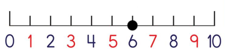

This is true when, and only when, the position of the measurer and the thing being measured share the same context, as the value of 6 is only relative to that context. If we wanted to give the absolute position of the dot, we would need to include the coordinates of where in the universe that dot exists, which would require the coordinates of who-knows-how-many larger contexts it was in when it was measured it … where on the planet, in the solar system, in the galaxy, in the multiverse, and all of those with the dimension of time, as they are all moving, and even then it would only be relative to the Universe as we know it. So, even a simple 1-dimensional dot can have a lot of absolute dimensions.

With that in mind, and limiting ourselves to our 3D reality (we'll come back to the multidimensional stuff very soon), what can we say about *things* that are universally common among all of them? Well, we can say at least the following:

-   All things have (at least) 3 dimensions.

-   All things are made of other things.

-   All things are the most efficient form of that specific thing.

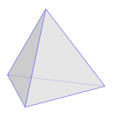This last statement might raise a few eyebrows. The claim here is not that any particular thing is the most efficient form of its perfect archetype, but rather the most efficient form for that particular thing under the conditions it exists in any particular moment. A nearly perfect snowball that begins to melt is clearly not the best expression of the archetype of a sphere, but it is the most energy-efficient form that snowball could take, which it *must* take as energy always seeks the path of least resistance.

If these statements are true, then this would imply that the most primitive thing that can exist, the simplest form possible, is the tetrahedron. Why? Because it is the most efficient form that can exist, it has 3 dimensions, but it is *not* made up of other things because when you remove any one point, it collapses to 2 dimensions, and no *thing* can be 2D. Therefore, it must the very first *thing* to come into existence, at least conceptually speaking.

As a pattern of order, it *is* one of the first to appear. In its most obvious form, we see this structure when we stack spheres on top of one another. If we stack other shapes, the structure will be altered to the degree the shape is not a sphere, but the tendency for all things that are connected to each other will be to form a tetrahedral structure to the degree the shape of the things connected will allow.

If the tetrahedron is the first thing that can be created, this would suggest also that every *thing* that exists is ultimately made of these smallest *things* (conceptually speaking), but that is a radical departure from our current thinking…but, not *that* radical a departure as this is exactly what *Emergence Theory: A Theory of Pixelated
Spacetime”*[38](#ref_038) claims as well (more on that in a moment).

On the Small Side
-----------------

Science has been grappling with the idea of tiny particles for some time. First, we had the grains of sand and dust, then atoms, then electrons, protons, and neutrons, then finally, quarks, which, so far, seem to be the most fundamental layer of matter. The problem is, quarks are “almost” infinitely small, which create all sorts of problems because science has a difficult time with infinity. To solve this, they came up with the idea that reality is made not of really tiny particles, but really tiny vibrating 11-dimensional ‘superstrings.' Unfortunately, for all the evidence they have found to support this theory they might as well have said reality is made up of angels dancing on pinheads.

The quark remains the undefeated champion of tininess, but “almost” infinitely small is not the same as infinity small. How “almost” is it? One 43 billion-billionths of a centimeter (0. 43 x 10−17 meters). Remember that number, 10−17.

On the Big Side
---------------

Jumping to the other end of the scale we have some pretty big things in the universe, the largest we know of being the *Hercules-Corona Borealis Great Wall.* This is a gravitationally bound galactic supercluster about 10 billion light-years wide. That is pretty, pretty big. What could be bigger than that? How about something with 4 dimensions? Would an extra dimension increase the size of something? Well, is a 2x2x2 cube bigger than a 2x2 sheet of paper? What would a 2x2x2x2 cube look like? In the 3D world, it would look like a regular cube, because we can only see 3 of the 4 dimensions, but turn it a little (in 4D space) and the 4D cube will appear as two 3D cubes, or a hexagonal prism, or rhombic dodecahedron, or a cuboid.

Here is what a hypercube (4D cube) looks like when it is rotated and projected onto a 2D space, like a shadow (orthographic projection).

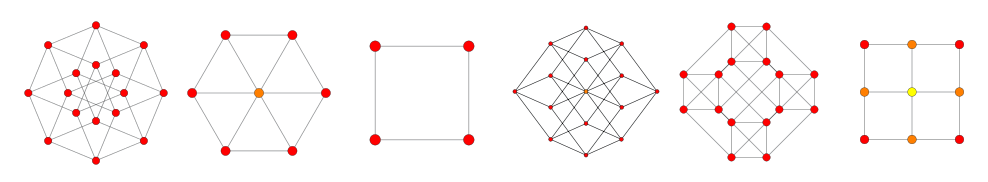

What about something that is 5D, or 6D or 7D? Each one would be bigger by an order of magnitude. How about something that is 248D? That would be very, very big. If something was bigger than the Great Wall in 248D how big would it appear in 3D? About the size of a small travel bag!! OK, you're probably thinking *“248D!? Come on, man. That's ridiculous!”*

Crystal Power
-------------

So, there's this magic 248-dimensional crystal (actually, its 8 dimensional with 248 symmetries, but as an algebraic expression it is considered to have 248 dimensions… at least that is what I am told), called the *E8 crystal*, and this reality of ours is (presumably) but a number of 3D refractions of energy created by the various facets of this crystal that are cast upon the 3D canvas of the void that is our universe from the higher dimensions of magic-crystal-land.

This sounds pretty compatible with the Simulation Hypothesis. I wonder if they know about each other? It also sounds crazy, I know, but, it's a real thing. Just do a search for “*emergence theory tetrahedron”* and *“The theory of everything quantum symmetry E8 lattice”* and browse through the million-plus links that discuss it in painful detail… emphasis on the *painful* part, because most of the content is unintelligible to those not intimately familiar with the algebra of differentiable manifolds, quantum gravity and a bunch of other stuff I don't even know how to reference. However, it's not important to know for our purposes.

It should be stated that this theory is not accepted by all, and some scientists are definitely in the “swarming with worms of heretical perversity” camp regarding magic crystal of reality. I don't have any opinion about Emergence Theory (ET) other that it sounds fascinating, mainly because I am not qualified to have an opinion. The only reason it is being mentioned is because ET supports many of the claims that are made here, which were arrived at with no knowledge of ET.

This E8 lattice (that's its technical name, also called a *quasicrystal*, but *magic crystal* sounds much cooler) seems to be able to describe all sorts of things: space-time (both types, Minkowski and Kaluza-Klein versions. Yes, we have two types of space-time, because it's always better to have options), fermion particles, gravity, subspace, dark matter, quarks, positrons, neutrinos, Fibonacci relationships, and a bunch of other stuff, including ‘ghost particles' (which are really, really old neutrinos that were created during the big bang 15 billion years ago and have no charge, no mass and do not interact with any of the forces that form matter…so, just like regular ghosts, but really small).

Here is a page from a paper[39](#ref_039) that describes the E8 lattice.

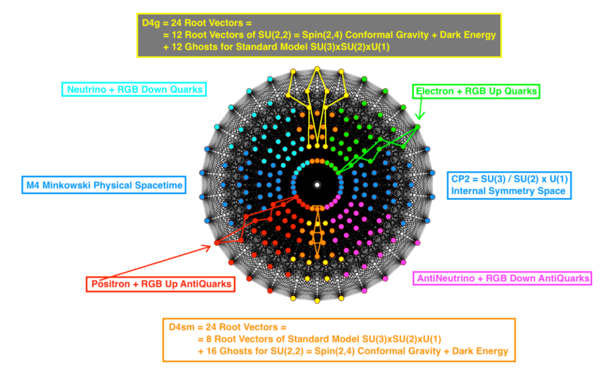

As you can see, the whole space-time part of the E8 lattice is just a small part of one of the 3D projections of an 8D slice of a 248D super-thing, leading one to wonder what other forms of reality it has the magic power to create.

The most significant aspect of *Emergence Theory* (for us) is their claim that…

> …all of reality is made of information. What is information? Information is meaning conveyed by symbols. Languages and codes are groups of such symbols that convey meaning. The various possible arrangements of these symbols are governed by
> rules.[40](#ref_040)

Here are a couple of beautiful images of the countless faces of the magic E8 crystal to ponder.[41](#ref_041)

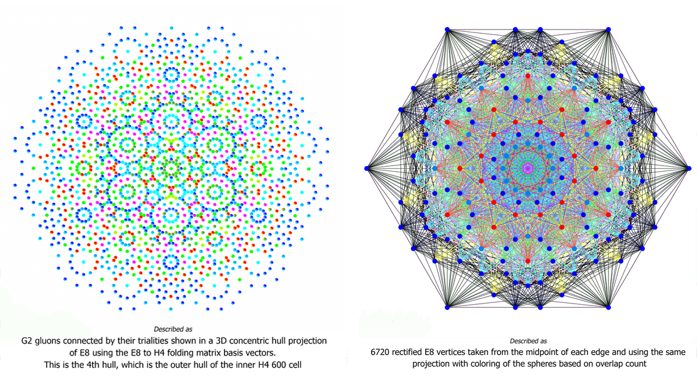

Just as a fun comparison, check out the following cymatic patterns.

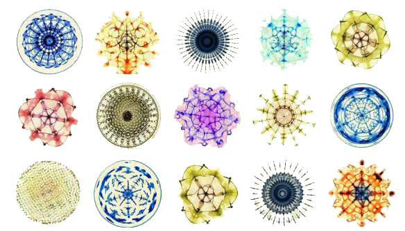

The E8 crystal of *quantum symmetry* and *emergence theory* hypothesize that all matter is a projection of countless “pixels” that are really, really small tetrahedrons, each about 1.61 x 10-35 meters in size. Remember the size of a quark, 10-17? This is a *lot* smaller.

It might sound like this is mixing apples and multidimensional oranges, using definitions from *emergence theory* on one side of the scale, and definitions from *quantum symmetry* on the other side, but both of these theories integrate quantum mechanics, general and special relativity, the standard model and other mainstream physics theories to form a complete, fundamental picture of a universe unfolding from implicity to explicity. The main difference between these two models is that the *E8 Crystal* describes the mechanics of creation, while the *emergence theory* attempts to describe the syntax of its operation using the language of geometry.

#### **Claim 39:** Geometry and mathematics are the language of archetypes. 

Here we have a duality that encompasses the entire spectrum of 3D reality, at least. On one end, the *alphahedron*, which is the smallest structure theoretically possible, that being the tetrahedron, and on the other end, the *omegahedron*, the most complex physical structure in existence, which currently seems to be the 248D-ish crystal.

The Structure of Knowledge
--------------------------

How does this relate in any way to holarchies?

Subatomic particles are structured energy, atoms are structured particles, and molecules are structured atoms.

Information is structured data, knowledge is structured information, and ideas are structured knowledge.

#### **Claim 40:** The concept of a thing and the thing itself are the same things on two different level of order. 

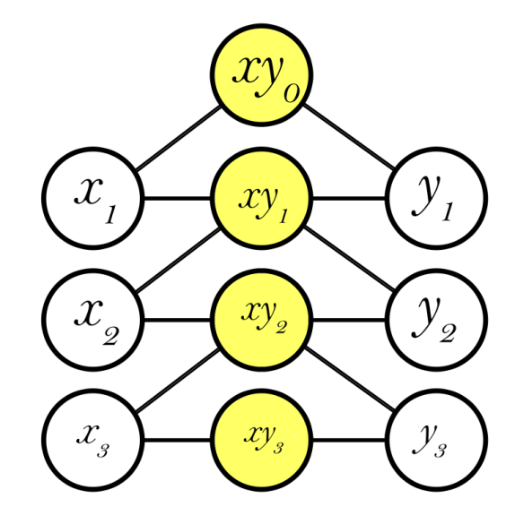Both of these scopes of matter and ideas represent how a form of pure energy in its chaotic state is converted into order using the same laws as they apply to the relevant contexts of their scope. In one case energy is ordered and expressed as matter and in the latter case as concepts. This is how it relates to holarchies, as holarchies can map not only the naturally occurring hierarchy of the concepts of *reality* (atoms, plants, people, etc.) but also the concept of *concepts* (domains of science, religions, culture, etc.).

If we applied our ideas regarding duality to the holarchy it would look something like this graph: We start with a concept (*xy0*), followed by its thesis (*y1*), which creates its antithesis (*x1*). Within this duality arises the synthesis that acts as the seed for a new concept (*xy1*). The holarchy can only accommodate the yellow (gray, if viewing in b&w) concepts as it has no model of a concept being born within a duality.

This graph only shows one instance per duality, but there could be many, many instances for each duality, the occurrence of which conform to the Bell curves as defined by the *xn* and *yn* limits of each new pair.

Some readers might recognize this graph as looking very similar to the mystical Kabbalah, the Tree of Life, as it is also called, that has its roots in ancient Sumer.

There was no intention to arrive at such a comparison, but these similarities naturally arise whenever we are using reason to explain how reality works. Any system that has order will follow a pattern, and we can see these same patterns over and over again, from the electron to the galaxy, from flowers to computer networking. Our explanations of how realities work, whether we believe it was created by God in six days, or it's all a very sophisticated holographic projection, will have the same patterns of reasoning, albeit with different interpretations of the significance of those patterns.

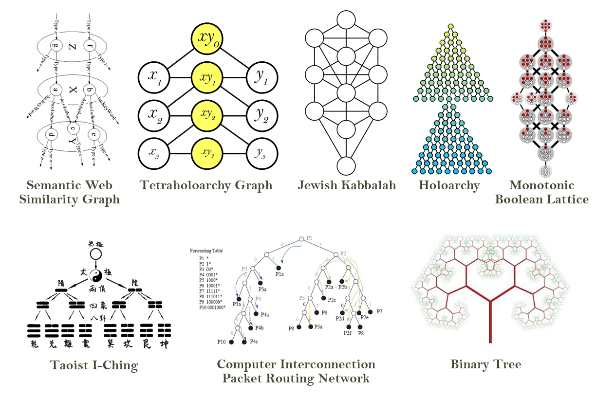

Knowledge by any other name
---------------------------

We tend to think that ancient ideas were not based in science, at least in the way we describe that word today. This is partly true, in that we had not yet discovered the laws of nature to the degree, or in the manner, we now have, but we can find incredibly sophisticated reasoning and logic in some ancient ideas.

Take two examples mentioned above, the Taoist I-Ching and the Jewish Kabbalah. Both of these philosophies are based on the same concept of a reality that exists in a duality. While the Kabbalah is a top-down model of creation that describes 32 archetypes made up of 10 archetypal states of existence with 22 archetypes of energy that connect these states, the I-Ching is a fractally bifurcated whole of 10 pairs of balanced states and 22 pairs of imbalanced states that describe 32 pairs of archetypal states of the Tao.

Both are descriptions of the same thing as seen through the contextual cultural lens of understanding.

The story of the I Ching and Gottfried Wilhelm von Leibniz, the inventor of differential and integral calculus, is a fascinating story that exemplifies this. It's a bit of an aside, but it's relevant and worth the read.

### Leibniz

When the Jesuits, reputed to be the intellectuals among Christian missionaries, traveled to China, they were fascinated by the I-Ching. So much so that they brought it back to Europe in the late 1600s. It was here that Leibniz saw the I-Ching and claimed it to be sent by
God.[42](#ref_042)

Just prior to seeing the I-Ching, Leibniz had developed (discovered?) a number system that he considered sacred. It was the binary system of 0s and 1s, much like the Yin/Yang of the I-Ching. It was of no practical use to anyone at the time, but that was not why he developed it. Leibniz, a very pious man, thought that if all values could be expressed in terms of only something and nothing, on and off, yes and no, positive and negative, etc., then truly, this would be the language of life, for, as he thought, God the Creator was represented as 1, while the void was represented as 0.

At the same time, he was inventing this *divine math* meant to explore the hidden secrets of reality, he was inventing the first mechanical calculator suitable not only for addition and subtraction but for multiplication as well. His dream was to make a logical thinking
device.[43](#ref_043)

Leibniz was creating tools for exoteric and esoteric understanding, both based on the same logic, but giving two very different answers.

Some years later, in the middle of the 20th century, a group of modern-day holy men from the western world (called scientists), were building the first digital computer. To synopsize the entire digital revolution into one paragraph, imagine one of these gurus saying: “I've got an idea. Let's develop a component that will act as a conductor when a certain amount of voltage is passed through it, and an insulator when no voltage is passed through it. We will call this component a ‘gate'. Because this gate can only respond to one of two states, high or low voltage, yes or no, so to speak, which represents the most basic principles of reasoning, we will call it a ‘logic gate.' Any problem that can be reduced into so many yes-or-no conditions can be calculated by these logic gates. We can use the numbers 1 and 0 to represent these states. Because the heart of these electronic machines will be made up of these yes-or-no circuits, we will call them ‘*digital circuits.”* … and the digital computer as we know it today was invented.

If Leibniz was alive today to see his sacred binary math of 1s and 0s being used to usher in the greatest transformation of knowledge ever known to Man he would recognize it as both a tool of practical use as well as a tool of great esoteric potential, a key to the secret knowledge he was looking for.

This story of Leibniz's divine math as well as his simultaneous discovery of calculus, which was shared with Isaac Newton, lends some credence to the hypothesis that ideas are the leading expressions of the same forces that brought life, the universe and everything into being, and as such, they have a life of their own and their own intelligence. We like to think we come up with ideas, but perhaps this is no truer than a flower ‘deciding' to change colors when exposed to more light, or a river ‘deciding' to change course because the wolf population has
increased.[44](#ref_044)

Although currently not a mainstream theory, the understanding that Ideas are more like expressions of living intelligences that we have a symbiotic relationship with is currently alive and well, and has been around for thousands of years. Traditionally these forms of intelligence and intention were anthropomorphized into deities, angels, demons, spirits, etc., and it was understood that we use them for our purposes, noble and otherwise, and they use us for their purposes, noble or otherwise. Today we have new, evidenced based hypotheses of this same concept in the forms of panpsychism, morphic fields, collective (un)consciousness, Universal mind, etc.

From a one perspective, all forms of life are simply instances of various Ideas.

One of the fundamental differences in how similar concepts evolve over time is in what and how structure is applied to the idea. Take for example the idea of the biblical creation story vs. reality-as-a-simulation hypothesis. We can see by their similarity that they are clearly the same concept, but one filtered and defined through the belief structures of Judeo-Christian doctrine and the other through the stricture of reason that is modern science.

The above was a somewhat circuitous route to get to this point of looking at the most fundamental structure of knowledge that is not only the basis of reason but the basis of existence as well.

### Language

In the realm of ideas, the most important tool that man has deployed has been language. Language transmits the reasoning behind ideas; it is how ideas evolve, how they are destroyed and how they defend themselves (which, according to Dawkins, they do, as he explains in his book “The Selfish Gene”). As such, we would expect to see language embedded with the same structure as that of ideas and concepts.

Humans are sort of stuck with the language we have been using for thousands of years, and if we were to (and when we do) invent a new language today it would look radically different.

In 1968, Aristid Lindenmayer, a Hungarian theoretical biologist, and botanist at the University of Utrecht designed a symbolic language call *L-system* that incorporated various symbols that were bound by a set of rules. He developed this language as a way to model and describe the behavior of plants and a variety of other organisms[45](#ref_045). The philosophy and architecture of the language were based on the observed logic of growth, i.e. life. Not coincidently, this language describes self-similar systems. This is the language of the future, but sadly, only for our digital offspring, at least not until we do some major rewiring upstairs.

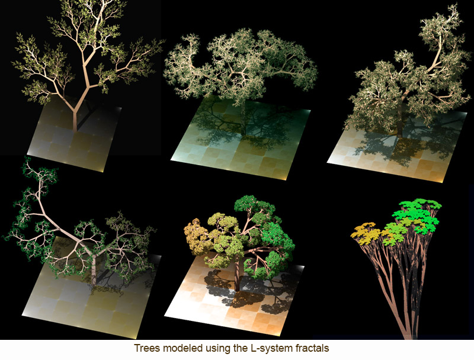

Still, human language is surprisingly efficient and still manages to function with the same structure that naturally exists in ideas and concepts. Its efficiency is not so much in how language itself evolved, but our brain's ability to apply context and instantly run through many interpretations of words and sentence structure until it finds the most applicable interpretation.

Take the following sentence:

*I can't untie that knot with one hand.*

The meanings of words, their order, the context of who is speaking and where they are, and many other details, come into play to turn that sentence into information in our head.

But language itself is messy. Were language more structured we might say this sentence as

Not \[I \[Able \[\[\[Make \[Not \[Tied\]\]\] \[That knot\]\] \[With One Hand\]\]\]\]

There is such a language which was developed to specifically optimize the transmissions of concepts. It's called
*Ithkuil*[46](#ref_046).

In Ithkuil, you can say “On the contrary, I think it may turn out that this rugged mountain range trails off at some point.” in the following manner:

I doubt we'll be adopting this any time soon.

### Semantics

Regardless of the language, they all depend on semantics. Semantics is the branch of linguistics and logic concerned with meaning, but there are two kinds of meaning, according to the Theory of
Meaning[47](#ref_047). The first kind is the more common definition of semantics.

> The description of possible languages or grammars as abstract semantic systems whereby symbols are associated with aspects of the world. (a more objective view)

The second kind is more relative.

> The description of the psychological and sociological facts whereby a particular one of these abstract semantic systems is the one used by a person or population. (contextual relevance)

The *semantic web* is an Internet based project that applies these concepts in an attempt to define what information is in a manner that is structured so that computers can read data and know if it is information and more importantly, why it is information. It does this by creating a relationship (called a predicate) between two things (called objects).

Take the example of the following sentence:

“Bob is interested in the Mona Lisa.”

To a human, this is information because we know how to parse this sentence into meaning. That is what learning to speak is all about. To a computer, however, it is just a meaningless collection of 1s and 0s.

If we break this sentence up into three parts and define each part in a way that software can understand, then a computer can attempt to find meaning in it. For example, we can tell the computer that we have two “things”, “*Bob”* and “*Mona Lisa”*, and one “relationship”, “*is interested in”*.

With these three data points, three “atoms” or data, we have the simplest form of information, an information “molecule”, so to speak. The “things” are called *objects*, and the “relationship” is called a *predicate*. Together they are called a *triplet*. We may have some other triplets about Bob, such as, he is a person, he is a friend of Alice, etc.… and we can bind these triplets together quite naturally.

Predicates can be just about anything… “lives in”, “has a”, “enjoys”, etc. Objects, however, are part of much larger, more structured hierarchies, much like the holarchies above.

We can graph the previous sentence as well in something like the following:

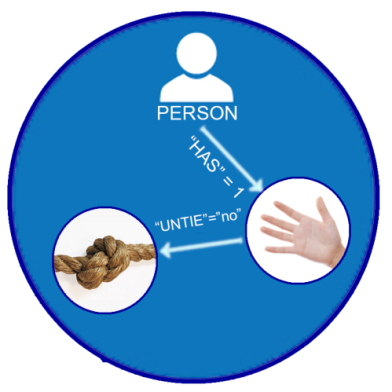

How does a computer know what *is interested in* or what a *person* is? It doesn't “know” the way you or I know, but it does know that a *person* is a type of *agent*, has a *family name*, a *first name* and that a person *knows things*. So, as far as a computer is concerned, a person is just a dataset with a bunch of specific properties and relationship to other
datasets.[48](#ref_048) These definitions and relationships are defined in a hierarchical manner and are called *ontologies*. There are thousands of these ontologies of definitions run by corporations, governments, individuals, schools, the military, etc., that cover an incredible array of data in areas of geography, life sciences, linguistics, media, social networking, medicine, catfish, diseases, road-maps, accommodations in Tuscany, etc.… and they can all talk to each other by linking *triplets*
together*.*[49](#ref_049)

As you can imagine, very quickly a computer can create millions of connections.

With all these connections, we can ask the computer typical questions like “*How many romantic comedy Hollywood movies are directed by a person who is born in a city that has an average temperature above 15 degrees?*” Of course, social media companies, who have their own data that they aggressively collect from their users, can ask questions like “*Give me a list of all the boys who are eligible to vote in the next election, and who listen to a certain type of music and have friends and family that are of a certain political persuasion.*” More worrying are the queries of the near future, such as “*Tell me all the names of people that are likely to commit a crime in the next week.*” That may sound like paranoia about a dystopian future, but AI systems in China have an 80% success rate in predicting who is a criminal just by looking at them. At Stanford University they have developed AI that has a 91% accuracy rate of determining if you are gay or straight[50](#ref_050)… and that is just the beginning.

The point of this is simply to show that knowledge and information are based on not only concepts of things, but also concepts of how those things relate to one another. This may seem ridiculously obvious to the reader, but some of its implications may not seem so obvious, as we'll see later on.

#### **Claim 40:** Information has a structure, data does not. 

#### **Claim 41:** Information must relate to something. 

Supply Chain
------------

Here is a real-world example of a current project that is being developed with economists, world leaders, and investors that attempts to model the supply chain in a holistic manner in order to show how environmentally sustainable solutions are more profitable over the long term, and how small details along the chain can have global consequences.

The project started out with reams of data from every sector of the economy, every mode of transport and delivery, distribution, allocations, etc., etc. It was little more than a random pile of data. The researchers sifted through this data looking for patterns, relationships, dependencies, etc. What eventually emerged were sets of conceptual ‘triplets' with their corresponding instances and the relationships and rules that existed between them. The researchers had no knowledge of holarchies, yet what they developed was quite similar.

Here is some information taken from this project that describes the relationship between *resources*, *location*, and *sector* using the instances of *water*, *Argentina*, and *agriculture*.

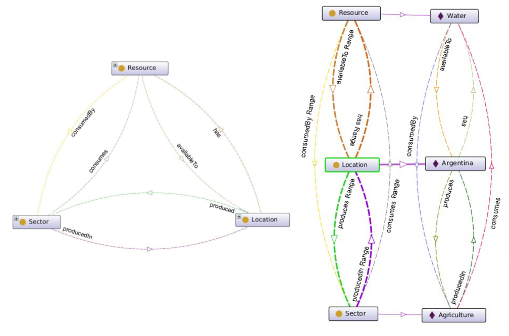

When modeling all elements of the supply chain they ended up with the following visual representation of the model, with each color representing one of the three concepts that define each context or level. For example, one of the sets of three circles represents resources-location-sector level, with a real-world dataset of *water-Argentina-agriculture*. Within one of the inner circles, such as agriculture, is information about *product-production-transport*, such as *tomatoes-kilos/yr-import/export*, etc., etc. In the end, they were able to calculate the environmental, economic, and social impact that one potato had at every stage of its journey from a spud on the farm to the garbage bin at a restaurant.

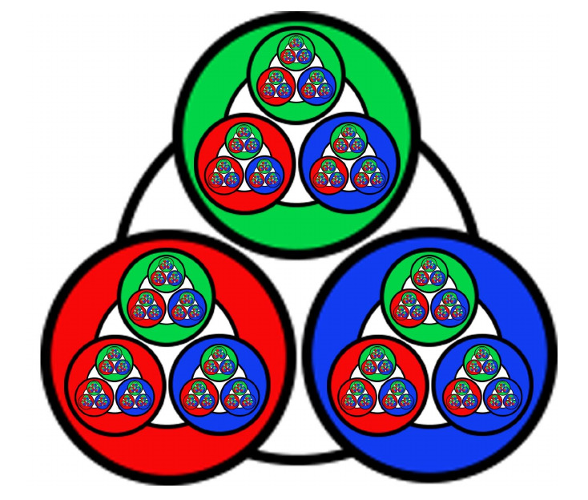

You can clearly see the triplet and holarchic design of this representation of the supply chain. This would be expected if you considered a supply chain as a large-scale version of a living system.

Law of Laws
-----------

Earlier we used Newton's 2nd law as an example to show how one law has many contexts, but Newton's 2nd is only one of the three laws of *Newton's laws of Motion*. These Laws are:

1.  Every object in a state of uniform motion will remain in that state of motion unless an external force acts on it.

2.  Force equals mass times acceleration

3.  For every action there is an equal and opposite reaction.

These are not simply three isolated laws, but rather three attributes of a greater phenomenon that describes all matter.

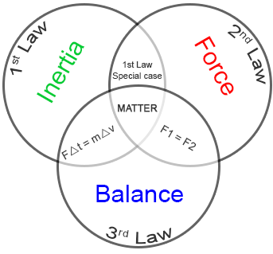

*(Later we show why these laws should be in the order of \#3 first, followed by \#1 and then \#2).*

Reduction
---------

By now you have probably noticed a pattern, that being; everything is reduced to a set of three axes. This is not arbitrary as we claim that any system can be reduced to, and described by, a collection of *information primitives* which are called triplets (trigrams). *Knowledge primitives* are structured information primitives and are tetrahedral in concept. Furthermore, we claim that these three primitives are essentially three different perspectives of one hyper-dimensional state that can only be expressed as multiple space-time states. An example of this is how the hyper-dimensional state of electricity (which itself is only one expression of energy out of many) is expressed as four space-time states of volts, ohms, amps, and power, with any three capable of describing the fourth. These 3+1 primitives are represented as a tetrahedron or tholon.

Info-atoms
----------

If our premise is that the smallest element of knowledge must conform to the same laws as the smallest elements of form, conceptually speaking, then we need to show how these 2D models, such as the holarchy, fit into a not just a 3D model, but specifically tetrahedral structures that represent “knowledge molecules” with a ordered self-similar hierarchy where each holon is represented as a tetrahedral of information.

Our revised model of hierarchical tetrahedrons will surely look and act differently than a holarchy. To avoid confusion, we'll refer these *tetrahedron holons* as *tholons* (for obvious reasons), and the holarchy and as *thologram* (a combination of *tholon* and *hologram*).

#### **Claim 41:** Every tholon is an archetype. 

We are working from the premise that everything that exists is a product of a stable pattern existing between different states. The simplest concept of such a duality is that of *something* and *nothing*. In the realm of ideas and form, this is very easy to imagine. OK, maybe the idea of a void of absolute nothingness is a bit much to grasp. As for *something,* we don't need to imagine something that represents everything at once, which is not only beyond our ability, but as everything that yet to come into existence, it is impossible. On the contrary, we only need to imagine the simplest form of something, for example, a singular dot. A simple dot on a blank page is a diagram of the model on which this reality, and all knowledge, is based.

This simplest of concepts explains the holarchy, tetrahedrons, magic crystals, all the laws of physics and every form of intelligence in existence.

### Geometry I

The simplest way we can describe this process of emergence from a dot to everything in existence also happens to be the most effective way, and that is with the language of geometry.

> “Philosophy \[nature\] is written in that great book whichever is before our eyes -- I mean the universe -- but we cannot understand it if we do not first learn the language and grasp the symbols in which it is written. The book is written in mathematical language, and the symbols are triangles, circles, and other geometrical figures, without whose help it is impossible to comprehend a single word of it; without which one wanders in vain through a dark labyrinth.”

##### \~Galileo Galilee, 1564-1642

> “It is the glory of geometry that from so few principles, fetched from without, it is able to accomplish so much. "

##### \~Sir Isaac Newton

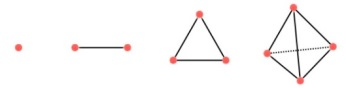We are taught that the progression from point to tetrahedron follows a very clear and simple path of point → line → trigram → tetrahedron.

From the tholonic perspective, this is a very incomplete description because it considers any point to be just like any other point, but they are not the same, as each point has very different attributes. If we ignore those attributes, we are blind to what geometry can show us about so much more than shapes.

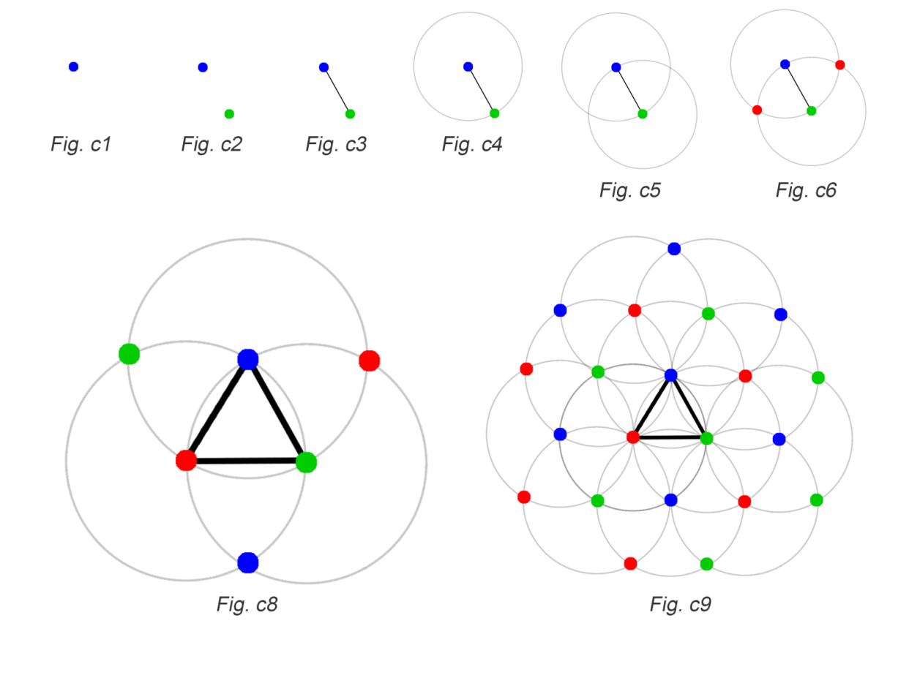

We start with a 0-dimensional *dot* (0 dimensions because nothing yet exists) represented by a blue dot in the middle of nothing *(Fig. c1)*. Because it is 0 dimensions and surrounded by nothing, it only exists as a concept of *something*. It has no form, no dimensions, no properties other than that it is a *concept* of *something* that exists. But where does it exist? It can't be measured, seen, or interacted with in any way, so how can we say it even exists? This dot exists only as a concept, which means it only exists because of the awareness of its existence. The only difference between a void of nothingness and a void of nothingness with an imaginary point in it is the idea of an imaginary point in a void of nothingness. Without the awareness of its existence, the void of nothingness would simply remain a void of nothingness.

This next step requires some philosophical conjecture because we have to ask why/how does a 2nd (green), dot appear *(Fig. c2).*

If we accept the premise that everything that is created has the attributes of, and limitations of, whatever created it, then, the answer is clear and simple. As this lone imaginary dot in the middle of infinite nothingness only exists as an awareness of the concept of a point in the middle of infinite nothingness, the attribute this point *can* have is … awareness.

There is one more attribute it has as well that is far less obvious, and that is *intention*, because whatever awareness conceived of a point in nothingness had to have the intention to conceive if it. So, our point in the middle of infinite nothingness has two attributes; awareness and intention.

This may sound like we're teetering on the edge of mysticism, but this is not our goal. We simply are following the most reasonable path that our ability to understand our reality allows. The fact that it shows that all of existence is a form of awareness that is ever becoming aware of itself is not mysticism, it is reality. Science is slowly beginning to consider that there might be a relationship between awareness and reality, but at some point, it will be common knowledge that awareness is not only the fabric of reality, but it is also the energy that drives all of creation and the most powerful energy in existence.

#### **Claim XX:** The tholonic definition of energy is “the balancing of an ever bifurcating awareness in accordance with the laws of duality.”

So, our first dot has two attributes, awareness and intention, and one limitation of 0-dimensions. This dot then is itself a form of awareness and being so, it will be aware of the existence of *dotness*, not *its dotness*, just *a dotness*. Just as the awareness of a conceptual point created the first dot, the first dot's awareness of dotness is what creates the 2nd (green) dot, and in doing so, creates the 1st instance of a dimension. With two dots, we now have a relationship between them as shown by a line *(Fig. c3)*.

Each of these dots is aware of *its* dotness now, not just *a* dotness, because, with the existence of the other dot, each dot now has a center of its awareness *(Fig. c4)*, and the other dot defining its opposite and the limits of its awareness *(Fig. c5)*.

As both dots are aware of their own dotness and of the other's dotness they are also aware of where these two opposite awareness's interact. These points of intersecting awareness are the (red) 3rd dot and 4th dot.

We use the colors of blue, green and red to symbolize the attributes of these dots. Here they are described and listed in their order of instantiation.

|||
|-----|------------------------------------------------------------------------------------------------------------------------------------------------------------------------------------------------------------------------------------------------------------------------------------------------------------------------------------|
|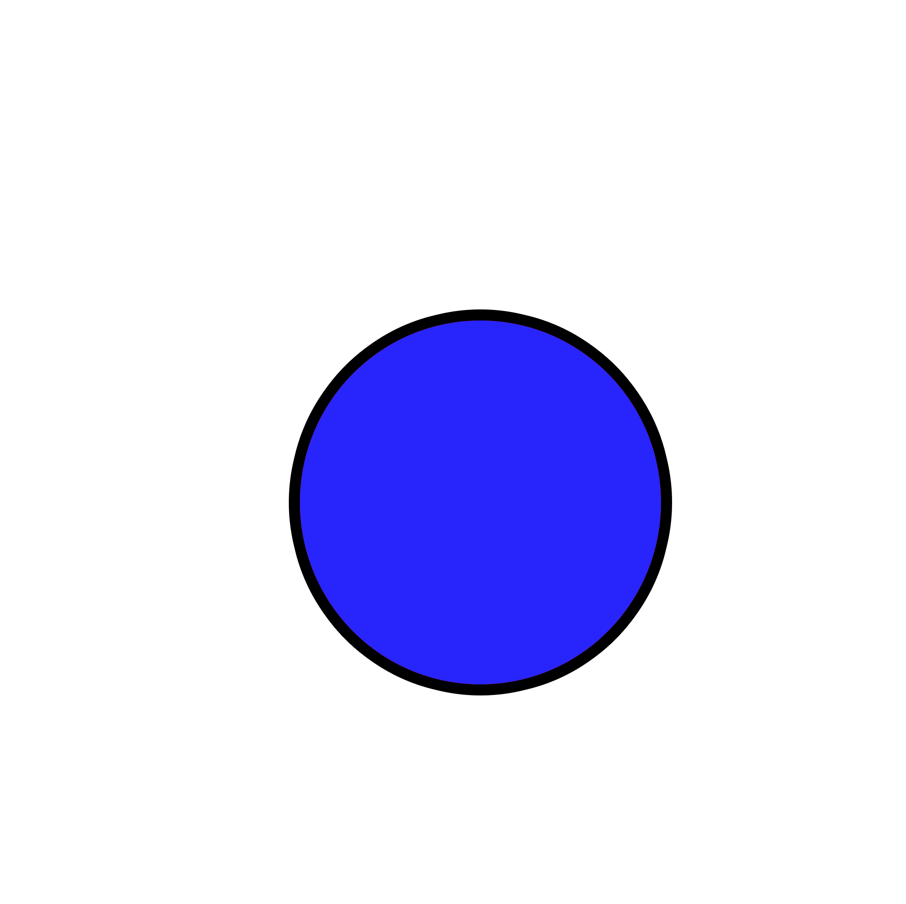| The 1st dot. The blue dot represents the initial or parent dot that has no ability to create dimension and exists only as a concept of awareness. This is the dot that defines the simplest form of existence.. |
|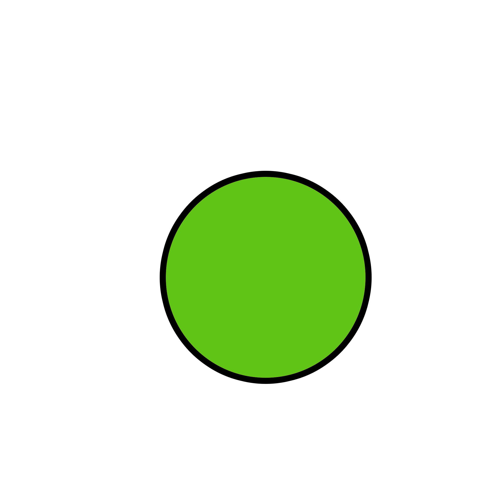| The 2nd dot. The 2nd green dot represents the first-generation dot created by the blue dot. This dot can add 1 dimension a 0-dimension and defines separation and division. This dot also defines the idea of self-awareness as a result of a state of awareness with respect to another state of awareness. |
|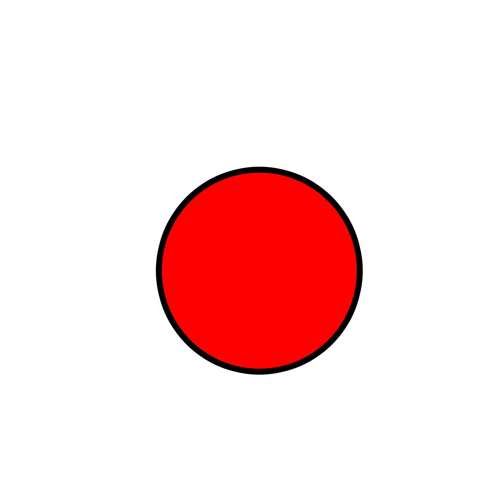| The 3rd dot. The red dots represent where the blue dot and the green dot connect. These are always created in pairs and represent the opposite states of blue dot-green dot interactions. This dot can add 1 dimension to an existing 1-dimensional space and defines scope and area as a result of the union.|

Now a perfect trigram exists, but so do three others. It seems we can't make just one trigram without three additional trigrams instantly coming into existence, and this applies to the additional trigrams as well. Instantly we have an infinite loop of self-similarity. From the tholonic perspective, the instantiation of this concept of instant expansion was experienced when an atom-sized point representing all matter in existence instantly expanded to fill the universe, at least according to the Big Bang Theory.

This ever-expanding conceptual model, however, is imprisoned in the 2D world forever because even though it can make an infinite number of 2D dots, it cannot make a new 3D dot. Why can't the same process that was used to create 2D from 1D be used to create 3D from 2D, by just creating another dot with another dimension?

The reason is as follows: There can only be three types of dots in the 2D world because that is the minimum number of dots required to define an area. If we added a new 4th type of dot that was also constrained to the 2D world, whatever area it creates could be defined using three dots just as well, so, this 4th dot adds no new information and is useless. We need a completely new type of dot that is compatible with all three types of dots.

Not surprisingly, the trigrams have already given us the answer with the following two clues. The first clue is that the creation of one trigram implies the creation of three additional opposite or mirror image trigrams, each one connected to each side of the center trigram. The second clue is that for each of these new mirror trigrams a new dot is created. These three new dots at the outer edge of the new trigrams are each of a different color. As every trigram must be composed of three unique dots (R, G, and B), and as a new type of dot capable of creating a 3D tetrahedron from the trigram would automatically create three new trigrams, whatever dot type this new dot is, it would have to act as a red dot to the blue-green pair of the original trigram, a blue dot to the green-red pair, and a green dot to the red-blur pair.

Looking at *Fig. c8* we see that these are exactly the types of dots that have been created; one blue, one green and one red. All we need to do to combine these three dots together in a new dot, and *viola*, we have a new dot type that can create the 3rd dimension.

The RGB  or White dot represents the combination of all three primary dots. This dot can add 1 dimension to 2-dimensions and defines volumes as a result of the union of three unique trigrams.

We now have a tetrahedron.

We can easily demonstrate this by simply folding the three mirrored trigrams up until their three points meet. The folding occurs naturally because it represents the most balanced and efficient interaction between a set of four unique dots (R, G, B, W), and as energy will always travel the path of least resistance, folding would naturally occur.

Holons to Tholons
-----------------

Let's apply some of the semantic concepts to the holarchy as it will shed more light on the nature of information and how a holarchy forms a network of trinities in the way these holons interact with one another.

We begin with a simple trigram.

According to the authors, each holon has three functions:

-   Contributes (upwards relationship)

-   Negotiates (sideways relationship)

-   Defines (below relationship)

*For the record, the original definitions, and the ones used by Velikovsky in his work were “A holon looks up for what it needs to integrate with, looks sideways for what it needs to compete &/or cooperate with, looks down for what it needs to control.” These definitions were modified in the tholon not only to reflect a more holistic type of relationship but also because these updated definitions were more in line with real-world test cases.*

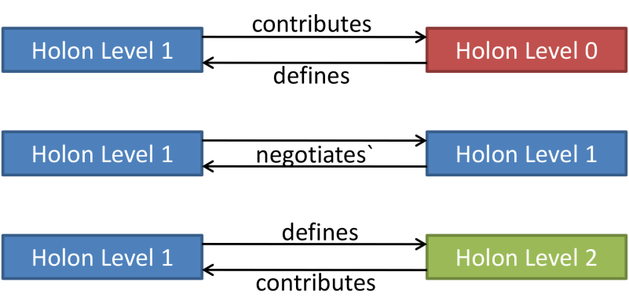

These attributes hold up quite well when compared to our real-world example of a supply chain.

-   Production (what it contributes)

-   Trade (negotiations, cooperation or competition, exchange of resources)

-   Consumption (limits, or definitions, of resources)

You can also easily see how the above relationships can be described semantically as two objects (the holons) that have a relationship with via a predicates *define, contribute,* and *negotiate*.

To further give this idea a test run, let's apply this to something completely arbitrary, such as batteries.

We can also visually represent the relationships in the following manner, which allows us to easily map this to a trigram:

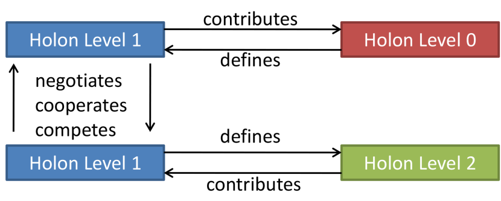

Tholograms
----------

### Geometry II

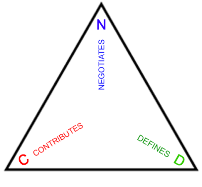Let's take these three relationship attributes of **C**ontributes, **N**egotiates, and **D**efines (which we'll shorten to just C, N, and D) and map them to the three points of a trigram.

How do we know what attribute maps to what point? Further on we will show a more complete argument, but for now we can simply say if we have a parent, a child and a peer, as we do in both the holarchy and thologram, the parent would be the 1st point, the child the 2nd point, and the peer the 3rd point, as shown in the figure on the right.

Why are we just mapping the relationship properties? Here's why:

In the holarchy, the *types of elements* are Parent, Peer, or Child, and the properties of **C**ontributes, **N**egotiates and **D**efines describe the relationships between these types. Our trigram is defined by the *properties* of the holons (*Fig. t2 below*), not the types of holons. We could have just as easily defined a trigram of the *types of elements* alone, as shown below (*Fig. t1*). In fact, this is typically how hierarchies are organized. In our case, however, we are using the properties, not the types, because the movement of energy is in these property archetypes, not in the elements themselves, which are the expressions of these properties.

Although we are using this idea of energy and movement as the foundations of reality, this is not a new idea. The *Reciprocal System theory* is built on the same premise and provides the best explanation of why we are using the movement of energy in the relationships and not the contexts of where that energy is coming from or going to.

> The thesis of the Reciprocal System, however, is that the universe is not a universe of matter, but a universe of motion, one in which the basic reality is motion, and all entities—photons, particles, atoms, fields, forces, and all forms of energy—are merely manifestations of
> motion.[51](#ref_051)

Like every theory, it has its fans, but also its critics. In any case, it applies perfectly here.

Newton's Laws of Motion are similar in this regard, as the laws of motion describe the energy that relates to mass, not mass itself. Because of this we can show a direct relationship between these tholonic concept and Newton's laws:

**Newton's 3rd law states** “*For every action there is an equal and opposite reaction.*” This equates to **Balance.** No mass energy is defined here, just as no dimension in defined in the 1st dot. This law only describes the result of existing energies acting against each other, associating it with the 1st “blue dot” realm of **Negotiation**.

**Newton's 2nd law states** *“Force equals mass times acceleration.”* F**orce** is the result of time and space (acceleration and mass), so it is within the realm of the 3rd “red dot”, scope and area, and tholonically is within the realm of **Contribution**, as it creates a new concept that describes the movement of energy, that being force, which is unlike balance, being the result of energies interacting, and inertia, being the restrictions on mass without energy.

**Newton's 1st law states** *“Every object in a state of uniform motion will remain in that state of motion unless an external force acts on it.”* This law introduces the concept of an instance of mass, putting in the realm of the 2nd “green dot”, and its limitations. Its inability to move or change without an external forcing acting upon it puts it in the tholonic realm of **Definition.**

Tholonically speaking, Newton's Law of Motions should be in the following order:

1.  *For every action there is an equal and opposite reaction (Newton's 3rd law)*

2.  *Every object in a state of uniform motion will remain in that state of motion unless an external force acts on it. (Newton's 1st law)*

3.  *Force equals mass times acceleration (Newton's 2nd law)*

#### **Claim 42:** Relationships define the function and purpose of any instance

The primary reason why the properties are the key points in a thologram rather than the elements, as in the holarchy, is because it is the properties that are consistent at every level of creation. There may be millions of instances of things within the holarchy, from subatomic elements to universal elements, and everything in between, but the properties are always the same, even though they are expressed differently for each context. Therefore, it is the properties that define the structure of the hierarchy, not the elements.

These properties direct energy, energy has movement, and movement has direction. In this example the direction is clear, however, this direction could change under different circumstances as we'll see later on.

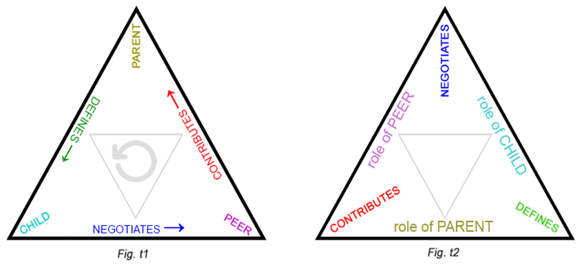

To further illustrate this point, we can use the semantic example above where we show “Alice *is a friend of* Bob.” The thologram model looks at *is a friend of* as the energetic force that defines Alice and Bob, at least within this narrow context of *friendship*. Without relationships Alive and Bob would not even exist, as these relationships define every interaction down to the atomic level.

Now that we have mapped the three properties of N, C, and D onto a trigram we can see and label a new class of attributes that are the result of these properties interacting with each other. For example, what would we expect to see across a spectrum that is defined at one end as Negotiation, and at the opposite end, Definition? In the context of human interactions (just to keep it simple and clear), this pretty much describes how we agree on laws, rules, and limits. Across the spectrum of Definition and Contributions, we would see how existing systems and new systems get along with each other, which would be some form of cooperation or conflict. On the spectrum of Contribution and Negotiation, we would see some sort of value returned to the society or culture, perhaps in the forms of fealty, dedication, or service (*Fig. t3*).

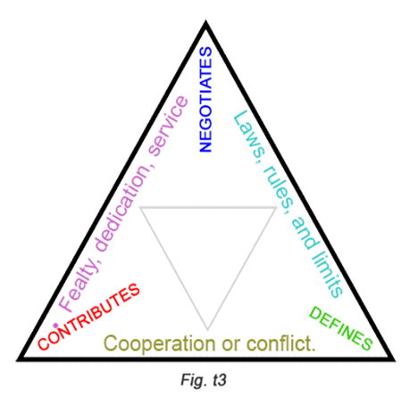

For the purposes of demonstration, we'll use these ideas going forward, but keep in mind these are just a few archetypal examples out of many, and only limited to one context. Across different contexts, they would be described differently.

-   **Laws, rules, and limits** resulting from *Negotiation and Definition*.

-   **Cooperation of conflict** resulting from *Definition and Contribution*.

-   **Fealty, dedication, service** resulting from *Contribution and Negotiation*.

It is important to note that in the first example when we used the three points of Parent, Child, and Peer, these elements are static, and their relationships of Negotiation, Definition, and Contribution are dynamic. Now when we use Negotiation, Definition, and Contribution as the three points, the relations between them is once again static. Were we to go further and use the three new static concepts as points we would again have relationships that were dynamic. This reversing back and forth between static and dynamic with each generation is a natural consequence of the creative process, as will see in more detail a bit further down.

#### **Claim 43**: Static instances form dynamic relationships. Dynamic relationships form static instances

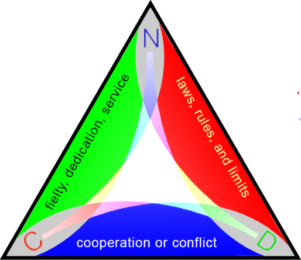Here we show the three points of N, D, and C as color sources that instantiate on the scopes, or lines, opposite them. Think of each point as ever-expanding light that illuminates the ‘wall' opposite it. This is a much more complete idea of a tholon as it shows the tholonic concept as the sum of all the attributes (exemplified by the white trigram in the middle), with the points as archetypes, and the lines as the field, zone or scope of where new types of archetypes can emerge from.

We now have a completed trigram that describes the movement of energy in the process of creation. What would be the simplest instance of this trigram? Most likely it would be something like an atom, the first instance of matter, with a neutral (N), positive (C), and negative (D) particle. This is the description of hydrogen, the very first atom created, with one neutron, one proton, and one electron, the most abundant element in the universe and 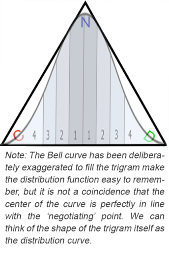from which every other element that exists is created from. On the biological level, this describes mitosis, the process of cell duplication, or reproduction, where one cell gives rise to two genetically identical daughter cells. In the realm of philosophy, we have the Hegelian Dialectic of thesis, antithesis, and synthesis. In fact, for a tholonic concept to exist as a potentially viable and sustainable expression it must satisfy a form of the Hegelian Dialectic, in that it must support a thesis (D), antithesis (C), and synthesis (N).

We can learn a number of things from this trigram, but the one detail that is important before moving on is that the N-point is the originating point. This point represents a state of patterned energy that is sustainable and capable of propagating itself. We call this an N-state or an N-source.

### House of Mirrors

The tholographic claim is that within the trigram there is energy, and therefore movement, and therefore patterns and oscillations from which stable states will arise that are sustainable enough to form a new N-state that is capable of transferring energy across the scope defined by C and D. Even though one particular state will exist at one specific point on the 1-dimensional line between C and D, all possible states will cover the entire range between C and D. We can generally guess where along the line various states will arise by applying a Bell curve between C and D, as shown.

We can now say this about the trigram and its properties:

-   **N** (negotiation) equates to the 1st blue dot, which is the awareness of a concept in its simplest form.

-   **D** (definition) equates to the 2nd green dot, which introduced limitation, division, and separation.

-   **C** (contribution) equates to the 3rd red dot, which, with the previous two dots, resulted in unification and form.

By these descriptions, we can state as a general process that defines creations is something like:

> The successful joining of contrasting concepts (Negotiation) finding expression in form (Contribution) through limitation, division, and separation (Definition).

At the most abstract levels, this describes the Big Bang Theory, biological reproduction, the laws of physics, philosophy, and anything else that exists in any sort of duality. Of course, this definition is so broad that it is easy to apply it to anything.

### Inner, not Outer

We have seen how the creation of a single trigram will automatically create addition trigrams as part of the same creative process, so where are all those additional trigrams? If the first trigram represents the first moment of creation and its limits of total somethingness and total nothingness, then everything that follows must exist *within* the first trigram, not outside of it. The result is contrary to *Fig. c9*, which shows the ever outwardly expanding self-similarity. The model presented here would require that newly created self-similar trigrams must exist *within* the boundaries of the first trigram.

This is the same process of how the addition of a green dot automatically created two opposing red dots that defined the limits of the blue dot. Here we are only showing the central trigram, but for every trigram shown, there is an opposite or mirror trigram created as well.

When trigrams are created inside a trigram, something else happens… two additional N points are created. This will become a very important detail shortly.

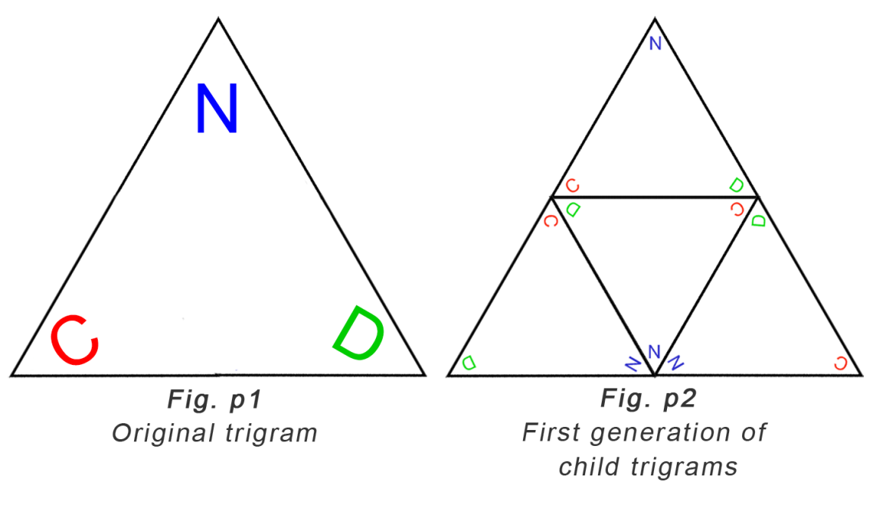

In this example diagram *Fig. p1* above, the outermost N, D, C points represent the first trigram. You'll see in *Fig. p2* on the CD line of this parent trigram a new state was formed, N. It naturally bifurcates and expands in the same manner as its parent until it reaches its limits of the boundaries of the parent and in doing so creates two additional trigrams.

You may also notice what looks like an inconsistency in the order of the letters. *In Fig. p1,* the parent trigram, the order is (clockwise) NDC, but the three points of the resulting trigram are NCD. It's not actually a reordering, as the children trigrams represent completely new creations. The original NDC is still there in the parent, but we are only looking at the children in *Fig. p2*. The reason the children have a different order is because the new generation was spawned by the new N-source between C and D, and as D is always the first to follow N, and always on the left of N (left is arbitrary, but we need to remain consistent), the newly spawned D will appear on the opposite side of the parent's D. The same applies to C. Not coincidently, this new top trigram has the exact same order and position of the parent. The parent always creates a smaller replica of itself in each generation. You'll also notice that each of the outer trigrams is a mirrored copy of the one central trigram.

We started with one trigram, created one more, resulting in 4 trigrams. Each generation of self-similar creation increases the number of trigrams by 4. Here is what the generations look like.

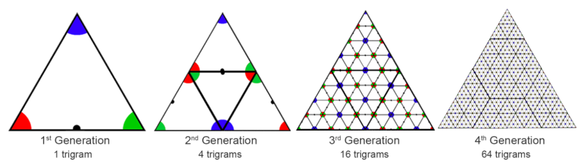

In the 1st generation of a simple trigram, we see a few fundamental rules, such as:

-   All sides are of equal length

-   Every point is connected to every other point.

-   Two points define a line, three points define a trigram. (seems super obvious now, but wait…)

-   The area of the trigram is known.  _**(**SQRT(num-of- sides)/(num-of-sides+1)**)** x length-of-side2_

-   The radius of the incircle is exactly half the radius of the circumcircle

-   The end-point where any two lines meet is always the middle of the line formed by the two adjacent points.

-   The total number of degrees of the angles equals half the total degrees of a circle. This is especially significant later.

We also see a few other interesting details, such as, how the contribution of red divides the green (on the right side). Can we say the same thing for how green is what divided the red, such as it appears on the left side? No, because there is an order to the points of blue > green > red, so green existed *before* red, therefore the introduction of the 3rd red point must divide the already existing 2nd green point. Likewise, the green's boundaries are defined and limited by the red (on the left side) using the same logic that the green came first and the red followed.

In the world of mathematics, this is similar to something called a *Sierpinski Triangle*, which is also a self-similar triangle. This is significant as the Sierpinski Triangle has many real-world applications, such as broadband antennas, musical composition, mathematics, chemistry and is a foundational pattern in nature.

The difference between the thologram and the Sierpinski Triangle is in the latter the concept of a triangle is considered at a separate object that is always upright, so when it is duplicated there is a triangular ‘hole' in the middle where no triangle exists … like this:

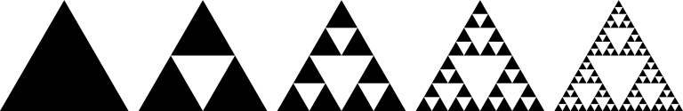

In the thologram, we consider the triangle not as an object, but as the boundaries that constrain the movement of energy. The fact that the center trigram is a mirror of the three outer trigrams is evidence of the significance of this inner trigram. One way to think about the thologram is the boundaries are like one-way mirrors, reflecting the light (energy) within the triangle, but allowing the light from outside to enter. This difference between the thologram and the Sierpinski Triangle is only conceptual because the math is essentially the same, but the thologram considers the negative or empty space just as valid as the filled space, just with different attributes.

With each generation, we have more and more rules. In just a few generations we see two dominant patterns begin to emerge from these rules. The first one being the Fibonacci sequence, which emerges simply by the linear increase in generation count as well as the number of trigrams for each generation (1,4,16…), which is always 4^generation.

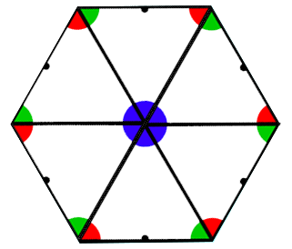The second dominant pattern is the hexagon, one of nature's most persistent and useful shapes, and can be seen in beehives, Saturn's north pole, dragonfly eyes, rocks, bubbles, snowflakes, organic chemistry, etc., etc., but it is much more than just that. We are also shown how the N-sources converge to form the center every hexagon. From this, we get a much better idea as to the nature of N-sources, which are, unsurprisingly, at the center of order. This is important because it gives us an insight into answering the question “Where did the first N-source come from?”

We also see that every *Define* or *Contribute* point is naturally paired with its opposite.

Another interesting observation are those little black dots in the middle of the lines. Why are they important?

Those black dots mark the center of a line that has the capability of creating new children (stable patterns), or N-sources. You'll notice that those lines only exist on the outer ring of the hexagon.

As we saw earlier, the N-source (blue) is the progenitor of the subsequent D (green) and C (red) dots. We also know that the N must always precede the D and C. However, D and C, having all the attributes of the N, can create a new version of N. N and D cannot create a new N because it does not have the attributes of C (form), nor can N and C create a new N as it does not have the attributes of D (definition). N and D cannot create a C, nor can N and C create a D, because only N-states can be created as N-states have no form or dimension. An N-state is simply an idea or concept.

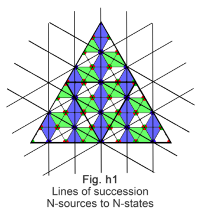This is a very important detail because it means that even though archetypes can appear across the NC and ND spectrums, they cannot create children, so no N-state will ever appear across these spectrums. However, the CD spectrum, which is the axis of *cooperation* or *conflict*, the opposing side to the point of *negotiation*, can create N-states*.* It may appear as though that would limit all the new N-states to only exist on one side of the trigrams, considering only one side of the trigram has the ability to create new N-sources. This is not the case, because as the trigram self-replicates it naturally rotates 60 degrees with each iteration, allowing every side of the trigram to be able to generate new N-sources. The graph on the right shows the lines connecting the N-states and their respective black dots.

### Everything Begins with Trigram

Just as every element in the periodic table is formed from hydrogen, so too is every generation of the thologram formed from the trigram.

A curious observations is if you take the simplest material version of the trigram (hydrogen) and the simplest material version of the hexagon (carbon), the two most fundamental forms in the thologram, and combine them you happen to get hydrocarbons, the most fundamental building blocks of life (and a bunch of plastic stuff). Is it more reasonable to see this as a recurring pattern or to call it a coincidence?

We can also apply the same associative reasoning to the thologram as a whole to show how its structure appears as a pattern of growth in nature.

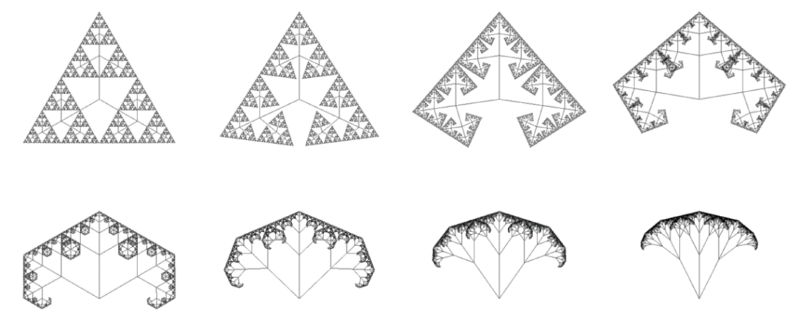

Here we are using the Sierpinski triangle which does not show the ‘negative space' of the thologram but simply a blank space. In the thologram, this blank space is just as full of implicit patterns as the positive space is of with explicit patterns. More on this shortly.

There is no question that the natural processes of creation for nature follow these patterns, and with a little shift in perspective, for the natural process of creation for ideas as well when we apply this pattern to relationships rather than objects.

So far all we have described is a 2D trigram. Where is the 3D tetrahedron? Remember, the 2D trigrams *are* the 3D tetrahedron, only flat. What happens when we convert this 2D model to 3D?

### 2D to 3D

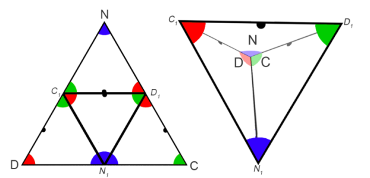If we take the parent trigrams and fold it according to its four children, we get a tetrahedron. This is a complete tholon or *tholonic structure*. Tholonic structures naturally occur because they are more efficient as a 3D object than a 2D map, and they are the most stable and complete state of all the properties involved.

This tetrahedral structure is fundamental to the fabric of our reality and as such we predict that it should act as an efficient receiver or transmitter or energy, among other things. Indeed, such devices have been built that are commonly used in multiband interactions. This class of antennas is called *harmonic Sierpinski gasket antennas*, or *entropy and fractal antennas*. In addition, some rather ‘fringe' research is being done that purports to be able to take advantage of the harmonic quality of these tetrahedral structures to draw (not generate… more like induction) energy from existing fields. I am deliberately not adding any references to this research because, to date, there has been no research that bears up to scrutiny enough to share, however, simply that it is being researched is very exciting.

The implication of this transformation from 2D to 3D is significant, for if we take our 2D model and turn it into a bunch of connected tetrahedrons of tholonic structures, we get the first instance of a 3D model that, among other things, shows the first instance of oscillation.

Below is a more complete, step-by-step description of this transition from beginning to end.

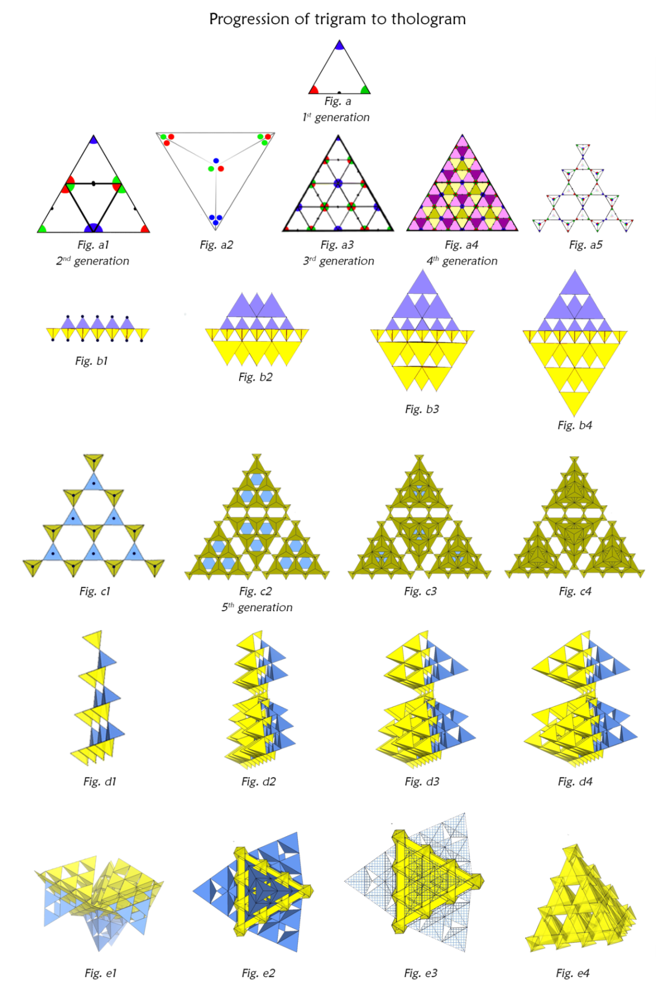

Tholons model the movement of energy, and consider the existence of form as the consequence of that movement. With that in mind, let's look at the tholonic explanation using the figures above.

*Fig. a.* We start with a simple trigram. This defines the most fundamental structure of how instantiations of archetypes come to exist, and therefore the flow of energy and their resulting forms as well.

*Fig a1*. The movement of energy inside this trigram will cause a new trigram to form. This most likely place for this new form is opposite the source of the energy and in the balanced center between the two limiting poles created by the source. When it creates its two children they are naturally in reverse order. We now have four trigrams with their points in their natural order and position.

As was shown above, the arrangement of the colored point (the NDC points) in each outer trigram are the exact mirror image of the center trigram. One way to think about it is the original trigram reflects itself and by doing so creates a new trigram, which also reflects itself in the two new trigrams (left and right). In this way, the center trigram acts like a reflection trigram, and the two new trigrams are a reflection of a reflection. This will be an important point a little later.

Note: We are going to use colors (RGB) rather than types (NDC) because it is easier to explain using colors. You can remember that N = Blue, D = Green, and C = Red, but for the purpose of his descriptions it does not really matter. When it does matter, we will return to NDC labels.

*Fig. a2.* Because energy always follows the path of least resistance and always seeks order, this complete tholon will automatically become a self-sustaining structure (tetrahedron) when all the conditions are met as it would represent the most efficient form. These conditions appear to require 4 types of points; BBB, RGB, RGR, and GRG. Apparently, B points only integrate with themselves and with an R and G together, while the R and G can integrate with each other.

This is the same phenomena that happens when a hydrogen atom and an oxygen atom meet; they naturally form a stable state (which also happens to be a trigram in the case of hydrogen and oxygen) that requires less energy than both of them require to maintain a separate existence. This is another example of the reactions causes by the need to create balance, similar to the hydrochloric acid/sodium hydroxide example mentions previously.

The implication here is that tholonic interactions can also release energy and that tholonic structures *could* be broken or altered by an outside force that has enough energy.

*Fig. a3.* Each of these child trigrams goes through the exact same process as the parent, with slightly different parameters that are determined by the limitation of their parent. We can now see four trigrams of four trigrams in their 2D form.

*Fig. a4.* This is a 4th generation tholon map, and to get an idea how many sets of tetrahedrons it holds the trigrams have been color-coded to make it easy to see. The darker colors represent what will be the base of a tetrahedron, with the light shade of the same colors representing their sides.

You'll notice that there are six sets of trigrams that are yellow (or a lighter shade of gray). These are identified a little differently because when they form a tetrahedron they do so by going in the opposite direction because they are a mirror image. These are an example of the mirror or reflection trigrams previously mentioned.

*Fig. a5.* If we go ahead and form the tetrahedrons now we end up with a series of tetrahedrons connected at the corners, some pointing forward and some pointing away (the more faded ones). You notice that every odd numbers row (1,3,5,7) are all *forward* trigrams, which we'll refer to as *real*, a term taken from the world of holography to indicate that the image is projecting in front of the film. Likewise, all even-numbered rows (2,4,6) all pointing in the opposite direction. We'll call these *virtual* tholons, a term also taken from the world of holography. For every pair of rows (1+2, 3+4, 5+6) there are an equal number of real and virtual tholons.

*Fig. b1.* This is a side view of *Fig. a5*, with the yellow (bottom) tholons being virtual, and the blue (top) tholons being real. The black dots represent the peaks are also shown in *Fig. c1*, for clarity. This is where we see the first instance of oscillation, with the tholons alternating in their movement away from and towards their originating plane, or between the virtual (nothingness?) and real (somethingness?) states.

*Fig b2.* But what is happening in *Fig. b2*? Why are there more tholons stacked on top and on the bottom?

If you managed to slug through this up to this point, congratulations! Here is where it gets interesting… Each of these new trigrams formed by the peaks of the previous children acts as the base for *larger* tholons! The process beginning with *Fig. a1* starts all over for not only each one of these trigrams but for every face of a tholon or trigram, including its children.

If you look at *Fig. c1*, which is the colorized front view of *Fig. a5*, you'll notice that there are alternating sets of real and virtual tholons, and the peaks of these tholons (the black dots) naturally create new trigrams.

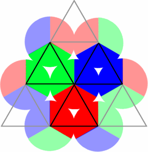In 2nd generation tholons, the peaks are always the 4th dot type of RGB combined (which we'll call *white* dots from here on), so how can a new tholon appear from three white dots? Doesn't it need three different unique colors to satisfy the conditions for a 4th white dot to exist? In fact, that condition *is* satisfied. If we make the RGB/white dots huge for demonstration purposes you can see how the colors line up to create three separate dots of three separate colors, but these 2nd generation dots are composed of three pieces of three dots that are 1/3rd each color.

For clarity's sake, we are referring to each generation of tholon children as *generations,* while the tholons that are created from the peaks of these original tholons, and their children, we refer to as *iterations*.

But wait, didn't the previous iteration have a base of three separate points of R, G, and B? And now it has a base of three white dots? Yes, but the only way to create three peaks of R, G, and B is to first create the opposite condition of three peaks of white dots. With each iteration this pattern reverses itself, so the 3rd iteration will be like the 1st, with bases of RGB (but each one rotated 60 degrees), etc. All the odd number iterations have RGB peaks, and all the even number iterations have white dot peaks. Each iteration builds on the one before it, making larger and larger tholons, as you can see in *Figs. b2, b3, b4*, which shows the progression of real and virtual tholons.

With just 147 generations of four iterations each we end up with more tholons then there are atoms the universe!

Interestingly, the growth pattern of tholons is the inverse of a recursive Fibonacci sequence. Inverse, because we are multiplying instead of dividing, recursive because we do that for each trigram, children of trigrams, children of children of trigrams, etc.

*Fig. c2.* For this figure, because it would be too complicated to show and describe an entire 5th generation view, we are looking at only a small section of a 5th generation view by showing only four 4th generation tholons (like *Fig. b4*).

*Fig. d1, d2, d3*, and *d4* are isometric views of the figures immediately above them.

Fig. d1 shows the first instance of tetrahedrons. This first level is that foundation of all material existence, and as you can see, it looks and acts quite different from iterations that follow (*Fig. d2, d3, d4)*. We believe this first iteration is the domain of element and the quantum world.

There are two details worth mentioning. The first is, you'll notice that in the front view of *Fig. c2* you see the center tholon is a virtual tholon, and behind it, you will see real tholons. This is because just as real tholons can create virtual tholons, virtual tholons can create real tholons. This is where it really starts to sound like a fun-house of mirrors because how can you have real tholons inside virtual tholons? The simple answer is, real tholons in a virtual tholon are real relative to that virtual tholon they are within. These *virtual* real tholons are just as significant as the *real* real tholons because they function in the same manner as a real tholon, but virtually, which allows virtual tholons to be able to ‘reflect' back a real tholon. But, because they are all sourced originally from a virtual holon, they only have virtual significance.

The second detail is, to make things more complicated, in the above figures we have colored all the real tholons yellow (light gray) and the virtual tholons blue (darker gray), but in fact, there are yellows among the blue and blues among the yellows. These were left out for simplicity sake as they were not critically important to demonstrate our point. The basic principle is the same however, in that there is an oscillating between real and virtual at each iteration.

Now we can start to fold this into itself. Each of four the sides that make up a tholon has their own domains of children as well, so this folding process happens at every generation.

*Fig. d4* shows the small portion of a thologram we have built that we will now begin to fold.

*Fig e1* shows the beginning of the folding.

*Fig. e2* shows the completed folding, with all the real tholons now within the parent, and all the virtual tholons outside of the parent. It's interesting how that it naturally happens that only the virtual tholons extend past the boundaries of the hologram.

It looks like we have broken the rules that no children can exist outside of their parent's limits because we have a lot of virtual tholons sticking way outside those limits.

Remember when we were looking at the Sierpinski Fractal? One of the points made was that Sierpinski treated the empty space between the tetrahedrons as empty, wherein the tholon model it is not empty, but rather negative space that is a reflection of the immediate parent, a necessary nothingness to the tetrahedrons somethingness. Now review the observation that this middle trigram, as mentioned above, is a reflection trigram. In one sense it does not exist any more than your reflection in the mirror does not represent the existence of another you, but it does exist in that the reflection is a perfect mirror-image representation of you, and this has significant value. It is an illusion, but an illusion that we need to take seriously.

All the virtual tholons are tholons that were created out of this nothingness space! They are *reflective* tholons only. They do not exist, but they are very important. The virtual tholons are the nothingness complement to the real tholons within the parent through which *their* reflection creates two more real tholons. This does not break the rules that nothing created within the parent can extend past its boundaries any more than looking at yourself in a mirror hanging on the wall does not put you on the other side of the wall, even though it appears that way.

Look at *Fig. a5* again. You'll notice that for every real tholon there is a virtual (reflection) tholon immediately below it. It is because of these virtual reflections that we can generate another iteration of real tholons.

*Fig. e3* shows the ghosts of the virtual tholons, and *Fig. e4* shows only the real tholons folded into their parent tholon.

To get a better perspective of the dynamism of this structure, look at *Fig. f1* below, which shows the lines of influence of each tholon (which is that of a sphere).

If we go inside this very simple version of a thologram we see what looks like complete chaos (*Fig. f2*), but is, in fact, absolute stunningly perfect order and structure.

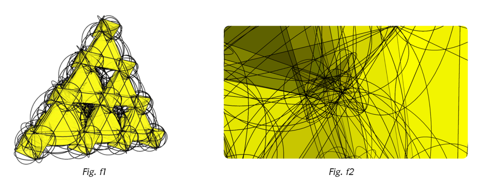

If we had used the simplest thologram possible in our example, using only 1st generation folds, rather than the 3rd generation folds above, it would look like the following:

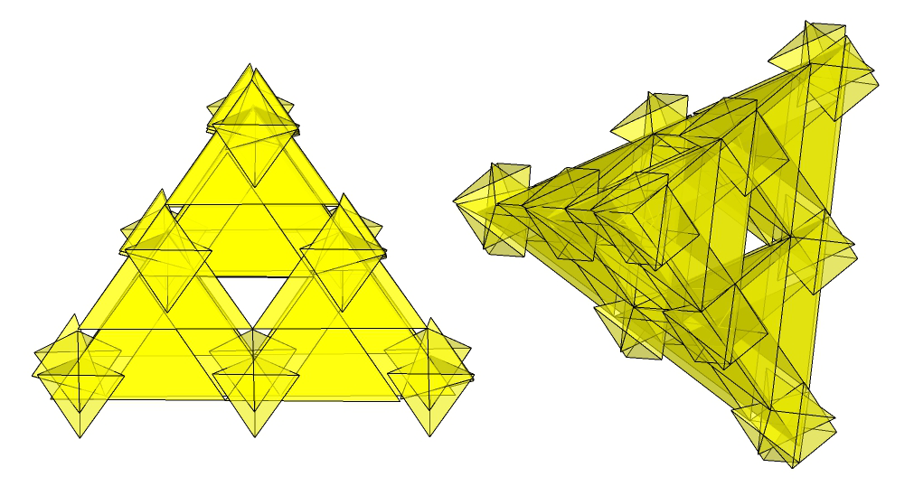

There one last point to consider that is best explained in the following thought exercise: Imagine what you would see if you were a 2D person living in a 2D world and an object passed through your 2D reality. You would see a bunch of 2D slices of that object that changed over time.

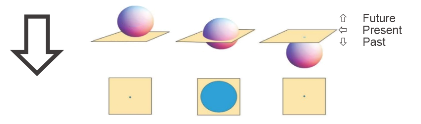
Now imagine you are a 3D person living in a 3D world (which should be pretty easy to do) and a 4D object passes through? You will see 3D ‘slices' of this 3D object over time as it passes through. For example, if a 4D ball passed through a 3D world it would first appear as a very tiny 3D ball, and then grow to a large ball, then shrink to a small ball before disappearing.

In both 2D and 3D cases, you are not getting the whole picture, but in both cases what you are getting is completely true and valid for the context of your reality.

If we were to remove the original collapsed tholons (which represents the elemental and quantum layer of reality) from the model and only look at the iterations that represent the Newtonian material reality we live in, the thologram would look like a perfect tetrahedron, with none of those smaller protrusions that come from the original collapsed tholons.

In the same way as the 4D ball, a 4D thologram, being itself a tetrahedron, would first appear as a small tetrahedron, which is what we, and others, are claiming all realty built from, conceptually at least.

Why is this detail important?

The 3D model of the thologram is a 3D slice of a 4 (or more) dimensional model. What would an 8D or 248D ‘object' appear as in this 3D world? It could appear as many, many different things. Take a look at all the ways a simple 3D tetrahedral pyramid can appear in 2D orthographic projections.

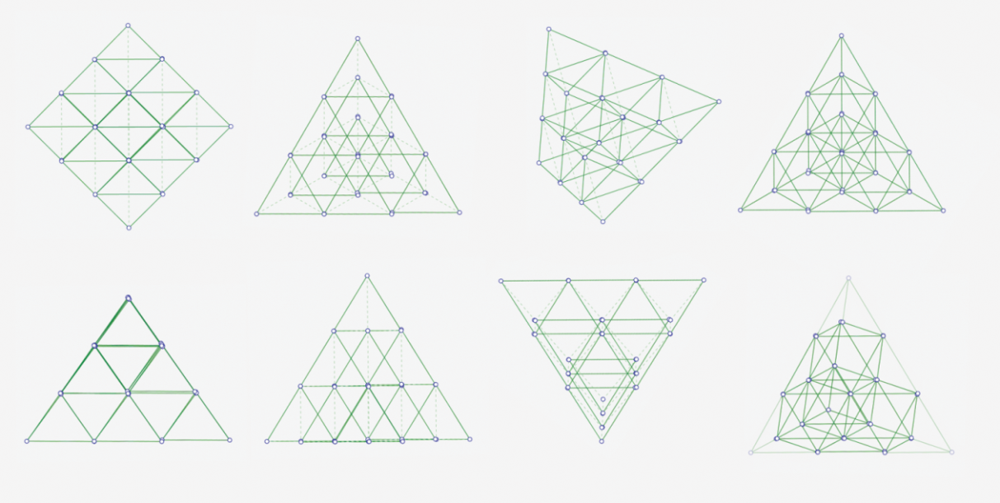

Now imagine the same pyramid with trillions of iterations and many more dimensions! It would have the ability to define or describe every archetype of everything, every idea, every form, that ever has, does or will exist. Its perspectives would effectively be infinite to us, but at its source, it is one thing.

To specify the location of a tholon we have to identify each tholon by an address based on its generation.

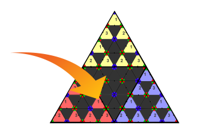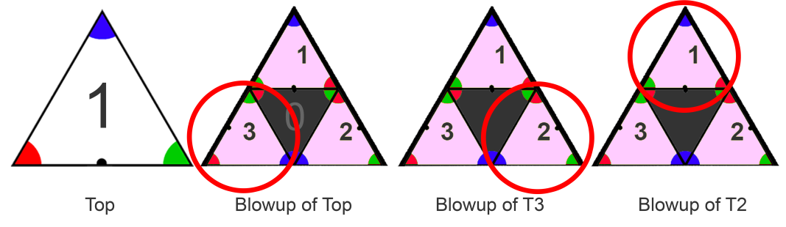

If we wanted to reference the topmost tholon in gen 4 by its base trigram, on the bottom right tholon in gen 3, on the bottom left tholon in gen 2, we would need to say it is at 1,3,2,1. The areas blacked out are virtual tholons which don't really exist (energetically) so we can't navigate to them (even though we can reference them). So, in this example, we need 4 dimensions to define the location of a tholon. At any one tholon's location, there can be multiple instances of tholons consisting of all that tholon's ancestors an descendants. Just saying the location of one tholon could just as easily refer to a subsection of a parent tholons or a group of children tholons. Any dimension would have to record the path taken to arrive at any particular tholon. The reason this is being mentioned is to show that each generation of tholons increases the dimensionality of the thologram by one dimension.

For example, to identify the position (P) of one tholon at the 45th iteration we would need a dimension that looked something like:

***P =**1, 2, 3, 1, 1, 3, 1, 2, 3, 2, 2, 1, 1, 3, 1, 1, 1, 2, 3, 3, 2, 2, 2, 2, 2, 2, 2, 2, 3, 1, 2, 3, 2, 2, 1, 2, 1, 1, 3, 2, 1, 2, 1, 3, 1*

But it's even a bit more involved because this dimension only points to one particular tholon within which is its own 3D space. In the thologram, we can't use a Cartesian coordinate system (i.e. X,Y,Z) because that would require a coordinate system that extends past the boundaries of existence, and we know that there can be no metrics in nothingness. We can only use a *quadray* coordinates (i.e. A,B,C,D) which are based on a tetrahedron, to identify a point within the tholon.

Does this mean that our 3D reality is embedded within a parent 3D reality? According to the thologram, yes, although I have no idea how this can be tested. An analogy we have to the idea of a 3D reality within a 3D reality is VR (virtual reality), where we can create countless 3D worlds within our own 3D reality using our existing 3D VR tools. One can easily imagine how we could create virtual realities within those virtual realities. Another analogy is how a hologram we can create a 3D space from a 2D surface, and there can be many 3D spaces on top of one another recorded in that same 2D surface.

### Synergetics

What some people today call *sacred geometry* our ancestors simply called geometry. Contrary to what we learned in school, geometry is as much a study of philosophy as it is a study of form, space, and mathematics. Plato, Pythagoras, Parmenides, and a number of other great philosophers were well-schooled in geometry, but the marriage of philosophy and geometry goes back even further in history, and across every culture. Take the quadray coordinates system as an example. One could make a case that the Ancient Babylonian base-60 number system was an early version of this idea.

*Synergetics* is a modern-day example of how geometry forms the basis of the structure of creation, life and how everything interacts with each other. Buckminster Fuller coined the term *synergetics* in his three-volume work “*Synergetics. Explorations in the Geometry of Thinking*.”[52](#ref_052), wherein he explains how using a 60-degree coordinates system can explain both physics and chemistry, but more importantly, he believed that it also explained reality. In his words:

> Since physical Universe is entirely energetic, all dimension must be energetic. Synergetics is energetic geometry since it identifies energy with number. Energetic geometry employs 60-degree coordination because that is nature's way to closest-pack spheres.

He explains how the points and the lines of a tetrahedron (60-degree coordinates) describe all elementary phenomena. Moreover, he claims that synergetics can measure our experiences geometrically, and how we can employ geometry regarding both metaphysical and physical knowledge.

The math he proposes is, according to him, based on the reality of empiricism, seeing as that all atoms are made of tetrahedrons, octahedrons, rhombic dodecahedrons, and cubes. Using this synergetic math, we have a coordinate system that works omnirationally, energetically, arithmetically, geometrically, chemically, volumetrically, crystallographically, vectorially, topologically, and energy-quantum-wise.[53](#ref_053)

Within the thologram there are higher-order forms as well that are created by tetrahedrons, such as cubes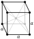, hexagons, tetragons, rhombohedra's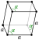, orthorhombics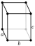, or truncated icosahedrons, 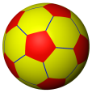which is commonly known as the *Bucky Ball*, or, when in atomic form, *Buckminsterfullerene* (basically, it's a soccer ball).

The thologram, which is based entirely on the tetrahedron and quadray coordinates, is a model of knowledge, thought, and ideas. It's important to remember that the map is not the territory. These models of reality are like maps that describe the terrain. There are elevation maps, density maps, road maps, water maps, contour maps, temperature maps, population maps, economy maps, crime maps, San Francisco even has human feces maps! They all describe the same territory from different perspectives. The thologram is just one template that is a description, so to speak, a language that defines the organization and pattern of all energy at every level.

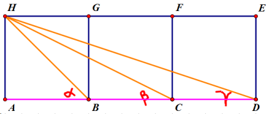There are many alternative ways to map the thologram. What is shown here is just one way. How many ways are there? I don't know, but the extremely simple *three square geometry problem* (what is the total of the angles *α*, *β*, *γ*?) has 54 possible solutions, and that is just with three simple squares (the answer is 90 degrees)!

As you can imagine, there is literally no end to the relationships, patterns, rules, etc., that can be discovered. What separates knowledge from apophenic delusions (apophenia is the tendency to perceive connections and meaning between unrelated things and is considered a sign of early-stage schizophrenia) is whether a relationship, pattern or law can be tested to achieve predictable results.

> It doesn't matter how beautiful your theory is, it doesn't matter how smart you are. If it doesn't agree with experiment, it's wrong.”

##### \~Richard Feynman

We agree, but we also have a broader definition of “experiment.” Life is reasonable by default, otherwise, it would not exist, but it is not always quantifiable, and often incompatible with current science.

OK, that's enough geometry. Let's look at some chemistry.

Application
-----------

### Water

We mentioned above that the first instance of matter would be tetrahedral, at least conceptually, but we also stated that form, being an instantiation of the laws of form, would follow that model, meaning we should expect to see tetrahedral structures as one of the building blocks of reality. And guess what? We do! But with a twist.

The actual first instance of matter are the elements, but no element has a tetrahedral structure when it is isolated. It is the bonds between elements that create the tetrahedral structure. In the tholonic model, the individual elements exist at the first level of the thologram, which are the first tholons created by the folding of the 2D ‘map' and are shown as the numerous and small tetrahedrons upon which ever-larger tetrahedral structures emerge from.

As a result, we would not see any 3D structures until the first iteration that emerges. A single H2O molecule is not a tetrahedron, it is a trigram. Water, however, is tetrahedral. This also supports the claim that elements exist within the first pre-iteration instance of tholons, the very first, and smallest, tetrahedrons, but it also shows that some simple compounds are in this pre-iterations space as well.

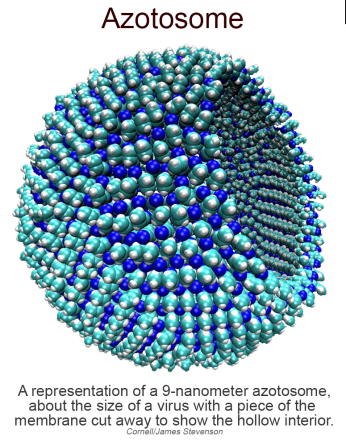Water is a particularly good substance for exploring tholonic structures because it is one of the first, if not *the* first, tetrahedral structure that all life depends on. Another early structure that is tetrahedral as a molecule alone is methane, one the first organic molecules and not just a building block of life on earth, but quite possibly the basis for an entirely different form of life, as pictured in the *Azotosome* on the right, and one we might discover on the Saturn moon of Titan.

In the above geometry, we see that in the first generation of a tholon we have 4 trigrams, 3 of which are descending (downward-pointing trigram) and one is ascending (upward-pointing trigram). If we have two tholons we then have a total of 8 trigrams made up of 6 descending and 2 ascending.

H2O is composed of three atoms. One atom is oxygen, which has an atomic number of 8 as it has 8 protons in its nucleus, which defines how much energy it holds as a ‘charge'. It also supports 8 electrons in its outermost shell, which represents its most balanced state. The other two atoms are hydrogen, the very first instance of Newtonian matter, the kind of matter that makes up physical reality as we know it. It has an atomic number of 1 and has only one proton, one electron, and one neutron. Although oxygen wants 8 electrons in its outer shell, it only has 6, so it naturally forms a bond with two hydrogen atoms by sharing the one electron each hydrogen has to offer.

From a tholonic perspective, oxygen follows the pattern of two 3rd gen tholons from one face of a 2nd gen tholon, which has 6 *real* tholons and 2 *virtual* tholons (*Fig. v1, showing two 3rd gen tholons*). Hydrogen follows the pattern of a complete 2nd gen tholon (*Fig. v2, showing two complete 2nd gen tholons*). Combining these two together (*Fig. v3*) would represent 8 externally-facing points (from the *real* tholons) of interaction and two internally facing points (from the *virtual* tholons) of non-interaction. When combined, the hydrogen tholons will attach to the empty or *virtual* tholons of oxygen.

We can see a few similarities between a tholonic model and a chemical model.

| **Tholon**                                                           | **Atoms**                                                                                                                            | **H2O molecule**          |
|----------------------------------------------------------------------|--------------------------------------------------------------------------------------------------------------------------------------|---------------------------|
| 8 points of interaction represented by the 8 real tholons            | Oxygen has charge of 8 and supports 8 electrons in outer shell for interactions with its surroundings.                               |                           |
| 2 points of non-interaction represented by the 2 virtual tholons     | Oxygen has 2 vacancies in the outer shell (also has 2 electrons filling the inner shell which do not interact with its surroundings) |                           |
| Total of 10 tholons                                                  |                                                                                                                                      | Total atomic charge of 10 |
| Integration of 2 tholon types                                        | Integration of 2 atom types.                                                                                                         |                           |
| 3rd gen tholon structure 4x larger (in count) than 2nd gen structure | 3rd gen structure (O) 42 larger (mass) than 2nd gen structure (H)                                                         |                           |

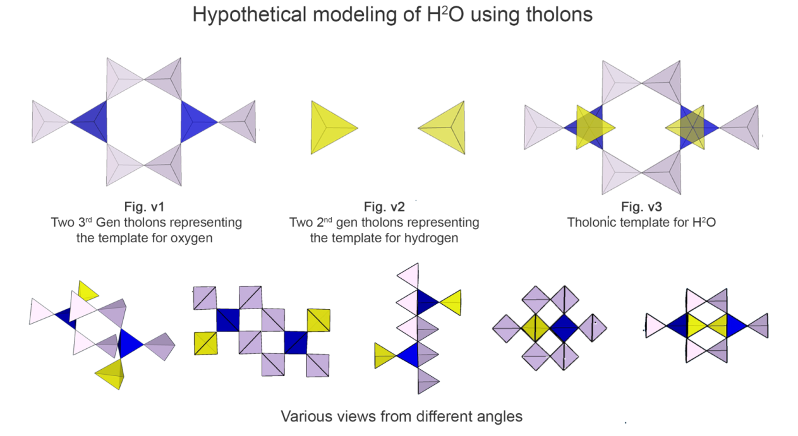

This is just a hypothetical demonstration, as there may be a much better tholonic model for elements and compounds than this one, but this one is sufficient to show how we might be able to describe elements and compounds tholonically, which might give us new insights into their nature. Perhaps this model applies not just to H2O but to any of the Group 6 class of elements, such as Sulfur (creating Hydrogen sulfide, H2S, or selenium, creating Hydrogen selenide, H2Se, or tellurium, creating Hydrogen telluride (tellane), H2Te… you get the picture.

Can we see this similar relationship with other compounds? We claim that you can, as there is an almost infinite number of possible configurations in the thologram. Instances of fundamental configurations, such as those that appear in the earlier stages of iterations, like the Fibonacci sequence and the hexagram, represent extremely stable patterns, and therefore we would expect to see them play a very fundamental part in our reality and could be easily discovered.

### Quarks and Atoms

Another example of this might be that of subatomic particles. (Interesting historical side-note: Richard Feynman, one of the greatest thinkers in modern physics, originally coined the term *parton* to describe a hypothetical particle inside the nucleus of the atom. This was later discovered and called the *quark*.)

Consider that protons have a charge of +1 and are composed of two *up* quarks, which have a charge of +2/3, and *one* down quark, which has a charge of -1/3, and neutrons have a charge of 0 and are composed of one up quark and two down quarks.

This is seen in a single tholon and its reflection tholon as shown in *Fig. q1* and *q1a* below. The upper trigram has a parent trigram at the top which we can assign a value of -1/3, and the two children can be assigned a value of +2/3. The center trigram, which is always a reflection trigram, has a value of 0. The opposite is true for the lower reflection trigram as well. With these values, the upper tholon has a charge of 1 and its reflection tholon has a charge of 0. This also seems to indicate that a truly complete tholon requires two tholons; itself and its reflection tholon.

If we looked at the 2D thologram map which shows these complete tholons of a pair of virtual and real tholons together, we get what is shown in *Fig. q2*. You'll notice this is identical to the previous graph (*Fig. h1*) that shows the lines of succession from N-sources to N-states across all three directions. This would suggest that quarks are an instance of N-states. Given that these pairs and also arranged in three different angles, 60 degrees apart, it would also suggest (remember, I am not a quantum physicist) that there are three classes of quarks.

Neutrons *do* exist, which seems to go against the tholonic idea that the virtual tholons don't create anything, but remember, this thologram is a model of energy and relationships, not of form, so what we would expect to see is some*thing* that has zero energy... like a neutron. And what holds all these subatomic particles together? The *strong nuclear force* (mainly), which is the tholonic equivalent of six integrated N-sources, the blue dot at the center of every hexagram composed of six N-sources, that holds the tholons together.

This is a significant observation. Most of what we have shown here involves how the movement of energy, in accordance to laws, brings form and ideas into existence, yet almost nothing is said about the nature of the energy itself, other than that energy in its purest form is ultimately an expression of awareness and intention. Here we have six N-sources which hold the tholons together to form the centers of all creation. In the quantum world, there is a similar concept of this energy that holds everything together, called *gluons*. Gluons hold quarks together using the *strong nuclear force*. Tholonically speaking it is the laws, described as geometry in the thologram, that hold everything together. The claim then is that gluons are an instance of that law. The other forces that holds things together are electromagnetism, the weak nuclear force, and gravity, all (hypothetically) different instances of the same laws expressed geometrically in the thologram.

Understanding the nature of these forces may well give us an insight into understanding the nature of the source of the energy, which is to say, understanding the nature of awareness and intention.

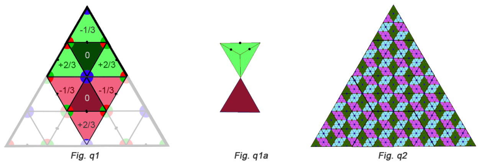

There is also an interesting relationship with the One Electron Theory. This is a theory that theoretical physicist John Wheeler proposed (in a phone call at 2AM in 1940 with Richard Feynman) that there was just one electron in existence, and that all electrons were the same electron! This would be possible if that one electron was not subject to space-time, allowing it to be in all places simultaneously. Wheeler also claimed that not only are all electrons the same electron, but all positrons are also the same electron moving backward in time. As an electron it had a charge of -1, and as a positron it had a charge of +1.

The problem was, there was no space for a positron in the current model of the electron

In order to account for all the electrons in the universe, this one electron would have to move backward in time at least one time less than the number of electrons moving forward. This prerequisite is satisfied as can be seen in the previous diagrams of “progression of trigram to tholon” where there is always one more iteration of real tholons then there is virtual tholons.

If Wheelers idea was correct, then that there should be almost as many positrons in the universe as electrons, but there aren't.

Wheeler suggested that the missing positrons might be hidden within protons. This idea does not work with the current theory that a proton consists of only two up quarks, each with a charge of +2/3, and one down quark with a charge of –1/3 as there is simply no place in the proton where a positron, with a charge of +1, could hide.

However, in the tholonic model, there *is* a place for the positron hide, and that is in the virtual space of a tholon. As was previously mentions, there can be real tholons within virtual tholons. As this virtual space also acts as a reflection for the other three trigrams of a tholon, probably reversing the spin of that positron, it would act as the source positive charge of the *child* tholon.

But what about the electron? Where is that? Tholonically speaking, the electron is a product of the imbalance of this hexagram, as it has a total charge of +1, and therefore it will automatically create an equal and opposite negative charge of -1. Where would this electron exist? At the opposite side of the N-sources across the scope of its children C and D, which is where N-sources manifest as stable expressions, i.e. on the outer most edge of the hexagram. In a complete and folded tholon, these three scopes create the three edges of the outer tholon that is opposite the reflection tholon, represented by the three black dots in *Fig. q1a*. As there are three different directions of these patterns, each 60 degrees apart, there is access to any active interface (which instantiates as an electron) for every angle of the thologram.

### While we're here

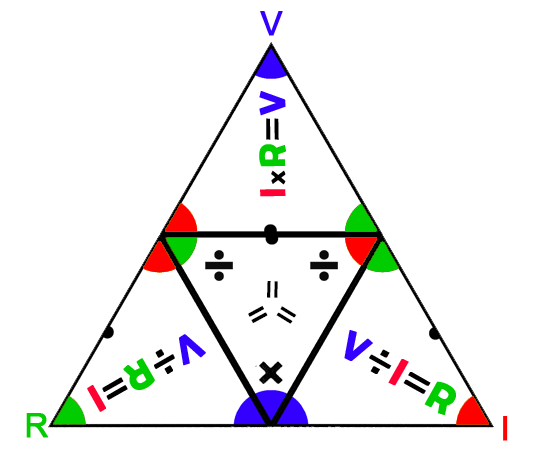This would be a good place to briefly point out other patterns in other systems. For example, Newton's 2nd Law nicely fits into a tholon. Let's use Ohms Law to test it out.

If we replace…

-   N (negotiation) with V (voltage)
-   D (definition) with R (resistance)
-   C (contribution) with I (current)

… we can then state the following:

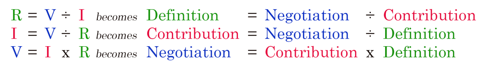

### The Meaning of Math

Before we move on, let's follow up on this concept of how the trigram can describe the math functions of Ohm's law.

What do the math symbols mean in the real world? Addition and subtraction are easy concepts to grasp in the real world. We take so man of one thing and add or remove so many of another thing. A good example of the effects of addition and subtraction is how they affect colors.

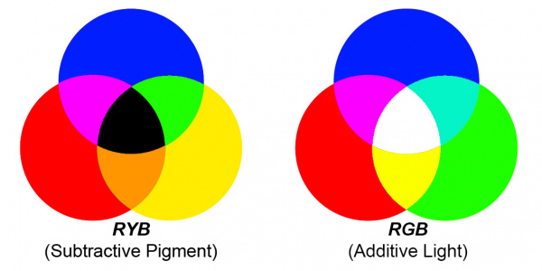

What are multiplication and division then? It is the definition of one property by the units of another. For example, in division, such as *12/4=3, we are stating that* there are 3 units of 4 in a 12. In multiplication, such as *3\*4=12,* we are determining how many units of 4 we are adding together to create 12. The 4, as the divisor or multiplier, becomes the defacto unit of measurement.

As mentioned above, we would expect to see the same laws expressed in different ways across all the scopes that the laws apply to, so we would expect to see an example of Newton's 2nd law in the tholonic realms of society, or planets, or organisms… and we do.

We've seen this applied to electricity but it can apply to more abstract concepts as well. For example, if we claim that a society is a product of its laws (cultural or otherwise), and we also posit that laws are to be measured by ethics, we can say *society = laws / ethics*, which says that the value of *ethics* is by what *laws* should be measured by when evaluating *society*. By the same token, *ethics = laws/society*, which claims that *ethics* can be determined when measuring *laws* by their value to *society*.

You can see that these two examples follow Newton's 2nd law, so what would happen if we applied the other formulas of Newton's 2nd law using these same values? For example, we can determine *power* in the context of *society* (and the initial claims regarding laws and society), which is *power=laws\*society, which states that power is the degree to which society that is enabled by laws?* It is up to the reader to decide if *laws*, *society*, and *ethics*, or concepts like *enabled*, are the best concepts to use here and if so, what the *power* (the rate, over time, at which energy is transferred) represents, and what energy itself represents in this context.

In any case, the twelve formulas of Newton's 2nd show some very interesting relationships between ethics, laws, society, and ‘power', and, in my humble opinion, a new perspective on the dynamics of culture and society that, if nothing else, raises some important questions. As it applies here, it shows how the tholon can describe everything from atoms to culture. Because the math involved in a tholon can be more than the reader might be interested in, the subject is covered more deeply in Appendix D.

With this in mind, let's reexamine the above claims:

**Definition = Negotiation / Contribution**

The definition of something is its boundaries, limits, abilities, attributes, properties, and resources. All of these details are the results of the scope and context of that thing's instance. It could be environmental factors, genetic attributes, planetary limitations, such as size and weight of a thing, energy levels, etc. It is the nature of energy to expand in every way possible. That expansion is the contribution, but it is the resistance from these factors that determines what expansions get the opportunity to be expressed and what expansions are thwarted. That battle between the force of expansion and the force of resistance is the negotiation (*see Negotiation=Contribution\*Definition***)**. As *Definition* is *Negotiation* / *Contribution*, we can say that *Definition* is measured by that which is *Contributed*, or, the *Definition* of something is determined by what is can (sustainably) *Contribute*.

**Contribution = Negotiation / Definition**

What a thing can *Contribute* is measured by its *Definition*, but the degree to which it can contribute is determined by its environment and how it interacts with that environment. That interaction is a result of *Negotiation*. A thing must provide something that something in its environment needs, otherwise what it has to contribute is useless.

**Negotiation = Contribution x Definition**

A thing's ability to find a stable and sustainable position within its environment and scope is determined by the degree to which it can contribute with it current resources. A thing may have a *Definition* that gives it a lot of A and a little of B, but if its environment needs a lot of B and very little A, then it is B that the thing must *Contribute* to ensure its existence in that environment, or it needs to find another environment, or change the environment it is in so that A is in more demand.

You get the point. What's more, we can not only confirm this arrangement using Ohm's Law, but we can now include all twelve relationships of Ohm's Law using a tetrahedron, rather than just the three we can see in a trigram, which is a 2D tholonic map of electricity, as there is no 4th composite ‘white dot' (which would represent *power,* or *watts*). Once we have that power value, we can map all the formulas of Ohm's Law to a complete tholon.

#### **Claim 44:** There is no useless data, only data we have yet to understand how to use. 

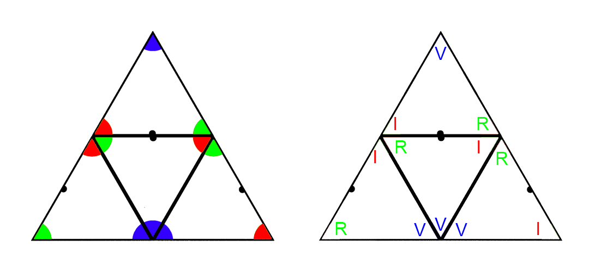

Previously we saw how the contribution of red divides the green on one side (right) but constrains the green on the opposite (left) side. Can we say the same thing for electricity? Does current (I) ‘divide' resistance (R) and is resistance (R) ‘constrained' by current (I)?

We also see how we can apply a mathematical function to each point, with the N-source having the ability to multiply, and the children having the ability to divide.

There are many new ways of looking at energy in all its forms when viewed tholonically.

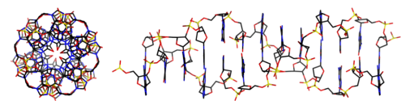

In higher orders, such as DNA, we also see some striking similarities as well, and with a bit of investigation, we can probably find some stunning relationships.

### Coherent Water

A general prediction would be if we could add structure to energy, we would see testable results.

Can we add structure to water in a way that matches the patterns of the thologram (in this case, the hexagram) and see some differences in how it transmits or interacts with energy? If we do see any differences, then we have one piece of potential evidence that supports the thologram model.

As it happens, there is such a thing as *structured water*. Coherent or Structured water, for those who are not familiar with the term, is regular water that has been modified to give it more structure or pattern, specifically in the way that the water molecules are arranged in relation to one another.

If you do a search of “structured water” one of the first results you will get is the Wikipedia entry that begins with “structured water, is a term used in a marketing scam”… and although that is true to the extent that anything can be a scam in the hands of scammers, the entry says nothing whatsoever on the research and testing that has gone into the use of structured water.

To the dogmatically skeptical, anything that challenges the current world view is “swarming with worms of heretical perversity.” It doesn't matter if a new idea, in this case, structured water, has vast amounts of scientific research and support from highly accredited professionals and ample evidence one can find by researching the pioneers and leaders in the field, many with a lifetime of contributions and dozens of Chairs, Fellows, Adjuncts, and Accolades from their life's
work[54](#ref_054), as well as hundreds of papers and dozens of books related to and supporting the structured water phenomena. Skepticism has its place and serves a critical purpose, but regarding structured water, that purpose does not seem to be to move understanding forward or seek new solutions to real-world problems, such as solving global water shortage problems and increasing crop production.

There is quite a lot of good research on the subject that we won't detail here, but if you want to learn more a good place to start is Fabian Ptok's Masters theses *“Alternative Irrigation Methods: Structured Water in the context of a Growing Global Food Crisis due to Water Shortages”*[55](#ref_055), which covers the subject well from an agricultural and security perspective but also has a number of references to the researchers and work going on in this area. There is also a book available online for
free.[56](#ref_056)

Water is a particularly good test medium for the structure of water (not the H2O molecule alone, but many of them together) is a tetrahedron, and being the most basic shape of creation lends itself to many different applications. It's worth noting that when it was originally suggested that water might be tetrahedral is shape back in 1938 the idea was met with disbelief. It was not until 80 years later, in 2013, that this was finally accepted as valid. Today “it is widely accepted that liquid water structure is comprised of two closely interweaved components; i.e. tetrahedral and hexagonal
structures.”[57](#ref_057)

Radical ideas are often met with radical resistance. Structured water is one of those ideas.

Simply by adding some structure to simple tap water (see examples of how to make structured water in the chapter “How to Make Structured Water”, we can see the following effects:

In Ptok's the Master's thesis mentioned above, the author examines various tests that grew different plants using tap water and structured water.

One of his findings was that using structured water increased alfalfa growth by 15.1%.

This may not sound like much, but in the U.S. alone a 15% increase in alfalfa growth represents an additional 20,700,000 tons of alfalfa, which has a value of over 4 billion dollars.

This is a perfect example of how the simple enhancement of order at the most fundamental level can have radical changes up the chain. These dramatic (theoretical) results were achieved with only one change to one element in one application.

In the tholonic modal, this example also applies to ideas, concepts, and intelligence… small changes in one area can have radical consequences in the world of ideas, and of course, ideologies.

Tholonic Intelligence
---------------------

Although there have been many allusions to the idea that awareness is an inherent property of existence, let's make this clear.

If the concept of a thing and the thing itself are two orders of the same form of expression of energy, and order is a prerequisite to intelligence, does this imply that everything with order, i.e. everything that exists, potentially has a form of intelligence? In the tholonic model, yes, but more than that, even without order or intelligence there is awareness *and* intention.

This is not that radical of an idea, as many great thinkers in the past have come to the same conclusion.

> “There is a quality of life and intelligence to all matter. The living universe.”

##### \~Giordano Bruno (1548-1600), cosmological theorist, philosopher, mathematician& poet burned at the stake for the heresy of controversial views.

> “Crystals are living beings at the beginning of creation… In crystals, we have a pure evidence of the existence of a formative life principle, and although in spite of everything we cannot understand the life of crystals - it is still a living being.”

##### \~Nikola Tesla

There is a name for the idea that consciousness is a property of existence; *panpsychism*. You can read about its impressive
history[58](#ref_058) and the glowing support it has received over the last 2,000 years from some of the greats of philosophy, psychology, and science. The minor difference between panpsychism and tholonism is that the latter claims it is awareness and intention, not consciousness, which is the property of existence and from which consciousness and intelligence arise.

Intelligence in this context does not mean “critical thinking” or “self-aware”, but it does mean creativity, learning, and problem-solving, properties that nature, and the universe, has demonstrated with flying colors. We can go further and claim that the amazing relationships in simple geometry, such as the tetrahedron array with its Fibonacci numbers and hexagonal patterns that pretty much define reality are evidence of logic. So, let's add “logic” to the list of properties. What about “planning”? Does nature plan anything or do we all just happen to live in a corner of the Universe that was lucky enough to win the Cosmic Mega-Lotto? We can easily see that the simple relationships between three points instantly define an infinite array for order, pattern, and symmetry on many levels. This isn't just a ‘plan', it is *the* plan.

Is there creativity in the universe? Only if one considers all of creation an act of creativity. Does the universe learn? Well, have things evolved over the past 4.5 billion years? If you answer yes, then we'll add *learning* to the list. What about problem-solving? This is a tricky one, because there is no such thing as a ‘problem' from the perspective of existence, because, as we have covered, if something does not follow the laws it does not exist. If it doesn't follow the laws, it doesn't exist, so where's the problem as far the Universe is concerned? “Problems” appear to be exclusive to humans. Still, the fact that existence is only afforded to that which follows the laws, I would say that this is damn good preemptive problem solving as it prevents problems from ever happening in the first place.

So far, we have:

-   Creativity

-   Learning

-   Problem-solving

-   Logic

-   Planning

Here we have been making the case that ideas themselves are an expression of energy, and as they clearly incorporate and are even defined by all the properties of intelligence listed, it's reasonable to conclude that ideas themselves emerge from a form of intelligence, and may even have their own intelligence.

However, this intelligence is quite different from what we would call human intelligence because of its aggregate nature. It's more of a recursively embedded network of countless decentralized nodes of intelligence.

### Aggregates

One of the attributes of a tholon, unlike its holarchic predecessor, is that the context and scope of a tholon is not only defined by the dualities of that tholon, but also by all the tholons above and below, as the children tholons are always contributing to the parent, and the parents are always defining the children.

#### **Claim 45:** Anything that exists, that has a sustainable pattern of energy, has some form of intelligence and is a contributing element to the larger intelligence that is shared by all existence. 

It is easy to see instances of this on a molecular level, such as how water is an aggregate of hydrogen and oxygen, as the scopes and contexts of the elements are fairly well known.

We have a similar concept in the way our social institutions work. *Interinstitutionality*, as this has been termed, explains how the various institutions of society like financial markets, governments, family structures, educational institutions, etc., all intertwine and create amalgamations and aggregates with one another.

Interinstitutional research is defined as the investigation of the chain of complex, interrelated problems regarding tactics, sampling, data reliability, and notions of causality within the realm of each separate institution with the goal of improving aggregation and
amalgamation.[59](#ref_059)

Take the institution of the modern American family as an example. It can take many forms, but several extra-familial institutions affect the complexion of "family", such as the market, profession, educational institutions, political affiliation, etc. Each of these institutions brings to bear its own forces and logic on the amalgamated and aggregated institution of the "family".

The market shapes perceptions of standards of living in the family. The profession shape ideas of work and service. Educational institutions shape the ideas and direction of society. Politics shapes our understandings of the role and participation of family members.

All institutions of society are not simply autonomous social units isolated from wider institutional dynamics, but rather several structures wrapped up and labeled according to the concept of its purpose, each structure having its own set of rules, scopes, and contexts, forming aggregate and amalgamated rules, scopes, and contexts.

This is equally true for the institution of modern science which is every bit the product of Interinstitutionality as any other single institution. Far from the secular myth of an objective value-free isolated social unit, modern science is itself an amalgamation of a whole host of non-scientific institutional factors such as the market, education, special interests, the state, politics, professions, etc.

### Intelligence

We have a concept of a *human* collective intelligence, but we define it as something that has emerged from human intelligence, as opposed to human intelligence being an instance of an existing collective intelligence.

The tholonic view is that awareness and intention are not only attributes of existence; they are the cause of it, as explained previously. More than that, they are the ultimate, or purest form, of what we call energy, as energy is the balancing of a difference, and all differences come from separation, which is the result of awareness and intention.

#### **Claim 46:** Every archetype has an awareness, an intention, and an intelligence appropriate for its scope. 

On this point, tholonic thinking has coincidentally arrived at the same conclusion recorded 3,000 years ago in the Sanskrit Vedas which states that first there was awareness, then there was consciousness, and because of this, consciousness or intelligence can never be the path to awareness. On the contrary, the path to awareness starts with quieting consciousness, according to the Vedas. This point starts to lead into a philosophical realm, so we'll just leave it at that and let the reader take from there.

However, the tholonic view is that intelligence precedes consciousness. This is fairly compatible with the traditional definition of intelligence as “The ability to learn or understand or to deal with new or trying situations.”

The difference being, in the tholonic model, consciousness is not necessary to learn, understand or deal. We are seeing this today in AI systems that certainly can learn, understand and deal with the challenges before them, but these AI systems are not conscious… yet. Does that mean these AI systems have awareness? Yes, at least to the degree that everything has some level of awareness given that awareness is the source of existence.

The tholonic definition of *intelligence* is slightly different:

> The ability to maintain a sustainable pattern of energy within the scope of its existence.

As patterns come from order, which is the result of energy, and energy is awareness, then by this definition, intelligence is synonymous with “ordered or structured awareness.”

According to this definition, each tholon has its own form, or expression, of intelligence, its own patterns of energy (awareness) that are contextually appropriate for its scope. Rocks, then, have intelligence, as do planets, galaxies, chairs, and even what we would consider garbage. Any concept that satisfies the tholonic requirements to exist has an intelligence. Geometrically speaking, each tetrahedron in the thologram represents an awareness and an intelligence for that tholon.

Because we consider tholonic instances (*things* like trees, humans, and planets) to be the result of these laws and patterns of energy that exist within the tholonic archetype of that instance, we also consider the intelligence of those instances to be an expression of the tholonic intelligence. In modern terms, this would be something like the collective mind of, say, a species, or a community, or even a relationship.

These archetypal intelligences, or collective minds, interact with one another according to the three fundamental relationships as already noted: Negotiation, Definition, and Contribution.

### Cooperation

In short, this describes the Darwinian world of evolution, which is a bottom-up view of these ideas. Take, for example, the amazing relationship between humans and the honeyguide birds. In this symbiotic relationship, the bird tells the humans where the beehives are, the humans go and then collect the honey, leaving the wax and the larva, which is what the birds want.

Think of what s involved in these interactions. The birds know collectively that they have humans to help them. With that knowledge, they go out in search of beehives, which they could not even attempt to gain access to without help, which means at some point some bird had the idea to recruit humans.

When one of them finds a hive, they announce it to their friends and then go and find humans who they know they can enlist, humans who have learned how to communicate with them. The birds hop and chatter is a specific way that humans know is the message that they have found a hive. The humans collect their tools and tell the birds they are ready. The birds then fly toward the hive, knowing to always keep their white tail feathers visible to the humans. When they all arrive at the hive the humans smoke out the bees, chop down the tree, remove the honey and give the rest to the birds. This is a beautiful example of cooperation between two groups that are competing with another group.

What is truly amazing about this arrangement is that the birds and humans have developed their own language[60](#ref_060). Although it is not clear how this arrangement began, it is speculated that it was initiated by the birds when they saw that humans had the ability to make smoke and chop down trees… so a long, long time ago.

Are we being asked to believe that a really smart bird came up with the idea, explained it to his bird tribe, then educated and trained not only them but the humans in the manner of communication that this industrial bird invented? Likewise, how long would it take for a human to know that a hopping, chattering bird was trying to till him “Hey, I found a beehive I am totally incapable of getting to, so I will tell you where it is if you and your boys use your smoke and axes to get to it. You then take the honey and give is the wax and larvae. Deal?”

This sounds quite similar to the improbabilities described in the tall-tales of ayahuasca and curare.

A better explanation is that the intelligences of the archetypes have made this arrangement and once made, is transmitted to their instances, the birds and the humans, who effectively test-drive the idea to the best of the limited abilities of the instances. We see these same type of arrangements ants, spiders, beetles, monkeys, etc.

### Competition

Not all arrangements are cooperative. Take the example of *cymothoa exigua*, a tiny crustacean that attaches itself to the base of the fish's tongue and begins sucking the blood out of the fish's tongue. Eventually, the tongue shrivels up and fall off, at which point the parasite attaches itself to the tongue muscles and actually become the fish's tongue, presumably getting first dibs of anything the fish plans to eat.

Some parasites are as terrifying as they are ingenious in the way that can take over the brain of their host and make them behave in ways that boggle the mind. When the *leucochloridium paradoxum* gets itself inside a snail, not only does it make the snails eyes bulge out to look like a caterpillar, it ‘drives' the snail into open territory so that birds that like to eat caterpillars will eat it, and thereby transfer the parasite into the bird, where it will lay eggs that are embedded in the bird droppings all over the countryside.

One of my favorite parasites, in so far as it fills me with dread and makes me shiver, is the *ampulex compressa*, commonly known as the Emerald Jewel Wasp. This female wasp has strategically figured out that the best place to lay her eggs is inside a cockroach, as it can provide shelter (its exoskeleton) and food (its guts). Needless to say, the cockroach is not so keen on this idea, and being much larger than the wasp, not so easy to convince.

The wasp approaches the problem from another angle. She sneaks up on the cockroach and using her stinger paralyzes the front section of its body. With the patient unable to move, she carefully makes a second injection of venom that has been created specifically for this purpose, perfectly placed into a specific area of the roach's brain past the ganglionic sheath, which is the cockroach's brain protector. This magic potion blocks very specific receptors of neurotransmitters that destroy the roach's fight or flight responses. She has not turned the cockroach into a zombie, per se, as some have suggested, but rather into something between a zombie and teenage boy going on his first date, for as soon as the paralyzing drug wears off, rather than run, the cockroach grooms himself! It seems as though the drug injected into his brain floods it with dopamine, so the cockroach is insanely happy at this point. He then blissfully follows her back to her place (an underground burrow). There, she lays her egg on top of the swooning cockroach, then bites of its antennae and uses it like a straw to drink the cockroach's blood. Refreshed, she leaves the burrow and seals it with rocks. A few days later the egg hatches and the larvae slowly consume the insides of the roach until they form a cocoon. The cockroach finally dies, and, the adult wasp emerges from its lovesick corpse.

I would very much like to have someone explain to how this process not only evolved but how the wasp knows how to make the super mixture of GABA, β-alanine, and taurine together that that can immobilize and zombify the cockroach in one shot to the ganglion. Not only that, but the wasp larva is covered with a substance (mellein and micromolide) that stops the growth of all those really nasty and very tough-to-kill pathogens that live in the gut of a cockroach. In fact, that stuff on the larvae is being investigated for use in medicine to kill antibiotic-resistant pathogens… that's how good it is!

The tholonic view of this is that the highly sophisticated intelligence of both of these archetypes is responsible for the amazingly sophisticated techniques, chemistry, planning, forethought, etc. This relationship appears to be both competitive as well as cooperative, for it seems that only the slower, less aware, cockroaches tend to be the victims.[61](#ref_061) So, in a way, the wasps are doing the work of pruning the cockroach gene pool of the less gifted of the bunch, which ultimately enhances the abilities of the cockroach collective and by extension its tholonic intelligence, of which the gene pool in an instance of.

### Findhorn

This idea of objective intelligences was also known among the founders of the miraculous Scottish community founded in 1962 called Findhorn. The founders claim they managed to turn their arid dessert-like terrain into a lush garden by communicating with the spirits of the plants, and of the earth itself, who guided them on how to properly use the soil despite it being very poor quality. Soon they were producing 40-pound cabbages and stunning horticultural experts who came to see this miracle garden from around the world.

They also claim they managed pest control, as they use no chemicals or pesticides, by forming cooperative relationships with the collective intelligences of each species; the deer, the bugs, the rabbits, etc. Reportedly this worked very well with all the species except one. The rat was not interested in any 'deal' and stood firm in its “It's either you or us” position.

This last part is anecdotal, but what is not anecdotal is Findhorn's phenomenal success in horticulture in an area considered impossible for what they have accomplished.

### Cosmic Serpent

Lastly, A Canadian anthropologist explores this idea thoroughly in his book *The Cosmic Serpent: DNA and the origins of knowledge*, which he wrote after living several years in the Amazon studying the shamanic knowledge of botanics. His book explores the relationships and similarities between this indigenous knowledge and our modern understanding of molecular biology, medicine, and DNA. We won't get into his amazing discoveries here, other than to say that their understanding demonstrates some sort of access to knowledge far beyond what could reasonably be considered to have been passed down by folklore and legend. It is well worth the read.

#### **Claim 47:** Every thing that exists is an instance of an archetype.

FIELDS
======

Tholons are the result of the movement of energy, which creates fields. The more order and stability a tholon has, the more energy it can move, the stronger its field.

As late as the 1950s, many scientists and most people in general thought that plants and even animals were little more than biological machines and that space was just a bunch of hot and cold balls floating around according to Newtonian and Keplerian laws. Since then we have come to discover that plants have “feelings”, monkeys can form sentences and talk about their emotions, the universe is not only a lot bigger than we thought, but there may be countless parallel versions of them. We have seen how everything is connected in one way or another, at least on the quantum level… just to name a few of the changes to our worldview. We are moving ahead in our thinking and understanding at an incredible rate.

Sadly, some of the old guard is a tough bunch that is doing their best to keep us from making progress. Take the long-time editor of *Nature* magazine, Jim Maddox, who stated, regarding Rupert Sheldrake's book on morphic fields:

> “\[his book\] is the best candidate for burning there has been for many years. Sheldrake's is not a scientific theory. Sheldrake is putting forward magic instead of science, and that can be condemned, in exactly the language that the Pope used to condemn Galileo, and for the same reasons: it is heresy.”[62](#ref_062)

Yes, he actually cited Pope Paul V's condemnation of Galileo as a defense on the grounds that *heresy* is the real crime. This sounds eerily similar to “swarming with worms of heretical perversity.”

This alone should paint a pretty clear picture that modern science, for all its breakthroughs in understanding and progress, has become a modern-day religion in the hands of the truly dogmatic that seem to be in charge all too often.

So, why was the modern-day version of Tomás de Torquemada (he was the Grand Inquisitor in the Spanish Inquisition of the 15th Century) impaling the venerable and brilliant Rupert Sheldrake on the spikes of modern mainstream scientific dogma? Well, it seems that Sheldrake, himself a Cambridge professor who studied at Harvard, was onto something with the *Morphic Field Theory*, and it's rattling their cage, perhaps for fear that the “worms of heretical perversity” will begin to devour the carcass of a dying scientific worldview.

Sheldrake's Morphic Field Theory, which he described in his 1981 book, *A New Science of Life*, posits the existence of organizing fields which are systems that self-organize, create structure, and have patterns. Morphic fields are not a type of mass nor an energy but are organized *by* energy, like everything else. Morphic fields are described in the same way as holarchies in that they are made up of parts, which are in turn parts of wholes themselves. At each level, the morphic field supports the structure of its whole and organizes its parts.

Was Sheldrake inspired or influenced by the concept of holons and holarchies or did he come up with the idea on his own? In either case, it doesn't really matter.

Morphic Fields
--------------

A morphic field is (in 50 words):

> …located invisibly in and around organisms, and may account for such hitherto unexplainable phenomena as the regeneration of severed limbs by worms and salamanders, phantom limbs, the holographic properties of memory, telepathy, and the increasing ease with which new skills are learned as greater quantities of a population acquire
> them.[63](#ref_063)

##### \~Rupert Sheldrake

A more complete description is:

*The following is a synopsis based on a letter Sheldrake wrote to John Horgan, a writer for Scientific American,*[64](#ref_064) *wherein he explains clearly in his own words what a morphic field is. He also has a very good explanation on his website*[65](#ref_065)*.*

A morphic field (MF) is a field of energy that imposes patterns on otherwise random or indeterminate patterns of activity. Morphic fields transmit information via morphic resonance (MR), which is the influence of previous structures of activity on subsequent similar structures of activity organized by morphic fields. MR has the capacity to store and transmit information and therefore it can act as a memory bank for any self-organizing group, such as self-organizing systems; molecules, crystals, cells, plants, animals and animal societies. Each member of a group can contribute and draw from this memory bank.

The idea of MFs was an epiphany that Sheldrake had in 1971 as a way to explain how living things knew how to grow when that information was not stored in its genes.

The very first known example of an MF test actually goes back to 1920, long before the ideas of MF arrived, when Harvard professor William McDougall proved that children of mice that have learned a maze can navigate the maze much faster. After 20 generations of maze running mice, the next generation was able to run the maze 10 times faster than their pioneering ancestors. As genetics could not account for this transference of knowledge, it must have been something else, something science didn't know about. To solve this problem a team on Edinburgh set out to prove McDougall's test was pure poppycock. Unfortunately, their 20th generation mice knew how to go straight to the target on the first try.

They had no idea of morphic fields back then because if they did, they would have known that the Edinburgh mice benefited from the knowledge of the Harvard mice, even though they were thousands of miles apart, thanks to the transference of information via the MF/MR. There have been many other examples like this over the last 100 years.

The way this MF information is transmitted is via MR, according to Sheldrake. All members of a group that share an MF have access to the MF info because they naturally resonate with that field, not unlike how we can pick up radio waves when we have a crystal that resonates with the transmission frequency. Dogs share information with dogs, humans with humans, etc., but a bond between a dog and a human creates another MF that they both share. Sheldrake shows examples of this in how many dogs know when their owners are coming home and start waiting for them by a door or
window.[66](#ref_066)*,*[67](#ref_067)

Because their ability to transmit data across time and space, MFs have been considered for communication in long-distance and interstellar travel[68](#ref_068)*,*[69](#ref_069). MFs may also be capable of creating self-organizing systems within the realm of AI.

A lot more research is needed in the area of MF and MR, but this is slow in coming, mainly due to the dogma of modern
science.[70](#ref_070) Others have been working on similar ideas, such as theoretical physicist Lee Smolin, with his idea of the *principle of precedence*[71](#ref_071), which states that the history of measuring a particular quantum event will determine (or affect) the future measurements of that same event when it is measured. Unfortunately, unlike the world of physics, biology has become more dogmatic in the 20th century.

One small detail, but hugely significant, is that morphic fields originate outside of space-time. They exist in the realm of thought, or awareness, or consciousness (or all three). Information, as we currently understand it, cannot travel faster that the speed of light, but awareness certainly can. You can easily test this yourself by directing your awareness to the sun. If it took less than 8 minutes and 20 seconds, your awareness just broke the speed the light. There has been some research on
awareness[72](#ref_072), but it's scant, and the results are far from clear-cut.

Many people believe that one's awareness can, with practice, travel outside of the body, and outside of this physical reality. This is typically called *Out of Body Experiences* (OOBE), or *Astral Projection*. Mainstream science is not a fan of this idea. *Scientific American* suggests that OOBEs are caused by inner ear problems[73](#ref_073). Although not surprising, it is disconcerting considering that some real research on OOBEs has shown remarkable evidence.

There are many examples of such research[74](#ref_074), such Dr. Tart's subject being able to read the letters “P = 10^-5” or “25132” that were written on a remote piece of paper while out-of-body[75](#ref_075). For the record, OOBEs are tholonically explained by the anchoring of the consciousness to the (or a) parent tholon of whatever tholon a person is an instance of, and the concept of a ‘soul' is a blanket term to describe many of the much higher-level tholons.

Although this sort of research does not get the attention it deserves, with a bit of effort it can found. Science is not well equipped to study the mechanics of awareness or any non-material phenomena, but this certainly does not mean it does not exist. The One Electron Theory is a good example of this as well.

The point here is that fields of awareness, such as morphic fields and tholonic fields, while being able to instantiate in the material world, are not limited to the restrictions of the material world.

#### **Claim 48:** Morphic fields are not limited by time and space. 

Tholonic Fields
---------------

The current idea that MFs can be formed as a result of a self-organizing system, as Sheldrake describes them, are limited to systems that exist, systems that have real-world instances, like animals, societies, crystals, etc., or anything that is an instance of a tholonic archetype. Ideas exist and are self-organizing as well, so why wouldn't MFs apply there? Well, they would, but with a difference. In the MF model, members of a group are receivers and transmitters of information, and therefore the reception and transmission of information are dependent on that member's ability. If we applied the MF model to ideas, what is receiving/transmitting information in this MF that *ideas* are a member of?

Sheldrake implicitly answers this question when he describes the morphic field as “organizing fields which are systems that self-organize, create structure, and have patterns.” This description is the description of a form of intelligence, and therefore the morphic fields that share a morphic resonance or morphic cloud are themselves the transmitters and receivers. Tholonically speaking, this means that the archetypes, the tholons, are both transmitters and receivers of information and we actual humans are simply the instances of that aggregate field of the human tholon.

### Ideas

The natural ordering as a result of the movement of energy is obvious, but for this to apply to ideas we would have to accept that ideas themselves use, transmit, or transform energy. There are two arguments to support that they do.

-   An idea cannot exist in a state of total nothingness. If an idea exists then it must do so somewhere on the spectrum of some duality, therefore, it must have some kind of energy passing through it.

-   An idea or concept has coherence, or low entropy, and represents a product of “work” or the movement of energy, which produces fields and oscillations of that energy's movement.

#### **Claim 49:** Tholonic Fields are the fields generated by the movement of energy through an archetypal concept that has been discovered or created. Morphic fields are the instantiations of tholonic fields as expressed by the instantiations of that archetype. 

This brings us back again to the question: how and where is all this information that is being access stored? How does a tholon know the limits of its scope? How does it access the information needed to inform its intelligence? How does it ‘remember' context?

The first place to look for an answer is in the manner that tholonic instances have devised to store and transmit information, and the obvious choice of instances is *humans*. If we look at how we humans store the information we have collected from the conceptual world we may be able to discover analogous processes that apply to the world of tholonic and morphic fields.

And how do we store that information? We invent an abstract symbolism, apply meaning to it, call it language, use that language to record those symbols, and then, most importantly, teach our children how to decode these symbols. This shares some similarities with the process the honeybirds have developed, and maybe even with the dopamine injecting wasps, but the difference is they do not (appear) to have a way of recording or sharing their collective knowledge as humans do. Perhaps this is because humans have lost touch with this information field, as suggested by Jaynes, so they had to invent their own techniques.

When we use the Internet, we are not aware of the relationships, semantic and otherwise, that are being discovered and used to deliver information to us in a very human-readable format. By the same token, we may not be aware of the symbolism being used by our *field intelligence* to collect, store and transmit information. Because we don't know how to recognize or interpret these symbols, we have to assume they could exist anywhere, and everywhere.

#### **Claim 50:** We don't know what we don't know. 

Let's look at some of the more likely candidates of how and where we access this *field intelligence.*

Telepathy, ESP, or something
----------------------------

Can we describe this field intelligence as some sort of telepathy? And if so, do we even have any evidence that telepathy exists?

The idea of telepathy has been around forever, but modern science insists it is all pseudo-science hogwash, right?

Not exactly. Not only is there a mountain of evidence to support its existence[76](#ref_076)*,*[77](#ref_077)*,*[78](#ref_078)*,*[79](#ref_079) and even a drug named after it,
telepathine[80](#ref_080), but the (technology-enhanced) telepathy business is booming!

-   Many research projects developing telepathic processes and products.[81](#ref_081)*,*[82](#ref_082)*,*[83](#ref_083)

-   U.S. military (DARPA) developing telepathy-based weapons.[84](#ref_084)

-   Elon Musk, Facebook and others all developing telepathy-based tools.[85](#ref_085)*,*[86](#ref_086)*,*[87](#ref_087)*,*[88](#ref_088)

Sheldrake himself has a lot to say supporting the existence of some sort of telepathy in the documentary “*Scientific Evidence of Telepathy – Documentary.”*[89](#ref_089)

Russel Targ, a former physicist at Stanford Research Institute and author of *“The Reality of ESP: A Physicist's Proof of Psychic Abilities”*, has experimented with telepathy and ESP for some time now. He shows[90](#ref_090) that the scientific evidence for ESP is statistically stronger than the evidence that aspirin helps reduce stroke. The aspirin test was so statistically significant that the test had to be called off because it was considered unethical to continue giving test subjects placebos in light of the overwhelming evidence they had collected before the test was even completed. I know it's a rhetorical question, but are we not seeing this revolutionary telepathy/ESP research all over the news? The evidence is compelling enough to accept that telepathy, in some form, is a thing.

The umbrella “or something” category can cover quite a bit of territory, including lesser-known applications of our sensory-processing skills, such as the ability to smell personalities and emotions[91](#ref_091)*,*[92](#ref_092) or, if you're a woman ovulating, your superhero-like ability to immediately recognize otherwise hidden snakes[93](#ref_093) (the elongated, legless, carnivorous reptiles, not the metaphorical type, although I suspect research would show significant results for the later as well) and gay men. Some humans have a visual sense 100 times more sensitive than the average person.[94](#ref_094) And what of the extensive intrinsic nervous system in the heart comprised of clusters of neurons sufficiently sophisticated to qualify as a *heartbrain*? Certainly, that must contain some sort of sensory organs.

Perhaps the most overlooked, yet strongest sense we have is what we call our *gut sense*. Considering that our gastrointestinal tracts contain 95 percent of our body's serotonin, has its own nervous system, and is filled with trillions of microbes sending terabytes of information to the brain every millisecond, microbes that are 100 times in number that of the cells in the body and ten times the number of cells in the brain, all of which having a significant impact on the brain[95](#ref_095)*,*[96](#ref_096), one would have to consider the *gut* as a sense in its own right.[97](#ref_097) Even more significant is what microbes we are exposed to at birth that so dramatically affects our brain growth. Those born under natural conditions exposed to the microbes of their natural surroundings. How do C-section births and exposure to microbes of hospitals, urban dwellings, and processed food alter our brain development?

;What about the sense that allows blind people to detect the emotions of a person in a photo[98](#ref_098)? What sense is activated in Yogamata, the nine-year-old Indian girl who demonstrated at the 2015 Business Advocacy summit at Capitol Hill in Washington D.C. that she could read blindfolded using only her third eye? [99](#ref_099) How do we use the six additional senses identified by researchers at Harvard Medical School? [100](#ref_100)

Our model of five senses is quaint, at best, especially considering it was proposed over two thousand years ago by the same philosopher, Aristotle, who held back physics for centuries with some of his completely inaccurate ideas about such things as gravity that were proven wrong sixteen hundred years later by Galileo, and atoms, which were theorized by Leucippus and Democritus one hundred years before Aristotle declared the idea as nonsense. Why do we persist in holding on to such antiquated ideas about something so fundamental to our understanding of ourselves, society, and reality?

Perhaps what we call some forms of telepathy or ESP are simply quite natural consequences of senses we have that we don't know or believe we have or choose to ignore. Just look at some of the amazing senses of some insects and animals:

-   Buzzards can see small rodents from three miles away.

-   Bees have a ring of iron oxide in the belly to feel magnetic fields and have eyes that see polarized light.

-   A cockroach can detect movement 2,000 times the diameter of a hydrogen atom.

-   Elephants have a hearing range of 1 to 20,000 hertz, and can also hear with their nose and feet.

-   The shark has special eyes that can see electricity.

-   When you look at the sidewalk, you see cement and dirt, but that same sidewalk tells a bloodhound who has walked there eight hours ago, what the soles of their shoes were made of, and what brand of cigarettes they smoked.

-   Dolphins see sound waves as 3D images.

#### **Claim 51:** Transcendental or extrasensory forms of communication exist. 

Telepathy or otherwise, it's a safe bet that to say that some form of transcendental or extrasensory form of communication exists. It's the specifics of it that seem to be elusive. Proving such a thing is similar to asking me to prove that Australia exists. I know many people from Australia, I can find Australia on a map, I know of Australian politics and history, but all of that is anecdotal as I have never been to Australia and if you asked me to prove Australia's existence by the strictest scientific standards, I could not. All I could say is I have a lot of evidence from trustworthy sources.

Dawkins suggests that memes are the non-genetic manner in which information is passed on. He also strongly disagrees with Sheldrake's morphic field hypothesis. Unfortunately for Dawkins, memes cannot explain test results that morphic fields can. To add insult to injury, morphic field theory not only has room for memes but can explain one way that memes can spread, so, Sheldrake: 1, Dawkins: 0.

What mechanism actually does the transmitting and receiving among animals, humans, perhaps even plants and rocks? After all, they too have a form of awareness and intelligence. Their collective mind? Their energy fields? Their physical structure? Probably all of them working together in some way, but we don't need to know the specifics of *what* just yet. Let's consider the *how* by looking at how we humans have learned to send and receive information.

When you want to send something to somewhere, how is that done? Maybe you use a postal service or your computer network. In either case, you are collecting the information and delivering it *not* to the final destination, but to a service or infrastructure that does the delivering. This is the case with radio, television, electricity, and even nature if we consider how seeds, an instantiated form of information, can be transported around the world via air, water, hiking boots, animals and in the case of mushroom spores, intergalactically via meteors and space-wind. These “seeds” are not only carriers of DNA, but possibly information or messages from off-world intelligence, according to some researchers[101](#ref_101), including Dr. Francis H. C. Crick, the co-discoverer of DNA, who, in his paper *Directed Panspermia*[102](#ref_102), hypothesized that the DNA itself arrived from space.

It is easy to imagine applying the well-developed model of telecommunications that we currently use, called the *Open Systems Interconnection* model, to a model of information sharing among various forms of intelligence.

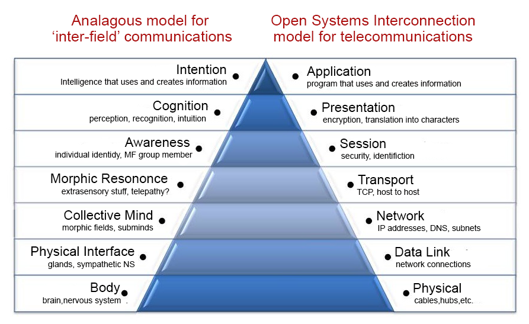

To be clear, we are not saying that this is how it works, nor are we saying this is *not* how it works. We are suggesting that we might find new perspectives if we apply the models we have developed, which are based on natural laws, to things we do not yet understand. In this case, for example, we see that the physical body and intelligence are at the opposite ends of the pyramid, implying that the brain/nervous system is more of a receiver/transmitter rather than a generator, as creating new information requires intention, cognition, and intelligence. This is a radically different concept than the ideas that the mind, consciousness, intelligence *must* arise out of brain activity, which is what we generally believe today. We contend that other successful models that we currently use today could also be applied to things we do not yet understand, at least as a starting point of investigation.

#### **Claim 52:** Morphic fields have the ability to transmit and store information. 

Collective Memory
-----------------

The idea of field intelligence is in some way an extension of the idea of the *collective mind* or *collective consciousness* which was formalized to a great degree by Carl Jung's idea of a collective subconscious and collective memory, although, it may be more accurate to describe the idea of a collective unconscious as a primitive understanding of field intelligence. This is still a very fertile area of research across many disciplines.[103](#ref_103)

Sadly, no theories exist to explain where and how long-term collective memories are stored. The idea of a collective memory has been around since the early 20th-century French sociologist Maurice Halbwachs coined the term. His hypothesis on how collective memory was stored and transmitted is extremely unspecific but generally depends on human-to-human transmissions, similar to Dawkin's theory on how memes are spread. Given that Halbwachs was a student of Emile Durkheim and a devoted Marxist, one has to question his entire premise of a ‘collective', especially in light of his claim that human memory can *only* function in a collective, and then goes on to give examples of his hypothesis of collective memory by comparing the ‘collective memory' of the bourgeoisie, religious and the working class. Still, he did coin the term, even if his premise was prejudiced by ideology.

Current thinking still revolves around cultural expression as being the primary way that collective memories are transmitted; dance, stories, monuments, etc. These are certainly reinforcing factors, but this idea alone cannot explain Man's collective memory of “the whole history of the human race”, as Jung claims is the source of our fear of fire, falling, and social status, to name just a few. Some of these memories are epigenetic/genetic, such as being born with the fear of loud noises, which comes from the memory that loud noises are generally a harbinger of something that's bound to make life more difficult, but can all our collective memories be stored in our DNA? Perhaps that is what the 75% of our junk DNA holds (recently upgraded from the previous 98% junk), or perhaps we don't yet understand its function… maybe the junk DNA is more of an antenna than a transcoder. We have no idea, but whatever it is, could it account for storing “the whole history of the human race” as well as acting like an MF/MR interface? This seems very unreasonable.

It will also be interesting to see the effects of the massive disruption the collective consciousness is currently undergoing as a result of the Internet and technology, and how that alters our collective consciousness and memory.[104](#ref_104)

Engrams
-------

Another candidate is how the brain creates and stores memories. We have developed the concept of an *engram*, which is the means by which biochemical and biophysical processes store our response to external stimuli. The engram, first described by German Zoologist Richard Serman in the early 1900s, was based on what he called the *mnemetic principle*, which states that the imprint made is the nervous system (including the brain) and as a result of external stimulus this imprint can reconstruct the experience. This is a very holographic idea, in that holograms reconstruct imagery by illuminating a previous record of that imagery. The images below demonstrate how the ‘memory' of the image of a 3-dimensional cat can be stored on a 2D surface of holographic film, but looking at the film we would have no way of knowing that there is any information there, let alone the information that describes a 3D cat.

An important technical detail regarding holograms as it applies to memory is that many images can be recorded on top of each other, each with a different angle of illumination. All those images can be reconstructed simply by changing the angle of the hologram when viewing. This is why, and how, a holographic memory cube five meters square can store every word ever spoke or written by a human being.[105](#ref_105)

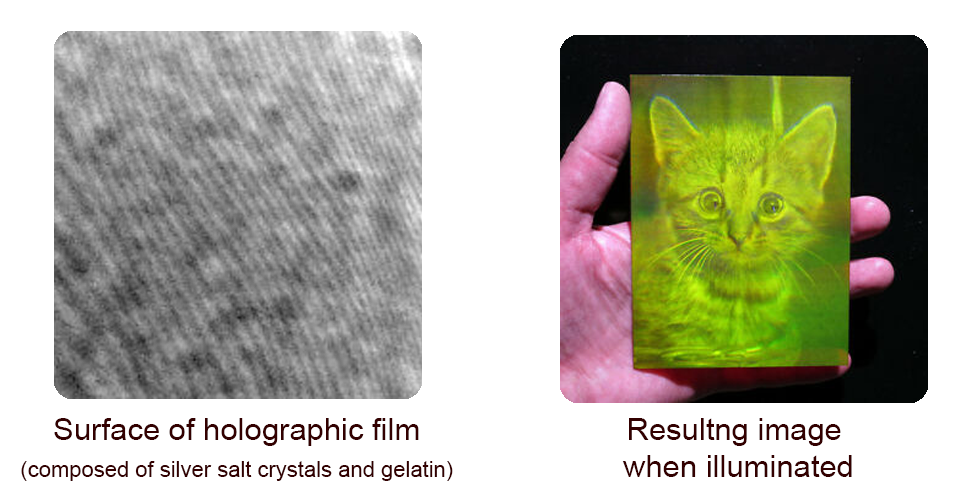

This imprint, or “mnemetic trace”, so named after the Greek muse of memory “Mneme”, is also a precursor to Dawkins “meme”, as the meme is a cultural version of an engram. I suspect Dawkins was well aware of this when he created the “meme.”

The 50 years of research following Serman's hypothesis of the engram boils down to:

> “(1) memories are not localized but are instead distributed within functional areas of the cortex and (2) memory traces are not isolated cortical connections between inputs and outputs.”[106](#ref_106)

Might we see these same characteristics in our own collective memory technology otherwise known as the Internet? Perhaps. Decentralized and distributed information networks, such as Bitcoin's Blockchain, TOR (The Onion Router), and IPFS (Interplanetary File System) are probably early stages of such a thing. The irony of the Internet is that when it was originally developed by DARPA it was designed to be much more decentralized then it is today to the point where it could withstand a nuclear attack and continue operating, but today much of the decentralization has been removed as it is not in the best interests of government and business who prefer a more ‘consolidated' model (Many totalitarian countries, and England, have actual Internet kill switches.[107](#ref_107))

If we extrapolate these ideas when looking for how field memory works, we might want to start with the presumptions that:

-   Field memory is decentralized and distributed within the medium of the field. What and where is this medium? Anywhere there is energy, as the field *is* energy.

-   Field memory is not stored as discrete quanta of information but rather an organized, pattern of otherwise dis-integrated ‘particles' of information, which we refer to as data. Were we to see this data alone it would appear as chaos. When seen from a different perspective, or decoded, as in the case of engrams or holograms, or in a different context, it may appear as information.

Modulation
----------

Another model to look at might be the way we have learned to transmit information by modulating the amplitude or frequency of a wave, similar to how TVs, radios, and Internet modems work. If we accept the idea that all energy moves in cycles and waves, including the energy of ideas, then perhaps those waves are also modulated in some way with information. As has been suggested earlier, there are waves we either don't recognize or don't consider as waves. For example, it is possible that the ‘waves' from the ‘cycles' of the moon or the Arctic Tern could be ‘modulated' to carry information? It sounds crazy, but we know that brains waves encode information (possibly *rules of behavior*[108](#ref_108)) as time codes[109](#ref_109), that light can store quantum memories[110](#ref_110), and that the same waves we use for communication are the same waves that have filled the entire universe since the Big Bang[111](#ref_111). Since the discovery of gravitational waves, we have been looking into how we can transmit information in that medium as well[112](#ref_112). Considering how little we know about the Universe, Reality, and Everything, these ‘crazy' ideas may not be so crazy after all.

This still does not answer the question of where the information is stored.

Let's go out on a limb. Like my grandmother used to say “when you can't find something you need to look everywhere.”

Dark Matter
-----------

One candidate is dark energy/dark matter.

Before I describe this idea, I want to make it very clear that I am not a cosmologist, physicist, or scientist of any kind, so this idea may be ridiculously naive and laughable to anyone who is knowledgeable on the subject. That said, let's give it a whirl.

Dark energy occupies 70% of the known universe, can't be directly observed and emits no light or energy. Dark matter occupies another 25%, and the measly remaining 5% is the matter we can see. Dark matter can have dark electrons and dark protons and there is even dark chemistry. Dark energy also produces dark electromagnetism and dark electricity. Dark matter does not interact with ‘regular' matter. Perhaps it interacts with something else? In fact, there are (believed to be) dark galaxies, which is a galaxy of dark energy/matter superimposed on a galaxy of “regular” energy/matter. In short, everything that exists has a ‘dark' clone that we can't detect. What better medium than dark energy is there that could collect information from every scale of reality? Dark matter is a good candidate for where the data is stored.

Dark matter/energy is not just some weird thing we kind of guess is there. Evidence suggests it actually forms the structure of the entire universe, but all we really know about dark matter is it exists, it exists everywhere, and it interacts with gravity, one of the four fundamental forces of energy. This then makes gravity the nominee for how the information is transmitted between dark energy and the ‘regular' energy of our reality. Perhaps there is some entanglement involved, allowing information to travel faster than the speed of light?

Dark energy is quite elusive, as we can't detect it or measure it, but we can see its effects in the expanding universe, as dark energy seems to be continually being created (as if it was some sort of dynamic memory system that keeps expanding to accommodate the exponentially increasing storage requirements?). Perhaps there is a relationship between extrasensory phenomena and dark matter/energy in some way?

Has anyone tested this? I have scoured the Internet looking for such research and could find nothing. However, I did run across this very interesting post from one of the senior members of Cambridge University's Institute of Continuing Education who posted the following:

> Subject: Can quantum dark energy explain telepathy?
>
> Telepathy and quantum entanglement seem to match each other in that a communication connection exists, but no tangible connection. Could there be a hitherto unknown dark energy particle produced by electrical impulses in the brain? Could it be that entangled particles of this dark energy are shared? If a plasmon circuit in the brain creates patterns of these dark matter particles, based on thoughts and ideas, do people with the shared particles since the same patterns of thoughts and ideas? How long-lived are these particles, how long do they maintain patterns, and what might be the mechanism for transfer? These particles may be exchanged through quantum molecular tunneling, allowing a brain to transmit them outside of the head, and a person with a corollary quantum molecular tunnel for reception to readily receive the particles. Persons sharing close and personal spaces may be more likely to transfer these particles to each other such as twins, relatives, friends, and even enemies. It may be that these particles are long-lasting and this may allow objects to be imbued with the dark particle patterns, allowing a sensitive to read a person through the object. It may be that wherever a transmitter goes the location they were at is imbued with thought patterns of their experiences. The implications of such a mechanism for telepathy imply this process may be amplified by electronics to increase the strength of transmission and reception. It also implies that we could control electronics through the use of telepathy.[113](#ref_113)

There were no replies.

OK, I know this is all a bit of a stretch, but it's not outside the realm of investigation.

Structured Memory
-----------------

Another possibility is structure itself. It has been claimed that the structure of water can hold memory. Although this claim has not been properly tested by any means, there is at least some evidence to suggest it might be valid. Dr. Emoto has been the most public in his claims that water holds memory, and presents many examples and theories, but none have been thoroughly tested by scientific standards. There is quite a lot of information available about Emoto's work so I will not repeat any of it here. However, Dr. Emoto has participated in other, more stringent studies.

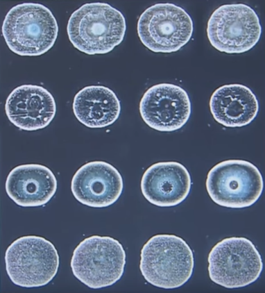Speaking only for myself, one of the more compelling pieces of evidence I have seen comes from the experiment where four students created four drops of water, all from the same source. The image on the right shows the results of that experiment where each row of drops was created by a different student. Notice anything? Even if this is not bulletproof evidence (similar to the existence of Australia for anyone who has never been there), it is enough to raise the question. In addition, this test was also conducted using different types of flowers, and, according to the testers, the resulting patterns in the drops of water resembled the patterns of the flower. Tholonically, this is exactly what we would expect to see, as it is patterns of energy that create the instance of the flower.

Another source that supports the idea of water holding information is Jacques Benveniste, a French immunologist who worked at the Institute of Health and Medical Research (INSERM). In 1988, who published a paper in *Nature* concluding that the configuration of molecules in water was biologically active even in the absence of the elements that caused that configuration. This “water memory” was immediately picked up by the homeopathic community as proof of its efficacy.

While Emoto's work can easily be brushed off by skeptics and institutional authorities, due to its lack of rigorous analysis, Benveniste's work could not.

*Nature* magazine editor, Jim Maddox (yes, the same person who promoted the burning of Sheldrake's book on the grounds of heresy, as well as claiming the Big Bang theory is “philosophically unacceptable” and that there was “no need to panic about AIDS”), prefaced the *Nature* article with an editorial comment entitled “When to believe the unbelievable”, which admitted: “There is no objective explanation of these observations.” That sounds like a begrudging admission, but it was more like a temporary retreat in preparation for the next offensive.

*Nature* did not want to publish the paper to begin with, holding its release for two years while awaiting independent confirmation from impartial laboratories in Israel, Italy, and Canada, who reported an observable biological effect.[114](#ref_114)

After the paper was published there was an explosion of meltdowns from the scientific community. In response, *Nature* demanded that the experiment be repeated under conditions controlled by an ad-hoc selected team of its own, which included (and this should shed some light on their not-so-hidden intentions) the famous illusionist, pseudo-science enemy, and occasionally dishonest, James Randi, plus Maddox himself and a malpractice investigator.

The *Nature* team did, in fact, find the same results as Benveniste, but with one fascinating exception: the effects of the tests disappeared when the members of the laboratory did not know if the water sample had been treated or not. One could claim the results were then biased based on this knowledge, but one could also say that this awareness could have helped instantiate the effect. According to the tholonic model, being aware of something is sufficient to instantiate it to *some* degree. In any case, this was sufficient for *Nature* to publish a report on this methodological flaw in Benveniste's experiments and officially called “water memory” pseudo-science[115](#ref_115) and published an article calling the entire idea ‘delusional' (written by, or course, Maddox, Randi, and Stewart, another lover of dogma)[116](#ref_116). Case closed.

Or so they hoped, for not long after Benveniste's paper, The United Nations Educational, Scientific and Cultural Organization (UNESCO) decided to take their own look into his work. In their words:

> These data seem particularly important because they further enrich the immense achievements of molecular biology. They also suggest the development of new modes of transmission of genetic messages (transmission, transduction, teleportation, etc.).

Fortunately, they did not invite Maddox or Randi to be a speaker. Rather, they invited the Nobel Prize-winning discoverer of HIV, Luc Montagnier, who, much to the skeptic's dismay, stunned many fellow scientists years earlier with claims that DNA emits weak electromagnetic waves that cause structural changes in water that persist even in extremely high dilutions... In other words, water-memory. Montagnier has gone on to say that "More scientists are becoming convinced \[of water-memory\] by the data" as new evidence appears.

OK, that was a long-winded bit of history there, but it shows the resistance to new ideas as well as the real possibility that water-memory exists.

But I am not a scientist, so I don't have to worry about what the editors at *Nature* or dubious debunkers think, so I can hypothesize the following: If the structure of water can hold memory, does this mean that the structure of other things can also hold memory? Can the thologram itself hold memory in its mega-structure? If we claim that the structure of our material world is but an instance of that structure in the thologram, then we would have to say “yes”, and that then opens the door to all structure, in every corner of the universe, having the potential to hold memory. More exciting is the possibility that the mechanism to access this memory, and the knowledge, is to simply become aware of it. This last part is trickier than it sounds, as we don't know what we don't know, so how do we know what to become aware of?

Regardless of the theory, whatever it happens to be, the morphic or tholonic field would have to be something like an electromagnetic field on a different level of existence, as both are caused by the movement of energy.

#### **Claim 53:** Everything that exists due to the movement of energy has a field, including awareness, intention, consciousness, and even information. 

The redundant and self-similar expressions of pure energy can be seen in the ever more complex and integrated patterns that have evolved since all of creation began as an infinitesimally small dot that was the seed of this Universe.

By the same token, the redundant and self-similar expressions of pure awareness can be seen in the ever more complex and integrated patterns that have evolved since all of creation began as an infinitesimally small dot whose only property was awareness and intention.

The implication is that energy itself is a fundamental form of awareness and intention and therefore everything that exists is also a form of awareness and intention in the same way that everything that exists is a form of energy. To be aware of something is to direct energy to some concept or idea, thereby moving the curve of that archetype, which alters the *norm* of what and how that archetype will instantiate itself. I suspect that a real-world example of this it the classic split-slit experiment.

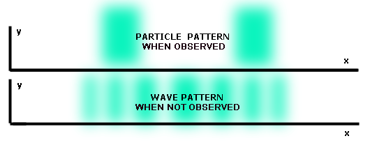

Briefly, this split-slit experiment shows that when observed, electrons act like particles, and when not observed, they act like waves. The act of observation forces the electron waves to be perceived as particles.

It's not that the electrons are waves that turn into particles; it's that the electrons are *wavicles*, both particles *and* waves at the same time, but the act of observing them is an interaction that alters their expression.

From the tholonic perspective, if the claim is “energy alone can't be observed; only its interactions with other forms of energy (mass) can” is true then it is also true that “awareness alone can't be observed; only its interactions with other forms of awareness (mass) can.” This implies that any form of awareness is sufficient, and if all things have awareness, then any *thing* observing the experiment would cause the wave function to collapse. This turns out to be the case as "observation" by machines has been tested.[117](#ref_117)

This helps to remind us that, if all forms of existence are some expressions of awareness, it's not just human awareness that is running the show.

> “Consciousness”, or awareness from the tholonic perspective, “is part of our universe, so any physical theory which makes no proper place for it falls fundamentally short of providing a genuine description of the world.”[118](#ref_118)

##### \~ Roger Penrose

‘The *most important physicist to work in relativity theory except for Einstein.'*

Tholonic fields exist in the realm of thought, ideas, and concepts, so any experiments that might be run probably need to be thought-based in nature. Is there any evidence that thoughts can directly alter our material reality? If the answer is yes, that might support the idea that altering archetypes in the realm of ideas has a measurable effect on the instance of those archetypes, i.e. reality as we know it.

Reality
-------

What about the possibility that reality itself, the world around us, matter, everything we consider to be real, *is* the memory?

This idea is based on the idea of Quantum Darwinism[119](#ref_119) that states that of all the probable states that can exist, the ones that survive do so because of support from their environment. In turn, these states that survive transfer information to the environment, altering its context, shifting the curve in its favor, and thereby improving the probabilities of future similar states.

As the energy interacts with the environment around it, the range of probabilities for the many attributes of an energy particle begins to decohere, or disappear, leaving only the attributes that are most compatible with the environment, which then interacts with the environment to make the environment more compatible with the attributes. Notice the compatibility of Quantum Darwinism with the descriptions of the social equations in the chapter “The Meaning of Math”?

Reality, as we know it, is the consequence of this processes of *decohering* the less successful possibilities of a particle's superposition. In the end, one set of attributes dominates, and that is what we see in the reality that surrounds us. In other words, reality itself is the living record of what works.

Applied to the tholonic model, each tholon has a set of stable properties, and given its self-similar structure, each tholon only needs to manage the properties that relate to its scope or that exist within its spectrum, leaving the parent properties to the parents, and any of the child properties to the child. Each tholon then “knows” what works and expresses this in the instances of that tholon, which is every archetypal idea and form that has the possibility to exist. When we look at a thing, like a rock, we are not just seeing the Darwinian results of the tholon of a rock, but also the results of all the parents of the rock, such as mountain, planet, solar system, galaxy, as well as its children of silica, molecules, atoms, and electrons.

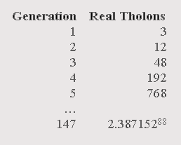The language of reality begins with one ‘letter' (a tholon) of the alphabet, which becomes three in the next generations, which becomes 12, etc., up to at least 1088 letters of the alphabet. Each of these letters is a record of what “works.” There is no need to record what does not work in this type of top-down framework,

Remember that phrase *combinatorial inflation* which describes the exponentially increasing number of possibilities in protein production? This is the big problem with current evolutionary thought, as there are simply too many combinations for nature to try.

In the tholonic model, these massively inflated possibilities are quite simple to navigate. We start with a duality within which a stable pattern emerges. From that stable pattern, a new duality emerges, which produces another stable pattern. For each generation, we have three new possible tholons from which patterns can emerge. Only stable patterns are capable of creating dualities, so unsustainable patterns never propagate. After a mere 129 generations of this process we have produced 1077 possible tholonic combinations, but at each generation we only needed to create one pair of parameters. *(We use 1077 as that was the possible number of protein combinations with just twenty amino acids and 150 amino acids… a very, very small number when compared to the actual proteins that make up life.)*

It is clear that the odds are incredibly stacked against a new form of a viable protein to appear because the assumption is the entire field of 1077 is available. Tholonically, the entire field available is limited to a mere three properties, but these properties are self-similarly embedded 129 times. If a new pattern emerged somewhere around the 63rd generation (1037 combinations), then an entire new branch of creation will emerge at a point in the tree where it will have a significant presence at the 129th generation. This would explain the Cambrian Explosion when 541 million years ago a major new class of life appeared that was the origin of all modern marine life… it also destroys the Darwinian model of evolution. Ironically, Darwin himself, in his *Origin of Species*, said this nasty detail was the main argument against his “theory of descent.”

Here's a simple mathematical example.

First, let's look at the Bell curve again. Let's say you do 32-coin flips 50,000 times and plot the results.

The peak of the Bell curve is going to tell us what the most likely result will be, which is, that we will get heads 16 out of 32 flips, on average. But we have decided we are going to run this test five times, but each subsequent time we are only going to use the coins that came up heads in the previous test. If we do this same process five times we end up with the following:

Test 1 with 32 coins, 16 came up heads

Test 2 with 16 coins, 8 came up heads

Test 3 with 8 coins, 4 came up heads

Test 4 with 4 coins, 2 came up heads

Test 5 with 2 coins, 1 came up heads

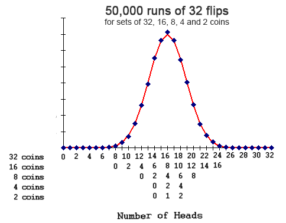
If we plotted the results, we would end up with a Bell curve that looked something like this “Number of Heads” graph.
So, when we run these five tests 50,000 times each, the chances of us ending up with one coin from 32 is 100%

Now imagine we use different coins for each test; 32 quarters, 16 nickels, 8 dimes, 4 half-dollars, and 2 pennies. We are still going to end up with 1 penny at the end, along with 16 quarters, 8 nickels, and 4 dimes and 2 half-dollars. This is a total of 62 coins, two of which are pennies.

If all someone knew about was that you started with 62 coins and ended up with a penny, they would say there is a 2:62, or 3.2%, chance of you ending up with a penny, when, in fact, there is a 100% chance of you ending up with a penny.

The person not knowing the process has a 96.8% margin of error, while you have a 0% margin of error. The person, in an attempt to replicate your success, but not knowing your process, will begin to run tests and keep notes as to what worked and what didn't work. He checks these notes every time he runs a new test to make sure he is not doing something that has been shown to fail. Once he discovers your process, he can archive the failed notes and simply describe the process that works. He does not need to record all the failures once he has discovered the process that works, but he does so as to pass them on to the next generation of researchers who will approach similar problems in the same bottom-up fashion.

Existence does not need to record its failures as it is the ultimate top-down approach, from the tholonic perspective. From the very first instance of creation, nothing progressed unless the previous process worked, i.e. new child tholons were created from the stable patterns of the parent tholon. No reverse engineering is necessary for existence. If a branch of existence fails it will only fail up to the first successful parent. This is like saying that if all your nickels were swapped out for double-tailed nickels, then all flips after the nickels would come up as zero, killing the entire branch below nickels and preventing it from creating any new children. The quarters are still fine, and because you had decided to run the tests the way you did, you would need to get new nickels or some other coin. In the thologram, once a branch does fail, there is no longer any contributing feedback to the aggregate intelligence of the parent of that failed branch, which will change the curve of the parent, resulting in a new type of stable pattern that can create new child tholons/branches.

In our example here, the person doing the flipping would be the intelligence that ‘fixes' the problem, but in the tholonic view, the experimenter is an instance of an aggregate intelligence (of the human tholon interacting with intelligence of the archetype of the experiment) which received feedback from the broken branch (bad results) that modified the curve (something's wrong) which resulted in a new stable pattern (new nickels). (I know this example sounds ridiculously trivial, but it's the simplest example I could think of.)

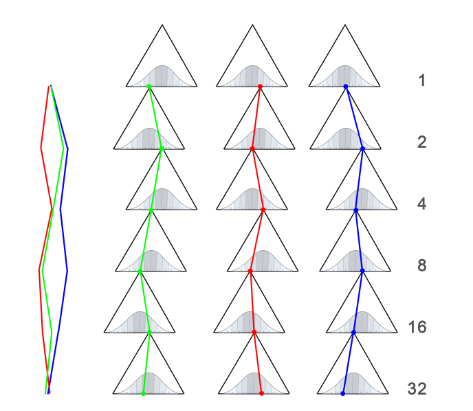A simple example more aligned to the tholonic model would be how we can emerge Bell curves from stable points in a lineage of trigrams. By assigning a value for points on the spectrum, and a binary value representing the generation of the trigram, we can create a unique value for every point that identifies its place on the spectrum and its level. If we combine each of these numbers, we can create one value for the entire lineage that has an extractable record of every spectrum value at every level. This one number would then act as a memory of all the ancestors. We can see this easily in simple binary math. If we have five generations of numbers that double with each generation, such as 1,2,4,8,16, and we have the number 22 representing the sum of all the contributing generations, we can easily determine that only the 2nd, 3rd and 5th generations contributed, because only 16, 4 and 2 can create 22. The tholons are similar in that each tholon has a fingerprint that is encoded in every one of its descendants.

What this means is that everything that exists is *already* a record of what works from the first moment of creation, through every generation, up to and including the thing that exists. Life, Reality, and Everything *is* the warehouse of all knowledge. We just haven't yet figured out how to decode (most of) it.

One possible instance of this idea is the relatively recent discoveries that experiences and memories can be passed on *epigenetically* to descendants. In one of the classic test cases, the descendants of mice that were trained to not like the smell of cherry blossoms also had an aversion to the scent of cherry blossoms.[120](#ref_120) Epigenetics describes how DNA can be modified by non-genetic stimuli, like fear, love, environmental preferences, even dreams, and it shows how what we inherit goes far beyond the human genome. Tholonically, the human genome is an instance of the human tholon, but the epigenetics that affects this instance are more like the influences on the scope of that tholon, or rather, where along that scope a stable pattern will emerge.

