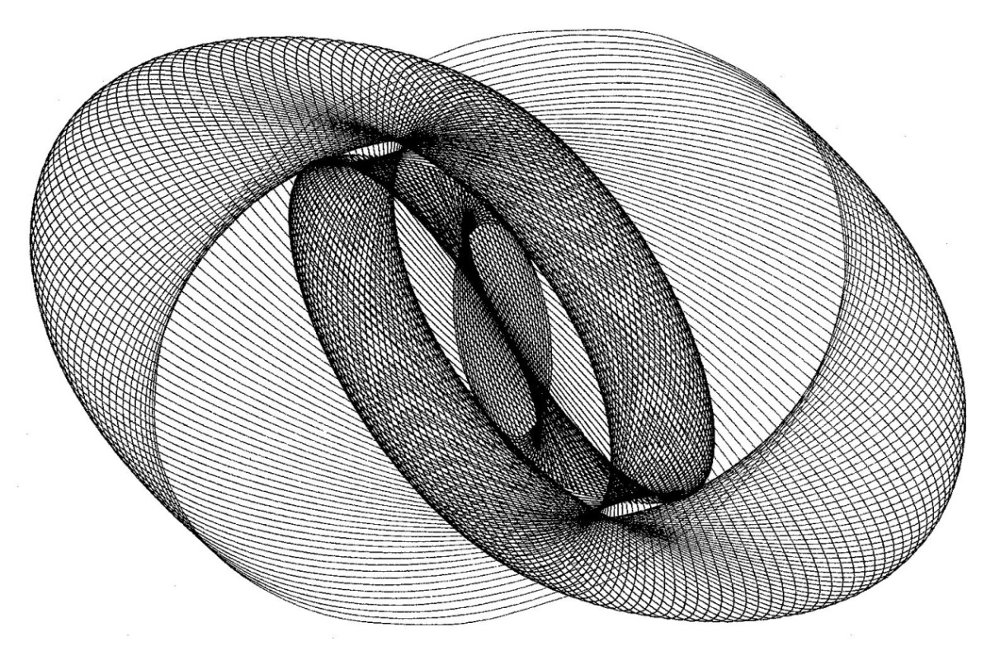
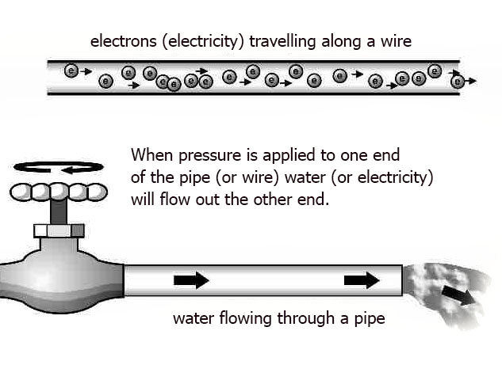
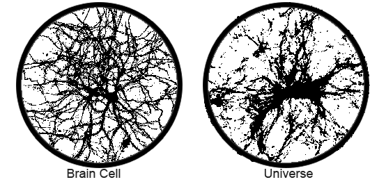

THE LAWS
========

###### Energy creates movement, movement follows laws, laws create order, and order directs energy. Each level of existence expresses the Universal laws to the best of its ability according to the local laws it operates under.

Entropy and Inertia
-------------------

There are many laws that describe how energy works.

From the 3rd century BC starting with the Archimedes Principle to the present laws of quantum mechanics, researchers have compiled a longs list of laws. We have, Coulomb's Law, Stefan's Law, Pascal's Law, Hooke's Law, Bernoulli's Principle, Boyles's Law, Charles's Law, Kepler's Law, Law of conservation of energy, the Tyndall effect, Graham's Law, Newton's Three Laws of motion, Ohm's Law, and many more.

One of these universal laws is *energy will always follow the path of least resistance. This is called entropy* and explains why water runs downhill to form rivers, electrons always seek a positive charge, resulting in electricity, high pressure seeks low pressure, and why stuff breaks.

A simple analogy would be to compare entropy to water in lakes, rivers, and the sea. Only the water that is above the sea level can be used to do work (e.g. move a water wheel). Entropy represents the water that is at or below sea level and therefore unusable for work.

This is also how batteries work. A charged battery has low entropy (high usable energy), and a dead battery has high entropy (no usable energy). A dead battery still has all the energy it had before, but it is no longer usable because the energy, in the form of electrons, has moved from the positive side of the battery to the negative side until it achieved balance and there were no more electrons left on the positive side of the battery that were compelled by the laws of balance to move… but they are still in the battery, and still acting like electrons.

This is classical physics, and entropy in classical physics is defined as *disorder* because, without the flow of energy, there is no order. For the record, entropy is a fairly complex process that not everyone agrees on, so, we're really using ‘high-altitude' definitions here.

In the water example, if we have two identical bodies of water, one 100 feet above the other, we say that the upper body of water has lower entropy than the lower body of water, and the lower body of water has higher entropy than the upper body of water, but there is no difference between these two bodies of water when compared independently. The difference only appears when compared to each other, because one is higher than the other. We can say that both bodies are in a (slightly) higher state of chaos when they are not connected. Once they are connected, and the water begins to flow, there is movement of energy, and order follows.

This is what is theoretically happening to the universe right now because according to the Big Bang Theory, there was zero entropy (total energy) at the moment of the Big Bang. Since then all that energy has been following the path of least resistance as it moves into the surrounding nothingness, like water into the ocean or electrons in a battery, raising the entropy of the universe and decreasing the amount of useable energy. This is why, according to the theory, the universe will end up in a state of chaos and disorder, like a dead battery or a stagnant lake. The Universe started in chaos and will end in chaos, and in-between those two points, there is the movement of energy, which creates order.

#### **Claim 11:** Order and pattern requires energy. 

One interesting takeaway from this understanding is that interconnectivity allows for movement of energy. This movement creates order. Therefore the idea that everything is connected is not simply a philosophical abstract concept, but a necessity for order.

In other areas of study, the definition of entropy carries the same idea of disorder or chaos but is used in a narrower context, so it sounds confusing unless you are familiar with that context. For example:

-   **In probability theory**, the entropy of a random variable is the measure of uncertainty.

-   **In information theory**, the *compression entropy* of a compressed file, like a zipped file or a JPEG image, measures the amount of information loss.

-   **In sociology**, entropy is the natural decay of a society's structure (such as law, organization, convention, ethics, etc.).

For our purposes, we will simply use the classical definition of entropy as a *measure of disorder*.

Another law to look at is Newton's First Law, the Law of Inertia, which states “an object will remain at rest or move at a constant speed in a straight line unless it is acted upon by an unbalanced force.” This is why things don't fly around randomly on their own for no reason.

These are just two of the many laws that determine how our reality works, at least within the scope of the reality we tend to deal with. On the quantum and galactic levels, or super high or low energy states, things may operate a bit differently.

These laws always ensure that everything will operate at its most efficient level. What does “operate” even mean? It means the optimal movement of energy. As energy only moves when there is a difference between two states, the movement of energy is meant to do only one thing, and that is to neutralize that difference by creating a balance between two conditions that are not the same, whether it's the conditions of somethingness and nothingness or just a few degrees of temperature. Once balance is achieved the movement stops. A balanced battery is a battery at peace with itself… and it is also a dead battery.

The optimum condition for the movement of energy between two states is one that operates within the limitations and abilities of both of those conditions.

A beautiful example of entropy and inertia that works today as much as it did thousands of years ago can be easily demonstrated with something called the *harmonograph*. This is a fascinating and entertaining device that takes an initial push (low entropy) and then draws a two-dimensional design on a blank paper as that initial energy slowly diminishes (inertia), until it stops (high entropy).[8](#ref_008)

#### **Claim 12:** Everything is in a state of seeking and/or maintaining balance. 

Oscillation
-----------

One law, or pattern, that can be seen in every part of the universe, is that everything oscillates.

Oscillation is how energy sustains movement between two states, which supports the definition that “chaos is a kind of order without periodicity” for without oscillation or periodicity, there is less order and more chaos.

Everything that is sustainable (i.e. currently exists), from the atoms to the galaxies, oscillates in some fashion and has some kind of frequency(s).

> “All things have a frequency and a vibration.”

##### \~Nikola Tesla

We typically think of light waves and sound waves as the classical example of oscillations, but the heavenly bodies and stars in the sky are also oscillating particles on a cosmic scale. If we look at the orbits of planets, stars and galaxies they are not simply spinning around in a rather 2D plane of orbits, but that they are spinning around while moving in a direction.

People have been fascinated with this obvious commonality across all of creation for some time. Kepler himself was quite interested in the relationship between planetary frequencies and musical frequencies, but the study of planetary and musical relationships goes back to at least the 9th century with Eriugena, an Irish monk, theologian and Neoplatonist philosopher, most famous for his work “The Division of Nature,” which claims that nature's first primary division was the division between that which **is** (*being* or *somethingness*) and that which is **not** (*nonbeing* or *nothingness*). His work was condemned as “swarming with worms of heretical perversity”… the 9th-century Archdiocese was a tough crowd.

#### **Claim 13:** Everything exists in a state of duality. 

#### **Claim 14:** Everything sustainable oscillates. 

Ohm's Law
---------

Another law which appears to be local yet applies to many contexts is Ohm's Law, which states *electric current is proportional to voltage and inversely proportional to resistance*.

This law can be displayed as follows:

If you are not familiar with Ohm's Law, you can understand it using the water example below.

In this example, the concept of **Power** remains the same, as it is an abstract and derived concept that represents the rate, over time, at which energy (via electrons, water, etc.) is transferred. **Current** is the amount of water (i.e. number of molecules), that is flowing through the pipe. **Voltage** would be analogous to water pressure, which determines how far the water shoots out of the pipe. **Resistance** is represented by the size of the pipe the water is flowing through.

Ohm's law is actually Newton's 2nd Law of Motion, t*he force of an object is equal to its mass times acceleration*, as it applies to electricity*.*[9](#ref_009)

Ohm's Law states Newton's 2nd Law as it applies to electricity, but where the *object* is *electricity*, the *force* is *current*, the *mass* is *resistance*, and the *acceleration* is *voltage*.

In the world of electricity we can say *voltage = current \* resistance*, likewise, in the world of matter we can also say *acceleration = force \* mass.* All twelve math formulas of Ohm's Laws can apply to matter.

Ohm's law is just one of a number of contexts where Newton's 2nd law applies, as shown below.

There's one more comparison to look at as well. Did you notice how the formula wheel above how the *Power = Resistance x Current2* (*P=RI2)* looks exactly like another popular formula: *E=mc2*? Could we find parallels between these two formulas? Maybe there is a relationship such that…

-   **Power** (*P*) is analogous to **energy** (*E*)
-   **Resistance** (*R*) analogous to **mass** (*m*)
-   **Current** (*I*) to the **speed of light** (*c*)

In fact, not only is *E=mc2* the exact same formula as *P=RI2*, but all twelve formulas work for *E=mc2*… with a minor adjustment: in the Newtonian world of electricity and matter, all the variables can change in value, while in the world of relativity, *c* must always remain constant.

It looks like *c,* which is the Relativism's version of Current, or amperage, is the *maximum current supported* rating for this universe, not unlike a 40 Amp fuse we use to ensure we do not exceed the maximum current supported. (Maybe that's why we can't break the speed of light because if we did, we'd ‘blow a cosmic fuse' and shut down reality! That's sort of a joke… but not really.)

We can apply these formulas to energy, mass, and speed and get correct results; with one exception… there is no equivalence to volts when using *E=mc2*, which seems odd.

In the water example, voltage is equivalent to water pressure. In the world of electricity, voltage is described as *electric pressure* that results from the difference that exists between two states, one being the highest potential energy, and the other being the lowest potential energy. Can we then say that these missing cosmic volts ((let's call them *zvolts*, for lack of a better term) represent the difference between two opposing states? What these states might be is up for grabs. Perhaps low entropy (order) and high entropy (chaos)? Whatever zvolts are, given that they are values that measure the difference between two points that are quite fundamental to our reality, they might be very significant in understanding reality in terms of dualities.

We can calculate for these missing zvolts by applying the simple formula:

*Voltage (V) = Current (I) \* Resistance (R)*

which equates to *zvolts (z) = Speed of Light (c) \* Mass (m)*

This then becomes (using the ISU standard[10] units of measure) *300,000,000 km/sec \* 1 kg = 300,000,000 zvolts.*

So zvolts is the same as *c*? Yes, but only when the *mass=1*. If we use a different mass, like 2, zvolts becomes *c\*2.*

*300,000,000 km/sec \* 2 kg = 600,000,000*

But what *is* this number? It can't be speed, because nothing can exceed the speed of light. It can't be weight, because we are already using weight in the equation. Even more odd is that the number is always proportional to mass because *c* is always the same, so whatever zvolts are, they are essentially the same value as the weight of the mass, but 300,000,000 times larger.

There's one more detail about voltage that might be relevant here, and that is: the greater the voltage, the greater the electric field. Can we then say “the greater the zvolts the greater the energy field”?

So, zvolts represent the difference between the two poles of … what? Reality itself, as defined by Relativity? The value of zvolts are always proportional (by *c*) to the value of mass, and they determine the size of the energy field. As everything that exists can be described using *E=mc2,* this would imply that everything that exists has a zvolt field, and as zvolts measure to greatest difference between two opposing potentials, are zvolts one measure of the duality a thing exists within?

It's all quite fertile ground for speculation, at least to someone like myself who is too uneducated to know the thousands of reasons why speculation is pointless.

Getting back to these twelve formulas… we think about voltage, resistance, and current (or energy and mass) as separate things, similar to how we think about time and space as two different things. However, space and time are two parts of one larger thing called *space-time*. Likewise, voltage, current, and resistance are three aspects of one type of energy, electricity. Frequency, wavelength, and velocity are three aspects of another thing, such as radiation. All areas where this law applies are themselves different aspects, or parts, of an even larger expression of energy.

Here we are using Ohm's Law to show how one law can be expressed across many scopes, but this same reasoning applies to all natural laws in physics, or elsewhere.

Alchemy

#### **Claim 15:** Instances of laws are limited, defined and understood according to their context. 

Redundancy
----------

The oscillation constant also gives us a glimpse into another basic, yet profound property of creation and reality, and that is its self-similar redundancy. *Self-similar redundancy* (a term that is itself redundant) is how one property or law manifests itself across different orders of scale in the most effective manner given the context, state, and scope of that order.

One of the more obvious examples of this type of self-similarity, besides the water/electricity examples above, might be the commonality between the structure of a solar system and the structure of an atom.

Of course, we need to consider that at the quantum level the instance of a centric system, like an atom, would be constrained by the local laws of quantum mechanics, such as electromagnetism, electron energy levels, the nuclear weak force, etc., while in a much larger system, like a solar system, the same laws would be constrained by the local laws of momentum, gravity, and Newtonian physics.

Many scientists will tell you there is no relationship between atoms and solar systems, and that this analogy depends on an old and outdated concept of the atom. They will probably write the relationship off as humanity's tendency to oversimplify the complex and over-relate the unrelated.

No doubt this is true to some degree, but more importantly, there are some similarities worth investigating that would give us an idea of the laws that both systems deploy in the most efficient way they can be expressed, given their scope. Some scientists agree, at least as far back as June 1989 when the International Journal of Theoretical Physics published the paper “Self-Similar Cosmological model: Introduction and empirical tests”[11](#ref_011) which examines this concept specifically.

This report concluded:

> The simplicity of \[the Self-Similar Cosmological Model (SSCM)\] and its ability to quantitatively relate atomic, stellar, and galactic scale phenomena suggest that a new property of nature has been identified: discrete cosmological self-similarity. Although the SSCM is still in the early heuristic stage of development, it may be the initial step toward a truly remarkable unification of our considerable, but fragmented, physical knowledge.

A more organic example of this self-similarity[12](#ref_012) is to compare the structure of the universe to a brain cell.

There are many matching patterns between cells and the universe, and it is a subject far too broad to get into here. One recently published paper[13](#ref_013) shows the similarity in structure of a neutron star and a human cell. Other comparisons have also been noted, such as:

-   mitochondria vs. stars

-   Vacuoles vs. galaxies.

-   Nuclear holes vs. asteroids

-   Vesicles vs. the earth itself.

-   Lysosomes vs. dark energy.

-   Endoplasmic Reticulum vs. wormholes.

-   Cell membrane vs. edge of the universe.

-   Ribosomes vs. molecular clouds

-   Smooth Endoplasmic Reticulum vs. the sun.

One could say that if you look long and hard enough you can find relationships and patterns between any two things. That may be true, but if certain patterns keep popping up then it might be something more than just an overactive imagination.

It might even cause some incurably curious researchers to wonder if there was a bigger picture that we have been ignoring and inspire them to do some investigation that might open new doors of understanding… someone like the esteemed Stanley N. Salthe, Professor Emeritus, Brooklyn College of the City University of New York, who said:

> “It is an interesting possibility that the ‘power laws'6 followed by so many different kinds of systems might be the result of downward constraints exerted by encompassing supersystems.”

##### \~ Stanley N. Salthe, Entropy 2004, 6, 335

Here is what Hans van Leunen, a physicist from the Eindhoven University of Technology, Dept. of Applied Physics, and founder of The Hilbert Book Model project, which applies mathematical test models in order to investigate the foundation of physical reality, has to say about this as well:

> “Obviously, physical reality possesses structure, and this structure founds on one or more foundations. These foundations are rather simple and easily comprehensible. The major foundation evolves like a seed into more complicated levels of the structure, such that after a series of steps a structure results that appears like the structure of the physical reality that humans can partly observe.” [14](#ref_014)

##### \~ The Structure of Physical Reality

He then goes on to say...

> “The \[paper 'The Structure of Physical Reality'\] applies the name *physical reality* to comprise the universe with everything that exists and moves therein. It does not matter whether the aspects of this reality are observable. It is even plausible that a large part of this reality is not in any way perceptible. The part that is observable shows at the same time an enormous complexity, and yet it demonstrates a peculiarly large coherence.
>
> The conclusion is that physical reality clearly has a structure. Moreover, this structure has a hierarchy. Higher layers are becoming more complicated. That means immediately that a dive into the deeper layers reveals an increasingly simpler structure. Eventually, we come to the foundation, and that structure must be easily understandable. The way back to higher structure layers delivers an interesting prospect. The foundation must force the development of reality in a predetermined direction. The document postulates that the evolution of reality resembles the evolution of a seed from which only a specific type of plant can grow. The growth process provides stringent restrictions so that only this type of plant can develop. This similarity, therefore, means that the fundamentals of physical reality can only develop the reality that we know”

In other words, he is saying that there are orders of creation (*hierarchy* and *layers*, in his words) that must abide by specific laws and which are limited (*predetermined*) by their component parts (*seeds*). Likewise, the restrictions of the growth process will be similar at every level, and consequently, the laws at play will be similar.

#### **Claim 16:** Each duality inherits the limits of the duality it was created within. 

You can read his paper[15](#ref_015), but unless you know your way around multidimensional Hilbert space lattices, it going to be a tough read.

For purposes of this thread, I am going to define a “scope” or “order of creation”, (or “level”, as Hans van Leunen would say), as that creative cycle from which an apparent order emerges out of a state of the apparent disorder defined by the limits of the duality it emerged from. I say “apparent” because I don't want to suggest that there is disorder in a seed and order in the resulting flower. Obviously, there is order in both, but the explicit order of a flower in bloom, at the peak of its expression, when it is ready to drop its own seeds, is far more apparent than the implicit order of a seed. The flower is *explicit* when it is in bloom, and *implicit* in the seed, while the seed in *implicit* in the flower. This is equivalent to saying that within the scope of the life-cycle of a flower, which begins with a seed and ends with compost, the flowering stage represents the most optimum expression of energy.

#### **Claim 17:** Self-similarity exists due to the redundant nature of the laws which express themselves in accordance with the scale and scope of their context. 

