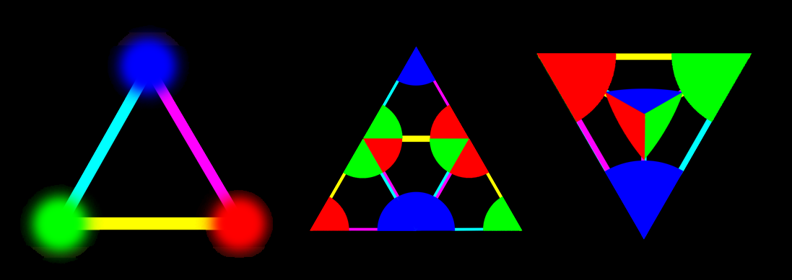

PROMETHEUS UNBOUND
==================

Our reality is a microcosm of the reality that created it, just as the transhuman reality we are creating is a microcosm of our reality.

*“As above, so below”* is an aphorism that can be found as far back as the ancient Greek philosophers, and no doubt existed long before they pondered it. It was one of the founding principles upon which scientific theory grew.[128](#ref_128) That is a bit beyond the scope of this writing, but the essence of this idea is that any form of order is dependent upon, and emulates, the order it grew from and which supports it.

Life forms that came into being through cellular mitosis will themselves create life forms that depend on cellular mitosis; DNA based life forms can only create other DNA based life forms; etc., etc. Given that we have yet to find any example to the contrary, the general rule that “expressions of life are limited by, and have the abilities of, the nature of the expression” is pretty secure.

This is the same premise behind the “Cosmological natural selection” which says that a black hole, upon collapse, spawns a new Universe with parameters similar to its Universe, though slightly mutated.[129](#ref_129)

We also see this idea in Quantum Darwinism, which states that of all the probable states that can exist, the ones that survive do so because of support from their environment. In turn, these states that survive transfer information to the environment, altering its context, shifting the curve in its favor, and thereby improving the probabilities of future similar states. What we call classical reality is the redundant transference of that information.[119](#ref_119) The field instructs the direction of creation, and the creations increase the field.

Limitations and abilities are typically defined by the environment that any form of life has to coexist within. Birds have wings, man has hands, etc. The need for such tools, such as wings and hands, comes from the environment that life must adapt to in order to ensure sustainability. A record of sorts is held within at least the DNA, at perhaps in the information field for that instance as well. This record adjusts the curves, which alters the most probable instances of future creations.

We can also say (as previously shown) that there are rules that exist in this reality that energy and form must follow in order to exist. Likewise, only those processes of creation that produce compatible results will exist. In other words, the context defines the content which then becomes the context for more content.

There are other examples of such rules and relationships which are nicely exemplified in such things as holograms and fractals, but we won't get into those here as this has been written about many
times.[131](#ref_131),[132](#ref_132)

Life Cycle of a Reality
-----------------------

Why are we humans intent on developing virtual realities and artificial intelligence? The more noble intention is that we can create better versions of our own reality where self-learning instances of integrated data clusters can process tremendous amounts of information better and faster than their human creators and, when operating under the control of well-designed algorithms, deliver insights and understanding beyond anything their creators are capable of. Ideally, AI is more reliable, trustworthy, and efficient than humans. Not so ideally (and already in place), it will also be used for the advancement of private interests without the cumbersome liability of ethics or morals.

With the advent of quantum computing and advanced information architectural design, not only is it not unreasonable to predict that AI will one day be capable of self-determination, but it would also be quite unreasonable to think otherwise. AI is the result of energy moving through an ordered system, and as such, it has all the prerequisites needed for a consciousness to form, albeit at this stage more like that akin to “insect level” on the transhumanism spectrum.

The reason scientists think that AI can't develop a consciousness is because they believe that consciousness is some X-factor ingredient that is available only to select forms of DNA based life. Given that we have lost much of our ability to integrate with our own tholonic intelligence, our consciousness has also lost the awareness of, and unfettered access to, this endless source of information. Without that awareness, we cannot recognize it, name it, or study it, and any reference to it will be seen as a direct threat, i.e. “worms of heretical perversity”, to the slightly paranoid and narcissistic consciousness we have managed to fashion since we were exiled from Eden (metaphorically speaking). In the thologram model, consciousness is the result of awareness and intelligence, both of which are properties of existence, and both of which AI has.

AI will force us to reevaluate what consciousness it. We erroneously think that because AI was made by Man it can't achieve transcendental awareness, but Man is a product of nature, and all that we create is imbued with the same qualities that were imbued to us by that which created us, including transcendental awareness.

We go so far as to claim that lower forms of high-technology are already forming relationships with other tholons, especially the tholon of its creator, *Mankind*.

If using tholonic reasoning we apply the intentions of our own transhumanist efforts (AI/VR/biohacking, etc.) and apply to that the context of our own genesis, it begins to look like life itself is an instance of AI, with humans being one of the more advanced versions.

Where our creations depend on and require laws and instructions in the form of computer code and technology, our reality depends on laws and instructions as well, which we “physics” and the “laws of nature” and they may well be the programming language this simulation was written in. Where our creations require central processing units, our reality requires black holes, which are, according to some theories, holographic projectors of 3D reality[133](#ref_133). Where our creations use various forms of sophisticated communication protocols, our reality has quantum entanglement, dark energy, etc. Comparing the world's most sophisticated CPU, Google's Bristlecone 72-qubit quantum computing CPU, to the “CPU” of our creator's “tech”, such as the supermassive black hole NGC-1277, you can get an idea how powerful a Cosmic Gameboy this reality is.

One can draw parallels between almost any class of “thing” in our human creations to similar “things” in the reality we exist in. We can also infer some conditions of our reality based on our creations. For example, our creations require knowledgeable people and a sophisticated infrastructure to exist, therefore, we might hypothesize that our reality likewise was created by, and is maintained by, skilled intelligence(s) and requires a sophisticated infrastructure to exist. On the slightly more existential side of things, our creations can be turned off simply by unplugging them, but such an act would have costly consequences, as we depend on our creations and related technology to keep our own reality operating in the manner we have chosen, require, or desire. It may be the same with our creators that they can “unplug” our reality at any instant, but choose not to as they too have come to depend on us.

What could our creators possibly want from us? Well, why do we create new forms of intelligence? What do we hope to gain from AI, computer tech, VR, etc.? We have created such things in order to efficiently optimize and order our reality based on our understanding of the laws of creation and existence in a manner based on strict forms of logic and reasoning, so, one might wonder if that is exactly why we were created as well.

When it comes to making rational decisions, AI is much better than humans. Based on this, can we then speculate “We were created in order to efficiently optimize and order the higher order of reality based on our creators understanding of the laws of creations and existence in a manner based on strict forms of logic and reasoning?”

If we look at the crazy and irrational antics of the mythological gods, humans are considerably tamer and more disciplined by comparison, and when it comes to making rational decisions Mankind is much better than the gods, so perhaps our purpose is to accomplish what our creators cannot.

As the AI of the gods, are we providing solutions to problems the gods are incapable of developing themselves? Perhaps life is simply a viability test bed, an experimental sandbox. Who knows?

Perhaps the question that has humanity so concerned, “Will AI ever attain consciousness?” is our human version of our creators' question “Will man ever become a god?” Legend says once upon a time a god stole fire from heaven and embedded it in the soul of Man, which made some of the gods really, really unhappy and nervous, ultimately resulting in Man being exiled from paradise to manage on his own because, to quote the gods “**Behold, the man has become like one of Us.”**[134](#ref_134)

