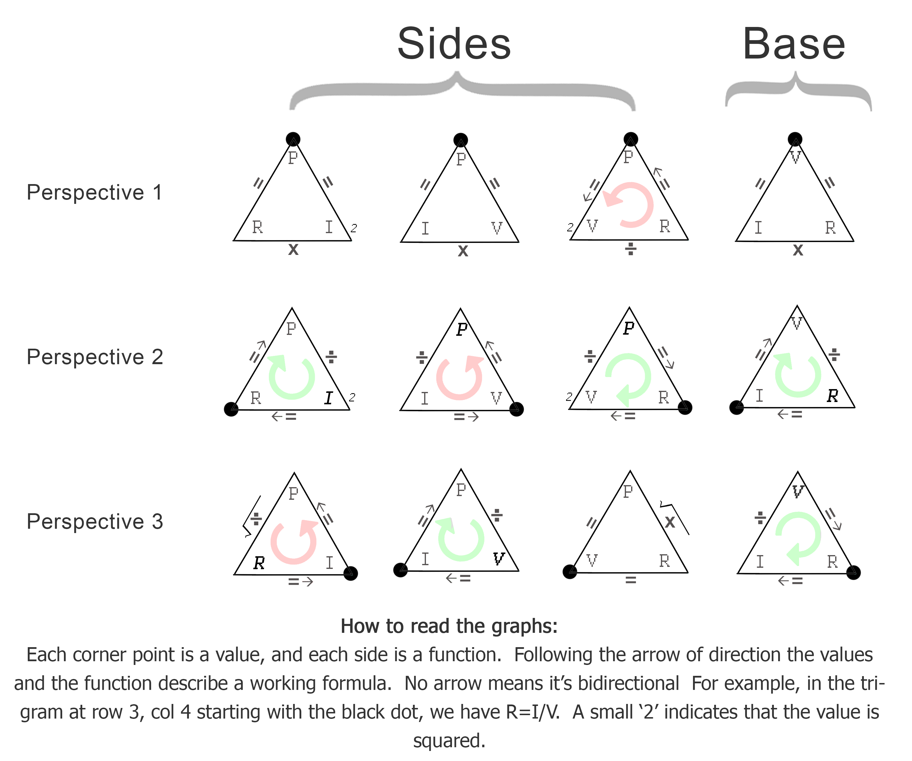

B - Tholonic Math
=================

One of the fundamental claims being made here is that a coherent and stable expression of energy, in order to be sustainable, must satisfy a number of prerequisites that will ensure its sustainability. It’s a bit like existential bureaucracy, in that if the proper application for existence of not filled out completely and accurately, the request is denied.

Within the tholons are numerous relationships, the most common being the twelve formulas that define Newton’s 2nd law. If we map these formulas to the tholon (using Ohm’s Law here as an example) using the reasoning described earlier, we get the following:

This shows the four trigrams that make up a tholon, however, depending on the perspective of view of the tholon the formulas will be different. Besides the basic twelve formulas, we also see that there is a ‘direction’ to some of the formulas, counter-clockwise (*levo* or *lefthanded*), and clockwise (*dextro* or *right-handed*).

We can enhance this diagram by showing the relationship between values that are squared and values that are square-rooted.

Here we see that wherever two corners share the same value, one of those two values squared in the formulas. So, we have *I* and *V* that are squared, but then we also have *I* and *V* that are the products of square-roots, which shows that the tholons naturally balances itself.

Every trigram has one edge that is a function (multiply or divide). If we order the trigrams by these functions we get the following:

If we organize the sides of the tholon by their function (multiply or divide), we see that we have three multiplications and six divides. This 3:6 ratio makes sense when you consider that multiplication works the same in both directions (3\*2 = 2\*3), but division only works in one direction (2/3 != 3/2).

We also see that in the trigrams that are division-based (rows 2 ad 3), three of them have clockwise flow, and three of them have counterclockwise flow.

In this figure…

…we show the three perspectives of a tholon, including the base, but you'll notice that the base trigram is reversed, as would be the case in a tholon as it is a mirror image of its parent, as described earlier. An interesting point here is that the outer boundaries of each figure show a consistent direction of flow, *Fig. v1* being neutral, *Fig. v2* clockwise, and *Fig. v3* counterclockwise, which matches the direction of the sides, however, the base is always counterclockwise.

Tholonically, we can easily map thinks like Ragone and utility space (as in the battery), or laws and social responsibility (as in the example of society), to a simple trigram, but it is not yet clear, to me at least, what the social equivalent social expression of *I2* or, *SQRT(P/R)*, would represent. In fact, there are quite a lot of relationships, rules, and formulas in a tholon that will require considerably more study. What is presented here is the idea that the tholon can represent any system when described in its most reduced states. This work is more akin to the Wright Brother’s first flight rather than a modern airplane, but like the Wright Brother’s first flight, they demonstrated what *could* be. That is what I hope to achieve here.
