# Tholonia and the I-Ching

It&rsquo;s been mentioned several times already that the basic principles of the tholonic model should be discoverable in any sustainable model, be it form or idea, if all creation follows the same rules. 

To test this we would need to find a model that has existed for many years, purports to explain the nature of reality,  is expressed in a language compatible with, or translatable to, geometry or mathematics, which would be necessary to make valid comparisons with the thologram as it is also based on geometry and mathematics.

Many religious, spiritual and legendary models claim to shed light on the mystery of reality, and even though we can find metaphorical parallels within the thologram, that is not sufficient to make a solid case. We need something more quantified.

The closest Western models that we can find are science and its precursor, alchemy. However, we want to find a model that is outside the realm of Western science because it is already obvious how geometry and math work in those areas.  We also prefer to find a model that is more ancient as the hypothesis here is that both ancient and modern models of reality have the same conceptual foundation.

What ancient models exist?  There are the Hindu scriptures, which are both elaborate, detailed and quite old, but extremely difficult to quantify for comparison.

There is the ancient works from Sumeria, Babylon, Egypt and the Jews, much of which of which culminate in the mystical Kabbalah, but these works are so shrouded, obfuscated and protected that simply compiling the data necessary would be the task of a lifetime.

Finally, we have the ancient Chinese I-Ching, or Book of Changes, which dates back to the 10^th^ century B.C. (or the 29^th^ century BC, depending on what one recognizes as the &ldquo;starting point&rdquo;) and has been integrated into Taoism, Confucianism, and Buddhism.

Of these, the I-Ching is the best candidate for the following reasons&hellip;

- It, like most models of reality, is based on the same basic idea that everything exists between a state of somethingness and nothingness.
- It&rsquo;s origins come from the 5,000 year old legendary and mythical ruler *Fu Xi*&rsquo;s desire to &ldquo;become thoroughly conversant with the numinous and bright and to classify the myriad things.&rdquo; (*from Fu Xi&rsquo;s work the &lsquo;Great Commentary&rsquo;*, 168 BC) which is the same motivation behind the birth of philosophy and ontology in the West.
- Unlike the Hindu texts, and to a lesser degree the Kabbalah, the I-Ching is constantly evolving. What began as a primitive ritual of comparing tortoise shell cracks to the stars in the sky has evolved into a form of binary math that even great thinkers of today appreciate. The I-Ching&rsquo;s ability to adapt to and incorporate new perspectives is critical in this case.
- It has found a home in every major culture in the world; Western, Jewish, Islamic, Asian and East Asian and its ideas have been incorporated into philosophy, religion, art, literature, science, technology and medicine and is studied at major universities (Oxford, Cambridge, Columbia, Stanford, etc.).

So, let&rsquo;s deconstruct the I-Ching using the tholonic modal and see what we find.

There are many, many books on the origins and philosophy of the I-Ching, so we are not going to get into that here. If you want to know more about some of the details we present regarding the I-Ching you are going to have to do your own research.

The most obvious and important foundation of the I-Ching is that it is based on the polarity of yin and yang. Although this concept arose before the birth of Taoism, the Taoist symbol of Yin/Yang (called the *Taijitu*) has come to embody this concept.  We have seen this pattern before, perhaps as an archetype of one of the most fundamental expressions of energy in our universe:


This Taoist symbol does not represent the Oneness from which the first duality emerged, as it is often believed. Rather it represents the first duality, as well as the Oneness that emerges from an existing duality, in other words, an *N-state*.  The original Oneness, for which there is no image, is the source from which the initial 0-dimensional &ldquo;blue dot&rdquo; appears in nothingness, and as this dot  did not come from a duality (that we can see) there is nothing we can say about it for now other than &ldquo;it just is.&rdquo;  So, this image represents the Oneness that comes from the first duality of somethingness of the concept of a dot and nothingness. In the thologram, that first duality is the &ldquo;green dot&rdquo; and the &ldquo;red dot&rdquo;, and if you remember, it is only along the spectrum that is defined by, and connects, these two dots where a new N-state can emerge from.

From the tholonic perspective, that which created the first duality is different from that which creates all the other dualities, but the process is the same. If we reuse a earlier diagram of the tholonic trigrams but replace the initial, and only the initial N-source with a Zen circle (because I have no ideas what *should* go there, just that is should not be the Taijitu), we have the following:


## Basics

The I-Ching, like the thologram, has the basic concept of a trigram as the stable building block of structure. In the I-Ching a trigram, is simply three states of yin/yang together to form a stable concept. There are eight possible combinations when using yin and yang (shown below).

The I-Ching also has a concept of an &ldquo;lower&rdquo; and an &ldquo;upper&rdquo; state. It describes the lower state can be earth, matter, the subjective, the hidden, the inner, etc. depending on context, and the &ldquo;upper&rdquo; state  as that of heaven, ideas, archetypes, the outer, exposed and the arena of creation, etc, also depending on context. 

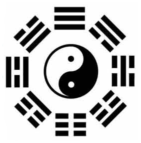

This result is a total of 64 hexagrams, shown below (even values are blue, odd values are red,  for easier viewing).  The number under the hexagram is the binary value of the hexagram, which differs from the numbers in the I Ching.  Unless otherwise notes, we will be using only the binary value to identify a hexagram.


While there are 64 hexagram, it is more useful to think of two different sets of 32 states (shown in two columns). The reason this is more useful is because we now have the concept of 32 pairs of hexagrams, and we can consider this pair as the duality of an even broader concept

For example, take the most basic hexagrams (using their binary values, not the numbers given in the I Ching), 0  and 63 , the *Receptive* and the *Creative*. Between these two hexagrams all other hexagrams exist, so together they represent one state that includes the  broadest context that everything exists within. Another example is the pair hexagram 20 *Obstruction*, which states (and I&rsquo;m paraphrasing):

> When faced with dangerous obstacles it is wise to retreat and prepare accordingly with those of like mind. 

… and it&rsquo;s opposite, 43 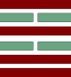, *Opposition*, which states:

> When opposites meet that must proceed with care, for brusqueness will lead to calamity, but through understanding and cooperation we can change an opposition into a polarity. This is how all things come into being.

The *uber* concept here is one of opposites and how they can interact either through cooperation, as polarity, or conflict, as obstruction.   

## Trigrams 

A tholonic trigram is a bit different, but quite compatible with the the I Ching trigram. Instead of three states of beginning, middle, end, or earth, man heaven, it is made of a source, and its two polar opposites that emerge from it, something like a *synthesis* that holds within it its own *thesis* and *antithesis*. 

The thologram also has a concept of *upper* and *lower* in that the *upper* trigram of the I-Ching equates nicely to the parent trigram of a tholon. The resulting *lower* trigram of the tholon is created by the new N-source of the parent. We can now see that the final hexagram is perfectly equivalent to a tholon map.


It might see counterintuitive that the *upper* or *outer* trigrams of the I-Ching equates to the smaller and smaller embedded trigrams of the thologram, but not when you consider that it is the smallest and most embedded tholons that represent the bleeding edge of reality where new creations are being born, dying, and morphing. The farther up the thologram, the less things change. In the thologram, the parent trigram is what forms the environment or context for a new N-source to come into existence, so the parent trigram is the incubator, so to speak, for the yet to be manifest N-state. The smaller, inner trigram inside the parent is where the newly created N-state creates its own environment, which incubates yet another N-state, and so on. This is why the I-Ching&rsquo;s *lower* trigram equates to the tholon&rsquo;s *parent* tholon, and the *upper* trigram equates to the child tholon&rsquo;s instantiated *inner* trigram. 

*Note: One interesting detail when we use the outer trigram on the parent level with the inner trigram on the child level; all the numbers for each side equal 9 (1+6+2, 2+4+3, 3+5+1). That does not mean this mapping is &ldquo;correct&rdquo;, but it does mean there is natural symmetry, and symmetry is an excellent indicator of order, and therefore the movement of energy.*


## The six stages (in the I-Ching and the thologram)

According to the I-Ching there are 6 stages of change that describe the life-cycle of a creation, or instance. This is stated very clearly:

> All movements are accomplished in **six stages**, and the seventh brings return.

##### ~ Hexagram 24 &ldquo;Return&rdquo;

> The holy man, who understands the mysteries of creation inherent in end and beginning, becomes superior to the limitations of the transitory. For him, the meaning of time is that in it, the stages of growth can unfold in a clear sequence. He is mindful at every moment and uses the
> **six stages of growth** as if they were six dragons (the image attributed to the individual lines) on which he mounts to heaven.

##### ~ Commentary on hexagram #1, the Creative (The I Ching,  Wilhelm/Baynes edition)

This shows a general idea of the 6 steps from an I Ching and tholonic perspective.

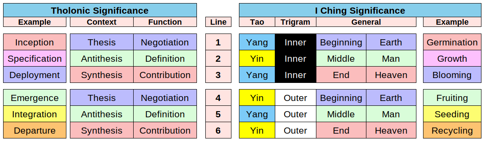

One way to understand the 6 step is by looking at the 6 steps of bifurcation needed to create 64 children form one source.

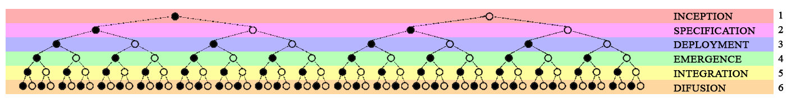

Another way of looking at the 6 stages is from the tholonic model in the following way. 

 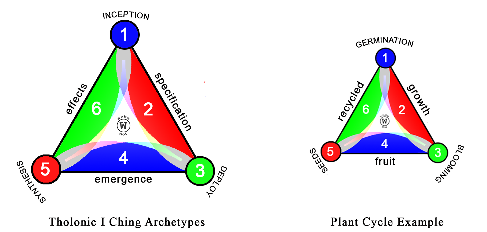

Notice how the #4 blue line, which is the tholonic *Negotiation* line and the only area where new *N-states* can form to create children, is also defined a *Emergence* in the I Ching, which is consistent with the traditional definition of line 4. Also note how a point (which is yang), such as 1, 3, and 5, results in lines (which are yin) 2, 4, and 6) of the similar but opposite quality.

There is yet another way to look at the structure of the lines, and one that is arguably the one that is the basis of the current traditional interpretation.

 


*Fig. k1* shows a simple binary tree that starts at the center and bifurcates outward to 64 end-points.  This form is especially useful because it so clearly show the direction of the YIN movement (*Fig. k2a*) and the YANG movement (*Fig. k2b*), and when we add these two opposite moving patterns together we can see an impressive fractalated pattern that looks quite similar to a navigational compass (*Fig. k3*). *Fig. k4* shows the dots and the lines together, but in addition, each of the six concentric bands has been colorized, and the connective lines have been greatly thickened, with a Tao symbol added to the middle to represent the original duality.


Each of these concentric rings represents each successive bifurcation which defines each of the lines in a hexagram.  The above image show the path from the beginning to the end for hexagram 23 (binary).  

This structure tells us a lot about the I Ching. For example, we would expect to see the more cardinal points hold somewhat of a "cardinal" value.  To see this, we highlighted the paths of each of the cardinal and semi-cardinal paths and show the hexagrams they produce aling with there meaning (and their traditional number).


*Note: All hexagrams that have a solid yang in the 6^th^ place, at the top have values greater than 31, and demonstrate internal or descending qualities. These hexagrams are shows in italics in in this chapter.  All hexagrams that have a broken yin line in the 6^th^ place have values less than 32, and demonstrate external or ascending qualities.  These hexagrams are shown in all CAPS in this chapter.*

The first thing we notice is that the exactly opposite the cycle that begins and ends with the hexagrams 0 and 63 at the top, is the hexagrams *Return* and COMING TO MEET. Considering this is exactly the point where the cycle begins to return, it suggests that the ancient interpreter of the I Ching saw this same pattern.  The other thing we notice is the symmetry of the numbers, wherein all ever pair of opposite (ascending and descending) values on opposite sides of the vertical axis always equals 63. The same is true for every lower and upper trigram, but in the case of the ascending trigrams, the axis is diagonal from area 4/5 to 8/1, and for the descending trigrams, the axis is mirrored, from 5/6 to 1/2. 

We can also see that each pair of hexagrams for the same point has a meaning that is similar from two different aspects.  On the graph on the right, above, we have renamed these points according to the theme they share. Below we look at hos this was arrived at.  it is recommended that you look at the meaning in full is Wilhelm/Baynes version.  Pay attention the that detail that in the case of *ascending* hexagrams, the influence is always from the nature, or the times, or other influence beyond the control of man, while in the *descending* hexagrams, it focuses on the same quality but in the hands of man.  This is the duality that the authors worked with, that of nature vs man, state vs individual. This gives us a great insight into the moral agenda of the authors, who, of course, worked for the state.  

1. Both of these hexagrams define an extreme end point, the polarity that defines the spectrum within which every other hexagrams exists. This defined **arena of creation**.
2. Both of these describe a time when the high and the low are in **harmony**. In one case (*Peace*), it is the result of the times, and in the other (TREADING), it is the result of decorum and pleasant manners succeed. 
3. Both hexagrams speak of **progress**. In one case (*Approach*), it is the result of the time, such as spring time. The other case (FELLOWSHIP) speaks of progress in difficult times as long as people unify and are working towards the goals of humanity.
4. Both hexagrams refer to find the inner light for **guidance**. In one case (*Darkening*), when external circumstances are unfavorable, and in the other (INNOCENCE), when one is at risk of wandering off the path of righteousness.
5. Both hexagrams speak of a **reversing course**. In one case (*Return*), it is the natural turn of the cycle when the light returns to the darkness. In the other (COMING TO MEET), this change is the result of a decision but warns one of allowing the inferior to gain access to the superior. However, it also admits that this meeting of inferior and superior is what brings about all life.
6. Both hexagrams speak of the need for **adaptation** if progress is to succeed. In the one case (*Pushing Upward*), because of one's modesty and adaptability, progress is assured. In the other, (CONFLICT) there is a warning to avoid treachery and only consider modest and amicable means of progressing when met with resistance.
7. Both hexagrams speak of the management of **force**. In one case (*Army*), it speaks of the discipline, as well as trust in a leader, that are necessary for a force to be effective. In the other (RETREAT), the wise use of force is needed when facing a stronger force. In the other 
8. Both hexagrams describe a time when the end of a cycle has arrived, and as it is returning to the point it started, this is its final **destination** . In one case (*Modesty*), it tells of how the law of nature is to raise that which is low, and lower that which is high. In the other case (STANDSTILL), the end has arrived as confusion and disorder because the dark waxing power has given rise to lowly people.  In such times, faith in one's principles is the only recourse. 

This can be reduced again to a more abstracted four pairs, and they can be reduced further to two, which would be the duality from which everything emerges. I argue here that this duality is the same duality that everything evolved from as well, that of *Definition* and *Contribution*, and everything exists as a result of *Negotiation* between those two states.  The reader my discover something very different.


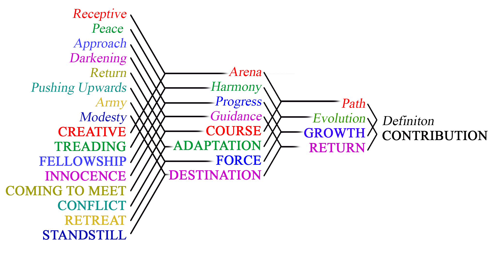


## The Lines 

Here is a charts that shows a a more in-depth descriptions of the 6 steps from a tholonic and I Ching perspective. It is divided into two hexagrams, *lower* and up*p*er. Pay attention to the similarity of the three concepts that each line in the trigram share with each other, as they are essentially mirror aspects of each other.

*Note: It is both difficult and misleading to use one word to define an archetype that can have many different instances, nevertheless, we do exactly that, but remind the reader that these words are simply hints to a much larger significance.*


Once we cross the line from *lower* to the *upper*, the quality of the line positions flip making what was **yang** in the *lower* trigram **yin** in the *upper* trigram, and visa versa. In the tholon we see this same reversal in the *reflection* trigrams and *virtual* tholons. 

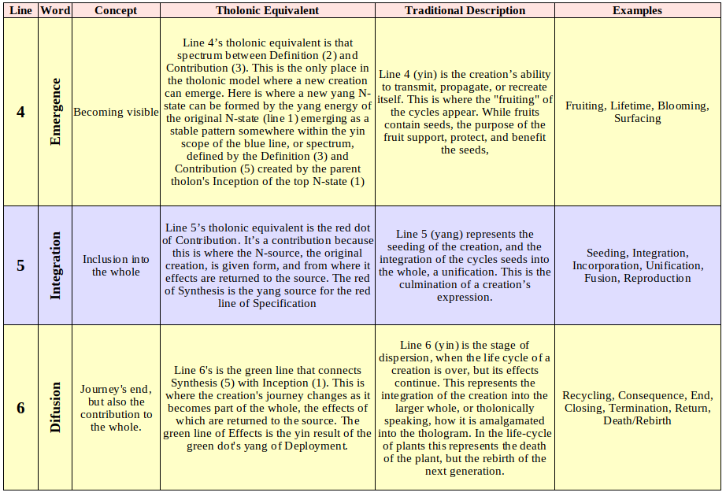


### Lots of 6s

In these models of creation we have 6 steps of creation of a hexagram, the tetrahedron (tholon structure) is composed of 6 vectors, and the the N-source has a value of 6. In creation myths we see the number 6 play a significant role in creation myths such as Genesis and the Quran where all of creation was accomplished in 6 days, and in the Babylonian creation myth, the Enuma Elis, where God created 6 gods, each in charge of the 6 different aspects of creation (where they spent 2 days creating everything and the rest of their days fighting with each other). In the building blocks of creation (chemistry) we see six electrons in carbon, the foundation of life. 6 seems to be a very significant number and is firmly associated with the concept of creation.


We can easily recognize this same archetypal structure in all growing and alive systems, from the process of mitosis to the shape of trees and plants with their *inner* roots and *outer* branches and leaves.  In this form, we see the *inner* paths move downward, and the *outer* paths move upward. This is significant because in the thologram there is a similar concept of a real tholon and a virtual tholon which are matched to create a complete tholon. We also saw an example of this when looking at how the complete tholon models quarks to the proton. 

In the thologram all odd numbered tholons are *real* and all even numbered tholons are *virtual*. Likewise all hexagrams that begin with a yin line are even numbered hexagrams, and those that begin with  a yang are odd numbered. We now have a very clean mapping between the thologram and the I-Ching of *virtual* as yin and *real* as yang. 

We arrived at the same results of 6 fundamental concepts formed by a pair of trigrams from two completely different processes; the process of the thologram was based creating a tetrahedron from a point, while the I-Ching is based solely in the binary system which is never used in the thologram.

There are many mappings and similarities between the tholon and the I-Ching, but I will only show one more because it not only maps hexagrams to tholons, but to basic physical structures in nature.

If we create a binary tree of the I-Ching where the bifurcations follow the path of least resistance, meaning they will always move into the emptiest space, we end up with bifurcations that will be 60&deg; apart from each other (which is also the angle that creates a tetrahedron/tholon), which would then create the following patterns for each of the 6 generations of bifurcations (this is easily done with the L-systems language described above with the rule ***F=F\[+F]\[-F]***):


Simply splitting one line into two lines, in accordance with the laws of inertia, we naturally form a pattern of hexagons that perfectly matches the pattern of tholonic expansion. This is because the I-Ching and the thologram represent the same laws but in the context of a binary system (I-Ching) and a trinary system (thologram). Not surprisingly, the one point they both naturally center around is the N-source, which we have already shown to be equivalent to the Taijitu   

The image below is a more in-depth version of the overlay above.  Here, we follow each bifurcation starting with the one point from which the original duality emerged from. The arrows show the direction of the movement, with left-sided arrows as yin, and right-sided arrows at yang (or visa-versa).  Doubled headed arrows indicate that one line is shared by two parents, and line swith arrows in both directions indicate a share line that is bidirectional.  

*Fig. hb1* shows the paths of all 64 hexagrams of the I Ching which are the result of 6 generations.  *Fig hb2* shows the 7th generation. This is added only to show that with the 7th generations we get the first complete closure of a hexagram, which is an example of the "All movements are accomplished in six stages, and the **seventh** brings return." *Fib hb3* is the same pattern, but iterated over 13 generations, generating 8,192 (2^13^) final values. It is included simply to show how it remains a hexagram and how only the last two generations are even visible, occluding all previous generations. Notice how at this pint the dominant pattern, which will remain the dominant pattern for all future children, are two sets of three double-headed arrows, one set from the final generation, and one from the previous generation of the final generation and the pattern . These triplets do not appear until the 8^th^ generation.  Because new generations overlap the previous, the structure is really more of a 3D design, which the originating point in the center, expanding with each generation, creating a hexagonal cone.

Also of interest in this diagram is how it shows that the original N-source is the result of its own creation *after* 6 generations.  In other words, after 6 generations, a new N-source is created that begins a new cycle and *departs* from the previous. Also of interest is that it is the 5^th^ place where two different cycles come together first, which is why the 5^th^ place is one of *integration*. 

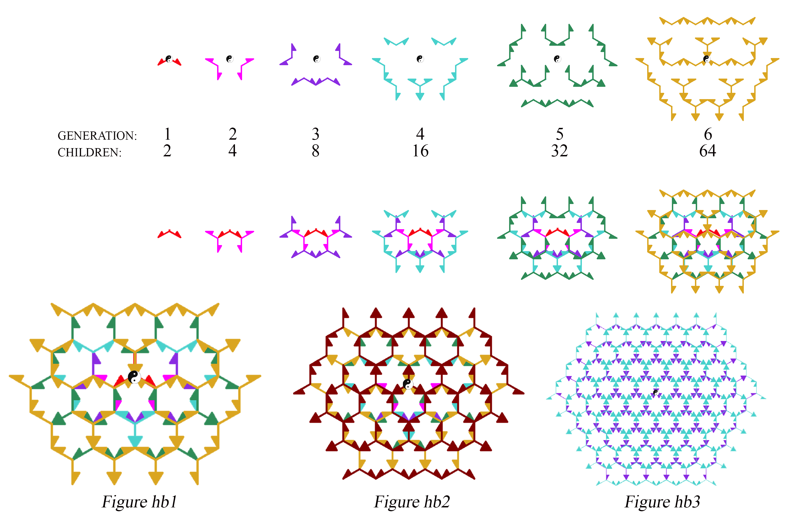

All of this is to demonstrate how the two systems are quite compatible to the point where not only can the entire I-Ching be mapped to the thologram, but the thologram can greatly elaborate on the I-Ching and give it a 3D structure, and given its recursive nature, infinitely so. 

The I Ching always was, and is, a technical manual:

> After meeting genuine teachers all my doubts disappeared, so that for the first time I realized that the Tao of spiritual alchemy is none other than the Tao of I Ching, the Tao of sages is none other than the Tao of immortals, and that the I Ching is not a book of divination, but rather a study of investigation, of principles, fulfillment of nature, and arrival at the meaning of life. 

##### ~ Liu Yiming (18th c. Taoist master)

> Although the words are very clear, yet they are also very vague. The shallow may take the I Ching to be a book of divination, but the profound consider it the secret of the Celestial Mechanism.

##### ~ Lu Dongbin, 9th c. Taoist master (introduction of The Taoist I Ching)

Hexagons are formed by six N-sources.  This is the tholonic archetype of a hexagon.  Any hexagon, therefore, has a virtual N-source that is induced into being by virtue of its creations, the dimensional lines.  The image below shows the progression of an evenly distributed bifurcating tree (60&deg; separation), which includes many overlaps. The overlapping redundancy of the pattern unfolds as we narrow the separation, which we can see by the density of the lines.  In the beginning, the originating hexagon(s) have an evenly distributed  concentration of N-sources.  As the pattern unfolds, we see the density move from the center to the outer edge. If we apply this concept to the most obvious instance of an actual tree as a metaphor, we would see that the highest density of N-sources exist around the center, as a seed, and around its leaves and flowers when it is full-grown.  In its last stage, it returns to nothing more than a line, with all the N-sources spread out to infinity (according to the math, which is not shown here, as I have no idea how to draw it). This same process applies to the foundation of any instance, from the Big Bang to ideas.

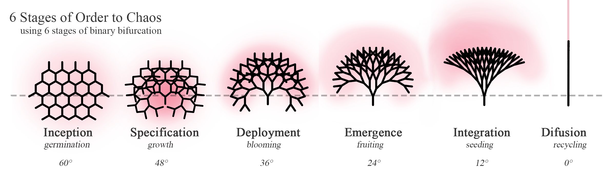

<p style="border:1px solid lightgrey;background-color:#ddd;font-size: 1rem;font-weight:100;font-family: 'Times New Roman', Times, serif;font-style: italic;"> When unfolding this binary hex pattern we see the classic tree pattern that is so popular among many forms of life, but where are the N-sources located in the tree pattern?  They do not exist as form because N-sources are dimensionless; concepts only.  The only parts of a pattern that can have form, or instantiate, are the children of the N-source. The N-sources exist within and around the form.  Literally, the form exists within the concept of the form.</p>


However,the following graphic shows the stages of development of the products of the N-states  over the course of its progression. It begins where the previous ended.


You can see they are exactly opposite. This is because the source of creation and the expression of creation move in opposite directions.  The I Ching hexagram deals with the creative expression, not the creative source, which is the Tao itself, of which nothing can be said.

Lao Tzu alludes to this duality of oneness when describing the nature of the Tao:

>As soon as beauty is known by the world as beautiful, it becomes ugly. 
>As soon as virtue is being known as something good, it becomes evil. 
>Therefore being and non-being give birth to each other. 
>Difficult and easy accomplish each other. 
>Long and short form each other. 
>High and low distinguish each other. 
>Sound and tone harmonize each other. 
>Before and after follow each other as a sequence.

##### ~ Lao Tzu,Tao Te Ching

The following is a bit of a tangent, but worth sharing before we move on to the lines.  Below is a graphic that shows three conditions of the binary tree above.  The first conditions is *Maximum Freedom*, where the direction of the children is undetermined and completely unlimited.  The second condition, *Limited Freedom*, is where the direction of the children is limited by 96% (give or take 4%). The final condition, *No Freedom*, is where there can be no deviation from the rule.  Much can be said about the significance of this, but it's probably wiser to leave any conclusions to the reader.


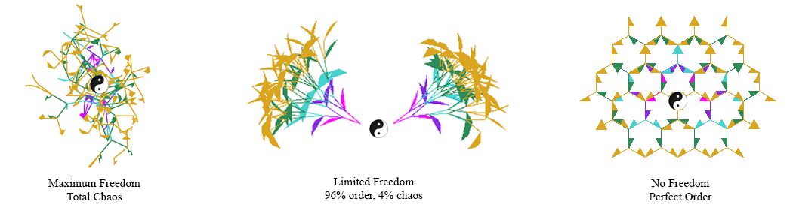


Here is a general idea of how the transformation progresses from its minimal state to its most open state (with no randomness):

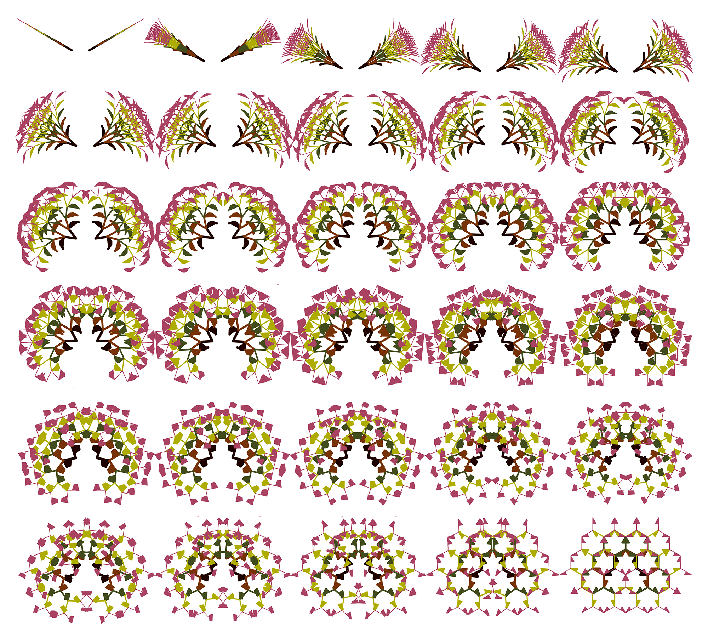

The images above represents a progression with no randomness, making them essentially "perfect." This progression can be considered an archetype, or a pattern that reality generally follows, but imperfectly.  If we added just a little bit of variation into this process, on just two variables, length and angle, we get the following.  The upper images are the variations due to a little bit of randomness,and the images below them are teh archytype for the same angle of bifurcation.

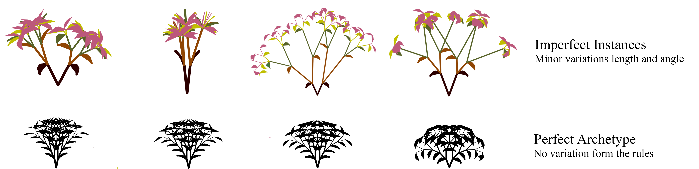

There is one more way we can look at this progression:

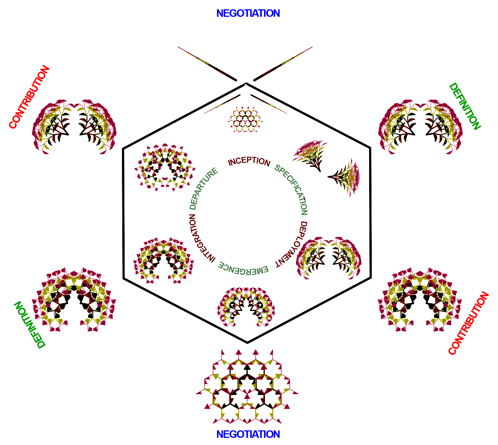

In the image above, we have two sets of images.  The inner images show the six stages of progression from the beginning to the end, starting with 0 degrees of bifircations, and ending at 60 degrees. Also shown is the 7^th^ stage and final stage that completes teh cycles, as the I Ching states when it describes how "*All movements are accomplished in six stages, and the seventh brings return.*"    This type of progression is similar to the way the six lines of the I Ching progress.  The outer images show two phases of a three-stage progression, which is modeled after the two trigrams that form a hexagram.  Both perspectives are valid for the context they are applied to. 

Let&rsquo;s review the 6 steps of each model.

The thologram was created by the three properties of the the three original dots, and these three dots align describe the three stages of creation as they appear in the (tholonic) concept of *parent* and *child*, or the (I Ching) concept *lower* and *upper*. 

Equating the *upper* and *lower* trigrams to the three attributes of N, D, C


Depending on the context (*upper* or *lower*), N, D, and C have slightly different expressions.  In the most general sense, N, D, and C can represent many different concepts depending on its context.

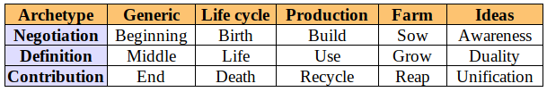

Let&rsquo;s run another test so see if the thologram and the I-Ching are two views of the same model.

Previously we assigned the positions of the points on the tholon as 1, 2, 3, 4, 5, 6 in order to work with the positions of the I Ching lines. Now we need to work with the hexagrams and their values, so we need to use the position of the points as the exponential value of 2 (because we&rsquo;re working in binary), and to do that we need need to start counting at 0, not 1. In *Fig. e1* (below) you can see the values arrived at for each point, and the exponent used to get that value.

*Fig. e2* shows the sum of these values for each trigram and each side. 

In *Fig e3* we have added the name and the hexagram. Don&rsquo;t forget that all these numbers are binary, and not the numbers as they appear in the traditional I-Ching layout.

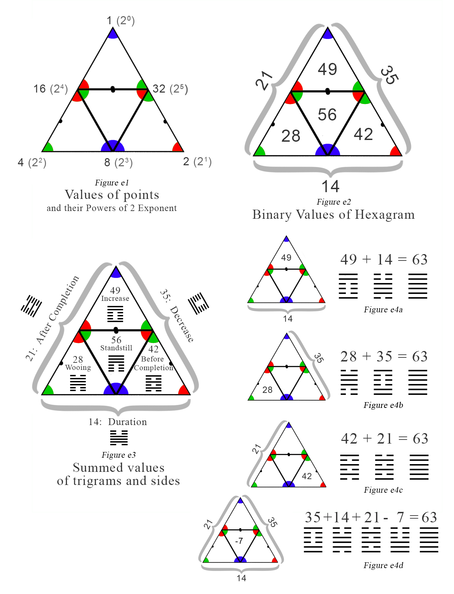

For clarity&rsquo;s sake (even though it may only make things more obtuse), I&rsquo;ve assigned variable names to each property to make the patterns easier to notate and read.

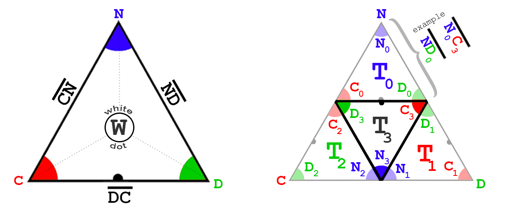

Here are some details worth noting:

- Comparing the three vectors of the parent trigram, as they apply to a social context, to their I-Ching equivalents we see amazingly similar values. Note: We use the values that are derived form the sides of a complete tholon, i.e. 4 triangles. So, while on a single triangle the first side connects blue &#8594; green , but when we use the 4 triangles, which is what is required to make a complete tholon, the side connects from blue &#8594;red 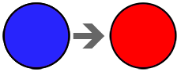. However, in the next generation, it goes back to the original of blue &#8594; green . This is because all odd number generations, 1,3,5,etc., maintain the original order of colors, and all even number generations flip them.  We now can see there are two orders of color, the initial order of blue&#8594;green&#8594;red, and its child order of blue&#8594;red&#8594;green.  It it worth nothing that this reverse order only applies to the two sides that extend form the blue dot, because the red&#8594;green dot, when reversed, is green&#8594;red, effectively remaining the same.  We suggest that the first order is the order that is fundamental to all tholons, and the subsequent order of the children are layers of orders on top of orders, just like a fractal. For this reason we will only look as the first order in the following table. 

| Tholonic Definitions                                         |                                                              | I-Ching Definitions                                          |
| ------------------------------------------------------------ | ------------------------------------------------------------ | ------------------------------------------------------------ |
| The vector from *Negotiation* to *Definitions* is ***Laws, rules and limits.*** |  | *Decrease* (hex 41, bin 35): &ldquo;Restrictions in outer resources requires one to discover and develop inner resources.&rdquo; |
| The vector from *Definition* to *Contribution* is ***Cooperation or conflict.*** |  | *Duration* (hex 32, bin 14): &ldquo;The self-renewing movement of an organized, firmly integrated whole is what allows all things to endure and is the secret to understanding the nature of all beings in heaven and on earth.&rdquo; |
| The vector from *Contribution* to *Negotiation* is ***work, dedication, service*** | 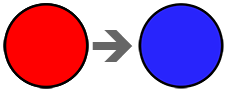 | *After Completion (hex 63, bin 21):* &ldquo;In this time of harmonious transformation, indifference to one's obligation and responsibility will lead to decay.&rdquo; |

The following are some of the observations (super nerdy):


- The sum of any trigram and the side opposite that trigram always equal 63, the maximum number possible. This was exciting to discover as it supports the tholonic claim that the effect of any point can be seen on the side opposite that point.

- The math pattern of the tholon also works is we replace multiplication with addition, for example, 14 + 21 = 35, or **H + S = P**

- What about the middle trigram?  It does not have any other value to pair with. Not only is there no room for its pair, it would need to be the value of 7. However, the value of 7 does exist of we sum the three points of the parents trigrams, which are 1, 2 and 4, (2^0^, 2^1^, 2^2^). These are the points that create the &ldquo;white dot&rdquo; of the tetrahedron, and it also is exactly opposite the center trigram of **T~0~**,&rdquo;standstill.&rdquo;  This math validated the tholonic claim that the &ldquo;white point&rdquo; is created by the sum of the red, green and blue dot. Just as an interesting aside, it is the white dot, with its value of 7, that creates a 3D form out of this 2D map, and the hexagram that is binary value of b7,  &ldquo;Peace&rdquo;, is defined as &ldquo;heaven on earth&rdquo; in the text. If we define *heaven* as the place of perfect archetypes and *earth* as the place of form, then this hexagram perfectly describes the concept of the tetrahedron being the first physical (earth) formation of a purely abstract and archetypal (heaven) idea.

  We have a number of other patterns, for example (and for those who enjoy numbers, because it's even *more* tedious if you don't):

- Every number (14, 21, 28, 35, 42, 49, 56, 63, 70) is a product of the *white dot*, which has a value of 7 (7x2, 7x3, 7x4, 7x5, 7x6, 7x7, 7x8, 7x9, 7x10)

- Every value of a trigram plus its opposite border equals 9 (6+3, 7+2, 5+4, 8+1). This lends more support to the tholonic idea that a corner point (or in this case, corner trigram) is paired with it&rsquo;s opposite border.

- Ever hexagram as an equal number of yin and yang lines (10 of the 32 pairs of  hexagrams have an equal number of yin and yang)

- Only the numbers of the top trigram, which is the originating trigram, are odd.

- T~0~ - T~3~ = H ; *Standstill (56)  - Before Completion (42) = Duration (14)*, ergo, T~0~ - H = T~3~, T~3~ + H = T~0~

- T~0~ - T~1~ = W ; *Standstill (56)  - Increase (49) = Peace (7)*, ergo, T~0~ - W = T~1~,  T~1~ + W = T~0~

- T~0~ + T~3~ = P ; *Standstill (56) + Before Completion (42) = Decrease (35)* , ergo P - T~3~ = T~0~, P - T~0~ = T~3~

- T~0~ + T~1~ = T~3~ ; *Standstill (56) + Increase (49) = Before Completion (42) (after lowering  one octave; 105 - 63)*, ergo T~3~ - T~1~ = T~0~, T~3~ - T~0~ = T~1~

- T~0~ + H = W  ; *Standstill (56) + Duration (14) = Peace (7)*. ergo W - H = T~0~, W - T~0~ = H

- S + W = T~2~ ; *After Completion (21) + Peace (7) = Wooing (28)*, ergo T~2~ - S = W, T~2~ - W = S

- S - W = H ; *After Completion (21) - Peace (7) = Duration (14)*, ergo W + H = S, S - H = W

- (P - S) + T~1~ = (T~0~ + W) ; *(Decrease 35 - After Completion 21) + Increase 49 = (Standstill 56 + Peace 7)* 

- There are many more patterns and relationships as well, and this is only within one tholon that has no parents or children!


## Better Proof

Given that every number has a patterned relationship with one or more numbers, we can reverse engineer where every hexagram sits in the thologram, meaning, we can assign a unique binary value to every vector (or point, but we are only showing vectors here). Remember the chapter that hypothesized how if each tholon had a unique binary value then we could unfold the history of that tholon from the moment of creation to the present? Using the I-Ching as a very small set of unique binary numbers, we just demonstrated this.

I think it is quite obvious and provable that the I-Ching and the thologram are based on the same model. Given that the Kabbalah and the I-Ching are also based on the same model (which I will not elaborate on here as it is way too long), we can say that there is an underlying model that many perspectives of understanding are based on.

I do not doubt that the thologram could be used as a tool for divination, mysticism, magic, alchemy, etc. as much as it could for chemistry, physics, electronics, and many other applications. Any truth that exists can be found in many different instances, and its truth is just as valid on one context as another. The only limitation is the creative imagination of the perceiver.

However, if you still have doubts, what follows is a demonstration of  how the value of *pi* (&pi;) can be derived using the tholonic model along with the values shown here derived from the I-Ching.  We can also find *pi* in the thologram, as previously described, by using the total number of N-sources for all the real and virtual tholons for each generations.  While this technique uses the same method, it it using very different data. 

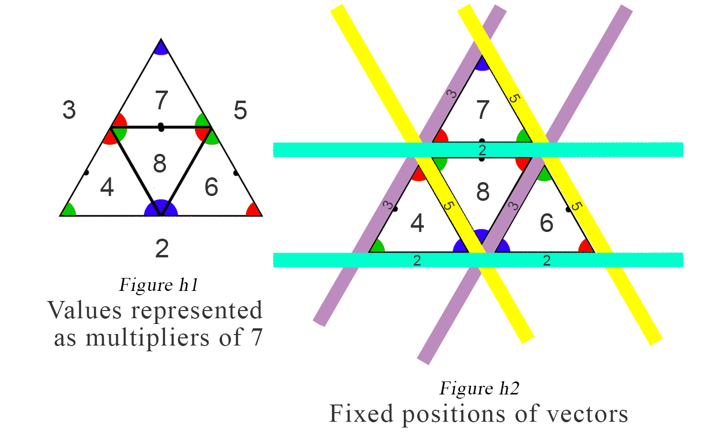

*Fig. h1* shows the hexagram values as multiples of 7. *Fig h2* shows the same values, but shows how the same border values of 2, 3 and 5 apply to all the trigrams. Let's apply the tholonic model to these numbers.   We arrived at these numbers by taking the sums of the binary values for each side, as shown above, which gave us 14, 21 and 35, and taking their multiplier of the number 7 (7&times;**2**=14, 7&times;**3**=21, 7&times;**5**=35) and applying that to the respective side.

Notice how the edges that are univeral to all trigrams are the first three prime numbers, 2, 3, 5, and the multiplier is the 4^th^ prime, and top trigram, 7.

The tholonic model states that the *green dot* (*Definition*) is what creates limits and restricts the N-state, so D reduces N. The *red dot (Contribution)*, seeing as it contributes, will be added to N.

We start by assigning N=1. We then calculate D as 1/P (where P=5, as shown in *Fig. h2*), and C as 1/S (where S=3, as shown in *Fig. h2*). To create a new instance of N we start with N, subtract D, and add C, which gives us 0.78539822525372. This is the value of the child instance of N, which we&rsquo;ll call N~1~. We repeat this process again, but we increment the S and P by H^2^ . After doing this a million or so times, we get the number 0.7853982294712. Multiply this number by H^2^ (4) and you get *pi*.

This graph below diagrams the process (and shows the results already multiplied by 4). Notice how this is exactly the same model that was proposed for transforming a holon, from the holarchic model, to a tholon.

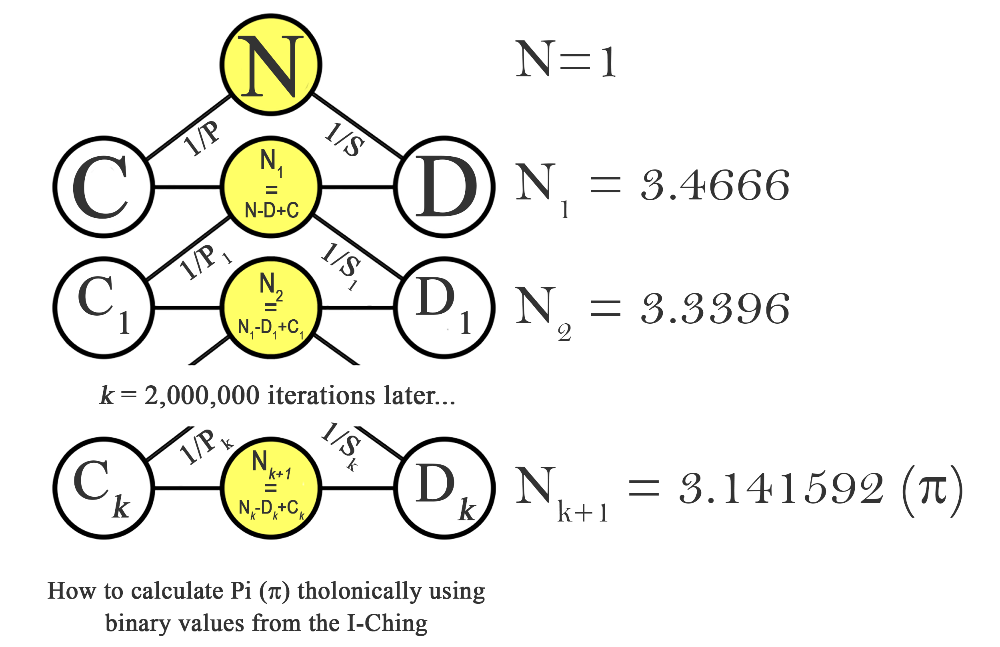

One detail that this demonstration reveals is that the value on the spectrum between C and D had to be *seeded* by the originating N-source. This detail was left out of the description provided in the chapter on &ldquo;STRUCTURE&rdquo; because the reader was already being bogged down with a mountain of details and even though it&rsquo;s an important technical point it&rsquo;s not needed to grasp the concept of a *spectrum*. But the representation of the spectrum along a 1D line is also inaccurate because in the case of a tetrahedron the spectrum is actually across, or within, a 3D space, with the highest probability in the center of the tholon, but that is quite impossible to show. The more accurate way to display this process would have been to use self-similar, embedded 2D trigrams, but that would be a bit messy and limiting, and the even more accurate model would be 3D tholons embedded within 3D tholons, which is almost impossible to conceive, let alone draw.

For anyone that wants to replicate/test this process, here are the five lines of Python code.

```python
def iteration(N,h,s,p):
    n=N-(1/s)+(1/p)
    print(n*4)
    iteration(n,h,s+h**2,p+h*2)
iteration(1,2,3,5) # <= note these are the first four values of the fibonacci sequence (1, 2, 3, 5, 8, 13, 21, 34, ...)
```

We can also calculate the value for Phi (φ, 1.618) using the formula (N+√S)/H where N=1 (not recursive), and the Fibonacci sequence by sequencing the Fibonacci math function around all sides, beginning with H.

As presented earlier, we also see this same pattern in the mathematics of tetrahedral coordinates…


There are many, many relationships, patterns, values and functions in this simple trigram, but for most of them it is impossible to say which of their products are *data*, which are *information*.

## Rebuild

If we rebuild the I-Ching from the ground up using our tholonic model (while trying to preserve its character) we get something like the following:

*Note: As mentioned numerous times before, the interpretations, values and relationships shown here are not intended to be conclusive. While I tried to make them as meaningful as possible, they are more used as examples. There are many ways patterns and relationships can be formed and I am sure a better version than the one presented here can be made. If you, the reader, disagree with some of the conclusions here then that is your invitation to improve upon it. That is why this book is open-sourced.*


The above image is an example of applying the tholonic model to the 8 trigrams of the Pakua.  The vertical and horizontal axis *reflect*, and the horizontal axis *reflect* as well as *reverses* (like a photo negative). ~~Here is the explanation of *Fig c1*… but first, a clarification.~~  In this chart we have three divisions per quadrant representing the three stages of tholonic movement; *Negotiation*, *Definition*, and *Contribution*.  However, it is more accurate to say there are three *phases* or cycles of movement, similar to how three phase electricity works.  All three phases are present all the time at every point, just at different points in the cycle, and presumably in the order of the image below. There are also two different structures in the model - the one formed by the trigrams and lines, and the one that determines how energy moves through that structures, which is described by the tholonic model of *Negotiation*, *Definition*, and *Contribution* sequence of creation.


The tholonic model posits that in any sustainable model there are static properties that represent stable patterns, and dynamic properties that represent the interactions between those stable patterns. In the image above, we have arranged the 8 trigrams of the *Pa Kua* by the natural (binary) order. In doing so we end up with a pattern where all opposing numbers always equal 7, the maximum number that can be represented in binary using three places. Symmetry is preferred to asymmetry as a starting point, for where there is more order there is more efficient movement of energy. The two major axis are represented by the four cardinal points. The vertical axis is represented by the most extreme trigrams (7, 0) for the &ldquo;north&rdquo; and the &ldquo;south&rdquo;, and horizontal axis by the most balanced trigrams (5, 2) for the &ldquo;east&rdquo; and &ldquo;west&rdquo;. This naturally follows the same order we use for the earth and all planets, so we have some self-similarity as well. The other 4 trigrams are the most imbalanced and are therefore more unstable/dynamic. As each trigram is made of three states (*Negotiation*, *Definition*, *Contribution*) that in the material 3D world manifest sequentially, they are represented as the stages that relate the more static archetypes of the cardinal points together.

The first thing we see is how the lines in the east are a mirror of the lines in the west.  This is also true for the lines in the north and the south, but in addition, they are also reversed, like a photo negative and a photo print. We have four quadrants, each with three stages which are defined by the intermediary trigram. We also see how every positive line is matched with its opposite negative line. Although we are looking at 8 trigrams, tholonically this is 4 pairs of trigrams, or 4 *meta-*trigrams, each having a duality. These 4 trigrams are also made of 2 pairs of meta-trigrams, and up it goes until there is no more duality.

## More Definitions

most people have some concept of what yin and yang represent, but for clarification, we'll reiterate: sometimes the words &ldquo;positive&rdquo; and &ldquo;negative&rdquo;, or the symbols &ldquo;+&rdquo; and &ldquo;-&rdquo;, are used to represent yang and yin. Here are some examples of yin and yang qualities that will help you get a feel for what they mean if you are not already familiar with them:

> **YIN**: dark, night, winter, moon, female, cold, water, alkaline, patience, to be, to rest, single tasking, de-flamed, soothed, holistic, university of life, letting go, death, disease, emotion, not being, electrons (negative charge), uncertainty, chaos, illogical, heart-based feelings.

> **YANG**: light, day, summer, sun, male, hot, fire, acid, impetuosity, action, multi-tasking, inflammation, burnout, allopathy, academia, control, life, health, to be, protons (positive charge), certainty, order, logic.

These concepts are relative. For example, a cup is yin and the contents of the cup is yang, but that coffee cup is yang in relation to the saucer it is sitting on. Like everything, the perception of things and properties are relative to the context and scope of it existence.  

Because the first 4 trigrams (   ) all have negative lines at the top-most position in the trigram we refer to them as *ascending* because they begin at 0 and ascend halfway to 7. Likewise, the next 4 trigrams (   ) have positive lines in their top-most positions, so we call these *descending* because they start with 7 and descend halfway to 0.

Because the top 4 trigrams are predominantly positive (more yang than yin), we call the top hemisphere *positive*, and likewise, the lower hemisphere *negative* (more yin than yang).

In keeping with the traditional I-Ching, we want to assign familiar real-world elements and properties. Using these archetypes to describe a scene or function can be very helpful in tapping into our intuitive understanding. For the cardinal points, we have the four classics of AIR, WATER, EARTH, and FIRE. We use all caps for these archetypes to distinguish them from the physical elements. These archetypes represent qualities and properties of the elements that can be found in anything, and not simply the physical instances of air, water, earth, and fire. 

To expand on this a bit, the *other* classic set of elements is referred to as the alchemical principles, which are salt, mercury, and sulfur, which also happen to be perfect representations of the three types of chemical bonding; ionic, metallic, and covalent. But the alchemists are missing the 4^th^ property which is needed to create a tetrahedron. There actually is a 4^th^ type of chemical bonding called *hydrogen bonding*, and it happens to be the type of bond that holds water together. In any case, these three properties are well covered in the four classics; EARTH as salt (ionic bonds), WATER as mercury (metallic bonds), and FIRE as sulfur (covalent bonds), and I guess AIR would then be, ironically, water… with it's hydrogen bonds? Well, until the Royal Society of Alchemists, or whoever is in charge of alchemists, figures this out and comes up with an updated model, we'll stick with the traditional classic.

We have also adopted the astrological/Neo-Platonic qualities of these elements.  Of course, any other definitions could be used to create interpretation that are consistent with other perspectives.

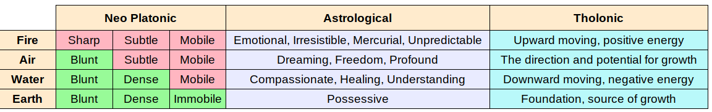"

There is another reasoning behind what trigrams are chosen to be cardinal, and dynamic. When applying tholonic logic to the I-Ching we have to find the perspective of each model that are compatible with each other. In the diagram below we graphically map the values of the I-Ching to the tholon to find the patterns.

Below, in *Perspective 1*,  we have taken the colored corners and joined them at their tips. The green corners have a value of 0, but the values of the red corner are determined by the row, where, row 0-red has a value of 1, row 1-red has a value of 2 and row 2-red has a value of 3. By selecting one corner form each of the three rows we can count to 7.  However, we keep the orientation of the corner in tact, so when there are two corners that have the same overlap, is is represented as yellow in the circle. For example, in the first instance we have row-1 green (0), row-2 green (0) and row-3 green (0), which is three 0s, hence 0+0+0=0. In the second instance we have row-0 red (1), row-1 green (0), and row-2 green (0), so 1+0+0=1. In the third instance we have row-0 green (0), row-1 red (2), row-2 green (0), so 0+2+0=2, etc.

In *Perspective 2*, rather than use the values of the rows, we use the values of the trigrams. In this example we move from trigram 1, to 2, to 3 in clockwise order, as opposed to row 0, row 1 and row 2 from top down.

 

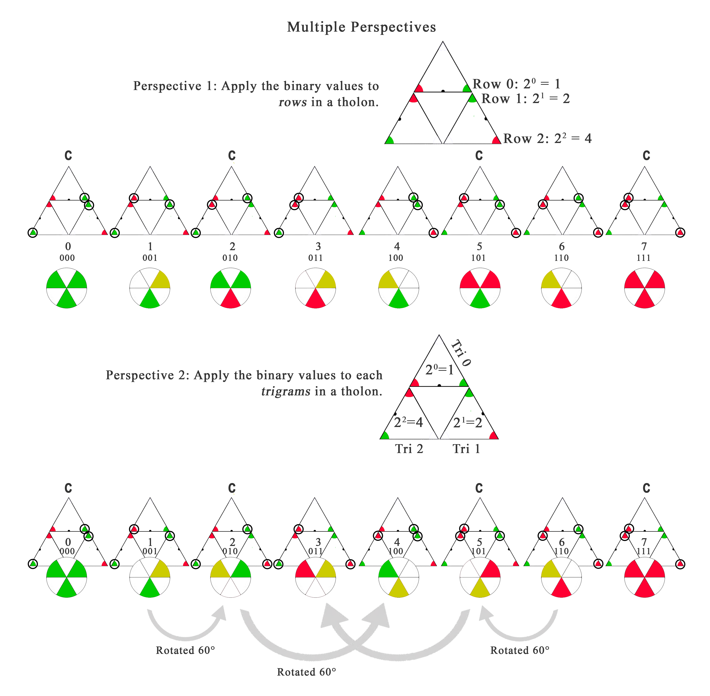

Both perspectives have patterns. *Perspective 1* uses a binary top-down bifurcation model, similar to the I-Ching, and shows the cardinal points as being composed of only primary elements (red and green only), and it shows the dynamic trigrams as have a new composite element of yellow, which is what we get when a red and a green overlap each other. This supports the argument of which trigrams are static and which are dynamic. *Perspective 2* uses the cyclical tholonic values as they are assigned to the tholonic trigrams. We definitely see patterns there, and no doubt they can shed new light on both the I-Ching and the thologram, but we will only be using Perspective 1 for now as it answers our question of which trigrams are static or dynamic, which is made very clear in the diagrams below when the images are arranged in their proper order.


So, how do we know what trigram is associated with what element? The reasoning is pretty simple… AIR 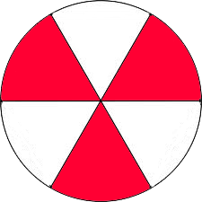and EARTH 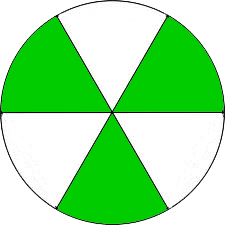, which defined the vertical axis, describe the opposite properties of what is above us and below us and frames the boundaries of our context. They are the maximum (highest) and the minimum (lowest), between which all else exists. FIRE and WATER , which define the horizontal axis, are the two opposite properties representing the spectrum of resources within that context. They are the only two trigrams that combine both elements of yin and yang but do not overlap. WATER is certainly less yang than FIRE, so WATER is 2, which only has 1 yang and two yin, and FIRE is 5, which has two yang and one 

The dynamic trigrams are a bit less obvious. We need to look at the relationships between the cardinal trigrams to determine what dynamic property it describes via the three stages of *Negotiation*, *Definition*,  and *Contribution*. 

But before we do that, let's look at some math.  Looking at the cardinal numbers of 7,5,0,2 and the transitional numbers of 6,4,1,3, it does not appear that that have any relationship other then that they are in order - meaning, we can't use the transitional number to calculate the cardinal number, at least not at first glance.  However, there is a way&hellip;

Start with 7, add the starting cardinal number (*c*), subtract the sum of the transitional value (*t*), plus it's mirror value (*t~1~*), and then subtract 7 if the result is 7 or greater, and we get the new cardinal number (*c~1~*).

*c~1~ = 7+c-(t+t~1~)*

For example:


This may look like mental gymnastics, but it's really an informative pattern that requires the *mirrored* value pairs of the transitional numbers to arrive at the *inverse and opposing* value pairs of the cardinal numbers.

We can re-describe the above by also saying: One static property transitions into another static property by removing the yang properties of the transition state *and* its mirror from the static properties and then adding them back to the result.  This tells us a couple of things about the interrelationships of these values, for example; 

- The mirrored values must be considered as a one value with two instances, not as two separate values.
- The property of the cardinal values are integral to every transition because the transition *is* the remains of the previous cardinal value added to the next cardinal value.
- The pattern of the static cardinal points is simple, and therefore more fundamental by nature, while the pattern for the dynamic transitional point is less so.

This pattern only works on the cardinal values, and fails if we apply it to the transitional values.

## Explanations

Now that we have these sequences, what do they mean?  Here are the explanations of the elements and transitional with the reasoning.


### EARTH  0

*EARTH* represents the foundation upon which everything is built as well as the resources from which they are built. It is cardinal, winter solstice, inward, the non-moving point between deflation and inflation.  Instance of this are **resources**, **foundations**, **support**.

The trigram shows the symbol of a perfect yin state.

The quadrant of EARTH  exists between the dynamic properties of EMPTYING  and FILLING  and therefore represent the extreme yin pole, where the maximum point of EMPTYING is reached and where FILLING begins. 

1. *Negotiation*:  A yin here indicates that anything can be negotiated, for it is receptive to anything, yin or yang.
2. *Definition*:  The emerging definitions are determined by the whatever is acting upon it.
3. *Contribution*:  The contribution of the yin is that is allows a yang to appear simply by its existence. It doesn't need to do anything, just as 0 implies 1 by its nothingness, especially when we consider that *0^0^*, or *nothingness^nothingness^* , = 1.


### WATER  2

*WATER* represents the movement from dark to light, yin to yang, lifelessness to life.  It is cardinal, spring equinox, ascending, the perfect balance of lessening yin and increasing yang. Instance of this are **electricity**, **nourishment**, **cleansing**, **rivers**.

The quadrant of WATER exists between the dynamic properties of FILLING  and COLLECTING and represents the balance between the yin and yang. that is achieved when yang penetrates the yin at is center. The oceans and lakes have filled and are stagnant until the rivers form which serves to collect the water to return it to its cycles..  It is the most *inward* moving of all the states.

The trigram shows the symbol of yang energy penetrating the yin at its core. 

1. *Negotiation*:  Water cedes to whatever holds it.
2. *Definition*:  The movement of water is what gives it it power.
3. *Contribution*:  it is the yielding quality of water that is its contributions. If always follows the path of least resistance, is used by every form of life and Nature itself, and is then returned, essentially unchanged. It takes nothing, and gives everything.


###  AIR  7

*AIR* represents the arena of growth and creation. What comes from the yin EARTH grows into the yang AIR. It holds all things in the Universe in place and is symbolic of spirit, which shows us a life beyond our mortal limitations.  It is cardinal, summer solstice, outward, the non-moving point between inflation and deflation. Instance of this are **birth**, **exploration**, **imagination**.

The trigram shows the symbol of a perfect yang state. AIR is one of the three trigrams that is an ORIGINATING SOURCE.

The quadrant of AIR  exists between the dynamic properties of COLLECTING  and RELEASING  and therefore represent the turning point from the internal journey to the external journey. This is the extreme yang pole, where the maximum point of COLLECTING is reached is reached and the RELEASING must soon begin.

1. *Negotiation*:  It is the nature of air to move and to create; it therefore seeks out the yin.
2. *Definition*:  While the unknown is yin in nature, exploring it is yang, and it is only by exploring that definitions and limitations are discovered.
3. *Contribution*:  The contribution of AIR is to open new doors and find new horizons. 


### FIRE  5

*FIRE* represents the quality that allow for manifestation, transforming idea to form. It is cardinal, fall equinox, descending, the perfect balance of lessening yang and increasing yin. Instance of this are **light**, **consumption**.

The trigram shows the symbol of a yang on the outsides but dependent on a yin center, as the yang dissipates, much like a fire that shines light as the log is reduced to ashes.

The quadrant of FIRE  exists between the dynamic properties of RELEASE  and EMPTYING  and therefore represent the dissipation of energy, which bring form in to existence and light into the world. This is the balanced that represents the hight of outward expression.

1. *Negotiation*:  The yang is built up and is ready to be released.
2. *Definition*:  The yin returns as the yang is released, which is defined by dissipation and entropy.
3. *Contribution*:  The energy is shared with the world, as light, heat, and movement. 

Here are the explanations of the transitional or dynamic interactions.


### Release (AIR & FIRE )  6

*Release* represent accumulated energy that seeks balance, and in the process of balancing itself, dissipates itself and its recipient. It is the initial outward movement that leads to expression. expression of Instance of this are **lightening**, **Big Bang**, **inspiration**.

The trigram shows the symbol of yin energy re-entering the solid yang. The new yin line comes in at the lowest place of 1, beginning, birth, plant, idea.  The yang is still dominant as the middle line is still yang, so the transition is yang in nature.

The quadrant of AIR  and FIRE is one of outward descending, or external yang. Here, the yang pole of the limits of sustainability has been reached, so there will be a natural movement in the opposite direction.  When this extreme yang mixes with the yin there is a powerful release of yang energy, and the result is FIRE.  The process of *release* is defined by the three states of trigram 6.  This quadrant is *outward* because the process of creation is that of energy (yang) taking form (yin), and form exists in the outer world.  *Descending* because the yang expands, and by doing so also dissipates itself.

1. *Negotiation*:  When the yang energy becomes complete, not only does it have nowhere left to go, but its existence depends on the yin at this point.  Here, the yang is subservient to the yin.
2. *Definition*:  When yang meets yin it wants to release all of its energy and pushed against the limitations of the yin.
3. *Contribution*:  The yang finds expression in FIRE, even if at the cost of the yin.  

### Emptying (FIRE & EARTH)  4

*Emptying* represents the dissipation and movement of energy via matter. It is the source of order out of chaos. It is the final outward deflation that returns to the initial chaos from which everything is born. Instances of this are **music**, **creation of the elements**, **death**.

The trigram shows the yin energy overtaking the center, making this trigram yin in nature. EMPTYING is one of the three trigrams that is an ORIGINATING SOURCE.

The quadrant of FIRE  and EARTH  is one of final descension, or external yin, where the energy of FIRE quickly dies. This is external because it is FIRE transitioning to EARTH, and *descending* because the energy of creation is waning, but in the process matter is restructured (or born). This is the process that transforms energy to mass (*m=E/c^2^*).

1. *Negotiation*:  In the dynamic between FIRE and EARTH, FIRE is always dependent on EARTH.
2. *Definition*:  FIRE can only find expression in EARTH, just like energy can only be experienced via matter. Therefore, the limitations on the expression of FIRE are determined by the yin quality of EARTH.
3. *Contribution*:  The restructuring of EARTH by FIRE is what brings everything into existence.

### Filling (EARTH & WATER )  1

*Filling* represents form coming to life.  It is the initial inward inflation of a new cycle. Instance of this are **gestation**, **dark matter (expansion of the Universe)**, **artificial intelligence**.

This trigram shows the return of the yang energy in the bottom place, but as the center is still yin, it is in the domain of yin. FILLING is one of the three trigrams that is an ORIGINATING SOURCE.

The quadrant of EARTH  and WATER  is one of new beginnings, or internal yin, where the empty yin state of EARTH begins to return to life with energy.   It is inward because the yang enters from the lowest place, and ascending because the yang continues to rise.

1. *Negotiation*:  The lack of yang is what draws the yang to penetrate the EARTH
2. *Definition*:  The yang must fill the empty yin vessel of EARTH before it can express itself.
3. *Contribution*:  The omnipresence of yang is the universal reservoir that can be tapped into from anywhere, not unlike the idea of the earth as the electrical ground for all electronics.

### Collecting (WATER & AIR)  3

*Collecting* represents the higher orders of structure that extend ever outward. It is the final internal inflation, the final preparation.  Instances of this are the **Internet**, **space-born viruses**, **Mongol Empire** .

This trigram, with two emerging yang lines, is now in the domain of the yang.

The quadrant of WATER  and AIR is one of preparing, or internal yang, where the balanced state of WATER ascends and expands into the polar state of AIR.

1. *Negotiation*:  The yang becomes dominant here, and the remaining yin is outnumbered. This is the time when the yang begins to reign.
2. *Definition*:  The yang is no longer constrained by the limitation of the EARTH and is free to expand into what seems like limitless AIR.  This is the culmination of expression, and whatever the ultimate expression of an instance is, according to the nature of the instance, will be expressed here. 
3. *Contribution*:  What remains of that expression or how it lives on is something only history will know.


## Archetypes

~~[JWFIX: this section is unclear and confusing]~~ 

~~In this model just described, there are 4 cardinal archetypes and 4 dynamic archetypes, each one represented as a trigram that is composed of three lines. This happen to map neatly onto a tetrahedron is we assign the 4 cardinal elements to the 4 cornersof a tetrahedron, and  This maps quite nicely into a tholon as shown in the figure below. FIRE is shown here as (F) because it is a composite property, the *white dot*.  Also, *formation* corresponds to the *expanding* hemisphere of the Pa Kua circle, for it is there that the archetype is created during the *expansive* stage. *Expression*, as in what is that which is contributed back to the parent and to the thologram as a whole, what the purpose of the relationship is, equates to the contractive hemisphere of the Pa Kua, because it is in this phase that the archetype instantiates itself and is sent out into the world as a &ldquo;thing&rdquo; (physical or metaphorical).~~

~~This shows us that WATER, AIR, and EARTH are the three primary elements, but FIRE is the composite element that bring all the elements into existence. It was initially unclear what the relationship would be between opposing elements, such as AIR and EARTH or FIRE and WATER, as their only point of interaction is via the very center of the cycle. When these were mapped onto a 2D tholon map the relationship became clear… all the opposing elements form a relationship that tholonically connects an *N-state* to its first instance of the *green dot* of *definition*, and that path that connects those two states is one of *limitation*, as in limiting the dimensionless *N-state* to be able to exist within a world of dimension in whatever context it is limited by. It is the process of moving an idea into a plan, like moving the idea of a house into a blueprint. For anyone who has ever had to make or deal with blueprints, *limiting* is very apt word. This is clearly showing that the center point of our Pa Kua cycle represents the *Idea* of the Pa Kua, and through the use of numbers and math, diagrams and words, testing and application, we limit that idea into the 4 pairs of definitions that define the Pa Kua.  *(Note: In the image below I have attributed AIR to blue/negotiating, EARTH to green/definition, and WATER to red/expression, but these are merely my suggestions.)*~~

~~For myself, The message here is quite clear… the part that is missing, or rather, the part that is represented by the center of the circle where all opposites meet, is defined by our ability to reason and perceive, i.e. our consciousness. It is our own awareness that is at the center of all opposites and creates the pattern that brings them together. This is especially true for the original duality of opposites, that of the chaos of nothingness and the chaos of somethingness.~~

~~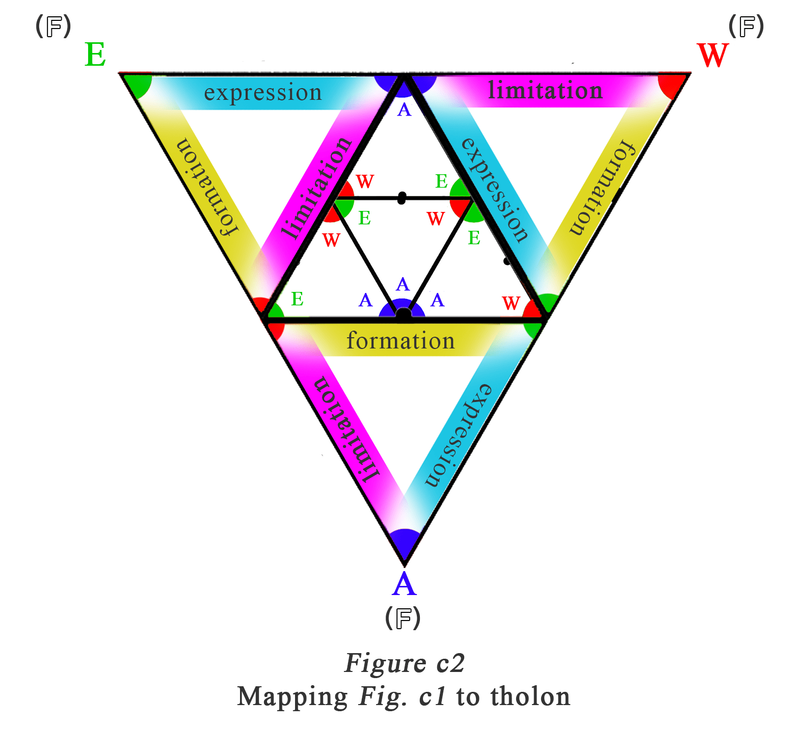~~

### Mapping to Hexagrams 

Various attempts were made to map all the hexagrams to the tholon/tetrahedron.  The difficulty was to find a mapping that not only fit, but that could be validated in some way.

One of the indicators as to how this mapping might work appeared when looking at how the Pa Kua was mapped, as shown above.

We have four quadrants that continually mirror each other.  This is more clearly demonstrated in the following image which uses the binary values of the transitional trigrams  011 (3)  110 (6)  100 (4)  001 (1) to demonstrate.


This was only using the 8 trigrams of the Pa Kua.  It would get a bit more complicated with 64 hexagrams, but the basic idea is the same... 4 mirrored quadrants.   Below is what that looks like when applied to the 64 hexagrams.  Note the blue-framed hexagrams are those that are a product of those trigrams that define the scope (&nbsp;&nbsp;&nbsp;), the red-framed hexagrams are a product of the trigrams that define the movement within that scope  (&nbsp;&nbsp;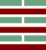&nbsp;), and the green-framed hexagrams are a product of the transitional trigrams. The large numbers are the binary value, and the small numbers are the traditional King Wen sequence.


Each quadrant contains 16 hexagrams, but if we were to map these to the four sides of a tetrahedron, we would need exactly 15 hexagrams for a side.  This is because the natural progression of tholonic trigrams is 1, 2, 3, 4, 5~~, and that equals 15~~.  The hexagram 0 and 63 could easily be placed outside the side of the tetrahedron as neither of them represents something that can exist, as there must be interactions between the two states for energy to move, but they could represent the primary poles within which everything comes into being.  That still leaves two hexagrams too many.  Another problem was; with the hexagrams laid out, whatever hexagrams occupied the three corners, they had to equal 63 so as to be able to form the 4th white dot point.  It turned out that the solution to one problem automatically solved the other problem.

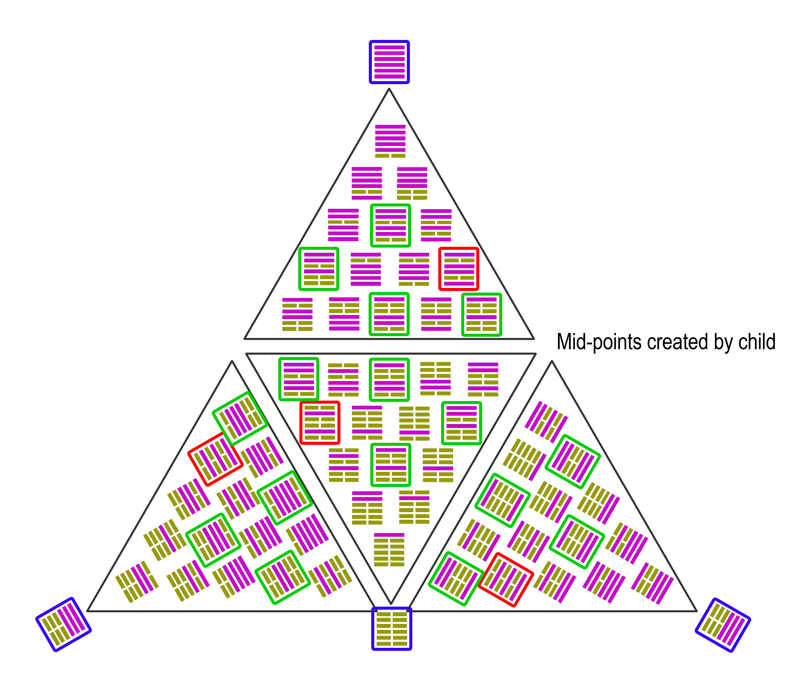

Here, we place the hex 63 at the originating N-source, and its opposite, hex 0, at the child N-source.  Because the middle point of the two sides are actually children of the child N-source we don't need to consider them when just looking at the parent.  We know that the two children must equal the parent, and while there are 32 possible candidates for the children, only two of them were cardinal. Additionally, if 63  implies 0 , then we would expect the children to be a combination  of 0 and 7 .

At first glance this looked very promising, as the cardinal (blue-framed) hexagrams held cardinal positions and the three corners equal 63 (actually, a harmonic of 63 as 56+7+63 = 63*2).

Arguably, hex 0 and hex 63 could be reversed, but the result are effective the same.

However, several other validating patterns emerged that were pretty astounding, at least to me.

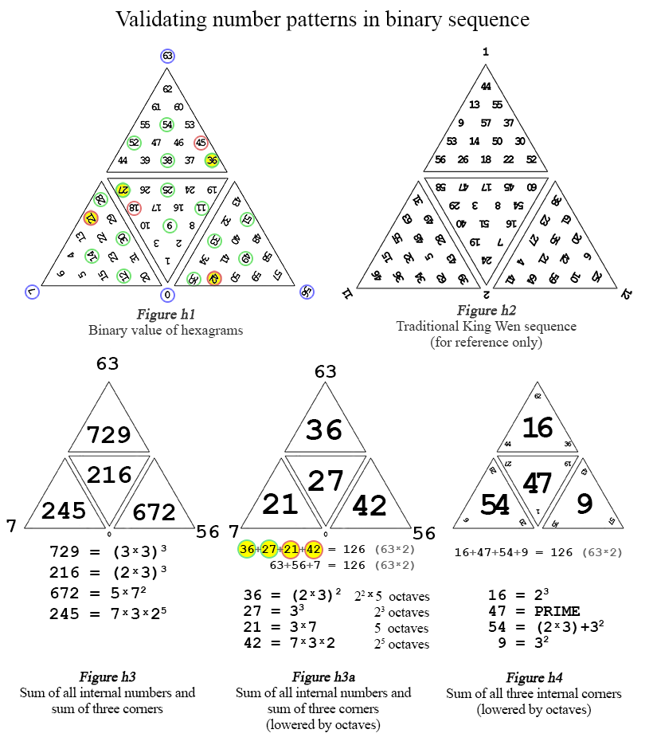

Notice that every value can be defined by a formula that only uses the first 4  prime numbers, or is itself a prime number!  It was also a nice surprise that the sum of all values in the central tholonic trigram was 216 (referring back to the topic of 216 in *Tholonia*, the book).  [JWFIX: here]

Notice how each the four trangular sections (in *Fig. h3a*, and by implication, *Fig.h3*) have values exist within each triangle as either red-framed *moving* or green-framed *transitional* values, i.e. hexagrams 36, *Keeping Still*, 27, *Joyous* , 21, *After Completion* , and 42, *Before Completion*  . This might ne just a normalconsequence of the math, but nonetheless intersting to a non-mathematician. 

Here, the 0-dimensional N-points are represented by 63 and 0, alternating back and forth, exactly as the self-similar thologram's N-points.  The one thing that N-points and the hexagrams 63  and 0  have in common is that both only exist as concepts and only their 'offspring' can instantiate.

~~Another interesting observation is when we look at the lower right and lower left corners of the topmost triangle we have hexagrams 36  and 44 , might give us some insight as to the nature of that which created this reality, if we accept the traditional interpretation.  What we see there is, in the green-dot of Definition, 36,  "Keeping Still", which states "The hexagram signifies the end and the beginning of all movement.", and in the red-dot of Contribution, b44,  "The Wanderer", which states, "(if one) is obliging toward others, he wins success."  Make of that what you will.~~  

If we were to create a sequence of the I-Ching based on the tholonic model above, it would look like the following:[JWFIX: these are are mirrored]


Some interesting points regarding the above sequence:

- Because the 4 cardinal points define the framework, and do not make up the dynamic part of the circle, there are exactly 60 points on the circle… just like the ancient Babylonian clock which introduced the idea of the 60 second minute and the 60 minute hour.  The modern argument is that they used 360 as a basis because it represented their estimate for the number of days in a year…  but this reasoning presumes the ancient Babylonians, who were the masters in their day of navigation, architecture, agriculture, astronomy and government, never bothered to actually count the days in a year, or worse, just ignored the extra days at the end.  The reason the ancients used 60 is because 60 is one of the most fundamental numbers that drives nature, given that it is the product of the first three primes… 2^2^&times;3&times;5.   p.s. 2^2^&times;3 =12, which is why we have 24 hour days, just like the Ancient Egyptians and Chinese developed. I will save you the embarrassingly myopic modern explanation as to why and how these two cultures came up with the same system.  

- While the numbers are not sequential, each pair of opposites equal 63.

- I have added the octal (base 8) value because it is far more clear.  Base-8, if you are not familiar with it, is simply a number system that is based on the eight values 0,1,2,3,4,5,6,7.  This means when you get to 8 you have to start with the double digits, so our base-10 number 8 in octal is written as "10".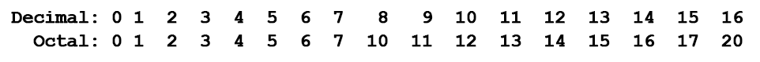
  The beauty of using octal numbers for the I-Ching is the number itself is telling you what trigrams it's made of.  For example hexagram 12 (001100) is octal o14 (we use 'o' for octal numbers).  Hexagram 12 composed of two trigrams; 001 and 100.  Converting from binary to octal, 001 = 1, and 100 = 4… so we simply put the two numbers next to each other to get o14. No addition is needed to arrive at the correct octal value for 001100.  Today, if we were to do this with our base-10 number system we would get meaningless results, and be chided for engaging in some silly form of numerology or superstition, however, in the past when numbers and letters were often shared, and when using with base-60 (Babylonian, Sumerian) or base-8 (Native American, Proto-Indo-European) systems, simple rearranging of numbers can produce valid mathematical solutions.  In fact, that is exactly how computers, which use base-8, do math… by simply putting numbers next to each other to perform addition.

- The four cardinal hexagrams are made of two absolute trigrams  and . It makes sense that the first and the last hexagrams,  and   , which are absolute in nature, would not be part of the circle where only dynamic interactions, or instances, exist, but why then are hexagrams b07  and b56  also separate from the rest?  The reason is that a hexagram in general is not a fundamental element.  It is more like a molecule, with the trigrams being the atoms, and the lines being the subatomic particles.  These trigrams, just like the absolute hexagrams, represent the ideal and unmanifest state of a trigram, an archetype, and unless they join with another trigram that has the ability to instantiate, they will remain as archetypes 

- The beauty of the tholographic model is that it accommodates both the binary and base-8 system of 64 states as well as the base-60 system, while also shedding light on how they work together.

- Numbers are not as intuitive as images, so here are a few charts that clearly show the self-similarity and pattern of the sequence.  I have deliberately left out the numbers as the specifics of the numbers are not what is important in these charts.

  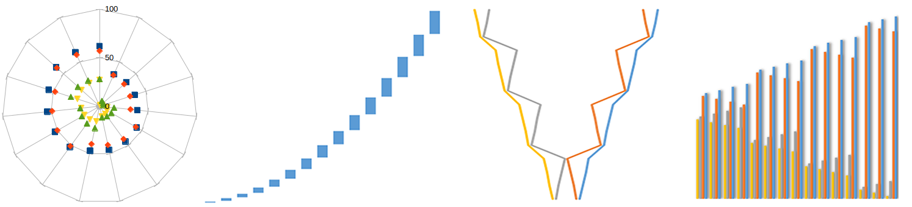

  


### How Creation Works

*Note: The chapter is best read after reading the entire book 'Tholonia', because it incorporates concepts that are brought up at different points in the book.*

The tholonic model is based on the ancient premise that from a singularity comes a duality.   We see this in the idea that *nothingness* has no value until *something* appears within it, at which point, *nothingness* is represented as 0, and *somethingness* is represented as 1.  Without something, nothing would ever exist, because&hellip; it's nothing. We'll avoid the unsolvable argument of which came first, nothingness or somethingness, but we can say from this that the first duality was of something (1) and its opposite, nothing (0).

So now we have 1 and 0.  What can we say about these two numbers?  We can say that they are two parts of a duality, and because we know that the sum of the parts of a whole equal the whole, we can they say that 1+0=1, which tells us the whole equals 1.  This sounds like 1^st^ grade math... but let's continue.

We can plot this a few different ways:


If this is true for 1, then it must be true for all numbers. Let's try this with the first 8 numbers, 0-7, by making every pair of numbers that equals 7; 7+0, 6+1, 5+2, and 4+3.


Now we have a problem, because, as is shown in the above tree chart, we have four 7s, which when split make all the numbers 0-7, but what then are the two parents of these 7s? If we apply the same logic, then it would be 14 and 14, making the originating parent 28, but this is not allowed as we have no numbers that are greater than 7.  Even if we just use a base-8 number system, we still have the problem that any number we use as the top number will never create two children that are the same number, so we will never arrive a 7,7,7,7.  The reason it will never create a pair of numbers is because the top number is always odd. If the top number is even, the number of possible pairs is an odd number, which breaks the symmetry, and we assume that symmetry is a requirement based on the fact that the first number to represent something, 1, creates symmetry.  Zero, which represents nothing, is technically an even number.

The problem then is that there is no number that can be used to represent the parents.  So, we have to invent some numbers.  This is done all the time in math, and they are called *imaginary numbers* and even *pure imaginary numbers*.  These are numbers like *i*, the square root of -1.  Let's invent some imaginary numbers.


We need a number that can be equal to two (or more) values at the same time but can only be expressed as one of these two values in real numbers, and whatever value is in one state, the other state has a different value, so no two states can share the same value. This is a familiar concept in quantum mechanics where we have the idea of spin and entanglement.  For an excellent and clear explanation of this subject, see Quantum Magazine's &ldquo;Entanglement Made Simple&rdquo; [^173]

We can now apply to this idea to all the numbers, going all the way to the top, where we have the meta-value of A that is one unit from which these eight numbers emerge from. 


We start with A and its pair, which consists of A~0~ and A~1~.  On the next row, each one of those meta-values has its own pair, so A~0~ has A~01~ (sub 1 of sub 0) and A~00~, etc.  

*Note: Don't be confused if you are looking at the binary sub-indexes and seeing they do not match the decimal values. They are not suppose to be the same. This is explained in the next paragraphs.*

 To represent this in circular charts, we need a new chart for each row.


For the chart for row 3 I put a &ldquo;?&rdquo; in the center because I just don't know what to put there that will not make things more obtuse.  All we can say about &ldquo;?&rdquo; is that it is a meta-value that all four outer values equals when opposites are added. [JWFIX: fix graphic, add A0 and A1 to center]

At the bottom of the tree we have seven states of A, each identified by the sub-index value, representing its lineage from A.  If you understand binary numbers you'll notice that the sub-indexes follow the perfect sequential order of 76543210 (starting from the left).

This seems very odd when you look at the actual values assigned to the sub-indexes of A, which have a sequence of 70615243.  This seems to make no logical sense, but in fact, it is an amazing relationship.  

The sub-index values represent the path of expression from A that resulted in a number value.  This is the *order of instantiation*, while the value itself is the *instantiation*.  Look at how these two sets of values relate to one another.  

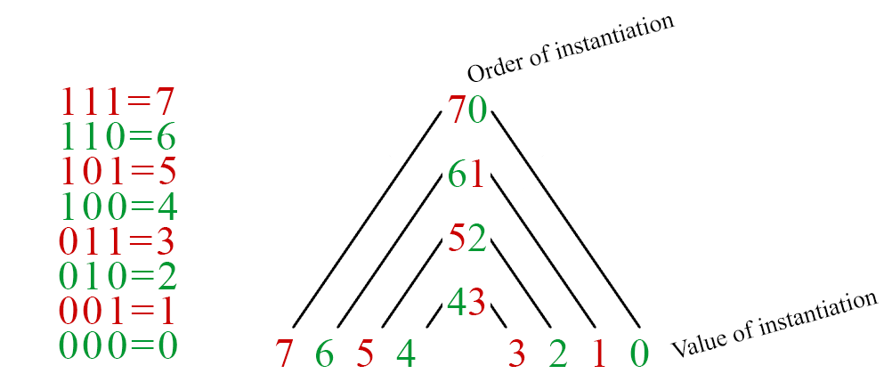

The *value of instantiation* (VI) axis is perpendicular to the *order of instantiation* (OI) axis.  These two axes are perfectly in sync with each other while not only being perfectly squared [JWFIX: squared?], but the natural process of reordering is a very efficient form of encoding (and therefore decoding).  It also shows us that the *value of instantiation* is an encoded version of the *order of instantiation*.

Technically speaking (and I need to say that because what comes next sounds quite esoteric), every instance, which is every *thing* that exists, is not only a piece of the *One Thing* that all existence came from, the ultimate A, which tholonically speaking is a 0-dimensional dot, but also a recombination of the very path that caused it to come into existence starting from the dot, the A, at the beginning of creation. If there was only one source from which everything grew from, then every instance, every thing, has a unique *order of instantiation* value which describes the path it has taken from 0-dimensions, similar in concept to the way any address works, be it physical, Internet or otherwise.  Because every order of instantiation is unique, so too is the *value of instantiation*.

But there is one more perspective that is worth looking at.  If we arrange this tree in its most natural evolving form, we get the following:


There are many significant patterns here, but the ones I'd like to point out specifically are:

- Only the numbers 7 and 2 are the same on both axes.  This is significant because it says that the value of 7 and 2 have the same measure when it comes to *how* something came to be, and *what* something came to be.  This is not only because they are the same in the map, but they are also the same as the sum of their axis.  When we look at the combined values of the axes, we see that this is the same case for 12.  They also are the first and last prime numbers (in the set of 0-8, the two in-between being 3 and 5)
- [JWFIX: bad paragraph]Values A~011~ and A~100~ overlap, and of course, when combined they equal A~111~, which is supporting evidence that this model is viable, plus, the VI value, indicating how this unique double-value will instantiate itself is the number 1, and is also the first instance of an overlap that happens to be the reverse value of the original A source value. In short, the number 1 represents the instance of the source that created everything, and came into existence by the source dividing itself and then recombining itself.  Sound familiar?
- Only meta-values that reach the *observable level* have some quality that is quantifiable as a number, but as everything beyond that point can have numerical values, the implication is that there are 7 meta-values across 2 generations and 3 levels that stand between A and all instances.  What is interesting about this is that we see this same concept in religion and  mythological cosmology (Mesopotamian, Islam, Judaism, Christianity, Hinduism, Jainism), where Heaven, that place from which our material reality was conceived, has seven divisions.  In addition we have the concept of a trinity, an even more fundamental concept that has been incorporated in our models of reality going back to the most ancient beliefs.

We see this same pattern of progression in the most fundamental form of creation; genetics. Below is a graph that illustrates the how the bases (adenine, cytosine, guanine, and thymine) pair together to form nucleotides.  An A can only double bond with a T, and  C can only triple bond with a G. This is accomplished by taking one side, inverting it (negative image), then reversing it (vertical). When we to that, the pairs automatically line up in their proper order.  The binary values of the path are shown, and as you can see, every pair has two values that equals 3.

While this does not represent the actual mechanics of a DNA strand, it represents the order, or pattern, of the mechanics. For example, the parent of the bonded bases could be the concept of the class of compounds called purines or pyrimidines.  Their parent, the source, could be the class of aromatic heterocyclic organic compound, which all the children are a member of.  Or perhaps it could be *Chargaff's Rule*,  which states "DNA must have equal parts of GC and AT nucleotides."  There could be many different instances of these parents, but in every case (where this model is applies), they will follow the same pattern of expression.

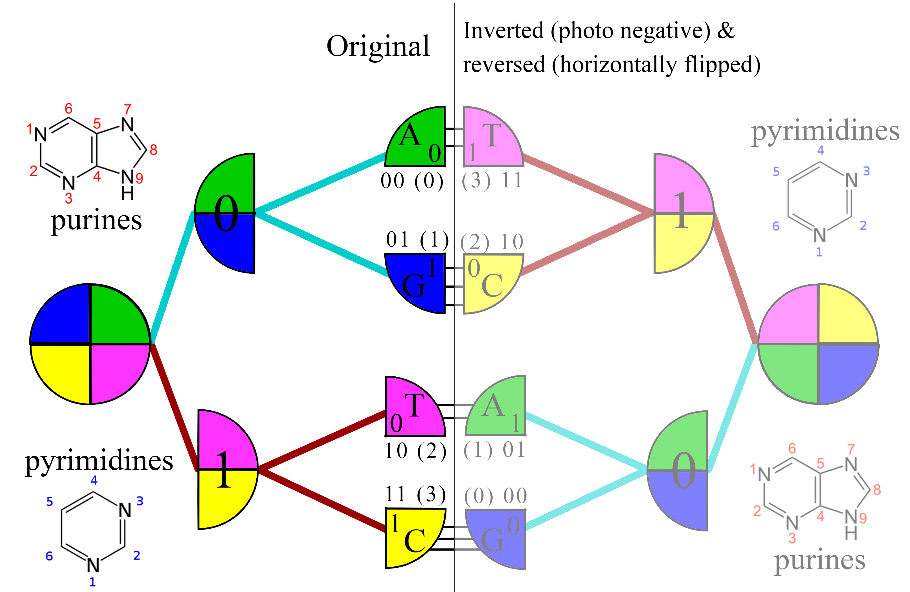

This inverting and reversing is the exact same process used in the I Ching, and how only 16 original hexagrams are needed to create 64. What is especially interesting is how the opposite (inverted and flipped) of the purine adenine is the pyrimidine thymine. This is interesting because there can't really be an 'opposite' of a compound or molecule or atom, but two compounds can effectively be opposite in the way they function within a given context for a particular task, and yet function different in a different context or other task, such as how adenine is used in cellular metabolism to transfer chemical energy between chemical reactions.  From a tholonic perspective, this shows that the structure of a process is independent of the instances that attempt to apply that process, which also then suggests that the processes archetype existed before it was instantiated..

Perhaps this is clearer to see by looking at the correlations between the I Ching and DNA.  For example, is we replace DNA concepts with I Ching concepts, we can say the following:


| DNA Statements                                               | I Ching Statements                                           |
| ------------------------------------------------------------ | ------------------------------------------------------------ |
| The **purine** and **pyrimidine** classes have two **bases** each, one being **two bonded** and one being  **three bonded.** | The **YIN** and **YANG** classes have two **children** each, one being of **yin** and one being  **yang.** |
| This results is four **bases**, **A**, **G**, **T** and **C**, respectively. | This results is four **bigrams**, **yin YIN (A)**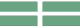, a **yang YIN (G), **a **yin YANG (T)**, and a **yang YANG (C)**. This describes the four types of lines. |
| **purines/pyrimidines pairs**  form **nucleotides**, AT, TA, GC, CG. | **YIN/YANG pairs**  form **lines**, extreme yin (A) , stable yin (G) , stable yang (T) , extreme yang (C), |
| Three **nucleotides** creates a **codons** .                 | Three **lines** creates **trigrams**                         |
| These **codons** form the building blocks of **physical life**. | These **trigrams** form the building blocks of **metaphysical life**. |
| **Genes** have an address at a specific location.            | **Hexagrams** have an address at a specific location.        |
| Different **nucleotides** makes **alleles** of **genes**.    | Different **lines** makes **varied trigrams**.               |
| With only half of the **DNA**, the other half can be created. | With only half of the **I Ching**, the other half can be created. |
| Everything that defines the DNA exists between two opposing **strands**. | Everything that defines the I Ching exists between two opposing **polarities**. |


*(Chromosomes are subdivisions of the DNA used for the purpose of transportation and duplication (and probably quality assurance), so this doesn not really have anything to do with the process described here.)*

There are some other interesting correlations as well, such as:

- There are 8^2^ (64) **codons** 
  
  - There are 8 **trigrams** (although, perhaps there is a stronger correlation between the hexagrams and the codons themselves).
  
- The **codons** create 20 amino acids
  
  - The **trigrams** create 20 balanced hexagrams (three yin and three yang lines).
  
- There are 44 autosomal chromosomes (all human chromosomes minus the sex chromosome)

  - There are 44 imbalanced hexagram

  

Of course, there is a not a one-to-one correlation, but we do see many of the same mechanics, patterns and relationships in both systems (I Ching and genetics) that we also see in the binary and the tholonic models.

## The Origin of Lines

The individual lines were addressed in part earlier, but here we will try and pull it together into something more coherent.

Because the I Ching is about the nature of unending change, it is better to view the stages of the change as a continuous stream of changes as I attempted to show in the image below.


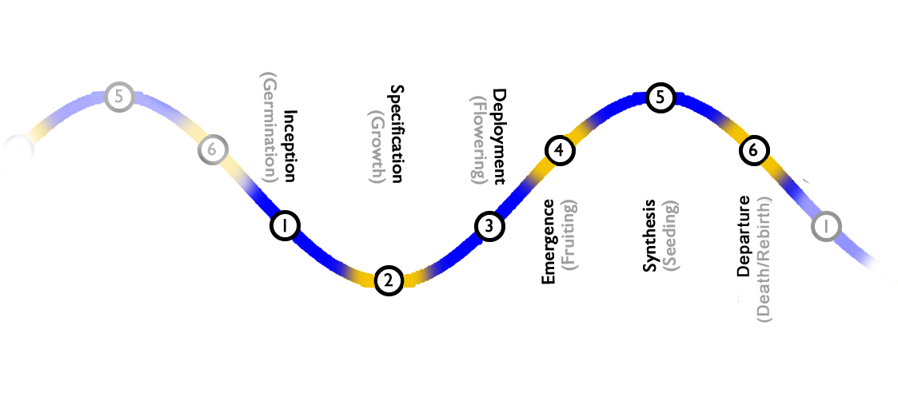

This continuity is confirmed in the I Ching when it states: "All movements are accomplished in six stages, and the seventh brings return."  Here we see how the seventh stage returns us to the first stage of the next cycle. Another validation of using this waveform as a model is that the lower trigram of lines 1, 2, and 3 are, in fact, in the lower part of the waveform, and the upper trigram of 4,5, and 6 are in the upper part.

Below is a front view of the waveform that exposes more information.  Allow me to point out some of the details.  The upper half, being outward in nature is also yang in nature, and the bottom is yin. This is illustrated by brown, expanded, faded background of a solid yang like in the upper half, and a green, expanded, faded background of a solid yin line. But the left and right side are also yin and yang in nature, as the left side (yang) is ascending in nature, and the right side (yin) is descending in nature.  This results in four quadrants that are, respectively, yin-yin (0), yin-yang (2), yang-yang (3), and yang-yin (1), which are shown in each corner.

The cycle is composed of six stages that alternate between yin (orange) and yang (blue). Within one complete cycle we have highlighted a number of significant axis and their yin and yang properties. 

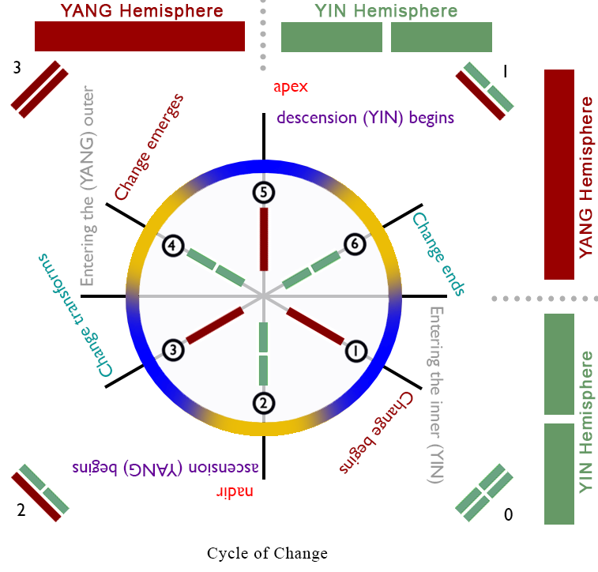


When these axis properties is combined with the quadrant bigrams, we get the following:

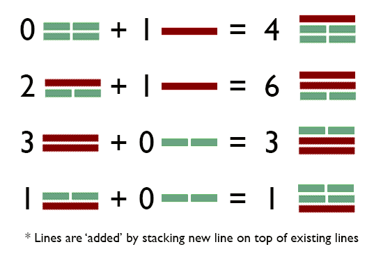

The first thing to notice is that there are only four, not six. This is because lines 2 (WATER) and 5 (FIRE) are in neither yin (right) or yang (right) sides.  The resulting values are also the values of the stages tat exist only in the quadrants. This suggest that the cardinal points of FIRE and WATER define the the axis around which all the others exist and are themselves not affected by the yin or yang influences of either side.  They are, in a sense, a more perfect form of yin and yang.  This is important to point out because of the significance that lines 2 and 5 have in the final hexagram.

## Binary Tholons

There is another way we can map the lines to a tholon, and that is simply by aligning the 6 lines of a hexagram to the 6 edges of a tetrahedron. 


We start with the 1^st^ line and move counter-clockwise, then continue with the 4^th^ line and move clockwise, in the reverse direction. In the image above, we replaced the lines with their default I Ching yin/yang lines.  Immediately you can see a few interesting relationships:

- All opposing numbers equal 7
- The central lines of a hexagram, 2 and 5, and the central lines of tetrahedron.
- The parent (1,3) is yang that creates a yin (2) spectrum,and the child (4,6) is yin that creates a yang (5) spectrum 
- The total for the yang is 3^2^ (9),and the total for the yin is 2^2^&times;3 (=12)
- As a tetrahedron, it nicely has all the yangs on the bottom, and all the yins at the top .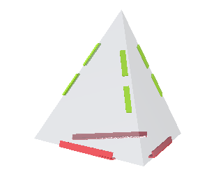
- If we apply the yin and yang lines counting from the top, we have 4 variations. If we consider that each trigram implies its opposite, then the have 4 pairs of hexagrams that describes all 8 trigrams. Note,this only works when the base is the center trigram. If we look at the binary values of those trigrams we see they are 1,2,4 and 7.  This seems very irregular and asymmetrical, but these are the only 4 numbers that relate to each other when we compare the OI (*order of instantiation*) and VI (*value of instantiation*) values. Notice how the 'bottom' and the 'back' locations have the same number, but the 'left' and 'right' locations alternate values.

  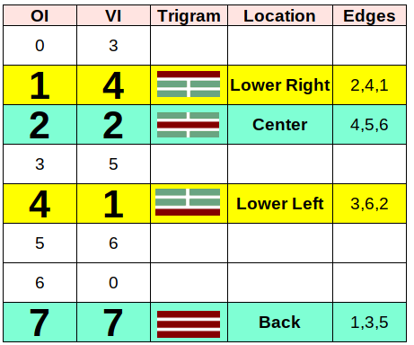


The reader may notice that it looks like we are cheating a bit here, because according to the tholonic pattern, the 4 and the 6 should be reversed, but here we are deliberately reversing the count direction of the inner triangle in accordance with the pairing requirements of the binary model.  These values then are those that apply to the binary mode and not the same as those that apply to the tholonic model, even though they are in a tholonic context. 

## The Origin of Trigrams

We have yet to look closely at how a trigram evolves from nothing.  Below is a binary tree that begins with a point of unity that divides itself into two states, 0 and 1. This established the most fundamental concept of yin and yang. This is then followed by each of those children doing the same by creating their own two children of 0 and 1.  We can see that there are now 4 children, each defined by the parent's fundamental yin or yang, and then adding to that the yin or yang of the child. this produces the 4 children of values 0, 2, 1, and 3, as shown by the bigrams.  This is done one more time to create the final branch of 8 children, each with a value determined by adding their yin or yang value to the bigrams passed down by the parents. Now we have 8 trigrams or 0, 4, 2, 3, 1, 5, 3, and 7.  Unfortunately, this order seems to lack any symmetry or pattern that is compatible with our model, suggesting it is incorrect.  However, if we flip the tree upside down, like a mirror image, the order immediately appears!  This is important when we are adding lines, because if we start with and add a , you might expect we get a , but as we will need to flip it to maintain the "mirrored" order, we will actually get a .  


Now we can see the first order of 0, 1, the 2^nd^ order of 0, 1, 2, 3 and the final and 3^rd^ order of 0, 1, 2, 3, 4, 5, 6, 7

This little example has tremendous philosophical implications, for example; the order of our world is one of bottom-up, not top-down. The top-down order is a mirror image of the bottom-up order and visa versa, and the top-down order, while being a perfect mirror of the bottom-up order, makes no sense to our bottom-up sense of order. 

Now that we have our model in order, we can see if our trigrams fit into it in any way that makes sense. We do this simply by assigning the names of the trigrams that have the same values, while also assigning the first two branches of 0 and 1 to be that of the two branches of the tholonic trigram, like thus:  

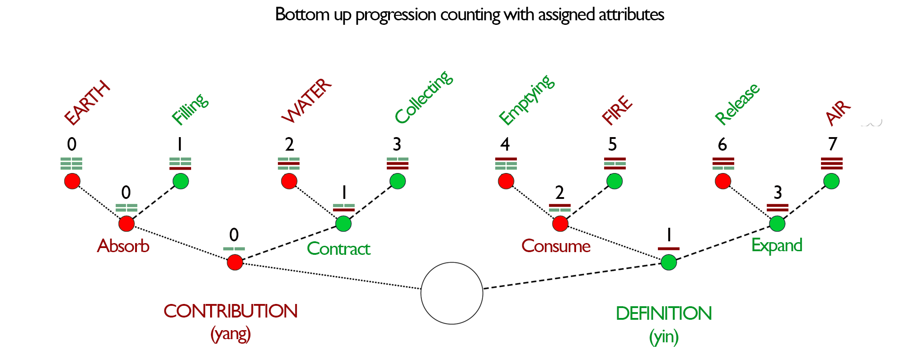

Notice how every cardinal element is symmetrical or balanced (   ) and every dynamic element is asymmetrical or imbalanced (   ). 

We may run into a problem of semantics and context using the words *Definition* and *Contribution* in the binary. The words Yin and Yang seem to fit much better, but it is difficult to say Definition is Yin and Contribution is Yang, or visa versa, as both can be both depending on the context. For now, we will say *Definition* is yin in the way that it limits the expression, and *Contribution* is yang in the way that is it returning some creation back to the parent.

In this way it is compaltibe with existing concept ofduality, such as the two faces of Shakti; Sambhuthi (that which is manifested, yang, contributing) and Asambhuti (that which is not manifested, yin, defining/limiting); the Zoroastrian's Ahura Mazda (eternal spirit of creation, yang, contributing) and Angra Mainyu (spirit of destruction, yin, defining/limiting; The Persian Manichaeism, where the first creation was that of the World of Light, "good," ruled by the *Father of Greatness* (yang, contributing) and the the *World of Darkness*, "evil," ruled by the *King of Darkness* (yin, defining/limiting). Modern science, where we have the minuscule massless negatively charged electron (1/1836 the mass of a proton, yin, defining) and the proton larger, positively charged proton that holds everything together (yang, contributing). There are countless examples, but here we would like to stay away from religious concepts, so we will refer to the primal binary as simply the *Defining Yin* and the *Contributing Yang*. Perhaps the *Defining Yin* can also be considered *order*, or the movement of chaos to order, coming into form, creation, explicity, and the *Contributing Yang* can be considered  *chaos*, or the movement of order to chaos, dissolution of form, implicity, return to the source.

We can see that every pair of (bigram) children is made up of two trigrams where one is a cardinal element and one in a dynamic element. This suggests that the parent is both a state (element) and an energy (dynamic) combined, but these merged qualities can only find separation in the (trigram) children. We can also see that the nature of the energy is compatible with the nature of state. Here we have a bit of a challenge, because we do not have common words that describe a state and a movement. Computer programming languages do have such a concept.  It is called a "class," and a class contains both information and the code that can act on that information. We will have to make do with some borrowed and creative nouns and verbs.

For example, what can we call the parent that has a state of EARTH and an energy of *Filling*? It would have to be some quality that is common to both of these things. I have chosen the word "Absorb," because the act of absorbing is the process of *Filling* (of the absorptive material), and the element of EARTH, being the perfect yin of 0, can only absorb and be filled. Readers my find better words or concepts to describe these pairs. Think of the ones used here as suggestions.

"Contract" is used to describe the nature of WATER, because water, which always travels the path of least resistance, will always pool, *Collecting* at the lowest point. Of course, all energy travels the path of least resistance, but WATER is meant to describe that property, not just H^2^0, so we can say that all energy has the property of WATER. 

"Consume" describes the nature of FIRE, as it consumes, or uses up its fuel. This is almost the textbook definition of *Emptying*.

"Expand" describes the nature of AIR, as it will expand into every place of existence to the edge of the universe. AIR here does not simply mean the air we breath, but refers more to the space that exists between all things, be they atoms or planets. If one considered the expanding universe as a function of AIR, which was itself a function of the Big Bang, the verb of  *Release* fits nicely.  From this perspective, AIR might also be the element of dark matter.


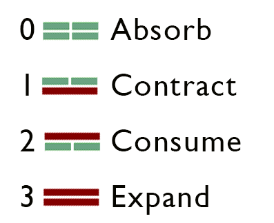


Let's recap how we are describing the elements and process of the eight trigrams.

We have arrived at the first pair, the original 0 and 1, the parents of all things, which, according to the tholonic model, have the two attributes of the primal yin as DEFINITION and the primal yang as CONTRIBUTION. Here, DEFINITION refers to the limits that everything that exists must exist within. These are defined by the laws of physics and nature, the environment, the available resources, the integration with other processes, and, of course, the limitation and definition of form itself with it's three dimensions. CONTRIBUTION refers to what the creation in questions returns to the source from which it came. Various models imply various ways to understand the purpose of existence. In this model, the purpose of existence, and of life, is to be able to contribute back to the parent, the source, from which all creation sprung.

Here is an alternative way of looking at this model. Notice how all the horizontal pairs of pink dots equal 7, and all the pairs of orange dots equals 3, and how descriptions are opposite in nature for every pair.

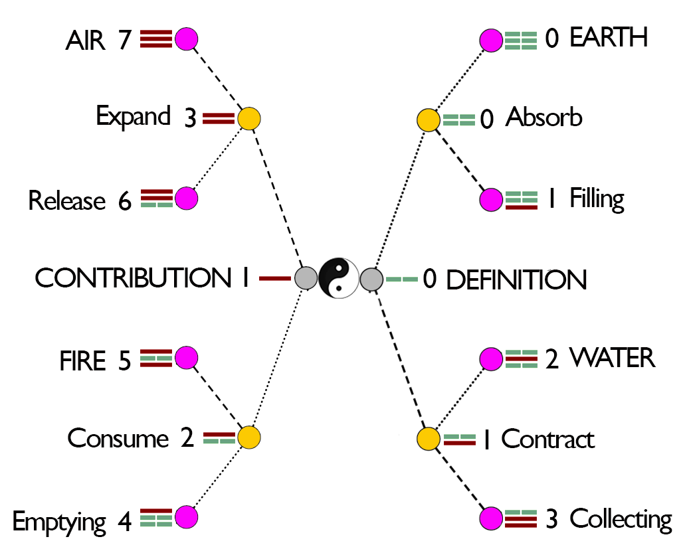

With the introduction of bigrams, let's look at the order of the trigrams again.

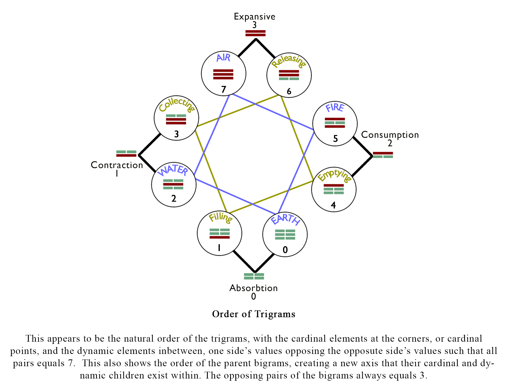


While there may be many ways to create order of the trigrams, the tholonic model continually revalidates itself everytime we look at it from a different perspective. How, then, do these trigrams relate to a tholon?  If we mapped the binary to the tholon, the relationship is obvious and powerful, as shown in the graphic below.

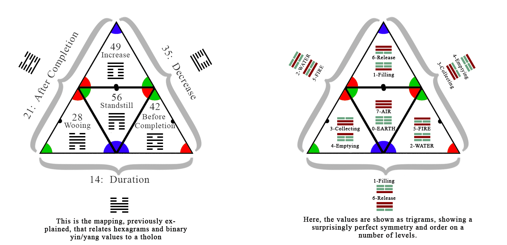

Here are some of the points spelled out:

- Every corner trigram value, which is yang in nature, is reversed on the opposite side, which is the sum of all the values that define the side and is yin in nature.
- The two extremes, 7 and 0, are in the center, which, as a tetrahedron, represent the base of the tetrahedron (EARTH - 0) and the tip (AIR - 7). This is the only place they appear, for being the center, they have no polar opposite.
- All hexagrams are made only of trigram pairs that equal 7
- Inner trigrams progress clockwise (1,2,3), outer trigrams progress counter clockwise (4,5,6). 0 and 7 do not move at all.
- The only point where all the elements (FIRE, WATER, AIR, EARTH) meet with all three *Originating Source* trigrams, i.e, trigrams that have the ability to create, is at the center bottom point of the three blue dots, or three N-states, where a new N-state, or in this case, a new cycle of change, exists.

Examining the I Ching from a tholonic perspective shines a light on new patterns and relationships within the I Ching that exist in nature, reality, energy, science, etc., above and beyond what it already demonstrates in it's binary model.

This, however, brings up an overlooked pattern.  We showed before how descension from the primal 0 and 1 created the super-classes or Absorption, Contraction, Consumption, and Expansion, and from each of these came pairs of 0 and 1, 2 and 3, 4 and 5, and 6 and 7.  When we lay these out as we have above, another super-class emerges, which is that of the opposites.  For example, EARTH (0) and AIR (7) are one of the pairs that add up to 7, but these attributes share a common significance in that together they define the lowest place and the highest place, which essentially describes the limits of the third dimension of our space (as 2D space has no height).  Below is a graphic that shows these pairs and their (proposed) super-class of significance. The last column, "Example Instance" uses the instance of electricity to to show how theses four basic qualities can instantiate in various ways. Chapter 4 of *Tholonia* covers a number of other instances.

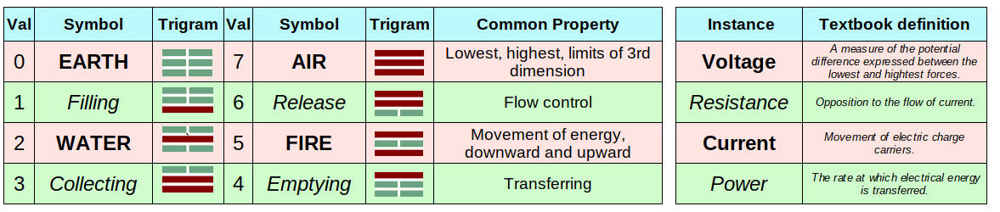


## Astrology

The fundamental structure that the I Ching and related Eastern thinking is built on is essentially the same as the model for astrology and related Western thinking.  This is not at all surprising as both cultures were observing the same laws and patterns in actions.  However, if we find where they combine and overlap, we can understand one model that encompasses both.

Each astrological sign is assigned a element property of FIRE, EARTH, AIR or WATER, and a characteristic of Cardinal, Fixed, or Mutable.  We can easily map the binary and tholonic attributes to these properties, and when we do, we see binary and tholonic patterns appearing in astrological models.


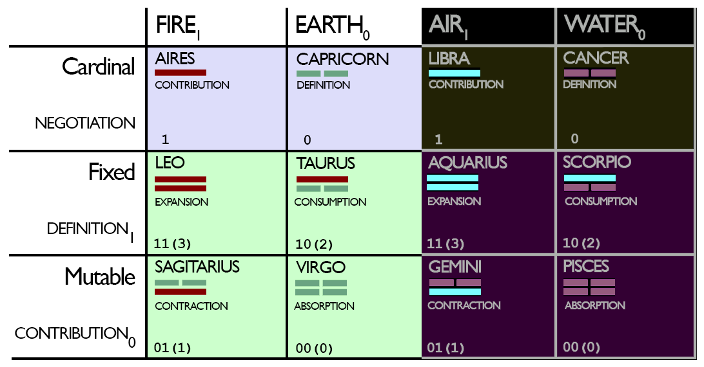

In the above chart, we assign the same yin/yang values for the elements and tholonic descriptions as we have been using all along. NEGOTIATION has no value (because it is both values combined). In the lower left of each cell is the binary value (and the decimal equivalent) of the the column and row. What we see is on the left we have six cells made up of 2 primary lines, and four cells made up of bigrams. The right is the reflected equivalent, which is consistent with the scheme of duality which exists in both models. 

We have to decide in what order the binary values should be assigned, i.e. EARTH-DEFINITION is 10, but DEFINITION-EARTH is 01, yet both apply to the same cell. How do we choose the order? The first thing to understand is that either order is correct, as they are two different perspectives of the same thing.  In our case, we want to select the order that displays the most symmetry and coherence. 

If we map this to the tholon, we should expect to see some significant relationships.  Below we show both options using their numerical values. The one on the right definitely has more symmetry; all cross-cell additions equal 3 and column and row totals equal 7. These are exactly the same values we see when we added up the horizontal pairs of pink dots (7) and orange dots (3) in the binary tree that described how we arrived at the trigrams.[JWFIX: there is another ref to 7/3 as well]


What validates this order, among other things, is how the resulting bigrams so closely describe the qualities of the signs when we apply the values.


Using the values we determined in the chart above, we apply the sign's bigram to the tholon. The cardinal signs, which only have one line and are all the NEGOTIATION signs, neatly fit perfectly. For example, the left side of the upper tholon is made up of EARTH-FIRE-EARTH, and the cardinal EARTH sing is Capricorn. Additionally, the diagonal axis that crosses this side is the boundary between Leo and Taurus which are equidistant to the Capricorn cusp. This is the case pattern we see for all four quadrants. Also significant is that the NEGOTIATION signs, which are those of the N-state and capable of creating new children, not only form the outer boundary, but all non-N signs converge to the tholonic N-cluster in the middle of the resulting hexagrams, creating the central N-state.

An historically interesting observation is the two center triangles that meet are Leo and Aquarius.  Looking at a zodiac, this would appear to be "off", for why would such a critically significant intersection appear so asymmetrical?  This suggests that the original creators of the zodiac were well aware of this significance,  as it was this same axis that defined the planetary assignments back in the day when there were only, and conveniently, six planets. Perhaps they designed it this way to ensure that planet earth would be exactly where the perpendicular axis would be, between Venus and Mars, placing earth in the center. Even though astrology dates back to 2000 BC, given that Saturn and Jupiter weren't discovered until 1610, presumably this assignment came about in the 17th century. In any case, it was pretty clever.


One minor difference between the western and eastern models is that while they both reflect and invert to create the complete picture, they do it a little differently, which make a perfect mapping impossible with the existing models. Here is a larger scale of one type of iteration.  Looking at the monogram and bigram numbers of the signs as they progress there does not seem to be much of a pattern; 1, 2, 1, 0, 3, 0, 1, 2, 1, 0, 3, 0.


However, if we arrange them in a circle, and color them to represent the Negotiation, Define, Contribute elements, the tholonic and binary information becomes quite clear.


- All values are equal to their opposite.

- The single NEGOTIATION (blue) points, which represent the point form which new children can be produced, are 1 and 0, which is no surprise as we only have these two single numbers.

- But there is another set of 1 ands 0 which are made of the bigrams, and these are represent the CONTRIBUTE (red) points, which are the points that return to the N-state, so 1s and 0s leave the N-state as single digit 1s and 0s, but return to the N-state as double digit 1s and 0s.

- The 2s and 3s occupy the DEFINING (green) points.  The 3s represent the most energized, or yang state, never appear more than once is that same axis that divides the planets in the traditional layout.

## The Lines, Part 1

There is another reason why we bring up astrology, and that is because, as we can see in the number wheel above and the tholon model, it is based on six pairs of attributes that define and describe a complete journey through the cycle, and which happen to map neatly onto the six lines of change in the I Ching.  If we apply the rules of the tholonic, I Ching and binary models to astrology, we get the chart shown below.


It works like this… All blue characters are yang in nature, and all red are yin. All yellow backgrounds are INNER (yin/0) in nature, and all green backgrounds are OUTER (yang/1). To correlate astrology to tholonic, we start with the topmost value, which is either 1 or 0 in the columns of DEFINITION or CONTRIBUTION. N has no value so it is skipped.  Then we choose INNER (0) or OUTER (1), and finally, the color of the text, red (0) or blue (1).   The bold text represent the archetypal ideal value for the cell.

Here is how we want to look at this graph as it applis to the hexagram.


To validate this we can look at a few details.

- The progression of the *Nature* column fit perfectly for both the inner (yellow) and outer (green) definitions.
- In tin, inner lines only use the descending (increasing yin) elements of FIRE and EARTH, while the outer use only the ascending (increasing yang) WATER and AIR.
- 

Let's make this even simpler to illustrate another point.


 

We've added the value of the quality within the line. As you can see, the yin (0) values that exist within the yellow/yin side are the values that are the natural archetypes for that place. The same it true for the 1 values inside the green/yang side. Hexagram 21 (binary value) is the hexagram where every yin line exists in a yin place, and every yang line exists in a yang place.  Hex 21 is the ideal archetype of a hexagram, and its opposite, hex 42, is the reverse, or inverted, or "negative image" archetype.   If we were to apply the above charts to hex 21 and 42 using the *Nature* and *Personal values*, we would get the following.


This shows that, according to the tholonic model using traditionally Western values, the archetype of INCEPTION is *Harmony*, and it inverted concept, *Activity*. Likewise, on a more individual, subjective front, the archetype of INCEPTION is *I Balance*, and it inverted concept, *I Am*. Looking at all the pairs we see the same well-matched dualities. 

There is still one last step, and that is to reduce the twelve pairs down to six pairs. This is fairly easy, and it looks something like the left image in the graph below. We have added the blue text circle to describe the qualities of the pair of the previously opposing six pairs, or twelve attributes, of Western astrology. It obvious how these six *uber* attributes match well with the pink circle that lists the I Ching's attributes for the six lines 

On the right is the previous graph that describe the eight trigrams.  Here we have together the model for trigrams and the model for the lines. The lines model (left) is based on the *tholonic tree*, where we begin with 1, which creates 2 more, which is mirrored, creating 6, and then inverted, which creates 12.  The trigram model (right) is a *binary tree*, beginning with 1, which creates 2, each of which creates 2 (4) each of which creates 2 (8).

Both of these models describe only the structure, the contexts of which is constantly changing.


While there is no "top" to either one of these maps, their orientation is relative to one another.  In their most reasonable orientation above, the predominant yin or yang is at the top.  For the line model (left), yang is at the top, and for the trigram model (right), it is yin. If we highlight the yin and yang triangles that are created by each, we see they do not create the *Saturn Star*, or 6-pointed Star of David.  However, they do create a tholon.  Because every tholon exist within a parent tholon (except for the first tholon), and because the "top" of the inner tholon is at the bottom of the outer tholon, we get a yang parent (yang because the lines are the dynamic part), and a yin child (yin because it is a structure only)[JWFIX: this is confusing and contrdictory]. And because a complete tholon includes a virtual tholon (the lower half), we end up with the 2D tholon shown below, which is then turned into a 3D tholon.

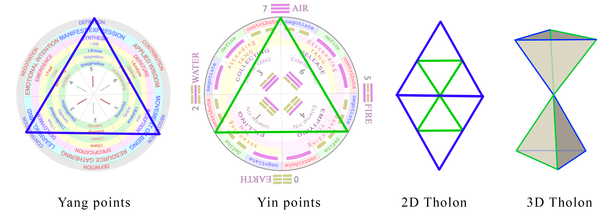

How can we validate this? There are various ways, but the simplest test to see if we are still in the ballpark is to look at the number as we did with the hexagrams within the tholon previously. For example, if we take the numerical values of the lines (rather, the value of their place; 1, 2, 16) and the value of the trigrams (either the base points in the trigram model, 1, 7, 4 or the quadrant, 9, 12, 15, 21) to their appropriate triangles, we get the following:

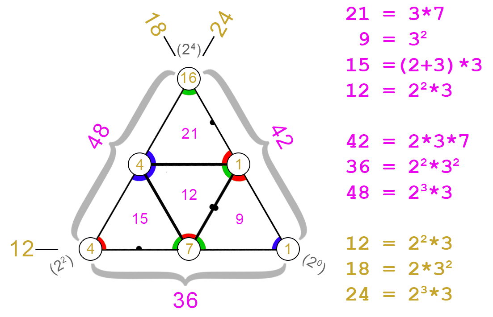

[JWFIX:not clear where some of these numbers come from, like 1,7,4]Pages could be written about the significance of these numbers, but the short version is; we would expect to see values that are the result of 2 (binary), 3 (tholonic and value of all bigram pairs) and 7 (value of all the trigram pairs), and this is exactly what we do see. If any of these numbers were off by 1, this would not be the case. Also note how the brown values of the all the side differ by 6, and any of the pink values differs by multiples of 3.

## The Lines, Part II

A hexagram is defined by a pair of trigrams and the trigrams are defined by three lines, so rather than say there are 6 lines we say there is a pair of 3 lines.  We can also say a hexagram is composed of three bigrams, which, as shown, have their own significance. A line has properties based on its position in the hexagram as well as its position in the trigram.  

Because a line can be either yin or yang we can state that a line is a yin or yang expression of a state that is both, just as we did in the binary tree above.  

Our overriding presumption is that the three archetypes of creation are Negotiation, Definition, and Contribution. We can see the three instantiations of these archetypes in sustainability, growth, and life cycle.

*Sustainability* effectively nothing but negotiation. For something to continue to exist, it must maintain a relationship with its environment. When the environment can no longer come to terms with whatever it is, that thing will cease to exist. This applies to everything from pions to black holes.

*Definition* is the source of limitation, for to define something is to limit it to that definition.  Growth is another word for expansion within the limits defined by some context, and why there are now flying pigs.

*Contribution* happens only during the life cycle of something's existence.  Not coincidently, the two lines that are associated with contribution are line 3, which marks the beginning of a cycles external expression, and line 6, the end of the cycle.

Each of these instances contains a pair of attributes, one yin, and one yang. The graphic below shows each yin/yang pair of attributes for each instance, as well as how a helix of yin and yang connected by the six lines.


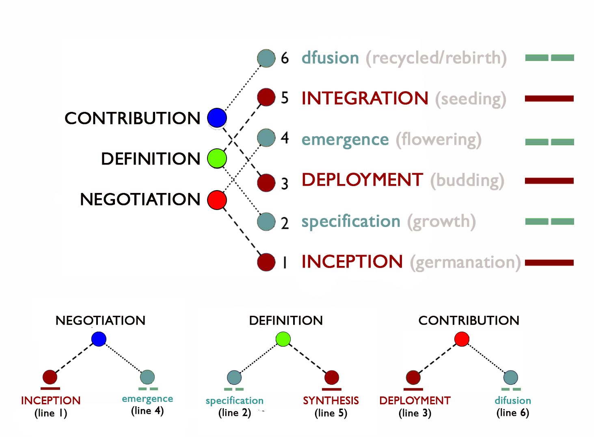

Now we can show this, along with a few other attributes already mentioned, in the following table

In fact, there are a number of models, for growth, recovery, behavior, production, etc., that neatly fit into six stages.  One popular model is called the *The Transtheoretical Model* [^181], included in th table below.

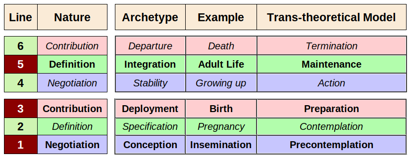

We can see that each line has a natural quality of being yin or yang, ascending/inflating, or descending/deflating. On the table below we show the six lines with their yin and yang qualities. The bold lines indicate this is the natural state for that line. The "Bigram" column comes from the fact that *Definition* has a yin quality, and and *Contribution* has a yang quality, so its two children of yin and yang create a bigram (the bottom line being the parent's). *Negotiation* is the balancing of these two qualities, so it has no bigram, however, it is from the *Negotiating* context that a new *Definition* and *Contribution* can emerge from.  In fact, because the 1st live of every trigram is a *Negotiation*, we consider the 2nd line the *Defining* aspect of the 1^st^ line, and the 3^rd^ line the *Contributing* aspect of the 1st line (as a result of the 2^nd^ line)

|      | Yang       | Yin            | Bigram                                                   |              | Bigram Desc                     |
| ---- | ---------- | -------------- | -------------------------------------------------------- | ------------ | ------------------------------- |
| 6    |            | Departure      |  | Contributing | Contraction (WATER, Collecting) |
| 5    | SYNTHESIS  |                |  | Defining     | Consumptive (Emptying, FIRE)    |
| 4    |            | Emergence      |       | Negotiating  | Originating yin                 |
| 3    | DEPLOYMENT |                |  | Contributing | Expansive (Release,AIR)         |
| 2    |            | Specifications |  | Defining     | Absorptive (EARTH, Filling)     |
| 1    | INCEPTION  |                |      | Negotiating  | Originating yang                |

[JWFIX: reverse order in above table]

You might be wondering how an originating yang, like line 1, can create a child that is all yin, and visa versa for line 4.  This is possible because the two trigrams are originating form the same source that the trinity of *Negotiation*, *Definition*, and *Contribution* arise from, which is the tholon itself, shown below (in case you forgot).  In other words, all possible combination already exist in this one source, and their order of appearance is not defined by the hexagram, trigram, or bigram;  the grams are defined by their order.  Just as an interesting aside, when WATER or FIRE the trigram is mapped to the tholon, it creates all eight trigrams. This means that one complete tholon (a tholon and its virtual tholon) holds all 64 hexagrams.


## Definitions

# NOTE! The following and last section, and everything that follows, is not only a work in progress but large parts of it, it not all of it, is probably all wrong, as recent evidence suggest.


A yin or yang line can mean many things depending on its context.

| Context  | Planets | Orientation | Intentions | Visibility | Weather  | Gender | Humidity | Temp | Formation      | Day   |
| -------- | ------- | ----------- | ---------- | ---------- | -------- | ------ | -------- | ---- | -------------- | ----- |
| **Yin**  | Moon    | Shared      | Covert     | Hidden     | Overcast | Female | Wet      | Cold | Disintegrating | Dark  |
| **Yang** | Sun     | Independent | Open       | Exposed    | Sunny    | Male   | Dry      | Hot  | Integrating    | Light |

Within the hexagram, the meaning of one line depends on the context of its parent's bigram, which exists within the context of the trigrams, which exist within the context of the entire hexagram.  This creates a problem, as how can we know the meaning of a hexagram without knowing the meaning of the lines, and visa versa?

Let's show an example of hexagram 63, *After Completion* (binary value 21). We choose this hexagram because it is 'perfect', in the sense that all the lines are perfectly compatible with the places they hold, so, a yin line in a yin place, yang line in yang place.  It is considered 'perfect' because this is the archetypal order of all changes. The traditional I Ching, while admitting that "After Completion" refers to when everything is finished, i.e., everything is in its right place, it warns that if everything is perfect, then the only thing to expect is coming imperfection, and there "the superior man Takes thought of misfortune And arms himself against it in advance." While this may be good advice, it hides the more significant message. In general, the Wilhelm/Baynes translations are biased as they based on the Song Dynasty Neo-Confucian interpretations of the texts, and Confucius was very moralistic with a penchant for etiquette, propriety, and social order.

here is a graphic that shows the attributes we will be working with.


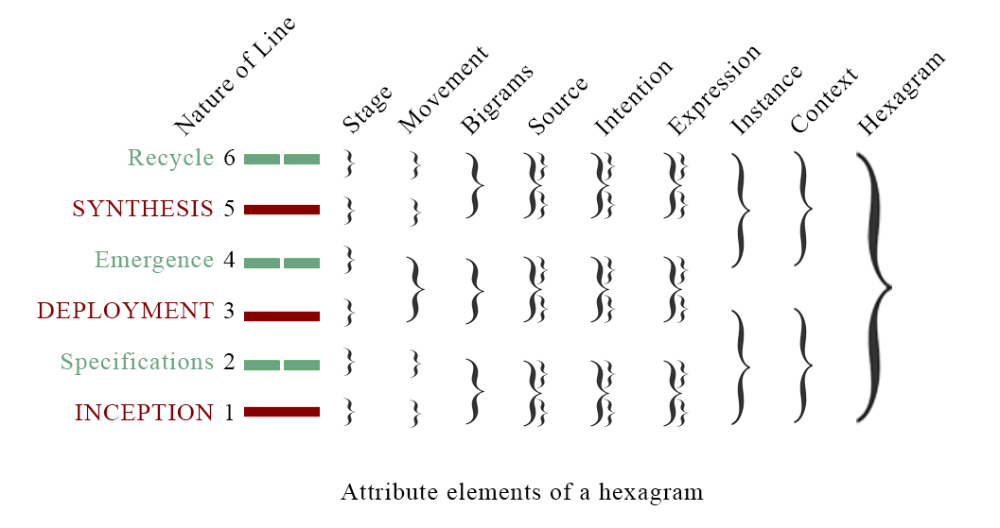

This sort of hierarchical nesting is, as was argued earlier, the very nature of existence, both physical and conceptual. Here were those previous examples:

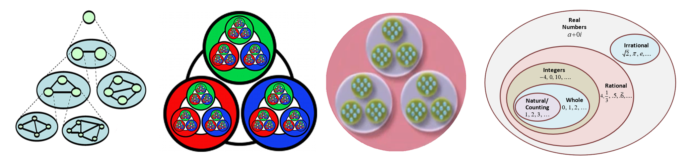

In the table below we show all the attributes we know about.

|      | STAGE          | NATURAL DEFAULT                                      | CONTEXT | MOVEMENT   | INTENTION    | concept     | source     | expression | instance |
| ---- | -------------- | ---------------------------------------------------- | ------- | ---------- | ------------ | ----------- | ---------- | ---------- | -------- |
|      |                |                                                      |         |            |              |             |            |            |          |
| 6    | Departure      |   | Outer   | Descending | Contribution | Contraction | Definition | Collecting | WATER    |
| 5    | SYNTHESIS      |  | Outer   | Still      | Definition   | Contraction | Definition | WATER      | WATER    |
| 4    | Emergence      |   | Outer   | Ascending  | Negotiation  | Contraction | Definition | Collecting | WATER    |
| 3    | DEPLOY         |  | Inner   | Ascending  | Contribution | Contraction | Definition | WATER      | FIRE     |
| 2    | Specifications |   | Inner   | Still      | Definition   | Contraction | Definition | Collecting | FIRE     |
| 1    | INCEPTION      |  | Inner   | Descending | Negotiation  | Contraction | Definition | WATER      | FIRE     |

Theses values are explained below.

*The values in caps refer to the attributes of the structure of the grams.  These do not change. They are the properties of the lines, bigrams, and trigrams regardless of when lines occupies it, which are only determined at the time of the inquiry.*

**STAGE**

- This is the archetype of the stage in the six stages of progression, with the default, or natural, value for the Archetype.

**NATURAL DEFAULT**

- The nature of a single line is either yin or yang

**CONTEXT**

- A line exists in either the lower, yin half of the cycle, or the upper, yang half of the cycle. The yin or yang here describes the environment the line is operating within.

**MOVEMENT**

- A line is either ascending, from yin (0) to yang (7), or descending form yang (7) to yin (0).  However, lines 2 and 5 are neither ascending or descending, for they are at the nadir (0) or zenith (7).

**INTENTION**

- The underlying purpose of a line is determined which if the three primal it belongs to, which are NEGOTIATION, DEFINITION, and CONTRIBUTION. This determines  is the primary nature and purpose of a line.

*The lower case values are the attributes of the cast lines, and therefore reflect the movement of yin an yang within the static structure.*

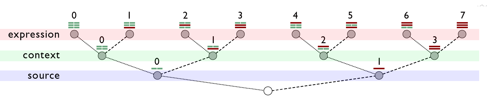

**source**

- Because each bigram comes directly from its bipole parents of *Definition* and *Contribution*, we can assign which side of the bipole the bigram and its lines descended from.

**concept**

- The first children of the original duality of DEFINITION (0) and CONTRIBUTION (1) set the general concept for the line. This concept is the parent of two children which are instantiations of that concept.  The concept is represented as the four bigrams of ABSORPTION, CONTRACTION, CONSUMPTION,  and EXPANSION, and are defined by the lines 1 & 2, 3 & 4, and 5 & 6.

**expression**

- While this appears to be referring to a trigram, it is not.  It is referring to the yet uninstantiated yin or yang quality that is latent within the bigram. For example, the ABSORPTION bigram has the latent qualities of EARTH and Collecting, but these qualities will not be instantiated until a yin or a yang line is added to the bigram. However, because we know that the bigram has these two latest qualities, one being yin and the other yang, we can say that the yin within the bigram is the latent quality of the yin child, EARTH, and the yang in the latent quality of the yang child, Filling.  Therefore, the line of the bigram that is in the yin place will tend to express itself like the yin quality of that bigram, and when that line is in the yang place it will tend to express itself like the yang quality of the bigram. There can be yin or yang lines in both yin or yang places. The property of the line effects the nature of the expressions, so there can be a yang EARTH and a yin EARTH, or a yang FILLING and a yin FILLING, etc.

**instance**

- This is the trigram and the final expression that has descended from the original duality, to the bigrams to this. It is one of the eight children of the four bigrams. These are the first stable, instantiated, manifestations of the original duality.

## Interpretations

How do these static and dynamic attributes apply to one another?  

**INTENTION** applies to **source**.

- **INTENTION** refers to the most primary tholonic attributes of *Negotiation*, *Definition*, and *Contribution*, while **source** refers to the most primary division of creation, the first yin and yang. This is where the binary model meets the tholonic model/

**CONTEXT** applies to **concept**.

- **CONTEXT** is determined by the children of the primary yin and yang, the bigrams, while **concept** refer to the potential of the bigram itself.

**NATURE** applies to **expression**.

- Because it is the addition of one line that defines the **expression** of a bigram, it is the **NATURE** of that place it resides in that affects it.

**MOVEMENT** applies to **instance**.

- **MOVEMENT** is determined by the natural order of the trigrams, while **instance** refers to the actual resulting trigram.

If we applied these attributes as pair, for example…

- *(INTENTION source)  (CONTEXT concept) (NATURE expression)  (MOVEMENT instance)*

Here is why are the pairs ordered in this fashion…

- (INTENTION source) is the most basic, or abstract function as it deals only with the most primal elements.
- (CONTEXT concept) is the formation of the intention.
- (NATURE expression)  defines the final properties.
- (MOVEMENT instance) is those properties in action.

From this we can build a phrase, which would look something like the following for Line 1 of  hexagram 21 . This proto-phrase includes the keywords followed by their yin or yang status as indicated by a 0 or 1 (although some attributes are neutral). This makes it easy to see the nature of the pair, as all pairs will be either 00 (extreme yin), 01 (stable yang), 10 (stable yin), or 11 (extreme yang).

#### **Line 1**  is a YANG (1) line occupying a INWARD FACING (0) YANG (1) place of INCEPTION (1) , so it is in its natural place, and therefore it is a strong YANG (1). 

#### From [NEGOTIATES CHAOS (0)] emerges [INWARD FACING (0) CONSUMPTION (0)] of [INCEPTION (1)] which creates [YANG (1) FIRE (1)] that appear as [DESCENDING (0) EMPTYING (0)] - NEGOTIATION is very strong because it is a yang line in a yang place and supported by the NEGOTIATION in line 4 which is a yin line in a yin place.

Of course, this lacks quiet a bit of clarity, but we can rename these name pair to something meaningful.

Let's look a Line 1 of the above…

- **NEGOTIATING CHAOS** refers to that which must exist within chaos, but yet, exists.  This is first necessity for something to come into being. This describe a ***New Beginning*.**
- **INWARD FACING CONSUMPTION** is term for ***Desire***. This is because CONSUMPTION, in this context, produces FIRE and Emptying, which we can see in the way fire consumes its fuel. Because it is inward facing, i.e. hidden, invisible, so too is the fire and the fuel. 
- **YANG FIRE** is an extreme yang and is the exposed and visible fire. It is the external expression of the Desire in a proactive manner, a ***Impulse at act***.
- **DESCENDING EMPTYING** is an extreme yin that describes the effect. that which is descending is that which has been emptied. It is a ***Pouring out*** of what is within.

Using the above, we can make a new phrase…

#### From a (new beginning) emerges a (desire) which creates (an impulse to act) that appear as a (pouring out) of what is within.

Let's make this a bit more readable.

#### From a new beginning emerges desire. One feels strongly compelled to give of one's self to the world.

But wait, there's more!  We need to consider the nature of the line and its relationship with one other lines. How do we do this? We look at the nature of the line and the place it occupies, and also its counterpart in the opposing trigram. 

 For example…

- Line 1 is a YANG line occupying a INWARD FACING YANG place of INCEPTION , so it is in its natural place, and therefore it is a strong YANG. 

and

- Line 4 is a YIN line occupying a OUTWARD FACING  YIN place of EMERGING , so it is in its natural place, and therefore it is a strong YIN. 

Line 1 is strong, and line 4 is also strong. This puts emphasis on those lines, but as line 4 and line 1 are both a line of NEGOTIATION, then together they create the outlook for NEGOTIATION. In this case, a string line 1 supports a strong line 4 and visa versa. In one of the lines was weak, then it would hinder the other. If both were weak that NEGOTIATION would be extra weak.  In this example of hex 21, all the lines are strong, which is unique to hex 21.

With this in mind we can make some improvements to our phrase…

#### **From a new beginning that is in harmony with the moment, emerges a naturally strong desire to create. One feels strongly compelled to give of one's self to the world. What emerges from this action has the support of the Universe.**


Here is a table of suggested meaning for various terms:

| Term                      | Meaning           | Term                        | Meaning         |
| ------------------------- | ----------------- | --------------------------- | --------------- |
| ASCENDING AIR             |                   | NEGOTIATES ORDERING         | Perseverance ?  |
| ASCENDING COLLECTING      |                   | OUTWARD FACING  ABSORPTION  |                 |
| ASCENDING EARTH           |                   | OUTWARD FACING ABSORPTION   |                 |
| ASCENDING EMPTYING        |                   | OUTWARD FACING  CONSUMPTION |                 |
| ASCENDING FILLING         |                   | OUTWARD FACING CONSUMPTION  |                 |
| ASCENDING FIRE            |                   | OUTWARD FACING  CONTRACTION |                 |
| ASCENDING RELEASING       |                   | OUTWARD FACING CONTRACTION  |                 |
| ASCENDING WATER           |                   | OUTWARD FACING  EXPANSION   |                 |
| CONTRIBUTES CHAOSIS       |                   | OUTWARD FACING EXPANSION    |                 |
| CONTRIBUTES ORDERING      |                   | STILL AIR                   | Mindfulness ?   |
| DEFINES CHAOS             | Formation of Laws | STILL COLLECTING            |                 |
| DEFINES ORDERING          |                   | STILL EARTH                 |                 |
| DESCENDING AIR            |                   | STILL EMPTYING              |                 |
| DESCENDING COLLECTING     |                   | STILL FILLING               |                 |
| DESCENDING EARTH          |                   | STILL FIRE                  |                 |
| DESCENDING EMPTYING       | Pouring out       | STILL RELEASING             |                 |
| DESCENDING FILLING        |                   | STILL WATER                 |                 |
| DESCENDING FIRE           | Lightening, Sun   | YANG AIR                    | Inspiration     |
| DESCENDING RELEASING      | Thunder           | YANG EARTH                  |                 |
| DESCENDING WATER          | Rain              | YANG FIRE                   | Decisive Action |
| INWARD FACING ABSORPTION  |                   | YANG WATER                  |                 |
| INWARD FACING CONSUMPTION | Desire            | YIN AIR                     |                 |
| INWARD FACING CONTRACTION |                   | YIN COLLECTING              |                 |
| INWARD FACING EXPANSION   |                   | YIN EARTH                   |                 |
| NEGOTIATES CHAOSIS        | New beginning     | YIN EMPTYING                |                 |

## xxx


 The problem is, how can we know the meaning of a hexagram without knowing the meaning of the lines, and visa versa?


First we will break down the natural order.

**Line 1** refers to the archetypal property of CONCEPTION with an intention of NEGOTIATION. This can mean many different thing; mitosis, ideas, small movements that will grow to large movement, such as getting pregnant to the beginning of an avalanche.  The act of something beginning is itself a NEGOTIATION, for the elements and conditions at hand must all be compatible with the outcome, but even then, the outcome is not guaranteed. Mountains and snow alone does not guarantee an avalanche, nor does a fertilized egg guarantee a viable life.  A NEGOTIATION is not always cooperative. It can also be a battle, with two forces attempt to take over or eliminate the other. War is just a very aggressive and destructive form of NEGOTIATING. Regardless of the contextual instance CONCEPTION takes, it has the archetypal nature of being yang, suggesting it is the first impulse that begins the cycle.

**Line 2** refers to the archetypal property of REQUIREMENTS. This deals directly with the context of that Line 1 must contend with. The REQUIREMENTS of an avalanche are mountains and snow, and for a pregnancy, compatible chromosomes. In this case REQUIREMENTS is similar to *resources available*, but this line also has the intention of DEFINITION.  It is in this line that the nature of the creation of this cycle is defined. There may be elements avails that can create numerous different instances in the same context, but here is where which instance will be DEFINED. This line is yin because it is subject to the REQUIREMENTS and resources at hand.

#### Now we have two lines, which forms the first bigram of CONTRACTION , which is the yang child of the yin parent DEFINITION. Once we know the bigram, we can look at its children and see that Line 1 is the yin child of CONTRACTION, which is the cardinal element of WATER in a yang line, and line 2 is the yang child, which is the process of COLLECTING, in a yang line. We can now say that **the first two lines are DEFINED by a CONTRACTION which created a yin, or negative, energy, that fills the womb of creation, into which is COLLECTS that which belongs there, i.e. the REQUIREMENTS, and which will find their correct place.**

**Line 3**  refers to the archetypal property of DEPLOYMENT, when that which has been growing is at the point where it ready to become expressed. This line has the intention of CONTRIBUTION, as it has arrived at its final state of development and is ready to be delivered. This line is hang because CONTRIBUTION is an act of delivery, which is yang. This is the line of giving birth, or the small vibration that can shift the snow.

#### This result of the CONTRACTING womb of life that COLLECTED all that is REQUIRES and is ready to be DEPLOY its creations as a CONTRIBUTION to the OUTER world created the trigram of FIRE , the upward, yang, energy of life.

**Line 4**  refers to the STABILITY of that which was just delivered.  It has left the INNER world and now exists in the OUTER world. Here is where it seeks to remain viable on its own, and this again requires a NEGOTIATION between the creations nature and the OUTER context is now has to contend with.

#### Now we have the next two lines which forms the second bigram of CONTRACTION , just like the first bigram. Here, the yin WATER of the yang Line 3 with the intention of DEPLOYMENT suggests an flowing out of what was INSIDE to OUTSIDE. Line 4 is yin, but occupied by the yang nature of COLLECTING with the intention of achieving STABILITY, both of which are negative, or downward, in nature.  The creation will find its place by traveling the path of least resistance to find its place in the same way that WATER travels downward and COLLECTS to form lakes and oceans.  We can now say **these two lines are DEFINED by a CONTRACTION of the WATERS it was created in that leaves the INNER and enters the OUTER, seeking its most STABLE state. **


**Line 5**  refers to the INTEGRATION of this now stable creation with the environment it exists within. Here is where the expression of the creation is DEFINED.

**Line 6**  refers to the CONTINUATION of the creation after is completed expression, and where the CONTRIBUTION of its OUTER expression is determined and recognized.

#### These are the last two lines, which form the third bigram of CONTRACTION , just like the previous two bigrams. Here, the yin WATER of the yang Line 5 with the intention of INTEGRATION suggests a cooperative and broad relationship with its environment, as the WATER is yin (yielding) but the line is yang (expansive). Line 6 is yin, but occupied by the yang nature of COLLECTING with the intention of CONTINUING, both of which are negative, or downward, in nature.  We can now say about this line: **The creations CONTRIBUTION is an expanding downward energy, INTEGRATED with its environment, that COLLECTS with the purpose of CONTINUING. ** 

#### The upper trigram WATER, is produced by the RELEASING quality of the upper trigram of WATER STABILITY of the NEGOTIATIONS of Line 4 resulting in the CONTRIBUTION is an expanding downward energy, INTEGRATED with its environment, that COLLECTS with the purpose of CONTINUING.


To see examples of this, read the interpretations of the hexagrams in Part II.


## ???

When we have one line alone, all we can say about it is that it is yin or yang, 0 or 1. However, we can compare this value to the natural order of line 1, which is a yang line.  In our example, line 1 is a yin line, so we already know that our line 1 varies from the natural order.


We first construct the entire hexagram with the six lines. Once we have the hexagram, we can reverse engineer it to discover its attributes. In this example, we first constructed a hexagram with the binary value of 52. Starting from the top and moving down, we begin with the primary bipole orientation. This can be only Definition (yin) or Contribution (yang). Given the lack of context at this level there is little more we can say.


|      |              | yang                                                         | yin                                                          |
| ---- | ------------ | ------------------------------------------------------------ | ------------------------------------------------------------ |
| 1    | Conception   | **(STRONG) This begins a new cycle.  It could be a new idea, concept, impulse,  desire, etc., but it has yet to have any perceivable effect** | WEAK The writing on the wall, a hunch, a yet manifest unintended consequence |
| 2    | Requirements | WEAK exploration, experimentation                            | **(STRONG) Absorbing, learning, organizing, optimizing, careful assembly** |
| 3    | Deployment   | **(STRONG) Expansion, releasing, separation, pushing forth, advancing** | WEAK pulling back, retreating                                |
| 4    | Stability    | WEAK aggressive, forceful, oppressive                        | **(STRONG) Whatever started in Line 1 has begun to appear in whatever way it can given the context it exists in ** |
| 5    | Integration  | **(STRONG) The peak of expression has been seen, the energy spent. ** | WEAK unsustainable, no value, ??                             |
| 6    | Departure    | WEAK far reaching consequences/changes?                      | **(STRONG) Balance of energy returns to the source. Movement ends, peace of stillness returns.** |


Applying this to  hexagram 17, 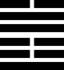

Line 1

- **STRONG New idea or concept, a cause that has yet to have any perceivable effect,  a desire** (results in WEAK aggressive, forceful, oppressive)
- changes to 
  - WEAK The writing on the wall, a hunch, a yet manifest unintended consequence

Line 2

- **STRONG Research, organizing and optimizing, careful assembly** (results in STRONG **functional, adding value, sustainable**)
- changes to
  - WEAK exploration, experimentation

Line 3

- WEAK pulling back, retreating (results in  STRONG **surrender, recycle**)
- changes to 
  - **STRONG separation, pushing forth, advancing**

Line 4 

- WEAK aggressive, forceful, oppressive (depends on STRONG **New idea or concept, a cause that has yet to have any perceivable effect,  a desire**)
- changes to 
  - **STRONG responsive, flexible, negotiable**

Line 5

- **STRONG functional, adding value, sustainable** (depends on STRONG **Research, organizing and optimizing, careful assembly**)
- changes to
  - WEAK unsustainable, no value, ??

Line 6

-   **STRONG surrender, recycle** (depends on WEAK pulling back, retreating)
- changes to
  - WEAK far reaching consequences/changes?

## The Hexagram

If each hexagram is to have its own unique story, then there must be some dynamic between the lines, how they relate to and effect one another. Unfortunately, the traditional I Ching does not elaborate on these rules and relationships. Consequently there are many different ideas about these unspoken rules and many different interpretations, for example; Richard Wilhelm and Cary F. Baynes. [^182]Wilhelm, R., Baynes, C. F., Jung, C. G.[^182], Rudolf Ritsema and Stephen Karcher.[^183], Gregory Whincup.[^184], Kerson and Rosemary Huang.[^185], Alfred Huang. [^186], Henry Wei.  [^187], Wei Tat.  [^188], Chu Hsi.[^189], Richard Rutt.[^190], to name some of the various interpretations and rules. Some of these rules are oddly complex and convolute with little to no apparent reasoning behind them.  This is what we hope to address here.

The traditional I Ching has two features that we will incorporate, that of the *image* and the *judgment* of the hexagram.  For example, hexagram 17, , *Following*, is composed of a lower trigram of *TUI / The Joyous / Lake*, and an upper trigram of *CHEN / The Arousing / Thunder*, so an image of "Thunder in the middle of the lake." is assigned.  They then say "The image of FOLLOWING. Thus the superior man at nightfall Goes indoors for rest and recuperation." How they came to that conclusion is so unclear, at best.

In the tholonic version, we have the lower trigram of *Filling*, and an upper trigram of *Collecting*. From this we can make an image of, say, the filling of something as a result of collecting. Given that the lower trigram in inner in nature, and the upper outer in nature, we could say 

> "One collects that which he finds and values, and fills his bags."

But what more can we say about this? 

- Both trigrams are ascending in nature as they are on the left side of the *Cycle of Change*, suggesting a time of ascension.
- Collecting represents "The higher orders of structure that extend ever outward.", suggesting a return to order.
- Filling represent "form coming to life.", suggesting new beginnings.
- Filling is also one of the three trigrams that is an ORIGINATING SOURCE, suggesting a new path in life.
- Filling is the first action that begins the path that leads away from yin (EARTH, 0), towards yang. Symbolically, this is the time that follows the winter solstice, when the darkness of the night begins to retreat. This suggests a return from darkness, although spring has yet to arrive.
- Both trigrams are dynamic, or imbalanced, suggesting that this is a hexagram of a journey, not a destination.

With this addition insight we could say something like:

> One's inspired journey not only leads one away from the chaos of darkness and back to the natural order of things, but signifies a new direction in life. This is not a time to rest, for the path is not easy in the beginning, but rest does not cross the travelers mind as he is busy filling his bags with the wonders he discovers on his way. 

Oddly, this is almost the exact opposite of "Thus the superior man at nightfall Goes indoors for rest and recuperation."

The image here would be :

> A person walking a rocky path that leads to the east where the sun will soon rise. He is carrying a partly full bag while picking a plant bud. In the, west the sky is dark. He is wearing hiking boots that can withstand the journey.


<div style="page-break-after: always; break-after: page;"></div>  

# PART II


## 21 


## Trigrams

- Contributing UPPER: **2 (16) WATER**

- Defining LOWER trigram:  **5 FIRE**


When the upward moving FIRE is beneath the downward moving WATER both elements are in their ideal places. In this fashion their properties are best expressed to work cooperatively together, and therefore they coexist in harmony. FIRE defines the relationship with its upwards heat, and WATER contributes by being released into the AIR to return to the EARTH. 

## Bigrams

- Contribution (TOP): Formation of Laws

- Definition (MIDDLE): Formation of Laws

- Negotiation (BOTTOM): Formation of Laws


"Defining Contraction" means the purpose and process has been reduced to its simplest and clearest form. 

There is only one road to choose from, it is the correct path, and you are already traveling on it. 


Line 1

- DESC: INCEPTION is a yang place of *Harmony* with the intention to NEGOTIATE occupied by a yang line.  
- NATURE: NEGOTIATION for an INCEPTION are HARMONIOU
- PERSONAL: you are BALANCE to UNDERTAKE a NEGOTIATIO
  - The Moon was said to be in Libra when [Rome](https://en.wikipedia.org/wiki/Rome) was founded

Line 2

- SPECIFICATION is a yin place with the intention to DEFINE occupied by a yin line
- the specifications in place define are stable, meaning they will endure
-  You have what you require

Line 3

- DEPLOYMENT  is a yang place of *Visualization* with the intention to CONTRIBUTE occupied by a yang line
- visualization of what is being created is clear.
- You understand what you are doing

Line 4

- EMERGENCE is a yin place of Nurturing with the intention to NEGOTIATE occupied by a yin line
- the fruits of this creation will be nurturing.
- You feel what is emerging

Line 5

- SYNTHESIS is a yang place of *Imagination* occupied by a yang line
- what was imagined has bloomed
- You know that what you are imaging is real

line 6

- DEPARTING is a yin place with the intention to CONTRIBUTE occupied by a yin line
- was has come to past is applied practically
- Examine what you have done


## Lines


1  **From a new beginning that is in harmony with the moment, emerges a naturally strong desire to create. One feels strongly compelled to give of one's self to the world. What emerges from this action has the support of the Universe.**|

> The first movement that begins a new cycle of change starts with the awareness of that movement. New beginnings are a chaotic time, when even the slightest change can alter the outcome, but this is not a time to wait, rather, one should fearlessly and proactively negotiate with the chaos of the unknown, for the moment supports them. Success is assured if one's desire to give of their self is rooted in their true purpose.

2  From the Formation of Laws emerges a desire to design a strategy. From a blank slate emerges a finished plan that is in harmony with the time.|

>  Once one understands the lay of the land and the rules in play, they begin to strategize where they will go and how they will proceed. In this case, however, one should empty their mind of all plans, desires, and outcomes and allow the same wisdom and intelligence that created Reality to show the way to proceed. 

3  **Seeing the potential for possibilities one feels the desire to deploy oneself. With decisive action, one begins to work in order to contribute to this new world.** 

As one ascends the mountain they can see more of the valley, the horizon, and all the possibilites thatr eash direction might hold.  

>  4 When one leave the home and enters the world, the desire to create something of one's self that is of value to others drives the need to be fruitful and productive as best one can given what one has to work with 


>  5 **By applying the laws of creation to the very best of one's ability, what emerges is a creation that has recognized value. here once does not simply use the laws at hand, but applies one's self to discover or create new laws.** 


>  6 | The cycle of creation has ended, but it begins a new cycle. What was death has become a resurrection as the creative powers live on and nourish the world as rain that falls from the sky


## Notes

The King Wen *sequence*: 63, "After Completion"

## Analysis

- **Line 1**  is a [YANG 1] line occupying a [INWARD FACING 0 YANG 1] place of [INCEPTION 1] , so it is in its natural place, and therefore it is a strong [YANG 1]. 
  **Line 1**  is a [YANG 1] line occupying a [Self-Awareness] place of [INCEPTION 1] , so it is in its natural place, and therefore it is a strong [YANG 1]. 

  - From [NEGOTIATES CHAOS 0] emerges [INWARD FACING 0 CONSUMPTION 0] of [INCEPTION 1] which creates [YANG 1 FIRE 1] that appear as [DESCENDING 0 EMPTYING 0] 

  - #### From [New beginning] emerges [ Desire] of [INCEPTION 1] which creates [ Decisive Action] that appear as [ Pouring out]

  - NEGOTIATION is very strong because it is a yang line in a yang place and supported by the NEGOTIATION in line 4 which is a yin line in a yin place.

  - A strong line 1 is further supported by a strong line 4.

1  **From a new beginning that is in harmony with the moment, emerges a naturally strong desire to create. One feels strongly compelled to give of one's self to the world. What emerges from this action has the support of the Universe.**|

> The first movement that begins a new cycle of change starts with the awareness of that movement. New beginnings are a chaotic time, when even the slightest change can alter the outcome, but this is not a time to wait, rather, one should fearlessly and proactively negotiate with the chaos of the unknown, for the moment supports them. Success is assured if one's desire to give of their self is rooted in their true purpose.

**Line 2**  is a [YIN 0] line occupying a [INWARD FACING 0 YIN 0] place of [SPECIFICATION 0] , so it is in its natural place, and therefore it is a strong [YIN 0]. 

- From [DEFINES 1 CHAOS 0] emerges [INWARD FACING 0 CONSUMPTION 0] of [SPECIFICATION 0] which creates [YIN 0 EMPTYING 0] that appear as [STILL EMPTYING 0] 

- #### From [application of laws] emerges [ Desire] of [SPECIFICATION 0] which creates [ Emptying from within] that appear as [ Limit of Emptiness]

- DEFINITION is very strong because it is a yin line in a yin place and supported by the DEFINITION in line 5 which is a yang line in a yang place.

- A strong line 2 is further supported by a strong line 5.

**Line 3**  is a [YANG 1] line occupying a [INWARD FACING 0 YANG 1] place of [DEPLOYING 1] , so it is in its natural place, and therefore it is a strong [YANG 1]. 

- From [CONTRIBUTES 0 CHAOS 0] emerges [INWARD FACING 0 CONSUMPTION 0] of [DEPLOYING 1] which creates [YANG 1 FIRE 1] that appear as [ASCENDING 1 EMPTYING 0] 

- #### From [Potential possibilities] emerges [ Desire] of [DEPLOYING 1] which creates [ Decisive Action] that appear as [ work]

- CONTRIBUTION is strong in the lower trigram because it is a yang line in a yang place.

- A strong line 3 is further supported by a strong line 6.

**Line 4**  is a [YIN 0] line occupying a [OUTWARD FACING 1 YIN 0] place of [EMERGING 0] , so it is in its natural place, and therefore it is a strong [YIN 0]. 

- From [NEGOTIATES CHAOS 0] emerges [OUTWARD FACING 1 CONSUMPTION 0] of [EMERGING 0] which creates [YIN 0 EMPTYING 0] that appear as [ASCENDING 1 WATER 0] 

- #### From [New beginning] emerges [ Creative expression] of [EMERGING 0] which creates [ Emptying from within] that appear as [ Productivity ??]

- NEGOTIATION is very strong because it is a yin line in a yin place and supported by the NEGOTIATION in line 1 which is a yang line in a yang place.

- A strong line 4 is further supported by a strong line 1.

**Line 5**  is a [YANG 1] line occupying a [OUTWARD FACING 1 YANG 1] place of [SYNTHESIZING 1] , so it is in its natural place, and therefore it is a strong [YANG 1]. 

- From [DEFINES 1 CHAOS 0] emerges [OUTWARD FACING 1 CONSUMPTION 0] of [SYNTHESIZING 1] which creates [YANG 1 FIRE 1] that appear as [STILL WATER 0] 

- #### From [application of laws] emerges [ Creative expression] of [SYNTHESIZING 1] which creates [ Decisive Action] that appear as [ Limits of Water]

- DEFINITION is very strong because it is a yang line in a yang place and supported by the DEFINITION in line 2 which is a yin line in a yin place.

- A strong line 5 is further supported by a strong line 2.

**Line 6**  is a [YIN 0] line occupying a [OUTWARD FACING 1 YIN 0] place of [DEPARTING 0] , so it is in its natural place, and therefore it is a strong [YIN 0]. 

- From [CONTRIBUTES 0 CHAOS 0] emerges [OUTWARD FACING 1 CONSUMPTION 0] of [DEPARTING 0] which creates [YIN 0 EMPTYING 0] that appear as [DESCENDING 0 WATER 0] 

- #### From [Potential possibilities] emerges [ Creative expression] of [DEPARTING 0] which creates [ Emptying from within] that appear as [ Rain, life nourishing]

- A strong line 6 is further supported by a strong line 3.


**Line 1**  is a YANG 1 line occupying a INWARD FACING 0 YANG 1 place of INCEPTION 1 , so it is in its natural place, and therefore it is a strong YANG 1. 

- From [NEGOTIATES CHAOS 0] emerges [INWARD FACING 0 CONSUMPTION 0] of [INCEPTION 1] which creates [YANG 1 FIRE 1] that appear as [DESCENDING 0 EMPTYING 0] - NEGOTIATION is very strong because it is a yang line in a yang place and supported by the NEGOTIATION in line 4 which is a yin line in a yin place.

- A strong line 1 is further supported by a strong line 4.

- #### From a (new beginning) emerges a (desire) which creates (an impulse to act) that appear as a (pouring out) of what is within.

  #### From a new beginning that is in harmony with the moment, emerges a naturally strong desire to create. One feels strongly compelled to give of one's self to the world. What emerges from this action has the support of the Universe.

**Line 2**  is a YIN 0 line occupying a INWARD FACING 0 YIN 0 place of SPECIFICATION 0 , so it is in its natural place, and therefore it is a strong YIN 0. 

- From [DEFINES 1 CHAOS 0] emerges [INWARD FACING 0 CONSUMPTION 0] of [SPECIFICATION 0] which creates [YIN 0 EMPTYING 0] that appear as [STILL EMPTYING 0] - DEFINITION is very strong because it is a yin line in a yin place and supported by the DEFINITION in line 5 which is a yang line in a yang place.

- A strong line 2 is further supported by a strong line 5.

- #### From the **Formation of Laws** emerges **desire** to **specify, design,or plan**, which provides **blank slate** that appear as **a finished blueprint** - DEFINITION is very strong because it is a yin line in a yin place and supported by the DEFINITION in line 5 which is a yang line in a yang place.

- #### From the **Formation of Laws** emerges **a desire** to **design a strategy.** From a **blank slate** emerges **a finished plan** that is in harmony with the time.

**Line 3**  is a YANG 1 line occupying a INWARD FACING 0 YANG 1 place of DEPLOYING 1 , so it is in its natural place, and therefore it is a strong YANG 1. 

- From [CONTRIBUTES 0 CHAOS 0] emerges [INWARD FACING 0 CONSUMPTION 0] of [DEPLOYING 1] which creates [YANG 1 FIRE 1] that appear as [ASCENDING 1 EMPTYING 0] - CONTRIBUTION is strong in the lower trigram because it is a yang line in a yang place.

- A strong line 3 is further supported by a strong line 6.

- #### From [**potential possibility] emerges **desire** of **DEPLOYING**  which creates **decisive action** that appear as **[working to sontroibute**] .

- #### Seeing the potential for possibilities one feels the desire to deploy oneself. With decisive action, one begins to work in order to contribute to this new world.  

**Line 4**  is a YIN 0 line occupying a OUTWARD FACING 1 YIN 0 place of EMERGING 0 , so it is in its natural place, and therefore it is a strong YIN 0. 

- From [NEGOTIATES CHAOS 0] emerges [OUTWARD FACING 1 CONSUMPTION 0] of [EMERGING 0] which creates [YIN 0 EMPTYING 0] that appear as [ASCENDING 1 WATER 0] - NEGOTIATION is very strong because it is a yin line in a yin place and supported by the NEGOTIATION in line 1 which is a yang line in a yang place.

- A strong line 4 is further supported by a strong line 1.

- #### From [**new beginning**] emerges [**the desire to create**] of [**for the world**] which creates [**emptying from within] that appear as [**productivity**] with they can manage to attain. 

- #### When one leave the home and enters the world, the desire to create something of one's self that is of value to others drives the need to be fruitful and productive as best one can given what one has to work with  

- 

**Line 5**  is a YANG 1 line occupying a OUTWARD FACING 1 YANG 1 place of SYNTHESIZING 1 , so it is in its natural place, and therefore it is a strong YANG 1. 

- From [DEFINES 1 CHAOS 0] emerges [OUTWARD FACING 1 CONSUMPTION 0] of [SYNTHESIZING 1] which creates [YANG 1 FIRE 1] that appear as [STILL WATER 0] - DEFINITION is very strong because it is a yang line in a yang place and supported by the DEFINITION in line 2 which is a yin line in a yin place.

- A strong line 5 is further supported by a strong line 2.

- #### From [**Formation, application of Laws**] emerges [**Creative expression**] of [**recognized value**] which creates [decisive action**] that appear as **[limits of water**] - DEFINITION is very strong because it is a yang line in a yang place and supported by the DEFINITION in line 2 which is a yin line in a yin place.

- #### By applying the laws of creation to the very best of one's ability, what emerges is a creation that has recognized value. here once does not simply use the laws at hand, but applies one's self to discover or create new laws.

**Line 6**  is a YIN 0 line occupying a OUTWARD FACING 1 YIN 0 place of DEPARTING 0 , so it is in its natural place, and therefore it is a strong YIN 0. 

- From [CONTRIBUTES 0 CHAOS 0] emerges [OUTWARD FACING 1 CONSUMPTION 0] of [DEPARTING 0] which creates [YIN 0 EMPTYING 0] that appear as [DESCENDING 0 WATER 0] 

- A strong line 6 is further supported by a strong line 3.

- #### From [CONTRIBUTES 0 CHAOS 0] emerges [OUTWARD FACING 1 CONSUMPTION 0] of [DEPARTING 0] which creates [YIN 0 EMPTYING 0] that appear as [DESCENDING 0 WATER 0] 

- #### From [**Potential possibility**] emerges [**Creative expression**] of [DEPARTING 0] which creates **[Emptying from within**] that appear as [nourishing life water]

- #### The cycle of creation has ended, but it begins a new cycle. What was death has become a resurrection as the creative powers live on and nourish the world as rain that falls from the sky 


## 42 ???

The powers of creation all work together in their ideal form. This brings the ideal order to that which is without order.

## Trigrams

Contributing UPPER: **2 (16) WATER**

Defining LOWER trigram:  **5 FIRE**

When the upward moving FIRE is beneath the downward moving WATER both elements are in their ideal places and therefore coexist in harmony. FIRE defines the relationship with its heat, and WATER contributes by being released into the AIR. 

## Bigrams

Contribution (TOP): Formation of Laws

Definition (MIDDLE): Formation of Laws

Negotiation (BOTTOM): Formation of Laws

"Defining Contraction" means the purpose and process is perfectly clear, as the defining limits are well defined, for all three stages. 

There is only one road to choose from, it is the correct path, and you are already traveling on it. 

## Lines

 **1**  

#### **2**  

 **3**  

#### **4**  

 **5**  

#### **6**  


## Notes

The King Wen *sequence*: 63, "After Completion"

## Analysis

**Line 1**  is a YANG line occupying a INWARD FACING YANG place of INCEPTION , so it is in its natural place, and therefore it is a strong YANG. 

- From (NEGOTIATES CHAOSIS) emerges (INWARD FACING CONSUMPTION) of (INCEPTION) which creates (YANG FIRE) that appear as (DESCENDING EMPTYING) - NEGOTIATION is very strong because it is a yang line in a yang place and supported by the NEGOTIATION in line 4 which is a yin line in a yin place.

- A strong line 1 is further supported by a strong line 4.

**Line 2**  is a YIN line occupying a INWARD FACING YIN place of SPECIFICATION , so it is in its natural place, and therefore it is a strong YIN. 

- From (DEFINES CHAOSIS) emerges (INWARD FACING CONSUMPTION) of (SPECIFICATION) which creates (YIN EMPTYING) that appear as (STILL EMPTYING) - DEFINITION is very strong because it is a yin line in a yin place and supported by the DEFINITION in line 5 which is a yang line in a yang place.

- A strong line 2 is further supported by a strong line 5.

**Line 3**  is a YANG line occupying a INWARD FACING YANG place of DEPLOYING , so it is in its natural place, and therefore it is a strong YANG. 

- From (CONTRIBUTES CHAOSIS) emerges (INWARD FACING CONSUMPTION) of (DEPLOYING) which creates (YANG FIRE) that appear as (ASCENDING EMPTYING) - CONTRIBUTION is strong in the lower trigram because it is a yang line in a yang place.

- A strong line 3 is further supported by a strong line 6.

**Line 4**  is a YIN line occupying a OUTWARD FACING  YIN place of EMERGING , so it is in its natural place, and therefore it is a strong YIN. 

- From (NEGOTIATES CHAOSIS) emerges (OUTWARD FACING  CONSUMPTION) of (EMERGING) which creates (YIN EMPTYING) that appear as (ASCENDING WATER) - NEGOTIATION is very strong because it is a yin line in a yin place and supported by the NEGOTIATION in line 1 which is a yang line in a yang place.

- A strong line 4 is further supported by a strong line 1.

**Line 5**  is a YANG line occupying a OUTWARD FACING YANG place of SYNTHESIZING , so it is in its natural place, and therefore it is a strong YANG. 

- From (DEFINES CHAOSIS) emerges (OUTWARD FACING CONSUMPTION) of (SYNTHESIZING) which creates (YANG FIRE) that appear as (STILL WATER) - DEFINITION is very strong because it is a yang line in a yang place and supported by the DEFINITION in line 2 which is a yin line in a yin place.

- A strong line 5 is further supported by a strong line 2.

**Line 6**  is a YIN line occupying a OUTWARD FACING YIN place of DEPARTING , so it is in its natural place, and therefore it is a strong YIN. 

- From (CONTRIBUTES CHAOSIS) emerges (OUTWARD FACING CONSUMPTION) of (DEPARTING) which creates (YIN EMPTYING) that appear as (DESCENDING WATER) 
- A strong line 6 is further supported by a strong line 3.


# The End

[^1]: Gleick, J. (1998). **Making a New Science**.

[^2]: &ldquo;**The Beginning of Time**.&rdquo; Stephen Hawking, <https://www.hawking.org.uk/the-beginning-of-time.html>.

[^3]: For math nerds, here is an excellent vlog on **&ldquo;The Opposite of Infinity&rdquo;**: on <http://www.quora.com> "How do you understand the difference between something infinitely small and something inexistant Are they distinguishable in real terms?

[^4]: <https://users.isy.liu.se/jalar/kurser/QF/assignments/LeggettGarg1985.pdf>

[^5]: Boeyens JCA, Thackeray JF **Number theory and the unity of science**. S Afr J Sci. 2014;110(11/12), Art.\#a0084, 2 pages. <http://dx.doi.org/10.1590/sajs.2014/a0084>

[^6]: Brown, J. H., Gupta, V. K., Li, B., Milne, B. T., Restrepo, C., & West, G. B. (2002**). **The fractal nature of nature: Power laws, ecological complexity and biodiversity**. London: The Royal Society <http://www.fractal.org/Bewustzijns-Besturings-Model/Fractal-Nature.pdf>

[^7]: Here is the video of this experiment: <https://www.youtube.com/watch?v=UpJ-kGII074>

[^8]: Here are a couple of sites that show a harmonograph in action. They are fascinating to watch. <http://andygiger.com/science/harmonograph/index.html>, <https://www.youtube.com/watch?v=HJYvc-ISrf8>

[^9]: Yee, Jeff. (2019). **The Relation of Ohm&rsquo;s Law to Newton&rsquo;s 2nd Law**. 10.13140/RG.2.2.15576.75523. Ohm&rsquo;s law relates voltage, current and resistance in electrical systems as V=IR. Newton&rsquo;s 2nd law relates force, mass and acceleration as F=ma. Although electrical and mechanical systems are supported by different equations to describe these relationships today, it will be shown that the laws of Ohm and Newton are related and are built from the same foundation that governs the force of particles and all of matter.

[^10]: <https://en.wikipedia.org/wiki/International_System_of_Units>

[^11]: Oldershaw, R. L. (1989). **Self-Similar Cosmological model: Introduction and empirical tests**. International Journal of Theoretical Physics, 28(6), 669-694. doi:10.1007/bf00669984 <https://www.academia.edu/26520933/Self-Similar_Cosmological_model_Introduction_and_empirical_tests>

[^12]: You can find many examples of this self-similarity <http://www.bordalierinstitute.com/>

[^13]: <https://www.sciencealert.com/scientists-have-found-a-structural-similarity-between-human-cells-and-neutron-stars>

[^14]: van Leunen, Hans. (2018). **The structure of physical reality**, <https://www.researchgate.net/publication/327273285_The_structure_of_physical_reality>

[^15]: Leunen, J. J. (2018). **Structure of physical reality**. <http://vixra.org/pdf/1806.0087v3.pdf>. Here is the entire report <http://www3.amherst.edu/~rloldershaw/OBS.HTM>

[^16]: Livio, M. (n.d.). **Why Math Works**. <https://www.scientificamerican.com/article/why-math-works/>

[^17]: Britannica, T. E. (2019, April 08). **Laws of thought**. <https://www.britannica.com/topic/laws-of-thought>

[^18]: **15** **Insane Things That Correlate With Each Other**. (n.d.). <http://www.tylervigen.com/spurious-correlations>

[^19]: Abreu, N. (n.d**.). Methodology for Investigating the Hypothesis of Anomalous Remote Perceptions as Objective Phenomena.** <http://cref.tripod.com/tucsonpaper.htm> Science of Self Club, University of Florida

[^20]: <https://www.infinitemonkeylab.com/>

[^21]: Jaynes, Julian (2000) \[1976\]. **The origin of consciousness in the breakdown of the bicameral mind** (PDF). Houghton Mifflin. p.73.ISBN 978-0-618-05707-8.

[^22]: Fast-moving air is at a lower pressure than slow-moving air, so the pressure above the wing is lower than the pressure below, and this creates the lift that powers the plane upward.

[^23]: Fiegna and Velicer, 2003

[^24]: Rankin and Kokko, 2006; Muir and Howard, 1999

[^25]: Rainey, Paul B. **&ldquo;Precarious Development: The Uncertain Social Life of Cellular Slime Molds.&rdquo;** Proceedings of the National Academy of Sciences, vol. 112, no. 9, 2015, pp. 2639-2640., doi:10.1073/pnas.1500708112. <https://www.pnas.org/content/pnas/112/9/2639.full.pdf>

[^26]: De Roode et al., 2005

[^27]: Gersani et al., 2001

[^28]: Ahmed Ibrahim, **&ldquo;Invasive cancer as an empirical example of evolutionary suicide&rdquo;**, Network Biology, 06/2014, v. 4 2

[^29]: **The Simulation Hypothesis Documentary**. (2018, August 01). <https://youtu.be/pznWo8f020I>

[^30]: Klein, Christopher. &ldquo;**DNA Study Finds Aboriginal Australians World&rsquo;s Oldest Civilization.**&rdquo; History.com, A&E Television Networks, 23 Sept. 2016, <https://www.history.com/news/dna-study-finds-aboriginal-australians-worlds-oldest-civilization>

[^31]: Parvinen, Kalle, and Ulf Dieckmann. **&ldquo;Environmental Dimensionality&rdquo;**. *Journal of Theoretical Biology*, 2018, doi: 10.1016/j.jtbi.2018.03.008. <https://www.ncbi.nlm.nih.gov/pubmed/29551543>

[^32]: **List of cycles**. (2019, April 27). <https://en.wikipedia.org/wiki/List_of_cycles>

[^33]: Hossenfelder, Sabine. &ldquo;**Dear Dr B: Does the LHC Collide Protons at Twice the Speed of Light?&rdquo;** Backreaction, 1 Jan. 1970, backreaction. <https://blogspot.com/2019/04/dear-dr-b-does-lhc-collide-protons-at.html>

[^34]: Laszlo, E., & Clark, J. W. (1973). **Introduction to systems philosophy: Toward a new paradigm of contemporary thought**. New York, NY: Harper Torchbooks. ISBN: 0061317624 (ISBN13: 9780061317620)

[^35]: Dawkins, C. R. (2016). **The selfish gene**. Oxford: Oxford University Press.

[^36]: **Just for Hits - Richard Dawkins**. (2013, June 22). <https://youtu.be/GFn-ixX9edg>The first 4 minutes is an excellent overview of memes by Dawkins. The following 4 minutes is a sort of meme-ish music video which is a bit odd, but also a bit entertaining

[^37]: Velikovsky, J. T. (1970, January 01). **Flow Theory, Evolution & Creativity: Or, Fun & Games ** <https://dl.acm.org/citation.cfm?id=2677770>

[^38]: &ldquo;**Quantum Gravity Research**.&rdquo; Quantum Gravity Research, <https://www.quantumgravityresearch.org/>.

[^39]: Smith, F. D. (n.d.). **E8 Root Vectors from 8D to 3D** - Valdosta, Georgia. <http://www.valdostamuseum.com/hamsmith/E8to4Dand3D.pdf>

[^40]: What **is Reality? Emergence Theory Tries to Explain**. (2017, March 11). <http://www.deepstuff.org/what-is-reality-emergence-theory-tries-to-explain/>

[^41]: Jgmoxness. (n.d.). **Visualizing a Theory of Everything**! <http://theoryofeverything.org/theToE/tags/e8/>

[^42]: **Gottfried Wilhelm Leibniz**. (n.d.). <http://www.wikiwand.com/en/Gottfried_Wilhelm_Leibniz>**, Leibniz and the I Ching**. (n.d.). <http://www.wikiwand.com/en/Binary_number#/Leibniz_and_the_I_Ching>

[^43]: **Gottfried Leibniz**. (n.d.). Retrieved from <http://history-computer.com/Dreamers/Leibniz.html>

[^44]: Abrantes, R. (2018, November 19). **How Wolves Change Rivers** \| Ethology Institute \| Read and Watch Now. Retrieved from <https://ethology.eu/how-wolves-change-rivers/>

[^45]: Grzegorz Rozenberg and Arto Salomaa. **The mathematical theory of L systems** (Academic Press, New York, 1980). ISBN 0-12-597140-0

[^46]: Quijada, John. **A Grammar of the Ithkuil Language**. John Quijada, 2011.

[^47]: Speaks, Jeff. **&ldquo;Theories of Meaning&rdquo;**. Stanford Encyclopedia of Philosophy, Stanford University, 27 June 2019,<https://plato.stanford.edu/entries/meaning/>

[^48]: Example of a &ldquo;person&rdquo; as defined by the semantic web: <http://xmlns.com/foaf/spec/#term_Person>

[^49]: McCrae, J. P. (n.d.). **The Linked Open Data Cloud**. <https://www.lod-cloud.net/>

[^50]: Wang, Y., & Kosinski, M. (in press). **&ldquo;Deep neural networks are more accurate than humans at detecting sexual orientation from facial images&rdquo;**. Journal of Personality and Social Psychology; Newspaper article on this research: Levin, Sam. **&ldquo;New AI Can Work out Whether You&rsquo;re Gay or Straight from a Photograph.&rdquo;** The Guardian, Guardian News and Media, 7 Sept. 2017, <http://www.theguardian.com/technology/2017/sep/07/new-artificial-intelligence-can-tell-whether-youre-gay-or-straight-from-a-photograph>

[^51]: &ldquo;**Reciprocal Theory**&rdquo; RationalWiki, <https://rationalwiki.org/wiki/Reciprocal_Theory>.

[^52]: Fuller, R. Buckminster, and E. J. Applewhite. ***Synergetics. Explorations in the Geometry of Thinking***. Macmillan, 1975.The entire book can be found online at <http://synergetics.info/>

[^53]: References to the above come from <http://synergetics.info/s02/p0000.html>

[^54]: <http://hexagonalwater.com>

[^55]: Ptok, Fabian, &ldquo;**Alternative Irrigation Methods: Structured Water in the context of a Growing Global Food Crisis due to Water Shortages**&rdquo; (2014). Undergraduate Honors Theses. 182. <https://scholar.colorado.edu/honr_theses/182>

[^56]: Fonseca, Giuseppe, and Giuseppe Fonseca. &ldquo;**Dr Pollack The Fourth Phase of Water.**&rdquo; Academia.edu, <https://www.academia.edu/18516517/Dr_Pollack_The_Fourth_Phase_Of_Water>

[^57]: Chara, et al. &ldquo;**Crossover between Tetrahedral and Hexagonal Structures in Liquid Water.**&rdquo; Physics Letters A, <http://www.academia.edu/21730774>

[^58]: Seager, William, and Sean Allen-Hermanson. **&ldquo;Panpsychism.&rdquo;** Stanford Encyclopedia of Philosophy, Stanford University, 23 May 2001, <https://plato.stanford.edu/archives/win2012/entries/panpsychism/>

[^59]: Turow, J. (1991). **The Challenge of Inference in Interinstitutional Research on Mass Communication**. Communication Research,18(2),222-239. <https://doi.org/10.1177/009365091018002005>. *Note: Although this is not a reference to the official definition of the term &ldquo;interinsitutionality&rdquo;, which is too vague to be of any use here, it does provide an excellent explanation of what it is, how it works, and how it applies to mass communications.*

[^60]: Spottiswoode, C. N., K. S. Begg, and C. M. Begg. **&ldquo;Reciprocal Signaling in Honeyguide-human Mutualism&rdquo;.** Science 353, no. 6297 (2016): 387-89. doi:10.1126/science. aaf4885.

[^61]: Milius, Susan. &ldquo;**How Roaches Fight off Wasps That Turn Their Victims into Zombies.**&rdquo; Science News, 14 Nov. 2018, <https://www.sciencenews.org/article/how-roaches-fight-wasps-turn-their-victims-zombies>

[^62]: Media, T. E. (2015, June 02). Rupert Sheldrake, **Heretic**. <https://www.youtube.com/watch?v=ZSd4DA5xhHw>

[^63]: Sheldrake, Rupert. **A New Science of Life: The Hypothesis of Formative Causation**. Los Angeles: J.P. Tarcher, 1981.

[^64]: Horgan, J. (2014, July 14).**Scientific Heretic Rupert Sheldrake on Morphic Fields, Psychic Dogs and Other Mysteries.** <https://blogs.scientificamerican.com/cross-check/scientific-heretic-rupert-sheldrake-on-morphic-fields-psychic-dogs-and-other-mysteries/>

[^65]: Sheldrake, R. (n.d.).**Morphic Resonance and Morphic Fields - an Introduction**. <https://www.sheldrake.org/research/morphic-resonance/introduction>

[^66]: Sheldrake, R. (2013). **Dogs That Know When Their Owners Are Coming Home: And Other Unexplained Powers of Animals**. London: Cornerstone Digital.

[^67]: One of these experiments can be seen here: <http://www.sheldrake.org/videos/jaytee-a-dog-who-knew-when-his-owner-was-coming-home-the-orf-experiment>

[^68]: Iozzio, Corinne. &ldquo;**Scientists Prove That Telepathic Communication Is Within Reach.**&rdquo; Smithsonian.com, Smithsonian Institution, 2 Oct. 2014, <https://www.smithsonianmag.com/innovation/scientists-prove-that-telepathic-communication-is-within-reach-180952868/>

[^69]: Wilkins, & Sherman, H. M. (1971). ***Thoughts through space***. London: Muller.

[^70]: Sheldrake, R. (2013). **Science set free: 10 paths to new discovery.** New York: Deepak Chopra Books.

[^71]: Smolin, L. (2012, May 16). **Precedence and freedom in quantum physics**. <https://arxiv.org/abs/1205.3707>

[^72]: Lobach, E.; Bierman, D. (2004). &ldquo;**The Invisible Gaze: Three Attempts to Replicate Sheldrake&rsquo;s Staring Effects**&rdquo; . <https://www.parapsych.org/papers/07.pdf>

[^73]: <https://www.scientificamerican.com/article/what-causes-spooky-out-of-body-experiences/>

[^74]: <https://www.iacworld.org/evidence-for-out-of-body-experience-as-a-real-or-veridical-phenomenon/>

[^75]: The full account of his research and notes are reprinted at <http://www.aura-oasis.be/website/scientific-research-on-out-of-the-body-experiences/>

[^76]: Tressoldi, P. E., Storm, L., & Radin, D. (2010). **Extrasensory Perception and Quantum Models of Cognition, Neuro Quantology,** 8(4). doi:10.14704/nq.2010.8.4.353

[^77]: King, T. (2017, May 30). **Scientific Evidence of Telepathy - Documentary.** Retrieved from <https://www.youtube.com/watch?v=zZ4G3IRVFwU>

[^78]: **Astronaut Tells of E. S. P. Tests.** (1971, June 22). Retrieved from <https://www.nytimes.com/1971/06/22/archives/astronaut-tells-of-e-s-p-tests.html>

[^79]: **100 Scientific Papers Offering Evidence for Psi Phenomena & Effects**. (2019, April 22). <https://subtle.energy/list-100-peer-reviewed-papers-offer-scientific-evidence-psi-phenomena/>

[^80]: Luke, D. (2009, September). **Telepathine (ayahuasca) and psychic ability: Field research in South America**.  <http://www.researchgate.net/publication/278301470>, British Psychological Society, Transpersonal Psychology Section 13th Annual Conference

[^81]: Cave, K. (2015, February 24). **The rise of &ldquo;Telepathic Tech&rdquo; in 2015**. Retrieved from <https://www.idgconnect.com/idgconnect/analysis-review/1023702/rise-telepathic-tech-2015>

[^82]: Grau, C., Ginhoux, R., Riera, A., Nguyen, T. L., Chauvat, H., Berg, M., &hellip; Ruffini, G. (n.d.). **Conscious Brain-to-Brain Communication in Humans Using Non-Invasive Technologies**. <https://journals.plos.org/plosone/article?id=10.1371/journal.pone.0105225>

[^83]: Heaven, D. (n.d.). **First mind-reading implant gives rats telepathic power**. Retrieved from <https://www.newscientist.com/article/dn23221-first-mind-reading-implant-gives-rats-telepathic-power/>

[^84]: Tucker, P. (2018, September 06). **it&rsquo;s Now Possible to Telepathically Communicate with a Drone Swarm.** Retrieved from <https://www.defenseone.com/technology/2018/09/its-now-possible-telepathically-communicate-drone-swarm/151068/>

[^85]: Kosoff, M., & Kosoff, M. (2017, April 21). **Elon Musk Is Seriously Starting a &ldquo;Telepathy&rdquo; Company.** Retrieved from <https://www.vanityfair.com/news/2017/04/elon-musk-is-seriously-starting-a-telepathy-company>

[^86]: Heath, A. (2017, January 11). **Facebook has a mysterious team working on tech that sounds a lot like mind reading**. Retrieved from <https://www.businessinsider.com/facebooks-building-8-working-on-brain-computer-communication-platform-2017-1>

[^87]: Watanabe-Crockett, L. (n.d.). **Telepathic Message Sent Over Internet**. Retrieved from <https://www.wabisabilearning.com/blog/telepathic-message-sent-over-internet>

[^88]: ArXiv, E. T. (2018, October 01). **The first &ldquo;social network&rdquo; of brains lets three people transmit thoughts to each other&rsquo;s heads.** Retrieved from <https://www.technologyreview.com/s/612212/the-first-social-network-of-brains-lets-three-people-transmit-thoughts-to-each-others-heads/>

[^89]: King, T. (2017, May 30). **Scientific Evidence of Telepathy - Documentary**. <https://www.youtube.com/watch?v=zZ4G3IRVFwU>

[^90]: MetaRising. (2016, November 10). **Banned TED Talk about Psychic Abilities** \| Russell Targ \| suespeaks.org. <https://www.youtube.com/watch?v=hBl0cwyn5GY>

[^91]: Zhou, Wen, and Denise Chen. &ldquo;**Fear-Related Chemosignals Modulate Recognition of Fear in Ambiguous Facial Expressions.**&rdquo; Psychological Science 20, no. 2 (2009): 177-83. doi:10.1111/j.1467-9280.2009.02263. x.

[^92]: **&ldquo;Some Personality Traits Affect How You Smell.&rdquo;** Live Science, December 2, 2011

[^93]: Masataka, N., and M. Shibasak. &ldquo;** Premenstrual Enhancement of Snake Detection in Visual&rdquo;**" Nature. March 8, 2012. Accessed May 29, 2016.doi:10.1038/srep00307

[^94]: **&ldquo;The Humans with Super Human Vision.&rdquo;** Discover, June 18, 2009.

[^95]: Galland, L., National Center for Biotechnology Information. December 2014. Accessed June 12, 2016. <http://www.ncbi.nlm.nih.gov/pubmed/25402818/>

[^96]: Heijtz, R. D., S. Wang, F. Anuar, Y. Qian, B. Bjorkholm, A. Samuelsson, M. L. Hibberd, H. Forssberg, and S. Pettersson. &ldquo;**Normal Gut Microbiota Modulates Brain Development and Behavior.**&rdquo; Proceedings of the National Academy of Sciences 108, no. 7 (2011): 3047-052. Accessed June 26, 2016. doi:10.1073/pnas.1010529108. Note: this is the same paper used by Dr. Andrew Wakefield to help support the autism/vaccine connection, which, contrary to Dr. Brain Deer&rsquo;s accusations, is neither fraudulent or inaccurate.

[^97]: Gershon, Michael D. **The Second Brain: The Scientific Basis of Gut Instinct and a Groundbreaking New Understanding of Nervous Disorders of the Stomach and Intestine.** New York, NY: HarperCollins Publishers, 1998.

[^98]: **&ldquo;Sight Unseen: People Blinded by Brain Damage Can Respond to Emotive Expressions.&rdquo;** Scientific American, October 14, 2009.

[^99]: This is a technique taught by the Nithyananda Mission.Contact address: Nithyananda Dhyanapeetam, Nithyanandapuri, Kallugopahalli, Off Mysore Road, Bidadi, Bangalore District &ldquo; 562 109. Karnataka, INDIA

[^100]: Cerretani, Jessica. &ldquo;**Extra Sensory Perceptions.**&rdquo; HMS.Accessed May 29, 2016. <https://hms.harvard.edu/news/harvard-medicine/extra-sensory-perceptions>.

[^101]: Crick, F., & Orgel, L. (1973). **Directed panspermia.** Icarus, 19(3), 341-346. doi:10.1016/0019-1035(73)90110-3

[^102]: Sullivan, W. (1979, May 07). **Scientists Examine Tiny Viruses for Messages from Outer Space**. Retrieved from <https://www.nytimes.com/1979/05/07/archives/scientists-examine-tiny-viruses-for-messages-from-outer-space.html>

[^103]: **Collective Memory.**(n.d.). <https://www.sciencedirect.com/topics/computer-science/collective-memory>

[^104]: García-Gavilanes, Ruth, et al. **&ldquo;The Memory Remains: Understanding Collective Memory in the Digital Age.&rdquo;** Science Advances, vol. 3, no. 4, 2017, doi:10.1126/sciadv.1602368. <https://advances.sciencemag.org/content/3/4/e1602368.full>

[^105]: <https://en.wikipedia.org/wiki/Exabyte>

[^106]: Darryl Bruce (2001) **Fifty Years Since Lashley&rsquo;s In Search of the Engram**: Refutations and Conjectures, Journal of the History of the Neurosciences, 10:3, 308-318, DOI: 10.1076/jhin.10.3.308.9086<https://www.tandfonline.com/doi/abs/10.1076/jhin.10.3.308.9086>

[^107]: &ldquo;**Internet Kill Switch**.&rdquo; Wikipedia, Wikimedia Foundation, 24 Jan. 2019,<https://en.wikipedia.org/wiki/Internet_kill_switch>

[^108]: Trafton, Anne. &ldquo;**Brain Waves Encode Rules for Behavior.**&rdquo; MIT News, 21 Nov. 2012, <http://news.mit.edu/2012/brain-waves-encode-rules-for-behavior-1121>

[^109]: &ldquo;**Brain Waves Encode Information as Time Signals.**&rdquo; ScienceDaily, ScienceDaily, 16 Dec. 2013, <https://www.sciencedaily.com/releases/2013/12/131216142622.htm>

[^110]: &ldquo;**New Way of Retaining Quantum Memories Stored in Light.**&rdquo; ScienceDaily, ScienceDaily, 30 Sept. 2015, <https://www.sciencedaily.com/releases/2015/09/150930074440.htm>

[^111]: &ldquo;**What Is the Cosmic Microwave Background Radiation?&rdquo;** *Scientific American*, <https://www.scientificamerican.com/article/what-is-the-cosmic-microw/>

[^112]: Williams, Matt. &ldquo;**It Could Be Possible to Transfer Data Through Gravitational Waves.**&rdquo; Universe Today, 24 Oct. 2018, <https://www.universetoday.com/140305/it-could-be-possible-to-transfer-data-through-gravitational-waves/>

[^113]: &ldquo;**Can Quantum Dark Energy Explain Telepathy?&rdquo;** Can Quantum Dark Energy Explain Telepathy? \| Naked Science Forum, <https://www.thenakedscientists.com/forum/index.php?topic=52709.0>

[^114]: Thomas Y., Kahhak L., Aissa J. (2006) **The physical nature of the biological signal, a puzzling phenomenon: the critical contribution of Jacques Benveniste**. In: Pollack G.H., Cameron I.L., Wheatley D.N. (eds) Water and the Cell. Springer, Dordrecht, <https://link.springer.com/chapter/10.1007/1-4020-4927-7_17>

[^115]: &ldquo;**When to Publish Pseudo-Science**.&rdquo; Nature, vol. 334, no. 6181, 1988, pp. 367. doi:10.1038/334367a0. <https://www.nature.com/articles/334367a0>

[^116]: Maddox, John, et al. &ldquo;**High-Dilution&rdquo; Experiments a Delusion.**&rdquo; Nature, vol. 334, no. 6180, 1988, pp. 287-290., doi:10.1038/334287a0. <https://www.ncbi.nlm.nih.gov/pubmed/2455869>

[^117]: Pritchard, David E., et al. &ldquo;**Photon Scattering from Atoms in an Atom Interferometer: Coherence Lost and Regained.**&rdquo; Coherence and Quantum Optics VII, 1996, pp. 133-141. doi:10.1007/978-1-4757-9742-8_18. <https://journals.aps.org/prl/abstract/10.1103/PhysRevLett.75.3783> Full paper: <http://chapmanlabs.gatech.edu/papers/scattering_ifm_prl95.pdf>.

[^118]: Penrose, Roger, and Malcolm Angus Hugh. MacCallum. **Twistor Theory: An Approach to the Quantisation of Fields and Space-time**. Amsterdam: North-Holland Pub., 1973.

[^119]: Dr. Wojciech Zurek of the Los Alamos National Laboratory explains the concept of quantum Darwinism in an interview at the Institute for Quantum Computing that you can see on YouTube at <https://www.youtube.com/watch?v=27zMdaBgt6g>

[^120]: Dias, Brian & Ressler, Kerry. (2013). **Parental olfactory experience influences behavior and neural structure in subsequent generations**. Nature neuroscience. 17. 10.1038/nn.3594. www.researchgate.net/publication/259109859. See also articles: <https://www.bbc.com/news/health-25156510> and <http://www.telegraph.co.uk/news/science/science-news> article **"Phobias may be memories passed down in genes from ancestors"**

[^121]: Hagelin, John S., Rainforth, Maxwell V., Cavanaugh, Kenneth L. C., Alexander, Charles N., Shatkin, Susan F., Davies, John L., Hughes, Anne O., Ross, Emanuel, Orme-Johnson, David W., **Effects of Group Practice of the Transcendental Meditation Program on Preventing Violent Crime in Washington, D.C.: Results of the National Demonstration Project, June--July 1993,** Social Indicators Research,,8 June 01,1999 <https://doi.org/10.1023/A:1006978911496> Full report available at <http://www.istpp.org/crime_prevention/>

[^122]: &ldquo;**Reduced Violent Crime in Washington, DC.**&rdquo; Research Reduced Violent Crime in Washington DC Comments, <https://research.mum.edu/maharishi-effect/reduced-violent-crime-in-washington-dc>

[^123]: Carey, Benedict. &ldquo;**Long-Awaited Medical Study Questions the Power of Prayer.**&rdquo; The New York Times, The New York Times, 31 Mar. 2006, <https://www.nytimes.com/2006/03/31/health/31pray.html>.

[^124]: Byrd, Randolph C. &ldquo;**Positive Therapeutic Effects of Intercessory Prayer in a Coronary Care Unit Population.**&rdquo; Southern Medical Journal, vol. 81, no. 7, 1988, pp. 826-829., doi:10.1097/00007611-198807000-00005. <http://www.godandscience.org/apologetics/smj1.html>

[^125]: William S. Harris, PhD; Manohar Gowda, MD; Jerry W. Kolb, MDiv; et al, **&ldquo;A Randomized, Controlled Trial of the Effects of Remote, Intercessory Prayer on Outcomes in Patients Admitted to the Coronary Care Unit"Correction.&rdquo;** Archives of Internal Medicine, vol. 160, no. 12, 2000, p. 1878., doi:10.1001/archinte.160.12.1878. <https://jamanetwork.com/journals/jamainternalmedicine/fullarticle/485161>

[^126]: Lilly, J. M., Sykulski, A. M., Early, J. J., and Olhede, S. C.: **Fractional Brownian motion, the Matérn process, and stochastic modeling of turbulent dispersion**, Nonlin. Processes Geophys., 24, 481-514, <https://doi.org/10.5194/npg-24-481-2017>, 2017.

[^127]: Grabbed from <https://www.oddee.com/item_82923.aspx>

[^128]: **&ldquo;As above, so below&rdquo;, or how a scientific theory is born**. (2012, July 30). <https://paolomaggiuk.wordpress.com/as-above-so-below-or-how-a-scientific-theory-is-born/>

[^129]: Rifkin, L. (2014, June 10). **The Logic and Beauty of Cosmological Natural Selection**. <https://blogs.scientificamerican.com/guest-blog/the-logic-and-beauty-of-cosmological-natural-selection/>

[^131]: Talbot, Michael, and Lynne McTaggart. **The Holographic Universe: The Revolutionary Theory of Reality**. New York, NY: Harper Perennial, 2011.

[^132]: Wilber, Ken. **The Holographic Paradigm**. Shambhala;1982

[^133]: Crew, B. (n.d.).**The Case For Black Holes Being Nothing But Holograms Just Got Even Stronger.**<https://www.sciencealert.com/the-case-for-black-holes-being-nothing-but-holographic-images-just-got-stronger>

[^134]: Genesis 3:22. The entire line is &ldquo;Then the Lord God said, &lsquo;Behold, the man has become like one of Us, knowing the difference between good and evil; suppose he were to reach out his hand to also eat the fruit of the tree of life, and live forever!&rsquo;&rdquo; 

[^135]: Emoto, Masaru. **The True Power of Water: Healing and Discovering Ourselves**. Beyond Words Pub., 2005.;Emoto, Masaru. **Messages from Water and the Universe.** Hay House, 2010.; Emoto, Masaru. **Messages from Water: The First Pictures of Frozen Water Crystals.** Hado Publishing, 2004.

[^136]: The use of magnetic water in agriculture to increase harvest and save up to 25% water. Live testimonials by biggest Australian farmers. <https://www.youtube.com/watch?v=YVL6tfGhr8M>

[^137]: For example. **Heron's Fountain Plastic Water Bottle 2 minute DIY no sealant, no glue,**<https://www.youtube.com/watch?v=92rSXLPupKw>

[^138]: More on Victor&rsquo;s work can be seen in the excellent documentary on YouTube &ldquo;**The Secrets of Water, The Documentary of Viktor Schauberger / Comprehend and Copy Nature**&rdquo;, <https://www.youtube.com/watch?v=XyOGdjWDVM4>

[^139]: Martin-Fischer-Harthun, &ldquo;**Experimente mit Leitungswasser**&rdquo;, 1997. This is a difficult paper to find online. The original can be purchased at <https://www.fischer-wirbelwasser.de/shop/buecher.html>

[^140]: **&ldquo;The anthropic universe&rdquo;**. Science Show. 18 February 2006.

[^141]: Folger, Tim. **&ldquo;Eminent Physicist John Wheeler Says He Has Only Enough Time Left to Work on One Idea: That Human Consciousness Shapes Not Only the Present but the Past as Well.&rdquo;** Discover Magazine, June 1, 2002. <http://discovermagazine.com/2002/jun/featuniverse#.UvxOUrTVdnA>.

[^142]: **&ldquo;Consciousness in the Universe: A Review of the &ldquo;Orch OR&rdquo; Theory.&rdquo;** Physics of Life Reviews. Elsevier, August 20, 2013. <https://www.sciencedirect.com/science/article/pii/S1571064513001188?via=ihub>.

[^143]: This idea, and much more, is discussed at length in a 82 volume edition of great works that question the nature of existence. Glattfelder, James B. Information, **Consciousness, Reality: How a New Understanding of the Universe Can Help Answer Age-Old Questions of Existence**. Cham: Springer International Publishing, 2019. Available online at <https://link.springer.com/bookseries/5342>

[^144]: Hubisz, John L. &ldquo;**The Pleasure of Finding Things Out: The Best Short Works of Richard P. Feynman, by Carl Feynman and Michelle Feynman.**&rdquo; The Physics Teacher, vol. 38, no. 2, 2000, pp. 111. doi:10.1119/1.1558111.

[^160]:  In that it applies the syntactic features of natural languages.  This is mentioned in the book: Prusinkiewicz, Przemyslaw, et al. **The Algorithmic Beauty of Plants**. Springer, 1996.  This book is also available online.  The relevant chapter is  http://algorithmicbotany.org/papers/abop/abop-ch1.pdf.  This site in general is an excellent resource for algorithms of nature.

[^161]: Steingart, Dan. “**The Unfortunate Tetrahedron**.” Medium. the unfortunate tetrahedron, May 30, 2017. https://medium.com/the-unfortunate-tetrahedron/the-unfortunate-tetrahedron-ce1e44d0b961.

[^164]: Levin, Samuel & Scott, Thomas & Cooper, Helen & West, Stuart. (2017). **Darwin&rsquo;s aliens.** International Journal of Astrobiology. 1-9. 10.1017/S1473550417000362. 

[^165]: Amazing description of how the E8 crystal can be defined as tetrahedrals. <https://quantumgravityresearch.org/portfolio/a-deep-link-between-3d-and-8d>

[^166]: As a relevant aside, this reversing effect has a material analog called the *Janibekov effect,*(among other names). It is well established in the field of mechanics and is most easily observed in space where there is no gravity. On observing it for the first time one would think the impossible is happening, but in fact, it is a basic law of energy that we rarely get to see here on Earth because of gravity. Imagine an asymmetrical rigid body, like a wing-nut or a or handle, rotating around one of its axis, then suddenly, it flips 180&deg;, and continues to rotate around the same axis, but in a reverse position. After a few moments, it flips again, and continues flipping back and forth indefinitely. It does this because the lowest energy state, which is the state that all matter seeks,  requires the maximum amount of inertia, and the maximum amount of inertia will always be where the most mass is. Given that the object is asymmetrical, the amount of mass for each axis will change, causing the object to change position. A quick search for &ldquo;Janibekov effect&rdquo; will yield many fascinating videos on this phenomena. This phenomena is worth mentioning because it is a perfect example of how energy operates in form, and, presumably, in the archetypes of form as well, which, at least tholonically, are asymmetrical tholons.

[^167]: Levin, Samuel R., and Stuart A. West. **“The Evolution of Cooperation in Simple Molecular Replicators.”** Proceedings of the Royal Society B: Biological Sciences 284, no. 1864 (November 2017): 20171967. <https://doi.org/10.1098/rspb.2017.1967>.

[^168]: <https://en.wikipedia.org/wiki/Quantum_eraser_experimentreincar>

[^169]: **&ldquo;Exploring Geographic and Geometric Relationships Along a Line of Ancient Sites Around the World&rdquo;** <https://grahamhancock.com/geographic-geometric-relationships-alisonj/>

[^170]: SCIENCE 313:49 7/7/2006

[^171]: Barton, George A. **On the Babylonian Origin of Plato&rsquo;s Nuptial Number: on an Old Babylonian Letter Addressed "to Lushtamar."**. New Haven: American Oriental Society, 1908. <https://www.jstor.org/stable/592627?seq=2#metadata_info_tab_contentst>

[^172]: Siegel, Ethan. “**Ask Ethan: Can Free Quarks Exist Outside Of A Bound-State Particle?**” Forbes. Forbes Magazine, August 3, 2019. <https://www.forbes.com/sites/startswithabang/2019/08/03/ask-ethan-can-free-quarks-exist-outside-of-a-bound-state-particle/>

[^173]:  <https://www.quantamagazine.org/entanglement-made-simple-20160428/>

[^174]: Image credit: The pre-launch Planck Sky Model: a model of sky emission at submillimetre to centimetre wavelengths — Delabrouille, J. et al.Astron.Astrophys. 553 (2013) A96 arXiv:1207.3675 [astro-ph.CO]. 

[^175]: R. Buckminster Fuller, Jr. (1895-1983), http://mindprod.com/ethics/quote.html; Rene' Dubos, as an advisor to the United Nations Conference on the Human Environment in 1972, http://capita.wustl.edu/ME567_Informatics/concepts/global.html; A slogan attributed to Yoko Ono and popularized with the help of her husband, John Lennon. http://www.everything2.com/index.pl?node_id=680227; “A well-known international bank coined the phrase” [states Louisa T. C. Kim President of Korea TESOL]: http://www.kotesol.org/daegu/2006conf/brochure_2006.htm; Mother Theresa, http://rubelshelly.faithsite.com/content.asp?CID=19276; unattributable http://www.oursouthwest.com/news/quotes1sd.htmcfo

[^176]: https://www.youtube.com/watch?v=2_sgFETJzak 

[^177]: Atmanspacher, Harald. “**Quantum Approaches to Consciousness.**” Stanford Encyclopedia of Philosophy. Stanford University, November 5, 2019. https://plato.stanford.edu/entries/qt-consciousness/#PenrHameQuanGravMicr. Section 3.5

[^178]:   Swati Nigam , “Gravity As Conscious Force To Resolve Quantum Gravity.” Physics Foundations, July 31, 2017. DOI: https://doi.org/10.6084/m9.figshare.5234617.v1 Published in  https://physicsfoundationsblog.wordpress.com/2017/07/22/gravity-as-conscious-force-to-resolve-quantum-gravity/; Downloadable PDF available at https://www.academia.edu/33993443/GRAVITY_AS_CONSCIOUS_FORCE_TO_RESOLVE_QUANTUM_GRAVITY

[^179]:  Quited directly from https://www.snopes.com/fact-check/whether-balloon/

[^180]:  Lim, Daniel (June 1, 2014). "**Brain simulation and personhood: a concern with the Human Brain Project**". Ethics and Information Technology. 16 (2): 77–89. doi:10.1007/s10676-013-9330-5. ISSN 1572-8439. 

[^181]:   Prochaska, J. O., & Velicer, W. F. (1997). The Transtheoretical Model of Health Behavior Change. American Journal of Health Promotion, 12(1), 38–48. https://doi.org/10.4278/0890-1171-12.1.38

[^182]: Wilhelm, R., & Baynes, C. F. (1997). The I Ching: or, book of changes. Princeton, NJ: Princeton University Press. ISBN-10: 069109750X, ISBN-13: 978-0844295909

[^183]: Ritsema, R. (1994). I ching: the classic chinese oracle of change: the first complete translation with concordance. Shaftesbury: Element. ISBN-10: 1852306696, ISBN-13: 978-1852306694

[^184]: Whincup, G. (1996). Rediscovering the I ching. New York: St. Martins Griffin. ISBN-10: 0312141319, ISBN-13: 978-0312141318

[^185]: Huang, K., & Huang, R. (1987). I ching. New York (N.Y.): Workman. ISBN-10: 9780894803192, ISBN-13: 978-0894803192, ASIN: 0894803190

[^186]: Huang, A. (2004). The complete I Ching: the definitive translation. Rochester, VT: Inner Traditions. ISBN-10: 0892811455, ISBN-13: 978-0892811458

[^187]: Wei, H. (1990). The authentic I-ching: a new translation with commentary. San Bernardino, CA: Borgo Press. ISBN-10: 0878770917, ISBN-13: 978-0878770915

[^188]: Zhu, X., & Adler, J. A. (2002). Introduction to the study of the classic of change (I-hsüeh chi-meng), Provo, UT: Global Scholarly Publications. ISBN-10: 1592673341, ISBN-13: 978-1592673346

[^189]: Zhu, X., & Adler, J. A. (2002). Introduction to the study of the classic of change (I-hsüeh chi-meng). Provo, UT: Global Scholarly Publications.ISBN-10: 1592673341, ISBN-13: 978-1592673346

[^190]: Rutt, R. (2002). The book of changes (Zhouyi): a Bronze Age document. Richmond, Surrey: Curzon. ISBN-10: 070071491X, ISBN-13: 978-0700714919

###### 