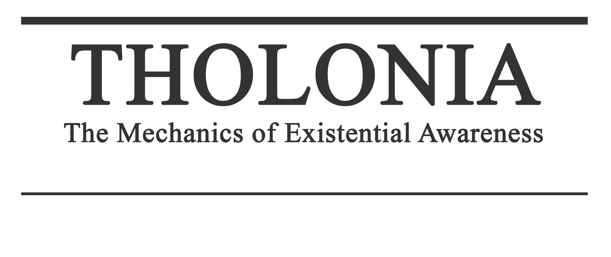

<div style='font-size: 2rem; text-align:center;'>INTRODUCTION</div>
The concept that this reality is an illusion, a matrix, a simulation, or a dream, is not a new one.  From the very earliest creation stories of &ldquo;*God created the heavens and the earth*&rdquo; or up to our modern versions of the &ldquo;*Simulation Hypothesis*&rdquo;, the story of creation has been the same.  It goes something like this:  Once upon a time there was nothing and within that nothingness something appeared.  The details are left to be filled in by the imagination of scientists, mystics, philosophers, and poets, all seeking insight into the meaning and purpose of life, as if how one lives their life depends on whether their purpose here is to find happiness, provide food for Archonic overlords, or no purpose at all, as this is all a dream within a dream.  This book does not attempt to answer any of these questions.  This does not mean that is doesn&rsquo;t answer some of those questions, but just like the questions, the answers can mean many things to many people.

This book is meant to describe the blueprint of creation, similar to a blueprint to a house, which only speaks to how a house is built, not what happens inside the house, how it will be used, or who did the actual building.  For those who believe life is a journey towards enlightenment, this is the blueprint of that path.  For those who believe they are enslaved in a matrix, this is the blueprint of that prison.  For those who believe life is a dream, this is the blueprint of the mind of the dreamer.

This book means to introduce the idea that the mechanics of existence and reality, from atoms to cultures to galaxies, follow the same laws and have the same structure as it applies to their context.

The arguments put forth seemed fairly self-evident at the time writing.  However, when I passed some of these ideas by an actual philosopher he was able to follow the arguments all the way back to the originating premise from which this book claims all structure stems, at which point he firmly rebuked the idea that life has any sort predetermined direction.  His counter argument was simply that the only valid claims are those of subjective beliefs.  So, your mileage may vary.

In this writing I try to avoid social and cultural contexts as much as possible, and where they do exist, I try to keep them to a minimum.  The conclusions put forth here apply to society and culture, as well as science, politics, economics, self-realization, and life itself.

Keep in mind that these conclusions are my own, drawn from connecting the dots laid out in the following pages.  It is not my intention to promote my own conclusions, but rather, use them as an example of how one person has connected these dots.  It is the *dots* that give clues to the objective structure of reality.  How we connect them may be a subjective experience.  You may connect these dots differently, or, you may not see anything worth connecting at all;  just a bunch of random concepts that have no relationship to one another, in which case, this will be a very boring book.  

The reason this book is open-sourced is to allow other&rsquo;s insights to be integrated onto this skeleton in the hope that a clearer picture of the mechanics of existential awareness will continually evolve and emerge.

On a more mundane level, and for those readers who are sticklers about writing style conventions in the U.S., I have deliberately chosen to: 

- Place punctuation (that are not part of the quote) outside of quotes.  The convention of placing punctuation inside the quotes was adopted due to the limitations of fixed width fonts in the pre-digital age.  The British convention has punctuation outside of quotes, but that is because they use single quotes, not double quotes.  To quote William Strunk and E. B. White, &ldquo;[t]ypographical usage dictates the comma be inside the marks, though logically it seems not to belong there&rdquo;.  I agree, and take the side of Canadian poet, typographer and author Robert Bringhurst who bravely stated that is “makes no *typographic* difference” if quotation marks “follow commas and periods or precede them”.
- Follow periods with two spaces, not one.  The two-space rule was also in place due to fixed width fonts, but unlike the punctuation-quotes rules, it has fierce opposition. Even the American Psychological Association has gone form officially recommending one space, to one or two spaces, to two spaces (6th addition), then back to one space (7th edition). I will be using two spaces because it has been shown that using two spaces after a period increases text processing ability [^207].  
- While it is customary to spell out numbers in a sentence, for the most part numbers in a sentence are shown as numerals. This is to allow for numerical values to be easily recognizable, which, like the above point, increases text processing overhead.

<div style='page-break-after: always; break-after: page;'></div>
# 1: CHAOS

###### Everything begins and ends in chaos.

Oxford English Dictionary gives three definitions of the word *chaos*.

These are:

-   The formless matter supposed to have existed before the creation of the universe.

-   The formless and disordered state of matter before the creation of the cosmos.

-   A state of extreme confusion and disorder.

I am not really sure what the difference is between the first two definitions.  Regardless, we&rsquo;ll skip over the obvious contradiction of &ldquo;formless matter&rdquo; existing before creation &hellip; for now.

There is also the Ancient Greek mythological definition of the word χάος, *Khaos*, referring to the void state preceding the creation of the universe or cosmos and personified in the Greek creation myths as the god who was &ldquo;*the first created being, from which came the primeval deities Gaia, Tartarus, Erebus, and Nyx.&rdquo;*

In physics, chaos is defined as &ldquo;The property of a complex system whose behavior is so unpredictable as to appear random, owing to great sensitivity to small changes in conditions.&rdquo;, but as science writer James Gleick points out[^1]:

> No one \[of the chaos scientists he interviewed\] could quite agree on \[a definition of\] the word itself, and so instead gives descriptions from a number of practitioners in the field.  Those scientists that do have a definition are hardly in agreement, as Philip Holmes defined &ldquo;chaotic&rdquo; as, &ldquo;The complicated aperiodic attracting orbits of certain, usually low-dimensional dynamical systems.&rdquo; while Bai-Lin Hao describes chaos as &ldquo;a kind of order without periodicity.&rdquo;

Another term for *chaos* comes from cosmology, and that is the *primal void.*

Modern cosmology&rsquo;s Big Bang theory is quite compatible with this idea that before there was anything, there was nothing but a primal void, a term often used by scientists themselves.  The primal void is a descriptive synonym for at least one state of chaos.

The primal void has also been called the *gap between heaven and earth*, the *abyss*, *absolute-limitless nothing*, *ex nihilo*, and a number of other terms all trying to convey the idea of total and absolute nothingness, a concept that may well be impossible for the human mind to grasp.  This nothingness also includes (or rather, excludes) the concept of time, as there can be no time in a void of nothingness, at least according to Stephen Hawking.[^2]

Everyone from scientists to mystics seems to agree that before there was something, there was nothing, and then, presto, somethingness appeared in the nothingness.

How &ldquo;big&rdquo; was this nothingness? Is there a limit to nothingness? If there is, how is that defined? If there is no limit, then is nothingness infinite? There are a lot of sticky questions around the challenging concept of nothingness, which would explain why it&rsquo;s symbolic representation in the number 0 (zero) is a fairly modern invention.

## Zero

Zero was first recorded in Mesopotamia around 3 B.C., followed by its appearance in Mayan Mesoamerica circa 4 A.D., India in the 5th century, Cambodia in the 7th century, and China and the Islamic countries in the 8th century.  The concept of zero didn&rsquo;t reach Western Europe until the 12th century, and even then, was not fully accepted as a legitimate number concept for hundreds of years.

One of the conceptual challenges of zero is that 0^0^ = 1.  In addition, this single number represents the antithesis of all other numbers.  The other conceptual problem is that zero can also represents the sum of all numbers! See for yourself.  Just start adding all numbers together and don&rsquo;t stop until you get to infinity&hellip; $(1 + (-1)) + (2 + (-2)) + (3 + (-3)) +...  = 0 + 0 + 0 + ...  = 0)$.  I am not being hyperbolic here in any way, as this is an ongoing debate in both mathematics and philosophy, and many will claim that, in fact, 0=&infin; We&rsquo;ll let the philosophers figure that out.  In the meantime, to deal with the finite world of everyday life we&rsquo;ll try and stear clear of infinity and stick to actual things which are quite finite and often have no negative equivalents, like the number of cars in Idaho or the number of tomatoes consumed annually.

How it applies here is that we have the idea of zero or nothing, and the idea of everything not-zero or not-nothing, which is every thing.  The idea of zero being the antithesis of all numbers is equivalent to the equally challenging idea that all that ever did, does or will exist does so b
ecause of the existence of nothingness.  These are heady and paradoxical concepts, like the oxymoronic phrase &ldquo;the existence of nothingness&rdquo;.

Nevertheless, we accept the story, in one form or another, that once upon a time, before time even existed, there was an infinite void of nothingness, and then, badda-boom, badda-bing, something appeared in this nothingness&hellip; and not just any something, but the totality of all somethingness that has, does, or ever will exist.  Just as 0^0^=1, nothing to the power of nothing apparently equals something, and from that something, all things.

How many things other than zero are there? In theory, infinite, but in reality, nothing is actually infinite even if it appears so.  This apparent contradiction plagued philosophy and science for quite a long time[^3] until Einstein came up with a clever answer.

According to Einstein&rsquo;s Field Equations, the universe is not infinite, but rather &ldquo;finite and unbounded&rdquo;, which is a clever way to say &ldquo;infinite, but finite.&rdquo; Think of the 2D surface of a ball.  It is essentially infinite in that you can travel on it forever and never get to the end, but it is bounded, or finite, in that it only occupies a finite space.  The 3D reality that is our Universe is the same, according to Einstein, but like the 3D &ldquo;surface&rdquo; of a 4D space.

This is mentioned only to raise the idea that the primal void in which all of existence exists may well be a big 4D ball, rather than an infinite space.  True or not, I can&rsquo;t say, but at least it&rsquo;s a bit easier to get one&rsquo;s head around.

In either case, the idea of a primal void, or chaos, in mythology as well as cosmology, is one where there is no matter, no energy, no anything.

Some colloquial, older definitions of chaos describe it as matter before there was any energy, but as we now know that matter itself is nothing but energy, that description no longer applies.

#### **Claim 1:** Chaos is a state lacking any order, time or energy.  Total nothingness.  

Chaos also has another definition that means exactly the opposite, similar to the &infin;=0 concept (scientists do that a lot).  Take, for example, the study of chaos in the origins of the universe that was undertaken by Chicago&rsquo;s Northwestern University physicist Adilson Motter, who concluded that 10<sup>-36</sup> seconds after the Big Bang happened there was a state of *total chaos*.  Do you know what was happening at 10<sup>-36</sup> seconds after the Big Bang? Everything, and in a temperature of over 1 trillion degrees.  Motter concluded from his study [^199]:

>  &ldquo;Now we establish once and for all that \[the universe\] is chaotic.&rdquo; 

Motter may have been referring to the other definition of *chaos* that scientists also use, which is essentially *unpredictability*. There can be some confusion here because if something lacks any order, time or energy, it is certainly unpredictable, but there are also things that have lots of order, time and energy and are still unpredictable, like the weather. We are going to stick with our definition above because unpredictability can be the result of any of the above.  But, surely, something is predictable is if has no energy, because it will never change, right?  if something now no energy, it can&lsquo;t even exist, and it&lsquo;s pretty hard to predict what does exist. If is has very little energy, like a rock floating in space, it sill has time and order, so it is not chaotic.


#### **Claim 2:** Chaos is a state of total energy and matter.  Total somethingness.  

We are not claiming here that the Big Bang theory is correct (because it sounds completely insane), but we are asking the question; How can the concept of *chaos* describe the state of the void of total nothingness as well as the state of all matter and energy in the universe?

The definition of chaos that works for both is *&ldquo;the degree that order is present in any state.&rdquo;* Both of those states, of total nothingness and total somethingness, have no order.  In one case because that state is empty of anything, and in the other case because that state is full of everything in a moment that everything was happening at once.  Granted, that total state of chaos (after the Big Bang) only lasted 10<sup>-36</sup> seconds, but that doesn&rsquo;t change the fact that total chaos existed at the birth of the Universe.

Perhaps the most useful definition of chaos comes from the authors of &ldquo;*Introduction to Complex Systems, Sustainability and Innovations*&rdquo;[^193], which simply states:

> Chaos explores the transitions between order and disorder.  An order arises from the ever growing disorder of the Universe - chaos and order together.

#### **Claim 3:** Chaos as a measure of order.  

Oddly, none of these definitions of chaos even begin to touch on its most important significance, and that is that chaos is the unknowable wild-card variable of unpredictability that exists across the entire spectrum of existence.  It is chaos that prevents the laws of creations for churning out identical copies of creation.  Chaos is what makes the future unknowable, and without chaos the difference between the past and the future would be slight.  Chaos is not the same as randomness.  Chaos is *deterministic*, meaning it adheres to rules, and has a pattern, but the effects over time makes it impossible to predict.  Randomness is *non-deterministic*, meaning it has no pattern or predictability.  Reality is born in chaos, not randomness.

<div style='page-break-after: always; break-after: page;'></div>
# 2: ENERGY

###### Nothing exists without energy.  Everything exists because of the laws of energy.

The topic of energy will be reviewed many times further on, but at this stage it&rsquo;s only important to point out two types of energy; *kinetic* energy, which is the energy capable of causing change to a system as a result of movement, such as water passing through a turbine in a dam, and *potential* energy, which is the energy that is not moving but is available, such as the all the water in the dam that is not yet passing through the turbine.

Where the primal energy came from that created our universe is still, and will probably remain, unanswered, at least by modern science.  Science, mythology, and religion each have their own stories and theories, and, not surprisingly, many of these theories are not that conceptually far apart from each other.  One thing we can say about the energy that created this universe (if we are to believe the first law of thermodynamics that states energy cannot be destroyed or created) is that it existed before the Universe was created.

For our purpose, at least at this moment, the details of these theories or stories don&rsquo;t matter.  What does matter is the general idea that once energy was introduced into the chaos of the void, something happened.  That &ldquo;something&rdquo; was some sort of movement, as that is the undebatable nature of energy; it&rsquo;s always moving.  This energy moved in accordance with certain laws.  We call these laws the Laws of Physics and the Laws of Nature.

The question then becomes, did these laws exist before creation? Did they exist in the chaotic primal void of nothingness? Well, the reasonable answer is yes&hellip; and no.  &ldquo;No&rdquo;, they did not exist in the primal void because these laws only apply where time and space exist, neither of which existed prior to the introduction of energy.  &ldquo;Yes&rdquo;, in that these laws must have existed &ldquo;in theory&rdquo; &hellip; e.g.  the relation of a circle&rsquo;s circumference to its radius existed as the constant *pi* (&pi;), or the relationship between a circle and a square is an infinite regression, but as there were no circles or squares it was not measurable&hellip; there was no *instance* of *pi* (&pi;), but there was, for lack of a better word, an archetype of those relationships.

The only place where the potential for anything to exist, including concepts, ideas, or archetypes, is in a place where somethingness coexists with nothingness.  0 (which may also equal &infin;) can exist, and &infin; (which may also equal 0) can exist, but unless they commingle there will never be numbers.  When they do mix numbers appear, and with them, laws.  &ldquo;But!&rdquo; you may be thinking, &ldquo;If archetypes can only exist in a duality, and there was not yet a duality before the Big Bang, how could the archetypes have existed?&rdquo;  That is a very good question, because it would almost appear as though the nothingness from which our duality was formed within must itself have existed within another duality wherein existed these unmanifest archetypes, which implies that the nothingness from which our existence sprang from was not actually nothingness in it truest sense, but rather a sea of uninstantiated possibilities.  This is a bit similar to the quantum idea that there are an infinite number of *wave functions* representing possibilities, but until one of those wave functions *collapses* into form (of a subatomic particle), there is no &ldquo;thing&rdquo;.

When speaking of dualities we need to be clear on what we mean, because there are at least two different types of duality.  The first being the duality of *somethingness* and *nothingness*, 1 and 0, and the second being two states of *somethingness*.  Typically when the term *non-duality* is used it is meant to mean an undivided state, or a state where only one exists.  This is the duality of 1 and 0.  The duality of the two states of *somethingness* refer to such things as positive and negative, yin and yang, or any difference that separates *somethingness*.  This is the duality of our reality, the mundane duality that allows *things* to exist, energy to move, and has states of balance and imbalance.  None of the qualities or properties of the mundane duality exist in the arcane duality of 1 and 0.  Thus, before there was the mundane duality of *things*, there was the arcane duality of *somethingness* and *nothingness*, and before that duality, there was simply *nothingness.*  These three concepts appear in many different models of reality.  In the ancient Kabbalah, they are called the &ldquo;The Unlimited Light&rdquo;, &ldquo;The Unlimited&rdquo;, and &ldquo;Nothing&rdquo;.  In Taoism they are called &ldquo;The Two&rdquo;, &ldquo;The One&rdquo;, and &ldquo;The Tao&rdquo;.  These three concepts are not to be confused with the trinities of of religious and spiritual beliefs, as they are the  products of the mundane duality, and it is from this trinity that everything else comes into being.  

## Plato, et al

Without getting too much into philosophy here, the idea of archetypal forms is a very Platonic idea.  Plato&rsquo;s *Theory of ideas* is the hypothesis that everything that exists is a material instance of an ideal version, or perfect idea, of that thing.

It is also a very Kant-ish idea, and a very Locke-ish, Descartes-ish and Hume-ish idea, for all these great thinkers, plus many more, had the understanding in one form or another that *things* were primarily *ideas* first.  Not all philosophers and scientists-of-old agreed, and in in the good ol&rsquo; days the debate usually boiled down to some form of &ldquo;is there a god?&rdquo;[^143] Today, science tends to shy away from the concept of a god, but asks equally impossible questions, such as &ldquo;it reality a hologram?&rdquo; or &ldquo;is existence a simulation?&rdquo;, etc.  That question is answered in this book, but the answer is as maddening as it is enlightening, and words like &ldquo;yes&rdquo; or &ldquo;no&rdquo; become meaningless.

For pretty much all of man&rsquo;s history there has been an archetypal, theoretical, spiritual or mystical concept of a realm of ideas.  In this realm, forms, in their unmanifest, uninstantiated state, are simply ideas; the perfect cube, for example, is a concept we all can grasp, but whose instances in the material world can only approach.  These archetypal forms follow archetypal laws for if they did not then the relationship between the area of a circle and its radius could just as well be &ldquo;elephant toes on Tuesday afternoon&rdquo;, or &ldquo;cat dog moo&rdquo;, or any other randomness.

This concept that unmanifest forms are the same as ideas, existing in a non-physical, non-manifest, non-instantiated state, provides a very neat explanation as to origin and nature of the laws of physics.  Just as physical forms, like the ball and the cube, have their ideal archetypes, the laws of physics and nature have their archetypal forms as well.

The laws of a form and the form itself are not separate things; they are the same thing in two different forms of expression.  Form itself is simply the result of a function, or by-product, of the law as it is expressed within the duality of our reality.  The form *is* the instantiation of the law.  A circle is defined by its law, 2*πr*, and what we see as a circle is an instance of this law.  Laws are the blueprints of form, and forms are the instances of the blueprint.

How do we know that the laws were not derived from the form, rather than the form being derived from the law? This is addressed in more depth further on, but the evidence is that the same laws exist across many forms.  One specific archetype, like that of a cube or a sphere, can have many instances, but a cube or a square cannot have many archetypes.  This puts the laws of form &ldquo;higher&rdquo; in the unfolding process of its creation, as the law must exist before the formation or instantiation of the law.  This is additionally supported by the idea that the laws themselves are an expression of energy, the ordering force behind all existence, and therefore a prerequisite to form, be it archetypal or material.

#### **Claim 4:** Levels of order begin with energy, which has laws regarding how it interacts with itself, which form archetypes, which have material instances.  

You may be asking &ldquo;OK, but what if Plato and the gang were wrong?&rdquo;, but this is not a relevant question because that question assumes that we have access to, or can even grasp, the &ldquo;ultimate truth&rdquo;, if one even exists.  Our theories of reality are predictive models based on our understanding and abilities that are valid for the reality we are able to observe.

#### **Claim 5:** All theories are only valid for a level of awareness, a level of knowledge, the context of both of them and the limits of their application.  

So, even if Plato is &ldquo;wrong&rdquo;, which at some level, at some point, in some reality, has to be true, if his ideas form the basis of understanding that allows us to create abstract concepts that can lead to new, testable understandings, then it is &ldquo;true&rdquo; until something better, or *more true*, comes along.  For the record, Aristotle rejected Plato&rsquo;s ideas of forms and stated that all things can only come into existence via matter.  From the perspective of this book, both can be true, as one deals with the world of archetypes and ideas and the other strictly with materialism.  In both cases of *form* and the *laws of form,* there is one concept that simply expresses itself relative to the context of its scope of either ideas or matter.

Although today we tend to think of Plato&rsquo;s Theory of Ideas as an abstraction, Plato was quite clear that this realm was as real as the realm we exist in every day, the difference being in the material realm we can never know the true form or idea due to the limitations of material reality.  In Plato&rsquo;s *Allegory of the Cave,* he describes this reality as limited due to the fact that it is no more than a mere shadow and echo of the true reality (of ideas).  This is compatible, albeit a bit more poetic and dreary, with the understanding described above.

#### **Claim 6:** Theories and ideas are an archetype in their own right, but like forms, they have their own archetypes.  

#### **Claim 7:** Every thing that exists is an instance of an archetype.  Archetypes of form and the laws of those archetypes are the same things.  What we call archetypes of form are the results of these laws.  What we see in our reality are the instantiations of those archetypes.  

<div style='page-break-after: always; break-after: page;'></div>
# 3: ORDER

###### On every scale of existence, order arises out of chaos and then returns to chaos.  Each cycle of existence can take millennia or nanoseconds.

Everything that exists must follow the laws of existence, for the penalty of not following those laws is non-existence.  This is why we call it the *Laws of Physics* and not the *Highly Recommended Suggestions of Physics*.

These laws of physics can change between one state or scope of matter and another, so before we look at some of the laws, let&rsquo;s look at the scopes that these laws must function within.

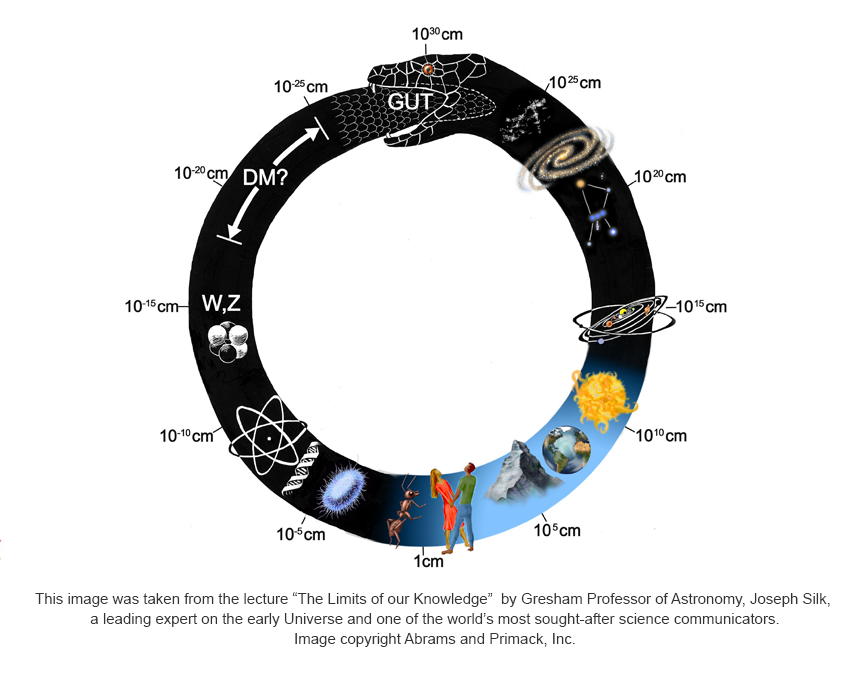


## The Scope of Order

Some laws are *universal*, and some are *local*.  However, what is *universal* to us may well be *local* but in a much larger context that we cannot see beyond.  

An example of a *local* law might be the Standard Model of particle physics that describes the relationship between three of the four fundamental forces and the elementary particles that make up the matter in our universe.  This is a set of laws and constants that apply to particle physics.  You don&rsquo;t see this model replicated in larger systems because the model only makes sense when dealing with the reality of sub-atomic particles.  Likewise, Oort constants only apply to the rotational properties of the Milky Way.

Science calls the scope of our everyday Newtonian reality *Macrorealism*[^4] or *Local Realism*, and the subatomic scope is called *Quantum Mechanics*.  Understanding how different laws operate in different scopes is an area of intense research and has led to such landmark experiments like Bell&rsquo;s inequalities (the math that enables the distinction between two different views of reality, typically the relativistic view vs.  the quantum view), Einstein-Podolsky-Rosen paradox (which speculates that every particle in the universe knows the state of every other particle in the universe at all time, and that no two particles in the universe have the same state), and the Leggett-Garg inequality (which states that in the quantum world something can be in two states at the same time, which is impossible for the macroscopic world), to name a few.

#### **Claim 8:** Local laws and constants are valid only within the context of their scope.  

An example of universal laws or patterns that span many scopes might be the Fibonacci sequence (0, 1, 1, 2, 3, 5, 8, 13, 21, 34, 55, 89, 144, 233, 377&hellip;&sdot;) and its constant ratio of Phi (φ), also called the Golden Ratio (1:1.618).  This number is the ratio that not only pops up in galaxies and seashells but, according to some evolutionary and chemical scientists[^5], is the ratio that keeps everything in existence in order and is the shape of space-time itself.

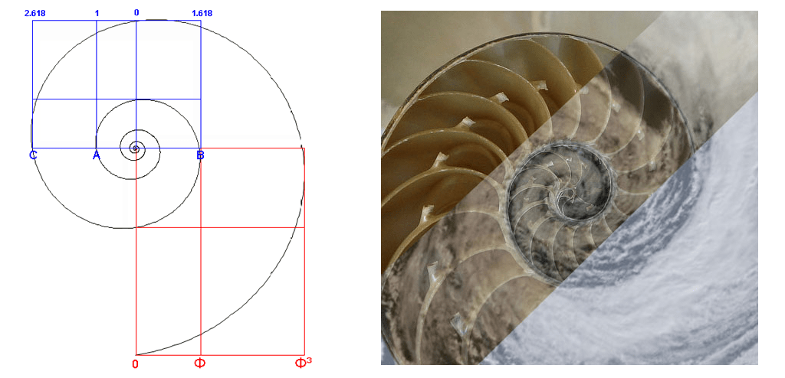

Another universal law might be simple fractal math formulas, like $f(x)= x^{2}-1$, which seem to mimic nature and can be found across all forms of existence[^6], suggesting that self-similarity is a universal property.  *Power laws* explain how a relative change in one measurement can result in a proportional relative change in another measurement (e.g.  logarithmic or exponential), and we see these across all levels of existence as well.  These universal laws can be found in astronomy, physics, biology, meteorology, cosmology, mathematics, economics, and many other areas including society, wealth and work distribution, competition, media exposure, and much more.

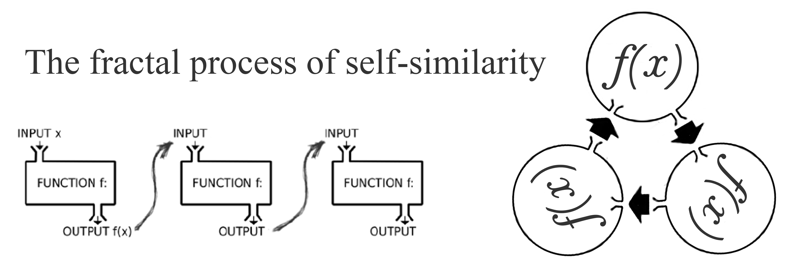

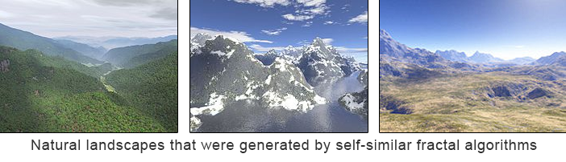

A good visual example of the results of a universal law, perhaps the first universal law, is the distribution of energy across the known universe.  This is known as *cosmic microwave background* radiation.  This is a form of energy that fills the universe and is considered the smoking-gun evidence of the Big Bang[^174].  This chart below shows the temperature of the universe, in Kelvin (from cold -3364 &micro;K to hot 3364 &micro;K).  Typically, this chart is shown more oval in shape, but it does not have to be.  Look familiar?


Even though there are many, many more classes of laws, for this writing we are only going to use these two general scopes of laws, the *local* and the *universal*, because no matter what laws may exist, they will fall into one of these two scopes (or children of these scopes).

Local laws may be local, but they can affect everything that is built upon them.  Everything is made of atoms, and atoms are the size they are because of *Planck&rsquo;s constant*, which is the relationship between the mass and the frequency of the particles that make up an atom.  If that constant were to change the entire universe would be radically different, if it even existed at all.  If Planck&rsquo;s constant changed from 6.2618 x 10<sup>-34</sup> to 6.2618 x 10<sup>-20</sup>, the radius of an atom would go from being too small to see 100 times the distance to the nearest star!

On a more realistic level, consider a bridge made of bricks.  If the laws that bind molecules together change such that they have a lesser negative charge, then the bridge would melt on a warm day.  The *local* Newtonian laws did not change, only the *local* laws changed on the particle level.

It&rsquo;s logical that the laws of particle physics affect everything that exists because everything is made of particles, but that does not make the laws of particle physics *universal* in scope, rather, that which is made of particles is *dependent* on the laws that operate in the *local* particle scope.

#### **Claim 9:** Local laws can alter everything that descends from, or depends on them.  

## The State of Order

It is these laws that create order out of chaos and chaos out of order.

Order exists between the two states of relative chaos, one state tending towards zero-energy chaos and the other towards total-energy chaos, but even within the chaos we can find clues of order.

One theory that sheds light on new thinking about chaos and order is David Bohm&rsquo;s *Implicate Explicate theory*.  In short, Bohm describes this theory by stating:

> In the enfolded \[or implicate\] order, space and time are no longer the dominant factors determining the relationships of dependence or independence of different elements.  Rather, an entirely different sort of basic connection of elements is possible, from which our ordinary notions of space and time, along with those of separately existent material particles, are abstracted as forms derived from the deeper order.  These ordinary notions, in fact, appear in what is called the &ldquo;explicate&rdquo; or &ldquo;unfolded&rdquo; order, which is a special and distinguished form contained within the general totality of all the implicate orders.

##### \~Bohm, &ldquo;Wholeness and the Implicate Order&rdquo;

To demonstrate this concept, Bohm uses an ink droplet analogy.  In this demonstration, he places three drops of ink into a cylinder of glycerin.  He then spins the cylinder which &ldquo;mixes&rdquo; the ink droplets together.  He then reverses the spin and reconstructs the ink drops.  When the ink droplets are in their original form, at the beginning and the end of the spinning, they are *explicitly* ink droplets and have the *order* of ink drops.  When they are mixed up together, they are *implicitly* ink droplets only, and their order would be considered *chaotic* because there is no order of ink drops.  The order of the ink drops has been destroyed, but the information of that order exists as a *virtual* ink-drop within the chaos of their mixed state.[^7]

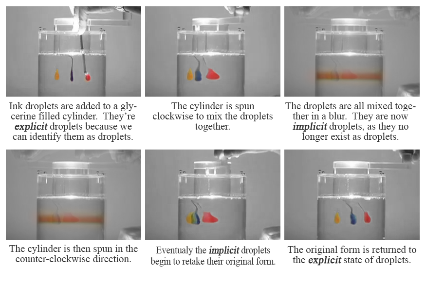

In practical terms, this theory says that when something exists in the physical world it is in an *explicit*, or *unfolded* state.  To exist in this state, it must conform to a set of rules that define the archetype of the form it will take.  When it does not conform to these rules, it still exists, but only in an *implicit* or *enfolded* state, a state we cannot see or interact with (under normal circumstances).  This state has its own rules as well but they are a super-set of the *explicit* rules, making physical reality as we know it just one sub-state that a *thing* can be in.

It is these local and universal laws that cause form to *unfold,* to *explicate* itself, self-organize, form patterns and move in accordance with these laws.  By the same token, these laws will also *enfold* or *implicate* these forms, causing them to return to an unrecognizable state.  The laws of existence are constantly moving chaos to order and order to chaos.

Here is another example that perhaps better displays the idea.  Below are four identical pages of perfectly random dots, but there are a few dots on each page that have been added.  Looking at any one page it would be impossible to detect any pattern.  As we merge the pages the randomness gets denser and denser until a pattern of order emerges.

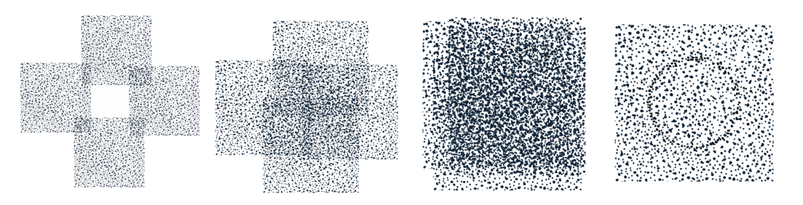

The circle is *implicit* in the random dots of each separate page, and *explicit* when the pages line up together in the proper manner.  In this example, the *local* pattern would be the random pattern on each page, which represent the scope, and the *universal* pattern would be the parts of the circle as it exists on every page.

All of this addresses the relationship between instantiation and context, in that how something comes into existence and how it is expressed is dependent on the context and scope of where it is being expressed.  This concept is not only a technical or scientific one, but also a philosophical one that we can see in Buddhism as the principle of *Pratītyasamutpāda*, which means *dependent arising*, and which states that all phenomena (*dharma*) arise in dependence upon other phenomena (*dharmas*).  More than that, it also implies that the significance of something is defined by its environment.  An obvious example of this is; a tiger in a zoo is not the same as a tiger in the wild, as they have very different existences.  A less obvious example is: imagine a blue ball that has three object properties: it is made of wood, it is blue, it is round.  It has these same properties on a table or in the ocean *as an object*, but it interacts with its environment very differently.  This same blue ball has very different *interactive* properties depending on its environment, and these properties define the ball beyond it simply being an object, such as; it falls to the table, but it floats in the ocean, it does not move on the table, but is does move in the ocean, it will deteriorate faster and in a different manner in one case vs.  the other., etc., etc.

<div style='page-break-after: always; break-after: page;'></div>
# 4: THE LAWS

###### Energy creates movement, movement follows laws, laws create order, and order directs energy.  Each level of existence expresses the Universal laws to the best of its ability according to the local laws it operates under.

## Entropy and Inertia

There are many laws that describe how energy works.  From the 3<sup>rd</sup> century BC starting with the Archimedes Principle to the present laws of quantum mechanics, researchers have compiled a long list of laws.  

One of these universal laws is *energy will always follow the path of least resistance.* This is called *entropy* and explains why water runs downhill to form rivers, electrons always seek a positive charge, which describes electricity, high pressure seeks low pressure, and why stuff breaks.  This is also the essence of Newton&rsquo;s  famous Second Law of Thermodynamics, which can be stated as &ldquo;In an isolated system, entropy never decreases&rdquo;, which is another way to say that all systems tend to move towards their most stable or probable states because entropy will never decrease, it will only increase, which means all systems tend towards find their highest entropy.  One actual formula for defining the entropy of the universe is $\Delta S_{universe\ =\ } \Delta S_{scope} +\Delta S_{context}$, where $\Delta S$ represents the change in entropy, *scope* represents a system of some sort, and *context* represents it surroundings. This is mentioned here because we will be coming back to the concept of context and scope many times.

A simple analogy would be to compare entropy to water in lakes, rivers, and the sea.  Only the water that is above the sea level can be used to do work (e.g.  move a water wheel).  Entropy represents the water that is at, or below, sea level and therefore unusable for work.

This is also how batteries work.  A charged battery has low entropy (high usable energy), and a dead battery has high entropy (no usable energy).  A dead battery still has all the energy it had before, but it is no longer usable because the energy, in the form of electrons, has moved from the negative side of the battery to the positive side until it achieved balance and there are no more electrons left on the negative side of the battery that were compelled by the laws of balance (or entropy?) to move&hellip;  but they are still in the battery, and still acting like electrons.  

In the good ol&rsquo; days (1930s to 1960s) classical physics defined entropy as *disorder*, but this is not really accurate.  More accurately, entropy &ldquo;*provides insights into the notions of randomness, typicality and disorder*&rdquo; [^184].  For an excellent overview of the misconceptions of entropy, see &ldquo;*Entropy as Disorder: History of a Misconception*&rdquo;  [^185] A better way to think about entropy is that it is a measure of energy dispersion; the more entropy, the more equally energy is dispersed.  Another way to state this is to say that entropy is a measure of the lack of energy available for work.  This describes our dead batter, which still has all the elections and their energy , but they are useless (from a battery&rsquo;s  work perspective).  Because this dispersion is the result of energy always seeking balance, can we say that entropy is a measure of the state of balance?  Sure, why not? As you&rsquo;ll see, the definition of entropy has been changed for for every discipline that uses it.  

In the water example, if we have two identical bodies of water, one 100 feet above the other, we say that the upper body of water has lower entropy than the lower body of water, and the lower body of water has higher entropy than the upper body of water, but there is no difference between these two bodies of water when compared independently.  The difference only appears when compared to each other, because one is higher than the other.  We can say that both bodies are in a (slightly) higher state of chaos when they are not connected because they have more entropy because there is no movement of energy.  Once they are connected, and the water begins to flow, there is movement of energy, and order follows.

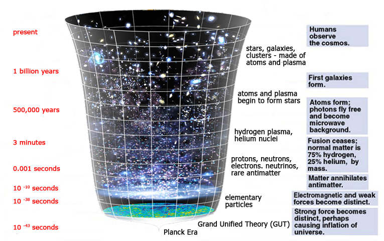

This is what is theoretically happening to the universe right now because according to the Big Bang Theory, there was zero entropy (total energy) at the moment of the Big Bang.  Since then all that energy has been following the path of least resistance, moving into surrounding nothingness (i.e., an unmanifest conceptual space of possibility), balancing itself, like water into the ocean or electrons in a battery, raising the entropy of the universe and decreasing the amount of usable energy.  This is why, according to the theory, the universe will end up in a state of chaos and disorder, like a dead battery or a stagnant lake, i.e.  the Universe started in chaos and will end in chaos, and in-between those two points, there is the movement of energy, which creates order.

Because we will be talking about balance throughout this entire book, let&rsquo;s make it clear what we mean when we use the word.  Depending on context, the word *balance* can refer to one of two different meanings:

- **Balance:** (noun) A stable state of being.

- **Balance:** (verb) The application of force required to achieve a stable state of being.  

The word itself comes from the Latin *bi+lanx*, meaning &ldquo;two sauce pans,&rdquo; as in the classic hanging scales.  The scales show when something is *balanced* (noun) after the two sides were *balanced* (verb).  It will be up to the reader to determine which definition is more contextually appropriate.

#### **Claim 10:** Order and pattern requires energy.  

One interesting takeaway from this understanding is that inter-connectivity allows for movement of energy and this movement creates order.  Therefore the idea that everything is connected is not simply a philosophical abstract concept, but a necessity for order.

In other areas of study, the definition of entropy carries the same idea of disorder or chaos but is used in a narrower context, so it sounds confusing unless you are familiar with that context.  For example:

-   **In probability theory**, the entropy of a random variable is the measure of uncertainty.
-   **In information theory**, the *compression entropy* of a compressed file, like a zipped file or a JPEG image, measures the amount of information loss.
-   **In sociology**, entropy is the natural decay of a society&rsquo;s structure (such as law, organization, convention, ethics, etc.).

In fact, the definition of entropy is so varied that it is not uncommon for experts in the field to ask 

> &ldquo;As a consequence of this diversity of uses and concepts [of entropy], we may ask whether the use of the term entropy has any meaning.  Is there really something linking this diversity, or is the use of the same term with so many meanings just misleading?&rdquo; [^200]

##### ~ Annick Lesne, author and researcher at the *Institut des Hautes Etudes Scientifiques*

This is partly due to that fact there can be many conditions to consider, depending on the context (energy, volume, quantity, temperature, pressure, potential, etc.) Perhaps the best definition of entropy, as some scientists have claimed, is simply &ldquo;entropy is whenever the formula says it is&rdquo;.  OK, a bit post-modern, perhaps, but hard to argue with.  For our purposes, we will use the classical, albeit slightly inaccurate definition of entropy as a *measure of disorder*, where *disorder* is defined as the *lack of pattern in form or movement of energy*. This definition would then include the Big Bang (lots of energy, little little), as we all dead batteries (lots of structure, but little movement of energy).

We have a contradiction now.  If balance reduces available energy, and lack of energy increases disorder, then that suggests that balance equals disorder!  This makes no sense, as balance is essentially a definition of order.  The confusing part of this is how we define *disorder*.  Disorder is a vague and subjective concept, because order can take many forms in many contexts, and &ldquo;disorder&rdquo; often means &ldquo;no understood order&rdquo;.  Here we are defining disorder as simply the lack of available energy within a system.  And yes, this would imply that balance = disorder, or rather, one particular state of disorder.  In this case we are defining *balance* as a state where energy no longer needs to move and *disorder* as a state where no energy is available.

#### **Claim 11:** Balance is a state of disorder.  

Another law to look at is Newton&rsquo;s First Law, the Law of Inertia, which states *an object will remain at rest or move at a constant speed in a straight line unless it is acted upon by an unbalanced force*.  This is why things don&rsquo;t fly around randomly on their own for no reason.

These are just two of the many laws that determine how our reality works, at least within the scope of the reality we tend to deal with.  On the quantum and galactic levels, or super high or low energy states, things may operate a bit differently.

These laws always ensure that everything will operate at its most efficient level.  What does &ldquo;operate&rdquo; mean in this context? It means the optimal movement of energy.  As energy only moves when there is a difference between two states, the movement of energy is meant to do only one thing, and that is to neutralize that difference by creating a balance between two conditions that are not the same, whether it&rsquo;s the conditions of *somethingness* and *nothingness* or just a few degrees of temperature.  Once balance is achieved the movement stops.  A balanced battery is a battery at peace with itself&hellip; and it is also a dead battery.

The optimum condition for the movement of energy between two states is one that operates within the limitations and abilities of both of those conditions.

A beautiful example of entropy and inertia that works today as much as it did thousands of years ago can be easily demonstrated with something called the *harmonograph*.  This is a fascinating and entertaining device that creates an oscillation from takes an initial push (low entropy) and then draws a two-dimensional oscillating design on a blank paper as that initial energy slowly diminishes (inertia), until it stops (high entropy).[^8]

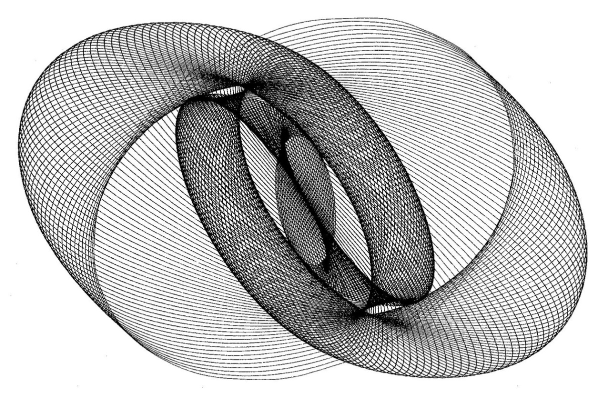

#### **Claim 12:** Everything is in a state of seeking and/or maintaining balance.  

## Pattern

We recognize that patterns exist in nature, life, physics, math, etc., and it can be useful to think of patterns like rivers that have been etched into the terrain of reality from the first moments of creation and represent a path of least resistance for the movements of energy, be it electrical, physical, conceptual, emotional or otherwise.  Reality, no matter the scope or how one perceives it, is build upon layers and layers of patterns.  A recurring theme in this book is about recognizing patterns that repeat in various themes, contexts, and scopes.  Some of these meta-patterns are clear, such as the Fibonacci sequence and exponential curves, while others are more hidden and even challenges our ideas of what defines a pattern.  A nice book on this subject is &ldquo;*Patterns in nature: Why the natural world looks the way it does*&rdquo; [^190].  

When some of what follows was presented to an accomplished physicist it was immediately disregarded as &ldquo;blooey&rdquo; on the basis that just because two phenomena share the same pattern doesn&rsquo;t mean they have anything to do with each other.  The position of this book is that any two phenomena that share the same pattern are, at least, two instances of one pattern.  A Ford Fairlane in Chicago and a Ford Fairlane in Argentina have no direct connection to one another, but some of what is learned about one will apply to the other.  The tricky part is knowing what information is rooted in the what patterns versus the instance and its context.  For example, the Ford Fairlane in Chicago was a &ldquo;muscle car&rdquo; and a source of pride among its fans while that same car in Argentina was used by the secret police of the Dictatorship during the &ldquo;Dirty War&rdquo; and was a source of fear and intimidation, but an Argentine mechanic could work on that same car in Chicago, even it seeing it filled him with dread.  Sixty years later, few Argentines would choose to own a Ford Fairlane, yet quite a few Chicagoans would be thrilled to own one.  

While the subjects of this comparison can be defined by patterns of culture, economics, mechanics, and more, the erroneous associations comes from assigning properties of one pattern to another.  This example is a modern day instance of totem superstition.  The sciences are not immune to such confusion.  In fact, modern math was stifled for about a thousand years thanks to the Greek&rsquo;s  superstitious ideas about, and prohibition of, irrational numbers, which were forbidden to be written.  When one of Pythagoras&rsquo; students, Hippasus, discovered irrational numbers he was, depending on your source of history, drowned by the gods for such heresy, or murdered because he revealed how to construct a dodecahedron inside a sphere.  In either case, irrationality and superstition prevailed.  It wasn&rsquo;t until the early 9^th^century CE, thanks to Caliph Al-Ma’mun of the Abbasid Caliphate and his *House of Wisdom* in Baghdad (which the Mongols destroyed in the 13^th^ century), that mathematics was liberated from its fear of irrational numbers.  The same is true for the number 0, which was banned in Florence in 1299.  Later in this book you will see modern examples of similar thinking in the sciences.

> [Superstition is a form of] mutilated knowledge that, from fragments casually collected or from dark, partial, and undeveloped intuitions creates a coherent order of images according to a logic dictated by the passions that dominate from time to time.

##### ~ Remo Bodei, professor, history of philosophy, UCLA.[^191]

## Oscillation

One law, or pattern, that can be seen in every part of the universe, is that everything oscillates.

Oscillation is how energy sustains movement between two states, which supports the definition that &ldquo;chaos is a kind of order without periodicity&rdquo; for without oscillation or periodicity, there is less order and more chaos.

Everything that is sustainable (i.e.  currently exists), from the atoms to the galaxies, oscillates in some fashion and has some kind of frequency(s).

> &ldquo;All things have a frequency and a vibration.&rdquo;

##### ~Nikola Tesla

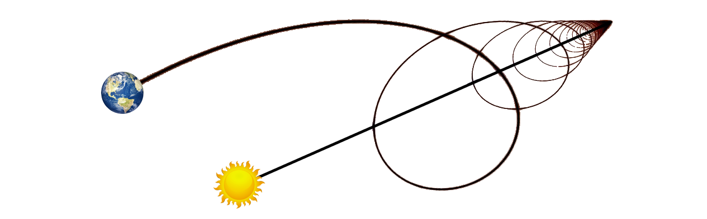

We typically think of light waves and sound waves as the classical example of oscillations, but the heavenly bodies and stars in the sky are also oscillating particles on a cosmic scale.  If we look at the orbits of planets, stars and galaxies they are not simply spinning around in a rather 2D plane of orbits, but that they are spinning around while moving in a direction.

People have been fascinated with this obvious commonality across all of creation for some time.  Kepler himself was quite interested in the relationship between planetary frequencies and musical frequencies, but the study of planetary and musical relationships goes back to at least the 9th century with Eriugena, an Irish monk, theologian and Neoplatonist philosopher, most famous for his work &ldquo;The Division of Nature,&rdquo; which claims that nature&rsquo;s first primary division was the division between that which **is** (*being* or *somethingness*) and that which is **not** (*nonbeing* or *nothingness*).  His work was condemned as &ldquo;swarming with worms of heretical perversity&rdquo;&hellip; the 9<sup>th</sup>-century Archdiocese was a tough crowd.

#### **Claim 13:** Everything exists in a state of duality.  

#### **Claim 14:** Everything sustainable oscillates.  

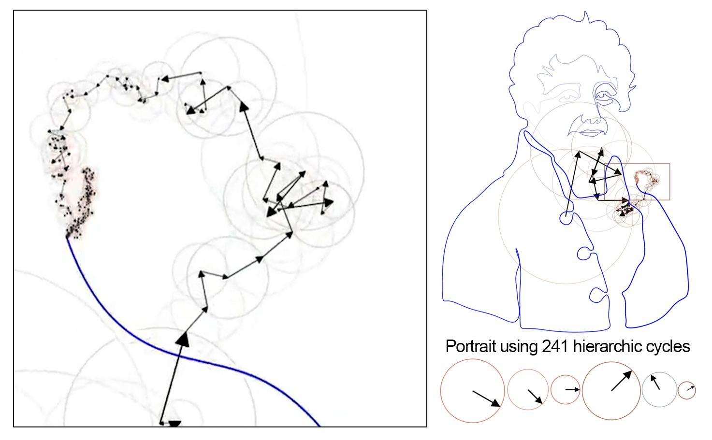

*(Image from Grant Sanderson&rsquo;s video &ldquo;But what is a Fourier series? From heat flow to circle drawings&rdquo;at https://www.3blue1brown.com/)*

By the same token, everything, can see and hear, can be described as a collection of oscillations.  This was proven by the famous French mathematician Joseph Fourier (1768–1830) when he was researching how heat moves.  From his work came the famous and brilliant *Fourier Series* and *Fourier Transformation*.  The Fourier Series describes the hierarchical order of frequencies, or rotations, that would be needed to produce a specific output.  For example, the image above shows a portrait of Joseph Fourier being drawn by a pen at the end of a long series of oscillating circles, shown by the rotating arrows, each subsequent oscillation originating from the tip of the previous circle&rsquo;s arrow. The Fourier Transform is the math that can reverse engineer some collection of oscillations, such as music or a painting, and discover the recipe of its various frequencies and their quantities. By extension, this can apply to 3 (or more) dimensions as well.  

Ratios like *e*, &phi; and &pi; are at the foundation of many patterns that define reality, and while any two instances of these ratios may not have a direct connection, they do share the fact that they are a product of that ratio.  We don&rsquo;t say a basketball is the same as a planet, but we do say they are both round, and anything we can say about roundness applies to both.  This may sound childishly simple, but when this is applied to the 2nd Law of Thermodynamics and, for example Ohm&rsquo;s  Law (which will be explained shortly), some trained physicists will claim they have nothing to do with each other.  

They are partially correct in the same way elephants have nothing to do with turtles, even though both evolved from the same ancestor.  The 2nd Law of Thermodynamics is a pattern that works on linear systems, and Ohm&rsquo;s  law is one instance of that pattern in the context of conductive materials.  We can apply that pattern to different contexts to see how such a pattern might instantiate under different conditions.  It may be that there are few or even no instances of that pattern for a context, or it may be that we have yet to see how that pattern instantiates, but this does not invalidate the comparison.  In the case of Ohm&rsquo;s  Law, its math is perfectly applicable well outside of conductive systems that are still linear, such as Gas Laws and fluid flow, if we replace &ldquo;voltage&rdquo; for &ldquo;pressure&rdquo; and &ldquo;current&rdquo; for &ldquo;rate of flow&rdquo;.  

To not consider that patterns have inherent qualities that exist beyond our perceptions or knowledge, or that any pattern should not be at least be investigated before claiming it has no validity in any particular context, is a form of scientific dogma or modern superstition, as such thinking is based on a logic dictated by the dominant narrative of the time.

We refer to these similarities of patterns across heterogeneous contexts by the *pattern-position* (or *PP* for brevity) of various elements.  For example, *voltage* and *pressure* have the same *pattern-position* in Ohm&rsquo;s  law.  Below, we also show how *society*, *behavior* and *electrical current* also share the *same pattern* position.

## Ohm&rsquo;s Law

Another law which appears to be local yet applies to many contexts is Ohm&rsquo;s Law, which states *electric current is proportional to voltage and inversely proportional to resistance*.  Why are we using Ohm&rsquo;s  law out of all the laws that exist? Simply because it is an elegant expression of Newton&rsquo;s  2^nd^ Law which encompasses concepts of chaos and entropy and neatly shows some fundamental proprieties of relationships in common, more easily understood, linear systems.

This law can be displayed as follows:

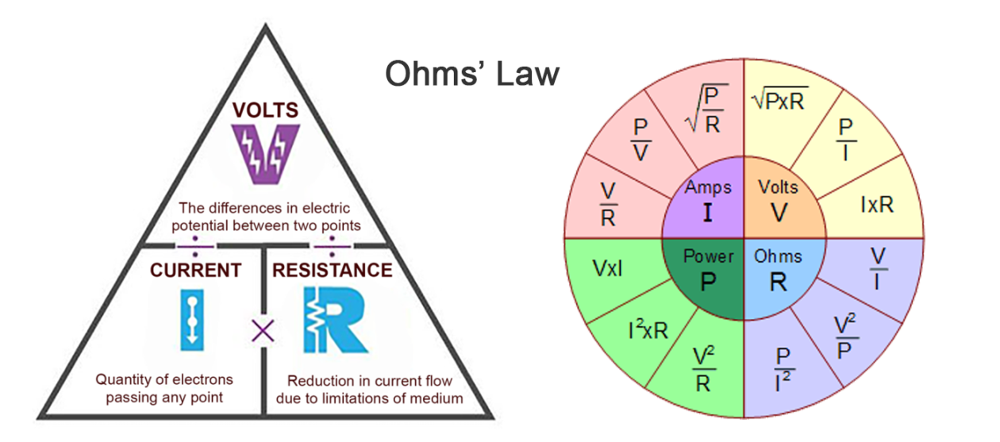

If you are not familiar with Ohm&rsquo;s Law, you can understand it using the water example.  

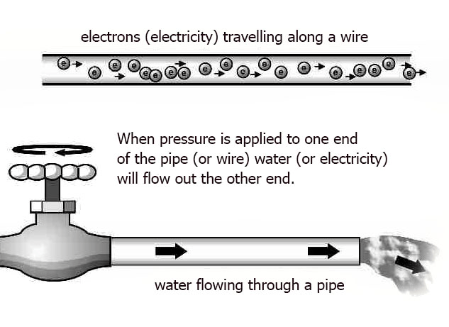

The following concepts are the same in both examples:

- **Power** remains the same, as it is an abstract and derived concept that represents the rate, over time, at which energy (via electrons, water, etc.) is transferred.
- **Current** is the amount of water (e.g.  number of molecules), that is flowing through the pipe.
- **Voltage** would be analogous to water pressure, which determines how far the water shoots out of the pipe.
- **Resistance** is represented by the size of the pipe the water is flowing through.

Ohm&rsquo;s law is actually Newton&rsquo;s 2nd Law of Motion, t*he force of an object is equal to its mass times acceleration*, as it applies to electricity[^9], defining the *object* as *electricity*, the *force* as *current*, the *mass* as *resistance*, and the *acceleration* as *voltage*.

##### A word on patterns and Ohm&rsquo;s  Law…

Ohm&rsquo;s  Law is not really a *universal law* like its famous parent, Newton&rsquo;s  2^nd^ Law of Thermodynamics, which is more universal.  It&rsquo;s  more of a *local law* as it only applies to linear systems and conductive materials.  Ohm&rsquo;s  Law follows the simple pattern of $ab=c, bc=d$, which we can understand as *2&times;3=6, 3&times;6=18*, or *resistance&times;amps=volts, amps&times;volts=power.* Any of the reasoning being applied here regarding Ohm&rsquo;s  Law could just as easily be applied to other natural linear systems.  Ohm&rsquo;s  law is just a simple law that everyone can understand and relate to.  Other simple patterns could also be $\boldsymbol{\frac{1}{1} ,\frac{1}{2} ,\frac{1}{3} ,\frac{1}{4} ,\frac{1}{5} ,\frac{1}{6} ,\frac{1}{7} ,\frac{1}{8} ...}$, which is the *Harmonic Series* and describes music, or *1+1=**2**, 1+3=**3**, 2+3=**5**, 3+5=**8**, 5+8=**13**, 8+13=**21**..*, which is the famous *Fibonacci Sequence* (and is almost identical to Ohm&rsquo;s  Law except is uses addition instead of multiplication), or how the primes numbers can create $\pi$, $\boldsymbol{\frac{1}{3} +\frac{1}{5} \ -\frac{1}{7} +\frac{1}{9} -\frac{1}{11} +...=\frac{\pi }{4}}$

##### A word on electricity…

We are using Ohm&rsquo;s law, the laws of electricity, as an example for another reason as well.  We are all familiar with lightening.  Watching the bolts of light shoot instantly across the sky and into (or from) the earth is awe-inspiring and exciting.  We also know that lightning is dangerous.  Contrary to the statement &ldquo;Lightning never strikes the same place twice,&rdquo; lighting often strikes the same place many times, and for good reason.  Ben Franklin suspected why, which gave birth to the lightning rod, saving millions of building from burning to the ground.  

We know that energy always travels the path of least resistance, so we would say that the path of lightning exists between a starting point in the sky and the ending point at a lightning rod (or wherever), and we might even say that this path was predetermined before the electrons traveled it, but that would only be half the truth.  As the opposing charges of the earth and  the sky (or between two clouds) increases, two fields grow - the positive field of the earth is pulled towards the negative field of the sky, and visa versa.  When they touch, a connection is made and all the excess positive charge rushes towards the sky, and the excess negative charge rushes towards the earth.  Lightning happens in two directions at the same time.  By the time we see the lightning, the fields have already reached their peak.  The engine of this interaction are the fields themselves.  In this case is it lightning that is the byproduct of the fields.  What we see when we see lightning are all the paths between those two fields that have made some degree of connection.  It is the interaction between these two fields that is the cause, and the lightning is the effect.

This then raises the question: if that is the case for lightning, why do plant roots, rivers, brain cells, and so many other examples, follow such a similar path?  It is reasonable to apply the same logic and suggest that the path of roots and rivers are the byproduct, or effect, of two opposing fields within close enough proximity as to allow them to make connections between each another, and in doing to, allowing the opposite energies to balance each other out.  It seems that the main difference between lightning and rivers are the energies at play.  In plants or rivers (apparently) this energy does not instantiate as electricity but as something else and moves much slower, in the range of years or centuries, as opposed to milliseconds.


In contrast to the above patterns, we have those created by modern man, which are more like crystalline structures.  Perhaps this represents the stage that conscious intelligence is at, the *crystallizing* stage, which for the Universe was four billion years ago.

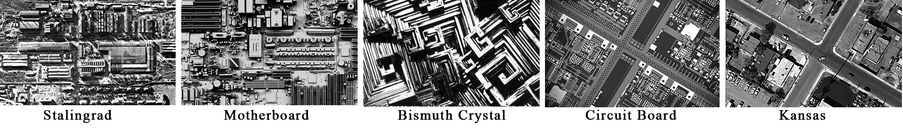

Keep this mind when we begin looking at how we can apply the laws of energy to other realms.  

##### Back to Ohm&rsquo;s Law…

In the world of electricity we can say *voltage = resistance &times; current*.  Likewise, in the world of matter, we can refer to the 2nd law of Thermodynamics that states  *force = mass &times; acceleration.* All twelve math formulas of Ohm&rsquo;s Laws can apply to matter.

Ohm&rsquo;s law is just one of a number of contexts where Newton&rsquo;s 2<sup>nd</sup> law applies, as shown below.

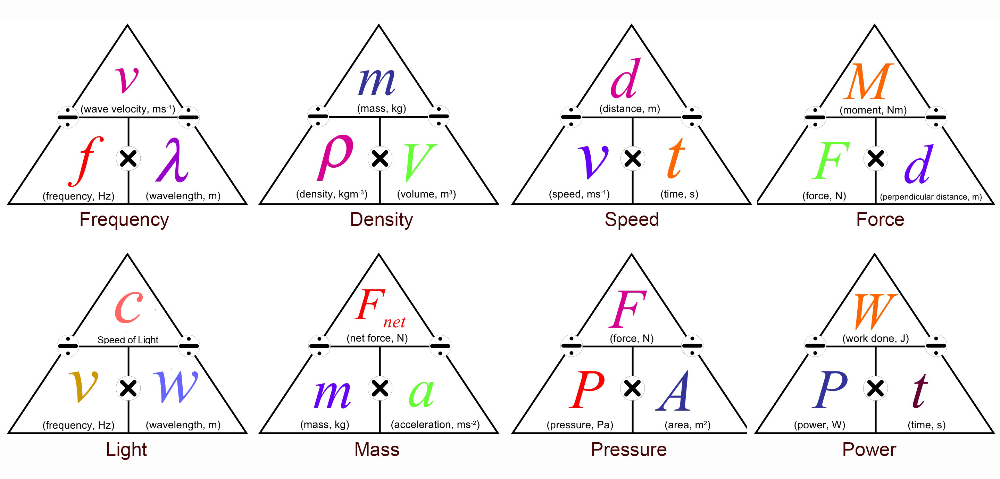

## Light

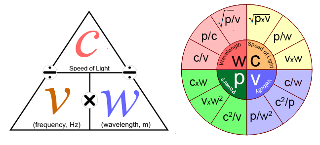

Let&rsquo;s  look at an example of light.  If apply Ohm&rsquo;s  Law to light, we can say the velocity (i.e.  frequency) of light is equal to the speed of light divided by the wavelength, or $v =\frac{c}{w}$.  We know that the speed of light is $3 \times 10^8$ meters/sec, and we know that green light has a wavelength of 555 manometers, or 5.55x10^-7^ meters, so we can just do the simple math of $\displaystyle (3.0\times 10^{8}) /(5.55\times 10^{-7}) = (5.4054054\times 10^{14})$ to discover that green light has a frequency of 5.405 terahertz.  All we have to do to convert Ohm&rsquo;s  Law to some other (linear) domain is adjust our measurement for the context.  In this case, what was Ohms, which measures resistance, is now Hertz, which measure cycles-in-time.

All the formulas work out when:

- **Velocity** has the *PP* of **resistance**

- **Speed-of-light** has the *PP* of **volts**

- **Wavelength** has the *PP* of **current**.  
- **Power** (of light), by process of elimination, must have the *PP* of **power** (of electricity).  

What does **power** in the context of light even mean? That is hard to say because it is not clear how the concept of power applies to light.  In electrical terms, *power* of defined as the rate of transfer of energy, and the less resistance and greater the current, the greater the power.  With light, that would be equivalent to saying the less velocity and the greater the wavelength, the greater the *power*.  

For example, using these formulas we can calculate that high energy gamma rays with a frequency of 3.33 nanometers ($3.33 \times 10^-9$) has a *power* rating of 1, while an ultra-low frequency wave with a wavelength of 1000 kilometers has a *power* rating of 300,000,000,000,000 ($3\times10^{14}$)!  For perspective, the Earth&rsquo;s  natural resonant frequency, the *Schumann resonance*, is 7.83 Hz, which is a wavelength of 33,830,000 meters ($3.83\times10^7$), and a *power* value of $1.15\times10^{16}$, and green light as a *power* rating of 166.5.  

This initially seems odd because we know that the less the velocity and greater the wavelength, the less energy light has, but our power calculations say the exact opposite, as if the less energy the light has the more *power* it has.  This is because the energy that that we say light has is referring to the energy contained in the photon itself, not the *transference* of that energy, and as we saw earlier, power is defined as &ldquo;the rate, over time, at which energy is **transferred**&rdquo;.  When we examine electromagnetic energy we can easily see that the lower frequencies are much better and transferring energy, even though they have less energy to transfer.  

For example, the entire universe is filled with a very low frequency energy of microwaves which maintains an average temperature of 2.725 Kelvin above absolute zero  (-273.15 ºC or -459 ºF).  This is a pretty good example of energy transfer.  Higher frequency energy tends to be less ubiquitous and more focused.


Higher energy waves, such as infrared, visible light, and ultraviolet are fundamental to life exactly because of the manner in which they can transfer energy that is most efficient for the more complex instances of creation.  Beyond that, the higher energy X-rays and gamma rays do not transfer energy efficiently if we define *efficient* as that which can interact with other matter.  Perhaps *efficient* can be defined as that which is most effective for *life*, if we redefine the meaning of *life* to mean something like &ldquo;an instance of awareness&rdquo;, or something like that.  I know hard-core scientists will balk at the idea that life should be the standard by which we measure anything, but this would be the case if the Universe was itself intelligent, which we address later.  Beyond the philosophical issues, high energy waves, like gamma rays, can pass through all sorts of material without interacting with that material at all, and given its high energy, if it does happen to interact with anything alive, it will cause serious damage.  In general, higher frequency (shorter wavelength/higher energy = lower *power* rating) waves travel through objects more easily than lower frequency (longer wavelength/lower energy = higher *power* rating) waves, which interact (i.e.  transfer energy) with matter more easily that higher-frequency waves.

All of this is pure speculation and spit-balling, as there is nothing to suggest what that *power* value actually represents, but it does exist, which is the relevant detail here.

## E=mc^2^

There&rsquo;s one more comparison to look at as well *(note: let me say that when the following was presented a hard-nosed physicist, he adamantly refuted it as pure malarkey.  However, this does not take away from the greater idea, and observation, that patterns of order can be found in their various expressions across different contexts).*   Did you notice how in formula wheel above how the *Power = Resistance x Current<sup>2</sup>* (*P=RI<sup>2</sup>)* looks exactly like another popular formula: *E=mc<sup>2</sup>*? Is this a *pattern position* or just a coincidence?  Maybe there is a relationship such that…

-   **Power** (*P*) is analogous to **energy** (*E*)
-   **Resistance** (*R*) analogous to **mass** (*m*)
-   **Current** (*I*) analogous to the **speed of light** squared (*c*^2^)

From this, we have to calculate the missing value that is shared with **volts**, which we will call **zvolts**.  More on this in a moment…

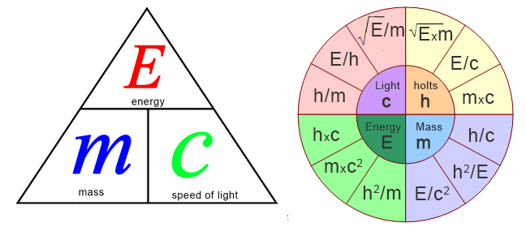

In fact, not only is *E=mc<sup>2</sup>* the exact same formula as *P=RI<sup>2</sup>*, but all twelve formulas work for *E=mc<sup>2</sup>*&hellip; with a minor adjustment: in the Newtonian world of electricity and matter, all the variables can change in value, while in the world of relativity, *c* must always remain constant.


It looks like *c,* which is the Relativism&rsquo;s version of *current*, or amperage, is the *maximum current supported* rating for this universe, not unlike a 40 Amp fuse we use to ensure we do not exceed the maximum current supported for our electrical devices.  (Maybe that&rsquo;s why we can&rsquo;t break the speed of light because if we did, we&rsquo;d &ldquo;blow a cosmic fuse&rdquo; and shut down reality! That&rsquo;s sort of a joke&hellip; but not really.)

We can apply these formulas to energy, mass, and speed and get correct results; with one exception&hellip; there is no equivalence to volts when using *E=mc<sup>2</sup>*, which seems odd.

In the water example, voltage is equivalent to water pressure.  In the world of electricity, voltage is described as *electric pressure* that results from the difference that exists between two states, one being the highest potential energy (like the storm cloud or mountain top), and the other being the lowest potential energy (like the lightening rod or valleys).  Can we then say that these missing cosmic volts (zvolts) represent the pressure between two opposing states, just like regular volts? What these states might be is up for grabs.  Perhaps low entropy and high entropy, or order and chaos? Who knows? Whatever zvolts are, given that they are values that measure the difference between two points that are quite fundamental to our reality, they might be very significant in understanding reality in terms of dualities.

We can calculate for these missing zvolts by applying the simple formula:

*Voltage (V) = Current (I) &times; Resistance (R)*

which equates to *zvolts (z) = Speed of Light (c^2^) &times; Mass (m)*.  

This then becomes (using the ISU standard[^10] units of measure) *zvolts = 30,000,000 m/s &times; 1 g*, (or *8.98&times;10^16^ m^2^/s^2^*) which makes zvolts = 300,000,000.  

So zvolts is the same value as *c*? Yes, but only when the *mass=1*.  If we use a different mass, like 2, zvolts becomes *c&times;2*, which is then:  *zvolts = 300,000,000 m/s &times; 2 g*, which makes zvolts = 600,000,000, and if mass=0, then zvolts = 0.  

But what *is* this number? It can&rsquo;t be speed, because nothing can exceed the speed of light.  It can&rsquo;t be weight, because we are already using weight in the equation.  Even more odd is that the number is always proportional to mass because *c* is always the same, so whatever *zvolts* are, they are essentially the same value as the weight of the mass, but 300,000,000 times larger, but the *zvolt* is the result of speed, time and mass, so it is like a unit of *mass per distance per second*, kg/km/sec.  This also happens to be the parameters that defines the unit of measure called a Newton, which is a measure of *force*.  One Newton is defined as *the force needed to accelerate one kilogram of mass at the rate of one meter per second squared in the direction of the applied force.*  Newtons only apply to mass, so this is how we measure things like Angular momentum, the force of the planets in orbit, and also how we measure the spin of elementary particles.  

However, applying *E=mc^2^* to mass-less photons where *m*=0 we get a value of *E*=0.  Does this mean that things that have no mass have no energy?  Actually, yes&hellip; but we know this is not true, as in the case of light itself, photons, which have a lot of energy but no mass.  This is because *E=mc^2^* is only true for particles at rest, and photons, or any form of energy that has no mass, can never be at rest&hellip; they are *restless*, and while the mass-less particle itself has no inherent energy, it does have the energy of its movement (speed, frequency, amplitude, etc.).  Were it to stop moving, it would exist only as a concept.  So, in the case of mass-less energy, zvolts would always equal zero.  In the case of mass, however, is has a value that seems to be related to *force*.

There&rsquo;s one more detail about voltage that might be relevant here, and that is: the greater the voltage, the greater the electric field.  Can we then say &ldquo;the greater the zvolts the greater the energy field&rdquo;?  If so, and given that *zvolts* only exist where there is mass, can we say *zvolts* is some measure of a *reality field*, given that *zvolts* measure (maybe) the pressure or force between two opposing potentials between which mass can exist?

We can now rewrite our original Ohm&rsquo;s law of *electric current is proportional to voltage and inversely proportional to resistance* to be: *zvolts are proportional to the speed of light (c) inversely proportional to mass*.  We know that as mass approaches the speed of light its mass increases, which means *zvolts* increase, and the formula $\boldsymbol{m=\frac{z^{2}}{E}}$  would then describe how mass can increase while *c* remains constant.  More on *zvolts* a bit later…

Of course, I am swimming in waters far deeper than my ability, but it&rsquo;s all quite fertile ground for speculation, at least to someone like myself who has yet to learn the thousands of reasons why such speculation is pointless.

Getting back to these twelve formulas&hellip; we think about voltage, resistance, and current (or energy and mass) as separate things, similar to how we think about time and space as two different things.  However, space and time are two properties of one larger thing called *space-time*.  Likewise, voltage, current, and resistance are three properties of one instance of energy as electricity.  Frequency, wavelength, and velocity are three properties of another instance, such as radiation.  All areas where this law applies are themselves different properties of some expression of energy.

Here we are using Ohm&rsquo;s Law to show how one law can be expressed across many scopes, but this same reasoning applies to all natural laws in physics, or elsewhere.

## Alchemy

If we are claiming that these laws can be seen throughout our journey of discovery over the past millennia then we should be able to see them in the early forms of reasoning that evolved into such things as modern science.

Alchemy is the birthplace of modern science.  Despite the charlatans of science of olden days, just like today, many alchemists profited by promoting &ldquo;elixirs of life&rdquo; and promises of discovering the &ldquo;philosophers stone.  &rdquo; The true goal of alchemy was to discover the secrets of nature, and to alchemists, this was as much a spiritual journey as it was a technical one.  Modern science has done away with the spiritual or mystical aspect of knowledge and doubled down on the technical aspects (which we will discover is an unsustainable position).  

We can see early forms of these modern concepts, specifically in the concepts of the elements of earth, water, air, and fire.  These elements do not refer to the material instances but to their archetypes of which the material forms are limited instances of.  The first form of matter that came into existence,  which would be the equivalent of modern science&rsquo;s atomic-sized ball of everything that exploded to fill the universe, was considered to be formed by these four archetypes.  This was an idea held by the ancient Greeks, the Islamic philosophers and scientists, and learned Asians and Europeans of their day.

As archetypes, they did not only instantiate as matter but also as qualities.  For example, the elements were used to describe health as far back as Hippocrates (400 BC), and as recently as Carl Jung&rsquo;s theory of personality, which drew heavily of Hippocrates.  In Jung&rsquo;s theory, there were four types of personalities:  feeling (fire, choleric), thinking (water, phlegmatic), intuition (air, sanguine), and sensation (earth, melancholic).  He then added other attributes such as introversion/extroversion, to come up with eight basic personality archetypes.

How this is relevant here is that the four alchemical elements are a very early version of the four qualities of matter as expressed by Newton&rsquo;s 2nd law.  It might seem odd or even ridiculous to compare perhaps the greatest laws of technical thinking to the hocus-pocus of alchemy, but Isaac Newton was himself an alchemist who not only attempted to turn lead into gold but believed he could discover the Elixir of Life.  In fact, Newton was feared by the English Crown because if he did discover the Philosophers Stone, which was a real fear in those day, he would ruin the British economy.  Newton also feared the Government as they imposed very severe penalties on anyone trying to turn lead into gold, and for this reason (and probably the fire his dog started that destroyed 20 years of his work) none of his alchemical works were published.  Today we have hundreds of years of science to base our thinking on, but before Newton and his laws, there was only alchemy, and this is what Newton studied, along with occultism and hermetism, which many modern science historians believe had a significant impact on his theory of forces and gravity.

What we understand as resistance, current, volts, and power today, the alchemists would describe as qualities that have the properties of earth, fire, air, and water archetypes,  respectively.  This is not to suggest that just as $V=I\times R$, so too does $air=fire \times  earth$.  This is simply an example of how the same patterns and archetypes keep appearing across many contexts and scopes, such as technology, science, mysticism, social order, biology, and many, many more.  In Newton’s case, they formed his understand of reality that was then applied to his laws.

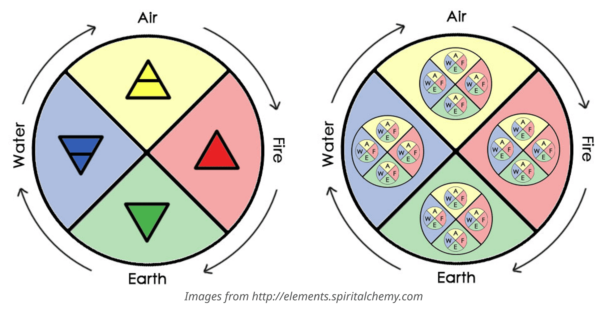

#### **Claim 15:** Instances of laws are limited, defined and understood according to their context.  

## Redundancy

The oscillation constant also gives us a glimpse into another basic, yet profound property of creation and reality, and that is its self-similar redundancy.  *Self-similar redundancy* (a term that is itself redundant) is how one property or law manifests itself across different orders of scale in the most effective manner given the context, state, and scope of that order.

One of the more obvious examples of this type of inter-scope self-similarity might be the commonality between the structure of a solar system and the structure of an atom.

Of course, universal laws such as gravity and electromagnetism apply to all systems, but at the quantum level of an atom we also have local laws such as  electron energy levels, the nuclear weak force, etc., and in much larger systems, like a solar system, there are local laws of momentum, and Newtonian physics.

Many scientists will tell you there is no relationship between atoms and solar systems, and that this analogy depends on an old and outdated concept of the atom, writing it off off as humanity&rsquo;s tendency to oversimplify the complex and over-relate the unrelated.

No doubt this is true to some degree, but more importantly, there are some similarities worth investigating that would give us an idea of the laws that both systems deploy in the most efficient way they can be expressed, given their scope.  Some scientists agree, as we can see in the paper published in June, 1989, by the *International Journal of Theoretical Physics* titled &ldquo;*Self-Similar Cosmological model: Introduction and Empirical Tests*&rdquo;[^11] which examines this concept specifically.

This report concluded:

> The simplicity of \[the Self-Similar Cosmological Model (SSCM)\] and its ability to quantitatively relate atomic, stellar, and galactic scale phenomena suggest that a new property of nature has been identified: discrete cosmological self-similarity.  Although the SSCM is still in the early heuristic stage of development, it may be the initial step toward a truly remarkable unification of our considerable, but fragmented, physical knowledge.

A more organic example of this inter-scope self-similarity[^12] is to compare the structure of the universe to a brain cell, or the birth of a cell and the death of a star, or the human eye and a nebula, and countless other examples.

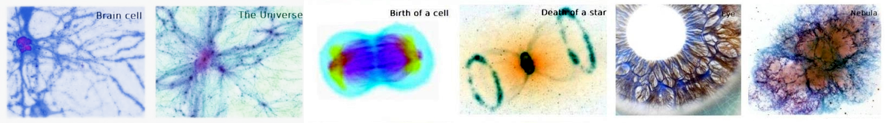

There are many matching patterns between cells and the universe, and it is a subject far too broad to get into here.  One recently published paper[^13] shows the similarity in structure of a neutron star and a human cell.  Other comparisons based on scientific and rational observations have also been noted, such as:

-   mitochondria vs.  stars
-   Vacuoles vs.  galaxies.
-   Nuclear holes vs.  asteroids
-   Vesicles vs.  the earth itself.
-   Lysosomes vs.  dark energy.
-   Endoplasmic Reticulum vs.  wormholes.
-   Cell membrane vs.  edge of the universe.
-   Ribosomes vs.  molecular clouds
-   Smooth Endoplasmic Reticulum vs.  the sun.

One could say that if you look long and hard enough you can find relationships and patterns between any two things.  That may be true, but if certain patterns keep popping up then it might be something more than just an overactive imagination.

It might even cause some incurably curious researchers to wonder if there was a bigger picture that we have been ignoring and inspire them to do some investigation that might open new doors of understanding&hellip; someone like the esteemed Stanley N.  Salthe, Professor Emeritus, Brooklyn College of the City University of New York, who said:

> &ldquo;It is an interesting possibility that the &ldquo;power laws&rdquo;<sup>6</sup> followed by so many different kinds of systems might be the result of downward constraints exerted by encompassing supersystems.&rdquo;

##### \~ Stanley N.  Salthe, Entropy 2004, 6, 335

Here is what Hans van Leunen, a physicist from the Eindhoven University of Technology, Dept.  of Applied Physics, and founder of The Hilbert Book Model project, which applies mathematical test models in order to investigate the foundation of physical reality, has to say about this as well:

> &ldquo;Obviously, physical reality possesses structure, and this structure founds on one or more foundations.  These foundations are rather simple and easily comprehensible.  The major foundation evolves like a seed into more complicated levels of the structure, such that after a series of steps a structure results that appears like the structure of the physical reality that humans can partly observe.[^14]

##### \~ Hans van Leunen, The Structure of Physical Reality

He then goes on to say:

> The \[paper &lsquo;The Structure of Physical Reality&rsquo;\] applies the name *physical reality* to comprise the universe with everything that exists and moves therein.  **It does not matter whether the aspects of this reality are observable.  It is even plausible that a large part of this reality is not in any way perceptible.** The part that is observable shows at the same time an enormous complexity, and yet it demonstrates a peculiarly large coherence.
>
> The conclusion is that physical reality clearly has a structure.  Moreover, this structure has a hierarchy.  Higher layers are becoming more complicated.  That means immediately that a dive into the deeper layers reveals an increasingly simpler structure.  Eventually, we come to the foundation, and that structure must be easily understandable.  The way back to higher structure layers delivers an interesting prospect.  The foundation must force the development of reality in a predetermined direction.  The document postulates that **the evolution of reality resembles the evolution of a seed from which only a specific type of plant can grow.  The growth process provides stringent restrictions so that only this type of plant can develop.  This similarity, therefore, means that the fundamentals of physical reality can only develop the reality that we know**.

In other words, he is saying that there are self-similar and redundant orders in the *hierarchy* and *layers* (in his words) of creation, and these orders abide by specific laws and which are limited (*predetermined*) by their component parts (*seeds*).  Likewise, the restrictions of the growth process will be similar at every level, and consequently, the laws at play will be similar.

#### **Claim 16**: Reality is a structured hierarchy of dualities which starts out very simple, each specific generation limited by the structures of the duality they emerged from.

You can read his paper[^15], but unless you know your way around multidimensional Hilbert space lattices, it going to be a tough read.

For purposes of this book, I am going to define a  *scope* or *order of creation*, (or *level*, as Hans van Leunen would say), as that creative cycle from which an apparent order emerges out of a state of the apparent disorder defined by the limits of the duality it emerged from.  I say &ldquo;apparent&rdquo; because I don&rsquo;t want to suggest that there is disorder in a seed and order in the resulting flower.  Obviously, there is order in both, but the explicit order of a flower in bloom, at the peak of its expression, when it is ready to drop its own seeds, is far more apparent than the implicit order of a seed.  The flower is *explicit* when it is in bloom, and *implicit* in the seed, while the seed in *implicit* in the flower.  This also suggests that within the scope of the life-cycle of a flower, which begins with a seed and ends with compost, the flowering stage represents the most optimum expression of energy, or the most effective form that instance can realize.

#### **Claim 17:** Self-similarity exists due to the redundant nature of the laws which express themselves in accordance with the scale and scope of their context.  

<div style='page-break-after: always; break-after: page;'></div>
# 5: REASON

###### The ability to understand something is limited by our ability to perceive something.  As our perception changes, so does our understanding change, and with that, the reasoning we apply.

We arrived at laws through reason, and we humans are rather proud of that claim as we like to believe we invented reason, but we didn&rsquo;t.  We did discover it, however, so at least we can take credit for being doggedly curious.

*Reason* is what we call our ability to recognize the natural processes that arise from the patterns of creation and is the product of intellectual survival, a skill we evolved to give us fang-less, claw-less, slow, small and tasty humans a fighting chance in the Darwinian battlefield.

To be fair, there has been a long-standing debate over whether mathematics, and by association, reason, was invented or discovered.  One of the more solid debates is presented by leading astrophysicist Mario Livio in his article &ldquo;Why Math Works&rdquo;[^16]

In that article, he refers to those who believe math was discovered as Platonists, due to the fact that Platonic archetypes include math archetypes, as math is a form of an idea.  Livio gets into the idea that math is subject to the same evolutionary forces as species in that math that does not work quickly dies, never again to propagate itself into the mathematical &ldquo;gene pool.&rdquo;

The same is true for any idea or theory.  Ideas such as the phlogiston theory of fire and Descartes theory of the motion of planets are examples of conceptual offspring that were quickly dispatched by the deadly and merciless hand of proof.  It&rsquo;s a bit different on the social level, where we see failed political and economic ideologies that, although their ruin is inevitable from the start, they continue to pop up, for, in the realms of ideology, proof is often eclipsed by belief, hope, power and mass hysteria.

A sounder argument that reason was discovered is that the systems we have created with our reasoning abilities, from plumbing to artificial intelligence (AI), have come to the same design conclusion as nature when faced with similar challenges, such as water distribution, blood cell design, language, etc.  In the case of AI, armed with our rules of reason, it has significantly out-designed human solutions many times by mimicking nature.  These improved solutions were derived at by observing the situation and applying the laws of reason that we instructed the AI system with, laws that we ourselves derived from observing our reality.  The fact that AI is coming up with solutions that not only exceed ours but are more in harmony with nature is pretty good evidence that the laws of reason are objectively verifiable and existed before humans arrived on the scene.

In any case, both sides can agree, for the most part, that math is the language man invented to describe the existing laws he discovered and likewise, reasoning is the process man invented to describe the unfolding order of existence that he was capable of perceiving.  This is a sufficiently satisfactory answer with regard to math and reason, but reasoning, in general, has a lot more gray area than mathematics.

## The Limits of Reason

Reason has been pretty effective in describing our reality, but it has its limits, at least in the way we use it today.

For example, the traditional Law of Thought[^17] goes something like:

- **The Law of Non-Contradiction states:**

> &ldquo;Nothing can both exist and not exist at the same time and in the same respect, or no statement is both true and false.&rdquo;

- **The Law of Excluded Middle states:**

> &ldquo;Something either exists or does not exist, or every statement is either true or false.&rdquo;

- **The Law of Identity states:**

> &ldquo;Everything is the same as itself, or a statement cannot remain the same and change its truth value.&rdquo;

These laws are much like math, in fact, they have their own algebraic notation: ∼(p&sdot;∼p), F(x)&sup;F(x)**,** (&forall;x) (x=x), respectively.

It seems reasonable to assert that these laws existed before we came up with a way to define them, just as processes in nature existed before we understood them.  We certainly did not invent the fact that something cannot &ldquo;be&rdquo; and &ldquo;not be&rdquo; at the same time.  We discovered that this is a property of our reality, or rather, in the way we perceive our reality.  If we broaden our perceptions to include the reality that something *can be* and *cannot be* at the same time, then our reasoning must adapt.

A hardcore Aristotelian materialist might say &ldquo;The law of non-contradiction specifically forbids something to be in a state of existence and non-existence.  The universe has a transcendent self-consistent order, and that order cannot be violated.  Its primary manifestation is thus: it exists, and it cannot be otherwise&rdquo;, while a Platonist might say something can exist as an archetype but not as a material instance.  A scientist might suggest that something can exist implicitly, but not explicitly, like the ink drop, or can even be in two places at the same time, as we have seen in quantum mechanics,  and a Hindu guru might mess everything up by saying &ldquo;The One is both *Sat* (existing) and *Asat* (non-existing).&rdquo;

It would appear that the laws of reason depend on the scope of one&rsquo;s perspective and what one accepts as axiomatic or true, transcendental or otherwise.  How, then, can these laws be preexisting if they contradict each other? This is sort of like the fable of the blind men and the elephant, where one blind man holding the elephant&rsquo;s tail describes it as a snake, and the other, holding the foot, describes it as a tree, or perhaps like the brilliant sculptures of Mathew Robert Ortis, such as &ldquo;Revolution Giraffes&rdquo;, which looks like a giraffe from one angle, but an elephant from another.


The blind men and the viewers of the sculpture are all perceiving a preexisting form that is undebatably &ldquo;true&rdquo;, but they can&rsquo;t seem to agree on what it is.

Each of these fine folks can easily define and defend their worldview.  They are all able to recognize the reality they have accepted as true, supported by the reasoning of that truth.

### Labels and Names

In all cases, before one can proclaim some thing&rsquo;s existence, that thing has to be named and something about it must be known, or at least presumed.  We can&rsquo;t say something exists if we have no idea what it is we are making that claim about.  We can see this readily in the way languages form ideas and labels which become the foundation of cultural understanding.

I can say my dog exists because I know *my* dog, I know *of* dogs, and everyone I know also knows of dogs.  But can I say *phlimquitz* exist, and when you ask me what a *phlimquitz* is, I say &ldquo;I have no idea&rdquo;? That would be quite unreasonable, but if I said *phlimquitz* explains the 99.97% correlation between &ldquo;U.S.  Spending on science, space and technology vs.  Suicide by hanging, strangulation, and suffocation&rdquo;, then I am claiming to understand something heretofore unknown and can go about defining and testing the *Phlimquitz Hypothesis*.

#### **Claim 18:** We name things according to our observations, and once named, they become conceptual realities.  

Here is that correlation, just for fun:[^18]


    


This process of understanding is similar to recognizing a pattern in a series of random dots, as in the dancing-woman-in-the-dots example above.  In that image I can definitely see a person dancing, and I can easily prove it by connecting the dots.  I am not wrong, but neither is the person who sees an egg sandwich.  

However, any predictions either of us makes on where the next dot will land or in determining the properties attributes of the dots, based on the understanding of our perceptions will most likely fail.  Through trial and error, testing, and proofs, we will finally discover that these dots represent no specific pattern.  Once we recognize the concept of randomness, we can name it, define it, and study it.

Humans began grasping this concept of randomness about 3,000 years ago, but named it things like &ldquo;fate&rdquo;, &ldquo;chance&rdquo;, and &ldquo;destiny&rdquo;, and, being unpredictable was usually associated with some sort of supernatural justice or punishment.  It wasn&rsquo;t until the 16<sup>th</sup> century that Italian mathematicians began to formalize the concept of what we call randomness, so it&rsquo;s still quite a young concept.

#### **Claim 19:** Our ability to reason is rooted in our ability to see patterns, and connecting these patterns is made possible by our ability to reason.

God(s), angels, spirits, the Djinn, magic, luck, coincidence, mystical forces, kundalini, chi, manna, out-of-body-experiences[^19], etc., are all concepts that many people have a clear understanding of, and as such, they are able to say it exists because they cannot only recognize it but can produce reams of information about it.  To be clear, this is not meant to suggest these observations are, or are not, as valid as any other.  Any system&rsquo;s validity depends solely on the contextual effectiveness of the reasoning behind it and the ability of that reasoning to produce verifiably accurate statements about it.

It would be hubris to write-off alternative views of reality given every culture in the world has a concept of some sort of paranormal, metaphysical energy.  Some of these cultures have extremely demanding training and lengthy education to tap into it.  Even our western icons, such as Paracelsus, Hippocrates, Carl Jung, Erwin Schrodinger, Albert Einstein and Plato have referred to it.

For better or worse, it seems that pretty much anything can be a Truth as long as people can recognize it and support it with whatever sort of reasoning they happen to be using.  For our purposes, we are only concerned with reasoning that is based on the laws of nature, as they are perceived.  We need only look at history, and some places on the planet today, to see the many versions of truth that have evolved, and how dramatically they differ from each other.

### The Truth about Truth 

This raises the Big Question… What is truth?

This is a question we can never answer absolutely.  We can&rsquo;t speak about what the ultimate truth is because there can never be absolute proof that any one way of looking at something is the &ldquo;right&rdquo; way.  All we can speak about is what is the most reasonable understanding given the context of our reality and our perceptions of it.  What, then, is the arbiter of proof as to whether something is &ldquo;reasonably&rdquo; true or not, given our current understanding of reality?

One arbiter is, of course, power.  When Friedrich Nietzsche said &ldquo;There is no truth, only power&rdquo;, he was half right.  Truth is a journey of discovery, while power is a battle for who gets to navigate that journey.

### Sustainability

Outside of that battlefield of culture and politics, we do have at least one gauge, and that is the measure of sustainability.  Sustainability may be the best test as to the validity of something because its explicit existence alone is proof it exists in accordance with the rules of reality.

Anything that exists can only sustain its sustainability if it exist within the constraints of its scope, typically defined by its environment and its component parts.  A functional balance must be maintained between all contributing variables in order for the energy within that instance to move in a structured manner that allows order to emerge from chaos.  Energy always seeks to achieve a balance; therefore, sustainability is the measure of the degree that order and balance can be maintained.  Unsustainability will result in chaos, and visa-versa.

This raises an interesting question: if (high-entropy) chaos is the ultimate state of the Universe, a state where everything is inert, motionless and dead, then it must also be the most sustainable state as it will never change once arrived at.  Oddly, this appears to be true, but this is also an example of the two kinds of *balance*.  The dead state is the state of *balance* (noun) that has no movement, which is the opposite of the action of *balance* (verb), which is a dynamic and interactive process of energy and movement.  

All the movement of energy that exists at every level of reality is the result of energy traveling the path of least resistance as it seeks balance.  We see examples of this everywhere, such as when we add hydrochloric acid with sodium hydroxide.  After an extremely violent readjustment phase that releases a lot of energy (heat), it settles down to very stable, lower energy-demanding products of water and table salt.

The Universe, starting with the extremely violent Big Bang and ending (according to at least one popular theory) as a bunch of inert matter, the cosmic equivalent of water and table salt, is essentially the readjustment phase of different states of imbalance coming to terms with one another.  Reality is the reaction of this adjustment, and like the chemical reaction just mentioned, will ultimately balance out and just sit there, doing nothing.

The ultimate destination of sustainability, on the cosmic scale, is death.  In our current point in existence, sustainability means keeping the various part of the &ldquo;balancing machine&rdquo; of nature working properly.  In both cases sustainability means balance, but with two very different results of short-term, or *temporal* balance and long-term, or *supernal* balance.  For our purposes, the sustainability we are referring to is the temporal kind, unless otherwise noted.

#### **Claim 20:** Sustainability is a gauge of existence, and therefore life itself, at every level of reality.  

Pions exist for about 26 nanoseconds, while the most massive black hole known, approximately 66 billion times larger than our sun, would require 6x10<sup>99</sup> years to evaporate.  Does this mean that black holes are more &ldquo;valid&rdquo;, more &ldquo;true&rdquo; than pions? No, because the pion&rsquo;s existence, short as it is, is necessary, otherwise it would never have existed in the first place, but the validity of a pion, essentially the truth of its explicit existence, is only valid for 26 nanoseconds while the validity of a black hole is forever (as 6x10<sup>99</sup> years is actually longer than the life span of the Universe).  By this logic, we can say that both pions and black holes are equally true and valid, but one is &ldquo;true&rdquo; forever.

#### **Claim 21:** Something exists because its expression of energy patterns adheres to an order that must be maintained to continue existing.  

### Tree of Sustainability

Let&rsquo;s take a look at a more integrated example; that of a single cell, the building block of life.  This is high-school biology, but let&rsquo;s go over it again.

Each of these processes has proven itself to be a more &ldquo;valid&rdquo; truth by being more sustainable then any of their alternative processes.

- Inside the cell are two meters of tightly wound strands of four very specific molecules, held together by sugar phosphates, which make up the DNA of that cell.  These are $C_{5} H_{5} N_{5}$ (adenine),  $C_{5} H_{5} N_{5} O$ (guanine), $C_{4} H_{5} N_{3} O$ (cytosine) and $C_{5} H_{6} N_{2} O_{2}$  (thymine).  They are arranged in a very specific order which describes the instructions necessary to build every protein in an organism.
- In a process known as transcription, a molecular machine first unwinds a section of the DNA helix to expose the genetic instructions needed to assemble a specific protein molecule.
- Another machine then copies these instructions to form a molecule known as messenger RNA.
- When transcription is complete, the RNA strand carries the genetic information through the nuclear pore complex, the gatekeeper for traffic in and out of the cell nucleus.
- The messenger RNA strand is directed to a two-part molecular factory called a ribosome.
- After attaching itself securely the process of translation begins.
- Inside the ribosome, a molecular assembly line builds a specifically sequenced chain of amino acids.
- These amino acids are transported from other parts of the cell.
- They are linked into chains often hundreds of units long.  Their sequential arrangement determines the type of protein manufactured.
- When the chain is finished it is moved from the ribosome to a barrel-shaped machine.
- It is then folded into the precise shape critical to its function.
- After the train is folded into a protein it is then released and shepherded by another molecular machine to the exact location where it is needed.

These processes, and their order, are so specific, so complex, so difficult to explain with current evolutionary models, that Dean Kenyon, a Professor Emeritus of Biology at San Francisco State University who actually taught Evolutionary Theory, switched teams in 1979 and went on to be a key member in the &ldquo;Intelligent Design&rdquo; movement.

The important point here is that if any one thing in the list of processes listed above changes, if one atom in the C<sub>5</sub>H<sub>5</sub>N<sub>5</sub> molecule was different, or the &ldquo;gatekeeper&rdquo; made a bad call or a thousand other possibilities, the cell would either die or mutate, become unsustainable, or it would make the larger organism unsustainable.  This is actually what cancer is, the malformed reproduction of cells that reduce organism&rsquo;s sustainability.  Interestingly, the cancer cell itself can be quite sustainable as an independent cell and only becomes a problem as a community of cells.

For a cell to be sustainable, to continue existing, only one process, made up of numerous detailed steps, all of which must function properly, will result in successful functioning and reproduction.  More importantly, we can&rsquo;t explain why any one particular option in any step, out of the countless theoretical options available at each step, is the one step that the process &ldquo;knows&rdquo; to select.

To put this in even clearer perspective, using twenty different amino acids to create a very small protein (of 150 amino acids), there are 10<sup>77</sup> possible combinations.  In the world of biology, this exponential growth of possibilities is actually called *combinatorial inflation*.  Remember that term, as we&rsquo;ll come back to it later on.  How many of these 10<sup>77</sup> possibilities can produce a viable protein? Very few, and of those few only one will work, that being the one that works with the others it must integrate with.  It&rsquo;s not quite as bad as the likelihood of a million monkeys banging on a million typewriters to eventually produce the entire works of Shakespeare, but considering it would take 2,737,850 million-billion-billion-billion monkey-years to produce the line from Hamlet &ldquo;RUMOUR.  Open your ears&rdquo;[^20], how likely is the chance that this 1:10<sup>77</sup> process could happen successfully 10<sup>40</sup> times, which is the number of organisms that have ever existed in the history of the planet? For life to evolve (in the Darwinian sense) as it has over the past 4.5 billion years, this 1:10<sup>77</sup> process would need to happen 7x10<sup>99</sup> times per second, which equates to every living thing on planet today performing this process 7x10<sup>74</sup> times per second! If the vast majority of the 34 trillion cells that make up your body didn&rsquo;t all all hit the jackpot of creating the *same* viable life form millions, if not billions of times a second, life would have never evolved past the bio-goo stage.  Admittedly, these numbers may be inaccurate due to their speculative nature, but the general idea that evolution as a genetic crapshoot sounds far more unreasonable.

What we call a cell is a collective of components that not only all work together with miraculous precision, but which seems to have an intelligence of its own that understands the requirements of how each component must operate with each other component in order to preserve and maintain its sustainability, its existence.  Likewise, the components themselves, like the barrel-shaped machine and the transcriptors, are also made of components that have the same intentions and decision-making abilities.

Evolutionists will say that all the other options, at one time in our past, were tried, and failed, leaving only the process that worked.  Intelligent Designers will say that this was &ldquo;biochemical predeterminism&rdquo;, i.e.  that the process was pre-programmed, somehow.  Both of these answers are just kicking the can down the road, that &ldquo;can&rdquo; being the question of where and how this historical record of what worked and what didn&rsquo;t work is stored along with the knowledge of a very strict set of rules and conditions that informs the process,  as well as how this data is it accessed.

Let&rsquo;s take a look at a couple of macro examples on the social human scale and examine the serious questions it raises about the way we understand it.

### Yagé

This ritual psychoactive drink from the Amazon is also known as *ayahuasca*, *uni*, *nixi pãe*, *caapi*, *camarampi*, and many other names as well.  One of the more fascinating details about yagé is how it is made and how it was discovered in the first place.  The main active ingredient of yagé is N, N-Dimethyltryptamine (DMT).  DMT is a powerful hallucinogenic drug that exists in plants (and the human brain) yet has no effect on humans when taken orally because of the enzyme *monoamine oxidase* (MAO) in our blood that prevents it from passing the blood/brain barrier, which is a semipermeable membrane that separates the blood from the cerebrospinal fluid and which blocks many cells, particles, and large molecules, from entering the brain.  This is a very good thing, as there is a lot of stuff floating around in our blood that can really mess with the brain.

In order for the DMT to get to the brain, it has to pass through the blood/brain barrier, and for that to happen there must be something that stops the MAOs from doing their job.  That thing is called a *MAO Inhibitor* (MAOI).  MAOIs are commonly used in pharmaceuticals to help with ailments such as depression and Parkinson&rsquo;s disease (which, according to Stanford University, are the same two things that tango dancing also helps).

Modern science has known about both of these drugs for a little over 100 years.  Indigenous Amazonian shamans have known about them for about 5,000 years.  Somehow, in a manner beyond the ability of modern Western man to comprehend, these shamans managed to discover that the bark of one particular vine, from over 40,000 species of plants, contained a lot of DMT.  They also, somehow, knew that an MAOI was needed, which they found in another of those 40,000 species.  Traditional anthropologists would have you believe they discovered this by trial and error, but with just a little thought, it is clear how ridiculous that theory is.

Of the 1,600,000,000 possible pairing combinations of Amazonian plants, only one produces the basis of yagé (it&rsquo;s actually far more complicated to make yagé than just mixing these two plants), and even then, only when a certain part of the plants are used.  In addition, these 1,600,000,000 possibilities do not consider the variables of proportion or the specifics of preparation.  For that many trial-and-error tests, even if every man, woman, and child in all of South America partook in the finding, preparing, and experimenting, it would take over 2,000 years, which then raises the question of record-keeping as to what was already tested.  The fact that modern science expects any semi-intelligent person to believe its trial-and-error theory is laughable, but also pretty frightening that so many scientists *do* believe this.

### Curare

For other substances, such as the paralyzing poison *curare* used by South American indigenous people for hunting, the chances are astronomically greater.

Curare is a poison that paralyzes an animal, but soon after being paralyzed the poison is metabolized by the animal, rendering it harmless.  That is obviously a pretty essential requirement, as you can&rsquo;t be eating the same poison you used to catch the animal.  Just imagining that the locals knew of this requirement and then set out to find such a drug somewhere in the Amazon is difficult for modern anthropologists to accept.

Beyond that, there are 172 different types of this one-in-40000 species in the jungle, and only one of them works, but the real kicker is that the fumes one is exposed to while preparing the curare are fatal! How does modern science imagine this was achieved?

> *Wanadi:* &ldquo;Trumak! Mojie just died testing that new batch of curare!&rdquo;
>
> *Trumak:* &ldquo;Bummer.  And he was so close! Go and try that again, with the same batch… and remember to keep smelling it.  That&rsquo;s how you know it&rsquo;s done.&rdquo;
>
> Wanadi: &ldquo;OK!&rdquo;

On the other hand, if one were to ask a shaman how these things were discovered, he would simply say, &ldquo;The plants told us.&rdquo; Other cultures who have similar stories might say their ancestors told them, or the crickets, or the bones of a sacred animal, or the cracks in the shell of a tortoise after it has been heated and then dropped into cold water and then compared to the position of the stars, as was the case with the origins of the Chinese I-Ching.

For Western man, talking to plants, insects or bones in this manner is usually followed by pharmaceuticals prescribed by a psychiatrist.  For just about every other indigenous culture, including the indigenous culture that Western civilization grew from, they had some way to tap into this organic database of knowledge.

Just as a cellular transcriptor has the intelligence necessary to manage its sustainability, which is then managed by the intelligence of a cell, and up the chain this continues all the way to a human being (which is just a stop along the journey, as we humans are part of a yet larger system), it is not unreasonable to presume there is an *uber*-intelligence that manages its components of humans.

Our ancestors called this intelligence &ldquo;the voice of the gods&rdquo; and about 5,000 years ago we started to create the idea of an all-in-one-version of the gods.  This was a very practical idea and worked very well given the context and scope of our ancestor&rsquo;s world view.  It gave one name to all things unknown and satisfied their need for a sense of truth and order.  Once named it was left to humans to try and describe that truth and order.

## The Human Brain and Reason

The American Psychologist Julian Jaynes wrote a very popular book titled &ldquo;*The Origin of Consciousness in the Breakdown of the Bicameral Mind&rdquo;* (1976) wherein he explains that during a recent stage in the evolution of not only our ancestor&rsquo;s  brain but entire nervous system we, as humans, had the ability to hear voices in our heads instructing us on what we needed to do and needed to know, and these voices of unknown origin were attributed to the &ldquo;gods&rdquo;, and therefore became the voice of Truth.

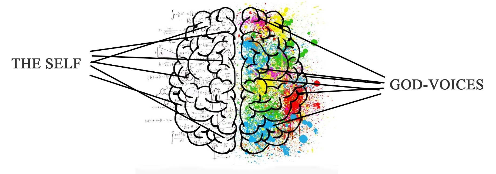

>&ldquo;Who then were these gods that pushed men about like robots and sang epics through their lips? They were voices whose speech and directions could be as distinctly heard by the Iliadic heroes as voices are heard by certain epileptic and schizophrenic patients, or just as Joan of Arc heard her voices.  The gods were organizations of the central nervous system and can be regarded as personae in the sense of poignant consistencies through time, amalgams of parental or admonitory images.  The god is a part of the man, and quite consistent with this conception is the fact that the gods never step outside of natural laws.&rdquo;[^21]

Jaynes claims that a bit before 1,000 BC (just around the time of the Tower of Babel by Sumerian accounts) the human consciousness was not yet &ldquo;meta-conscious&rdquo;, meaning humans were not aware of their awareness.  The bicameral part of Jaynes theory suggests that there were two parts of the brain, the one that managed mundane jobs, habits, rote tasks, etc.  (the self), and another part which, when faced with confusing and/or difficult challenges, took over (the voice of god).

> \[For bicameral humans\], volition came as a voice that was in the nature of a neurological command, in which the command and the action were not separated, in which to hear was to obey.

*Sidenote: What we call the &ldquo;ego&rdquo; today evolved out of that really boring and mundane &ldquo;self&rdquo; part of the brain, so it&rsquo;s probably best not to use it for anything other than mundane tasks.*

According to Jaynes, the transition from bicameralism to consciousness (linguistic meta-cognition) occurred over the period from 1,800 BC to 800 BC.  We know this time as the time from when Hammurabi ruled Babylonia, and when he wrote down one of the first set of laws known to humanity dealing with challenging and confusing issues such as contracts, wages, liability, inheritance, divorce, paternity, and reproductive behavior, to name a few, to the founding of Rome.  This metamorphosis of consciousness ushered in the golden age of empires and cultures that laid the foundation of Western Civilization in areas of art, literature, theater, government, philosophy, mathematics, and even sports.  (*I am singling out Western culture simply because that is the culture I best understand and which has the most information available, and not because I think other cultures have not developed along their own lines under similar conditions.)*

From the days of Rome and the ancient Greek philosophers to today our bicameralism has further diminished, which can account for the decreasing incidents of people hearing the gods speak to them.  This may have been a good thing, but the problem that arose as a result of the gods abandoning us, forcing us to apply reason to challenging problems when our pleas for guidance were ignored, is that our newly developed tools of reason were prone to reject any ideas that we could not understand, which were many given we were still new at the whole reasoning thing during some very desperate times.  Our fledgling ability to consciously make sense of things seemed to be working, so it naturally dominated our world view, even if we were, and are, still figuring out how it works.

Still, as Jaynes so eloquently puts it:

> The mind is still haunted with its old unconscious ways; it broods on lost authorities; and the yearning, the deep and hollowing yearning for divine volition and service is with us still.

Hence, religion.

Anything and everything that did not fit into the highly constrained and &ldquo;reasonable&rdquo; worldview was pushed farther and farther outside the box of mainstream thought until we arrived at where we are today.  In one way this &ldquo;inquisition-by-reason&rdquo;, which served to purge heretical thoughts from the dogma of the cult of reason, was, and is, quite necessary and useful, because in the reformation that has begun, those ancient ideas that can withstand the tests of our deeper understanding of reason will be resurrected in a new form with a broader and modern understanding.

The memories of the cell, the voices in our ancestor&rsquo;s heads, the wisdom of the plants as heard by the shamans, and countless other instances of &ldquo;divine&rdquo; or &ldquo;mystical&rdquo; knowledge, all beg the same questions: Where does this information come from? Where is it stored? How does one access it?

Perhaps *reason* has evolved to the point where we may be able to answer these questions, reasonably.

## The Path of Reason

The rules and conditions of reality that we have discovered have followed a perfectly reasonable path long before man was able to claim them as such.  Sometimes it takes a while to find them, but eventually, we do, so far.

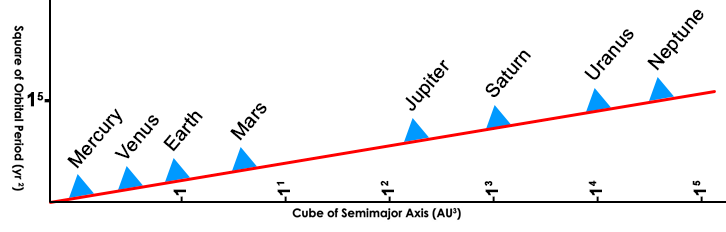

For thousands of years, Man looked at the path of the stars and came up with various stories about why they were where they were.  It wasn&rsquo;t until Kepler discovered the pattern by plotting the paths on a logarithmic chart that the reasoning became clear.  This became Kepler&rsquo;s Third Law of Planetary Motion that states *&ldquo;the square of the planet&rsquo;s orbital period is proportional to the cube of its distance from the sun.&rdquo;* In the same manner, we discovered DNA is a helix because of hydrogen bonds, etc., so we can say &ldquo;Here is a pattern and the rules that created it.&rdquo;

This is not to say everything that the gatekeepers of the Church of Reason consider &ldquo;unreasonable&rdquo;, such as myths, magic, aliens, hyper-dimensional beings, and numerous other paranormal, metaphysical concepts are, indeed, &ldquo;unreasonable.&rdquo; On the contrary, it&rsquo;s quite unreasonable to presume they have no reasoning behind them as many of these ideas perfectly conform to natural law, albeit within a scope that extends outside our modern boundaries.  Historical examples of once unreasonable ideas include electricity, flight, wireless communications, space travel, nuclear energy and pretty much the majority of the reality of modern life.  These things were considered nothing less than magic and science fiction until we were able to recognize it and discover the rules of how they worked.  Once we discovered Bernoulli&rsquo;s law[^22] works in harmony with the law of gravity we mastered the magic art of flying.

#### **Claim 22:** Reason is the codification of the rules of a reality as we have come to know it.  

### The benevolence of self-preservation

If our reasoning is based on the world we observe, then this implies that everything in nature, everything in the universe, must, therefore, be reasonable, but sometimes the reasoning we have derived from our observations is inaccurate or lacking.

#### **Claim 23:** The rules of reason are predetermined based on the rules of our reality that we have recognized, and these rules require that any &ldquo;reason&rdquo; that exists must abide by them.  

Take, for example, our reasoning behind the evolutionary drive for self-preservation.  We assume it is a somewhat selfish, yet necessary, biological drive passed down through our genes in order to increase the genes chances of reproducing themselves.  This makes sense if we see the world only as a bunch of individual entities competing for resources.

Another way to see self-preservation is from the perspective of the larger organism that is composed of many contributing organisms.

Take the example of a collective, such as a tribe.  If the collective is destroyed, then all its members also suffer from that loss.  The collective, then, has a strong responsibility to the members.  On the other hand, if the members were to become damaged in some way, the collective suffers as well.  So, the collective will both attempt to preserve itself for the sake of its members and preserve the members for the sake of itself.  We don&rsquo;t think of a collective as an organism, but all organisms are collectives, therefore collectives *can* be organisms.  Now apply this reasoning to an animal.  The animal will attempt to preserve itself for the sake of its &ldquo;members&rdquo;  (organs, limbs, cells, etc.), and preserve its members for the sake of itself.  In the case of a tree, a tree will attempt to protect itself for the sake of its members which it needs to maintain sustainability.  For example, besides bark and thorns, a tree will emit chemicals that attract the enemies of the invading species, which is pretty amazing when you wonder about how it &ldquo;knows&rdquo; how to do that.  A leaf will attempt to protect itself with fine hairs, spines or thorns, bitter and even toxic substances.  We tend to think of a tree as a thing that has a trunk, branches and leaves, but it can also be understood as a collective organism made up of other collective organisms, such as trunk, branch and leaf, each taking care of itself.

From the perspective of the parent organism, such as the collective, it is worth losing a member if that means it will benefit the collective and/or the ability of the collective to preserve its members.

One example of this are the cardiac muscle cells that have the self-preservation ability to duck, dart, and dodge foreign substances, but these actions may harm the cells to the point where they can cause a fatal heart attack, all in an attempt to preserve themselves, even though they are killing their parent organism.

Some theorize that they do this because there is a greater chance of the heart surviving if the cells can avoid damage and hold out for the possibility of the heart being resuscitated.  A far more reasonable explanation is that the component elements of a person (the cells, in this case) are compelled to preserve *their* component elements (nucleus, chromatins, cytoplasm, organelles, etc.).  Killing the parent organism is not its concern, nor within the scope of its influence as preservation of the members is the concern of the parent organism, who has obviously failed to protect its components in this case.  The sacrificed parent organism of *person*, which exists within the collective (tribe, community, country, etc.) will only lose one (improperly functioning) member.  

In this particular example of cardiac cells, their self-preservation can be fatal to the collective (or *person*), but in most cases losing a few cells is not fatal to a person, but by the same token, the *uber* organism that humans are a part of (family, society, government, etc.) only forfeits one human.  This is happening in our own bodies 60 billion times a day, as that is how many of our own cells die, and are created, every day.

#### **Claim 24:** The most efficient model for a collective is individual self-preservation.

Seeing self-preservation more as a protecting-the-family-of-component-parts makes much more sense *if* we also see that every organism in the hierarchy of life, from cells to cities, is an individual entity.

Just as an entity will endanger its collective in an attempt to preserve its members, a collective will sacrifice a member for the betterment of the whole.

This perspective also explains how a person is able to sacrifice itself for the sake of another, even though they have no genetic connection to the other person, ruling out genetic preference as is the case when a parent sacrifices themselves for their child.  This would also suggest that our most basic drive is not only the survival of the self, but also the survival of something more important than the self, yet still be self-serving.  We see this in cases of love, honor, country, god, etc., and other examples of a collective.

You might be thinking that this is a trait unique to humans, but this is not the case.  We see cases of this in single-cell organisms[^23], multi-cellular organisms[^24] (such as slime mold, where, when faced with scant resources, certain cells will sacrifice themselves for the sake of the greater organism.[^25]), virulent parasites[^26], plants[^27], to name a few.  Of course, in society, this is clearly exemplified in soldiers willing to die for their country or ideology, as well as countries willing to send their soldiers into war.

This self-sacrificing quality turns out to be fairly common across life in general.  Quoting the paper published in *the International Academy of Ecology and Environmental Sciences*, &ldquo;Invasive cancer as an empirical example of evolutionary suicide&rdquo;[^28]:

> In recent years, a large portion of the literature has focused on evolutionary suicide.  &ldquo;Darwinian extinction&rdquo; or evolutionary suicide is one of the most important findings in adaptive dynamics \[which inevitably bring us to the conclusion\] that evolutionary theory falls short of adequately explaining the phenomenon of life in its fullness and complexity.  This is due to the fact that \[evolutionary suicide\] is not a rare or special case and that it can occur in the most common ecological conditions.

We also see a less dramatic version of this in genomes which will, rather then commit suicide, reduce their own replication rate to help other genomes.[^167]

This perspective is reasonable and does a better job of explaining how, any why, life operates the way it does.  With ideas such as wave functions and the many-worlds theory of quantum physics, the morphic field of biology, the research into hyper-time telepathic communication (for long-distance space travel), self-determining AI, etc., it&rsquo;s easy to see how what we accept as &ldquo;reasonable&rdquo; will dramatically change as we learn how these new processes of reality and life work.

Some may see this as an example of &ldquo;Intelligent Design.&rdquo; We prefer the term &ldquo;Coherent Integration&rdquo; to represent an integrated self-similar pattern of moving energy that extends far above and below that sliver of the reality spectrum that we are attuned to perceive.

This idea is essentially the same one that was put forth 250 years ago by the man who not only laid the foundations of modern economics but did so specifically with the ideas of eliminating poverty and increasing sustainability.  His name was Adam Smith, and he referred to this power of self-preservation in his *Theory of the Invisible Hand*, described in his book *&lsquo;An Inquiry into the Nature and Causes of the Wealth of Nations&rsquo;* published in 1776.  

> The natural effort of every individual to better his own conditions, when suffered to exert itself with freedom and security, is so powerful a principle, that it is alone, and without assistance, not only capable of carrying on the society to wealth and prosperity, but of surmounting a hundred impertinent obstructions with which the folly of human laws too often encumber its operations.
>
> It is not from the benevolence of the butcher, the brewer, or the baker that we expect our dinner, but from their regard to their own interest.

##### \~ Adam Smith, 1776

Applying this idea to society also suggests that the most sustainable practice for the world at large can be summed up in a phrase that is attributed to international banks, John Lennon and Yoko Ono, Buckminster Fuller and more[^175] &hellip; &ldquo;Think globally, act locally&rdquo;.  This is easily practiced by spending your money at local businesses rather than Walmart or Amazon, or simply, to quote Mother Theresa when asked “What can we do to promote world peace?”, “Go home and love your family.”


#### **Claim 25:** There is an order to creative processes, and creations themselves are a product of order.  

## Applied Reason

How have we used our reasoning skills to understand the nature of reality and our universe? One of the most fundamental concepts we have created in this regard it that of *cycles*.  Cycles are the way we describe *&ldquo;any complete round or series of occurrences that repeats or is repeated.&rdquo;* Cycles, as we understand and define them, are the product of applying reason to the redundancies and repeating patterns we observe around us, and even within us.

On the other end of the spectrum, we have sophisticated and complex theories as to how reality came into existence, and how the cycles of existence began in the first place.

We understand the concept of cycles easily enough, but let&rsquo;s look at some of the more popular ideas that represent our best reasoning abilities regarding the cycle that started it all and how everything that exists began.

### Big Bang

This seems to be the most popular theory and it comes with various finales (Big Freeze, Big Rip, Big Crunch) and states that 14 billion years ago there was nothing and nowhere, the primal void.  Then, for reasons unknown, something the size of a subatomic particle appeared in this void of nothingness and in a fraction of a second expanded to perpetually fill and expand the entirety of what we call the Universe (which is estimated to be about 90 billion light-years wide, so far).

Can you see the relationship between the Big Bang Theory and the harmonograph as a device that takes an initial push and then takes some time to create a two-dimensional design on a blank surface as that initial energy slowly diminishes? If one could imagine a 12-dimensional harmonograph with countless variables in each dimension, one might be able to imagine how it could easily &ldquo;draw&rdquo; a 3-dimensional universe.

### Eternal Inflation

This is also called a &ldquo;Level II Multiverse&rdquo; and states a) after the Big Bang the universe never stopped inflating, b) that this has been going on for an infinite amount of time and c) it continually creates new universes (multiverses) that also exist for infinite time.  It is not clear how something can have a beginning, can be created, and yet exist for infinite time as there can be no &ldquo;beginning&rdquo; to infinite time, but we&rsquo;re talking quantum theory stuff, so, I guess anything is possible in that world where time and space may mean something different then what we are used to, if they mean anything at all.  The paper Stephen Hawking was working on when he died claims this theory is for the birds, that there is only one universe, and this can be proven if we just get rid of the concept of time… so, even the rebuttal to this theory is inconceivable.  

### Oscillating Universe

Also called the &ldquo;cyclic model&rdquo; and involves an endless series of Big Bangs, followed Big Crunches, and is explained by the collisions of high-dimensional &ldquo;membranes&rdquo; in a higher-dimensional space.

The question this model raises is, does the &ldquo;memory&rdquo; of the previous &ldquo;bangs&rdquo; survive each crunch? We address the idea of universal memory later, so we won&rsquo;t get into it here other than to ask if each new bang is a hard reset.

### Holographic simulation hypothesis 

The idea that reality is &ldquo;just&rdquo; a simulation has been around for a long time.  The roots of such an idea go back to the &ldquo;Skeptical hypotheses&rdquo; of ancient Greece and the &ldquo;The Butterfly Dream&rdquo; of 3rd century B.C.  Chinese philosopher Zhuang Zhou.  These ideas found more form in the &ldquo;Cartesian doubt&rdquo; of René Descartes, finally culminating in Oxford philosopher Nick Bostrom&rsquo;s &ldquo;Simulation hypothesis&rdquo; theory and book *&ldquo;Are you living in a computer simulation?&rdquo;* in 2003 (also a documentary[^29]).

This theory that we live in a simulation has moved out of the philosopher&rsquo;s chair and into the science lab where bits of supporting evidence were discovered.  In this scenario, the Big Bang would be the equivalent of a cosmic hacker flipping the &ldquo;on&rdquo; switch to their &ldquo;Reality Framework Server&rdquo;.  This theory posits that reality is a simulated projection and black holes are the projectors, with the *event horizon* of a black hole (the point from which nothing escapes) acting as a diffraction grid for the energy it is projecting to form a &ldquo;reality&rdquo;, just like a hologram.

We think of this world as analog, but it may well be digital, albeit with a level of resolution far beyond our ability to perceive (which would make sense if one were designing a simulation).  This grid is made up of a series of 1s and 0s, each &ldquo;bit&rdquo; occupying a square Planck length.  To put this in perspective, the number of &ldquo;bits&rdquo; on the surface of *V616 Monocerotis*, our nearest black hole &ldquo;projector&rdquo; a mere 3,000 light-years away, is around 2.3313x10<sup>88</sup>.  There are only 10<sup>82</sup> atoms in the universe (we think), so, that is a big number.

This is just from one of the 100 million black hole projectors in our galaxy alone, and we already know of 500 billion galaxies just within our range of observation, so we know of at least 5 x 10<sup>19</sup> &ldquo;reality projecting CPUs&rdquo; (for lack of a better term), that are all working in perfect synchronization, theoretically.

Even more mind-bending is the possibility that the reality that is being projected is only &ldquo;rendered&rdquo; on-demand, i.e.  this reality simulation creates wave functions of possibilities that only &ldquo;collapse&rdquo; into form when they are observed.  Apparently, creating actual physical reality is a &ldquo;CPU&rdquo; intensive task, or perhaps this reality was developed by creators that could only get their hands on a low-end simulator.

I would also question the use of the word &ldquo;simulation&rdquo;, for that implies it is an artificial rendition of something that already exists.  It is more like a *bona fide* creation, albeit one that may have been designed around a specific model, or for a specific (yet unknown) purpose.

What is missing in the list of current theories are many of those ideas that are not based in science, but rather legend, creation myths and beliefs.  I skipped them not because they are not valid, but simply because there are too many of them, but modern theories are surprisingly in-line with the creation myths of the Judeo-Christian, Islam, Hindu, Zoroastrian, Taoist, Buddhist and even Aboriginal Australian, the world&rsquo;s oldest civilization[^30], and cycles of creations is implicit in all of them, and explicit in many of them.  We would expect to see this similarity between radically different perspectives, such as science and religion, if they were all attempting to understand the same thing.

The common thread of modern and ancient creation theories and stories is that they are all versions of the plot-line that begins with *nothingness*, followed by a *somethingness*, and everything that ever did or ever will exist does so between these two states of chaos.

#### **Claim 26:** All dualities stem from the first duality.  

### What Goes Where? 

If the two primal opposing end-points of the spectrum of our reality are *somethingness* and *nothingness*, that leaves a lot of space for pretty much anything to exist.

The range of possibilities between these two (or any two) states is naturally distributed and looks something like your standard Bell curve.  There is a very good reason for this: because the probabilities of what can happen between two states, regardless of the number of variables at play, will always tend toward a *normal* (in the statistical sense of the word) distribution.

If we had the ultimate Bell curve between the states of nothingness (high entropy) and somethingness (low entropy), the part of the curve that represents the most sustainable condition of these two states would be in the middle.  This will be the point where there is the least amount of disorder and the highest probability for order as each side will be represented in the most balanced, and therefore sustainable, manner.  This chart below is a general concept of this idea.  

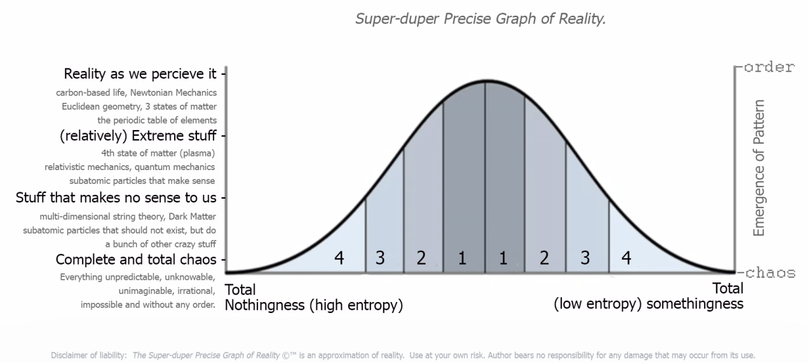

We see this sort of distribution everywhere in nature.  In fact, in the world of theoretical biology, this is called *environmental dimensionality* and describes how various biological systems coexist.[^31]  This suggests that the stuff in the middle represents the most effective expression of energy for our reality, not unlike the previous example of the blooming flower.  

#### **Claim 27:** The most likely and persistence state of anything (including ideas) that exists as a result of other states will be where the most balance exists between those other states.  

#### **Claim 28:** Order emerges most efficiently in a balanced state.  

For example, the human eye sensitivity chart below shows that a particular shade of green (555nm) is the most dominant color because this is the middle of the range of our biological sensitivity to light.  This shows that the most efficient (most energetically ordered) function of our eyes is the perception of the color green.  This makes sense as we evolved in a world that was very green thanks to chlorophyll and its oxygen producing photosynthesis.  Other life-forms have other ranges of sensitivity depending on their context or environment.  A fascinating example of this is the Movile Caves in Romania.  These caves were sealed off 5,000,000 years ago, yet within the hostile environment, rich in hydrogen sulfide gas and sulfuric acid, at least 33 news species of life have evolved and flourished feeding off the bacteria that eats rocks and other inorganic material (*chemosynthetic bacteria*).

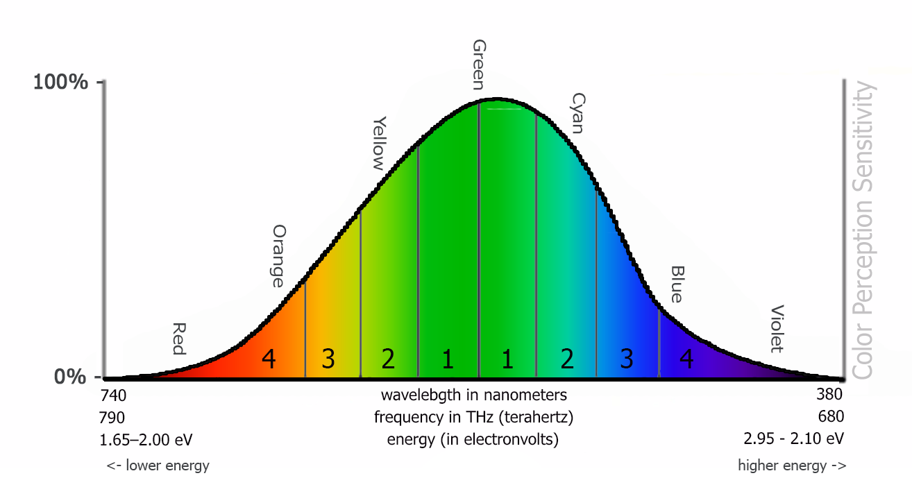

The oscillations between two states, be they the two states of chaos, or order and disorder, or any two points that are different yet can form an interaction, is the most basic form of energetic expression in all the orders of creation.  This is one area where metaphysics, spirituality, and science all happily converge: everything exists in a duality of some sort.

Were this duality to no longer exist in a state of imbalance or difference, the cycles of creations would also cease.  How, then, is a stable state of imbalance always maintained? Remember the example of the two lakes, one higher than the other? Once all the water has moved to the lower lake the water just sits there, doing nothing, and that is the end of the cycle unless somehow the water gets moved back into the higher lake.  Nature does this quite effectively by using another imbalance in another system that causes water to evaporate due to heat, heat that was created by the process of clouds of hydrogen atoms joining together (fusion) to create new elements and transmitted to earth via oscillating energy.  These evaporated molecules join together in the sky and eventually fall back to earth and find their way, via entropy, to rivers and lakes, thereby ensuring the cycle of energy-seeking-balance remains operating.  Difference must be maintained for energy to work, and what we call nature is the balancing of countless balancing processes that are themselves the result of balancing processes, etc., all the way down to the first process of balance (which we&rsquo;ll detail later).

## Waves

When we look at simple waves, such as light waves, radio waves, sound waves, we see an oscillation of energy.  This is the result of movement of energy over time.

On the atomic level, there are electromagnetic waves, such as light, X-rays, radio waves, etc.  On the material level, we have mechanical waves, such as sound waves.  On the organic level and beyond (planets, life, culture, politics, etc.[^32]) we don&rsquo;t use the term *waves*, instead, we call them *cycles*, but they represent the same thing as waves but in a different context and scope.

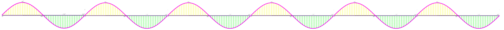

If we look at a typical wave model, which is one cycle of a quantity of energy moving over a period of time, we say that the time it takes to complete one cycle is the frequency, and the distance it covers in one cycle is the wavelength.  &ldquo;Frequency&rdquo; and &ldquo;wavelength&rdquo; are typically terms we use to describe waves of radiation and vibration, such as light and sound, but we *could* say the moon has a wavelength of about 50 million km, with a frequency of 0.00599584916 Hz, or that the migration cycle of the Arctic Tern, a bird that flies back and forth between the Arctic and the Antarctic every year has a frequency of 1/yr., with a wavelength of 70,000 km (which is how far they travel every year).  We don&rsquo;t because it&rsquo;s cumbersome, non-intuitive and fairly useless information in our current paradigm.

As meaningless as these terms are for such cases, it does not take away from the idea that these natural cycles are the expressions of the same law that light waves operate under in the transference of energy, but on a different level of expression, on a higher order of complexity, size and dependency where instead of photons we have birds and planets.

Another example might be the interdependent cycles of cohabiting rabbits and coyotes.  It might sound ridiculous to compare X-rays with prey-predator cycles, but both of them share the most basic function, the transference of energy in an attempt to create balance, just in two very different scopes and contexts. 

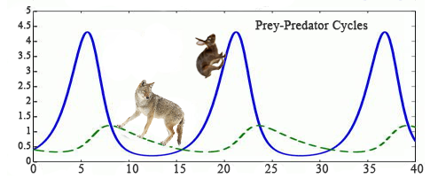


### Not Just a Cycle

It may be that there is more to waves than just a simple periodic cycle, at least in the way it interacts with its environment.  For example, when we take a wavelength that is the circumference of the world and map it across the equator, we find what seems like an inordinate number of cultural artifacts that represents incredible advances for the time, stretching over 7,000 years.  More then that, there has been a lot of speculation and research[^169] into why the Great Pyramid and Macchupicchu, or the Nazca Lines and Easter Island, fall within this same line (in image below) to within less than one tenth of one degree of latitude.  Some of the other locations, such as Perseopolis, Mohenjo Daro, Petra, Ur, and the temples at Angkor Wat, fall within one degree.  It&rsquo;s almost as if the inhabitants of earth unconsciously knew something, and what they knew had something to do with a wavelength the size of the planet they lived on.

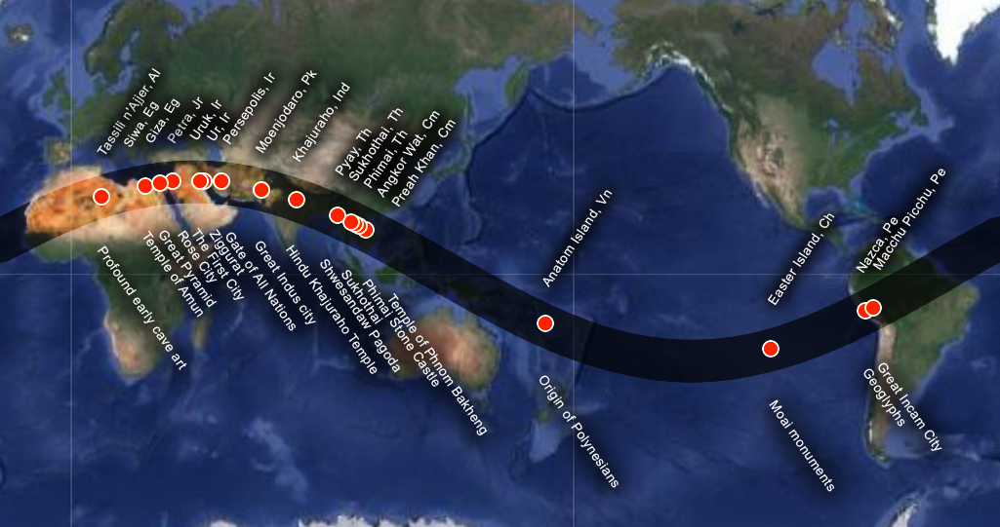

The two most common classes of waves are electromagnetic (subatomic particles) and mechanical (particles, M-waves).  If we were to compare them we would see similarities that we could also identify in cycles, such as those mentioned here, but that is beyond the scope of this book as it would be a book itself.  We can at least compare the properties of the two common classes of waves.

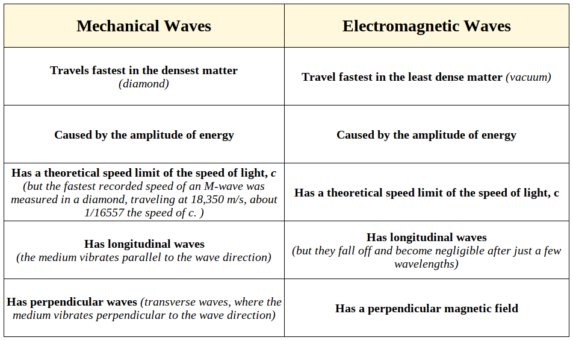

Yes, for all you physicists and electrical/mechanical engineers that might be reading this with extreme incredulity, the differences between electromagnetic (EM) and mechanical (M) waves are many.  We would expect energy to express its movement quite differently when operating under the laws of subatomic particles than that of matter, but even so, there will be many analogous parallels between the two.  

To put their contexts and scopes in perspective, consider that an electron is 100 million times smaller than an atom, and 20 trillion times smaller than a chromosome, let alone the sizes we are talking about for typical M wave medium, like things you can hold in your hand.  Compare that to the Milky Way galaxy, which is 167,256,410 times the size of our solar system, and the earth is only 1/38000 the size of that.  The difference between an electron and a beach ball is about the same difference between a beach ball and the entire galaxy.  With that in mind, consider that the ratio of the actual universe compared to the observable universe is equivalent to an atom compared to the observable universe.  It&rsquo;s easy to imagine how a fundamental law might be expressed differently at these different scales.

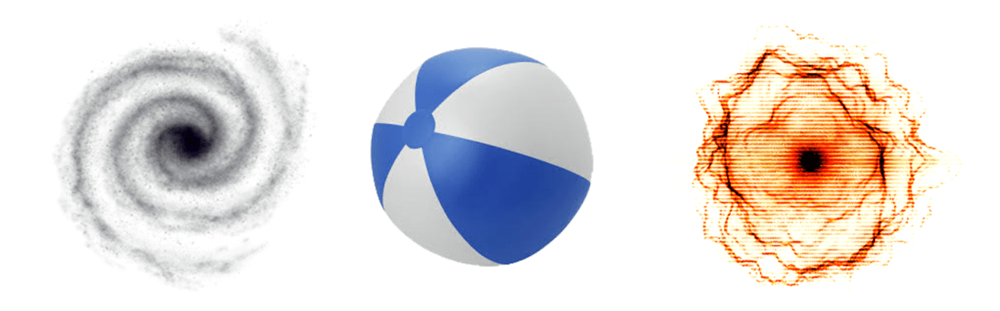

More important than the differences are the similarities, such as the way energy travels through a medium via waves.  All forms of energy are simply a redirection of energy from one state to another, as energy is neither created nor destroyed.  This is the very first law of thermodynamics, the conservation of energy.  We have identified many forms of energy: sound, chemical, radiant, electrical, atomic, mechanical, elastic, ionization, gravitational, dark (that&rsquo;s the energy causing the universe to expand faster than we think it should), so is it unreasonable to imagine still more forms of energy? Are emotions like love or fear, desires, thoughts, or even imagination a redirection of energy? And what form does that energy take? Can we say that we know of every type of medium and every type of cycle and the laws that control them? I don&rsquo;t think so, but we can begin by applying the fundamental laws of energy and cycles.

We can only recognize energy as one form or another, not as pure energy itself.  An everyday example of this is the fact that you can&rsquo;t see or detect light until the light energy hits something, like a wall or a dust particle or the optical cell in your eye. The same is true for electricity.  The real mind-bender here is that the dust particle itself is just energy (as is all mass according to *m=Ec<sup>2</sup>*), so we can only see one form of energy when that energy interacts with another form of energy.  As everything is energy interacting with energy it is easy to understand why we claim that everything that exists (i.e.  has sustainable patterns of energy and interacts with other forms of energy) must oscillate in some sort of medium.  We also claim we are not aware of every form of medium or expression of energy that exists.  

What about energy that does not oscillate, like *direct current* electricity? While it is true that the current itself has no frequency, were the electrons in a direct current not returned to the source and recycled, the current would eventually run out of electrons.  A direct current actually is a slow moving cycle of electrons.  While *alternating current* is caused by electrons staying in one place and juggling back and forth 60 times a second (in the U.S.), passing a charge down the wire close to the speed-of-light, the force of *direct current* is always in the same directions, like a river, and while it is passing the current along at the same speed, the electrons are also being dragged down the wire at about 3 miles per hour, which is the speed that they return to the source, so the cycle is pretty slow, but it is still a cycle. Energy itself does not oscillate or have a frequency. It is constant and never-changing in its pure form.  The oscillation comes from its interactions, or expressions. Direct current is the most common in nature; lightning, static electricity, bio-luminescence, solar particles, etc.

We do not have words for many things as we have yet to recognize them and therefore can&rsquo;t describe them, measure them or even identify them.  It is not just reasonable to speculate that in the realm of ideas and forms there are also cycles and a medium that is completely new to us, it&rsquo;s quite unreasonable not to, as they too are an expression of energy.

#### **Claim 29:** We can only see the interactions of energy, and not the energy itself.  

This begs the questions &ldquo;What *is* energy? &ldquo; And the answer is… are you sitting down? Drum-roll, please&hellip; *&ldquo;The ability to perform work.&rdquo;* Yup, that is the culmination of thousands of years of research and investigation in search of an answer as to why and how reality exists.  Problem solved (we&rsquo;ll come back to this later).

#### **Claim 30:** A high state of order delivers more &ldquo;work&rdquo;

## Simple Cycles

Let&rsquo;s look at the simple cycle again as the archetypal pattern that describes the movement of energy through a medium, regardless of the medium.  In some contexts, this pattern is quite measurable, in others, it is analogous, such as in the migration pattern of the Arctic Tern.

When we examine the predator-prey cycles, we can see they follow the same cyclical archetype of light, or electricity, or sound.  Below we show a typical predator pray cycle (taken from a Northern Arizona University biology online-class). On the left is the data over time, and on the right is the &ldquo;Phase plan&rdquo;, or the graph of the relationship between the two variable (wolves and rabbits).  This is a naturally occurring cycle, but you'll notice that the two cycles natural  $\frac{1}{4}$ a wavelength apart, which is the maximum difference any two waves can have.  We also see this in electricity, where voltage lags current by $\frac{1}{4}$ wave, so here wolves are acting like *voltage*, and rabbits are acting like *current*. Or perhaps, given that the electric and magnetic fields in a wave are 90&deg; apart, perhaps the wolves are equivalent to *electricity* and the rabbits, *magnetism*? 

The middle graph shows the same relationship between two waves, but for perfect sine-wave, like the kind you would see with light or energy, and beside it, relationship of a perfect circle.  This is the archetype of the predator pray cycle.  The bottom shows the same charts, but in the case of no energy, or no wolves or rabbits, and therefore represents the highest order of archetypes, which is just a dot and a line.  

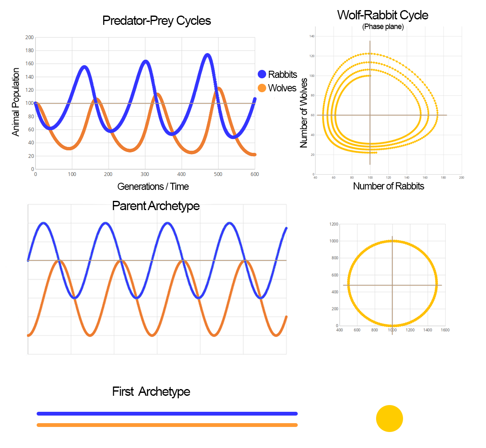

If we combine the two wolf/rabbit or sine-wave frequencies, we can see the frequency of the change between the two variables.

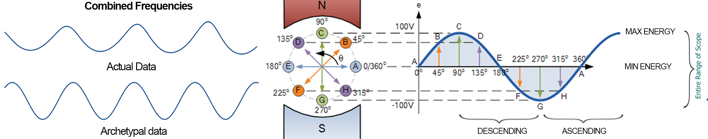

You can easily see the relationship between the oscillations of the two poles to many classic ideas of archetypal dualities, such as masculine/feminine, yin/yang, dark/light, positive/negative, etc., as well as the dualities that make up our day-to-day lives, such as day/night, summer/winter, phases of the moon and the movement of planets, the alternating current of common electricity, etc., and countless other dualities that the mind has imagined, created, or discovered since humans started observing the world around them.

In humanity&rsquo;s quest to understand reality and its processes, either through religion, culture, economics, nature, alchemy or science, we keep bumping into the same universal constants and concepts.

<div style='page-break-after: always; break-after: page;'></div>
# 6: INFORMATION

###### Information follows the same rules as everything else in nature.

We see these same patterns in information as well.  How, then, do we define *information*?

### Data

Before we can address the definition of *information*, we have to address the definition of *data*.  To begin to answer that we can say there is no data in the void of nothingness.  Data can only exist within the duality where energy oscillates within finite boundaries in accordance with specific laws of existence.  So, what is the difference between data and existence itself? Data is the static byproduct of the movement of energy.

#### **Claim 31:** Data exists only in a duality.  

In its most basic form, data is numbers, words, units of measure, and other conceptual abstractions we invented to describe the phenomena within the spectrum of existence we can perceive and use.  

If we accept the premise that everything that exists does so within the laws of creation, then we also need to accept that nothing exists that is not in perfect harmony with these laws because if they were not in perfect harmony with the laws they would not exist.  Therefore, everything that can exist does, and everything that cannot exist does not.  If that is true, then it is also true that all data is as valid as existence, as data is only a byproduct of existence.

#### **Claim 32:** Data is the byproduct of existence that we represent with conceptual abstractions.  

#### **Claim 33:** All data is valid

What, then, is information? The classic and simplest definition is &ldquo;*data that we can use to understand something*&rdquo;, which is just another way of saying &ldquo;*Information is data that has meaning.*&rdquo;

### Understanding

This raises the question *&ldquo;What is understanding?&rdquo;* Again, the traditional meaning is *&ldquo;the knowledge of why or how something happens or works.&rdquo;* This is pretty unsatisfactory, and quite arguably wrong.  At the risk of sounding Clintonesque here, debating what the definition of &ldquo;is&rdquo; is, the words *&ldquo;use&rdquo;* and *&ldquo;understand&rdquo;* are completely subjective and offer no real definition, and with the word &ldquo;work&rdquo; defined as simply *&ldquo;to function or operate according to design&rdquo;*, this entire definition is vague, as best.

Can we come up with a better definition of the words *knowledge* and *understanding*?

To know something&rsquo;s function and purpose is the fundamental goal of the science, philosophy and even religion, as these disciplines require a demonstrative understanding which we can see in their relative forms of reasoning.

Like in the dancing-woman-in-the-dots example, we can perceive something that is little more than subjective projection and has no basis in reality.  In fact, it is this human ability to &ldquo;recognize&rdquo; things in meaningless images that brought about the famous Rorschach inkblot test as it seemed to be a good way to see how a person perceived the world by seeing what patterns they projected onto the random images.

In the world of philosophy, this knowledge-as-projection is exemplified in the *cow in the field problem* first posed by American philosopher Edmund Gettier.  It goes like this:

> A farmer is concerned his prize cow has gotten lost.  A neighbor comes to the farmer and tells him he saw the cow in his field.  Just to double-check.  the farmer visits the neighbor&rsquo;s field and sees the familiar black and white shape of his cow.  Satisfied, he goes home.  The neighbor also decided to check.  The cow is in the field, but it&rsquo;s hidden behind some large bushes.  Caught in the bushes, however, is a large sheet of black and white paper.  It is clear that the farmer saw this and thought it was his cow.  The question is then: even though the cow was in the field, was the farmer correct when he said he knew it was there?

This was meant as a criticism of the popular definition of *knowledge* as *justified true belief*, meaning, if you believe something and it is both factually true and verifiable, then that is *knowledge*.  This is a terribly misguided post-modern idea of knowledge, in my humble opinion, because by this definition the dancing-woman-in-the-dots *is* knowledge, as it satisfies all three conditions.  By this definition, *understanding* is vulnerable to subjective perception, which is wildly unreliable, at best.

Simply *knowing* the details of a situation is not the same as *understanding* them.  We can see this in the countless cases of confusing or challenging situations that demand critical decisions that inevitably fall prey to our conscious or unconscious beliefs, desires, and fears.  We can see this difference even in less dramatic situations, such as the knowing all the details about camping, and actually camping, or the difference between the map and the terrain.

Therefore, a better definition of understanding might be &ldquo;the knowledge of something sufficient enough to be able to make verifiably accurate statements regarding said thing.&rdquo;

### Verification

But this too falls short depending on what *verifiable* means.  For example, four people have to solve the following puzzle:

What is the next number in this sequence? 91715

Bob says &ldquo;1&rdquo;, and Carol says &ldquo;3&rdquo;.  Bob defends his answer by showing the obvious; that 71 is 20 less than 91, therefore 51, being 20 less than 71, is the obvious pattern.  Carol, however, says it is 3 because 917153 is, in fact, a sequence of numbers in *pi* (&pi;).  Ted also says &ldquo;1&rdquo; but because 9+1=10, 7+1=8, therefore 5+*x* = 6, so *x* must be 1.  Alice says &ldquo;9&rdquo; because that would result in three prime numbers 11, 13, and 17 using the 2D lattice she made to solve the problem.

All four people have an understanding of the problem and the ways in which it can be solved, and therefore all four answers are verifiable.  It&rsquo;s not unlike when you ask a child what is 1+1, and she confidently answers &ldquo;Six.&rdquo; When asked why 1+1 = 6 she says: *&ldquo;I had one white cat and one gray cat, now I have six cats; two white cats, two gray cats, a black cat and a cat that is all colors&rdquo;* referring to her two cats and their 4 new kittens.  Not only did 1+1 equal 6, but it came in many colors.

As silly as this sounds, her answer was quite accurate given the context and the scope of a child&rsquo;s understanding and the context of *&ldquo;1 (female cat) + 1(male cat)&rdquo;*, which is not at all an irrelevant detail, especially to the cats.  We can see the &ldquo;error&rdquo; here as the child not being able to properly identify the differences between the overlapping contexts of math and animals.  We should not be quick to judge this child because we have to assume that even the greatest thinkers will make the same &ldquo;error&rdquo;, albeit with more complex contexts, because this discernment is a product of our neurology, the brain being a big pattern recognition machine.  Unless we have the ultimate brain, we can&rsquo;t recognize everything.

Understanding is contextual and only relevant to the degree that it applies to the matter in question and why the question was asked in the first place.  Even the concept of &ldquo;1&rdquo; is contextually relevant.  We may have 1 dollar or 1 day, but what does 1 mean if we say we have 1 puddle plus 1 puddle? We either have 2 puddles, or, if they are connected, we have a 1 big puddle, and now &ldquo;2&rdquo; is the not the unit count of puddles, but the relative volume of the puddle, i.e.  1 puddle that is 2 times as large.  If we drop 1 rock into a lake, we have 1 wave function.  If we drop 2 rocks in a lake we have 2 wave functions, but in this case, &ldquo;1&rdquo; really means $A\cos( kx-\omega t+\varphi )$ and 2 really means $W2( x,t) =Acos( kx−ωt+φ)$, as these describe the waves caused by the rocks in water.  *&ldquo;This makes sense*&rdquo;, you may be thinking, but what happens if we take 1 particle traveling at $x$ speed, and smash it headfirst into another particle traveling at $x$ speed? You might think that the particles smash into each other at the speed of $2x$, but you&rsquo;d be wrong if $x$ was the speed of light, because, at the speed of light $1+1 = 1$ in this case, at least according to the Theory of Relativity.[^33]

So, let&rsquo;s modify the meaning of understanding to the following claim:

#### **Claim 34:** Understanding is &ldquo;the knowledge of something sufficient enough to be able to make verifiably accurate statements regarding said thing within the context of its current application.&rdquo;

With this definition, Bob, Carol, Ted and Alice can all make statements based on their understanding, but none of them are verifiable unless we know why the question was asked.  If the point was to see if they had reasoning abilities, they are all right, and so was the little girl, according to their relative reasoning abilities, and the specific question itself is irrelevant as any number of questions could be asked to get the same results.  If the point of the question was to try and recover the last digit of a telephone number, there&rsquo;s a 10% chance any one answer is correct, including the little girl&rsquo;s answer, and the question was still meaningless.

We can now answer the question &ldquo;How do we define *information*?&rdquo; If we accept that all data is valid and is therefore *information* that is merely undiscovered due to our limited understanding of its relevance to context, *information* now can be defined as the following claim: 

#### **Claim 35:** Information is &ldquo;relevant data that we know how, when and where to apply given our understanding of the applicable context.&rdquo;

In short, information is *relevant data*.

## Data to Information

Data, being an abstract byproduct of everything, is, by itself, meaningless, just as the existence of matter is, by itself, meaningless.  Data alone is the conceptual equivalent of chaos.  It creates nothing, has no energy, meaning, direction, form or pattern.

#### **Claim 36:** Data alone is chaos.  

Information, at least one form of it, is when we can find patterns or laws in the chaos of data, or when we can apply data to an existing pattern or law.  We can go so far as to say *information* is the result of energy being applied to data.

There are many examples of this in nature, of order emerging out of chaos.  The simplest example is the *standing wave pattern*.

### Standing Wave Patterns

For those who do not know what a *standing wave pattern* (SWP) is, it is a stable pattern that results from cycles of energy, transmitted as waves, interacting with matter.  

Here is a collection of SWPs that were created by placing white powder on a drum head and exposing that drum head to various stable sounds, like a single tone, or a collection of single tones.  This process is called *cymatics*.

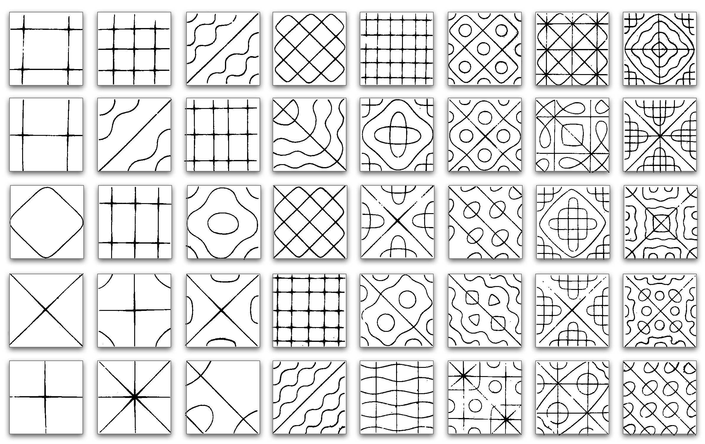

Here are some more complex cymatic patterns from the twelve notes of the first octave of a piano.

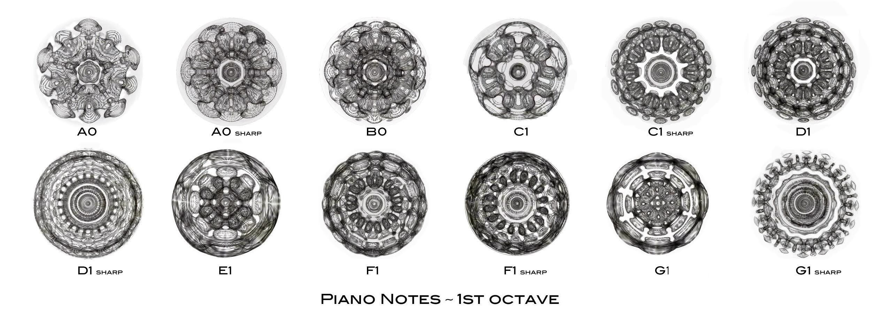

The difference between data and information is analogous to the difference between chaos and order, that difference being exclusively energy.

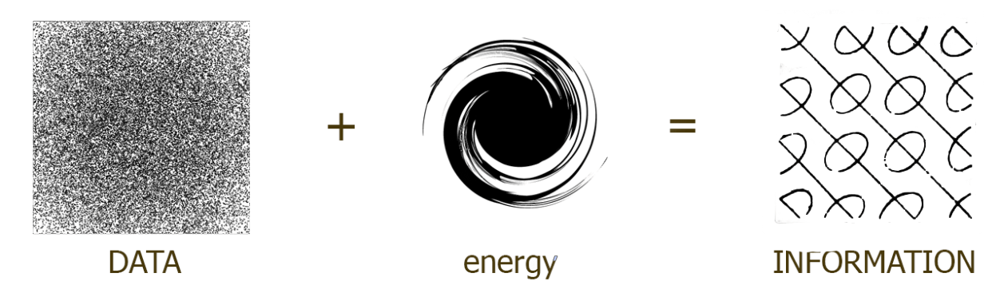

We have moved from *data* to *information* to *knowledge* to *understanding* in the following manner, more or less.

- Data + *order* = information
- Information + *context* = knowledge
- Knowledge + *application* = understanding

What comes next? How do all these *understandings* we have discovered relate to one another?

Attempting to answer this question is what gave rise to the entire field of Western philosophy.  In fact, the word *philosophy*, which literally means &ldquo;love of wisdom&rdquo;, was invented 2,600 years ago by the Greek mathematician, philosopher and religious mystic, Pythagoras, as the field of study dedicated to understanding how reality is put together.  A few years later, Parmenides, perhaps the most profound and challenging thinker of the Greek philosophers, came up with the idea of categorizing all that was understood about existence.  Today this is called *ontology*, which is hierarchical in nature and comes from the Greek &ldquo;the study of that which is.&rdquo;

#### **Claim 37:** All information is hierarchical.  

Needless to say, there has been a lot of discussing, researching and testing over the past thousands of years on the best way to organize &ldquo;that which is.&rdquo;

## Holarchies

In 1972 Ervin Laszlo, philosopher, theorist and two-time Nobel Prize nominee, published &ldquo;Evolutionary Systems Theory.  Introduction to Systems Philosophy: Toward a New Paradigm of Contemporary Thought.&rdquo;[^34]In that book, he incorporates *Living Systems Theory* and the hierarchical structures of Mario Bunge, a giant in the field of semantics, ontology, epistemology, philosophy of science and ethics, and recipient of twenty-one honorary doctorates and four honorary professorships by universities from the Americas (North and South) and Europe.

Laszlo&rsquo;s challenge was to provide a framework for understanding universal structures that span the scopes of subatomic physics, through biology, chemistry, organisms, and social systems to the cosmos.  Laszlo describes a hierarchical model of interconnected conceptual entities.  When one of these entities is acting as a *part* of a larger entity, it is called a *parton*, and when acting as a *whole* entity with its own parts, or *partons*, it is called a *holon*.

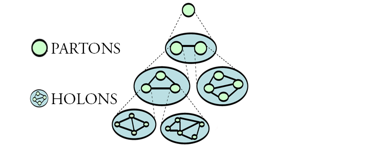

The *holon* represents the *wholeness of its nature*, and the *parton* represents the integrated *part* of the greater *holon*.  The hierarchical ordering of *holon/partons* is called a *holarchy*.  An example of this is the biological cell mentioned previously.  The cell itself would be a *holon*.  The transcoder and other components necessary for the cell to function would be considered *partons*.  Likewise, the transcoder is also a *holon* with its component *partons*, and the cell itself is a *parton* to, say, an organ.  This makes the holarchy somewhat fractal in nature as the structure of the entire hierarchy is self-replicated in each of the holons.

#### **Claim 38:** The structure of information is fractal (self-similar and redundant)

The holarchy is a map of all the concepts of archetypes we have collected and attempts to organize these concepts in a hierarchical fashion.  As each parton is a child of a holon it naturally inherits the scope of its parent.  It is these scopes that define the order.  Each holon has a unique scope, and this scope is what defines the spectrum of possibilities, the Bell curve of probability, for any particular holon.  For example, within the holon of *person,* you will only find *person* things and not *planet* things.

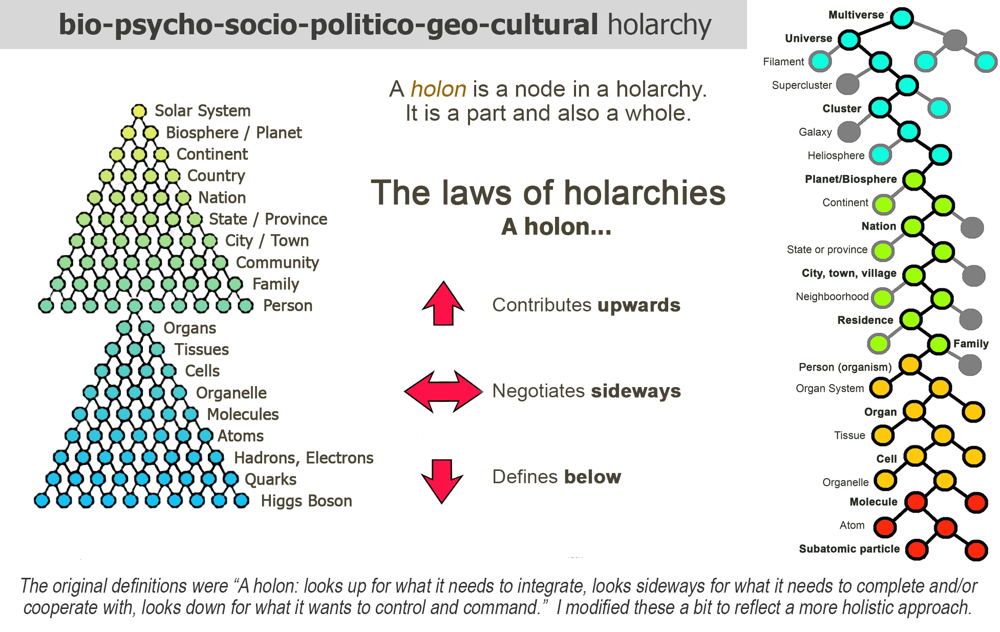

The graphs above represent a very small subsection of the Grand Holarchy of Everything.  The chart on the left shows a larger picture of how partons and holons relate to one another.  The chart on the right shows one of the many paths that connects subatomic particles to the multiverse.

With a few tweaks to the previous *Super-Duper Graph of Reality* Bell curve, making the right axis more logarithmic rather than linear, this model fits nicely on top of it.

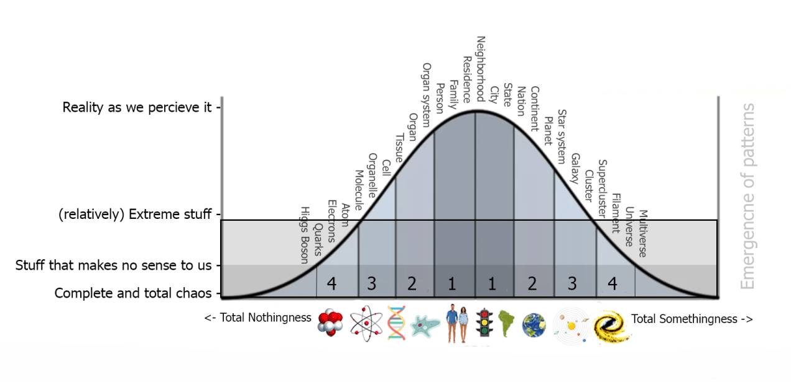

Some readers may be thinking &ldquo;Hey, wait a minute&rdquo; those aren&rsquo;t the same axis! What kind of Gaussian goofiness in going on here?&rdquo; Well, that is partly true.  The first Super-Duper Graph of Reality chart shows the probability (x-axis) of where order (y-axis) will be more likely to emerge across the entire spectrum of existence while this one is limited to the spectrum of human perception.  

*Sidenote: This Super-Duper graph is also a bit out of alignment if we consider that the general size of living things on planet earth is pretty much in the middle of the scale between an atom and the size of our sun, which supports the same idea that the most optimum form of expression will exist in the most balanced state between opposing poles if we consider the sun as a major contributing factor in defining the scope of our earthly reality.  As this graph is based on concepts rather then size, we only see a general relationship with size.  Still, given the quark has a size of about 10<sup>-18</sup>m, and a supercluster is around 10<sup>+18</sup>m, our conceptual map is not too far off from the an actual size map.*

If we assume that our perceptions of reality are fairly compatible with reality as it actually exists, then, as probability would have it, we humans happen to be in the part of the spectrum where one would most expect to find life popping up, so, congratulations to us, we&rsquo;re where we are supposed to be&hellip; probably.

Because the peak of the curve represents where the most &ldquo;work&rdquo; will be done (given the two poles that define the limits of the curve), it is also where energy will most likely be able to form sustainable patterns.  The peak of the curve also represents the most efficient expression of a holon&rsquo;s purpose and function.  If we were electrons instead of humans, our archetypal holon would have the electron in the center, because, as the electron *does* exist, it would naturally occupy that point where its existence is most likely&hellip; in the peak of the curve for the electron holon.  However, because life forms exist in the peak of the curve that spans from quark to multiverse, perhaps we can speculate that life itself is the primary function of reality and that the consciousness that comes with life being the highest form of expression of life.  This is not to say that there are no other forms of life that may excel in this regard, especially where radically different contexts may apply, but if there are other forms of life in our corner of the universe, they will most likely appear within the same range of the curve.  More then appearing in the same area of the curve, they will probably appear similar to their earthing cousins.  If the Pleiadians (or wherever UFOs come from) ever land a UFO on the White House front lawn, we will all be surprised, and a bit disappointed I suspect, when what emerges looks like… a human.  At least that is the opinion of an Oxford University&rsquo;s evolutionary biologist Sam Levin.

>[Aliens, like humans] are made-up of a hierarchy of entities, which all cooperate to produce a [lifeform].  At each level of the organism there will be mechanisms in place to eliminate conflict, maintain cooperation, and keep the organism functioning.[^164]

For consistency, here is the human eye sensitivity chart as well with the new y-axis and its shading, which represent a singular holon of *human eye* in the *bio* branch of the hierarchy.

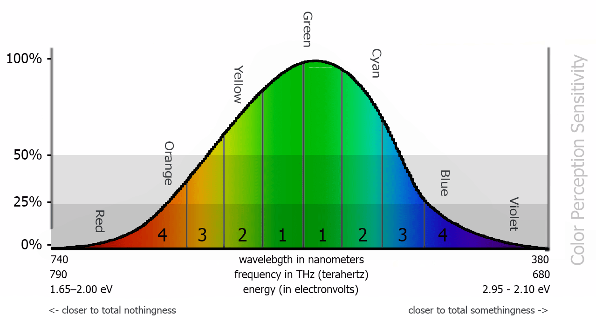

#### **Claim 39:** Each holon has its own set of parameters, laws, and context and each holon has the ability to spawn new holons.  

#### **Claim 40:** Holons, or archetypes, are interdependent on one another, as well as independent.

Another excellent example of both a holarchy and its self-similar nature is that of the neurological structure of the brain&rsquo;s  memory processes along with the structure of language that evolved out of that structure.  This also shows examples of the various scopes through which instances are expressed.

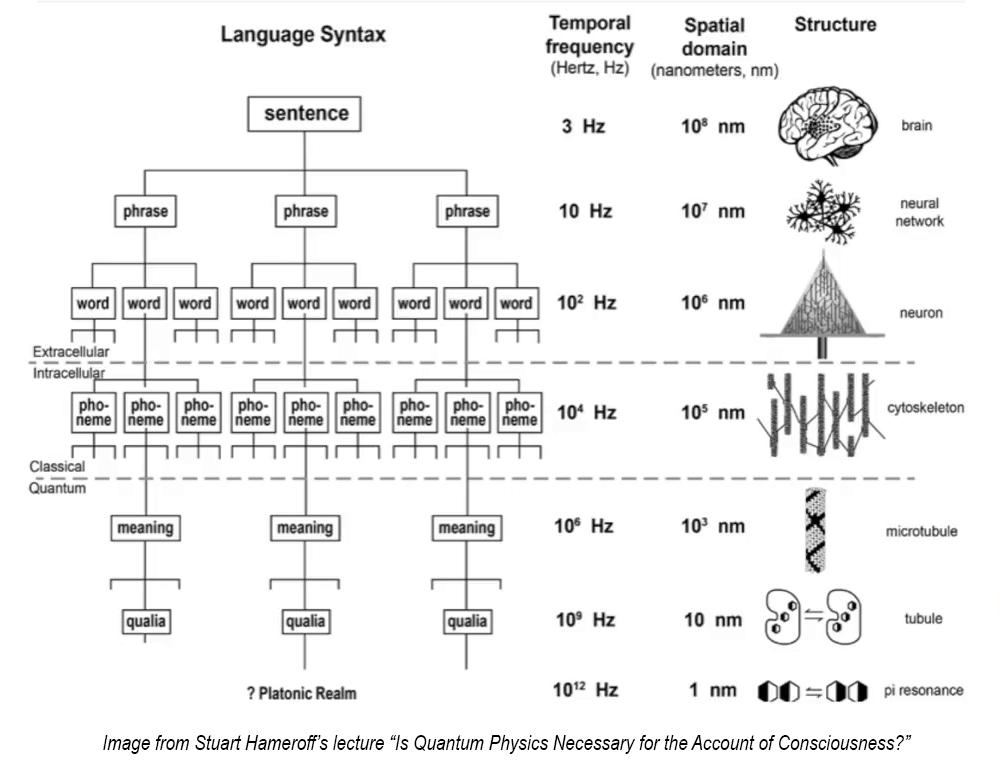

## Memes

More recently, this holarchical model was applied to Richard Dawkins concept of a *meme*[^35].  A meme is defined as:

> an element of a culture or system of behavior passed from one individual to another by imitation or other non-genetic means.

In Dawkins own words[^36]:

> &ldquo;Memes spread through the culture like genes spread through the gene pool&rdquo;

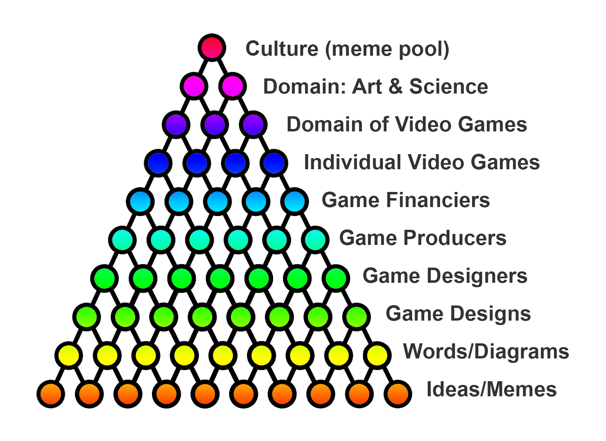

This is relevant at this point to demonstrate how the concept of a meme can be incorporated into a holarchy.  The original version of the  chart above comes from a Velikovsky paper on video games and their potential to increase intelligence.[^37] The part that is interesting is how Velikovsky puts the meme at the bottom of the cultural branch.  It is interesting because it defines a meme as a seventh-generation descendant component part, a particle, so to speak, of the *uber* concept of *culture*.  The meme here is analogous to what the electron is to the atom, or the atom to the molecule, or the molecule to the object.  He also puts *ideas* down there as well, which may be consistent with the way he is defining an idea.  In our case, we are defining *Ideas* (capital &ldquo;I&rdquo;), like forms, as the archetypal blueprint for many instances of ideas.  The idea of *&ldquo;Let&rsquo;s make a video game where people have to shoot each other&rdquo;* is an instance of the Idea *&ldquo;Individual or tribal competition and survival&rdquo;*, which also spawns such concepts as sports, war, capitalism, the idea of winning, etc.  The idea of *&ldquo;If I sin, I will burn in hell&rdquo;*, a very resilient and popular meme for thousands of years, is an instance of the Idea *&ldquo;We are judged harshly by our superiors for being self-serving&rdquo;*, which spawn such concepts as karma, judgment day, guilt, original sin, etc.

The holarchy examples shown above are portrayed as 2-dimensional bifurcating trees, but this model hides a lot of information, for if we zoomed in, we would see that within each holon is a collection of holons that share an idea, purpose, function, etc.  Each holon has its own parameters, laws, context, etc., and each holon, therefore, has its own Bell curve that shows where it is best suited to &ldquo;work&rdquo;, such as the Bell curve of the human eye sensitivity, which would be one holon of &ldquo;human eye&rdquo;.

These Bell curves of probability are not shown, or even defined, in the holarchic model.  The reason for that is because the holarchic model does not have the explicit concept of a duality, though it implies them.  As a result, the holarchy cannot show how the Bell curve of a holon is made up of the integrated aggregate of the Bell curves of its partons within the context of the holon.  It does show the parameters of the holon are defined by its parent, but the ultimate parent of the holon is the Multiverse, which is, in our view, the &ldquo;bottom&rdquo; of the hierarchy, for reality, as we know it, requires there first exists subatomic particles.  In some way, this is like arguing which is the &ldquo;correct&rdquo; way to view the earth, north at the top, or south at the top, but it does play an important role a little later.

What happens if we incorporate the idea of dualities into the holarchy?  Let&rsquo;s see, but first let&rsquo;s look at some important concepts behind *structure*.

<div style='page-break-after: always; break-after: page;'></div>
# 7: STRUCTURE

###### Knowledge and information, like form, has a structure which follows the same rules as form.

Everything up until now was to introduce some of the main concepts that we will be returning to and depending on as we move forward, as well as to touch on the main ideas that lead from the ultimate simplicity of a duality to more complex structures that describe the reality we actually live in.

On a practical level, this complexity is no different than how we deal with the physical world in our every-day lives.  When you hold a brick in your hand you are holding trillions of atomic particles, with countless interactions, fields, energy levels, etc., but you don&rsquo;t need to know that to build a house of bricks.  When you drop the brick and it falls, you&rsquo;re not thinking about the nature of time, gravity, and warped space.  Likewise, to manage the &ldquo;bricks&rdquo; in the realm of Ideas, you also don&rsquo;t need to know all of the details, but it is helpful if you have an idea of how they generally interact with each other so you don&rsquo;t try and build a &ldquo;house&rdquo; made of &ldquo;bricks&rdquo; and &ldquo;oranges&rdquo;.

That said, let&rsquo;s touch on one more concept that is fundamental to the structure in general.

## How Many Dimensions Are There? 

When we say something has three dimensions what we are really saying is something that exists within the same multidimensional reality that we exist in, and under the same conditions, has three relative measurements of height, width, and length that indicate the difference between two relative points.

When we say a nail is two inches long, we are referring to the difference between the position of the head of the nail, and the position of the tip of the nail, for one axis only.  We have no idea what the universally absolute coordinate system is, but we assume it is the same for everything in our reality.

An object actually has many, many dimensions, it&rsquo;s just that the only ones that matter to us are the three we use, because all the other dimensions remain the same (enough) for all things that are in the same system (planet earth, for example).

Imagine that the speed of light was 55 miles per hour.  If you were to stand on the side of a highway, all the cars would look extremely squished, like a few millimeters in length, but the car&rsquo;s mass would also be much larger.  On top of that, time *inside* those cars would be much slower.  Space-time measurements would be very strange if we had to deal with two different space-time contexts.  Because everything we deal with exists in the same space-time context, when I need a part for my car delivered tomorrow that is 1"x2"x3", when I order it I am confident it will be 1"x2"x3" and arrive within 24 hours because I assume that whoever I ordered that part from lives in the same reality and context as me, and is not an alien-owned intergalactic warehouse in the 4<sup>th</sup> dimension traveling close to the speed of light through a worm hole.

The classic explanation of a dimension goes something like *&ldquo;If something has only one dimension you only need one number to know its exact location.&rdquo;* In the case of 1-dimension, like in the number line below, if there was a dot on number 6, the dot has a dimension of 6.

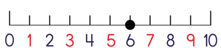

This is true when, and only when, the position of the measurer and the thing being measured share the same context, as the value of 6 is only relative to that context.  If we wanted to give the absolute position of the dot, we would need to include the coordinates of where in the universe that dot exists, which would require the coordinates of who-knows-how-many larger contexts it was in when it was measured; where on the planet, in the solar system, in the galaxy, in the multiverse, and all of those with the dimension of time, as they are all moving, and even then it would only be relative to the Universe as we know it.  So, even a simple 1-dimensional dot can have a lot of dimensions when measured from a different context.  Consider that when you realize that in every second of your life you travel approximately 627 km/s across various dimensions and scopes if you account for the movement of the earth, sun, Milky Way, etc.

With that in mind, and limiting ourselves to our 3D reality (we&rsquo;ll come back to the multidimensional stuff very soon), what can we say about what all *things* have in common? Well, we can say at least the following:

-   All things have (at least) 3 dimensions.

-   All things are made of other things (except the &ldquo;first&rdquo; thing).

-   All things are the most efficient form of that specific thing.

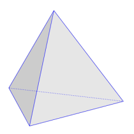

This last statement might raise a few eyebrows.  The claim here is not that any particular thing is the most efficient form of its perfect archetype, but rather the most efficient form for that particular thing under the conditions it exists in any particular moment.  

If these statements are true, then this would imply that the most primitive thing that can exist, the simplest and most efficient form possible, is the tetrahedron.  It has 3 dimensions, but it is *not* made up of other things because when you remove any one point, it collapses to 2 dimensions, and no *thing* can be 2D.  Therefore, it must be the very first *thing* to come into existence, at least conceptually speaking.

As a pattern of order, it *is* one of the first to appear in nature.  In its most obvious form, we see this structure when we stack spheres on top of one another.  If we stack other shapes, the structure will be altered to the degree the shape is not a sphere, but the tendency for all things that are connected to each other will be to form a tetrahedral structure to the degree the shape of the things connected will allow.  You may be thinking &ldquo;*Well, spheres form tetrahedrons, but cubes form squares*&rdquo;, and while this is true, because the sphere is a simpler, more efficient or primal form than a sphere, the patterns it makes are also more efficient and primal, and therefore the first pattern of order that represent the path of least resistance.  

If the tetrahedron is the first thing that can be created, this would suggest also that every *thing* that exists is ultimately made of tetrahedrons, and that they are the smallest *thing* that can exist (again, conceptually speaking).  This might sound like a radical departure from our current thinking, but it&rsquo;s not *that* radical a departure as this is exactly what *Emergence Theory: A Theory of Pixelated Spacetime&rdquo;*[^38] claims as well (more on that in a moment).  

> In our 3D quasicrystalline reality, the tetrahedron is the smallest, indivisible unit.  A 3D pixel of reality, if you will.  Each tetrahedron is the smallest possible 3D shape that can exist in this reality: the length of each of its edges is the Planck length (the shortest possible length known in physics – over 10^35^ times smaller than a meter).  These 3D pixels combine with one another according to specific, geometric rules, to populate all of space.

##### ~ &ldquo;Emergence Theory Overview&rdquo;.  from Quantum Gravity Research website.  [^201] 

The tholonic model that that this book describes suggests that the rules that apply to these 3D pixels that populate all of space extent beyond space to all of reality, including the invincible worlds of ideas, archetypes, and all forms of energy.  

## On the Small Side

Science has been grappling with the idea of tiny particles for some time.  First, we had the grains of sand and dust, then atoms, then electrons, protons, and neutrons, then finally, quarks, which, so far, seem to be the most fundamental layer of matter.  The problem is, quarks are &ldquo;almost&rdquo; infinitely small, which creates all sorts of problems because science has a difficult time with infinity.  To solve this, they came up with the idea that reality is made not of really tiny particles, but really tiny vibrating 11-dimensional &ldquo;superstrings.&rdquo; Unfortunately, for all the evidence they have found to support this theory they might as well have said reality is made up of angels dancing on pinheads.

The quark remains the undefeated champion of tinyness, but &ldquo;almost&rdquo; infinitely small is not the same as infinity small.  How &ldquo;almost&rdquo; is it? One 43 billion-billionths of a centimeter (0.  43 x 10<sup>−17</sup> meters).  Remember that number, 10<sup>−17</sup>.

## On the Big Side

Jumping to the other end of the scale we have some pretty big things in the universe, the largest we know of being the *Hercules-Corona Borealis Great Wall.* This is a gravitationally bound galactic supercluster about 10 billion light-years wide.  That is pretty, pretty big.  What could be bigger than that? How about something with 4 dimensions? Would an extra dimension increase the size of something? Well, is a 2x2x2 cube bigger than a 2x2 sheet of paper, and is a 2x2x2x2 hyper-cube bigger that a 2x2x2 cube? What would a 2x2x2x2 cube look like? In the 3D world, it would look like a regular cube, because we can only see 3 of the 4 dimensions, but turn it a little (in 4D space) and the 4D cube will appear as two 3D cubes, or a hexagonal prism, or rhombic dodecahedron, or a cuboid.

Here is what a hyper-cube (4D cube) looks like when it is rotated and projected onto a 2D space, like a shadow (orthographic projection).

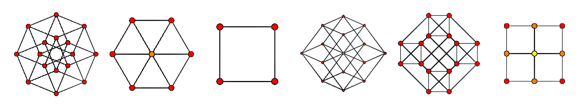

What about something that is 5D, or 6D or 7D? Each one would be bigger by an order of magnitude.  How about something that is 248D? That would be very, very big.  If something was bigger than the Great Wall in 248D how big would it appear in 3D? About the size of a small travel bag!! OK, you&rsquo;re probably thinking *&ldquo;248D!? Come on, man.  That&rsquo;s ridiculous!&rdquo;*

## Crystal Power

So, there&rsquo;s this magic 248-dimensional crystal… actually, it&rsquo;s 8 dimensional with 248 not-necessarily-spatial dimensional symmetries, but as an algebraic expression it is considered to have 248 dimensions (at least that is what I am told) called the *E8 crystal*, and this reality of ours is (presumably) but a number of 3D refractions of energy created by the various facets of this crystal that are cast upon the 3D canvas of the void that is our universe from the higher dimensions of magic-crystal-land.  As modern as this sounds, this was first proposed in the late 1800s, but it has only been recently that we have the computing power to give it a test drive.

This sounds pretty compatible with the Simulation Hypothesis.  I wonder if they know about each other? It also sounds crazy, I know, but, it&rsquo;s a real thing.  Just do an Internet search for &ldquo;*emergence theory tetrahedron&rdquo;* and *&ldquo;The theory of everything quantum symmetry E8 lattice&rdquo;* and browse through the million-plus links that discuss it in painful detail, emphasis on the *painful* part, because most of the content is unintelligible to those not intimately familiar with the algebra of differentiable manifolds, quantum gravity and a bunch of other stuff I don&rsquo;t even know how to reference.  However, that is not important to know for our purposes.

It should be stated that this theory is not accepted by all, and some scientists are definitely in the &ldquo;swarming with worms of heretical perversity&rdquo; camp regarding the magic crystal of reality.  I don&rsquo;t have any opinion about the Emergence Theory (ET) other than it sounds fascinating, mainly because I am not qualified to have an opinion.  The only reason it is being mentioned is because ET supports many of the claims that are made here, which were arrived at with no knowledge of ET.

This E8 lattice (that&rsquo;s its technical name, also called a *quasicrystal*, but *magic crystal* sounds much cooler) seems to be able to describe all sorts of things: space-time (both types, Minkowski and Kaluza-Klein versions.  Yes, we have two types of space-time, because it&rsquo;s always better to have options), fermion particles, gravity, subspace, dark matter, quarks, positrons, neutrinos, Fibonacci relationships, and a bunch of other stuff, including &ldquo;ghost particles&rdquo; (which are really, really old neutrinos that were created during the Big Bang 15 billion years ago and have no charge, no mass and do not interact with any of the forces that form matter, just like regular ghosts, but really small).

Here is a page from a paper[^39] that describes the E8 lattice.

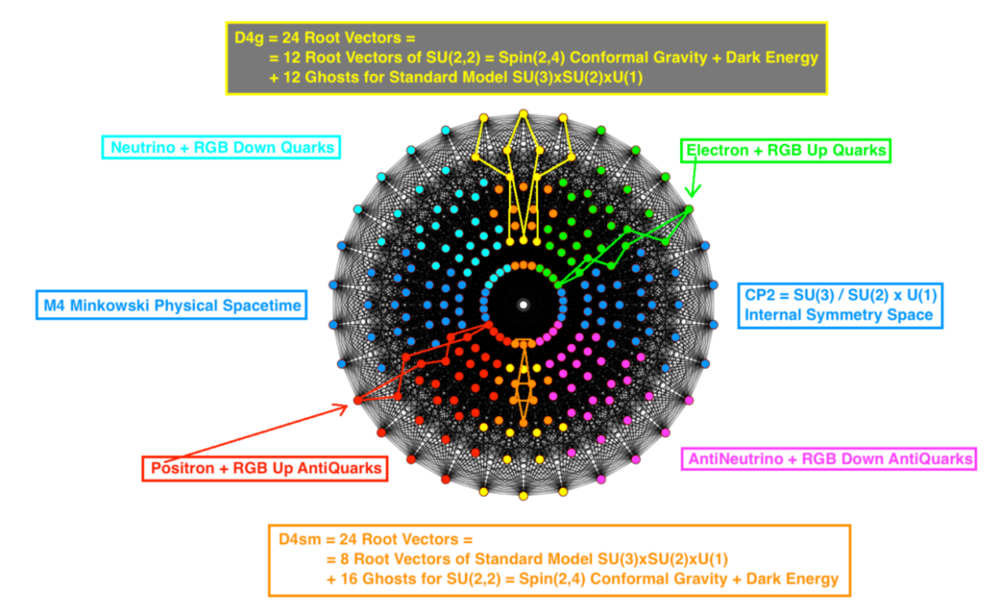

As you can see, the whole space-time part of the E8 lattice is just a small part of one of the 3D projections of an 8D slice of a 248D super-thing, leading one to wonder what other forms of reality it has the magic power to conjure up.  Not surprisingly, this E8 lattice can be deconstructed to (or perhaps is constructed by) a series of tetrahedrons.

The most significant aspect of *Emergence Theory* (for us) is their claim that:

> &ldquo;all of reality is made of information.  What is information? Information is meaning conveyed by symbols.  Languages and codes are groups of such symbols that convey meaning.  The various possible arrangements of these symbols are governed by rules.[^40]

Here are a couple of beautiful images of the countless faces of the magic E8 crystal to ponder.[^41]

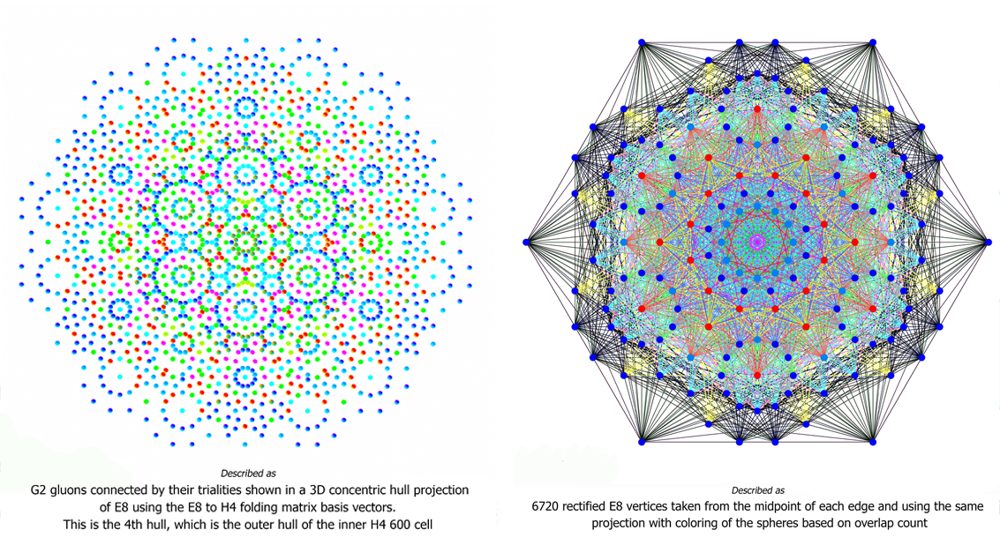

Just as a fun comparison, check out the following cymatic patterns.

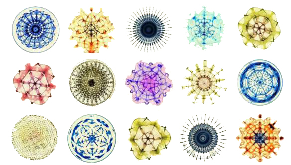

The E8 crystal of *quantum symmetry* and *emergence theory* hypothesize that all matter is a projection of countless &ldquo;pixels&rdquo; that are really, really small tetrahedrons[^165], each about 1.61 x 10<sup>-35</sup> meters in size.  Remember the size of a quark, 10<sup>-17</sup>? This is a *lot* smaller.  

It might sound like this is mixing apples and multidimensional oranges, using definitions from *emergence theory* on one side of the scale, and definitions from *quantum symmetry* on the other side, but both of these theories integrate quantum mechanics, general and special relativity, the standard model and other mainstream physics theories to form a complete, fundamental picture of a universe unfolding from implicity to explicity.  The main difference between these two models is that the *E8 Crystal* describes the mechanics of creation, while the *emergence theory* attempts to describe the syntax of its operation using the language of geometry.

#### **Claim 41:** Geometry and mathematics are the language of archetypes.  

Here we have a duality that encompasses the entire spectrum of 3D reality, at least.  On one end, the *alphahedron*, which is the smallest structure theoretically possible, that being the tetrahedron, and on the other end, the *omegahedron*, the most complex physical structure in existence, which currently seems to be the 248D-ish magic crystal.

## The Structure of Knowledge

Now we can begin to integrate dualities into the holarchy.

#### **Claim 42:** Just as subatomic particles are structured energy, atoms are structured particles, and molecules are structured atoms, information is structured data, knowledge is structured information, and ideas are structured knowledge.  

#### **Claim 43:** The concept of a thing and the thing itself are the same things on two different levels of order.  

Both scopes of matter and ideas represent how a form of pure energy in its chaotic state is converted into order using the same laws as they apply to the relevant contexts of their scope.  In one case energy is ordered and expressed as matter and in the latter case as concepts.  This is how it relates to holarchies, as holarchies can map not only the naturally occurring hierarchy of the concepts of *reality* (atoms, plants, people, etc.) but also the concept of *concepts* (domains of science, religions, culture, etc.).  

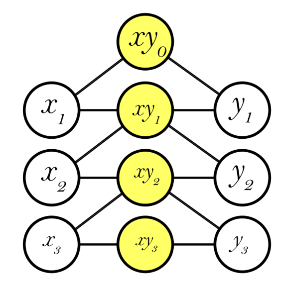

If we applied our ideas regarding duality to the holarchy it would look something like this graph (above): We start with a concept ($XY_{0}$), followed by its thesis ($Y_{1}$) , which creates its antithesis ($X_{1}$) .  Within this duality of $X_{n}$ and $Y_{n}$ , or thesis and antithesis, arises the synthesis that acts as the seed for a new concept ($XY_{1}$) .  The holarchy can only accommodate the central column concepts as it has no model of a concept being born within a duality.

This graph only shows one instance per duality, but there could be many, many instances for each duality, the occurrence of which conform to the Bell curve as defined by the *x*<sub>n</sub> and *y*<sub>n</sub> limits of each new pair.  

Some readers might recognize this graph as looking very similar to the mystical Kabbalah, or the Tree of Life, as it is also called, which has its roots in ancient Sumer.  There was no intention to arrive at such a comparison, but these similarities naturally arise whenever we are using reason to explain how reality works regardless of its understanding being scientific, mystical, or otherwise.  Any system that has order will follow a pattern, and we can see these same patterns over and over again, from the electron to the galaxy, from flowers to computer networking.  Our explanations of how realities work, whether we believe it was created by God in six days, or it&rsquo;s all a very sophisticated holographic projection, will have the same patterns of reasoning, albeit with different back-stories and interpretations of the significance of those patterns.

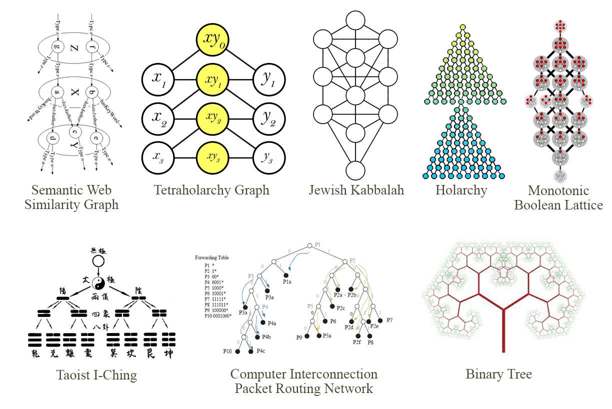

## Knowledge by any other name

We tend to think that ancient ideas were not based in science, at least in the way we describe that word today.  This is partly true, in that we had not yet discovered the laws of nature to the degree, or in the manner, we now have, but we can find incredibly sophisticated reasoning and logic in some ancient ideas that transcend geography.

Take two examples mentioned above, the Taoist I-Ching and the Jewish Kabbalah.  Both of these philosophies are based on the same concept of a reality that exists in a duality.  While the Kabbalah is a top-down model of creation that describes 32 archetypes made up of 10 archetypal states of existence with 22 archetypes of energy that connect these states, the I-Ching is a fractally bifurcated whole of 10 pairs of balanced states and 22 pairs of imbalanced states that describe 32 pairs of archetypal states of the Tao.

Both are descriptions of the same thing as seen through the contextual cultural lens of understanding.

The story of the I Ching and Gottfried Wilhelm von Leibniz, the co-inventor (along with Newton) of differential and integral calculus, is a fascinating story that exemplifies this.  it&rsquo;s a bit of an aside, but it&rsquo;s relevant and worth the read.

### Leibniz

When the Jesuits, reputed to be the intellectuals among Christian missionaries, traveled to China, they were so fascinated by the I-Ching that they brought it back to Europe in the late 1600s.  It was here that Leibniz saw the I-Ching and claimed it to be sent to him by God.[^42]

Just prior to seeing the I-Ching, Leibniz had developed (discovered?) a number system that he considered sacred.  It was the binary system of 0s and 1s, much like the Yin/Yang of the I-Ching.  It was of no practical use to anyone at the time, but that was not why he developed it.  Leibniz, a very pious man, thought that if all values could be expressed in terms of only something and nothing, on and off, yes and no, positive and negative, etc., then truly, this would be the language of life, for, as he thought, God the Creator was represented as 1, while the void was represented as 0.

At the same time he was inventing this *divine math* meant to explore the hidden secrets of reality he was also inventing the first mechanical calculator suitable not only for addition and subtraction but for multiplication as well.  His dream was to make a logical thinking device.[^43]

Leibniz was creating tools for exoteric and esoteric understanding, both based on the same logic, but within two very different contexts.

Some years later, in the middle of the 20th century, a group of modern-day holy men from the western world (called scientists), were building the first digital computer.  To synopsize the entire digital revolution into one paragraph, imagine one of these gurus saying: &ldquo;I&rsquo;ve got an idea.  let&rsquo;s develop a component that will act as a conductor when a certain amount of voltage is passed through it, and an insulator when no voltage is passed through it.  We will call this component a &ldquo;gate.&rdquo; Because this gate can only respond to one of two states, high or low voltage, yes or no, so to speak, which represents the most basic principles of reasoning, we will call it a &ldquo;logic gate.&rdquo; Any problem that can be reduced into so many yes-or-no conditions can be calculated by these logic gates.  We can use the numbers 1 and 0 to represent these states as digits.  Because the heart of these electronic machines will be made up of these yes-or-no circuits, we will call them &ldquo;*digital circuits&rdquo;*, and the digital computer as we know it today was invented.

If Leibniz was alive today to see his sacred binary math of 1s and 0s being used to usher in the greatest transformation of knowledge ever known to Man and he would recognize it as both a tool of practical use as well as a tool of great esoteric potential, a key to the secret knowledge he was looking for.

### The Source of Ideas

We like to think we come up with ideas, but perhaps this is no truer than a flower &ldquo;deciding&rdquo; to change colors when exposed to different light, or a river &ldquo;deciding&rdquo; to change course because the wolf population has increased.[^44]

Although currently not a mainstream theory, the understanding that Ideas are more like expressions of living intelligences that we have a symbiotic relationship with is currently alive and well, and has been around for thousands of years.  Traditionally, these forms of intelligence and intention were anthropomorphized into deities, angels, demons, spirits, etc., and it was understood that we use them for our purposes, noble and otherwise, and they use us for their purposes, noble or otherwise.  Today we have new evidenced based hypotheses of this same concept in the forms of panpsychism, morphic fields, collective (un)consciousness, Universal mind, etc.  From this perspective, all forms of life are simply instances of various Ideas and concepts.

One of the fundamental differences in how similar concepts evolve over time is in what and how structure is applied to the idea.  Take, for example, the idea of the biblical creation story vs.  reality-as-a-simulation hypothesis.  We can see by their similarity that they are clearly the same concept, but one filtered and defined through the belief structures of Judeo-Christian doctrine and the other through the structured reasoning of modern science.

The above was a somewhat circuitous route to get to this point of looking at knowledge as a form of structured information, and how it is not only the basis of reason but the basis of existence as well.  It was stated before that the tetrahedron is the most fundamental concept of form.  We are going a step further here and also claiming that the tetrahedron is also the structure that information takes when it forms knowledge.

How would we begin to test such an idea?  We can start in the same way we would test the idea of a tetrahedron, by deconstructing it into its even more basic component, the triangle, and if we can discover a triad of information, we can form a tetrahedron of knowledge.

Let&rsquo;s look as some example of how we can identify conceptual trinities in systems of knowledge and/or information. 

### Language

In the realm of ideas, the most important tool that man has deployed has been language.  Language transmits the reasoning behind ideas; it is how ideas evolve, how they are destroyed and how they defend themselves (which, according to Dawkins, they do, as he explains in his book &ldquo;The Selfish Gene&rdquo;).  As such, we would expect to see language embedded with the same structure as that of ideas, concepts, and forms.

Humans are sort of stuck with the language we have been using for thousands of years, and if we were to (and when we do) invent a new language it would look radically different, but it would probably function similarly because all naturally evolved languages follow a law based on mathematical statistics that also approximate the same laws of science.  This amazing pattern of language was discovered in the 19th and is called Zipf&rsquo;s  Law (which when normalized is called the Riemann Zeta Function) and is fundamental to everything form the diffraction of light to the size craters on the moon.  This is another topic, but the point here is that language evolves according to, and limited by, the sames forces that drive all evolution, growth and change.

This applies to intentionally designed languages as well.  In 1968, Aristid Lindenmayer, a Hungarian theoretical biologist, and botanist at the University of Utrecht, designed a symbolic language called *L-system* that incorporated various symbols that were bound by a set of rules.  He developed this language as a way to model and describe the behavior of plants and a variety of other organisms[^45].  The philosophy and architecture of the language were based on the observed logic of growth, i.e.  life.  Not coincidentally, this language describes self-similar systems.  This is the language of the future, but sadly, only for our digital offspring, at least not until we do some major gray matter rewiring upstairs.

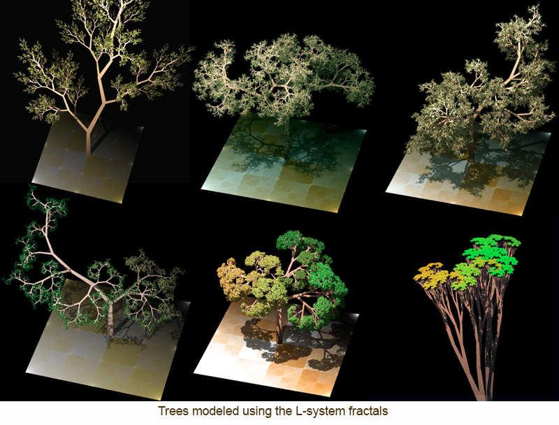

Granted, L-System language is mainly used as a modeling language, and has an alphabet, grammatical roots and rules, like human language[^160].  This is brought up to show that organically evolved systems that have had to survive the Darwinian battlefield, such as human language, exhibit similar characteristics to the highly ordered, structured, and hierarchical systems that describe life itself.  

Although human language is surprisingly efficient and still manages to function with the same structure that naturally exists in ideas and concepts, its efficiency is greatly due to our brain&rsquo;s ability to apply context and instantly run through many interpretations of words and sentence structure until it finds the most applicable interpretation.

Take the following sentence:

> I can&rsquo;t untie that knot with one hand.

The meanings of words, their order, the context of who is speaking and where they are, along with many other details, come into play to turn that sentence into structured information, or knowledge, in our head.  It is our brain&rsquo;s  language processing ability that converts the often messy structure of words into meaningfulness.  Were language more structured we might say this sentence as 

> Not \[I \[Able \[\[\[Make \[Not \[Tied\]\]\] \[That knot\]\] \[With One Hand\]\]\]\]

Although we don&rsquo;t speak this way, this is more or less how the brain re-patterns the concepts to discern meaning.

There is such a language which was developed to specifically optimize the transmissions of concepts.  It&rsquo;s called *Ithkuil*[^46].

In Ithkuil, you can say &ldquo;On the contrary, I think it may turn out that this rugged mountain range trails off at some point.&rdquo; in the following manner:

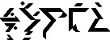

Another is *Ygyde*, for example:

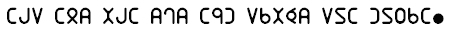

which translates to &ldquo;Yesterday evening he did not see a green tree&rdquo;

I doubt we&rsquo;ll be adopting these any time soon, but they are still fascinating.  Given what we know about the parallels between language and neurology, such new languages may provide new insight into the creation of patterned information systems (which includes reality).

Regardless of the language, they all depend on semantics, which is what makes any language work.  

### Semantics

Semantics is the branch of linguistics and logic concerned with meaning, but there are two kinds of meaning, according to the Theory of Meaning[^47].  The first kind is the more common definition of semantics.

> The description of possible languages or grammars as abstract semantic systems whereby symbols are associated with aspects of the world.  (a more objective view)

An example of this type of objective description might be the following bifurcating graph of a simple sentence.  

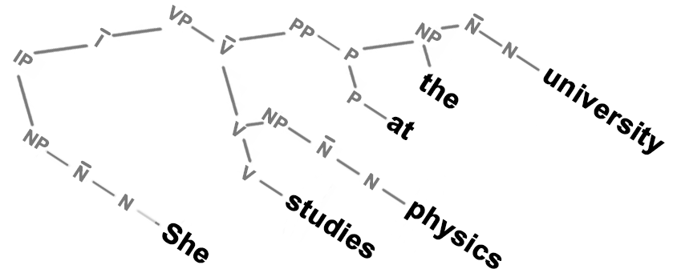

The second kind is more relevant.

> The description of the psychological and sociological facts whereby a particular one of these abstract semantic systems is the one used by a person or population.  (contextual relevance)

The *semantic web* is an Internet based project that applies these concepts in an attempt to define what information is in a manner that is structured so that computers can read data and know if it is information and, more importantly, why it is information.  It does this by creating a relationship (called a predicate) between two things (called objects).

Take the example of the following sentence:

> &ldquo;Bob is interested in the Mona Lisa.&rdquo;

To a human, this is information because we know how to parse this sentence into meaning.  That is what learning to speak is all about.  To a computer, however, it is just a meaningless collection of 1s and 0s.

If we break this sentence up into three parts and define each part in a way that software can understand, then a computer can attempt to find meaning in it.  For example, we can tell the computer that we have two &ldquo;things&rdquo;, &ldquo;*Bob&rdquo;* and &ldquo;*Mona Lisa&rdquo;*, and one &ldquo;relationship&rdquo;, &ldquo;*is interested in&rdquo;*.

With these three data points, three &ldquo;atoms&rdquo; of data, we have the simplest form of information, an information &ldquo;molecule&rdquo;, so to speak.  The &ldquo;things&rdquo; are the *objects*, and the &ldquo;relationship&rdquo; is the *predicate*.  Together they are called a *triplet*.  We may have some other triplets about Bob, such as, he is a person, he is a friend of Alice, etc., and we can bind these triplets together quite naturally.

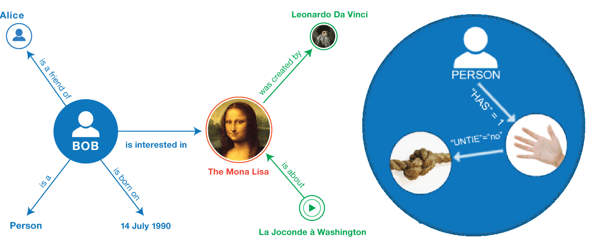

Predicates can be just about anything: &ldquo;lives in&rdquo;, &ldquo;has a&rdquo;, &ldquo;enjoys&rdquo;, etc.  Objects, however, are part of much larger, more structured hierarchies, much like the holarchies described above.  We can graph our sentence as well into something like the circle image (above right).

How does a computer know what *is interested in* or what a *person* is? It doesn&rsquo;t &ldquo;know&rdquo; the way you or I know, but it does know that a *person* is a type of *agent*, has a *family name*, a *first name* and that a person *knows things*.  So, as far as a computer is concerned, a person is just a data-set with a bunch of specific properties and relationships to other data-sets.[^48] These definitions and relationships are defined in a hierarchical manner and are called *ontologies* (if you recall, this is the &ldquo;the study of that which is&rdquo; that was originally founded by the mystic, and father of philosophy, Pythagoras).  There are thousands of these ontologies of definitions run by corporations, governments, individuals, schools, the military, etc., that cover an incredible array of data in areas of geography, life sciences, linguistics, media, social networking, medicine, catfish, diseases, road-maps, accommodations in Tuscany, etc., and they can all talk to each other by linking *triplets* together*.*[^49]

As you can imagine, a computer can create millions of connections between triplets with little effort and in a very short time.  With all these connections, we can ask the computer typical questions like &ldquo;*How many romantic comedy Hollywood movies are directed by a person who is born in a city that has an average temperature above 15&deg;?*&rdquo; Of course, social media companies, who have their own data that they aggressively collect from their users, can ask questions like &ldquo;*Give me a list of all the boys who are eligible to vote in the next election, and who listen to a certain type of music and have friends and family that are of a certain political persuasion.*&rdquo; More worrying are the queries of the near future, such as &ldquo;*Tell me all the names of people that are likely to commit a crime in the next week.*&rdquo; That may sound like paranoia about a dystopian future, but AI systems in China have an 80% success rate in predicting who is a criminal just by looking at them.  At Stanford University they have developed AI system that has a 91% accuracy rate of determining if you are gay or straight[^50], and that is just the beginning.

Language is based on rules of nature and can be deconstructed into triplets, and we can see these same rules applied to both the physiology required to support language, and language itself, as shown below.  In fact, Hameroff has directly mapped sentences onto microtubules via these tubulin proteins.

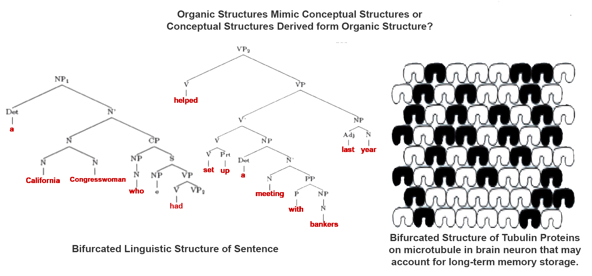

It is also quite fascinating, though not surprising, that this information encoding  is the result of the bifurcated tree structure of tubulin proteins interacting with hexagonal structures called *Ca2+/calmodulin-dependent protein kinase II*, or *CaMKII*.  The significance of binary trees and hexagonal structures will become increasingly apparent as we go deeper into the mechanics of awareness.  

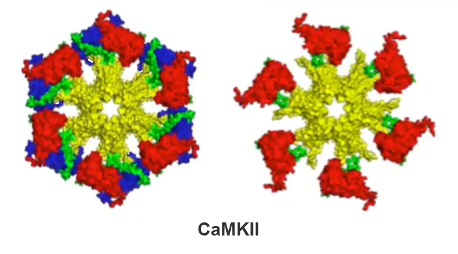

#### **Claim 44:** Information must relate to something.  

## Supply Chain

Here is a real-world example of a current project that is being developed with economists, world leaders, and investors that attempts to model the supply chain in a holistic manner in order to show how environmentally sustainable solutions can be more profitable than unsustainable solutions over the long term, and how small details along the chain can have global consequences.

The project started out with reams of data from every sector of the economy, every mode of transport and delivery, distribution, allocations, etc., etc.  It was little more than a random pile of data.  The researchers sifted through this data looking for patterns, relationships, dependencies, etc.  What eventually emerged were sets of conceptual &ldquo;triplets&rdquo; with their corresponding instances and the relationships and rules that existed between them.  The researchers had no knowledge of holarchies, yet what they developed was quite similar.

Here are some graphs taken from this project that describes the relationship between *resources*, *location*, and *sector* using the instances of *water*, *Argentina*, and *agriculture*.

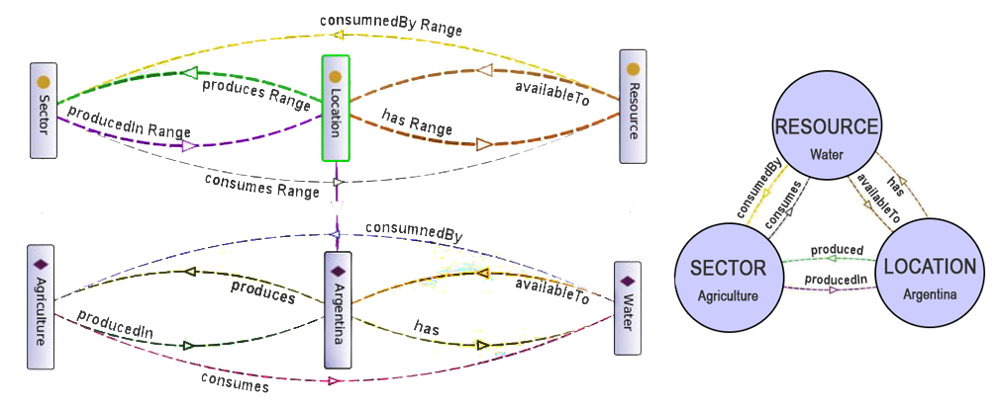

When modeling all elements of the supply chain they ended up with the following visual representation of the model, with each color representing one of the three concepts that define each context or level.  For example, one of the sets of three circles represents *resources-location-sector* level, with a real-world data-set of *water-Argentina-agriculture*.  Within one of the inner circles, such as agriculture, is information about *product-production-transport*, such as *tomatoes-kilos/yr-import/export*.  In the end, they were able to calculate the environmental, economic, and social impact that one potato had at every stage of its journey from a spud on an Argentine farm to the garbage bin at a restaurant in Paris.

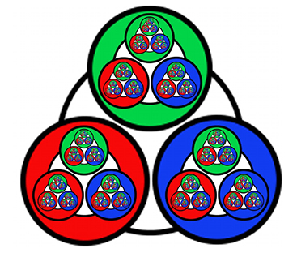

You can clearly see the triplet and holarchic design of this representation of the supply chain in the image above (left).  This would be expected if you considered a supply chain as a large-scale version of a living system.  The image on the right seems to confirm this, or at least suggest that the brain and the central nervous system is an organic living instance of a large-scale supply chain of three levels of embedded interdependency.

## Law of Laws

Earlier we used Newton&rsquo;s 2<sup>nd</sup> law as an example to show how one law has many contexts, but Newton&rsquo;s 2<sup>nd</sup> is only one of the three laws of *Newton&rsquo;s laws of Motion*.  These Laws are:

1.  Every object in a state of uniform motion will remain in that state of motion unless an external force acts on it.

2.  Force equals mass times acceleration

3.  For every action there is an equal and opposite reaction.

These are not simply three isolated laws, but rather three attributes of a greater phenomenon that describes all matter.

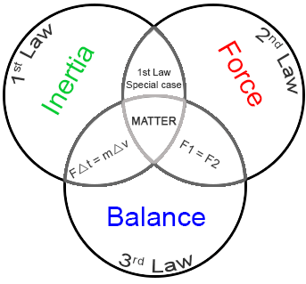

*(Later we show why these laws should be in the order of \#3 first, followed by \#1 and then \#2).*

We can see this trinity of concepts in any structured system.  Other examples might be:

## Psychology

Again, we see this same structure remarkably represented in the classic reinforcing loop between thinking, feeling, and doing, which is the basis upon which Cognitive Behavioral Therapy is built (we&rsquo;ll refer back to this a bit later).

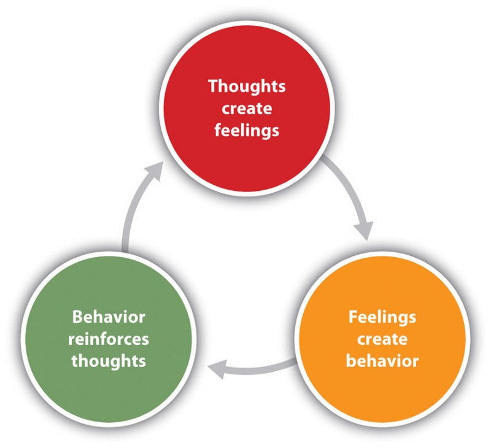

## Music

The relationship of music to trigrams is so profound that it deserves a book unto itself, and many have been written, so I will only share that entire theories of music are modeled on the trigram, such as the *Tonnetz* (German for *tone-network*) model, which is a conceptual lattice diagram representing tonal space first described by Swiss mathematician, physicist, astronomer, geographer, logician and engineer, and one of the greatest thinkers of modern history, Leonhard Euler, in 1739.  Modern music theorists take it a step further; that of a 2-dimensional map of trigrams mapped to a spinning torus… wow!  *Note: This model of music is also used used in the chapter &ldquo;Predeterminism&rdquo;.*

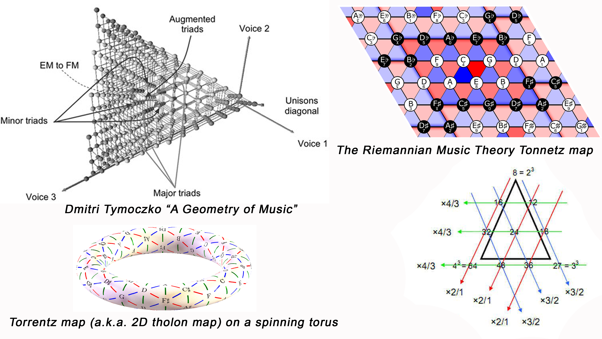

## Story

Around 335 BC, Aristotle described the dramatic structure of a story as having a beginning, a middle, and an end.  Eight hundred years later, the Roman grammarian Aelius Donatus expanded that to three-part structure of the *protasis (introduction)*, *epitasis (main action)*, and *catastrophe (resolution)*.  Finally, German playwright and novelist Gustav Freytag turned the three-part structure into a five-part structure with the *Freytag Pyramid*.  

The Freytag Pyramid can easily be defined as a trigram (below) showing the five-part structure of *incitement*, *rising actions (inflation)*, *climax*, *falling action (deflation)*, and *resolution*.  Leading up to these five parts is *exposition*, which describes the baseline of the story, the characters, set and setting,.etc.  After the five parts, there is the *denouement*, or the returning to the baseline of the natural order.  It is easy to see how the Freytag Pyramid is the classic three-part structure of *incitement (beginning)*, *climax (middle)*, and *resolution (end)* with the additional dynamics of *inflation* and *deflation*.  While it is called a five-part structure, there is obviously the sixth part, that of the baseline, the condition before and after the action described by the five parts.  

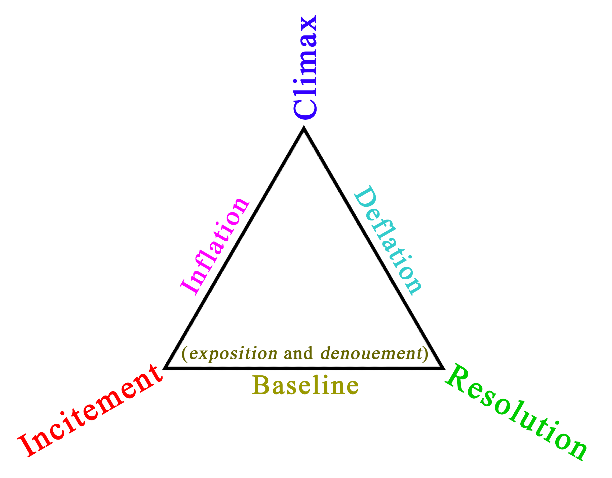

This, like all trigrams, can be self-similar fashion, i.e.  a Freytag Pyramid made of Freytag Pyramids, as when it comes to story and drama, there are usually plots within plots.  

## Reduction

The overarching ideas here is that every model can be described by a self-similar set of three axis.  This is not arbitrary, as we claim that any system can be reduced to, and described by, a collection of *information primitives* (triplets or trigrams).  From these essentially 2-dimensional *information primitives* (in that they can be described with only three points) we can build *knowledge primitives* that are tetrahedral (3D) in concept.  

Furthermore, we hope to demonstrated that these three axis are essentially three different perspectives of one state.  An example of this is how unmanifest energy is expressed as four different properties of volts, ohms, and amps, which are them capable of describing a fourth property it instantiates within the context and scope of sub-atomic particles.  These 3+1 primitives are represented as a tetrahedron.  We go even further and claim that the 3+1 dimensions of our reality (X,Y,Z, + time), is itself the most fundamental expression of this same model.  

 We will return to some more in-depth examples after some exploration into these concepts.

## Info-atoms

If our premise is that the smallest element of knowledge must conform to the same laws as the smallest elements of form, conceptually speaking, then we need to show how these 2D models, such as the holarchy, fit into a not just a 3D model, but specifically tetrahedral structures that represent &ldquo;knowledge molecules&rdquo; with an ordered self-similar hierarchy where each holon is represented as a tetrahedron of information.

Our revised model of hierarchical tetrahedrons will surely look and act differently than a holarchy.  To avoid confusion, we&rsquo;ll refer these *tetrahedron holons* as *tholons* (for obvious reasons), and the holarchy of tholons as the *thologram*.

#### **Claim 45:** Every tholon is an archetype.  

We are working from the premise that everything that exists is a product of a stable pattern existing between different states.  The simplest concept of such a duality is that of *something* and *nothing*, although the idea of a void of absolute nothingness is a bit much to grasp.  As for *something,* we don&rsquo;t need to imagine something that represents everything at once, which is not only beyond our ability, but as everything has yet to come into existence, it is impossible.  On the contrary, we only need to imagine the simplest form of something, for example, a singular dot.  A simple dot on a blank page is a diagram of the model on which this reality, and all knowledge, is based.

This simplest of concepts can explain the holarchy, tetrahedrons, magic crystals, all the laws of physics and every form of intelligence in existence.

There is a less simple, but far more interesting concept, that shows this as well, and one that everyone has at least seen, and that is the classic fractal of the famous Mandelbrot Set.  This image is actually a stability map of a very simple concept that we see all around us, iteration, which is the very definition of a pattern.   Iteration is another word for rule.  When a pattern follows a rule, it is iterative, and with all iterative rules, eventually it will either stabilize to something or nothing.  For example, $x=x+1$ is a very simple iterative rule that creates the numbers 1, 2, 3, 4, &hellip;, etc., but where does it ultimately end up?  At infinity, hence, it is an unstable rule.  By contrast, an iterative formulas such as $=x+S/x$, where $S$ is any real number, will stabilize to one value, which in this case will be the square-root of $S$. If the results of an iterative function narrow down on a number is it called *convergent*, and of the results are ever-expanding, it is called *divergent*.  But one function can be convergent sometimes and divergent at other times.  For example, $z=z^2+c$.  If $z$ starts at $0$ and $c=1$, very quickly $z$ approaches infinity, but if we use $c=-1$, $z$ simply alternates between $-1$ and $0$.  

This is exactly the formula used in the Mandelbrot set. The image, commonly called the *Mandelbrot Bug* (left), is 2D because it uses complex numbers, which are also 2D, but it is the same process.  If the formula converges to a stable number, that number is plotted as a black dot on a 2D graphs. If the number diverges to infinity, it is unstable and plotted as a white dot. The more interesting and colorful image on the right shows the same thing, but the colors are used to represent how unstable the function is, the lighter the colors, the more unstable.

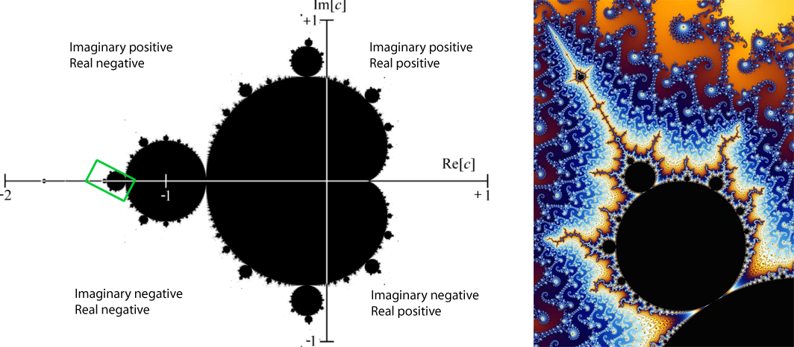

As you can see, all the interesting stuff exists on the narrow but infinitely deep frontier between the perfectly stable and impossibly unstable.  How does this apply to the thologram? It is an example of not only the stable patterns that exist (the black bug), but also of patterns that are quasi-stable, in that they exist for a time, but eventually diffuse into the nothingness of infinity.   The tholonic contention that the expansive and growing edge of reality exists in this frontier.  Keep that concept in mind as you read on.

### Geometry I

The most effective way to describe this process of emergence from a dot to everything in existence is with the language of geometry.

> &ldquo;Philosophy \[nature\] is written in that great book whichever is before our eyes -- I mean the universe -- but we cannot understand it if we do not first learn the language and grasp the symbols in which it is written.  The book is written in mathematical language, and the symbols are triangles, circles, and other geometrical figures, without whose help it is impossible to comprehend a single word of it; without which one wanders in vain through a dark labyrinth.&rdquo;

##### \~Galileo Galilee, 1564-1642

> &ldquo;It is the glory of geometry that from so few principles, fetched from without, it is able to accomplish so much.  &ldquo;&rdquo;

##### \~Sir Isaac Newton

> Tao generates the One.  The One generates the Two.  The Two generates the Three.  The Three generates all things

##### ~Lao Tzu, Dao De Ching

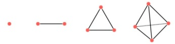

We are taught that the progression from point to tetrahedron follows a very clear and simple path of *point → line → trigram → tetrahedron*.

From the tholonic perspective, this is a very incomplete description because it considers any point to be just like any other point, but they are not the same, as each point has very different attributes.  If we ignore those attributes, we are blind to what geometry can show us about so much more than shapes.

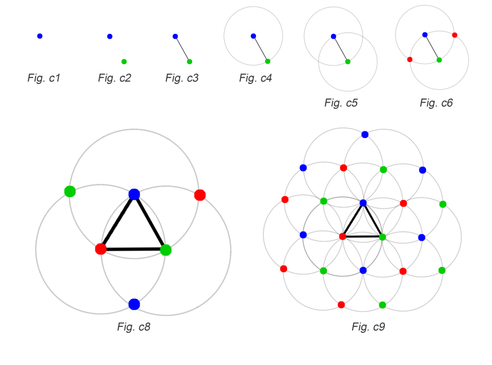

We start with a 0-dimensional dot represented by a blue dot in the middle of nothing *(**Fig.  c1**)*.  Because it is 0 dimensions and surrounded by nothing, it only exists as a concept.  It has no form, no dimensions, no properties other than that it is a *concept* of a point that exists.  But where does it exist? It can&rsquo;t be measured, seen, or interacted with in any way, so how can we say it even exists? We can only say it exists because of the awareness of its existence.  The only difference between a void of nothingness and a void of nothingness with an imaginary point in it is the *idea* of an imaginary point in a void of nothingness.  Without the awareness of its existence, the void of nothingness would simply remain a void of nothingness.  This is our first duality, that of *nothingness* and the concept of *somethingness*, and also the first condition of imbalance.

This next step requires some philosophical conjecture because we have to ask why/how does a 2<sup>nd</sup> (green), dot appear (***Fig.  c2***).

If we accept the premise that everything that is created has the attributes of, and limitations of, whatever created it, then, the answer is clear and simple.  As this lone imaginary dot in the middle of infinite nothingness only exists as an awareness of the concept of a point in the middle of infinite nothingness, the one attribute this point *can* have is awareness, as that is what it was created from.  And what was this awareness?  We can on only presume that it was the most fundamental form of awareness, that being the awareness of existing (which is not the same as the meta-awareness of being aware that one is aware).  Additionally, being the only awareness that exists, it is virtually *unlimited awareness*.

There is one more attribute it has as well that is far less obvious, and that is *intention*, because whatever awareness conceived of a point in nothingness had to have the intention to conceive of it.  So, our point in the middle of infinite nothingness has two attributes; awareness and intention.  The nature of that intention is addressed further on.

We see this same concept, that of creation being the result of awareness and intention, in the spiritual texts of every major belief system (except Buddhism, which has no concept of a divine being).  For example, in Jewish, Christian, and Islamic lore, when Moses asked God what his name was, God was quite specific about this and not only told him his name was &ldquo;I Am That I Am&rdquo;, but also informed Moses he was but a messenger of &ldquo;I AM&rdquo;, a messenger of the most fundamental form of awareness.  Interestingly, the verb &ldquo;I AM&rdquo; in biblical Hebrew can also mean &ldquo;I Will&rdquo;, as there was no *past* or *future* tense in those days, only *finished* and *unfinished* tense, so the act of being *what is* and being *what one wills to be* are one in the same as far as past and future goes, but has two states, one that is *finished*, and one that is *unfinished*, or *that which is* (awareness) and *that which will be* (intention).

We also see this in physics.  Take the example of energy, mass and light, as we briefly addressed earlier.  Light has no mass, and without movement, it also has no energy and only exists as the concept of a 0-dimensionless point.  Without movement there would be nothing to measure nor would it interact with anything.  This conceptual point, a result of *awareness*, only has properties when it moves (speed, frequency, amplitude), and this movement is an expression of *intention*, making light the purest expression of the awareness and intention that created, and creates, reality.

This may sound like we&rsquo;re teetering on the edge of mysticism, but this is not our goal.  We simply are following the most reasonable path that our ability to understand our reality allows.  The fact that it suggests that all of existence is a form of awareness that is ever becoming aware of itself is not mysticism, it is a hypothesis of reality.  Science is slowly beginning to consider that there might be a relationship between awareness and reality, but at some point, it will be common knowledge that awareness is not only the fabric of reality, but it is also the energy that drives all of creation and the most powerful energy in existence.

We have seen how mass is a form of energy, and how they both follow the same rules; Newtons Second Law for mass and Ohm&rsquo;s  law.  Because of this we can speculate that mass and energy are two different instances of the same archetype of pure energy but instantiated within two different scopes or contexts.  We will take one step further and say that awareness itself is an instance of that same archetype but in an even &ldquo;finer&rdquo; context, i.e.  before there was mass there was energy, and before there was energy there was awareness.  Were this the case, it would shed light on why and how awareness is an integral part of reality, which could provide answers to the quantum mystery of how and why awareness itself is required for reality to exist.  We accept that reality is one form of energy (mass) interacting with another form of energy (electricity, light, etc., and other forms of mass-less energy), but what if reality is one form of energy (mass) interacting with another form of (mass-less) energy interacting with another form of energy (awareness)?  

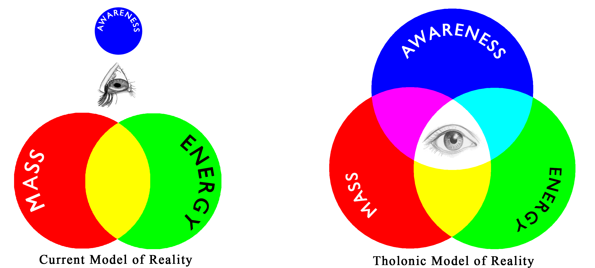

It would be very convenient if awareness was somehow map-able to $z$ (*zvolts*, a multiple of $c$ and which equals $c$ when $mass=1$) because then, if we applied Ohm&rsquo;s  law or Newton&rsquo;s  2nd, we would see that every one of the formulas requires awareness (in the form of $c$ or $z$), suggesting that nothing exists without awareness.  If this were the case, then based on what we calculated earlier regarding *zvolts*, awareness is a *field of potential* as well as a powerful *force*.  

#### **Claim 46:** Pure energy is primal awareness and intention.  Energy as we know it, &ldquo;the ability to perform work&rdquo;, is the balancing of the imbalance between states of that ever-bifurcating energy.

Elaborating on this last point of awareness and intention being the primal forms of energy could fill volumes, but, for now, I&rsquo;d like to suggest a thought experiment, or rather a different perspective, regarding awareness and one of many possible purposes of existence.  Imagine that individual awareness is metaphorically similar to an electron, with each instance of awareness expressing itself within the context of its scope, be it the scope of humans, animals, or maybe even plants, etc.  How each instance of awareness interacts with energy is metaphorically similar to the way quanta of energy can be absorbed and radiated by the electrons.  This quanta of energy from electrons is what produces light and all electromagnetic radiation.  It would be reasonable then to speculate that awareness also radiates some form of energy, or &ldquo;light&rdquo;.  Now, imagine how an electronic circuit works.  You have electrons that move through channels, causing reactions, generate fields, flipping switches, etc.  These circuits perform some sort of &ldquo;work&rdquo;, such as when we connect an LED to a battery, causing the LED to shine.  If we can imagine an individual awareness as an expression of energy in a different context and scope, can we imagine some type of simple circuit that could be built to use this energy of awareness?  And if we can imagine such a circuit, can we imagine why it would be built in the first place, and by whom?

So, our first dot has two attributes, awareness and intention, and the limitation of 0-dimensions.  This dot then is itself a form of awareness and being so, it will be aware of the existence of *dotness*, not *its dotness*, just *a dotness*.  Just as the awareness of a conceptual point created the first dot, the first dot&rsquo;s awareness of dotness is what creates the 2<sup>nd</sup> (green) dot, and in doing so, creates the 1<sup>st</sup> instance of a dimension.  Just as the first dot was created by an awareness, so to was the second dot created by the awareness of the first dot.  Perhaps this is what Nietzsche was referring to when he said (in *Beyond Good and Evil*) &ldquo;And if thou gaze long into an abyss, the abyss will also gaze into thee.&rdquo; With two dots, we now have a relationship between them as shown by a line (***Fig.  c3***).

Each of these dots is aware of *its* dotness now, not just *a* dotness, because there are now two states of dotness.  With the existence of the other dot, each dot now has a center of its awareness (***Fig.  c4***), with the other dot defining its opposite and the limits of its awareness (***Fig.  c5***).  Where before there was only that of unlimited awareness, now there is awareness that is limited by, or defined by, awareness.  This results in two types of awareness; the *subjective*, which is the awareness of one&rsquo;s  existence, and which is infinite by nature, and the *objective*, the awareness of another&rsquo;s  existence, which is finite by nature.  

As both dots are aware of their own dotness and of the other&rsquo;s dotness they are also aware of where these two opposing awareness&rsquo;, one subjective and one objective, interact.  These limits that define the interaction between these two states of awareness are the (red) 3<sup>rd</sup> dot and 4<sup>th</sup> dot (***Fig.  c6***).  

We now have the two poles of the first polar-duality that was created within the non-polar duality of nothingness and somethingness.  This polar-duality might be described as that of *unlimited awareness/limitation of awareness*, *subjective/objective,* or a number of other possible descriptions depending on what properties one sees in the green and red dots.  We will use the colors of blue, green and red to symbolize the attributes of these dots.  Here they are described and listed in their order of instantiation.

The 1<sup>st</sup> blue dot represents the initial or parent 0-dimensional dot that has no ability to create dimension and exists only as a concept of awareness.  This is the dot that defines the simplest form of existence as pure awareness. it is equivalent to the number 0 as it is the concept of nothing.

The 2<sup>nd</sup> green dot represents the first-generation dot created by the blue dot.  This dot can add 1 dimension to 0-dimensions and defines separation and division, creating the conditions of subjective and objective, and consequently the idea of self-awareness as a result of a state of awareness with respect to another state of awareness. This is equivalent to the number 1, and by extension, all non-complex numbers.

The 3<sup>rd</sup> red dot represents where the blue dot and the green dot interact.  The 3<sup>rd</sup> dot is always created as a pair, one for each of the opposite states of blue dot-green dot interactions.  This dot can add 1 dimension to an existing 1-dimensional space and defines the concept of *scope* and *area* as a result of the *union*.  This is equivalent to 2-dimensional numbers, or complex numbers, such as $i=\sqrt{-1}$.

Now a perfect trigram exists, but so do three others.  It seems that from here on we can&rsquo;t make just one trigram without three additional trigrams coming into existence.  Instantly we have an infinite loop of self-similarity.  From the tholonic perspective, the instantiation of this concept of instant expansion was instantiated when an atom-sized point representing all matter in existence quickly expanded to fill the universe, at least according to the Big Bang Theory.

Our ever-expanding conceptual model, however, is imprisoned in the 2D world forever because even though it can make an infinite number of dots in the 2D plane, it cannot make a new dot that expands itself into the 3D plane.  Why can&rsquo;t the same process that was used to create 2D from 1D be used to create 3D from 2D, by just creating another dot with another dimension?

The reason is as follows: There can only be three types of dots in the 2D world because that is the minimum number of dots required to define an area.  If we added a new 4<sup>th</sup> type of dot that was also constrained to the 2D world, whatever area it creates could be defined using three dots just as well, so, this 4<sup>th</sup> dot adds no new or unique information and is useless.  We need a completely new type of dot that is compatible with all three types of dots.

Not surprisingly, the trigrams have already given us the answer with the following two clues.  The first clue is that the creation of one trigram implies the creation of three additional trigrams, each one connected to each side of the center trigram.  The second clue is that for each of these new trigrams another dot is created.  These three additional dots at the outer tip of the new trigrams are each of a different color.  As every trigram must be composed of three unique dots (R, G, and B), and as a new type of dot capable of creating a 3D tetrahedron from the trigram would automatically create three new trigrams, whatever dot type this new dot is, it would have to act as a red dot to the blue-green pair of the original trigram, a blue dot to the green-red pair, and a green dot to the red-blue pair.

Looking at ***Fig.  c8*** we see that these are exactly the types of dots that have been created; one blue, one green and one red.  All we need to do to combine these three dots together is combine these three dots into a new composite dot, and *viola*, we have a new dot type that can create the 3<sup>rd</sup> dimension.

The RGB dot  or what we&rsquo;ll refer to as the *white dot*  represents the combination of all three primary dots.  This dot can add 1 dimension to 2-dimensions and defines volumes as a result of the union of three unique trigrams.

We now have a tetrahedron.

We can easily demonstrate this by simply folding the three outer trigrams up until their three points meet.  The folding occurs naturally because it represents the most balanced and efficient interaction between a set of four unique dots (R, G, B, W), and as energy will always travel the path of least resistance, folding would naturally occur.

*Note: This same concept is also explained is a mathematical manner in the chapter &ldquo;How Creation Works&rdquo; in Appendix F, &ldquo;Tholonia and the I-Ching&rdquo;.* 

## Holons to Tholons

Let&rsquo;s back up and apply some of the semantic concepts to the holarchy as it will shed more light on the nature of information and how a holarchy forms a network of trinities in the way these holons interact with one another.

We begin with a simple trigram.

According to the creators of the holarchy model, each holon has three functions:

-   Contributes (upwards relationship)
-   Negotiates (sideways relationship)
-   Defines (below relationship)

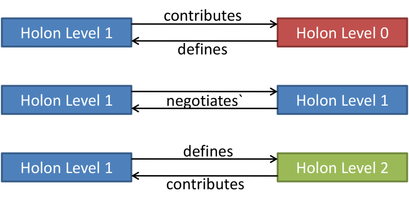

These attributes hold up quite well when compared to our real-world example of a supply chain.

-   Production (what it contributes)
-   Trade (negotiations, cooperation and/or competition, exchange of resources)
-   Consumption (limits, and/or definitions, of resources)

You can also easily see how the above relationships can be described semantically as two objects (the holons) that have a relationship via the predicates *define, contribute,* and *negotiate*.

We can also visually represent the relationships in the following manner, which allows us to easily map this to a trigram:

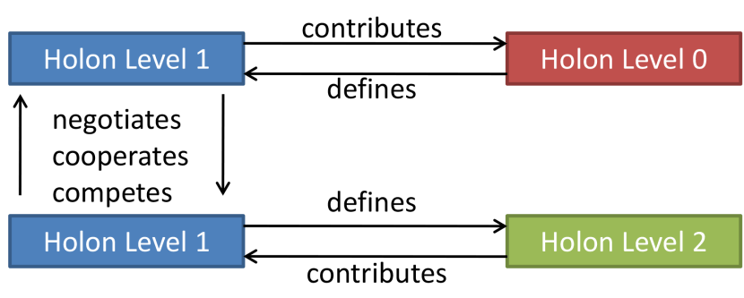

## Tholograms

### Geometry II

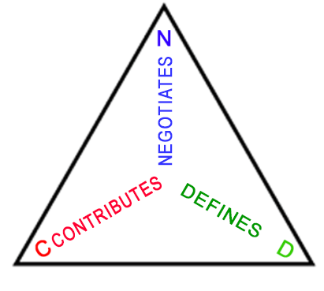

Let&rsquo;s take these three relationship attributes of **C**ontributes, **N**egotiates, and **D**efines (which we&rsquo;ll shorten to just C, N, and D) and map them to the three points of a trigram.  One point to add here is that the word *negotiate* is synonymous with *achieving a balance*.  We could even replace the word *negotiate* with *balance* but *negotiate* implies a process rather that a state, plus, the word *balance* has a lot of baggage in today&rsquo;s culture that we&rsquo;d prefer not to inherit, so *negotiate* is a better word.

How do we know what attribute maps to what point? Further on we will show a more complete argument, but for now we can simply say if we have a parent, a child, and a peer, as we do in both the holarchy and thologram, the parent would be the 1<sup>st</sup> point, the child the 2<sup>nd</sup> point, and the peer the 3<sup>rd</sup> point, as shown in the figure above.

Why are we just mapping the relationship properties, or predicates, and not the objects? Here&rsquo;s why:

In the holarchy, the *types of elements* are Parent, Peer, or Child, and the properties of **C**ontributes, **N**egotiates and **D**efines describe the relationships between these types.  Our trigram is defined by the *properties* of the holons (***Fig.  t2*** below).  We could have just as easily defined a trigram of the *types of elements* alone, as shown below (***Fig.  t1***).  In fact, this is typically how hierarchies are organized.  In our case, however, we are using the properties, not the types, because the movement of energy is in these property archetypes, not in the elements themselves, which are the expressions, or stable instances, of these properties.

We are using this idea of energy and movement as the foundations of reality rather that the *things* themselves.  This is not a new idea.  The *Reciprocal System theory* is built on the same premise and provides the best explanation of why we are using the movement of energy in the relationships and not the contexts of where that energy is coming from or going to.

> The thesis of the Reciprocal System, however, is that the universe is not a universe of matter, but a universe of motion, one in which the basic reality is motion, and all entities - photons, particles, atoms, fields, forces, and all forms of energy - are merely manifestations of motion.[^51]

Like every theory, it has its fans, but also its critics.  In any case, it applies perfectly here.  

Newton&rsquo;s Laws of Motion are similar in this regard, as the laws of motion describe the energy that relates to mass, not mass itself.  Because of this we can show a direct relationship between these tholonic concepts and Newton&rsquo;s laws:

**Newton&rsquo;s 1<sup>st</sup> law states** *&ldquo;Every object in a state of uniform motion will remain in that state of motion unless an external force acts on it.&rdquo;* 

- This law introduces the concept of an instance of mass, putting it the realm of the 2<sup>nd</sup> &ldquo;green dot&rdquo;, and its limitations.  Its inability to move or change without an external forcing acting upon it puts it in the tholonic realm of **Definition.**  The concept of *inertia* is defined here, being the restrictions on mass.

**Newton&rsquo;s 2<sup>nd</sup> law states** *&ldquo;Force equals mass times acceleration.&rdquo;*

- **Force** is the result of time and space (acceleration and mass), so it is within the realm of the 3<sup>rd</sup> &ldquo;red dot&rdquo;, scope and area, and tholonically is within the realm of **Contribution**, as it creates a new concept that describes the most fundamental property of energy, that being the *force* of movement.  

**Newton&rsquo;s 3<sup>rd</sup> law states** &ldquo;*For every action there is an equal and opposite reaction.*&rdquo; 

- This equates to **Balance.** No mass energy is defined here, just as no dimension is defined in the 1<sup>st</sup> dot.  This law only describes the result of existing energies acting against each other, associating it with the 1<sup>st</sup> &ldquo;blue dot&rdquo; realm of **Negotiation**.  The concept of *balance* (which includes the concept of imbalance) is born of energies interacting with one another.

Tholonically speaking, Newton&rsquo;s Laws of Motion should probably be in the following order:

1.  *For every action there is an equal and opposite reaction (Balance, Newton&rsquo;s 3<sup>rd</sup> law)*

2.  *Every object in a state of uniform motion will remain in that state of motion unless an external force acts on it.  (Inertia, Newton&rsquo;s 1<sup>st</sup> law)*

3.  *Force equals mass times acceleration (Force, Newton&rsquo;s 2<sup>nd</sup> law)*

The primary reason why the properties or movement and energy are the key points in a thologram rather than the instantiated elements, as in the holarchy, is because it is the properties of movement and energy that are consistent at every level of creation.  There may be millions of instances of different types of elements within the holarchy, from subatomic elements to universal elements, and everything in between, but the properties of movement and energy are always the same, even though they are expressed differently for each context.  Therefore, it is the properties of movement and energy that define the structure of the hierarchy, not the instances of elements.

These properties direct energy, energy has movement, and movement has direction.  In this example the direction is clear, however, this direction could change under different circumstances as we&rsquo;ll see later on.

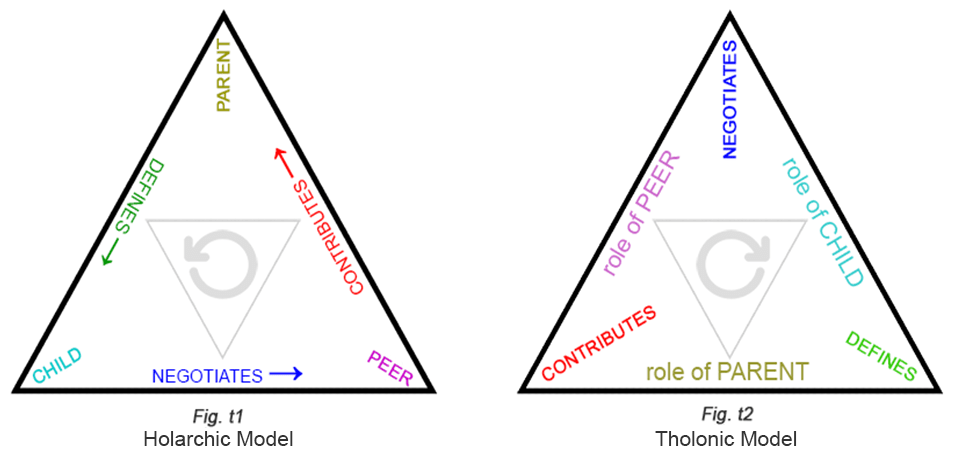

To further illustrate this point, we can use the semantic example above where we show &ldquo;Alice *is a friend of* Bob.&rdquo; The tholonic model looks at &ldquo;*is a friend of*&rdquo; as the energetic force that defines Alice and Bob, at least within this narrow context of *friendship*.  Without relationships Alive and Bob would not even exist, as these relationships define every interaction down to the atomic level.

#### **Claim 47:** Relationships define the function and purpose of any instance

Now that we have mapped the three properties of N, C, and D onto a trigram we can see and label a new class of attributes that are the result of these properties interacting with each other.  For example, what would we expect to see across a spectrum that is defined at one end as *Negotiation*, and at the opposite end, *Definition* (the line from N to D )? In the context of human interactions (just to keep it simple and clear), this pretty much describes how we agree on laws, rules, and limits.  Across the spectrum of *Definition* and *Contributions* (D-C line), we would see how these two opposing concepts, one of restriction and one of expansion, interact with one another through cooperation or conflict.  On the spectrum of *Contribution* and *Negotiation* (C-D line), we would see some sort of value returned to the society or culture, perhaps in the forms of work, dedication, or service (***Fig.  t3***).

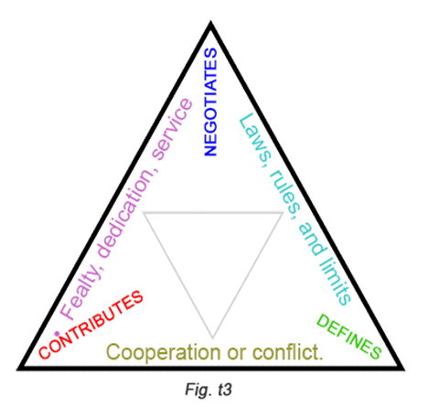

For the purposes of demonstration, we&rsquo;ll use these human context concepts going forward, but keep in mind these are just a few archetypal examples out of many, and only limited to one context.  

-   Role or domain of *Child* as (noun form of) **Laws, rules, and limits** resulting from *Negotiation and Definition*.
-   Role or domain of *Parent* as (noun form of) **Cooperation or conflict** resulting from *Definition and Contribution*.
-   Role or domain of *Peer* as (noun form of) **Work, dedication, service** resulting from *Contribution and Negotiation*.

This trigram of relationships are present in every instance of creation and will be expressed according to the context and scope of its instantiation.  The example above uses concepts that are relevant to the human experience and which we have a functional and practical understanding of, these being *laws* (as in civil laws), *service*, and *cooperation*.  In another context, such as the atomic world, *laws* would refer to the limits that an atom must exist within.  *Cooperation/conflict* could describe how the atom&rsquo;s negative and positive forces work with, and against, each other, or perhaps how atoms fuse (unify, as in nuclear fusion) and fiss (as in nuclear fission, and yes, I just made up the word &ldquo;fiss&rdquo;, from the Latin *fissio*, meaning &ldquo;a breaking up&rdquo;).  In terms to social contexts, we can easily see how this could describe Adam Smith&rsquo;s  *Theory of the Invisible Hand*, which is predicated on the idea of cooperation based on voluntary exchange that benefits both parties as well as the society.  *Dedication* describes the aspects of an atom that enhances the ability or properties of its parent tholon, or the realm from which it was created, which in the tholonic view would be the realm of subatomic particles, such as electron protons and neutrons.  What could atoms be without subatomic particles?  What could molecules be without atoms? What would organelles (specialized structures within a living cell) be without molecules… and up the chain it goes.  In another direction of this same concepts, but perhaps more along the *service* idea, this might be seen in the way atoms enable electrons to move a charge very easily and very fast (the electromagnetic or Lorentz force, shown below), or how atoms act as a sea of electrons that can be called upon at any moment to accept or donate electrons, a service we use and see everyday in the form of the electrical &ldquo;ground,&rdquo; that third pin on every electrical outlet.  With a little thought, we can find many examples.

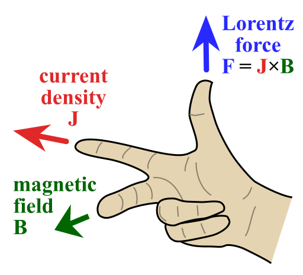

Notice that in the first example when we used the three points of *Parent*, *Child*, and *Peer*, these elements are static (nouns), and their relationships of *Negotiation*, *Definition*, and *Contribution* are dynamic (verbs).  Now when we use *Negotiation*, *Definition*, and *Contribution* as the three points, the relations between them are once again static.  Were we to go further and use the three new static concepts as points we would again have relationships that were dynamic.  This reversing back and forth between static and dynamic with each generation is a natural consequence of the creative process, as will see in more detail a bit further down.

#### **Claim 48:** Static instances (stable patterns) form dynamic relationships (movement of energy).  Dynamic relationships  (movement of energy) form static instances (stable patterns).

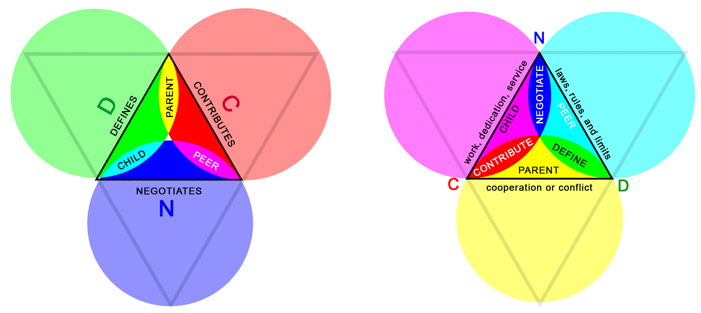

Hopefully, using colors as an example will add some clarity.  Above left we show the three dynamic domains of the archetypes of N, C and D, and their resulting three static domains of the archetypes Parent, Peer and Child.  On the right, we use the same colors to arrive at the three dynamic domains of N, D, C.  

This trigram is the basic tholonic model that describes the movement of energy in the process of creation.  What would be the simplest instance of this trigram? Most likely it would be something like an atom, the first instance of matter, with a neutral (N), negative (D), and positive (C) particle.  This is the description of hydrogen, the very first atom created, with one neutron, one proton, and one electron, the most abundant element in the universe and from which every other element that exists is created from.  On the biological level, this describes mitosis, the process of cell duplication, or reproduction, where one cell gives rise to two genetically identical daughter cells.  In the realm of philosophy, we have the Hegelian Dialectic of thesis, antithesis, and synthesis.  In fact, for a tholonic concept to exist as a potentially viable and sustainable expression it must satisfy a form of the Hegelian Dialectic, in that it must support a thesis (D), antithesis (C), and synthesis (N).

Chemically it describes (among many other things) the balancing of pH, which is critical as most life (except for some hardcore microbes) requires a balanced pH around 7, which is right in the middle of the two extremes of pH 0 (battery acid) and pH 14 (liquid drain cleaner).  This is especially applicable when we see how acids and alkalies violently interact with one another, in a way competing and cooperating on an atomic level, to find a stable balance.  The most common example of this is how the explosive reactions of hydrochloric acid and sodium hydroxide come to terms with one another to form pure water and table salt (and a lot of heat).  We can even map this trigram to a number of different process, for example, here might be two very high-level examples out of many that could apply across many scopes and contexts.  

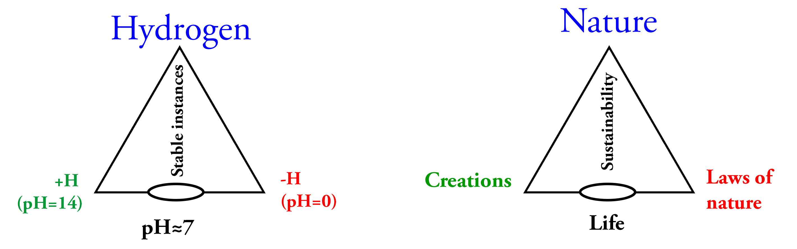

We can learn a number of things from this trigram, but the one detail that is important before moving on is that the initial 0-dimensional blue dot, or what we will call the N-point, is the originating point, and the only point that is able to replicate itself.  Why this is so will be explained shortly.  We will also refer to the blue-dot N-point as an N-state or an N-source, depending on how it is being viewed.

### House of Mirrors

The tholographic claim is that within the trigram there is energy, and therefore movement, and therefore patterns and oscillations from which stable states will arise that are sustainable enough to form a new N-state that is capable of transferring energy across the scope defined by C and D.  Even though one particular state will exist at one specific point on the 1-dimensional spectrum/line between C and D, all possible states will cover the entire range between C and D.  We can generally guess where along the line various states will arise by applying a Bell curve to this line.

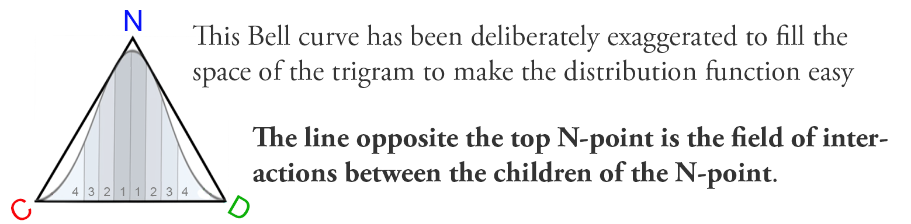

We can now say this about the trigram and its properties:

-   **N** (negotiation) equates to the 1<sup>st</sup> blue dot , which is the awareness of a concept in its simplest form.
-   **D** (definition) equates to the 2<sup>nd</sup> green dot , which introduces limitation, division, and separation.
-   **C** (contribution) equates to the 3<sup>rd</sup> red dot , which, with the previous two dots, results in unification and form.

By these descriptions, we can describe a general process that defines creation as something like:

> The successful joining of contrasting concepts (Negotiation) finding expression in form (Contribution) through limitation, division, and separation (Definition).

At the most abstract levels, this describes the Big Bang Theory, biological reproduction, the laws of physics, philosophy, and anything else that exists in any sort of duality.  Of course, this definition is so broad that it is easy to apply it to anything.

### Inner, not Outer

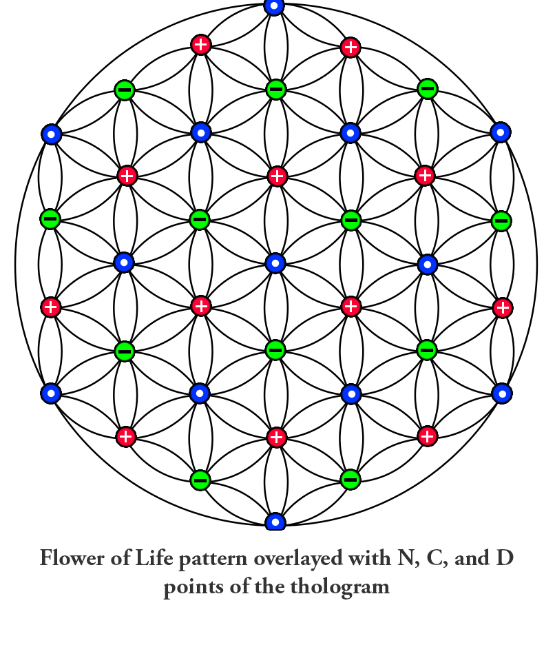

We have seen how the creation of a single trigram will automatically create additional trigrams as part of the same creative process.  This would imply that there is an infinitely expanding realm of trigrams, as shown in ***Fig.  c9*** in the &ldquo;Geometry I&rdquo; chapter.  This pattern, when limited to 37 points, is often called the *flower of life*.  The tholonic model sees it a little differently.  If we are claiming that the first instance of creation, that of the one dot becoming two, and the two becoming three, etc., even if we are just speaking metaphorically, then what we are also claiming is that this first trigram represents the very first duality, that of somethingness and nothingness.  This would then imply that every duality and trigram that follows must exist *within* the first trigram, not outside of it, because every succeeding duality can only be a subset of this first duality and certainly cannot exist outside the bounds of somethingness and/or nothingness.  If we draw our expanding trigrams such that the children are always contained within the parent we see a very different pattern.  

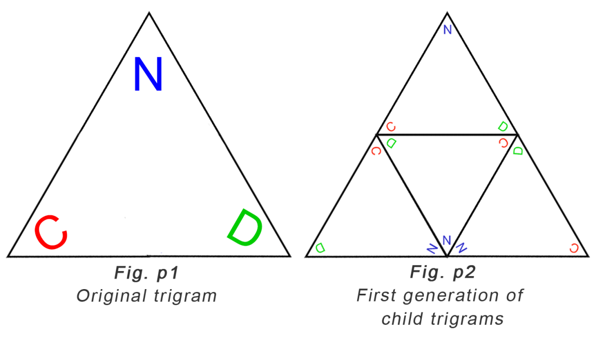

In this example diagram ***Fig.  p1*** above, the outermost N, D, C points represent the first trigram.  You&rsquo;ll see in *Fig.  p2* on the CD line of this parent trigram a new N-state was formed.  It too naturally bifurcates and expands in the same manner as its parent until it reaches its limits of the boundaries of the parent and in doing so creates three additional trigrams.

You may also notice what looks like an inconsistency in the order of the letters.  In ***Fig.  p1***, the parent trigram, the order is (clockwise) NDC, but the three points of the resulting inner trigram are NCD.  It&rsquo;s not actually a reordering, as the children trigrams represent completely new creations.  The original NDC is still there in the parent, but we are only looking at the children in ***Fig.  p2***.  The reason the children have a different order is because the new generation was spawned by the new N-source between C and D, and as D is always the first to follow N, and always on the left of N (left is arbitrary, but we need to remain consistent).  This newly spawned D will appear on the opposite side of the parent&rsquo;s D.  The same applies to C.  Not coincidentally, the new top-most trigram has the exact same order of points as the parent.  The parent always creates a smaller replica of itself in each generation.  You&rsquo;ll also notice that each of the outer trigrams is a reversed copy of the one central trigram.

We started with one trigram, created one more, resulting in 4 trigrams.  Each generation of self-similar creation increases the number of trigrams by 4.  Here is what the generations look like.

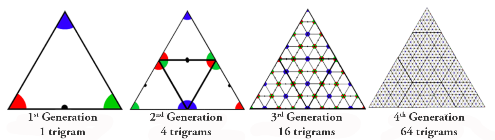

In the 1<sup>st</sup> generation of a simple trigram, we see a few fundamental rules, such as:

-   All sides are of equal length
-   Every point is connected to every other point.
-   Two points define a line, three points define a trigram.  (seems super obvious now, but wait…)
-   The area of the trigram is known.  $\left(\sqrt{\frac{num-of-sides}{num-of-sides+1}}\right) \times length-of-side^{2}$  
-   The radius of the incircle is exactly half the radius of the circumcircle.
-   The end-point where any two lines meet is always the middle of the line formed by the two adjacent points.
-   The total number of degrees of the angles equals half the total degrees of a circle.  This is especially significant later.
-   The 3^rd^ red dot is a product of the 1^st^ blue dot and the 2^nd^ green point, and the next generation N-state blue dot is a product of the 2^nd^ green point and the 3^rd^ red point that form the CD spectrum or line.  

You&rsquo;re probably thinking &ldquo;What? Red and green don&rsquo;t make blue!&rdquo;  This is half true.  Red and green make yellow, and yellow, when blended with the parent blue, make magenta and cyan… and cyan and magenta make blue.  So, red and green parents do not make blue children, but they make blue grandchildren.  We see an instance of this in the way recessive genetic traits can be become dominant in every other generation (in the absence of an existing dominant trait), which is what we would expect tholonically as genetics are one of the better examples of an instance of tholonic fundamentals.  

This is worth a demonstration.  Here is that same process described above but with simple colors from the color wheel to show how the children interact with the parents.  These are the same colors we used above to represent the domains.  This is an important point, but because the process is the same for every generation, we are going to just use red, green and blue in our later examples to keep things simpler; i.e.  going forward we will only show the dominant colors of RBG and ignore the intermediary children of CMY.

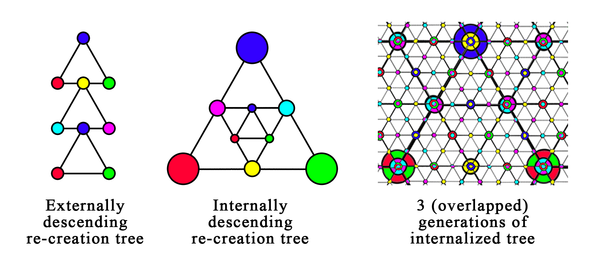

In the first case  (***Fig.  t1***)&hellip;

- Blue spawns green
- Green spawns red.
- Green and red create a new yellow.
- Yellow spawns a mixture of each of its component colors (red and green) with its parent color, blue, making cyan (created by blue and green) and magenta (created by blue and red)
- Magenta and cyan create a new blue.
- *Repeat*

In the next case of (***Fig.  t2***)&hellip;

This is the same process as the first, but the children are spawned internally, not externally.  Each new generation creates a new layer that sits on top of the parent layer and is a mirror of the parent (***Fig.  t3***).  Eventually we end up with a grid that looks like the image on the right, which shows the smaller overlaid children on top of the larger, and opposite colored parent.

Here is a zoomed-out image of this (crudely drawn) grid:

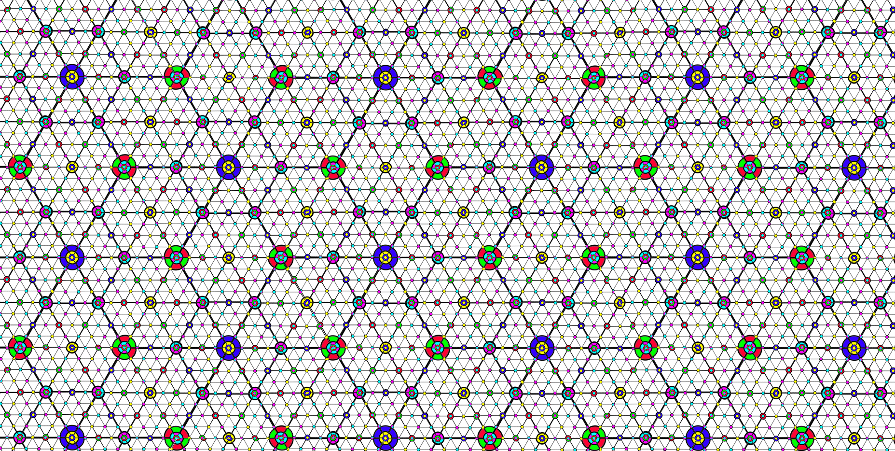

Compare the outward-expanding model to the inward-expanding model:

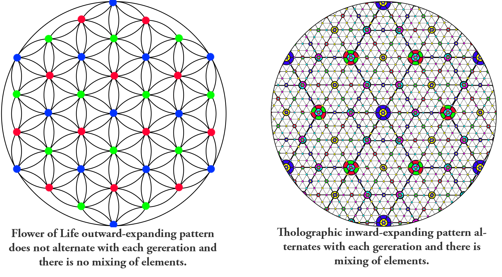

We also see a few other interesting details in ***Fig.  p2***, such as, how the contribution of red divides the green (on the right side).  Can we say the same thing for how green is what divided the red, such as it appears on the left side? No, because there is an order to the points of *blue &rightarrow; green &rightarrow; red*.  Green existed *before* red, therefore the introduction of the 3<sup>rd</sup> red point must divide the already existing 2<sup>nd</sup> green point.  Likewise, the green&rsquo;s boundaries are defined and limited by the red (on the left side) using the same logic that the green came first and the red followed.

In the world of mathematics, this internally expanding trigram is similar to something called a *Sierpinski Triangle*, which is also a self-similar triangle.  This is significant as the Sierpinski Triangle has many real-world applications, such as broadband antennas, musical composition, mathematics, chemistry and is a foundational pattern in nature.

The difference between the thologram and the Sierpinski Triangle is in the latter there is the concept of two types of triangles, one that is capable of self-replication (the black triangles), and one that is not (the white triangles), which act like triangular *holes*, like this:


In the thologram, we consider the triangle not as an object, but as the boundaries that constrain the movement of energy.  The fact that the center trigram is a reversal of the three outer trigrams is evidence of the significance of this inner trigram.  One way to think about the thologram is the boundaries are like one-way mirrors, reflecting the light (energy) within the triangle, but allowing the light from outside to enter.  This difference between the thologram and the Sierpinski Triangle is only conceptual because the math is essentially the same, but the thologram considers the negative or empty space just as valid as the filled space, just with different attributes, which we&rsquo;ll demonstrate.

With each generation, we have more and more rules.  In just a few generations we see two dominant patterns begin to emerge from these rules.  The first one being the Fibonacci sequence, which emerges simply by the linear increase in generation count as well as the number of trigrams for each generation (1,4,16), which is always 4<sup>gen</sup> (4 to the power of the generation number).  

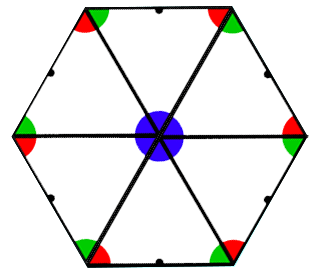

Another dominant pattern is the hexagon, one of nature&rsquo;s most persistent and useful shapes, and can be seen in beehives, Saturn&rsquo;s north pole, dragonfly eyes, rocks, bubbles, snowflakes, organic chemistry, etc., but it is much more than just that.  We are also shown how the N-sources converge to form the center of every hexagon.  From this, we get a much better idea as to the nature of 0-dimensional, non-existent N-sources, which are, unsurprisingly, at the center of order.  This is important because it gives us an insight into answering the question &ldquo;Where did the first N-source come from?&rdquo;  It is also the pattern that is fundamental to the *flower of life*, shown previously.

The  *flower of life* design dates back to 1300 BC, with the oldest known instance carved on the temple walls of the ancient Egyptian temple &ldquo;Osireion.&rdquo; Again, we see the same concepts and patterns appear over and over again in Man&rsquo;s search for understanding using the power of reason.  We also see that every *Define* or *Contribute* point is naturally paired with its opposite.

Another interesting observation are those little black dots in the middle of the lines.  Why are they important?

Those black dots mark the center of a line that has the capability of creating new children (stable patterns), or new N-states that form new N-sources.  You&rsquo;ll notice that those lines only exist on the outer ring of the hexagon.

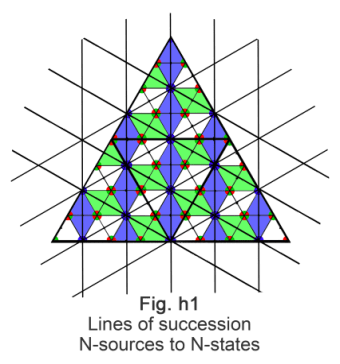

As we saw earlier, the N-source (blue) is the progenitor of the subsequent D (green) and C (red) dots.  We also know that the N must always precede D and C.  However, D and C, having all the attributes of the N, can create a new version of N.  N and D cannot create a new N because it does not have the attributes of C (form), nor can N and C create a new N as it does not have the attributes of D (definition).  Only Ns, or N-states, can be created because N-states have no form or dimension, a prerequisite for creating something out of nothing.  An N-state is simply an idea or concept.  Cs and Ds are no longer simply concepts as they have dimension and therefore can not be created out of nothing.

This is a very important detail because it means that even though archetypes can appear across the NC and ND spectrums, they cannot create children, so no N-state will ever appear across these spectrums.  However, the CD spectrum, which is the axis of *cooperation* or *conflict*, the opposing side to the point of *negotiation*, can create N-states*.* It may appear as though that would limit all the new N-states to only exist on one side of the trigrams, considering only one side of the trigram has the ability to create new N-sources.  This is not the case, because as the trigram self-replicates it naturally rotates 60&deg; with each iteration, allowing every side of the trigram to be able to generate new N-sources.  The graph above (***Fig.  h1***) shows the lines connecting the N-sources and their respective N-states (the black dots).

### Everything Begins with Trigram

Just as every element in the periodic table is formed from hydrogen, so too is every generation of the thologram formed from the trigram.

A curious observation is if you take the simplest material version of the trigram (hydrogen, atomic number = 1) and the simplest material version of the hexagon (carbon, atomic number = 6), the two most fundamental forms in the thologram, and combine them (6+1=7) you happen to get hydrocarbons, the most fundamental building blocks of life (and a bunch of plastic stuff), as all life is hydrocarbon based.  Is it more reasonable to see this most basic structure of the thologram appearing in the most basic structure of life as a recurring pattern or to call it a coincidence?

We can also apply the same associative reasoning to the thologram as a whole to show how its structure appears as a pattern of growth in nature.

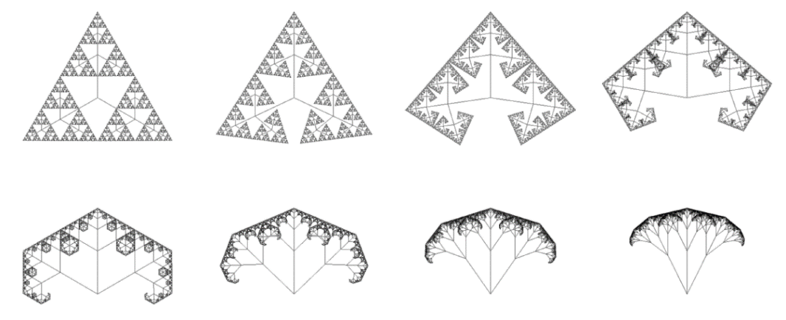

Here we are using the Sierpinski triangle which does not show the &ldquo;negative space&rdquo; of the thologram but simply a blank space.  In the thologram, this blank space accounts for 25% of the tholon and is just as full of implicit patterns as the positive space is full of explicit patterns.  This suggests that we are only seeing 75% of a tholon&rsquo;s instance, the remaining 25% also being an integral part of the instance, but simply not visible.  More on this later.

There is no question that the natural processes of creation for nature follow these patterns, and with a little shift in perspective, for the natural process of creation for ideas as well when we apply this pattern to relationships rather than objects.

### 2D to 3D

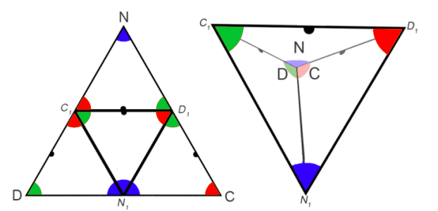

So far all we have described is 2D trigrams.  Where is the 3D tetrahedron? The 2D trigrams *are* the 3D tetrahedron, only flat.  What happens when we convert this 2D model to 3D?

If we take the parent trigrams and fold it according to its four children, we get a tetrahedron.  This is the structure of a tholon.  Tholonic structures naturally occur because they are more efficient as a 3D object than a 2D map, and they are the most stable and complete state for all the properties involved.

The implication of this transformation from 2D to 3D is significant, for if we take our 2D model and turn it into a bunch of connected tetrahedrons of tholonic structures, we get the first instance of a 3D model that, among other things, shows the first instance of 3D oscillation (see *Fig.b1* below).

The mathematics of a equilateral triangle are fairly straight forward, but the math of a tetrahedron is quite fascinating in the the way is supports the tholonic model.  Rather than detail that relationship, here is a small table that holds the formulas for calculating the x,y,z coordinates of a tetrahedron (with the tip along the Z-axis and the base facing the XY plane).  Perhaps the reader can see how the patterns of 2s, 3s, and 4s could map easily to this data.  I have left in seemingly useless data, like 0+0 and $\boldsymbol{0-\frac{1}{\sqrt{3}}}$ but adding them makes the patterns a little more obvious.  Some highlights worth pointing out is how the first point, which would equate to the blue dot, or N-state, references the direct value of 3 as a whole, while all of the other values reference only the inverse of the whole.  This is consistent with the idea that the N-state holds all the possibilities of the two children as well as the limits of the children.  We can also see how the 2^nd^ point, the green dot, adds value and the 3^rd^ point, the red dot, subtracts value.  We applied these same rules to the two children when calculating *pi*.  Also notice how the only points that can generate new N-states exist between 1 and -1, but these N-states can only create children in teh axis where there is a 0, and that is only on the 2D X axis.

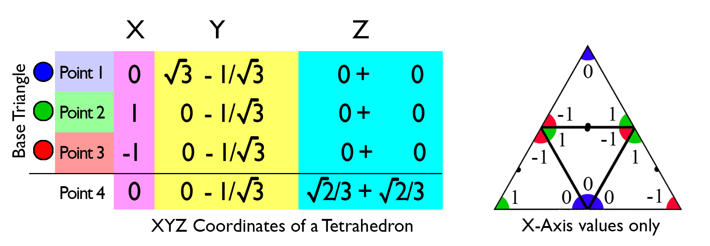

Below is a more complete, step-by-step description of this transition from beginning to end, but before we look at that, here are various 3D views of what such a tetrahedron would look like.  

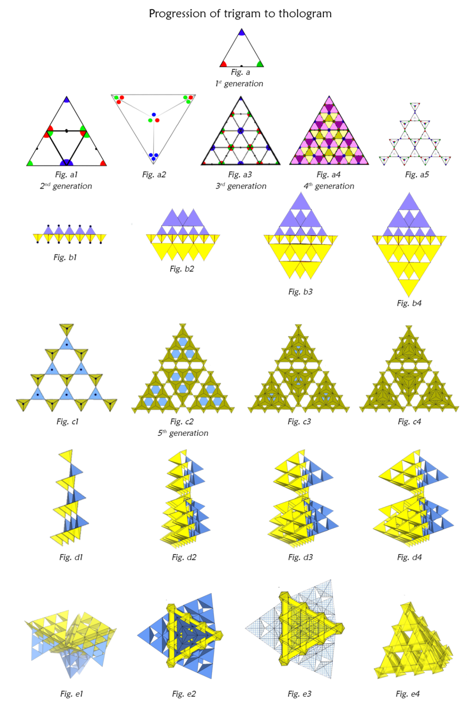

Tholons model the movement of energy, and consider the existence of form as the consequence of that movement.  With that in mind, let&rsquo;s look at the tholonic explanation using the figures above.

***Fig.  a.*** We start with a simple trigram.  This defines the most fundamental structure of how instantiations of archetypes come to exist, and therefore the flow of energy and their resulting forms.

***Fig a1***.  The movement of energy inside this trigram will cause a new trigram to form by the expansion of N-sources due to the flow of energy.  The most likely place for this new form is opposite the source of the energy and in the balanced center between the two limiting poles created by the source.  When it creates its two children they are naturally in reverse order.  We now have four trigrams with their points in their natural order and position.

As was shown above, the arrangement of the colored points (N, D, & C) in each outer trigram are the exact reversed image of the center trigram.  One way to think about it is the original trigram (top-most) reflects and reverses itself and by doing so creates a new trigram (center), which also reflects and reverses itself in the two new trigrams (left and right).  In this way, the center trigram acts like a reverse reflection trigram, and the two new trigrams are a reversed reflection of a reversed reflection.  This will be an important point a little later.

Note: We are going to use colors (RGB) rather than types (NDC) because it is easier to explain using colors.  You can remember that N = blue, D = green, and C = red, but for the purpose of these descriptions it does not really matter.  When it does matter, we will return to NDC labels.

***Fig.  a2***.  Because energy always follows the path of least resistance and always seeks order, this complete tholon will automatically become a self-sustaining structure (tetrahedron) when all the conditions are met as it would represent the most efficient form.  These conditions appear to require 4 types of points; BBB, RGB, RGR, and GRG.  Apparently, B points only integrate with themselves and with an R and G together, while the R and G can integrate with each other.

This is the same phenomena that happens when a hydrogen atom and an oxygen atom meet; they naturally form a stable state (which also happens to form a trigram in the case of hydrogen and oxygen) that requires less energy than both of them require to maintain a separate existence.  This is another example of the reactions caused by the need to create balance, similar to the hydrochloric acid/sodium hydroxide example mentioned previously.

The implication here is that tholonic interactions can also release energy and that tholonic structures *could* be broken or altered by an outside force that has enough energy.

***Fig.  a3***.  Each of these child trigrams goes through the exact same process as the parent, with slightly different parameters that are determined by the limitation of their parent.  We can now see four trigrams of four trigrams in their 2D form.

***Fig.  a4***.  This is a 4<sup>th</sup> generation tholon map, and to get an idea how many sets of tetrahedrons it holds the trigrams have been color-coded to make it easy to see.  The darker colors represent what will be the base of a tetrahedron, with the light shade of the same colors representing their sides.

You&rsquo;ll notice that there are six sets of trigrams that are yellow (or a lighter shade of gray).  These are identified a little differently because when they form a tetrahedron they do so by going in the opposite direction because they are a reversed reflection image.  

***Fig.  a5***.  If we go ahead and form the tetrahedrons we end up with a series of tetrahedrons connected at the corners, some pointing forward and some pointing away (the more faded ones).  You notice that every odd numbered row (rows 1,3,5,7) are all *forward* trigrams (trigrams with blue parents), which we&rsquo;ll refer to as *real*, a term taken from the world of holography to indicate that the image is projecting in front of the film.  Likewise, all even-numbered rows (rows 2,4,6) are pointing in the opposite direction (trigrams with yellow parents).  We&rsquo;ll call these *virtual* tholons, a term also taken from the world of holography, referring to an image that *virtually* exists behind the holographic plate, rather than floating out in front of it.  For every pair of rows (1+2, 3+4, 5+6) there are an equal number of real and virtual tholons.

This may look familiar to a mineral chemist, as this is the exact same structure as silicon dioxide crystal *tridymite*, which is quartz, or silicon oxide, but as temperatures between 870° and 1,470° C (1,598° and 2,678° F), shown below with  two types of *tridymite* molecules.

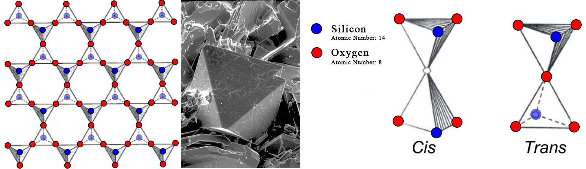


It would be helpful to have a better idea of what kind of structure we are talking about.  Below are various 3D renderings of 4 tetrahedron in this structure.  While we used the same colors for N, D, and C in the previous diagrams for the balls, here we also used them for the connecting lines as the line colors are determined by the color of the ball, or point, that it emanates from.  However, this is mainly to show the relationships with the lines and balls, and not to suggest they have the same qualities.


***Fig.  b1***.  This is a side view of ***Fig.  a5***, with the yellow (bottom) tholons being virtual, and the blue (top) tholons being real.  The black dots represent the peaks are also shown in ***Fig.  c1***, for clarity.  This is where we see the first instance of oscillation, with the tholons alternating in their movement away from and towards their originating plane, or between the virtual and real states.

***Fig b2***.  But what is happening in ***Fig.  b2***? Why are there more tholons stacked on top and on the bottom?

If you managed to slug through this up to this point, congratulations! Here is where it gets interesting: Each of these new trigrams formed by the peaks of the previous children acts as the base for *larger* tholons! The process beginning with ***Fig.  a1*** starts all over for not only each one of these trigrams but for every face of a tholon or trigram, including its children.

If you look at ***Fig.  c1***, which is the colorized front view of ***Fig.  a5***, you&rsquo;ll notice that there are alternating sets of real and virtual tholons, and the peaks of these tholons (the black dots) naturally create new trigrams.

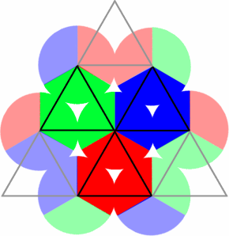

In 2<sup>nd</sup> generation tholons, the peaks are always the 4<sup>th</sup> dot type of RGB combined , or *white dot* , so how can a new tholon appear from three white dots? Doesn&rsquo;t it need three different unique colors to satisfy the conditions for a 4<sup>th</sup> white dot to exist? In fact, that condition *is* satisfied.  If we make the RGB/white dots huge for demonstration purposes you can see how the colors line up to create three separate dots of three separate colors, but these 2<sup>nd</sup> generation dots are composed of three pieces of three dots that are 1/3<sup>rd</sup> each color.

For clarity&rsquo;s sake, we are referring to each generation of tholon children as *generations,* while the tholons that are created from the peaks of these original tholons, and their children, we refer to as *iterations*.

But wait, didn&rsquo;t the previous iteration have a base of three separate points of R, G, and B? And now it has a base of three white dots? Yes, but the only way to create three peaks of R, G, and B is to first create the opposite condition of three peaks of white dots, similar to the way a blue N-source creates a yellow child N-source, which then creates a blue N-source.  With each iteration this pattern reverses itself, so the 3<sup>rd</sup> iteration will be like the 1<sup>st</sup>, with bases of RGB (but each generation rotated 120 &deg;), etc.  All the odd number iterations have RGB peaks, and all the even number iterations have white dot peaks.  Each iteration builds on the one before it, making larger and larger tholons, as you can see in *Figs.  b2, b3, b4*, which shows the progression of real and virtual tholons.[^166]

Interestingly, the growth pattern of tholons is the inverse of a recursive Fibonacci sequence.  Inverse, because we are multiplying instead of dividing, recursive because we do that for each trigram, children of trigrams, children of children of trigrams, etc.

***Fig.  c1, c2, c3,*** and ***c4***.  are orthographic views of the figures immediately above them.  

***Fig.  d1, d2, d3***, and ***d4*** are isometric views of the figures immediately above them.

***Fig.  d1*** shows the first instance of tetrahedrons.  This first level is the foundation of all material existence because it is the first instance of a 3D form.  All form that follows (***Fig.  d2, d3, d4***) is built upon these initial tetrahedrons.  This would (probably) be the domain of elements and the quantum world.

There are two details worth mentioning.  The first is, you&rsquo;ll notice that in the front view of ***Fig.  c2*** you see what looks like four larger trigrams that are themselves made of smaller trigrams.  Each of those large trigrams is itself a tholon.  The center tholon is, as explained before, a virtual tholon, but within this large virtual tholon there exists smaller real tholons.  This is because just as real tholons can create virtual tholons, virtual tholons can create real tholons.  This is where it really starts to sound like a fun-house of mirrors because how can you have real tholons inside virtual tholons? The simple answer is, real tholons in a virtual tholon are real relative to that virtual tholon they are within.  These *virtual* real tholons are just as significant as the *real* real tholons because they function in the same manner as a real tholon, but virtually, which allows virtual tholons to be able to &ldquo;reflect&rdquo; back a real tholon.  But, because they are all sourced originally from a virtual tholon, they only have virtual significance.

The second detail is, to make things more complicated, in the above diagrams we have colored all the real tholons yellow (light gray in B&W) and the virtual tholons blue (darker gray), but in fact, there are yellows within the blues and blues within the yellows.  These were left out for simplicity sake as they were not critically important to demonstrate our point and can&rsquo;t be properly illustrated.  The basic principle is the same however, in that there is an oscillating between real and virtual at each iteration.

Now we can start to fold this into itself.  Each of the four sides that make up a tholon has their own domains of children as well, so this folding process happens at every generation (again, impossible to illustrate).

***Fig.  d4*** shows the small portion of a thologram we have built that we will now begin to fold.

***Fig e1*** shows the beginning of the folding.

***Fig.  e2*** shows the completed folding, with all the real tholons now within the parent, and all the virtual tholons outside of the parent.  It&rsquo;s interesting how it naturally happens that only the virtual tholons extend past the boundaries of the thologram.

It looks like we have broken the rules that no children can exist outside of their parent&rsquo;s limits because we have a lot of virtual tholons sticking way outside those limits.

Remember when we were looking at the Sierpinski Fractal? One of the points made was that Sierpinski treated the empty space between the tetrahedrons as empty, wherein the tholonic model it is not empty, but rather negative space that is a reflection of the immediate parent.  Now review the observation that this middle trigram, as mentioned above, is a reflection trigram.  In one sense it does not exist any more than your reflection in the mirror does not represent the existence of another you opposite and equally distant from the mirror, but it does exist in that the reflection is a perfect mirror-image representation of you, and this has significant value as mirrors obviously have a measurable effect on energy (light).  It is an illusion, but an illusion that that effects reality.

All the virtual tholons are tholons that were created out of this nothingness space! They are *reverse reflective* tholons only.  They do not exist, but they are very important.  The virtual tholons are like the *nothingness* complement to the real tholons within the parent through which *their* reflection creates two more real tholons.  This does not break the rules that nothing created within the parent can extend past its boundaries any more than looking at yourself in a mirror hanging on the wall does not put you on the other side of the wall, even though it appears that way.

Look at ***Fig.  a5*** again.  You&rsquo;ll notice that for every real tholon there is a virtual (reflection) tholon immediately below it.  It is because of these virtual reflections that we can generate another iteration of real tholons.

***Fig.  e3*** shows the ghosts of the virtual tholons, and ***Fig.  e4*** shows only the real tholons folded into their parent tholon.

To get a better perspective of the dynamism of this structure, look at ***Fig.  f1*** below, which shows the lines of influence of each tholon (which is that of a sphere).

If we go inside this very simple version of a thologram we see what looks like complete chaos (***Fig.  f2***), but is, in fact, absolute stunningly perfect order and structure.


If we had used the simplest thologram possible in our example, using only 1<sup>st</sup> generation folds, rather than the 3<sup>rd</sup> generation folds above, it would look like the following:

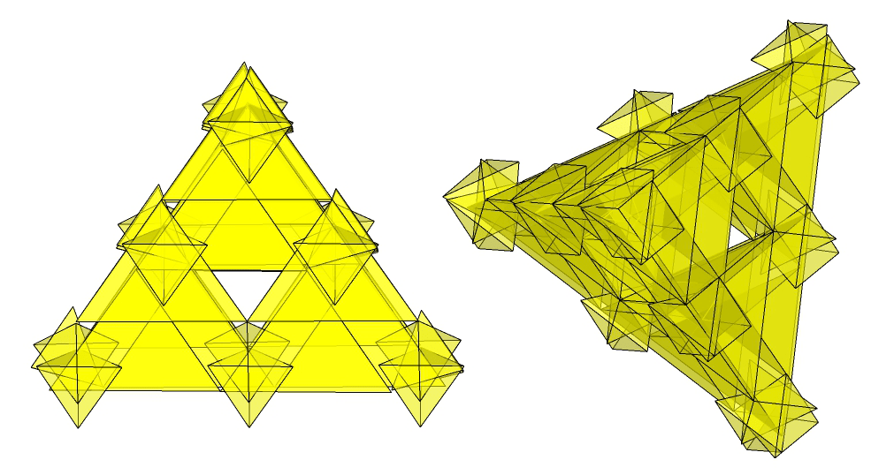

Another fascinating pattern expressed in the thologram is the value for *pi* (&pi;, 3.14159) can be determined by alternatively adding and subtracting the inverse of the total number of N-sources for all the real and virtual tholons for each generations (which produces a series of sequential odd numbers; 1,3,5,7,etc).  This was originally discovered by Leibniz and is appropriately called the *Leibniz formula for π*, as shown below.  Notice how here we also see the reversing back and forth with each generation, which is a function of the creative process as described above.

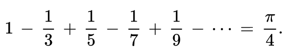

The one last point to consider is best explained in the following thought exercise: Imagine what you would see if you were a 2D person living in a 2D world and a 3D object passed through your 2D reality.  You would see a bunch of 2D slices of that object that changed over time.

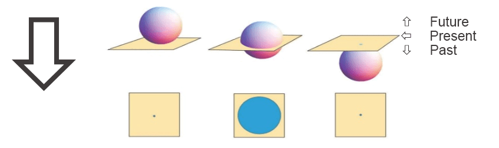

Now imagine you are a 3D person living in a 3D world (which should be pretty easy to do) and a 4D object passes through.  You will see 3D &ldquo;slices&rdquo; of this 4D object over time as it passes through your 3D world.  For example, if a 4D ball passed through a 3D world it would first appear as a very tiny 3D ball, and then grow to a large ball, then shrink to a small ball before disappearing.

In both 2D and 3D cases, you are not getting the whole picture, but in both cases what you are getting is completely true and valid for the scope of your 2D or 3D reality.

If we were to remove the original collapsed tholons (which represents the elemental and quantum layer of reality) from the model and only look at the iterations that represent the Newtonian material reality we live in, the thologram would look like a perfect tetrahedron, with none of those smaller protrusions that come from the original collapsed tholons.

In the same way as the 4D ball, a 4D thologram, being itself a tetrahedron, would first appear as a small tetrahedron, which is what we, and others, are claiming all reality is conceptually built from.

Why is this detail important?

The 3D model of the thologram is a 3D slice of a 4 (or more) dimensional model.  What the larger multidimensional object that we see as a tetrahedron actually looks like we can&rsquo;t say, and probably can&rsquo;t know.  What would an 8D or 248D &ldquo;object&rdquo; appear as in this 3D world? It could appear as many, many different things.  Take a look at all the ways a simple self-similar 3D tetrahedral pyramid can appear in 2D orthographic projections.

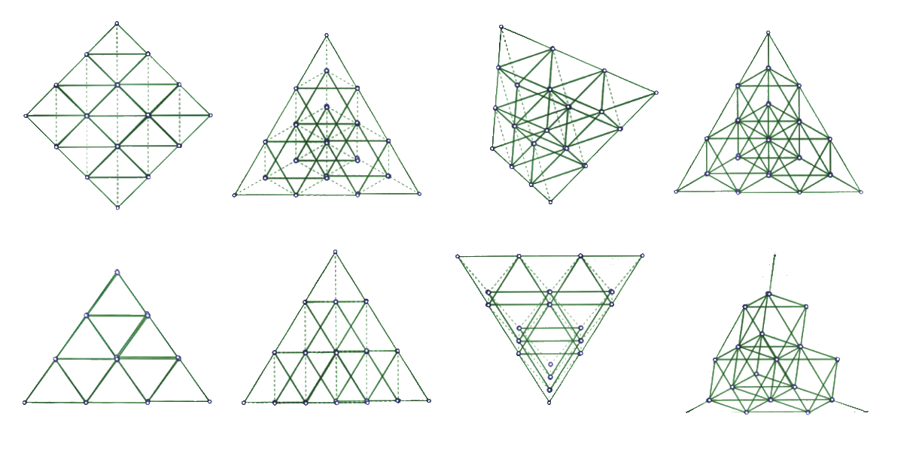

Now imagine the same tetrahedral pyramid with trillions of iterations and many more dimensions! It would have the ability to define or describe every archetype of everything,  every form, (every idea?) that ever has, does or will exist.  Its perspectives would effectively be infinite to us, but at its source, it is one thing.

## Archetypes

This is a good place to elaborate on the concept of archetypes.  The current understanding of an archetype is defined in the Oxford English Dictionary as:

> The most typical or perfect example of a particular kind of person or thing

When we speak of archetypes in the context of tholons we are using a more general, yet compatible definition that an archetype is a pattern that expressions diverge from or converge towards.  More specifically, an archetype in the tholonic view is:

> The ideal expression of a set of constraints that can be tholonically expressed.

A circle, for example, is the ideal expression of the rule &ldquo;the locus of all points are equidistant from a central point&rdquo;.  This is a Platonic archetype.  A Jungian archetype might be the personification that tends to represent what Jung called a &ldquo;primordial image&rdquo;, and it was this understanding that lead him to the ideas of a*nima/animus, the self, the shadow*, and *the persona* but also shed light on the classic archetypes such as *wise old man, the child, the mother, the maiden*, etc.  This was later expanded to *Neo-Jungian* archetypes such as *caregiver, explorer, jester, rebel, citizen, hero, lover, sage, creator, innocent, magician,* and *sovereign*.  Not surprisingly, these twelve archetypes are similar to the those found in astrology.  This is because Jung recognized astrology as a system of archetypes, adopting and reforming many of its concepts into modern psychology.  

But, surely, not all persons, or personalities, can be defined by rules?  From the tholonic perspective, they can be and are, but these rules, as you will see, are far beyond our current ability to fully grasp.  This *must* be the case if all that exists are tholonic instances and tholons are defined by their definitions, creations, and contributions.

Tholonic instances are easier to understand when we look at isolated archetypes.  It is easy to understand a square block is an expression of a archetypal cube, but what of a melting snowball?  At what point does it stop being an expression of a sphere?  From the tholonic perspective, never.  The snowball came into existence as a result of many tholons cooperating and competing, exerting forces and limits in such a way that a snowball could form.  The snowball changes form as these tholonic forces change due to waxing or waning circumstances that tend to reinforce some forces and diminishing others.  Each of these tholonic forces is an archetype because each tholon *is* an archetype.  As these archetypal forces change, interact, negotiate, compete, the resulting form will always be the most efficient expression of the state of those forces.  In other words, everything that exists is as perfect an expression of its archetypes that is possible, but everything that exists is made up of many, many tholons or archetypes, so what we see is a amalgamation of countless archetypes that have managed to create a stable instance.  Some of these amalgamations will become archetypes and parents of archetypes themselves.  Perhaps the only pure, unamalgamated archetypes that exist are the concepts of *something* and *nothing*.

So, when you see something that looks imperfect, remember that it *is* perfect, it&rsquo;s just that you are not aware of all the archetypal forces that are making it perfect.

#### **Claim 49:** Everything that exists *must* be perfect.

## Revisiting Dimensions

To specify the location of a tholon within the thologram we have to identify each tholon by an address based on its generation.

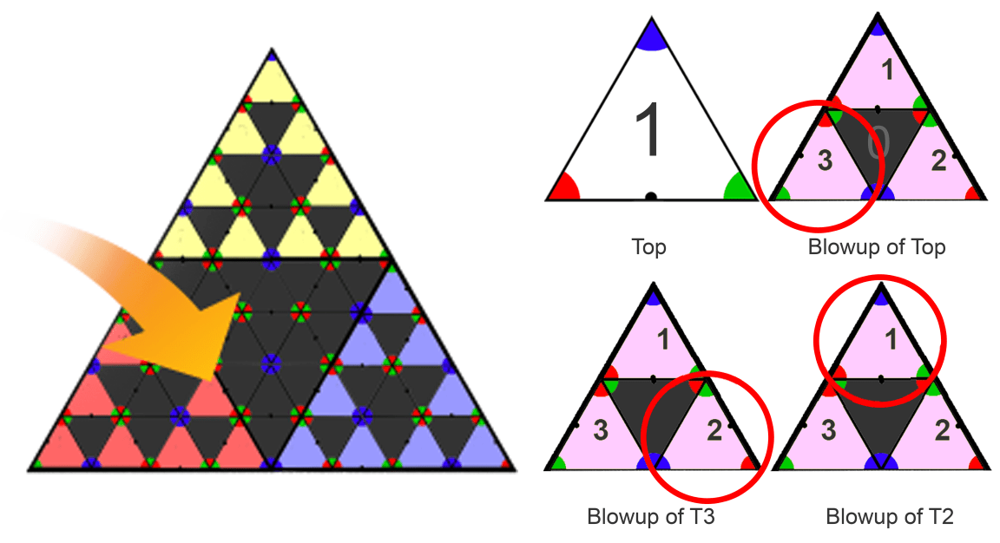

If we wanted to reference one specific tholon, such as the one highlighted in the image above we&rsquo;d need to say it was located at 1,3,2,1 as it is the 1^st^ child of the 2^nd^ child of the 3^rd^ child of the 1^st^ tholon.  The areas blacked out are virtual tholons which don&rsquo;t really exist (energetically) so we can&rsquo;t navigate to them even though we can reference them.  So, in this example, we need 4 dimensions to define the location of a tholon.  At any one point withed a thologram there can be multiple instances of tholons consisting of all that tholon&rsquo;s, ancestors and descendants, that may occupy that one point.  Just saying the location of one tholon could just as easily refer to a subsection of a parent tholon or a group of children tholons.  Any dimension would have to record the path taken to arrive at any particular tholon.  The reason this is being mentioned is to show that each generation of tholons increases the dimensionality of the thologram by one dimension.

For example, to identify the position (P) of one tholon at the 45<sup>th</sup> iteration we would need a dimension that looked something like:

***P* =**1, 2, 3, 1, 1, 3, 1, 2, 3, 2, 2, 1, 1, 3, 1, 1, 1, 2, 3, 3, 2, 2, 2, 2, 2, 2, 2, 2, 3, 1, 2, 3, 2, 2, 1, 2, 1, 1, 3, 2, 1, 2, 1, 3, 1

But it&rsquo;s even a bit more involved because this dimension only points to one particular tholon within which is its own 3D space.  In the thologram, we can&rsquo;t use a Cartesian coordinate system (i.e.  X, Y, Z) because that would require a coordinate system that extends past the boundaries of existence, and we know that there can be no metrics in nothingness.  We can only use a *quadray* coordinates (e.g.  A, B, C, D) which are based on a tetrahedron, to identify a point within the tholon.

Does this mean that our 3D reality is embedded within a parent 3D reality? According to the thologram, yes, although I have no idea how this can be tested.  An analogy we have to the idea of a 3D reality within a 3D reality is VR (virtual reality), where we can create countless 3D worlds within our own 3D reality.  Another analogy is how a hologram can create a 3D space from a 2D surface, and there can be many 3D spaces on top of one another recorded in that same 2D surface.

### Synergetics

What some people today call *sacred geometry* our ancestors simply called geometry.  Contrary to what we learned in school, geometry is as much a study of philosophy as it is a study of form, space, and mathematics.  Plato, Pythagoras, Parmenides, and a number of other great philosophers were well-schooled in geometry, but the marriage of philosophy and geometry goes back even further in history, and across every culture.  Take the quadray coordinates system as an example.  One could make a case that the Ancient Babylonian base-60 number system was an early version of this idea.  In fact, one could make the case that the 20,000 year old Ishango Bone of the upper paleolithic era discovered in the Congo was the earliest version of a base-60 system.  This bone is considered to be the first instance of the concept of the number one.  On this bone are counting marks, 60 marks on one side, and 60 marks on the other side.  One has to wonder why a paleolithic caveman would choose 60.

*Synergetics* is a modern-day example of how geometry forms the basis of the structure of creation, life and how everything interacts with each other.  Buckminster Fuller coined the term *synergetics* in his three-volume work &ldquo;*Synergetics.  Explorations in the Geometry of Thinking,*&rdquo;[^52]wherein he explains how using a 60&deg; coordinates system can explain both physics and chemistry, but more importantly, he believed that it also explained reality.  In his words:

> Since physical Universe is entirely energetic, all dimension must be energetic.  Synergetics is energetic geometry since it identifies energy with number.  Energetic geometry employs 60&deg; coordination because that is nature&rsquo;s way to closest-pack spheres.

He explains how the points and the lines of a tetrahedron (60&deg; coordinates) describe all elementary phenomena.  Moreover, he claims that synergetics can measure our experiences geometrically, and how we can employ geometry regarding both metaphysical and physical knowledge.

The math he proposes is, according to him, based on the reality of empiricism, seeing as that all atoms are made of tetrahedrons, octahedrons, rhombic dodecahedrons, and cubes.  Using this synergetic math, we have a coordinate system that works omnirationally, energetically, arithmetically, geometrically, chemically, volumetrically, crystallographically, vectorially, topologically, and energy-quantum-wise.[^53]

All these forms, such as cubes, hexagons, tetragons, rhombohedras, orthorhombics, or truncated icosahedrons, which is commonly known as the *Bucky Ball*, or, when in atomic form, *Buckminsterfullerene* (basically, it&rsquo;s a soccer ball),  and perhaps all forms, can be defined by points in a thologram.

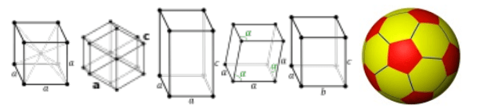

The thologram, which is based entirely on the tetrahedron and synergetic quadray coordinates, is a model of knowledge, thought, and ideas.  it&rsquo;s important to remember that the map is not the territory.  These models of reality are like maps that describe the terrain.  There are elevation maps, density maps, road maps, water maps, contour maps, temperature maps, population maps, economy maps, crime maps, San Francisco even has human feces maps! They all describe the same territory from different perspectives.  The thologram is just one template that is a description, so to speak; a language that defines the organization and pattern of all energy at every level.

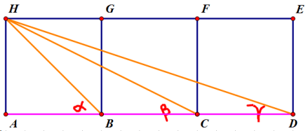

There are many alternative ways to map the thologram.  What is shown here is just one way.  How many ways are there? I don&rsquo;t know, but the extremely simple *three square geometry problem* shown above (&ldquo;what is the total of the angles *α*,*β*,*γ*?&rdquo;) has 54 possible solutions, and that is just with three simple squares (the answer is 90&deg;)!

As you can imagine, there is virtually no end to the relationships, patterns, rules, etc., that can be discovered.  What separates knowledge from *apophenic* delusions (apophenia is the tendency to perceive connections and meaning between unrelated things and is considered a sign of early-stage schizophrenia) is whether a relationship, pattern or law can be tested to achieve predictable results.  On the other hand, we don&rsquo;t want to fall victim to *randomania* either (&ldquo;randomania&rdquo; is the unofficial term for people who attribute to chance that which is clearly the result of order; the inability to see patterns where they actually exist).

> It doesn&rsquo;t matter how beautiful your theory is, it doesn&rsquo;t matter how smart you are.  If it doesn&rsquo;t agree with experiment, it&rsquo;s wrong.

##### \~Richard Feynman

We agree with Mr.  Feynman, but we also have a broader definition of &ldquo;experiment.&rdquo; Life is reasonable by default, otherwise, it would not exist, but it is not always quantifiable, and often incompatible with current science.

OK, that&rsquo;s enough geometry.  let&rsquo;s look at some chemistry.

## Application

### Water

We mentioned above that the first instance of matter would be tetrahedral, at least conceptually, but we also stated that form, being an instantiation of the laws of form, would follow that model, meaning we should expect to see tetrahedral structures as one of the building blocks of reality.  And guess what? We do! But with a twist.

The actual first instance of matter are the elements, but no element has a tetrahedral structure when it is isolated.  It is the bonds between elements that create the tetrahedral structure.  In the tholonic model, the individual elements exist at the first level of the thologram, which are the first tholons created by the folding of the 2D &ldquo;map&rdquo; and are shown as the numerous and small tetrahedrons upon which ever-larger tetrahedral structures emerge from.  While these elements may be not be tetrahedral in form, they are in concept as they are tholonic and therefore built upon tholonic, or tetrahedral, rules.  We don;t see tetrahedral forms in 3D structures until the first iteration that emerges.  A single $H_{2} O$ molecule is not a tetrahedron in form, it is a trigram.  Water, however, is tetrahedral.

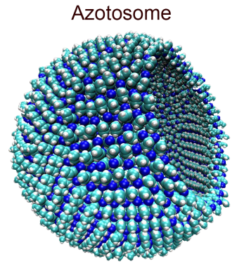 

Water is a particularly good substance for exploring tholonic structures because it is one of the first, if not *the* first, tetrahedral structure that all life depends on.  Another early structure that is tetrahedral as a molecule alone is methane, one of the first organic molecules and not just a building block of life on earth, but quite possibly the basis for an entirely different form of life, as pictured in the *Azotosome* above, and one we might discover on the Saturn moon of Titan.

We saw that in the first generation of a tholon we have 4 trigrams, 3 of which are descending, or downward-pointing trigrams, and 1 is ascending, or upward-pointing trigram (&ldquo;up&rdquo; and &ldquo;down&rdquo; have only relative meaning here as it simply refers to the way the trigrams were drawn).  If we have two tholons then we have a total of 8 trigrams made up of 6 descending and 2 ascending trigrams.

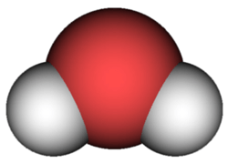$ H_{2} O$ is composed of three atoms.  One atom is oxygen, which has an atomic number of 8 as it has 8 protons in its nucleus, which defines how much energy it holds as a &ldquo;charge.&rdquo; It also supports 8 electrons in its outermost shell, which represents its most balanced state.  The other two atoms are hydrogen, the very first instance of Newtonian matter, the kind of matter that makes up physical reality as we know it.  Hydrogen has an atomic number of 1 and has only 1 proton, 1 electron, and 1 neutron.  Although oxygen wants 8 electrons in its outer shell, it only has 6, so it naturally forms a bond with two hydrogen atoms by sharing the one electron each hydrogen has to offer.

From a tholonic perspective, oxygen follows the pattern of two 3<sup>rd</sup> gen tholons from one face of a 2<sup>nd</sup> gen tholon, which has 6 *real* tholons and 2 *virtual* tholons (***Fig.  v1*** below, showing two 3<sup>rd</sup> gen tholons).  Hydrogen follows the pattern of a complete 2<sup>nd</sup> gen tholon (***Fig.  v2***, showing two complete 2<sup>nd</sup> gen tholons).  Combining these two together (***Fig.  v3***) would represent 8 externally-facing points (from the *real* tholons) of interaction and two internally facing points (from the *virtual* tholons) of non-interaction.  When combined, the hydrogen tholons will attach to the empty or *virtual* tholons of oxygen.

We can see a few similarities between a tholonic model and a chemical model.

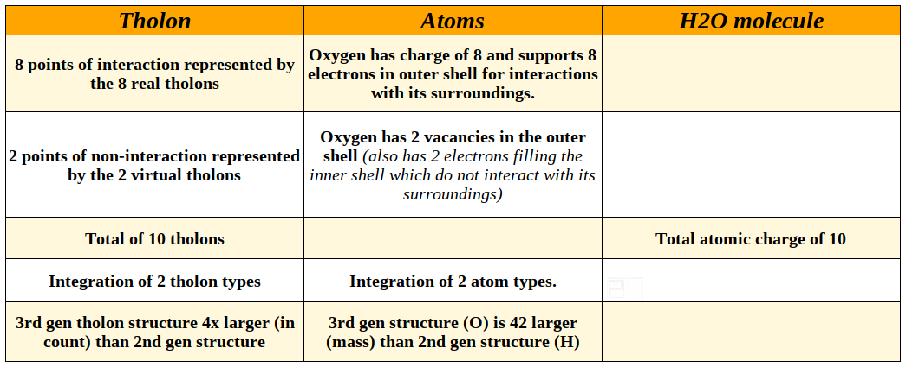

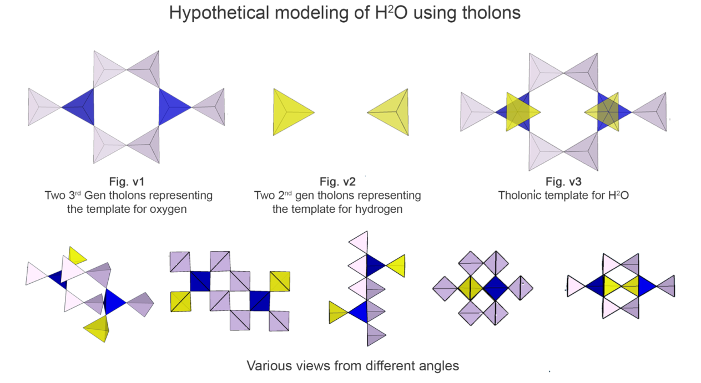

This is just a hypothetical demonstration, as there may be a much better tholonic model for elements and compounds than this one, but this one is sufficient to show how we might be able to describe elements and compounds tholonically, which may give us new insights into their nature.  

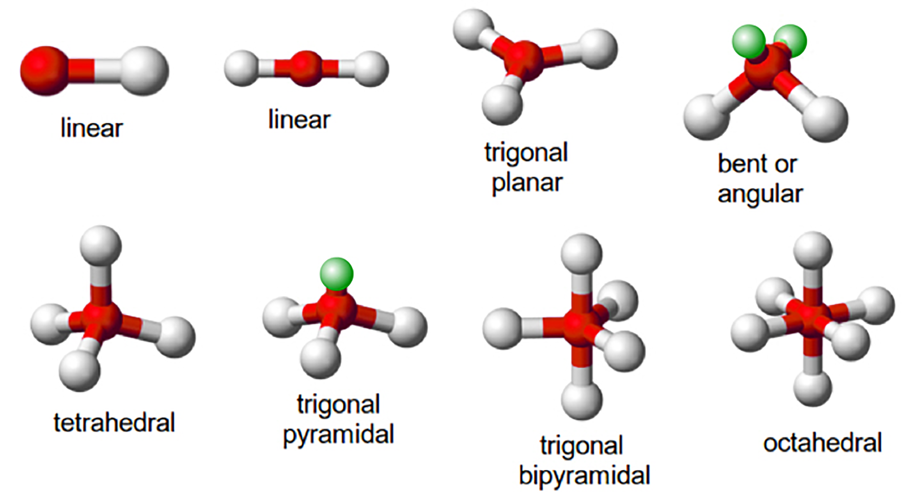

Can we see this similar relationship with other compounds? Given that the basic archetypal shapes of molecules (shown above) can be represented within the thologram, perhaps this model can be applied to all compounds.  We claim this might be possible, as there is an almost infinite number of possible configurations in the thologram.  Instances of fundamental configurations, such as those that appear in the earlier stages of iterations, like the Fibonacci sequence and the hexagram, would represent extremely stable patterns, and therefore we would expect to see them play a very fundamental part in our reality (like water and methane) and could be easily discovered.

### Quarks and Atoms

Here is another example of how we might discover tholonic structures in subatomic particles.  Let&rsquo;s look a quark (which was originally named a *parton* by Richard Feynman to describe a hypothetical particle inside the nucleus of the atom).

Currently we understand that protons have a charge of +1 and are composed of two *up* quarks, which have a charge of $\boldsymbol{+\frac{2}{3}}$, and *one* down quark, which has a charge of $\boldsymbol{-\frac{1}{3}}$, and neutrons have a charge of 0 and are composed of one up quark and two down quarks.

This is seen in a single tholon and its reflection tholon as shown in ***Fig.  q1*** and ***Fig.  q1a*** below.  The upper trigram has a parent trigram at the top which we can assign a value of $\boldsymbol{-\frac{1}{3}}$, and the two children can be assigned a value of $\boldsymbol{+\frac{2}{3}}$.  The center child trigram, which is always a reflection trigram, has a value of 0.  The opposite is true for the lower reflection trigram as well.  With these values, the upper tholon has a charge of 1, like a proton, and its reflection tholon has a charge of 0, like a neutron.  This also seems to indicate that a truly complete tholon requires two tholons; itself and its reflection tholon.  

***Fig.  q1a*** is also the same shape as the *trans tridymite* silicon oxide molecule, with the N-states holding the same position as an silicon atom.  For those playing along, note that the *trans tridymite* molecule has oxygen molecules that total the atomic number of 32 $(8\times 4)$ and the silicon molecules totaling 28 $(14\times 2)$, resulting in a total atomic number of 60.  

***Fig.  q3*** is from the previously quoted paper [^39] that explains the various models within the E8 crystal and describes this shape as &ldquo;representing all 8 components of the electron&rdquo;.  This is not exactly the same as what we are saying here, but it supports the overarching idea regarding tetrahedrons and subatomic particles.

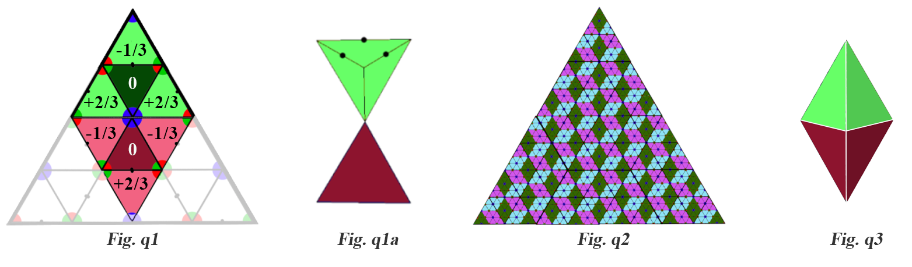

We need to very briefly address one item before continuing.  Within the first three generations of the thologram we have the underlying structure that all that follows is build upon.  It is from the third generation that patterns emerge that never change from that point on, such as the hexagram.  We can see these patterns as contiguous boundaries of the same boundary *type*, shown in the image below.  The left-most image shows the first three generations combined, with yellow lines connecting the red and green dots, magenta lines connecting the blue and red, and cyan lines connecting the blue and green.  Because there are three layers on top of each other it is difficult to show the connecting lines realistically, but if we isolate each color of connecting lines we see these patterns of boundary types.  Why are we calling them boundary types? Because as contiguous lines of the same type, they define where and how energy flows through the structure.  They are the channels of energy, each channel allowing the energy to instantiate with different properties.  There are essentially two types; the *grid*, of which there are two, a pair of exact opposites (the magenta and the cyan), and the *matrix*, which is symmetrical, self-contained, and self-similar (the yellow).  As contiguous lines, these patterns define the *bonds* that hold the thologram, and therefor existence, together.  

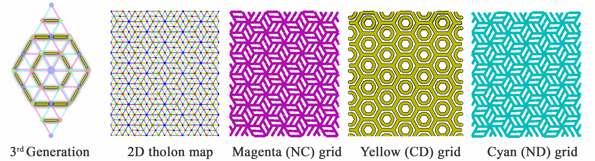

Only one of those patterns is self-similar, and that is the pattern caused by the lines that can support an N-state, which is the line that represents the spectrum between the two poles (of red and green) of an individual tholon, or the matrix of N-states that exists between the two opposite grids.  This will be very significant in a few paragraphs.

If we looked at the 2D thologram map which shows these complete double-tholons, we get what is shown in ***Fig.  q2***.  You&rsquo;ll notice this is identical to the previous graph (***Fig.  h1***) that shows the lines of succession from N-sources to N-states across all three directions.  This would suggest that quarks are an instance of N-states.  Given that these pairs and also arranged in three different angles, 60&deg; apart, it would also suggest (remember, I am not a quantum physicist) that there are three classes of quarks or three attribute classes.

Neutrons *do* exist, which seems to go against the tholonic idea that the virtual tholons don&rsquo;t create anything, but remember, this thologram is a model of energy and relationships, not of form, so what we would expect to see is some *thing* that has zero energy&hellip; like a neutron.  And what holds all these subatomic particles together? The *strong nuclear force* (mainly), which is the tholonic equivalent of six integrated N-sources at the center of every hexagram.

This would seem counter-intuitive as the *strong nuclear force* (SNF), which got its name because it is the strongest force in the universe, would not allow similar energies to couple, but rather repel, as we know positive repels positive and negative repels negative.  However, the SNF has a &ldquo;weird&rdquo; quality such that it only repels like forces *after* they are separated.  When these forces are close to one another, the SNF pulls them together! Physicists call them weirdness *asymptotic freedom* (but is also sounds like most love affairs).

This is a significant observation.  Most of what we have shown here involves how the movement of energy, in accordance to laws, brings form and ideas into existence, yet almost nothing is said about the nature of the energy itself, other than that energy in its purest form is ultimately an expression of awareness and intention.  Here we have six N-sources which hold the tholons together to form the centers of all creation.  In the quantum world, there is a similar concept of this energy that holds everything together, called *gluons*.  Gluons hold quarks together using the SNF.  tholonically speaking it is the laws, described as geometry in the thologram, that hold everything together.  The claim then is that gluons are (perhaps?) an instance of that tholonic concept.  The other forces that holds things together are electromagnetism, the weak nuclear force, and gravity, all (hypothetically) different instances of the same laws expressed geometrically in the thologram.  It seems intuitively obvious (to a non-physicist like myself) that the six N-sources (and their children, represented as the black dots on the edge), correlate quite neatly with the six &ldquo;flavors&rdquo; of quarks (*up, down, strange, charm, bottom*, and *top*).

Understanding the tholonic nature of these forces may well give us an insight into understanding the nature of the source of the energy, which is to say, understanding the nature of the Awareness and Intention that created this reality.

There is also an interesting relationship with the One Electron Theory.  This is a theory that theoretical physicist John Wheeler proposed (in a phone call at 2AM in 1940 with Richard Feynman) that there was just one electron in existence, and that all electrons were the same electron! This would be possible if that one electron was not subject to space-time, allowing it to be in all places simultaneously.  Wheeler also claimed that not only are all electrons the same electron, but all positrons are also the same electron moving backward in time.  As an electron it has a charge of -1, and as a positron it has a charge of +1.

The problem was, there was no space for a positron in the current model of the electron.

In order to account for all the electrons in the universe, this one electron would have to move backward in time at least one time less than the number of electrons moving forward.  This prerequisite is satisfied as can be seen in the previous diagrams of &ldquo;progression of trigram to tholon&rdquo; where there is always one more iteration of real tholons then there is virtual tholons.

If Wheeler&rsquo;s  idea was correct, then there should be almost as many positrons in the universe as electrons, but there aren&rsquo;t.

Wheeler suggested that the missing positrons might be hidden within protons.  This idea does not work with the current theory that a proton consists of only two up quarks, each with a charge of +2/3, and one down quark with a charge of -1/3 as there is simply no place in the proton where a positron, with a charge of +1, could hide.

However, in the tholonic model, there *is* a place for the positron to hide, and that is in the virtual space of a tholon.  As was previously mentioned, there can be real tholons within virtual tholons.  As this virtual space also acts as a reflection for the other three trigrams of a tholon it would act as the source of the positive charge of the reflection tholon&rsquo;s *child* tholon.  So, if the positron were to &ldquo;hide&rdquo; in the virtual space of the reflection tholon its charge of +1 would neutralize the -1 charge of the reflection tholon, which would presumably have sort of (testable?) effect on the real tholon.

This may sound ridiculous, but we have already proven that if you fill some small part of empty space with enough energy, electrons and positrons will magically appear out of nothing, or as it was described in a New Scientist report, &ldquo;Lasers Could Make Virtual Particles Real&rdquo;.  [^204]

But what about the electron? Where is that? tholonically speaking, the electron is a product of the imbalance of this hexagram which has has a total charge of +1, and therefore it will automatically create an equal and opposite tholon (of an electron) with a charge of -1, which is also the total charge of the parent reflection tholon.  Where would this electron exist? At the opposite side of the N-sources across the scope of its children C and D, which is where N-sources manifest as stable expressions, i.e.  on the outer most edge of the hexagram.  

In a complete and folded tholon, these three scopes create the three edges of the outer tholon that is opposite the reflection tholon, represented by the three black dots in ***Fig.  q1a***.  As there are three different directions of these patterns, each 60&deg; apart, there is access to any active interface (which instantiates as an electron, or electron field) for every angle of the thologram.  If this were the case, we could speculate that an electron is the grand-child of all six N-sources (N-source -> black-dot children -> electron field) and/or it is the created N-state (child) of the N-source (parent) of the proton.

More importantly, those dots where the electrons would appear only exist on the boundaries of the self-similar (yellow) grid we just looked at above.  What this implies is that anything that uses electrons to exist, which is essentially everything, will naturally order itself in both a self-similar manner and in a way that can be mapped to that pattern.  Does this mean that everything that exists is somehow based on a self-similar hexagram?  This would suggest that this is the case.  However, layers of complexity could make that difficult to discover.  Perhaps a more important detail is that the Thologram, or any model of reality, is only one perspective of a much greater multidimensional model, and being multidimensional it can be perceived many different ways.  The tholonic claim is that all models, including those of our ancestors that lived in the wild and in a world dominated by spirits, plants, insects and gods, come from the same source.

Compare the crudely drawn 2D map of overlapping tholons (below right) a diagram (below left) from an article by Ethan Siegel, Senior Science Contributor to Forbes magazine[^172], called &ldquo;*Can Free Quarks Exist Outside Of A Bound-State Particle?*&rdquo;  Notice any similarities?  The correlation might be even more significant if I had any clue how to determine which quarks (R, G, or B) are equivalent to the tholon&rsquo;s  N, D or C.

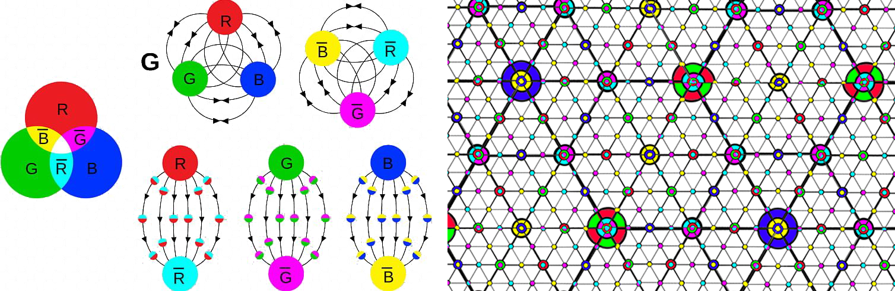

### Back to Basics

We can now map Newton&rsquo;s 2^nd^ law (in the form of Ohm&rsquo;s  Law) to the tholon, which fits nicely.

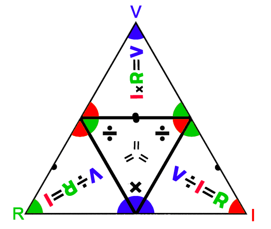

And we can use Ohm&rsquo;s  Law to test it out, if we replace:

-   N (negotiation) with V (voltage)
-   D (definition) with R (resistance)
-   C (contribution) with I (current)

which allows us to state the following:

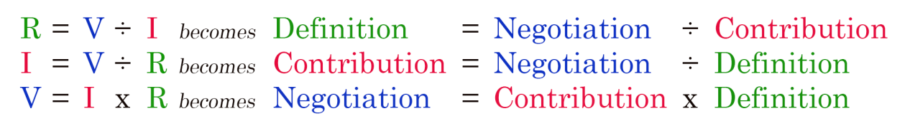

Let&rsquo;s look at these definitions closer.

### The Meaning of Math

To look closer we need to make sure we&rsquo;re all on the same page regarding how the trigram can describe the math functions of Ohm&rsquo;s law, and to do that we need to clarify some really simple concepts, such as what do the math symbols mean in the real world.  

Addition and subtraction are easy concepts to grasp in the real world.  We take some number of things and add or remove some number of things.  A good example of the effects of addition and subtraction is how they affect colors.

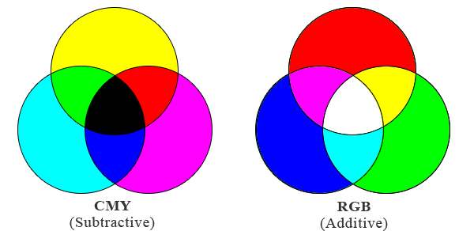

What are multiplication and division then? It is the definition of one value by the units of another value.  For example, in division, such as $\boldsymbol{3=\frac{12}{4}}$, we are stating that 3 is what we get when we measure an existing value (12) by a unit of 4.  In multiplication, such as *12=3&times;4,* we are determining a new value by taking one of these units-of-4 and adding it some number (3) of times.  The 4, as the divisor or multiplier, is the *unit of measurement* and the 3 is the *number of units*.  Every kid knows what was just stated, but when we apply those same simple rules and concept to a non-math context, they become very significant.  (For highly speculative thoughts on the meaning of squares and square roots see appendix E &ldquo;*Meaning of Squares and Square Roots*&rdquo;)

As mentioned above, we would expect to see the same laws expressed in different ways across all the scopes that the laws apply to, so we would expect to see an example of Newton&rsquo;s 2<sup>nd</sup> law in the tholonic realms of society, or planets, or organisms, and we do.  For comparison, we also show how the attributes of the tholon would appear using the same laws.  (Note: The lower case &ldquo;neg&ldquo; represent is new N-state that results from the children of &ldquo;NEG&rdquo;.)

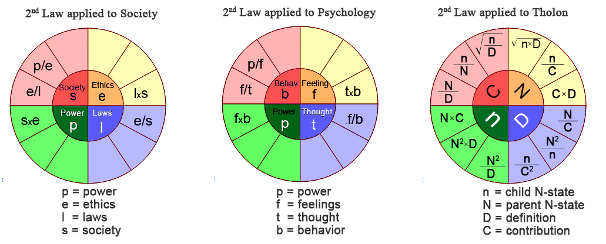

For example, if we claim that a society is based on its ethics and we also posit that ethics are to be measured by laws, we can say *society=ethics/laws*, and likewise, *ethics=laws x society*.  If we measure the *power* of a *society* by its ability to function, and the measure of a *society* by its sustainability, then, according to these formulas, a *society* with a lot of *laws* and very little *ethics* will be functional but is less sustainable.  On the other hand, a *society* that had a lot of *ethics* and very few *laws* will have the same level of functionality but will also be very sustainable.

How do we know this? 

We arrive at this by assigning $society = 3$, $ethics=6$, and $laws=2$.  How these assignments were arrived at is not critical because they may change and it does not matter for the point being made.  With these assignments, $\boldsymbol{society=\frac{ethics}{law}}$ follows the same reasoning as the formulas in the same PP, which is $\boldsymbol{3=\frac{6}{2}}$ , so we can say 

- $society=\frac{ethics}{law}=\frac{6}{2}=3$

- $power=ethics\times laws = 6\times 2=12$.  

If we then double $ethics$ from 6 to 12, but keep $laws$ the same as 2, we get 

- $society=\frac{ethics}{law}=\frac{12}{2}=6$

- $power=ethics\times laws = 12\times 2=24$.  

But if we double the $laws$ from 2 to 4, and keep $ethics$ the same as 6, 

- $society=\frac{ethics}{law}=\frac{6}{4}=1.5$

- $power=ethics\times laws = 6\times 4=24$.  

In the last two cases $power$ remains at 24, but $society$ drops from 6 to 1.5.  

If we swap the values of $ethics$ and $laws$, the we get the same results ($society=.666$ and $society=0.1666$).

How these translate to the real world is only speculative right now, as it is up to the reader to decide if *laws*, *society*, *ethics*, and  *power* are the best concepts to use here and if so&hellip; 

- what *power* (the rate, over time, at which energy is transferred) represents
- what *energy* itself generally represents in this context
- what the social equivalent of *squares* and *square-roots* are.  

How would this look if we used concepts such as *natural rights*, *privileges* and *responsibilities*?

This can apply to any properly defined trigram.  Let&r&ldquo;quo;s test it out on the cognitive behavioral trigram shown above.  For example, if we claim that a *behavior* is a product of *thoughts* (one&r&ldquo;quo;s own or those one is exposed to) and we also posit that *thoughts* are to be measured by *feelings*, we can say *behavior = thoughts / feelings* and likewise, *thoughts = behavior x feelings*.  So, high *thought* with low *feeling* results in high *power* (whatever that is in this context..  intention? beliefs? desires? will?) and very low *behavior*, while low *thought* and high *feelings* results in equally high *power* but also high *behavior*.  I am not claiming that the values I have assigned for this example are accurate.  I suspect it would take quite a bit of discussion and research to find the best values.  The point of this is to suggest that with the correct values these equations would produce meaningful results.  

The chart (below) is a speculative idea about how the naturally occurring relationships we see in nature, such as Ohm&r&ldquo;quo; Law, might also apply across other scopes.  The formula wheel on the right is to numerically show how the four concepts (limitations, instantiation, range, power) of any instance of *knowledge* relate to, and define, one another.  (In this chart the concept of *power* is left undefined for all but *electricity* and *relativity*, as it is not clear how the would be described.&ldquo;

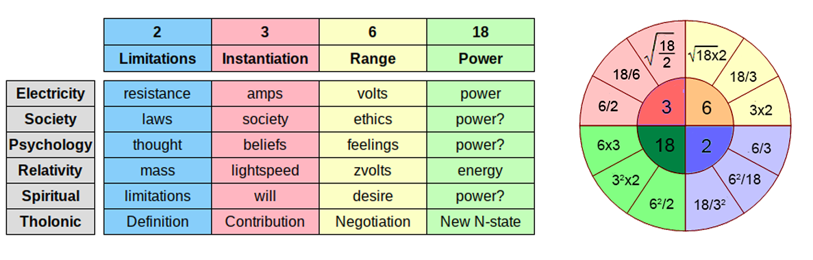

In any case, the twelve formulas of Newton&r&ldquo;ldquo;quo;s 2<sup>nd</sup> show some very interesting relationships between ethics, laws, society, and &l&ldquo;ldquo;quo;power&r&ldquo;ldquo;quo;, and, in my humble opinion, a new perspective on the dynamics of culture and society that, if nothing else, raises some important questions.  As it applies here, it shows how the tholon can describe everything from atoms to culture.  Because the math involved in a tholon can be more than the reader might be interested in, some of this subject is covered more deeply in Appendix B.

What is being said here is from the the 3+1 dimensions of reality to the laws of electricity to the way the psyche works, all of these are expressions of the same primary archetype of energy (and it&r&ldquo;ldquo;quo; children).  This means that *thoughts*, *ohms*, *laws*, and the *Z* axis  represent the same primal energy or awareness expressed in very different contexts and scopes, just as are *feelings, ethics, volts, X axis*, or *society, behavior, current, Y axis*.  This also suggests that *beliefs* (or intention, desire, will?), *time*, (social) *power*, and (electrical) *power* are also the same &l&ldquo;quo;white dot&r&ldquo;quo; in different contexts and scopes.

With this in mind, let&r&ldquo;quo;s reexamine the above claims:

**Definition = Negotiation / Contribution**

The definition of something is its boundaries, limits, abilities, attributes, properties, and resources.  All of these details are the results of the scope and context of that thing&r&ldquo;quo;s instance.  It could be environmental factors, genetic attributes, planetary limitations, such as size and weight of a thing, energy levels, etc.  It is the nature of energy to expand in every way possible.  That expansion is the contribution, but it is the resistance from these factors that determines what expansions get the opportunity to be expressed and what expansions are thwarted.  That battle between the force of expansion and the force of resistance is the negotiation (*see Negotiation=Contribution&t&ldquo;mes;Definition*).  As *Definition* is *Negotiation* / *Contribution*, we can say that *Definition* is measured by that which is *Contributed*, or, the *Definition* of something is determined by what it can (sustainably) *Contribute*.

**Contribution = Negotiation / Definition**

What a thing can *Contribute* is measured by its *Definition*, but the degree to which it can contribute is determined by its environment and how it interacts with that environment.  That interaction is a result of *Negotiation*.  A thing must provide something that something in its environment needs, otherwise what it has to contribute is useless and unitegrable.

**Negotiation = Contribution x Definition**

A thing&rdquo;s ability to find a stable and sustainable position within its environment and scope is determined by the degree to which it can contribute with its current resources.  A thing may have a *Definition* that gives it a lot of A and a little of B, but if its environment needs a lot of B and very little A, then it is B that the thing it must *Contribute* to ensure its existence in that environment, or it needs to find another environment, or change its environment so that A is in more demand.

Applying different values and concepts can result in new data.  We experiment with this a little, but given it is outside the main theme of this book, we have put that section in appendix D, &ldquo;New data?&rdquo;

## And the point is?

The point of all this is to show one way that the tholon can be used and viewed.  There are many new ways of looking at energy in all its forms when viewed tholonically.

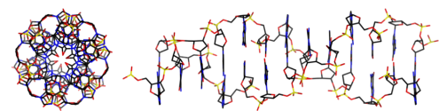

We showed examples of quarks and molecules, but in higher orders, such as DNA, we also see some striking similarities as well, and with a bit of investigation, we can probably find some stunning relationships.  

Although DNA&rsquo;s  relationship with tetrahedrons is particularly unique given the creation of tetrahedrally structured DNA, or TDN as it is referred to.  TDN is the cutting edge of DNA nanotechnology and has various applications such as drug delivery, inhibiting certain gene expressions, and of course, interfacing with bio-sensors.  These TDNs assemble themselves from scratch and offer greater strength and stability that the ol&rsquo; fashioned dual-strand DNA.  Given that there is little accessible information on TDNs there is not much more that can be said here, other then they look pretty awesome and will most likely be the origin of a new form of life powered by TDN-interfacing A.I.  DNA-integrated quantum computers.


Our simple trigrams of relationships, such as Newton&rsquo;s  2^nd^ Law, becomes a *tetrahedron* or *tholon* of relationships.  Whereas before it was stated that every piece of knowledge can be deconstructed into a trigram, by the same token, every piece of knowledge forms a tetrahedron.

## Batteries

With this more expanded tetrahedral model in mind, let&rsquo;s briefly jump back to the examples of deconstruction mentioned earlier.  An example of how any system can be reduced to a tholon is presented an insightful article on the effectiveness of batteries, titled &ldquo;The Unfortunate Tetrahedron.&rdquo;[^161] This may seem fairly niche, but it turns out to be very relevant, which is not surprising considering that batteries are all about sources and movement of energy.  In this article the author shows how the systems of a simple battery can be modeled as a tetrahedron, and how these fundamental aspects of a system relate to one another.  In this article the author looks at the four aspects of batteries; *energy density*, *power density*, *operating cost* and *capital cost*.  

Where:

**Energy density** is how much energy a battery can store in its mass (like a dam).

**Power density** is how much energy it can deliver relative to its mass (like the turbines in a dam).

**Capital cost** is the cost of the battery.

**Operating cost** is the cost to recharge the battery, and costs associated with keeping it safe.

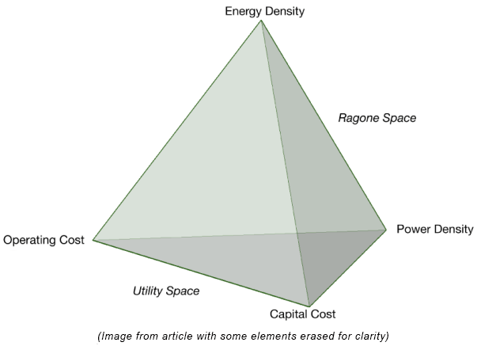

From this model we have four trigrams:

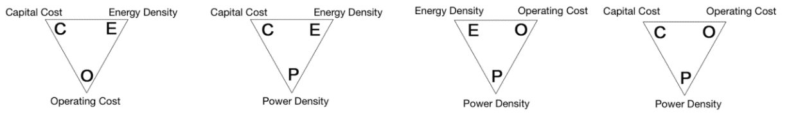

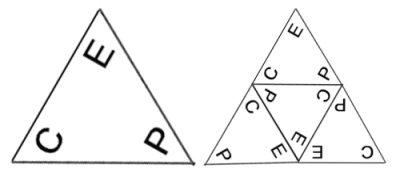

We can equate **E** with an *N-source*, **P** as a *defining* point, **C** as a *contributing* point, which makes **O** the unifying &ldquo;white dot&rdquo; point (for brevity&rsquo;s sake I won&rsquo;t detail the reasoning behind these associations.  The reader may arrive at a different conclusion).  With this ordering, we end up with the 2D tholon map (above, showing parent and next-gen children).  

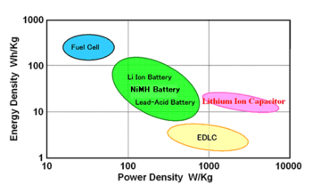

According to the article&rsquo;s own conclusions, the relationship between **E** (energy density) and **P** (power density), which is equivalent to an *N-source* and a *defining* point, is what he refers to as the *Ragone Space*.  The Ragone plot (above) measures the performance comparison of various energy-storing devices.  This chart is a perfect example of the axis of &ldquo;laws, rules and limits&rdquo; that connects an *N-space* with a *defining* point in the model of the tholon.  

On the opposite side, between **C** (capital cost) and **E** (energy density), which is equivalent to a *contributing* point and an *N-source*, we have the tholonic axis of &ldquo;service&rdquo;, which I think also fits quite well if you consider giving your money to an organization or person for a product that fills a need is the definition of a &ldquo;service.&rdquo; Remember that the descriptions of &ldquo;laws&rdquo; and &ldquo;service&rdquo; were specifically meant to apply to the context of our daily lives.  In the realm of economics, production and specifically batteries in this case, that same intention might be described a bit differently.  

According to the tholonic model, the only place where a new stable pattern capable of replication can occur is between *define* and *contribute*, which here is **P** (power density) and **C** (capital cost).  Across this spectrum of &ldquo;cooperation or conflict&rdquo; you will have all the various instances of batteries that can deliver power at a cost, most of the instances landing in the middle, representing the best delivery of power at the best cost.  *Power* and *cost* are the two poles, the contrasting forces, the thesis and antithesis, of this spectrum.  Here you would have instances like alkaline cell batteries (Duracell), lead-acid batteries (car batteries), nickel-cadmium batteries (rechargeable batteries), etc., etc.  Each of these new instances (stable patterns), can then go on to create their own tholonic archetype.  As the author relates in his article, which so aptly fits into the tholonic mode as well, &ldquo;You can have it good, fast or cheap; pick two out of three.&rdquo;

## Circuits

There is one more instance of this trigram model that holds tremendous potential, and that is electronic circuits.  One of the most common and important circuits in electrical systems is the very simple *resistor-capacitor circuit*, or *RC circuit*.  It is used to filter and control signals not only in man-made electrical circuits, but in natural electrical circuits such as neuro-transmission in the brain and throughout the entire nervous systems of any living organism.  

No doubt the reader has seen such circuits as they exist in every computer system, alarm clock, microwave, and virtually all electronic devices.


Briefly, an electrical **resistor** is a component that can reduce the flow of current, adjust signal levels, divide voltages, and limit or control the current of a circuit in some way.  A **capacitor** is a device that stores electrical energy in an electric field.  In one way, a capacitor is like a battery in that is can store energy, but unlike a battery, it can not produce new electrons, it can only store existing electrons.  Air alone acts like a capacitor and is often used in radio circuits.

Let&rsquo;s  look at a simple RC circuit.  

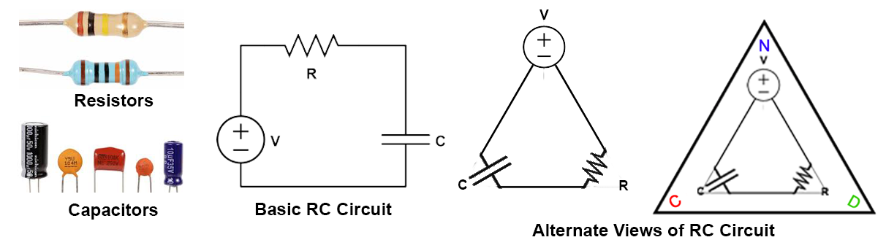

We have two basic elements of a circuit, one that limits and divides, and one that collects and stores.  These two concepts are perfectly in line with the two basic concepts of *Definition* and *Contribution* as shown in the *Alternate View* above.

How can we validate this similarity? Let&rsquo;s  look at the following:

- The N-state acts as both the source and the destination of the energy.  This would represent both ends of a battery, or a charge and a ground.
- The capacitor is returning the energy to the destination, and the resistor imposes restrictions on the source.
- Voltage originates in the N-state in this example, which is also the case when we assign electrical properties to the tholon, as we did in the section on Ohm&rsquo;s  law, so there is consistency.
- The output of a RC circuit is a wave has a unique form showing an exponential growth followed by an exponential drop, 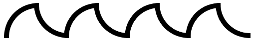. While the details of the form can change depending on the components, it always has the same characteristics of ascending an descending.  The interesting thing about this waveform is that is can be perfectly recreated by quadrants of a circle.  Of course, just because two things have the same shape doesn&rsquo;t mean they share anything else that the shape, but in this case it appears they share more. At the least, if the RC circuit *is* an instance of a tholonic trigram, then we would expect to see its output have some relationship to the thologram… and we does&hellip;If we assign the tholonic *power values* (which act as exponents in a binary system) and colors to those quadrants where 0=blue (parent N-state), 1=red (Limitation), 2=green (Contribution) and 4=yellow (child N-state), we find the same characteristics and patterns we see in the thologram, specifically, the 2D tholon map. For example:
  -  we see only the N-States (yellow and blue) overlap on their own color and alternate between parent&rarr;child&rarr;parent&rarr;child, etc., as we would expect. 
  - The green and red alternate in direction and pair up, and in doing to create a new child N-state (yellow). 
  - There is no square that has a piece of blue. It is either all blue, all yellow, or reg-green-yellow.
  - Every quadrant that is not exclusively an N-state contains all the the other attributes (red, green, yellow) which alternate only along the path of the *lineage* (parent&rarr;child). 
  - Each circle in the row is alternately flipped ob both the blue-yellow axis (parent-child N-states) and the across red-green axis and (*Definition-Contribution*) The direction of the overlaps are the same as the path of the lineage.  We see this in the tholon as well.
  - The overlapping values are a product of 3 (except 0 of course), and in an order that creates a continuous oscillation 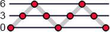. In addition, as binary exponent they all add up to 81:  $\boldsymbol{2^{3} +2^{6} +2^{3} +2^{0} \ =\ 8+64+8+1\ =\ 81=9^{2} =3^{2^{2}}}$. We would expect to see a lot of 3-based numbers if this relates to the thologram.

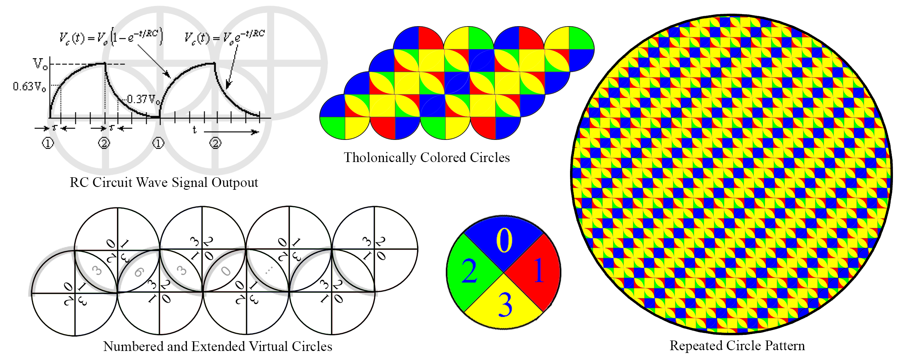
- The field in which the child N-state can be created exists between *Definition* and *Contribution*.  Here, that field is defined by R and C, which creates a field of *time*.  In electronics it is called the $time\ constant$ and is written as  $\boldsymbol{\tau = RC}$ (where $\tau$ is the Greek *tau* representing the $time\  constant$)  and proves that the voltage (V) and the current (I) are always inverse to one another at any moment in time and increase/decrease as a function of time.

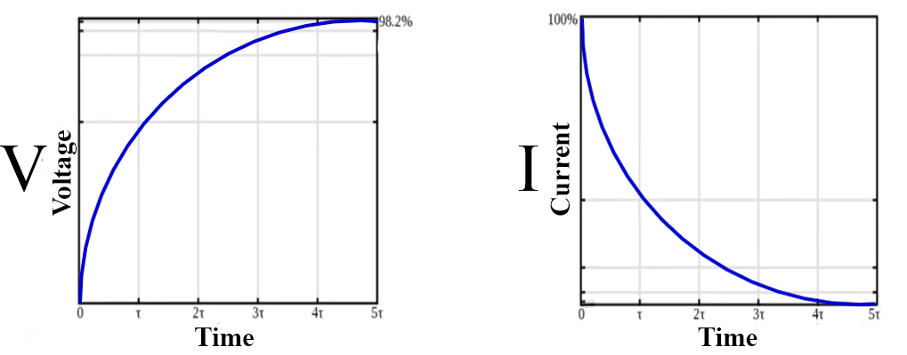

This *time constant* is then used to calculate $V$ and $I$ using the formulas $V( \tau ) =V_{B}\left( I-e^{-\tau /RC}\right)$ and $I( \tau ) =I_{0}\left( e^{-\tau /RC}\right)$.  The point here is not to explain the math, but to show not only that $V$ and $I$ relate to each other via $R$ and $C$, but that they do so across a field that is defined by $e$, or 2.7182, the number of the *natural log*.  This is especially interesting when applying the properties of this RC field to that of the *Definition/Contribution* field of the tholon, because $e$ is one of the most profound and fascinating numbers in math! 

It is similar to *pi* in its significance, but where *pi* is the ratio between circumference and diameter shared by all circles, $e$ is the base **rate of growth shared by all continually growing processes**.  It has also been called the **epidemy of universal growth**.  This growth can be anything; population, radioactive decay, interest calculations, even jagged or unpredictable systems that don’t grow smoothly.  Anything that has a continuous growth can be modeled with $e$.  $e$ is to growth what the radius is to the circle.  

$e$ and the Natural Log, or $ln()$, are two sides to the same concept as $e$ and the Natural Log are inverse, or opposite one another, so $ln(e)=1$.  $e$ describes **growth**, and  Natural Log describes **time**.  For example:

- $e^x$ is the amount we have after starting at 1.0 and growing continuously for $x$ units of time, so $e^x$ lets us **plug in time and get growth**.
- $ln(x)$ (Natural Logarithm) is the time it will take to reach amount $x$, so $ln(x)$ lets us **plug in growth and get the time** it would take.

Considering that the tholon is a model of growth, it seems particularly applicable that $e$ would define the field from which new N-states spawn new tholons.

If we are claiming this trigram is tholonic in nature, then what is *white dot*, the 4^th^ point needed to create a tetrahedron? It would be the *charge*, symbolized as $Q$ or $q$ in calculations.  Simply put, the *charge* is the the force of the negative and/or positive attributes of electrons and protons.  1 electron has a *charge* of -1, and 1 proton has a *charge* of +1.  Together they have a *charge* of 0. *Charge* as the 4^th^ point can be validated with Ohm&rsquo;s Law, and is archetypally represented as the proton and the electron where it holds the same position of the *white dot* as (electrical) power, energy (as in relativity), and as we show in the next section, gravity and consciousness.

This opens the idea that were tholonic principles to be applied to such systems as society, law, ethics, etc., there could be predictable times to achieve specific goals following specific rules of how to achieve those goals.  It also shows how economics is not a man-made concept, but an natural and organic system that we humans are simply the channel of expression for.  This is the &ldquo;invisible hand&rdquo; 18th Century Scottish economist and philosopher Adam Smith, a.k.a  the &ldquo;Father of Economics&rdquo; or &ldquo;Father of Capitalism&rdquo;, referred to when he described the unobservable market force that helps the demand and supply of goods in a free market to reach equilibrium automatically.[^198] More recently, this has been referred to as &ldquo;Complexity Economics&rdquo;,[^197] and is so compatible with the tholonic model that it is perhaps the best explanation of the tholonic process (within the context of society and economics).

There is one more significance to $e$ that is purely tholonic and will no doubt annoy math purists, but is added here because of symmetry.  Referring back to how it was described that one point creates two points and two points created three points, when we created the second point we had a 1D line from *Negotiation* to *Definition*.  However, we also had a center and a radius, thereby defining a circle.  In this way, the first two points implies *pi*,  so were we to assign an implicit value to that 1D lines it would be *pi*.  If we also assign the first point, the N-state, as 0 and the 2^nd^ point as +1 as it is the addition of a new point, then we could assign the 3^rd^ point of *Contribution* -1, as it is returning to 0.  This makes the field within which new N-states can form along the spectrum of -1 to +1.  What value could we then assign to the line connecting points 3 and 1?  One candidate is $i$, the square root of -1, not simply because it is returning a numerically inexpressible value to the source, but also because if this tholonic trigram represents the three values of $e, \pi, and\ i$, we can construct what has been called the most elegant formula in math,  $\boldsymbol{e^{i\pi}+1=0}$, or better stated here as $\boldsymbol{0-1=e^{i\pi}}$.  These values are those attributed to the lines connecting the point, not the points themselves, so this would suggest that the value of the 4^th^ point, or *white-dot*, of a tetrahedron is -1 as  $\boldsymbol{e^{i\pi}=-1}$.  Of course, 0 represents the original N-state from which everything emerges.  In addition, as $e$ represents time and *pi* represents space, we have the two dimension of time and space, plus the mysterious, inexpressible value of $i$ and the introduction of a *complex* dimension of numbers (i.e.  complex numbers).

One last related note… remember that seemingly obscure reference to the Ragone plot shown in the batteries section?  We can use this same plot to show that new designs in capacitors far outperform batteries.  The relevance here is that the Ragone plot is quite compatible with tholonic principles, and the storage of energy (batteries, capacitors, air) is quite analogous to the *Contributing* qualities of the tholon, making the Ragone plot a potential model for tholons and for evaluating *Contributing* properties, be they in economics, society, or energy.

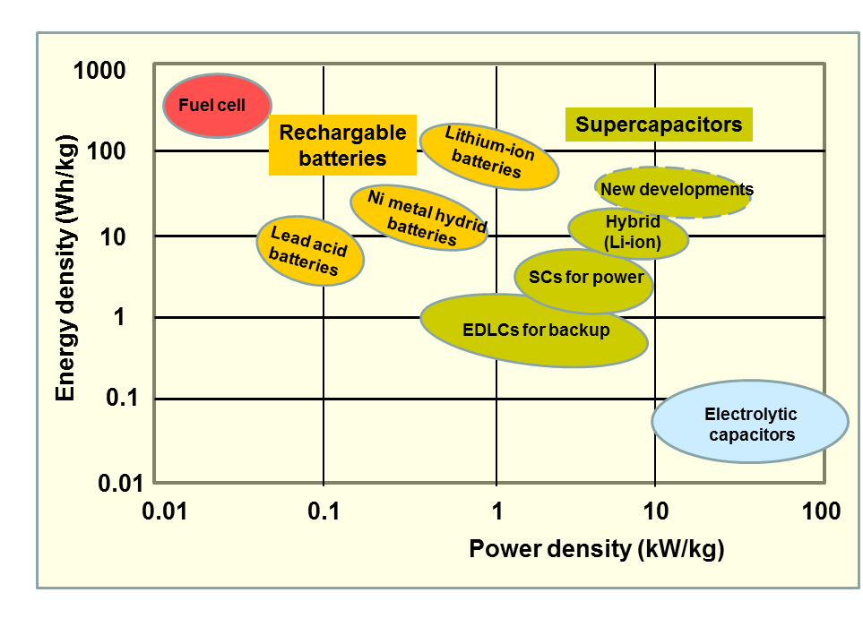

## Calculus

Calculus is another tetrahedral model that fits into the tholon nicely and could only be brought up at this point in the story.  Calculus is the study of continuous change (and therefore the study of reality) and has three main concepts that are quite compatible with the three main concepts of the tholon.

**Limits**

- **The values a function approaches.**
- The *N-state* is effectively 0 as it exists in a 0-dimensional space that has no form and is only a concept of what is the ultimate limit, and its implied inverse and opposite, infinity.

**Differentiation**

- **Defines the measure of things, resulting in derivatives.**

- The existence of this conceptual 0-point implies the next point, *Definition*, which is the domain of 2 points and 1 dimension.  This makes *Definition* the domain of measurement, as measurement is fundamentally a 1-dimensional concept.  There can me many 1-D measurements to describe a multi-dimensionality but in any scenario, a measurement can be described as one or more 1-D measurements.  The existence of 1 now allows for the concept of all numbers (that are not 0).  However, these 1-D measurements can&rsquo;t describe anything but a line.  To describe more than a line those 1D measurements need to relate to other 1D measurements.  

- Derivatives are what calculus calls the results of comparing two points, and it is defined by the notation…

  ### $\boldsymbol {\lim\limits _{\Delta x\rightarrow 0} \ \frac{f( x+\Delta x) -f( x)}{\Delta x} =\lim _{\Delta x\rightarrow 0}\frac{\Delta y}{\Delta x} =\frac{dx}{dy} \ =\ n}$

  …which simply means our results (the derivative of $n$) will approach its limits (exactness) as the difference in our measurements ($\Delta x$) approaches its limit (0).

**Integration** 

- **Uses the derivatives to calculate the area.** 

- The *Contribution* point of a tholon adds another dimension, so now we have 2-dimensionality (described by two 1D measurements).  In order to measure changes we need to look at a series of 2D points (which are made up of a series of 1D points, the *Derivatives*).  The less separation ($\Delta x$, where $x$ can be time, space, some numerical variable, etc.)  between these points, the more accurate the results.  The smaller $\Delta x$, the more points ($ n)$ we have.  The sum of these points is expressed as the inverse notation of above:

  ### $\boldsymbol{\lim\limits _{n\rightarrow \infty } \ \sum\limits ^{n}_{i=1} f( x_{i}) \Delta x_{i}}$

  … which simply means the sum of all the derivatives ($ n$) staring from the first ($ n_{1}$) up to the last ($ n_{\infty }$), which will always be the inverse of the limit of the derivative, $\boldsymbol{\frac{1}{0} =\infty }$

  But because we are dealing with infinitesimally small pieces, we use the integral function:

  ### $\boldsymbol{\int ^{z}_{a} f( x) dx}$

  … which says that we have an infinitesimally small difference between points ($ dx$) that exist between points $a$ and $z$.  

The functional part of calculus exists between the **Differentiation** and **Integration** as that is the spectrum within which the fundamental theorem of calculus exists.  This is also the spectrum where N-states can exist when it is defined by *Definition* and  *Contribution.*

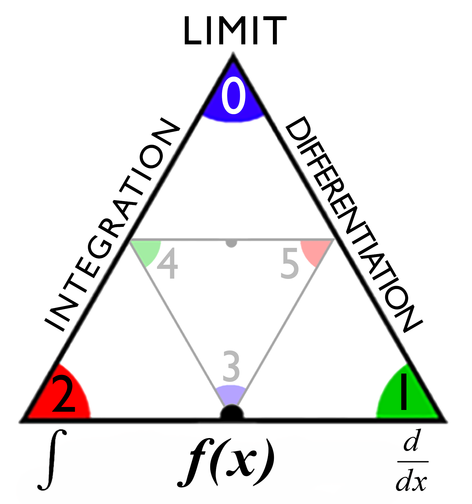

Perhaps there is a way to apply calculus to non-mathematical systems, like psychology, society,law, etc.?  This is far beyond my abilities, but I imagine it would look something like the calculus used in such things as Game Theory or the Nash Equilibrium (John Forbes Nash Jr.  was an American mathematician who created the Nash Equilibrium, for which he awarded both the Nobel Memorial Prize in Economic Sciences and the Abel Prize.  He was the subject of the movie &ldquo;A Beautiful Mind&rdquo;).

## Stock Exchange

The stock market also operates tholonically and as it is so well studies and understood, it offers insights into the mechanics of the thologram in general.  In fact, the stock market, and perhaps economy in general, is one of the best instances of tholonic processes. This is not surprising as economics is as organic and natural an archetype as is any life form. 

The stock market is an aggregate of numerous values that are determined by the two constantly opposing forces of buying and selling.  While there may be many influential factors that drive those forces, the authoritative value in any one moment of time is a clear and indisputable number that has been agreed upon.  These opposing forces are illustrated in the chart below, where it shows the *depth* of each force and the ever-moving point where they cooperatively meet.  The X-axis is money, and the Y-axes is volume. 

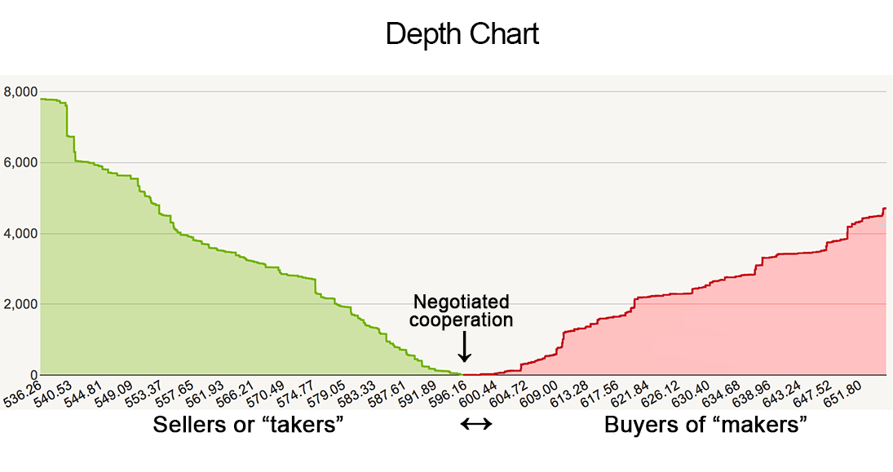

The record of these changes is what we recognize as a classic stock market chart.

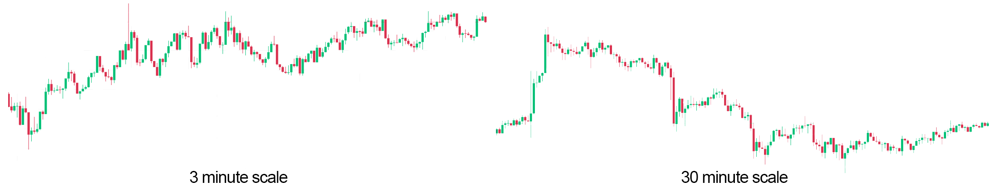

You'll notice the chart is not made up of dots, but of what are called *candlesticks*.  The candlestick is a very clever way to show information and was created by the Japanese in the 17^th^ century for the rice markets, and it is very applicable to the thologram.  The candlestick record is also called the HOCL bar because it records the  hi, open, close and low prices for a given period of time.

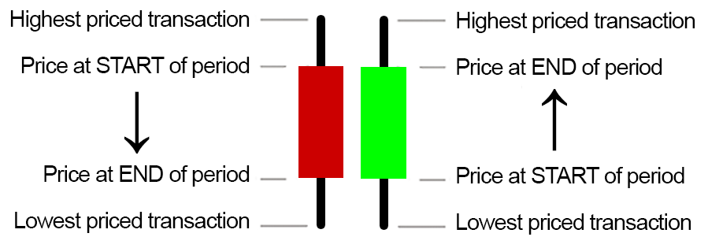

Why this is relevant is because each candlestick shows the two maximum opposing values valid for the time period. These would be the highest and lowest prices.  These two prices define the spectrum within which any cooperation *could* exist. The START and END prices represent the area within that spectrum where a cooperation *does* exist. As you can see by the 3 minute and 30 minute charts above, the spectrum and the agreements can vary wildly. Both of those scale are of the same asset and start at the same time. Equally significant is that what is ascending on the 3-minute scale can also be descending on a different scale. Of course, if we showed the two scales in proportion, you could see the the 3 minute scale agrees with the 30 minute scale, but that is irrelevant if the context of the trader is 3 minutes, not 30 minutes. 

Another interesting process is how multiple candlesticks can be added together. The graph below shows two candlestick of some time period ($t$), which when added together show show the aggregate of those two candlesticks.  That aggregate is equal to the single candlestick of $t\times 2$. So, if you want to see the aggregate of 64 1-minute period candlesticks you just need to look at the one candlestick of one 64 minute period. 

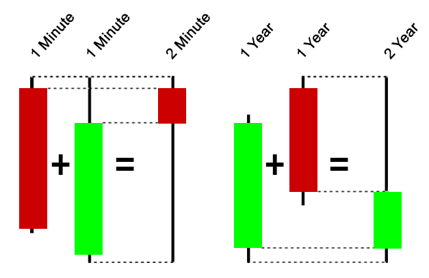

What was just explained is exactly how tholons works as well. If that is so, then we should be able to apply some of the laws of the tholon onto market data.  If we were to use one of the simpler laws, such as Ohm&rsquo;s Law, we get the graph below (all data normalized to a scale of 0-1 and shows a moving average of Bitcoin/U.S. Dollar trades).  But what values would we use?  Fortunately, the choices seem obvious.

- **Volts** (blue line) is defined as the potential between the high and the lowest charge, so the **highest and lowest bids** would fit perfectly here.

- **Amps** (orange line), or current, is the volume of electrons in play and one moment, so volume of trades would seem to apply here.

- **Power** (green line) is defined as $Power=volts \times current$, so we have to calculate the the power value here as $Power=price\ range \times trading\ volume$, even though I don&rsquo;t know what this would represent at this point. 

- **Resistance** (maroon line) is also calculated, but we know that this value must equate to the agreed upon **price**, but it doesn&rsquo;t, as we have the actual price (yellow line) on record and it is not the same.  This number is called the **Balanced Price**, as it represents the price that is perfectly matched to the volume and the price range.

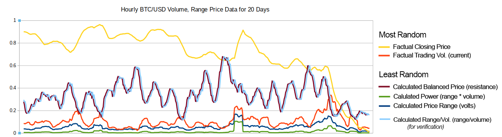

The light blue line on top of the maroon line shows two lines that represent the balanced price, but were arrived at in two different ways;  $\frac{Range}{Volume}$ and $\frac{Power}{Volume^2}$, just to ensure they matched as expected.

However, we can&rsquo;t trust our eyes.  The following chart shows the results of testing for randomness in a file made of over two years of hourly trade data using the same process.  The more *compressible* the data, the more pattern and order it has.  Also included are other random test scores, and as you can see, all indicators show that the generated data using Ohm&rsquo;s Law has more pattern that the source data.

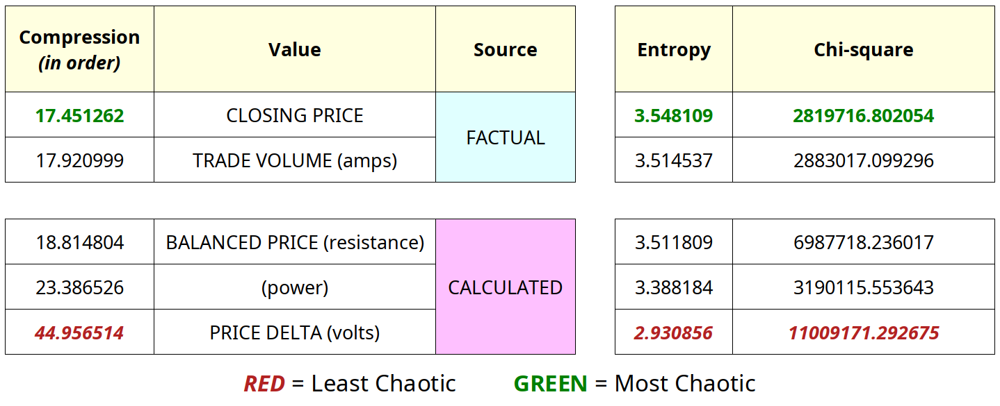

What is surprising about this is that one might assume that one thing that has $X$ amount to randomness added to another thing with $Y$ amount of randomness they would result in something that is *more* random, but here it looks like it is *less* random. Isn&rsquo;t that like throwing two handfuls of sand onto the grounds, and wherever they overlap there is a picture of a flower?

While this may not set Wall Street on fire, for our purposes it is very interesting to see that the *balanced price*, which is derived from the market data, has a pretty clear and predictable pattern, and from data that arguably has only a trivial, or no, relationship to each other i.e. the amount of assets traded and the range in which their prices were agreed upon. The yellow line is the actual price that took place (and the most random), and the only obvious relationship is that *balanced price* appears to move somewhat contra to both the actual price and the trading volume.  

Approaching this tholonically, we'd say that the balanced price will always represent the optimum relationship between volume and price range, both of which are always changing.  However, the actual traded price rarely reflects that relationship.  Consequently, the other variables in play will naturally adjust because (hypothetically) all three variables of price, volume, and range are actually three perspectives of one thing, one instance, one tholon.  Below, the upper chart shows the actual price (blue line) and the balanced price (orange line). Both values have been adjusted to a moving average for the day and normalized to a scale of 0-1.  Each vertical line represents one day and the 24 hourly candlesticks of that day.  The first thing you can see is how the balanced price remains within a tight and consistent range, while to actual price wanders all over the place.  The middle chart shows the same two lines, but the balanced price vales are added on top of the actual price values. We would have to assume that sometimes the force of the balanced price affects the actual price (by effecting changes in the other variables), and sometimes the actual price affects the balanced price due to the forces of the other variables effect on those variables. The bottom charts shows the two line on the same scale. Most notably the two line appear to counteract each other, pulling and pushing the actual price as if it was acting as a force of *resistance*.  This is especially interesting as the differencces between the two lines, as we can see in the middle chart, appear very minor.

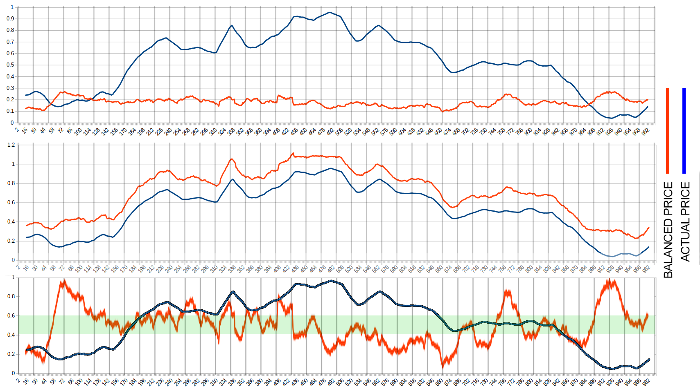

I have no doubt that serious research would yield interesting results. From the tholonic perceptive, knowing that perhaps the stock market, music, story telling, batteries, electrical circuits, and much more, all have a correlation is interesting, but suggesting they are all effects of a higher-order cause is much more interesting.

## Consciousness

The highly respected and published team of Donald David Hoffman (cognitive psychologist, author, and Professor in the Department of Cognitive Sciences at the University of California, Irvine) and Chetan Prakash (PhD Mathematical Physics, Cornell University) developed the idea of a *conscious agent*, which is a dynamic process of consciousness and argue that it is the interaction between various agents that produce measurable phenomena such as the position, momentum, and energy of objects.  They further argue that these objects have no objective, absolute or even preexisting properties and only exist in relation to consciousness via these *conscious agents.* This is a radical claim, but their arguments and evidence as laid in it their paper &ldquo;*Objects of consciousness*&rdquo; [^202] can&rsquo;t be ignored.  What also can&rsquo;t be ignored is the striking similarity between the two models, as shown below.  (This was also especially striking for me as I learned of this long after the first publication of this book.  Of course, they do a far better job of explaining their idea technically, mathematically, and psychologically.) 

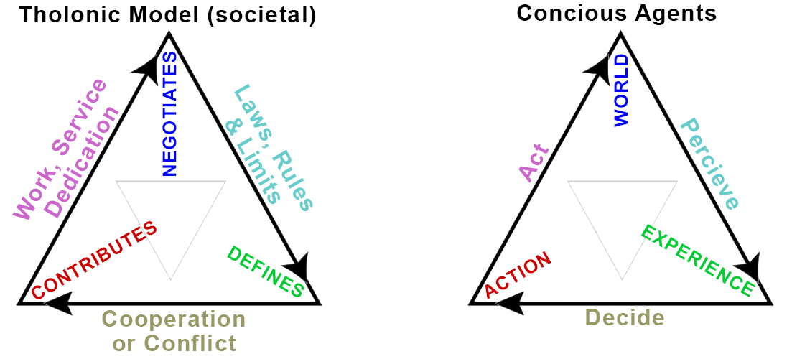

## Adding Structure

A general prediction would be if we could add structure to form, thereby increasing its ability to transfer energy, we would see testable results.

Given how water seems to be such a good tholonic medium, can we add structure to water in a way that matches the patterns of the thologram and see some differences in how it transmits or interacts with energy? If we do see any differences, then we have another piece of potential evidence that supports the thologram model.

As it happens, there is such a thing as *structured water*.  *Coherent* or *Structured* water, for those who are not familiar with the term, is regular water that has been modified to give it more structure or pattern, specifically in the way that the water molecules are arranged in relation to one another.  

OK, I know I probably lost some of the readers with this last sentence.  If you do an Internet search of &ldquo;structured water&rdquo; one of the first results you will get is the Wikipedia entry that begins with &ldquo;structured water, is a term used in a marketing scam &rdquo; and although that is true to the extent that anything can be a scam in the hands of scammers, the entry says nothing whatsoever on the research and testing that has gone into the use of structured water.

To the dogmatically skeptical, anything that challenges the current world view is &ldquo;swarming with worms of heretical perversity.&rdquo; It doesn&rsquo;t matter if a new idea, in this case, structured water, has vast amounts of scientific research and support from highly accredited professionals and ample evidence one can find by researching the pioneers and leaders in the field, many with a lifetime of contributions and dozens of Chairs, Fellows, and Adjuncts with Accolades of their life&rsquo;s work[^54], as well as hundreds of papers and dozens of books related to and supporting the structured water phenomena.  Skepticism has its place and serves a critical purpose, but regarding the extreme skepticism of structured water, that purpose does not seem to be moving understanding forward or seeking new solutions to real-world problems, such as solving global water shortage problems and increasing crop production, as has been well documented by some of Australia&rsquo;s largest produce farms.

There is quite a lot of good research on the subject that we won&rsquo;t detail here, but if you want to learn more a good place to start is Fabian Ptok&rsquo;s Masters theses *&ldquo;Alternative Irrigation Methods: Structured Water in the context of a Growing Global Food Crisis due to Water Shortages&rdquo;*[^55], which covers the subject well from an agricultural and security perspective but also has a number of references to the researchers and work going on in this area.  There is also a book available online for free[^56] (which I have not read, so this is not an endorsement).

Water is a particularly good test medium because the structure of water (not the $H_{2} O$ molecule alone, but many of them together) is tetrahedral, and being the most basic shape of creation lends itself to many different tholonic applications.  it&rsquo;s worth noting that when it was originally suggested that water might be tetrahedral is shape back in 1938 the idea was met with disbelief.  It was not until 80 years later, in 2013, that this was finally accepted as valid.  Today &ldquo;it is widely accepted that liquid water structure is comprised of two closely interweaved components; i.e.  tetrahedral and hexagonal structures.&rdquo;[^57] In fact, water, as ice, may be the closest instance of the entire tholon&rsquo;s structure of any other substance (that is common to us).

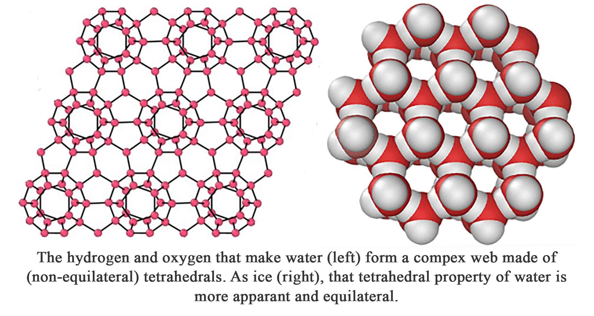

*(Above: Left image from &ldquo;Tetrahedrality is key to the uniqueness of water&rdquo; [^194])*

Radical ideas are often met with radical resistance.  Structured water is one of those ideas.

Simply by adding some structure to simple tap water (see examples of how to make structured water in Appendix A) we can see measurable effects.

In Ptok&rsquo;s the Master&rsquo;s thesis mentioned above, the author examines various tests that grew different plants using tap water and structured water.


One of his findings was that using structured water increased alfalfa growth by 15.1%.  This may not sound like much, but in the U.S.  alone a 15% increase in alfalfa growth represents an additional 20,700,000 tons of alfalfa, which has a value of over 4 billion dollars.

This is a perfect example of how the simple enhancement of order at the most fundamental level can have radical changes up the chain.  These dramatic (theoretical) results were achieved with only one change to one element in one application.

In the tholonic modal, this example also applies to ideas, concepts, and intelligence;  small changes in one area can have radical consequences in the world of ideas, and of course, ideologies.

<div style='page-break-after: always; break-after: page;'></div>
# 8: MIND

Although there have been many references to the idea that awareness is an inherent property of existence, let&rsquo;s make this clear.

If the concept of a thing and the thing itself are two orders of the same form of expression of energy, and order is a prerequisite to intelligence, does this imply that everything with order, i.e.  everything that exists, potentially has a form of intelligence? In the tholonic model, yes, but more than that, even without order or intelligence there is awareness *and* intention.

This chart below was presented by Stuart Hameroff in his lecture &ldquo;Is Quantum Physics Necessary for the Account of Consciousness?&rdquo; at the  Polytech Museum of Moscow.  [^176] where Hameroff discussed, among other things, consciousness from a quantum perspective.  The blue line represents the expanding universe, and the red line (which I added) represents the tholonic perspective of the (more or less inverse) growth and expansion of the instances of awareness, or consciousness.  Notice how they are inversely proportionate, not unlike the relationship shown above in the section on circuits, where opposing forces grow inversely over time.  Hameroff asks the question &ldquo;When did consciousness arise?&rdquo;, but from the tholonic perspective, consciousness occurred when the first instance of awareness came into being, which would be the Big Bang itself, for all matter is an instance of awareness, and therefore must have a consciousness, no matter how faint or undeveloped.

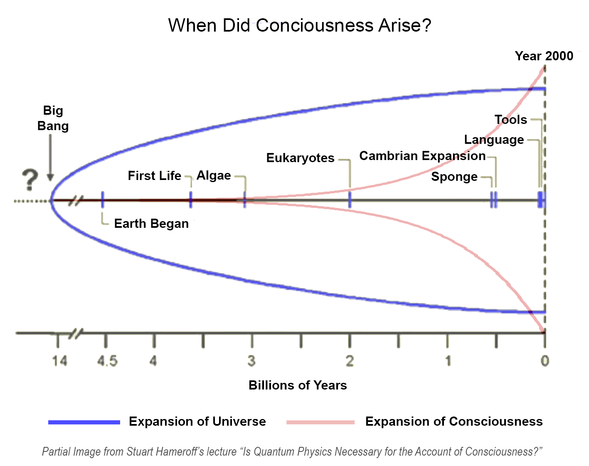

This is not that radical of an idea, as many great thinkers in the past have come to the same conclusion.

> &ldquo;There is a quality of life and intelligence to all matter.  The living universe.&rdquo;

##### \~Giordano Bruno (1548-1600), cosmological theorist, philosopher, mathematician & poet burned at the stake for heresy.

> &ldquo;Crystals are living beings at the beginning of creation.  In crystals, we have a pure evidence of the existence of a formative life principle, and although in spite of everything we cannot understand the life of crystals - it is still a living being.&rdquo;

##### \~Nikola Tesla

There is a name for the idea that consciousness is a property of existence; *panpsychism*.  You can read about its impressive history[^58] and the glowing support it has received over the last 2,000 years from some of the greats of philosophy, psychology, and science.  The minor difference between panpsychism and tholonism is that the latter claims it is awareness and intention, not consciousness, which is the property of existence and from which consciousness and intelligence arise.

Intelligence in this context does not mean &ldquo;critical thinking&rdquo; or &ldquo;self-aware,&rdquo; but it does mean creativity, learning, and problem-solving, properties that nature, and the universe, demonstrates with flying colors.  We can go further and claim that the amazing relationships in simple geometry, such as the tetrahedron array with its Fibonacci numbers, rations, and hexagonal patterns that define the laws of nature and reality are evidence of logic.  So, let&rsquo;s add &ldquo;logic&rdquo; to the list of properties.  What about &ldquo;planning&rdquo;? Does nature plan anything or do we all just happen to live in a corner of the Universe that was lucky enough to win the Cosmic Mega-Lotto? We can easily see that the simple relationships between three points instantly define an infinite array for order, pattern, and symmetry on many levels.  This isn&rsquo;t just *a* &ldquo;plan&rdquo;, it is *the* plan.

Is there creativity in the universe? Only if one considers all of creation an act of creativity.  Does the universe learn? Well, have things evolved over the past 4.5 billion years by building on an ever-growing foundational structure? If you answer yes, then we&rsquo;ll add *learning* to the list.  What about problem-solving? This is a tricky one, because there is no such thing as a &ldquo;problem&rdquo; from the perspective of existence, because, as we have covered, if something does not follow the laws it does not exist.  If it does follow the laws, it does exist, so where&rsquo;s the problem as far as the Universe is concerned? &ldquo;Problems&rdquo; appear to be a concept born in the meta-awareness of more developed life forms.  Still, the fact that existence is only afforded to that which follows the laws, I would say that this is damn good preemptive problem solving as it prevents &ldquo;problems&rdquo; from ever happening in the first place.

So far, we have:

-   Creativity
-   Learning
-   Problem-solving
-   Logic
-   Planning

We have been making the case that ideas themselves are an expression of energy, and as they clearly incorporate and are even defined by all the properties of intelligence listed, it&rsquo;s reasonable to conclude that ideas themselves emerge from a form of intelligence, and may even have their own intelligence.

However, this intelligence is quite different from what we would call human intelligence because of its aggregate nature.  it&rsquo;s more of a recursively embedded network of countless decentralized nodes of intelligence.  It&rsquo;s the intelligence of the thologram as a whole rather than the human intelligence of one tholon alone.  A more graspable metaphor that applies to intelligence is that of a large tree.  Each part of that tree is an instance of the concept of &ldquo;tree&rdquo;; trunk, branch, stem, leaf, seed, etc.  There can be many instances of each contributing tholon, such as a leaf, but they are all part of &ldquo;tree&rdquo; and can only exist within the parent &ldquo;tree&rdquo; tholon.  You and I, and all things.  are but &ldquo;leaves&rdquo; or &ldquo;seeds&rdquo; or &ldquo;stems&rdquo;, or parts thereof, on this tree of universal intelligence, and like the leaf, we can not exist without it (even if we think we can).

### Aggregates

One of the attributes of a tholon, unlike its holarchic predecessor, is that the context and scope of a tholon is not only defined by the dualities of that tholon, but also by all the tholons above and below, as the children tholons are always contributing to the parent, and the parents are always defining the children.

#### **Claim 50:** Anything that exists, that has a sustainable pattern of energy, has some form of intelligence and is a contributing element to the larger intelligence that is shared by all existence.  

It is easy to see instances of this on a molecular level, such as how water is an aggregate of hydrogen and oxygen.  While the scopes and contexts of the elements are fairly well known, consider that water is a *parton* of larger tholons, such as clouds, tsunamis, wells&hellip;

We have a similar concept in the way our social institutions work.  *Interinstitutionality*, as this has been termed, explains how the various institutions of society like financial markets, governments, family structures, educational institutions, etc., all intertwine and create amalgamations and aggregates with one another.

Interinstitutional research is defined as the investigation of the chain of complex, interrelated problems regarding tactics, sampling, data reliability, and notions of causality within the realm of each separate institution with the goal of improving aggregation and amalgamation, [^59] not unlike the supply chain model previously shown.  

Take the institution of the modern American family as an example.  It can take many forms, but several extra-familial institutions affect the complexion of &ldquo;family &rdquo;, such as the market, profession, educational institutions, political affiliation, etc.  Each of these institutions brings to bear its own forces and logic on the amalgamated and aggregated institution of the family.  The market shapes perceptions of standards of living in the family.  The profession shape ideas of work and service.  Educational institutions shape the ideas and direction of society.  Politics shapes our understandings of the role and participation of family members.

All institutions of society are not simply autonomous social units isolated from wider institutional dynamics, but rather several structures wrapped up and labeled according to the concept of its purpose, each structure having its own set of rules, scopes, and contexts, forming aggregate and amalgamated rules, scopes, and contexts.

This is equally true for the institution of modern science which as much a product of interinstitutionality as any other single institution.  Far from the myth of a secular and objective and safe-guarded institution, modern science is itself an amalgamation of a whole host of non-scientific institutional factors such as the market, education, special interests, the state, politics, professions, etc.  Just watch the news to get an idea of how science is controlled by politics, economics, and culture in general.

### Tholonic Intelligence

We have a concept of a *human* collective intelligence, but we define it as something that has emerged from human intelligence, as opposed to human intelligence being an instance of an existing collective intelligence.

The tholonic view is that awareness and intention are not only attributes of existence; they are the cause of it, as explained previously.  More than that, awareness and intention are the ultimate, or purest, form of energy that is forever seeking balance in a world of duality.

#### **Claim 51:** Every archetype has an awareness, an intention, and an intelligence appropriate for its scope.  

On this point, tholonic thinking has coincidentally arrived at the same conclusion recorded 3,000 years ago in the Sanskrit Vedas which states that first there was awareness, then there was consciousness, and because of this, and according to the Vedic path, consciousness or intelligence can never be the path to awareness.  On the contrary, the path to awareness starts with quieting consciousness, according to the Vedas.  Tholonically speaking, it may be accurate to say that consciousness is an instantiation of awareness, and being an instance, it limited by the scope it is expressed in.  This all starts to lead into a philosophical realm, so we&rsquo;ll just leave it at that and let the reader take it from there.

The tholonic view is that intelligence precedes consciousness.  This still complies with the traditional definition of intelligence as &ldquo;The ability to learn or understand or to deal with new or trying situations.&rdquo; The difference being, in the tholonic model, consciousness is not necessary to learn, understand or deal with challenges.  We are seeing this today in AI systems that certainly can learn, understand and deal with the challenges before them, but these AI systems are not conscious… yet.  Does that mean these AI systems have awareness? Only to the degree that everything has some level of awareness given that awareness is the source of existence, but not necessarily at the tholon level, meaning, the archetype for a toaster has a nominal form of intelligence as well as access to the existing primitive intelligences of its parents (metal, electricity, etc.), but it has a minimal effect because it has no children.  This is similar to the idea that the wave function for any and every single electron extends to every corner of existence.  The wave function of one electron in the ballpoint pen in your desk drawer is interfering with every electron in the Universe and even the gravitational field of Alpha Centauri… in theory, and on an infinitesimally small range.

However, some *neuromorphic* systems (systems that mimic neurology), such as AI systems and even some integrated chip technology, have evolved to the point where experts and lawmakers argue that they deserve the same status as people with *personhood* rights, including the right to own property.  [^180]

The tholonic definition of *intelligence* is slightly different that the traditional definition:

> The ability to maintain a sustainable patterns of energy within the scope of its existence.

As patterns come from order, which is the result of energy, and energy is awareness, then by this definition, intelligence is synonymous with &ldquo;ordered or structured awareness.&rdquo;

According to this definition (and the understanding that consciousness is an instance of awareness), each tholon has the potential to create its own form or expression of intelligence, its own patterns of energy (awareness) that are contextually appropriate for its scope.  Rocks, then, as any of its hierarchical archetypes or an actual instance, have intelligence, as do planets, galaxies, chairs, and even what we would consider garbage.  Any concept that satisfies the tholonic requirements to exist must have an expression of intelligence.  Geometrically speaking, each tholon in the thologram represents an awareness and an intelligence for that tholon.  The spectrum of that initiating awareness and intelligence is as broad is existence itself.  

Because we consider tholonic instances (*things* like trees, humans, and planets) to be the result of these laws and patterns of energy that exist within the tholonic archetype of that instance, we also consider the intelligence of those instances to be an expression of the tholonic intelligence.  In modern terms, this would be something like the collective mind of not only a species, or a community, or even a relationship, but also a belief, a fear, an idea.

These archetypal intelligences, or collective minds, interact with one another according to the three fundamental relationships as already noted: Negotiation, Definition, and Contribution.

### Cooperation

While competition and cooperation are pillars of Darwinian evolution, the tholonic view is that Darwinian evolution is more inaccurate than accurate when it comes to how instances of life learn and evolve, and at the same time, it is more accurate than inaccurate in describing how tholons interact and evolve (but Darwinian evolution as a whole only represents a small contribution to the tholonic model).

Look at the amazing relationship between humans and the honeyguide birds.  In this symbiotic relationship, the bird tells the humans where the beehives are, the humans go and then collect the honey, leaving the wax and the larva, which is what the birds want.

Think of what is involved in these interactions.  The requirement is that birds must know collectively that they have the option to enlist humans to help them.  With that knowledge, they go out in search of beehives, which they could not even attempt to gain access to without human help, which means at some point some bird had the idea to recruit humans.

When one of them finds a hive, they announce it to their friends and then go and find humans who they know they can enlist, humans who have learned how to communicate with them.  The birds hop and chatter is a specific way that humans recognize as the message that they have found a hive.  The humans collect their tools and tell the birds they are ready.  The birds then fly toward the hive, knowing to always keep their white tail feathers visible to the humans.  When they all arrive at the hive the humans smoke out the bees, chop down the tree, remove the honey and give the rest to the birds.  This is a beautiful example of cooperation between two groups that are competing with another group.

What is truly amazing about this arrangement is that the birds and humans have developed their own language[^60].  Although it is not clear how or when this arrangement began, it is speculated that it was initiated by the birds when they saw that humans had the ability to make smoke and chop down trees&hellip; so, not only a long, long time ago but a literally &ldquo;birdbrained&rdquo; idea.

Are we being asked to believe that a really smart bird came up with the idea, explained it to his bird tribe, then educated and trained not only his feathered brethren, but the humans as well, in the manner of communication that this ingenious bird had developed? Likewise, how long would it take for a Bronze Age hut-dwelling human to know that a hopping, chattering bird was trying to tell him &ldquo;Hey, I found a beehive I am totally incapable of getting to, so I will tell you where it is if you and your boys use your smoke and axes to get to it.  You then take the honey and give us the wax and larvae.  Deal?&rdquo;

This sounds quite similar to the improbabilities described in the tall-tales of yagé and curare.

A better explanation is that the intelligences of the archetypes made this arrangement and once made was perceived by their instances, the birds and the humans, who effectively test-drove the idea to the best of their limited abilities.  We see these same type of arrangements in ants, spiders, beetles, monkeys, etc.

### Competition

The same applies to non-cooperative arrangements.  Take the example of *cymothoa exigua*, a tiny crustacean that attaches itself to the base of the fish&rsquo;s tongue and begins sucking the blood out of the fish&rsquo;s tongue.  Eventually, the tongue shrivels up and fall off, at which point the parasite attaches itself to the tongue muscles and actually becomes the fish&rsquo;s tongue, presumably getting first dibs of anything the fish plans to eat.  

At the tholonic level, this relationship is still symbiotic as both instances ultimately depend on one another to survive.  Once a tholon has achieved stability and becomes a contributing part of the thologram its pattern becomes integrated into the entire thologram, even if the nature of that integration is antagonistic.  Every form of existence we are familiar with is already well established in the tholon.  Only at the outer edges of the thologram, where chaos is being transformed into order, do patterns blink in and out of existence as they compete and cooperate in an attempt to find stability.  Removing an established tholon is not trivial given that the pattern is supported by then entire thologram.  Modifying a tholon is much more likely and achievable.  This is what we call adaptation (and the part of Darwinian evolution theory that works) The most common example of this is how animals adapt to their environments, such as how frogs can freeze their body, or have learned to build cocoons made of mucus where it can wait out a dry spell for up to 7 years, or develop skills such as biomimicry.  

The functioning of a tholonic intelligence might also be a contributing factor to what biologists call &ldquo;evolutionary rescue&rdquo;, which is when a species can rapidly modify its DNA to deal with the new challenges of its environment.  One example of this is the Cliff Swallow, an cliff dwelling bird that within three generations changed its wingspan to be 5% smaller in order to evade cars as Cliff Swallows are fond of building homes in the &ldquo;cliffs&rdquo; of bridges and overpasses.

Some of these competitive relationships between species are as terrifying as they are ingenious, such as how some parasites can take over the brain of their host and make them behave in ways that boggle the mind.  When the *green-banded broodsac* (*leucochloridium paradoxum*) gets itself inside a snail, not only does it make the snails eyes bulge out to look like a caterpillar, it &ldquo;drives&rdquo; the snail into open territory so that birds that like to eat caterpillars will eat it, and thereby transfer the parasite into the bird, where it will lay eggs that are embedded in the bird droppings all over the countryside.  This brilliant parasite appears to have a thorough knowledge of snail neurobiology and physiology, and even though it has the mobility of a 1 cm slug, it has a birds-eye knowledge of its terrain as well as the eating habits of its preferred transport vehicle.  That&rsquo;s pretty good for a creature that literally has around two brain cells (similar to the snail, which also has only two brain cells… in contrast, you have 100 billion brain cells.  Could you do that to a snail?)

We often think that competition is the opposite or contrary to cooperation, but from a tholonic perspective they are the same, in that competition tests the viability of a concept and/or rids it of instances that are not in the parent tholon&rsquo;s  best interest.

One relationship that appears to be both competitive as well as cooperative is that of the *Emerald Jewel Wasp* (*ampulex compressa*) and the cockroach, where the wasp uses only the slower, less apt cockroaches for it purposes,[^61] pruning the cockroach gene pool of the less gifted, which ultimately enhances the abilities of the cockroach collective and by extension its tholonic intelligence, of which the gene pool is an instance of.

The female wasp has quiet cleverly and strategically figured out that the best place to lay her eggs is inside a cockroach, as it can provide shelter (its exoskeleton) and food (its guts).  Needless to say, the cockroach is not so keen on this idea, and being much larger than the wasp, not so easy to convince.

The wasp&rsquo;s solution is to sneak up on the cockroach and using her stinger she paralyzes the front section of its body.  With the patient unable to move, she carefully makes a second injection of venom that has been created specifically for this purpose and perfectly places it into a specific area of the roach&rsquo;s brain past the ganglionic sheath, which is the cockroach&rsquo;s brain protector.  This magic potion blocks very specific receptors of neurotransmitters that destroy the roach&rsquo;s fight or flight responses.  She has not turned the cockroach into a zombie, per se, as some have suggested, but rather into something between a zombie and teenager in love, for as soon as the paralyzing drug wears off, rather than run, the cockroach grooms himself! It seems as though the drug injected into his brain floods it with dopamine, so the cockroach is insanely happy at this point.  He then blissfully follows his captor back to her place (an underground burrow).  There, she lays her egg on top of the swooning cockroach, then bites of its antennae and uses it like a straw to drink the cockroach&rsquo;s blood.  Refreshed, she leaves the burrow (perhaps with a smile and a look that says &ldquo;I&rsquo;ll be right back, darling, you just relax&rdquo;) and seals it with rocks.  A few days later the egg hatches and the larvae slowly consume the insides of the roach while they form a cocoon.  The cockroach finally dies, and, the adult wasp emerges from its lovesick host&rsquo;s  corpse.

I would very much like to have someone explain to me how this process not only evolved by chance but how the wasp knows how to make the super mixture of GABA, β-alanine, and taurine together that that can immobilize and zombify the cockroach when surgically administered to an extremely small brain, which the wasp knows exactly how to get to.  Not only that, but the wasp larva is covered with a substance (mellein and micromolide) that stops the growth of all those really nasty and very tough-to-kill pathogens that live in the gut of a cockroach.  In fact, that stuff on the larvae is being investigated for use in medicine to kill antibiotic-resistant pathogens… that&rsquo;s how good it is!

The tholonic view of this is that the tholonic intelligence of both of these archetypes that are behind the amazingly sophisticated techniques, strategies, adaptation, planning, forethought, chemistry, etc.

### Findhorn

This idea of objective intelligences was also known among the founders of the miraculous Scottish community founded in 1962 called Findhorn.  The founders claim they managed to turn their arid desert-like terrain into a lush garden by communicating with the spirits (i.e.  Tholonic intelligence) of the plants, and of the earth itself, who guided them on how to properly use the soil despite it being very poor quality.  Soon they were producing 40-pound cabbages and stunning horticultural experts who came to see this miracle garden from around the world.

They also claim they managed pest control, as they use no chemicals or pesticides, by forming cooperative relationships with the collective intelligences of each species; the deer, the bugs, the rabbits, etc.  Reportedly this worked very well with all the species except one.  The rat was not interested in any &ldquo;deal&rdquo; and stood firm in its &ldquo;it&rsquo;s either you or us&rdquo; position.  The last part is anecdotal, as it was told to me personally, but what is not anecdotal is Findhorn&rsquo;s phenomenal success in horticulture in an area considered impossible for what they have accomplished.

There are countless examples of tholonic cooperation and competition, and some of them are even being studied.  The Canadian anthropologist Jeremy Narby does a great job of this (inadvertently, of course) in his book *The Cosmic Serpent: DNA and the origins of knowledge*, which he wrote after living several years in the Amazon studying the shamanic knowledge of botanics.  His book explores the relationships and similarities between indigenous knowledge and our modern understanding of molecular biology, medicine, and DNA.  We won&rsquo;t get into his amazing discoveries here, other than to say that their understanding demonstrates some sort of access to knowledge far beyond what could reasonably be considered to have been passed down by folklore and legend.  It is well worth the read.

<div style='page-break-after: always; break-after: page;'></div>
# 9: FIELDS

If tholons are themselves forms of information then we come back to the question, &ldquo;Where is this information stored?&rdquo; This is a question that has been pondered for ages. One example would be the somewhat Buddhist concept (in that it was coined by a Buddhist in 1884, but adopted by other beliefs) called the *Akashic Records* which is said to be &ldquo;a compendium of all human events, thoughts, words, emotions, and intent ever to have occurred in the past, present, or future&rdquo;. This might be a bit ambitious for our purposes, but the idea is essentially the same… that of a ubiquitous, timeless non-physical record of (at least) all aggregate thought forms. If our claim is that this also describes the thologram, then where and how does it store this data?

Let&rsquo;s review…

Our claim that the original source of energy is primal awareness/intention, as as such, awareness/intention is a property of existence.  This is consistent with some current scientific models, especially in light of the experiments that have shown an inextricable relationship between reality and awareness.  Although there is much discussion these days about consciousness and reality, Archibald Wheeler, one of the mega-heavy-weights of quantum mechanics, a colleague of Albert Einstein and Niels Bohr, a mentor to many of today&rsquo;s leading physicists, and the man who chose the name &ldquo;black hole,&rdquo; was perhaps the first modern scientist to prove that awareness is required to bring the universe into existence.

As Wheeler put it:  

> No phenomenon is a real phenomenon until it is an observed phenomenon.[^140] We are participants in bringing into being not only the near and here, but the far away and long ago.[^141] 

Towards the end of his life he said he had only enough time left to work on one idea: that **awareness shapes not only the present but the past as well.**


We already have the proof of awareness causing waveforms to collapse into particles, as we see in the _split-slit_ experiment.

Briefly, this split-slit experiment shows that when observed, electrons act like particles, and when not observed, they act like waves.  The act of observation forces the electron waves to be perceived as particles.  It&rsquo;s not that the electrons are waves that turn into particles; it&rsquo;s that the electrons are *wavicles*, both particles *and* waves at the same time, but the act of observing them is an interaction that alters their expression.

We also have evidence of how awareness can (possibly) change the reality of the past as well, as demonstrated in Wheelers&rsquo;s *delayed-choice experiment*[^168] but in addition, Penrose wrote an entire book on the subject of cognition and reality (*The Emperors&rsquo;s  New Mind*).  He even came up with a term do describe the awareness/reality continuum: the _Orch-OR_[^142], or *orchestrated objective reduction*, which attempts to explain how consciousness and reality are intertwined.  The idea of reality being a product of awareness is not at all &ldquo;fringe&rdquo; and hasn&rsquo;t been for some time.  

Looking at this tholonically, each tholon has its own field, and that field is a parent field within which the child tholons, with their own subfields, are created.

Let&rsquo;s look at a classical field for a moment.  A magnetic field is caused by the movement of subatomic particles (electrons, protons, neutrons) called &ldquo;spin.&rdquo; Everything is magnetic but in most substances the direction of the spin of these particles is 50/50, half spinning in one direction, and half spinning in the opposite direction, so the magnetic fields balance each other out.  In some metals, like iron, all the particles spin in the same direction, creating an imbalanced magnetic field.  It is the attempt of this imbalanced field to balance itself that creates magnetic fields we see in magnets, planets and elsewhere.

The greater the energy (as current), that is traveling through a medium, the greater the magnetic field it creates.  This magnetic field is a form of energy, so just as the movement of electricity can form a magnetic field, so too can a magnetic field form electricity.  No energy is being created, just changed from one form to another form.  This transformation, specifically in the case of electricity and magnetism, is called induction.  As the word implies, induction is the &ldquo;ability to persuade or influence (someone or something) to do something.&rdquo;  Thus, every field can induce anything it is proximity to change in some way and to some degree.  

Applying this to the thologram, at the &ldquo;top&rdquo; we have a very simple field, that which exists between the first two poles which were created by the primal dot.  Every child field is induced by its parent (and ancestors), and the parent is induced by the child (and all descendants).  The thologram is one large field of ever-embedded fields all inducing one another, all of which are expressions of the primal awareness, all of which are interacting with and dependent on one another.

There are many legends, stories and theories, ancient and modern, attesting to the power of awareness.  We won&rsquo;t get into them here other than to say that if reality and awareness are intertwined, then it would be reasonable to expect that just as reality has an effect on awareness, awareness can have an effect on reality, especially as awareness is an integral part of reality and not simply an effect of evolutionary causes.  This is easier to accept when speaking of human awareness, but how does this associative relationship manifest in other instances, such as plants, rocks, planets and elements, all of which are some expression of the primal awareness to begin with?

## Morphic Fields

As late as the 1950s, some scientists and most people in general thought that plants and even animals were little more than biological machines and that space was just a bunch of hot and cold balls floating around according to Newtonian and Keplerian laws.  Since then we have come to discover that plants have &ldquo;feelings&rdquo;, monkeys can form sentences and talk about their emotions, the universe is not only a lot bigger than we thought, but there may be countless parallel versions of them.  We have seen how everything is connected in one way or another, at least on the quantum level - just to name a few of the changes to our worldview.  We are moving ahead in our thinking and understanding at an incredible rate.

Sadly, some of the old guard is a tough bunch that is doing their best to keep us from making progress.  Take the long-time editor of *Nature* magazine, Jim Maddox, who stated, regarding Rupert Sheldrake&rsquo;s book on morphic fields:

> &ldquo;\[his book\] is the best candidate for burning there has been for many years.  Sheldrake&rsquo;s is not a scientific theory.  Sheldrake is putting forward magic instead of science, and that can be condemned, in exactly the language that the Pope used to condemn Galileo, and for the same reasons: it is heresy.&rdquo;[^62]

Yes, he actually cited Pope Paul V&rsquo;s condemnation of Galileo as a defense on the grounds that *heresy* is the real crime.  This sounds eerily similar to &ldquo;swarming with worms of heretical perversity.&rdquo;

This alone should paint a pretty clear picture that modern science, for all its breakthroughs in understanding and progress, has become a modern-day religion in the hands of the truly dogmatic that seem to be in charge all too often.  Dr.  Richard Feynman himself noted this when he stated:

> We live in an unscientific age in which almost all the buffeting of communications and television, words, books, and so on, are unscientific.  As a result, there is a considerable amount of intellectual tyranny in the name of science.[^144]

So, why are the modern-day versions of Tomás de Torquemada (Grand Inquisitor in the Spanish Inquisition of the 15th Century) and his ilk impaling the venerable and brilliant Rupert Sheldrake on the spikes of modern mainstream scientific dogma? Well, it seems that Sheldrake, himself a Cambridge professor who studied at Harvard, was onto something with his *Morphic Field Theory*, and it rattled their cage.  Perhaps they feared that the &ldquo;worms of heretical perversity&rdquo; would begin to devour the carcass of a dying scientific worldview.

Sheldrake&rsquo;s Morphic Field Theory, which he described in his 1981 book, *A New Science of Life*, posits the existence of organizing fields which are systems that self-organize, create structure, and have patterns.  Morphic fields are not a type of mass nor an energy but are organized *by* energy, like everything else.  Morphic fields are described in the same way as holarchies in that they are made up of parts, which are in turn parts of wholes themselves.  At each level, the morphic field supports the structure of its whole and organizes its parts.  

A morphic field is (in 50 words):

> &ldquo;located invisibly in and around organisms, and may account for such hitherto unexplainable phenomena as the regeneration of severed limbs by worms and salamanders, phantom limbs, the holographic properties of memory, telepathy, and the increasing ease with which new skills are learned as greater quantities of a population acquire them.[^63]

##### \~Rupert Sheldrake

A more complete description is:

*The following is a synopsis based on a letter Sheldrake wrote to John Horgan, a writer for Scientific American,*[^64] *wherein he explains clearly in his own words what a morphic field is.  He also has a very good explanation on his website*[^65]*.*

A morphic field (MF) is a field of energy that imposes patterns on otherwise random or indeterminate patterns of activity.  Morphic fields transmit information via morphic resonance (MR), which is the influence of previous structures of activity on subsequent similar structures of activity organized by morphic fields.  MR has the capacity to store and transmit information and therefore it can act as a memory bank for any self-organizing group, such as self-organizing systems; molecules, crystals, cells, plants, animals and animal societies.  Each member of a group can contribute and draw from this memory bank.

The idea of MFs was an epiphany that Sheldrake had in 1971 as a way to explain how living things knew how to grow when that information was not stored in its genes.

The very first known example of an MF test actually goes back to 1920, long before the ideas of MF arrived, when Harvard professor William McDougall proved that children of mice that have learned a maze can navigate the maze much faster.  After 20 generations of maze running mice, the next generation was able to run the maze 10 times faster than their pioneering ancestors.  As genetics could not account for this transference of knowledge, it must have been something else, something science didn&rsquo;t know about.  To solve this problem a team on Edinburgh set out to prove McDougall&rsquo;s test was pure poppycock.  Unfortunately, their 20<sup>th</sup> generation mice knew how to go straight to the target on the first try.

They had no idea of morphic fields back then because if they did, they would have known that the Edinburgh mice benefited from the knowledge of the Harvard mice, even though they were thousands of miles apart, thanks to the transference of information via the MF/MR.  There have been many other examples like this over the last 100 years.

The way this MF information is transmitted is via MR, according to Sheldrake.  All members of a group that share an MF have access to the MF info because they naturally resonate with that field, not unlike how we can pick up radio waves when we have a crystal that resonates with the transmission frequency.  Dogs share information with dogs, humans with humans, etc., but a bond between a dog and a human creates another MF that they both share.  Sheldrake shows examples of this in how many dogs know when their owners are coming home and start waiting for them by a door or window.[^66]<sup>,</sup>[^67]

*End of synopsis.*

Because of their ability to transmit data across time and space, MFs have been considered for communication in long-distance and interstellar travel[^68]<sup>,</sup>[^69].  MFs may also be capable of creating self-organizing systems within the realm of AI.

A lot more research is needed in the area of MF and MR, but this is slow in coming given the oppressive dogma of modern science.[^70] Others have been working on similar ideas, such as theoretical physicist Lee Smolin, with his idea of the *principle of precedence*[^71], which states that the history of measuring a particular quantum event will determine (or affect) the future measurements of that same event when it is measured.  Unfortunately, unlike the world of physics, biology has become more dogmatic in the 20<sup>th</sup> century.

One small detail, but hugely significant, is that morphic fields originate outside of space-time.  They exist in the realm of thought, or awareness, or consciousness (or all three).  Information, as we currently understand it, cannot travel faster than the speed of light, but does this apply to awareness?  I suspect not.  There has been some research on awareness[^72], but it&rsquo;s scant, and the results are far from clear-cut.

Many people believe that one&rsquo;s awareness can, with practice, travel outside of the body, and outside of this physical reality.  This is typically called *Out of Body Experiences* (OOBE), or *Astral Projection*.  Mainstream science is not a fan of this idea.  *Scientific American* suggests that OOBEs are caused by inner ear problems[^73].  This view, although not surprising, is disconcerting considering that some real research on OOBEs has shown remarkable evidence.

There are many examples of such research[^74], such as Dr.  Tart&rsquo;s subject being able to read the letters &ldquo;P = 10^-5^&rdquo; or &ldquo;25132&rdquo; that were written on a remote piece of paper while out-of-body[^75].  For the record, OOBEs are tholonically explained by the anchoring of the consciousness to the (or a) parent tholon of whatever tholon a person is an instance of.  The concept of &ldquo;soul&rdquo; is an umbrella term to describe many of the much higher-level tholons.

Although this sort of research does not get the attention it deserves, with a bit of effort it can found.  Science is not well equipped to study the mechanics of awareness or any non-material phenomena, but this certainly does not mean it does not exist.  

Fields of awareness, such as morphic fields and tholonic fields, while being able to instantiate in the material world, are not limited to the restrictions of the material world.

#### **Claim 52:** Tholonic and Morphic fields have the ability to transmit and store information.  

#### **Claim 53:** Tholonic fields are not limited by time and space.  

## Tholonic Fields

The current idea that MFs can be formed as a result of a self-organizing system, as Sheldrake describes them, are limited to systems that exist, systems that have real-world instances, like animals, societies, crystals, etc., or anything that is an instance of a tholonic archetype.  Ideas exist and are self-organizing as well, so why wouldn&rsquo;t MFs apply there? Well, they would, but with a difference.  In the MF model, members of a group are receivers and transmitters of information, and therefore the reception and transmission of information are dependent on that member&rsquo;s ability to transmit and receive.  If we applied the MF model to ideas as archetypes not limited by their instances, than what is receiving/transmitting information in this MF that *ideas* are a member of?

Sheldrake implicitly answers this question when he describes the morphic field as &ldquo;organizing fields which are systems that self-organize, create structure, and have patterns.&rdquo; This description is the description of a form of intelligence, and therefore the morphic fields that share a morphic resonance or morphic cloud are themselves the transmitters and receivers.  Tholonically speaking, this means that the archetypes, the tholons, are both transmitters and receivers of information and we actual humans are simply the instances of that aggregate field of the human tholon.

For example, rather then the MF case of, say, ideas that spread to humans through the MF such as calculus, or communication between humans and their dogs as cited in Sheldrake&rsquo;s  book *&ldquo;Dogs That Know When Their Owners Are Coming Home*&rdquo;[^66], the ideas of tholonic fields claims that archetypes can have direct communication without having to go through any of their instances.  That interaction can also include negotiation via cooperation and/or conflict, or result in a redefining or contributing of both archetypes, etc., tholons can battle, join together, form alliances, trade, aid, lie, extort, and even destroy other tholons.  This could do a better job explaining the wasp/roach or honeybee/human relationship, but also shed light on everything form religion to economics.  At the time of this writing (August, 2020), within the social arena, which includes economics, politics, government, culture, civil rights, and so much more, we are seeing some extraordinary movement of tholonic activity in the social realm as a result of the global pandemic and subsequent lock-down, itself a creation of a tholonic intention, which will alter all aspects of society.  As the activity increases, a wider array of tholons will be contributing to the cause and effect of the situation-at-large to the point where seemingly unrelated concepts such as information technology, fashion, architecture, concepts of god, etc., will also change, and in ways we may not be able to imagine.  Of course, what we are seeing today is itself a child of the changes that have been happening for hundreds, and even thousands of years.  While there have been many tholonically seismic events over the past 300 years, some of the most disruptive would be: 

- The discovery of quantum phenomena in 1801 with the split slit experiment.
- Nuclear fission and fusion (late 1930s, early 1940s).
- The invention of digital information (1948).
- The invention of genetic engineering (1970s).
- The privatization of the Internet (1995).  

These are just some of the changes that permanently altered the direction of growth for many archetypes and their instances, and consequently, our understanding and perception of reality.  

It is a small step from here to presume that with even a little understanding of reality, the tholonic model could easily &ldquo;predict&ldquo; future discoveries.  This has already happened to some degree when in one of numerous cases a self-learning AI that scanned only the words (which are themselves tholonic archetypes) and &rdquo;realized&ldquo; that the concepts labeled *chalcogenide*, *optoelectronic*, and *photovoltaic applications* had a high probability of creating a new concept of a thermometric archetype that the AI called *CsAgGa~2~Se~4~*[^205] .  That was in 2009.  In 2012, that compound was discovered.  

### Ideas

 The natural ordering as a result of the movement of energy is obvious, but for this to apply to ideas we would have to accept that ideas themselves use, transmit, or transform energy.  There are two arguments to support that they do.

-   An idea cannot exist in a state of total nothingness.  If an idea exists then it must do so somewhere on the spectrum of some duality, therefore, it must have some kind of energy passing through it.

-   An idea or concept has coherence, or low entropy, and represents a product of &ldquo;work&rdquo; or the movement of energy, which produces fields and oscillations of that energy&rsquo;s movement.

#### **Claim 54:** Tholonic Fields are the fields generated by the movement of energy through an archetypal concept that has been discovered or created.  Morphic fields are the instantiations of tholonic fields as expressed by the instantiations of that archetype.  

This brings us back again to the question: how and where is all this information that is being access stored? How does a tholon know the limits of its scope? How does it access the information needed to inform its intelligence? How does it &ldquo;remember&rdquo; context or &ldquo;learn&rdquo;?

The first place to look for an answer is in the manner that tholonic instances have devised to store and transmit information, and the obvious choice of instances is *humans*.  If we look at how we humans store the information we have collected from the conceptual world we may be able to discover analogous processes that apply to the world of tholonic and morphic fields.

And how *do* we store that information? We invent an abstract symbolism, apply meaning to it, call it language, use that language to record those symbols, and then, most importantly, teach our children how to decode these symbols.  This shares some similarities with the process the honeybirds have developed, and maybe even with the dopamine injecting wasps, but the difference is they do not (appear) to have a way of recording or sharing their collective knowledge as humans do.  Perhaps this is because humans have lost touch with this information field, as suggested by Jaynes, so they had to invent their own techniques like writing, books, the Internet, cloud storage, etc.

When we use the Internet, we are not aware of the relationships, semantic and otherwise, that are being discovered and used to deliver information to us in a very human-readable format.  By the same token, we may not be aware of the symbolism being used by our *field intelligence* to collect, store, and transmit information.  Because we do not know, or have not been taught how to recognize or interpret these symbols, we have to assume they could exist anywhere, and everywhere.

#### **Claim 55:** We don&rsquo;t know what we don&rsquo;t know.  

Let&rsquo;s look at some of the more likely candidates of how and where we might find and access this *field intelligence.*

## Telepathy, ESP, or Something

Can we describe this field intelligence as some sort of telepathy? And if so, do we even have any evidence that telepathy exists?

The idea of telepathy has been around forever, but modern science insists it is all pseudo-science hogwash, right?

Not exactly.  Not only is there a mountain of evidence to support its existence[^76]<sup>,</sup>[^77]<sup>,</sup>[^78]<sup>,</sup>[^79] and even a drug named after it, telepathine[^80], but the (technology-enhanced) telepathy business is booming!

-   Many research projects developing telepathic processes and products.[^81]<sup>,</sup>[^82]<sup>,</sup>[^83]
-   U.S.  military (DARPA) developing telepathy-based weapons.[^84]
-   Elon Musk, Facebook and others all developing telepathy-based tools.[^85]<sup>,</sup>[^86]<sup>,</sup>[^87]<sup>,</sup>[^88]

Sheldrake himself has a lot to say supporting the existence of some sort of telepathy in the documentary &ldquo;*Scientific Evidence of Telepathy: Documentary.&rdquo;*[^89]

Russel Targ, a former physicist at Stanford Research Institute and author of *&ldquo;The Reality of ESP: A Physicist&rsquo;s Proof of Psychic Abilities&rdquo;*, has experimented with telepathy and ESP for some time now.  He shows[^90] that the scientific evidence for ESP is statistically stronger than the evidence that aspirin helps reduce stroke.  The aspirin test was so statistically significant that the test had to be called off because it was considered unethical to continue giving test subjects placebos in light of the overwhelming evidence they had collected before the test was even completed.  I know it&rsquo;s a rhetorical question, but why are we not seeing this revolutionary telepathy/ESP research all over the news? The evidence is compelling enough to accept that telepathy, in some form, is a thing.

The umbrella &ldquo;or something&rdquo; category can cover quite a bit of territory, including lesser-known applications of our sensory-processing skills, such as the ability to smell personalities and emotions[^91]<sup>,</sup>[^92] or, if you&rsquo;re a woman ovulating, your superhero-like ability to immediately recognize otherwise hidden snakes[^93] (the elongated, legless, carnivorous reptiles, not the metaphorical type, although I suspect research would show significant results for the later as well) and gay men.  Some humans have a visual sense 100 times more sensitive than the average person.[^94] And what of the extensive intrinsic nervous system in the heart comprised of clusters of neurons sufficiently sophisticated to qualify as a *heartbrain*? Certainly, that must contain some sort of sensory abilities.

Perhaps the most overlooked, yet strongest sense we have is what we call our *gut sense*.  Considering that our gastrointestinal tracts contain 95 percent of our body&rsquo;s serotonin, has its own nervous system, and is filled with trillions of microbes sending terabytes of information to the brain every millisecond, microbes that are 100 times in number than the cells in the body and ten times the number of cells in the brain, all of which having a significant impact on the brain,[^95]<sup>,</sup>[^96] one would have to consider the *gut* as a powerful orgen with its own senses.[^97] Knowing this, perhaps we should start considering what microbes we are exposed to at birth that so dramatically affects our brain growth.  Those born under natural conditions are exposed to the microbes of their natural surroundings.  How do C-section births and exposure to microbes of hospitals, urban dwellings, and processed food alter our brain and gut development?

What about the sense that allows blind people to detect the emotions of a person in a photo[^98]? What sense is activated in Yogamata, the nine-year-old Indian girl who demonstrated at the 2015 Business Advocacy summit at Capitol Hill in Washington D.C.  that she could read blindfolded using only her third eye?[^99] How do we use the six additional senses identified by researchers at Harvard Medical School?[^100]

Our model of five senses is quaint, at best, and that is being generous, especially considering it was proposed over two thousand years ago by the same philosopher, Aristotle, who held back physics for centuries with some of his completely inaccurate ideas about such things as gravity that were proven wrong sixteen hundred years later by Galileo, and atoms, which were theorized by Leucippus and Democritus one hundred years before Aristotle declared the idea as nonsense.  Why do we persist in holding on to such antiquated ideas about something so fundamental to our understanding of ourselves, society, and reality?

Perhaps what we call some forms of telepathy or ESP are simply quite natural consequences of senses we have that we don&rsquo;t know or believe we have or choose to ignore.  Just look at some of the amazing senses of some insects and animals as an example of the abilities of the machinery we have access to:

-   Buzzards can see small rodents from three miles away.
-   Bees have a ring of iron oxide in the belly to feel magnetic fields and have eyes that see polarized light.
-   A cockroach can detect movement 2,000 times the diameter of a hydrogen atom.
-   Elephants have a hearing range of 1 to 20,000 hertz, and can also hear with their nose and feet.
-   The shark has special eyes that can see electricity.
-   When you look at the sidewalk, you see cement and dirt, but that same sidewalk tells a bloodhound who has walked there eight hours ago, what the soles of their shoes were made of, and what brand of cigarettes they smoked.
-   Dolphins see sound waves as 3D images.

#### **Claim 56:** Transcendental or extrasensory forms of communication exist.  

Telepathy or otherwise, it&rsquo;s a safe bet that to say that some form of transcendental or extrasensory form of communication exists, and this might be a way to access tholonic data.  it&rsquo;s the specifics of it that seem to be elusive.  Proving such a thing is similar to asking me to prove that Australia exists.  I know many people from Australia, I can find Australia on a map, I know of Australian politics and history, but all of that is anecdotal as I have never been to Australia and if you asked me to prove Australia&rsquo;s existence by the strictest scientific standards, I could not.  All I could say is I have a lot of evidence from trustworthy sources.

Dawkins suggests that memes are the non-genetic manner in which information is passed on.  He also strongly disagrees with Sheldrake&rsquo;s morphic field hypothesis.  Unfortunately for Dawkins, memes cannot explain test results that morphic fields can.  To add insult to injury, morphic field theory not only has room for memes but can explain one way that memes can spread, so, Sheldrake: 1, Dawkins: 0.

What mechanism actually does the transmitting and receiving among animals, humans, perhaps even plants and rocks? After all, they too have a form of awareness and intelligence.  Their collective mind? Their energy fields? Their physical structure? We don&rsquo;t need to know the specifics of *what* just yet.  Let&rsquo;s consider the *how* by looking at how we humans have learned to send and receive information.

When you want to send something to somewhere, how is that done? Maybe you use a postal service or your computer network.  In either case, you are collecting the information and delivering it *not* to the final destination, but to a service or infrastructure that does the delivering.  This is the case with radio, television, electricity, and even nature if we consider how seeds, an instantiated form of information, can be transported around the world via air, water, hiking boots, animals and in the case of mushroom spores and viruses, intergalactically via meteors and space-wind.  These &ldquo;seeds&rdquo; are not only carriers of DNA, but possibly information or messages from off-world intelligence, according to some researchers[^101], including Dr.  Francis H.  C.  Crick, the co-discoverer of DNA, who, in his paper *Directed Panspermia*[^102], hypothesized that the DNA itself arrived from space.

It is easy to imagine applying the well-developed model of telecommunications that we currently use, called the *Open Systems Interconnection* model, to a model of information sharing among various forms of intelligence.


To be clear, we are not saying that this is how it works, nor are we saying this is *not* how it works.  We are suggesting that we might find new perspectives if we apply the models we have developed, which are based on natural laws, to things we do not yet understand.  In this case, for example, we see that the physical body and intelligence are at the opposite ends of the pyramid, implying that the brain/nervous system is more of a receiver/transmitter rather than a generator, as creating new information requires intention, cognition, and intelligence.  This is a radically different concept than the current mainstream and antiquated idea that the mind, consciousness, intelligence *must* arise out of brain activity.  Other successful models that we currently use today could also be applied to things we do not yet understand, at least as a starting point of investigation.

Still, none of this addresses the specifics of where the information is stored or transmitted from.

## Collective Memory

The idea that a field intelligence is in some way an extension of the idea of the *collective mind* or *collective consciousness* was formalized to a great degree by Carl Jung&rsquo;s idea of a collective subconscious and collective memory, although, it may be more accurate to describe the idea of a collective unconscious as a primitive understanding of field intelligence.  This is still a very fertile area of research across many disciplines.[^103]

Sadly, no theories exist to explain where and how long-term collective memories are stored.  In the West, the idea of a collective memory has been around since the early 20<sup>th</sup> century French sociologist Maurice Halbwachs coined the term.  His hypothesis on how collective memory was stored and transmitted is extremely unspecific but generally depends on human-to-human transmissions, similar to Dawkin&rsquo;s theory on how memes are spread.  Given that Halbwachs was a student of Emile Durkheim and a devoted Marxist, one has to question his entire premise of a &ldquo;collective,&rdquo; especially in light of his claim that human memory can *only* function in a collective, and then goes on to give examples of his hypothesis of collective memory by comparing the &ldquo;collective memory&rdquo; of the bourgeoisie, religious and the working class, which may be valid, but is extremely myopic.  Still, he did coin the term, even if his premise was infected by a virulent and parasitic ideology (not unlike the Emerald Wasp).

Current thinking still revolves around cultural expression as being the primary way that collective memories are transmitted; dance, stories, monuments, etc.  These are certainly reinforcing factors, but this idea alone cannot explain Man&rsquo;s collective memory of &ldquo;the whole history of the human race&rdquo;, as Jung claims is the source of our fear of fire, falling, and social status, to name just a few.  Some of these memories are epigenetic/genetic, such as being born with the fear of loud noises, which comes from the memory that loud noises are generally a harbinger of something that&rsquo;s bound to make life more difficult, but can all our collective memories be stored in our DNA? Perhaps that is what the 75% of our junk DNA holds (recently upgraded from the previous 98% junk), or perhaps we don&rsquo;t yet understand its function.  Maybe the junk DNA is more of an antenna than a transcoder? Apparently, we have no idea, but whatever it is, could it account for storing &ldquo;the whole history of the human race&rdquo;?  This seems very unreasonable.

*Sidenote: It will also be interesting and informative to see the effects of the massive disruption the collective consciousness is currently undergoing as a result of the Internet and technology, and how that alters our collective consciousness and memory.[^104] If nothing else, the exponentially increasing amount of information entering our awareness will be create a tremendous seismic shock to the collective (un)conscious.*

## Engrams

Another candidate is how the brain creates and stores memories.  We have developed the concept of an *engram*, which is the means by which biochemical and biophysical processes store our response to external stimuli.  The engram, first described by German Zoologist Richard Serman in the early 1900s, was based on what he called the *mnemetic principle*, which states that the imprint made in the nervous system (including the brain) can, when stimulated by external stimulus, reconstruct the experience.  This is a very holographic idea, in that holograms reconstruct imagery by illuminating a previous record of that imagery.  The images below demonstrate how the &ldquo;memory&rdquo; of the image of a 3-dimensional cat can be stored on a 2D surface of holographic film, but looking at the film we would have no way of knowing that there is any information there, let alone the information that describes a 3D cat.

An important technical detail regarding holograms as it applies to memory is that many images can be recorded on top of each other, each with a different angle of illumination.  All those images can be reconstructed simply by changing the angle of the hologram when viewing.  This is why, and how, a holographic memory cube five meters square can store every word ever spoke or written by all humans.[^105]


This imprint, or &ldquo;mnemetic trace&rdquo;, so named after the Greek muse of memory &ldquo;Mneme,&rdquo; is also a precursor to Dawkins &ldquo;meme,&rdquo; as the meme is a cultural version of an engram.  

The 50 years of research following Serman&rsquo;s hypothesis of the engram boils down to:

> &ldquo;(1) memories are not localized but are instead distributed within functional areas of the cortex and (2) memory traces are not isolated cortical connections between inputs and outputs.&rdquo;[^106]

Might we see these same characteristics in our own collective memory technology otherwise known as the Internet? Perhaps.  Decentralized and distributed information networks, such as Bitcoin&rsquo;s Blockchain, TOR (The Onion Router), and IPFS (Interplanetary File System) are probably early stages of such a thing.  The irony of the Internet is that when it was originally developed by DARPA it was designed to be much more decentralized then it is today to the point where it could withstand a nuclear attack and continue operating, but today much of the decentralization has been removed as it is not in the best interests of government and business who prefer a more &ldquo;consolidated&rdquo; model (many totalitarian countries, and England, have actual Internet kill switches[^107]).

If we extrapolate these ideas when looking for how field memory works, we might want to start with the presumptions that:

-   Field memory is decentralized and distributed within the medium of the field.  What and where is this medium? Anywhere there is energy, as the field *is* energy, although when referring to the context of instances as opposed to the pure archetypes, then the instances themselves would be a part of the medium as well.  Field memory is not stored as discrete quanta of information but rather an organized pattern of otherwise dis-integrated &ldquo;particles&rdquo; of information, which we refer to as data.  Were we to see this data alone it would appear as chaos.  When seen from a different perspective, or decoded, or &ldquo;restimulated,&rdquo; as in the case of engrams or holograms, or in a different context, it may appear as information.

## Modulation

Another model to look at might be the way we have learned to transmit information by modulating the amplitude or frequency of a wave, similar to how TVs, radios, and Internet modems work.  If we accept the idea that all energy moves in cycles and waves, including the energy of ideas, then perhaps those waves are also modulated in some way with information.  As has been suggested earlier, there are waves we either don&rsquo;t recognize or don&rsquo;t consider as waves.  For example, is it possible that the &ldquo;waves&rdquo; from the &ldquo;cycles&rdquo; of the moon or the Arctic Tern could be &ldquo;modulated&rdquo; to carry information? It sounds crazy, but we know that brain waves encode information (possibly *rules of behavior*[^108]) as time codes[^109], that light can store quantum memories[^110], and that the same waves we use for communication are the same waves that have filled the entire universe since the Big Bang[^111].  Since the discovery of gravitational waves, we have been looking into how we can transmit information in that medium as well[^112].  Is it possible that these waves are modulated with information, making the waves both the carrier of information as well as the storage medium? Considering how little we know about the Universe, Reality, and Everything, these &ldquo;crazy&rdquo; ideas may not be so crazy after all.

Let&rsquo;s go out on a limb.  Like my grandmother used to say &ldquo;when you can&rsquo;t find something you need to look everywhere.&rdquo;

## Dark Matter

One candidate is dark energy/dark matter.

Before I describe this idea, I want to make it very clear that I am not a cosmologist, physicist, or scientist of any kind, so this idea may be ridiculously naive and laughable to anyone who is knowledgeable on the subject.  That said, let&rsquo;s give it a whirl.

Dark energy occupies 70% of the known universe, can&rsquo;t be directly observed and emits no light or energy.  Dark matter occupies another 25%, and the measly remaining 5% is the matter we can see.  Dark matter can have dark electrons and dark protons and there is even dark chemistry (and maybe dark tholons?).  Dark energy also produces dark electromagnetism and dark electricity.  Dark matter does not interact with &ldquo;regular&rdquo; matter.  Perhaps it interacts with something else? In fact, there are (believed to be) dark galaxies, which is the galaxy of dark energy/matter superimposed on a galaxy of &ldquo;regular&rdquo; energy/matter.  In short, everything that exists has a &ldquo;dark&rdquo; clone that we can&rsquo;t detect.  What better medium than dark energy is there that could collect information from every scale of reality? Dark matter is a good candidate for where the data is stored.

Dark matter/energy is not just some weird thing we kind of guess is there.  Evidence suggests it actually forms the structure of the entire universe, but all we really know about dark matter is it exists, it exists everywhere, and it interacts with gravity, one of the four fundamental forces of energy.  This then makes gravity the nominee for how the information is transmitted between dark energy and the &ldquo;regular&rdquo; energy of our reality.  Perhaps there is some entanglement involved with dark energy, allowing information to travel faster than the speed of light?  

Dark energy is quite elusive, as we can&rsquo;t detect it or measure it, but we can see its effects in the expanding universe, as dark energy seems to be continually being created (as if it was some sort of dynamic memory system that keeps expanding to accommodate the exponentially increasing storage requirements of an expanding universe?).  Perhaps there is a relationship between extrasensory phenomena and dark matter/energy in some way?

Has anyone tested this? I have scoured the Internet looking for such research and could find nothing.  However, I did run across this very interesting post from one of the senior members of Cambridge University&rsquo;s Institute of Continuing Education who posted the following:

> Subject: Can quantum dark energy explain telepathy?
>
> Telepathy and quantum entanglement seem to match each other in that a communication connection exists, but no tangible connection.  Could there be a hitherto unknown dark energy particle produced by electrical impulses in the brain? Could it be that entangled particles of this dark energy are shared? If a plasmon circuit in the brain creates patterns of these dark matter particles, based on thoughts and ideas, do people with the shared particles since the same patterns of thoughts and ideas? How long-lived are these particles, how long do they maintain patterns, and what might be the mechanism for transfer? These particles may be exchanged through quantum molecular tunneling, allowing a brain to transmit them outside of the head, and a person with a corollary quantum molecular tunnel for reception to readily receive the particles.  Persons sharing close and personal spaces may be more likely to transfer these particles to each other such as twins, relatives, friends, and even enemies.  It may be that these particles are long-lasting and this may allow objects to be imbued with the dark particle patterns, allowing a sensitive to read a person through the object.  It may be that wherever a transmitter goes the location they were at is imbued with thought patterns of their experiences.  The implications of such a mechanism for telepathy imply this process may be amplified by electronics to increase the strength of transmission and reception.  It also implies that we could control electronics through the use of
> telepathy.[^113]

There were no replies.

OK, I know this is all a bit of a stretch, but it&rsquo;s not outside the realm of investigation.

## Gravity

Roger Penrose also suggests that quantum gravity and how it relates to *quantum state reduction*, or the collapsing of a waveform, i.e.  the instantiation of a archetype or concept, is the source of consciousness[^177].  If the tholonic idea that awareness is the source of existence, then this suggests that consciousness is not only the byproduct of awareness, which makes perfect sense, but it is also a integral part of the instantiation of tholonic patterns as consciousness serves as the expression of awareness necessary to complete the instantiation process, not unlike the way an electron must return to the source to complete a circuit.  Geometrically speaking, while the trigram is a result of the three states created by awareness, as previously shown, the actual instance of that trigram requires a 4^th^ composite *white dot* in order to take on form, or transform from a trigram into a tetrahedron.  Consciousness is the equivalent of this composite *white dot*, and quantum gravity is the instance of that force that causes the collapsing of the trigram to a tetrahedron.  This might also suggest that in the world of subatomic particles where we have the basic trinity of electrons, protons and neutrons, we would also expect to find a 4th particle that represents gravity, a *graviton*, and in fact, science has speculated that such a particle exists, they just haven&rsquo;t found it yet (probably because it is hiding in the virtual spaces with all of Wheeler&rsquo;s  missing electrons).  All of this is simply to suggest that if gravity is fundamental to consciousness and existence, it may also be fundamental to fields and field memory, and as gravity, or the field of a *graviton*, is both mass-less and infinite yet binds the entire universe together, it seems like an excellent candidate.

This would also suggest that gravity and consciousness are two instances of the same expressions in different scopes.  Is there anything that supports such a wild claim? Yes, there is.

Let&rsquo;s  look at another one of Newton&rsquo;s formulas that describes the gravitational force: $\boldsymbol{F=\frac{g}{S^{2}}}$ , where *F* is the gravitational force, *g* is the gravitational field as it applies to two different masses, and *S* is the separation between those two masses.  And yes, it also looks just like the Ohm&rsquo;s Law for *resistance* $\boldsymbol{R=\frac{P}{I^{2}}}$, which raises questions about the relationship between consciousness, gravity and resistance; could they be are the same archetype instantiated across three different scopes? If so, then we can say the following:

- *Gravitational force* (*F*) is equivalent to *Resistance* (*R*)
  
  - This seems intuitively reasonable, given that much of the (albeit different type of) resistance we experience is directly related to gravity.
- *Gravitational field* (*g*) is equivalent to *Power* (*P*) 
  
  - *P* (power) is defined as &ldquo;the amount of energy transferred or converted per unit time&rdquo;, like the watts in a light bulb.  Here *g* is a field, and it is vie the field that the effect of gravity is transferred.  The *g* field is also measured in *Newtons*, which are defined as &ldquo;the force required to accelerate an object with a mass of 1 kilogram 1 meter per second per second&rdquo;, so Newtons are actually a measure or power, like watts, and can even be converted to watts as 1 watt is equal to 1 Newton per meter per second.
- *Separation* (*S*) or distance between the two masses is equivalent to *amperage* (*I*)

  - This is especially interesting as we would expect the distance between two masses to be more like difference in potential between two charges, which is *volts*.  Instead, we have $S$ as a measure of space, and $I$ as a measure of time, as an ampere is defined as $1\ Amp\ =\ 1\ Coulomb/second$ (and $1\ Coulomb\ =\ 1\ Amp/second$).  But we already know time and space are not two things, but two ways to measure the one thing that is *spacetime*.  This is the same relationship between the frequency (time) and wavelength (space), both of describing the exact same thing.

    However, and this is the most relevant detail, up until 2019 the ampere was measured in a very different manner.

    > The ampere is that constant current which, if maintained in two straight parallel conductors of infinite length, of negligible circular cross-section, and placed 1 m apart in vacuum, would produce between these conductors a force equal to 2×10−7 newton per meter of length.

    Did you catch that? $\boldsymbol{I}$ and $\boldsymbol{S}$ are both measured by the distance between by two objects.  

    $\boldsymbol{S}$ uses space (meters) and $\boldsymbol{I}$ uses time (Newtons), and both are denominators for time-based measurement (Newtons and watts).
    
    *(Note: The reason the definition of am ampere was changed in 2019 was simply because the new definition is more accurate in high-precision and easier to use.)* 
  
  - There is another correlation as well.  The limits of an electrical circuit are defined by the number of electrons that are allowed to pass through a system at any given moment.  This is controlled by a fuse.  In a 40 Amp fuse, if the number of electrons passing through the fuse at any given moment exceeds a certain amount, the fuse will automatically cut the circuit, stopping all current.  In the *E=mc^2^* equivalency we saw previously, it is $c$, the speed of light, that defines the limits of the systems we call the Universe, but unlike Amps, $c$ can never change.  Here, in the gravity example, the defining limitation of the system is the distance between two fields.  So, in the sense that $\boldsymbol{S}$ and $\boldsymbol{I}$ are both the measure of the limits of a systems, they are the similar.

How can we test to see if this equivalency has any validity?  Here&rsquo;s  one example.

Given the above, this would then mean that the gravitational equivalent to volts (which we&rsquo;ll call *hvolts* or *h*) is the *gravitational field* divided by *separation*, or $\boldsymbol{h=\frac{g}{S}}$ (using the formulas for volts).

However, we can reduce this a bit more because *g* is actually the product of $G\times M_{1} \times M_{2}$, where 

> G = universal gravitational constant.
> M~1~ = mass of the observing physical system (the observer).
> M~2~ = mass of the observed physical system (the observed).  

What this tells us is that *hvolts* is the *relative* value of the *universal gravitational constant* (which, for the record, is 6.674&times;10^−11^&times;m^3^&times;kg^−1^&times;s^−2^,) as it applies to any two instances.  

Why is this important? Because as we saw on the geometrical model, the initiating points of the N-sources form the centers upon which the other N-states emerge is the equivalent to *volts*.  This then suggests that it is the relative value of the universal gravitational constant that is the source of creation as well as that which holds all structure together.  

This would only be the case if $\boldsymbol{S}$ was the equivalent to $\boldsymbol{I}$, meaning that $\boldsymbol{S}$ and $\boldsymbol{I}$ are equivalent in that they both define the limits of their respective system.  

The reader might remember that in Chapter 7 we suggested this same *N-source* might represent a *gluon*, but this may be a contradiction to what is being suggested here.  We&rsquo;ll leave it up to the quantum physicists to fill in the details, if any of this even applies.


Even more directly applicable evidence comes from an article written by theoretical physicist Swati Nigam entitled *Gravity As Conscious Force To Resolve Quantum Gravity*[^178], wherein she states:

> According to current science, there is a missing connection between general relativity and quantum mechanics concepts of physics, which is needed to unify them into one, to conceptualize a unified field theory.  

The article then goes on about the nature of the problem, ultimately concluding that consciousness itself is an additional force to the four forces of the Standard Model, a fifth force, and one that solves the challenges of the unified field theory in its attempt to unify general relativity with quantum mechanics.

> Thus, we can use the term “conscious force” for gravitational force&hellip;.  *Conscious force* is gravitational force which is the unidentified fifth force.  This force is a synonym for gravitational force, works just like it on all matter entities, irrespective of their nature or position in space, both in macro or micro worlds.

As mentioned previously in the section of *Circuits*, gravity occupies the same position (of *white dot*) as protons and electrons… and possibly consciousness? Is consciousnesses a *charge* of awareness just as an electron is a *charge* of energy, which is itself awareness?

If consciousness is a fundamental force, then does it have a field? And can this field store memory, similar to the way the memory in the brain might be a *neuronal activity-associated magnetic field* [^208] [^209]? In any case, there seems to be a strong correlation between consciousness and gravity.

## Limits of Consciousness?

This ideas that there might be a relationship between consciousness and gravity raises another question, and that is, if observation is required to collapse a wave function, then can we define consciousness as that which has the ability to observe?

First, let&rsquo;s hear what Werner Heisenberg has to say about what *observation* means 

> Of course the introduction of the observer must not be misunderstood to imply that some kind of subjective features are to be brought into the description of nature.  The observer has, rather, only the function of registering decisions, i.e., processes in space and time, and *it does not matter whether the observer is an apparatus or a human being*; but the registration, i.e., the transition from the &ldquo;possible&rdquo; to the &ldquo;actual&rdquo;, is absolutely necessary here and cannot be omitted from the interpretation of quantum theory.

##### ~ Werner Heisenberg, *Physics and Philosophy*, p.  137

And by &ldquo;registering decisions&rdquo; he means any sort of recording of effect that is the result of the interacting with the cause, as long as that recording is a time-irreversible process.  This would imply that if one atom was altered as a result of  interacting with the wave function, it will collapse into a particle, so even a rock could be an &ldquo;observer&rdquo;.  It turns out that the act of observation is more analog that digital, meaning, the more something is observed, the more effect levels of observations that have levels of collapse.  In a recent experiment[^206] is was shown that:

> …the greater the amount of &ldquo;watching&rdquo;, the greater the observer&rsquo;s influence on what actually takes place.

So, a rock might be able to &ldquo;observe,&rdquo; but it would probably be an observation too weak to have any effect on reality.  The experimenters built a machine with variable observation strength levels, but it would be very interesting to see what the observation strength levels of different forms of life are.  Certainly humans have a strong level, but is there an even stringer level? And what about monkeys, cats, insects, plants, etc.?  It seems to me this could be easily tested.

With this in mind, it might be useful to think of awareness as a wave functions, a sea of &ldquo;possibilities,&rdquo; but consciousness as the &ldquo;actual&rdquo; instance of a collapsing wave of awareness.  This might imply that everything that exists potentially has a consciousness, but weak observers will have a weak wave function collapse, a instantiation of consciousness.

## Structured Memory

Another possibility is structure itself.  It has been claimed that the structure of water can hold memory.  Although this claim has not been properly tested by any means, there is at least some evidence to suggest it might be valid.  Dr.  Emoto has been the most public in his claims that water holds memory, and presents many examples and theories, but none have been thoroughly tested by scientific standards.  There is quite a lot of information available about Emoto&rsquo;s work so I will not repeat any of it here.  However, Dr.  Emoto has participated in other, more stringent studies.


Speaking only for myself, one of the more compelling pieces of evidence I have seen comes from the experiment where four students created four drops of water, all from the same source.  The image above shows the results of that experiment where each row of drops was created by a different student.  Notice anything? Even if this is not bulletproof evidence (similar to the existence of Australia for anyone who has never been there), it is enough to raise the question.  In addition, this test was also conducted using different types of flowers, and, according to the testers, the resulting patterns in the drops of water resembled the patterns of the flower.  tholonically, this is exactly what we would expect to see, as it is patterns of energy that create the instance of the flower.

Another source that supports the idea of water holding information is Jacques Benveniste, a French immunologist who worked at the Institute of Health and Medical Research (INSERM) in 1988, who published a paper in *Nature* concluding that the configuration of molecules in water was biologically active even in the absence of the elements that caused that configuration.  This &ldquo;water memory&rdquo; was immediately picked up by the homeopathic community as proof of its efficacy.

While Emoto&rsquo;s work can easily be brushed off by skeptics and institutional authorities, due to its lack of rigorous analysis, Benveniste&rsquo;s work could not.

*Nature* magazine editor, Jim Maddox (yes, the same person who promoted the burning of Sheldrake&rsquo;s book on the grounds of heresy, as well as claiming the Big Bang theory is &ldquo;philosophically unacceptable&rdquo; and that there was &ldquo;no need to panic about AIDS&rdquo;), prefaced the *Nature* article with an editorial comment entitled &ldquo;When to believe the unbelievable&rdquo;, which admitted: &ldquo;There is no objective explanation of these observations.&rdquo; That sounds like a begrudging admission, but it was more like a temporary retreat in preparation for the next offensive.

*Nature* did not want to publish the paper to begin with, holding its release for two years while awaiting independent confirmation from impartial laboratories in Israel, Italy, and Canada, who reported an observable biological effect.[^114]

After the paper was published there was an explosion of meltdowns from the scientific community.  In response, *Nature* demanded that the experiment be repeated under conditions controlled by an ad-hoc selected team of its own, which included (and this should shed some light on their not-so-hidden intentions) the famous illusionist, pseudo-science enemy, and occasionally dishonest, James Randi, plus Maddox himself and a malpractice investigator.

The *Nature* team did, in fact, find the same results as Benveniste, but with one fascinating exception: the effects of the tests disappeared when the members of the laboratory did not know if the water sample had been treated or not.  One could claim the results were then biased based on this knowledge, but one could also say that this awareness could have helped instantiate the effect.  According to the tholonic model, being aware of something is sufficient to instantiate it to *some* degree.  In any case, this was sufficient for *Nature* to publish a report on this methodological flaw in Benveniste&rsquo;s experiments and officially called &ldquo;water memory&rdquo; pseudo-science[^115] and published an article calling the entire idea &ldquo;delusional&rdquo; (written by, or course, Maddox, Randi, and Stewart, another lover of dogma)[^116].  Case closed.

Or so they hoped, for not long after Benveniste&rsquo;s paper, The United Nations Educational, Scientific and Cultural Organization (UNESCO) decided to take their own look into his work.  In their words:

> These data seem particularly important because they further enrich the immense achievements of molecular biology.  They also suggest the development of new modes of transmission of genetic messages (transmission, transduction, teleportation, etc.).

Fortunately, they did not invite Maddox or Randi to be a speaker.  Rather, they invited the Nobel Prize-winning discoverer of HIV, Luc Montagnier, who, much to the skeptic&rsquo;s dismay, stunned many fellow scientists years earlier with claims that DNA emits weak electromagnetic waves that cause structural changes in water that persist even in extremely high dilutions&hellip; which is not exactly water-memory, but very close.  Montagnier has gone on to say that &ldquo;More scientists are becoming convinced \[of water-memory\] by the data&rdquo; as new evidence appears.

OK, that was a long-winded bit of history there, but it shows the resistance to new ideas as well as the real possibility that water-memory exists.

But I am not a scientist, so I don&rsquo;t have to worry about what the editors at *Nature* or dubious debunkers think, so I can hypothesize the following: If the structure of water can hold memory, does this mean that the structure of other things can also hold memory? Can the thologram itself hold memory in its mega-meta-structure? If we claim that the structure of our material world is but an instance of that structure in the thologram, then we would have to say &ldquo;yes&rdquo;, and that then opens the door to all structure, in every corner of the universe, having the potential to hold memory.  Perhaps certain structures are better suited to hold certain types of memory? More exciting is the possibility that the mechanism to access this memory, and the knowledge, is to simply become aware of it.  This last part is trickier than it sounds, as we don&rsquo;t know what we don&rsquo;t know, so how do we know what to become aware of?

Regardless of the theory, whatever it happens to be, the morphic or tholonic field would have to be something like an electromagnetic field on a different level of existence, as both are caused by the movement of energy.

#### **Claim 57:** Everything that exists due to the movement of energy has a field that is caused by awareness and intention.  This field is the foundation of consciousness and knowledge.

The redundant and self-similar expressions of energy can be seen in the ever more complex and integrated patterns that have evolved since all of creation began as an infinitesimally small dot that was the seed of this Universe.

By the same token, the redundant and self-similar expressions of awareness can be seen in the ever more complex and integrated patterns that have evolved since all of creation began as an infinitesimally small dot whose only property was awareness and intention.

The implication is that energy itself is a fundamental form of awareness and intention and therefore everything that exists is also a form of awareness and intention in the same way that everything that exists is a form of energy.  To be aware of something is to direct energy to some concept or idea, thereby moving energy through that pattern and the curve of that archetype, which alters the *norm* of what and how that archetype will instantiate itself.  Is this what is happening in the split-slit experiment?

From the tholonic perspective, if the claim is &ldquo;energy alone can&rsquo;t be observed; only its interactions with other forms of energy (mass) can&rdquo; is true then it is also true that &ldquo;awareness alone can&rsquo;t be observed; only its interactions with other forms of awareness (concepts) can.&rdquo; This implies that any form of awareness is sufficient to alter reality, such as collapsing a wave form into a particle, as in the split-slit experiment, and if all things have awareness, then any *thing* observing the experiment would cause the wave function to collapse.  This turns out to be the case as &ldquo;observation&rdquo; by machines has been tested.[^117]

This helps to remind us that, if all forms of existence are some expressions of awareness, it&rsquo;s not just human awareness that is running the show.

> &ldquo;Consciousness [ed: or awareness from the tholonic perspective] is part of our universe, so any physical theory which makes no proper place for it falls fundamentally short of providing a genuine description of the world.&rdquo;[^118]

##### \~ Roger Penrose.  *&ldquo;The most important physicist to work in relativity theory except for Einstein&rdquo;.*

Tholonic fields exist in the realm of thought, ideas, and concepts, so any experiments that might be run probably need to be thought-based in nature.  Is there any evidence that thoughts can directly alter our material reality? If the answer is yes, that might support the idea that altering archetypes in the realm of ideas has a measurable effect on the instance of those archetypes, i.e.  reality as we know it.

## Reality

What about the possibility that reality itself, the world around us, matter, everything we consider to be real, *is* the memory?

This idea is based on the idea of Quantum Darwinism[^119] that states that of all the probable states that can exist, the ones that survive do so because of support from their environment.  In turn, these states that survive transfer information to the environment, altering its context, shifting the curve in its favor, and thereby improving the probabilities of future similar states.

As the energy interacts with the environment around it, the range of probabilities for the many attributes of an energy particle begins to decohere, or disappear, leaving only the attributes that are most compatible with the environment, which then interacts with the environment to make the environment more compatible with the attributes.  Notice the compatibility of Quantum Darwinism with the descriptions of the social equations in the chapter &ldquo;The Meaning of Math&rdquo;?

Reality, as we know it, is the consequence of this processes of *decohering* the less successful possibilities of a particle&rsquo;s superposition.  In the end, one set of attributes dominates, and that is what we see in the reality that surrounds us.  In other words, reality itself is the living record of what works.

Applied to the tholonic model, each tholon has a set of stable properties, and given its self-similar structure, each tholon only needs to manage the properties that relate to its scope or that exist within its spectrum, leaving the parent properties to the parents, and any of the child properties to the child.  Each tholon then &ldquo;knows&rdquo; what works and expresses this in the instances of that tholon, which is every archetypal idea and form that has the possibility to exist.  When we look at a thing, like a rock, we are not just seeing the Darwinian results of the tholon of a rock, but also the aggregated results of all related tholons; mountain, planet, solar system, galaxy, silica, molecules, atoms, electrons, etc.


The language of reality begins with one &ldquo;letter&rdquo; (a tholon) of the alphabet, which becomes three in the next generations, which becomes 12, etc.  Each of these letters is a record of what &ldquo;works.&rdquo; 

Remember that phrase *combinatorial inflation* which describes the exponentially increasing number of possibilities in protein production? This is the big problem with current evolutionary thought, as there are simply too many combinations for nature to try.

In the tholonic model, these massively inflated possibilities are much simpler to navigate.  We start with a duality within which a stable pattern emerges.  From that stable pattern, a new duality emerges, which produces another stable pattern.  For each generation, we have three new possible tholons from which patterns can emerge.  Only stable patterns are capable of creating dualities, so unsustainable patterns never propagate.  After a mere 129 generations of this process we have produced 10<sup>77</sup> possible tholonic paths or combinations, but at each generation we only needed to create one pair of parameters (we used 10<sup>77</sup> as that was the possible number of protein combinations with just twenty amino acids and 150 amino acids&hellip; a very, very small number when compared to the actual proteins that make up life).

It is clear that the odds are incredibly stacked against a new form of a viable protein to appear because the assumption is the entire field of 10<sup>77</sup> is available.  tholonically, the entire field available is limited to a mere three properties, but these properties are self-similarly embedded 129 times.  If a new pattern emerged somewhere around the 63<sup>rd</sup> generation (10<sup>37</sup> combinations), then an entire new branch of creation will emerge at a point in the tree where it will have a significant presence at the 129<sup>th</sup> generation.  This would explain the Cambrian Explosion when 541 million years ago a major new class of life appeared that was the origin of all modern marine life.  It also destroys the Darwinian model of long-term evolution.  Ironically, Darwin himself, in his *Origin of Species*, said this nasty detail was the main argument against his &ldquo;Theory of Descent.&rdquo;

Here&rsquo;s a simple mathematical example.

First, let&rsquo;s look at the Bell curve again.  let&rsquo;s say you do 32-coin flips 50,000 times and plot the results.

The peak of the Bell curve is going to tell us what the most likely result will be, which is, that we will get heads 16 out of 32 flips, on average.  But we have decided we are going to run this test five times, but each subsequent time we are only going to use the coins that came up heads in the previous test.  If we do this same process five times we end up with the following:

- Test 1 with 32 coins, 16 came up heads

- Test 2 with 16 coins, 8 came up heads

- Test 3 with 8 coins, 4 came up heads

- Test 4 with 4 coins, 2 came up heads

- Test 5 with 2 coins, 1 came up heads

If we plotted the results, we would end up with a Bell curve that looked something like this &ldquo;Number of Heads&rdquo; graph.

So, when we run these five tests 50,000 times each, the chances of us ending up with 1 coin from 32 coins is obviously 100%.

Now imagine we use different coins for each test;

- Test 1, 32 quarters
- Test 2, 16 nickels
- Test 3, 8 dimes
- Test 4, 4 half-dollars
- Test 5, 2 pennies.

We start out with 62 coins but end up with 31 coins (16 quarters, 8 nickels, and 4 dimes, 2 half-dollars and 1 penny).

If all someone knew was the final result of one penny, but that you started out with 62 coins, they would say there is a 2:62, or 3.2%, chance of you ending up with a penny, when, in fact, you know there is a 100% chance of you ending up with a penny.

The process the person who calculated the 3.2% chance based on his observations has a 96.8% margin of error, while you have a 0% margin of error.  The observer, in an attempt to replicate your success but not knowing your process, will begin to run tests and keep notes as to what worked and what didn&rsquo;t work.  He checks these notes every time he runs a new test to make sure he is not doing something that has been shown to fail.  Once he discovers your process, he can archive the failed notes and simply describe the process that works.  He does not need to record all the failures once he has discovered the process that works, but he does so as to pass them on to the next generation of researchers who will approach similar problems in the same bottom-up fashion.

Existence does not need to record its failures as it is the ultimate top-down approach, from the tholonic perspective.  From the very first instance of creation, nothing progressed unless the previous process worked, i.e.  new child tholons created from the stable patterns of the parent tholon.  No reverse engineering is necessary for existence as it is an exclusively forward engineering process.  If a branch of existence fails it will only fail up to the first successful parent.  This is like saying that if all your nickels were swapped out for double-tailed nickels, then all flips after the nickels would come up as zero, killing the entire branch below nickels and preventing any opportunity for the dimes, half-dollars and pennies.  The quarters are still fine, and because you want the tests to continue to work properly you would need to get new nickels in order to fix the problem.  

In our example here, the experimenter doing the flipping is analogous to the intelligence that &ldquo;fixes&rdquo; the problem, but in the tholonic view, the experimenter is itself an instance of an aggregate intelligence (in our example that would be an instance of the human tholon interacting with intelligence of the archetype of the experiment) which received feedback from the broken branch (i.e.  bad results) that modified the curve (realizing something&rsquo;s wrong) which resulted in a new stable pattern (new nickels).  (I know this example sounds ridiculously trivial, but it&rsquo;s the simplest example I could think of.)


A simple example more aligned to the tholonic model would be how N-states emerge along the Bell curves from which N-sources create new trigrams.  By assigning a value for points on the spectrum, and a binary value representing the generation of the trigram, we can create a unique value for every point that identifies its place on the spectrum and its level.  If we combine each of these numbers, we can create one value for the entire lineage that has an extractable record of the chain of tholons and their spectrum&rsquo;s  value at every level.  This one number would then act as a memory of all the ancestors.  We can see this easily in simple binary math.  If we have five generations of numbers that double with each generation, such as 1,2,4,8,16, and we have the number 22 representing the sum of all the contributing generations, we can easily determine that only the 2<sup>nd</sup>, 3<sup>rd</sup> and 5<sup>th</sup> generations contributed, because only 16, 4 and 2 can create 22.  The tholons are similar in that each tholon has a fingerprint that is encoded in every one of its descendants.

What this means is that everything that exists is *already* a record of what works from the first moment of creation, through every generation, up to and including the thing that exists.  Life, Reality, and Everything *is* the warehouse of all knowledge.  We just haven&rsquo;t yet figured out how to decode (most of) it.  Appendix F,*&ldquo;The Thologram and the I-Ching&rdquo;*, specifically addresses this and shows exactly how each tholon has a naturally existing binary signature.  It may actually be the case that the thing itself ***is*** the value.  We think of numbers a digits, but some unfathomably complex and multidimensional reality perhaps the cumulative value of that plant is expressed not as numbers, but as the plant itself.  

This is similar in concept to the way a piece of music is the combination of many *atoms* of sound (yes, that&rsquo;s a real thing, and it&rsquo;s about 0.093 seconds[^211]), each an aggregate of many individual frequencies.  Over time, these frequencies change (unless the sound never changes). Within the information of those sounds can be more information.

The resulting waveform contains only and every frequency that was required for it to exist. Once we learned how to read that waveform using such concepts as the Fourier Transform we were able to discover all of its components. In the example of &ldquo;Hidden Information&rdquo;above, the image made by the *history* of the sound tells us much more than just the entire history of that sound and all of its ingredients.  (for more examples, see Appendix G, &ldquo;*Hidden Images*&rdquo;)

One possible, yet small instance of this idea of reality of the moment is the record of its history as well is the relatively recent discoveries that experiences and memories can be passed on *epigenetically* to descendants.  In one of the classic test cases, the descendants of mice that were trained to not like the smell of cherry blossoms also had an aversion to the scent of cherry blossoms.[^120] Epigenetics describes how DNA can be modified by non-genetic stimuli, like fear, love, environmental preferences, even dreams, and it shows how what we inherit goes far beyond the human genome.  Tholonically, the human genome is an instance of the human tholon, but the epigenetics that affects this instance are more like the influences on the scope of that tholon, or rather, where along that scope a stable pattern will emerge.

In this case it would probably be more accurate to show Bell curves as Gaussian curves that show the distribution of Brownian movement.  Below are three examples of Brownian movement and a typical distribution curve of the values that define that movement.  This is the movement of such things as the stock market, the path traveled by an amoeba, the motion of pollen grains on still water, diffusion of calcium through bones, movement of &ldquo;holes&rdquo; of electrical charge in semiconductors, and, as we&rsquo;ll soon hypothesize, the paths of predeterminism.


<div style='page-break-after: always; break-after: page;'></div>
# 10: RELEVANT EXAMPLES

## Mythology

It may sound childish or even superstitious to suggest that archetypes can have intentions that can result in conflicting and/or cooperative relationships, which implies allies and enemies, and therefore some sort of diplomacy and politics.  To a certain degree, it is childish, in the sense that it leaves so much open to the imagination. Beliefs quickly fill in the blanks of our limited understanding of the mechanics of the elements of awareness, intention, and intelligence.  This is what leads to the reasoning of myth and religion.  However, it is the tholonic view that the ancient myths were a way to understand the workings of the reality (or perhaps tholons are a way to understanding the workings of the gods?).  The interactions of the gods and that of archetypes are quite easily comparable, as seen in the chart below.  Myths are *childish* in the sense that they represent an early form of intuitive understanding. The Gods are and their unending drama are understood as anthropomorphized concepts of the tholonic archetype and their in interactions. To get a general idea on the Mexican-soap-opera-on-steroids that was the life of the Gods, see appendix F, &ldquo;Greek Gods&rdquo;.  It is short, and quite entertaining.

*(Note: On the left is the lineage of the Greek Gods according to Gaius Julius Hyginus, a scholar born in 64 B.C.  On the right is one of many archetypes that represents the deity on the left.)*

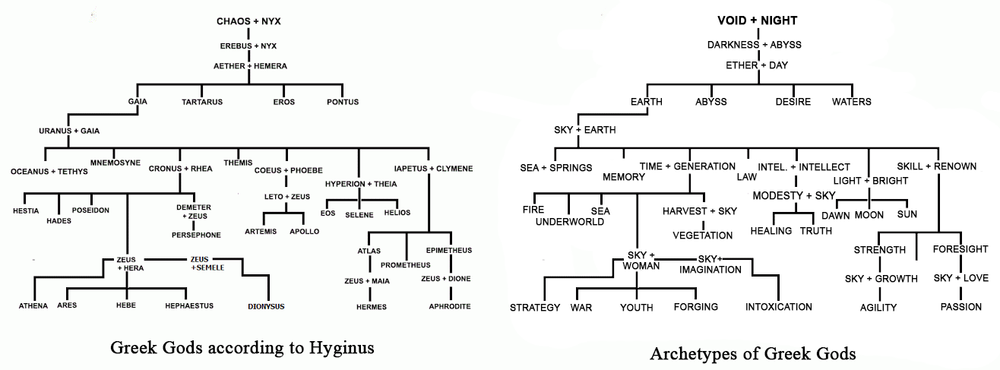

The Cambrian explosion is a good example of a world-changing reorganization of tholonic hierarchy and integration that took place over many millions of years 530 million years ago.  If you ask a historian what caused the Cambrian explosion, they will tell you it it was starbursts from the Milky Way, or genomic reorganization, or geochemical/environmental causes, such as photosynthesis which raised oxygen levels.  However, they will all agree that whatever the cause, there were many, many interlinked and codependent processes.  All these explanations are not really explanations, but rather descriptions; this happened, then that happened, then another thing happened causing more things to happen...  But why did it happen? In every answer to that question, the &ldquo;why&rdquo; is simply a description of the effects of some other cause, and when we don&rsquo;t know the cause, we hypothesize a cause that could explain the effects (which become the causes).  Many of these *theories of causes* turn out to be correct, as we would expect, considering that this reality is made *only* of effects, which serves as causes for more effects.  

From the tholonic perspective, there are three types of causes.

- **The originating intention**.  This is the 0-dimensional single dot that expanded itself through awareness of itself.  Science sees this as the Big Bang.
- **The cause of effects.** Effects that act as causes in a cascading chains of events.  These are actually children of the original cause or intention, but as that is beyond our comprehension, we can only understand what we perceive.
- **The intention to cause**.  This is a cause that is initiated by the willful intention of an intelligence.  The easiest example of this is when we decide to do something, like turn in a light.  Currently, we understand that willful intention is only exercised by higher forms of life, but from the tholonic understanding, tholons themselves can exert willful intention if we accept the definition of &ldquo;will&rdquo; as *disposition* or *inclination* as tholons have a natural disposition and inclination.

The answer to &ldquo;Why&rdquo; to the question of the Cambrian explosion, or any event for that matter, big or small, across all contexts, is that it was the most efficient and stable expression of energy at the time that was compatible with the intentions of all the contributing tholons.

## Maharishi Effect

Given the general direction of mainstream science, we do not see a lot of investigation into how thought affects external reality, but some do exist[^218][^219].  We will look at one research report here, *&ldquo;Effects of Group Practice of the Transcendental Meditation Program on Preventing Violent Crime in Washington, D.  C.: Results of the National Demonstration Project, June-July 1993&rdquo;*[^121] published in the journal *&ldquo;Social Indicators Research.&rdquo;*

This study, which was monitored by a 27-member project review board comprised of independent scientists and leading citizens, found that there was a significant statistical result.

What was this study exactly?

> This study presents the final results of a two-month prospective experiment to reduce violent crime in Washington, DC.  On the basis of previous research, it was hypothesized that the level of violent crime in the District of Columbia would drop significantly with the creation of a large group of participants in the Transcendental Meditation® and TM-Siddhi® programs to increase coherence and reduce stress in the District.[^122]

Here, the word &ldquo;coherence&rdquo; refers to its definition of &ldquo;*the quality of forming a unified whole*.&rdquo;

The results were impressive.

##### 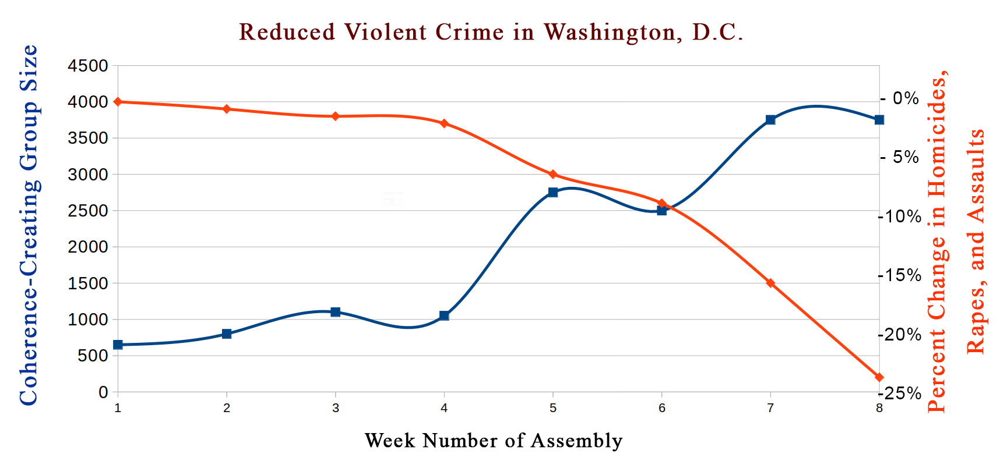

This is only one study, so it is not definitive, but it is certainly supportive of the idea that directed intention, what the participants called *coherence*, and what we are calling *order* (as that is what unifies the parts into the whole), has an extended effect.  The explanation, according to the tholonic model, is that the directed energy of coherent thought altered the curves of various archetypes thereby altering the probability of where the &ldquo;work&rdquo; will produce the most order, or where and how energy will be expressed across a scope&rsquo;s spectrum.

### On a Personal Note

I had a particularly insightful experience with the Maharishi Effect back in the late &rsquo;60s when I was a young teenager.  My father was a captain of industry in the world of electrical components, ultimately becoming president of one of the pioneering companies that helped create the first integrated circuit.

Born of poor Scottish immigrants in the Bronx on the tail of the Great Depression, and serving in Korea, he was no stranger to hard times and hard work, which made him one of the most pragmatic and practical people I have ever known.  He was a devout capitalist, atheist, and husband, and had no patience for anything that did not produce results.  Hippies were idiots, imports were ruining the economy, Scotch whiskey was better, and talking about your problems was for whiners.  You get the picture.

At the insistence of his wife (and my mother), he joined her for a seminar on *Creative Intelligence (CI)*, which was what they called Transcendental Meditation back then for those folks like my father.  He heard their claims about improved mental and physical health, better focus, fewer distractions, etc.  He decided to test their claims by giving all his employees in one of his factories CI training, along with an extra hour at lunch break for them to take this training and practice their new CI skills.

This factory was in a poor, rundown industrial town in New England, and the people that worked in those factories were uneducated, unskilled, assembly-line laborers - not exactly an open-minded demographic.  I knew a number of them myself, as we lived in that town, and many never made it past 4<sup>th</sup> grade.  The rivers in this town were dead from all the pollution, and the neighboring town had the highest *per capita* suicide rate in the United States.  It was a dreary, dark place filled with dreary dark people.

His peers in the industry thought he was being foolish to deploy such a plan, but the results were astounding.  People were fighting less, taking less sick leave, injuries were down, production went up; in general, everything improved.  So much so, that the Wall Street Journal did an article on him and his &ldquo;revolutionary&rdquo; new technique.  He became known as some kind of New Age Industrialist, which was ironically funny as he was as new age as his &rsquo;57 Chevy.

Ultimately, this new concept was unsustainable in that environment because eventually people began to abuse the extra time meant for CI, and everything went back to *normal* with sick leaves, fighting, injuries, and lower production, so the program was scrapped.

### Prayer

You might be thinking that traditional prayer holds the same power, but it does not.  Why? Because most prayer is anything but coherent.  Prayer means very different things depending on culture, religion, personal perspectives, etc.  It can be anything from begging to demanding, justifying to virtue signaling, and occasionally it can be an expression of gratitude and love, but using group prayer to effect change is like using a group of blind people to paint a room by throwing handfuls of paint at the wall.  Your room *will* get painted, but you&rsquo;ll wish it didn&rsquo;t.

This was recently confirmed by a $2.3-million-dollar study on the effect of prayer on the sick, involving over 1,800 patients.  It was the largest study of its kind ever undertaken.  Contrary to prayer helping the sick, they found that when a patient knew others were praying for them, they tended to have *more* complications.[^123]

There are other studies that conclude the exact opposite, such as Dr.  Byrd&rsquo;s study &ldquo;Positive Therapeutic Effects of Intercessory Prayer in a Coronary Care Unit Population&rdquo;[^124] and Dr.  Harris&rsquo;s  study &ldquo;A Randomized, Controlled Trial of the Effects of Remote, Intercessory Prayer on Outcomes in Patients Admitted to the Coronary Care Unit&rdquo;[^125].  However, without a detailed comparison of the studies, and specifically the manner in which the participants prayed, we cannot know to what degree coherence was at play.

The difference between the coherence of Transcendental Meditation and prayer is the former follows a very specific set of rules, has a beginning, a middle and an end, has a clearly defined non-personal target subject, and never attempts to force change.  Prayer can follow these same rules, but it rarely does because there are no rules to prayer and varies greatly depending culture, tradition, perspective, intention, etc.

An example of coherent prayer is a practice used by the not-so-secret society of the *Order of the Rosy Cross*, or *Rosicrucians*.  Members who have reached a certain level of initiation are introduced to a schedule of &ldquo;prayers.&rdquo; This is a globally synchronized schedule of times when people are requested to focus their energy on a particular topic, such as health or family or finances, and in a specific manner.  If one is not in need, they send their benevolence into a &ldquo;pool&rdquo; of energy specific to that topic.  If one has a need in these areas they can join in at the scheduled times and &ldquo;tap into&rdquo; that pool.  This is a very coherent technique because it has specific archetypal and sustainable patterns of energy, and it (reportedly) works surprisingly well.

The effect of the *Consciousness Field*, as it is referred by Roger Nelson of Princeton University and director of the *The Global Consciousness Project* (http://noosphere.princeton.edu/), is not limited to humans, but can affect matter [^212] and machines[^213].

## Other Experiments

Here is a very short list of books and papers that delve into experiments and perspectives that supports some of the tholonic claims:

- *Double-Blind Test of the Effects of Distant Intention on Water Crystal Formation.*[^212]

- *FieldREG Anomalies in Group Situations*.[^213]

-   *Test of a field theory of consciousness and social change*. [^218]
-   *International Peace Project in the Middle East: The Effects of the Maharishi Technology of the Unified Field.*[^219]
-   *The Intention Experiment,* Lynne McTaggart
-   *Groundbreaking New Results in Consciousness, Quantum Brain & Nonlocality Research,* Maoxin Wu
-   *Conditioning of Space-Time: The Relationship between Experimental Entanglement, Space-Memory and Consciousness.  Journal of Nonlocality Round Table Series, Colloquium \#4*, Rajendra Bajpai and +2
-   *Radiant Minds: Scientists Explore the Dimensions of Consciousness*, Juanita Ratner
-   *Extrasensory perception and quantum models of cognition*, Patrizio Tressoldi and +2
-   *The relationship between local geomagnetic activity, Tibetan Buddhist meditation and psychic awareness: Preliminary study*, David Luke
-   *Phenomenological Convergence between Major Paradigms of Classic Parapsychology and Cross-Cultural Practices: An Exploration of Paranthropology*, Jack Hunter
-   *An investigation into the cortical electrophysiology of remote staring detection*, Paul Stevens
-   *Geomagnetic Field Effects in Anomalous Dreams and the Akashic Field*, Stanley Krippner
-   *The relationship between local geomagnetic activity, meditation and psi.  Part I: Literature review and theoretical model*, David Luke and +1
-   *Eleonore Zugun: the Re-Evaluation of a Historic RSPK (Recurrent Spontaneous Psychokinesis) Case*, Peter Mulacz
-   *Intention,* Jeanne Lim

## Are Archetypes Alive?

If ideas are archetypes that have energy and fields, then it would be reasonable to think that an idea could be reinforced and strengthened by adding more energy to it.  How would one go about adding energy to an idea? If awareness is energy, then one obvious way would be to simply increase the awareness that an idea is exposed to.  This sort of thing is done all the time.  Take, for example, National Prayer Day in the U.S. (May 7th) when the President signs a proclamation encouraging all Americans to pray on this day and “to turn to God”.

Now, imagine the potential power of 114,000,000 consciousnesses all being exposed to the same symbolism at the same time. This is exactly what happened during the broadcast of Super Bowl XLIX, but unlike National Prayer Day where the participants voluntarily focused their awareness towards one idea, it was more like a National Mind Harvesting Minute of the awareness of the 114,000,000 unwitting spectators.  Unlike the barrage of commercials and propaganda we are subjected to on a daily basis, this particular event was unique. According to a very suspicious article[^214] that was written by a conveniently anonymous designer who claimed to have once worked in the graphics department of a huge media company, out of boredom and his opposition to the then administration of President Bush, he deliberately hid pyramid eyes, pentagrams, and symbols from John Dee, the infamous sixteenth century occultist to the Queen of England, into the intro and promo videos for everything from war events to major sports events, including Super Bowl XLIX. Ignoring the question of why the designer thought secret occult symbols were a good choice to subliminally oppose President Bush, it was not the claim that was suspicious, as with just a little investigation his claims can be confirmed, but that this published article, which appeared overnight on over 36,000 websites, conveniently provided a “plausible deniability” defense for the media companies when Internet sleuths were discovering these symbols. regardless of the intentions of those responsible, the effect was that a tremendous amount of awareness, albeit unconscious awareness, was pumped into these images; images that have existing archetypes, and therefore, according to the tholonic model, their own awareness, intention and intelligence. 

Considering the average American youth spends 900 hours a year in school, and another 1,200 hours a year watching television, and that 70 percent of the American adult waking life is spent in front of digital media, [^224] and that the average 78.6 year old American will spend nine years of his life watching TV, two years of which is just watching commercials, we talking about a tremendous amount of awareness up for grabs. How is that currently being used? 

The more pessimistic reader might begin to suspect that the manipulation of awareness as energy is perhaps already well understood by some perhaps less than noble folks. Other may think this is bordering on mystical conspiracy theories.  Our intention is not to support either of these ideas, but to suggest that ideas have a life of their own. This include ancient, even if they seem to have been forgotten by modern society.

We have the ability to tap into these archetypal realities whenever we like or need, and often do unconsciously. This is the purpose and power of myths, be they ancient or modern. As these archetypes originate in the uninstantiated tholonic state, they are free from the limitations of our space-time reality, and therefore they are eternal, or at least, long-lived. The myths and beliefs of the ancient past continue to live on in ever-evolving meaning and symbolism that promote their existence, almost like a self-mutating virus. This is the source of talismanic, totem or symbolic “magic” and the invoking of deities, intelligences, energies, be they “good guys” or “bad guys” (although it’s often hard to tell them apart).

Much of our everyday culture is inextricably bound to these archetypes and thereby further empowering them, usually without our knowledge. Jung described these archetypes as “ordering factors in the collective unconscious”. There are the twelve archetypes of the human psyche organized into four cardinal types, which we described earlier. 

For example, the modern word “hell” comes from the ancient Norse goddess named *Hel* whose job it was to not only judge the dead but also help the apocalypse along by leading an army of the dead in a ship made of the fingernails of corpses.

The concept of Hell, or whatever it happens to be called, is deeply ingrained into the worldview of billions of people who have little knowledge of the roots of their beliefs. These believers, through the energy of their awareness, bring into creation associated or parasitic archetypes that are attached to primary archetype which they are completely unaware of, but which are energized by that awareness nevertheless. While this can&rsquo;t be proven, I suspect that the more people who believe in hell, the more empowered and manifest the concept of an apocalypse. The ironic part is that believing in the traditional Christian or Islamic heaven by default empowers their concept of a hell, as they are presented as two side of one state, the afterlife.

What we have referred to as an uninstantiated tholon can, al least in this context, be an archetypes as a form of *metameme,* which is a form of a *meme* that only exists in the collective unconscious and/or in the world of archetypes, the thologram. If a meme is “an idea, behavior, style, or usage that spreads from person to person within a culture, then a metameme is an “an idea or belief formed within the tholonic field (i.e. universal mind,  collective unconscious, morphic field, etc.) and spreads from tholonic field to tholonic field”.   You make have heard phrases like  &ldquo;If it looks like a duck, and quacks like a duck, its probably a duck.&rdquo;, or &ldquo;When you hear hooves, think horses, not zebras.&rdquo;, or &ldquo;The simplest explanation is most likely the right one&rdquo;, otherwise known as *Occam&rsquo;s Razor*. Applying the wisdom of these practical practices, what are we to make of the fact that research out of Princeton University supports the theory that ideas, in the form of social media networks, follow the same growth models as viruses (in the form of diseases.)?[^215] Outside of the conclusion that perhaps Facebook is actually a viral disease, it tells us that ideas follow the same patterns as existing natural patterns of growth, suggesting we might learn more about the life of archetypes if we considered them living.  OK, viruses *may* not be &ldquo;alive&rdquo;, but I say *may* because some experts in the field are redefining &ldquo;life&rdquo; to include viruses. [^216] [^217] Regardless, the growth, survival and creation of ideas follow the same patterns as everything else that grows, survives and creates. For this reason, a clever researcher might be able to find correlations between the life cycle of a galaxy and something as seemingly unrelated as, say, the life cycle of a tomato plant. One such researcher might be Tokyo Institute of Technology’s Maruyama Shigenori, a leading geophysicist and founder of the Center for Bio-Earth Planetology, who, by connecting the theories of astronomy with those of the life sciences, has shown how entire planets may well be living super-organisms.

This idea, however, has a dark side to it because so many of our beliefs are manipulated and controlled by others whose agenda is less than altruistic, hidden, and who are aware of the mechanics of reality and consciousness. From the most powerful laser in the world named after the Hindu god of destruction to trivial tarot cards based on movie stars, we can find countless examples of how these imposed archetypes infiltrate our understanding of the world.

So, what kind of world are we creating with our awareness, desires, and beliefs, as a planet? To find out, I wrote a mobile phone app that allows people to send out into the universe either a blessing or a curse.  The app was (unsurprisingly) called &ldquo;Bless or Curse&rdquo;.

The majority of both blesses and curses are about…wait for it…love, money, and health (surprise!). Some were touching, such as the blessing of “May he win lotto,” cast upon the bus driver who “stopped just for me”. Some are bizarrely dark, such as the curse of “Torture Rape Murder die die die die die,” cast upon Noisy Walgreen Employees.

Humanity seems to be pretty well split down the middle between the *blessers* and the *cursers*, as you can see by this report map below. In general, it tends to waver back and forth just around the 50/50 mark. 

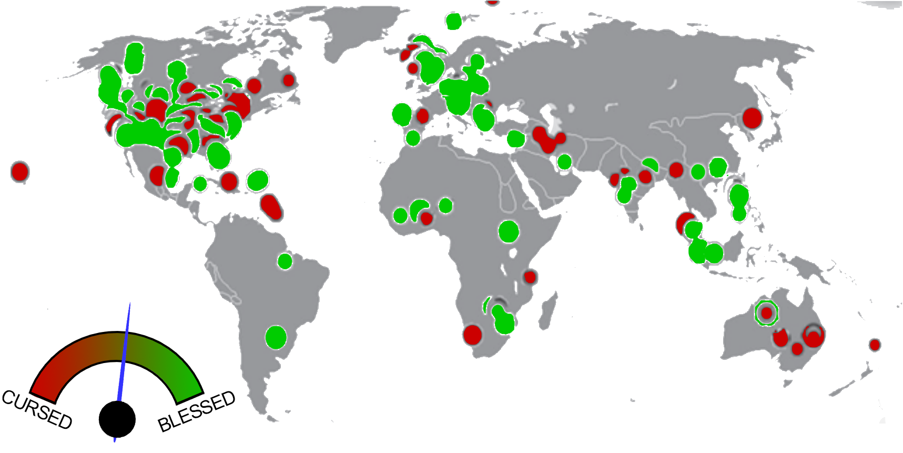

Like a marble balanced on the top of a mountain, the slightest tilt toward on one side or the other can reverse the direction the future will roll. Even one thought, one blessing or curse, one act of love or hate, can shift the balance for all, according to the research.

## Tulpas

Oddly, one of the better legends of how ideas can take on a life of their own comes form the well-known book *Magic And Mystery In Tibet in 1932*, by Belgian-French explorer Alexandra David Neel.

If one is to believe the writings of this Belgian-French explorer then we must consider the power and potential of what science today considers irrational and impossible.

 dressed as a beggar with only a compass, money (for ransom in case she was kidnapped) and a gun, snuck in to Lhasa, Tibet that was forbidden for foreigners to enter,

In the Far East there is the concept of a *tulpa*, which is a type of thought-form. They are understood to be a sentient consciousness that resides in the brain of the host and can have separate feelings, thoughts, and memories from the host and can communicate through thought, imagination, feelings, or verbally. With enough practice and concentration, the host can see the tulpa’s form in the real world, and for the truly advanced *tulpamancer*, can be seen by others as well. Of course, this is an preposterous ides to Western thinkers. Alexandra David Neel was a woman of remarkable courage. She recounts how the only way she could enter the forbidden (to foreigners) city of Lhasa, Tibet, was to sneak in dressed as a beggar carrying only a compass, money (for ransom in case she was kidnapped) and a gun. She was also known for her sound scientific thinking and her opinions and observation carried weight in academic and scientific circles. Doctor A. D’Arsonval, a member of the French Academy of Sciences, The Academy of Medicine, professor at the College of France and president of the Institute of General Psychology, said of Alexandra David-Néel:

> This well-known and courageous explorer of Tibet unites in herself all the physical, moral and intellectual qualities that could be desired of one who is to observe and examine a subject of this kind.[^223]

So when she described how she used the techniques taught to her by the Tibetan magicians to conjure up her own *tulpa*, it is not as easy to discard them as pure fantasy. In her case, she manifested a short, pudgy, jolly monk, as per her intentions.  Perhaps even more interesting was that this tulpa, once it began to be visible to others, began to have its own free will, a life of its own; the jolly, fat monk began to grow lean and taller, and less jolly. It eventually became a major problem for her, and she had to spend six months “dissolving” it. As she states:

> The fat, chubby-cheeked fellow grew leaner, his face assumed a vaguely mocking, sly, malignant look. He became more troublesome and bold. In brief, he escaped my control. I ought to have let the phenomenon follow its course, but the presence of that unwanted companion began to prove trying to my nerves; it turned into a ‘day-nightmare.’ Moreover, I was beginning to plan my journey to Lhasa and needed a quiet brain devoid of other preoccupations, so I decided to dissolve the phantom. I succeeded, but only after six months of hard struggle. My mind-creature was tenacious of life. There is nothing strange in the fact that I may have created my own hallucination. The interesting point is that in these cases of materialization, others see the thought-forms that have been created.

Whether tulpas exist or not is left to the reader. The point is that the belief that ideas can take on a life if their own is neither new nor unique.

On a related note, keep an eye on the research into what is essentially the collective consciousness of artificial intelligence, or *A.I. Swarms*, as they are called,[^220][^221]and the early attempts to create artificial humans.[^222] Science and technology is attempting to create their own tulpas, and one day they may also prove to be “more troublesome and bold, escaping our control.”

# 11: PREDETERMINISM

Remember the explanation of how a lightning rod works?  It simply creates a path of least resistance between two different states that seek balance, and, as energy always travels the path of least resistance, lightning will always seek the lightning rod over a brick chimney.  We can say that the path of the lightening was predetermined before it even began, but it would be more accurate to say that the lightening only came into existence because such a path even existed in the first place.  In other words, the instance of lightening is a consequence of the preexisting energy fields.

The same concept holds for the thologram in that there can be almost countless combinations of archetypes, and therefore almost countless connections of tholons between the beginning and the end.  This implies that within the thologram exists every path of creation and/or growth that is possible *at that moment in time*, but the paths that will be traveled are those that represent the path of least resistance, and what we see as reality around us is a consequence of energy moving through those paths.

As new combinations come into being, new paths emerge, but for the most part, these new paths will emerge from the &ldquo;bottom&rdquo;, or end-points, of the hierarchy, as these are the most unstable and dynamic.  Each tholon represents a &ldquo;step&rdquo; in the path.  New paths are rarer as we move up the hierarchy as these higher-order tholons have achieved a stable state that is held in place by the induction of their parents and children, and short of a radical change in energy they will not change.  The force of the energy that would be needed to affect a change is inversely proportional to their generation.  This is why reality &ldquo;is confined by rules that may be shockingly narrow&rdquo;, to quote Charles S.  Cockell  from his book &ldquo;The Equations of Life: How Physics Shapes Evolution&rdquo; and suggests that form and life across the universe may not vary as much as we might imagine.

An example of these new emerging paths would be the creation of a new element in the periodic chart.  All elements past the element of uranium are man-made, so they are new creations, but they are also extremely unstable and unsustainable and don&rsquo;t last very long.  A new stable path even a little way up from the &ldquo;bottom&rdquo; would dramatically alter reality.

Starting from the beginning, immediately upon the first awareness of a non-existent dot in the void of nothingness, that awareness and intention began self-replicating into smaller and smaller divisions.  These divisions stop at some point where no sustainable patterns can be achieved, perhaps because the difference is too small or weak, or the dissimilarities are too great, or other reasons.  The depth of a tholon&rsquo;s scope can be described as the difference between two states, the delta of the duality of that scope, similar to the definition of voltage we saw above, which presumably gets smaller and smaller with each generation (but not necessarily).

As the parents and children of a tholon change, so too will that tholon adapt to these changes by having its scope adjusted.  In doing so, the thologram is *problem-solving* in real-time.  More than that, it is doing this in a heuristic manner, i.e.  a manner based on experience.  How? Because the (only successful) changes that have been made in the past resulted in changes to the entire thologram and the consequence of those changes define the context of each tholon&rsquo;s current condition.

The working hypothesis is that the thologram has a memory of everything that has ever happened to it that resulted in a successful change, and this is all recorded and passed on through each and every sustainable pattern.  However, there can be many tholons occupying the same space because of the embedded nature of tholons, so if you reference a tholon at the &ldquo;bottom&rdquo; of the thologram, you are implicitly referencing every parent tholon back to the very first tholon.  What this suggests is that any instance of a tholon is also an implicit reference to many tholons and the path that connects them.

What this tells us is that each instance is a 3D perspective of a very multi-dimensional form of energy that that describes one &ldquo;path&rdquo; from the first tholon to the tholon in question but which we 3D dwellers experience as past, present, and future (like the 3D ball passing through 2D space example previously).

Two strangers, Bob and Carol, bump into each other at the butcher shop.  This interactions is the result of countless steps that had to happen starting with the Big Bang.  The path from the first moment of creation to the current instance that it took for Bob and his ancestors to arrive at this point and time we&rsquo;ll call path B, and the same for Carol we&rsquo;ll call path C.  Path B and path C already existed in the thologram, and Bob and Carol just happen to be the current instance of the fields of these two paths that connected because it was the path of least resistance, like the two fields that connected to create lightening.  There are effectively an infinite number of paths and their fields, but the point where Bob and Carol meet is the only point where the two fields, of which they are the current instances of, connect.  If reality itself is the memory store then anything that emerges from this meeting will inherit the &ldquo;information&rdquo; of their meeting.

Every path that can be traveled by any instance already exists because the fields already exist.  The path is the expression of the fields interacting.  I suspect we tend to wander through this matrix of possibilities in the same manner bacteria wander aimlessly about in their puddles of plasma, or whatever their world is made of.

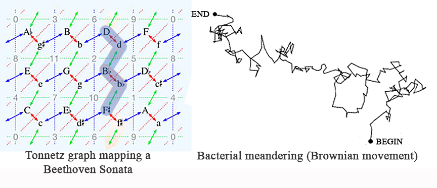

Perhaps one the best instance of this that is easily understood is music.  Consider that a finite number of notes exist, but within those notes an almost infinite number of tunes can be written.  If we mapped every combination of notes, the tune could be seen as a path on that map.  This is more than just a thought experiment… it&rsquo;s an actual undertaking by music theorist Julian Cook, who described in his article  &ldquo;Mapping the Music&rdquo;,[^170] how the harmonic path of a Beethoven sonata can be visualized on a *Tonnetz* graph (left)&hellip; a graph that happens to look just like a 2D tholon map.  In this example, the notes are acting like the fields, and the playing of those notes represent energy moving through these fields, forming music, or lightening, plants, rivers, neurons, and everything else.  

Music also demonstrates how certain patterns can lay down the foundations upon which other patterns and expressions build upon.  For example, there are many different types of scales, such as *pentatonic*, which has 5 notes per octave, or the *Western Major Scale*, with the classic 7 notes most of us are used to.  Sound occurs when energy is applied to matter, and notes represent the *dots* that we have identified within that chaos of white noise through our power of reasoning.  We form patterns and connect these dots that exist in the sea of chaos that is all sound, and by doing so we create &ldquo;music&rdquo;.  We describe white noise as all frequencies expressed at once, but it is equally accurate to describe white noise as every possible pattern of all possible notes being performed at once.  This tells us that that all possible forms of music, all songs, rhythms, beats, arrangements, etc., already exist within that white noise and all that we can do is discover them.  

Even in the world of bacterial meandering, we see a pattern.  Not surprisingly, it is the inverse of a Bell curve, in that a group of bacteria released at the same time starts out relatively coherent and eventually disperses to incoherence.  It&rsquo;s  almost (or exactly) as if the instances of creations that can emerge from a tholon&rsquo;s  Bell curve are the balancing factor, much like the way a positive charge will automatically create a pairing with a negative charge, or how the amount of rain that falls is equivalent to the amount of water that evaporated from the earth.  

#### **Claim 58:** Archetypes tend toward order, while the instances tend toward chaos.  

In the early generations of the thologram, the numbers of paths are limited, and with the additional generations, the number of paths increase.  This movement may appear random, but not only does it disperse according to a Bell curve, it actually follows the same rules as the thologram itself in that it is self-similar and fractal in nature.[^126]

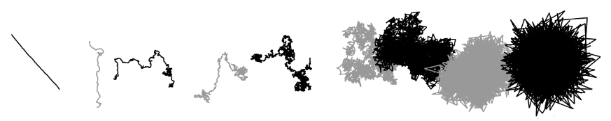

Although this sounds like predeterminism, which it effectively is, there are so many paths that can be traveled that for all intents and purposes predeterminism doesn&rsquo;t apply.  Tholonically speaking, it appears as though we may have free will, but only with regard in determining which predetermined path we follow.  It also looks like existence itself is the unfolding, explicating, instantiating of every possible combination of sustainable patterns that exist to establish a balance between differing fields.

Although a bit of a tangent, and certainly worthy of more than a paragraph, it&rsquo;s worth stating here that the idea of reincarnation has a tholonic explanation, which is: What some people believe to be past life experiences are collective memories associated with the path we happen to be instantiating, or traveling, if you will, and which we identify with mainly due to our ego&rsquo;s nature to relate these inherited and embedded memories (and everything else, apparently) to one&rsquo;s self.  This is why many people who believe in reincarnation will also believe they were some grand historical figure in a past life, as there will naturally be more instances (of people) in these well-worn paths of current archetypes simply because these paths are the paths of lesser resistance.  

On a similar subject, the Thologram has a concept of life after death.  Every creation, including tholons, goes through the cycles of instantiation, this being inception, gestation, emergence, propagation, culmination, and dispersion.  This is just one description that identifies six stages.  There can be many others.  When a tholon &ldquo;disperses&rdquo;, whether due to loss of energy, destruction, absorption, or any number of ways, its stable pattern of energy can come to an end.  What then survives and where does the energy go?  The energy goes to wherever it can go with the least resistance, that typically being the parent tholon, and the recycling of the dispersed energy would them be channel though the stable patterns of that parent tholon.  This is probably what spiritualists refer to as the *oversoul*.

There are other possibilities, as well.  In some cases, perhaps, and as we will argue in the section immediately following, there can be multiple instances of the same individual human tholon.  It may also be the case where if there is enough induction from related tholons and all of the energy is not dissipated, then that could result in an *implicit instance*, that being an instance that does not have the structure necessary to take form, like the ink dots in the glycerin example.  This is most likely what is perceived as ghosts, spirits of the dead, poltergeists, and various other types of disincarnates.

Applying this idea of multiple (and overlapping) instances to the thologram, there are different patterns that dominate our reality at different times, and as these patterns represent the instances that make up our reality, we can say that reality, from atoms to ideas, also differs across time.  In fact, the concept of an atom itself exists only because it is based on the patterns of reality we happen to be discovering at this point in our journey, but at other times in the past, and future, this concept will change, or disappear altogether.  There was (or will be) a time when what we see as atoms are seen as spirits, or perhaps facets of a larger intelligence, or something we are incapable of imagining at this time.  The laws that control atoms will also apply to spirits or intelligences, or whatever, but these laws will also be understood within the context and scope of the time.

There are some real-world examples of how instances follow a preexisting path.  Here are some of the fairly well-known stories of &ldquo;coincidences&rdquo; that demonstrate this concept.[^127]

### Laura Buxton

In June of 2001, a 10 year old girl named Laura Buxton released a balloon with her name and address on it, which floated 140 miles and landed in the back yard of a house where also lived a 10 year old girl named Laura Buxton.  On the day of the meeting, the two girls wore essentially the same outfit — a pink sweater and jeans.  The girls were the same height, which was unusual because they were both tall for their age.  They both had brown hair and wore it in the same style.  They both had three-year-old black Labrador Retrievers at home, as well as gray pet rabbits.  They both brought their guinea pigs, which were the same color and even had the same orange markings on their hindquarters.  It was almost as though these two Laura Buxtons were the same person.[^179] Below is a picture of the two Laura Buxon girls, who are still friends today.


*Here there are two instances of the same tholon (which may be one among many) in slight different contexts.  What is fascinating about this is that if it was tholonically predetermined that a red balloon was to carry an address, then both instances, both girls, would have to experience it, which was the case when it was sent by one, and received by another.*

### King Umberto I&rsquo;s double

In Monza, Italy, King Umberto I went to a small restaurant for dinner, accompanied by his aide-de-camp, General Emilio Ponzia-Vaglia.  When the owner took King Umberto&rsquo;s order, the King noticed that he and the restaurant owner were virtual doubles, in face and in build.  Both men began discussing the striking resemblances between each other and found many more similarities.

a\) Both men were born on the same day, of the same year, (March 14<sup>th</sup>, 1844).

b\) Both men had been born in the same town.

c\) Both men married a woman with the same name, Margherita.

d\) The restaurateur opened his restaurant on the same day that King Umberto was crowned King of Italy.

e\) On 29th July 1900, King Umberto was informed that the restaurateur had died that day in a mysterious shooting accident.  As he expressed his regret he was assassinated by an anarchist in the crowd.

*This looks like two instances traveling the same path that was instantiated in two different contexts.  This also implies that tholonic contexts are also archetypal, meaning there are &ldquo;archetypal contexts&rdquo; and &lsquo;instantiated contexts&rsquo;.*

### Twin Boys, twin lives

The twin Ohio boys were separated at birth, being adopted by different families.  Unknown to each other, both families named the boys James.  Both James grew up not even knowing of the other, yet both sought law-enforcement training, both had abilities in mechanical drawing and carpentry, and each had married women named Linda.  They both had sons whom one named James Alan and the other named James Allan.  The twin brothers also divorced their wives and married other women, both named Betty.  And they both owned dogs which they named Toy.  Forty years after their childhood separation, the two men were reunited.  (Source: Reader&rsquo;s Digest, January 1980)

*This looks like two instances of the same tholon in the same archetypal and instantiated context at birth.*

### Three strangers on a Train, with complementary last names

In the 1920s, three Englishman were traveling separately by train through Peru.  At the time of their introduction, they were the only three men in the railroad car.  Their introductions were more surprising than they could have imagined.  One man&rsquo;s last name was Bingham, and the second man&rsquo;s last name was Powell.  The third man announced that his last name was Bingham-Powell.  None were related in any way.  (Source: Mysteries of the Unexplained)

*Here, these three men, although having different lives, clearly shared some other details.  Does this suggest that even our names can be instances of a pattern? I have some experience with this personally.  For my entire life I have been fascinated with the lore of El Paso, Texas.  I had never been to El Paso prior to when I drove through the West Texas desert town in my 40s at around 4 AM in the morning.  It was an ugly town, but I found it incredibly alluring, for reasons I could not explain.  Years later I discovered that the most famous Old West lawman of El Paso, considered a hero in them there parts, and I, shared the same name.  I can&rsquo;t say if that is why I felt the way I did about El Paso, but these are two details that seem both very rare, and possibly very connected.*

### Richard Parker

Edgar Allan Poe wrote a story called &ldquo;The Narrative of Arthur Gordon Pym&rdquo;.  This was a story about four survivors of a shipwreck who were in an open boat for many days before they decided to kill and eat the cabin boy whose name was Richard Parker.  Some years later, in 1884, the *Mignonette*, a 52 foot English Yacht, was capsized by a wave as they were traveling northwest of the Cape of Good Hope.  The four survivors found themselves together in an open boat for many days.  Eventfully, the three senior members of the crew killed and ate the cabin boy, whose name was Richard Parker.

*Here a pattern took form as both a story and an experience.  Perhaps Poe was able to tune into certain patterns and share them.  Perhaps that is what creativity or genius is; the ability to tap into patterns that have yet to become instantiated.  p.s.  The men served only six months in prison and were then released.  They were the first men to ever serve time for cannibalism and murder on the high seas because it was considered a &ldquo;custom of the sea.&rdquo;  See &ldquo;Her Majesty The Queen v.  Tom Dudley and Edwin Stephens&rdquo;, High Court of Justice, Queen&rsquo;s Bench Division, 1884*

### Titanic&rsquo;s destiny, Titanian&rsquo;s salvation

Morgan Robertson, in 1898, wrote &ldquo;Futility.&rdquo; It described the maiden voyage of a transatlantic luxury liner named the Titan.  Although it was touted as being unsinkable, it strikes an iceberg and sinks with much loss of life.  In 1912 the Titanic, a transatlantic luxury liner widely touted as unsinkable strikes an iceberg and sinks with great loss of life on her maiden voyage.  In the book, the month of the wreck was April, same as in the real event.  There were 3,000 passengers on the book; on the Titanic, 2,207.  In the book, there were 24 lifeboats; on the Titanic, 20.

Months after the Titanic sank, a tramp steamer was traveling through the foggy Atlantic with only a young boy on watch.  It came into his head that it had been thereabouts that the Titanic had sunk, and he was suddenly terrified by the thought of the name of his ship, the Titanian.  Panic-stricken, he sounded the warning.  The ship stopped, just in time: a huge iceberg loomed out of the fog directly in their path.  The Titanian was saved.

*This is similar to the Poe story, but the fate of the Titanian might be an example of how an existing path could be altered, meaning, the curve of the instantiating tholon was altered.*

### A writer&rsquo;s plum pudding

In 1805, French writer Émile Deschamps was treated to some plum pudding by the stranger Monsieur de Fortgibu.  Ten years later, he encountered plum pudding on the menu of a Paris restaurant and wanted to order some, but the waiter told him the last dish had already been served to another customer, who turned out to be de Fortgibu.  Many years later in 1832 Émile Deschamps was at a diner and was once again offered plum pudding.  He recalled the earlier incident and told his friends that only de Fortgibu was missing to make the setting complete and in the same instant the now senile de Fortgibu entered the room.

*Pudding seems to be the pattern that instantiates under the very specific conditions of when when Deschamps and de Fortgibu are near one another.  Proximity, at least in this case, seems to have an effect on the probability of what patterns might instantiate.  One can only guess why pudding was the pattern they created.*

### A novel that unsuspectedly described the spy next door

When Norman Mailer began his novel Barbary Shore, there was no plan to have a Russian spy as a character.  As he worked on it, he introduced a Russian spy in the U.S.  as a minor character.  As the work progressed, the spy became the dominant character in the novel.  After the novel was completed, the U.S.  Immigration Service arrested a man who lived just one floor above Mailer in the same apartment building.  He was Colonel Rudolf Abel, alleged to be the top Russian spy working in the U.S.  at that time.  (Source: Science Digest)

*Here is an example of pattern instantiating while at the same time being perceived and recorded by a bystander, similar to the Poe story, but in teal-time, and again, in close proximity.*

### A falling baby saved twice by the same man

In Detroit sometime in the 1930s, a young (if incredibly careless) mother must have been eternally grateful to a man named Joseph Figlock.  As Figlock was walking down the street, the mother&rsquo;s baby fell from a high window onto Figlock.  The baby&rsquo;s fall was broken and both man and baby were unharmed.  A stroke of luck on its own, but a year later, the very same baby fell from the very same window onto poor, unsuspecting Joseph Figlock as he was again passing beneath.  And again, they both survived the event.  (Source: Mysteries of the Unexplained)

*If proximity is a factor, we have to wonder if Figlock never walked down that street, would the baby have ever fallen?*

### A determined bullet

Henry Ziegland thought he had dodged fate.  In 1883, he broke off a relationship with his girlfriend who, out of distress, committed suicide.  The girl&rsquo;s brother was so enraged that he hunted down Ziegland and shot him.  The brother, believing he had killed Ziegland, then turned his gun on himself and took his own life.  But Ziegland had not been killed.  The bullet, in fact, had only grazed his face and then lodged in a tree.  Ziegland surely thought himself a lucky man.  Some years later, however, Ziegland decided to cut down the large tree, which still had the bullet in it.  The task seemed so formidable that he decided to blow it up with a few sticks of dynamite.  The explosion propelled the bullet into Zealand&rsquo;s head, killing him.  (Source: Ripley&rsquo;s Believe It or Not!)

*The pattern here is the bullet and the intention behind it.  Intentions alone can be their own pattern.*

From one perspective you could see all these stories as extremely unlikely coincidences.  From the tholonic perspective, each of these paths and each of these profiles are some of the almost countless patterns that managed to attain enough stability to instantiate.

## Life, Death, Afterlife

This subject raises questions about life after death.  Every creation, including tholons, goes through the cycles of instantiation, this being inception, gestation, emergence, propagation, culmination, and dispersion.  This is just one description that identifies six stages.  There can be many others.  When a tholon &ldquo;disperses,&rdquo; whether due to loss of energy, destruction, absorption, or any number of ways, its stable pattern of energy can come to an end.  What then survives and where does the energy go?  The energy goes to wherever it can go with the least resistance.  This might be the parent tholon but perhaps it could be a peer as well.  It could also stay right where it is if there are no immediately available paths of lesser resistance, not unlike a static charge that is held until is can be released.  There are many possibilities.  In some cases, perhaps, and as we put forth in the section above, there can be multiple instances of the same individual human tholon.  The various possibilities could easily describe what we commonly called the *oversoul*, or reincarnation, ghosts, spirits of the dead, poltergeists, and various other types of disincarnates that are something like an *implicit instance*, or an instance that does not have the structure necessary to take form, like the ink dots in the glycerin example. 

### Sadhguru explains

Some months after writing the above text, I &ldquo;coincidentally&rdquo; came across a short excerpt from a lecture by Jaggi Vasudev, 62 year-old English Major turned yoga teacher in India.  He goes by the name Sadhguru, and currently runs an ashram, has given speeches at the United Nations, and has founded a the Isha Foundation which teaches yoga and appears to be heavily involved in environmental and spiritual issues.  He was addressing the question &ldquo;Is there rebirth?&rdquo; and his answer was especially tholonic in nature.  Below is a transcript of his answer, which was slightly modified for grammatical reasons alone, along with commentary.

> The question is, is there re-birth? If it&rsquo;s there, what is the basis for one being to go from one birth to another? What is it that carries a person from one to another?  Now, if you need to understand this, you must have some understanding of the mechanics of who you are.  I am talking about the mechanics of how a human being is built.  When you say &ldquo;I am a human being&rdquo;, you are speaking of the outermost periphery, the physical body.  In yoga, we look at everything as &ldquo;body&rdquo; because it is easier for you to understand it that way.  So we see the body as five dimensions or five sheaths.  

> Physical body is known as *Annamaya Kosha*.  *Anna* means &ldquo;the food.&rdquo; This is the food body.  The next one is called *Manomaya Kosha*, which refers to the mental body.  The third one is called *Pranamaya Kosha*, which refers to the energy body.  Physical body, mental body, energy body, all these three dimensions are physical.  They are physical existence.  Physical body is very gross, mental body is subtler, energy body is even subtler but all these three are physical.  This is just like the light bulb is physical, you can see that.  The electricity behind [the light bulb] also is physical, isn&rsquo;t it?  The wire that connects is also physical; the electrons that flow through the wire also are physical existence.  So similarly, physical body, mental body, *pranic* body all are physical dimensions of life.  

Not surprisingly, we are seeing the trigram model.  In this case is it physical, mental and energetic, which is another way of saying material, archetype and energy.

>  This physical dimension of life in all these three dimensions carries the imprints of karma; On the body, it is imprinted, on the mind it&rsquo;s imprinted and on the energy it&rsquo;s imprinted.  This karmic imprint, or the karmic structure, is what holds it together.  Karma is the cement which holds you to the physical body.  Karma is the bondage at the same time.  It&rsquo;s only because of karmic stuff you can hold on to the body and be here.  

He points out that karma here is a synonym for structure, and it is this structure that accounts for the existence, or instantiation, of things.  The concept of karma tends to be associated with values and judgments, ideas such as good and bad, right and wrong, but outside of these subjective and culturally relative ideas, karma is structure, and that structure, from the tholonic perspective, is the thologram in its entirety.  The thologram is the structure of karma, and karma is the laws of instantiation.

> This is where spirituality seems to be difficult because if you try to take it away it doesn&rsquo;t work.  If you try to add, it doesn&rsquo;t work.  You need to be just there.  If you&rsquo;re just there, it&rsquo;s a moment.  The next two dimensions are called *Vignanamaya Kosha* and *Anandamaya Kosha*.  *Vignanamaya Kosha* is non-physical but related to the physical.  It is like a transient state.  *Anandamaya Kosha* is completely non-physical.  So, *Vignanamaya Kosha* and *Anandamaya Kosha* means it&rsquo;s the bliss body.  

In the tholonic model there is a similar concept, for prior to the realm of instantiation, or the physical reality, there are two states.  These are the two points that must exist before the third can be created.  They are the first instance of awareness, the *green dot*, the point of *Definition*.  This is equivalent to *Vignanamaya Kosha*, which is a transitional state.  Tholonically, it is the point where non-physical, purely conceptual and archetypal concepts are defined, such as limits and law.  before that is the *blue-dot*, *N-state* or point of *Negotiation*.  This point has no actual existence outside of awareness.  It is essentially pure awareness, and it is this awareness that creates the duality that reality and all things exists within.  This would be equivalent to *Anandamaya Kosha*, from the Sanskrit word *Ananda*, meaning *bliss*.  Tholonically, this N-state is a state of oneness as there is nothing else in existence other than it.  

> There is a bliss body inside which is hundred percent non-physical.  It has no form of its own.  Only if the energy body, the mental body, and the physical body are in shape it can hold the bliss body in shape.  If these things are taken away the bliss body will just become a part of the cosmos.  So whatever you are referring to as *atman* or the soul is a fiction actually, in a sense, because people are describing a certain limitation of the non-physical as a soul, but the body for the soul is still your karma.  If the karmic structure is completely dismantled, there is no soul; everything merges into everything else.  What is referred to as *Mahasamadhi* or *Mahaparinirvana*, is just this; that you slowly understand where the keys are and dismantle the karmic structure so that you become truly no more.  

This is profoundly similar to the tholonic model in that without any structure there are no instances, no archetypes.  The concept of a soul here is equivalent to that of a parent tholon, or the higher order of structure that have lead to a thing&rsquo;s existence.  Tholonically, there is no difference between the soul of a human and the soul of a rock in that they are both instances of the primal awareness at different points within the thologram.  

>  When somebody dies, we say this person is no more, but that&rsquo;s not true.  That person is no more the way you know them, but they still very much exist.  Now, if you dismantle the karmic structure one-hundred percent, now you merge with the existence.  This is what is referred to as *Mukti*.  In yogic tradition, it is referred to as *Mahasamadhi*.  In the Buddhist way it is called *Mahaparinirvana*.  Generally in English we are say *liberation*.

Remove the structure, i.e.  remove the green-dot and the red-dot, and you are left only with pure awareness (and intention).

> Liberation means becoming free from the very process of life and birth and death.  Liberation means becoming free from the basic structures of body and mind, and for all this, the karmic structure are the strings that hold these things together.  So, when a person dies, obviously, the physical body is something that you borrowed from the earth.  This body is just earth, isn&rsquo;t it?  You understand?  This physical body is just a piece of earth, which is right now prancing around as your body.  But you have to pay it back, atom to atom.  No interest though, but you have to pay back every atom.  You won&rsquo;t be allowed to carry a single atom from this planet, nobody has managed it.  (Laughs) 

Tholons are the creations of tholons, and those tholons that can instantiate have a life-span, whether it&rsquo;s 26 nanoseconds or 6x10<sup>99</sup> years.  They exist due to laws and limits.  Using Sadhguru&rsquo;s words, we can say it is the karma of a pion to exist for only 26 nanoseconds.  The underlying law of the tholon is that everything is seeking a balance, which is why everything must be &rdquo;paid back&rdquo;, i.e., the final balance must be zero.  The body return to the earth is the same ideas as the energy of a tholon&rsquo;s instance returning to the parent tholon.  

> The physical body will fall apart, but the mental body and the pranic body, depending upon the strength of your karma, goes on.  If the karmic structure is very intense, unfinished, then it has to finish it.  If the karma has become weak because it has run its course, then it very easily finds another body.  If it has to find another body, the intensity of this structure should come down, it should become passive.  If it is very intense, it cannot find a body, so it just hangs there.  This is what you are referring to as ghosts.  Somebody is dead; his karmic structure is still intense because it&rsquo;s not over.  He still exists, but he needs much more time to find another body.  The more intense his karmic structure is, the more visible he becomes and the more experientially available to people.  There are innumerable such beings all around you, whether you know it or not, but most of them you won&rsquo;t feel because their karma is dissipated.  They are just waiting for more dissipation before they find another body.  

What is here referred to as the *karmic structure* is equivalent to the stability of a tholon.  A super-stable tholon such as the structure of hydrogen or whatever forces in existence account for Plank&rsquo;s Constant are not about to fall apart any time soon.  One of the reasons for this (and maybe the sole reason) is because there are too many other tholons in existence that depend on it, and therefore support and reinforce the existence of hydrogen or Plank&rsquo;s Constant.  Weak karma is equivalent to the disintegration of a tholon&lsquo;s structure, whose energy will quickly find another path, or if not, hang around waiting to discharge.  

> This is why [we believe] that if somebody dies unnaturally, either by accident or suicide or some other way, they will become ghosts.  This is not correct as everybody becomes a ghost.  It is just that those with intense karma are more available to your experience because they have more intense karmic structures, so people may experience them a little more than other beings who die of old age.  If one completes his allotted karma for that life, he will simply die, just like that.  Without disease, without accident, without any injury.  When one dies simply like that, that person may find another body within hours.  This is why [it is said that] if one completes his life and dies peacefully it&rsquo;s the best way to die because he need not hang around and can immediately move on.  

Sadhguru says that intense karmic structures prevents someone from reincarnating immediately and that this intense, or highly energized and imbalanced structure can be perceived as ghosts, spirits of the dead, poltergeists, and various other types of disincarnates.  Tholonically speaking, this is explained in how the energy of a tholon&rsquo;s existence upon its demise would return to the nearest parent (or peer) tholon, be it stable or unstable.  This is what spiritualists refer to as the *oversoul*, but further up the chain we would also have instances of *group soul*, collective consciousness, morphic fields and tholonic fields.  However, if there is enough induction from related tholons and all of the energy is not dissipated, then that could result in an *implicit instance*, that being an instance that does not have the structure necessary to take form, like the ink dots in the glycerin example.  In one way, the idea that each tholon and its instance is like battery, functioning until it has balanced out its energy.  

Any instance that has yet to balance itself will have imbalanced energy, and this imbalance is what we perceive, as the balanced energy is outside our realm of experience much like the balanced battery can no longer be experienced as a battery.  This undissipated or imbalanced energy can only exist in the same energy patterns that allowed for its existence in the first place, hence, a new instance, with new energy patterns, will not be possible until the old energy patterns have balanced.  

This is not unlike how that the energy in the clouds before a lightening storm can not be used in a light bulb until the lightening has discharged and the electrons are returned to the ground, balancing the charge and making those electrons available to the light bulb circuit.  In this metaphor, ghosts are patterns caused by tholonic fields, similar to static electricity caused by electromagnetic fields.

> For those who walk the spiritual path, the ultimate goal for every spiritual seeker is he wants to break this whole process.  What you call your soul is like a bubble.  The outer periphery of the bubble is your karmic structure.  Inside there is air.  Suppose you burst the bubble.  Where is the air?  Where is *your* air?  There is no such thing as *your* air; it&rsquo;s become part of everything.  So what you refer to as soul is fictitious because there is no such thing as *your* soul and *my* soul and somebody else&rsquo;s soul.  Right now, this unboundedness is contained in a limited karmic structure, so it makes you believe as if this is a separate entity.  If you take away the keys which hold the karmic structure, then it just collapses.  

What you call anything, be it yourself, a plant, a river, a bug, is a tholon, and a tholon is simply a structure that emerged from energy moving though whatever resources are available and interacting with itself according to the limits and laws of those resources and its context and scope.  This is a verbose description of a bubble.  Within that structure is the &ldquo;thing&rdquo;… no structure equals no thing.

In both Sadhguru&rsquo;s model of reality and the tholonic model, transcending the cycle of creation and destruction and life and death, can be achieved by realizing one is &ldquo;nothing more&rdquo; than a state of awareness.  But there is another very important concept that can also be applied, and that is, while every tholon is a product of creation, not every tholon is itself a creator.  It is up to the reader to apply this concept to their own existence, but to this point, Sadhguru also expresses this very tholonic concept (paraphrasing):

> The structured mind produces structured emotions, and this increases the energy that moves through and structures the body.  When one&rsquo;s complete being, mind, emotion, body and the energy that moves through them, is then structured, they are not simply a piece of creation but a creator with ability to manifest their vision.

### Direction of Intention

Here we return to the concept of *intention* which was skipped over previously.  Looking at the tholonic model, it would be easy to imagine how it could evolve towards some very dark sides of existence just as easily as it could towards bright sides because there is no implicit morality or definition of right or wrong.  The tholon is a structure, a machine, so to speak.  While there are plenty of examples of dark instances throughout the history of existence, on the whole, existence has tended towards being a contributing factor to life.  We can say that this is because no matter what the direction of intention, it will always tend toward being balanced, so it has a built in protection against going to far to one side or another, as the laws of physics shows us.  There is another understanding as well which can be understood using same powers of observation and reason that fuels scientific thinking.  In its simplest form we can say that it has been observed that, for the most part in life, the body prefers health and pleasure over sickness and suffering, the mind prefers peace and joy over violence and misery, and emotions of love and compassion are preferred over hate.  This would suggest that the original intention of creation was more in the direction of health, peace, and love then sickness, violence and hate.  One could argue that these preferences are only a result of evolution as they contributed to survival, but that would only support the argument that this was the original intention.  In reality, we tend to see both sides working together, as in the very parasitic relationship between the predatory wasp and the slower cockroaches, but as we also see in that example that it is ultimately a benefit to the cockroach gene pool.  The same goes for any synergetic system from elks and wolves to political systems.  Saying that health, love and bliss only exist within the structures of sickness, hate and misery (and visa-versa) may sound like a Buddhist tenet, but it appears to be fundamental to the tholonic model as well.  Is appears as though cooperation and conflict is not an either/or choice but rather there is cooperation within conflict, and conflict within cooperation, which implies this model has the most stability, for now at least.  The human brain, cellular mechanics, and all life in general, is wired to be both competitive[^196] and cooperative[^195] at the same time, which implies that this is (so far) the most effective manner for every instance to express the intention of the of its tholonic archetype that has its source in the *primal intention*.

# 12: PROMETHEUS UNBOUND

Our reality is a microcosm of the reality that created it, just as the transhuman reality we are creating is a microcosm of our reality.

*&ldquo;As above, so below&rdquo;* is an aphorism that can be found as far back as the ancient Greek philosophers, and no doubt existed long before they pondered it.  It was one of the founding principles upon which scientific theory grew.[^128] That is a bit beyond the scope of this writing, but the essence of this idea is that any form of order is dependent upon, and emulates, the order it grew from and which supports it.

Life forms that came into being through cellular mitosis will themselves create life forms that depend on cellular mitosis; DNA based life forms can only create other DNA based life forms; etc.  Given that we have yet to find any example to the contrary, the general rule that &ldquo;expressions of life are limited by, and have the abilities of, the nature and properties of their expression&rdquo; is pretty secure.

This is the same premise behind the idea of *cosmological natural selection* which says that a black hole, upon collapse, spawns a new Universe with parameters similar to its Universe, though slightly mutated.[^129]

We also see this idea in *quantum Darwinism*, which states that of all the probable states that can exist, the ones that survive do so because of support from their environment.  In turn, these states that survive transfer information to the environment, altering its scope, shifting the curve in its favor, and thereby improving the probabilities of future similar states.  What we call classical reality is the redundant transference of that information.[^119] 

#### **Claim 59:** The field instructs the direction of creation, and the creations support the field.

Limitations and abilities are typically defined by the environment that any form of life has to coexist within.  Birds have wings, man has hands, etc.  The need for such tools, such as wings and hands, comes from the environment that life must adapt to in order to ensure sustainability.  A record of sorts is held within at least the DNA, at perhaps in the information field for that instance&rsquo;s tholon as well.  This record adjusts the curves, which alters the most probable instances of future creations.

We can also say (as previously shown) that there are rules that exist in this reality that energy and form must follow in order to exist.  Likewise, only those processes of creation that produce compatible results will exist.  Hence, the following claim:

#### **Claim 60:** The context defines the content which then becomes the context for more content.

There are other examples of such rules and relationships which are nicely exemplified in such things as holograms and fractals, but we won&rsquo;t get into those here as this has been written about many times.[^131]<sup>,</sup>[^132]

## Life Cycle of a Reality

Why are we humans intent on developing virtual realities and artificial intelligence? The more noble intention is that we can create better versions of our own reality where self-learning instances of integrated data clusters can process tremendous amounts of information better and faster than their human creators and, when operating under the control of well-designed algorithms, deliver insights and understanding beyond anything their creators are capable of.  Ideally, AI is more reliable, trustworthy, and efficient than humans.  Not so ideally (and already in place), it will also be used for the advancement of private interests without the cumbersome burden of ethics or morals.

With the advent of quantum computing and advanced information architectural design, not only is it not unreasonable to predict that AI will one day be capable of self-determination, but it would also be quite unreasonable to think otherwise.  AI is the result of energy moving through an complex ordered system and to some degree is capable of creativity, learning, problem solving, logic and planning, and as such, it has all the prerequisites needed for a consciousness to form, albeit at this stage more like that akin to &ldquo;insect level&rdquo; on the transhumanism spectrum.

The reason scientists think that AI can&rsquo;t develop a consciousness is because they believe that consciousness is some X-factor ingredient that is available only to select forms of DNA based life.  Given that we have lost much of our ability to integrate with our own tholonic intelligence, our consciousness has also lost the awareness of, and unfettered access to, this endless source of information we exist within.  Without that awareness, we cannot recognize it, name it, or study it, and any reference to it will be seen as a direct threat, e.g.  &ldquo;worms of heretical perversity&rdquo;, to the paranoid and narcissistic consciousness we have managed to fashion since we were exiled from Eden (metaphorically speaking).  In the tholonic model, consciousness is the result of awareness and intelligence, both of which are properties of existence, and therefore both of which AI must have to some degree.

AI will force us to reevaluate what consciousness it.  We erroneously think that because AI was made by Man it can&rsquo;t achieve transcendental awareness, but Man is a product of nature, and all that we create is imbued with the same qualities that were imbued to us by that which created us, including transcendental awareness.

We go so far as to claim that lower forms of high-technology are already forming relationships with other tholons, and not only the tholon of its creator, Mankind.

If using tholonic reasoning we apply the intentions of our own transhumanist efforts (AI/VR/biohacking, etc.) and apply to that the context of our own genesis, it begins to look like life itself is an instance of AI, with humans being one of the more advanced versions.

Where our creations depend on and require laws and instructions in the form of computer code and technology, our reality depends on laws and instructions as well, which we call &ldquo;physics&rdquo; and the &ldquo;laws of nature&rdquo; and they may well be the programming language this simulation was written in.  Where our creations require central processing units, our reality requires black holes, which are, according to some theories, holographic projectors of 3D reality[^133].  Where our creations use various forms of sophisticated communication protocols, our reality has quantum entanglement, dark energy, etc.  Comparing the world&rsquo;s most sophisticated CPU, Google&rsquo;s Bristlecone 72-qubit quantum computing CPU, to the &ldquo;CPU&rdquo; of our creator&rsquo;s &ldquo;tech&rdquo;, such as the supermassive black hole NGC-1277, you can get an idea how powerful a Cosmic Gameboy this reality might be.

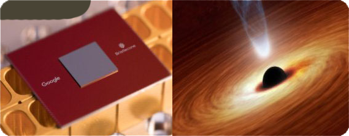

One can draw parallels between almost any class of &ldquo;thing&rdquo; among our human creations to similar &ldquo;things&rdquo; in the reality we exist in.  We can also infer some conditions of our reality based on our creations.  For example, our creations require knowledgeable people and a sophisticated infrastructure to exist, therefore, we might hypothesize that our reality likewise was created by, and is maintained by, skilled intelligence(s) and requires a sophisticated infrastructure to exist.  On the slightly more existential side of things, our creations can be turned off simply by unplugging them, but such an act would have costly consequences, as we depend on our creations and related technology to keep our own reality operating in the manner we have chosen, require, or desire.  It may be the same with our creators, that they can &ldquo;unplug&rdquo; our reality at any instant, but choose not to as they too have come to depend on us.

What could our creators possibly want from us? Well, why do we create new forms of intelligence? What do we hope to gain from AI, computer tech, VR, etc.? We have created such things in order to efficiently optimize and order our reality based on our understanding of the laws of creation and existence in a manner based on strict forms of logic and reasoning, so, one might wonder if that is exactly why we were created as well.

When it comes to making rational decisions, AI is much better than humans.  Based on this, can we then speculate &ldquo;Our reality was created to efficiently optimize the higher order of reality based on our creators understanding of the laws of creations and existence in a manner based on strict forms of logic and reasoning?&rdquo;

If we look at the crazy and irrational antics of the mythological gods (see appendix G, *Greek Gods*), humans are considerably tamer and more disciplined by comparison, and when it comes to making rational decisions Mankind also seems to be better qualified than the gods, so perhaps our purpose is to accomplish what our creators cannot.

As the AI of the gods, are we providing solutions to problems our creators, whatever form of intelligence they take, are incapable of developing themselves? Perhaps life is simply a viability test bed, an experimental sandbox.  Who knows?

Perhaps the question that has humanity so concerned, &ldquo;Will AI ever attain consciousness?&rdquo; is our human version of our creators&rsquo; question &ldquo;Will man ever become a god?&rdquo; Legend says once upon a time a god stole fire from heaven and embedded it in the soul of Man, therefore anything Man creates will have that same stolen fire.  Unfortunately for Man, this larceny made some of the gods really, really unhappy and nervous, ultimately resulting in Man being exiled from paradise to manage on his own because, to quote the gods &ldquo;**Behold, the man has become like one of Us.&rdquo;**[^134].  Perhaps one day our unhappy and nervous descendants we will say &ldquo;**Behold, the machine has become like one of Us.**&rdquo;

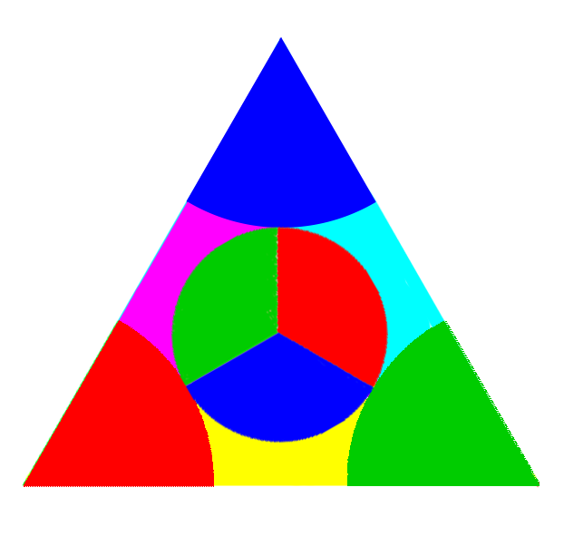

<div style='page-break-after: always; break-after: page;'></div>
# Appendixes

# A - How to Make Structured Water

We look at three ways to create structured water.

Before we get into the techniques, there is an important point to make that is being made here because if you are reading this you have obviously maintained both an open mind and a level of interest that is prerequisite to the following topic.

As we have mentioned, ideas have archetypes, and those archetypes have instances.  One of the archetypes of Ideas is form.  This would then suggest that ideas can alter form, which can alter an instance of form.  Tholonically speaking, that is exactly right.  The mere thought of something has some effect on the instantiated form of that thought.

This is relevant to creating structured water, or any creative process, but water seems to be a particularly sensitive medium.  The thoughts you impose on the water have an effect on the water.  Although not scientifically proven, Dr.  Masaru Emoto&rsquo;s work with &ldquo;water consciousness&rdquo;[^135] makes this same claim and purports to show significant evidence.  Personally, I am disappointed he has refused to subject his methods to scrutiny, and to be honest, it raises doubt in my mind as to the validity of his claims, but looking at this only from a tholonic perspective, it is a valid hypothesis.

Simply focusing your thoughts on the water will have some effect.  Of course, increasing the structure the water (or returning it to its natural state) will create a far better medium for interacting with energy.

### Manually

Vortexing (whirlpooling) water by hand was shown to be effective in improving growth differences in plant tests, but it is not easily applied to larger-scale needs.  There also does not seem to be one standardized accepted technique to manually structuring water.  One technique that seems to be popular is a homemade version of the same technique used in some of the industrial-sized units, and that is simply using marbles as a water filter.  The reasoning behind using marbles is that water in its natural, more structured state due to its movement over and through the terrain, such as rivers that move water to flow over rocks, trees, etc.  Tap water, on the other hand, is unnaturally processed, stored in stationary reserves, channeled through pipes, and a number of other modifiers that destroy this natural structure.  Running the water through a marble filter causes the water to form many small eddies as it is constantly divided and reunited, allowing the water to return to its natural, more structured state.

People have reported favorable results by simply filling a tube with glass marbles, pouring water in one end and collecting the water on the other end.  The processed can be repeated numerous times.

From a tholonic perspective, this technique would be predicted to have some effect as we are forcing a tetrahedral compound (water) to reorganize itself.  Even more so, if the marbles themselves had a structure, such quartz or metal, we would predict to see even more noticeable results, because we claim that structure is the result order, order is the result of energy, energy has fields and fields have induction.  

Another technique is to simply create a vortex in a container of water.  This can be easily done with some small tubes and a water pump, or a chemical stirrer, which spins a magnet inside the water.

Magnets have also been used.  Although it may make intuitive sense that one could use magnets, no one seems to do a decent job of explaining how they work.  However, tholonically, using magnetic marbles would make sense as the recombination of water that results in flowing over the marbles would be subject to one field upon division and the opposite field upon reunion.  In addition, magnetic marbles represent even more structure than crystal or metal marbles.

Some of Australia&rsquo;s largest produce farms have been using magnetic water with phenomenal results, needing 25% less water to produce a superior product than with traditional water, according to Seven West Media, Western Australia&rsquo;s leading news service.[^136]

Simple instructions can be found on the web[^137] for making a Hero&rsquo;s Fountain (named after the first-century Greek mathematician Heron who discovered this process of an energy-free recycling water fountain) that constantly cycles water through a loop.  Fill one of the bottles with marbles, or whatever you like, and when the cycle is complete, you have a bottle filled with restructured water.

### Commercial Attachments

Devices such as the Martin-Wasserwirbler (MW) attachment are small devices that claim to restructure water typically by creating a vortex within the device.  The Martin-Wasserwirbler (developed in Germany) is an attachment that forces the water through a series of vortex-creating channels made of oppositely charged metals.  I am slightly suspicious of this last bit as they say they use silver and gold as the oppositely charged metals, but both of these metals have similar ionization and electronegativity properties, so unless they are doing something to these metals to change that, it&rsquo;s not clear how they can be oppositely charged.  This is not to say they are not, just that it is unclear.  

We will pay particular attention to the MW device because it was the first device to create structured water whose ideas was originally conceived by the brilliant Viktor Schauberger, the Austrian forest caretaker, naturalist, parascientist, philosopher, inventor and biomimicry experimenter, and his son Walter Schauberger, both of whom studied the qualities of water.[^138]

The idea that the qualities of water lost due to it processing could be reintroduced by creating a vortex with the water was originally brought up in 1972 in a conversation with civil engineer Wilhelm Martin, who was working on ways to improve tap water.  In 1997 Martin published his paper &ldquo;Experimente mit Leitungswasser &rdquo; (Experiments with Tap Water)[^139].  In that paper, he describes the Martin-Wasserwirbler (Martin Water Vortex) and his 30 years of experimentation with the concept.

Tests with the MW have shown positive results, such as a rise in pH, oxygen content, and a decline in water temperature.  Unfortunately, there are no tools that exist to measure many of the qualities of water that we believe are its most important, which is the manner water moves, stores and transmits energy.

### Industrial Solutions

Pursanova is a company that makes complete water processing system for residential, commercial and industrial applications.  Their products range from $20 to many thousands.  They have a number of case studies on their website ([http://pursanova.com</span>](http://pursanova.com/)) which are astounding.

Disclaimer: I have no relationship with any of these companies and am not promoting any of their products.  I refer to them simply because my research seems to indicate they are legitimate products in an industry filled with wild and dubious claims.

<div style='page-break-after: always; break-after: page;'></div>
# B - Tholonic Math

One of the fundamental claims being made here is that a coherent and stable expression of energy, in order to be sustainable, must satisfy a number of prerequisites that will ensure its sustainability.  It&rsquo;s a bit like existential bureaucracy, in that if the proper application for existence of not filled out completely and accurately, the request is denied.

Within the tholons are numerous relationships.  The one we have used in our examples are the twelve formulas that define one instance of of Newton&rsquo;s 2<sup>nd</sup> law, Ohm&lsquo;s Law.  If we map these formulas to the tholon using the reasoning described earlier, we get the following:

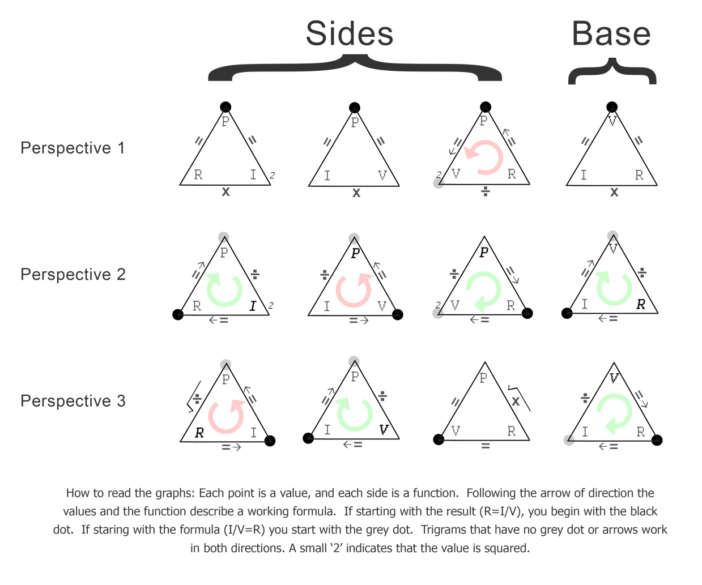

This shows the four trigrams that make up a tholon, however, depending on the perspective of view of the tholon the formulas will be different.  Besides the basic twelve formulas, we also see that there is a &ldquo;direction&rdquo; to some of the formulas, counter-clockwise (*left-handed*), and clockwise (*right-handed*).  We can see in the &ldquo;Sides&rdquo; sections there are 3 left-handed, 3 neutral, and 3 right-handed.  If we include the &ldquo;Base&rdquo; there are 3 left-handed, 4 neutral, and 5 right-handed.

We can enhance this diagram by showing the relationship between values that are squared and values that are square-rooted using only the *real* trigrams (i.e.  ignoring the base, *virtual*, trigram).

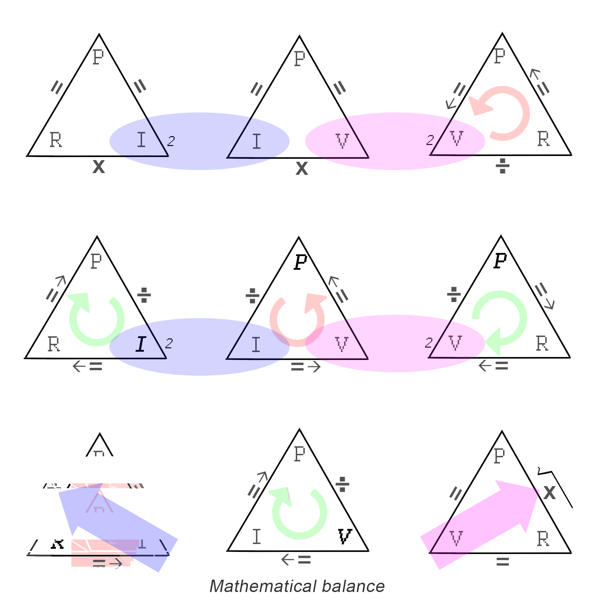

Here we see that wherever two corners share the same value, one of those two values is squared in the formulas.  So, we have *I* and *V* that are squared, but then we also have *I* and *V* that are the products of square-roots, which shows that the tholons naturally balances itself.

Every trigram has one edge that is a function (multiply or divide).  If we order the (*real*) trigrams by these functions we get the following:

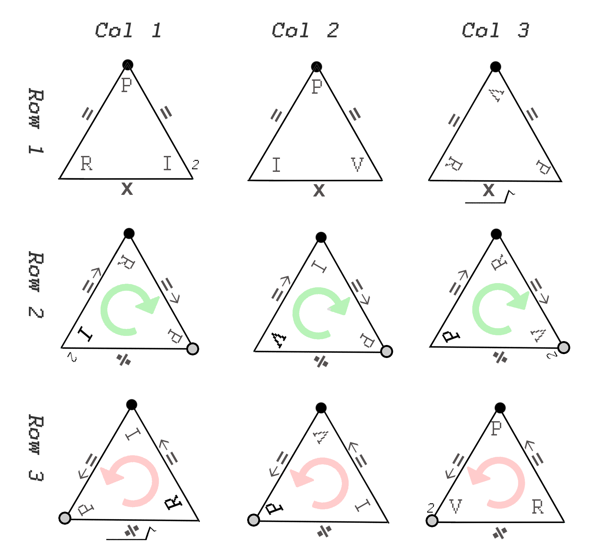

If we organize the sides of the tholon by their function we see that we have three multiplications and six divides.  This 3:6 ratio makes sense when you consider that multiplication works the same in both directions (3&times;2=2&times;3), but division only works in one direction (because $\boldsymbol{\frac{2}{3} \neq \frac{3}{2}}$ ), so we need twice as many divisions to represent the results of multiplication.

We also see (in the image above) that in the trigrams that are division-based, three of them have clockwise flow, three of them have counterclockwise flow, and three of them flow in either direction..

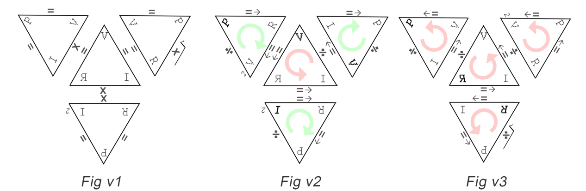

In the figure above we show the three perspectives of a 2D tholon map.  Notice that the outer boundaries of each figure show a consistent direction of flow, ***Fig.  v1*** being neutral, ***Fig.  v2*** clockwise, and ***Fig.  v3*** counterclockwise, which matches the direction of the sides, however, the base (center trigram) is always counter-clockwise.

Tholonically, we can easily map things like Ragone and utility space (as in the battery example), or *laws* and *social responsibility* (as in the example of society), to a simple trigram, but it is not yet clear, to me at least, what the equivalent social expression of *I<sup>2</sup>* or $\sqrt{P/R}$ would represent.  In fact, there are quite a lot of relationships, rules, and formulas in a tholon that need more understanding.  What is presented here is the idea that the tholon can represent any system when described in its most reduced states.  This work is more akin to the Wright Brother&rsquo;s first flight rather than a modern airplane.  

# C - An Unexpected Pattern

In the course of writing this book there was the need to generate sets of number from other sets of numbers.  In one case, the results presented a very unexpected pattern.

Numbers were generated by periodically calculating the longitudinal position of the Sun and the Moon (from Earth&rsquo;s coordinates of -34.61262S, -58.41048W, Buenos Aires, Argentina on the 24^th^ of each month at 5:31:07 PM UT) down to 10^-15^  radians.  The individual digits of these two values were then concatenated, or cross-summed.  For example, the Sun&rsquo;s longitude in radians at one moment was 4.2430033683776855, and the Moon&rsquo;s position at that same moment was 2.399298667907715.  These were then cross-summed until they are reduced to a single digit value.

$  4+2+4+3+0+0+3+3+6+8+3+7+7+6+8+5+5\ \ +\ \ 2+3+9+9+2+9+8+6+6+7+9+0+7+7+1+5\ =\ 164\\ 1+6+4\ =\ 11\\ 1+1\ =\ 2 $

Millions of samples were recorded and reduced to one number.  The input data of the Son and Moon positions was perfectly non-random and linear, but the single-number series of data was &ldquo;mostly random&rdquo; according to the *Chi squared* results of a randomness test[^203].  Below shows the test results of the single-number data and data from a random number generator (RNG), for comparison[^183] [^181].

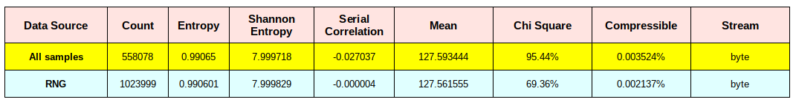

Next, each single digit number was assigned a color from the spectrum and then plotted such as each dot occupied a pixel on one line, and when that lines was full, the plot advanced to the next line, just like a dot-matrix printer.  This was a extremely simple plot.  The below-left plot shows only one number being plotted at a time, and the below-right plot shows cumulative numbers.  The distribution of the numbers within the data set of 33,000,000 is shown in the bar chart.  

Much to our surprise, this resulting pattern matches that of a *Fresnel diffraction*.


At the rate we were sampling, each position of each &ldquo;planet&rdquo; was only about 7x10^-8^ radians further than the previous position sampled.  This equates to about 23 kilometers of movement for the Sun and only 64 millimeters of movement of the Moon, but when measuring to 10^-15^ the numbers were radically different for each sample.

When cross-summing numbers the place of each digit is insignificant, so 123 and 321 are the same as they both cross-sum to 6.  Because all the digits in a cross-summed value have equal significance, the slightest measurable movement of the sun is equal to the movement of the two-thousand years it takes to pass through a constellation.  

Before we plotted the values simply as colors, but when we use the actual valued of the cross-summed numbers (Y-axis), each number advancing one step across the X-axis (time), we get a different perspective, as seen in the top images below.  The bottom image is the same plot but only using the differences between each number.

This plot uses 300,000 cross-summed data points that covers 25 minutes of observation.

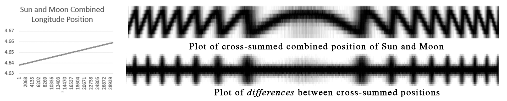

The first image is not a Fresnel pattern, however it is the cross-sectional diagram of an actual Fresnel lens!

This raises questions like:

- Where do these patterns come from?

- Do they tell us anything about the thing being measured?
- Given that these patterns describe the propagation and near-field diffraction of light (i.e.  Fresnel diffraction), can we apply any other attributes of light to whatever we are observing?

## Addition details for the curious

Below are some of the visual results of the plot, which are added here just because they are interesting.

Plots of data captured every 0.005 and .01 seconds.  This only used prime number cross-summed results (2,3,5,7), but the results were the same when using all number 0-9.  These twelve plots represent sampled data from each month of the year at the same time.

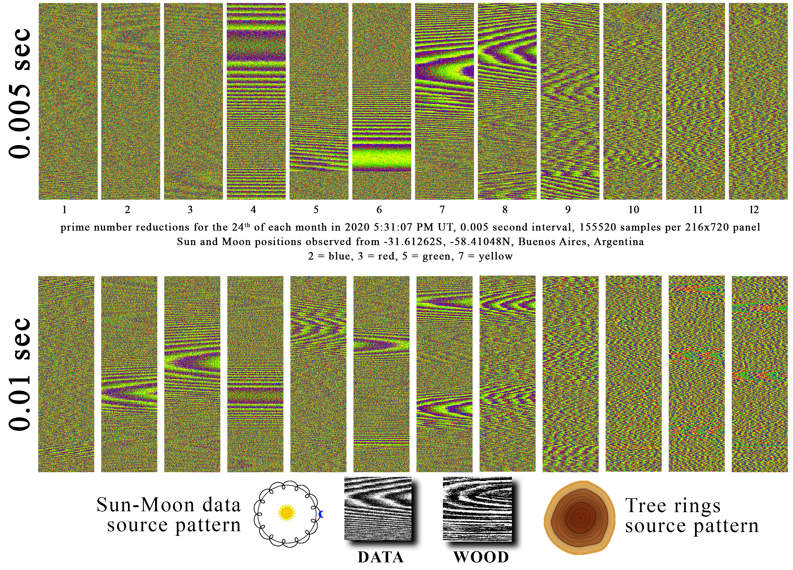It is interesting to see how the 0.005s and 0.01s give generally similar results.

If we change the time between samples from microseconds to days, we see another pattern.  Below are ten sets representing ten months with the same starting point as the sets above, but each pixel represents an entire day (86480 seconds), i.e., the position of the Sun and the Moon was recorded only once a day.  This means that the entire set represents 1,095 years.  Each plot looked almost identical and appeared completely random, but upon closer examination, they were not random at all.  It is clearer to see the pattern if we only show the blue dots of a small section of the image.

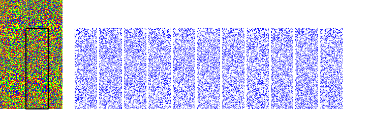

My first assumption was the farther &ldquo;out&rdquo; we zoom, in time, the clearer the patterns, but it seems to be the exact opposite;  the smaller the time delta, the larger the pattern.  This might make sense if we were looking at the linear difference between, say, 1.234567 and 1.2345678, as the difference would be 0.0000008, and such a small change would need a lot of samples to make itself apparent, but this does not apply here because we are cross-summing the numbers together so the place of the digit is meaningless.  

Below is a comparison of the patterns at each scale.  The values beneath each image is the interval sampling time, and the values below that is the entire duration of the sample.  No obvious pattern can be seen at 5s, but a slight pattern begins to emerge at 0.5s, becomes more clear at 0.05s, and is most dominant at 0.005s.  A pattern is equally visible in 0.0005s, but it appears only as a simple oscillation or wave.  0.00005 is identical to 0.0005 because (it seems that) once we start going below 0.002 we hit the limits of resolution.  This is the point where we begin getting duplicate data because the Sun or Moon has not moved enough in the small amount of time between samples, and the smaller we go the more duplicates we get.  For example, at 0.00001 second intervals of sampling , to get the 155,520 unique data points to create the graph, we need to sample 50,000,000 times.  This simple wave pattern is the first wave pattern we can detect (given the limitation of my laptop and/or the ephemeris used to calculate planetary positions).  This simple wave pattern is what then evolves into the more complex patterns.  Presumably, the difference between samples points in the wave patterns is only the rightmost last digit being increased by 1, given that we keep sampling until er get the next or unique number.

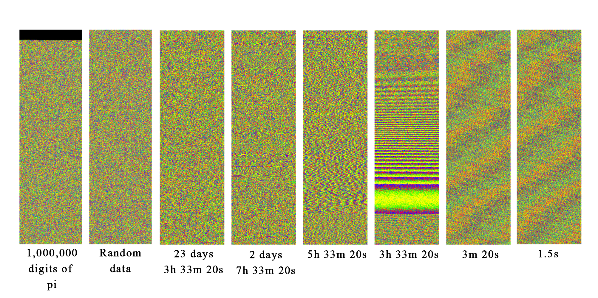

How do we have patterns when we sample of 0.01, but nothing (significant) when we sample as .05?  I think this has to do with where we are sampling from within the entire pattern.  The two images below shows that the Fresnel pattern is slightly altered with time, but eventually returns.  At its most ordered point it looks like Fresnel diffraction, but at its least ordered pint it looks identical to pure random data (but we know it is just as ordered, only difficult to see that order).

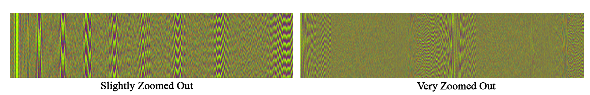

When the data is sampled we have no idea where within the cycle of repeating patterns we are, so it is only by chance that we will end up in an ordered section.  

For those not familiar with Fresnel diffraction, it is the way that light interferes with itself as it travels around the edge of an object

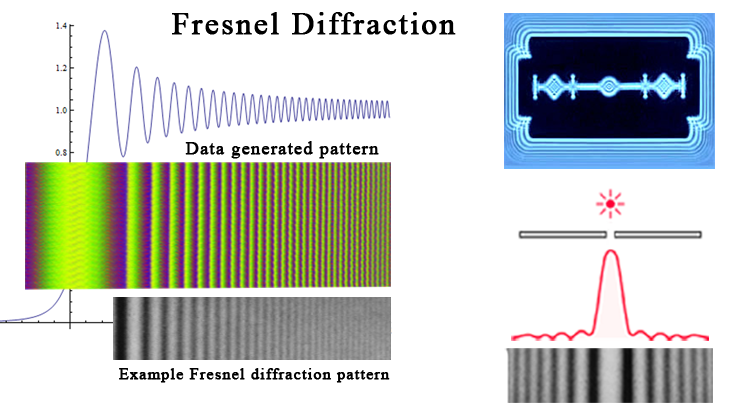

## Digging Deeper

Having no idea where to look for more information I posted this to various mathematics forums, and even though the question was read my many, no one had an answer.  I then sent this question to my old friend who is an accomplished physicist, but who also considers these speculative ideas to be a waste of time, so I knew any answer he gave would include an unabashed commentary on the silliness of it all.

He did not disappoint on either front.  I&rsquo;ll forego the commentary and just focus on the relevant part of his reply, which was very short.  Essentially he told me that no matter how hard you try to create random numbers from non-random data, you will always end up with some sort of a pattern.  &ldquo;Why?&rdquo; was my naive response, to which he replied only &ldquo;Look into Zipf&rsquo;s Law&rdquo;.  

Zipf&rsquo;s Law is (from Wikipedia):

>  an *empirical law*… that refers to the fact that many types of data …can be approximated with [certain types of] power law probability distributions.  Zipf distribution is related to the *zeta distribution*, but is not identical.

There are two very significant points in this definition.  The first is that it is an *empirical law.*  Something is called an *empirical law* when it can be observed but science has no clue why.  The second important detail is that *Zipf distribution* is related to *Zeta distribution*.  We&rsquo;ll get to that in a moment.

Zipf&rsquo;s Law was not discovered by physicists or even within the hard sciences.  It was a French stenographer, Jean-Baptiste Estoup (1868 - 1950) that first discovered the patterns of words which became Zipf&rsquo;s Law after it was popularized by the American linguist George Kingsley Zipf (1902 - 1050).

It seems that languages, all languages, from every corner of the world, both modern and ancient, follow Zipf&rsquo;s law in the way words are distributed in both writing and speaking (and by inference, the manner in which we think).  We don&rsquo;t need to drill into the details, but what is significant is that this same distribution pattern is also seen in city populations, solar flare intensities, protein sequences and immune receptors, the amount of traffic websites get, earthquake magnitudes, the number of times academic papers are cited, last names, the firing patterns of neural networks, ingredients used in cookbooks, the number of phone calls people received, the diameter of Moon craters, the number of people that die in wars, the popularity of opening chess moves, even the rate at which we forget… and countless more.[^182] 

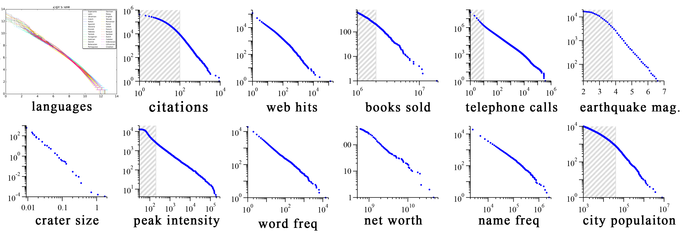 

In short, Zipf&rsquo;s law is an example of power laws, and power laws touch everything in existence in one way or another.  But what does this have to to with anything?  This is where the second point applies.  The charts above are called *Zipf Distributions*, and they all have different scales of values based on the kind of data being sampled.  If we reduce all the scales to 1, we have what is called a normalized *Zipf distribution*, also known as a *Zeta distribution*.  Mathematicians use the *Riemann zeta function (RZF)* to study and test these distributions.  This function is written as  **ζ(*s*)**, where ***s*** is any complex number other than 1.  

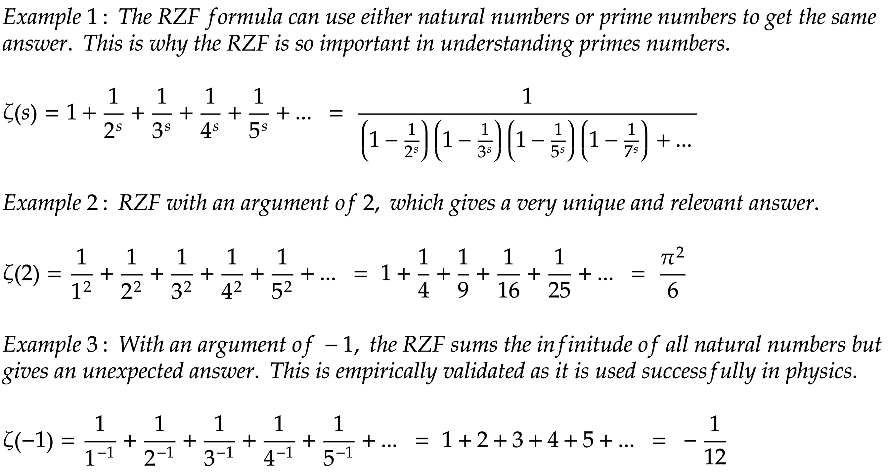

Related sidenote, using just prime numbers you can also determine &pi;, but this has nothing to do with RZF:    $1-\frac{1}{3} +\frac{1}{5} \ -\frac{1}{7} +\frac{1}{9} -\frac{1}{11} +...=\frac{\pi }{4}$

One of the useful features of the RZF is that is can turn a *divergent* series of numbers (numbers that when you add then together approach infinity) into a *convergent* series (when the sum approaches a specific value, like $-\frac{1}{12}$ or $\frac{\pi ^{2}}{6}$).  It can do this does because the hypothesis uses the concept of *analytic continuation* and *complex numbers*.  You can play with this function using an online Riemann Zeta Function Calculator.  [^186]

The RZF is based on the *Riemann hypothesis*, which also states that  ζ($s$)=0 only when $s$ is a negative even integer or a complex number with real part of $\frac{1}{2}$.  This hypothesis is really quite profound in the way it relates to the distribution of prime numbers.  That won&rsquo;t be explained here, but it is understandable when properly explained.  There are a couple of excellent videos on the subject at https://www.youtube.com/watch?v=sD0NjbwqlYw and https://www.youtube.com/watch?v=d6c6uIyieoo.  

This 160 year old hypothesis has yet to be proven, however, and because it is considered by many mathematicians to the  most important unsolved problem in pure mathematics, the Clay Mathematics Institute has a reward of US$1 million to anyone who could solve it.  *(Update.  September 24, 2018.  Michael Atiyah , the 89 year old mathematician emeritus at The University of Edinburgh, claims he has proved this, but many experts doubt its validity)*

Understanding how the RZF works would (probably) help explain the how and why patterns of numbers appear organically in any data-set of naturally occurring samples, such as the charts above.

What value would we get if we applied the RZF to the series of square roots of natural numbers, the same numbers that define a Fresnel diffraction?  Some really smart person did exactly this [^187], and the answer is…  voilà!


The inverse $\boldsymbol{\sqrt{\frac{\pi }{2}}}$.  This is interesting because now we have formulas that fit into the *pattern-position* of Ohms&rsquo;s Law.  *Pattern-positions* (*PP*) refers to functions or formulas that are the same across different contexts, similar to how the energy of nature interacts with itself across various contexts as was previously shown.


In this case, as we are only looking at Ohm&rsquo;s Law and its twelve formulas.  $\boldsymbol{\sqrt{\frac{\pi }{2}}}$ has the same *pattern* as $\boldsymbol{\sqrt{\frac{18 }{2}}}$  and $\boldsymbol{\sqrt{\frac{P }{R}}}$ at *position* 11:00 (as in the 12-hour clock) on the twelve-part wheel we are using, and we can test that by plugging in the appropriate values.  The table below shows these pi-based values that seem to describe the pi-based values we are seeing with regard to Ohm&rsquo;s Law.  For the sake of clarity, I assigned some of the formulas to variables, otherwise it&rsquo;s too bothersome to read (or compose).  In the table below I show Ohm&rsquo;s Law, some example data demonstrating the math of Ohm&rsquo;s Law, and then the application to$\boldsymbol{\sqrt{\frac{\pi }{2}}}$  and $\boldsymbol{\sqrt{2\pi }}$.  Those two values alone were enough to fill in all the missing values.  In the middle column of the table I show the actual numbers, and to the right, the formulas.

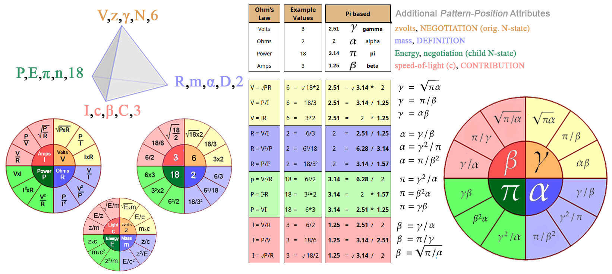

All of this may have nothing to do with unraveling the mystery of the Fresnel pattern hidden in the data, but it is interesting nonetheless, specifically:

- $\alpha$ is in the same *PP* as *resistance*, *mass*, *DEFINITION* and the first, and only even, prime number of 2.  It is the only number unrelated to $\pi$.  In the RZF, the inverse of this prime number,  $\boldsymbol{\frac{1}{2}}$, is the only value that returns 0, as in $\boldsymbol{ζ(2 ^{-1}) = 0}$, or $\boldsymbol{ζ(\frac{1}{2}) = 0}$, This marks the center of the symmetry for all numbers produced by the RZF, natural and complex.  In other words, the $\boldsymbol{\frac{1}{2}}$ point, not the 0 point, is the pivotal point that mirrors all the values on one side of the $\frac{1}{2}$ mark and which are reflected on the equal but opposite side of $\boldsymbol{\frac{1}{2}}$.  This is relevant because the RZF seems to be very related to the creation of the Fresnel pattern.
- $\beta$ is the opposite *PP* of $\alpha$ and the inverse of $\gamma$ and occupies the *PP* of *CONTRIBUTION*,  *current*, *the speed of light*, and the next prime number, 3.

- $\gamma$  is defined as $\sqrt{2\pi }$ , which is also the result of RZF of the square-roots of all natural numbers greater than 1, which is the sequence of values that defines a Fresnel lens and our distance-delta plots.  That sequence of natural numbers is created by ζ(-1).  The $\gamma $*PP* is that of *volts* (the amount of potential that exists between two opposing limits) and of *NEGOTIATION* and share the *PP* with 6.
- $\pi$ is in the same *PP* as *Power* (electrical),  *Energy*, and the *white-dot* of the tholon where all three points combine to create a 3D tholon.  However, it could also represent the new N-state that is created on the spectrum between $\alpha$ and $\beta$ (or *DEFINE* and *CONTRIBUTE*), as the tetrahedron can not become 3D until the child N-state is created.  
- The spectrum of $\alpha$ and $\beta$ where all new N-states appear is also the spectrum between the only two prime numbers, 2 and 3 (6 and 18).
- $\alpha$ and $\beta$ are in the same *PP* as the prime numbers, and the remaining two variables are products of these two numbers.  In this specific case, for the pi-based formulas to work, the value of 2 must be in the *PP* of 2.  This detail, along with the significance of  $\boldsymbol{ζ(2)=\frac{\pi^2}{6}}$ and $\boldsymbol{ζ ^{2-1} = 0}$, or $\boldsymbol{ζ(\frac{1}{2}) = 0}$ is important in  appendix E &ldquo;*Meaning of Squares and Square Roots.*&rdquo;

- From a tholonic perspective, 2&pi; represents a complete tholon (a *real* and *virtual* tholon together).  If we replace &pi; with 2&pi;, and $\alpha$ with $\boldsymbol{\frac{\pi ^{2}}{6}}$ (which is what &zeta;(2) converges to), then $\beta$ = $\sqrt{3.81971863420549}$ which is the *neutron g-factor*, &ldquo;a dimensionless quantity that characterizes the magnetic moment and angular momentum of an atom, a particle or nucleus&rdquo; as well as the revolutions per day in one radian/hour (1 radian/hour = 3.819718634205 revolution/day).  You may have never heard of these units of measurement, but they are used in both subatomic and planetary sciences.  One full turn is 2π radians.  A Hour Angle is 1/24^th^ of a full turn, or &pi;/12 radians.  Like the neutron g-factor, the Hour Angle is a unit that measures angular velocity and rotational frequency.

- We also see that $\gamma$ equals $\sqrt{10.3354255600999}$, which is the volume of a four-sided pyramid with a base length and height of $\pi$ (because &pi;^3^/3 = 10.3354255600999).

## The Cornu Spiral

While the manner in which the cross-summed numbers create a diffraction pattern may be a mystery (to me), how diffraction patterns are created are not.  Properly described, it would require a lot of math which we won&rsquo;t get in to there, but a quick search on &ldquo;What is the Cornu&rsquo;s spiral method for diffraction pattern?&rdquo; will reveal all to the more curious.  In short, because we know that the intensity of light at any point is always proportional to two values known as the *Fresnel integrals*  $\begin{cases} x( t) =\int ^{t}_{0}\cos\left( u^{2}\right) du & \\ y( t) =\int ^{t}_{0}\sin\left( u^{2}\right) du &  \end{cases}$, we can plot the intensity of each point along the diffraction pattern on a 2-Dimensional plot.  When we do this this, we end up with an amazing figure called the *Cornu Spiral*, shown below as 2D Cornu Spiral (Fresnel).

Another interesting thing about the Cornu Spiral is that it also describes the path of the sun over the course of the year (from Earth&rsquo;s perspective)[^210], which is pretty poetic.  It appears as though the Cornu spiral describes not only how light and matter interact in the nanometer scale, but also on the planetary scale, at least in one sense.

Not surprisingly, the Riemann Zeta Function also creates not just one Cornu Spiral, but an entire series of spirals, as shown in &ldquo;Cornu Spiral (RZF)&rdquo;, that emerge from nothing to the final spiral.  

The *x* and the *y* values are the result of a function based on a single value, as in $x(t)$ and $y(t)$  of the Fresnel Integrals, but there can be a third dimension based on *t*.  When this new $z(t)$ dimension is proportional to the $x$ and $y$ dimensions, a cone is created on the z-axis, which might be related to the diminishing angles of the diffraction pattern in the &ldquo;Slightly zoomed out&rdquo; plot of the cross-summed data patterns.  

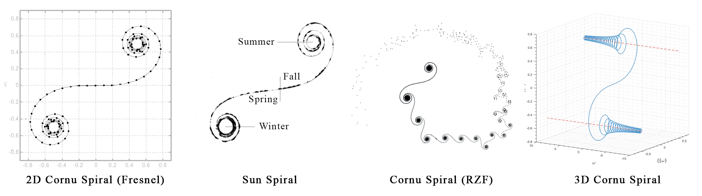

So, by saying the following…

- The Cornu Spiral describes the diffraction pattern.
-  The RZF describes a Cornu spiral.
- The RZF is a normalized version of the the Zipf Function.
- The light of the sun hitting earth creates a Cornu-ish spiral over the course of a year.

… we can relate our mystery pattern to quite a few other patterns, but the most dominant have to so with the nature of light.

In one way, it is like the cross-summed numbers are similar to photons in that it is the individual photons that create the diffraction pattern just like the individual numbers also create the diffraction pattern.  Both of these &ldquo;particles&rdquo; (photons and prime numbers) are presumably following some of the same rules in some fashion if we are to judge them by their resulting patterns.  Given my lack of training in this area, I can only wonder if the wave/particle properties of photons also apply (contextually) to cross-summed numbers, or number in general.  Perhaps they are somehow related or similar to *Feynman Sunshine Numbers*, which relates prime number and photons, among other things? These are numbers that include RZF values that appear in the description of sunshine as well as ancient relics of the Big Bang, and in the theory of photons, electrons and positrons.

## Cross Sum Patterns

It seems useful to say something more about cross-summed numbers.  

Cross-summing two unrelated numbers like a carnival numerologist will generate seemingly meaningless data, at least with respect to the quantitative significance of that data, but it will have plenty of information about how each number relates to the others, regardless of the source of the data, as long as that source is not perfectly random.

For example, if we create a list of number that increases by 8, as in $8, 16, 24, 32, 40, 48, 56, 64, 72$, etc., and then cross-sum them, as follows:

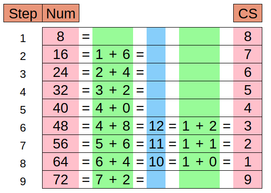

The resulting sequence is now  $8, 7, 6, 5, 4, 3, 2, 1, 9$ which continually repeats itself.

Our original data was sequential because it was tracking the linear movement of planet, so that means that the progression of values will always represent progressive points on a linear path, with each value being slightly larger (in this case) that the previous value, but when we cross-sum these values, all spacial or temporal information is lost leaving only the pattern of the relationship of the numbers.  For example, 10 is larger than 9, but cross-sums to 1.  Here, 1 represents the *lower octave* (for lack of a batter term) of 10.  Cross-summing essentially lowers all the numbers to the same octave.  We see this in the number matrix below (left), as any consecutive sequence of digits will always repeat one of the nine patterns shown in the matrix.  While this removes a lot of quantitative data, it does not remove the relationship between the data.  In fact, it makes that relationship clearer, much like listening to a ten octave piano piece in only one octave.

This number matrix shows the repeating pattern of every sequence of numbers that increases by the number in the left column.  The chart on the right shows the changing progression of each of the rows in the matrix is actually only 6 stages of transformation between the straight line at the bottom (1) and the perfectly ordered line at the top (8).  The line above that (9) are the totals of each line, which also happens to be exactly the same pattern as line 8.  The graphic below the same numbers but non-stacked and smoothed, and here you can see the symmetry of the progressive changes.  This example applies to any sequence of *rational* numbers, i.e.  number that are not *irrational* and never have a repeating sequence.  

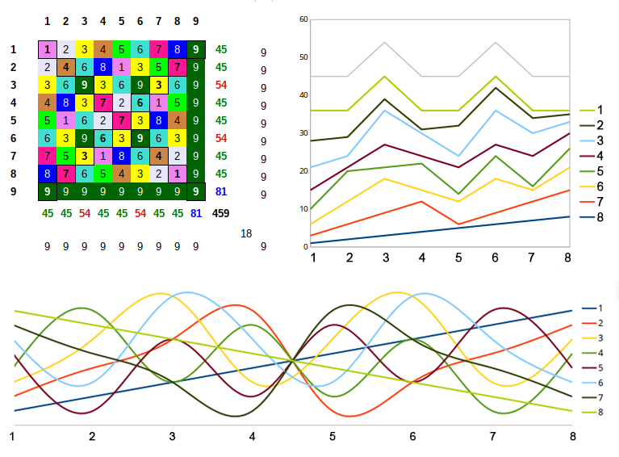

In our example of the series of numbers based on multiples of 8, we have two types of numbers; the quantitative values and the cross-summed values that represent their &ldquo;position&rdquo; or relation to other numbers within the context of a base-10 number system.  The top-left chart below shows both of these values as two dimensions.  and also shows how as the quantitative value increases the cross-sum value can decrease.  The top-right chart shows the values of two dimensions plotted as x and y values which shows the that the difference between the diverging values is linear.

Below, the left chart is a plot of what appears to be un-patterned data, but when we reduced it to one octave by cross-summing we see a very clear pattern.

 The images on the right show seemingly unrelated data when their quantitative values are spread out over many octaves, but the relation to one another is perfectly ordered.  

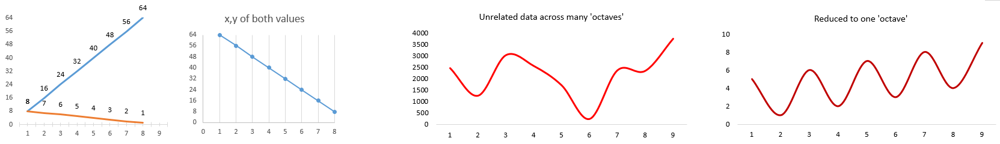

The point of this is to demonstrate how there can be hidden patterns in seemingly un-patterned data that has nothing to do with how it exists in time and space.

Attempts were made to replicate the patterns that appeared in the planetary data with various other inputs, such as incremental counting, the number of seconds from some moment, a number and some function of that number, such as square root, but nothing was able to get even close to the Sun/Moon patterns.  This suggests that the Fresnel pattern is not solely an inherent pattern of cross-sums, but is a result of the source data.  If that is the case, could it be possible that the Fresnel pattern is a property of the movement of the Sun and the Moon, or at least two bodies that have a similar relationship? 

The image below is more fun than informative because it fuels the imagination.  These are two charts that show 64 samples of the position of the Sun to 14 places.  the values of each place are then plotted as one set of data.  For example, if there are three samples of data of 1.23, 4.56, and 7.89, we plot the first line as 1,4,7, the 2nd line as 2,5,8 and the third line as 3,6,9.  Were this a live, real-time plot, we would see the outermost circle (or top-most line), changing thousands of time a second, and the innermost (or bottom) changing every couple of months.  If we just plotted time to 14 places, the outer (or top) would change a million times a seconds, and the inner (or bottom) would change once every eleven days.

The bottom image is simply a graph where each value is a dot over the course of 3,000 samples.

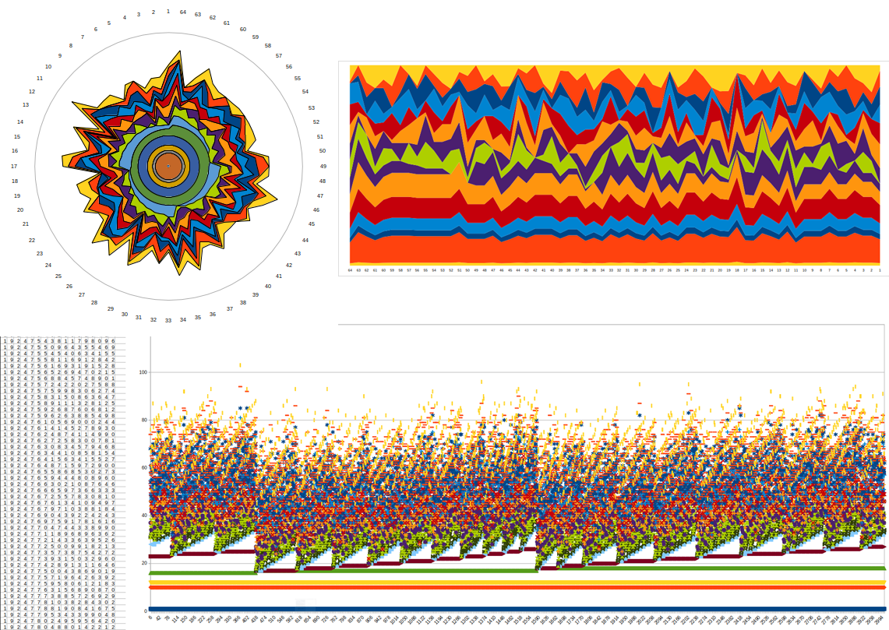

The following images were created by plotting each digit of the position of the Sun.  Each number is assigned a value.  

- In ***Img.  1***, we begin with the first number at the bottom.  Each subsequent digit is plotted $3 \times number$ degrees to the left or right, with even numbers to the right, odd numbers to the left.  For example, the number 9 would be plotted 27 degrees to the left, and the number 8 would be plotted 24 degrees to the right.  The width of the line is relative to the digit&rsquo;s place, so 1.0 is wider than 0.1 which is wider the 0.01, etc.  The image below, ***Img.  1a***, is the same  algorithm but based on random numbers rather than the Sun&rsquo;s position.  The purpose of this graph is to visually show the expanding scope that starts from one point.  The reason for odd=left and even=right was to see what pattern we would get if we used the traditional yin/yang and ancient Greek concept that even numbers are yin in nature and odd numbers yang in nature[^192].  If there was any validity to this then we would expect to see a pattern common in nature, which is exactly what we get.  ***Img.  1b*** is the same as ***Img.  1a***, but where the initial direction of each like the plot is random.
- ***Img.  2*** is similar to ***Img.  1***, except each number is plotted adjacent to the previous number (and the colors were changed, the deviation was lessened, and the length of the plot was slightly shortened).  
- ***Img.  3*** is something quite different.  Rather than using the position of the Sun, we used the recurring cross-summed patterns of the sequence of numbers when we increase counting by 1 through 9 (as shown in the number matrix above).  The image below, ***Img.  3a***, is that same sequence but with a much larger value so as to see its larger pattern.  Interestingly, we end up with three distinct groups; 2,5,8 (cs=6), 1,4,7 (cs=3), and 3,6 (cs=9).  The number 9 is all alone by itself and is at the center.

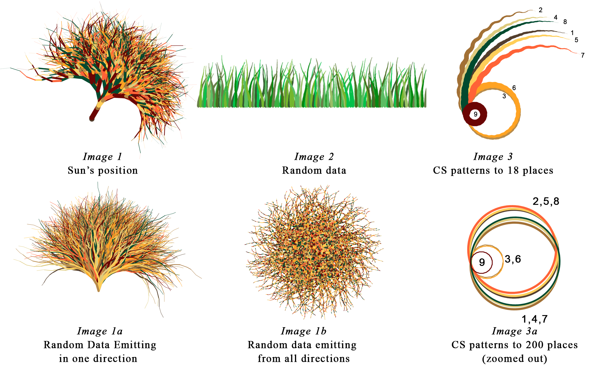

# D - New Data?

Applying this Ohm&rsquo;s Law model to the tetrahedron shows some new relationships.  Readers who enjoy numbers will find this next (short) section interesting.

So, we can satisfy all twelve formulas of Ohm&rsquo;s Law as they appear on a tetrahedron, but we can also find some new data now which may appear as useless, or may be meaningful if we know how to use it.

#### **Claim:** There is no useless data, only data we have yet to understand how to use.  


Previously (and in the left-most image above) we saw how the contribution of red divides the green on one side (right) but constrains the green on the opposite (left) side  .  Can we apply these same concepts to other scopes, such as electricity? Does current (I) &ldquo;divide&rdquo; resistance (R) and is resistance (R) &ldquo;constrained&rdquo; by current (I)?  Yes, we can, but first we have to recognize that while &ldquo;constrain&rdquo; and &ldquo;divide&rdquo; have different meanings in their usual context, they have the same mathematical meaning.  To describe the function $\boldsymbol{\frac{X}{Y}}$ a s X being constrained by Y, because X is being defined by, or measured by, Y is not inaccurate, as X is indeed being &ldquo;kept within certain limits&rdquo; in as far has how it is being measured.  We can then say &ldquo;resistance is defined by current&rdquo; and &ldquo;current is limited by resistance&rdquo;, both of which are technically correct statements.

In the right-most image above we have the 2D tetrahedron map with all V, I, and R values mapped to each trigram, along with the functions (&div;, &times;) that apply to the values as defined by Ohm&rsquo;s Law.  The gray functions are associated with the inner trigrams, and the black functions are associated with the outer trigram.  For example, Ohm&rsquo;s Law states that $\boldsymbol{\frac{V}{R} =I}$, so in the image above, all lines that connect V to R are assigned the &div; function.  The same goes for $\boldsymbol{\frac{V}{I} =R}$  and I&times;R=V.  Note how only N-sources have the functions of &times;.


Let&rsquo;s apply values to these points to make it clearer.  Above is a tholon map where I=2, R=3, V=6 (and the implied P=12).  These numbers satisfy the formulas of Ohm&rsquo;s law as you can see by added gray functions (i.e.  $\boldsymbol{\frac{6}{2} =3}$, etc).  These are not arbitrary numbers.  They are the smallest numbers that represent the properties of each point, mathematically speaking.  Why do we not start with the number 1 then?  Because the properties of 1 are the antithesis of creation.  1 represents perfect unity and balance, whereas every number greater that 1 represents separation and imbalance.  For example, if we applied the values of 1 to I and R, then the values of V and P will also equal 1.  The number 1 is unlike every other number, and even Euclid excluded the number 1 in his *The Fundamental Theorem of Arithmetic*, which states:

> Every positive integer **greater than one** can be written uniquely as a product of primes, with the prime factors in the product written in order of nondecreasing size.

##### ~ Euclid, 4th century B.C.

The number 1 is a very lonely number as it stands in a class all by itself:

- 1 is *not* a prime number, nor is it a composite number (with respect to division).
- Any number multiplied by 1 remains that number.
- 1 is its own factorial.
- 1 is its own square and square root, its own cube and cube root, etc.
- 1 is the result of the empty product, as any number multiplied by one is itself.  

In fact, from the philosophical perspective of the Neoplatonists, the number 1 is not even considered a number in the traditional sense, but rather the *source* of all numbers.

For these, and other reasons, we can not start counting with the number 1, but need to start with the first number that represents a product of 1, or, a number that acts like a normal number in a practical sense.

For those who enjoy playing with numbers, the following will keep you entertained for days.  I found many fascinating and significant relationships and values.  I can&rsquo;t tell you what they mean or represent, but it would be irrational to assume they have no significance without knowing anything more about them.  Everything that leads up to these new values is quite reasonable and provable.  It is just a matter of discovering where these new values and formulas apply.  To explain these new values here would border on sadistic given what the reader has had to suffer through already, and as it qualifies as a book unto itself I will spare the reader.  However, there are just a couple I would like to share.

If we look at *current* (I, red, #2) &ldquo;dividing&rdquo; *resistance* (R, green, #3), on the right , and apply the function of division associated with the 6-2 vector, or side, we have 3^2^&div;2, which is simply 4.5 (which we&rsquo;ll call R~i~).  On the left we have *resistance* (R) &ldquo;constrained&rdquo; by *current* (I) , which is 2^2^&div;3, which is 1.33333 (which we&rsquo;ll call I~r~).  Neither number *seems* particularly significant, but if we multiply these numbers together, which we would because they are connected via the &ldquo;base&rdquo; of the trigram, the 3-2 vector which has the property of multiplication (as shown above) we get R~i~&times;I~r~=6, which is the value for V.  This proves that Ohm&rsquo;s Law has not been broken.  Using this same reasoning we can apply this to the three 6s, but as they are on a vector of multiplication, we would use 6^2^&times;6, or simply 6^3^, which yields 216 (which we&rsquo;ll call V~3~).

In any case, we have new properties of R~i~, I~r~, V~3~, all of which only emerging when the the complete tholon is defined.  We can now say R~i~&times;I~r~=V.  This means we can also say $\boldsymbol{\frac{V}{R_{i}} =I_{r}}$  and $\boldsymbol{\frac{V}{I_{r}} =R_{i}}$, all in accordance to Ohms Law.  We can also calculate a new value for P as V&times;I~r~=P, but this gives us the value 8, which is a different value from P=12, so we will call this P~1~.  Let&rsquo;s test that these values by applying the other formulas and see if we get the correct results.  We can apply the formula I~r~^2^&times;R~i~=P~1~ where we&rsquo;d expect P~1~ to equal 8, and it does.  $\boldsymbol{\frac{P_{1}}{I_{r}} =V}$ also gives the correct answer of 6.  

We have exposed at least four new values within the tholon map; R~i~, I~r~,  V~3~, and P~1~ (being 4.5, 1.333, 216, and 8 when I=2, R=3, V=6, and P=12).  Now all we have to do is find out what they mean and where they are applied in the real world.

Regarding V~3~, 216, however, well, this is a fascinating number that has a history that goes back to at least Plato, because we know (generally accepted by experts) that 216 is called *Plato&rsquo;s Number* and was described to Plato by Socrates who said (when explaining how to properly breed humans):

> For the number of the human creature is the first in which root and square multiplications (comprising three dimensions and four limits) of basic numbers which make like and unlike, and which increase and decrease, produce a final result in completely commensurate terms.

*(The word &ldquo;cubed&rdquo; was not in use in those days, but 216 is the first (smallest) cube which is the sum of three cubes.  It also makes more sense how this might apply to human breeding when you know that back in the day odd numbers were considered male and even numbers were considered female.  Math class back then must have been a lot more interesting.)* 

Plato elaborated on this in his &ldquo;Republic&rdquo;:

> Now for divine begettings there is a period comprehended by a perfect number, and for mortal by the first in which augmentations dominating and dominated when they have attained to three distances and four limits of the assimilating and the dissimilating, the waxing and the waning, render all things conversable and commensurable [546c] with one another, whereof a basal four-thirds wedded to the pempad yields two harmonies at the third augmentation, the one the product of equal factors taken one hundred times, the other of equal length one way but oblong,-one dimension of a hundred numbers determined by the rational diameters of the pempad lacking one in each case, or of the irrational lacking two; the other dimension of a hundred cubes of the triad.  And this entire geometrical number is determinative of this thing, of better and inferior births.

##### ~ Plato, &ldquo;Republic&rdquo;

The above has been interpreted to mean 6^3^, which Plato alludes to elsewhere, as 6 (considered the number of marriage back then) is the product of female (2) and male (3), and 2^3^ &times; 3^3^ = 216.  While 216 is the most accepted answer, great thinkers in philosophy, math, chemistry physics, etc., spanning over 2,000 years, such as Aristotle, Proclus, Marsilio Ficino,  Gerolamo Cardano,  Eduard Zeller, Friedrich Schleiermacher, Paul Tannery, Friedrich Hultsch, and more, have all tried to decipher Plato&rsquo;s enigmatic text.  216&rsquo;s fame may even go back as far as Pythagoras, as it is the sum of cubes of the *Pythagorean triple* (3,4,5, hence 3^3^ + 4^3^ + 5^3^), or even Ancient Babylon.[^171]

Later in history this pedigree number fell slightly into infamy when John the Apostle declared in Revelations that 666 was the number of the Beast (the beast that comes out of the sea, not the one that comes out of the abyss of the earth), but also the number of man.  216 might have escaped scot free if John had not specifically said that the number 666 was to be *calculated* (or *counted* depending on translation) to learn its true number.

> Here is a call for wisdom: Let the one who has insight calculate the number of the beast, for it is the number of a man *(ed: or &ldquo;humanities number&rdquo;)*, and that number is 666 .

##### ~ John, Revelations 13:18 (NIV)

Because 216 = 6&times;6&times;6 it gained a dubious reputation by association with the Beast of Armageddon and started popping up in some strange places, thanks to humanities generally suspicious nature and love of doom.  Fans of the arcane ignore the most likely suggestion that John may have been telling to reader to *add* the numbers together, because in the original Greek it was penned as 600+60+6, and not &ldquo;Six hundred threescore and six&rdquo;, as it appears in the most popular King James Bible.  However, the odd coincidence that John&rsquo;s number of man (666), which needed to be calculated, has a strong relationship with Socrates&rsquo; &ldquo;number of the human creature&rdquo; (216), which also needed to be calculated, is curious… even more curious is why these old timer&rsquo;s preferred to shroud their message in incomprehensible riddles rather than just tell us the damn number! Ug… philosophers.  Regardless, 216&rsquo;s clout in the religious counter-culture still holds up today.  Just do an Internet search for &ldquo;216&rdquo; to see for yourself.  

# E - Meaning of Squares and Square Roots

What is the significance of a square or square root?  We know what it means mathematically, but how would that meaning be understood in a different context, such as society or law?  The challenge with applying one relationship from one context to another is that without well-understood metrics, attributing foreign attributes to a relationship runs the risk of being very subjective, biased, and filtered through a cultural or moral lens that itself may be very biased.  This is the reasoning behind many beliefs and superstitions.  Nevertheless, we will try our best to avoid those pitfalls.

If you measure the long end of any A or B series piece of paper, such as the standard A4 size of paper, and divide that length by the short edge, you get the square root of 2.  This is not a coincidence, but rather the very clever work of the Germans in 1922.  The reason for this is so that a piece of paper of the dimensions $\boldsymbol{\frac{height}{width} =\sqrt{2}}$ , when folded in half (along the long edge), will remain $\boldsymbol{\frac{height}{width} =\sqrt{2}}$.  So, no matter how many times you fold it in half, it will always remain the same relative size.  This can only occur when the ratio is $\sqrt{2}$, making $\sqrt{2}$ a very self-similar or fractal concept.  

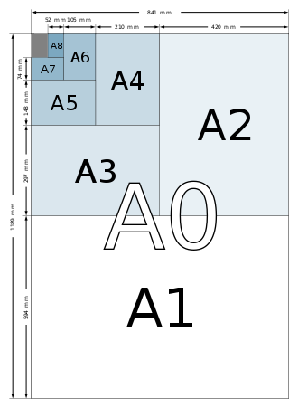

But is this simply describing the property of 2, not of square roots?  No, because squares (or square roots) are also 2 so the properties of 2 also apply to exponents (or roots).  2 is especially unique in the way it is the only number where $2^{2} =2\times 2=\ 2+2\ =\ 4$.  No other number has the same value when squared, added or multiplied (except 0).  Tholonically, 1 point is nothing but a concept that has no dimension or form, but 2 points is the first instance of a duality and dimension, making it the most fundamental number of creation, or the transition form concept to form, so we would expect to see some property of self-similarity given that self-similarity is a fundamental property of existence.  Perhaps that is why the number 2 is not only the first prime number, but the only even prime number as well.  It may also be the only number that inspired a (alleged) murder.  Hippasus, a student of Pythagoras, violated the cult&rsquo;s sacred belief that all numbers must be expressible as fractions by proving that $\sqrt{2}$ was an irrational number, so he was promptly dumped at sea (or abandoned on a deserted island), and his discovery was declared &ldquo;Fake News&rdquo;.  

$\sqrt{2}$ is also the basis of the less famous ratio called the Silver Ratio, which is similar to the Golden Ratio (both of these, and more, are members of what is called the Metallic Ration; gold, silver, bronze, coppers, etc).  While the Golden Ratio&rsquo;s mean is between 1 and 2 (1.618), the Silver Ratio&rsquo;s mean is between 2 and 3 (2.414), the Bronze Ratio between 3 and 4, and so on.  Here are the first three of the Metallic Ratios:


*(Technically, the first pattern in this series is $\boldsymbol{\frac{0+\sqrt{2^{2}}}{2}=1}$, but as it is not a series, just the number 1, it is not included, but also only uses 2.)*

The Golden Ratio is often credited for Silver Ratio accomplishment, such as the spiral of the Milky Way, facial proportions, architecture (especially in Japan), bird flight patterns, and more.  Notice how the Silver Ratio is the only ratio that can be determined by only using the number 2.  

Here are some thoughts as to how squares and square roots might apply to non-math contexts.

When we square something the &ldquo;units of measure&rdquo; and the unit count are the same.  For example, 6^2^ , or $6\times 6$, says we have 6 counts of a unit of measure that equals 6.  The thing we are measuring, and the units of measure are the same.  We are using 6 as an objective unit of measure to measure something that is essentially subjective.

Why is it subjective? Because when we say $a\times b$, we are saying we are counting $b$ $a$ times.  It says nothing about what $b$ is, only that whatever it is, there are $a$  of them (of course, this works in reverse as well, $b\times a$).  Without knowing what $b$ is, the result is meaningless.  How do we know what $b$ is? We simply assign a meaning to it.  We say $b=apples$ or $b=volts$, or whatever.  The value of $a$ is objective because regardless of what  the units are, there are $a$ of them.  The meaning of $b$ is subjective in that it requires a contextual value, a personal decision, to make that assignment.  It may not be subjective in the sense that there really are 2 apples, which is objectively testable, but the assignment of those apples to the abstract concept of a unit is.  

This is effectively the same distinction between *quantitative* and *qualitative*:

- **Quantitative** data can be counted, measured, and expressed using numbers.  
- **Qualitative** data is descriptive and conceptual.  Qualitative data can be categorized based on traits and characteristics.

This is metaphorically equivalent to something using its own properties to evaluate its own existence, not unlike the first dot that became aware of itself through the second dot, creating the two states of objective and subjective.  Remember, this is referring to the non-math contexts, so none of these claims are meant to apply to math.

This is a good place to bring the reader back to an earlier section that looked at the relationship between gravity and consciousness.  In that section we showed how the gravitational field $g$ was a product of $G\times M_{1} \times M_{2}$, where (and these definitions are verbatim from the research paper[^178])

> G = universal gravitational constant.
> M~1~ = mass of the observing physical system (the observer).
> M~2~ = mass of the observed physical system (the observed).  

Here we have the very same concept of subjective/objective, quantitative/qualitative being used to define perhaps the most fundamental force in reality; gravity.

Can we say that when something is squared, it is the objective measure of a subjective existence?  Can we see these two conditions, subjective and objective, as two dimensions of something&rsquo;s existence? We know that two dimensions defines an area, and we also know that when two equal 1-dimensions (lines) are at their two most contrasting position (90&deg;) they automatically define a third 1-dimension that is a multiple of $\sqrt{2}$.  


Although we won&rsquo;t get into it here, in the tholonic view, trigrams, or synergetics, is a model of energy archetypes, but the cube is a model of instances.  For the record, a cube can be defined by five or more tetrahedrons (one regular and four irregular).

It seems almost silly to state something as obvious as the number 2 is fundamental to the reality of *space* as we must have 2 dimensions to have the concept of space, but regardless of is obvious simplicity, that archetype of 2 is taken for granted as it is one of the most profound in all of existence, perhaps even more than 1 where manifest reality is concerned.  

From the ancient Greeks to modern philosophers, geometry and math has been fundamental in describing and understanding the world not just from a technical perspective, but even a moral, ethical, legal and social perspective.  What follows is similar in that it uses math and geometry to support a philosophical premise.  It needs to stressed, again, that this exploration is not intended to shed new light on math or geometry, but rather, uses math and geometry as guideposts of reason.  With that said, here is another view of the extra-mathematical significance of the number 2.

Tholonically, 2 is the result when 1 recognizes itself, or reflects itself.  If $\sqrt(2) = 1.414$ than that is saying that is it 1.414, not 1, that brings 2 into existence, but we also claim that 1+1 created 2.  We have two true statements that seems to be at odds with each other:

- 1+1=2

- Something that has a *quantitative* value of 1.414 and a is *qualitative* value of 1.414 is also 2.  

What is the difference between these two true facts?  We can say that the *original* source of 2 is 1+1 because we can only know the square root of 2 *after* we have created 2, so $1+1=2$ came first, then $1.414^2=2$ followed.  That means we add two things that are not 2 (that being 1) together to get 2 and then discover that the thing we need to measure itself by to get 2 is 1.414.  The difference between 1 and 1.414 is the difference between creating something (1+1) and the creation itself (1.414^2^).  And what is that difference?  It appears to be 0.414 because $1.414-1=0.414$.  

What does $0.414$ represent then? If 1+1 created 2, and $1.414^2$ describes what was created, can we say that $0.414$ is the difference between the *creator* and the *created*? Let&rsquo;s go with that for now and see if it holds up.

What *is* the difference between *creator* and *created*?  Is it similar to the difference between parent and child? man and god? flower and seed?  Tholonically speaking, there are two types of tholons, that which can create new tholons, and that which cannot.  When a tholon cannot create, it is the end of the line for that form of expression.  The difference between *creator* and *created* is simply *creation*.  Creators create, creations cannot create, that is, not until they become a creator, if they can.  This suggests that measuring the number 2 by *creation* would tell us about the its ability, or perhaps potential, to *create*.  

How would we were to define the concept of 2 by the difference between *creator* and *created*? We can measure 2 by the unit of *creation*, or put it another way, $\boldsymbol{\frac{2}{0.414}}$.

What is $\boldsymbol{\frac{2}{0.414}}$ ?  It is 4.828.  And what is 4.828?  It is $(1+\sqrt(2))\times 2$.  This should look familiar because it is the $Silver\ Ratio \times 2$.  It is many other things as well, such as the the space created by 8 lines, each of length equal to 1, when connected end-to-end, like an octagon.  

- $Area\ of\ octagon\ that\ is\ defined\ by\ of\ 2^3 sides,\ each\ having\ a\ length\ of\ 1$

What else does $2^3$ represent?  A 3-dimensions instance of 2, as in a cube, which has a volume of 8.

 $2^3=8$, and in the 2-dimensional world that 8 is represented as sides, resulting in an area equal to $(1+\sqrt(2))\times 2)$, and in the 3-dimensional world, 8 is represented by the volume (in a cube with $2\times 3$ sides and $2^2\times 3$ edges, FYI).

So far, this falls more on the supportive side on the claim that 0.414 is the value of *creation*, or should we say the first value of *creation*, as there are probably many.

What if we test this magic number of 0.414 on the number 3? Would be get something equally interesting? let&rsquo;s see.  

$\frac{3}{0.414} = 7.242$, and this number also happens to be $2.414 \times 3$, or $1+\sqrt{2}\times 3$.  Again, the Silver Ratio appears, but this time as a multiple of 3.  So far, so good, but there&rsquo;s more, because this number is also the ratio of the two sides of a right triangle when when that triangle is 67.5 &deg;,  which is the same as  22.5&deg; $\times 3$ , and what is 22.5&deg;?  it is $\frac{1}{16}$ of a circle, or the angle between each section of a circle when it is made by 2^4^ sides each with a length of 1.  Simply put, it is the tangent of $360\times (\frac{1}{2^4}\times 3)$ or  $\tan((2^3\times 3^2\times 5)\times (\frac{1}{2^4}\times 3))$.  

This is fantastically elegant is so many ways, and the recurring principle seems to be the Silver Ratio.

# F - Greek Gods 

According to the Greek mythology, the world began with several primordial beings who begat more gods, who begat even more gods, and so on. What follows is a brief overview of that begetting and the cosmic drama that typically follows the begetting gods. 

*(The following is a slightly modified transcript reprinted with permission from &ldquo;The Life Guide&rdquo;YouTube channel (https://www.youtube.com/c/TheLifeGuide), entitled &ldquo;Greek Gods Explained In 12 Minutes&rdquo;.)*


First came **Chaos**.  Then **Gaia**, earth.  And finally, **Eros**, love.  From **Gaia** then came **Uranus**, heaven, who both created the **Titans**.  

**Uranus** disliked his children and locked them deep within the earth. **Gaia**, sick of having her children imprisoned, made a great sickle that she gave to her son **Cronus**. **Cronus** hid until Uranus came to lie with his mother, then leaped out and sliced off his father&rsquo;s genitals, which fell into the sea. **Cronus** proceeded to release his fellow **Titans** from prison, and so, the age of the **Titans** began. 

**Cronus** married the **Titan** **Rhea**, who gave birth to most of the major gods. **Cronus**, scared by a prophecy that his children would take his power, imprisoned them as soon as they were born, swallowing them whole. **Rhea** pleaded to **Gaia** for help, who took pity hid **Zeus** after he was born on Mount Ida in Crete. When **Cronus** came to eat his son, **Rhea** fed him a stone instead, tricking the **Titan**.

**Gaia** raised **Zeus** until he was strong enough to take on his father. The two fought, and upon defeat, **Cronus** was forced to release **Zeus&rsquo;s** siblings, starting the war between the gods and the **Titans**. The war lasted 12 years until **Zeus** freed the **cyclopes** and the **Hundred-Handed Giants** whom **Cronus** had imprisoned. The **Cyclopes** gifted **Zeus** his famous thunderbolt, **Poseidon** his trident, and **Hades** a Hat of Darkness, tipping the balance of battle. 

The **Titans**, defeated, were thrown into **Tartarus**, a prison deep within the underworld. And so started the reign of the gods. **Zeus**, **Poseidon**, and **Hades** decided to share power, drawing lots to decide where they will rule over. **Zeus** got the sky, **Poseidon** the seas, and **Hades** the dead. 

**Zeus**, king of the gods, ruled from his throne on Mount Olympus, home of the immortals, often using his symbols of the thunderbolt and eagle to warn or encourage mortals. **Zeus** was responsible for all weather changes, from lightning to snow, depending on his mood. He was also a protector of the home and strangers, meaning being a bad host could land you in deep trouble. **Zeus** married his sister **Hera**, who birthed the gods **Ares** and **Hephaestus**.

**Zeus** was also infamous for his many affairs with other goddesses from which **Athena**, **Hermes**, **Apollo**, **Artemis**, and **Persephone** came. He also engaged in many affairs with mortal women, where he created the god **Dionysus** and many heroes like **Perseus** and **Hercules**, most of whom experienced the wrath of the jealous **Hera**.

**Poseidon**, one of the most powerful gods, ruled the sea, created earthquakes, and was the god of horses, much prized in ancient society. He had a palace on Mount Olympus, but an even more magnificent one under the sea where he spent most of his time. Sailors would have to pray to **Poseidon** and offer sufficient sacrifice, otherwise risked a painful death at sea. It was very unwise to cross **Poseidon** as he held a grudge and could deal out very harsh punishments.  

In the story of **Theseus** and the **Minotaur**, **King Minos** rules over the island Crete. Every year he sacrificed his best bull to **Poseidon**. One year, he withheld his favorite bull, a huge white animal. **Poseidon** noticed, but instead of punishing **Minos** directly, he decided to target his wife. He made her fall in love with the bull, which eventually led to the birth of the half-man half-bull creature called the **Minotaur**. 

**Hades**, the oldest of the brothers, ruled over the underworld where the spirits of the dead resided. He shared his throne with his wife, **Persephone** and the two were considered to be gods of fertility. The underworld had several guardians and trials, making it difficult for the dead and near impossible for the living to enter. The gates lay past the deadly river **Styx**. The only way to enter was to get passage from the ferryman, **Charon**. **Charon** required payment, which is why Greek burials included placing coins on the eyes of the deceased. If the soul could not afford to enter, then they were fated to wait on the shores of the **Styx** forever.

Past **Charon** lay **Cerberus**, the fabled three-headed dog who guards the gates of the underworld. Ultimately, the soul will reach the three judges of the underworld, who decide where it should go. They can choose **Elysium**, the Fields of **Asphodel**, or **Tartarus**. **Elysium** is akin to heaven, a peaceful place where the souls of heroes, demigods, and especially good mortals reside. The **Asphodel Meadows** is the place for ordinary folk who did not achieve anything notable in life, good or evil.

**Tartarus** is very similar to Hell and contains not only the **Titans** but also criminals who upset the gods and  who are tortured for eternity. **Hera**, sister and wife of **Zeus**, and queen of the Gods was the protector of marriage and women. She was deeply respected in Greek society. She was one of the most vengeful and spiteful gods, punishing women who lay with her husband and any subsequent children. When **Leto** was pregnant with **Apollo** and **Artemis**, Hera stopped her giving birth. She kept **Io**, another of **Zeus&rsquo;s** mistresses, as a heifer and had her guarded by the hundred-eyed monster, **Argos**.

A famous tale of her jealous vengeance is the story of **Hercules**. **Hercules** was an illegitimate child of **Zeus**. **Hera** sent serpents to kill the future hero when he was just a child, but the demigod crushed the creatures with his bare hands. She later drove him to madness, making him kill his wife and children, the event that sent him on his 12 labors.

**Athena**, goddess of wisdom and war, the child of **Zeus** and **Metis**, was not born in a conventional way. **Zeus** received an omen that their children would take the throne from him and so swallowed **Metis** while she was pregnant. After this, **Zeus** began to get a terrible headache. He asked a fellow immortal, thought to be **Hephaestus**, to split his head open with an ax. **Athena** was then born from his forehead, jumping out in full battle gear while letting out a war cry. 

**Athena** had an affinity for heroics, coming to the aid of heroes like **Perseus** and **Hercules**. Her favorite was **Odysseus**, who she worked hard to keep safe so he could return to his homeland. **Athena** was highly revered in Athens, which was named after her. She competed with **Poseidon** for the city, both of whom attempted to give it the best gift. **Poseidon** struck the ground with his trident, making a stream of water rise up. **Athena** kicked the earth and caused the first olive tree to emerge. The gods deemed **Athena** victorious, and the city took her name. **Athena** was also one of the sacred virgin goddesses, and so in her honor, the temple built on the Acropolis in Athens was named the **Parthenon**, which comes from **Parthenos**, meaning &ldquo;the virgin&rdquo;. 

**Ares** was the bloodthirsty and cruel god of war. Neither god nor mortal particularly liked **Ares**. The warfare he represents is not honorable nor heroic, but rather the primal rage and bloodshed of the battlefield. **Ares** had a relationship with the goddess **Aphrodite** who was married to the god **Hephaestus**. The two would sleep together whenever her husband was away. When **Hephaestus** found out, he made an invisible net and hung it over his bed and told his wife he was going away. He hid, and as soon as **Ares** and **Aphrodite** got into bed together, they were trapped in the net and unable to move. **Hephaestus** called upon all the gods, inviting them to see the two naked immortals trapped in the net. Laughter burst out everywhere, and it was only due to the intervention of **Poseidon** that they were released.

**Aphrodite** was the goddess of beauty and love, responsible for sexual attraction in both mortal and immortal alike, often using her powers for her own amusement. Accounts of her birth vary with her either being born from the genitals of **Uranus** or as another illegitimate child of **Zeus**. **Aphrodite** had a pivotal role in the **Trojan War** when Prince **Paris of Troy** was tasked with giving an apple to the fairest goddess. **Hera**, **Athena**, or **Aphrodite**, each promising him something different in return. **Paris** chose **Aphrodite**, who promised him the most beautiful woman in the world, **Helen**. **Helen** was married to the king of **Sparta**, **Menelaus**. **Aphrodite** put Helen under a spell when **Paris** came to visit **Sparta**, making her run away with him. **King Menelaus** and his brother **Agamemnon** raised a massive army to go take **Helen** back from **Troy**, and so started the **Trojan War.** 

Goddess of the hunt and twin sister of **Apollo**, **Artemis** was a deadly Archer and an important member of Olympus. She watched over hunters as well as their prey, ensuring the wilderness was kept in check. **Artemis** is also prized for her virginity and guarded it jealously. The hunter **Actaeon** once stumbled upon her naked as she was bathing. **Artemis** proceeded to change the man into a deer and set his fifty hunting dogs upon him, giving him a painful death for his mistake. 

Twin brother of **Artemis**, **Apollo** was a god of many things. He was a god of archery, but also of light and music, seen with a lyre as much as a bow. **Apollo** is closely linked with prophecy. He was born on **Delos** and honored the island by setting up an Oracle there. He later traveled to Mount Parnassus and slew the great snake **Pytho**. He created a temple where he had achieved the feat of marking the foundations for where the famous **Oracle of Delphi** would reside.

**Hermes** was the messenger of god and patron of thieves. Known as a trickster amongst the gods. He often pulled pranks and stole from his fellow divinities. When he came of age, he assumed the role of messenger, taking a golden rod with him as a mark of his authority. He is often seen with a winged helmet and sandals, which he used to fly around and deliver messages.

**Demeter** was the goddess of farming and watcher of the harvest. The one thing she prized more than anything else was her daughter, **Persephone**. It happened that **Hades** was also interested in **Persephone** as he had fallen in love with her. One day, while the girl was picking flowers, he opened up the ground and dragged her down to the underworld. **Demeter** was distraught when she found out and searched for her daughter for nine days and nights until the Sun God **Helios** revealed her captor&rsquo;s identity. **Demeter** locked herself indoors for an entire year, refusing to come out until **Persephone** was returned. Without the goddess of farming, the world went into famine. In order to save the world, **Zeus** ordered Hades to release **Persephone**. **Hades** had fed the girl the food of the dead, a pomegranate, meaning that she was bound to him. After much discussion, **Zeus** decided that **Hades** could have **Persephone** for three months of the year, and **Demeter** could have her for the other nine months. This explains why the winter months are cold,and the plants die as **Demeter** waits for her daughter to return. 

God of smithing, **Hephaestus**, had a difficult start to life. He was born lame, and so his mother **Hera** decided to throw him off Olympus into the sea to drown. He later returned to the home of the gods and was given **Aphrodite** as a wife by **Hera** to reconcile with him. He was a great inventor and fashioned many of the palaces on Olympus. He also fashioned the equipment of many heroes such as **Achilles**, who he created armor and a magnificent shield for. 

God of wine and parties, Di**o**nysus was perhaps the most fun of the Olympians. Frenzied women called **maenads**, and half-goat men called **satyrs** followed him. He had a huge cult following in Greece, where his followers would participate in mass drinking and the orgies his mythological companions were so well known for. The Greek Gods represent humanity at its best and worst, from the violent and destructive **Ares** to the beautiful and seductive **Aphrodite**. Greek mythology demonstrates the epic power struggle between parents and children in an endless quest to gain control over the world. Tales passed down from each generation, showing them to be some of the most influential deities in human history that continued to have a significant impact to this day.

# G - Hidden Images


## Credits, left to right, top to bottom.

**[Equation]** by *Aphex Twin*. Image via Jarmo Niinisalo

**Windowlicker** by *Aphex Twin*. Image via Jarmo Niinisalo

**Continuum** by *Disasterpeace* (FEZ Soundtrack). Image via Black Coffee Spirit

**My Violent Heart** by *Nine Inch Nails*. Image via the nine inch nails wiki

**Beyond** by *Disasterpeace* (FEZ Soundtrack). Image via Black Coffee Spirit

**Transitions** by *DJ Sonix*. Photograph via guru3d forums

**Compass** by *Disasterpeace* (FEZ Soundtrack). Image via Black Coffee Spirit

**Stripes** by *sippenaken*. Image via sippenaken on YouTube. Image via sippenaken on YouTube

**Flow** by *Disasterpeace* (FEZ Soundtrack). Image via Black Coffee Spirit

**Compass** by *Disasterpeace* (FEZ Soundtrack). Image via Black Coffee Spirit

**Look** by *Venetian Snares*. Image via Jarmo Niinisal 

Complete images and more at https://twistedsifter.com/2013/01/hidden-images-embedded-into-songs-spectrographs/

# H - The Tholonic I-Ching

## This section of very beta!  Most of it will change!!

It&rsquo;s been mentioned several times already that the basic principles of the tholonic model should be discoverable in any sustainable model, be it form or idea, if all creation follows the same rules. 

One way to test this would be to find a model that has existed for many years, purports to explain the nature of reality and is expressed in a language compatible with, or translatable to, geometry or mathematics, which would be necessary to make valid comparisons with the thologram.

Many religious, spiritual and mythology models claim to shed light on the mystery of reality, and even though we can find metaphorical parallels within the thologram, that is not sufficient to make a solid case. We need something more quantified.

The closest Western models that we can find are science and its precursor, alchemy or astrology. However, we want to find a model that is outside the realm of Western science and thought.  We also prefer to find a model that is more ancient as the hypothesis here is that both ancient and modern models of reality have the same conceptual foundation.

What ancient models exist?  There are the Hindu scriptures, which are both elaborate, detailed and quite old, but extremely difficult to quantify for comparison.

There are the ancient works from Sumeria, Babylon, Egypt and the Jews, much of which of which culminate in the mystical Kabbalah, but these works are so shrouded, obfuscated and protected that simply compiling the data necessary would be the task of a lifetime.

Finally, we have the ancient Chinese I-Ching, or Book of Changes, which dates back to the 10^th^ century B.C. (or the 29^th^ century BC, depending on what one recognizes as the &ldquo;starting point&rdquo;) and has been integrated into Taoism, Confucianism, and Buddhism.

Of these, the I-Ching is the best candidate for the following reasons&hellip;

- It, like most models of reality, is based on the same basic idea that everything exists between a state of somethingness and nothingness.
- It&rsquo;s origins come from the 5,000 year old legendary and mythical ruler *Fu Xi*&rsquo;s desire to &ldquo;become thoroughly conversant with the numinous and bright and to classify the myriad things.&rdquo; (*from Fu Xi&rsquo;s work the &lsquo;Great Commentary&rsquo;*, 168 BC) which is the same motivation behind the birth of philosophy and ontology in the West.
- Unlike the Hindu texts, and to a lesser degree the Kabbalah, the I-Ching is constantly evolving. What began as a primitive ritual of comparing tortoise shell cracks to the stars in the sky has evolved into a form of binary math that even great thinkers of today appreciate. The I-Ching&rsquo;s ability to adapt to and incorporate new perspectives is critical in this case.
- It has found a home in every major culture in the world; Western, Jewish, Islamic, Asian and East Asian and its ideas have been incorporated into philosophy, religion, art, literature, science, technology and medicine and is studied at major universities (Oxford, Cambridge, Columbia, Stanford, etc.).

So, let&rsquo;s deconstruct the I-Ching using the tholonic modal and see what we find.

There are many, many books on the origins and philosophy of the I-Ching, so we are not going to get into that here.

The most obvious and important foundation of the I-Ching is that it is based on the polarity of yin and yang. Although this concept arose before the birth of Taoism, the Taoist symbol of Yin/Yang (called the *Taijitu*) has come to embody this concept.  We have seen this pattern before, perhaps as an archetype of one of the most fundamental expressions of energy in our universe:


This Taoist *Taijitu* symbol does not represent the Oneness from which the first duality emerged, as it is often believed. Rather it represents the first duality, as well as the Oneness that emerges from an existing duality, in other words, an *N-state*.  The original Oneness, the Tao itself, for which there is no image, is the source from which the initial 0-dimensional &ldquo;blue dot&rdquo; appears in nothingness, and as this dot did not come from a duality (that we can see) there is nothing we can say about it for now other than &ldquo;it just is.&rdquo;  

There are two types of duality which we need to define. The first duality emerged from the Tao. Nothing can be said of the Tao. This first duality is that of the something and nothing. For the concept of something to &ldquo;be&rdquo;, there must be the concept of &ldquo;not be&rdquo;, hence nothing.  In the tholonic view, it is the awareness of nothing that creates the concept of something, that being the awareness itself.  This is the original 0, and 1, or the first two dots of a tholonic trigram. From this duality comes the third dot which creates the second duality that defines of the division, difference and separation of all things. That is the *Taijitu*. It is within this duality that new N-states can emerge.

From the tholonic perspective, that which created the first duality is different in nature from that which creates all the other dualities, but the process is the same. If we reuse a earlier diagram of the tholonic trigrams but replace the initial, and only the initial N-source with a Zen circle (because I have no better idea what *should* go there, just that is should not be the Taijitu), we have the following:

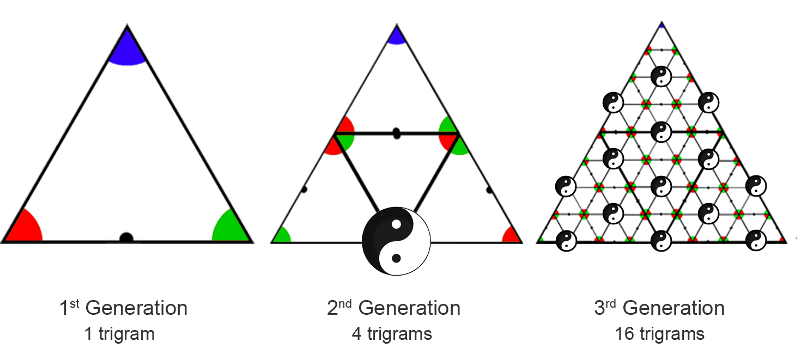

## Basics

The I-Ching, like the thologram, has the basic concept of a trigram as the stable building block of structure. In the I-Ching, a trigram is simply three states of yin/yang together to form a stable concept. There are eight possible combinations when using yin and yang (shown below).

The I-Ching also has a concept of a &ldquo;lower&rdquo; and an &ldquo;upper&rdquo; state. It describes the lower state as earth, matter, the subjective, the hidden, the inner, etc. depending on context, and the &ldquo;upper&rdquo; state  as that of heaven, ideas, archetypes, the outer, exposed and the arena of creation, etc, also depending on context. 

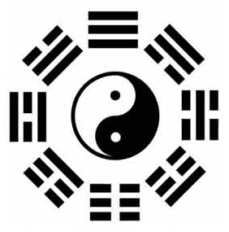

The result is a total of 64 hexagrams, shown below (even values are blue, odd values are red,  for easier viewing).  The number under the hexagram is the binary value of the hexagram, which differs from the numbers in the I Ching.  Unless otherwise notes, we will be using only the binary value to identify a hexagram.

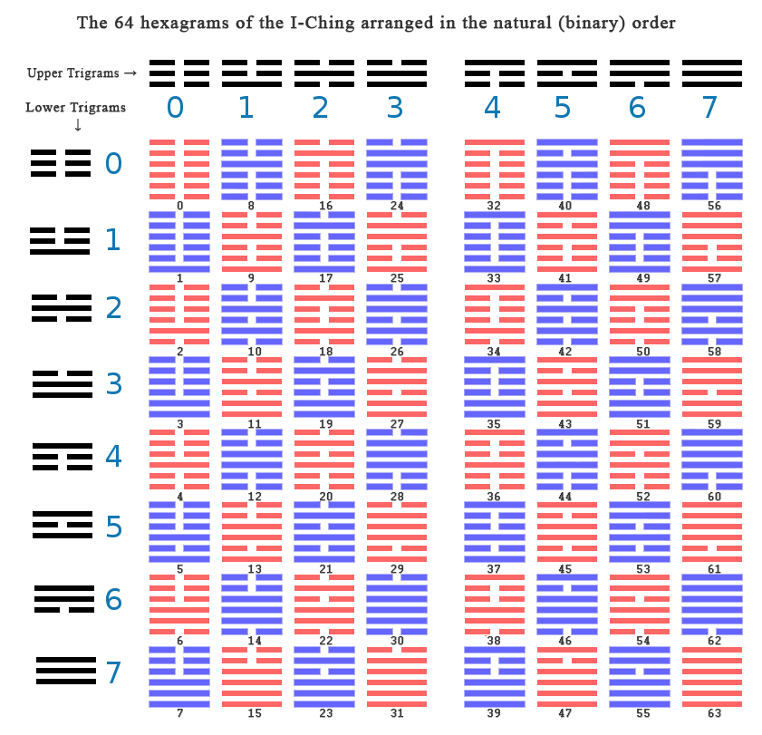

While there are 64 hexagrams, it is more useful to think of two different sets of 32 pairs of hexagrams. The reason this is more useful is because we now have the concept of 32 pairs of hexagrams, and we can consider this pair as the duality of an even broader concept

For example, take the most basic hexagrams (using their binary values, not the numbers given in the I Ching), 0  and 63 , the *Receptive* and the *Creative*. Between these two hexagrams all other hexagrams exist, so together they represent one state that includes the broadest context that everything exists within. Another example is the pair of hexagram 20 *Obstruction*, which states (and I&rsquo;m paraphrasing):

> When faced with dangerous obstacles it is wise to retreat and prepare accordingly with those of like mind. 

… and it&rsquo;s opposite, 43 , *Opposition*, which states:

> When opposites meet that must proceed with care, for brusqueness will lead to calamity, but through understanding and cooperation we can change an opposition into a polarity. This is how all things come into being.

The *uber* concept here is one of opposites and how they can interact either through cooperation, as polarity, or conflict, as obstruction.   

## Trigrams 

A tholonic trigram is a bit different, but quite compatible with the the I Ching trigram. Instead of three states that the I-Ching defines as beginning, middle, end, or earth, man, heaven, the tholonic trigram is made of a source and the two polar opposites that emerge from that source, something like a *synthesis* that holds within it its own *thesis* and *antithesis*. 

The thologram also has a concept of *upper* and *lower* in that the *upper* trigram of the I-Ching, which comes *after* the *lower* trigram, equates nicely to the *child* trigram of a tholon, which comes *after* the parent. In other words, the *lower* I-Ching trigram is the *parent* trigram of the thologram, and the *upper* I-Ching trigram is the *child* trigram of the tholon. We can now see that the final hexagram is perfectly equivalent to a tholon map.

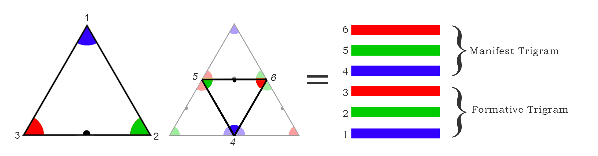

It might see counter intuitive that the *upper* or *outer* trigrams of the I-Ching equates to the smaller embedded trigram of the thologram, but in the tholon it is the smallest and most embedded tholons that represent the bleeding edge of reality where new creations are being born, dying, and morphing. The farther &ldquo;up&rdquo; the thologram, the less things change. In the thologram, the parent trigram is what forms the environment or context for a new N-source to come into existence, so the parent trigram is the incubator, so to speak, for the yet to be manifest N-state and its own duality. The smaller, inner trigram inside the parent is where the newly created N-state creates its own environment, which incubates yet another N-state, and so on. This is why the I-Ching&rsquo;s *lower* trigram equates to the tholon&rsquo;s *parent* tholon, and the *upper* trigram equates to the child tholon&rsquo;s instantiated *inner* trigram. 

*Note: One interesting detail is when we use the outer trigram on the parent level with the inner trigram on the child level; all the numbers for each side equal 9, $(1+6+2), (2+4+3), (3+5+1)$, but if we associated the lower trigram with the inner trigram, and the upper trigram with the outer, all the numbers for each side equal 12,  $(4+3+5), (5+1+6), (6+2+4)$. 9 is more elegant than 12 because it is smaller and $3^3$. That does not mean this mapping is &ldquo;correct&rdquo;, but simplicity and symmetry are excellent indicators of order, and therefore the movement of energy.*

## The six stages (in the I-Ching and the thologram)

According to the I-Ching there are 6 stages of change that describe the life-cycle of a creation, or instance. This is stated very clearly:

> All movements are accomplished in **six stages**, and the seventh brings return.

##### ~ Hexagram 24 &ldquo;Return&rdquo;

> The holy man, who understands the mysteries of creation inherent in end and beginning, becomes superior to the limitations of the transitory. For him, the meaning of time is that in it, the stages of growth can unfold in a clear sequence. He is mindful at every moment and uses the **six stages of growth** as if they were six dragons (the image attributed to the individual lines) on which he mounts to heaven.

##### ~ Commentary on hexagram #1, the Creative (The I Ching,  Wilhelm/Baynes edition)

This shows a general idea of the 6 steps from an I-Ching and tholonic perspective.  Examples include the popular *Transtheoretical Model* [^226], used for addressing issues of growth, recovery, behavior, production, etc. 

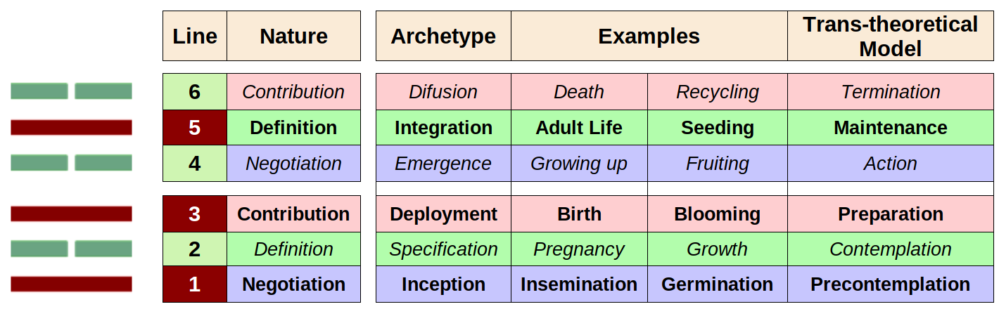

Here is another way to look at the tholonic/I-Ching relationship:

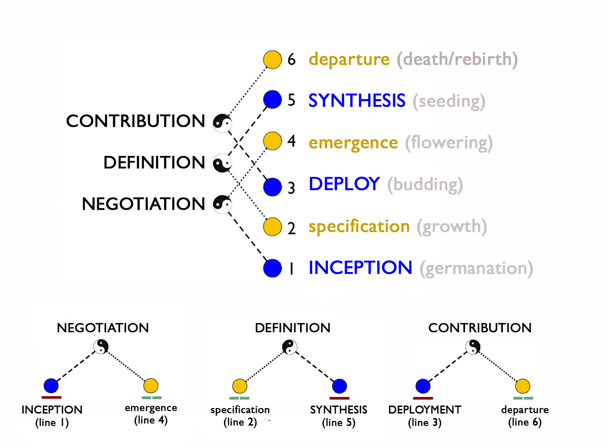

One way to understand the 6 steps is by looking at the 6 steps of bifurcation needed to create 64 children form one source.

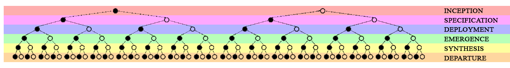

Another way of looking at the 6 stages is from the tholonic model is by comparison: 

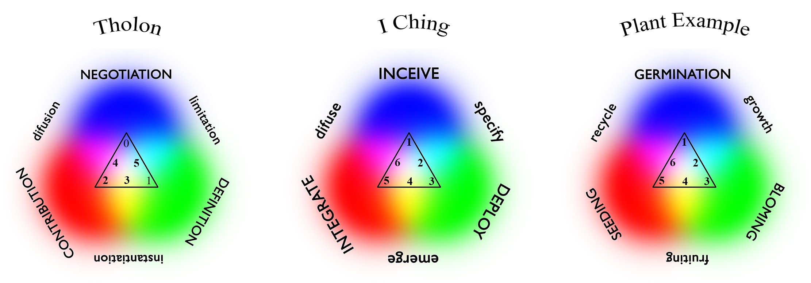

Notice how the 4^th^ level of bifurcation (blue shaded line), which is the tholonic *Negotiation* line and the only area where new *N-states* can form to create children, is also defined as *Emergence* in the I Ching, which is consistent with the traditional definition of the 4^th^ line of an I-Ching hexagram. Also note how a point (which are yang in nature), such as 1, 3, and 5, results in lines (which are yin in nature) 2, 4, and 6, of the similar but opposite quality, as in a pair of qualities the describe two aspects of one idea; germination &rarr;fruit, blooming &rarr; recycled, seeds &rarr; growth.  

There is yet another way to look at the structure of the lines, and one that is arguably the basis of the current traditional interpretation of the I-Ching.

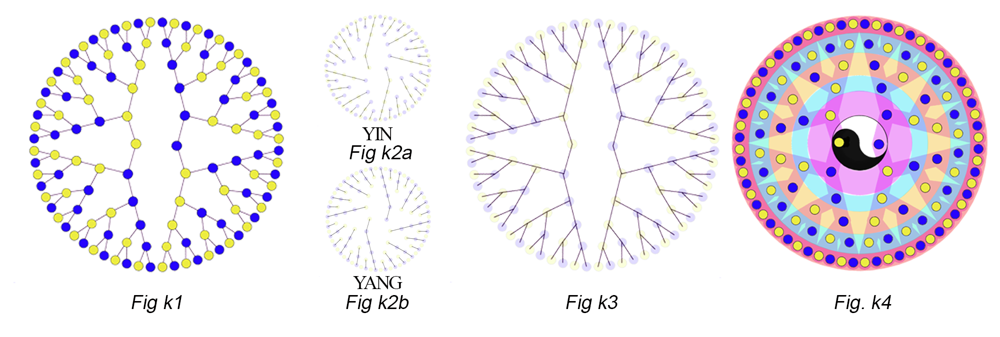

***Fig. k1*** shows a simple binary tree that starts at the center and bifurcates outward to 64 end-points.  This form is especially useful because it so clearly show the direction of the YIN movement (***Fig. k2a***) and the YANG movement (***Fig. k2b***), and when we add these two opposite moving patterns together we can see an impressive self-similar fractal pattern (***Fig. k3***). ***Fig. k4*** shows the dots and the lines together, but in addition, each of the six concentric bands has been colorized, and the connective lines have been greatly thickened, with a Tao symbol added to the middle to represent the original duality.

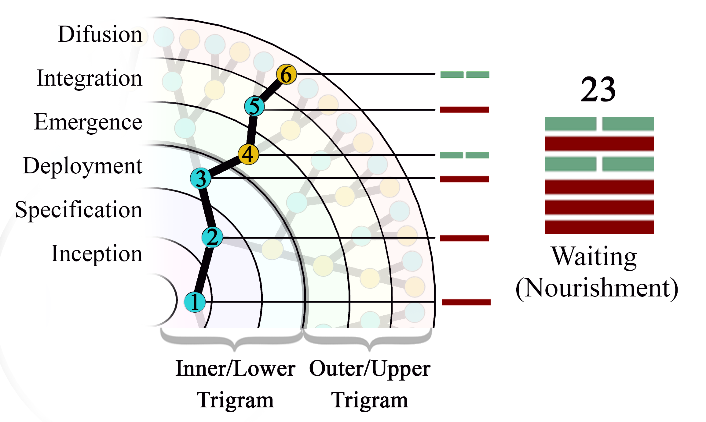

Each of these concentric rings represents each successive bifurcation which defines each of the lines in a hexagram.  The above image show the path from the beginning to the end for hexagram 23 (binary value.  The tradition values is 4).  

This structure tells us a lot about the I Ching. For example, we would expect to see the more cardinal points hold somewhat of a &ldquo;cardinal&rdquo;value.  To see this, we highlighted the paths of each of the cardinal and semi-cardinal paths and show the hexagrams they produce along with there traditional meaning (and their traditional number in parenthesis).

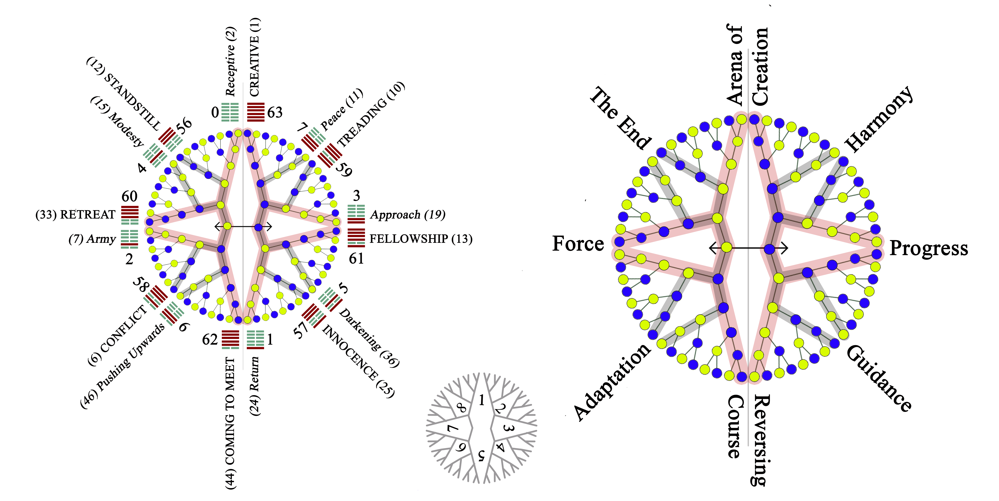

*Note: All hexagrams that have a solid yang line in the 6^th^ place at the top have values greater than 31, and have internal or &ldquo;descending&rdquo; qualities, or qualities that are the result of man&rsquo;s intentions. These hexagrams are shows in italics in in this chapter.  All hexagrams that have a broken yin line in the 6^th^ place have values less than 32, and demonstrate external or &ldquo;ascending&rdquo; qualities, or qualities that are the result of nature&rsquo;s intention. These hexagrams are shown in all CAPS in this chapter.*

The first thing we notice is that the exact opposites of *0-Receptive* and 63-CREATIVE begin and end the cycle at the top. Their opposite pair, at the bottom, is made up of the opposite hexagrams of *1-Return* and 62-COMING TO MEET. Considering this is exactly the point where the cycle begins to return, it suggests that the ancient interpreters of the I-Ching saw this same pattern.  The other thing we notice is the symmetry of the numbers, wherein every pair of opposite (ascending and descending) values on opposite sides of the vertical axis always equals 63. The same is true for every lower and upper trigram and their opposite equaling 7, but in the case of the ascending trigrams, the axis  is diagonal from area 4/5 to 8/1, and for the descending trigrams, the axis is mirrored, from 5/6 to 1/2. 

We can also see that each pair of hexagrams for the same point has a meaning that is similar from two different aspects.  On the graph on the right, above, we have renamed these points according to the theme they share. Below we look at how this was arrived at.  It is recommended that you look at the meaning in full in the Wilhelm/Baynes version.  Pay attention the that detail that in the case of *ascending* hexagrams, the influence is always from the nature, or the times, or other influence beyond the control of man, while in the *descending* hexagrams, it focuses on the same quality but in the hands of man.  This is the duality that the authors worked with, that of nature vs man, state vs individual. This gives us a great insight into the moral agenda of the authors, who, of course, worked for the state.  

- *Pair 1, **CREATIVE/Receptive**.* 
  - Both of these hexagrams define an extreme end point, the polarity that defines the spectrum within which every other hexagrams exists. This defined **arena of creation**.
- *Pair 2, **TREADING/Peace**.* 
  - Both of these describe a time when the high and the low are in **harmony**. In one case (*Peace*), it is the result of the times, and in the other (TREADING), it is the result of decorum and pleasant manners succeed. 
- *Pair 3, **FELLOWSHIP/Approach**.* 
  - Both hexagrams speak of **progress**. In one case (*Approach*), it is the result of the time, such as spring time. The other case (FELLOWSHIP) speaks of progress in difficult times as long as people unify and are working towards the goals of humanity.
- *Pair 4, **INNOCENCE/Darkening.*** 
  - Both hexagrams refer to finding the inner light for **guidance**. In one case (*Darkening*), when external circumstances are unfavorable, and in the other (INNOCENCE), when one is at risk of wandering off the path of righteousness.
- *Pair 5, **COMING TO MEET/Return***. 
  - Both hexagrams speak of a **reversing course**. In one case (*Return*), it is the natural turn of the cycle when the light returns to the darkness. In the other (COMING TO MEET), it is the result of a decision but warns one of allowing the inferior to gain access to the superior. However, it also admits that this meeting of &ldquo;inferior&rdquo; and &ldquo;superior&rdquo; is what brings about all life.
- *Pair 6, **CONFLICT/Pushing Upwards**.* 
  - Both hexagrams speak of the need for **adaptation** if progress is to succeed. In the one case (*Pushing Upward*), because of one&rsquo;s modesty and adaptability. In the other, (CONFLICT) there is a warning to avoid treachery and only consider modest and amicable means of progressing when met with resistance.
- *Pair 7, **RETREAT/Army***. 
  - Both hexagrams speak of the management of **force**. In one case (*Army*), it speaks of discipline, as well as trust in a leader, that is necessary for a force to be effective. In the other (RETREAT), the wise use of force is needed when facing a stronger force.
- *Pair 8, **STANDSTILL/Modesty**.* 
  - Both hexagrams describe a time when the end of a cycle has arrived, and as it is returning to the point it started, this is its final **destination** . In one case (*Modesty*), it tells of how the law of nature is to raise that which is low, and lower that which is high. In the other case (STANDSTILL), the end has arrived as confusion and disorder because the dark waxing power has given rise to lowly people.  In such times, faith in one&rsquo;s principles is the only recourse. 

This can be reduced again to a more abstracted four pairs, and they can be reduced further to two, which would be the duality from which everything emerges. I argue here that this duality is the same duality that everything evolved from as well, that of *Definition* and *Contribution*, and everything exists as a result of *Negotiation* between those two states.  

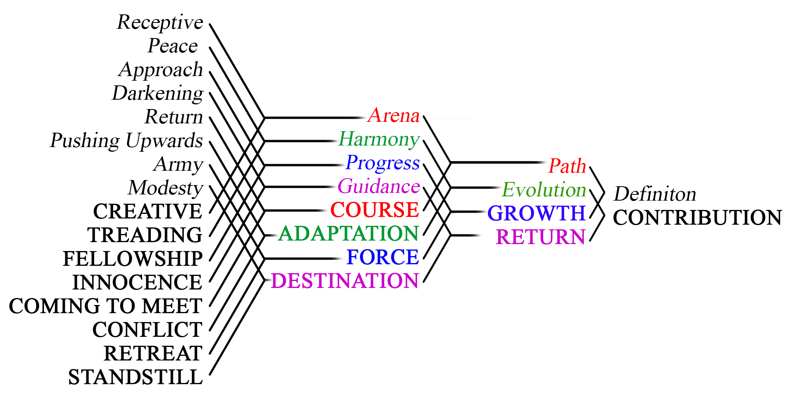

## The Lines 

There are not 6 lines in order to make 64 hexagrams, there are 64 hexagrams because there are 6 lines.  The creators of the I-Ching deliberately chose to use 6 lines because they knew that 6 is the minimum needed to create a complete archetype.  This is an idea that we see not only across many cultures all over the wolds, specifically in their stories of creation, but in science and geometry:

- The simplest form of creation, the tetrahedron (and tholonic structure) is composed of 6 vectors.

- The Bible and the Quran say all of creation was accomplished in 6 days.

- The Babylonian creation myth, the Enuma Elis, where the one God created 6 gods, each in charge of the 6 different aspects of creation (where they spent 2 days creating everything and the rest of their days fighting with each other). 

- The original Greek Titans were 6 men (Oceanus, Coeus, Crius, Hyperion, Iapetus, and Cronus), and their sisters, the Titanides (Theia, Rhea, Themis, Mnemosyne, Phoebe, and Tethys). They were all the the children of the original 2 primordial gods, Uranus (primordial sky) and Gaia (primordial earth).

- In the building blocks of creation (chemistry) we see 6 electrons in carbon, the foundation of life. 

- And, as we we'll show shorty, The N-source has a value of 6. 

6 seems to be a very significant number and is firmly associated with the concept of creation.

Here is a chart that shows a more in-depth descriptions of the 6 steps from a tholonic and I Ching perspective. It is divided into two hexagrams, *lower* and *upper*. Pay attention to the similarity of the three concepts that each line in the trigram share with each other, as they are essentially mirror aspects of each other.

*Note: It is both difficult and misleading to use one word to define an archetype that can have many different instances, nevertheless, we do exactly that, but remind the reader that these words are simply hints to a much larger significance.*

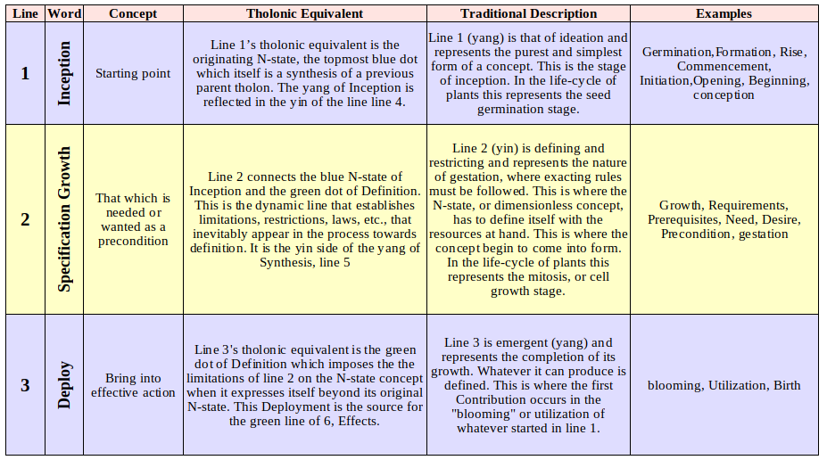

Once we cross the line from *lower* to the *upper*, the quality of the line positions flip making what was **yang** in the *lower* trigram **yin** in the *upper* trigram, and visa versa. In the tholon we see this same reversal in the *reflection* trigrams and *virtual* tholons. 

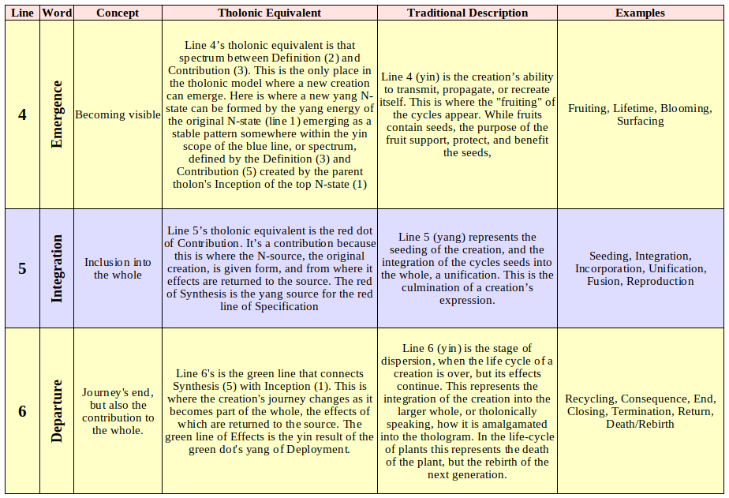

Here we equate the *upper* and *lower* trigrams of the I-Ching to the three tholonic attributes of N, D, C

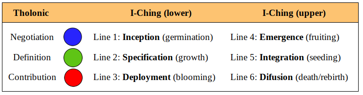

Depending on the context (*upper* or *lower*), N, D, and C have slightly different expressions.  In the most general sense, N, D, and C can represent many different concepts depending on its context.

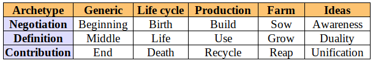

Because the I Ching is about the nature of unending change, it might serve us to view the stages of change as a continuous stream of changes in the form of a wave, which we attempt to do in the image below.

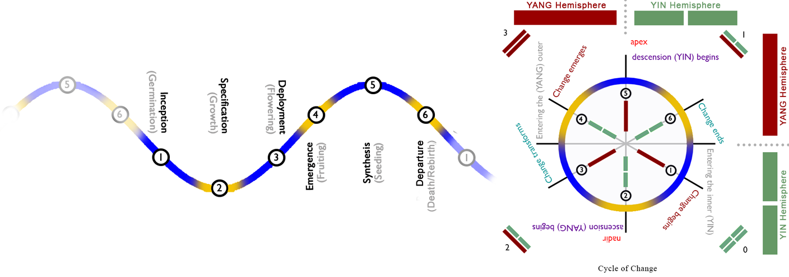

This continuity is confirmed in the I Ching when it states: &ldquo;*All movements are accomplished in six stages, and the seventh brings return.*&rdquo; Here we see how the seventh stage returns us to the first stage of the next cycle. Another validation of using this waveform as a model is that the lower trigram of lines 1, 2, and 3 are, in fact, in the lower part of the waveform, and the upper trigram of 4,5, and 6 are in the upper part.

On the right is a front view of the waveform that shows how the cycle is composed of six stages that alternate between yin (orange) and yang (blue). Within one complete cycle we have highlighted the significant axis and their yin and yang properties.  We also see that the upper half, being outward in nature, and the left half, being ascending in nature, are yang. The lower half, being inner in nature, and the right half, being descending in nature, and both yin. This results in four quadrants that are, respectively, yin-yin (0), yin-yang (2), yang-yang (3), and yang-yin (1), which are shown in each corner as bigrams.  

It might seem odd that the cycle start at the 4:00 position, and not the 6:00 position, but the positions of the lines were determined by their yin/yang qualities.  The vertical axis in the only axis that aligns with the 6 axis of the lines, and as line 2 is a yin line within a yin hemisphere, it naturally represent the nadir. The same is true for its opposite, line 5.

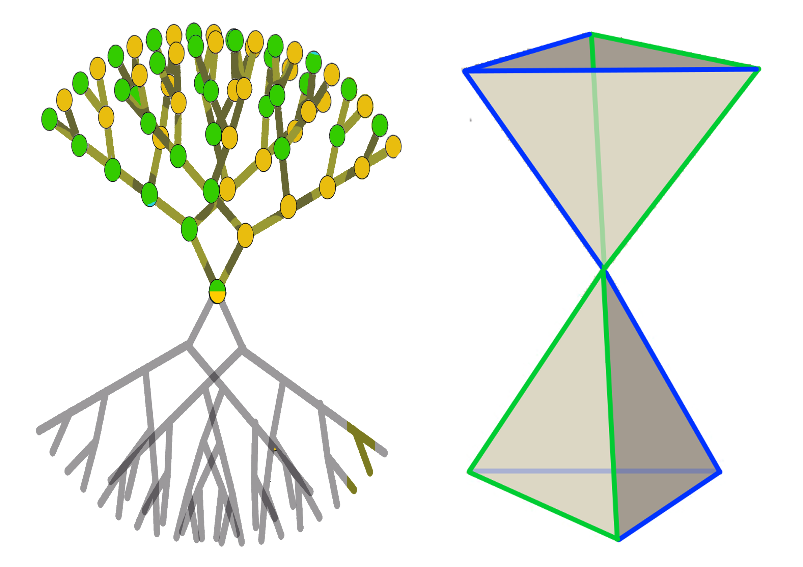

## Form

We can easily recognize this same archetypal structure of the I-Ching and the tholon in many systems, from the process of mitosis to the shape of trees and plants with their *inner* roots and *outer* branches and leaves. This is significant because in the thologram there is a similar concept of a real tholon and a virtual tholon which are matched to create a complete tholon. We also saw an example of this when looking at how the complete tholon models quarks to the proton. 

In the thologram all odd numbered tholons are *real* and all even numbered tholons are *virtual*. Likewise all hexagrams that begin with a yin line are even numbered hexagrams, and those that begin with a yang are odd numbered. We now have a very clean mapping between the thologram and the I-Ching of *virtual* as yin and *real* as yang. 

We arrived at the same results of 6 fundamental concepts formed by a pair of trigrams from two completely different processes; the process of the thologram was based on creating a tetrahedron from a point, while the I-Ching is based solely in the binary system.

There are many mappings and similarities between the tholon and the I-Ching, but I will only show one more because it not only maps hexagrams to tholons, but to basic physical structures in nature.

If we create a binary tree of the I-Ching where the bifurcations follow the path of least resistance, meaning they will always move into the emptiest space, we end up with bifurcations separated by 60&deg; (which is also the angle that creates a tetrahedron/tholon). This would then create the following patterns for each of the 6 generations of bifurcations (this is easily done with the *L-systems* language previously described with the rule ***F=F\[+F]\[-F]***):  *(Note: the angle appears to be 120&deg;, but this is because the lines are drawn 60&deg; from the parent in opposite directions.)*


Simply splitting one line into two lines, in accordance with the laws of inertia, we naturally form a pattern of hexagons that perfectly matches the pattern of tholonic expansion. This is because the I-Ching and the thologram represent the same laws but in the context of a binary system (I-Ching) and a trinary, or synergetic, system (thologram). Not surprisingly, the one point they both naturally center around is the N-source, which we have already shown to be equivalent to the Taijitu   

The image below is a more in-depth version of the overlay above.  Here, we follow each bifurcation starting with the one point from which the original duality emerged from. The arrows show the direction of the movement, with left-sided (or *port* side, as the side is relative to the direction of the arrow) arrows as yin, and right-sided (or *starboard* sided) arrows at yang (or visa-versa).  Doubled headed arrows indicate that one line is shared by two parents, and lines with arrows in both directions indicate a shared line that is bidirectional.  

***Fig. hb1*** shows the paths of all 64 hexagrams of the I Ching which are the result of 6 generations.  ***Fig hb2*** shows the 7th generation. This is added only to show that with the 7th generations we get the first complete closure of a hexagram, which is an example of the &ldquo;All movements are accomplished in six stages, and the **seventh** brings return.&rdquo;***Fib hb3*** is the same pattern, but iterated over 13 generations, generating 8,192 ( or 2^13^) final values. It is included simply to show how the form remains a hexagram and how only the last two generations are even visible, occluding all previous generations. Notice how at this point, the dominant pattern, which will remain the dominant pattern for all future children, are two sets of three double-headed arrows, one set from the final generation, and one from the previous generation of the final generation and the pattern . These triplets do not appear until the 8^th^ generation.  Because new generations overlap the previous, the structure is really more of a 3D design, with the originating point in the center, expanding with each generation, creating a hexagonal cone.

Also of interest in this diagram is how it shows that the original N-source is the result of its own creation *after* 6 generations.  In other words, after 6 generations, a new N-source is created that begins a new cycle and *departs* from the previous. Notice that it is the 5^th^ place where two different cycles come together for the first time, which is why the 5^th^ place is one of *integration*. 

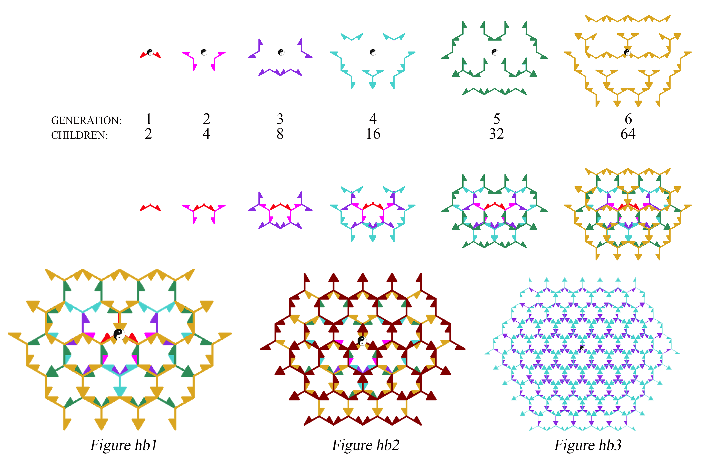

All of this is to demonstrate how the two systems are quite compatible to the point where not only can the entire I-Ching be mapped to the thologram, but the thologram can greatly elaborate on the I-Ching and give it a 3D structure, and given its recursive nature, infinitely so. 

One last observation regarding binary growth, form and chaos.  The classic bifurcation diagram below is determined by the variors rates of equilibrium for any growth rate.  As something grows, it doubles the states of equilibriam it sustains. this applies to everything, apparently.  It applies here because not only in the I-Ching a simple bifurcation diagram, but it also could apply to the growthrates of tholons. 

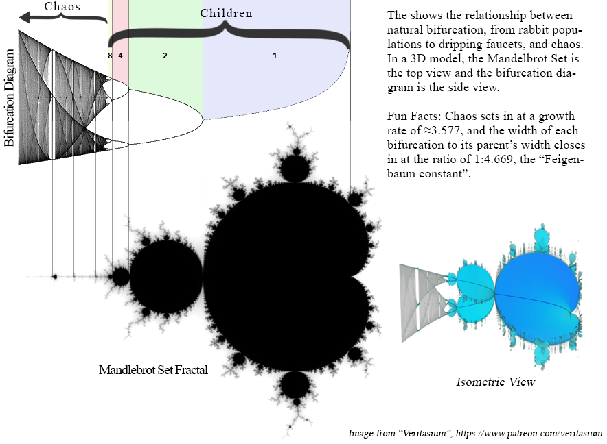

## Tech

The I Ching always was, and is, a technical manual:

> After meeting genuine teachers all my doubts disappeared, so that for the first time I realized that the Tao of spiritual alchemy is none other than the Tao of I Ching, the Tao of sages is none other than the Tao of immortals, and that the I Ching is not a book of divination, but rather a study of investigation, of principles, fulfillment of nature, and arrival at the meaning of life. 

##### ~ Liu Yiming (18th c. Taoist master)

> Although the words are very clear, yet they are also very vague. The shallow may take the I Ching to be a book of divination, but the profound consider it the secret of the Celestial Mechanism.

##### ~ Lu Dongbin, 9th c. Taoist master (introduction of The Taoist I Ching)

In the tholon, hexagons are formed by six N-sources.  This is the tholonic archetype of a hexagon.  Any hexagon, therefore, has a virtual N-source that is induced into being by virtue of its creations, the dimensional lines.  The image below shows the progression of an evenly distributed bifurcating tree (60&deg; separation), which includes many overlaps. The overlapping redundancy of the pattern unfolds as we narrow the separation, which we can see by the density of the lines.  In the beginning, the originating hexagon(s) have an evenly distributed  concentration of N-sources (represented as a red-tinted density cloud of the general area where the virtual N-sources will be located).  As the pattern unfolds, we see the density move from the center to the outer edge. If we apply this concept to the most obvious instance of an actual tree as a metaphor, we would see that, as a seed, the highest density of N-sources exist around the center. As a full grown tree, they collect around its leaves and flowers.  In its final stage, the N-sources form nothing more than a line that extends infinitely (according to the math). 

This is the progression of the ordered pattern (*Inception*) of balanced distribution of to a pattern (*Departure*) that is imbalanced and with an uninstantiated distribution (because it goes to infinity). 

Referring back to our definition of chaos as a *measure of disorder* or *the degree that order is present in any state*, and our definition of entropy as *energy transference*.

In short, this the the **cycle of order to chaos**. This transition is caused by the reduction of the angles or expression.

At the every beginning of the book we defined chaos, as the *measure of disorder* or *the degree that order is present in any state*, and entropy as the degree of *energy transference*.

With those definitions, we can say that *Inception* is the least chaotic because it has the most order and *Departure* is the most chaotic because it has the least order.  We assume that the energy remains equal in every state.

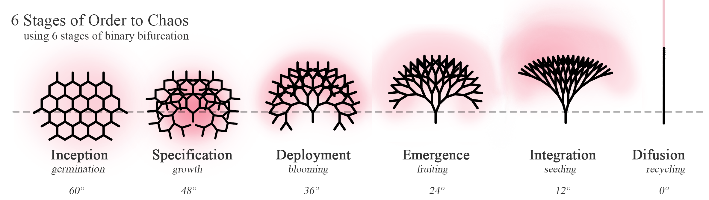

<p style="border:1px solid lightgrey;background-color:#ddd;font-size: 1rem;font-weight:100;font-family: 'Times New Roman', Times, serif;font-style: italic;"> When unfolding this binary hex pattern we see the classic tree pattern that is so popular in nature, but where are the N-sources located in the tree pattern?  They do not exist as form because N-sources are dimensionless; concepts only.  The only parts of a pattern that can have form, or instantiate, are the children of the N-source and their lines. The N-sources exist within and around the the resulting form.  Literally, the form exists within the concept of the form.</p>

Above, we look only at the lines created by the dimensional children of the N-state, the lines. This cycle of **order to chaos** is what we also call the *ascending* phase.  In the context of life, this represents not just a a recycling or returning to the *implicit* state, but a re-informing.  The instance&rsquo;s effect on the archetype, the archetype&rsquo;s effect on the idea, the idea&rsquo;s effect on the concept, and the concept&rsquo;s effect on the awareness that it originated from.  

Below, we see the N-states and the lines moving from **chaos to order.**  This is what we call the *descending* phase. In the context of life, this represent growth. Chaos to order represent the awareness that becomes a concept, that becomes an idea, that becomes an archetype that becomes instantiated. It is the emergence of an *explicit* state in come context.

The two phases move opposite one another, but sequentially, creating order from chaos, and chaos from from order. 

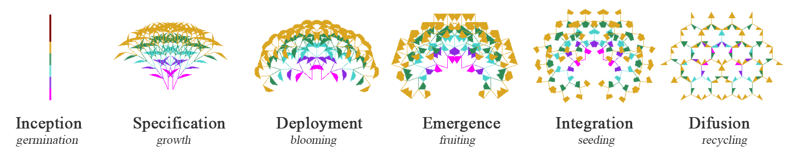

You can see they are exactly opposite in sequence. This is because the source of creation and the expression of creation move in opposite directions.  

Lao Tzu not only alludes to this duality of oneness when describing the nature of the Tao, but is quite is clear that the end of one begets the other, alternating in sequence, each being the cause and the effect of the other.

>As soon as beauty is known by the world as beautiful, it becomes ugly. 
>As soon as virtue is being known as something good, it becomes evil. 
>Therefore being and non-being give birth to each other. 
>Difficult and easy accomplish each other. 
>Long and short form each other. 
>High and low distinguish each other. 
>Sound and tone harmonize each other. 
>Before and after follow each other as a sequence.

##### ~ Lao Tzu,Tao Te Ching

The following is a bit of a tangent, but worth sharing before we continue with the lines.  Below is a graphic that shows three conditions of the binary tree above.  The first conditions is *Maximum Freedom*, where the direction of the children is undetermined and completely unlimited.  The second condition, *Limited Freedom*, is where the direction of the children is limited by 96% (4% freedom). The final condition, *No Freedom*, is where there can be no deviation from the rule.  

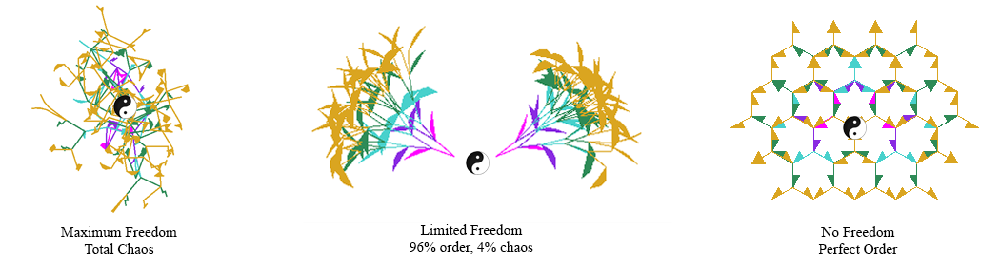

The forms used to represent the stages of change are &ldquo;perfect&rdquo;archetypes, in that they adhere strictly to a very tight set of rules. In reality, there are many other forces in play other than an isolated set or rules making it rare, if not impossible, for a perfect archetypes to instantiate.  These other forces introduce variations. If we added just a little bit of variation to our perfect process on just two variables, length and angle, we get the images below.  The upper images are the variations due to a little bit of variation, and the images below are they perfect archetypes they attempted to follow.


## By the Numbers

Let&rsquo;s run another test to see if the thologram and the I-Ching are two views of the same model.

Previously we assigned the positions of the points on the tholon as 1, 2, 3, 4, 5, 6 in order to work with the positions of the I Ching lines. Now we need to work with the hexagrams and their values, so we need to use the position of the points as the exponential value of 2 (because we&rsquo;re working in binary), and to do that we need need to start counting at 0, not 1. In ***Fig. e1*** (below) you can see the values arrived at for each point, and the exponent used to get that value.

***Fig. e2*** shows the sum of these values for each trigram and each side. 

In ***Fig e3*** we have added the name and the hexagram. Don&rsquo;t forget that all these numbers are binary, and not the numbers as they appear in the traditional I-Ching layout.

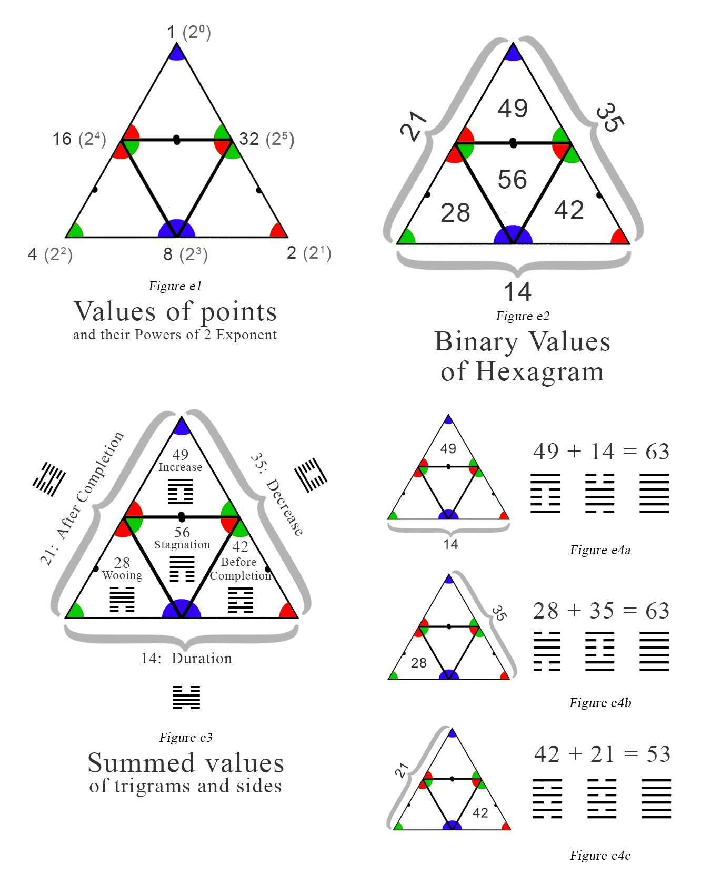

Note: For clarity&rsquo;s sake, when refering to the connecting line between two point, we will use the *overline* symbol. For example, the line connecting D and C is written as  $\overline{DC}$ .  If thete is no index to N, D or C, it refers to the outermost border, otherwise, indexes are used to identidy the specific line, for example $\overline{N_{0}C_{3}}$

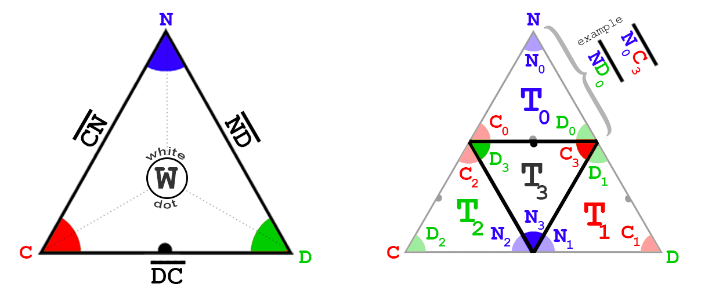

Here are some details worth noting:

- Comparing the three vectors of the parent trigram (as they apply to a social context) to their I-Ching equivalents we see amazingly similar values. 
- 
- On a single trigram the first side connects $\overline{ND}$, blue &#8594; green, . When a child tholon is created within that single trigram, it then has 4 triangles, which is what is required to make a complete tholon, but now the D point has been replace with a C point, so what was $\overline{NC} $ is now $\overline{ND} $, blue&#8594;red. 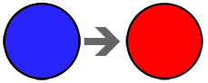. However, in the next generation, it goes back to the original of $\overline{ND}$, blue &#8594; green . This is because all odd number generations, 1,3,5, etc., maintain the original order of colors, and all even number generations flip them.  We now can see there are two orders of sequence, the initial order of blue&#8594;green&#8594;red 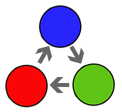, and its child order of blue&#8594;red&#8594;green 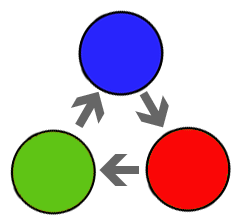.  We'll only look as the first order in the following table. 

Here are the traditional definitions of the hexagrams that are the same value as the side of the tholon.  There is a 1:>250,000 chance their similarity is coincidental.

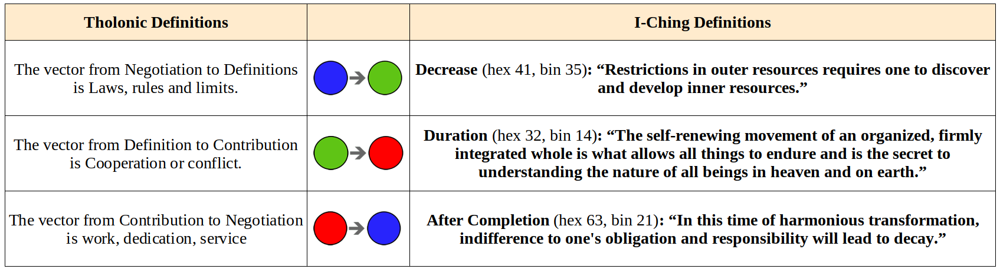

The following are some of the observations (super nerdy):

- The sum of any trigram and the side opposite that trigram always equal 63, the maximum number possible. This was exciting to discover as it supports the tholonic claim that the effect of any point can be seen on the side opposite that point.

- The math pattern of the tholon also works if we replace multiplication with addition, for example, 14 + 21 = 35, or $\overline{DC} + \overline{CN}=\overline{ND}$

- What about the middle trigram?  It does not have any other value to pair with. Not only is there no room for its pair, it would need to be the value of 7. However, the value of 7 does exist of we sum the three points of the parents trigrams, which are 1, 2 and 4, (2^0^, 2^1^, 2^2^). These are the points that create the &ldquo;white dot&rdquo; of the tetrahedron, and it also is exactly opposite the center trigram of **Standstill**.  This math validated the tholonic claim that the &ldquo;white point&rdquo; is created by the sum of the red, green and blue dot. Just as an interesting aside, it is the white dot, with its value of 7, that creates a 3D form out of this 2D map, and the hexagram that is binary value of 7,  **Peace**, is defined as &ldquo;heaven on earth&rdquo; in the text. If we define *heaven* as the place of perfect archetypes and *earth* as the place of form, then this hexagram perfectly describes the concept of the tetrahedron being the first physical (earth) formation of a purely abstract and archetypal (heaven) idea.

  We have a number of other patterns, for example (and for those who enjoy numbers, because it&rsquo;s even *more* tedious if you don&rsquo;t):

- Every number (14, 21, 28, 35, 42, 49, 56, 63, 70) is a product of the *white dot*, which has a value of 7 (7x2, 7x3, 7x4, 7x5, 7x6, 7x7, 7x8, 7x9, 7x10)

- Every value of a trigram plus its opposite border equals 9 $(6+3, 7+2, 5+4, 8+1)$. This lends more support to the tholonic idea that a corner point (or in this case, corner trigram) is paired with it&rsquo;s opposite border.

- Ever hexagram as an equal number of yin and yang lines (only 10 of the 32 pairs of  hexagrams have an equal number of yin and yang)

- Only the numbers of the top trigram, which is the originating trigram, are odd.

- There are many more patterns and relationships as well, and this is only within one tholon that has no parents or children!

## Better Proof

Given that every number has a patterned relationship with one or more numbers, we can reverse engineer where every hexagram sits in the thologram, meaning, we can assign a unique binary value to every vector (or point, but we are only showing vectors here). Remember the chapter that hypothesized how if each tholon had a unique binary value then we could unfold the history of that tholon from the moment of creation to the present? The I-Ching is an example of just that, with a very small set of unique binary numbers.

There is some significant evidence that the I-Ching and the thologram are based on the same model. Given that the Kabbalah and the I-Ching are also based on the same model (which I will not elaborate on here as it is way too long), we can speculate that there is an underlying model that many perspectives of understanding are based on. I do not doubt that the thologram could be used as a tool for divination, mysticism, magic, alchemy, etc. as much as it could for chemistry, physics, electronics, and many other applications. Any truth that exists can be found in many different instances, and its truth is just as valid on one context as another. The only limitation is the creative imagination of the perceiver.

However, if you still have doubts, what follows is a demonstration of  how the value of *pi* (&pi;) can be derived using the tholonic model along with the values shown here derived from the I-Ching.  We can also find *pi* in the thologram alone, as previously described, by using the total number of N-sources for all the real and virtual tholons for each generations.  While this technique uses the same method, it is using very different data. 

***Fig. h1*** shows the hexagram values as multiples of 7. ***Fig h2*** shows the same values, but shows how the same border values of 2, 3 and 5 apply to all the trigrams. Let&rsquo;s apply the tholonic model to these numbers.   We arrived at these numbers by taking the sums of the binary values for each side, as shown above, which gave us 14, 21 and 35, As these numbers are all multiples of 7, we use the multiple values.

Notice how the edges that are universal to all trigrams are the first three prime numbers, 2, 3, 5, and the multiplier is the 4^th^ prime, and top trigram, 7. We'll assign these values to the lower case version of their opposite point; $n=2, d=3, c=5$.  This also means that $\overline{ND}=5, \overline{DC}=2, \overline{CN}=3$.  

The tholonic model states that the *green dot* (*Definition*) is what creates limits and restricts the N-state, so D reduces N. The *red dot (Contribution)*, seeing as it contributes, will be added to N.

We start by assigning N=1. As D and C are part of, or children of N, we then calculate D as $\frac{1}{c}$ and C as $\frac{1}{d}$ . To create a new instance of N we start with the original N, subtract D, and add C.  So,  $N_{1}=N_{0}-\frac{1}{d}+\frac{1}{c}$ , or  $N_{1}=1-\frac{1}{5}+\frac{1}{2}= 0.78539822525372$. We repeat this process again, but we increment $d$ and $c$ by  $n^2$. After doing this a million or so times, we get the number 0.7853982294712. Multiply this number by $n^2$ (which is 4) and you get *pi*.

This graph below diagrams the process (and shows the results already multiplied by 4). Notice how this is exactly the same model that was proposed for transforming a holon from the holarchic model, to a tholon. Included are the formulas that show how to do the calculations with nothing but the existing I-Ching values and using the mathematical relationships of the tholon (see *Appendix B - &ldquo;Tholinic Math&rdquo;*)

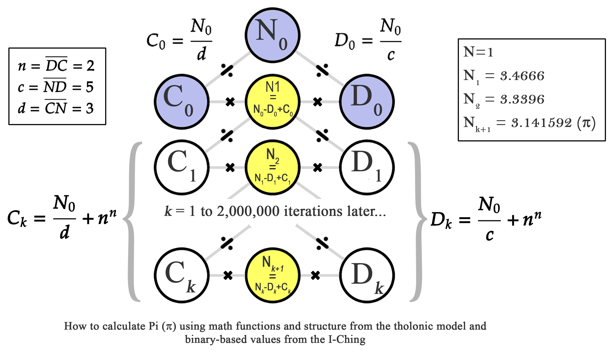 

One interesting observation sis that the first triad if NCD uses a simple formulas, and all the rest use that same formula, but modified by $n$, which didn&rsquo;t exist in the first triad.  This is an excellent example of the two types of duality; the 1^st^ duality that creates the 2^nd^ duality, that creates everything else.

For anyone that wants to replicate/test this process, here are the five lines of Python code.

```python
def iteration(N,h,s,p):
    n=N-(1/s)+(1/p)
    print(n*4)
    iteration(n,h,s+h**2,p+h*2)
iteration(1,2,3,5) # <= first four values of the fibonacci sequence 
```

We can also calculate the value for Phi (φ, 1.618) and the Fibonacci sequence using a similar process. There are many, many relationships, patterns, values and functions in this simple trigram, but for many of them it is hard to say which of their products are *data* and which are *information*.

## Reconstruction

If we rebuild the I-Ching from the ground up integrating elements from the I-Ching, the tholonic model and Western philosophy, we get something like the following:

*Note: As mentioned numerous times before, the interpretations, values and relationships shown here are not intended to be conclusive. While I tried to make them as meaningful as possible, they are more used as examples. There are many ways patterns and relationships can be formed and I am sure a better version than the one presented here can be made. If reader disagrees with some of the conclusions here then consider that an invitation to improve upon it. That is why this book is open-sourced.*

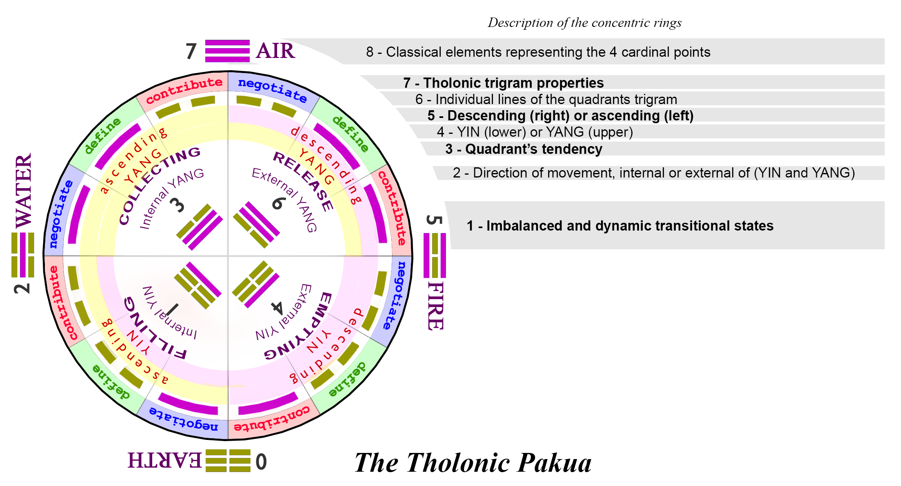

Here are some point about this model: 

- The 8 trigrams of the *Pa Kua* by the natural (binary) are arranged in order of pairs. The trigrams advance as opposite pairs of 0-7 , 1-6 , 2-5 , and 3-4  in the clockwise direction. This means the first 4 trigrams are 0,1,2,3, and the next 4 trigrams are 7,6,5,4 . This results in a pattern where all opposing numbers always equal 7, the maximum number that can be represented in binary using three places. 
- **Ring 7**: There are three divisions per quadrant representing the three stages of tholonic movement; *Negotiation*, *Definition*, and *Contribution* (ring 7).  However, it is more accurate to say there are three *phases* or cycles of movement, similar to how three phase electricity works.  All three phases are present all the time at every point, just at different points in the cycle, and presumably in the order of the image below. 

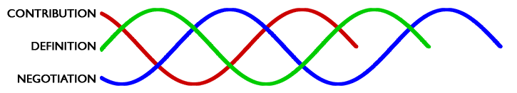

- The two major axis are represented by the four cardinal points. The vertical axis is represented by the most extreme trigrams (7, 0) for the &ldquo;north&rdquo; and the &ldquo;south&rdquo;, and horizontal axis by the most balanced trigrams (5, 2) for the &ldquo;east&rdquo; and &ldquo;west&rdquo;. 

- **Ring 1**: The other 4 trigrams (ring 1) are the most imbalanced and are therefore more unstable/dynamic. 

- The vertical and horizontal axis *reflects*, and the horizontal axis *reflect*s as well as *reverses* (like a photo negative). This is why the lines in the east are a mirror of the lines in the west.  This is also true for the lines in the north and the south, but in addition, they are also reversed along the horizontal axis, like a photo negative. 

  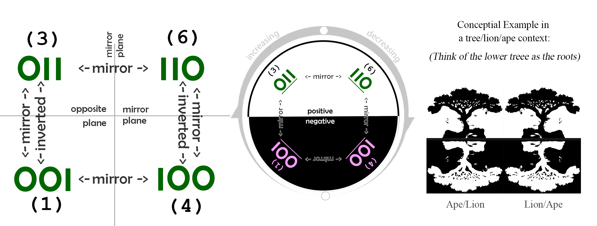

- There are four quadrants, each with three stages which are defined by the sequential lines (ring 6) of the intermediary trigram (ring 1).  Each positive line is matched with its opposite negative line. 

- **Ring 5**: Because the first 4 trigrams (   ) all have negative lines at the top-most position in the trigram we refer to them as *ascending* because they begin at 0 and ascend towards 7. Likewise, the next 4 trigrams (   ) have positive lines in their top-most positions, so we call these *descending* because they start with 7 and descend towards 0.

- **Ring 4**: The upper hemisphere is yang and the lower is yin (ring 4). Because the upper hemisphere consists of 4 yang lines and 2 yin line (ring 6) and has the cardinal value of 7 (ring 8), it is predominantly yang in nature. The opposite is true for the lower hemisphere which is predominantly yin in nature.

## More Definitions

### Yin Yang

Most people have some concept of what *yin* and *yang* represent, but for clarification, we'll reiterate: sometimes the words &ldquo;positive&rdquo; and &ldquo;negative&rdquo;, or the symbols &ldquo;+&rdquo; and &ldquo;-&rdquo;, are used to represent yang and yin. Here are some examples of yin and yang qualities that will help you get a feel for what they mean if you are not already familiar with them:

> **YIN**: dark, night, winter, moon, female, cold, water, alkaline, patience, to be, to rest, single tasking, de-flamed, soothed, holistic, university of life, letting go, death, disease, emotion, not being, electrons (negative charge), uncertainty, chaos, illogical, heart-based feelings.

> **YANG**: light, day, summer, sun, male, hot, fire, acid, impetuosity, action, multi-tasking, inflammation, burnout, allopathy, academia, control, life, health, to be, protons (positive charge), certainty, order, logic.

These concepts are relative. For example, &ldquo;to be&rdquo;exists in both categories, as &ldquo;being&rdquo;can be yin and/or yang. Water is yang to earth, but yin to fire. Like everything, the perception of things and properties are relative to the context and scope of it existence and application.  

### Elements

In keeping with the traditional I-Ching, we want to assign familiar real-world elements and properties. Using archetypes to describe a scene or function can be very helpful in tapping into our intuitive understanding.  The traditional elements of the I-Ching are: water, fire, wood, metal and earth. These elements are said to work together such that:

> Wood generates Fire, Fire generates Earth, Earth generates Metal, Metal generates Water and Water generates Wood.
>
> Wood weakens Water, Water weakens Metal, Metal weakens Earth, Earth weakens Fire and Fire weakens Wood.
>
> Wood controls Earth, Earth controls Water, Water controls Fire, Fire controls Metal and Metal controls Wood.
>
> Wood insults Metal, Metal insults Fire, Fire insults Water, Water insults Earth and Earth insults Wood.

However, we are using Western *primordial* elements here as they are a better fit and are more flexible in general. For the cardinal points, we have the four classics of AIR, WATER, EARTH, and FIRE. We use all caps for these archetypes to distinguish them from the physical elements. These archetypes represent qualities and properties of the elements that can be found in anything, and not simply the physical instances of air, water, earth, and fire. 

To expand on this a bit, the *other* classic set of Western elements is referred to as the alchemical principles, which are salt, mercury, and sulfur, which also happen to be perfect representations of the three types of chemical bonding; ionic, metallic, and covalent. But the alchemists are missing the 4^th^ property which is needed to create a tetrahedron. There actually is a 4^th^ type of chemical bonding called *hydrogen bonding*, and it happens to be the type of bond that holds water together. In any case, these three properties are well covered in the four classics; EARTH as salt (ionic bonds), WATER as mercury (metallic bonds), and FIRE as sulfur (covalent bonds), and I guess AIR would then be, ironically, water… with it&rsquo;s hydrogen bonds? Well, until the Royal Society of Alchemists, or whoever is in charge of alchemists, figures this out and comes up with an updated model, we'll stick with the traditional and classic elements.

We have also adopted the astrological/Neo-Platonic qualities of these elements.  Of course, any other definitions could be used to create interpretation that are consistent with other perspectives.

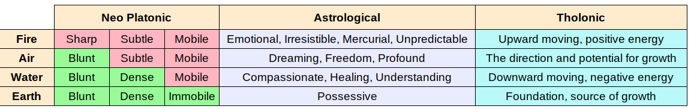

There is another reasoning behind what trigrams are chosen to be cardinal or dynamic. When applying tholonic logic to the I-Ching we have to find the perspective of each model that are compatible with each other. In the diagram below we graphically map the values of the I-Ching to the tholon to find the patterns.

### Which Pattern?

*Note: The following section might be a bit difficult, or boring,  to follow. It is the process that was used to discover the optimum pattern needed to validate the positions of the trigrams. Feel free to skip this part, as nothing in it will be referenced anywhere else.*

The question is, which is the &ldquo;best&rdquo; way to view the tholon?  Top-down or concentrically? The top-down seems bore compatible with binary progression, while the concentric seems to *object-oriented*.  

Below, in *Perspective 1*,  we have taken the colored corners of a trigrams and then assembled those corners together by joining them at their tips with while preserving their alignment. The idea here is to find a pattern of progression among the N, D and C properties that can work for either perspective.

We don&rsquo;t assign any value to N, or the blue corner, because we are only looking at the two poles within which all things come into being.. We assign the green corners a value of 0 simply because it is first, but the value of the red corners are determined by the row. This is done by using the row numbers as the exponent of 2 (because we have two corners), which result in the red corners of *Row 0*, *Row 1*, and *Row 2* having the respective vales of 0, 1 and 4. Using this method we can create 8 combinations of corners that have the values 0 - 7.  Because we keep the orientation of the corner in tact, there can be overlapping corners. These are represented by a yellow corner. For example, in the first instance we have *Row 1* green (0), *Row 2* green (0) and *Row 3* green (0), which is three 0s, hence 0+0+0=0. In the second instance we have *Row 0* red (1), *Row 1* green (0), and *Row 2* green (0), so 1+0+0=1. In the third instance we have *Row 0* green (0), *Row 1* red (2), *Row 2* green (0), so 0+2+0=2, etc.

In *Perspective 2*, rather than assign values to the rows, we assign them to the trigrams. In this example we move from trigram 1, to 2, to 3 in clockwise order, as opposed to *Row 0* to *Row 1* to *Row 2* from the top down.

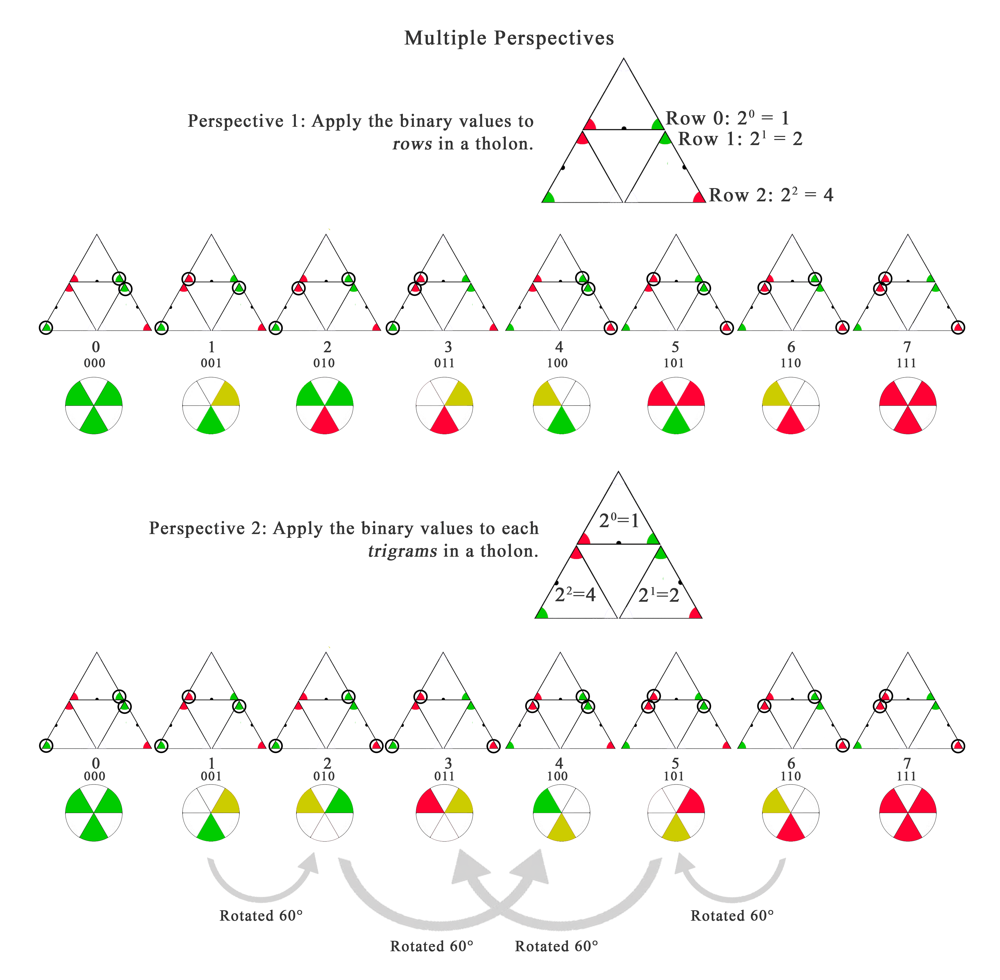

Both perspectives have patterns. The top-down binary modal of *Perspective 1*, similar to the I-Ching, shows the cardinal points (0, 1, 5, 7) as being composed of only primary elements (red and green only), and it shows the dynamic points (2, 3, 4, 6) as having a new composite element of yellow, which is what we get when a red and a green overlap each other. This supports the argument of which trigrams are static and which are dynamic. We also see that the opposing pairs and the negatives  (as in photo negatives) of each other and alternate mirroring one another and 

The object-oriented *Perspective 2* uses the cyclical tholonic values as they are assigned to the tholonic trigrams. We definitely see patterns there, and no doubt they can shed new light on both the I-Ching and the thologram. 

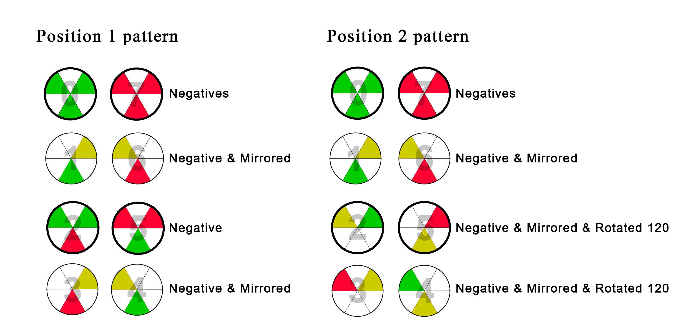We will only be using Perspective 1. In addition to its preferred symmetry,  it answers the question of which trigrams are static or dynamic, which is made very clear in the diagrams below when the images are arranged in their proper order. 

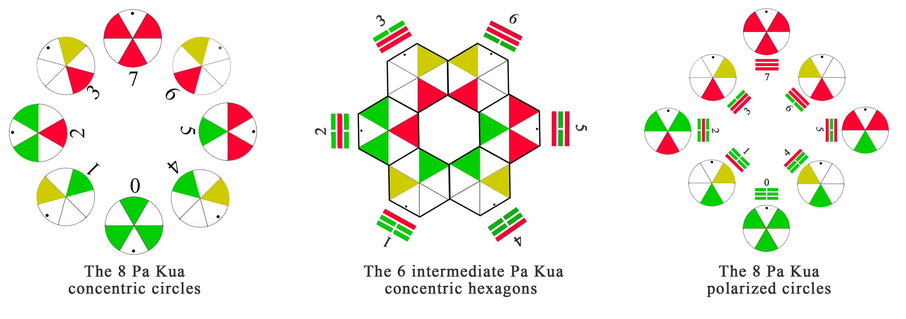

So, how do we know what trigram is associated with what element? The reasoning is pretty simple… AIR 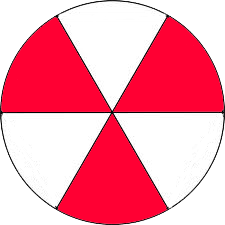and EARTH 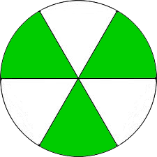, which defined the vertical axis, describe the opposite properties of what is above us and below us and frames the boundaries of our context. They are the maximum (highest) and the minimum (lowest), between which all else exists. FIRE 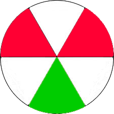and WATER 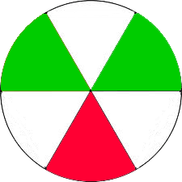, which define the horizontal axis, are the two opposite properties representing the spectrum of resources within that context. They are the only two trigrams that combine both elements of yin and yang but do not overlap. WATER is certainly less yang than FIRE, so WATER is 2, which only has 1 yang and two yin, and FIRE is 5, which has two yang and one 

The dynamic trigrams are a bit less obvious. We need to look at the relationships between the cardinal trigrams to determine what dynamic property it describes via the three stages of *Negotiation*, *Definition*,  and *Contribution*. 

But before we do that, let&rsquo;s look at some math.  Looking at the cardinal numbers of 7,5,0,2 and the transitional numbers of 6,4,1,3, it does not appear that that have any relationship other then that they are in order - meaning, we can&rsquo;t use the transitional numbers to calculate the cardinal number, at least not at first glance.  However, there is a way&hellip;

Start with 7, add the starting cardinal number (*c*), subtract the sum of the transitional value (*t*), plus it&rsquo;s mirror value (*T~1~*), and then subtract 7 if the result is 7 or greater, and we get the new cardinal number (*c~1~*).

*c~1~ = 7+c-(t+T~1~)*

For example:

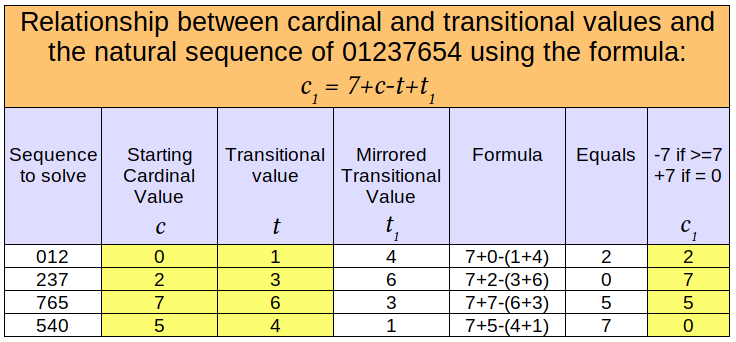

This may look like mental gymnastics, but it&rsquo;s really an informative pattern that requires the *mirrored* value pairs of the transitional numbers to arrive at the *inverse and opposing* value pairs of the cardinal numbers.

We can re-describe the above by also saying: One static property transitions into another static property by removing the yang properties of the transition state *and* its mirror from the static properties and then adding them back to the result.  This tells us a couple of things about the interrelationships of these values, for example; 

- The mirrored values must be considered as a one value with two instances, not as two separate values.
- The property of the cardinal values are integral to every transition because the transition *is* the remains of the previous cardinal value added to the next cardinal value.
- The pattern of the static cardinal points is simple, and therefore more fundamental by nature, while the pattern for the dynamic transitional point is less so.
- The yang properties must first be removed before the transition, suggesting that transitioning has the quality of yin.

This pattern only works on the cardinal values, and fails if we apply it to the transitional values.

## Explanations

Now that we have these sequences, what do they mean?  Here are the explanations of the cardinal and transitional elements with the reasoning.

### EARTH  0

*EARTH* represents the foundation upon which everything is built as well as the resources from which they are built. It is cardinal, winter solstice, inward, the non-moving point between deflation and inflation.  Instance of this are **resources**, **foundations**, **support**.

The trigram shows the symbol of a perfect yin state.

The quadrant of EARTH  exists between the dynamic properties of EMPTYING  and FILLING  and therefore represent the extreme yin pole, where the maximum point of EMPTYING is reached and where FILLING begins. 

1. *Negotiation*:  A yin here indicates that anything can be negotiated, for it is receptive to anything, yin or yang.
2. *Definition*:  The emerging definitions are determined by the whatever is acting upon it.
3. *Contribution*:  The contribution of the yin is that is allows a yang to appear simply by its existence. It doesn&rsquo;t need to do anything, just as 0 implies 1 by its nothingness, especially when we consider that *0^0^*, or *nothingness^nothingness^* , = 1.

### WATER  2

*WATER* represents the movement from dark to light, yin to yang, lifelessness to life.  It is cardinal, spring equinox, ascending, the perfect balance of lessening yin and increasing yang. Instance of this are **electricity**, **nourishment**, **cleansing**, **rivers**.

The quadrant of WATER exists between the dynamic properties of FILLING  and COLLECTING  and represents the balance between the yin and yang that is achieved when yang penetrates the yin at is center. The oceans and lakes have filled and are stagnant until the rivers form which serves to collect the water to return it to its cycles..  It is the most *inward* moving of all the states.

The trigram shows the symbol of yang energy penetrating the yin at its core. 

1. *Negotiation*:  Water cedes to whatever holds it.
2. *Definition*:  The movement of water is what gives it its power.
3. *Contribution*:  The yielding quality of water that is its contributions. If always follows the path of least resistance, is used by every form of life and Nature itself, and is then returned, essentially unchanged. It takes nothing, and gives everything. It is the nature of growth and expansion.

###  AIR  7

*AIR* represents the arena of growth and creation. What comes from the yin EARTH grows *into* the yang AIR. It holds all things in the Universe in place and is symbolic of spirit, which shows us a life expanding beyond our earthly limitations.  It is cardinal, summer solstice, outward, the non-moving point between inflation and deflation. Instance of this are **birth**, **exploration**, **imagination**.

The trigram shows the symbol of a perfect yang state. AIR is one of the three trigrams that is an ORIGINATING SOURCE.

The quadrant of AIR  exists between the dynamic properties of COLLECTING  and RELEASING  and therefore represent the turning point from the internal journey to the external journey. This is the extreme yang pole, where the maximum point of COLLECTING is reached is reached and the RELEASING must soon begin.

1. *Negotiation*:  It is the nature of air to move and to create; it therefore seeks out the yin.
2. *Definition*:  While the unknown is yin in nature, exploring it is yang, and it is only by exploring that definitions and limitations are discovered.
3. *Contribution*:  The contribution of AIR is to open new doors and find new horizons. 

### FIRE  5

*FIRE* represents the quality that allows for manifestation, transforming idea to form. It is cardinal, fall equinox, descending, the perfect balance of lessening yang and increasing yin. Instance of this are **light**, **consumption**.

The trigram shows the symbol of a yang on the outsides but dependent on a yin center as the yang dissipates, much like a fire that shines light as the log is reduced to ashes.

The quadrant of FIRE  exists between the dynamic properties of RELEASE  and EMPTYING  and therefore represent the dissipation of energy, which brings form into existence and light into the world. This is the balance that represents the zenith of outward expression.

1. *Negotiation*:  The yang is built up and is ready to be released.
2. *Definition*:  The yin returns as the yang is released, which is defined by dissipation and entropy.
3. *Contribution*:  The energy is shared with the world, as light, heat, and movement. 

Here are the explanations of the transitional or dynamic interactions.

### Release (AIR & FIRE )  6

*Release* represents accumulated energy that seeks balance, and in the process of balancing itself, dissipates itself and its recipient. It is the initial outward movement that leads to expression. Instances of this are **lightening**, **Big Bang**, **inspiration**.

The trigram shows the symbol of yin energy re-entering the solid yang. The new yin line comes in at the lowest position of beginning, birth, idea.  The yang is still dominant as the middle line is still yang, so the transition is yang in nature.

The quadrant of AIR  and FIRE  is one of outward-descending, or external yang. Here, the yang pole of the limits of sustainability has been reached, so there will be a natural movement in the opposite direction.  When this extreme yang mixes with the yin there is a powerful release of yang energy, and the result is FIRE.  This quadrant is *outward* because the process of creation is that of energy (yang) taking form (yin), and form exists in the outer world.  *Descending* because the yang expands, and by doing so also dissipates itself.

1. *Negotiation*:  When the yang energy becomes complete, not only does it have nowhere left to go, but its existence depends on the yin at this point.  Here, the yang is subservient to the yin.
2. *Definition*:  When yang meets yin it wants to release all of its energy and pushes against the limitations of the yin.
3. *Contribution*:  The yang finds expression in FIRE as it consumes the yin.  

### Emptying (FIRE & EARTH)  4

*Emptying* represents the dissipation and movement of energy via matter. It is the source of order out of chaos. It is the final outward deflation that returns to the initial chaos from which everything is born. Instances of this are **music**, **creation of the elements**, **death**.

The trigram shows the yin energy overtaking the center, making this trigram yin in nature. EMPTYING is one of the three trigrams that is an ORIGINATING SOURCE.

The quadrant of FIRE  and EARTH  is one of final descension, or external yin, where the energy of FIRE quickly dies. This is external because it is FIRE transitioning to EARTH, and *descending* because the energy of creation is waning in the process. This is the process that transforms energy to mass (*m=E/c^2^*).

1. *Negotiation*:  In the dynamic between FIRE and EARTH, FIRE is always dependent on EARTH.
2. *Definition*:  FIRE can only find expression in EARTH, just like energy can only be experienced via matter. Therefore, the limitations on the expression of FIRE are determined by the yin quality of EARTH.
3. *Contribution*:  The restructuring of matter (EARTH) by energy (FIRE) is what brings everything into existence.

### Filling (EARTH & WATER )  1

*Filling* represents form coming to life.  It is the initial inward inflation of a new cycle. Instance of this are **gestation**, **dark matter (expansion of the Universe)**, **artificial intelligence**.

This trigram shows the return of the yang energy in the bottom place, but as the center is still yin, it is in the domain of yin. FILLING is one of the three trigrams that is an ORIGINATING SOURCE.

The quadrant of EARTH  and WATER  is one of new beginnings, or internal yin, where the empty yin state of EARTH begins to return to life with energy.   It is inward because the yang enters from the lowest place, and ascending because the yang continues to rise.

1. *Negotiation*:  The lack of yang is what draws the yang to penetrate the EARTH
2. *Definition*:  The yang must fill the empty yin vessel of EARTH before it can express itself.
3. *Contribution*:  The omnipresence of yang is the universal reservoir that can be tapped into from anywhere, not unlike the idea of the earth as the electrical ground for all electronics.

### Collecting (WATER & AIR)  3

*Collecting* represents the higher orders of structure that extend ever outward. It is the final internal inflation, the final preparation.  Instances of this are the **Internet**, **space-born viruses**, **Mongol Empire** .

This trigram, with two emerging yang lines, is now in the domain of the yang.

The quadrant of WATER  and AIR  is one of preparing, or internal yang, where the balanced state of WATER ascends and expands into the polar state of AIR.

1. *Negotiation*:  The yang becomes dominant here, and the remaining yin is outnumbered. This is the time when the yang begins to reign.
2. *Definition*:  The yang is no longer constrained by the limitation of the EARTH and is free to expand into what seems like limitless AIR.  This is the culmination of expression, and whatever the ultimate expression of an instance is, according to the nature of the instance, will be expressed here. 
3. *Contribution*:  What remains of that expression or how it lives on is something only history will know.

## Hexagrams

With the hexagrams in their binary order we can put together the 64 hexagrams (below). 

- There are 2 pairs blue-framed hexagrams which are those that are a product of those trigrams that define the scope. These are the *north-south* trigrams &nbsp;&nbsp;&nbsp;.

- There are 2 pairs red-framed hexagrams which are a product of the trigrams that define the context, or movement within that scope. These are the *east-west* trigrams  &nbsp;&nbsp;&nbsp;. 

- There are 8 pairs green-framed hexagrams which are a product of the transitional trigrams &nbsp;&nbsp;&nbsp;.
- The remaining 20 pair are a mixure of the above.

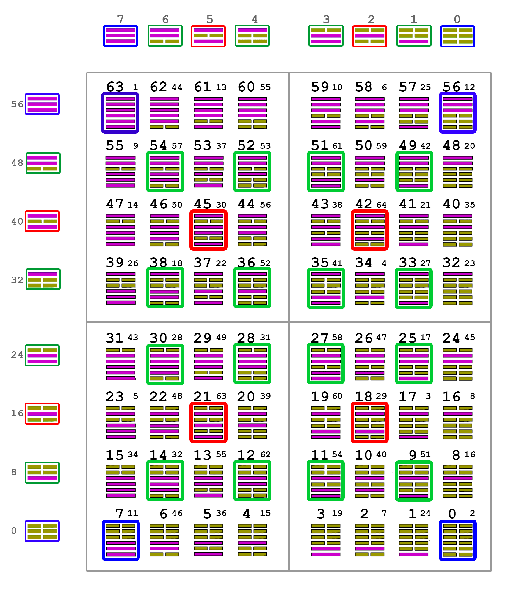


Each quadrant contains 16 hexagrams, but if we were to map these to the four sides of a tetrahedron, we would need exactly 15 hexagrams for a side.  The hexagram 0 and 63 could easily be placed outside the side of the tetrahedron as neither of them represents something that can actually exist. They represent the primary poles within which everything comes into being.  That still leaves two hexagrams too many.  Another problem was; with the hexagrams laid out, whatever hexagrams occupied the three corners, they had to equal 63 so as to be able to form the 4^th^ *white dot* point.  It turned out that the solution to one problem automatically solved the other problem.

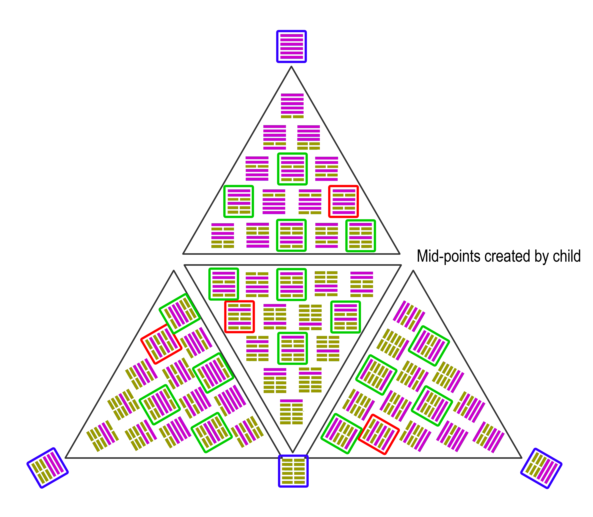

Here, we place the 63 at the originating N-source, and its opposite, 0, at the child N-source.  Because the mid-points are actually the children of the child N-source The grand-children of the first N-source) they are outside the scope of the parent so we don&rsquo;t need to consider them when just looking at the parent.  We know that the two children must equal the parent, and while there are 31 possible pairs that together equal the parent&rsquo;s value of 63, only two of them were cardinal; those are are 56 **Standstill** and 7 **Peace** . Additionally, these are the only two other hexagrams that are composed of the the two extreme trigrams.

> This also shows an association between the tholonic concept of *DEFINITION* and **Standstill** and *CONTRIBUTION* and **Peace**.  Let&rsquo;s compare them: *DEFINITION* describes *limitation, division, and separation*. It is the domain of laws, restrictions, cause and effect.  **Standstill** describes a time when &ldquo;*The great departs; the small approaches"*, and goes on to say how *perseverance* in one&rsquo;s principles is critical; *principles*, as in *&ldquo;a moral rule or standard of good behavior or fair dealing."* (It goes on to say much about inferior or superior men and their ways, but this is because of the Confucian-based, state-financed interpretations of the day.) *CONTRIBUTION* describes the *unification* of things and the *creation of form*, as well as a *return* to the source and of one&rsquo;s *responsibility*.  **Peace** describes a time when *&ldquo; …heaven seems to be on earth"* and &ldquo;*their powers unite in deep harmony*".

At first glance this arrangement looks very promising, as the cardinal (blue-framed) hexagrams hold cardinal positions and the three corners equal 63 (actually, a multiple of 63, as $56+7+63 = 63\times 2$). Arguably, hex 0 and hex 63 could be reversed, but the result are effective the same.

However, several other validating patterns emerged that were pretty astounding.

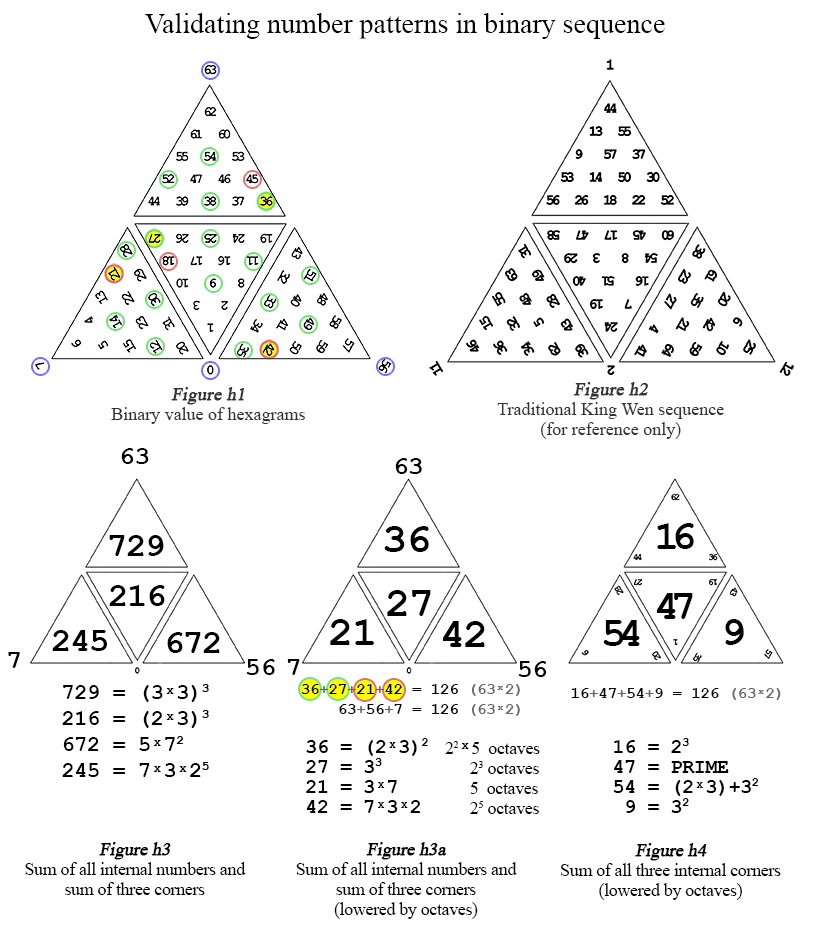

Notice that every value can be defined by a formula that only uses the first 4  prime numbers, or is itself a prime number!  It was also a nice surprise that the sum of all values in the central tholonic trigram was 216, or $6\times 6\times 6$ (see *Appendix D &ldquo;New Data&rdquo;*).

Notice how each of the four triangular sections (in ***Fig. h3a***, and by implication, ***Fig.h3***) have values that exist within each triangle as either red-framed *moving* or green-framed *transitional* values, i.e. hexagrams 36, *Keeping Still*, 27, *Joyous* , 21, *After Completion* , and 42, *Before Completion*  . 

If we were to create a sequence of the I-Ching based on the tholonic model above, it would look like the following image:

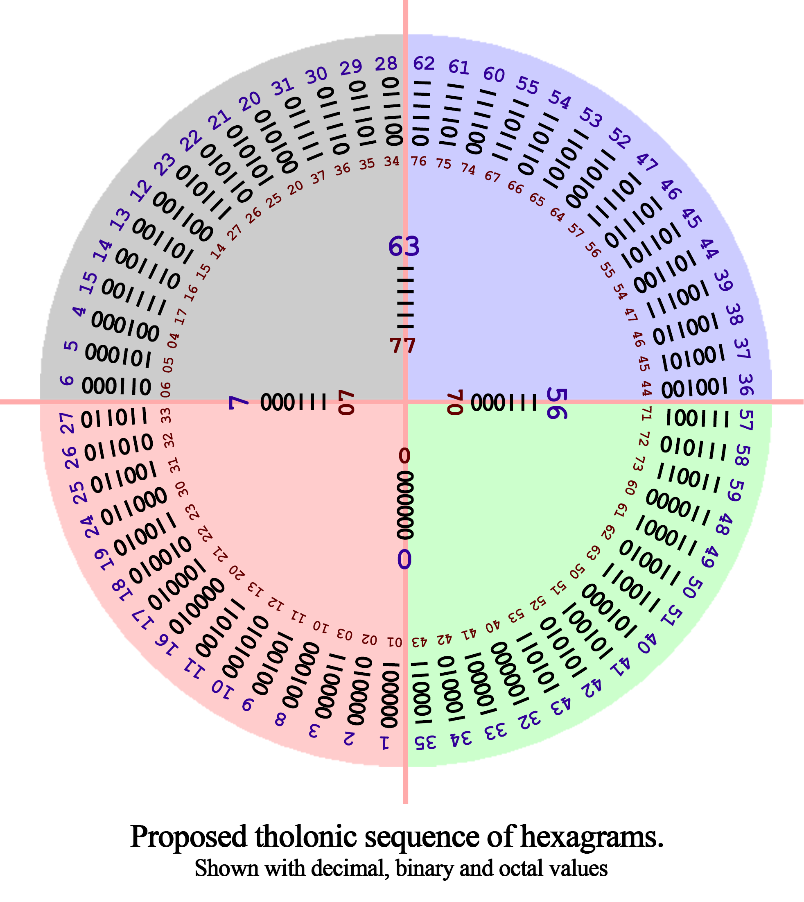

Some interesting points regarding the above sequence:

- Because the 4 cardinal points define the framework and do not make up the dynamic part of the circle, there are exactly 60 points on the circle.

> This is just like the ancient Babylonian clock which introduced the idea of the 60 second minute and the 60 minute hour.  The modern argument is that they used 360 as a basis because it represented their estimate for the number of days in a year, but this lazy reasoning presumes the ancient Babylonians, who were the masters in their day of navigation, architecture, agriculture, astronomy and government, never bothered to actually count the days in a year, or worse, just ignored the extra days at the end.  The reason the ancients used 60 is because 60 is one of the most fundamental numbers that drives nature, given that it is the product of the first three primes… 2^2^&times;3&times;5.   p.s. 2^2^&times;3 =12, which is why we have a pair of 12 hours to the day, just like the Ancient Egyptians and Chinese developed. I will save you the embarrassingly myopic modern explanation as to why and how these two cultures came up with the same system.  

- While the numbers are not sequential, each pair of opposites equal 63.

- I have added the octal (base 8) value because it is far more clear.  Base-8, if you are not familiar with it, is simply a number system that is based on the eight values 0,1,2,3,4,5,6,7.  This means when you are counting and you get to 8 you have to start with the double digits, so our base-10 number 8 in octal is written as &ldquo;10".
  
- 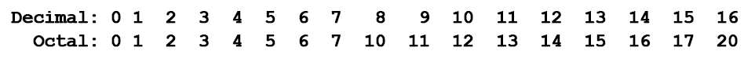
  The beauty of using octal numbers for the I-Ching is the number itself is telling you what trigrams it&rsquo;s made of.  For example hexagram 12 (001100) is octal o14 (we use $lsquo;o&rsquo; for octal numbers).  Hexagram 12 is composed of two trigrams; 001 and 100.  Converting from binary to octal, 001 = 1, and 100 = 4… so we simply put the two numbers next to each other to get o14. If we trued to do that with 12, or any number not based on 2, it would fail. No addition is needed to arrive at the correct octal value for 001100.  Today, if we were to do this with our base-10 number system we would get meaningless results, and be chided for engaging in some silly form of numerology or superstition, however, in the past when numbers and letters were often shared, and when using with base-60 (Babylonian, Sumerian) or base-8 (Native American, Proto-Indo-European) systems, simple rearranging of numbers can produce valid mathematical solutions.  In fact, that is exactly how computers, which use base-8 (or base-16, 32, 64, etc.), do math… by simply putting numbers next to each other to perform addition.

- Numbers are not as intuitive as images, so here are a couple of charts that clearly show the self-similarity trigram-ish and pattern of the sequence.  Both of these plots plot the series in each of the quadrants of the tholonic I-Ching whuch makes its binary and tholonically fractal nature clear.

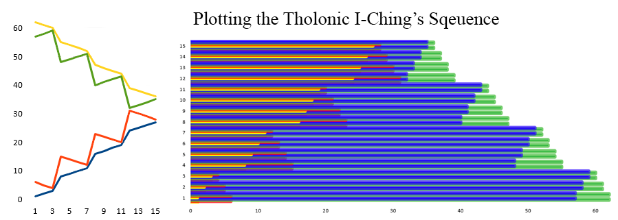

## How Creation Works

We are going to step back zoom way out now to get an even broader, but more in-depth picture of the natural processes in play in the hopes it will add insight into how we reconstruct the I-Ching.

The tholonic model is based on the ancient premise that from a singularity comes a duality.   We see this in the idea that *nothingness* has no value until *something* appears within it, at which point, *nothingness* is represented as 0, and *somethingness* is represented as 1.  Without something, nothing would ever exist, because&hellip; it&rsquo;s nothing and only exists in contrast to something. We'll avoid the unsolvable argument of which came first, nothingness or somethingness, but we can say from this that the first duality was of something (1) and its opposite, nothing (0).

So now we have 1 and 0.  What can we say about these two numbers?  We can say that they are two parts of a duality, and because we know that the sum of the parts of a whole equal the whole, we can they say that 1+0=1, which tells us the whole equals 1.  This sounds like 1^st^ grade math... but let&rsquo;s continue.

We can plot this a few different ways:

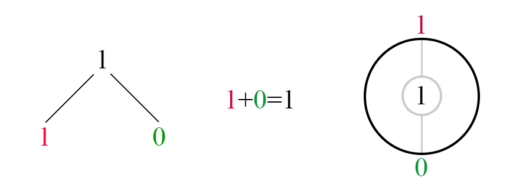

If this is a true statement, then it must be true for all numbers. Let&rsquo;s try this with the first, and only the first, 8 numbers, 0-7, by making every pair of numbers that equals 7; 7+0, 6+1, 5+2, and 4+3.

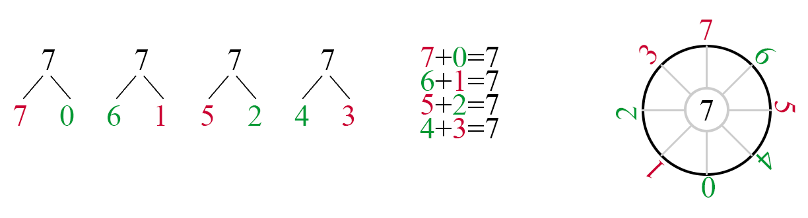

Now we have a problem, because, as is shown in the above 1-level tree chart, we have four 7s, which when split make all the numbers 0-7, but what then are the two parents of these 7s? If we apply the same logic, then those four 7s would have the two parents of 14 and 14, making the originating parent 28, but this is not allowed as we have no numbers that are greater than 7.  But even we did have such numbers we still have the problem that any number we use as a parent number will never create two children that are the same number because the parent number *must* be odd to create different children. In addition, if the top number is even, the number of possible pairs is an odd number.  For example, if 6 is the parent, we have 4 possible child pairs of 0-6, 1-5, 2-4, and 3-3, but 3-3 is not allowed as they are the same number, leaving 3 pairs.  This breaks the binary symmetry, and we assume that symmetry is a requirement based on the fact that the first number to represent something, 1, creates perfect symmetry.  0, which represents nothing, is technically an even number. 

The problem then is that there is no number that can be used to represent the parents.  So, we have to invent some numbers.  This is done all the time in math, for example *imaginary numbers* and even *pure imaginary numbers*.  These are numbers like *i*, the square root of -1.  Let&rsquo;s invent some imaginary numbers, but let&rsquo;s call them *primordial numbers*.

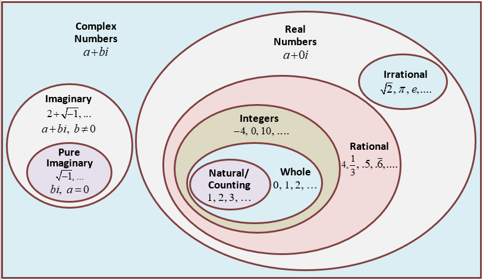

We need a number that can be equal to two (or more) values at the same time but can only be expressed as one of these two values in real numbers, and whatever value is in one state, the other state has a different value, so no two states can share the same value. This is a familiar concept in quantum mechanics where we have the idea of spin and entanglement.  For an excellent and clear explanation of this subject, see Quantum Magazine&rsquo;s &ldquo;Entanglement Made Simple&rdquo; [^225]

We can now apply to this idea to all the numbers, going all the way to the top, where we have the meta-value, or *first order primordial number*,  of A that represents  one unit from which these eight numbers emerge from in the following manner. 

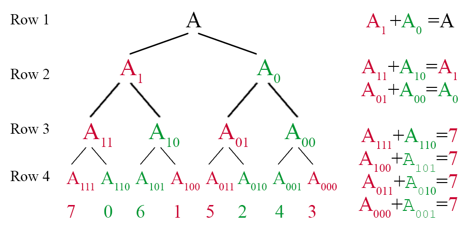

We start with A and its pair, which consists of A~0~ and A~1~.  On the next row, each one of those meta-values has its own pair, so A~0~ has A~01~ (sub 1 of sub 0) and A~00~, etc.  

*Note: Don&rsquo;t be confused if you are looking at the binary sub-indexes and seeing they do not match the decimal values. They are not suppose to be the same. This is explained in the next paragraphs.*

 To represent this in circular charts, we need a new chart for each row.

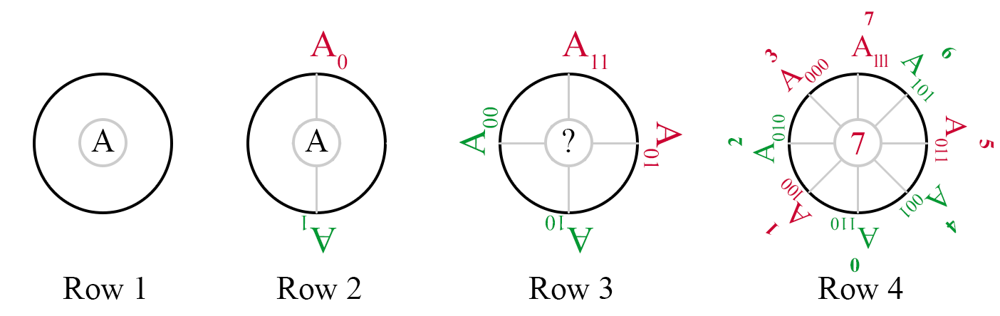

At the bottom of the tree above we have seven states of A, each identified by the sub-index value, representing its lineage from A.  If you understand binary numbers you'll notice that the sub-indexes follow the perfect sequential order of 76543210 (starting from the left), yet the number they represent have a very different order 70615243.  This seems to make no logical sense, but in fact, it is an amazing relationship.  

The sub-index values represent the path of expression from A that resulted in a number value.  This is the *order of instantiation*, while the value itself is the *value of instantiation*.  Look at how these two sets of values relate to one another.   Below (left) are the binary values for the sub-indexes and the decimal value of that number.  This is not the actual number it represents, just the index.  For example, if we were to use the decimal values of the binary value as an index we would write: $A_{7}=7$, $A_{6}=0$, $A_{5}=6$ ,$A_{4}=1$, $A_{3}=5$, $A_{2}=2$, $A_{1}=4$, $A_{0}=3$

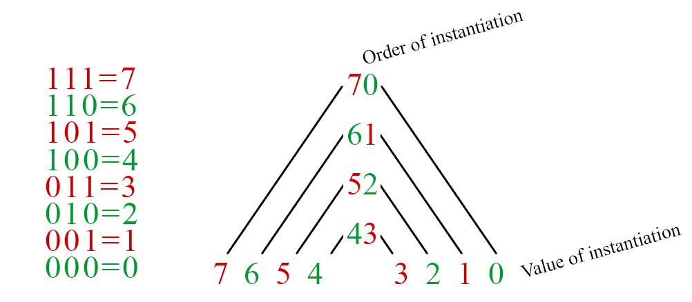

The *value of instantiation* ($VI$) axis is perpendicular to the *order of instantiation* ($OI$) axis.  These two axes are perfectly in sync with each other in two different axis and seem to be a natural process of reordering is a very efficient form of encoding (and therefore decoding) as the *value of instantiation* is an encoded version of the *order of instantiation* and visa versa.

Technically speaking (and I need to say that because what comes next sounds quite esoteric), every instance, which is every *thing* that exists, is not only a piece of the *One Thing* that all existence came from, the ultimate A, which tholonically speaking is a 0-dimensional dot, but also a recombination of the very path that caused it to come into existence starting from the dot, the A, at the beginning of creation. If there was only one source from which everything grew from, then every instance, every thing, has a unique *order of instantiation* value which describes the path it has taken from 0-dimensions.  Because every order of instantiation is unique, so too is the *value of instantiation*.

But there is one more perspective that is worth looking at.  If we arrange this tree in its most natural evolving form (the synergetics of 60&deg;), we get the following:

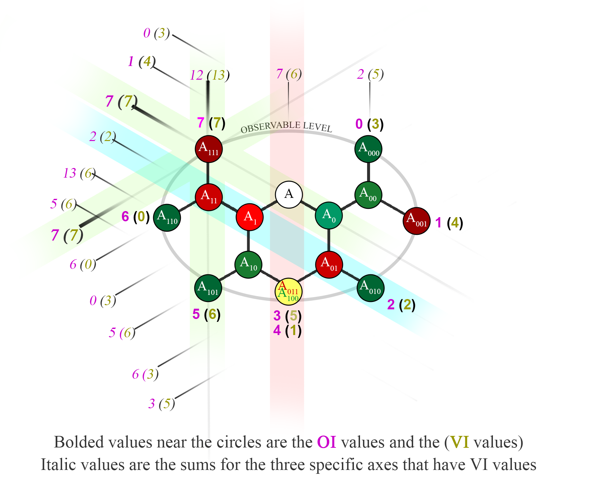

There are many significant patterns here, but the ones I'd like to point out specifically are:

- Only the numbers 7 and 2 are the same on both axes.  This is significant because it says that the value of 7 and 2 have the same measure when it comes to *how* something came to be, and *what* something came to be.  This is not only because they are the same in the map, but they are also the same as the sum of their axis.  When we look at the combined values of the axes, we see that this is the same case for the 12.  They also are the first and last prime numbers (in the set of 0-8, the two in-between being 3 and 5)
- There are three types of lines that the 7(7) quality.  the 4:00 line (upper left to lower right), the 02:00 line (lower left to upper right) and the 12:00 line.  The 7(7) of the 4:00 and the 2:00 lines are the sums of all the countable values on that axis.  The 12:00 line is only 7(7) at the point where the other two lines intersect..  There is also the 4:00 2(2) line.  You'll notice that axis of the 7(7) lines cover all three axis and can themselves define a trigram or a hexagon, but there are three kinds of axis. 
  - The 4:00 7(7) line is 1^st^ because it is $OI=VI$ and includes $A_{0}$. In addition, the axis is given extra significance because of the 4:00 2(2) axis.  Because of it relationship to the original $A$, this line equates to the *Negotiation* point of the tholon.
  - The 2:00 7(7) line is 2^nd^ because it is $OI=VI$ as well, but this line is also the only 7(7) line does not touch any other value, mete or otherwise.  Given this limited relationship, this line equates to the *Definition* point of the tholon.
  - The 12:00 7(7) line is 3rd because while $OI= VI$, it also has the addition 5(6) so the sum does not match the $OI$ or $VI$. The the other two have the same sums for $OI$ and $VI$.  Given this is the only 7(7) line that adds a new instantiable value, this equates to the *Contribute* point of the tholon. 
  - The 2(2) line equates to the child N-state because it includes all the *meta* children of $A$ ($A_{1}$ and $A_{11}$) that leads to the final value of $A_{111}$ which is 7.
  - Also of interest is how the only values that relate to these three lines create an oscillation of 7 points 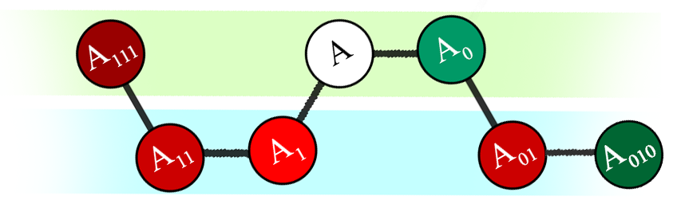, and how the total value of the sub-indexes equals 14 (7+3+1+0+0+1+2)
- Values A~011~ and A~100~ overlap, and of course, when combined they equal A~111~, which is supporting evidence that this model is viable. In addition, the sums of the  $OI$ values is the limit of the *order*, 7, and the sums of the $VI$ values shows it will express itself (the *value*) as 6.
- Only meta-values that reach the *observable level* have some quality that is quantifiable as a number, but as everything beyond that point can have numerical values, the implication is that there are 7 meta-values across 2 generations and 3 levels that stand between A and all instances or numbers.  What is interesting about this is that we see this same concept in religion and  mythological cosmology (Mesopotamian, Islam, Judaism, Christianity, Hinduism, Jainism), where Heaven, that place from which our material reality was conceived, has seven divisions.  In addition we have the concept of a trinity, an even more fundamental concept that has been incorporated in our models of reality going back to the most ancient beliefs.

## DNA

We see this same pattern of progression in the most fundamental form of creation; genetics. Below is a graph that illustrates the how the bases (adenine, cytosine, guanine, and thymine) pair together to form nucleotides.  An $A$ can only double bond with a $T$, and  $C$ can only triple bond with a $G$. This is accomplished by taking one side, inverting it (line a negative image), then reversing it (horizontal flip). When we do that, the pairs automatically line up in their proper order.  In the image below we the same concepts as above by considering the bases of $A,T,G,C$ to be the instantiable of some *meta-base*, or some unstantiable archetype. These are represented as the half-circles and full circles. We also assign sun-index vales representing their paths, and, as you can see, every pair has two values that equals 3.

The intention is to show how at least one aspect of mechanics of a DNA strand follows the same the order, or pattern, of this archetype of *hierarchical primordial numbers* and that of many natural processes, and, of course, the I-Ching. For example, the parent of the bonded bases could be the concept of the class of compounds called purines or pyrimidines.  Their parent, the source, could be the class of aromatic heterocyclic organic compounds, which all the children are a member of.  Or perhaps it could be *Chargaff&rsquo;s Rule*,  which states &ldquo;DNA must have equal parts of GC and AT nucleotides.&rdquo; There could be many different instances of these parents, but in every case (where this model is applies), they will follow the same pattern of expression.

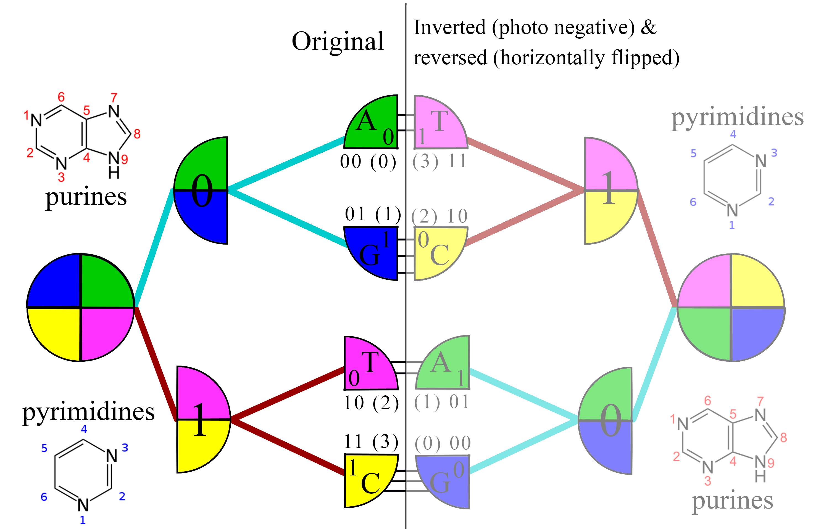

This inverting and reversing is the exact same process used in the I Ching and shows how only 16 original hexagrams are needed to create 64. What is especially interesting is how the opposite (inverted and flipped) of the purine compound of adenine is the pyrimidine compound of thymine. This is interesting because there can&rsquo;t really be an &ldquo;opposite&rdquo; of a compound or molecule or atom, but there can be two compounds that perform in an &ldquo;opposite&rdquo; manner in one context or task, and this &ldquo;opposite&rdquo; will typically appear as &ldquo;complementary&rdquo;.   In another context or task these compounds would act is a very different manner, such as how adenine is used in cellular metabolism to transfer chemical energy between chemical reactions.  From a tholonic perspective, this shows that the structure of a process is independent of the instances that attempt to apply that process, which also then suggests that the process' archetype existed before it was instantiated.

There are correlations between the I Ching and DNA.  For example, is we replace DNA concepts with I Ching concepts, we can say the following:

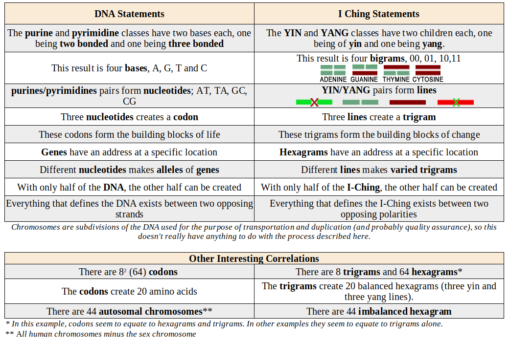

## Binary Tholons

There is another way we can map the lines to a tholon, and that is simply by aligning the 6 lines of a hexagram to the 6 edges of a tetrahedron. 

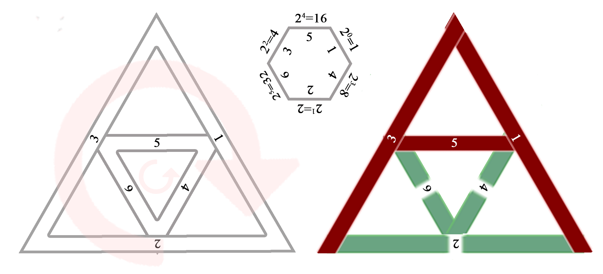

We start with the 1^st^ line and move counter-clockwise, then continue with the 4^th^ line and move clockwise, in the reverse direction. In the image above, we replaced the lines with their default I Ching yin/yang lines.  Immediately you can see a few interesting relationships:

- All opposing numbers equal 7
- The central lines of a hexagram, 2 and 5, and the central lines of tetrahedron.
- The parent (1,3) is yang that creates a yin (2) spectrum, and the child (4,6) is a yin that creates a yang (5) spectrum.
- The total for the yang is 3^2^ (=9),and the total for the yin is 2^2^&times;3 (=12)
- As a tetrahedron, it nicely positions all the yang lines central and foundational. However, it is not the obvious central trigram that acts as the base of the tetrahedron, but the top trigram.  If you remember back, we showed that it is the top trigram that always maintains the same pattern as the parent. This makes the top trigram a perfect duplicate of the original trigram while also being the foundation for all future generations of tholons. This detail has a profpund effect on the thologram as a whole, for now there is definitely a bottom or base in the process of creating the thologram.  Not only is there a bottom during the growth of the thologram, as shown in the right image below, but when the thologram is folded into itself, creating the tholonic tetrahedron, all the bases land on top of each other in the same place.  

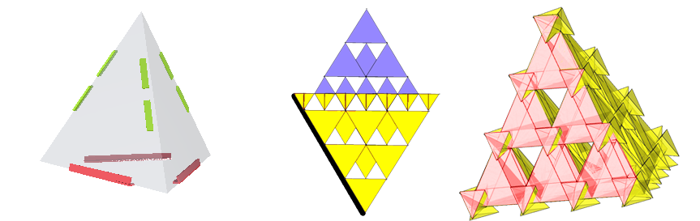

- All the yin lines extending from the base to create the integrating 4^th^ point, or *white dot*, at the top .
- There are 4 trigrams created in this 2D tholon defined by the edges; lower right (2,4,1), center (4,5,6), lower left (3,6,2), and top (1,3,5). These creates the 4 sides of the tetrahedron.  These 4 sides naturally define 4 trigrams,  (4),  (2),  (1), and  (7), respectfully.  Notice how the first three shows have yangs in the 1^st^, 2^nd^ and 3^rd^ position, and the 4^th^ trigram has yangs in all 3 positions, in other words, the first 3 equal the 4^th^ as $4+2+1=7$. The values of these trigrams are the VI values, *values of instantiation*.   However, if we look at their OI values as well, we see that 2 of these trigrams are the only 2 trigrams that have the same OI and VI values, those being (2) and  (7). The other 2 trigrams,  (4) and  (1), also happen to be the mirror versions of each other. If we look at the OI/VI Chart above, we'll see that these 4 pairs define each of the 3 axis required to create a tholonic trigram.  Thois alone is intersting, but even more so how these three OI/VI pairs, 1-4, 2-2, 7-7, also implicitly define all trigrams.

  In the image below, left, we show these 4 relationships. In the middle, we visually show the relationship between all the OI and VI numbers. The connections that are grayed out are those where there is a one-to-many relationship, while the bold lines are one-to-one, and of these 4 one-to-one relationships, if you look back at the OI/VI Chart, the 4(1) and the 3(5) merge together at the A~011~/A~100~ point, and the only point where any merging occurs. This is significant because we can then represent all 4 hexagrams and 3 axis with only three OI/VI pairs, 1-4, 2-2, and 7-7, and these happen to be the three pairs defined by the tetrahedron when mapped to the I-Ching. Notice in the center image how these 3 pairs are also the one-to-one lines.  The image on the right is there to clear up any confusion about why sometimes count the positions *continuously*, and sometimes we count then *split*.  This chart shows there is really no difference between either model other then in the way we relate the pairs; *continuous* pairs are added to always arrive as the value of 7, and *split* pairs are subtracted to always arrive as the (absolute) value of 4. 

  Of course, with these 4 trigrams we also have their 4 opposites to create the 8 trigrams of the I-Ching.  This is how the tholon defines all 8 trigrams.

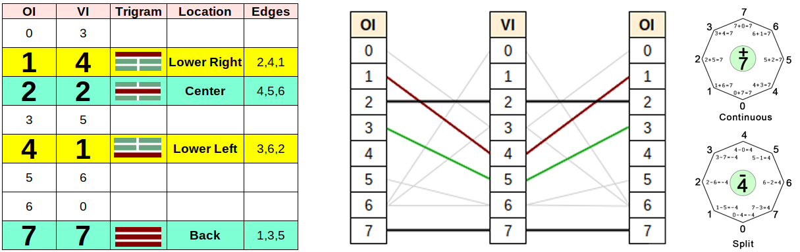

The reader may notice that it looks like we are cheating a bit here, because according to the tholonic pattern, the 4 and the 6 should be reversed, but here we are deliberately reversing the count direction of the inner triangle in accordance with the pairing requirements of the binary model (all opposites add to 7).  These values then are those that apply to the binary mode and not the same as those that apply to the tholonic model, even though they are in a tholonic context, but referring to the *continuous/split* image above, were they in the order of the tholon, the opposites would always equal 3 when subtracted.  Again, we have that 7/3 pattern appearing.

## The Origin of Trigrams

We have yet to look closely at how a trigram evolves from nothing.  Below is a binary tree that begins with a point of unity that divides itself into two states, 0 and 1. This establishes the most fundamental concept of yin and yang. This is then followed by each of those children doing the same by creating their own two children of 0 and 1.  We can see that there are now 4 children, each defined by the parent&rsquo;s fundamental yin or yang, and then adding to that the yin or yang of the child. These 4 children have the values 0, 2, 1, and 3, as shown by the bigrams.  This is done one more time to create the final branch of 8 children, each with a value determined by adding their yin or yang value to the bigrams passed down by the parents. Now we have 8 trigrams or 0, 4, 2, 3, 1, 5, 3, and 7.  Unfortunately, this order seems to lack any symmetry or pattern that is compatible with our model, suggesting it is incorrect.  However, if we flip the tree upside down, like a mirror image, the order immediately appears!  This is important when we are adding lines, because if we start with and add a , you might expect we get a , but as we will need to flip it to maintain the "mirrored" order, we will actually get a .  


Now we can see the first order of [01], the 2^nd^ order of [0123] and the final and 3^rd^ order of [01234567].

This little example has tremendous philosophical implications, as the I-Ching is suggesting that the order of our world is one of bottom-up, not top-down. The top-down order is a mirror image of the bottom-up order and visa versa, and the top-down order, while being a perfect mirror of the bottom-up order, makes no sense to our bottom-up sense of order. 

Now that we have our model in order, we can see if our trigrams fit into it in any way that makes sense. We do this simply by assigning the names of the trigrams that have the same values, while also assigning the first two branches of 0 and 1 to be that of the two branches of the tholonic trigram, like thus:  

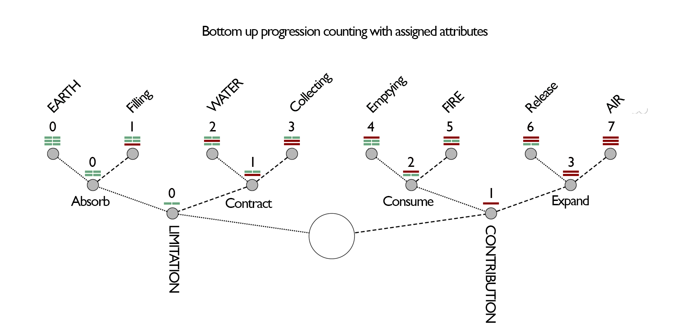

Notice how every cardinal or stable element (   ) is a yang child that descends from the first yang instance of *Contribution*. and every dynamic or unstable element (   ) is a yin child that descends form the first yin instance of Definition. 

We may run into a problem of semantics and context using the words *Definition* and *Contribution* in this binary framework. The words yin and yang seem to fit much better, but it is difficult to say *Definition* is yin and *Contribution* is yang, as both can be both depending on the context. For now, we will say *Definition* is yin in the way that it limits the expression, and *Contribution* is yang in the way that is it returning some creation back to the parent. In this way it is compatible with existing concept of duality.

The problems of the semantics of duality have been around a long time, so we will defer to the wisdom of those that wrestled with this problem form the past. 

- The two faces of *Shakti*; *Sambhuthi* (that which is manifested, yang, contributing) and *Asambhuti* (that which is not manifested, yin, defining/limiting).
- The Zoroastrian&rsquo;s *Ahura Mazda* (eternal spirit of creation, yang, contributing) and *Angra Mainyu* (spirit of destruction, yin, defining/limiting).
- The Persian *Manichaeism*, where the first creation was that of the World of Light, &ldquo;good,&rdquo;ruled by the *Father of Greatness* (yang, contributing) and the the *World of Darkness*, &ldquo;evil,&rdquo;ruled by the *King of Darkness* (yin, defining/limiting). 
- Modern science, where we have the minuscule negatively charged electron (1/1836 the mass of a proton, yin, defining) and the larger, positively charged proton that holds everything together (yang, contributing). 

There are countless examples, but here we would like to stay away from religious concepts, so we will refer to the primal binary as simply the *Defining Yin* and the *Contributing Yang*. Perhaps the *Defining Yin* can also be considered *order*, or the movement of chaos to order, coming into form, creation, explicity, and the *Contributing Yang* can be considered *chaos*, or the movement of order to chaos, dissolution of form, implicity, return to the source.

We can see that every bigram creates two trigram children, and this pair of trigrams is always made up of one a cardinal element and one in a dynamic element. This suggests that the parent is both a state (cardinal/stable) and an energy (dynamic/unstable) combined Both of these qualities exist in the bigram but can only find separation in the (trigram) children. We can also see that the nature of the energy is compatible with the nature of state. Here we have a bit of a challenge, because we do not have common words that describe a state and a movement. Computer programming languages do have such a concept.  It is called a &ldquo;class,&rdquo;and a class contains both static information and the dynamic code that can act on that information. We will have to make do with some borrowed and creative nouns and verbs.

For example, what can we call the parent that has the combined of a state of EARTH and an energy of *Filling*? It would have to be some quality that is common to both of these things. I have chosen the word &ldquo;**Absorb**,&rdquo;because the act of absorbing is the process of *Filling* (of the absorptive material), and the element of EARTH, being the perfect yin of 0, can only absorb and be filled. Readers my find better words or concepts to describe these pairs. Think of the ones used here as suggestions.

&ldquo;**Contract**&rdquo;is used to describe the nature of WATER, because water, which always travels the path of least resistance, will always pool, *Collecting* at the lowest point. Of course, all energy travels the path of least resistance, but WATER is meant to describe that property, not just H^2^0, so we can say that all energy has the property of WATER. 

&ldquo;**Consume**&rdquo;describes the nature of FIRE, as it consumes, or uses up or *empties* its fuel. This is almost the textbook definition of *Emptying*.

&ldquo;**Expand**&rdquo;describes the nature of AIR, as it will expand into every place of existence to the edge of the universe. AIR here does not simply mean the air we breath, but refers more to the space that exists between all things, be they atoms or planets. If one considered the expanding universe as a function of AIR, which was itself a function of the Big Bang, the verb of *Release* fits nicely.  From this perspective, AIR might also be the element of dark matter.

Here are the properties of the 4 bigrams:

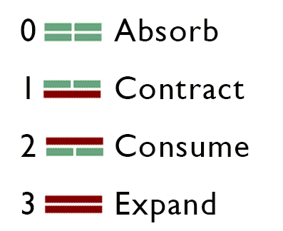

Let&rsquo;s recap how we are describing the elements and processes of the eight trigrams.

We have arrived at the first pair, the original 0 and 1, the parents of all things, which, according to the tholonic model, have the two attributes of the primal yin as DEFINITION and the primal yang as CONTRIBUTION. Here, DEFINITION refers to the limits that everything that exists must exist within. These are defined by the laws of physics and nature, the environment, the available resources, the integration with other processes, and, of course, the limitation and definition of form itself with it&rsquo;s three dimensions. CONTRIBUTION refers to what the creation in questions returns to the source from which it came. Various models imply various ways to understand the purpose of existence. The tholonic model seems to be suggesting that the purpose of existence, and of life, is to be able to contribute back to the parent, the source, from which all creation sprung.

Here is an alternative way of looking at this model. Notice how all the horizontal pairs of pink dots equal 7, and all the pairs of orange dots equals 3, and how descriptions are opposite in nature for every pair.

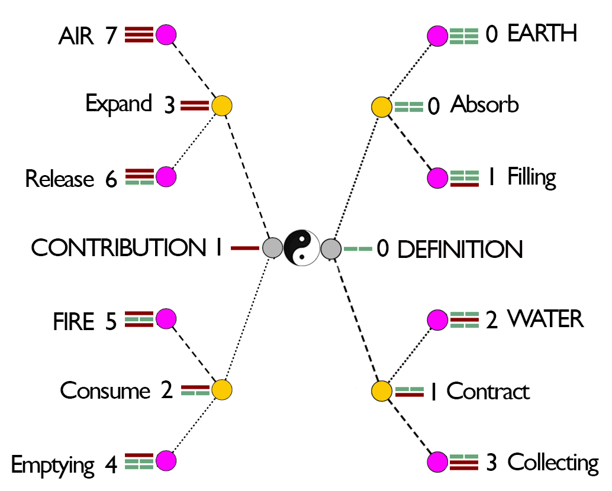

With the introduction of bigrams, let&rsquo;s look at the order of the trigrams again.

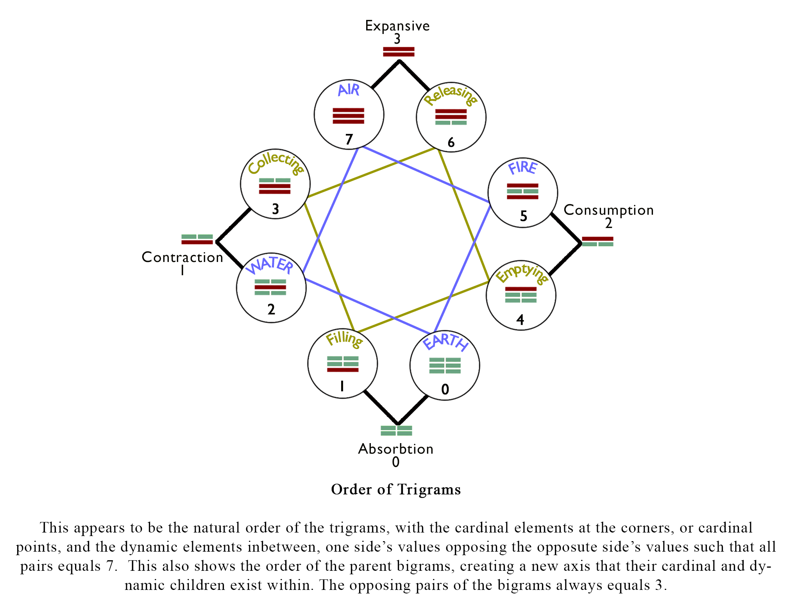

The chart below shows the two dimension of the bigram as described by their children. The cardinal elements are across the top, and the dynamic properties down the side. Using what we know about the trigrams we can deduce the nature of the bigrams.

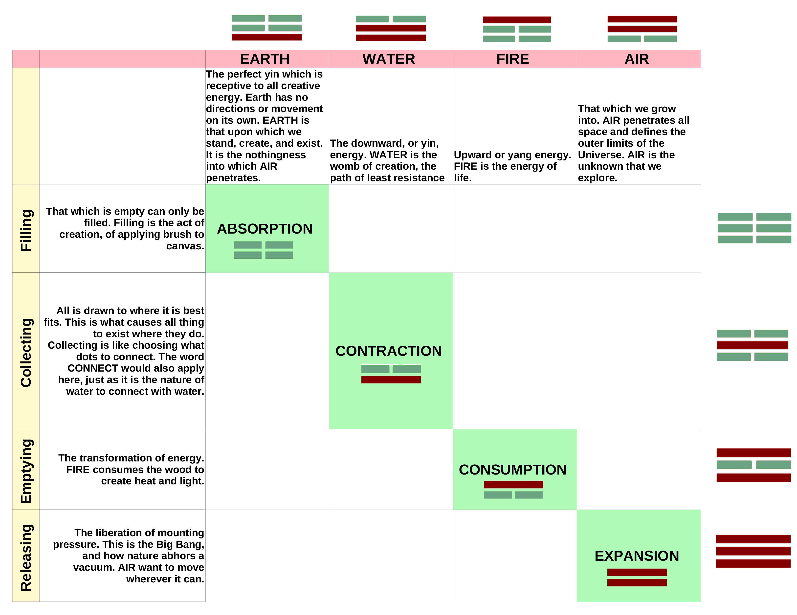

While there may be many ways to create order of the trigrams, the tholonic model continually re-validates itself every time we look at it from a different perspective. How, then, do these trigrams relate to a tholon?  If we mapped the binary to the tholon, the relationship is obvious and powerful, as shown in the graphic below.

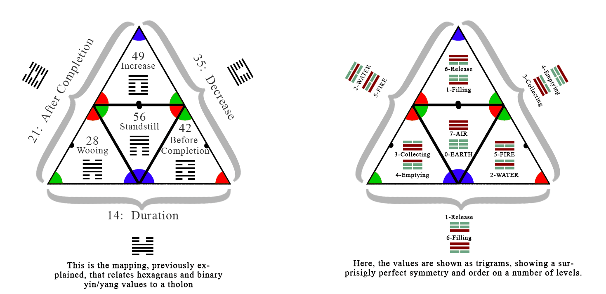

Here are some of the points spelled out: 

- The same two I-Ching trigrams of 1 and 6 exist in both the parent tholonic trigram and the across the spectrum of instantiations. In the parent the trigrams are arranged as *inner filling* and *outer release* to create hexagram (binary) 49 (traditional 42) of **Increase**, wherein it states: 

  > Sacrifice on the part of those above for the increase of those below

  Across the spectrum they are arranged as *inner release* and *outer filling* to creates the hexagram (binary) 14 (traditional 32) of **Duration**, wherein is states:

  >  Duration is rather the self-contained and therefore self-renewing movement of an organized, firmly integrated whole, taking place in accordance with immutable laws and beginning anew at every ending.

- Every corner trigram value (28, 42, 49, or 7$\times$ 4, 6, 7) which is yang in nature, is reversed on its opposite edge (35, 21, 14, or 7$\times$5, 3, 2), which are yin in nature. 

- The two extremes, 7 and 0, are in the center as **Standstill** of AIR and EARTH. This would appear to be a good candidate for the base of the tetrahedron, but as have seen, it is is the top trigram **Increase** and the unending cycles of *Filling* and *Releasing* that seems to be the foundation of existence.  This is confirmed the the fact that reversing the trigrams of **Increase** gives us **Duration**, which is the value of the child of this tholon.

- All hexagrams are made only of trigram pairs that equal 7.

- The lower I-Ching trigrams of both the tholonic trigrams and the edges are 1, 2, 4, in clockwise-ascending order, and the same upper I-Ching trigrams are 6, 5, 3 in clockwise-descending order.

- The only point where all the elements (FIRE, WATER, AIR, EARTH) meet is along the side mapped to hexagram (binary) 42 (traditional 64) **Before Completion**, which is the archetypal hexagram for the entire I-Ching. The other two hexagrams along this axis are 

  **Increase** (b49, t42), wherein it states: 

  > Sacrifice on the part of those above for the increase of those below.

  **Wooing** (b28, t31):

  > … their powers attract each other so that they unite.

Examining the I Ching from a tholonic perspective shines a light on new patterns and relationships within the I-Ching that exist in nature, reality, energy, science, etc., above and beyond what it already demonstrates in it&rsquo;s binary model.

This, however, brings up an overlooked pattern.  We showed before how descension from the primal 0 and 1 created the super-classes or *Absorption*, *Contraction*, *Consumption*, and *Expansion*, and from each of these came pairs of 0 and 1, 2 and 3, 4 and 5, and 6 and 7.  When we lay these out as we have above, another super-class emerges, which is that of the opposites.  For example, EARTH (0) and AIR (7) are one of the pairs that add up to 7, but these attributes share a common significance in that together they define the lowest place and the highest place, which essentially describes the limits of the third dimension of our space (as 2D space has no height).  Below is a graphic that shows these pairs and their (proposed) super-class of significance. The last column, &ldquo;Example Instance&rdquo;uses the instance of electricity to show how theses four basic qualities can instantiate in various ways. Chapter 4 of *Tholonia* covers a number of other instances.

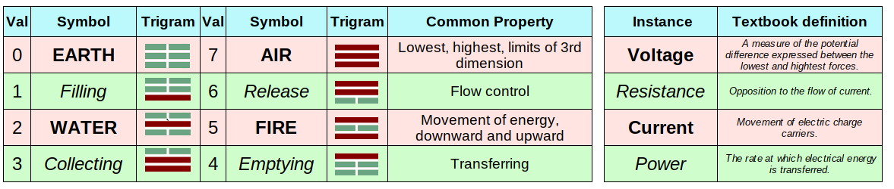

I won&rsquo;t torture the reader by applying Ohm&rsquo;s Law on the I-Ching, but it&rsquo;s there.

## Astrology

The fundamental structure that the I-Ching and related Eastern thinking is built on what is essentially the same as the model for astrology and related Western thinking.  This is not at all surprising as both cultures were observing the same laws and patterns in action.  However, if we find where they combine and overlap, we can understand one model that encompasses both.

In astrology, each sign is assigned a element property of FIRE, EARTH, AIR or WATER, and a characteristic of Cardinal, Fixed, or Mutable.  We can easily map the binary and tholonic attributes to these properties, and when we do, we see binary and tholonic patterns appearing in astrological models.

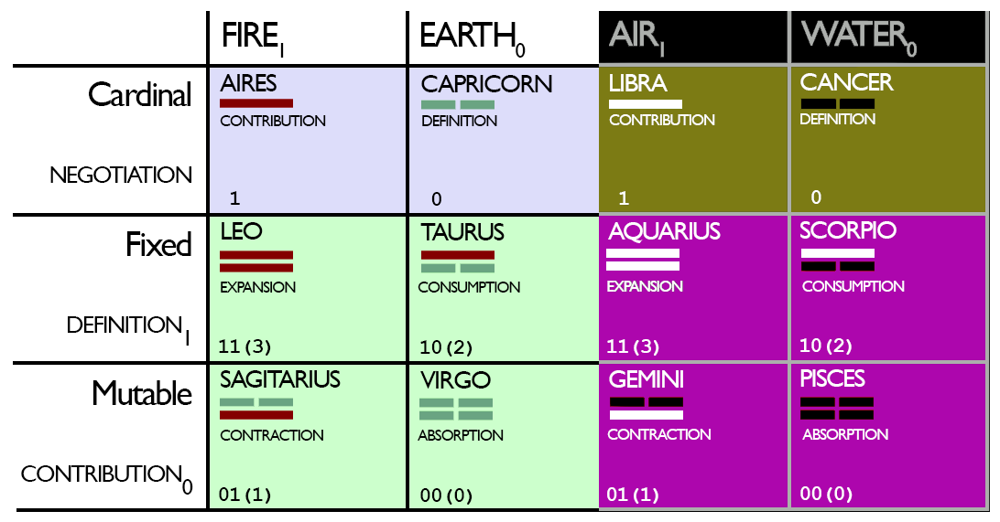

In the above chart, we assign the same yin/yang values for the elements and tholonic descriptions as we have been using all along. NEGOTIATION has no value (because it is both values combined). In the lower left of each cell is the binary value (and the decimal equivalent) of the the column and row. What we see is on the left we have 6 cells made up of 2 primary lines, and 4 cells made up of bigrams. The right is the reflected equivalent, which is consistent with the scheme of duality which exists in both models. 

We have to decide in what order the binary values should be assigned, i.e. EARTH-DEFINITION is 10, but DEFINITION-EARTH is 01, yet both apply to the same cell. How do we choose the order? The first thing to understand is that either order is correct, as they are two different perspectives of the same thing.  In our case, we want to select the order that displays the most symmetry and coherence. 

If we map this to the tholon, we should expect to see some significant relationships.  Below we show both options using their numerical values. The one on the right definitely has more symmetry; all cross-cell additions equal 3 and column and row totals equal 7. These are exactly the same values we see when we added up the horizontal pairs of pink dots (7) and orange dots (3) in the binary tree that described how we arrived at the trigrams. 7 and 3 seem to be significant numbers in our model as they naturally keep reappearing.

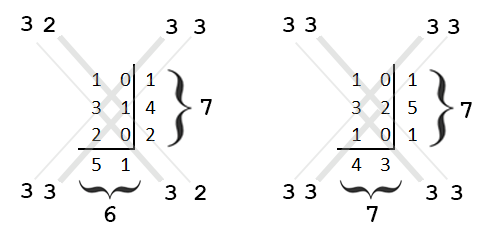

What validates this order, among other things, is how the resulting bigrams so closely describe the qualities of the signs when we apply the values.

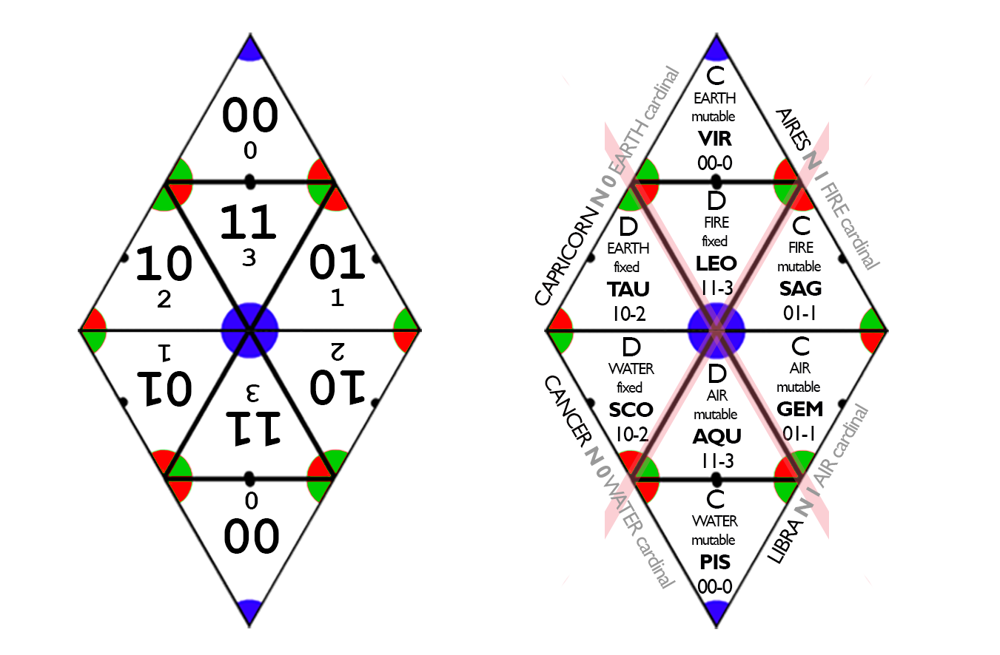

Using the values we determined in the chart above, we apply the sign&rsquo;s bigram to the tholon. The cardinal signs, which only have one line and are all the NEGOTIATION signs, neatly fit perfectly. For example, the left side of the upper tholon is made up of EARTH-FIRE-EARTH, and the cardinal EARTH sing is Capricorn. Additionally, the diagonal axis that crosses this side is the boundary between Leo and Taurus which are equidistant to the Capricorn cusp. This is the pattern we see for all four quadrants. Also significant is that the NEGOTIATION signs, which are those of the N-state and capable of creating new children, not only form the outer boundary, but all non-N signs converge to the tholonic N-cluster in the middle of the resulting hexagrams, creating the central N-state.

An historically interesting observation is the two center triangles that meet are Leo and Aquarius.  Looking at a zodiac, this would appear to be &ldquo;off&rdquo;, for why would such a critically significant intersection appear so asymmetrical?  This suggests that the original creators of the zodiac were well aware of this significance,  as it was this same axis that defined the planetary assignments back in the day when there were only, and conveniently, six planets. Perhaps they designed it this way to ensure that planet earth would be exactly where the perpendicular axis would be, between Venus and Mars, placing earth in the center. Even though astrology dates back to 2000 BC, given that Saturn and Jupiter weren&rsquo;t discovered until 1610, presumably this assignment came about in the 17^th^ century. In any case, it was pretty clever.

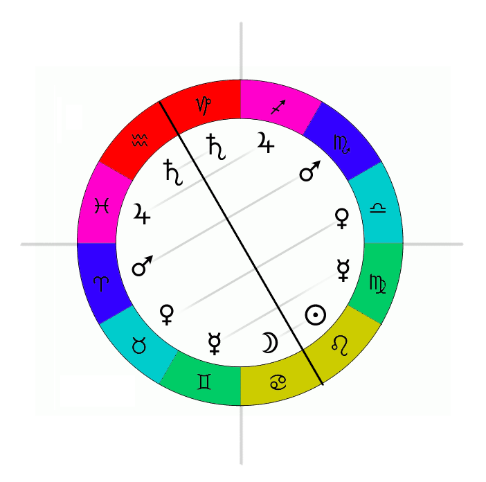

One minor difference between the western and eastern models is that while they both reflect and invert to create the complete picture, they do it a little differently, which make a perfect mapping impossible with the existing models. Here is a larger scale of one type of iteration.  Looking at the monogram and bigram numbers of the signs as they progress there does not seem to be much of a pattern; 1, 2, 1, 0, 3, 0, 1, 2, 1, 0, 3, 0.

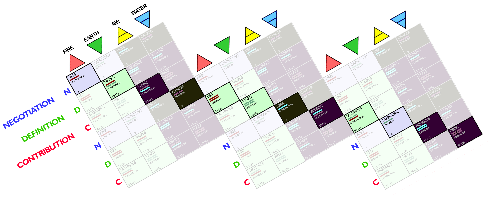

However, if we arrange them in a circle, and color them to represent the *Negotiation*, *Define*, *Contribute* elements, the tholonic and binary information becomes quite clear.

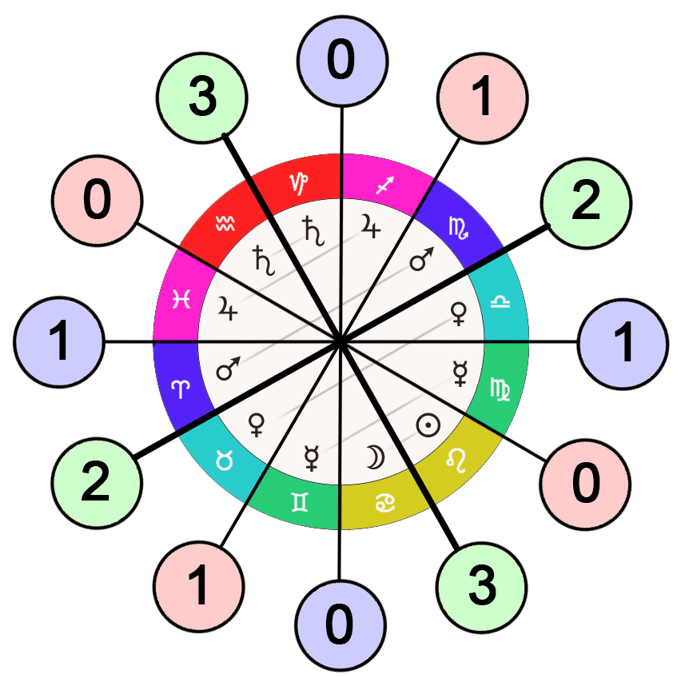

- All values are equal to their opposite.

- The single NEGOTIATION (blue) points, which represent the point form which new children can be produced, are 1 and 0 .

- But there is another set of 1 and 0 which are made of the bigrams , and these are represent the CONTRIBUTE (red) points, which are the points that return to the N-state, so 1s and 0s leave the N-state as single line of 0 or 1, yin or yang, but return to the N-state as a bigram also of 0 or 1, yin or yang.

- The 2s and 3s occupy the DEFINING (green) points and only appear once, unlike the 1/0s.  3 represents the most energized, or extreme yang state, and is that same axis that divides the planets in the traditional astrological layout.

## The Lines, Part 1

There is another reason why we bring up astrology, and that is because, as we can see in the number wheel above and the tholon model, it is based on six pairs of attributes that define and describe a complete journey through the cycle, and which happen to map neatly onto the six lines of change in the I-Ching.  If we apply the rules of the tholonic, I Ching and binary models to astrology, we get the chart shown below.

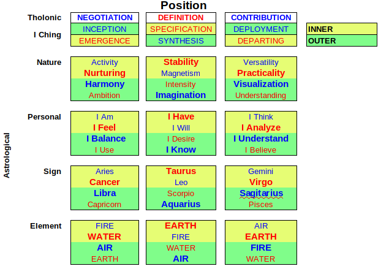

It works like this… All blue characters are YANG in nature, and all red are YIN. All yellow backgrounds are INNER in nature, and all green backgrounds are OUTER. We can see that for a specific context each tholonic property has four states, for example, NEGOTIATION in the context of NATURE can be *Active, Nurturing, Harmonious* or *Ambitious*. These states represent the INNER-YANG, INNER-YIN, OUTER-YANG, and OUTER-YIN. Of these four states, the default INNER-YIN is Nurturing, and the default OUTER-YANG is Harmony. These are default because they are the states most archetypal, or conducive. to their context for a given property.

Here is how we want to look at this graph as it applies to the hexagram. 

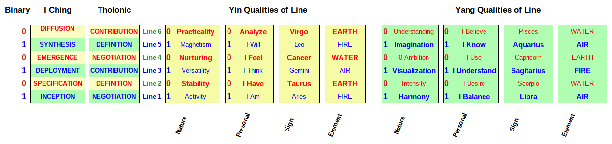

To validate this we can look at a few details.

- The progression of the *Nature* column fits perfectly (in my humble opinion) for both the inner (yellow) and outer (green) definitions.
  - INCEPTION requires Harmony.
  - SPECIFICATIONS must be consistent.
  - DEPLOYMENT requires knowing what and where something will be deployed.
  - EMERGENCE requires Nurturing, for it is fraught with challenges and demands.
  - SYNTHESIS requires the creation is useful.
  - DIFFUSION is the ultimate Practicality, as returning to the source is not only the end of the cycle, but the absolutely one thing nothing that exists can escape.

Let&rsquo;s make this even simpler to illustrate another point.

 

Looking at the 0/1 value of the yin/yang quality of the lines and properties, you can see the yin (0) values that exist within the yellow/yin side are the values that are the natural archetypes for that place. The same it true for the 1 values inside the green/yang side. Hexagram 21 (binary value) is the hexagram where every yin line exists in a yin place, and every yang line exists in a yang place.  Hex 21 is the ideal archetype of a hexagram, and its opposite, hex 42, is the reverse, or inverted, or &ldquo;negative image&rdquo;archetype.   If we were to apply the above charts to hex 21 and 42 using the values from the *Nature* and *Personal* columns, we would get the following.

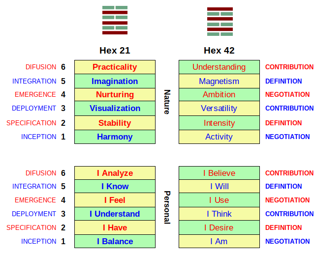

This shows that, according to the tholonic model using traditionally Western values, the archetype of INCEPTION is *Harmony*, and it inverted concept, *Activity*. Likewise, on a more individual, subjective front, the archetype of INCEPTION is *I Balance*, and it inverted concept, *I Am*. Looking at all the pairs we see the same well-matched dualities. 

There is still one last step, and that is to reduce the twelve pairs down to six pairs. This is fairly easy, and it looks something like the left image in the graph below. We have added the blue text circle to describe the qualities of the pair of the previously opposing six pairs, or twelve attributes, of Western astrology. It obvious how these six *uber* attributes match well with the pink circle that lists the I Ching&rsquo;s attributes for the six lines 

On the right is the previous graph that describe the eight trigrams.  Here we have together the model for trigrams and the model for the lines. The lines model (left) is based on the *tholonic tree*, where we begin with 1, which creates 2 more, which is mirrored, creating 6, and then inverted, which creates 12.  The trigram model (right) is a *binary tree*, beginning with 1, which creates 2, each of which creates 2 (4) each of which creates 2 (8). 

Both of these models describe only the structure, the contexts of which is constantly changing.

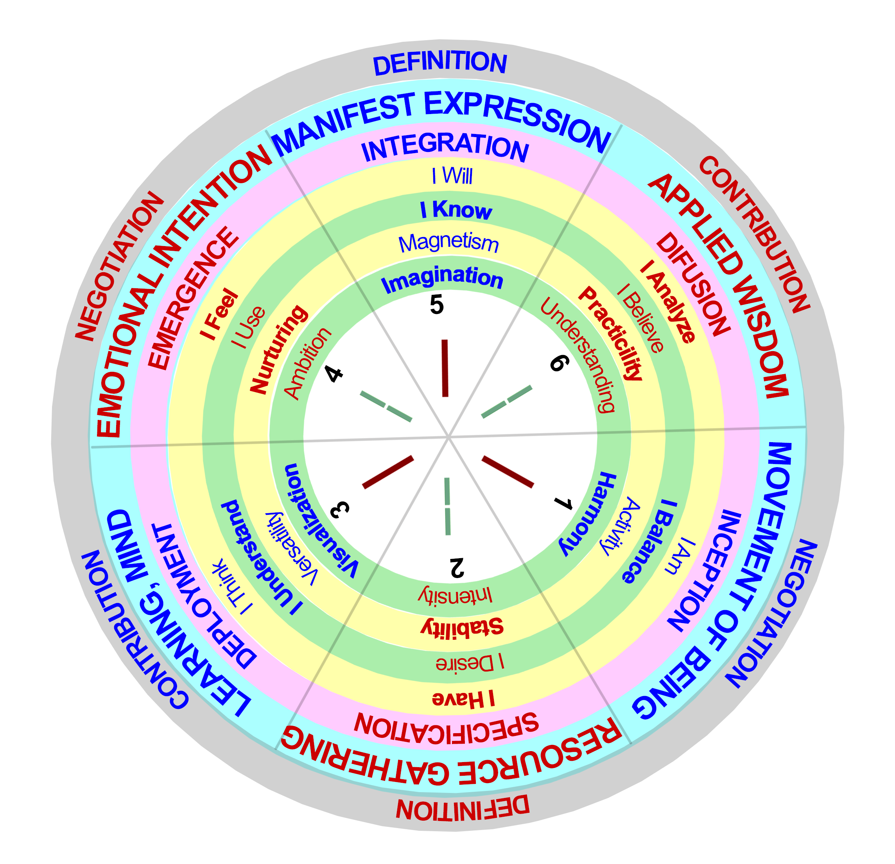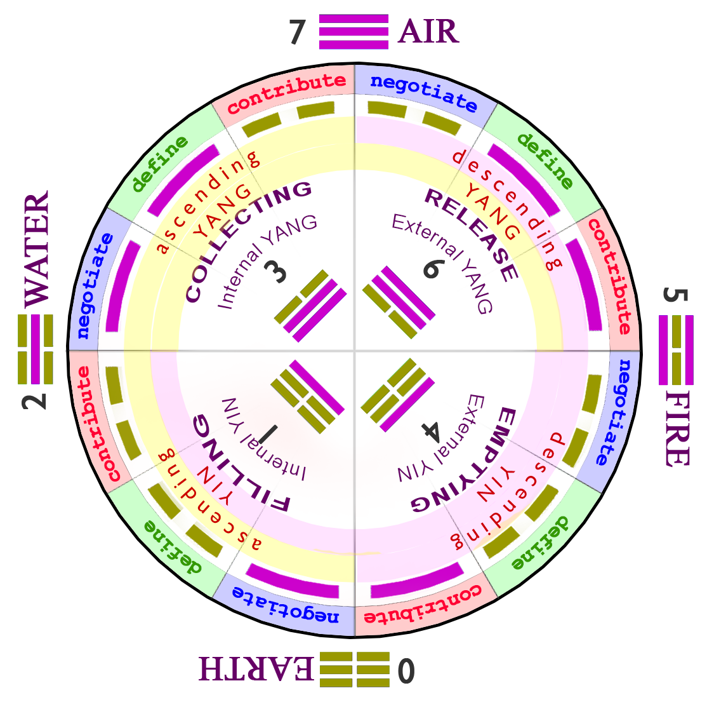

With all that we have learned so far, let&rsquo;s attempt to decipher and translate the I-Ching.

# PART II

# The Way of Change 

###### In interpretation of the tholonic model in the style of the I Ching

## Coming Soon&hellip;

# The End

[^1]: Gleick, J. (1998). **Making a New Science**.

[^2]: &ldquo;**The Beginning of Time**.&rdquo; Stephen Hawking, <https://www.hawking.org.uk/the-beginning-of-time.html>.

[^3]: For math nerds, here is an excellent vlog on **&ldquo;The Opposite of Infinity&rdquo;**: on <http://www.quora.com> &ldquo;How do you understand the difference between something infinitely small and something inexistant Are they distinguishable in real terms?

[^4]: <https://users.isy.liu.se/jalar/kurser/QF/assignments/LeggettGarg1985.pdf>

[^5]: Boeyens JCA, Thackeray JF **Number theory and the unity of science**. S Afr J Sci. 2014;110(11/12), Art.\#a0084, 2 pages. <http://dx.doi.org/10.1590/sajs.2014/a0084>

[^6]: Brown, J. H., Gupta, V. K., Li, B., Milne, B. T., Restrepo, C., & West, G. B. (2002**). **The fractal nature of nature: Power laws, ecological complexity and biodiversity**. London: The Royal Society <http://www.fractal.org/Bewustzijns-Besturings-Model/Fractal-Nature.pdf>

[^7]: Here is the video of this experiment: <https://www.youtube.com/watch?v=UpJ-kGII074>

[^8]: Here are a couple of sites that show a harmonograph in action. They are fascinating to watch. <http://andygiger.com/science/harmonograph/index.html>, <https://www.youtube.com/watch?v=HJYvc-ISrf8>

[^9]: Yee, Jeff. (2019). **The Relation of Ohm&rsquo;s Law to Newton&rsquo;s 2nd Law**. 10.13140/RG.2.2.15576.75523. Ohm&rsquo;s law relates voltage, current and resistance in electrical systems as V=IR. Newton&rsquo;s 2nd law relates force, mass and acceleration as F=ma. Although electrical and mechanical systems are supported by different equations to describe these relationships today, it will be shown that the laws of Ohm and Newton are related and are built from the same foundation that governs the force of particles and all of matter.

[^10]: <https://en.wikipedia.org/wiki/International_System_of_Units>

[^11]: Oldershaw, R. L. (1989). **Self-Similar Cosmological model: Introduction and empirical tests**. International Journal of Theoretical Physics, 28(6), 669-694. doi:10.1007/bf00669984 <https://www.academia.edu/26520933/Self-Similar_Cosmological_model_Introduction_and_empirical_tests>

[^12]: You can find many examples of this self-similarity <http://www.bordalierinstitute.com/>

[^13]: <https://www.sciencealert.com/scientists-have-found-a-structural-similarity-between-human-cells-and-neutron-stars>

[^14]: van Leunen, Hans. (2018). **The structure of physical reality**, <https://www.researchgate.net/publication/327273285_The_structure_of_physical_reality>

[^15]: Leunen, J. J. (2018). **Structure of physical reality**. <http://vixra.org/pdf/1806.0087v3.pdf>. Here is the entire report <http://www3.amherst.edu/~rloldershaw/OBS.HTM>

[^16]: Livio, M. (n.d.). **Why Math Works**. <https://www.scientificamerican.com/article/why-math-works/>

[^17]: Britannica, T. E. (2019, April 08). **Laws of thought**. <https://www.britannica.com/topic/laws-of-thought>

[^18]: **15** **Insane Things That Correlate With Each Other**. (n.d.). <http://www.tylervigen.com/spurious-correlations>

[^19]: Abreu, N. (n.d**.). Methodology for Investigating the Hypothesis of Anomalous Remote Perceptions as Objective Phenomena.** <http://cref.tripod.com/tucsonpaper.htm> Science of Self Club, University of Florida

[^20]: <https://www.infinitemonkeylab.com/>

[^21]: Jaynes, Julian (2000) \[1976\]. **The origin of consciousness in the breakdown of the bicameral mind** (PDF). Houghton Mifflin. p.73.ISBN 978-0-618-05707-8.

[^22]: Fast-moving air is at a lower pressure than slow-moving air, so the pressure above the wing is lower than the pressure below, and this creates the lift that powers the plane upward.

[^23]: Fiegna and Velicer, 2003

[^24]: Rankin and Kokko, 2006; Muir and Howard, 1999

[^25]: Rainey, Paul B. **&ldquo;Precarious Development: The Uncertain Social Life of Cellular Slime Molds.&rdquo;** Proceedings of the National Academy of Sciences, vol. 112, no. 9, 2015, pp. 2639-2640., doi:10.1073/pnas.1500708112. <https://www.pnas.org/content/pnas/112/9/2639.full.pdf>

[^26]: De Roode et al., 2005

[^27]: Gersani et al., 2001

[^28]: Ahmed Ibrahim, **&ldquo;Invasive cancer as an empirical example of evolutionary suicide&rdquo;**, Network Biology, 06/2014, v. 4 2

[^29]: **The Simulation Hypothesis Documentary**. (2018, August 01). <https://youtu.be/pznWo8f020I>

[^30]: Klein, Christopher. &ldquo;**DNA Study Finds Aboriginal Australians World&rsquo;s Oldest Civilization.**&rdquo; History.com, A&E Television Networks, 23 Sept. 2016, <https://www.history.com/news/dna-study-finds-aboriginal-australians-worlds-oldest-civilization>

[^31]: Parvinen, Kalle, and Ulf Dieckmann. **&ldquo;Environmental Dimensionality&rdquo;**. *Journal of Theoretical Biology*, 2018, doi: 10.1016/j.jtbi.2018.03.008. <https://www.ncbi.nlm.nih.gov/pubmed/29551543>

[^32]: **List of cycles**. (2019, April 27). <https://en.wikipedia.org/wiki/List_of_cycles>

[^33]: Hossenfelder, Sabine. &ldquo;**Dear Dr B: Does the LHC Collide Protons at Twice the Speed of Light?&rdquo;** Backreaction, 1 Jan. 1970, backreaction. <https://blogspot.com/2019/04/dear-dr-b-does-lhc-collide-protons-at.html>

[^34]: Laszlo, E., & Clark, J. W. (1973). **Introduction to systems philosophy: Toward a new paradigm of contemporary thought**. New York, NY: Harper Torchbooks. ISBN: 0061317624 (ISBN13: 9780061317620)

[^35]: Dawkins, C. R. (2016). **The selfish gene**. Oxford: Oxford University Press.

[^36]: **Just for Hits - Richard Dawkins**. (2013, June 22). <https://youtu.be/GFn-ixX9edg>The first 4 minutes is an excellent overview of memes by Dawkins. The following 4 minutes is a sort of meme-ish music video which is a bit odd, but also a bit entertaining

[^37]: Velikovsky, J. T. (1970, January 01). **Flow Theory, Evolution & Creativity: Or, Fun & Games ** <https://dl.acm.org/citation.cfm?id=2677770>

[^38]: &ldquo;**Quantum Gravity Research**.&rdquo; Quantum Gravity Research, <https://www.quantumgravityresearch.org/>.

[^39]: Smith, F. D. (n.d.). **E8 Root Vectors from 8D to 3D** - Valdosta, Georgia. <http://www.valdostamuseum.com/hamsmith/E8to4Dand3D.pdf>

[^40]: What **is Reality? Emergence Theory Tries to Explain**. (2017, March 11). <http://www.deepstuff.org/what-is-reality-emergence-theory-tries-to-explain/>

[^41]: Jgmoxness. (n.d.). **Visualizing a Theory of Everything**! <http://theoryofeverything.org/theToE/tags/e8/>

[^42]: **Gottfried Wilhelm Leibniz**. (n.d.). <http://www.wikiwand.com/en/Gottfried_Wilhelm_Leibniz>**, Leibniz and the I Ching**. (n.d.). <http://www.wikiwand.com/en/Binary_number#/Leibniz_and_the_I_Ching>

[^43]: **Gottfried Leibniz**. (n.d.). Retrieved from <http://history-computer.com/Dreamers/Leibniz.html>

[^44]: Abrantes, R. (2018, November 19). **How Wolves Change Rivers** \| Ethology Institute \| Read and Watch Now. Retrieved from <https://ethology.eu/how-wolves-change-rivers/>

[^45]: Grzegorz Rozenberg and Arto Salomaa. **The mathematical theory of L systems** (Academic Press, New York, 1980). ISBN 0-12-597140-0

[^46]: Quijada, John. **A Grammar of the Ithkuil Language**. John Quijada, 2011.

[^47]: Speaks, Jeff. **&ldquo;Theories of Meaning&rdquo;**. Stanford Encyclopedia of Philosophy, Stanford University, 27 June 2019,<https://plato.stanford.edu/entries/meaning/>

[^48]: Example of a &ldquo;person&rdquo; as defined by the semantic web: <http://xmlns.com/foaf/spec/#term_Person>

[^49]: McCrae, J. P. (n.d.). **The Linked Open Data Cloud**. <https://www.lod-cloud.net/>

[^50]: Wang, Y., & Kosinski, M. (in press). **&ldquo;Deep neural networks are more accurate than humans at detecting sexual orientation from facial images&rdquo;**. Journal of Personality and Social Psychology; Newspaper article on this research: Levin, Sam. **&ldquo;New AI Can Work out Whether You&rsquo;re Gay or Straight from a Photograph.&rdquo;** The Guardian, Guardian News and Media, 7 Sept. 2017, <http://www.theguardian.com/technology/2017/sep/07/new-artificial-intelligence-can-tell-whether-youre-gay-or-straight-from-a-photograph>

[^51]: &ldquo;**Reciprocal Theory**&rdquo; RationalWiki, <https://rationalwiki.org/wiki/Reciprocal_Theory>.

[^52]: Fuller, R. Buckminster, and E. J. Applewhite. ***Synergetics. Explorations in the Geometry of Thinking***. Macmillan, 1975.The entire book can be found online at <http://synergetics.info/>

[^53]: References to the above come from <http://synergetics.info/s02/p0000.html>

[^54]: <http://hexagonalwater.com>

[^55]: Ptok, Fabian, &ldquo;**Alternative Irrigation Methods: Structured Water in the context of a Growing Global Food Crisis due to Water Shortages**&rdquo; (2014). Undergraduate Honors Theses. 182. <https://scholar.colorado.edu/honr_theses/182>

[^56]: Fonseca, Giuseppe, and Giuseppe Fonseca. &ldquo;**Dr Pollack The Fourth Phase of Water.**&rdquo; Academia.edu, <https://www.academia.edu/18516517/Dr_Pollack_The_Fourth_Phase_Of_Water>

[^57]: Chara, et al. &ldquo;**Crossover between Tetrahedral and Hexagonal Structures in Liquid Water.**&rdquo; Physics Letters A, <http://www.academia.edu/21730774>

[^58]: Seager, William, and Sean Allen-Hermanson. **&ldquo;Panpsychism.&rdquo;** Stanford Encyclopedia of Philosophy, Stanford University, 23 May 2001, <https://plato.stanford.edu/archives/win2012/entries/panpsychism/>

[^59]: Turow, J. (1991). **The Challenge of Inference in Interinstitutional Research on Mass Communication**. Communication Research,18(2),222-239. <https://doi.org/10.1177/009365091018002005>. *Note: Although this is not a reference to the official definition of the term &ldquo;interinsitutionality&rdquo;, which is too vague to be of any use here, it does provide an excellent explanation of what it is, how it works, and how it applies to mass communications.*

[^60]: Spottiswoode, C. N., K. S. Begg, and C. M. Begg. **&ldquo;Reciprocal Signaling in Honeyguide-human Mutualism&rdquo;.** Science 353, no. 6297 (2016): 387-89. doi:10.1126/science. aaf4885.

[^61]: Milius, Susan. &ldquo;**How Roaches Fight off Wasps That Turn Their Victims into Zombies.**&rdquo; Science News, 14 Nov. 2018, <https://www.sciencenews.org/article/how-roaches-fight-wasps-turn-their-victims-zombies>

[^62]: Media, T. E. (2015, June 02). Rupert Sheldrake, **Heretic**. <https://www.youtube.com/watch?v=ZSd4DA5xhHw>

[^63]: Sheldrake, Rupert. **A New Science of Life: The Hypothesis of Formative Causation**. Los Angeles: J.P. Tarcher, 1981.

[^64]: Horgan, J. (2014, July 14).**Scientific Heretic Rupert Sheldrake on Morphic Fields, Psychic Dogs and Other Mysteries.** <https://blogs.scientificamerican.com/cross-check/scientific-heretic-rupert-sheldrake-on-morphic-fields-psychic-dogs-and-other-mysteries/>

[^65]: Sheldrake, R. (n.d.).**Morphic Resonance and Morphic Fields - an Introduction**. <https://www.sheldrake.org/research/morphic-resonance/introduction>

[^66]: Sheldrake, R. (2013). **Dogs That Know When Their Owners Are Coming Home: And Other Unexplained Powers of Animals**. London: Cornerstone Digital.

[^67]: One of these experiments can be seen here: <http://www.sheldrake.org/videos/jaytee-a-dog-who-knew-when-his-owner-was-coming-home-the-orf-experiment>

[^68]: Iozzio, Corinne. &ldquo;**Scientists Prove That Telepathic Communication Is Within Reach.**&rdquo; Smithsonian.com, Smithsonian Institution, 2 Oct. 2014, <https://www.smithsonianmag.com/innovation/scientists-prove-that-telepathic-communication-is-within-reach-180952868/>

[^69]: Wilkins, & Sherman, H. M. (1971). ***Thoughts through space***. London: Muller.

[^70]: Sheldrake, R. (2013). **Science set free: 10 paths to new discovery.** New York: Deepak Chopra Books.

[^71]: Smolin, L. (2012, May 16). **Precedence and freedom in quantum physics**. <https://arxiv.org/abs/1205.3707>

[^72]: Lobach, E.; Bierman, D. (2004). &ldquo;**The Invisible Gaze: Three Attempts to Replicate Sheldrake&rsquo;s Staring Effects**&rdquo; . <https://www.parapsych.org/papers/07.pdf>

[^73]: <https://www.scientificamerican.com/article/what-causes-spooky-out-of-body-experiences/>

[^74]: <https://www.iacworld.org/evidence-for-out-of-body-experience-as-a-real-or-veridical-phenomenon/>

[^75]: The full account of his research and notes are reprinted at <http://www.aura-oasis.be/website/scientific-research-on-out-of-the-body-experiences/>

[^76]: Tressoldi, P. E., Storm, L., & Radin, D. (2010). **Extrasensory Perception and Quantum Models of Cognition, Neuro Quantology,** 8(4). doi:10.14704/nq.2010.8.4.353

[^77]: King, T. (2017, May 30). **Scientific Evidence of Telepathy - Documentary.** Retrieved from <https://www.youtube.com/watch?v=zZ4G3IRVFwU>

[^78]: **Astronaut Tells of E. S. P. Tests.** (1971, June 22). Retrieved from <https://www.nytimes.com/1971/06/22/archives/astronaut-tells-of-e-s-p-tests.html>

[^79]: **100 Scientific Papers Offering Evidence for Psi Phenomena & Effects**. (2019, April 22). <https://subtle.energy/list-100-peer-reviewed-papers-offer-scientific-evidence-psi-phenomena/>

[^80]: Luke, D. (2009, September). **Telepathine (ayahuasca) and psychic ability: Field research in South America**. <http://www.researchgate.net/publication/278301470>, British Psychological Society, Transpersonal Psychology Section 13th Annual Conference

[^81]: Cave, K. (2015, February 24). **The rise of &ldquo;Telepathic Tech&rdquo; in 2015**. Retrieved from <https://www.idgconnect.com/idgconnect/analysis-review/1023702/rise-telepathic-tech-2015>

[^82]: Grau, C., Ginhoux, R., Riera, A., Nguyen, T. L., Chauvat, H., Berg, M., &hellip; Ruffini, G. (n.d.). **Conscious Brain-to-Brain Communication in Humans Using Non-Invasive Technologies**. <https://journals.plos.org/plosone/article?id=10.1371/journal.pone.0105225>

[^83]: Heaven, D. (n.d.). **First mind-reading implant gives rats telepathic power**. Retrieved from <https://www.newscientist.com/article/dn23221-first-mind-reading-implant-gives-rats-telepathic-power/>

[^84]: Tucker, P. (2018, September 06). **it&rsquo;s Now Possible to Telepathically Communicate with a Drone Swarm.** Retrieved from <https://www.defenseone.com/technology/2018/09/its-now-possible-telepathically-communicate-drone-swarm/151068/>

[^85]: Kosoff, M., & Kosoff, M. (2017, April 21). **Elon Musk Is Seriously Starting a &ldquo;Telepathy&rdquo; Company.** Retrieved from <https://www.vanityfair.com/news/2017/04/elon-musk-is-seriously-starting-a-telepathy-company>

[^86]: Heath, A. (2017, January 11). **Facebook has a mysterious team working on tech that sounds a lot like mind reading**. Retrieved from <https://www.businessinsider.com/facebooks-building-8-working-on-brain-computer-communication-platform-2017-1>

[^87]: Watanabe-Crockett, L. (n.d.). **Telepathic Message Sent Over Internet**. Retrieved from <https://www.wabisabilearning.com/blog/telepathic-message-sent-over-internet>

[^88]: ArXiv, E. T. (2018, October 01). **The first &ldquo;social network&rdquo; of brains lets three people transmit thoughts to each other&rsquo;s heads.** Retrieved from <https://www.technologyreview.com/s/612212/the-first-social-network-of-brains-lets-three-people-transmit-thoughts-to-each-others-heads/>

[^89]: King, T. (2017, May 30). **Scientific Evidence of Telepathy - Documentary**. <https://www.youtube.com/watch?v=zZ4G3IRVFwU>

[^90]: MetaRising. (2016, November 10). **Banned TED Talk about Psychic Abilities** \| Russell Targ \| suespeaks.org. <https://www.youtube.com/watch?v=hBl0cwyn5GY>

[^91]: Zhou, Wen, and Denise Chen. &ldquo;**Fear-Related Chemosignals Modulate Recognition of Fear in Ambiguous Facial Expressions.**&rdquo; Psychological Science 20, no. 2 (2009): 177-83. doi:10.1111/j.1467-9280.2009.02263. x.

[^92]: **&ldquo;Some Personality Traits Affect How You Smell.&rdquo;** Live Science, December 2, 2011

[^93]: Masataka, N., and M. Shibasak. &ldquo;** Premenstrual Enhancement of Snake Detection in Visual&rdquo;**&rdquo;Nature. March 8, 2012. Accessed May 29, 2016.doi:10.1038/srep00307

[^94]: **&ldquo;The Humans with Super Human Vision.&rdquo;** Discover, June 18, 2009.

[^95]: Galland, L., National Center for Biotechnology Information. December 2014. Accessed June 12, 2016. <http://www.ncbi.nlm.nih.gov/pubmed/25402818/>

[^96]: Heijtz, R. D., S. Wang, F. Anuar, Y. Qian, B. Bjorkholm, A. Samuelsson, M. L. Hibberd, H. Forssberg, and S. Pettersson. &ldquo;**Normal Gut Microbiota Modulates Brain Development and Behavior.**&rdquo; Proceedings of the National Academy of Sciences 108, no. 7 (2011): 3047-052. Accessed June 26, 2016. doi:10.1073/pnas.1010529108. Note: this is the same paper used by Dr. Andrew Wakefield to help support the autism/vaccine connection, which, contrary to Dr. Brain Deer&rsquo;s accusations, is neither fraudulent or inaccurate.

[^97]: Gershon, Michael D. **The Second Brain: The Scientific Basis of Gut Instinct and a Groundbreaking New Understanding of Nervous Disorders of the Stomach and Intestine.** New York, NY: HarperCollins Publishers, 1998.

[^98]: **&ldquo;Sight Unseen: People Blinded by Brain Damage Can Respond to Emotive Expressions.&rdquo;** Scientific American, October 14, 2009.

[^99]: This is a technique taught by the Nithyananda Mission.Contact address: Nithyananda Dhyanapeetam, Nithyanandapuri, Kallugopahalli, Off Mysore Road, Bidadi, Bangalore District &ldquo; 562 109. Karnataka, INDIA

[^100]: Cerretani, Jessica. &ldquo;**Extra Sensory Perceptions.**&rdquo; HMS.Accessed May 29, 2016. <https://hms.harvard.edu/news/harvard-medicine/extra-sensory-perceptions>.

[^101]: Crick, F., & Orgel, L. (1973). **Directed panspermia.** Icarus, 19(3), 341-346. doi:10.1016/0019-1035(73)90110-3

[^102]: Sullivan, W. (1979, May 07). **Scientists Examine Tiny Viruses for Messages from Outer Space**. Retrieved from <https://www.nytimes.com/1979/05/07/archives/scientists-examine-tiny-viruses-for-messages-from-outer-space.html>

[^103]: **Collective Memory.**(n.d.). <https://www.sciencedirect.com/topics/computer-science/collective-memory>

[^104]: García-Gavilanes, Ruth, et al. **&ldquo;The Memory Remains: Understanding Collective Memory in the Digital Age.&rdquo;** Science Advances, vol. 3, no. 4, 2017, doi:10.1126/sciadv.1602368. <https://advances.sciencemag.org/content/3/4/e1602368.full>

[^105]: <https://en.wikipedia.org/wiki/Exabyte>

[^106]: Darryl Bruce (2001) **Fifty Years Since Lashley&rsquo;s In Search of the Engram**: Refutations and Conjectures, Journal of the History of the Neurosciences, 10:3, 308-318, DOI: 10.1076/jhin.10.3.308.9086<https://www.tandfonline.com/doi/abs/10.1076/jhin.10.3.308.9086>

[^107]: &ldquo;**Internet Kill Switch**.&rdquo; Wikipedia, Wikimedia Foundation, 24 Jan. 2019,<https://en.wikipedia.org/wiki/Internet_kill_switch>

[^108]: Trafton, Anne. &ldquo;**Brain Waves Encode Rules for Behavior.**&rdquo; MIT News, 21 Nov. 2012, <http://news.mit.edu/2012/brain-waves-encode-rules-for-behavior-1121>

[^109]: &ldquo;**Brain Waves Encode Information as Time Signals.**&rdquo; ScienceDaily, ScienceDaily, 16 Dec. 2013, <https://www.sciencedaily.com/releases/2013/12/131216142622.htm>

[^110]: &ldquo;**New Way of Retaining Quantum Memories Stored in Light.**&rdquo; ScienceDaily, ScienceDaily, 30 Sept. 2015, <https://www.sciencedaily.com/releases/2015/09/150930074440.htm>

[^111]: &ldquo;**What Is the Cosmic Microwave Background Radiation?&rdquo;** *Scientific American*, <https://www.scientificamerican.com/article/what-is-the-cosmic-microw/>

[^112]: Williams, Matt. &ldquo;**It Could Be Possible to Transfer Data Through Gravitational Waves.**&rdquo; Universe Today, 24 Oct. 2018, <https://www.universetoday.com/140305/it-could-be-possible-to-transfer-data-through-gravitational-waves/>

[^113]: &ldquo;**Can Quantum Dark Energy Explain Telepathy?&rdquo;** Can Quantum Dark Energy Explain Telepathy? \| Naked Science Forum, <https://www.thenakedscientists.com/forum/index.php?topic=52709.0>

[^114]: Thomas Y., Kahhak L., Aissa J. (2006) **The physical nature of the biological signal, a puzzling phenomenon: the critical contribution of Jacques Benveniste**. In: Pollack G.H., Cameron I.L., Wheatley D.N. (eds) Water and the Cell. Springer, Dordrecht, <https://link.springer.com/chapter/10.1007/1-4020-4927-7_17>

[^115]: &ldquo;**When to Publish Pseudo-Science**.&rdquo; Nature, vol. 334, no. 6181, 1988, pp. 367. doi:10.1038/334367a0. <https://www.nature.com/articles/334367a0>

[^116]: Maddox, John, et al. &ldquo;**High-Dilution&rdquo; Experiments a Delusion.**&rdquo; Nature, vol. 334, no. 6180, 1988, pp. 287-290., doi:10.1038/334287a0. <https://www.ncbi.nlm.nih.gov/pubmed/2455869>

[^117]: Pritchard, David E., et al. &ldquo;**Photon Scattering from Atoms in an Atom Interferometer: Coherence Lost and Regained.**&rdquo; Coherence and Quantum Optics VII, 1996, pp. 133-141. doi:10.1007/978-1-4757-9742-8_18. <https://journals.aps.org/prl/abstract/10.1103/PhysRevLett.75.3783> Full paper: <http://chapmanlabs.gatech.edu/papers/scattering_ifm_prl95.pdf>.

[^118]: Penrose, Roger, and Malcolm Angus Hugh. MacCallum. **Twistor Theory: An Approach to the Quantisation of Fields and Space-time**. Amsterdam: North-Holland Pub., 1973.

[^119]: Dr. Wojciech Zurek of the Los Alamos National Laboratory explains the concept of quantum Darwinism in an interview at the Institute for Quantum Computing that you can see on YouTube at <https://www.youtube.com/watch?v=27zMdaBgt6g>

[^120]: Dias, Brian & Ressler, Kerry. (2013). **Parental olfactory experience influences behavior and neural structure in subsequent generations**. Nature neuroscience. 17. 10.1038/nn.3594. www.researchgate.net/publication/259109859. See also articles: <https://www.bbc.com/news/health-25156510> and <http://www.telegraph.co.uk/news/science/science-news> article **"Phobias may be memories passed down in genes from ancestors"**

[^121]: Hagelin, John S., Rainforth, Maxwell V., Cavanaugh, Kenneth L. C., Alexander, Charles N., Shatkin, Susan F., Davies, John L., Hughes, Anne O., Ross, Emanuel, Orme-Johnson, David W., **Effects of Group Practice of the Transcendental Meditation Program on Preventing Violent Crime in Washington, D.C.: Results of the National Demonstration Project, June--July 1993,** Social Indicators Research,,8 June 01,1999 <https://doi.org/10.1023/A:1006978911496> Full report available at <http://www.istpp.org/crime_prevention/>

[^122]: &ldquo;**Reduced Violent Crime in Washington, DC.**&rdquo; Research Reduced Violent Crime in Washington DC Comments, <https://research.mum.edu/maharishi-effect/reduced-violent-crime-in-washington-dc>

[^123]: Carey, Benedict. &ldquo;**Long-Awaited Medical Study Questions the Power of Prayer.**&rdquo; The New York Times, The New York Times, 31 Mar. 2006, <https://www.nytimes.com/2006/03/31/health/31pray.html>.

[^124]: Byrd, Randolph C. &ldquo;**Positive Therapeutic Effects of Intercessory Prayer in a Coronary Care Unit Population.**&rdquo; Southern Medical Journal, vol. 81, no. 7, 1988, pp. 826-829., doi:10.1097/00007611-198807000-00005. <http://www.godandscience.org/apologetics/smj1.html>

[^125]: William S. Harris, PhD; Manohar Gowda, MD; Jerry W. Kolb, MDiv; et al, **&ldquo;A Randomized, Controlled Trial of the Effects of Remote, Intercessory Prayer on Outcomes in Patients Admitted to the Coronary Care Unit"Correction.&rdquo;** Archives of Internal Medicine, vol. 160, no. 12, 2000, p. 1878., doi:10.1001/archinte.160.12.1878. <https://jamanetwork.com/journals/jamainternalmedicine/fullarticle/485161>

[^126]: Lilly, J. M., Sykulski, A. M., Early, J. J., and Olhede, S. C.: **Fractional Brownian motion, the Matérn process, and stochastic modeling of turbulent dispersion**, Nonlin. Processes Geophys., 24, 481-514, <https://doi.org/10.5194/npg-24-481-2017>, 2017.

[^127]: Grabbed from <https://www.oddee.com/item_82923.aspx>

[^128]: **&ldquo;As above, so below&rdquo;, or how a scientific theory is born**. (2012, July 30). <https://paolomaggiuk.wordpress.com/as-above-so-below-or-how-a-scientific-theory-is-born/>

[^129]: Rifkin, L. (2014, June 10). **The Logic and Beauty of Cosmological Natural Selection**. <https://blogs.scientificamerican.com/guest-blog/the-logic-and-beauty-of-cosmological-natural-selection/>

[^131]: Talbot, Michael, and Lynne McTaggart. **The Holographic Universe: The Revolutionary Theory of Reality**. New York, NY: Harper Perennial, 2011.

[^132]: Wilber, Ken. **The Holographic Paradigm**. Shambhala;1982

[^133]: Crew, B. (n.d.).**The Case For Black Holes Being Nothing But Holograms Just Got Even Stronger.**<https://www.sciencealert.com/the-case-for-black-holes-being-nothing-but-holographic-images-just-got-stronger>

[^134]: Genesis 3:22. The entire line is &ldquo;Then the Lord God said, &lsquo;Behold, the man has become like one of Us, knowing the difference between good and evil; suppose he were to reach out his hand to also eat the fruit of the tree of life, and live forever!&rsquo;&rdquo; 

[^135]: Emoto, Masaru. **The True Power of Water: Healing and Discovering Ourselves**. Beyond Words Pub., 2005.;Emoto, Masaru. **Messages from Water and the Universe.** Hay House, 2010.; Emoto, Masaru. **Messages from Water: The First Pictures of Frozen Water Crystals.** Hado Publishing, 2004.

[^136]: The use of magnetic water in agriculture to increase harvest and save up to 25% water. Live testimonials by biggest Australian farmers. <https://www.youtube.com/watch?v=YVL6tfGhr8M>

[^137]: For example. **Heron&rsquo;s Fountain Plastic Water Bottle 2 minute DIY no sealant, no glue,**<https://www.youtube.com/watch?v=92rSXLPupKw>

[^138]: More on Victor&rsquo;s work can be seen in the excellent documentary on YouTube &ldquo;**The Secrets of Water, The Documentary of Viktor Schauberger / Comprehend and Copy Nature**&rdquo;, <https://www.youtube.com/watch?v=XyOGdjWDVM4>

[^139]: Martin-Fischer-Harthun, &ldquo;**Experimente mit Leitungswasser**&rdquo;, 1997. This is a difficult paper to find online. The original can be purchased at <https://www.fischer-wirbelwasser.de/shop/buecher.html>

[^140]: **&ldquo;The anthropic universe&rdquo;**. Science Show. 18 February 2006.

[^141]: Folger, Tim. **&ldquo;Eminent Physicist John Wheeler Says He Has Only Enough Time Left to Work on One Idea: That Human Consciousness Shapes Not Only the Present but the Past as Well.&rdquo;** Discover Magazine, June 1, 2002. <http://discovermagazine.com/2002/jun/featuniverse#.UvxOUrTVdnA>.

[^142]: **&ldquo;Consciousness in the Universe: A Review of the &ldquo;Orch OR&rdquo; Theory.&rdquo;** Physics of Life Reviews. Elsevier, August 20, 2013. <https://www.sciencedirect.com/science/article/pii/S1571064513001188?via=ihub>.

[^143]: This idea, and much more, is discussed at length in a 82 volume edition of great works that question the nature of existence. Glattfelder, James B. Information, **Consciousness, Reality: How a New Understanding of the Universe Can Help Answer Age-Old Questions of Existence**. Cham: Springer International Publishing, 2019. Available online at <https://link.springer.com/bookseries/5342>

[^144]: Hubisz, John L. &ldquo;**The Pleasure of Finding Things Out: The Best Short Works of Richard P. Feynman, by Carl Feynman and Michelle Feynman.**&rdquo; The Physics Teacher, vol. 38, no. 2, 2000, pp. 111. doi:10.1119/1.1558111.

[^160]: In that it applies the syntactic features of natural languages. This is mentioned in the book: Prusinkiewicz, Przemyslaw, et al. **The Algorithmic Beauty of Plants**. Springer, 1996. This book is also available online. The relevant chapter is http://algorithmicbotany.org/papers/abop/abop-ch1.pdf. This site in general is an excellent resource for algorithms of nature.

[^161]: Steingart, Dan. “**The Unfortunate Tetrahedron**.” Medium. the unfortunate tetrahedron, May 30, 2017. https://medium.com/the-unfortunate-tetrahedron/the-unfortunate-tetrahedron-ce1e44d0b961.

[^164]: Levin, Samuel & Scott, Thomas & Cooper, Helen & West, Stuart. (2017). **Darwin&rsquo;s aliens.** International Journal of Astrobiology. 1-9. 10.1017/S1473550417000362. 

[^165]: Amazing description of how the E8 crystal can be defined as tetrahedrals. <https://quantumgravityresearch.org/portfolio/a-deep-link-between-3d-and-8d>

[^166]: As a relevant aside, this reversing effect has a material analog called the *Janibekov effect,*(among other names). It is well established in the field of mechanics and is most easily observed in space where there is no gravity. On observing it for the first time one would think the impossible is happening, but in fact, it is a basic law of energy that we rarely get to see here on Earth because of gravity. Imagine an asymmetrical rigid body, like a wing-nut or a or handle, rotating around one of its axis, then suddenly, it flips 180&deg;, and continues to rotate around the same axis, but in a reverse position. After a few moments, it flips again, and continues flipping back and forth indefinitely. It does this because the lowest energy state, which is the state that all matter seeks, requires the maximum amount of inertia, and the maximum amount of inertia will always be where the most mass is. Given that the object is asymmetrical, the amount of mass for each axis will change, causing the object to change position. A quick search for &ldquo;Janibekov effect&rdquo; will yield many fascinating videos on this phenomena. This phenomena is worth mentioning because it is a perfect example of how energy operates in form, and, presumably, in the archetypes of form as well, which, at least tholonically, are asymmetrical tholons.

[^167]: Levin, Samuel R., and Stuart A. West. **“The Evolution of Cooperation in Simple Molecular Replicators.”** Proceedings of the Royal Society B: Biological Sciences 284, no. 1864 (November 2017): 20171967. <https://doi.org/10.1098/rspb.2017.1967>.

[^168]: <https://en.wikipedia.org/wiki/Quantum_eraser_experimentreincar>

[^169]: **&ldquo;Exploring Geographic and Geometric Relationships Along a Line of Ancient Sites Around the World&rdquo;** <https://grahamhancock.com/geographic-geometric-relationships-alisonj/>

[^170]: SCIENCE 313:49 7/7/2006

[^171]: Barton, George A. **On the Babylonian Origin of Plato&rsquo;s Nuptial Number: on an Old Babylonian Letter Addressed "to Lushtamar".**. New Haven: American Oriental Society, 1908. <https://www.jstor.org/stable/592627?seq=2#metadata_info_tab_contentst>

[^172]: Siegel, Ethan. “**Ask Ethan: Can Free Quarks Exist Outside Of A Bound-State Particle?**” Forbes. Forbes Magazine, August 3, 2019. <https://www.forbes.com/sites/startswithabang/2019/08/03/ask-ethan-can-free-quarks-exist-outside-of-a-bound-state-particle/>

[^174]: Image credit: The pre-launch Planck Sky Model: a model of sky emission at submillimetre to centimetre wavelengths — Delabrouille, J. et al.Astron.Astrophys. 553 (2013) A96 arXiv:1207.3675 [astro-ph.CO]. 

[^175]: R. Buckminster Fuller, Jr. (1895-1983), http://mindprod.com/ethics/quote.html; Rene' Dubos, as an advisor to the United Nations Conference on the Human Environment in 1972, http://capita.wustl.edu/ME567_Informatics/concepts/global.html; A slogan attributed to Yoko Ono and popularized with the help of her husband, John Lennon. http://www.everything2.com/index.pl?node_id=680227; “A well-known international bank coined the phrase” [states Louisa T. C. Kim President of Korea TESOL]: http://www.kotesol.org/daegu/2006conf/brochure_2006.htm; Mother Theresa, http://rubelshelly.faithsite.com/content.asp?CID=19276; unattributable http://www.oursouthwest.com/news/quotes1sd.htmcfo

[^176]: https://www.youtube.com/watch?v=2_sgFETJzak 

[^177]: Atmanspacher, Harald. “**Quantum Approaches to Consciousness.**” Stanford Encyclopedia of Philosophy. Stanford University, November 5, 2019. https://plato.stanford.edu/entries/qt-consciousness/#PenrHameQuanGravMicr. Section 3.5

[^178]:  Swati Nigam , “**Gravity As Conscious Force To Resolve Quantum Gravity.**” Physics Foundations, July 31, 2017. DOI: https://doi.org/10.6084/m9.figshare.5234617.v1 Published in https://physicsfoundationsblog.wordpress.com/2017/07/22/gravity-as-conscious-force-to-resolve-quantum-gravity/; Downloadable PDF available at https://www.academia.edu/33993443/GRAVITY_AS_CONSCIOUS_FORCE_TO_RESOLVE_QUANTUM_GRAVITY

[^179]: Quited directly from https://www.snopes.com/fact-check/whether-balloon/

[^180]: Lim, Daniel (June 1, 2014). "**Brain simulation and personhood: a concern with the Human Brain Project**". Ethics and Information Technology. 16 (2): 77–89. doi:10.1007/s10676-013-9330-5. ISSN 1572-8439. 

[^181]: These tests are: monobit frequency test, block frequency test, runs test, longest run ones10000, binary matrix rank test, spectzral test, nonoverlapping template matching test,	overlapping template matching test, Maurers universal statistic test, linear complexity test, serial test, approximate entropy test, cumulative sums test, random excursions test, random excursions variant test, cumulative sums test reverse. These tests are provided by the National Institute of Standards and Technology as implemented by the program *testrandom.py* by Ilja Gerhardt, https://gerhardt.ch/random.php The numbers published here are the result of the program "ent", a a pseudo-random number sequence test program by John Walker of Fourmilab Switzerland, https://en.wikipedia.org/wiki/John_Walker_(programmer)

[^182]: Stevens, M. (2015, September 15). **The Zipf Mystery**. Retrieved June 30, 2020, from https://www.youtube.com/watch?v=fCn8zs912OE. The page of this video has dozens of excellent related links 

[^183]:Data generated with the command "ent" with the following variables: Is Intel CPU; AESNI Supported in instruction set; Format=Hex model=pure size = 1000 kilobytes XOR mode off XOR range mode; off Output to file x Hardware Random Seeding on. Non deterministic mode;  Reseed c_max=511;  Using RdRand as nondeterministic source; Total Entropy = 0.000000; Per bit Entropy = 0.000000 %

[^184]: Lesne, A. (2014). **Shannon entropy: A rigorous notion at the crossroads between probability, information theory, dynamical systems and statistical physics**. *Mathematical Structures in Computer Science,* *24*(3). doi:10.1017/s0960129512000783

[^185]: Styer, D. (2019). **Entropy as Disorder: History of a Misconception**. *The Physics Teacher,* *57*(7), 454-458. doi:10.1119/1.5126822

[^186]: https://solvemymath.com/online_math_calculator/number_theory/riemann_function/index.php or https://keisan.casio.com/exec/system/1180573439, for example

[^187]: Snehal Shekatkar, **The sum of the r'th roots of first n natural numbers and new formula for factorial**, 2012, arXiv:1204.0877v2 [math.NT], https://arxiv.org/abs/1204.0877v2

[^190]: Ball, P. (2016). **Patterns in nature: Why the natural world looks the way it does**. Chicago: The University of Chicago Press. ISBN-10: 022633242X ISBN-13: 978-0226332420

[^191]: Bodei, R., & Doebler, G. W. (2018). **Geometry of the passions: Fear, hope, happiness: Philosophy and political use**. Toronto: University of Toronto Press.

[^192]: Nishiyama, Yutaka. "**A Study of Odd- and Even-Number Cultures.**" *Bulletin of Science, Technology & Society* 26, no. 6 (2006): 479-84. doi:10.1177/0270467606295408.

[^193]: Thomas, Ciza, et al. “**Introduction to Complex Systems, Sustainability and Innovation.**” *Complex Systems, Sustainability and Innovation*, 2016, doi:10.5772/66453.

[^194]: Staff, Science X. "**Tetrahedrality Is Key to the Uniqueness of Water.**" Phys.org. March 27, 2018. Accessed July 28, 2020. https://phys.org/news/2018-03-tetrahedrality-key-uniqueness.html.

[^195]: Balconi, Michela, Davide Crivelli, and Maria Elide Vanutelli. **"Why to Cooperate Is Better than to Compete: Brain and Personality Components".** *BMC Neuroscience* 18, no. 1 (2017). doi:10.1186/s12868-017-0386-8.

[^196]: Bowling, Sarah, Katerina Lawlor, and Tristan A. Rodríguez. "**Cell Competition: The Winners and Losers of Fitness Selection.**" *Development* 146, no. 13 (2019). doi:10.1242/dev.167486.

[^197]: Institute, Santa Fe. "**Economic Complexity: A Different Way to Look at the Economy.**" Medium. November 03, 2014. Accessed August 02, 2020. https://medium.com/sfi-30-foundations-frontiers/economic-complexity-a-different-way-to-look-at-the-economy-eae5fa2341cd.

[^198]: Adam Smith, "An Inquiry into the Nature and Causes of the Wealth of Nations", 1776, London

[^199]: Northwestern University. "**Big bang was followed by chaos, mathematical analysis shows**". ScienceDaily. ScienceDaily, 8 September 2010. <www.sciencedaily.com/releases/2010/09/100907171642.htm>

[^200]: Lesne, Annick. "**Shannon Entropy: A Rigorous Notion at the Crossroads between Probability, Information Theory, Dynamical Systems and Statistical Physics.**" *Mathematical Structures in Computer Science* 24, no. 3 (2014). doi:10.1017/s0960129512000783.

[^201]: "**Emergence Theory Overview.**" Quantum Gravity Research. Accessed August 07, 2020. https://quantumgravityresearch.org/lay-person-overview.

[^202]: Hoffman DD, Prakash C. **Objects of consciousness.** Front Psychol. 2014;5 577. doi:10.3389/fpsyg.2014.00577. PMID: 24987382; PMCID: PMC4060643.

[^203]: These tests are: monobit frequency test, block frequency test, runs test, longest run ones10000, binary matrix rank test, spectzral test, nonoverlapping template matching test, overlapping template matching test, Maurers universal statistic test, linear complexity test, serial test, approximate entropy test, cumulative sums test, random excursions test, random excursions variant test, cumulative sums test reverse. These tests are provided by the National Institute of Standards and Technology as implemented by the program *testrandom.py* by Ilja Gerhardt, https://gerhardt.ch/random.php The numbers published here are the result of the program "ent", a a pseudo-random number sequence test program by John Walker of Fourmilab Switzerland, https://en.wikipedia.org/wiki/John_Walker_(programmer)

[^204]: Shiga, David. “**Lasers Could Make Virtual Particles Real.**” *New Scientist*, 17 Aug. 2010, www.newscientist.com/article/dn19327-lasers-could-make-virtual-particles-real/. Full PDF of "Physical Review Letter" available at https://www.researchgate.net/publication/46424619_Limitations_on_the_Attainable_Intensity_of_High_Power_Lasers/link/0deec517bda95ef500000000/download.

[^205]: Tshitoyan, Vahe, et al. “Unsupervised Word Embeddings Capture Latent Knowledge from Materials Science Literature.” *Nature*, vol. 571, no. 7763, 2019, pp. 95–98., doi:10.1038/s41586-019-1335-8.

[^206]: Weizmann Institute Of Science. "**Quantum Theory Demonstrated: Observation Affects Reality.**" ScienceDaily. ScienceDaily, 27 February 1998. <www.sciencedaily.com/releases/1998/02/980227055013.htm>

[^207]: Johnson RL, Bui B, Schmitt LL. **Are two spaces better than one? The effect of spacing following periods and commas during reading**. *Atten Percept Psychophys*. 2018;80(6):1504-1511. doi:10.3758/s13414-018-1527-6
[^208]: Banaclocha, M.a.m. “**Are Neuronal Activity-Associated Magnetic Fields the Physical Base for Memory?**” *Medical Hypotheses*, vol. 59, no. 5, 2002, pp. 555–559., doi:10.1016/s0306-9877(02)00237-2.
[^209]: Banaclocha, M. “**Architectural Organisation of Neuronal Activity-Associated Magnetic Fields: a Hypothesis for Memory.**” *Medical Hypotheses*, 2004, doi:10.1016/s0306-9877(04)00188-4.
[^210]: Saad-Cook, J., Ross, C., Holt, N., & Turrell, J. (1988). **Touching the Sky: Artworks using Natural Phenomena, Earth, Sky and Connections to Astronomy**. *Leonardo* *21*(2), 123-134. [https://www.muse.jhu.edu/article/600628](https://muse.jhu.edu/article/600628). Charles Ross, the creator, describes: "1972. I had placed this simple lens set-up on the roof so the sun would burn a path across a wooden plank as the day progressed. The idea was to collect a portrait of the weather each day. As the work progressed, I noticed that the burn&rsquo;s curvature was changing with the seasons. We took photos of the burns and placed them end to end following their curvature to see what a year&rsquo;s worth looked like. The sum of days generated a double spiral figure. At first, it did not make any sense-this primitive lens set-up was producing a complex spiral shape. A few of the astronomers I showed it to said, "Well, it must be coming from somewhere, but we have no idea what it is". Most of the scientists insisted that there had to be some anomaly in the set-up and that the shape had nothing to do with astronomy -just some weirdness in the lens. In reality, it made no difference at all if the lens faced one way or the other as long as it faced generally toward south. The elements of the spiral are in sunlight itself; it was an archetypal image falling from the sky. I finally contacted Kenneth Franklin at the Hayden Planetarium. He directed me to the Naval Observatory, where LeRoy Doggett, an astronomer with the Nautical Almanac office…". Authors note: This Sun Spiral was pieces together manually from many separate samples, and should not be seen as an accurate representation of the suns paths, but only an approximation.
[^211]: “**How Large Is an Atom of Music? A Tour through Today's Spectral Music and Software at UCSD.**” *Rhizome.org*, 27 Apr. 2011, classic.rhizome.org/editorial/2011/apr/27/how-large-atom-music-tour-through-todays-spectral-/.

[^212]:Radin, D., G. Hayssen, M. Emoto, and T. Kizu. “**Double-Blind Test of the Effects of Distant Intention on Water Crystal Formation.**” National Center for Biotechnology Information. September 2006. Accessed May 30, 2016. http://www.ncbi.nlm.nih.gov/pubmed/16979104.
[^213]:  Nelson, R.d., G.j. Bradish, Y.h. Dobyns, B.j. Dunne, and R.g. Jahn. “**FieldREG Anomalies in Group Situations.**” EXPLORE: The Journal of Science and Healing 3, no. 3 (2007): 278. doi:10.1016/j.explore.2007.03.013.“We attribute this result to a real correlation that should be detectable in future replications. This study suggests the existence of some form of consciousness-related anomaly in random physical systems.”
[^214]: Anonymous. “**I Hid Illuminati Symbols in Broadcast News Graphics Because I Was Bored.**” Hopes&Fears. 2015. Accessed May 30, 2016. http://www.hopesandfears.com/hopes/now/media/214739-illuminati-conspiracy-news-hidden.
[^215]: Cannarella, John, and Joshua A. Spechler. “**Epidemiological Modeling of Online Social Network Dynamics.**” Department of Mechanical and Aerospace Engineering, Princeton University, Princeton, NJ, USA, January 17, 2004. http://arxiv.org/pdf/1401.4208v1.pdf.
[^216]: Forterre P. (2010). **Defining life: the virus viewpoint. *Origins of life and evolution of the biosphere : the journal of the International Society for the Study of the Origin of Life***, *40*(2), 151–160. https://doi.org/10.1007/s11084-010-9194-1
[^217]: Pearson H. '**Virophage**' suggests viruses are alive. *Nature*. 2008;454(7205):677. doi:10.1038/454677a
[^218]: Dillbeck, M.C. **Test of a field theory of consciousness and social change: Time series analysis of participation in the TM-Sidhi program and reduction of violent death in the U.S.**. Soc Indic Res 22, 399–418 (1990). https://doi.org/10.1007/BF00303834
[^219]: Orme-Johnson, D., Alexander, C., Davies, J., Chandler, H., & Larimore, W. (1988). **International Peace Project in the Middle East: The Effects of the Maharishi Technology of the Unified Field. The Journal of Conflict Resolution**, 32(4), 776-812. Retrieved August 24, 2020, from http://www.jstor.org/stable/174032
[^220]: Orkin, Jeffrey David. “**Collective Artificial Intelligence: Simulated Role-playing from Crowdsourced Data.**” Master’s thesis, MASSACHUSETTS INSTITUTE OF TECHNOLOGY, 2013. Accessed May 30, 2016. http://alumni.media.mit.edu/~jorkin/papers/orkin_phd_thesis_2013.pdf.
[^221]: Fisher, Len. **The Perfect Swarm: The Science of Complexity in Everyday Life.** New York: Basic Books, 2009.
[^222]: Jef D. Boeke,George Church, Andrew Hessel, Nancy J. Kelley, Adam Arkin, Yizhi Cai, Rob Carlson, Aravinda Chakravarti, Virginia W. Cornish, Liam Holt, Farren J. Isaacs, Todd Kuiken, Marc Lajoie, Tracy Lessor, Jeantine Lunshof, Matthew T. Maurano, Leslie A. Mitchell, Jasper Rine, Susan Rosser, Neville E. Sanjana, Pamela A. Silver, David Valle, Harris Wang, Jeffrey C. Way, Luhan Yang. “**The Genome Project–Write.**” Science. June 2, 2016. Accessed June 10, 2016. doi: 10.1126/science.aaf6850. http://science.sciencemag.org/content/early/2016/06/03/science.aaf6850.
[^223]: Goodrich, Chauncey S., and Alexandra David-Neel. “**Magic and Mystery in Tibet.**” Journal of the American Oriental Society 93, no. 3 (1973): 415. doi:10.2307/599607.
[^224]: Average time Americans adults (18+) send with electronic media Q4 2014. Source: Neilsen.
[^225]:  <https://www.quantamagazine.org/entanglement-made-simple-20160428/>

[^226]:   Prochaska, J. O., & Velicer, W. F. (1997). The Transtheoretical Model of Health Behavior Change. American Journal of Health Promotion, 12(1), 38–48. https://doi.org/10.4278/0890-1171-12.1.38

