<div style="font-size: 2rem; text-align:center;">INTRODUCTION</div>
The concept that this reality is an illusion, a matrix, a simulation, or a dream, is not a new one.  From the very earliest creation stories of "God created the heavens and the earth" or up to our modern versions of the"Simulation Hypothesis" the story of creation has been the same.  It goes something like this:  Once upon a time there was nothing, then within that nothingness, something appeared.  The details are left to be filled in by the imagination of scientists, mystics, philosophers, and poets, all seeking insight into the meaning and purpose of life, as if how one lives their life depends on whether their purpose here is to find happiness, provide food for Archonic overlords, or no purpose at all, as this is all a dream within a dream.  This book does not attempt to answer any of these questions.  This does not mean that is doesn't answer some of those questions, but just like the questions, the answers can mean many things to many people.

This book is meant to describe the blueprint of creation, similar to a blueprint to a house, which only speaks to how a house is built, not what happens inside the house, how it will be used, or who did the actual building.  For those who believe life is a journey towards enlightenment, this is the blueprint of that path.  For those who believe they are enslaved in a matrix, this is the blueprint of that prison.  For those who believe life is a dream, this is the blueprint of the mind of the dreamer.

This book means to introduce the idea that the mechanics of existence and reality, from atoms to cultures to galaxies, follow the same laws and have the same structure as it applies to their context.

The arguments put forth seem pretty self-evident, at least to me. However, when I passed some of these ideas by an actual philosopher he was able to follow the arguments all the way back to the originating premise from which this book claims all structure stems, at which point he firmly rebuked the idea that life has any sort predetermined direction. His counter argument was simply that the only valid claims are those of subjective beliefs. 

In this writing I try to avoid social and cultural contexts as much as possible, and where they do exist, I try to keep them to a minimum. The conclusions put forth here apply to society and culture, as well as science, politics, economics, self-realization, and life itself.

Keep in mind that these conclusions are my own, drawn from connecting the dots laid out in the following pages. It is not my intention to promote my own conclusions, but rather, use them as an example of how one person has connected these dots. It is the *dots* that give clues to the objective structure of reality.  How we connect them may be a subjective experience.  You may connect these dots differently, or, you may not see anything worth connecting at all;  just a bunch of random concepts that have no relationship to one another, in which case, this will be a very boring book. 

The reason this book is open-sourced is to allow other&rsquo;s insights to be integrated onto this skeleton in the hope that a clearer picture of the mechanics of existential awareness will continually evolve and emerge.

<div style="page-break-after: always; break-after: page;"></div>
# 1: CHAOS

###### Everything begins and ends in chaos, so this is a good place to begin.

Oxford English Dictionary gives three definitions of the word *chaos*.

These are:

-   The formless matter supposed to have existed before the creation of the universe.

-   The formless and disordered state of matter before the creation of the cosmos

-   A state of extreme confusion and disorder

I am not really sure what the difference is between the first two definitions… regardless, we&rsquo;ll skip over the obvious contradiction of &ldquo;formless matter&rdquo; existing before creation &hellip; for now.

There is also the Ancient Greek mythological definition of the word χάος, *Khaos*, referring to the void state preceding the creation of the universe or cosmos and personified in the Greek creation myths as the god who was &ldquo;*the first created being, from which came the primeval deities Gaia, Tartarus, Erebus, and Nyx.&rdquo;*

In physics, chaos is defined as &ldquo;The property of a complex system whose behavior is so unpredictable as to appear random, owing to great sensitivity to small changes in conditions.&rdquo;, but as science writer James Gleick points out[^1]:

> No one \[of the chaos scientists he interviewed\] could quite agree on \[a definition of\] the word itself, and so instead gives descriptions from a number of practitioners in the field. Those scientists that do have a definition are hardly in agreement, as Philip Holmes defined &ldquo;chaotic&rdquo; as, &ldquo;The complicated aperiodic attracting orbits of certain, usually low-dimensional dynamical systems.&rdquo; while Bai-Lin Hao describes chaos as &ldquo;a kind of order without periodicity.&rdquo;

Another term for *chaos comes from* cosmology, and that is the *primal void.*

Modern cosmology&rsquo;s Big Bang theory is quite compatible with this idea that before there was anything, there was nothing but a primal void, a term often used by scientists themselves. The primal void is a descriptive synonym for at least one state of chaos.

The primal void has also been called the *gap between heaven and earth*, the *abyss*, *absolute-limitless nothing*, *ex nihilo*, and a number of other terms all trying to convey the idea of total and absolute nothingness, a concept that may well be impossible for the human mind to grasp. This nothingness also includes (or rather, excludes) the concept of time, as there can be no time in a void of nothingness, at least according to Stephen Hawking.[^2]

Everyone from scientists to mystics seems to agree that before there was something, there was nothing, and then, presto, somethingness appeared in the nothingness.

How &ldquo;big&rdquo; was this nothingness? Is there a limit to nothingness? If there is, how is that defined? If there is no limit, then is nothingness infinite? There are a lot of sticky questions around the challenging concept of nothingness, which would explain why it&rsquo;s symbolic representation in the number 0 (zero) is a fairly modern invention.

## Zero

Zero was first recorded in Mesopotamia around 3 B.C., followed by its appearance in Mayan Mesoamerica circa 4 A.D., India in the 5th century, Cambodia in the 7th and China and the Islamic countries in the 8th century. The concept of zero didn&rsquo;t reach Western Europe until the 12th century, and even then, was not fully accepted as a legitimate number concept for hundreds of years.

One of the conceptual challenges of zero is that this single number represents the antithesis of all other numbers. The other conceptual problem is that zero can also represents the sum of all numbers! See for yourself. Just start adding all numbers together and don&rsquo;t stop until you get to infinity&hellip; (1 + (-1)) + (2 + (-2)) + (3 + (-3)) +&hellip; = 0 + 0 + 0 + &hellip; = 0). I am not being hyperbolic here in any way, as this is an ongoing debate in both mathematics and philosophy, and many will claim that, in fact, 0=&infin;! We&rsquo;ll let the philosophers figure that out. In the meantime, to deal with the finite world of everyday life will simply ignore the theoretical implications of −&infin;+&infin;=0 and stick to actual things, which are quite finite, and often have no negative equivalents, like the number of cars in Idaho or the number of tomatoes consumed annually.

How it applies here is that we have the idea of zero or nothing, and the idea of everything not-zero or not-nothing, which is every thing. The idea of zero being the antithesis of all numbers (and possibly the sum of all numbers as well), is equivalent to the equally challenging idea that all that ever did, does or will exist does so only due to the existence of nothingness (and possibly the result of all existence as well). These are heady concepts, like the oxymoronic phrase &ldquo;the existence of nothingness&rdquo;, which may be an conceptual impossibility.

Nevertheless, we accept the story, in one form or another, that once upon a time, before time even existed, there was an infinite void of nothingness, and then, badda-boom, badda-bing, something appeared in this nothingness&hellip; and not just any something, but the totality of all somethingness that has, does, or ever will exist.

How many things other than zero are there? In theory, infinite, but in reality, nothing is actually infinite even if it appears so. This apparent contradiction plagued philosophy and science for quite a long time[^3] until Einstein came up with a clever answer.

According to Einstein&rsquo;s Field Equations, the universe is not infinite, but rather &ldquo;infinite and unbounded&rdquo;, which is a clever way to say &ldquo;infinite, but finite.&rdquo; Think of the 2D surface of a ball. It is essentially infinite in that you can travel on it forever and never get to the end, but it is bounded, or finite, in that, it only occupies a finite space. The 3D reality that is our Universe is the same, according to Einstein, but like the 3D &ldquo;surface&rdquo; of a 4D space.

This is mentioned only to raise the idea that the primal void in which all of existence exists may well be a big 4D ball, rather than an infinite space. True or not, I can&rsquo;t say, but at least it&rsquo;s a bit easier to get one&rsquo;s head around.

In either case, the idea of a primal void, or chaos, in mythology as well as cosmology, is one where there is no matter, no energy, no anything.

Some colloquial, older definitions of chaos describe it as matter before there was any energy, but as we now know that matter itself is nothing but energy, that description no longer applies.

#### **Claim 1:** Chaos is a state lacking any order, time or energy. Total nothingness. 

Chaos also has another definition that means exactly the opposite, similar to the &infin;=0 concept (scientists do that a lot). Take, for example, the study of chaos in the origins of the universe that was undertaken by Chicago&rsquo;s Northwestern University physicist Adilson Motter, who concluded that 10<sup>-36</sup> seconds after the Big Bang happened there was a state of *total chaos*. Do you know what was happening at 10<sup>-36</sup> seconds after the Big Bang? Everything, and a temperature of over 1 trillion degrees. Motter concluded from his study:

>  &ldquo;Now we establish once and for all that \[the universe\] is chaotic.&rdquo;

#### **Claim 2:** Chaos is a state of total energy and matter. Total somethingness. 

We are not claiming here that the Big Bang theory is correct (because it sounds completely insane), but we are asking the question; How can the concept of *chaos* describe the state of the void of total nothingness as well as the state of all matter and energy in the universe?

The definition of chaos that works for both is *&ldquo;the degree that order is present in any state.&rdquo;* Both of those states, of total nothingness and total somethingness, have no order. In one case because that state is empty of anything, and in the other case because that state is full of everything in a moment that everything was happening at once. Granted, that total state of chaos (after the Big Bang) only lasted 10<sup>-36</sup> seconds, but that doesn&rsquo;t change the fact that total chaos existed at the birth of the Universe.

#### **Claim 3:** chaos is a measure of order. 

Oddly, none of these definitions of chaos even begin to touch on its most important significance, and that is that chaos is the unknowable wild-card variable of unpredictability that exists across the entire spectrum of existence.  It is chaos that prevents the laws of creations for churning out identical copies of creation. Chaos is what makes the future unknowable, and without chaos the difference between the past and the future would be slight.  Chaos is not the same as randomness.  Chaos is *deterministic*, meaning it adheres to rules, and has a pattern, but the effects over time makes it impossible to predict.  Randomness is *non-deterministic*, meaning it has no pattern or predictability.  Reality is born in chaos, not randomness.

<div style="page-break-after: always; break-after: page;"></div>
# 2: ENERGY

###### Nothing exists without energy. Everything exists because of the laws of energy.

The topic of energy will be reviewed many times further on, but at this stage it&rsquo;s only important to point out two types of energy; *kinetic* energy, which is the energy capable of causing change to a system as a result of movement, such as water passing through a turbine in a dam, and *potential* energy, which is the energy that is not moving but is available, such as the all the water in the dam that is not passing through the turbine.

Where the primal energy came from that created our universe is still, and will probably remain, unanswered, at least by modern science. Science, mythology, and religion each have their own stories and theories, and, not surprisingly, many of these theories are not that conceptually far apart from each other. One thing we can say about the energy that created this universe (if we are to believe the first law of thermodynamics that states energy cannot be destroyed or created) is that it existed before the Universe was created.

For our purpose, at least at this moment, the details of these theories or stories don&rsquo;t matter. What does matter is the general idea that once energy was introduced into the chaos of the void, something happened. That &ldquo;something&rdquo; was some sort of movement, as that is the undebatable nature of energy; it&rsquo;s always moving. This energy moved in accordance with certain laws. We call these laws the Laws of Physics and the Laws of Nature.

The question then becomes, did these laws exist before creation? Did they exist in the chaotic primal void of nothingness? Well, the reasonable answer is yes&hellip; and no. &ldquo;No&rdquo;, they did not exist in the primal void because these laws only apply where time and space exist, neither of which existed prior to the introduction of energy. &ldquo;Yes&rdquo;, in that these laws must have existed &ldquo;in theory&rdquo; &hellip; e.g. the relation of a circle&rsquo;s circumference to its radius existed as the constant *pi* (&pi;), or the relationship between a circle and a square is an infinite regression, but as there were no circles or squares it was not measurable&hellip; there was no *instance* of *pi* (&pi;), but there was, for lack of a better word, an archetype of those relationships.

The only place where the potential for anything to exist, including concepts, ideas, or archetypes, is in a place where somethingness coexists with nothingness. 0 (which may also equal &infin;) can exist, and &infin; (which may also equal 0) can exist, but unless they commingle there will never be numbers. When they do mix numbers appear, and with them, laws. &ldquo;But!&rdquo; you may be thinking, &ldquo;If archetypes can only exist in a duality, and there was not yet a duality before the Big Bang, how could the archetypes have existed?&rdquo;  That is a very good good question, because it would almost appear as though the nothingness from which our duality was formed within must itself have existed within another duality wherein existed these unmanifest archetypes, which implies that the nothingness from which our existence sprang from was not actually nothingness in it truest sense, but rather a sea of uninstantiated possibilities. This is a bit similar to the quantum idea that there are an infinite number of *wave functions* representing possibilities, but until one of those wave functions *collapses* into form (of a subatomic particle), there ain't nothin' there.

## Plato, et al

Without getting too much into philosophy here, the idea of archetypal forms is a very Platonic idea.

Plato&rsquo;s *Theory of ideas* is the hypothesis that everything that exists is a material instance of an ideal version, or perfect idea, of that thing.

It is also a very Kant-ish idea, and a very Locke-ish, Descartes-ish and Hume-ish idea, for all these great thinkers, plus many more, had the understanding in one form or another that *things* were primarily *ideas* first. Not all philosophers and scientists-of-old agreed, and in in the good ol&rsquo; days the debate usually boiled down to some form of &ldquo;is there a god?&rdquo;[^143] Today, science tends to shy away from the concept of a god, but asks equally impossible questions, such as &ldquo;it reality a hologram?&rdquo; or &ldquo;is existence a simulation?&rdquo;, etc. That question is answered in this book, but the answer is as maddening as it is enlightening, and words like &ldquo;yes&rdquo; or &ldquo;no&rdquo; become meaningless.

For pretty much all of man&rsquo;s history there has been an archetypal, theoretical, spiritual or mystical concept of a realm of ideas. In this realm, forms, in their unmanifest, uninstantiated state, are simply ideas; the perfect cube, for example, is a concept we all can grasp, but whose instances in the material world can only approach the ideal. These archetypal forms follow archetypal laws for if they did not then the relationship between the area of a circle and its radius could just as well be &ldquo;elephant toes on Tuesday afternoon&rdquo;, or &ldquo;cat dog moo&rdquo;, or any other randomness.

This concept that unmanifest forms are the same as ideas, existing in a non-physical, non-manifest, non-instantiated state, provides a very neat explanation as to origin and nature of the laws of physics. Just as physical forms, like the ball and the cube, have their ideal archetypes, the laws of physics and nature have their archetypal forms as well.

The laws of a form and the form itself are not separate things; they are the same thing in two different forms of expression. Form itself is simply the result of a function, or by-product, of the law as it is expressed within the duality of our reality. The form *is* the instantiation of the law. A circle is defined by its law, 2*πr*, and what we see as a circle is an instance of this law. Laws are the blueprints of form.

How do we know that the laws were not derived from the form, rather than the form being derived from the law? This is addressed in more depth further on, but the evidence is that the same laws exist across many forms. One specific archetype, like that of a cube or a sphere, can have many instances, but a cube or a square cannot have many archetypes. This puts the laws of form &ldquo;higher&rdquo; in the unfolding process of its creation, as the law must exist before the formation or instantiation of the law. This is additionally supported by the idea that the laws themselves are an expression of energy, the ordering force behind all existence, and therefore a prerequisite to form, be it archetypal or material.

#### **Claim 4:** Levels of order begin with energy, which has laws regarding how it interacts with itself, which form archetypes, which have material instances. 

You may be asking &ldquo;OK, but what if Plato and the gang were wrong?&rdquo;, but this is not a relevant question because that question assumes that we have access to, or can even grasp, the &ldquo;ultimate truth&rdquo;, if one even exists. Our theories of reality are predictive models based on our understanding and abilities that are valid for the reality we are able to observe.

#### **Claim 5:** All theories are only valid for a level of awareness, a level of knowledge, the context of both of them and the limits of their application. 

So, even if Plato is &ldquo;wrong&rdquo;, which at some level, at some point, in some reality, has to be true, if his ideas form the basis of understanding that allows us to create abstract concepts that can lead to new, testable understandings, then it is &ldquo;true&rdquo; until something better, or *more true*, comes along. For the record, Aristotle rejected Plato&rsquo;s ideas of forms and stated that all things can only come into existence via matter. From the perspective of this book, both can be true, as one deals with the world of archetypes and ideas and the other strictly with materialism. In both cases of *form* and the *laws of form,* there is one concept that simply expresses itself relative to the context of its scope of either ideas or matter.

Although today we tend to think of Plato&rsquo;s Theory of Ideas as an abstraction, Plato was quite clear that this realm was as real as the realm we exist in every day, the difference being in the material realm we can never know the true form or idea due to the limitations of material reality. In Plato&rsquo;s *Allegory of the Cave,* he describes this reality as limited due to the fact that it is no more than a mere shadow and echo of the true reality (of ideas). This is compatible, albeit a bit more poetic and dreary, with the ideas describes above.

#### **Claim 6:** Theories and ideas are an archetype in their own right, but like forms, they have their own archetypes. 

#### **Claim 7:** Every thing that exists is an instance of an archetype. Archetypes of form and the laws of those archetypes are the same things. What we call archetypes of form are the results of these laws. What we see in our reality are the instantiations of those archetypes. 

<div style="page-break-after: always; break-after: page;"></div>
# 3: ORDER

###### On every scale of existence, order arises out of chaos and then returns to chaos. Each cycle can take millennia or nanoseconds. This is the cycle of existence.

Everything that exists must follow the laws of existence, for the penalty of not following those laws is non-existence. This is why we call it the *Laws of Physics* and not the *Highly Recommended Suggestions of Physics*.

These laws of physics can change between one state or scope of matter and another, so before we look at some of the laws, let&rsquo;s look at the scopes that these laws must function within.


## The Scope of Order

Some laws are *universal*, and some are *local*. However, what is *universal* to us may well be *local* but in a much larger context that we cannot see beyond. 

An example of a *local* law might be the Standard Model of particle physics that describes the relationship between three of the four fundamental forces and the elementary particles that make up the matter in our universe. This is a set of laws and constants that apply to particle physics. You don&rsquo;t see this model replicated in larger systems because the model only makes sense when dealing with the reality of sub-atomic particles. Likewise, Oort constants only apply to the rotational properties of the Milky Way.

Science calls the scope of our everyday Newtonian reality *Macrorealism*[^4] or *Local Realism*, and the subatomic scope is called *Quantum Mechanics*. Understanding how different laws operate in different scopes is an area of intense research and has led to such landmark experiments like Bell&rsquo;s inequalities (the math that enables the distinction between two different views of reality, typically the relativistic view vs. the quantum view), Einstein-Podolsky-Rosen paradox (which speculates that every particle in the universe knows the state of every other particle in the universe at all time, and that no two particles in the universe have the same state), and the Leggett-Garg inequality (which states that in the quantum world something can be in two states at the same time, which is impossible for the macroscopic world), to name a few.

#### **Claim 8:** Local laws and constants are valid only within the context of their scope. 

An example of universal laws or patterns that span many scopes might be the Fibonacci sequence (0, 1, 1, 2, 3, 5, 8, 13, 21, 34, 55, 89, 144, 233, 377&hellip;&sdot;) and its constant ratio of Phi (φ), also called the Golden Ratio (1:1.618). This number is the ratio that not only pops up in galaxies and seashells but, according to some evolutionary and chemical scientists[^5], is the ratio that keeps everything in existence in order and is the shape of space-time itself.


Another universal law might be simple fractal math formulas, like *f(x)= x<sup>2</sup>-1*, which seem to mimic nature and can be found across all forms of existence[^6], suggesting that self-similarity is a universal property. *Power laws* explain how a relative change in one measurement can result in a proportional relative change in another measurement (e.g. logarithmic or exponential), and we see these across all levels of existence as well. These universal laws can be found in astronomy, physics, biology, meteorology, cosmology, mathematics, economics, and many other areas including society, wealth and work distribution, competition, media exposure, and much more.


Perhaps the best visual example of the results of a universal law, perhaps the first universal law, is the distribution of energy across the known universe.  This is known as *cosmic microwave background* radiation.  This is a form of energy that fills the universe and it considered the smoking-gun evidence of the Big Bang[^174].  This chart below shows the temperature of the universe, in Kelvin, which happens to cover the range of cold (-3364 &micro;K) to hot (3364 &micro;K). Typically, this chart is shown more oval in shape, but it does not have to be.  Look familiar?

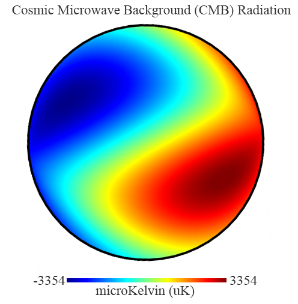

Even though there are many, many more classes of laws, for this writing we are only going to use these two general scopes of laws, the *local* and the *universal*, because no matter what laws may exist, they will fall into one of these two scopes (or children of these scopes).

Local laws may be local, but they can affect everything that is built upon them. Everything is made of atoms, and atoms are the size they are because of *Planck&rsquo;s constant*, which is the relationship between the mass and the frequency of the particles that make up an atom. If that constant were to change the entire universe would be radically different, if it even existed at all. If Planck&rsquo;s constant changed from 6.2618 x 10<sup>-34</sup> to 6.2618 x 10<sup>-20</sup>, the radius of an atom would go from being too small to see 100 times the distance to the nearest star!

On a more realistic level, consider a bridge made of bricks. If the laws that bind molecules together change such that they have a lesser negative charge, then the bridge would melt on a warm day. The *local* Newtonian laws did not change, only the *local* laws changed on the particle level.

It&rsquo;s logical that the laws of particle physics affect everything that exists because everything is made of particles, but that does not make the laws of particle physics *universal* in scope, rather, that which is made of particles is *dependent* on the laws that operate in the *local* particle scope.

#### **Claim 9:** Local laws can alter everything that descends from, or depends on them. 

## The State of Order

It is these laws that create order out of chaos and chaos out of order.

Order exists between the two states of relative chaos, one state tending towards zero-energy chaos and the other towards total-energy chaos, but even within the chaos we can find clues of order.

One theory that sheds light on new thinking about chaos and order is David Bohm&rsquo;s *Implicate Explicate theory*. In short, Bohm describes this theory by stating:

> In the enfolded \[or implicate\] order, space and time are no longer the dominant factors determining the relationships of dependence or independence of different elements. Rather, an entirely different sort of basic connection of elements is possible, from which our ordinary notions of space and time, along with those of separately existent material particles, are abstracted as forms derived from the deeper order. These ordinary notions, in fact, appear in what is called the &ldquo;explicate&rdquo; or &ldquo;unfolded&rdquo; order, which is a special and distinguished form contained within the general totality of all the implicate orders.

##### \~Bohm, &ldquo;Wholeness and the Implicate Order&rdquo;

To demonstrate this concept, Bohm uses an ink droplet analogy. In this demonstration, he places three drops of ink into a cylinder of glycerin. He then spins the cylinder which &ldquo;mixes&rdquo; the ink droplets together. He then reverses the spin and reconstructs the ink drops. When the ink droplets are in their original form, at the beginning and the end of the spinning, they are *explicitly* ink droplets and have the *order* of ink drops. When they are mixed up together, they are *implicitly* ink droplets only, and their order would be considered *chaotic* because there is no order of ink drops. The order of the ink drops has been destroyed, but the information of that order exists as a *virtual* ink-drop within the chaos of their mixed state.[^7]


In practical terms, this theory says that when something exists in the physical world it is in an *explicit*, or *unfolded* state. To exist in this state, it must conform to a set of rules that define the archetype of the form it will take. When it does not conform to these rules, it still exists, but only in an *implicit* or *enfolded* state, a state we cannot see or interact with (under normal circumstances). This state has its own rules as well but they are a superset of the *explicit* rules, making physical reality as we know it just one sub-state that a *thing* can be in.

It is these local and universal laws that cause form to *unfold,* to *explicate* itself, self-organize, form patterns and move in accordance with these laws. By the same token, these laws will also *enfold* or *implicate* these forms, causing them to return to an unrecognizable state. The laws of existence are constantly moving chaos to order and order to chaos.

Here is another example that perhaps better displays the idea. Below are four identical pages of perfectly random dots, but there are a few dots on each page that have been added. Looking at any one page it would be impossible to detect any pattern. As we merge the pages the randomness gets denser and denser until a pattern of order emerges.


The circle is *implicit* in the random dots of each separate page, and *explicit* when the pages line up together in the proper manner. In this example, the *local* pattern would be the random pattern on each page, which represent the scope, and the *universal* pattern would be the parts of the circle as it exists on every page.

All of this addresses the relationship between instantiation and context, in that how something comes into existence and how it is expressed is dependent on the context and scope of where it is being expressed.  This concept is not only a technical or scientific one, but also a philosophical one that we can see in Buddhism as the principle of *Pratītyasamutpāda*, which means *dependent arising*, and which states that all phenomena (*dharma*) arise in dependence upon other phenomena (*dharmas*).  More that that, it also implies that the significance of something is defined by its environment.  An obvious example of this is; a tiger in a zoo is not the same as a tiger in the wild, as they have very different properties.  A less obvious example is: imagine a blue ball that has three object properties: it is made of wood, it is blue, it is round.  It has these same properties on a table or in the ocean *as an object*, but it interacts with it's environment very differently. This same blue ball has very different *interactive* properties depending on it's environment, and these properties define the ball  beyond it simply being an object, such as; it falls to the table, but it floats in the ocean, it does not move on the table, but is does move in the ocean, it will deteriorate faster and in a different manner in one case vs. the other., etc., etc.

<div style="page-break-after: always; break-after: page;"></div>
# 4: THE LAWS

###### Energy creates movement, movement follows laws, laws create order, and order directs energy. Each level of existence expresses the Universal laws to the best of its ability according to the local laws it operates under.

## Entropy and Inertia

There are many laws that describe how energy works.

From the 3<sup>rd</sup> century BC starting with the Archimedes Principle to the present laws of quantum mechanics, researchers have compiled a long list of laws. 

One of these universal laws is *energy will always follow the path of least resistance.* This is called *entropy* and explains why water runs downhill to form rivers, electrons always seek a positive charge, which describes electricity, high pressure seeks low pressure, and why stuff breaks.

A simple analogy would be to compare entropy to water in lakes, rivers, and the sea. Only the water that is above the sea level can be used to do work (e.g. move a water wheel). Entropy represents the water that is at, or below, sea level and therefore unusable for work.

This is also how batteries work. A charged battery has low entropy (high usable energy), and a dead battery has high entropy (no usable energy). A dead battery still has all the energy it had before, but it is no longer usable because the energy, in the form of electrons, has moved from the negative side of the battery to the positive side until it achieved balance and there are no more electrons left on the negative side of the battery that were compelled by the laws of balance to move&hellip;  but they are still in the battery, and still acting like electrons.

This is classical physics, and entropy in classical physics is defined as *disorder* because, without the flow of energy, there is no order. For the record, entropy is a fairly complex process that not everyone agrees on, so, we&rsquo;re really using &ldquo;high-altitude&rdquo; definitions here.

In the water example, if we have two identical bodies of water, one 100 feet above the other, we say that the upper body of water has lower entropy than the lower body of water, and the lower body of water has higher entropy than the upper body of water, but there is no difference between these two bodies of water when compared independently. The difference only appears when compared to each other, because one is higher than the other. We can say that both bodies are in a (slightly) higher state of chaos when they are not connected. Once they are connected, and the water begins to flow, there is movement of energy, and order follows.

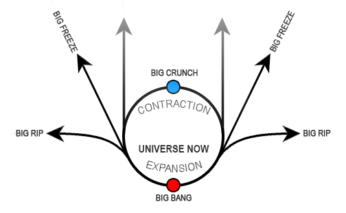

This is what is theoretically happening to the universe right now because according to the Big Bang Theory, there was zero entropy (total energy) at the moment of the Big Bang. Since then all that energy has been following the path of least resistance, moving into surrounding nothingness (i.e., an unmanifest conceptual space of possibility), like water into the ocean or electrons in a battery, raising the entropy of the universe and decreasing the amount of usable energy. This is why, according to the theory, the universe will end up in a state of chaos and disorder, like a dead battery or a stagnant lake. The Universe started in chaos and will end in chaos, and in-between those two points, there is the movement of energy, which creates order.

#### **Claim 10:** Order and pattern requires energy. 

One interesting takeaway from this understanding is that interconnectivity allows for movement of energy. This movement creates order. Therefore the idea that everything is connected is not simply a philosophical abstract concept, but a necessity for order.

In other areas of study, the definition of entropy carries the same idea of disorder or chaos but is used in a narrower context, so it sounds confusing unless you are familiar with that context. For example:

-   **In probability theory**, the entropy of a random variable is the measure of uncertainty.

-   **In information theory**, the *compression entropy* of a compressed file, like a zipped file or a JPEG image, measures the amount of information loss.

-   **In sociology**, entropy is the natural decay of a society&rsquo;s structure (such as law, organization, convention, ethics, etc.).

For our purposes, we will simply use the classical definition of entropy as a *measure of disorder*.

Another law to look at is Newton&rsquo;s First Law, the Law of Inertia, which states *an object will remain at rest or move at a constant speed in a straight line unless it is acted upon by an unbalanced force*. This is why things don&rsquo;t fly around randomly on their own for no reason.

These are just two of the many laws that determine how our reality works, at least within the scope of the reality we tend to deal with. On the quantum and galactic levels, or super high or low energy states, things may operate a bit differently.

These laws always ensure that everything will operate at its most efficient level. What does &ldquo;operate&rdquo; mean in this context? It means the optimal movement of energy. As energy only moves when there is a difference between two states, the movement of energy is meant to do only one thing, and that is to neutralize that difference by creating a balance between two conditions that are not the same, whether it&rsquo;s the conditions of *somethingness* and *nothingness* or just a few degrees of temperature. Once balance is achieved the movement stops. A balanced battery is a battery at peace with itself&hellip; and it is also a dead battery.

The optimum condition for the movement of energy between two states is one that operates within the limitations and abilities of both of those conditions.

A beautiful example of entropy and inertia that works today as much as it did thousands of years ago can be easily demonstrated with something called the *harmonograph*. This is a fascinating and entertaining device that creates an oscillation from takes an initial push (low entropy) and then draws a two-dimensional oscillating design on a blank paper as that initial energy slowly diminishes (inertia), until it stops (high entropy).[^8]


#### **Claim 11:** Everything is in a state of seeking and/or maintaining balance. 

## Oscillation

One law, or pattern, that can be seen in every part of the universe, is that everything oscillates.

Oscillation is how energy sustains movement between two states, which supports the definition that &ldquo;chaos is a kind of order without periodicity&rdquo; for without oscillation or periodicity, there is less order and more chaos.

Everything that is sustainable (i.e. currently exists), from the atoms to the galaxies, oscillates in some fashion and has some kind of frequency(s).

> &ldquo;All things have a frequency and a vibration.&rdquo;

##### \~Nikola Tesla


We typically think of light waves and sound waves as the classical example of oscillations, but the heavenly bodies and stars in the sky are also oscillating particles on a cosmic scale. If we look at the orbits of planets, stars and galaxies they are not simply spinning around in a rather 2D plane of orbits, but that they are spinning around while moving in a direction.

People have been fascinated with this obvious commonality across all of creation for some time. Kepler himself was quite interested in the relationship between planetary frequencies and musical frequencies, but the study of planetary and musical relationships goes back to at least the 9th century with Eriugena, an Irish monk, theologian and Neoplatonist philosopher, most famous for his work &ldquo;The Division of Nature,&rdquo; which claims that nature&rsquo;s first primary division was the division between that which **is** (*being* or *somethingness*) and that which is **not** (*nonbeing* or *nothingness*). His work was condemned as &ldquo;swarming with worms of heretical perversity&rdquo;&hellip; the 9<sup>th</sup>-century Archdiocese was a tough crowd.

#### **Claim 12:** Everything exists in a state of duality. 

#### **Claim 13:** Everything sustainable oscillates. 

## Ohm&rsquo;s Law

Another law which appears to be local yet applies to many contexts is Ohm&rsquo;s Law, which states *electric current is proportional to voltage and inversely proportional to resistance*.

This law can be displayed as follows:


If you are not familiar with Ohm&rsquo;s Law, you can understand it using the water example. 


The following concepts are the same in both examples:

- **Power** remains the same, as it is an abstract and derived concept that represents the rate, over time, at which energy (via electrons, water, etc.) is transferred.
- **Current** is the amount of water (e.g. number of molecules), that is flowing through the pipe.
- **Voltage** would be analogous to water pressure, which determines how far the water shoots out of the pipe.
- **Resistance** is represented by the size of the pipe the water is flowing through.

Ohm&rsquo;s law is actually Newton&rsquo;s 2nd Law of Motion, t*he force of an object is equal to its mass times acceleration*, as it applies to electricity[^9], defining the *object* as *electricity*, the *force* as *current*, the *mass* as *resistance*, and the *acceleration* as *voltage*.

##### A word on electricity…

We are using Ohm&rsquo;s law, the laws of electricity, as an example for another reason as well. We are all familiar with lightening. Watching the bolts of light shoot instantly across the sky and into (or from) the earth is awe-inspiring and exciting. We also know that lightning is dangerous. Contrary to the statement &ldquo;Lightning never strikes the same place twice&rdquo;, lighting often strikes the same place many times, and for good reason. Ben Franklin suspected why, which gave birth to the lightning rod, saving millions of building from burning to the ground. 

We know that energy always travels the path of least resistance, so we would say that this path of lightning exists between a starting point in the sky and the ending point at a lightning rod (or whatever), and we might even say that this path was predetermined before the electrons traveled it.. but that would only be half the truth. As the opposing charges of the earth and  the sky (or between two clouds) increases, two fields grow… the positive field of the earth is pulled towards the negative field of the sky, and visa versa. When they touch a connection is made and all the excess positive charge rushes towards the sky, and the excess negative charge rushes towards the earth. Lightning happens in two directions at the same time. By the time we see the lightning, the fields have balanced. The engine of all interactions are the fields themselves. In this case is it lightning that is the byproduct of the fields.  What we see when we see lightning are all the paths between those two fields that have made some degree of connection. So it is the interaction between these two fields that is the cause, and the lightning is the effect.

This then raises the question: if that is the case for lightning, why do plant roots, rivers, and so many other examples, follow such a similar path?  It is reasonable to apply the same logic and suggest that the path of roots and rivers are the byproduct, or effect, of two opposing fields within close enough proximity as to allow them to make connections between each another, and in doing to, allowing the opposite energies to balance each other out. The main difference between lightning and rivers are the energies at play. In plants or rivers (apparently) this energy does not instantiate as electricity and moves much slower, in the range of years or centuries, as opposed to milliseconds.

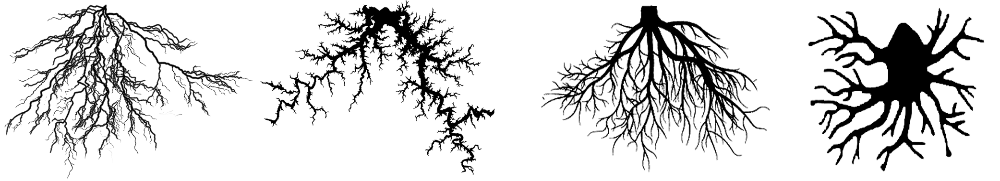

Keep this mind when we begin looking at how we can apply the laws of energy to other realms. 

##### Back to Ohm&rsquo;s Law…

In the world of electricity we can say *voltage = current &times; resistance*, likewise, in the world of matter we can also say *acceleration = force &times; mass.* All twelve math formulas of Ohm&rsquo;s Laws can apply to matter.

Ohm&rsquo;s law is just one of a number of contexts where Newton&rsquo;s 2<sup>nd</sup> law applies, as shown below.


## E=mc^2^

There&rsquo;s one more comparison to look at as well. Did you notice how in formula wheel above how the *Power = Resistance x Current<sup>2</sup>* (*P=RI<sup>2</sup>)* looks exactly like another popular formula: *E=mc<sup>2</sup>*? Could we find parallels between these two formulas? Maybe there is a relationship such that…

-   **Power** (*P*) is analogous to **energy** (*E*)
-   **Resistance** (*R*) analogous to **mass** (*m*)
-   **Current** (*I*) analogous to the **speed of light** squared (*c*^2^)

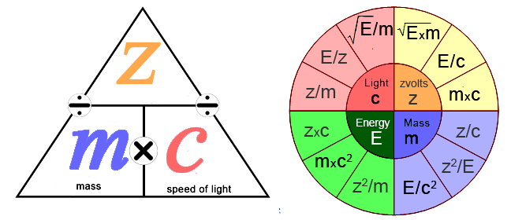

In fact, not only is *E=mc<sup>2</sup>* the exact same formula as *P=RI<sup>2</sup>*, but all twelve formulas work for *E=mc<sup>2</sup>*&hellip; with a minor adjustment: in the Newtonian world of electricity and matter, all the variables can change in value, while in the world of relativity, *c* must always remain constant.


It looks like *c,* which is the Relativism&rsquo;s version of *current*, or amperage, is the *maximum current supported* rating for this universe, not unlike a 40 Amp fuse we use to ensure we do not exceed the maximum current supported for our electrical devices. (Maybe that&rsquo;s why we can&rsquo;t break the speed of light because if we did, we&rsquo;d &ldquo;blow a cosmic fuse&rdquo; and shut down reality! That&rsquo;s sort of a joke&hellip; but not really.)

We can apply these formulas to energy, mass, and speed and get correct results; with one exception&hellip; there is no equivalence to volts when using *E=mc<sup>2</sup>*, which seems odd.

In the water example, voltage is equivalent to water pressure. In the world of electricity, voltage is described as *electric pressure* that results from the difference that exists between two states, one being the highest potential energy (like the storm cloud or mountain top), and the other being the lowest potential energy (like the lightening rod or valleys). Can we then say that these missing cosmic volts (let&rsquo;s call them *zvolts*, for lack of a better term) represent the difference between two opposing states, just like &ldquo;regular&rdquo; volts? What these states might be is up for grabs. Perhaps low entropy and high entropy, or order and chaos? Who knows? Whatever zvolts are, given that they are values that measure the difference between two points that are quite fundamental to our reality, they might be very significant in understanding reality in terms of dualities.

We can calculate for these missing zvolts by applying the simple formula:

*Voltage (V) = Current (I) &times; Resistance (R)*

which equates to *zvolts (z) = Speed of Light (c^2^) &times; Mass (m)*.  

This then becomes (using the ISU standard[^10] units of measure) *zvolts = 30,000,000 m/s &times; 1 g*, (or *8.98&times;10^16^ m^2^/s^2^*) which makes zvolts = 300,000,000. 

So zvolts is the same value as *c*? Yes, but only when the *mass=1*. If we use a different mass, like 2, zvolts becomes *c&times;2*, which is then:  *zvolts = 300,000,000 m/s &times; 2 g*, which makes zvolts = 600,000,000, and if mass=0, then zvolts = 0.  

But what *is* this number? It can&rsquo;t be speed, because nothing can exceed the speed of light. It can&rsquo;t be weight, because we are already using weight in the equation. Even more odd is that the number is always proportional to mass because *c* is always the same, so whatever *zvolts* are, they are essentially the same value as the weight of the mass, but 300,000,000 times larger, but the *zvolt* is the result of speed, time and mass, so it is like a unit of *mass per distance per second*, kg/km/sec.  This also happens to be the parameters that define the unit of measure called a Newton, which is a measure of *force*.  One Newton is defined as *the force needed to accelerate one kilogram of mass at the rate of one meter per second squared in the direction of the applied force.*  Newtons only apply to mass, so this is how we measure things like Angular momentum, the force of the planets in orbit, and also how we measure the spin of elementary particles.  

However, applying *E=mc^2^* to massless photons where *m*=0 we get a value of *E*=0. Does this mean that things that have no mass have no energy?  Actually, yes&hellip; but we know this is not true, as in the case of light itself, photons, which have a lot of energy but no mass.  This is because *E=mc^2^* is only true for particles at rest, and photons, or any form of energy that has no mass, can never be at rest&hellip; they are *restless*, and while the massless particle itself has no inherent energy, it does have the energy of its movement (speed, frequency, amplitude, etc.). Were it to stop moving, it would exist only as a concept. So, in the case of massless energy, zvolts would always equal zero.  In the case of mass, however, is has a value that seems to be related to *force*.

There&rsquo;s one more detail about voltage that might be relevant here, and that is: the greater the voltage, the greater the electric field. Can we then say &ldquo;the greater the zvolts the greater the energy field&rdquo;?  If so, and given that *zvolts* only exist where there is mass, can we say *zvolts* is some measure of a *reality field*, given that *zvolts* measure the greatest difference between two opposing potentials between which mass can exist?

We can now rewrite our original Ohm&rsquo;s law of *electric current is proportional to voltage and inversely proportional to resistance* to be: *zvolts are proportional to the speed of light (c) inversely proportional to mass*. We know that as mass approaches the speed of light its mass increases, which means *zvolts* increase, and the formula *m=z<sup>2</sup>/E* would then describe how mass can increase while *c* remains constant.

Of course, I am swimming in waters far deeper than my ability, but it&rsquo;s all quite fertile ground for speculation, at least to someone like myself who is too uneducated to know the thousands of reasons why such speculation is pointless.

Getting back to these twelve formulas&hellip; we think about voltage, resistance, and current (or energy and mass) as separate things, similar to how we think about time and space as two different things. However, space and time are two properties of one larger thing called *space-time*. Likewise, voltage, current, and resistance are three properties of one instance of energy as electricity. Frequency, wavelength, and velocity are three properties of another instance, such as radiation. All areas where this law applies are themselves different properties of some expression of energy.

Here we are using Ohm&rsquo;s Law to show how one law can be expressed across many scopes, but this same reasoning applies to all natural laws in physics, or elsewhere.

## Alchemy

If we are claiming that these laws can be seen throughout our journey of discovery over the past millennia then we should be able to see them in the early forms of reasoning that evolved into such things as modern science.

Alchemy is the birthplace of modern science. Despite the charlatans of science of olden days, just like today, many alchemists profited by promoting &ldquo;elixirs of life&rdquo; and promises of discovering the &ldquo;philosophers stone. &rdquo; The true goal of alchemy was to discover the secrets of nature, and to alchemists, this was as much a spiritual journey as it was a technical one. Modern science has done away with the spiritual or mystical aspect of knowledge and doubled down on the technical aspects (which we will discover is an unsustainable position).   

We can see early form of these modern concepts, specifically in the concepts of the elements of earth, water, air, and fire. These elements do not refer to the material instances but to their archetypes of which the material forms are limited instances of. The first form of matter that came into existence,  which would be the equivalent of modern science&rsquo;s atomic-sized ball of everything that exploded to fill the universe, was considered to be formed by these four archetypes. This was an idea held by the ancient Greeks, the Islamic philosophers and scientists, and learned Asians and Europeans of their day.

As archetypes, they did not only instantiate as matter but also as qualities. For example, the elements were used to describe health as far back as Hippocrates (400 BC), and as recently as Carl Jung&rsquo;s theory of personality, which drew heavily of Hippocrates. In Jung&rsquo;s theory, there were four types of personalities:  feeling (fire, choleric), thinking (water, phlegmatic), intuition (air, sanguine), and sensation (earth, melancholic). He then added other attributes such as introversion/extroversion, to come up with eight basic personality archetypes.

How this is relevant here is that the four alchemical elements are a very early version of the four qualities of matter as expressed by Newton&rsquo;s 2nd law.

What we understand as resistance, current, volts, and power today, the alchemists would describe as qualities that have the properties of earth, fire, air, and water archetypes,  respectively. This is not to suggest that just as *V=IxR*, so too does *air = fire x earth*. This is simply an example of how the same patterns and archetypes keep appearing across many contexts and scopes, such as technology, science, mysticism, social order, biology, and many, many more.


#### **Claim 14:** Instances of laws are limited, defined and understood according to their context. 

## Redundancy

The oscillation constant also gives us a glimpse into another basic, yet profound property of creation and reality, and that is its self-similar redundancy. *Self-similar redundancy* (a term that is itself redundant) is how one property or law manifests itself across different orders of scale in the most effective manner given the context, state, and scope of that order.

One of the more obvious examples of this type of inter-scope self-similarity might be the commonality between the structure of a solar system and the structure of an atom.

Of course, we need to consider that at the quantum level the instance of a centric system, like an atom, would be constrained by the local laws of quantum mechanics, such as electromagnetism, electron energy levels, the nuclear weak force, etc., while in a much larger system, like a solar system, the same laws would be constrained by the local laws of momentum, gravity, and Newtonian physics.

Many scientists will tell you there is no relationship between atoms and solar systems, and that this analogy depends on an old and outdated concept of the atom, writing it off off as humanity&rsquo;s tendency to oversimplify the complex and over-relate the unrelated.

No doubt this is true to some degree, but more importantly, there are some similarities worth investigating that would give us an idea of the laws that both systems deploy in the most efficient way they can be expressed, given their scope. Some scientists agree, as we can see in he paper published in June, 1989, by the *International Journal of Theoretical Physics* titled &ldquo;*Self-Similar Cosmological model: Introduction and Empirical Tests*&rdquo;[^11] which examines this concept specifically.

This report concluded:

> The simplicity of \[the Self-Similar Cosmological Model (SSCM)\] and its ability to quantitatively relate atomic, stellar, and galactic scale phenomena suggest that a new property of nature has been identified: discrete cosmological self-similarity. Although the SSCM is still in the early heuristic stage of development, it may be the initial step toward a truly remarkable unification of our considerable, but fragmented, physical knowledge.

A more organic example of this inter-scope self-similarity[^12] is to compare the structure of the universe to a brain cell.


There are many matching patterns between cells and the universe, and it is a subject far too broad to get into here. One recently published paper[^13] shows the similarity in structure of a neutron star and a human cell. Other comparisons based on scientific and rational observations have also been noted, such as:

-   mitochondria vs. stars
-   Vacuoles vs. galaxies.
-   Nuclear holes vs. asteroids
-   Vesicles vs. the earth itself.
-   Lysosomes vs. dark energy.
-   Endoplasmic Reticulum vs. wormholes.
-   Cell membrane vs. edge of the universe.
-   Ribosomes vs. molecular clouds
-   Smooth Endoplasmic Reticulum vs. the sun.

One could say that if you look long and hard enough you can find relationships and patterns between any two things. That may be true, but if certain patterns keep popping up then it might be something more than just an overactive imagination.

It might even cause some incurably curious researchers to wonder if there was a bigger picture that we have been ignoring and inspire them to do some investigation that might open new doors of understanding&hellip; someone like the esteemed Stanley N. Salthe, Professor Emeritus, Brooklyn College of the City University of New York, who said:

> &ldquo;It is an interesting possibility that the &ldquo;power laws&rdquo;<sup>6</sup> followed by so many different kinds of systems might be the result of downward constraints exerted by encompassing supersystems.&rdquo;

##### \~ Stanley N. Salthe, Entropy 2004, 6, 335

Here is what Hans van Leunen, a physicist from the Eindhoven University of Technology, Dept. of Applied Physics, and founder of The Hilbert Book Model project, which applies mathematical test models in order to investigate the foundation of physical reality, has to say about this as well:

> &ldquo;Obviously, physical reality possesses structure, and this structure founds on one or more foundations. These foundations are rather simple and easily comprehensible. The major foundation evolves like a seed into more complicated levels of the structure, such that after a series of steps a structure results that appears like the structure of the physical reality that humans can partly observe."[^14]

##### \~ The Structure of Physical Reality

He then goes on to say:

> The \[paper &lsquo;The Structure of Physical Reality&rsquo;\] applies the name *physical reality* to comprise the universe with everything that exists and moves therein. **It does not matter whether the aspects of this reality are observable. It is even plausible that a large part of this reality is not in any way perceptible.** The part that is observable shows at the same time an enormous complexity, and yet it demonstrates a peculiarly large coherence.
>
> The conclusion is that physical reality clearly has a structure. Moreover, this structure has a hierarchy. Higher layers are becoming more complicated. That means immediately that a dive into the deeper layers reveals an increasingly simpler structure. Eventually, we come to the foundation, and that structure must be easily understandable. The way back to higher structure layers delivers an interesting prospect. The foundation must force the development of reality in a predetermined direction. The document postulates that **the evolution of reality resembles the evolution of a seed from which only a specific type of plant can grow. The growth process provides stringent restrictions so that only this type of plant can develop. This similarity, therefore, means that the fundamentals of physical reality can only develop the reality that we know**.

In other words, he is saying that there are self-similar and redundant orders in the *hierarchy* and *layers* (in his words) of creation, and these orders abide by specific laws and which are limited (*predetermined*) by their component parts (*seeds*). Likewise, the restrictions of the growth process will be similar at every level, and consequently, the laws at play will be similar.

#### **Claim 15**: Reality is a structured hierarchy of dualities which starts out very simple, each specific generation limited by the structures of the duality they emerged from.

You can read his paper[^15], but unless you know your way around multidimensional Hilbert space lattices, it going to be a tough read.

For purposes of this thread, I am going to define a  *scope* or *order of creation*, (or *level*, as Hans van Leunen would say), as that creative cycle from which an apparent order emerges out of a state of the apparent disorder defined by the limits of the duality it emerged from. I say &ldquo;apparent" because I don"t want to suggest that there is disorder in a seed and order in the resulting flower. Obviously, there is order in both, but the explicit order of a flower in bloom, at the peak of its expression, when it is ready to drop its own seeds, is far more apparent than the implicit order of a seed. The flower is *explicit* when it is in bloom, and *implicit* in the seed, while the seed in *implicit* in the flower. This also suggests that within the scope of the life-cycle of a flower, which begins with a seed and ends with compost, the flowering stage represents the most optimum expression of energy, or the most effective form that instance can realize.

#### **Claim 16:** Self-similarity exists due to the redundant nature of the laws which express themselves in accordance with the scale and scope of their context. 

<div style="page-break-after: always; break-after: page;"></div>
# 5: REASON

###### The ability to understand something is limited by our ability to perceive something. As our perception changes, so does our understanding change, and with that, the reasoning we apply.

We arrived at these laws through reason, and we humans are rather proud of that claim as we like to believe we invented reason, but we didn&rsquo;t. We did discover it, however, so at least we can take credit for being doggedly curious.

*Reason* is what we call our ability to recognize the natural processes that arise from the patterns of creation and is the product of intellectual survival, a skill we evolved to give us fang-less, claw-less, slow, small and tasty humans a fighting chance in the Darwinian battlefield.

To be fair, there has been a long-standing debate over whether mathematics, and by association, reason, was invented or discovered. One of the more solid debates is presented by leading astrophysicist Mario Livio in his article &ldquo;Why Math Works&rdquo;[^16]

In that article, he refers to those who believe math was discovered as Platonists, due to the fact that Platonic archetypes include math archetypes, as math is a form of an idea. Livio gets into the idea that math is subject to the same evolutionary forces as species in that math that does not work quickly dies, never again to propagate itself into the mathematical &ldquo;gene pool.&rdquo;

The same is true for any idea or theory. Ideas such as the phlogiston theory of fire and Descartes theory of the motion of planets are examples of conceptual offspring that were quickly dispatched by the deadly and merciless hand of proof. It&rsquo;s a bit different on the social level, where we see failed political and economic ideologies that, although their ruin is inevitable from the start, they continue to pop up, for, in the realms of ideology, proof is often eclipsed by belief, hope, power and mass hysteria.

A sounder argument that reason was discovered is that the systems we have created with our reasoning abilities, from plumbing to artificial intelligence (AI), have come to the same design conclusion as nature when faced with similar challenges, such as water distribution, blood cell design, language, etc. In the case of AI, armed with our rules of reason, it has significantly out-designed human solutions many times. These improved solutions were derived at by observing the situation and applying the laws of reason that we instructed the AI system with, laws that we ourselves derived from observing our reality. The fact that AI is coming up with solutions that not only exceed ours but are more in harmony with nature is pretty good evidence that the laws of reason are objectively verifiable and existed before humans arrived on the scene.

In any case, both sides can agree, for the most part, that math is the language man invented to describe the existing laws he discovered and likewise, reasoning is the process man invented to describe the unfolding order of existence that he was capable of perceiving. This is a sufficiently satisfactory answer with regard to math and reason, but reasoning, in general, has a lot more gray area than mathematics.

## The Limits of Reason

Reason has been pretty effective in describing our reality, but it has its limits, at least in the way we use it today.

For example, the traditional Law of Thought[^17] goes something like:

- **The Law of Non-Contradiction states:**

> &ldquo;Nothing can both exist and not exist at the same time and in the same respect, or no statement is both true and false.&rdquo;

- **The Law of Excluded Middle states:**

> &ldquo;Something either exists or does not exist, or every statement is either true or false.&rdquo;

- **The Law of Identity states:**

> &ldquo;Everything is the same as itself, or a statement cannot remain the same and change its truth value.&rdquo;

These laws are much like math, in fact, they have their own algebraic notation: ∼(p&sdot;∼p), F(x)&sup;F(x)**,** (&forall;x) (x=x), respectively.

It seems reasonable to assert that these laws existed before we came up with a way to define them, just as processes in nature existed before we understood them. We certainly did not invent the fact that something cannot &ldquo;be&rdquo; and &ldquo;not be&rdquo; at the same time. We discovered that this is a property of our reality, or rather, in the way we perceive our reality. If we broaden our perceptions to include the reality that something *can be* and *cannot be* at the same time, then our reasoning must adapt.

A hardcore Aristotelian materialist might say &ldquo;The law of non-contradiction specifically forbids something to be in a state of existence and non-existence. The universe has a transcendent self-consistent order, and that order cannot be violated. Its primary manifestation is thus: it exists, and it cannot be otherwise&rdquo;, while a Platonist might say something can exist as an archetype but not as a material instance. A scientist might suggest that something can exist implicitly, but not explicitly, like the ink drop, or can even be in two places at the same time, as we have seen in quantum mechanics,  and a Hindu guru might mess everything up by saying &ldquo;The One is both *Sat* (existing) and *Asat* (non-existing).&rdquo;

It would appear that the laws of reason depend on the scope of one&rsquo;s perspective and what one accepts as axiomatic or true, transcendental or otherwise. How, then, can these laws be preexisting if they contradict each other? This is sort of like the fable of the blind men and the elephant, where one blind man holding the elephant&rsquo;s tail describes it as a snake, and the other, holding the foot, describes it as a tree, or perhaps like the brilliant sculptures of Mathew Robert Ortis, such as &ldquo;Revolution Giraffes&rdquo;, which looks like a giraffe from one angle, but an elephant from another.

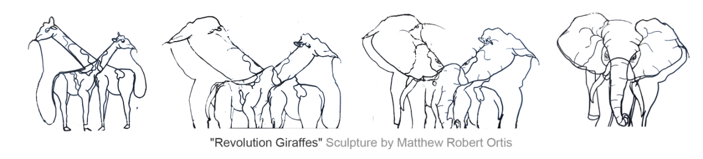

The blind men and the viewers of the sculpture are all perceiving a preexisting form that is undebatably &ldquo;true&rdquo;, but they can&rsquo;t seem to agree on what it is.

Each of these fine folks can easily define and defend their worldview. They are all able to recognize the reality they have accepted as true, supported by the reasoning of that truth.

### Labels and Names

In all cases, before one can proclaim some thing&rsquo;s existence, that thing has to be named and something about it must be known, or at least presumed. We can&rsquo;t say something exists if we have no idea what it is we are making that claim about. We can see this readily in the way languages form ideas and labels which become the foundation of cultural understanding.

I can say my dog exists because I know *my* dog, I know *of* dogs, and everyone I know also knows of dogs. But can I say *phlimquitz* exist, and when you ask me what a *phlimquitz* is, I say &ldquo;I have no idea&rdquo;? That would be quite unreasonable, but if I said *phlimquitz* explains the 99.97% correlation between &ldquo;U.S. Spending on science, space and technology vs. Suicide by hanging, strangulation, and suffocation&rdquo;, then I am claiming to understand something heretofore unknown and can go about defining and testing the *Phlimquitz Hypothesis*.

#### **Claim 17:** We name things according to our observations, and once named, they become conceptual realities. 

Here is that correlation, just for fun:[^18]

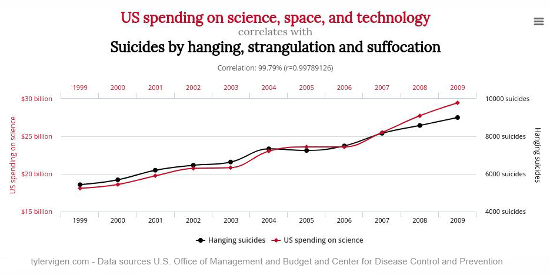
    


This process of understanding is similar to recognizing a pattern in a series of random dots, as in the dancing-woman-in-the-dots example above. In that image I can definitely see a person dancing, and I can easily prove it by connecting the dots. I am not wrong, but neither is the person who sees an egg sandwich. 

However, any predictions either of us makes on where the next dot will land or in determining the properties attributes of the dots, based on the understanding of our perceptions, will most likely fail. Through trial and error, testing, and proofs, we will finally discover that these dots represent no specific pattern. Once we recognize the concept of randomness, we can name it, define it, and study it.

Humans began grasping this concept of randomness about 3,000 years ago, but named it things like &ldquo;fate&rdquo;, &ldquo;chance&rdquo;, and &ldquo;destiny&rdquo;, and, being unpredictable, was usually associated with some sort of supernatural justice or punishment. It wasn&rsquo;t until the 16<sup>th</sup> century that Italian mathematicians began to formalize the concept of what we call randomness, so it&rsquo;s still quite a young concept.

#### **Claim 18:** Our ability to reason is rooted in our ability to see patterns, and connecting these patterns is made possible by our ability to reason.

God(s), angels, spirits, the Djinn, magic, luck, coincidence, mystical forces, kundalini, chi, manna, out-of-body-experiences[^19], etc., are all concepts that many people have a clear understanding of, and as such, they are able to say it exists because they cannot only recognize it but can produce reams of information about it. To be clear, this is not meant to suggest these observations are, or are not, as valid as any other. Any system&rsquo;s validity depends solely on the contextual effectiveness of the reasoning behind it and the ability of that reasoning to produce verifiably accurate statements about it.

It would be hubris to write-off alternative views of reality given every culture in the world has a concept of some sort of paranormal, metaphysical energy. Some of these cultures have extremely demanding training and lengthy education to tap into it. Even our western icons, such as Paracelsus, Hippocrates, Carl Jung, Erwin Schrodinger, and Plato have referred to it.

For better or worse, it seems that pretty much anything can be a Truth as long as people can recognize it and support it with whatever sort of reasoning they happen to be using. For our purposes, we are only concerned with reasoning that is based on the laws of nature, as they are perceived. We need only look at history, and some places on the planet today, to see the many versions of truth that have evolved, and how dramatically they differ from each other.

### The Truth about Truth 

This raises the Big Question… What is truth?

This is a question we can never answer absolutely. We can&rsquo;t speak about what the ultimate truth is because there can never be absolute proof that any one way of looking at something is the &ldquo;right&rdquo; way. All we can speak about is what is the most reasonable understanding given the context of our reality and our perceptions of it. What, then, is the arbiter of proof as to whether something is &ldquo;reasonably&rdquo; true or not, given our current understanding of reality?

One arbiter is, of course, power. When Friedrich Nietzsche said &ldquo;There is no truth, only power&rdquo;, he was half right. Truth is a journey of discovery, while power is a battle for who gets to navigate that journey.

### Sustainability

Outside of that battlefield of culture and politics, we do have at least one gauge, and that is the measure of sustainability. Sustainability may be the best test as to the validity of something because its explicit existence alone is proof it exists in accordance with the rules of reality.

Anything that exists can only sustain its sustainability if it exist within the constraints of its scope, typically defined by its environment and its component parts. A functional balance must be maintained between all contributing variables in order for the energy within that instance to move in a structured manner that allows order to emerge from chaos. Energy always seeks to achieve a balance; therefore, sustainability is the measure of the degree that order and balance can be maintained. Unsustainability will result in chaos, and visa-versa.

This raises an interesting question: if (high-entropy) chaos is the ultimate state of the Universe, a state where everything is inert, motionless and dead, then it must also be the most sustainable state as it will never change once arrived at. Oddly, this appears to be true.

All the movement of energy that exists at every level of reality is the result of energy traveling the path of least resistance as it seeks balance. We see examples of this everywhere, such as when we add hydrochloric acid with sodium hydroxide. After an extremely violent readjustment phase that releases a lot of energy (heat), it settles down to very stable, lower energy-demanding products of water and table salt.

The Universe, starting with the extremely violent Big Bang and ending (according to at least one popular theory) as a bunch of inert matter, the cosmic equivalent of water and table salt, is essentially the readjustment phase of different states of imbalance coming to terms with one another. Reality is the reaction of this adjustment, and like the chemical reaction just mentioned, will ultimately balance out and just sit there, doing nothing.

The ultimate destination of sustainability, on the cosmic scale, is death. In our current point in existence, sustainability means keeping the various part of the &ldquo;balancing machine&rdquo; of nature working properly. In both cases sustainability means balance, but with two very different results of short-term, or *temporal* balance and long-term, or *supernal* balance. For our purposes, the sustainability we are referring to is the temporal kind, unless otherwise noted.

#### **Claim 19:** Sustainability is a gauge of existence, and therefore life itself, at every level of reality. 

Pions exist for about 26 nanoseconds, while the most massive black hole known, approximately 66 billion times larger than our sun, would require 6x10<sup>99</sup> years to evaporate. Does this mean that black holes are more &ldquo;valid&rdquo;, more &ldquo;true&rdquo; than pions? No, because the pion&rsquo;s existence, short as it is, is necessary, otherwise it would never have existed in the first place, but the validity of a pion, essentially the truth of its explicit existence, is only valid for 26 nanoseconds while the validity of a black hole is forever (as 6x10<sup>99</sup> years is actually longer than the life span of the Universe). By this logic, we can say that both pions and black holes are equally true and valid, but one is &ldquo;true&rdquo; forever.

#### **Claim 20:** Something exists because its expression of energy patterns adheres to an order that must be maintained to continue existing. 

### Tree of Sustainability

Let&rsquo;s take a look at a more integrated example; that of a single cell, the building block of life. This is high-school biology, but let&rsquo;s go over it again.

Each of these processes has proven itself to be a more &ldquo;valid&rdquo; truth by being more sustainable then any of their alternative processes.

- Inside the cell are two meters of tightly wound strands of four very specific molecules, held together by sugar phosphates, which make up the DNA of that cell. These are C<sub>5</sub>H<sub>5</sub>N<sub>5</sub> (adenine), C<sub>5</sub>H<sub>5</sub>N<sub>5</sub>O (guanine), C<sub>4</sub>H<sub>5</sub>N<sub>3</sub>O (cytosine) and C<sub>5</sub>H<sub>6</sub>N<sub>2</sub>O<sub>2</sub> (thymine). They are arranged in a very specific order which describes the instructions necessary to build every protein in an organism.
- In a process known as transcription, a molecular machine first unwinds a section of the DNA helix to expose the genetic instructions needed to assemble a specific protein molecule.
- Another machine then copies these instructions to form a molecule known as messenger RNA.
- When transcription is complete the RNA strand carries the genetic information through the nuclear pore complex, the gatekeeper for traffic in and out of the cell nucleus.
- The messenger RNA strand is directed to a two-part molecular factory called a ribosome.
- After attaching itself securely the process of translation begins.
- Inside the ribosome, a molecular assembly line builds a specifically sequenced chain of amino acids.
- These amino acids are transported from other parts of the cell.
- They are linked into chains often hundreds of units long. Their sequential arrangement determines the type of protein manufactured.
- When the chain is finished it is moved from the ribosome to a barrel-shaped machine.
- It is then folded into the precise shape critical to its function.
- After the train is folded into a protein it is then released and shepherded by another molecular machine to the exact location where it is needed.

These processes, and their order, are so specific, so complex, so difficult to explain with current evolutionary models, that Dean Kenyon, a Professor Emeritus of Biology at San Francisco State University who actually taught Evolutionary Theory, switched teams in 1979 and went on to be a key member in the &ldquo;Intelligent Design&rdquo; movement.

The important point here is that if any one thing in the list of processes listed above changes, if one atom in the C<sub>5</sub>H<sub>5</sub>N<sub>5</sub> molecule was different, or the &ldquo;gatekeeper&rdquo; made a bad call or a thousand other possibilities, the cell would either die or mutate. It would become unsustainable, or it would make the larger organism unsustainable. This is actually what cancer is, the malformed reproduction of cells that reduce organism&rsquo;s sustainability. Interestingly, the cancer cell itself can be quite sustainable as an independent cell and only becomes a problem as a community of cells.

For a cell to be sustainable, to continue existing, only one process, made up of numerous detailed steps, all of which must function properly, will result in successful functioning and reproduction. More importantly, we can&rsquo;t explain why any one particular option in any step, out of the countless theoretical options available at each step, is the one step that the process &ldquo;knows&rdquo; to select.

To put this in even clearer perspective, using twenty different amino acids to create a very small protein (of 150 amino acids), there are 10<sup>77</sup> possible combinations. In the world of biology, this exponential growth of possibilities is actually called *combinatorial inflation*. Remember that term, as we&rsquo;ll come back to it later on. How many of these 10<sup>77</sup> possibilities can produce a viable protein? Very few, and of those few only one will work, that being the one that works with the others it must integrate with. It&rsquo;s not quite as bad as the likelihood of a million monkeys banging on a million typewriters to eventually produce the entire works of Shakespeare, but considering it would take 2,737,850 million-billion-billion-billion monkey-years to produce the line from Hamlet &ldquo;RUMOUR. Open your ears&rdquo;[^20], how likely is the chance that this 1:10<sup>77</sup> process could happen successfully 10<sup>40</sup> times, which is the number of organisms that have ever existed in the history of the planet? For life to evolve (in the Darwinian sense) as it has over the past 4.5 billion years, this 1:10<sup>77</sup> process would need to happen 7x10<sup>99</sup> times per second, which equates to every living thing on planet today performing this process 7x10<sup>74</sup> times per second! If the vast majority of the 34 trillion cells that make up your body didn't all all hit the jackpot of creating the *same* viable life form millions, if not billions of times a second, you would just be a pile of lifeless bio-goo at the moment of conception. Admittedly, these numbers may be inaccurate due to their speculative nature, but the general idea that evolution is a genetic crapshoot sounds iss we far more inaccurate.

What we call a cell is a collective of components that not only all work together with miraculous precision, but which seems to have an intelligence of its own that understands the requirements of how each component must operate with each other component in order to preserve and maintain its sustainability, its existence. Likewise, the components themselves, like the barrel-shaped machine and the transcriptors, are also made of components that have the same intentions and decision-making abilities.

Evolutionists will say that all the other options, at one time in our past, were tried, and failed, leaving only the process that worked. Intelligent Designers will say that this was &ldquo;biochemical predeterminism&rdquo;, i.e. that the process was preprogrammed, somehow. Both of these answers are just kicking the can down the road, that &ldquo;can&rdquo; being the question of where and how this historical record of what worked and what didn&rsquo;t work is stored along with the knowledge of a very strict set of rules and conditions that informs the process,  as well as how this data is it accessed.

Let&rsquo;s take a look at a couple of macro examples on the social human scale and examine the serious questions it raises about the way we understand it.

### Yagé

This ritual psychoactive drink from the Amazon is also known as *ayahuasca*, *uni*, *nixi pãe*, *caapi*, *camarampi*, and many other names as well.  One of the more fascinating details about yagé is how it is made and how it was discovered in the first place. The main active ingredient of yagé is N, N-Dimethyltryptamine (DMT). DMT is a powerful hallucinogenic drug that exists in plants (and the human brain) yet has no effect on humans when taken orally because of the enzyme *monoamine oxidase* (MAO) in our blood that prevents it from passing the blood/brain barrier, which is a semipermeable membrane that separates the blood from the cerebrospinal fluid and which blocks many cells, particles, and large molecules, from entering the brain. This is a very good thing, as there is a lot of stuff floating around in our blood that can really mess with the brain.

In order for the DMT to get to the brain, it has to pass through the blood/brain barrier, and for that to happen there must be something that stops the MAOs from doing their job. That thing is called a *MAO Inhibitor* (MAOI). MAOIs are commonly used in pharmaceuticals to help with ailments such as depression and Parkinson&rsquo;s disease (which, according to Stanford University, are the same two things that tango dancing also helps).

Modern science has known about both of these drugs for a little over 100 years. Indigenous Amazonian shamans have known about them for about 5,000 years. Somehow, in a manner beyond the ability of modern Western man to comprehend, these shamans managed to discover that the bark of one particular vine, from over 40,000 species of plants, contained a lot of DMT. They also, somehow, knew that an MAOI was needed, which they found in another of those 40,000 species. Traditional anthropologists would have you believe they discovered this by trial and error, but with just a little thought, it is clear how ridiculous that theory is.

Of the 1,600,000,000 possible pairing combinations of Amazonian plants, only one produces the basis of yagé (it&rsquo;s actually far more complicated to make yagé than just mixing these two plants), and even then, only when a certain part of the plants are used. In addition, these 1,600,000,000 possibilities do not consider the variables of proportion or the specifics of preparation. For that many trial-and-error tests, even if every man, woman, and child in all of South America partook in the finding, preparing, and experimenting, it would take over 2,000 years, which then raises the question of record-keeping as to what was already tested. The fact that modern science expects any semi-intelligent person to believe its trial-and-error theory is laughable, but also pretty frightening that so many scientists *do* believe this.

### Curare

For other substances, such as the paralyzing poison *curare* used by South American indigenous people for hunting, the chances are astronomically greater.

Curare is a poison that paralyzes an animal, but soon after being paralyzed the poison is metabolized by the animal, rendering it harmless. That is obviously a pretty essential requirement, as you can&rsquo;t be eating the same poison you used to catch the animal. Just imagining that the locals knew of this requirement and then set out to find such a drug somewhere in the Amazon is difficult for modern anthropologists to accept.

Beyond that, there are 172 different types of this one-in-40000 species in the jungle, and only one of them works, but the real kicker is that the fumes one is exposed to while preparing the curare are fatal! How does modern science imagine this was achieved?

> *Wanadi:* &ldquo;Trumak! Mojie just died testing that new batch of curare!&rdquo;
>
> *Trumak:* &ldquo;Bummer. And he was so close! Go and try that again, with the same batch… and remember to keep smelling it. That&rsquo;s how you know it&rsquo;s done.&rdquo;
>
> Wanadi: &ldquo;OK!&rdquo;

On the other hand, if one were to ask a shaman how these things were discovered, he would simply say, &ldquo;The plants told us.&rdquo; Other cultures who have similar stories might say their ancestors told them, or the crickets, or the bones of a sacred animal, or the cracks in the shell of a tortoise after it has been heated and then dropped into cold water and then compared to the position of the stars, as was the case with the origins of the Chinese I-Ching.

For Western man, talking to plants, insects or bones in this manner is usually followed by pharmaceuticals prescribed by a psychiatrist. For just about every other indigenous culture, including the indigenous culture that Western civilization grew from, they had some way to tap into this organic database of knowledge.

Just as a cellular transcriptor has the intelligence necessary to manage its sustainability, which is then managed by the intelligence of a cell, and up the chain this continues all the way to a human being (which is just a stop along the journey, as we humans are part of a yet larger system), it is not unreasonable to presume there is an *uber*-intelligence that manages its components of humans.

Our ancestors called this intelligence &ldquo;the voice of the gods&rdquo; and about 5,000 years ago we started to create the idea of an all-in-one-version of the gods. This was a very practical idea and worked very well given the context and scope of our ancestor&rsquo;s world view. It gave one name to all things unknown and satisfied their need for a sense of truth and order. Once named it was left to humans to try and describe that truth and order.

## The Human Brain and Reason

The American Psychologist Julian Jaynes wrote a very popular book titled &ldquo;*The Origin of Consciousness in the Breakdown of the Bicameral Mind&rdquo;* (1976) wherein he explains that during a recent stage in the evolution of not only our ancestor's brain but entire nervous system we, as humans, had the ability to hear voices in our heads instructing us on what we needed to do and needed to know, and these voices of unknown origin were attributed to the &ldquo;gods&rdquo;, and therefore became the voice of Truth.


>&ldquo;Who then were these gods that pushed men about like robots and sang epics through their lips? They were voices whose speech and directions could be as distinctly heard by the Iliadic heroes as voices are heard by certain epileptic and schizophrenic patients, or just as Joan of Arc heard her voices. The gods were organizations of the central nervous system and can be regarded as personae in the sense of poignant consistencies through time, amalgams of parental or admonitory images. The god is a part of the man, and quite consistent with this conception is the fact that the gods never step outside of natural laws.&rdquo;[^21]


Jaynes claims that a bit before 1,000 BC (just around the time of the Tower of Babel by Sumerian accounts) the human consciousness was not yet &ldquo;meta-conscious&rdquo;, meaning humans were not aware of their awareness. The bicameral part of Jaynes theory suggests that there were two parts of the brain, the one that managed mundane jobs, habits, rote tasks, etc. (the self), and another part which, when faced with confusing and/or difficult challenges, took over (the voice of god).

> \[For bicameral humans\], volition came as a voice that was in the nature of a neurological command, in which the command and the action were not separated, in which to hear was to obey.

*Sidenote: What we call the &ldquo;ego&rdquo; today evolved out of that really boring and mundane &ldquo;self&rdquo; part of the brain, so it&rsquo;s probably best not to use it for anything other than mundane tasks.*

According to Jaynes, the transition from bicameralism to consciousness (linguistic meta-cognition) occurred over the period from 1,800 BC to 800 BC. We know this time as the time from when Hammurabi ruled Babylonia, and when he wrote down one of the first set of laws known to humanity dealing with challenging and confusing issues such as contracts, wages, liability, inheritance, divorce, paternity, and reproductive behavior, to name a few, to the founding of Rome. This metamorphosis of consciousness ushered in the golden age of empires and cultures that laid the foundation of Western Civilization in areas of art, literature, theater, government, philosophy, mathematics, and even sports. (*I am singling out Western culture simply because that is the culture I best understand and which has the most information available, and not because I think other cultures have not developed along their own lines under similar conditions.)*

From the days of Rome and the ancient Greek philosophers to today our bicameralism has further diminished, which can account for the decreasing incidents of people hearing the gods speak to them. This may have been a good thing, but the problem that arose as a result of the gods abandoning us, forcing us to apply reason to challenging problems when our pleas for guidance were ignored, is that our newly developed tools of reason were prone to reject any ideas that we could not understand, which were many given we were still new at the whole reasoning thing during some very desperate times. Our fledgling ability to consciously make sense of things seemed to be working, so it naturally dominated our world view, even if we were, and are, still figuring out how it works.

Still, as Jaynes so eloquently puts it:

> The mind is still haunted with its old unconscious ways; it broods on lost authorities; and the yearning, the deep and hollowing yearning for divine volition and service is with us still.

Hence, religion.

Anything and everything that did not fit into the highly constrained and &ldquo;reasonable&rdquo; worldview was pushed farther and farther outside the box of mainstream thought until we arrived at where we are today. In one way this &ldquo;inquisition-by-reason&rdquo;, which served to purge heretical thoughts from the dogma of the cult of reason, was, and is, quite necessary and useful, because in the reformation that has begun, those ancient ideas that can withstand the tests of our deeper understanding of reason will be resurrected in a new form with a broader and modern understanding.

The memories of the cell, the voices in our ancestor&rsquo;s heads, the wisdom of the plants as heard by the shamans, and countless other instances of &ldquo;divine&rdquo; or &ldquo;mystical&rdquo; knowledge, all beg the same questions: Where does this information come from? Where is it stored? How does one access it?

Perhaps *reason* has evolved to the point where we may be able to answer these questions, reasonably.

## The Path of Reason

The rules and conditions of reality that we have discovered have followed a perfectly reasonable path long before man was able to claim them as such. Sometimes it takes a while to find them, but eventually, we do, so far.


For thousands of years, Man looked at the path of the stars and came up with various stories about why they were where they were. It wasn&rsquo;t until Kepler discovered the pattern by plotting the paths on a logarithmic chart that the reasoning became clear. This became Kepler&rsquo;s Third Law of Planetary Motion that states *&ldquo;the square of the planet&rsquo;s orbital period is proportional to the cube of its distance from the sun.&rdquo;*
In the same manner, we discovered DNA is a helix because of hydrogen bonds, etc., so we can say &ldquo;Here is a pattern and the rules that created it.&rdquo;

This is not to say everything that the gatekeepers of the Church of Reason consider &ldquo;unreasonable&rdquo;, such as myths, magic, aliens, hyper-dimensional beings, and numerous other paranormal, metaphysical concepts are, indeed, &ldquo;unreasonable.&rdquo; On the contrary, it&rsquo;s quite unreasonable to presume they have no reasoning behind them as many of these ideas perfectly conform to natural law, albeit within a scope that extends outside our modern boundaries. Historical examples of once unreasonable ideas include electricity, flight, wireless communications, space travel, nuclear energy and pretty much the majority of the reality of modern life. These things were considered nothing less than magic and science fiction until we were able to recognize it and discover the rules of how they worked. Once we discovered Bernoulli&rsquo;s law[^22] works in harmony with the law of gravity we mastered the magic art of flying.

#### **Claim 21:** Reason is the codification of the rules of a reality as we have come to know it. 

### The benevolence of self-preservation

If our reasoning is based on the world we observe, then this implies that everything in nature, everything in the universe, must, therefore, be reasonable, but sometimes the reasoning we have derived from our observations is inaccurate or lacking.

#### **Claim 22:** The rules of reason are predetermined based on the rules of our reality that we have recognized, and these rules require that any &ldquo;reason&rdquo; that exists must abide by them. 

Take, for example, our reasoning behind the evolutionary drive for self-preservation. We assume it is a somewhat selfish, yet necessary, biological drive passed down through our genes in order to increase the genes chances of reproducing themselves. This makes sense if we see the world only as a bunch of individual entities competing for resources.

Another way to see self-preservation is from the perspective of the larger organism that is composed of many contributing organisms.

Take the example of a collective, such as a tribe. If the collective is destroyed, then all its members also suffer from that loss. The collective, then, has a strong responsibility to the members. On the other hand, if the members were to become damaged in some way, the collective suffers as well. So, the collective will both attempt to preserve itself for the sake of its members and preserve the members for the sake of itself. We don&rsquo;t think of a collective as an organism, but all organisms are collectives, therefore collectives *can* be organisms. Now apply this reasoning to an animal. The animal will attempt to preserve itself for the sake of its members (organs, limbs, cells, etc.), and preserve its members for the sake of itself.  In the case of a tree, a tree will attempt to protect itself for the sake of it's members which it needs to maintain sustainability.  For example, besides bark and thorns, a tree will emit chemicals that attract the enemies of the invading species, which is pretty amazing when you wonder about how it &ldquo;knows&rdquo; how to do that.  A leaf will attempt to protect itself with fine hairs, spines or thorns, bitter and even toxic substances.  We tend to think of a tree as a thing that has a trunk, branches and leaves, but tholonically it is a collective organism made up of other collective organisms, such as trunk, branch and leaf, each taking care of itself.

From the perspective of the parent organism, such as the collective, it is worth losing a member if that means it will benefit the collective and/or the ability of the collective to preserve its members.

One example of this are the cardiac muscle cells that have the self-preservation ability to duck, dart, and dodge foreign substances, but these actions may harm the cells to the point where they can cause a fatal heart attack, all in an attempt to preserve themselves, even though they are killing their parent organism.

Some theorize that they do this because there is a greater chance of the heart surviving if the cells can avoid damage and hold out for the possibility of the heart being resuscitated. A far more reasonable explanation is that the component elements of a person (the cells, in this case) are compelled to preserve *their* component elements (nucleus, chromatins, cytoplasm, organelles, etc.). Killing the parent organism is not its concern, nor within the scope of its influence as preservation of the members is the concern of the parent organism, who has obviously failed to protect its components in this case. The sacrificed parent organism of *person*, which would be the collective (tribe, community, country, etc.) will only lose one (improperly functioning) member. 

In this particular example of cardiac cells, their self-preservation can be fatal to the collective (or *person*), but in most cases losing a few cells is not fatal to a person, but by the same token, the *uber* organism that humans are a part of (family, society, government, etc.) only forfeits one human. This is happening in our own bodies 60 billion times a day, as that is how many of our own cells die, and are created, every day.

#### **Claim 23:** The most efficient model for a collective is individual self-preservation.

Seeing self-preservation more as a protecting-the-family-of-component-parts makes much more sense *if* we also see that every organism in the hierarchy of life, from cells to cities, is an individual entity.

Just as an entity will endanger its collective in an attempt to preserve its members, a collective will sacrifice a member for the betterment of the whole.

This perspective also explains how a person is able to sacrifice itself for the sake of another, even though they have no genetic connection to the other person, ruling out genetic preference as is the case when a parent sacrifices themselves for their child. This would also suggest that our most basic drive is not only the survival of the self, but also the survival of something more important than the self, yet still be self-serving. We see this in cases of love, honor, country, god, etc., and other examples of a collective.

You might be thinking that this is a trait unique to humans, but this is not the case. We see cases of this in single-cell organisms[^23], multi-cellular organisms[^24], such as slime mold, where, when faced with scant resources, certain cells will sacrifice themselves for the sake of the greater organism.[^25], virulence parasites[^26], plants[^27], to name a few. Of course, in society, this is clearly exemplified in soldiers willing to die for their country or ideology, as well as countries willing to send their soldiers into war.

Quoting the paper published in *the International Academy of Ecology and Environmental Sciences*, &ldquo;Invasive cancer as an empirical example of evolutionary suicide&rdquo;[^28]:

> In recent years, a large portion of the literature has focused on evolutionary suicide. &ldquo;Darwinian extinction&rdquo; or evolutionary suicide is one of the most important findings in adaptive dynamics \[which inevitably bring us to the conclusion\] that evolutionary theory falls short of adequately explaining the phenomenon of life in its fullness and complexity. This is due to the fact that \[evolutionary suicide\] is not a rare or special case and that it can occur in the most common ecological conditions.

We also see a less dramatic version of this in genomes which will, rather then commit suicide, reduce their own replication rate to help other genomes.[^167]

This perspective is reasonable and does a better job of explaining how, any why, life operates the way it does. With ideas such as wave functions and the many-worlds theory of quantum physics, the morphic field of biology, the research into hyper-time telepathic communication (for long-distance space travel), self-determining AI, etc., it&rsquo;s easy to see how what we accept as &ldquo;reasonable&rdquo; will dramatically change as we learn how these new processes of reality and life work.

Some may see this as an example of &ldquo;Intelligent Design.&rdquo; We prefer the term &ldquo;Coherent Integration&rdquo; to represent an integrated self-similar pattern of moving energy that extends far above and below that sliver of the reality spectrum that we are attuned to perceive.

This idea is essentially the same one that was put forth 250 years ago by the man who not only laid the foundations of modern economics but did so specifically with the ideas of eliminating poverty and increasing sustainability.  His name was Adam Smith, and he referred to this power of self-preservation in his *Theory of the Invisible Hand*, described in his book *&lsquo;An Inquiry into the Nature and Causes of the Wealth of Nations&rsquo;* published in 1776. 

> The natural effort of every individual to better his own conditions, when suffered to exert itself with freedom and security, is so powerful a principle, that it is alone, and without assistance, not only capable of carrying on the society to wealth and prosperity, but of surmounting a hundred impertinent obstructions with which the folly of human laws too often encumber its operations.
>
> It is not from the benevolence of the butcher, the brewer, or the baker that we expect our dinner, but from their regard to their own interest.

##### \~ Adam Smith, 1776

Applying this idea to society also suggests that the most sustainable practice for the world at large can be summed up in a phrase that is attributed to international banks, John Lennon and Yoko Ono, Buckminster Fuller and more[^175] &hellip; "Think globally, act locally." This is easily practiced by spending your money at local businesses rather than Walmart or Amazon, or simply, to quote Mother Theresa when asked “What can we do to promote world peace?”, “Go home and love your family.”


#### **Claim 24:** There is an order to creative processes, and creations themselves are a product of order. 

## Applied Reason

How have we used our reasoning skills to understand the nature of reality and our universe? One of the most fundamental concepts we have created in this regard it that of *cycles*. Cycles are the way we describe *&ldquo;any complete round or series of occurrences that repeats or is repeated.&rdquo;* Cycles, as we understand and define them, are the product of applying reason to the redundancies and repeating patterns we observe around us, and even within us.

On the other end of the spectrum, we have sophisticated and complex theories as to how reality came into existence, and how the cycles of existence began in the first place.

We understand the concept of cycles easily enough, but let&rsquo;s look at some of the more popular ideas that represent our best reasoning abilities regarding the cycle that started it all and how everything that exists began.

### Big Bang

This seems to be the most popular theory and it comes with various finales (Big Freeze, Big Rip, Big Crunch) and states that 14 billion years ago there was nothing and nowhere, the primal void. Then, for reasons unknown, something the size of a subatomic particle appeared in this void of nothingness and in a fraction of a second expanded to perpetually fill and expand the entirety of what we call the Universe (which is estimated to be about 90 billion light-years wide, so far).

Can you see the relationship between the Big Bang Theory and the harmonograph as a device that takes an initial push and then takes some time to create a two-dimensional design on a blank surface as that initial energy slowly diminishes? If one could imagine a 12-dimensional harmonograph with countless variables in each dimension, one might be able to imagine how it could easily &ldquo;draw&rdquo; a 3-dimensional universe.

### Eternal Inflation

This is also called a &ldquo;Level II Multiverse&rdquo; and states a) after the Big Bang the universe never stopped inflating, b) that this has been going on for an infinite amount of time and c) it continually creates new universes (multiverses) that also exist for infinite time. It is not clear how something can have a beginning, can be created, and yet exist for infinite time as there can be no &ldquo;beginning&rdquo; to infinite time, but we&rsquo;re talking quantum theory stuff, so, I guess anything is possible in that world where time and space may mean something different then what we are used to, if they mean anything at all. The paper Stephen Hawking was working on when he died claims this theory is for the birds, that there is only one universe, and this can be proven if we just get rid of the concept of time… so, even the rebuttal to this theory is inconceivable. 

### Oscillating Universe

Also called the &ldquo;cyclic model&rdquo; and involves an endless series of Big Bangs, followed Big Crunches, and is explained by the collisions of high-dimensional &ldquo;membranes&rdquo; in a higher-dimensional space.

The question this model raises is, does the &ldquo;memory&rdquo; of the previous &ldquo;bangs&rdquo; survive each crunch? We address the idea of universal memory later, so we won&rsquo;t get into it here other than to ask if each new bang is a hard reset.

### Holographic simulation hypothesis 

The idea that reality is &ldquo;just&rdquo; a simulation has been around for a long time. The roots of such an idea go back to the &ldquo;Skeptical hypotheses&rdquo; of ancient Greece and the &ldquo;The Butterfly Dream&rdquo; of 3rd century B.C. Chinese philosopher Zhuang Zhou. These ideas found more form in the &ldquo;Cartesian doubt&rdquo; of René Descartes, finally culminating in Oxford philosopher Nick Bostrom&rsquo;s &ldquo;Simulation hypothesis&rdquo; theory and book *&ldquo;Are you living in a computer simulation?&rdquo;* in 2003 (also a documentary[^29]).

This theory that we live in a simulation has moved out of the philosopher&rsquo;s chair and into the science lab where bits of supporting evidence were discovered.

In this scenario, the Big Bang would be the equivalent of a cosmic hacker flipping the &ldquo;on&rdquo; switch to their &ldquo;Reality Framework Server&rdquo;. 

This theory posits that reality is a simulated projection and black holes are the projectors, with the *event horizon* of a black hole (the point from which nothing escapes) acting as a diffraction grid for the energy it is projecting to form a &ldquo;reality&rdquo;, just like a hologram.

We think of this world as analog, but it may well be digital, albeit with a level of resolution far beyond our ability to perceive (which would make sense if one were designing a simulation). This grid is made up of a series of 1s and 0s, each &ldquo;bit&rdquo; occupying a square Planck length. To put this in perspective, the number of &ldquo;bits&rdquo; on the surface of *V616 Monocerotis*, our nearest black hole &ldquo;projector&rdquo; a mere 3,000 light-years away, is around 2.3313x10<sup>88</sup>. There are only 10<sup>82</sup> atoms in the universe (we think), so, that is a big number.

This is just from one of the 100 million black hole projectors in our galaxy alone, and we already know of 500 billion galaxies just within our range of observation, so we know of at least 5 x 10<sup>19</sup> &ldquo;reality projecting CPUs&rdquo; (for lack of a better term), that are all working in perfect synchronization, theoretically.

Even more mind-bending is the possibility that the reality that is being projected is only &ldquo;rendered&rdquo; on-demand, i.e. this reality simulation creates wave functions of possibilities that only &ldquo;collapse&rdquo; into form when they are observed. Apparently, creating actual physical reality is a &ldquo;CPU&rdquo; intensive task, or perhaps this reality was developed by creators that could only get their hands on a low-end simulator.

I would also question the use of the word &ldquo;simulation&rdquo;, for that implies it is an artificial rendition of something that already exists. It is more like a bona fide creation, albeit one that may have been designed around a specific model, or for a specific (yet unknown) purpose.

What is missing in these descriptions and current theories are many of those ideas that are not based in science, but rather legend, creation myths and beliefs. I skipped them not because they are not valid, but simply because there are too many of them, but modern theories are surprisingly in-line with the creation myths of the Judeo-Christian, Islam, Hindu, Zoroastrian, Taoist, Buddhist and even Aboriginal Australian, the world&rsquo;s oldest civilization[^30]. We would expect to see this similarity between radically different perspectives, such as science and religion, if they were all attempting to understand the same thing.

The common thread of modern and ancient creation theories and stories is that they are all versions of the plot-line that begins with *nothingness*, followed by a *somethingness*, and everything that ever did or ever will exist does so between these two states of chaos.

#### **Claim 25:** All dualities stem from the first duality. 

### What Goes Where? 

If the two primal opposing end-points of the spectrum of our reality are *somethingness* and *nothingness*, that leaves a lot of space for pretty much anything to exist.

The range of possibilities between these two (or any two) states is naturally distributed and looks something like your standard Bell curve. There is a very good reason for this: because the probabilities of what can happen between two states, regardless of the number of variables at play, will always tend toward a *normal* (in the statistical sense of the word) distribution.

If we had the ultimate Bell curve between the states of nothingness (high entropy) and somethingness (low entropy), the part of the curve that represents the most sustainable condition of these two states would be in the middle. This will be the point where there is the least amount of disorder and the highest probability for order as each side will be represented in the most balanced, and therefore sustainable, manner. This chart below is a general concept of this idea. 


We see this sort of distribution everywhere in nature. In fact, in the world of theoretical biology, this is called *environmental dimensionality* and describes how various biological systems coexist.[^31]  This suggests that the stuff in the middle represents the most effective expression of energy for our reality, not unlike the example above of the blooming flower.  

#### **Claim 26:** The most likely and persistence state of anything (including ideas) that exists as a result of other states will be where the most balance exists between those other states. 

#### **Claim 27:** Order emerges most efficiently in a balanced state. 

For example, the human eye sensitivity chart below shows that a particular shade of green (555nm) is the most dominant color because this is the middle of the range of our biological sensitivity to light. This shows that the most efficient (most energetically ordered) function of our eyes is the perception of the color green. This makes sense as we evolved in a world that was very green thanks to chlorophyll and its oxygen producing photosynthesis. Other life-forms have other ranges of sensitivity depending on their context or environment.  A fascinating example of this is the Movile Caves in Romania.  These caves were sealed off 5,000,000 years ago, yet within the hostile environment, rich in hydrogen sulfide gas and sulfuric acid, at least 33 news species of life have evolved and flourished feeding off the bacteria that eats rocks and other inorganic material (*chemosynthetic bacteria*).


The oscillations between two states, be they the two states of chaos, or order and disorder, or any two points that are different yet can form an interaction, is the most basic form of energetic expression in all the orders of creation. This is one area where metaphysics, spirituality, and science all happily converge: everything exists in a duality of some sort.

Were this duality to no longer exist in a state of imbalance or difference, the cycles of creations would also cease. How, then, is a stable state of imbalance always maintained? Remember the example of the two lakes, one higher than the other? Once all the water has moved to the lower lake the water just sits there, doing nothing, and that is the end of the cycle unless somehow the water gets moved back into the higher lake. Nature does this quite effectively by using another imbalance in another system that causes water to evaporate due to heat, heat that was created by the process of clouds of hydrogen atoms joining together (fusion) to create new elements and transmitted to earth via oscillating energy. These evaporated molecules join together in the sky and eventually fall back to earth and find their way, via entropy, to rivers and lakes, thereby ensuring the cycle of energy-seeking-balance remains operating. Difference must be maintained for energy to work, and what we call nature is the balancing of countless balancing processes that are themselves the result of balancing processes, etc., all the way down to the first process of balance (which we&rsquo;ll detail later).

## Waves

When we look at simple waves, such as light waves, radio waves, sound waves, we see an oscillation of energy. This is the result of movement of energy over time.

On the atomic level, there are electromagnetic waves, such as light, X-rays, radio waves, etc. On the material level, we have mechanical waves, such as sound waves. On the organic level and beyond (planets, life, culture, politics, etc.[^32]) we don&rsquo;t use the term *waves*, instead, we call them *cycles*, but they represent the same thing as waves but in a different context and scope.


If we look at a typical wave model, which is one cycle of a quantity of energy moving over a period of time, we say that the time it takes to complete one cycle is the frequency, and the distance it covers in one cycle is the wavelength. &ldquo;Frequency&rdquo; and &ldquo;wavelength&rdquo; are typically terms we use to describe waves of radiation and vibration, such as light and sound, but we *could* say the moon has a wavelength of about 50 million km, with a frequency of 0.00599584916 Hz, or that the migration cycle of the Arctic Tern, a bird that flies back and forth between the Arctic and the Antarctic every year has a frequency of 1/yr., with a wavelength of 70,000 km (which is how far they travel every year). We don&rsquo;t because it&rsquo;s cumbersome, non-intuitive and fairly useless information in our current paradigm.

As meaningless as these terms are for such cases, it does not take away from the idea that these natural cycles are the expressions of the same law that light waves operate under, but on a different level of expression, on a higher order of complexity, size and dependency where instead of photons we have birds and planets.

Another example might be the interdependent cycles of cohabiting rabbits and coyotes. It might sound ridiculous to compare X-rays with prey-predator cycles, but both of them share the most basic function, the transference of energy in an attempt to create balance, just in two very different scopes and contexts.


When we take a wavelength that is the circumference of the world and map it across the equator, we find what seems like an inordinate number of cultural artifacts that represents incredible advances for the time, stretching over 7,000 years.  More then that, there has been a lot of speculation and research[^169] into why the Great Pyramid and Macchupicchu, or the Nazca Lines and Easter Island, fall within this same line (in image below) to within less than one tenth of one degree of latitude. Some of the other locations, such as Perseopolis, Mohenjo Daro, Petra, Ur, and the temples at Angkor Wat, fall within one degree. It&rsquo;s almost as if the inhabitants of earth knew something, and what they knew had something to do with a wavelength the size of the planet they lived on.


The two most common classes of waves are electromagnetic (subatomic particles) and mechanical (particles, M-waves). If we were to compare them we would see similarities that we could also identify in cycles, such as those mentioned here, but that is beyond the scope of this book as it would be a book itself. We can at least compare the properties of the two common classes of waves.

<table><thead><tr class="header"><th><strong>Mechanical Waves</strong></th><th><strong>Electromagnetic Waves</strong></th></tr></thead><tbody><tr class="odd"><td>Travels fastest in the densest matter<br /> (diamond)</td><td>Travel fastest in the least dense matter (vacuum)</td></tr><tr class="even"><td>Caused by the amplitude of energy</td><td>Caused by the amplitude of energy</td></tr><tr class="odd"><td>Has a theoretical speed limit of the speed of light, <em>c</em> (but the fastest recorded speed of an M-wave was measured in a diamond, traveling at 18,350 m/s, about 1/16557 the speed of <em>c</em>. )</td><td>Has a theoretical speed limit of the speed of light, <em>c</em></td></tr><tr class="even"><td>Has longitudinal waves<br /> (the medium vibrates parallel to the wave direction)</td><td>Has longitudinal waves<br /> (but they fall off and become negligible after just a few wavelengths)</td></tr><tr class="odd"><td>Has perpendicular waves (transverse waves, where the medium vibrates perpendicular to the wave direction)</td><td>Has a perpendicular magnetic field</td></tr></tbody></table>
Yes, for all you physicists and electrical/mechanical engineers that might be reading this with extreme incredulity, the differences between electromagnetic (EM) and mechanical (M) waves are many. We would expect energy to express its movement quite differently when operating under the laws of subatomic particles than that of matter, but even so, there will be many analogous parallels between the two. 

To put their contexts and scopes in perspective, consider that an electron is 100 million times smaller than an atom, and 20 trillion times smaller than a chromosome, let alone the sizes we are talking about for typical M wave medium, like things you can hold in your hand. Compare that to the Milky Way galaxy, which is 167,256,410 times the size of our solar system, and the earth is only 1/38000 the size of that. The difference between an electron and a beach ball is about the same difference between a beach ball and the entire galaxy. With that in mind, consider that the ratio of the actual universe compared to the observable universe is equivalent to an atom compared to the observable universe. It&rsquo;s easy to imagine how a fundamental law might be expressed differently at these different scales.


More important than the differences are the similarities, such as the way energy travels through a medium via waves. All forms of energy are simply a redirection of energy from one state to another, as energy is neither created nor destroyed. This is the very first law of thermodynamics, the conservation of energy. We have identified many forms of energy: sound, chemical, radiant, electrical, atomic, mechanical, elastic, ionization, gravitational, dark (that&rsquo;s the energy causing the universe to expand faster than we think it should), so is it unreasonable to imagine still more forms of energy? Are emotions like love or fear, desires, thoughts, or even imagination a redirection of energy? And what form does that energy take? Can we say that we know of every type of medium and every type of cycle and the laws that control them? I don&rsquo;t think so, but we can begin by applying the fundamental laws of energy and cycles.

We can only recognize energy as one form or another, not as pure energy itself. An everyday example of this is the fact that you can&rsquo;t see or detect light until the light energy hits something, like a wall or a dust particle. The real mind-bender here is that the dust particle itself is just energy (as is all mass according to *m=Ec<sup>2</sup>*), so we can only see one form of energy when that energy interacts with another form of energy. As everything is energy interacting with energy it is easy to understand why we claim that everything that exists (i.e. has sustainable patterns of energy) must oscillate in some sort of medium and that we are not aware of every form of medium or expression of energy that exists.

We do not have words for many things as we have yet to recognize them and therefore can&rsquo;t describe them, measure them or even identify them. It is not just reasonable to speculate that in the realm of ideas and forms there are also cycles and a medium that is completely new to us, it&rsquo;s quite unreasonable not to, as they too are a product of energy.

#### **Claim 28:** We can only see the interactions of energy, and not the energy itself. 

This begs the questions &ldquo;What *is* energy? &ldquo; And the answer is… are you sitting down? Drum-roll, please&hellip; *&ldquo;The ability to perform work.&rdquo;* Yup, that is the culmination of thousands of years of research and investigation in search of an answer as to why and how reality exists. Problem solved (we&rsquo;ll come back to this later).

#### **Claim 29:** A high state of order delivers more &ldquo;work&rdquo;

## Simple Cycle

Let&rsquo;s look at the simple cycle again as the archetypal pattern that describes the movement of energy, regardless of the medium. In some contexts, this pattern is quite measurable, in others, it is analogous, such as in the migration pattern of the Arctic Tern.


You can easily see the relationship between the oscillations of the two poles to many classic ideas of archetypal dualities, such as masculine/feminine, yin/yang, dark/light, positive/negative, etc., as well as the dualities that make up our day-to-day lives, such as day/night, summer/winter, phases of the moon and the movement of planets, the alternating current of common electricity, etc., and countless other dualities that the mind has imagined, created, or discovered since humans started observing the world around them.

In humanity&rsquo;s quest to understand reality and its processes, either through religion, culture, economics, nature, alchemy or science, we keep bumping into the same universal constants and concepts.

<div style="page-break-after: always; break-after: page;"></div>
# 6: INFORMATION

###### Information follows the same rules as everything else in nature.

We see these same patterns in information as well. How, then, do we define *information*?

### Data

Before we can address the definition of *information*, we have to address the definition of *data*. To begin to answer that we can say there is no data in the void of nothingness. Data can only exist within the duality where energy oscillates within finite boundaries in accordance with specific laws of existence. So, what is the difference between data and existence itself? Data is the static byproduct of the movement of energy.

#### **Claim 30:** Data exists only in a duality. 

In its most basic form, data is numbers, words, units of measure, and other conceptual abstractions we invented to describe the phenomena within the spectrum of existence we can perceive and use. 

If we accept the premise that everything that exists does so within the laws of creation, then we also need to accept that nothing exists that is not in perfect harmony with these laws because if they were not in perfect harmony with the laws they would not exist. Therefore, everything that can exist does, and everything that cannot exist does not. If that is true, then it is also true that all data is as valid as existence, as data is only a byproduct of existence.

#### **Claim 31:** Data is the byproduct of existence that we represent with conceptual abstractions. 

#### **Claim 32:** All data is valid

What, then, is information? The classic and simplest definition is &ldquo;*data that we can use to understand something*&rdquo;, which is just another way of saying &ldquo;*Information is data that has meaning.*&rdquo;

### Understanding

This raises the question *&ldquo;What is understanding?&rdquo;* Again, the traditional meaning is *&ldquo;the knowledge of why or how something happens or works.&rdquo;* This is pretty unsatisfactory, and quite arguably wrong. At the risk of sounding Clintonesque here, debating what the definition of &ldquo;is&rdquo; is, the words *&ldquo;use&rdquo;* and *&ldquo;understand&rdquo;* are completely subjective and offer no real definition, and with the word &ldquo;work&rdquo; defined as simply *&ldquo;to function or operate according to design&rdquo;*, this entire definition is vague, as best.

Can we come up with a better definition of the words *knowledge* and *understanding*?

To know something&rsquo;s function and purpose is the fundamental goal of the science, philosophy and even religion, as these disciplines require a demonstrative understanding which we can see in their relative forms of reasoning.

Like in the dancing-woman-in-the-dots example above, we can perceive something that is little more than subjective projection and has no basis in reality. In fact, it is this human ability to &ldquo;recognize&rdquo; things in meaningless images that brought about the famous Rorschach inkblot test as it seemed to be a good way to see how a person perceived the world by seeing what patterns they projected onto the random images.

In the world of philosophy, this knowledge-as-projection is exemplified in the *cow in the field problem* first posed by American philosopher Edmund Gettier. It goes like this:

> A farmer is concerned his prize cow has gotten lost. A neighbor comes to the farmer and tells him he saw the cow in his field. Just to double-check. the farmer visits the neighbor&rsquo;s field and sees the familiar black and white shape of his cow. Satisfied, he goes home. The neighbor also decided to check. The cow is in the field, but it&rsquo;s hidden behind some large bushes. Caught in the bushes, however, is a large sheet of black and white paper. It is clear that the farmer saw this and thought it was his cow. The question is then: even though the cow was in the field, was the farmer correct when he said he knew it was there?

This was meant as a criticism of the popular definition of *knowledge* as *justified true belief*, meaning, if you believe something and it is both factually true and verifiable, then that is *knowledge*. This is a terribly misguided post-modern idea of knowledge, in my humble opinion, because by this definition the dancing-woman-in-the-dots *is* knowledge, as it satisfies all three conditions. By this definition, *understanding* is vulnerable to subjective perception, which is wildly unreliable, at best.

Simply *knowing* the details of a situation is not the same as *understanding* them. We can see this in the countless cases of confusing or challenging situations that demand critical decisions that inevitably fall prey to our conscious or unconscious beliefs, desires, and fears. We can see this difference even in less dramatic situations, such as the knowing all the details about camping, and actually camping. it&rsquo;s the difference between the map and the terrain.

Therefore, a better definition of understanding might be &ldquo;the knowledge of something sufficient enough to be able to make verifiably accurate statements regarding said thing.&rdquo;

### Verification

But this too falls short depending on what *verifiable* means. For example, four people have to solve the following puzzle:

What is the next number in this sequence? 91715

Bob says &ldquo;1&rdquo;, and Carol says &ldquo;3&rdquo;. Bob defends his answer by showing the obvious; that 71 is 20 less than 91, therefore 51, being 20 less than 71, is the obvious pattern. Carol, however, says it is 3 because 917153 is, in fact, a sequence of numbers in *pi* (&pi;). Ted also says &ldquo;1&rdquo; but because 9+1=10, 7+1=8, therefore 5+*x* = 6, so *x* must be 1. Alice says &ldquo;9&rdquo; because that would result in three prime numbers 11, 13, and 17 using the 2D lattice she made to solve the problem.

All four people have an understanding of the problem and the ways in which it can be solved, and therefore all four answers are verifiable. It&rsquo;s not unlike when you ask a child what is 1+1, and she confidently answers &ldquo;6&rdquo;. When asked why 1+1 = 6 she says: *&ldquo;I had one white cat and one gray cat, now I have 6 cats; 2 white cats, two gray cats, a black cat and a cat that is all colors&rdquo;* referring to her two cats and their 4 new kittens. Not only did 1+1 equal 6, but it came in many colors.

As silly as this sounds, her answer was quite accurate given the context and the scope of a child&rsquo;s understanding and the context of *&ldquo;1 (female cat) + 1(male cat)&rdquo;*, which is not at all an irrelevant detail, especially to the cats. We can see the &ldquo;error&rdquo; here as the child not being able to properly identify the differences between the overlapping contexts of math and animals. We should not be quick to judge this child because we have to assume that even the greatest thinkers will make the same &ldquo;error&rdquo;, albeit with more complex contexts, because this discernment is a product of our neurology, the brain being a big pattern recognition machine. Unless we have the ultimate brain, we can&rsquo;t recognize everything.

Understanding is contextual and only relevant to the degree that it applies to the matter in question and why the question was asked in the first place. Even the concept of &ldquo;1&rdquo; is contextually relevant. We may have 1 dollar or 1 day, but what does 1 mean if we say we have 1 puddle plus 1 puddle? We either have 2 puddles, or, if they are connected, we have a 1 big puddle, and now &ldquo;2&rdquo; is the not the unit count of puddles, but the relative volume of the puddle, i.e. 1 puddle that is 2 times as large. If we drop 1 rock into a lake, we have 1 wave function. If we drop 2 rocks in a lake we have 2 wave functions, but in this case,1 = Acos(*kx*−ωt*+*φ) and 2 is equivalent to *W*2(*x*,*t*)=Acos(kx−ωt+φ), as that is what happens when 2 waves interfere with each other. &ldquo;This makes sense&rdquo;, you may be thinking, but what happens if we take 1 particle traveling at *x* speed, and smash it headfirst into another particle traveling at *x* speed? You might think that the particles smash into each other at the speed of *2x*, but you&rsquo;d be wrong if *x* was the speed of light, because, at the speed of light 1+1 = 1 in this case, at least according to the Theory of Relativity.[^33]

So, let&rsquo;s modify the meaning of understanding to the following claim:

#### **Claim 33:** Understanding is &ldquo;the knowledge of something sufficient enough to be able to make verifiably accurate statements regarding said thing within the context of its current application.&rdquo;

With this definition, Bob, Carol, Ted and Alice can all make statements based on their understanding, but none of them are verifiable unless we know why the question was asked. If the point was to see if they had reasoning abilities, they are all right, and so was the little girl, according to their relative reasoning abilities, and the specific question itself is irrelevant as any number of questions could be asked to get the same results. If the point of the question was to try and recover the last digit of a telephone number, there&rsquo;s a 10% chance any one answer is correct, including the little girl&rsquo;s answer, and the question was still meaningless.

We can now answer the question &ldquo;How do we define *information*?&rdquo; In light of the claim that; if all data is valid and is therefore potentially *information* that is merely undiscovered due to our limited understanding of its relevance to context, *information* now can be defined as the following claim: 

#### **Claim 34:** Information is &ldquo;relevant data that we know how, when and where to apply given our understanding of the applicable context.&rdquo;

In short, information is *relevant data*.

## Data to Information

Data, being an abstract byproduct of everything, is, by itself, meaningless, just as the existence of matter is, by itself, meaningless. Data alone is the conceptual equivalent of chaos. It creates nothing, has no energy, meaning, direction, form or pattern.

#### **Claim 35:** Data alone is chaos. 

Information, at least one form of it, is when we can find patterns or laws in the chaos of data, or when we can apply data to an existing pattern or law. We can go so far as to say *information* is the result of energy being applied to data.

There are many examples of this in nature, of order emerging out of chaos. The simplest example is the *standing wave pattern*.

### Standing Wave Patterns

For those who do not know what a *standing wave pattern* (SWP) is, it is a stable pattern that results from cycles of energy, transmitted as waves, interacting with matter. 

Here is a collection of SWPs that were created by placing white powder on a drum head and exposing that drum head to various stable sounds, like a single tone, or a collection of single tones. This process is called *cymatics*.


The difference between data and information is analogous to the difference between chaos and order, that difference being exclusively energy.


We have moved from *data* to *information* to *knowledge* to *understanding* in the following manner, more or less.

- Data + *order* = information
- Information + *context* = knowledge
- Knowledge + *application* = understanding

What comes next? How do all these *understandings* we have discovered relate to one another?

Attempting to answer this question is what gave rise to the entire field of Western philosophy. In fact, the word *philosophy*, which literally means &ldquo;love of wisdom&rdquo;, was invented 2,600 years ago by the Greek mathematician, philosopher and religious mystic, Pythagoras, as the field of study dedicated to understanding how reality is put together. A few years later, Parmenides, perhaps the most profound and challenging thinker of the Greek philosophers, came up with the idea of categorizing all that was understood about existence. Today this is called *ontology*, which is hierarchical in nature and comes from the Greek &ldquo;the study of that which is.&rdquo;

#### **Claim 36:** All information is hierarchical. 

Needless to say, there has been a lot of discussing, researching and testing over the past thousands of years on the best way to organize &ldquo;that which is.&rdquo;

## Holarchies

In 1972 Ervin Laszlo, philosopher, theorist and two-time Nobel Prize nominee, published &ldquo;Evolutionary Systems Theory. Introduction to Systems Philosophy: Toward a New Paradigm of Contemporary Thought.&rdquo;[^34]In that book, he incorporates *Living Systems Theory* and the hierarchical structures of Mario Bunge, a giant in the field of semantics, ontology, epistemology, philosophy of science and ethics, and recipient of twenty-one honorary doctorates and four honorary professorships by universities from the Americas (North and South) and Europe.

Laszlo&rsquo;s challenge was to provide a framework for understanding universal structures that span the scopes of subatomic physics, through biology, chemistry, organisms, and social systems to the cosmos. Laszlo describes a hierarchical model of interconnected conceptual entities. When one of these entities is acting as a *part* of a larger entity, it is called a *parton*, and when acting as a *whole* entity with its own parts, or *partons*, it is called a *holon*.


The *holon* represents the *wholeness of its nature*, and the *parton* represents the integrated *part* of the greater *holon*. The hierarchical ordering of *holon/partons* is called a *holarchy*. An example of this is the biological cell mentioned previously. The cell itself would be a *holon*. The transcoder and other components necessary for the cell to function would be considered *partons*. Likewise, the transcoder is also a *holon* with its component *partons*, and the cell itself is a *parton* to, say, an organ. This makes the holarchy somewhat fractal in nature as the structure of the entire hierarchy is self-replicated in each of the holons.

#### **Claim 37:** The structure of information is fractal (self-similar and redundant)

The holarchy is a map of all the concepts of archetypes we have collected and attempts to organize these concepts in a hierarchical fashion. As each parton is a child of a holon it naturally inherits the scope of its parent. It is these scopes that define the order. Each holon has a unique scope, and this scope is what defines the spectrum of possibilities, the Bell curve of probability, for any particular holon. For example, within the holon of *person,* you will only find *person* things and not *planet* things.


The graphs above represent a very small subsection of the Grand Holarchy of Everything. The chart on the left shows a larger picture of how partons and holons relate to one another. The chart on the right shows one of the many paths that connects subatomic particles to the multiverse.

With a few tweaks to the previous *Super-Duper Graph of Reality* Bell curve, making the right axis more logarithmic rather than linear, this model fits nicely on top of it.


Some readers may be thinking &ldquo;Hey, wait a minute&rdquo; those aren&rsquo;t the same axis! What kind of Gaussian goofiness in going on here?&rdquo; Well, that is partly true. The first Super-Duper Graph of Reality chart shows the probability (x-axis) of where order (y-axis) will be more likely to emerge across the entire spectrum of existence while this one is limited to the spectrum of human perception. 

*Sidenote: This Super-Duper graph is also a bit out of alignment if we consider that the general size of living things on planet earth is pretty much in the middle of the scale between an atom and the size of our sun, which supports the same idea that the most optimum form of expression will exist in the most balanced state between opposing poles if we consider the sun as a major contributing factor in defining the scope of our earthly reality. As this graph is based on concepts rather then size, we only see a general relationship with size. Still, given the quark has a size of about 10<sup>-18</sup>m, and a supercluster is around 10<sup>+18</sup>m, our conceptual map is not too far off from the an actual size map.*

If we assume that our perceptions of reality are fairly compatible with reality as it actually exists, then, as probability would have it, we humans happen to be in the part of the spectrum where one would most expect to find life popping up, so, congratulations to us, we&rsquo;re where we are supposed to be&hellip; probably.

Because the peak of the curve represents where the most &ldquo;work&rdquo; will be done (given the two poles that define the limits of the curve), it is also where energy will most likely be able to form patterns. The peak of the curve also represents the most efficient expression of a holon&rsquo;s purpose and function. If we were electrons instead of humans, our archetypal holon would have the electron in the center, because, as the electron *does* exist, it would naturally occupy that point where its existence is most likely&hellip; in the peak of the curve for the electron holon. However, because life forms exist in the peak of the curve that spans from quark to multiverse, we can speculate that life itself is the primary function of reality and that the consciousness that comes with life being the highest form of expression of life. This is not to say that there are no other forms of life that may excel in this regard, especially where radically different contexts may apply, but if there are other forms of life in our corner of the universe, they will most likely appear within the same range of the curve. More then appearing in the same area of the curve, they will probably appear similar to their earthing cousins. If the Pleiadians (or wherever UFOs come from) ever land a UFO on the White House front lawn, we will all be surprised, and a bit disappointed I suspect, when what emerges looks like… a human. At least that is the opinion of an Oxford University&rsquo;s evolutionary biologist Sam Levin.

>[Aliens, like humans] are made-up of a hierarchy of entities, which all cooperate to produce a [lifeform]. At each level of the organism there will be mechanisms in place to eliminate conflict, maintain cooperation, and keep the organism functioning.[^164]

For consistency, here is the human eye sensitivity chart as well with the new y-axis and its shading, which represent a singular holon of *human eye* in the *bio* branch of the hierarchy.


#### **Claim 38:** Each holon has its own set of parameters, laws, and context and each holon has the ability to spawn new holons. 

#### **Claim 39:** Holons, or archetypes, are interdependent on one another, as well as independent.

## Memes

More recently, this holarchical model was applied to Richard Dawkins concept of a *meme*[^35]. A meme is defined as:

> an element of a culture or system of behavior passed from one individual to another by imitation or other non-genetic means.

In Dawkins own words[^36]:

> &ldquo;Memes spread through the culture like genes spread through the gene pool&rdquo;


This is relevant at this point to demonstrate how the concept of a meme can be incorporated into a holarchy. The original version of the  chart above comes from a Velikovsky paper on video games and their potential to increase intelligence.[^37] The part that is interesting is how Velikovsky puts the meme at the bottom of the cultural branch. It is interesting because it defines a meme as a seventh-generation descendant component part, a particle, so to speak, of the *uber* concept of *culture*. The meme here is analogous to what the electron is to the atom, or the atom to the molecule, or the molecule to the object. He also puts *ideas* down there as well, which may be consistent with the way he is defining an idea. In our case, we are defining *Ideas* (capital &ldquo;I&rdquo;), like forms, as the archetypal blueprint for many instances of ideas. The idea of *&ldquo;Let&rsquo;s make a video game where people have to shoot each other&rdquo;* is an instance of the Idea *&ldquo;Individual or tribal competition and survival&rdquo;*, which also spawns such concepts as sports, war, capitalism, the idea of winning, etc. The idea of *&ldquo;If I sin, I will burn in hell&rdquo;*, a very resilient and popular meme for thousands of years, is an instance of the Idea *&ldquo;We are judged harshly by our superiors for being self-serving&rdquo;*, which spawn such concepts as karma, judgment day, guilt, original sin, etc.

The holarchy examples shown above are portrayed as 2-dimensional bifurcating trees, but this model hides a lot of information, for if we zoomed in, we would see that within each holon is a collection of holons that share an idea, purpose, function, etc. Each holon has its own parameters, laws, context, etc., and each holon, therefore, has its own Bell curve that shows where it is best suited to &ldquo;work&rdquo;, such as the Bell curve of the human eye sensitivity, which would be one holon of &ldquo;human eye&rdquo;.

These Bell curves of probability are not shown, or even defined, in the holarchic model. The reason for that is because the holarchic model does not have the concept of a duality. As a result, the holarchy cannot show how the Bell curve of a holon is made up of the integrated aggregate of the Bell curves of its partons within the context of the holon. It does show the parameters of the holon are defined by its parent, but the ultimate parent of the holon is the Multiverse, which is, in our view, the &ldquo;bottom&rdquo; of the hierarchy, for reality, as we know it, requires there first exists subatomic particles. In some way, this is like arguing which is the &ldquo;correct&rdquo; way to view the earth, north at the top, or south at the top, but it does play an important role a little later.

What happens if we incorporate the idea of dualities into the holarchy?  Let&rsquo;s see, but first let&rsquo;s look at some important concepts behind *structure*.

<div style="page-break-after: always; break-after: page;"></div>
# 7: STRUCTURE

###### Knowledge and information, like form, has a structure which follows the same rules as form.

All of this may sound overly complicated, but the point of everything up until now was to introduce some of the main concepts that we will be returning to and  depending on as we move forward, as well as to touch on the main ideas that lead from the ultimate simplicity of a duality to more complex structures that describe the reality we actually live in.

It&rsquo;s about to get a lot more complicated. On a practical level, this complexity is no different than how we deal with the physical world in our every-day lives. When you hold a brick in your hand you are holding trillions of atomic particles, with countless interactions, fields, energy levels, etc., but you don&rsquo;t need to know that to build a house of bricks. When you drop the brick and it falls, you&rsquo;re not thinking about the nature of time, gravity, and warped space. Likewise, to manage the &ldquo;bricks&rdquo; in the realm of Ideas, you also don&rsquo;t need to know all of the details, but it is helpful if you have an idea of how they generally interact with each other so you don&rsquo;t try and build a &ldquo;house&rdquo; made of &ldquo;bricks&rdquo; and &ldquo;oranges&rdquo;.

That said, let&rsquo;s touch on one more thing that is truly mind-bendingly complicated, but equally fascinating and relevant.

## How Many Dimensions Are There? 

When we say something has three dimensions what we are really saying is something that exists within the same multidimensional reality that we exist in, and under the same conditions, has three relative measurements of height, width, and length that indicate the difference between two absolute points.

When we say a nail is two inches long, we are referring to the difference between the universally absolute position of the head of the nail, and the universally absolute position of the tip of the nail, for one axis only. We have no idea what the universally absolute coordinate system is, but we assume it is the same for everything in our reality.

An object actually has many, many dimensions, it&rsquo;s just that the only ones that matter to us are the three we use, because all the other dimensions remain the same (enough) for all things that are in the same system (planet earth, for example).

Imagine that the speed of light was 55 miles per hour. If you were to stand on the side of a highway, all the cars would look extremely squished, like a few millimeters in length, but the car&rsquo;s mass would also be much larger. On top of that, time *inside* those cars would be much slower. Space-time measurements would be very strange if we had to deal with two different space-time contexts. Because everything we deal with exists in the same space-time context, when I need a part for my car delivered tomorrow that is 1"x2"x3", when I order it I am confident it will be 1"x2"x3" and arrive within 24 hours because I assume that whoever I ordered that part from lives in the same reality and context as me, and is not an alien-owned intergalactic warehouse in the 4<sup>th</sup> dimension traveling close to the speed of light through a worm hole.

The classic explanation of a dimension goes something like *&ldquo;If something has only one dimension you only need one number to know its exact location.&rdquo;* In the case of 1-dimension, like in the number line below, if there was a dot on number 6, the dot has a dimension of 6.


This is true when, and only when, the position of the measurer and the thing being measured share the same context, as the value of 6 is only relative to that context. If we wanted to give the absolute position of the dot, we would need to include the coordinates of where in the universe that dot exists, which would require the coordinates of who-knows-how-many larger contexts it was in when it was measured; where on the planet, in the solar system, in the galaxy, in the multiverse, and all of those with the dimension of time, as they are all moving, and even then it would only be relative to the Universe as we know it. So, even a simple 1-dimensional dot can have a lot of dimensions when measured in absolutes.

*Sidenote: Consider that in every second of your life you travel around 627 km/s across every dimension in many scopes, if you account for the movement of the earth, sun, Milky Way, Andromeda, etc, and even then, our entire universe may just be one in a vast sea of Universes.*  

With that in mind, and limiting ourselves to our 3D reality (we&rsquo;ll come back to the multidimensional stuff very soon), what can we say about *things* that are universally common among all of them? Well, we can say at least the following:

-   All things have (at least) 3 dimensions.

-   All things are made of other things (except the &ldquo;first&rdquo; thing).

-   All things are the most efficient form of that specific thing.


This last statement might raise a few eyebrows. The claim here is not that any particular thing is the most efficient form of its perfect archetype, but rather the most efficient form for that particular thing under the conditions it exists in any particular moment. 

If these statements are true, then this would imply that the most primitive thing that can exist, the simplest and most efficient form possible, is the tetrahedron. It has 3 dimensions, but it is *not* made up of other things because when you remove any one point, it collapses to 2 dimensions, and no *thing* can be 2D. Therefore, it must be the very first *thing* to come into existence, at least conceptually speaking.

As a pattern of order, it *is* one of the first to appear in nature. In its most obvious form, we see this structure when we stack spheres on top of one another. If we stack other shapes, the structure will be altered to the degree the shape is not a sphere, but the tendency for all things that are connected to each other will be to form a tetrahedral structure to the degree the shape of the things connected will allow.

If the tetrahedron is the first thing that can be created, this would suggest also that every *thing* that exists is ultimately made of them, and that they are the smallest *thing* that can exist (again, conceptually speaking). This might sound like a radical departure from our current thinking, but it&rsquo;s not *that* radical a departure as this is exactly what *Emergence Theory: A Theory of Pixelated Spacetime&rdquo;*[^38] claims as well (more on that in a moment).

## On the Small Side

Science has been grappling with the idea of tiny particles for some time. First, we had the grains of sand and dust, then atoms, then electrons, protons, and neutrons, then finally, quarks, which, so far, seem to be the most fundamental layer of matter. The problem is, quarks are &ldquo;almost&rdquo; infinitely small, which creates all sorts of problems because science has a difficult time with infinity. To solve this, they came up with the idea that reality is made not of really tiny particles, but really tiny vibrating 11-dimensional &ldquo;superstrings.&rdquo; Unfortunately, for all the evidence they have found to support this theory they might as well have said reality is made up of angels dancing on pinheads.

The quark remains the undefeated champion of tinyness, but &ldquo;almost&rdquo; infinitely small is not the same as infinity small. How &ldquo;almost&rdquo; is it? One 43 billion-billionths of a centimeter (0. 43 x 10<sup>−17</sup> meters). Remember that number, 10<sup>−17</sup>.

## On the Big Side

Jumping to the other end of the scale we have some pretty big things in the universe, the largest we know of being the *Hercules-Corona Borealis Great Wall.* This is a gravitationally bound galactic supercluster about 10 billion light-years wide. That is pretty, pretty big. What could be bigger than that? How about something with 4 dimensions? Would an extra dimension increase the size of something? Well, is a 2x2x2 cube bigger than a 2x2 sheet of paper? What would a 2x2x2x2 cube look like? In the 3D world, it would look like a regular cube, because we can only see 3 of the 4 dimensions, but turn it a little (in 4D space) and the 4D cube will appear as two 3D cubes, or a hexagonal prism, or rhombic dodecahedron, or a cuboid.

Here is what a hypercube (4D cube) looks like when it is rotated and projected onto a 2D space, like a shadow (orthographic projection).


What about something that is 5D, or 6D or 7D? Each one would be bigger by an order of magnitude. How about something that is 248D? That would be very, very big. If something was bigger than the Great Wall in 248D how big would it appear in 3D? About the size of a small travel bag!! OK, you&rsquo;re probably thinking *&ldquo;248D!? Come on, man. That&rsquo;s ridiculous!&rdquo;*

## Crystal Power

So, there&rsquo;s this magic 248-dimensional crystal… actually, it&rsquo;s 8 dimensional with 248 not-necessarily-spatial dimensional symmetries, but as an algebraic expression it is considered to have 248 dimensions (at least that is what I am told) called the *E8 crystal*, and this reality of ours is (presumably) but a number of 3D refractions of energy created by the various facets of this crystal that are cast upon the 3D canvas of the void that is our universe from the higher dimensions of magic-crystal-land. As modern as this sounds, this was first proposed in the late 1800s, but it has only been recently that we have the computing power to give it a test drive.

This sounds pretty compatible with the Simulation Hypothesis. I wonder if they know about each other? It also sounds crazy, I know, but, it&rsquo;s a real thing. Just do an Internet search for &ldquo;*emergence theory tetrahedron&rdquo;* and *&ldquo;The theory of everything quantum symmetry E8 lattice&rdquo;* and browse through the million-plus links that discuss it in painful detail, emphasis on the *painful* part, because most of the content is unintelligible to those not intimately familiar with the algebra of differentiable manifolds, quantum gravity and a bunch of other stuff I don&rsquo;t even know how to reference. However, that is not important to know for our purposes.

It should be stated that this theory is not accepted by all, and some scientists are definitely in the &ldquo;swarming with worms of heretical perversity&rdquo; camp regarding the magic crystal of reality. I don&rsquo;t have any opinion about Emergence Theory (ET) other that it sounds fascinating, mainly because I am not qualified to have an opinion. The only reason it is being mentioned is because ET supports many of the claims that are made here, which were arrived at with no knowledge of ET.

This E8 lattice (that&rsquo;s its technical name, also called a *quasicrystal*, but *magic crystal* sounds much cooler) seems to be able to describe all sorts of things: space-time (both types, Minkowski and Kaluza-Klein versions. Yes, we have two types of space-time, because it&rsquo;s always better to have options), fermion particles, gravity, subspace, dark matter, quarks, positrons, neutrinos, Fibonacci relationships, and a bunch of other stuff, including &ldquo;ghost particles&rdquo; (which are really, really old neutrinos that were created during the Big Bang 15 billion years ago and have no charge, no mass and do not interact with any of the forces that form matter, just like regular ghosts, but really small).

Here is a page from a paper[^39] that describes the E8 lattice.


As you can see, the whole space-time part of the E8 lattice is just a small part of one of the 3D projections of an 8D slice of a 248D super-thing, leading one to wonder what other forms of reality it has the magic power to create.

The most significant aspect of *Emergence Theory* (for us) is their claim that:

> &ldquo;all of reality is made of information. What is information? Information is meaning conveyed by symbols. Languages and codes are groups of such symbols that convey meaning. The various possible arrangements of these symbols are governed by rules.[^40]

Here are a couple of beautiful images of the countless faces of the magic E8 crystal to ponder.[^41]


Just as a fun comparison, check out the following cymatic patterns.


The E8 crystal of *quantum symmetry* and *emergence theory* hypothesize that all matter is a projection of countless &ldquo;pixels&rdquo; that are really, really small tetrahedrons[^165], each about 1.61 x 10<sup>-35</sup> meters in size. Remember the size of a quark, 10<sup>-17</sup>? This is a *lot* smaller. 

It might sound like this is mixing apples and multidimensional oranges, using definitions from *emergence theory* on one side of the scale, and definitions from *quantum symmetry* on the other side, but both of these theories integrate quantum mechanics, general and special relativity, the standard model and other mainstream physics theories to form a complete, fundamental picture of a universe unfolding from implicity to explicity. The main difference between these two models is that the *E8 Crystal* describes the mechanics of creation, while the *emergence theory* attempts to describe the syntax of its operation using the language of geometry.

#### **Claim 40:** Geometry and mathematics are the language of archetypes. 

Here we have a duality that encompasses the entire spectrum of 3D reality, at least. On one end, the *alphahedron*, which is the smallest structure theoretically possible, that being the tetrahedron, and on the other end, the *omegahedron*, the most complex physical structure in existence, which currently seems to be the 248D-ish magic crystal.

## The Structure of Knowledge

Now we can begin to integrate dualities into the holarchy.

#### **Claim 41:** Just as subatomic particles are structured energy, atoms are structured particles, and molecules are structured atoms, information is structured data, knowledge is structured information, and ideas are structured knowledge. 

#### **Claim 42:** The concept of a thing and the thing itself are the same things on two different levels of order. 

Both scopes of matter and ideas represent how a form of pure energy in its chaotic state is converted into order using the same laws as they apply to the relevant contexts of their scope. In one case energy is ordered and expressed as matter and in the latter case as concepts. This is how it relates to holarchies, as holarchies can map not only the naturally occurring hierarchy of the concepts of *reality* (atoms, plants, people, etc.) but also the concept of *concepts* (domains of science, religions, culture, etc.).


If we applied our ideas regarding duality to the holarchy it would look something like this graph (above): We start with a concept (*xy*<sub>0</sub>), followed by its thesis (*y*<sub>1</sub>), which creates its antithesis (*x*<sub>1</sub>). Within this duality arises the synthesis that acts as the seed for a new concept (*xy*<sub>1</sub>). The holarchy can only accommodate the yellow (gray, if viewing in b&w) concepts as it has no model of a concept being born within a duality.

This graph only shows one instance per duality, but there could be many, many instances for each duality, the occurrence of which conform to the Bell curve as defined by the *x*<sub>n</sub> and *y*<sub>n</sub> limits of each new pair. 

Some readers might recognize this graph as looking very similar to the mystical Kabbalah, or the Tree of Life, as it is also called, which has its roots in ancient Sumer. There was no intention to arrive at such a comparison, but these similarities naturally arise whenever we are using reason to explain how reality works. Any system that has order will follow a pattern, and we can see these same patterns over and over again, from the electron to the galaxy, from flowers to computer networking. Our explanations of how realities work, whether we believe it was created by God in six days, or it&rsquo;s all a very sophisticated holographic projection, will have the same patterns of reasoning, albeit with different back-stories and interpretations of the significance of those patterns.


## Knowledge by any other name

We tend to think that ancient ideas were not based in science, at least in the way we describe that word today. This is partly true, in that we had not yet discovered the laws of nature to the degree, or in the manner, we now have, but we can find incredibly sophisticated reasoning and logic in some ancient ideas.

Take two examples mentioned above, the Taoist I-Ching and the Jewish Kabbalah. Both of these philosophies are based on the same concept of a reality that exists in a duality. While the Kabbalah is a top-down model of creation that describes 32 archetypes made up of 10 archetypal states of existence with 22 archetypes of energy that connect these states, the I-Ching is a fractally bifurcated whole of 10 pairs of balanced states and 22 pairs of imbalanced states that describe 32 pairs of archetypal states of the Tao.

Both are descriptions of the same thing as seen through the contextual cultural lens of understanding.

The story of the I Ching and Gottfried Wilhelm von Leibniz, the inventor of differential and integral calculus, is a fascinating story that exemplifies this. it&rsquo;s a bit of an aside, but it&rsquo;s relevant and worth the read.

### Leibniz

When the Jesuits, reputed to be the intellectuals among Christian missionaries, traveled to China, they were fascinated by the I-Ching. So much so that they brought it back to Europe in the late 1600s. It was here that Leibniz saw the I-Ching and claimed it to be sent to him by God.[^42]

Just prior to seeing the I-Ching, Leibniz had developed (discovered?) a number system that he considered sacred. It was the binary system of 0s and 1s, much like the Yin/Yang of the I-Ching. It was of no practical use to anyone at the time, but that was not why he developed it. Leibniz, a very pious man, thought that if all values could be expressed in terms of only something and nothing, on and off, yes and no, positive and negative, etc., then truly, this would be the language of life, for, as he thought, God the Creator was represented as 1, while the void was represented as 0.

At the same time he was inventing this *divine math* meant to explore the hidden secrets of reality he was also inventing the first mechanical calculator suitable not only for addition and subtraction but for multiplication as well. His dream was to make a logical thinking device.[^43]

Leibniz was creating tools for exoteric and esoteric understanding, both based on the same logic, but within two very different contexts.

Some years later, in the middle of the 20th century, a group of modern-day holy men from the western world (called scientists), were building the first digital computer. To synopsize the entire digital revolution into one paragraph, imagine one of these gurus saying: &ldquo;I&rsquo;ve got an idea. let&rsquo;s develop a component that will act as a conductor when a certain amount of voltage is passed through it, and an insulator when no voltage is passed through it. We will call this component a &ldquo;gate.&rdquo; Because this gate can only respond to one of two states, high or low voltage, yes or no, so to speak, which represents the most basic principles of reasoning, we will call it a &ldquo;logic gate.&rdquo; Any problem that can be reduced into so many yes-or-no conditions can be calculated by these logic gates. We can use the numbers 1 and 0 to represent these states as digits. Because the heart of these electronic machines will be made up of these yes-or-no circuits, we will call them &ldquo;*digital circuits&rdquo;*, and the digital computer as we know it today was invented.

If Leibniz was alive today to see his sacred binary math of 1s and 0s being used to usher in the greatest transformation of knowledge ever known to Man he would recognize it as both a tool of practical use as well as a tool of great esoteric potential, a key to the secret knowledge he was looking for.

### The Source of Ideas

We like to think we come up with ideas, but perhaps this is no truer than a flower &ldquo;deciding&rdquo; to change colors when exposed to more light, or a river &ldquo;deciding&rdquo; to change course because the wolf population has increased.[^44]

Although currently not a mainstream theory, the understanding that Ideas are more like expressions of living intelligences that we have a symbiotic relationship with is currently alive and well, and has been around for thousands of years. Traditionally these forms of intelligence and intention were anthropomorphized into deities, angels, demons, spirits, etc., and it was understood that we use them for our purposes, noble and otherwise, and they use us for their purposes, noble or otherwise. Today we have new evidenced based hypotheses of this same concept in the forms of panpsychism, morphic fields, collective (un)consciousness, Universal mind, etc. From this perspective, all forms of life are simply instances of various Ideas.

One of the fundamental differences in how similar concepts evolve over time is in what and how structure is applied to the idea. Take, for example, the idea of the biblical creation story vs. reality-as-a-simulation hypothesis. We can see by their similarity that they are clearly the same concept, but one filtered and defined through the belief structures of Judeo-Christian doctrine and the other through the structured reasoning of modern science.

The above was a somewhat circuitous route to get to this point of looking at knowledge as a form of structured information, and how it is not only the basis of reason but the basis of existence as well. It was stated before that the tetrahedron is the most fundamental concept of form. We are going a step further here and also claiming that the tetrahedron is also the structure that information takes when it forms knowledge.

How would we begin to test such an idea?  We can start in the same way we would test the idea of a tetrahedron, by deconstructing it into its even more basic component, the triangle, and if we can discover a triad of information, we can form a tetrahedron of knowledge.

Let&rsquo;s look as some example of how we can identify conceptual trinities in systems of knowledge and/or information.

### Language

In the realm of ideas, the most important tool that man has deployed has been language. Language transmits the reasoning behind ideas; it is how ideas evolve, how they are destroyed and how they defend themselves (which, according to Dawkins, they do, as he explains in his book &ldquo;The Selfish Gene&rdquo;). As such, we would expect to see language embedded with the same structure as that of ideas, concepts, and forms.

Humans are sort of stuck with the language we have been using for thousands of years, and if we were to (and when we do) invent a new language it would look radically different.

In 1968, Aristid Lindenmayer, a Hungarian theoretical biologist, and botanist at the University of Utrecht, designed a symbolic language call *L-system* that incorporated various symbols that were bound by a set of rules. He developed this language as a way to model and describe the behavior of plants and a variety of other organisms[^45]. The philosophy and architecture of the language were based on the observed logic of growth, i.e. life. Not coincidently, this language describes self-similar systems. This is the language of the future, but sadly, only for our digital offspring, at least not until we do some major gray matter rewiring upstairs.


Granted, L-System language is mainly used as a modeling language, and has an alphabet, grammatical roots and rules, like human language[^160]. This is brought up to show that organically evolved systems that have had to survive the Darwinian battlefield, such as human language, exhibit similar characteristics to the highly ordered, structured, and hierarchical systems that describe life itself. 

Although human language is surprisingly efficient and still manages to function with the same structure that naturally exists in ideas and concepts, its efficiency is greatly due to our brain&rsquo;s ability to apply context and instantly run through many interpretations of words and sentence structure until it finds the most applicable interpretation.

Take the following sentence:

> I can&rsquo;t untie that knot with one hand.

The meanings of words, their order, the context of who is speaking and where they are, along with many other details, come into play to turn that sentence into structured information in our head. It is our brain's language processing ability that converts the often messy structure of words into meaningfulness. Were language more structured we might say this sentence as 

> Not \[I \[Able \[\[\[Make \[Not \[Tied\]\]\] \[That knot\]\] \[With One Hand\]\]\]\]

Although we don&rsquo;t speak this way, this is more or less how the brain re-patterns the concepts to discern meaning.

There is such a language which was developed to specifically optimize the transmissions of concepts. it&rsquo;s called *Ithkuil*[^46].

In Ithkuil, you can say &ldquo;On the contrary, I think it may turn out that this rugged mountain range trails off at some point.&rdquo; in the following manner:


I doubt we&rsquo;ll be adopting this any time soon.

### Semantics

Regardless of the language, they all depend on semantics. Semantics is the branch of linguistics and logic concerned with meaning, but there are two kinds of meaning, according to the Theory of Meaning[^47]. The first kind is the more common definition of semantics.

> The description of possible languages or grammars as abstract semantic systems whereby symbols are associated with aspects of the world. (a more objective view)

The second kind is more relative.

> The description of the psychological and sociological facts whereby a particular one of these abstract semantic systems is the one used by a person or population. (contextual relevance)

The *semantic web* is an Internet based project that applies these concepts in an attempt to define what information is in a manner that is structured so that computers can read data and know if it is information and more importantly, why it is information. It does this by creating a relationship (called a predicate) between two things (called objects).

Take the example of the following sentence:

> &ldquo;Bob is interested in the Mona Lisa.&rdquo;

To a human, this is information because we know how to parse this sentence into meaning. That is what learning to speak is all about. To a computer, however, it is just a meaningless collection of 1s and 0s.

If we break this sentence up into three parts and define each part in a way that software can understand, then a computer can attempt to find meaning in it. For example, we can tell the computer that we have two &ldquo;things&rdquo;, &ldquo;*Bob&rdquo;* and &ldquo;*Mona Lisa&rdquo;*, and one &ldquo;relationship&rdquo;, &ldquo;*is interested in&rdquo;*.

With these three data points, three &ldquo;atoms&rdquo; of data, we have the simplest form of information, an information &ldquo;molecule&rdquo;, so to speak. The &ldquo;things&rdquo; are the *objects*, and the &ldquo;relationship&rdquo; is the *predicate*. Together they are called a *triplet*. We may have some other triplets about Bob, such as, he is a person, he is a friend of Alice, etc., and we can bind these triplets together quite naturally.


Predicates can be just about anything: &ldquo;lives in&rdquo;, &ldquo;has a&rdquo;, &ldquo;enjoys&rdquo;, etc. Objects, however, are part of much larger, more structured hierarchies, much like the holarchies described above.

We can graph the previous sentence as well in something like the following:


How does a computer know what *is interested in* or what a *person* is? It doesn&rsquo;t &ldquo;know&rdquo; the way you or I know, but it does know that a *person* is a type of *agent*, has a *family name*, a *first name* and that a person *knows things*. So, as far as a computer is concerned, a person is just a dataset with a bunch of specific properties and relationships to other datasets.[^48] These definitions and relationships are defined in a hierarchical manner and are called *ontologies* (if you recall, this is the &ldquo;the study of that which is&rdquo; that was originally founded by the mystic, and father of philosophy, Pythagoras). There are thousands of these ontologies of definitions run by corporations, governments, individuals, schools, the military, etc., that cover an incredible array of data in areas of geography, life sciences, linguistics, media, social networking, medicine, catfish, diseases, road-maps, accommodations in Tuscany, etc., and they can all talk to each other by linking *triplets* together*.*[^49]

As you can imagine, a computer can create millions of connections between triplets with little effort and in a very short time.

With all these connections, we can ask the computer typical questions like &ldquo;*How many romantic comedy Hollywood movies are directed by a person who is born in a city that has an average temperature above 15&deg;?*&rdquo; Of course, social media companies, who have their own data that they aggressively collect from their users, can ask questions like &ldquo;*Give me a list of all the boys who are eligible to vote in the next election, and who listen to a certain type of music and have friends and family that are of a certain political persuasion.*&rdquo; More worrying are the queries of the near future, such as &ldquo;*Tell me all the names of people that are likely to commit a crime in the next week.*&rdquo; That may sound like paranoia about a dystopian future, but AI systems in China have an 80% success rate in predicting who is a criminal just by looking at them. At Stanford University they have developed AI system that has a 91% accuracy rate of determining if you are gay or straight[^50], and that is just the beginning.

Language is based on rules of nature and can be deconstructed into triplets.

#### **Claim 43:** Information must relate to something. 

## Supply Chain

Here is a real-world example of a current project that is being developed with economists, world leaders, and investors that attempts to model the supply chain in a holistic manner in order to show how environmentally sustainable solutions can be more profitable than unsustainable solutions over the long term, and how small details along the chain can have global consequences.

The project started out with reams of data from every sector of the economy, every mode of transport and delivery, distribution, allocations, etc., etc. It was little more than a random pile of data. The researchers sifted through this data looking for patterns, relationships, dependencies, etc. What eventually emerged were sets of conceptual &ldquo;triplets&rdquo; with their corresponding instances and the relationships and rules that existed between them. The researchers had no knowledge of holarchies, yet what they developed was quite similar.

Here are some graphs taken from this project that describes the relationship between *resources*, *location*, and *sector* using the instances of *water*, *Argentina*, and *agriculture*.


When modeling all elements of the supply chain they ended up with the following visual representation of the model, with each color representing one of the three concepts that define each context or level. For example, one of the sets of three circles represents *resources-location-sector* level, with a real-world dataset of *water-Argentina-agriculture*. Within one of the inner circles, such as agriculture, is information about *product-production-transport*, such as *tomatoes-kilos/yr-import/export*. In the end, they were able to calculate the environmental, economic, and social impact that one potato had at every stage of its journey from a spud on an Argentine farm to the garbage bin at a restaurant in Paris.

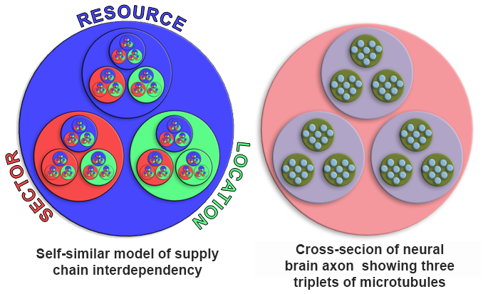

You can clearly see the triplet and holarchic design of this representation of the supply chain. This would be expected if you considered a supply chain as a large-scale version of a living system.

## Law of Laws

Earlier we used Newton&rsquo;s 2<sup>nd</sup> law as an example to show how one law has many contexts, but Newton&rsquo;s 2<sup>nd</sup> is only one of the three laws of *Newton&rsquo;s laws of Motion*. These Laws are:

1. Every object in a state of uniform motion will remain in that state of motion unless an external force acts on it.

2. Force equals mass times acceleration

3. For every action there is an equal and opposite reaction.

These are not simply three isolated laws, but rather three attributes of a greater phenomenon that describes all matter.


*(Later we show why these laws should be in the order of \#3 first, followed by \#1 and then \#2).*

## Psychology

Again, we see this same structure remarkably represented in the classic reinforcing loop between thinking, feeling, and doing, which is the basis upon which Cognitive Behavioral Therapy is built (we&rsquo;ll refer back to this a bit later).


## Music

The relationship of music to trigrams is so profound that it deserves a book unto itself, and many have been written, so I will only share that entire theories music are modeled on the trigram, such as the *Tonnetz* (German for *tone-network*) model, which is a conceptual lattice diagram representing tonal space first described by Swiss mathematician, physicist, astronomer, geographer, logician and engineer, Leonhard Euler in 1739. Modern music theorists take it a step further; that of a 2-dimensional map of trigrams mapped to a spinning torus… wow!  *Note: This model of music is also used used in the chapter "Predeterminism."*


## Reduction

You get the point, that being; every model can be described by a self-similar set of three axis. This is not arbitrary, as we claim that any system can be reduced to, and described by, a collection of *information primitives* (triplets or trigrams). From these essentially 2-dimensional *information primitives* (in that they can be described with only three points) we can build *knowledge primitives* that are tetrahedral (3D) in concept. 

Furthermore, we claim that these three primitives are essentially three different perspectives of one hyper-dimensional state that can only be expressed as multiple space-time states. An example of this is how pure, unmanifest and hyper-dimensional energy is expressed as four space-time states of volts, ohms, amps, and power, with any three capable of describing the fourth when it instantiates within the context and scope of sub-atomic particles. These 3+1 primitives are represented as a tetrahedron. We go even further and claim that the 3+1 dimensions of our reality (X,Y,Z, + time), is itself the most fundamental expression of this same model. 

## Info-atoms

If our premise is that the smallest element of knowledge must conform to the same laws as the smallest elements of form, conceptually speaking, then we need to show how these 2D models, such as the holarchy, fit into a not just a 3D model, but specifically tetrahedral structures that represent &ldquo;knowledge molecules&rdquo; with an ordered self-similar hierarchy where each holon is represented as a tetrahedron of information.

Our revised model of hierarchical tetrahedrons will surely look and act differently than a holarchy. To avoid confusion, we&rsquo;ll refer these *tetrahedron holons* as *tholons* (for obvious reasons), and the holarchy of tholons as the *thologram*.

#### **Claim 44:** Every tholon is an archetype. 

We are working from the premise that everything that exists is a product of a stable pattern existing between different states. The simplest concept of such a duality is that of *something* and *nothing*, although the idea of a void of absolute nothingness is a bit much to grasp. As for *something,* we don&rsquo;t need to imagine something that represents everything at once, which is not only beyond our ability, but as everything has yet to come into existence, it is impossible. On the contrary, we only need to imagine the simplest form of something, for example, a singular dot. A simple dot on a blank page is a diagram of the model on which this reality, and all knowledge, is based.

This simplest of concepts can explain the holarchy, tetrahedrons, magic crystals, all the laws of physics and every form of intelligence in existence.

### Geometry I

The simplest way we can describe this process of emergence from a dot to everything in existence also happens to be the most effective way, and that is with the language of geometry.

> &ldquo;Philosophy \[nature\] is written in that great book whichever is before our eyes -- I mean the universe -- but we cannot understand it if we do not first learn the language and grasp the symbols in which it is written. The book is written in mathematical language, and the symbols are triangles, circles, and other geometrical figures, without whose help it is impossible to comprehend a single word of it; without which one wanders in vain through a dark labyrinth.&rdquo;

##### \~Galileo Galilee, 1564-1642

> &ldquo;It is the glory of geometry that from so few principles, fetched from without, it is able to accomplish so much. &ldquo;&rdquo;

##### \~Sir Isaac Newton


We are taught that the progression from point to tetrahedron follows a very clear and simple path of *point → line → trigram → tetrahedron*.

From the tholonic perspective, this is a very incomplete description because it considers any point to be just like any other point, but they are not the same, as each point has very different attributes. If we ignore those attributes, we are blind to what geometry can show us about so much more than shapes.


We start with a 0-dimensional dot represented by a blue dot in the middle of nothing *(Fig. c1)*. Because it is 0 dimensions and surrounded by nothing, it only exists as a concept. It has no form, no dimensions, no properties other than that it is a *concept* of a point that exists. But where does it exist? It can&rsquo;t be measured, seen, or interacted with in any way, so how can we say it even exists? We can only say it exists because of the awareness of its existence. The only difference between a void of nothingness and a void of nothingness with an imaginary point in it is the *idea* of an imaginary point in a void of nothingness. Without the awareness of its existence, the void of nothingness would simply remain a void of nothingness. This is our first duality, that of *nothingness* and the concept of *somethingness*, and also the first condition of imbalance.

This next step requires some philosophical conjecture because we have to ask why/how does a 2<sup>nd</sup> (green), dot appear *(Fig. c2).*

If we accept the premise that everything that is created has the attributes of, and limitations of, whatever created it, then, the answer is clear and simple. As this lone imaginary dot in the middle of infinite nothingness only exists as an awareness of the concept of a point in the middle of infinite nothingness, the one attribute this point *can* have is awareness, as that is what it was created from.  And what was this awareness?  We can on only presume that it was the most fundamental form of awareness, that being the awareness of existing (which is not the same as the meta-awareness of being aware that one is aware).  Additionally, being the only awareness that exists, it is virtually *unlimited awareness*.

There is one more attribute it has as well that is far less obvious, and that is *intention*, because whatever awareness conceived of a point in nothingness had to have the intention to conceive of it. So, our point in the middle of infinite nothingness has two attributes; awareness and intention. 

We see this same concept, that all of creation is the result of *divine* awareness and intention, in the spiritual texts of every major belief system (except Buddhism, which has no concept of a divine being).

In fact, in Jewish, Christan and Islamic lore, when Moses asked God what his name was, God was quite specific about this and not only told him his name was "I Am That I Am", but also informed Moses he was but a messenger of "I AM", a messenger of the the most fundamental form of awareness.  Interestingly, the verb "I AM" in biblical Hebrew can also mean "I Will", as there was no *past* or *future* tense in those days, only *finished* and *unfinished* tense, so the act of being *what is* and being *what one wills to be* are one in the same as far as past and future goes, but has two states, one that is *finished*, and one that is *unfinished*. Here we again see the two attributes of awareness and intention.

We also see this in physics. Take the example of energy, mass and light, as we briefly addressed earlier.  Light has no mass, and without movement, it also has no energy and only exists as the concept of a 0-dimensionless point.  Without movement there would be nothing to measure nor would it interact with anything. This conceptual point, a result of *awareness*, only has properties when it moves (speed, frequency, amplitude), and this movement is an expression of *intention*, making light the purest expression of the awareness and intention that created, and creates, reality.

This may sound like we&rsquo;re teetering on the edge of mysticism, but this is not our goal. We simply are following the most reasonable path that our ability to understand our reality allows. The fact that it suggests that all of existence is a form of awareness that is ever becoming aware of itself is not mysticism, it is reality. Science is slowly beginning to consider that there might be a relationship between awareness and reality, but at some point, it will be common knowledge that awareness is not only the fabric of reality, but it is also the energy that drives all of creation and the most powerful energy in existence.

#### **Claim 45:** Pure energy is primal awareness and intention. Energy as we know it, &ldquo;the ability to perform work&rdquo;, is the balancing of the imbalance between states of that ever-bifurcating energy.

So, our first dot has two attributes, awareness and intention, and the limitation of 0-dimensions. This dot then is itself a form of awareness and being so, it will be aware of the existence of *dotness*, not *its dotness*, just *a dotness*. Just as the awareness of a conceptual point created the first dot, the first dot&rsquo;s awareness of dotness is what creates the 2<sup>nd</sup> (green) dot, and in doing so, creates the 1<sup>st</sup> instance of a dimension. Just as the first dot was created by an awareness, so to was the second dot created by the awareness of the first dot.  Perhaps this is what Nietzsche was referring to when he said (in *Beyond Good and Evil*) &ldquo;And if thou gaze long into an abyss, the abyss will also gaze into thee.&rdquo; With two dots, we now have a relationship between them as shown by a line *(Fig. c3)*.

Each of these dots is aware of *its* dotness now, not just *a* dotness, because, with the existence of the other dot, each dot now has a center of its awareness *(Fig. c4)*, and the other dot defining its opposite and the limits of its awareness *(Fig. c5)*.  Where before there was only that of unlimited awareness, now there is awareness that is limited by, or defined by, awareness. This results in two types of awareness; the *subjective*, which is the awareness of one's existence, and which is infinite by nature, and the *objective*, the awareness of another's existence, which is finite by nature.  

As both dots are aware of their own dotness and of the other&rsquo;s dotness they are also aware of where these two opposing awarenesses, one subjective and one objective, interact. These limits that define the interaction between these two states of awareness are the (red) 3<sup>rd</sup> dot and 4<sup>th</sup> dot *(Fig. c6)*. 

We now have the two poles of the first polar-duality that was created within the non-polar duality of nothingness and somethingness. This polar-duality might be described as that of *unlimited awareness/limitation of awareness*, *subjective/objective,* or a number of other possible descriptions depending on what properties one sees in the green and red dots. We will use the colors of blue, green and red to symbolize the attributes of these dots. Here they are described and listed in their order of instantiation.

The 1<sup>st</sup> blue dot represents the initial or parent 0-dimensional dot that has no ability to create dimension and exists only as a concept of awareness.  This is the dot that defines the simplest form of existence as pure awareness and is by nature.

The 2<sup>nd</sup> green dot represents the first-generation dot created by the blue dot. This dot can add 1 dimension to 0-dimensions and defines separation and division, creating the conditions of subjective and objective, and consequently the idea of self-awareness as a result of a state of awareness with respect to another state of awareness.

The 3<sup>rd</sup> red dot represents where the blue dot and the green dot interact. The 3<sup>rd</sup> dot is always created as a pair, one for each of the opposite states of blue dot-green dot interactions. This dot can add 1 dimension to an existing 1-dimensional space and defines the concept of *scope* and *area* as a result of the *union*. 

Now a perfect trigram exists, but so do three others. It seems that from here on we can&rsquo;t make just one trigram without three additional trigrams coming into existence. Instantly we have an infinite loop of self-similarity. From the tholonic perspective, the instantiation of this concept of instant expansion was instantiated when an atom-sized point representing all matter in existence quickly expanded to fill the universe, at least according to the Big Bang Theory.

This ever-expanding conceptual model, however, is imprisoned in the 2D world forever because even though it can make an infinite number of dots in the 2D plane, it cannot make a new dot that expands itself into the 3D plane. Why can&rsquo;t the same process that was used to create 2D from 1D be used to create 3D from 2D, by just creating another dot with another dimension?

The reason is as follows: There can only be three types of dots in the 2D world because that is the minimum number of dots required to define an area. If we added a new 4<sup>th</sup> type of dot that was also constrained to the 2D world, whatever area it creates could be defined using three dots just as well, so, this 4<sup>th</sup> dot adds no new information and is useless. We need a completely new type of dot that is compatible with all three types of dots.

Not surprisingly, the trigrams have already given us the answer with the following two clues. The first clue is that the creation of one trigram implies the creation of three additional trigrams, each one connected to each side of the center trigram. The second clue is that for each of these new trigrams another dot is created. These three additional dots at the outer tip of the new trigrams are each of a different color. As every trigram must be composed of three unique dots (R, G, and B), and as a new type of dot capable of creating a 3D tetrahedron from the trigram would automatically create three new trigrams, whatever dot type this new dot is, it would have to act as a red dot to the blue-green pair of the original trigram, a blue dot to the green-red pair, and a green dot to the red-blue pair.

Looking at *Fig. c8* we see that these are exactly the types of dots that have been created; one blue, one green and one red. All we need to do to combine these three dots together is combine these three dots into a new composite dot, and *viola*, we have a new dot type that can create the 3<sup>rd</sup> dimension.

The RGB dot  or White dot  represents the combination of all three primary dots. This dot can add 1 dimension to 2-dimensions and defines volumes as a result of the union of three unique trigrams.

We now have a tetrahedron.

We can easily demonstrate this by simply folding the three outer trigrams up until their three points meet. The folding occurs naturally because it represents the most balanced and efficient interaction between a set of four unique dots (R, G, B, W), and as energy will always travel the path of least resistance, folding would naturally occur.

*Note: This same concept is also explained is a mathematical manner in the chapter "How Creation Works" in Appendix C, "Tholonia and the I-Ching."*

## Holons to Tholons

Let&rsquo;s apply some of the semantic concepts to the holarchy as it will shed more light on the nature of information and how a holarchy forms a network of trinities in the way these holons interact with one another.

We begin with a simple trigram.

According to the creators of the holarchy model, each holon has three functions:

-   Contributes (upwards relationship)
-   Negotiates (sideways relationship)
-   Defines (below relationship)


These attributes hold up quite well when compared to our real-world example of a supply chain.

-   Production (what it contributes)
-   Trade (negotiations, cooperation and/or competition, exchange of resources)
-   Consumption (limits, and/or definitions, of resources)

You can also easily see how the above relationships can be described semantically as two objects (the holons) that have a relationship via the predicates *define, contribute,* and *negotiate*.

We can also visually represent the relationships in the following manner, which allows us to easily map this to a trigram:


## Tholograms

### Geometry II


Let&rsquo;s take these three relationship attributes of **C**ontributes, **N**egotiates, and **D**efines (which we&rsquo;ll shorten to just C, N, and D) and map them to the three points of a trigram. One point to add here is that the word *negotiate* is synonymous with *achieving a balance*. We could even replace the word *negotiate* with *balance* but *negotiate* implies a process rather that a state, plus, the word *balance* has a lot of baggage in today&rsquo;s culture that we&rsquo;d prefer not to inherit, so *negotiate* is a better word.

How do we know what attribute maps to what point? Further on we will show a more complete argument, but for now we can simply say if we have a parent, a child and a peer, as we do in both the holarchy and thologram, the parent would be the 1<sup>st</sup> point, the child the 2<sup>nd</sup> point, and the peer the 3<sup>rd</sup> point, as shown in the figure on the right.

Why are we just mapping the relationship properties, or predicates, and not the objects? Here&rsquo;s why:

In the holarchy, the *types of elements* are Parent, Peer, or Child, and the properties of **C**ontributes, **N**egotiates and **D**efines describe the relationships between these types. Our trigram is defined by the *properties* of the holons (*Fig. t2 below*). We could have just as easily defined a trigram of the *types of elements* alone, as shown below (*Fig. t1*). In fact, this is typically how hierarchies are organized. In our case, however, we are using the properties, not the types, because the movement of energy is in these property archetypes, not in the elements themselves, which are the expressions, or stable instances, of these properties.

We are using this idea of energy and movement as the foundations of reality rather that the *things* themselves. This is not a new idea. The *Reciprocal System theory* is built on the same premise and provides the best explanation of why we are using the movement of energy in the relationships and not the contexts of where that energy is coming from or going to.

> The thesis of the Reciprocal System, however, is that the universe is not a universe of matter, but a universe of motion, one in which the basic reality is motion, and all entities - photons, particles, atoms, fields, forces, and all forms of energy - are merely manifestations of motion.[^51]

Like every theory, it has its fans, but also its critics. In any case, it applies perfectly here. 

Newton&rsquo;s Laws of Motion are similar in this regard, as the laws of motion describe the energy that relates to mass, not mass itself. Because of this we can show a direct relationship between these tholonic concepts and Newton&rsquo;s laws:

**Newton&rsquo;s 1<sup>st</sup> law states** *&ldquo;Every object in a state of uniform motion will remain in that state of motion unless an external force acts on it.&rdquo;* This law introduces the concept of an instance of mass, putting it the realm of the 2<sup>nd</sup> &ldquo;green dot&rdquo;, and its limitations. Its inability to move or change without an external forcing acting upon it puts it in the tholonic realm of
**Definition.**  The concept of *inertia* is defined here, being the restrictions on mass.

**Newton&rsquo;s 2<sup>nd</sup> law states** *&ldquo;Force equals mass times acceleration.&rdquo;*
**Force** is the result of time and space (acceleration and mass), so it is within the realm of the 3<sup>rd</sup> &ldquo;red dot&rdquo;, scope and area, and tholonically is within the realm of
**Contribution**, as it creates a new concept that describes the most fundamental property of energy, that being the *force* of movement. 

**Newton&rsquo;s 3<sup>rd</sup> law states** &ldquo;*For every action there is an equal and opposite reaction.*&rdquo; This equates to
**Balance.** No mass energy is defined here, just as no dimension is defined in the 1<sup>st</sup> dot. This law only describes the result of existing energies acting against each other, associating it with the 1<sup>st</sup> &ldquo;blue dot&rdquo; realm of
**Negotiation**. The concept of *balance* (which includes the concept of imbalance) is born of energies interacting with one another.

Tholonically speaking, Newton&rsquo;s Law of Motions should probably be in the following order:

1. *For every action there is an equal and opposite reaction (Balance, Newton&rsquo;s 3<sup>rd</sup> law)*

2. *Every object in a state of uniform motion will remain in that state of motion unless an external force acts on it. (Inertia, Newton&rsquo;s 1<sup>st</sup> law)*

3. *Force equals mass times acceleration (Force, Newton&rsquo;s 2<sup>nd</sup> law)*

The primary reason why the properties or movement and energy are the key points in a thologram rather than the instantiated elements, as in the holarchy, is because it is the properties of movement and energy that are consistent at every level of creation. There may be millions of instances of different types of elements within the holarchy, from subatomic elements to universal elements, and everything in between, but the properties of movement and energy are always the same, even though they are expressed differently for each context. Therefore, it is the properties of movement and energy that define the structure of the hierarchy, not the instances of elements.

These properties direct energy, energy has movement, and movement has direction. In this example the direction is clear, however, this direction could change under different circumstances as we&rsquo;ll see later on.


To further illustrate this point, we can use the semantic example above where we show &ldquo;Alice *is a friend of* Bob.&rdquo; The thologram model looks at *is a friend of* as the energetic force that defines Alice and Bob, at least within this narrow context of *friendship*. Without relationships Alive and Bob would not even exist, as these relationships define every interaction down to the atomic level.

#### **Claim 46:** Relationships define the function and purpose of any instance

Now that we have mapped the three properties of N, C, and D onto a trigram we can see and label a new class of attributes that are the result of these properties interacting with each other. For example, what would we expect to see across a spectrum that is defined at one end as Negotiation, and at the opposite end, Definition (the line from N to D )? In the context of human interactions (just to keep it simple and clear), this pretty much describes how we agree on laws, rules, and limits. Across the spectrum of Definition and Contributions (D-C line), we would see how these two opposing concepts, one of restriction and one of expansion, interact with one another through cooperation or conflict. On the spectrum of Contribution and Negotiation (C-D line), we would see some sort of value returned to the society or culture, perhaps in the forms of work, dedication, or service (*Fig. t3*).


For the purposes of demonstration, we&rsquo;ll use these human context concepts going forward, but keep in mind these are just a few archetypal examples out of many, and only limited to one context. 

-   **Laws, rules, and limits** resulting from *Negotiation and Definition*.
-   **Cooperation of conflict** resulting from *Definition and Contribution*.
-   **Work, dedication, service** resulting from *Contribution and Negotiation*.

This trigram of relationships are present in every instance of creation and will be expressed according to the context and scope of its instantiation.  The example above uses concepts that are relevant to the human experience and which we have a functional and practical understanding of, these being *laws* (as in civil laws), *service* and *cooperation*.  In another context, such as the atomic world, *laws* would refer to the limits that an atom must exist within. *Cooperation/conflict* would describe how the atom&rsquo;s negative and positive forces work with, and against, each other, or perhaps how atoms fuse (unify, as in nuclear fusion) and fiss (as in nuclear fission, and yes, I just made up the word &ldquo;fiss&rdquo;, from the Latin *fissio*, meaning &ldquo;a breaking up&rdquo;). As we are limiting our definitions to societal contexts, we can easily see how this is instantiated in Adam Smith's *Theory of the Invisible Hand*, which is predicated on the idea of cooperation based on voluntary exchange that benefits both parties as well as the society. *Dedication* describes the aspects of an atom that enhances the ability or properties of its parent tholon, or the realm from which it was created, which in the tholonic view would be the realm of subatomic particles, such as electron protons and neutrons. What would subatomic particles be without atoms?  What would atoms be without molecules? What would organelles (specialized structures within a living cell) be without molecules… and up the chain it goes. In another direction of this same concepts, but perhaps more along the *service* idea, this might be seen in the way atoms enable electrons to move a charge very easily and very fast, or how atoms act as a sea of electrons that can be called upon at any moment to accept or donate electrons, a service we use and see everyday in the form of the electrical &ldquo;ground&rdquo;, that third pin on every electrical outlet.  With a little thought, we can find many examples.

Notice that in the first example when we used the three points of Parent, Child, and Peer, these elements are static (nouns), and their relationships of Negotiation, Definition, and Contribution are dynamic (verbs). Now when we use Negotiation, Definition, and Contribution as the three points, the relations between them are once again static. Were we to go further and use the three new static concepts as points we would again have relationships that were dynamic. This reversing back and forth between static and dynamic with each generation is a natural consequence of the creative process, as will see in more detail a bit further down.

#### **Claim 47:** Static instances (stable patterns) form dynamic relationships (movement of energy). Dynamic relationships  (movement of energy) form static instances (stable patterns).


Here we show the three points of N, D, and C as color sources that instantiate on the scopes (the lines, zones, or spectrums) opposite them. Think of each point as ever-expanding light that illuminates the &ldquo;wall&rdquo; opposite it. This is a much more complete idea of a tholon as it shows the tholonic concept as the sum of all the attributes (exemplified by the white trigram in the middle), with the points as archetypes, and the lines as the field, zone or scope of where new types of archetypes can emerge from.

We now have a completed trigram that describes the movement of energy in the process of creation. What would be the simplest instance of this trigram? Most likely it would be something like an atom, the first instance of matter, with a neutral (N), negative (D), and positive (C) particle. This is the description of hydrogen, the very first atom created, with one neutron, one proton, and one electron, the most abundant element in the universe and from which every other element that exists is created from. On the biological level, this describes mitosis, the process of cell duplication, or reproduction, where one cell gives rise to two genetically identical daughter cells. In the realm of philosophy, we have the Hegelian Dialectic of thesis, antithesis, and synthesis. In fact, for a tholonic concept to exist as a potentially viable and sustainable expression it must satisfy a form of the Hegelian Dialectic, in that it must support a thesis (D), antithesis (C), and synthesis (N).

We can learn a number of things from this trigram, but the one detail that is important before moving on is that the N-point is the originating point, and the only point that is able to replicate itself. Why this is so will be explained shortly. We will also refer to an N-point as an N-state or an N-source, depending on how it is being viewed.

### House of Mirrors

The tholographic claim is that within the trigram there is energy, and therefore movement, and therefore patterns and oscillations from which stable states will arise that are sustainable enough to form a new N-state that is capable of transferring energy across the scope defined by C and D. Even though one particular state will exist at one specific point on the 1-dimensional spectrum/line between C and D, all possible states will cover the entire range between C and D. We can generally guess where along the line various states will arise by applying a Bell curve to this line.

We can now say this about the trigram and its properties:

-   **N** (negotiation) equates to the 1<sup>st</sup> blue dot , which is the awareness of a concept in its simplest form.
-   **D** (definition) equates to the 2<sup>nd</sup> green dot , which introduces limitation, division, and separation.
-   **C** (contribution) equates to the 3<sup>rd</sup> red dot , which, with the previous two dots, results in unification and form.

By these descriptions, we can describe a general process that defines creation as something like:

> The successful joining of contrasting concepts (Negotiation) finding expression in form (Contribution) through limitation, division, and separation (Definition).

At the most abstract levels, this describes the Big Bang Theory, biological reproduction, the laws of physics, philosophy, and anything else that exists in any sort of duality. Of course, this definition is so broad that it is easy to apply it to anything.

### Inner, not Outer


We have seen how the creation of a single trigram will automatically create addition trigrams as part of the same creative process. This would imply that there is an infinitely expanding realm of trigrams, as shown in *Fig. c9* in the &ldquo;Geometry I&rdquo; chapter. This pattern, when limited to 37 points, is often called the *flower of life*. The tholonic model sees it a little differently. If we are claiming that the first instance of creation, that of the one dot becoming two, and the two becoming three, etc., even if we are just speaking metaphorically, then what we are also claiming is that this first trigram represents the very first duality, that of somethingness and nothingness. This would then imply that every duality and trigram that follows must exist *within* the first trigram, not outside of it, because every succeeding duality can only be a subset of this first duality. If we draw our expanding trigrams such that the children are always contained within the parent we see a very different pattern. 

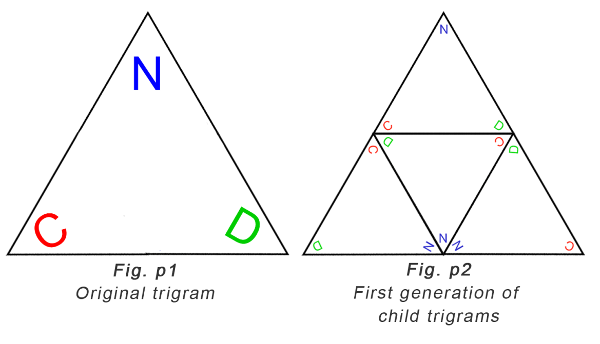

In this example diagram *Fig. p1* above, the outermost N, D, C points represent the first trigram. You&rsquo;ll see in *Fig. p2* on the CD line of this parent trigram a new N-state was formed. It too naturally bifurcates and expands in the same manner as its parent until it reaches its limits of the boundaries of the parent and in doing so creates three additional trigrams.

You may also notice what looks like an inconsistency in the order of the letters. *In Fig. p1,* the parent trigram, the order is (clockwise) NDC, but the three points of the resulting inner trigram are NCD. it&rsquo;s not actually a reordering, as the children trigrams represent completely new creations. The original NDC is still there in the parent, but we are only looking at the children in *Fig. p2*. The reason the children have a different order is because the new generation was spawned by the new N-source between C and D, and as D is always the first to follow N, and always on the left of N (left is arbitrary, but we need to remain consistent), the newly spawned D will appear on the opposite side of the parent&rsquo;s D. The same applies to C. Not coincidently, this new top-most trigram has the exact same order of points as the parent. The parent always creates a smaller replica of itself in each generation. You&rsquo;ll also notice that each of the outer trigrams is a reversed copy of the one central trigram.

We started with one trigram, created one more, resulting in 4 trigrams. Each generation of self-similar creation increases the number of trigrams by 4. Here is what the generations look like.


In the 1<sup>st</sup> generation of a simple trigram, we see a few fundamental rules, such as:

-   All sides are of equal length
-   Every point is connected to every other point.
-   Two points define a line, three points define a trigram. (seems super obvious now, but wait…)
-   The area of the trigram is known. _**(**√(num-of-sides)/(num-of-sides+1)**)** x length-of-side<sup>2</sup>)_
-   The radius of the incircle is exactly half the radius of the circumcircle.
-   The end-point where any two lines meet is always the middle of the line formed by the two adjacent points.
-   The total number of degrees of the angles equals half the total degrees of a circle. This is especially significant later.
-   The 3^rd^ red dot is a product of the 1^st^ blue dot and the 2^nd^ green point, and the next generation N-state blue dot is a product of the 2^nd^ green point and the 3^rd^ red point that form the CD spectrum or line. 

You&rsquo;re probably thinking &ldquo;What? Red and green don&rsquo;t make blue!&rdquo;  This is half true. Red and green make yellow, and yellow, when blended with the parent blue, make magenta and cyan… and cyan and magenta make blue. So, red and green parents do not make blue children, but they make blue grandchildren. We see an instance of this in the way recessive genetic traits can be become dominant in every other generation (in the absence of an existing dominant trait), which is what we would expect tholonically as genetics are one of the better examples of an instance of tholonic fundamentals. 

This is worth a demonstration. Here is that same process described above but with simple colors from the color wheel to show how the children interact with the parents. This is an important point, but because the process is the same for every generation, we are going to just use red, green and blue in our later examples to keep things simpler; i.e. going forward we will only show the dominant colors of RBG and ignore the intermediary children of CMY.


In the first case *Fig. t1*&hellip;

- Blue spawns green
- Green spawns red.
- Green and red create a new yellow.
- Yellow spawns a mixture of each of its component colors (red and green) with its parent color, blue, making cyan (created by blue and green) and magenta (created by blue and red)
- Magenta and cyan create a new blue.
- etc...

In the next case of *Fig. t2*&hellip;

This is the same process as the first, but the children are spawned internally, not externally.  Each new generation creates a new layer that sits on top of the parent layer and is a mirror of the parent. Eventually we end up with a grid that looks like the image on the right, which shows the smaller overlaid children on top of the larger, and opposite colored parent.

Here is a zoomed-out image of this (crudely drawn) grid:


Compare the outward-expanding model to the inward-expanding model:


We also see a few other interesting details in *Fig. p2*, such as, how the contribution of red divides the green (on the right side). Can we say the same thing for how green is what divided the red, such as it appears on the left side? No, because there is an order to the points of *blue > green > red*, so green existed *before* red, therefore the introduction of the 3<sup>rd</sup> red point must divide the already existing 2<sup>nd</sup> green point. Likewise, the green&rsquo;s boundaries are defined and limited by the red (on the left side) using the same logic that the green came first and the red followed.

In the world of mathematics, this internally expanding trigram is similar to something called a *Sierpinski Triangle*, which is also a self-similar triangle. This is significant as the Sierpinski Triangle has many real-world applications, such as broadband antennas, musical composition, mathematics, chemistry and is a foundational pattern in nature.

The difference between the thologram and the Sierpinski Triangle is in the latter there is the concept of two types of triangles, one that is capable of self-replication (the black triangles), and one that is not (the white triangles), which act like triangular *holes*, like this:


In the thologram, we consider the triangle not as an object, but as the boundaries that constrain the movement of energy. The fact that the center trigram is a reversal of the three outer trigrams is evidence of the significance of this inner trigram. One way to think about the thologram is the boundaries are like one-way mirrors, reflecting the light (energy) within the triangle, but allowing the light from outside to enter. This difference between the thologram and the Sierpinski Triangle is only conceptual because the math is essentially the same, but the thologram considers the negative or empty space just as valid as the filled space, just with different attributes, which we'll demonstrate.

With each generation, we have more and more rules. In just a few generations we see two dominant patterns begin to emerge from these rules. The first one being the Fibonacci sequence, which emerges simply by the linear increase in generation count as well as the number of trigrams for each generation (1,4,16), which is always 4<sup>gen</sup> (4 to the power of the generation number). 


Another dominant pattern is the hexagon, one of nature&rsquo;s most persistent and useful shapes, and can be seen in beehives, Saturn&rsquo;s north pole, dragonfly eyes, rocks, bubbles, snowflakes, organic chemistry, etc., but it is much more than just that. We are also shown how the N-sources converge to form the center every hexagon. From this, we get a much better idea as to the nature of N-sources, which are, unsurprisingly, at the center of order. This is important because it gives us an insight into answering the question &ldquo;Where did the first N-source come from?&rdquo;  It is also the pattern that is fundamental to the *flower of life*, shown above.

The  *flower of life* design dates back to 1300 BC, with the oldest known instance carved on the temple walls of the ancient Egyptian temple &ldquo;Osireion&rdquo;. Again, we see the same concepts and patterns appear over and over again in Man&rsquo;s search for understanding using the power of reason. We also see that every *Define* or *Contribute* point is naturally paired with its opposite.

Another interesting observation are those little black dots in the middle of the lines. Why are they important?

Those black dots mark the center of a line that has the capability of creating new children (stable patterns), or new N-sources. You&rsquo;ll notice that those lines only exist on the outer ring of the hexagon.


As we saw earlier, the N-source (blue) is the progenitor of the subsequent D (green) and C (red) dots. We also know that the N must always precede D and C. However, D and C, having all the attributes of the N, can create a new version of N. N and D cannot create a new N because it does not have the attributes of C (form), nor can N and C create a new N as it does not have the attributes of D (definition). Only Ns, or N-states, can be created as N-states have no form or dimension, a prerequisite for creating something out of nothing. An N-state is simply an idea or concept.  Cs and Ds are no longer simply concepts as they have dimension and therefore can not be created out of nothing.

This is a very important detail because it means that even though archetypes can appear across the NC and ND spectrums, they cannot create children, so no N-state will ever appear across these spectrums. However, the CD spectrum, which is the axis of *cooperation* or *conflict*, the opposing side to the point of *negotiation*, can create N-states*.* It may appear as though that would limit all the new N-states to only exist on one side of the trigrams, considering only one side of the trigram has the ability to create new N-sources. This is not the case, because as the trigram self-replicates it naturally rotates 60&deg; with each iteration, allowing every side of the trigram to be able to generate new N-sources. The graph above (*Fig. h1*) shows the lines connecting the N-states and their respective black dots.

### Everything Begins with Trigram

Just as every element in the periodic table is formed from hydrogen, so too is every generation of the thologram formed from the trigram.

A curious observations is if you take the simplest material version of the trigram (hydrogen) and the simplest material version of the hexagon (carbon), the two most fundamental forms in the thologram, and combine them you happen to get hydrocarbons, the most fundamental building blocks of life (and a bunch of plastic stuff), as all life is carbon based. Is it more reasonable to see this most basic structure of the thologram appearing in the most basic structure of life as a recurring pattern or to call it a coincidence?

We can also apply the same associative reasoning to the thologram as a whole to show how its structure appears as a pattern of growth in nature.


Here we are using the Sierpinski triangle which does not show the &ldquo;negative space&rdquo; of the thologram but simply a blank space. In the thologram, this blank space accounts for 25% of the tholon and is just as full of implicit patterns as the positive space is full of explicit patterns. This suggests that we are only seeing 75% of a tholon&rsquo;s instance, the remaining 25% also being an integral part of the instance, but simply not visible. More on this later.

There is no question that the natural processes of creation for nature follow these patterns, and with a little shift in perspective, for the natural process of creation for ideas as well when we apply this pattern to relationships rather than objects.

### 2D to 3D


So far all we have described is 2D trigrams. Where is the 3D tetrahedron? The 2D trigrams *are* the 3D tetrahedron, only flat. What happens when we convert this 2D model to 3D?

If we take the parent trigrams and fold it according to its four children, we get a tetrahedron. This is the structure of a tholon. Tholonic structures naturally occur because they are more efficient as a 3D object than a 2D map, and they are the most stable and complete state for all the properties involved.

The implication of this transformation from 2D to 3D is significant, for if we take our 2D model and turn it into a bunch of connected tetrahedrons of tholonic structures, we get the first instance of a 3D model that, among other things, shows the first instance of 3D oscillation.

Below is a more complete, step-by-step description of this transition from beginning to end.


Tholons model the movement of energy, and consider the existence of form as the consequence of that movement. With that in mind, let&rsquo;s look at the tholonic explanation using the figures above.

***Fig. a.*** We start with a simple trigram. This defines the most fundamental structure of how instantiations of archetypes come to exist, and therefore the flow of energy and their resulting forms.

***Fig a1***. The movement of energy inside this trigram will cause a new trigram to form. The most likely place for this new form is opposite the source of the energy and in the balanced center between the two limiting poles created by the source. When it creates its two children they are naturally in reverse order. We now have four trigrams with their points in their natural order and position.

As was shown above, the arrangement of the colored points (N, D, & C) in each outer trigram are the exact reversed image of the center trigram. One way to think about it is the original trigram (top-most) reflects and reverses itself and by doing so creates a new trigram (center), which also reflects and reverses itself in the two new trigrams (left and right). In this way, the center trigram acts like a reverse reflection trigram, and the two new trigrams are a reversed reflection of a reversed reflection. This will be an important point a little later.

Note: We are going to use colors (RGB) rather than types (NDC) because it is easier to explain using colors. You can remember that N = blue, D = green, and C = red, but for the purpose of these descriptions it does not really matter. When it does matter, we will return to NDC labels.

***Fig. a2***. Because energy always follows the path of least resistance and always seeks order, this complete tholon will automatically become a self-sustaining structure (tetrahedron) when all the conditions are met as it would represent the most efficient form. These conditions appear to require 4 types of points; BBB, RGB, RGR, and GRG. Apparently, B points only integrate with themselves and with an R and G together, while the R and G can integrate with each other.

This is the same phenomena that happens when a hydrogen atom and an oxygen atom meet; they naturally form a stable state (which also happens to form a trigram in the case of hydrogen and oxygen) that requires less energy than both of them require to maintain a separate existence. This is another example of the reactions caused by the need to create balance, similar to the hydrochloric acid/sodium hydroxide example mentions previously.

The implication here is that tholonic interactions can also release energy and that tholonic structures *could* be broken or altered by an outside force that has enough energy.

***Fig. a3***. Each of these child trigrams goes through the exact same process as the parent, with slightly different parameters that are determined by the limitation of their parent. We can now see four trigrams of four trigrams in their 2D form.

***Fig. a4***. This is a 4<sup>th</sup> generation tholon map, and to get an idea how many sets of tetrahedrons it holds the trigrams have been color-coded to make it easy to see. The darker colors represent what will be the base of a tetrahedron, with the light shade of the same colors representing their sides.

You&rsquo;ll notice that there are six sets of trigrams that are yellow (or a lighter shade of gray). These are identified a little differently because when they form a tetrahedron they do so by going in the opposite direction because they are a reversed reflection image. 

***Fig. a5***. If we go ahead and form the tetrahedrons we end up with a series of tetrahedrons connected at the corners, some pointing forward and some pointing away (the more faded ones). You notice that every odd numbered row (rows 1,3,5,7) are all *forward* trigrams (trigrams with blue parents), which we&rsquo;ll refer to as *real*, a term taken from the world of holography to indicate that the image is projecting in front of the film. Likewise, all even-numbered rows (rows 2,4,6) are pointing in the opposite direction (trigrams with yellow parents). We&rsquo;ll call these *virtual* tholons, a term also taken from the world of holography, referring to an image that *virtually* exists behind the holographic plate, rather than floating out in front of it. For every pair of rows (1+2, 3+4, 5+6) there are an equal number of real and virtual tholons.

***Fig. b1***. This is a side view of *Fig. a5*, with the yellow (bottom) tholons being virtual, and the blue (top) tholons being real. The black dots represent the peaks are also shown in *Fig. c1*, for clarity. This is where we see the first instance of oscillation, with the tholons alternating in their movement away from and towards their originating plane, or between the virtual and real states.

***Fig b2***. But what is happening in *Fig. b2*? Why are there more tholons stacked on top and on the bottom?

If you managed to slug through this up to this point, congratulations! Here is where it gets interesting: Each of these new trigrams formed by the peaks of the previous children acts as the base for *larger* tholons! The process beginning with *Fig. a1* starts all over for not only each one of these trigrams but for every face of a tholon or trigram, including its children.

If you look at *Fig. c1*, which is the colorized front view of *Fig. a5*, you&rsquo;ll notice that there are alternating sets of real and virtual tholons, and the peaks of these tholons (the black dots) naturally create new trigrams.


In 2<sup>nd</sup> generation tholons, the peaks are always the 4<sup>th</sup> dot type of RGB combined  (which we&rsquo;ll call *white* dots from here on), so how can a new tholon appear from three white dots? Doesn&rsquo;t it need three different unique colors to satisfy the conditions for a 4<sup>th</sup> white dot to exist? In fact, that condition *is* satisfied. If we make the RGB/white dots huge for demonstration purposes you can see how the colors line up to create three separate dots of three separate colors, but these 2<sup>nd</sup> generation dots are composed of three pieces of three dots that are 1/3<sup>rd</sup> each color.

For clarity&rsquo;s sake, we are referring to each generation of tholon children as *generations,* while the tholons that are created from the peaks of these original tholons, and their children, we refer to as *iterations*.

But wait, didn&rsquo;t the previous iteration have a base of three separate points of R, G, and B? And now it has a base of three white dots? Yes, but the only way to create three peaks of R, G, and B is to first create the opposite condition of three peaks of white dots, similar to the way a blue N-source creates a yellow child N-source, which then creates a blue N-source. With each iteration this pattern reverses itself, so the 3<sup>rd</sup> iteration will be like the 1<sup>st</sup>, with bases of RGB (but each generation rotated 120 &deg;), etc. All the odd number iterations have RGB peaks, and all the even number iterations have white dot peaks. Each iteration builds on the one before it, making larger and larger tholons, as you can see in *Figs. b2, b3, b4*, which shows the progression of real and virtual tholons.[^166]

Interestingly, the growth pattern of tholons is the inverse of a recursive Fibonacci sequence. Inverse, because we are multiplying instead of dividing, recursive because we do that for each trigram, children of trigrams, children of children of trigrams, etc.

***Fig. c1, c2, c3,*** and ***c4***. are orthographic views of the figures immediately above them. 

***Fig. d1, d2, d3***, and ***d4*** are isometric views of the figures immediately above them.

***Fig. d1*** shows the first instance of tetrahedrons. This first level is the foundation of all material existence because it is the first instance of a 3D form.  All form that follows (*Fig. d2, d3, d4)* is built upon these initial tetrahedrons.  This would (probably) be the domain elements and the quantum world.

There are two details worth mentioning. The first is, you&rsquo;ll notice that in the front view of *Fig. c2* you see the center tholon is a virtual tholon, and behind it, you will see real tholons. This is because just as real tholons can create virtual tholons, virtual tholons can create real tholons. This is where it really starts to sound like a fun-house of mirrors because how can you have real tholons inside virtual tholons? The simple answer is, real tholons in a virtual tholon are real relative to that virtual tholon they are within. These *virtual* real tholons are just as significant as the *real* real tholons because they function in the same manner as a real tholon, but virtually, which allows virtual tholons to be able to &ldquo;reflect&rdquo; back a real tholon. But, because they are all sourced originally from a virtual tholon, they only have virtual significance.

The second detail is, to make things more complicated, in the above figures we have colored all the real tholons yellow (light gray in B&W) and the virtual tholons blue (darker gray), but in fact, there are yellows within the blues and blues within the yellows. These were left out for simplicity sake as they were not critically important to demonstrate our point and can&rsquo;t be properly illustrated. The basic principle is the same however, in that there is an oscillating between real and virtual at each iteration.

Now we can start to fold this into itself. Each of the four sides that make up a tholon has their own domains of children as well, so this folding process happens at every generation (again, impossible to illustrate).

***Fig. d4*** shows the small portion of a thologram we have built that we will now begin to fold.

***Fig e1*** shows the beginning of the folding.

***Fig. e2*** shows the completed folding, with all the real tholons now within the parent, and all the virtual tholons outside of the parent. It&rsquo;s interesting how it naturally happens that only the virtual tholons extend past the boundaries of the hologram.

It looks like we have broken the rules that no children can exist outside of their parent&rsquo;s limits because we have a lot of virtual tholons sticking way outside those limits.

Remember when we were looking at the Sierpinski Fractal? One of the points made was that Sierpinski treated the empty space between the tetrahedrons as empty, wherein the tholonic model it is not empty, but rather negative space that is a reflection of the immediate parent. Now review the observation that this middle trigram, as mentioned above, is a reflection trigram. In one sense it does not exist any more than your reflection in the mirror does not represent the existence of another you, but it does exist in that the reflection is a perfect mirror-image representation of you, and this has significant value. It is an illusion, but an illusion that we need to take seriously.

All the virtual tholons are tholons that were created out of this nothingness space! They are *reverse reflective* tholons only. They do not exist, but they are very important. The virtual tholons are like the *nothingness* complement to the real tholons within the parent through which *their* reflection creates two more real tholons. This does not break the rules that nothing created within the parent can extend past its boundaries any more than looking at yourself in a mirror hanging on the wall does not put you on the other side of the wall, even though it appears that way.

Look at ***Fig. a5*** again. You&rsquo;ll notice that for every real tholon there is a virtual (reflection) tholon immediately below it. It is because of these virtual reflections that we can generate another iteration of real tholons.

***Fig. e3*** shows the ghosts of the virtual tholons, and *Fig. e4* shows only the real tholons folded into their parent tholon.

To get a better perspective of the dynamism of this structure, look at *Fig. f1* below, which shows the lines of influence of each tholon (which is that of a sphere).

If we go inside this very simple version of a thologram we see what looks like complete chaos (*Fig. f2*), but is, in fact, absolute stunningly perfect order and structure.


If we had used the simplest thologram possible in our example, using only 1<sup>st</sup> generation folds, rather than the 3<sup>rd</sup> generation folds above, it would look like the following:


Another fascinating pattern expressed in the thologram is the value for *pi* (&pi;, 3.14159) can be determined by alternatively adding and subtracting the inverse of the total number of N-sources for all the real and virtual tholons for each generations (which produces a series of sequential odd numbers; 1,3,5,7,etc). This was originally discovered by Leibniz and is appropriately called the *Leibniz formula for π*, as shown below. Notice how here we also see the reversing back and forth with each generation, which is a function of the creative process as described above.


The one last point to consider is best explained in the following thought exercise: Imagine what you would see if you were a 2D person living in a 2D world and a 3D object passed through your 2D reality. You would see a bunch of 2D slices of that object that changed over time.


Now imagine you are a 3D person living in a 3D world (which should be pretty easy to do) and a 4D object passes through. You will see 3D &ldquo;slices&rdquo; of this 4D object over time as it passes through your 3D world. For example, if a 4D ball passed through a 3D world it would first appear as a very tiny 3D ball, and then grow to a large ball, then shrink to a small ball before disappearing.

In both 2D and 3D cases, you are not getting the whole picture, but in both cases what you are getting is completely true and valid for the context of your 2D or 3D reality.

If we were to remove the original collapsed tholons (which represents the elemental and quantum layer of reality) from the model and only look at the iterations that represent the Newtonian material reality we live in, the thologram would look like a perfect tetrahedron, with none of those smaller protrusions that come from the original collapsed tholons.

In the same way as the 4D ball, a 4D thologram, being itself a tetrahedron, would first appear as a small tetrahedron, which is what we, and others, are claiming all reality is built from, conceptually at least.

Why is this detail important?

The 3D model of the thologram is a 3D slice of a 4 (or more) dimensional model. What the larger multidimensional object that we see as a tetrahedron actually looks like we can&rsquo;t say, and probably can&rsquo;t know. What would an 8D or 248D &ldquo;object&rdquo; appear as in this 3D world? It could appear as many, many different things. Take a look at all the ways a simple self-similar 3D tetrahedral pyramid can appear in 2D orthographic projections.


Now imagine the same tetrahedral pyramid with trillions of iterations and many more dimensions! It would have the ability to define or describe every archetype of everything,  every form, (every idea?) that ever has, does or will exist. Its perspectives would effectively be infinite to us, but at its source, it is one thing.

## Revisiting Dimensions

To specify the location of a tholon within the thologram we have to identify each tholon by an address based on its generation.


If we wanted to reference the topmost tholon in gen 4 by its base trigram, on the bottom right tholon in gen 3, on the bottom left tholon in gen 2, we would need to say it is at 1,3,2,1. The areas blacked out are virtual tholons which don&rsquo;t really exist (energetically) so we can&rsquo;t navigate to them (even though we can reference them). So, in this example, we need 4 dimensions to define the location of a tholon. At any one tholon&rsquo;s location, there can be multiple instances of tholons consisting of all that tholon&rsquo;s ancestors and descendants. Just saying the location of one tholon could just as easily refer to a subsection of a parent tholon or a group of children tholons. Any dimension would have to record the path taken to arrive at any particular tholon. The reason this is being mentioned is to show that each generation of tholons increases the dimensionality of the thologram by one dimension.

For example, to identify the position (P) of one tholon at the 45<sup>th</sup> iteration we would need a dimension that looked something like:

***P* =**1, 2, 3, 1, 1, 3, 1, 2, 3, 2, 2, 1, 1, 3, 1, 1, 1, 2, 3, 3, 2, 2, 2, 2, 2, 2, 2, 2, 3, 1, 2, 3, 2, 2, 1, 2, 1, 1, 3, 2, 1, 2, 1, 3, 1

But it&rsquo;s even a bit more involved because this dimension only points to one particular tholon within which is its own 3D space. In the thologram, we can&rsquo;t use a Cartesian coordinate system (i.e. X, Y, Z) because that would require a coordinate system that extends past the boundaries of existence, and we know that there can be no metrics in nothingness. We can only use a *quadray* coordinates (e.g. A, B, C, D) which are based on a tetrahedron, to identify a point within the tholon.

Does this mean that our 3D reality is embedded within a parent 3D reality? According to the thologram, yes, although I have no idea how this can be tested. An analogy we have to the idea of a 3D reality within a 3D reality is VR (virtual reality), where we can create countless 3D worlds within our own 3D reality using our existing 3D VR tools. One can easily imagine how we could create virtual realities within those virtual realities. Another analogy is how a hologram can create a 3D space from a 2D surface, and there can be many 3D spaces on top of one another recorded in that same 2D surface.

### Synergetics

What some people today call *sacred geometry* our ancestors simply called geometry. Contrary to what we learned in school, geometry is as much a study of philosophy as it is a study of form, space, and mathematics. Plato, Pythagoras, Parmenides, and a number of other great philosophers were well-schooled in geometry, but the marriage of philosophy and geometry goes back even further in history, and across every culture. Take the quadray coordinates system as an example. One could make a case that the Ancient Babylonian base-60 number system was an early version of this idea. In fact, one could make the case that the 20,000 year old Ishango Bone of the upper paleolithic era discovered in the Congo was the earliest version of a base-60 system. This bone is considered to be the first instance of the concept of the number one. On this bone are counting marks, 60 marks on one side, and 60 marks on the other side. One has to wonder why a paleolithic caveman would choose 60.

*Synergetics* is a modern-day example of how geometry forms the basis of the structure of creation, life and how everything interacts with each other. Buckminster Fuller coined the term *synergetics* in his three-volume work &ldquo;*Synergetics. Explorations in the Geometry of Thinking*&rdquo;[^52], wherein he explains how using a 60&deg; coordinates system can explain both physics and chemistry, but more importantly, he believed that it also explained reality. In his words:

> Since physical Universe is entirely energetic, all dimension must be energetic. Synergetics is energetic geometry since it identifies energy with number. Energetic geometry employs 60&deg; coordination because that is nature&rsquo;s way to closest-pack spheres.

He explains how the points and the lines of a tetrahedron (60&deg; coordinates) describe all elementary phenomena. Moreover, he claims that synergetics can measure our experiences geometrically, and how we can employ geometry regarding both metaphysical and physical knowledge.

The math he proposes is, according to him, based on the reality of empiricism, seeing as that all atoms are made of tetrahedrons, octahedrons, rhombic dodecahedrons, and cubes. Using this synergetic math, we have a coordinate system that works omnirationally, energetically, arithmetically, geometrically, chemically, volumetrically, crystallographically, vectorially, topologically, and energy-quantum-wise.[^53]

All these forms, such as cubes, hexagons, tetragons, rhombohedras, orthorhombics, or truncated icosahedrons, which is commonly known as the *Bucky Ball*, or, when in atomic form, *Buckminsterfullerene* (basically, it&rsquo;s a soccer ball),  and perhaps all forms, can be defined by points in a thologram.


The thologram, which is based entirely on the tetrahedron and quadray coordinates, is a model of knowledge, thought, and ideas. it&rsquo;s important to remember that the map is not the territory. These models of reality are like maps that describe the terrain. There are elevation maps, density maps, road maps, water maps, contour maps, temperature maps, population maps, economy maps, crime maps, San Francisco even has human feces maps! They all describe the same territory from different perspectives. The thologram is just one template that is a description, so to speak, a language that defines the organization and pattern of all energy at every level.


There are many alternative ways to map the thologram. What is shown here is just one way. How many ways are there? I don&rsquo;t know, but the extremely simple *three square geometry problem* shown above (&ldquo;what is the total of the angles *α*,*β*,*γ*?&rdquo;) has 54 possible solutions, and that is just with three simple squares (the answer is 90&deg;)!

As you can imagine, there is virtually no end to the relationships, patterns, rules, etc., that can be discovered. What separates knowledge from *apophenic* delusions (apophenia is the tendency to perceive connections and meaning between unrelated things and is considered a sign of early-stage schizophrenia) is whether a relationship, pattern or law can be tested to achieve predictable results.  On the other hand, we don&rsquo;t want to fall victim to *randomania* either (&ldquo;randomania&rdquo; is the unofficial term for people who attribute to chance that which is clearly the result of order, the inability to see patterns where they actually exist).

> It doesn&rsquo;t matter how beautiful your theory is, it doesn&rsquo;t matter how smart you are. If it doesn&rsquo;t agree with experiment, it&rsquo;s wrong.

##### \~Richard Feynman

We agree with Mr. Feynman, but we also have a broader definition of &ldquo;experiment.&rdquo; Life is reasonable by default, otherwise, it would not exist, but it is not always quantifiable, and often incompatible with current science.

OK, that&rsquo;s enough geometry. let&rsquo;s look at some chemistry.

## Application

### Water

We mentioned above that the first instance of matter would be tetrahedral, at least conceptually, but we also stated that form, being an instantiation of the laws of form, would follow that model, meaning we should expect to see tetrahedral structures as one of the building blocks of reality. And guess what? We do! But with a twist.

The actual first instance of matter are the elements, but no element has a tetrahedral structure when it is isolated. It is the bonds between elements that create the tetrahedral structure. In the tholonic model, the individual elements exist at the first level of the thologram, which are the first tholons created by the folding of the 2D &ldquo;map&rdquo; and are shown as the numerous and small tetrahedrons upon which ever-larger tetrahedral structures emerge from.

As a result, we would not see any 3D structures until the first iteration that emerges. A single H<sub>2</sub>O molecule is not a tetrahedron, it is a trigram. Water, however, is tetrahedral. This also supports the claim that elements are instances of the very first, and smallest, tetrahedrons, but it also shows that some simple compounds are in this foundational level as well, albeit in a more limited form due to its more limited scope.

 

Water is a particularly good substance for exploring tholonic structures because it is one of the first, if not *the* first, tetrahedral structure that all life depends on. Another early structure that is tetrahedral as a molecule alone is methane, one of the first organic molecules and not just a building block of life on earth, but quite possibly the basis for an entirely different form of life, as pictured in the *Azotosome* above, and one we might discover on the Saturn moon of Titan.

In the above geometry, we see that in the first generation of a tholon we have 4 trigrams, 3 of which are descending, or downward-pointing trigrams, and 1 is ascending, or upward-pointing trigram (&ldquo;up&rdquo; and &ldquo;down&rdquo; have only relative meaning here as it simply refers to the way the trigrams were drawn). If we have two tholons then we have a total of 8 trigrams made up of 6 descending and 2 ascending.

H<sub>2</sub>O is composed of three atoms. One atom is oxygen, which has an atomic number of 8 as it has 8 protons in its nucleus, which defines how much energy it holds as a &ldquo;charge.&rdquo; It also supports 8 electrons in its outermost shell, which represents its most balanced state. The other two atoms are hydrogen, the very first instance of Newtonian matter, the kind of matter that makes up physical reality as we know it. Hydrogen has an atomic number of 1 and has only 1 proton, 1 electron, and 1 neutron. Although oxygen wants 8 electrons in its outer shell, it only has 6, so it naturally forms a bond with two hydrogen atoms by sharing the one electron each hydrogen has to offer.

From a tholonic perspective, oxygen follows the pattern of two 3<sup>rd</sup> gen tholons from one face of a 2<sup>nd</sup> gen tholon, which has 6 *real* tholons and 2 *virtual* tholons (*Fig. v1* below, showing two 3<sup>rd</sup> gen tholons). Hydrogen follows the pattern of a complete 2<sup>nd</sup> gen tholon (*Fig. v2*, showing two complete 2<sup>nd</sup> gen tholons). Combining these two together (*Fig. v3*) would represent 8 externally-facing points (from the *real* tholons) of interaction and two internally facing points (from the *virtual* tholons) of non-interaction. When combined, the hydrogen tholons will attach to the empty or *virtual* tholons of oxygen.

We can see a few similarities between a tholonic model and a chemical model.

| *Tholon*                                                   |*Atoms*                                                    | *H~2~O molecule*        |
| ------------------------------------------------------------ | ------------------------------------------------------------ | ------------------------- |
| 8 points of interaction represented by the 8 real tholons    | Oxygen has charge of 8 and supports 8 electrons in outer shell for interactions with its surroundings. |                           |
| 2 points of non-interaction represented by the 2 virtual tholons | Oxygen has 2 vacancies in the outer shell (also has 2 electrons filling the inner shell which do not interact with its surroundings) |                           |
| Total of 10 tholons                                          |                                                              | Total atomic charge of 10 |
| Integration of 2 tholon types                                | Integration of 2 atom types.                                |                           |
| 3<sup>rd</sup> gen tholon structure 4x larger (in count) than 2<sup>nd</sup> gen structure | 3<sup>rd</sup> gen structure (O) is 4<sup>2</sup> larger (mass) than 2<sup>nd</sup> gen structure (H) |                           |


This is just a hypothetical demonstration, as there may be a much better tholonic model for elements and compounds than this one, but this one is sufficient to show how we might be able to describe elements and compounds tholonically, which might give us new insights into their nature. 


Can we see this similar relationship with other compounds? Given that the basic archetypal shapes of molecules (shown above) can be represented within the thologram, perhaps this model can be applied to all compounds. We claim this might be possible, as there is an almost infinite number of possible configurations in the thologram. Instances of fundamental configurations, such as those that appear in the earlier stages of iterations, like the Fibonacci sequence and the hexagram, would represent extremely stable patterns, and therefore we would expect to see them play a very fundamental part in our reality (like water and methane) and could be easily discovered.

### Quarks and Atoms

Here is another example of how we might discover tholonic structures in subatomic particles. Let&rsquo;s look a quark (which was originally named a *parton* by Richard Feynman to describe a hypothetical particle inside the nucleus of the atom).

Currently we understand that protons have a charge of +1 and are composed of two *up* quarks, which have a charge of +2/3, and *one* down quark, which has a charge of -1/3, and neutrons have a charge of 0 and are composed of one up quark and two down quarks.

This is seen in a single tholon and its reflection tholon as shown in *Fig. q1* and *Fig. q1a* below. The upper trigram has a parent trigram at the top which we can assign a value of -1/3, and the two children can be assigned a value of +2/3. The center child trigram, which is always a reflection trigram, has a value of 0. The opposite is true for the lower reflection trigram as well. With these values, the upper tholon has a charge of 1 and its reflection tholon has a charge of 0. This also seems to indicate that a truly complete tholon requires two tholons; itself and its reflection tholon. 


We need to very briefly address one item before continuing.  Within the first three generations of the thologram we have the underlying structure that all that follows is build upon.  It is as the third generation that patterns emerge that never change from that point on, such as the hexagram. We can see these patterns as contiguous boundaries of the same boundary *type*, shown in the image below. The left-most image shows the first three generations combined, with yellow lines connecting the red and green dots, magenta lines connecting the blue and red, and cyan lines connecting the blue and green.  Because there are three layers on top of each other it is difficult to show the connecting lines realistically, but if we isolate each color of connecting lines we see these patterns of boundary types.  Why are we calling them boundary types? Because as contiguous lines of the same type, they define where and how energy flows through the structure.  They are the channels of energy, each channel allowing the energy to instantiate with different properties. There are essentially two types; the *grid*, of which there are two, a pair of exact opposites (the magenta and the cyan), and the *matrix*, which is symmetrical and self-similar (the yellow). As contiguous lines, these patterns define the *bonds* that hold the thologram, and therefor existence, together. 


Only one of those patterns is self-similar, and that is the pattern caused by the lines that can support an N-state, which is the line that represents the spectrum between the two poles (of red and green) of an individual tholon, or the matrix of N-states that exists between the two opposite grids. 

That was all we needed to show, and it will be very significant in a few paragraphs.

If we looked at the 2D thologram map which shows these complete double-tholons, we get what is shown in *Fig. q2*. You&rsquo;ll notice this is identical to the previous graph (*Fig. h1*) that shows the lines of succession from N-sources to N-states across all three directions. This would suggest that quarks are an instance of N-states. Given that these pairs and also arranged in three different angles, 60&deg; apart, it would also suggest (remember, I am not a quantum physicist) that there are three classes of quarks.

Neutrons *do* exist, which seems to go against the tholonic idea that the virtual tholons don&rsquo;t create anything, but remember, this thologram is a model of energy and relationships, not of form, so what we would expect to see is some *thing* that has zero energy&hellip; like a neutron. And what holds all these subatomic particles together? The *strong nuclear force* (mainly), which is the tholonic equivalent of six integrated N-sources, the blue dot at the center of every hexagram composed of six N-sources, that holds the tholons together.

This would seem counter-intuitive as the *strong nuclear force* (SNF), which got its name because it is the strongest force in the universe, would not allow similar energies to couple, but rather repel, as we know positive repels positive and negative repels negative.  However, the SNF has a 'weird' quality such that it only repels like forces *after* they are separated.  When these forces are close to one another, the SNF pulls them together! Physicists call them weirdness *asymptotic freedom* (but is also sounds like most love affairs).

This is a significant observation. Most of what we have shown here involves how the movement of energy, in accordance to laws, brings form and ideas into existence, yet almost nothing is said about the nature of the energy itself, other than that energy in its purest form is ultimately an expression of awareness and intention. Here we have six N-sources which hold the tholons together to form the centers of all creation. In the quantum world, there is a similar concept of this energy that holds everything together, called *gluons*. Gluons hold quarks together using the SNF. Tholonically speaking it is the laws, described as geometry in the thologram, that hold everything together. The claim then is that gluons are (perhaps?) an instance of that law. The other forces that holds things together are electromagnetism, the weak nuclear force, and gravity, all (hypothetically) different instances of the same laws expressed geometrically in the thologram.  It seems intuitively obvious (to a non-physicist like myself) that the six N-sources (and their children, represented as the black dots on the edge), correlate quite neatly with the six 'flavors' of quarks (*up, down, strange, charm, bottom*, and *top*).

Understanding the tholonic nature of these forces may well give us an insight into understanding the nature of the source of the energy, which is to say, understanding the nature of the Awareness and Intention that created this reality.

There is also an interesting relationship with the One Electron Theory. This is a theory that theoretical physicist John Wheeler proposed (in a phone call at 2AM in 1940 with Richard Feynman) that there was just one electron in existence, and that all electrons were the same electron! This would be possible if that one electron was not subject to space-time, allowing it to be in all places simultaneously. Wheeler also claimed that not only are all electrons the same electron, but all positrons are also the same electron moving backward in time. As an electron it has a charge of -1, and as a positron it has a charge of +1.

The problem was, there was no space for a positron in the current model of the electron

In order to account for all the electrons in the universe, this one electron would have to move backward in time at least one time less than the number of electrons moving forward. This prerequisite is satisfied as can be seen in the previous diagrams of &ldquo;progression of trigram to tholon&rdquo; where there is always one more iteration of real tholons then there is virtual tholons.

If Wheeler's idea was correct, then there should be almost as many positrons in the universe as electrons, but there aren&rsquo;t.

Wheeler suggested that the missing positrons might be hidden within protons. This idea does not work with the current theory that a proton consists of only two up quarks, each with a charge of +2/3, and one down quark with a charge of -1/3 as there is simply no place in the proton where a positron, with a charge of +1, could hide.

However, in the tholonic model, there *is* a place for the positron to hide, and that is in the virtual space of a tholon. As was previously mentioned, there can be real tholons within virtual tholons. As this virtual space also acts as a reflection for the other three trigrams of a tholon it would act as the source of the positive charge of the reflection tholon&rsquo;s *child* tholon. So, if the positron were to &lsquo;hide&rsquo; in the virtual space of the reflection tholon its charge of +1 would neutralize the -1 charge of the reflection tholon, which would presumably have sort of (testable?) effect on the real tholon.

But what about the electron? Where is that? Tholonically speaking, the electron is a product of the imbalance of this hexagram, as it has a total charge of +1, and therefore it will automatically create an equal and opposite negative charge of -1, which is also the total charge of the parent reflection tholon. Where would this electron exist? At the opposite side of the N-sources across the scope of its children C and D, which is where N-sources manifest as stable expressions, i.e. on the outer most edge of the hexagram. In a complete and folded tholon, these three scopes create the three edges of the outer tholon that is opposite the reflection tholon, represented by the three black dots in *Fig. q1a*. As there are three different directions of these patterns, each 60&deg; apart, there is access to any active interface (which instantiates as an electron, or electron field) for every angle of the thologram.  If this were the case, we could speculate that an electron is the grand-child of all six N-sources (N-source -> black-dot children -> electron field).

More importantly, those dots where the electrons would appear only exist on the boundaries of the self-similar (yellow) grid we just looked at above. What this implies is that anything that uses electrons to exist, which is all matter as we know it, will naturally order itself in both a self-similar manner and in a way that can be mapped to that pattern. Does this mean that everything that exists is somehow based on a self-similar hexagram?  No (but a lot of stuff is), because the thologram is only one perspective of a much greater multidimensional model. Someone could create a different description of the same model from a different perspective. For example, a description that uses the binary math system, or any other set of symbols that make sense for the context and scope of the observer, even symbols that form words or, as in the case of our ancestors  that lived in the wild, symbols like the spirits of the plants and insects or the gods of mythology.

Just a quick callback, but do you remember that crudely drawn 2D map of overlapping tholons?  Compare that to a diagram I coincidently ran across from an article by Ethan Siegel, Senior Science Contributor to Forbes magazine[^172], called "*Can Free Quarks Exist Outside Of A Bound-State Particle?*"  Notice any similarities?  The correlation would be much better if I had any clue how to determine which quarks (R, G, or B) are equivalent to the tholon's N, D or C.


### While we&rsquo;re here&hellip;

We can now map Newton&rsquo;s 2^nd^ law to the tholon, which fits nicely.


Using Ohms Law to test it out, if we replace:

-   N (negotiation) with V (voltage)
-   D (definition) with R (resistance)
-   C (contribution) with I (current)

…we can then state the following:


Let&rsquo;s look at these definitions closer.

### The Meaning of Math

To look closer we need to make sure we're all on the same page regarding how the trigram can describe the math functions of Ohm&rsquo;s law, and to do that we need to clarify some really simple concepts, such as what do the math symbols mean in the real world. 

Addition and subtraction are easy concepts to grasp in the real world. We take some number of things and add or remove some number of things. A good example of the effects of addition and subtraction is how they affect colors.


What are multiplication and division then? It is the definition of one value by the units of another value. For example, in division, such as *3=12/4*, we are stating that 3 is what we get when we measure an existing value (12) by a unit of 4. In multiplication, such as *12=3&times;4,* we are determining a new value by taking one of these units-of-4 and adding it some number (3) of times. The 4, as the divisor or multiplier, is the *unit of measurement* and the 3 is the *number of units*. Every kid knows what was just stated, but when we apply those same simple rules and concept to a non-math context, they become very significant.

As mentioned above, we would expect to see the same laws expressed in different ways across all the scopes that the laws apply to, so we would expect to see an example of Newton&rsquo;s 2<sup>nd</sup> law in the tholonic realms of society, or planets, or organisms, and we do.


For example, if we claim that a society is based on its ethics, and we also posit that laws are to be measured by laws, we can say *society=ethics/laws*, and likewise, *ethics=laws x society*. If we measure the *power* of a *society* by its ability to function, and the measure of a *society* by its sustainability, then, according to these formulas, a *society* with a lot of *laws* and very little *ethics* will be functional but is less sustainable. On the other hand, a *society* that had a lot of *ethics* and very few *laws* will have the same level of functionality but will also be very sustainable.

How do we know this? Because if *s=e&div;l*, then we can say *3=6&div;2*.  Here we assigned the value or *s=3*, *e=6*, and *l=2*.  We can then also say *p=e&times;l,* or *12=6&times;2*, so now *power (p)=*12 when *ethics (e)* = 6 and *laws (l)* = 2.  If we then double the *ethics (e)* from 6 to 12, but keep *laws (l)* the same, we get *power=12&times;2 (p=24)* and *society (s)* then becomes *ethics&div;laws*, or *s=12&div;2 (s=6)*.

But if we double the *laws (l)* from 2 to 4, and keep *ethics* the same, we get the same *power* value of *p=6&times;4*, but our *society (s)* value now becomes *ethics&div;laws*, or 6&div;4 (s=1.5), which is a radical drop from *s=6*. (p.s. If we swapped the values of ethics and laws, the we get the same results (s=.666 and s=0.1666)).

It is up to the reader to decide if *laws*, *society*, *ethics*, and  *power* are the best concepts to use here and if so, what *power* (the rate, over time, at which energy is transferred) represents, and what *energy* itself generally represents in this context, and what the social equivalent of *squares* and *square-roots* are. How would this look if we used concepts such as *natural rights*, *privileges* and *responsibilities*?

This can apply to any properly defined trigram. Let&rsquo;s test it out on the cognitive behavioral trigram shown above. For example, if we claim that a *behavior* is a product of *thoughts* (one&rsquo;s own or those one is exposed to) and we also posit that *thoughts* are to be measured by *feelings*, we can say *behavior = thoughts / feelings* and likewise, *thoughts = behavior x feelings*. So, high *thought* with little *feeling* results in high *power* (whatever that is in this context.. intention? beliefs? desires? will?) and very low *behavior*, while low *thought* and high *feelings* results in equally high *power* and high *behavior*. I am not claiming that the values I have assigned for this example are accurate. I suspect it would take quite a bit of discussion and research to find the best values. The point of this is to suggest that with the correct values these equations would produce meaningful results. 

In any case, the twelve formulas of Newton&rsquo;s 2<sup>nd</sup> show some very interesting relationships between ethics, laws, society, and &ldquo;power&rdquo;, and, in my humble opinion, a new perspective on the dynamics of culture and society that, if nothing else, raises some important questions. As it applies here, it shows how the tholon can describe everything from atoms to culture. Because the math involved in a tholon can be more than the reader might be interested in, some of this subject is covered more deeply in Appendix B.

What is being said here is that from the 3+1 dimensions of reality, to the laws of electricity, to the way the psyche works, all of these are expressions of the same primary archetype, and its children. This means that *thoughts*, *ohms*, *laws*, and the *Z* axis  are the same primal energy or awareness expressed in very different contexts and scopes, just as are *feelings, ethics, volts, X axis*, or *society, behavior, current, Y axis*. This also suggests that *beliefs* (or intention, desire, will?), *time*, (social) *power*, and (electrical) *power* are also the same +1 &ldquo;white dot&rdquo; in different contexts and scopes.

With this in mind, let&rsquo;s reexamine the above claims:

**Definition = Negotiation / Contribution**

The definition of something is its boundaries, limits, abilities, attributes, properties, and resources. All of these details are the results of the scope and context of that thing&rsquo;s instance. It could be environmental factors, genetic attributes, planetary limitations, such as size and weight of a thing, energy levels, etc. It is the nature of energy to expand in every way possible. That expansion is the contribution, but it is the resistance from these factors that determines what expansions get the opportunity to be expressed and what expansions are thwarted. That battle between the force of expansion and the force of resistance is the negotiation (*see Negotiation=Contribution&times;Definition*). As *Definition* is *Negotiation* / *Contribution*, we can say that *Definition* is measured by that which is *Contributed*, or, the *Definition* of something is determined by what it can (sustainably) *Contribute*.

**Contribution = Negotiation / Definition**

What a thing can *Contribute* is measured by its *Definition*, but the degree to which it can contribute is determined by its environment and how it interacts with that environment. That interaction is a result of *Negotiation*. A thing must provide something that something in its environment needs, otherwise what it has to contribute is useless.

**Negotiation = Contribution x Definition**

A thing&rsquo;s ability to find a stable and sustainable position within its environment and scope is determined by the degree to which it can contribute with its current resources. A thing may have a *Definition* that gives it a lot of A and a little of B, but if its environment needs a lot of B and very little A, then it is B that the thing it must *Contribute* to ensure its existence in that environment, or it needs to find another environment, or change its environment so that A is in more demand.

## New Data?

Applying this Ohm's Law model to the tetrahedron shows some new relationships. Readers who enjoy numbers will find this next (short) section interesting.

So, we can satisfy all twelve formulas of Ohm&rsquo;s Law as they appear on a tetrahedron, but we can also find some new data now which may appear as useless, or may be meaningful if we know how to use it.

.

#### **Claim 48:** There is no useless data, only data we have yet to understand how to use. 

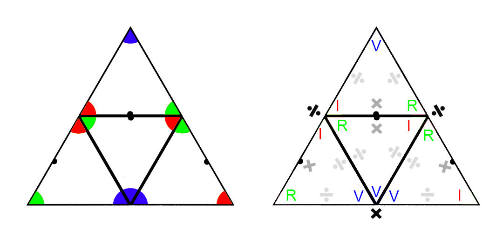

Previously (and in the left-most image above) we saw how the contribution of red divides the green on one side (right) but constrains the green on the opposite (left) side  . Can we apply these same concepts to other scopes, such as electricity? Does current (I) &ldquo;divide&rdquo; resistance (R) and is resistance (R) &ldquo;constrained&rdquo; by current (I)?  Yes, we can, but first we have to recognize that while &ldquo;constrain&rdquo; and &ldquo;divide&rdquo; have different meanings in their usual context, they have the same mathematical meaning. To describe the function X&div;Y as X being constrained by Y, because X is being defined by, or measured by, Y is not inaccurate, as X is indeed being &ldquo;kept within certain limits&rdquo; in as far has how it is being measured.  We can then say "resistance is defined by current" and "current is limited by resistance", both of which are technically correct statements.

In the right-most image above we have the 2D tetrahedron map with all V, I, and R values mapped to each trigram, along with the functions (&div;, &times;) that apply to the values as defined by Ohm's Law.  The gray functions are associated with the inner trigrams, and the black functions are associated with the outer trigram.  For example, Ohm&rsquo;s Law states that V&div;R=I, so in the image above, all lines that connect V to R are assigned the &div; function. The same goes for V&div;I=R and I&times;R=V. Note how only N-sources have the functions of &times;.


Let&rsquo;s apply values to these points to make it clearer. Above is a tholon map where I=2, R=3, V=6 (and the implied P=12). These numbers satisfy the formulas of Ohm&rsquo;s law as you can see by added gray functions (i.e. 6&div;2=3, etc). These are not arbitrary numbers. They are the smallest numbers that represent the properties of each point, mathematically speaking. Why do we not start with the number 1 then?  Because the properties of 1 are the antithesis of creation. 1 represents perfect unity and balance, whereas every number greater that 1 represents separation and imbalance. For example, if we applied the values of 1 to I and R, then the values of V and P will also equal 1. The number 1 is unlike every other number, and even Euclid excluded the number 1 in his *The Fundamental Theorem of Arithmetic*, which states:

> Every positive integer **greater than one** can be written uniquely as a product of primes, with the prime factors in the product written in order of nondecreasing size.

##### ~ Euclid, 4th century B.C.

The number 1 is a very lonely number as it stands in a class all by itself:

- 1 is *not* a prime number, nor is it a composite number (with respect to division).
- Any number multiplied by 1 remains that number.
- 1 is its own factorial.
- 1 is its own square and square root, its own cube and cube root, etc.
- 1 is the result of the empty product, as any number multiplied by one is itself. 

In fact, from the philosophical perspective of the Neoplatonists, the number 1 is not even considered a number in the traditional sense, but rather the *source* of all numbers.

For these, and other reasons, we can not start counting with the number 1, but need to start with the first number that represents a product of 1, or, a number that acts like a normal number in a practical sense.

For those who enjoy playing with numbers, the following will keep you entertained for days. I found many fascinating and significant relationships and values. I can&rsquo;t tell you what they mean or represent, but it would be irrational to assume they have no significance without knowing anything more about them. Everything that leads up to these new values is quite reasonable and provable. It is just a matter of discovering where these new values and formulas apply. To explain these new values here would border on sadistic given what the reader has had to suffer through already, and as it qualifies as a book unto itself I will spare the reader. However, there are just a couple I would like to share.

If we look at current (I, red, #2) &ldquo;dividing&rdquo; resistance (R, green, #3), on the right , and apply the function of division associated with the 6-2 vector, or side, we have 3^2^&div;2, which is simply 4.5 (which we&rsquo;ll call R~i~). On the left we have resistance (R) &ldquo;constrained&rdquo; by current (I) , which is 2^2^&div;3, which is 1.33333 (which we&rsquo;ll call I~r~). Neither number *seems* particularly significant, but if we multiply these numbers together, which we would because they are connected via the &ldquo;base&rdquo; of the trigram, the 3-2 vector, which has the property of multiplication (as shown above) we get R~i~&times;I~r~=6, which is the value for V. This proves that ohm's Law has not been broken. Using this same reasoning we can apply this to the three 6s, but as they are on a vector of multiplications, we would use 6^2^&times;6, or simply 6^3^, which yields 216 (which we&rsquo;ll call V~3~).

In any case, we have new properties of R~i~, I~r~, V~3~, all of which only emerging when the the complete tholon is defined. We can now say R~i~&times;I~r~=V. This means we can also say V/R~i~=I~r~ and V/I~r~=R~i~, all in accordance to Ohms Law. We can also calculate a new value for P as V&times;I~r~=P, but this gives us the value 8, which is a different value from P=12, so we will call this P~1~. Let&rsquo;s test that these values by applying the other formulas and see if we get the correct results. We can apply the formula I~r~^2^&times;R~i~=P~1~ where we&rsquo;d expect P~1~ to equal 8, and it does. P~1~/I~r~=V also gives the correct answer of 6.  

We have exposed at four new values within the tholon map; R~i~, I~r~,  V~3~, and P~1~ (being 4.5, 1.333, 216, and 8 when I=2, R=3, V=6, and P=12). Now all we have to do is find out what they mean and where they are applied in the real world.

Regarding V~3~, 216, however, well, this is a fascinating number that has a history that goes back to at least Plato, because we know (generally accepted by experts) that 216 is called *Plato&rsquo;s Number* and was described to Plato by Socrates who said (when explaining how to properly breed humans):

> For the number of the human creature is the first in which root and square multiplications (comprising three dimensions and four limits) of basic numbers which make like and unlike, and which increase and decrease, produce a final result in completely commensurate terms.

*(The word &ldquo;cubed&rdquo; was not in use in those days, but 216 is the first (smallest) cube which is the sum of three cubes. It also makes more sense how this might apply to human breeding when you know that back in the day odd numbers were considered male and even numbers were considered female. Math class back then must have been a lot more interesting.)* 

Plato elaborated on this in his &ldquo;Republic&rdquo;:

> Now for divine begettings there is a period comprehended by a perfect number, and for mortal by the first in which augmentations dominating and dominated when they have attained to three distances and four limits of the assimilating and the dissimilating, the waxing and the waning, render all things conversable and commensurable [546c] with one another, whereof a basal four-thirds wedded to the pempad yields two harmonies at the third augmentation, the one the product of equal factors taken one hundred times, the other of equal length one way but oblong,-one dimension of a hundred numbers determined by the rational diameters of the pempad lacking one in each case, or of the irrational lacking two; the other dimension of a hundred cubes of the triad. And this entire geometrical number is determinative of this thing, of better and inferior births.

##### ~ Plato, &ldquo;Republic&rdquo;

The above has been interpreted to mean 6^3^, which Plato alludes to elsewhere, as 6 (considered the number of marriage back then) is the product of female (2) and male (3), and 2^3^ &times; 3^3^ = 216. While 216 is the most accepted answer, great thinkers in philosophy, math, chemistry physics, etc., spanning over 2,000 years, such as Aristotle, Proclus, Marsilio Ficino,  Gerolamo Cardano,  Eduard Zeller, Friedrich Schleiermacher, Paul Tannery, Friedrich Hultsch, and more, have all tried to decipher Plato&rsquo;s enigmatic text. 216&rsquo;s fame may even go back as far as Pythagoras, as it is the sum of cubes of the *Pythagorean triple* (3,4,5, hence 3^3^ + 4^3^ + 5^3^), or even Ancient Babylon.[^171]

Later in history this pedigree number fell slightly into infamy when John the Apostle declared in Revelations that 666 was the number of the Beast (the beast that comes out of the sea, not the one that comes out of the abyss of the earth), but also the number of man. 216 might have escaped scot free if John had not specifically said that the number 666 was to be *calculated* (or *counted* depending on translation) to learn its true number.

> Here is a call for wisdom: Let the one who has insight calculate the number of the beast, for it is the number of a man *(ed: or &ldquo;humanities number&rdquo;)*, and that number is 666 .

##### ~ John, Revelations 13:18 (NIV)

Because 216 = 6&times;6&times;6 it gained a dubious reputation by association with the Beast of Armageddon and started popping up in some strange places, thanks to humanities generally suspicious nature and love of doom. Fans of the arcane ignore the most likely suggestion that John may have been telling to reader to *add* the numbers together, because in the original Greek it was penned as 600+60+6, and not "Six hundred threescore and six", as it appears in the most popular King James Bible. However, the odd coincidence that John&rsquo;s number of man (666), which needed to be calculated, has a strong relationship with Socrates&rsquo; &ldquo;number of the human creature&rdquo; (216), which also needed to be calculated, is curious… even more curious is why these old timer&rsquo;s preferred to shroud their message in incomprehensible riddles rather than just tell us the damn number! Ug… philosophers. Regardless, 216&rsquo;s clout in the religious counter-culture still holds up today. Just do an Internet search for &ldquo;216&rdquo; to see for yourself. 

## And the point is?

The point of all this is to show one way that the tholon can be used and viewed. There are many new ways of looking at energy in all its forms when viewed tholonically.


We showed examples of quarks and molecules, but in higher orders, such as DNA, we also see some striking similarities as well, and with a bit of investigation, we can probably find some stunning relationships.

Now, our simple *trigrams* of relationships, such as Ohm&rsquo;s Law, becomes a *tetrahedron* or *tholon* of relationships. Whereas before it was stated that every piece of knowledge can be deconstructed into a trigram, the more accurate statement is that every piece of knowledge form a tetrahedron (but we had to get through all this first before that could be stated).

## Batteries

With this tetrahedral model in mind, let&rsquo;s briefly jump back to the examples of deconstruction mentioned above. An example of how any system can be reduced to a tholon is presented in an extremely niche, but insightful article on the effectiveness of batteries, titled &ldquo;The Unfortunate Tetrahedron.&rdquo;[^161] In this article the author shows how the systems of a simple battery can be modeled as a tetrahedron, and how these fundamental aspects of a system relate to one another. In this article the author looks at the four aspects of batteries; *energy density*, *power density*, *operating cost* and *capital cost*. 

Where:

**Energy density** is how much energy a battery can store in its mass (like a dam).

**Power density** is how much energy it can deliver relative to its mass (like the turbines in a dam).

**Capital cost** is the cost of the battery.

**Operating cost** is the cost to recharge the battery, and costs associated with keeping it safe.


From this model we have four trigrams:


We can equate **E** with an *N-source*, **P** as a *defining* point, **C** as a *contributing* point, which makes **O** the unifying &ldquo;white dot&rdquo; point (for brevity&rsquo;s sake I won&rsquo;t detail the reasoning behind these associations. The reader may arrive at a different conclusion). With this ordering, we end up with the 2D tholon map (above, showing parent and next-gen children).  


According to the article&rsquo;s own conclusions, the relationship between **E** (energy density) and **P** (power density), which is equivalent to an *N-source* and a *defining* point, is what he refers to as the *Ragone Space*. The Ragone plot (above) measures the performance comparison of various energy-storing devices. This chart is a perfect example of the axis of &ldquo;laws, rules and limits&rdquo; that connects an *N-space* with a *defining* point in the model of the tholon.  

On the opposite side, between **C** (capital cost) and **E** (energy density), which is equivalent to a *contributing* point and an *N-source*, we have the tholonic axis of &ldquo;service&rdquo;, which I think also fits quite well if you consider giving your money to an organization or person for a product that fills a need is the definition of a &ldquo;service.&rdquo; Remember that the descriptions of &ldquo;laws&rdquo; and &ldquo;service&rdquo; were specifically meant to apply to the context of our daily lives. In the realm of economics, production and specifically batteries, that same intention might be described a bit differently.  

According to the tholonic model, the only place where a new stable pattern capable of replication can occur is between *define* and *contribute*, which here is **P** (power density) and **C** (capital cost). Across this spectrum of &ldquo;cooperation or conflict&rdquo; you will have all the various instances of batteries that can deliver power at a cost, most of the instances landing in the middle, representing the best delivery of power at the best cost. *Power* and *cost* are the two poles, the contrasting forces, the thesis and antithesis, of this spectrum. Here you would have instances like alkaline cell batteries (Duracell), lead-acid batteries (car batteries), nickel-cadmium batteries (rechargeable batteries), etc., etc. Each of these new instances (stable patterns), can then go on to create their own tholonic archetype.  

As the author relates in his article, which so aptly fits into the tholonic mode as well, &ldquo;You can have it good, fast or cheap; pick two out of three.&rdquo;

I could continue, but you get the point, which is (in case you didn&rsquo;t get the point), the model of the tholon can be used to describe any functional system or functional concept, from global supply chains to human language to batteries.  

### Adding Structure

A general prediction would be if we could add structure to energy, we would see testable results.

Given how water seems to be such a good tholonic medium, can we add structure to water in a way that matches the patterns of the thologram (in this case, the hexagram) and see some differences in how it transmits or interacts with energy? If we do see any differences, then we have another piece of potential evidence that supports the thologram model.

As it happens, there is such a thing as *structured water*. *Coherent* or *Structured* water, for those who are not familiar with the term, is regular water that has been modified to give it more structure or pattern, specifically in the way that the water molecules are arranged in relation to one another. 

OK, I know I probably lost some of the readers with this last sentence. If you do an Internet search of &ldquo;structured water&rdquo; one of the first results you will get is the Wikipedia entry that begins with &ldquo;structured water, is a term used in a marketing scam &rdquo; and although that is true to the extent that anything can be a scam in the hands of scammers, the entry says nothing whatsoever on the research and testing that has gone into the use of structured water.

To the dogmatically skeptical, anything that challenges the current world view is &ldquo;swarming with worms of heretical perversity.&rdquo; It doesn&rsquo;t matter if a new idea, in this case, structured water, has vast amounts of scientific research and support from highly accredited professionals and ample evidence one can find by researching the pioneers and leaders in the field, many with a lifetime of contributions and dozens of Chairs, Fellows, Adjuncts, and Accolades from their life&rsquo;s work[^54], as well as hundreds of papers and dozens of books related to and supporting the structured water phenomena. Skepticism has its place and serves a critical purpose, but regarding structured water, that purpose does not seem to be moving understanding forward or seeking new solutions to real-world problems, such as solving global water shortage problems and increasing crop production, as has been well documented by some of Australia&rsquo;s largest produce farms.

There is quite a lot of good research on the subject that we won&rsquo;t detail here, but if you want to learn more a good place to start is Fabian Ptok&rsquo;s Masters theses *&ldquo;Alternative Irrigation Methods: Structured Water in the context of a Growing Global Food Crisis due to Water Shortages&rdquo;*[^55], which covers the subject well from an agricultural and security perspective but also has a number of references to the researchers and work going on in this area. There is also a book available online for free[^56] (which I have not read, so this is not an endorsement).

Water is a particularly good test medium because the structure of water (not the H<sub>2</sub>O molecule alone, but many of them together) is a tetrahedron, and being the most basic shape of creation lends itself to many different tholonic applications. it&rsquo;s worth noting that when it was originally suggested that water might be tetrahedral is shape back in 1938 the idea was met with disbelief. It was not until 80 years later, in 2013, that this was finally accepted as valid. Today &ldquo;it is widely accepted that liquid water structure is comprised of two closely interweaved components; i.e. tetrahedral and hexagonal structures.&rdquo;[^57] In fact, water, as ice, may be the closest instance of the entire tholon&rsquo;s structure of any other substance.


Radical ideas are often met with radical resistance. Structured water is one of those ideas.

Simply by adding some structure to simple tap water (see examples of how to make structured water in Appendix A) we can see the following effects:

In Ptok&rsquo;s the Master&rsquo;s thesis mentioned above, the author examines various tests that grew different plants using tap water and structured water.


One of his findings was that using structured water increased alfalfa growth by 15.1%. This may not sound like much, but in the U.S. alone a 15% increase in alfalfa growth represents an additional 20,700,000 tons of alfalfa, which has a value of over 4 billion dollars.

This is a perfect example of how the simple enhancement of order at the most fundamental level can have radical changes up the chain. These dramatic (theoretical) results were achieved with only one change to one element in one application.

In the tholonic modal, this example also applies to ideas, concepts, and intelligence;  small changes in one area can have radical consequences in the world of ideas, and of course, ideologies.

<div style="page-break-after: always; break-after: page;"></div>
# 8: MIND

Although there have been many allusions to the idea that awareness is an inherent property of existence, let&rsquo;s make this clear.

If the concept of a thing and the thing itself are two orders of the same form of expression of energy, and order is a prerequisite to intelligence, does this imply that everything with order, i.e. everything that exists, potentially has a form of intelligence? In the tholonic model, yes, but more than that, even without order or intelligence there is awareness *and* intention.

This is not that radical of an idea, as many great thinkers in the past have come to the same conclusion.

> &ldquo;There is a quality of life and intelligence to all matter. The living universe.&rdquo;

##### \~Giordano Bruno (1548-1600), cosmological theorist, philosopher, mathematician & poet burned at the stake for heresy.

> &ldquo;Crystals are living beings at the beginning of creation&rdquo; In crystals, we have a pure evidence of the existence of a formative life principle, and although in spite of everything we cannot understand the life of crystals - it is still a living being.&rdquo;

##### \~Nikola Tesla

There is a name for the idea that consciousness is a property of existence; *panpsychism*. You can read about its impressive history[^58] and the glowing support it has received over the last 2,000 years from some of the greats of philosophy, psychology, and science. The minor difference between panpsychism and tholonism is that the latter claims it is awareness and intention, not consciousness, which is the property of existence and from which consciousness and intelligence arise.

Intelligence in this context does not mean &ldquo;critical thinking&rdquo; or &ldquo;self-aware&rdquo;, but it does mean creativity, learning, and problem-solving, properties that nature, and the universe, has demonstrated with flying colors. We can go further and claim that the amazing relationships in simple geometry, such as the tetrahedron array with its Fibonacci numbers and hexagonal patterns that pretty much define the laws of nature and reality are evidence of logic. So, let&rsquo;s add &ldquo;logic&rdquo; to the list of properties. What about &ldquo;planning&rdquo;? Does nature plan anything or do we all just happen to live in a corner of the Universe that was lucky enough to win the Cosmic Mega-Lotto? We can easily see that the simple relationships between three points instantly define an infinite array for order, pattern, and symmetry on many levels. This isn&rsquo;t just *a* &ldquo;plan&rdquo;, it is *the* plan.

Is there creativity in the universe? Only if one considers all of creation an act of creativity. Does the universe learn? Well, have things evolved over the past 4.5 billion years by building on an ever-growing foundational structure? If you answer yes, then we&rsquo;ll add *learning* to the list. What about problem-solving? This is a tricky one, because there is no such thing as a &ldquo;problem&rdquo; from the perspective of existence, because, as we have covered, if something does not follow the laws it does not exist. If it does follow the laws, it does exist, so where&rsquo;s the problem as far as the Universe is concerned? &ldquo;Problems&rdquo; appear to be a concept born in the meta-awareness of more developed life forms. Still, the fact that existence is only afforded to that which follows the laws, I would say that this is damn good preemptive problem solving as it prevents problems from ever happening in the first place.

So far, we have:

-   Creativity
-   Learning
-   Problem-solving
-   Logic
-   Planning

We have been making the case that ideas themselves are an expression of energy, and as they clearly incorporate and are even defined by all the properties of intelligence listed, it&rsquo;s reasonable to conclude that ideas themselves emerge from a form of intelligence, and may even have their own intelligence.

However, this intelligence is quite different from what we would call human intelligence because of its aggregate nature. it&rsquo;s more of a recursively embedded network of countless decentralized nodes of intelligence. It&rsquo;s the intelligence of the thologram as a whole rather than the human intelligence of one tholon alone. A more graspable metaphor that applies to intelligence is that of a large tree. Each part of that tree is an instance of the concept of &ldquo;tree&rdquo;; trunk, branch, stem, leaf, seed, etc. There can be many instances of each contributing tholon, such as a leaf, but they are all part of &ldquo;tree&rdquo; and can only exist without the parent &ldquo;tree&rdquo; tholon. You and I, and all things. are but &ldquo;leaves&rdquo; or &ldquo;seeds&rdquo; or &ldquo;stems&rdquo;, or parts thereof, on this tree of universal intelligence, and like the leaf, we can not exist without it (even though we think we can).

### Aggregates

One of the attributes of a tholon, unlike its holarchic predecessor, is that the context and scope of a tholon is not only defined by the dualities of that tholon, but also by all the tholons above and below, as the children tholons are always contributing to the parent, and the parents are always defining the children.

#### **Claim 49:** Anything that exists, that has a sustainable pattern of energy, has some form of intelligence and is a contributing element to the larger intelligence that is shared by all existence. 

It is easy to see instances of this on a molecular level, such as how water is an aggregate of hydrogen and oxygen. While the scopes and contexts of the elements are fairly well known, consider that water is a *parton* of larger tholons, such as clouds, tsunamis, wells&hellip;

We have a similar concept in the way our social institutions work. *Interinstitutionality*, as this has been termed, explains how the various institutions of society like financial markets, governments, family structures, educational institutions, etc., all intertwine and create amalgamations and aggregates with one another.

Interinstitutional research is defined as the investigation of the chain of complex, interrelated problems regarding tactics, sampling, data reliability, and notions of causality within the realm of each separate institution with the goal of improving aggregation and amalgamation.[^59]

Take the institution of the modern American family as an example. It can take many forms, but several extra-familial institutions affect the complexion of &ldquo;family &rdquo;, such as the market, profession, educational institutions, political affiliation, etc. Each of these institutions brings to bear its own forces and logic on the amalgamated and aggregated institution of the family. The market shapes perceptions of standards of living in the family. The profession shape ideas of work and service. Educational institutions shape the ideas and direction of society. Politics shapes our understandings of the role and participation of family members.

All institutions of society are not simply autonomous social units isolated from wider institutional dynamics, but rather several structures wrapped up and labeled according to the concept of its purpose, each structure having its own set of rules, scopes, and contexts, forming aggregate and amalgamated rules, scopes, and contexts.

This is equally true for the institution of modern science which is every bit the product of interinstitutionality as any other single institution. Far from the secular myth of an objective value-free isolated social unit, modern science is itself an amalgamation of a whole host of non-scientific institutional factors such as the market, education, special interests, the state, politics, professions, etc. Just watch the news to get an idea of how science is controlled by politics, economics, and culture in general.

### Tholonic Intelligence

We have a concept of a *human* collective intelligence, but we define it as something that has emerged from human intelligence, as opposed to human intelligence being an instance of an existing collective intelligence.

The tholonic view is that awareness and intention are not only attributes of existence; they are the cause of it, as explained previously. More than that, awareness and intention are the ultimate, or purest form, of what we call energy, as energy is the balancing of a difference, and all differences come from separation, which is the result of awareness and intention.

#### **Claim 50:** Every archetype has an awareness, an intention, and an intelligence appropriate for its scope. 

On this point, tholonic thinking has coincidentally arrived at the same conclusion recorded 3,000 years ago in the Sanskrit Vedas which states that first there was awareness, then there was consciousness, and because of this, and according to the Vedic path, consciousness or intelligence can never be the path to awareness. On the contrary, the path to awareness starts with quieting consciousness, according to the Vedas. This point starts to lead into a philosophical realm, so we&rsquo;ll just leave it at that and let the reader take it from there.

However, the tholonic view is that intelligence precedes consciousness. This still complies with the traditional definition of intelligence as &ldquo;The ability to learn or understand or to deal with new or trying situations.&rdquo; The difference being, in the tholonic model, consciousness is not necessary to learn, understand or deal with challenges. We are seeing this today in AI systems that certainly can learn, understand and deal with the challenges before them, but these AI systems are not conscious… yet. Does that mean these AI systems have awareness? Only to the degree that everything has some level of awareness given that awareness is the source of existence, but not necessarily at the tholon level, meaning, the archetype for a toaster has a nominal form of intelligence as well as access to the existing primitive intelligences of its parents (metal, electricity, etc.), but it has effectively zero effect on the aggregate. This is similar to the idea that the wave function for any and every single electron extends to every corner of existence. The wave function of one electron in the ballpoint pen in your desk drawer is interfering with every electron in the Universe and even the gravitational field of Alpha Centauri… in theory, and on an infinitesimally small range.

The tholonic definition of *intelligence* is slightly different that the traditional definition:

> The ability to maintain a sustainable pattern of energy within the scope of its existence.

As patterns come from order, which is the result of energy, and energy is awareness, then by this definition, intelligence is synonymous with &ldquo;ordered or structured awareness.&rdquo;

According to this definition, each tholon has the potential to create its own form, or expression, of intelligence, its own patterns of energy (awareness) that are contextually appropriate for its scope. Rocks, then, have intelligence, as do planets, galaxies, chairs, and even what we would consider garbage. Any concept that satisfies the tholonic requirements to exist must have an expression of intelligence. Geometrically speaking, each tetrahedron in the thologram represents an awareness and an intelligence for that tholon.  The spectrum of that awareness and intelligence is as broad is existence itself.

Because we consider tholonic instances (*things* like trees, humans, and planets) to be the result of these laws and patterns of energy that exist within the tholonic archetype of that instance, we also consider the intelligence of those instances to be an expression of the tholonic intelligence. In modern terms, this would be something like the collective mind of not only a species, or a community, or even a relationship, but also a belief, a fear, an idea.

These archetypal intelligences, or collective minds, interact with one another according to the three fundamental relationships as already noted: Negotiation, Definition, and Contribution.

### Cooperation

While competition and cooperation are pillars of Darwinian evolution, the tholonic view is that Darwinian evolution is more inaccurate than accurate when it comes to how instances of life learn and evolve, and at the same time, it is more accurate than inaccurate in describing how tholons interact and evolve (but Darwinian evolution as a whole only represents a small contribution to the tholonic model).

Look at the amazing relationship between humans and the honeyguide birds. In this symbiotic relationship, the bird tells the humans where the beehives are, the humans go and then collect the honey, leaving the wax and the larva, which is what the birds want.

Think of what is involved in these interactions. The requirement is that birds must know collectively that they have the option to enlist humans to help them. With that knowledge, they go out in search of beehives, which they could not even attempt to gain access to without human help, which means at some point some bird had the idea to recruit humans.

When one of them finds a hive, they announce it to their friends and then go and find humans who they know they can enlist, humans who have learned how to communicate with them. The birds hop and chatter is a specific way that humans recognize as the message that they have found a hive. The humans collect their tools and tell the birds they are ready. The birds then fly toward the hive, knowing to always keep their white tail feathers visible to the humans. When they all arrive at the hive the humans smoke out the bees, chop down the tree, remove the honey and give the rest to the birds. This is a beautiful example of cooperation between two groups that are competing with another group.

What is truly amazing about this arrangement is that the birds and humans have developed their own language[^60]. Although it is not clear how or when this arrangement began, it is speculated that it was initiated by the birds when they saw that humans had the ability to make smoke and chop down trees&hellip; so, not only a long, long time ago but a literally &ldquo;birdbrained&rdquo; idea.

Are we being asked to believe that a really smart bird came up with the idea, explained it to his bird tribe, then educated and trained not only his feathered brethren, but the humans as well, in the manner of communication that this ingenious bird has developed? Likewise, how long would it take for a Bronze Age hut-dwelling human to know that a hopping, chattering bird was trying to till him &ldquo;Hey, I found a beehive I am totally incapable of getting to, so I will tell you where it is if you and your boys use your smoke and axes to get to it. You then take the honey and give us the wax and larvae. Deal?&rdquo;

This sounds quite similar to the improbabilities described in the tall-tales of yagé and curare.

A better explanation is that the intelligences of the archetypes made this arrangement and once made, transmitted it to their instances, the birds and the humans, who effectively test-drive the idea to the best of the limited abilities of the instances. We see these same type of arrangements in ants, spiders, beetles, monkeys, etc.

### Competition

The same applies to non-cooperative arrangements. Take the example of *cymothoa exigua*, a tiny crustacean that attaches itself to the base of the fish&rsquo;s tongue and begins sucking the blood out of the fish&rsquo;s tongue. Eventually, the tongue shrivels up and fall off, at which point the parasite attaches itself to the tongue muscles and actually becomes the fish&rsquo;s tongue, presumably getting first dibs of anything the fish plans to eat. 

At the tholonic level, however, this relationship is still symbiotic as both instances ultimately depend on one another to survive. Once a tholon has achieved stability and becomes a contributing part of the thologram, its pattern is supported by every other field in the entire thologram. Every form of existence we are familiar with is already well established in the tholon. Only at the outer edges of the thologram, where chaos is being transformed into order, do patterns blink in and out of existence as they compete and cooperate in an attempt to find stability. Removing an established tholon is not trivial given that the pattern is supported by then entire thologram. Modifying a tholon is much more likely and achievable. This is what we call adaptation (and the part of Darwinian evolution theory that works) The most common example of this is how animals adapt to their environments, such as how frogs can freeze their body, or have learned to build cocoons made of mucus where it can wait out a dry spell for up to 7 years, or develop skills such as biomimicry. 

The functioning of a tholonic intelligence might also be a contributing factor to what biologists call "evolutionary rescue", which is when a species can rapidly modify its DNA to deal with the new challenges of its environment.  One example of this is the Cliff Swallow, an cliff dwelling bird that within three generations changed its wingspan to be 5% smaller in order to evade cars as Cliff Swallows are fond of building homes in the "cliffs" of bridges and overpasses.

Some of these competitive relationships between species are as terrifying as they are ingenious, such as how some parasites can take over the brain of their host and make them behave in ways that boggle the mind. When the *green-banded broodsac* (*leucochloridium paradoxum*) gets itself inside a snail, not only does it make the snails eyes bulge out to look like a caterpillar, it &ldquo;drives&rdquo; the snail into open territory so that birds that like to eat caterpillars will eat it, and thereby transfer the parasite into the bird, where it will lay eggs that are embedded in the bird droppings all over the countryside. This brilliant parasite appears to have a thorough knowledge of snail neurobiology and physiology, and even though it has the mobility of a 1 cm slug, it has a birds-eye knowledge of its terrain as well as the eating habits of its preferred transport vehicle. That&rsquo;s pretty good for a creature that literally has around two brain cells (similar to the snail, which also has only two brain cells… in contrast, you have 100 billion brain cells. Could you do that to a snail?)

We often think that competition is the opposite or contrary to cooperation, but from a tholonic perspective they are the same, in that competition tests the viability of a concept and/or rids it of instances that are not in the parent tholon's best interest.

One relationship that appears to be both competitive as well as cooperative is that of the *Emerald Jewel Wasp* (*ampulex compressa*) and the cockroach, where the wasp uses only the slower, less aware, cockroaches for it purposes,[^61] pruning the cockroach gene pool of the less gifted, which ultimately enhances the abilities of the cockroach collective and by extension its tholonic intelligence, of which the gene pool is an instance of.

The female wasp has quiet cleverly and strategically figured out that the best place to lay her eggs is inside a cockroach, as it can provide shelter (its exoskeleton) and food (its guts). Needless to say, the cockroach is not so keen on this idea, and being much larger than the wasp, not so easy to convince.

The wasp&rsquo;s solution is to sneak up on the cockroach and using her stinger she paralyzes the front section of its body. With the patient unable to move, she carefully makes a second injection of venom that has been created specifically for this purpose, perfectly placed into a specific area of the roach&rsquo;s brain past the ganglionic sheath, which is the cockroach&rsquo;s brain protector. This magic potion blocks very specific receptors of neurotransmitters that destroy the roach&rsquo;s fight or flight responses. She has not turned the cockroach into a zombie, per se, as some have suggested, but rather into something between a zombie and teenager in love, for as soon as the paralyzing drug wears off, rather than run, the cockroach grooms himself! It seems as though the drug injected into his brain floods it with dopamine, so the cockroach is insanely happy at this point. He then blissfully follows his captor back to her place (an underground burrow). There, she lays her egg on top of the swooning cockroach, then bites of its antennae and uses it like a straw to drink the cockroach&rsquo;s blood. Refreshed, she leaves the burrow (perhaps with a smile and a look that says "I'll be right back, darling, you just relax") and seals it with rocks. A few days later the egg hatches and the larvae slowly consume the insides of the roach while they form a cocoon. The cockroach finally dies, and, the adult wasp emerges from its lovesick corpse.

I would very much like to have someone explain to me how this process not only evolved by chance but how the wasp knows how to make the super mixture of GABA, β-alanine, and taurine together that that can immobilize and zombify the cockroach in one shot to the ganglion, which the wasp knows exactly how to get to. Not only that, but the wasp larva is covered with a substance (mellein and micromolide) that stops the growth of all those really nasty and very tough-to-kill pathogens that live in the gut of a cockroach. In fact, that stuff on the larvae is being investigated for use in medicine to kill antibiotic-resistant pathogens… that&rsquo;s how good it is!

The tholonic view of this is that the tholonic intelligence of both of these archetypes that are behind the amazingly sophisticated techniques, strategies, adaptation, planning, forethought, chemistry, etc.

### Findhorn

This idea of objective intelligences was also known among the founders of the miraculous Scottish community founded in 1962 called Findhorn. The founders claim they managed to turn their arid desert-like terrain into a lush garden by communicating with the spirits (i.e. tholonic intelligence) of the plants, and of the earth itself, who guided them on how to properly use the soil despite it being very poor quality. Soon they were producing 40-pound cabbages and stunning horticultural experts who came to see this miracle garden from around the world.

They also claim they managed pest control, as they use no chemicals or pesticides, by forming cooperative relationships with the collective intelligences of each species; the deer, the bugs, the rabbits, etc. Reportedly this worked very well with all the species except one. The rat was not interested in any &ldquo;deal&rdquo; and stood firm in its &ldquo;it&rsquo;s either you or us&rdquo; position. The last part is anecdotal, as it was told to me personally, but what is not anecdotal is Findhorn&rsquo;s phenomenal success in horticulture in an area considered impossible for what they have accomplished.

There are countless examples of tholonic cooperation and competition, and some of them are even being studied. The Canadian anthropologist Jeremy Narby does a great job of this (inadvertently, of course) in his book *The Cosmic Serpent: DNA and the origins of knowledge*, which he wrote after living several years in the Amazon studying the shamanic knowledge of botanics. His book explores the relationships and similarities between indigenous knowledge and our modern understanding of molecular biology, medicine, and DNA. We won&rsquo;t get into his amazing discoveries here, other than to say that their understanding demonstrates some sort of access to knowledge far beyond what could reasonably be considered to have been passed down by folklore and legend. It is well worth the read.

<div style="page-break-after: always; break-after: page;"></div>
# 9: FIELDS

If tholons are themselves forms of information then we come back to the question, "Where is this information stored?"

Let&rsquo;s review…

Our claim that the original source of energy is primal awareness/intention, as as such, awareness/intention is a property of existence. This is consistent with some current scientific models, especially in light of the experiments that have shown an inextricable relationship between reality and awareness. Although there is much discussion these days about consciousness and reality, Archibald Wheeler, one of the mega-heavy-weights of quantum mechanics, a colleague of Albert Einstein and Niels Bohr, a mentor to many of today&rsquo;s leading physicists, and the man who chose the name &ldquo;black hole&rdquo;, was perhaps the first modern scientist to prove that awareness is required to bring the universe into existence.

As Wheeler put it:  

> No phenomenon is a real phenomenon until it is an observed phenomenon.[^140] We are participants in bringing into being not only the near and here, but the far away and long ago.[^141] 

Towards the end of his life he said he had only enough time left to work on one idea: that **awareness shapes not only the present but the past as well.**

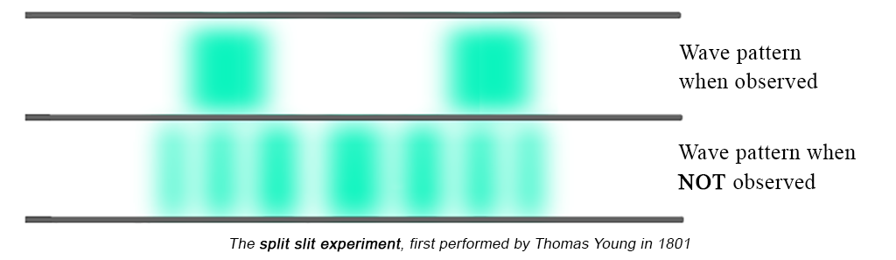

We already have the proof of awareness causing waveforms to collapse into particles, as we see in the _split-slit_ experiment.

Briefly, this split-slit experiment shows that when observed, electrons act like particles, and when not observed, they act like waves. The act of observation forces the electron waves to be perceived as particles. It&rsquo;s not that the electrons are waves that turn into particles; it&rsquo;s that the electrons are *wavicles*, both particles *and* waves at the same time, but the act of observing them is an interaction that alters their expression.

We also have evidence of how awareness can (possibly) change the reality of the past as well, as demonstrated in Wheelers&rsquo;s *delayed-choice experiment*[^168] but in addition, Penrose wrote an entire book on the subject of cognition and reality (*The Emperors&rsquo; New Mind*). He even came up with a term do describe the awareness/reality continuum: the _Orch-OR_[^142], or *orchestrated objective reduction*, which attempts to explain how consciousness and reality are intertwined. 

The point of this is to stress that the idea of reality being a product of awareness is not at all &ldquo;fringe&rdquo;, and hasn&rsquo;t been for some time. We are speculating as to the source of the energy that created this reality, and as science has no ideas to explain this, it&rsquo;s fair game for speculation.

Looking at this tholonically, each tholon has its own field, and that field is a parent field within which the child tholons, with their own subfields, are created.

Let&rsquo;s look at a classical field for a moment. A magnetic field is caused by the movement of subatomic particles (electrons, protons, neutrons), called &ldquo;spin&rdquo;. Everything is magnetic but in most substances the direction of the spin of these particles is 50/50, half spinning in one direction, and half spinning in the opposite direction, so the magnetic fields balance each other out. In some metals, like iron, all the particles spin in the same direction, creating an imbalanced magnetic field. It is the attempt of this imbalanced field to balance itself that creates magnetic fields we see in magnets, planets and elsewhere.

The greater the energy (as current), that is traveling through a medium, the greater the magnetic field it creates. This magnetic field is a form of energy, so just as the movement of electricity can form a magnetic field, so too can a magnetic field form electricity. No energy is being created, just changed from one form to another form. This transformation, specifically in the case of electricity and magnetism, is called induction. As the word implies, induction is the &ldquo;ability to persuade or influence (someone or something) to do something.&rdquo;  In general terms, this is saying every field can induce anything it is proximity to change in some way, and to some degree. 

Applying this to the thologram, at the &ldquo;top&rdquo; we have a very simple field, that which exists between the first two poles which were created by the primal dot. Every child field is induced by its parent (and ancestors), and the parent is induced by the child (and all descendants). The thologram is one large field of ever-embedded fields all inducing one another, all of which are expressions of the primal awareness, all of which are interacting with and dependent on one another.

There are many legends, stories and theories, ancient and modern, attesting to the power of awareness. We won&rsquo;t get into them here other than to say that if reality and awareness are intertwined, then it would be just as reasonable to expect that just as reality has an effect on awareness, awareness has just as much of an effect on reality. This is easier to accept when speaking of human awareness, but how does this associative relationship manifest in other instances, such as plants, rocks, planets and elements, all of which are some expression of the primal awareness to begin with?

## Morphic Fields

As late as the 1950s, some scientists and most people in general thought that plants and even animals were little more than biological machines and that space was just a bunch of hot and cold balls floating around according to Newtonian and Keplerian laws. Since then we have come to discover that plants have &ldquo;feelings&rdquo;, monkeys can form sentences and talk about their emotions, the universe is not only a lot bigger than we thought, but there may be countless parallel versions of them. We have seen how everything is connected in one way or another, at least on the quantum level - just to name a few of the changes to our worldview. We are moving ahead in our thinking and understanding at an incredible rate.

Sadly, some of the old guard is a tough bunch that is doing their best to keep us from making progress. Take the long-time editor of *Nature* magazine, Jim Maddox, who stated, regarding Rupert Sheldrake&rsquo;s book on morphic fields:

> &ldquo;\[his book\] is the best candidate for burning there has been for many years. Sheldrake&rsquo;s is not a scientific theory. Sheldrake is putting forward magic instead of science, and that can be condemned, in exactly the language that the Pope used to condemn Galileo, and for the same reasons: it is heresy.&rdquo;[^62]

Yes, he actually cited Pope Paul V&rsquo;s condemnation of Galileo as a defense on the grounds that *heresy* is the real crime. This sounds eerily similar to &ldquo;swarming with worms of heretical perversity.&rdquo;

This alone should paint a pretty clear picture that modern science, for all its breakthroughs in understanding and progress, has become a modern-day religion in the hands of the truly dogmatic that seem to be in charge all too often. Dr. Richard Feynman himself noted this when he stated:

> We live in an unscientific age in which almost all the buffeting of communications and television, words, books, and so on, are unscientific. As a result, there is a considerable amount of intellectual tyranny in the name of science.[^144]

So, why was the modern-day version of Tomás de Torquemada (he was the Grand Inquisitor in the Spanish Inquisition of the 15th Century) impaling the venerable and brilliant Rupert Sheldrake on the spikes of modern mainstream scientific dogma? Well, it seems that Sheldrake, himself a Cambridge professor who studied at Harvard, was onto something with his *Morphic Field Theory*, and it rattled their cage. Perhaps they feared that the &ldquo;worms of heretical perversity&rdquo; will begin to devour the carcass of a dying scientific worldview.

Sheldrake&rsquo;s Morphic Field Theory, which he described in his 1981 book, *A New Science of Life*, posits the existence of organizing fields which are systems that self-organize, create structure, and have patterns. Morphic fields are not a type of mass nor an energy but are organized *by* energy, like everything else. Morphic fields are described in the same way as holarchies in that they are made up of parts, which are in turn parts of wholes themselves. At each level, the morphic field supports the structure of its whole and organizes its parts.

Was Sheldrake inspired or influenced by the concept of holons and holarchies or did he come up with the idea on his own? In either case, it doesn&rsquo;t really matter.

A morphic field is (in 50 words):

> &ldquo;located invisibly in and around organisms, and may account for such hitherto unexplainable phenomena as the regeneration of severed limbs by worms and salamanders, phantom limbs, the holographic properties of memory, telepathy, and the increasing ease with which new skills are learned as greater quantities of a population acquire them.[^63]

##### \~Rupert Sheldrake

A more complete description is:

*The following is a synopsis based on a letter Sheldrake wrote to John Horgan, a writer for Scientific American,*[^64] *wherein he explains clearly in his own words what a morphic field is. He also has a very good explanation on his website*[^65]*.*

A morphic field (MF) is a field of energy that imposes patterns on otherwise random or indeterminate patterns of activity. Morphic fields transmit information via morphic resonance (MR), which is the influence of previous structures of activity on subsequent similar structures of activity organized by morphic fields. MR has the capacity to store and transmit information and therefore it can act as a memory bank for any self-organizing group, such as self-organizing systems; molecules, crystals, cells, plants, animals and animal societies. Each member of a group can contribute and draw from this memory bank.

The idea of MFs was an epiphany that Sheldrake had in 1971 as a way to explain how living things knew how to grow when that information was not stored in its genes.

The very first known example of an MF test actually goes back to 1920, long before the ideas of MF arrived, when Harvard professor William McDougall proved that children of mice that have learned a maze can navigate the maze much faster. After 20 generations of maze running mice, the next generation was able to run the maze 10 times faster than their pioneering ancestors. As genetics could not account for this transference of knowledge, it must have been something else, something science didn&rsquo;t know about. To solve this problem a team on Edinburgh set out to prove McDougall&rsquo;s test was pure poppycock. Unfortunately, their 20<sup>th</sup> generation mice knew how to go straight to the target on the first try.

They had no idea of morphic fields back then because if they did, they would have known that the Edinburgh mice benefited from the knowledge of the Harvard mice, even though they were thousands of miles apart, thanks to the transference of information via the MF/MR. There have been many other examples like this over the last 100 years.

The way this MF information is transmitted is via MR, according to Sheldrake. All members of a group that share an MF have access to the MF info because they naturally resonate with that field, not unlike how we can pick up radio waves when we have a crystal that resonates with the transmission frequency. Dogs share information with dogs, humans with humans, etc., but a bond between a dog and a human creates another MF that they both share. Sheldrake shows examples of this in how many dogs know when their owners are coming home and start waiting for them by a door or window.[^66]<sup>,</sup>[^67]

*End of synopsis.*

Because of their ability to transmit data across time and space, MFs have been considered for communication in long-distance and interstellar travel[^68]<sup>,</sup>[^69]. MFs may also be capable of creating self-organizing systems within the realm of AI.

A lot more research is needed in the area of MF and MR, but this is slow in coming, mainly due to the dogma of modern science.[^70] Others have been working on similar ideas, such as theoretical physicist Lee Smolin, with his idea of the *principle of precedence*[^71], which states that the history of measuring a particular quantum event will determine (or affect) the future measurements of that same event when it is measured. Unfortunately, unlike the world of physics, biology has become more dogmatic in the 20<sup>th</sup> century.

One small detail, but hugely significant, is that morphic fields originate outside of space-time. They exist in the realm of thought, or awareness, or consciousness (or all three). Information, as we currently understand it, cannot travel faster than the speed of light, but does this apply to awareness?  I suspect not. There has been some research on awareness[^72], but it&rsquo;s scant, and the results are far from clear-cut.

Many people believe that one&rsquo;s awareness can, with practice, travel outside of the body, and outside of this physical reality. This is typically called *Out of Body Experiences* (OOBE), or *Astral Projection*. Mainstream science is not a fan of this idea. *Scientific American* suggests that OOBEs are caused by inner ear problems[^73]. Although not surprising, it is disconcerting considering that some real research on OOBEs has shown remarkable evidence.

There are many examples of such research[^74], such Dr. Tart&rsquo;s subject being able to read the letters &ldquo;P = 10^-5^&rdquo; or &ldquo;25132&rdquo; that were written on a remote piece of paper while out-of-body[^75]. For the record, OOBEs are tholonically explained by the anchoring of the consciousness to the (or a) parent tholon of whatever tholon a person is an instance of. The concept of &ldquo;soul&rdquo; is an umbrella term to describe many of the much higher-level tholons.

Although this sort of research does not get the attention it deserves, with a bit of effort it can found. Science is not well equipped to study the mechanics of awareness or any non-material phenomena, but this certainly does not mean it does not exist. 

The point here is that fields of awareness, such as morphic fields and tholonic fields, while being able to instantiate in the material world, are not limited to the restrictions of the material world.

#### **Claim 51:** Tholonic and Morphic fields have the ability to transmit and store information. 

#### **Claim 52:** Tholonic fields are not limited by time and space. 

## Tholonic Fields

The current idea that MFs can be formed as a result of a self-organizing system, as Sheldrake describes them, are limited to systems that exist, systems that have real-world instances, like animals, societies, crystals, etc., or anything that is an instance of a tholonic archetype. Ideas exist and are self-organizing as well, so why wouldn&rsquo;t MFs apply there? Well, they would, but with a difference. In the MF model, members of a group are receivers and transmitters of information, and therefore the reception and transmission of information are dependent on that member&rsquo;s ability. If we applied the MF model to ideas, what is receiving/transmitting information in this MF that *ideas* are a member of?

Sheldrake implicitly answers this question when he describes the morphic field as &ldquo;organizing fields which are systems that self-organize, create structure, and have patterns.&rdquo; This description is the description of a form of intelligence, and therefore the morphic fields that share a morphic resonance or morphic cloud are themselves the transmitters and receivers. Tholonically speaking, this means that the archetypes, the tholons, are both transmitters and receivers of information and we actual humans are simply the instances of that aggregate field of the human tholon.

### Ideas

The natural ordering as a result of the movement of energy is obvious, but for this to apply to ideas we would have to accept that ideas themselves use, transmit, or transform energy. There are two arguments to support that they do.

-   An idea cannot exist in a state of total nothingness. If an idea exists then it must do so somewhere on the spectrum of some duality, therefore, it must have some kind of energy passing through it.

-   An idea or concept has coherence, or low entropy, and represents a product of &ldquo;work&rdquo; or the movement of energy, which produces fields and oscillations of that energy&rsquo;s movement.

#### **Claim 53:** Tholonic Fields are the fields generated by the movement of energy through an archetypal concept that has been discovered or created. Morphic fields are the instantiations of tholonic fields as expressed by the instantiations of that archetype. 

This brings us back again to the question: how and where is all this information that is being access stored? How does a tholon know the limits of its scope? How does it access the information needed to inform its intelligence? How does it &ldquo;remember&rdquo; context?

The first place to look for an answer is in the manner that tholonic instances have devised to store and transmit information, and the obvious choice of instances is *humans*. If we look at how we humans store the information we have collected from the conceptual world we may be able to discover analogous processes that apply to the world of tholonic and morphic fields.

And how *do* we store that information? We invent an abstract symbolism, apply meaning to it, call it language, use that language to record those symbols, and then, most importantly, teach our children how to decode these symbols. This shares some similarities with the process the honeybirds have developed, and maybe even with the dopamine injecting wasps, but the difference is they do not (appear) to have a way of recording or sharing their collective knowledge as humans do. Perhaps this is because humans have lost touch with this information field, as suggested by Jaynes, so they had to invent their own techniques like writing, books, the Internet, cloud storage, etc.

When we use the Internet, we are not aware of the relationships, semantic and otherwise, that are being discovered and used to deliver information to us in a very human-readable format. By the same token, we may not be aware of the symbolism being used by our *field intelligence* to collect, store, and transmit information. Because we do not know, or have not been taught how to recognize or interpret these symbols, we have to assume they could exist anywhere, and everywhere.

#### **Claim 54:** We don&rsquo;t know what we don&rsquo;t know. 

Let&rsquo;s look at some of the more likely candidates of how and where we might find and access this *field intelligence.*

## Telepathy, ESP, or Something

Can we describe this field intelligence as some sort of telepathy? And if so, do we even have any evidence that telepathy exists?

The idea of telepathy has been around forever, but modern science insists it is all pseudo-science hogwash, right?

Not exactly. Not only is there a mountain of evidence to support its existence[^76]<sup>,</sup>[^77]<sup>,</sup>[^78]<sup>,</sup>[^79] and even a drug named after it, telepathine[^80], but the (technology-enhanced) telepathy business is booming!

-   Many research projects developing telepathic processes and products.[^81]<sup>,</sup>[^82]<sup>,</sup>[^83]
-   U.S. military (DARPA) developing telepathy-based weapons.[^84]
-   Elon Musk, Facebook and others all developing telepathy-based tools.[^85]<sup>,</sup>[^86]<sup>,</sup>[^87]<sup>,</sup>[^88]

Sheldrake himself has a lot to say supporting the existence of some sort of telepathy in the documentary &ldquo;*Scientific Evidence of Telepathy: Documentary.&rdquo;*[^89]

Russel Targ, a former physicist at Stanford Research Institute and author of *&ldquo;The Reality of ESP: A Physicist&rsquo;s Proof of Psychic Abilities&rdquo;*, has experimented with telepathy and ESP for some time now. He shows[^90] that the scientific evidence for ESP is statistically stronger than the evidence that aspirin helps reduce stroke. The aspirin test was so statistically significant that the test had to be called off because it was considered unethical to continue giving test subjects placebos in light of the overwhelming evidence they had collected before the test was even completed. I know it&rsquo;s a rhetorical question, but why are we not seeing this revolutionary telepathy/ESP research all over the news? The evidence is compelling enough to accept that telepathy, in some form, is a thing.

The umbrella &ldquo;or something&rdquo; category can cover quite a bit of territory, including lesser-known applications of our sensory-processing skills, such as the ability to smell personalities and emotions[^91]<sup>,</sup>[^92] or, if you&rsquo;re a woman ovulating, your superhero-like ability to immediately recognize otherwise hidden snakes[^93] (the elongated, legless, carnivorous reptiles, not the metaphorical type, although I suspect research would show significant results for the later as well) and gay men. Some humans have a visual sense 100 times more sensitive than the average person.[^94] And what of the extensive intrinsic nervous system in the heart comprised of clusters of neurons sufficiently sophisticated to qualify as a *heartbrain*? Certainly, that must contain some sort of sensory abilities.

Perhaps the most overlooked, yet strongest sense we have is what we call our *gut sense*. Considering that our gastrointestinal tracts contain 95 percent of our body&rsquo;s serotonin, has its own nervous system, and is filled with trillions of microbes sending terabytes of information to the brain every millisecond, microbes that are 100 times in number than of the cells in the body and ten times the number of cells in the brain, all of which having a significant impact on the brain,[^95]<sup>,</sup>[^96] one would have to consider the *gut* as a sense in its own right.[^97] Even more significant is what microbes we are exposed to at birth that so dramatically affects our brain growth. Those born under natural conditions are exposed to the microbes of their natural surroundings. How do C-section births and exposure to microbes of hospitals, urban dwellings, and processed food alter our brain development?

What about the sense that allows blind people to detect the emotions of a person in a photo[^98]? What sense is activated in Yogamata, the nine-year-old Indian girl who demonstrated at the 2015 Business Advocacy summit at Capitol Hill in Washington D.C. that she could read blindfolded using only her third eye?[^99] How do we use the six additional senses identified by researchers at Harvard Medical School?[^100]

Our model of five senses is quaint, at best, especially considering it was proposed over two thousand years ago by the same philosopher, Aristotle, who held back physics for centuries with some of his completely inaccurate ideas about such things as gravity that were proven wrong sixteen hundred years later by Galileo, and atoms, which were theorized by Leucippus and Democritus one hundred years before Aristotle declared the idea as nonsense. Why do we persist in holding on to such antiquated ideas about something so fundamental to our understanding of ourselves, society, and reality?

Perhaps what we call some forms of telepathy or ESP are simply quite natural consequences of senses we have that we don&rsquo;t know or believe we have or choose to ignore. Just look at some of the amazing senses of some insects and animals:

-   Buzzards can see small rodents from three miles away.
-   Bees have a ring of iron oxide in the belly to feel magnetic fields and have eyes that see polarized light.
-   A cockroach can detect movement 2,000 times the diameter of a hydrogen atom.
-   Elephants have a hearing range of 1 to 20,000 hertz, and can also hear with their nose and feet.
-   The shark has special eyes that can see electricity.
-   When you look at the sidewalk, you see cement and dirt, but that same sidewalk tells a bloodhound who has walked there eight hours ago, what the soles of their shoes were made of, and what brand of cigarettes they smoked.
-   Dolphins see sound waves as 3D images.

#### **Claim 55:** Transcendental or extrasensory forms of communication exist. 

Telepathy or otherwise, it&rsquo;s a safe bet that to say that some form of transcendental or extrasensory form of communication exists, and this might be a way to access tholonic data. it&rsquo;s the specifics of it that seem to be elusive. Proving such a thing is similar to asking me to prove that Australia exists. I know many people from Australia, I can find Australia on a map, I know of Australian politics and history, but all of that is anecdotal as I have never been to Australia and if you asked me to prove Australia&rsquo;s existence by the strictest scientific standards, I could not. All I could say is I have a lot of evidence from trustworthy sources.

Dawkins suggests that memes are the non-genetic manner in which information is passed on. He also strongly disagrees with Sheldrake&rsquo;s morphic field hypothesis. Unfortunately for Dawkins, memes cannot explain test results that morphic fields can. To add insult to injury, morphic field theory not only has room for memes but can explain one way that memes can spread, so, Sheldrake: 1, Dawkins: 0.

What mechanism actually does the transmitting and receiving among animals, humans, perhaps even plants and rocks? After all, they too have a form of awareness and intelligence. Their collective mind? Their energy fields? Their physical structure? Probably all of them working together in some way, but we don&rsquo;t need to know the specifics of *what* just yet. Let&rsquo;s consider the *how* by looking at how we humans have learned to send and receive information.

When you want to send something to somewhere, how is that done? Maybe you use a postal service or your computer network. In either case, you are collecting the information and delivering it *not* to the final destination, but to a service or infrastructure that does the delivering. This is the case with radio, television, electricity, and even nature if we consider how seeds, an instantiated form of information, can be transported around the world via air, water, hiking boots, animals and in the case of mushroom spores, intergalactically via meteors and space-wind. These &ldquo;seeds&rdquo; are not only carriers of DNA, but possibly information or messages from off-world intelligence, according to some researchers[^101], including Dr. Francis H. C. Crick, the co-discoverer of DNA, who, in his paper *Directed Panspermia*[^102], hypothesized that the DNA itself arrived from space.

It is easy to imagine applying the well-developed model of telecommunications that we currently use, called the *Open Systems Interconnection* model, to a model of information sharing among various forms of intelligence.


To be clear, we are not saying that this is how it works, nor are we saying this is *not* how it works. We are suggesting that we might find new perspectives if we apply the models we have developed, which are based on natural laws, to things we do not yet understand. In this case, for example, we see that the physical body and intelligence are at the opposite ends of the pyramid, implying that the brain/nervous system is more of a receiver/transmitter rather than a generator, as creating new information requires intention, cognition, and intelligence. This is a radically different concept than the current mainstream and antiquated idea that the mind, consciousness, intelligence *must* arise out of brain activity. We contend that other successful models that we currently use today could also be applied to things we do not yet understand, at least as a starting point of investigation.

Still, none of this addresses the specifics of where the information is stored or transmitted from.

## Collective Memory

The idea that a field intelligence is in some way an extension of the idea of the *collective mind* or *collective consciousness* was formalized to a great degree by Carl Jung&rsquo;s idea of a collective subconscious and collective memory, although, it may be more accurate to describe the idea of a collective unconscious as a primitive understanding of field intelligence. This is still a very fertile area of research across many disciplines.[^103]

Sadly, no theories exist to explain where and how long-term collective memories are stored. In the West, the idea of a collective memory has been around since the early 20<sup>th</sup>-century French sociologist Maurice Halbwachs coined the term. His hypothesis on how collective memory was stored and transmitted is extremely unspecific but generally depends on human-to-human transmissions, similar to Dawkin&rsquo;s theory on how memes are spread. Given that Halbwachs was a student of Emile Durkheim and a devoted Marxist, one has to question his entire premise of a &ldquo;collective&rdquo;, especially in light of his claim that human memory can *only* function in a collective, and then goes on to give examples of his hypothesis of collective memory by comparing the &ldquo;collective memory&rdquo; of the bourgeoisie, religious and the working class, which may be valid, but is extremely myopic. Still, he did coin the term, even if his premise was infected by a virulent and parasitic ideology (not unlike the Emerald Wasp).

Current thinking still revolves around cultural expression as being the primary way that collective memories are transmitted; dance, stories, monuments, etc. These are certainly reinforcing factors, but this idea alone cannot explain Man&rsquo;s collective memory of &ldquo;the whole history of the human race&rdquo;, as Jung claims is the source of our fear of fire, falling, and social status, to name just a few. Some of these memories are epigenetic/genetic, such as being born with the fear of loud noises, which comes from the memory that loud noises are generally a harbinger of something that&rsquo;s bound to make life more difficult, but can all our collective memories be stored in our DNA? Perhaps that is what the 75% of our junk DNA holds (recently upgraded from the previous 98% junk), or perhaps we don&rsquo;t yet understand its function. Maybe the junk DNA is more of an antenna than a transcoder? Apparently, we have no idea, but whatever it is, could it account for storing &ldquo;the whole history of the human race&rdquo;?  This seems very unreasonable.

*Sidenote: It will also be interesting and informative to see the effects of the massive disruption the collective consciousness is currently undergoing as a result of the Internet and technology, and how that alters our collective consciousness and memory.[^104] If nothing else, the exponentially increasing amount of information entering our awareness will be create a tremendous seismic shock to the collective (un)conscious.*

## Engrams

Another candidate is how the brain creates and stores memories. We have developed the concept of an *engram*, which is the means by which biochemical and biophysical processes store our response to external stimuli. The engram, first described by German Zoologist Richard Serman in the early 1900s, was based on what he called the *mnemetic principle*, which states that the imprint made in the nervous system (including the brain) can, when stimulated by external stimulus, reconstruct the experience. This is a very holographic idea, in that holograms reconstruct imagery by illuminating a previous record of that imagery. The images below demonstrate how the &ldquo;memory&rdquo; of the image of a 3-dimensional cat can be stored on a 2D surface of holographic film, but looking at the film we would have no way of knowing that there is any information there, let alone the information that describes a 3D cat.

An important technical detail regarding holograms as it applies to memory is that many images can be recorded on top of each other, each with a different angle of illumination. All those images can be reconstructed simply by changing the angle of the hologram when viewing. This is why, and how, a holographic memory cube five meters square can store every word ever spoke or written by all humans.[^105]

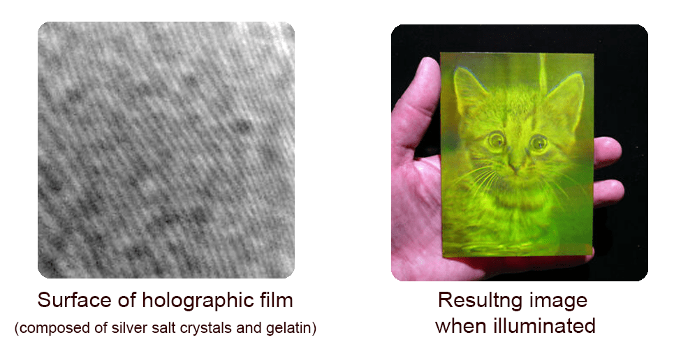

This imprint, or &ldquo;mnemetic trace&rdquo;, so named after the Greek muse of memory &ldquo;Mneme&rdquo;, is also a precursor to Dawkins &ldquo;meme&rdquo;, as the meme is a cultural version of an engram. I suspect Dawkins was well aware of this when he created the &ldquo;meme.&rdquo;

The 50 years of research following Serman&rsquo;s hypothesis of the engram boils down to:

> &ldquo;(1) memories are not localized but are instead distributed within functional areas of the cortex and (2) memory traces are not isolated cortical connections between inputs and outputs.&rdquo;[^106]

Might we see these same characteristics in our own collective memory technology otherwise known as the Internet? Perhaps. Decentralized and distributed information networks, such as Bitcoin&rsquo;s Blockchain, TOR (The Onion Router), and IPFS (Interplanetary File System) are probably early stages of such a thing. The irony of the Internet is that when it was originally developed by DARPA it was designed to be much more decentralized then it is today to the point where it could withstand a nuclear attack and continue operating, but today much of the decentralization has been removed as it is not in the best interests of government and business who prefer a more &ldquo;consolidated&rdquo; model (many totalitarian countries, and England, have actual Internet kill switches[^107]).

If we extrapolate these ideas when looking for how field memory works, we might want to start with the presumptions that:

-   Field memory is decentralized and distributed within the medium of the field. What and where is this medium? Anywhere there is energy, as the field *is* energy.
-   Field memory is not stored as discrete quanta of information but rather an organized pattern of otherwise dis-integrated &ldquo;particles&rdquo; of information, which we refer to as data. Were we to see this data alone it would appear as chaos. When seen from a different perspective, or decoded, or &ldquo;restimulated&rdquo;, as in the case of engrams or holograms, or in a different context, it may appear as information.

## Modulation

Another model to look at might be the way we have learned to transmit information by modulating the amplitude or frequency of a wave, similar to how TVs, radios, and Internet modems work. If we accept the idea that all energy moves in cycles and waves, including the energy of ideas, then perhaps those waves are also modulated in some way with information. As has been suggested earlier, there are waves we either don&rsquo;t recognize or don&rsquo;t consider as waves. For example, is it possible that the &ldquo;waves&rdquo; from the &ldquo;cycles&rdquo; of the moon or the Arctic Tern could be &ldquo;modulated&rdquo; to carry information? It sounds crazy, but we know that brain waves encode information (possibly *rules of behavior*[^108]) as time codes[^109], that light can store quantum memories[^110], and that the same waves we use for communication are the same waves that have filled the entire universe since the Big Bang[^111]. Since the discovery of gravitational waves, we have been looking into how we can transmit information in that medium as well[^112]. Is it possible that these waves are modulated with information, making the waves both the carrier of information as well as the storage medium?Considering how little we know about the Universe, Reality, and Everything, these &ldquo;crazy&rdquo; ideas may not be so crazy after all.

Let&rsquo;s go out on a limb. Like my grandmother used to say &ldquo;when you can&rsquo;t find something you need to look everywhere.&rdquo;

## Dark Matter

One candidate is dark energy/dark matter.

Before I describe this idea, I want to make it very clear that I am not a cosmologist, physicist, or scientist of any kind, so this idea may be ridiculously naive and laughable to anyone who is knowledgeable on the subject. That said, let&rsquo;s give it a whirl.

Dark energy occupies 70% of the known universe, can&rsquo;t be directly observed and emits no light or energy. Dark matter occupies another 25%, and the measly remaining 5% is the matter we can see. Dark matter can have dark electrons and dark protons and there is even dark chemistry (and maybe dark tholons?). Dark energy also produces dark electromagnetism and dark electricity. Dark matter does not interact with &ldquo;regular&rdquo; matter. Perhaps it interacts with something else? In fact, there are (believed to be) dark galaxies, which is the galaxy of dark energy/matter superimposed on a galaxy of &ldquo;regular&rdquo; energy/matter. In short, everything that exists has a &ldquo;dark&rdquo; clone that we can&rsquo;t detect. What better medium than dark energy is there that could collect information from every scale of reality? Dark matter is a good candidate for where the data is stored.

Dark matter/energy is not just some weird thing we kind of guess is there. Evidence suggests it actually forms the structure of the entire universe, but all we really know about dark matter is it exists, it exists everywhere, and it interacts with gravity, one of the four fundamental forces of energy. This then makes gravity the nominee for how the information is transmitted between dark energy and the &ldquo;regular&rdquo; energy of our reality. Perhaps there is some entanglement involved, allowing information to travel faster than the speed of light?

Dark energy is quite elusive, as we can&rsquo;t detect it or measure it, but we can see its effects in the expanding universe, as dark energy seems to be continually being created (as if it was some sort of dynamic memory system that keeps expanding to accommodate the exponentially increasing storage requirements of an expanding universe?). Perhaps there is a relationship between extrasensory phenomena and dark matter/energy in some way?

Has anyone tested this? I have scoured the Internet looking for such research and could find nothing. However, I did run across this very interesting post from one of the senior members of Cambridge University&rsquo;s Institute of Continuing Education who posted the following:

> Subject: Can quantum dark energy explain telepathy?
>
> Telepathy and quantum entanglement seem to match each other in that a communication connection exists, but no tangible connection. Could there be a hitherto unknown dark energy particle produced by electrical impulses in the brain? Could it be that entangled particles of this dark energy are shared? If a plasmon circuit in the brain creates patterns of these dark matter particles, based on thoughts and ideas, do people with the shared particles since the same patterns of thoughts and ideas? How long-lived are these particles, how long do they maintain patterns, and what might be the mechanism for transfer? These particles may be exchanged through quantum molecular tunneling, allowing a brain to transmit them outside of the head, and a person with a corollary quantum molecular tunnel for reception to readily receive the particles. Persons sharing close and personal spaces may be more likely to transfer these particles to each other such as twins, relatives, friends, and even enemies. It may be that these particles are long-lasting and this may allow objects to be imbued with the dark particle patterns, allowing a sensitive to read a person through the object. It may be that wherever a transmitter goes the location they were at is imbued with thought patterns of their experiences. The implications of such a mechanism for telepathy imply this process may be amplified by electronics to increase the strength of transmission and reception. It also implies that we could control electronics through the use of
> telepathy.[^113]

There were no replies.

OK, I know this is all a bit of a stretch, but it&rsquo;s not outside the realm of investigation.

## Structured Memory

Another possibility is structure itself. It has been claimed that the structure of water can hold memory. Although this claim has not been properly tested by any means, there is at least some evidence to suggest it might be valid. Dr. Emoto has been the most public in his claims that water holds memory, and presents many examples and theories, but none have been thoroughly tested by scientific standards. There is quite a lot of information available about Emoto&rsquo;s work so I will not repeat any of it here. However, Dr. Emoto has participated in other, more stringent studies.


Speaking only for myself, one of the more compelling pieces of evidence I have seen comes from the experiment where four students created four drops of water, all from the same source. The image above shows the results of that experiment where each row of drops was created by a different student. Notice anything? Even if this is not bulletproof evidence (similar to the existence of Australia for anyone who has never been there), it is enough to raise the question. In addition, this test was also conducted using different types of flowers, and, according to the testers, the resulting patterns in the drops of water resembled the patterns of the flower. Tholonically, this is exactly what we would expect to see, as it is patterns of energy that create the instance of the flower.

Another source that supports the idea of water holding information is Jacques Benveniste, a French immunologist who worked at the Institute of Health and Medical Research (INSERM), in 1988, who published a paper in *Nature* concluding that the configuration of molecules in water was biologically active even in the absence of the elements that caused that configuration. This &ldquo;water memory&rdquo; was immediately picked up by the homeopathic community as proof of its efficacy.

While Emoto&rsquo;s work can easily be brushed off by skeptics and institutional authorities, due to its lack of rigorous analysis, Benveniste&rsquo;s work could not.

*Nature* magazine editor, Jim Maddox (yes, the same person who promoted the burning of Sheldrake&rsquo;s book on the grounds of heresy, as well as claiming the Big Bang theory is &ldquo;philosophically unacceptable&rdquo; and that there was &ldquo;no need to panic about AIDS&rdquo;), prefaced the *Nature* article with an editorial comment entitled &ldquo;When to believe the unbelievable&rdquo;, which admitted: &ldquo;There is no objective explanation of these observations.&rdquo; That sounds like a begrudging admission, but it was more like a temporary retreat in preparation for the next offensive.

*Nature* did not want to publish the paper to begin with, holding its release for two years while awaiting independent confirmation from impartial laboratories in Israel, Italy, and Canada, who reported an observable biological effect.[^114]

After the paper was published there was an explosion of meltdowns from the scientific community. In response, *Nature* demanded that the experiment be repeated under conditions controlled by an ad-hoc selected team of its own, which included (and this should shed some light on their not-so-hidden intentions) the famous illusionist, pseudo-science enemy, and occasionally dishonest, James Randi, plus Maddox himself and a malpractice investigator.

The *Nature* team did, in fact, find the same results as Benveniste, but with one fascinating exception: the effects of the tests disappeared when the members of the laboratory did not know if the water sample had been treated or not. One could claim the results were then biased based on this knowledge, but one could also say that this awareness could have helped instantiate the effect. According to the tholonic model, being aware of something is sufficient to instantiate it to *some* degree. In any case, this was sufficient for *Nature* to publish a report on this methodological flaw in Benveniste&rsquo;s experiments and officially called &ldquo;water memory&rdquo; pseudo-science[^115] and published an article calling the entire idea &ldquo;delusional&rdquo; (written by, or course, Maddox, Randi, and Stewart, another lover of dogma)[^116]. Case closed.

Or so they hoped, for not long after Benveniste&rsquo;s paper, The United Nations Educational, Scientific and Cultural Organization (UNESCO) decided to take their own look into his work. In their words:

> These data seem particularly important because they further enrich the immense achievements of molecular biology. They also suggest the development of new modes of transmission of genetic messages (transmission, transduction, teleportation, etc.).

Fortunately, they did not invite Maddox or Randi to be a speaker. Rather, they invited the Nobel Prize-winning discoverer of HIV, Luc Montagnier, who, much to the skeptic&rsquo;s dismay, stunned many fellow scientists years earlier with claims that DNA emits weak electromagnetic waves that cause structural changes in water that persist even in extremely high dilutions&hellip; which is not exactly water-memory, but very close. Montagnier has gone on to say that &ldquo;More scientists are becoming convinced \[of water-memory\] by the data&rdquo; as new evidence appears.

OK, that was a long-winded bit of history there, but it shows the resistance to new ideas as well as the real possibility that water-memory exists.

But I am not a scientist, so I don&rsquo;t have to worry about what the editors at *Nature* or dubious debunkers think, so I can hypothesize the following: If the structure of water can hold memory, does this mean that the structure of other things can also hold memory? Can the thologram itself hold memory in its mega-meta-structure? If we claim that the structure of our material world is but an instance of that structure in the thologram, then we would have to say &ldquo;yes&rdquo;, and that then opens the door to all structure, in every corner of the universe, having the potential to hold memory. Perhaps certain structures are better suited to hold certain types of memory? More exciting is the possibility that the mechanism to access this memory, and the knowledge, is to simply become aware of it. This last part is trickier than it sounds, as we don&rsquo;t know what we don&rsquo;t know, so how do we know what to become aware of?

Regardless of the theory, whatever it happens to be, the morphic or tholonic field would have to be something like an electromagnetic field on a different level of existence, as both are caused by the movement of energy.

#### **Claim 56:** Everything that exists due to the movement of energy has a field that is caused by awareness and intention. This field is the foundation of consciousness and knowledge.

The redundant and self-similar expressions of pure energy can be seen in the ever more complex and integrated patterns that have evolved since all of creation began as an infinitesimally small dot that was the seed of this Universe.

By the same token, the redundant and self-similar expressions of pure awareness can be seen in the ever more complex and integrated patterns that have evolved since all of creation began as an infinitesimally small dot whose only property was awareness and intention.

The implication is that energy itself is a fundamental form of awareness and intention and therefore everything that exists is also a form of awareness and intention in the same way that everything that exists is a form of energy. To be aware of something is to direct energy to some concept or idea, thereby moving energy through that pattern and the curve of that archetype, which alters the *norm* of what and how that archetype will instantiate itself. I suspect that a real-world example of this it the classic split-slit experiment.

From the tholonic perspective, if the claim is &ldquo;energy alone can&rsquo;t be observed; only its interactions with other forms of energy (mass) can&rdquo; is true then it is also true that &ldquo;awareness alone can&rsquo;t be observed; only its interactions with other forms of awareness (concepts) can.&rdquo; This implies that any form of awareness is sufficient to alter reality, such as collapsing a wave form into a particle, as in the split-slit experiment, and if all things have awareness, then any *thing* observing the experiment would cause the wave function to collapse. This turns out to be the case as &ldquo;observation&rdquo; by machines has been tested.[^117]

This helps to remind us that, if all forms of existence are some expressions of awareness, it&rsquo;s not just human awareness that is running the show.

> &ldquo;Consciousness [ed: or awareness from the tholonic perspective] is part of our universe, so any physical theory which makes no proper place for it falls fundamentally short of providing a genuine description of the world.&rdquo;[^118]

##### \~ Roger Penrose. *&ldquo;The most important physicist to work in relativity theory except for Einstein&rdquo;.*

Tholonic fields exist in the realm of thought, ideas, and concepts, so any experiments that might be run probably need to be thought-based in nature. Is there any evidence that thoughts can directly alter our material reality? If the answer is yes, that might support the idea that altering archetypes in the realm of ideas has a measurable effect on the instance of those archetypes, i.e. reality as we know it.

## Reality

What about the possibility that reality itself, the world around us, matter, everything we consider to be real, *is* the memory?

This idea is based on the idea of Quantum Darwinism[^119] that states that of all the probable states that can exist, the ones that survive do so because of support from their environment. In turn, these states that survive transfer information to the environment, altering its context, shifting the curve in its favor, and thereby improving the probabilities of future similar states.

As the energy interacts with the environment around it, the range of probabilities for the many attributes of an energy particle begins to decohere, or disappear, leaving only the attributes that are most compatible with the environment, which then interacts with the environment to make the environment more compatible with the attributes. Notice the compatibility of Quantum Darwinism with the descriptions of the social equations in the chapter &ldquo;The Meaning of Math&rdquo;?

Reality, as we know it, is the consequence of this processes of *decohering* the less successful possibilities of a particle&rsquo;s superposition. In the end, one set of attributes dominates, and that is what we see in the reality that surrounds us. In other words, reality itself is the living record of what works.

Applied to the tholonic model, each tholon has a set of stable properties, and given its self-similar structure, each tholon only needs to manage the properties that relate to its scope or that exist within its spectrum, leaving the parent properties to the parents, and any of the child properties to the child. Each tholon then &ldquo;knows&rdquo; what works and expresses this in the instances of that tholon, which is every archetypal idea and form that has the possibility to exist. When we look at a thing, like a rock, we are not just seeing the Darwinian results of the tholon of a rock, but also the aggregated results of all related tholons; mountain, planet, solar system, galaxy, silica, molecules, atoms, electrons, etc.


The language of reality begins with one &ldquo;letter&rdquo; (a tholon) of the alphabet, which becomes three in the next generations, which becomes 12, etc. Each of these letters is a record of what &ldquo;works.&rdquo; 

Remember that phrase *combinatorial inflation* which describes the exponentially increasing number of possibilities in protein production? This is the big problem with current evolutionary thought, as there are simply too many combinations for nature to try.

In the tholonic model, these massively inflated possibilities are much simpler to navigate. We start with a duality within which a stable pattern emerges. From that stable pattern, a new duality emerges, which produces another stable pattern. For each generation, we have three new possible tholons from which patterns can emerge. Only stable patterns are capable of creating dualities, so unsustainable patterns never propagate. After a mere 129 generations of this process we have produced 10<sup>77</sup> possible tholonic combinations, but at each generation we only needed to create one pair of parameters (we used 10<sup>77</sup> as that was the possible number of protein combinations with just twenty amino acids and 150 amino acids&hellip; a very, very small number when compared to the actual proteins that make up life).

It is clear that the odds are incredibly stacked against a new form of a viable protein to appear because the assumption is the entire field of 10<sup>77</sup> is available. Tholonically, the entire field available is limited to a mere three properties, but these properties are self-similarly embedded 129 times. If a new pattern emerged somewhere around the 63<sup>rd</sup> generation (10<sup>37</sup> combinations), then an entire new branch of creation will emerge at a point in the tree where it will have a significant presence at the 129<sup>th</sup> generation. This would explain the Cambrian Explosion when 541 million years ago a major new class of life appeared that was the origin of all modern marine life. It also destroys the Darwinian model of long-term evolution. Ironically, Darwin himself, in his *Origin of Species*, said this nasty detail was the main argument against his &ldquo;Theory of Descent.&rdquo;

Here&rsquo;s a simple mathematical example.

First, let&rsquo;s look at the Bell curve again. let&rsquo;s say you do 32-coin flips 50,000 times and plot the results.

The peak of the Bell curve is going to tell us what the most likely result will be, which is, that we will get heads 16 out of 32 flips, on average. But we have decided we are going to run this test five times, but each subsequent time we are only going to use the coins that came up heads in the previous test. If we do this same process five times we end up with the following:

Test 1 with 32 coins, 16 came up heads

Test 2 with 16 coins, 8 came up heads

Test 3 with 8 coins, 4 came up heads

Test 4 with 4 coins, 2 came up heads

Test 5 with 2 coins, 1 came up heads

If we plotted the results, we would end up with a Bell curve that looked something like this &ldquo;Number of Heads&rdquo; graph.

So, when we run these five tests 50,000 times each, the chances of us ending up with one coin from 32 is 100%

Now imagine we use different coins for each test; 32 quarters, 16 nickels, 8 dimes, 4 half-dollars, and 2 pennies. We are still going to end up with 1 penny at the end, along with 16 quarters, 8 nickels, and 4 dimes and 2 half-dollars. This is a total of 62 coins, two of which are pennies.

If all someone knew about was that you started with 62 coins and ended up with a penny, they would say there is a 2:62, or 3.2%, chance of you ending up with a penny, when, in fact, there is a 100% chance of you ending up with a penny.

The process the person who calculated the 3.2% chance based on his observations has a 96.8% margin of error, while you have a 0% margin of error. The person, in an attempt to replicate your success, but not knowing your process, will begin to run tests and keep notes as to what worked and what didn&rsquo;t work. He checks these notes every time he runs a new test to make sure he is not doing something that has been shown to fail. Once he discovers your process, he can archive the failed notes and simply describe the process that works. He does not need to record all the failures once he has discovered the process that works, but he does so as to pass them on to the next generation of researchers who will approach similar problems in the same bottom-up fashion.

Existence does not need to record its failures as it is the ultimate top-down approach, from the tholonic perspective. From the very first instance of creation, nothing progressed unless the previous process worked, i.e. new child tholons created from the stable patterns of the parent tholon. No reverse engineering is necessary for existence. If a branch of existence fails it will only fail up to the first successful parent. This is like saying that if all your nickels were swapped out for double-tailed nickels, then all flips after the nickels would come up as zero, killing the entire branch below nickels and preventing it from creating any new children. The quarters are still fine, and because you had decided to run the tests the way you did, you would need to get new nickels or some other coin. In the thologram, once a branch does fail, there is no longer any contributing feedback to the aggregate intelligence (exemplified here as the averaged results) of the parent of that failed branch, which will change the curve of the parent, resulting in a new type of stable pattern that can create new child tholons/branches.

In our example here, the person doing the flipping would be the intelligence that &ldquo;fixes&rdquo; the problem, but in the tholonic view, the experimenter is an instance of an aggregate intelligence (of the human tholon interacting with intelligence of the archetype of the experiment) which received feedback from the broken branch (bad results) that modified the curve (something&rsquo;s wrong) which resulted in a new stable pattern (new nickels). (I know this example sounds ridiculously trivial, but it&rsquo;s the simplest example I could think of.)


A simple example more aligned to the tholonic model would be how we can emerge Bell curves from stable points in a lineage of trigrams. By assigning a value for points on the spectrum, and a binary value representing the generation of the trigram, we can create a unique value for every point that identifies its place on the spectrum and its level. If we combine each of these numbers, we can create one value for the entire lineage that has an extractable record of every spectrum value at every level. This one number would then act as a memory of all the ancestors. We can see this easily in simple binary math. If we have five generations of numbers that double with each generation, such as 1,2,4,8,16, and we have the number 22 representing the sum of all the contributing generations, we can easily determine that only the 2<sup>nd</sup>, 3<sup>rd</sup> and 5<sup>th</sup> generations contributed, because only 16, 4 and 2 can create 22. The tholons are similar in that each tholon has a fingerprint that is encoded in every one of its descendants.

What this means is that everything that exists is *already* a record of what works from the first moment of creation, through every generation, up to and including the thing that exists. Life, Reality, and Everything *is* the warehouse of all knowledge. We just haven&rsquo;t yet figured out how to decode (most of) it. Appendix C,*"The Thologram and the I-Ching"*, specifically addresses this and shows exactly how each tholon has a naturally existing binary signature.

One possible instance of this idea is the relatively recent discoveries that experiences and memories can be passed on *epigenetically* to descendants. In one of the classic test cases, the descendants of mice that were trained to not like the smell of cherry blossoms also had an aversion to the scent of cherry blossoms.[^120] Epigenetics describes how DNA can be modified by non-genetic stimuli, like fear, love, environmental preferences, even dreams, and it shows how what we inherit goes far beyond the human genome. Tholonically, the human genome is an instance of the human tholon, but the epigenetics that affects this instance are more like the influences on the scope of that tholon, or rather, where along that scope a stable pattern will emerge.

<div style="page-break-after: always; break-after: page;"></div>
# 10: CASES & EXAMPLES

There have been many experiments on how thought affects external reality, but most have not been subjected to scientific scrutiny. This does not mean they are not valid by any means. Given the general direction of mainstream science, I doubt we&rsquo;ll be seeing much real investigation into the subject.

## Maharishi Effect

However, one study that stands out is the research report *&ldquo;Effects of Group Practice of the Transcendental Meditation Program on Preventing Violent Crime in Washington, D. C.: Results of the National Demonstration Project, June-July 1993&rdquo;*[^121] published in the journal *&ldquo;Social Indicators Research.&rdquo;*

This study, which was monitored by a 27-member project review board comprised of independent scientists and leading citizens, found that there was a significant statistical result.

What was this study exactly?

> This study presents the final results of a two-month prospective experiment to reduce violent crime in Washington, DC. On the basis of previous research, it was hypothesized that the level of violent crime in the District of Columbia would drop significantly with the creation of a large group of participants in the Transcendental Meditation® and TM-Siddhi® programs to increase coherence and reduce stress in the District.[^122]

The results were impressive.


This is only one study, so it is not definitive, but it is certainly supportive of the idea that directed intention, what the participants called *coherence*, and what we are calling *order*, has an extended effect. The explanation, according to the tholonic model, is that the directed energy of coherent thought altered the curves of various archetypes thereby altering the probability of where the &ldquo;work&rdquo; will produce the most order, or where and how energy will be expressed across a scope&rsquo;s spectrum.

### On a Personal Note

I had a particularly insightful experience with the Maharishi Effect back in the late &rsquo;60s when I was a young teenager. My father was a captain of industry in the world of electrical components, ultimately becoming president of one of the pioneering companies that helped create the first integrated circuit.

Born of poor Scottish immigrants in the Bronx on the tail of the Great Depression, and serving in Korea, he was no stranger to hard times and hard work, which made him one of the most pragmatic and practical people I have ever known. He was a devout capitalist, atheist, and husband, and had no patience for anything that did not produce results. Hippies were idiots, imports were ruining the economy, Scotch whiskey was better, and talking about your problems was for whiners. You get the picture.

At the insistence of his wife (and my mother), he joined her for a seminar on *Creative Intelligence (CI)*, which was what they called Transcendental Meditation back then for those folks like my father. He heard their claims about improved mental and physical health, better focus, fewer distractions, etc. He decided to test their claims by giving all his employees in one of his factories CI training, along with an extra hour at lunch break for them to take this training and practice their new CI skills.

This factory was in a poor, rundown industrial town in New England, and the people that worked in those factories were uneducated, unskilled, assembly-line laborers - not exactly an open-minded demographic. I knew a number of them myself, as we lived in that town, and many never made it past 4<sup>th</sup> grade. The rivers in this town were dead from all the pollution, and the neighboring town had the highest per capita suicide rate in the United States. It was a dreary, dark place filled with dreary dark people.

His peers in the industry thought he was being foolish to deploy such a plan, but the results were astounding. People were fighting less, taking less sick leave, injuries were down, production went up; in general, everything improved. So much so, that the Wall Street Journal did an article on him and his &ldquo;revolutionary&rdquo; new technique. He became known as some kind of New Age Industrialist, which was ironically funny as he was as new age as his &rsquo;57 Chevy.

Ultimately, this new concept was unsustainable in that environment, because eventually people began to abuse the extra time meant for CI, and everything went back to *normal* with sick leaves, fighting, injuries, and lower production, so the program was scrapped&hellip; you can lead a horse to water, but&hellip;

## Prayer

You might be thinking that traditional prayer holds the same power, but it does not. Why? Because most prayer is anything but coherent. Prayer means very different things depending on culture, religion, personal perspectives, etc. It can be anything from begging to demanding, justifying to virtue signaling, and occasionally it can be an expression of gratitude and love, but using group prayer to effect change is like using a group of blind people to paint a room by throwing handfuls of paint at the wall. Your room *will* get painted, but you&rsquo;ll wish it didn&rsquo;t.

This was recently confirmed by a $2.3-million-dollar study on the effect of prayer on the sick, involving over 1,800 patients. It was the largest study of its kind ever undertaken. Contrary to prayer helping the sick, they found that when a patient knew others were praying for them, they tended to have *more* complications.[^123]

There are other studies that conclude the exact opposite, such as Dr. Byrd&rsquo;s study &ldquo;Positive Therapeutic Effects of Intercessory Prayer in a Coronary Care Unit Population&rdquo;[^124] and Dr. Harris&rsquo; study &ldquo;A Randomized, Controlled Trial of the Effects of Remote, Intercessory Prayer on Outcomes in Patients Admitted to the Coronary Care Unit&rdquo;[^125]. However, without a detailed comparison of the studies, and specifically the manner in which the participants prayed, we cannot know to what degree coherence was at play.

The difference between the coherence of Transcendental Meditation and prayer is the former follows a very specific set of rules, has a beginning, a middle and an end, has a clearly defined non-personal target subject, and never attempts to force change on someone&rsquo;s life situations. Prayer can follow these same rules, but it rarely does because there are no rules to prayer, other than it typically being a recognition of some culturally anthropomorphized supernatural power.

An example of coherent prayer is a practice used by the not-so-secret society of the *Order of the Rosy Cross*, or *Rosicrucians*. Members who have reached a certain level of initiation are introduced to a schedule of &ldquo;prayers.&rdquo; This is a globally synchronized schedule of times when people are requested to focus their energy on a particular topic, such as health or family or finances. If one is not in need, they send their benevolence into a &ldquo;pool&rdquo; of energy specific to that topic. If one has a need in these areas they can join in at the scheduled times and &ldquo;tap into&rdquo; that pool. This is a very coherent technique because it has specific archetypal and sustainable patterns of energy, and it (reportedly) works surprisingly well.

## Other Experiments

Many experiments have been undertaken to demonstrate the relationship between effects of awareness and intention on our environment. Here is a very short list of books and papers that delve into experiments and perspectives that supports some of the tholonic claims:

-   *The Intention Experiment,* Lynne McTaggart
-   *Groundbreaking New Results in Consciousness, Quantum Brain & Nonlocality Research,* Maoxin Wu
-   *Conditioning of Space-Time: The Relationship between Experimental Entanglement, Space-Memory and Consciousness. Journal of Nonlocality Round Table Series, Colloquium \#4*, Rajendra Bajpai and +2
-   *Radiant Minds: Scientists Explore the Dimensions of Consciousness*, Juanita Ratner
-   *Extrasensory perception and quantum models of cognition*, Patrizio Tressoldi and +2
-   *The relationship between local geomagnetic activity, Tibetan Buddhist meditation and psychic awareness: Preliminary study*, David Luke
-   *Phenomenological Convergence between Major Paradigms of Classic Parapsychology and Cross-Cultural Practices: An Exploration of Paranthropology*, Jack Hunter
-   *An investigation into the cortical electrophysiology of remote staring detection*, Paul Stevens
-   *Geomagnetic Field Effects in Anomalous Dreams and the Akashic Field*, Stanley Krippner
-   *The relationship between local geomagnetic activity, meditation and psi. Part I: Literature review and theoretical model*, David Luke and +1
-   *Eleonore Zugun: the Re-Evaluation of a Historic RSPK (Recurrent Spontaneous Psychokinesis) Case*, Peter Mulacz
-   *Intention,* Jeanne Lim

<div style="page-break-after: always; break-after: page;"></div>
# 11: PREDETERMINISM

There is one last concept that needs to be shared, but it is more of a revisiting of a concept that was introduced early on. Remember the explanation of how a lightning rod works?  It simply creates a path of least resistance between two different states that seek balance, and, as energy always travels the path of least resistance, lightning will always seek the lightning rod over a brick chimney. We can say that the path or the lightening was predetermined before it even began, but it would be more accurate to say that the lightening only came into existence because such a path even existed in the first place. In other words, the instance of lightening is a consequence of the preexisting energy fields.

The same concept holds for the thologram in that there can be almost countless combinations of archetypes, and therefore almost countless connections of tholons from the beginning (the first duality) to the end. This implies that within the thologram exists every path of creation and/or growth that is possible *at that moment in time*, but the paths that will be traveled are those that represent the path of least resistance, and what we see as reality around us is a consequence of energy moving through those paths.

As new combinations come into being, new paths emerge, but for the most part, these new paths will emerge from the &ldquo;bottom&rdquo;, or end-points, of the hierarchy, as these are the most unstable and dynamic. Each tholon represents a &ldquo;step&rdquo; in the path. New paths are rarer as we move up the hierarchy as these higher-order tholons have achieved a stable state that is held in place by the induction of their parents and children, and short of a radical change in energy they will not change. The force of the energy that would be needed to affect a change is inversely proportional to their generation. This is why reality &ldquo;is confined by rules that may be shockingly narrow&rdquo;, to quote Charles S. Cockell  from his book &ldquo;The Equations of Life: How Physics Shapes Evolution&rdquo; and suggests that form and life across the universe may not vary as much as we might imagine.

An example of these new emerging paths would be the creation of a new element in the periodic charts. All elements past the element of uranium are man-made, so they are new creations, but they are also extremely unstable and unsustainable and don&rsquo;t last very long. A new stable path even a little way up from the &ldquo;bottom&rdquo; would dramatically alter reality.

Starting from the beginning, immediately upon the first awareness of a non-existent dot in the void of nothingness, that awareness and intention began self-replicating into smaller and smaller divisions. These divisions stop at some point where no sustainable patterns can be achieved, perhaps because the difference is too small or weak, or the dissimilarities are too great, or other reasons. The depth of a tholon&rsquo;s scope can be described as the difference between two states, the delta of the duality of that scope, similar to the definition of voltage we saw above, which presumably gets smaller and smaller with each generation (but not necessarily).

*Sidenote: If we accept that the smallest thing that can exist is 1.616x10^-35^m (Planck&rsquo;s constant) and the Universe is 2.8x10^12^m in diameter (or 8.5x10^26^, depending on what theory you choose), then we can say that the entire scale (and scale only) of reality can be represented within the first 182 (or 201) iterations of the thologram given that each child is half the size of the parent. Of course, size my not mean anything here as the thologram is not only conceptual, but also multidimensional&hellip; but it&rsquo;s still an interesting detail.*

As the parents and children of a tholon change, so too will that tholon adapt to these changes by having its scope adjusted. In doing so the thologram is *problem-solving* in real-time. More than that, it is doing this in a heuristic manner, i.e. a manner based on experience. How? Because the (only successful) changes that have been made in the past resulted in changes to the entire thologram and the consequence of those changes define the context of each tholon&rsquo;s current condition.

The working hypothesis is that the thologram has a memory of everything that has ever happened to it that resulted in a successful change, and this is all recorded and passed on through each and every sustainable pattern. However, there can be many tholons occupying the same space because of the embedded nature of tholons, so if you reference a tholon at the &ldquo;bottom&rdquo; of the thologram, you are implicitly referencing every parent tholon back to the very first tholon. What this suggests is that any instance of a tholon is also an implicit reference to many tholons. For example, the Duracell battery in your mouse is an explicit instance of a *Duracell battery* tholon, but it is also an implicit instance of *batteries*, which is part of the *chemistry* tholon, which is part of the *elements* tholon, which is part of the *subatomic particle* tholon, etc.

What this tells us is that each instance is a 3D perspective of a very multi-dimensional energy, and we can speculate that at some level of dimension there is a *hyper-dimensional-thing* that describes one &ldquo;path&rdquo; from the first tholon to the last child tholon, but which we 3D dwellers experience as past, present, and future (like the 3D ball passing through 2D space example previously).

Two strangers, Bob and Carol, bump into each other at the butcher shop. This instantiation of &ldquo;bumping into each other&rdquo; is the result of countless steps that had to happen starting with the Big Bang. The steps that it took for Bob and his ancestors to arrive at this point and time we&rsquo;ll call path B, and the steps it took for Carol to arrive at this point in time we&rsquo;ll call path C. Path B and path C already existed in the thologram, and Bob and Carol just happen to be the current instantiations of a particular stable expression (human tholon) of energy (awareness), that are traveling that path. There are effectively an infinite number of paths, but that is not important. What is important is that the record of each of their paths exists, as does the record of where the path(s) of the future can, or will, lead as the future is determined by the energy patterns in all the tholons that form that path.

Let's jump back to the earlier pages where we asked how the growth pattern of lightening, rivers and roots, to name just a few, can be so similar under such wildly different contexts. It was suggested that, like the fields of energy that form to create lightning, it is also fields of energy that form to create plants and rivers. These preexisting paths that represents all the possible paths across all the levels and dimensions of the thologram are formed by these opposing energies, starting with the first duality of a *dot* in *nothingness* to the duality of a Duracell battery or even a glass of water. According to this, when Bob and Carol met, they were the expression of two fields that were different enough and close enough to form a connection.

Every path that can be traveled by any instance already exists because the fields already exist. The path is the expression of the fields interacting. I suspect we tend to wander through this matrix of possibilities in the same manner bacteria wander aimlessly about in their puddles of plasma, or whatever their world is made of.


Perhaps one the best instance of this that is easily understood is music. Consider that a finite number of notes exist, but within those notes an almost infinite number of tunes can be written. If we mapped every combination of notes, the tune could be seen as a path on that map. This is more than just a thought experiment… it&rsquo;s an actual undertaking by music theorist Julian Cook, who described in his article  "Mapping the Music",[^170] how the harmonic path of a Beethoven sonata can be visualized on a *Tonnetz* graph (left)&hellip; a graph that happens to look just like a 2D tholon map. In this example, the notes are acting like the fields, and the playing of those notes are the balancing of those fields, like the lightning, or plant, or river.  

Even in the world of bacterial meandering, we see a pattern. Not surprisingly, it is the inverse of a Bell curve, in that a group of bacteria released at the same time starts out relatively coherent and eventually disperses to incoherence. It's almost (or exactly) as if the instances of creations that can emerge from a tholon's Bell curve are the balancing factor, much like the way a positive charge will automatically create a pairing with a negative charge, or how the amount of rain that falls is equivalent to the amount of water that evaporated from the earth. 

#### **Claim 57:** Archetypes tend toward order, while the instances tend toward chaos. 

In the early generations of the thologram, the numbers of paths are limited, and with the additional generations, the number of paths increase. This movement may appear random, but not only does it disperse according to a Bell curve, it actually follows the same rules as the thologram itself in that it is self-similar and fractal in nature.[^126]


Although this sounds like predeterminism, which it is, in effect, there are so many paths that can be traveled that for all intents and purposes predeterminism doesn&rsquo;t apply. Tholonically speaking, it appears as though we may have free will, but only with regard in determining which predetermined path we follow. It also looks like existence itself is the byproduct of the formation of every possible combination of sustainable patterns that exist to establish a balance between differing fields.

As long as we are on the subject of predeterminism… although a bit of a tangent, and certainly worthy of more than a paragraph, it&rsquo;s worth stating here that the idea of reincarnation is a flawed understanding of a misunderstood process. What some people believe to be past life experiences are collective memories associated with the path we happen to be instantiating, or traveling, if you will, and which we identify with mainly due to our ego&rsquo;s limitation of relating everything to one&rsquo;s self. This is why many people who believe in reincarnation will also believe they were the same (well known) person in a past life, as there will naturally be more instances (of people) in these well-worn paths of current archetypes simply because these paths are the paths of lesser resistance. 

This subject raises questions about life after death. Every creation, including tholons, goes through the cycles of instantiation, this being inception, gestation, emergence, propagation, culmination, and dispersion. This is just one description that identifies six stages. There can be many others. When a tholon 'disperses', whether due to loss of energy, destruction, absorption, or any number of ways, its stable pattern of energy can come to an end. What then survives and where does the energy go?  The energy goes to wherever it can go with the least resistance, that typically being the parent tholon. So, what is the parent tholon of a person?  Would it naturally be one of the children of the uber tholon of human?  Or is there another tholonic type that transcends human?  There are many possibilities, and perhaps all are valid. In some cases, perhaps, and as we will argue in the section immediately following, there can be multiple instances of the same individual human tholon. If one (person) is such an instance, as most human instances are, the energy of their existence upon demise would probably return to a tholon that is the archetype of all the similar instances. This is probably what spiritualists refer to as the *oversoul*. However, if there is enough induction from related tholons and all of the energy is not dissipated, then that could result in an *implicit instance*, that being an instance that does not have the structure necessary to take form, like the ink dots in the glycerin example. This is most likely what is perceived as ghosts, spirits of the dead, poltergeists, and various other types of disincarnate instances.

Music also demonstrates how certain patterns can lay down the foundations upon which other patterns and expressions build upon.  For example, there are many different types of scales, such as *pentatonic*, which has 5 notes per octave, or the *Western Major Scale*, with the classic 7 notes most of us are used to; A, B, C, D, E, F G, and up until the early 19th century, there was no agreement on what frequencies those notes represented.  Sound occurs when energy is applied to matter, and notes represent the *dots* that we have isolated identified within that chaos of white noise through our power of reasoning.  We form patterns and connect these dots that exist in the sea of chaos that is all sound, and by doing so we create "music." Over the course of our evolution some patterns and notes were more dominant than others. Today our current Western scale dominates, but in the past the pentatonic scale dominated. We describe white noise as all frequencies expressed at once, but it is equally accurate to describe white noise as every possible pattern of all possible notes being performed at once.  This implies that all possible forms of music, all songs, rhythms, beats, arrangements, etc., already exist, and all that we can do is discover them.  

Applying this to the thologram, there are different patterns that dominate our reality at different times, and as these patterns represent the instances that make up our reality, we can say that reality, from atoms to ideas, also differs across time.  In fact, the concept of an atom itself exists only because it is based on the patterns of reality we happen to be discovering at this point in our journey, but at other times in the past, and future, this concept will change, or disappear altogether.  There was (or will be) a time when what we see as atoms are seen as spirits, or perhaps facets of a larger intelligence, or something we are incapable of imagining at this time.  The laws that control atoms will also apply to spirits or intelligences, or whatever, but these laws will also be understood within the context and scope of the time.

There are some real-world examples of how instances follow a preexisting path. Here are some of the fairly well-known stories of &ldquo;coincidences&rdquo; that demonstrate this concept.[^127]

### King Umberto I&rsquo;s double

In Monza, Italy, King Umberto I went to a small restaurant for dinner, accompanied by his aide-de-camp, General Emilio Ponzia-Vaglia. When the owner took King Umberto&rsquo;s order, the King noticed that he and the restaurant owner were virtual doubles, in face and in build. Both men began discussing the striking resemblances between each other and found many more similarities.

a\) Both men were born on the same day, of the same year, (March 14<sup>th</sup>, 1844).

b\) Both men had been born in the same town.

c\) Both men married a woman with the same name, Margherita.

d\) The restaurateur opened his restaurant on the same day that King Umberto was crowned King of Italy.

e\) On 29th July 1900, King Umberto was informed that the restaurateur had died that day in a mysterious shooting accident. As he expressed his regret he was assassinated by an anarchist in the crowd.

*This looks like two instances traveling the same path that was instantiated in two different contexts. This also implies that tholonic contexts are also archetypal, meaning there are &lsquo;archetypal contexts&rsquo; and &lsquo;instantiated contexts&rsquo;.*

### Twin Boys, twin lives

The twin Ohio boys were separated at birth, being adopted by different families. Unknown to each other, both families named the boys James. Both James grew up not even knowing of the other, yet both sought law-enforcement training, both had abilities in mechanical drawing and carpentry, and each had married women named Linda. They both had sons whom one named James Alan and the other named James Allan. The twin brothers also divorced their wives and married other women, both named Betty. And they both owned dogs which they named Toy. Forty years after their childhood separation, the two men were reunited. (Source: Reader&rsquo;s Digest, January 1980)

*This looks like two instances of the same tholon in the same archetypal and instantiated context at birth.*

### Three strangers on a Train, with complementary last names

In the 1920s, three Englishman were traveling separately by train through Peru. At the time of their introduction, they were the only three men in the railroad car. Their introductions were more surprising than they could have imagined. One man&rsquo;s last name was Bingham, and the second man&rsquo;s last name was Powell. The third man announced that his last name was Bingham-Powell. None were related in any way. (Source: Mysteries of the Unexplained)

*Here, these three men, although having different lives, clearly shared some other details. Does this suggest that even our names can be instances of a pattern? I have some experience with this personally. For my entire life I have been fascinated with the lore of El Paso, Texas. I had never been to El Paso prior to when I drove through in my 40s at around 4 AM in the morning. It was an ugly town, but I found it incredibly alluring, for reasons I could not explain. Years later I discovered that the most famous Old West lawman of El Paso, considered a hero in them there parts, and I, shared the same name. I can&rsquo;t say if that is why I felt the way I did about El Paso, but these are two details that seem both very rare, and possibly very connected.*

### Richard Parker

Edgar Allan Poe wrote a story called &ldquo;The Narrative of Arthur Gordon Pym&rdquo;. This was a story about four survivors of a shipwreck who were in an open boat for many days before they decided to kill and eat the cabin boy whose name was Richard Parker. Some years later, in 1884, the Mignonette, a 52' English Yacht, was capsized by a wave as they were traveling northwest of the Cape of Good Hope. The four survivors found themselves together in an open boat for many days. Eventfully, the three senior members of the crew killed and ate the cabin boy, whose name was Richard Parker.

*Here a pattern took form as both a story and an experience. Perhaps Poe was able to tune into certain patterns and share them. Perhaps that is what creativity or genius is; the ability to tap into patterns that have yet to become instantiated. p.s. The men served only six months in prison and were then released. They were the first men to ever serve time for cannibalism and murder on the high seas because it was considered a &ldquo;custom of the sea.&rdquo;  See &ldquo;Her Majesty The Queen v. Tom Dudley and Edwin Stephens&rdquo;, High Court of Justice, Queen&rsquo;s Bench Division, 1884*

### Titanic&rsquo;s destiny, Titanian&rsquo;s salvation

Morgan Robertson, in 1898, wrote &ldquo;Futility.&rdquo; It described the maiden voyage of a transatlantic luxury liner named the Titan. Although it was touted as being unsinkable, it strikes an iceberg and sinks with much loss of life. In 1912 the Titanic, a transatlantic luxury liner widely touted as unsinkable strikes an iceberg and sinks with great loss of life on her maiden voyage. In the book, the month of the wreck was April, same as in the real event. There were 3,000 passengers on the book; on the Titanic, 2,207. In the book, there were 24 lifeboats; on the Titanic, 20.

Months after the Titanic sank, a tramp steamer was traveling through the foggy Atlantic with only a young boy on watch. It came into his head that it had been thereabouts that the Titanic had sunk, and he was suddenly terrified by the thought of the name of his ship, the Titanian. Panic-stricken, he sounded the warning. The ship stopped, just in time: a huge iceberg loomed out of the fog directly in their path. The Titanian was saved.

*This is similar to the Poe story, but the fate of the Titanian might be an example of how an existing path could be altered, meaning, the curve of the instantiating tholon was altered.*

### A writer&rsquo;s plum pudding

In 1805, French writer Émile Deschamps was treated to some plum pudding by the stranger Monsieur de Fortgibu. Ten years later, he encountered plum pudding on the menu of a Paris restaurant and wanted to order some, but the waiter told him the last dish had already been served to another customer, who turned out to be de Fortgibu. Many years later in 1832 Émile Deschamps was at a diner and was once again offered plum pudding. He recalled the earlier incident and told his friends that only de Fortgibu was missing to make the setting complete and in the same instant the now senile de Fortgibu entered the room.

*Pudding seems to be the pattern that instantiates under the very specific conditions of when when Deschamps and de Fortgibu are near one another. Proximity, at least, in this case, seems to have an effect on the probability of what patterns might instantiate. One can only guess why pudding was the pattern they created.*

### A novel that unsuspectedly described the spy next door

When Norman Mailer began his novel Barbary Shore, there was no plan to have a Russian spy as a character. As he worked on it, he introduced a Russian spy in the U.S. as a minor character. As the work progressed, the spy became the dominant character in the novel. After the novel was completed, the U.S. Immigration Service arrested a man who lived just one floor above Mailer in the same apartment building. He was Colonel Rudolf Abel, alleged to be the top Russian spy working in the U.S. at that time. (Source: Science Digest)

*Here is an example of pattern instantiating while at the same time being perceived and recorded by a bystander, similar to the Poe story, but in teal-time, and again, in close proximity.*

### A falling baby saved twice by the same man

In Detroit sometime in the 1930s, a young (if incredibly careless) mother must have been eternally grateful to a man named Joseph Figlock. As Figlock was walking down the street, the mother&rsquo;s baby fell from a high window onto Figlock. The baby&rsquo;s fall was broken and both man and baby were unharmed. A stroke of luck on its own, but a year later, the very same baby fell from the very same window onto poor, unsuspecting Joseph Figlock as he was again passing beneath. And again, they both survived the event. (Source: Mysteries of the Unexplained)

*If proximity is a factor, we have to wonder if Figlock never walked down that street, would the baby have ever fallen?*

### A determined bullet

Henry Ziegland thought he had dodged fate. In 1883, he broke off a relationship with his girlfriend who, out of distress, committed suicide. The girl&rsquo;s brother was so enraged that he hunted down Ziegland and shot him. The brother, believing he had killed Ziegland, then turned his gun on himself and took his own life. But Ziegland had not been killed. The bullet, in fact, had only grazed his face and then lodged in a tree. Ziegland surely thought himself a lucky man. Some years later, however, Ziegland decided to cut down the large tree, which still had the bullet in it. The task seemed so formidable that he decided to blow it up with a few sticks of dynamite. The explosion propelled the bullet into Zealand&rsquo;s head, killing him. (Source: Ripley&rsquo;s Believe It or Not!)

*The pattern here is that bullet and the intention behind it. Intentions alone can be their own pattern.*

From one perspective you could see all these stories as extremely unlikely coincidences. From the tholonic perspective, each of these paths and each of these profiles are some of the almost countless patterns that managed to attain enough stability to instantiate.

<div style="page-break-after: always; break-after: page;"></div>
# 12: PROMETHEUS UNBOUND

Our reality is a microcosm of the reality that created it, just as the transhuman reality we are creating is a microcosm of our reality.

*&ldquo;As above, so below&rdquo;* is an aphorism that can be found as far back as the ancient Greek philosophers, and no doubt existed long before they pondered it. It was one of the founding principles upon which scientific theory grew.[^128] That is a bit beyond the scope of this writing, but the essence of this idea is that any form of order is dependent upon, and emulates, the order it grew from and which supports it.

Life forms that came into being through cellular mitosis will themselves create life forms that depend on cellular mitosis; DNA based life forms can only create other DNA based life forms; etc. Given that we have yet to find any example to the contrary, the general rule that &ldquo;expressions of life are limited by, and have the abilities of, the nature and properties of the expression&rdquo; is pretty secure.

This is the same premise behind the idea of *cosmological natural selection* which says that a black hole, upon collapse, spawns a new Universe with parameters similar to its Universe, though slightly mutated.[^129]

We also see this idea in *quantum Darwinism*, which states that of all the probable states that can exist, the ones that survive do so because of support from their environment. In turn, these states that survive transfer information to the environment, altering its context, shifting the curve in its favor, and thereby improving the probabilities of future similar states. What we call classical reality is the redundant transference of that information.[^119] 

#### **Claim 58:** The field instructs the direction of creation, and the creations support the field.

Limitations and abilities are typically defined by the environment that any form of life has to coexist within. Birds have wings, man has hands, etc. The need for such tools, such as wings and hands, comes from the environment that life must adapt to in order to ensure sustainability. A record of sorts is held within at least the DNA, at perhaps in the information field for that instance's tholon as well. This record adjusts the curves, which alters the most probable instances of future creations.

We can also say (as previously shown) that there are rules that exist in this reality that energy and form must follow in order to exist. Likewise, only those processes of creation that produce compatible results will exist. Hence, the following claim:

#### **Claim 59:** The context defines the content which then becomes the context for more content.

There are other examples of such rules and relationships which are nicely exemplified in such things as holograms and fractals, but we won&rsquo;t get into those here as this has been written about many times.[^131]<sup>,</sup>[^132]

## Life Cycle of a Reality

Why are we humans intent on developing virtual realities and artificial intelligence? The more noble intention is that we can create better versions of our own reality where self-learning instances of integrated data clusters can process tremendous amounts of information better and faster than their human creators and, when operating under the control of well-designed algorithms, deliver insights and understanding beyond anything their creators are capable of. Ideally, AI is more reliable, trustworthy, and efficient than humans. Not so ideally (and already in place), it will also be used for the advancement of private interests without the cumbersome liability of ethics or morals.

With the advent of quantum computing and advanced information architectural design, not only is it not unreasonable to predict that AI will one day be capable of self-determination, but it would also be quite unreasonable to think otherwise. AI is the result of energy moving through an ordered system, and as such, it has all the prerequisites needed for a consciousness to form, albeit at this stage more like that akin to &ldquo;insect level&rdquo; on the transhumanism spectrum.

The reason scientists think that AI can&rsquo;t develop a consciousness is because they believe that consciousness is some X-factor ingredient that is available only to select forms of DNA based life. Given that we have lost much of our ability to integrate with our own tholonic intelligence, our consciousness has also lost the awareness of, and unfettered access to, this endless source of information we exist within. Without that awareness, we cannot recognize it, name it, or study it, and any reference to it will be seen as a direct threat, e.g. &ldquo;worms of heretical perversity&rdquo;, to the paranoid and narcissistic consciousness we have managed to fashion since we were exiled from Eden (metaphorically speaking). In the thologram model, consciousness is the result of awareness and intelligence, both of which are properties of existence, and both of which AI has.

AI will force us to reevaluate what consciousness it. We erroneously think that because AI was made by Man it can&rsquo;t achieve transcendental awareness, but Man is a product of nature, and all that we create is imbued with the same qualities that were imbued to us by that which created us, including transcendental awareness.

We go so far as to claim that lower forms of high-technology are already forming relationships with other tholons, and not only the tholon of its creator, *Mankind*.

If using tholonic reasoning we apply the intentions of our own transhumanist efforts (AI/VR/biohacking, etc.) and apply to that the context of our own genesis, it begins to look like life itself is an instance of AI, with humans being one of the more advanced versions.

Where our creations depend on and require laws and instructions in the form of computer code and technology, our reality depends on laws and instructions as well, which we call &ldquo;physics&rdquo; and the &ldquo;laws of nature&rdquo; and they may well be the programming language this simulation was written in. Where our creations require central processing units, our reality requires black holes, which are, according to some theories, holographic projectors of 3D reality[^133]. Where our creations use various forms of sophisticated communication protocols, our reality has quantum entanglement, dark energy, etc. Comparing the world&rsquo;s most sophisticated CPU, Google&rsquo;s Bristlecone 72-qubit quantum computing CPU, to the &ldquo;CPU&rdquo; of our creator&rsquo;s &ldquo;tech&rdquo;, such as the supermassive black hole NGC-1277, you can get an idea how powerful a Cosmic Gameboy this reality might be.


One can draw parallels between almost any class of &ldquo;thing&rdquo; in our human creations to similar &ldquo;things&rdquo; in the reality we exist in. We can also infer some conditions of our reality based on our creations. For example, our creations require knowledgeable people and a sophisticated infrastructure to exist, therefore, we might hypothesize that our reality likewise was created by, and is maintained by, skilled intelligence(s) and requires a sophisticated infrastructure to exist. On the slightly more existential side of things, our creations can be turned off simply by unplugging them, but such an act would have costly consequences, as we depend on our creations and related technology to keep our own reality operating in the manner we have chosen, require, or desire. It may be the same with our creators that they can &ldquo;unplug&rdquo; our reality at any instant, but choose not to as they too have come to depend on us.

What could our creators possibly want from us? Well, why do we create new forms of intelligence? What do we hope to gain from AI, computer tech, VR, etc.? We have created such things in order to efficiently optimize and order our reality based on our understanding of the laws of creation and existence in a manner based on strict forms of logic and reasoning, so, one might wonder if that is exactly why we were created as well.

When it comes to making rational decisions, AI is much better than humans. Based on this, can we then speculate &ldquo;Our reality was created to efficiently optimize the higher order of reality based on our creators understanding of the laws of creations and existence in a manner based on strict forms of logic and reasoning?&rdquo;

If we look at the crazy and irrational antics of the mythological gods, humans are considerably tamer and more disciplined by comparison, and when it comes to making rational decisions Mankind is much better than the gods, so perhaps our purpose is to accomplish what our creators cannot.

As the AI of the gods, are we providing solutions to problems our creators, whatever form of intelligence they take, are incapable of developing themselves? Perhaps life is simply a viability test bed, an experimental sandbox. Who knows?

Perhaps the question that has humanity so concerned, &ldquo;Will AI ever attain consciousness?&rdquo; is our human version of our creators&rsquo; question &ldquo;Will man ever become a god?&rdquo; Legend says once upon a time a god stole fire from heaven and embedded it in the soul of Man, therefore anything Man creates will have that same stolen fire. Unfortunately for Man, this larceny made some of the gods really, really unhappy and nervous, ultimately resulting in Man being exiled from paradise to manage on his own because, to quote the gods &ldquo;**Behold, the man has become like one of Us.&rdquo;**[^134]. Perhaps one day our unhappy and nervous descendants we will say &ldquo;**Behold, the machine has become like one of Us.**&rdquo;


<div style="page-break-after: always; break-after: page;"></div>
# Appendixes


# A - How to Make Structured Water

We look at three ways to create structured water.

Before we get into the techniques, there is an important point to make that is being made here because if you are reading this you have obviously maintained both an open mind and a level of interest that is prerequisite to the following topic.

As we have mentioned, ideas have archetypes, and those archetypes have instances. One of the archetypes of Ideas is form. This would then suggest that ideas can alter form, which can alter an instance of form. Tholonically speaking, that is exactly right. The mere thought of something has some effect on the instantiated form of that thought.

This is relevant to creating structured water, or any creative process, but water seems to be a particularly sensitive medium. The thoughts you impose on the water have an effect on the water. Although not scientifically proven, Dr. Masaru Emoto&rsquo;s work with &ldquo;water consciousness&rdquo;[^135] makes this same claim and purports to show significant evidence. Personally, I am disappointed he has refused to subject his methods to scrutiny, and to be honest, it raises doubt in my mind as to the validity of his claims, but looking at this only from a tholonic perspective, it is a valid hypothesis.

Simply focusing your thoughts on the water will have some effect. Of course, increasing the structure the water (or returning it to its natural state) will create a far better medium for interacting with energy.

### Manually

Vortexing (whirlpooling) water by hand was shown to be effective in improving growth differences in plant tests, but it is not easily applied to larger-scale needs. There also does not seem to be one standardized accepted technique to manually structuring water. One technique that not only seems to be popular is a homemade version of the same technique used in some of the industrial-sized units, and that is simply using marbles as a water filter. The reasoning behind using marbles is that water, in its natural state, is naturally more structured due to its movement over and through the terrain, such as rivers that force water to flow over rocks, trees, etc. Tap water, on the other hand, is unnaturally processed, stored in stationary reserves, channeled through pipes, and a number of other modifiers that destroy this natural structure. Running the water through a marble filter causes the water to form many small eddies as it is constantly divined and reunited, allowing the water to return to its natural, more structured state.

People have reported favorable results by simply filling a tube with glass marbles, pouring water in one and collecting the water on the other end. The processed can be repeated numerous times.

From a tholonic perspective, this technique would be predicted to have some effect as we are forcing a tetrahedral compound (water) to reorganize itself. Even more so, if the marbles themselves had a structure, such quartz or metal, we would predict to see even more noticeable results, because we claim that structure is the result order, order is the result of energy, energy has fields and fields have induction. 

Another technique is to simply create a vortex in a container of water. This can be easily done with some small tubes and a water pump, or a chemical stirrer, which spins a magnet inside the water.

Magnets have also been used. Although it may make intuitive sense that one could use magnets, no one seems to do a decent job of explaining how they work. However, tholonically, using magnetic marbles would make sense as the recombination of water that results in flowing over the marbles would be subject to one field upon division and the opposite field upon reunion. In addition, magnetic marbles represent even more structure than crystal or metal marbles.

Some of Australia&rsquo;s largest produce farms have been using magnetic water with phenomenal results, needing 25% less water to produce a superior product than with traditional water, according to Seven West Media, Western Australia&rsquo;s leading news service.[^136]

Simple instructions can be found on the web[^137] for making a Hero&rsquo;s Fountain (named after the first-century Greek mathematician Heron who discovered this process of an energy-free recycling water fountain) that constantly cycles water through a loop. Fill one of the bottles with marbles, or whatever you like, and when the cycle is complete, you have a bottle filled with restructured water.

### Commercial Attachments

Devices such as the Martin-Wasserwirbler (MW) attachment are small devices that claim to restructure water typically by creating a vortex within the device. The Martin-Wasserwirbler (developed in Germany) is an attachment that forces the water through a series of vortex-creating channels made of oppositely charged metals (silver and gold).

We will pay particular attention to the MW device because it was the first device to create structured water whose ideas was originally conceived by the brilliant Viktor Schauberger, the Austrian forest caretaker, naturalist, parascientist, philosopher, inventor and biomimicry experimenter, and his son Walter Schauberger, both of whom studied the qualities of water.[^138]

The idea that the qualities of water lost due to it processing could be reintroduced by creating a vortex with the water was originally brought up in 1972 in a conversation with civil engineer Wilhelm Martin, who was working on ways to improve tap water. In 1997 Martin published his paper &ldquo;Experimente mit Leitungswasser &rdquo; (Experiments with Tap Water)[^139]. In that paper, he describes the Martin-Wasserwirbler (Martin Water Vortex) and his 30 years of experimentation with the concept.

Tests with the MW have shown positive results, such as a rise in pH, oxygen content, and a decline in water temperature. Unfortunately, there are no tools that exist to measure many of the qualities of water that we believe are its most important, which is the manner water moves, stores and transmits energy.

### Industrial Solutions

Pursanova is a company that makes complete water processing system for residential, commercial and industrial applications. Their products range from $20 to many thousands. They have a number of case studies on their website ([<span class="underline">http://pursanova.com</span>](http://pursanova.com/)) which are astounding.

Disclaimer: I have no relationship with any of these companies and am not promoting any of their products. I refer to them simply because my research seems to indicate they are legitimate products in an industry filled with wild and dubious claims.

<div style="page-break-after: always; break-after: page;"></div>
# B - Tholonic Math

One of the fundamental claims being made here is that a coherent and stable expression of energy, in order to be sustainable, must satisfy a number of prerequisites that will ensure its sustainability. It&rsquo;s a bit like existential bureaucracy, in that if the proper application for existence of not filled out completely and accurately, the request is denied.

Within the tholons are numerous relationships. The one we have used in our examples are the twelve formulas that define Newton&rsquo;s 2<sup>nd</sup> law. If we map these formulas to the tholon (using Ohm&rsquo;s Law here as an example) using the reasoning described earlier, we get the following:


This shows the four trigrams that make up a tholon, however, depending on the perspective of view of the tholon the formulas will be different. Besides the basic twelve formulas, we also see that there is a &ldquo;direction&rdquo; to some of the formulas, counter-clockwise (*levo* or *lefthanded*), and clockwise (*dextro* or *right-handed*).

We can enhance this diagram by showing the relationship between values that are squared and values that are square-rooted using only the *real* trigrams (i.e. ignoring the base, *virtual*, trigram).


Here we see that wherever two corners share the same value, one of those two values is squared in the formulas. So, we have *I* and *V* that are squared, but then we also have *I* and *V* that are the products of square-roots, which shows that the tholons naturally balances itself.

Every trigram has one edge that is a function (multiply or divide). If we order the (*real*) trigrams by these functions we get the following:


If we organize the sides of the tholon by their function we see that we have three multiplications and six divides. This 3:6 ratio makes sense when you consider that multiplication works the same in both directions (3&times;2=2&times;3), but division only works in one direction (2/3 != 3/2), to we need twice as many.

We also see (in the image above) that in the trigrams that are division-based, three of them have clockwise flow, three of them have counterclockwise flow, and three of them flow in either direction..


In the figure above we show the three perspectives of a 2D tholon map. Notice that the outer boundaries of each figure show a consistent direction of flow, *Fig. v1* being neutral, *Fig. v2* clockwise, and *Fig. v3* counterclockwise, which matches the direction of the sides, however, the base (center trigram) is never clockwise.

Tholonically, we can easily map things like Ragone and utility space (as in the battery), or *laws* and *social responsibility* (as in the example of society), to a simple trigram, but it is not yet clear, to me at least, what the equivalent social expression of *I<sup>2</sup>* or, *√(P/R)*, would represent. In fact, there are quite a lot of relationships, rules, and formulas in a tholon that will require considerable more study. What is presented here is the idea that the tholon can represent any system when described in its most reduced states. This work is more akin to the Wright Brother&rsquo;s first flight rather than a modern airplane, but like the Wright Brother&rsquo;s first flight, they demonstrated what *could* be. 

<div style="page-break-after: always; break-after: page;"></div>
# C - Tholonia and the I-Ching

###### **!!! this section was added after the book was finished. It is a work-in-progress and may end up a book unto itself !!!**

It&rsquo;s been mentioned several times already that the basic principles of the tholonic model should be discoverable in any sustainable model, be it form or idea, if all creation follows the same rules. 

To test this we would need to find a model that has existed for many years, purports to explain the nature of reality,  is expressed in a language compatible with, or translatable to, geometry or mathematics, which would be necessary to make valid comparisons with the thologram as it is also based on geometry and mathematics.

Many religious, spiritual and legendary models claim to shed light on the mystery of reality, and even though we can find metaphorical parallels within the thologram, that is not sufficient to make a solid case. We need something more quantified.

The closest Western models that we can find are science and its precursor, alchemy. However, we want to find a model that is outside the realm of Western science because it is already obvious how geometry and math work in those areas.  We also prefer to find a model that is more ancient as the hypothesis here is that both ancient and modern models of reality have the same conceptual foundation.

What ancient models exist?  There are the Hindu scriptures, which are both elaborate, detailed and quite old, but extremely difficult to quantify for comparison.

There is the ancient works from Sumeria, Babylon, Egypt and the Jews, much of which of which culminate in the mystical Kabbalah, but these works are so shrouded, obfuscated and protected that simply compiling the data necessary would be the task of a lifetime.

Finally, we have the ancient Chinese I-Ching, or Book of Changes, which dates back to the 10^th^ century B.C. (or the 29^th^ century BC, depending on what one recognizes as the &ldquo;starting point&rdquo;) and has been integrated into Taoism, Confucianism, and Buddhism.

Of these, the I-Ching is the best candidate for the following reasons&hellip;

- It, like most models of reality, is based on the same basic idea that every exists between a state of somethingness and nothingness.
- It&rsquo;s origins come from the 5,000 year old legendary and mythical ruler *Fu Xi*&rsquo;s desire to &ldquo;become thoroughly conversant with the numinous and bright and to classify the myriad things.&rdquo; (*from Fu Xi&rsquo;s work the &lsquo;Great Commentary&rsquo;*, 168 BC) which is the same motivation behind the birth of philosophy and ontology in the West.
- Unlike the Hindu texts, and to a lesser degree the Kabbalah, the I-Ching is constantly evolving. What began as a primitive ritual of comparing tortoise shell cracks to the stars in the sky has evolved into a form of binary math that even great thinkers of today are trying to decipher. The I-Ching&rsquo;s ability to adapt to and incorporate new perspectives is critical in this case.
- It has found a home in every major culture in the world; Western, Jewish, Islamic, Asian and East Asian and its ideas have been incorporated into philosophy, religion, art, literature, science, technology and medicine and is studied at major universities (Oxford, Cambridge, Columbia, Stanford, etc.).

So, let&rsquo;s deconstruct the I-Ching using the tholonic modal and see what we find.

For the record, I had no idea how this would turn out when I began integrating these two models. In fact, only after the entire book was written did I have the idea to test against the I-Ching. The results I report here were all new to me at the time of the writing, and I was astonished as I hope the reader will be.

There are many, many books on the origins and philosophy of the I-Ching, so we are not going to get into that here. If you want to know more about some of the details we present regarding the I-Ching you are going to have to do your own research.

The most obvious and important foundation of the I-Ching is that it is based on the polarity of yin and yang. Although this concept arose before the birth of Taoism, the Taoist symbol of Yin/Yang (called the *Taijitu*) has come to perfectly embody this concept.


We have seen this pattern before, perhaps as an archetype of one of the most fundamental expressions of energy in our universe:


This Taoist symbol does not represent the Oneness from which the first duality emerged, as it is often believed. Rather it represents the Oneness that emerges from an existing duality, in other words, an *N-state*.  The original Oneness, for which there is no image, is the source from which the initial 0-dimensional &ldquo;blue dot&rdquo; appears in nothingness, and as this dot  did not come from a duality (that we can see) there is nothing we can say about it for now other than &ldquo;it just is.&rdquo;  So, this image represents the Oneness that comes from the first duality of somethingness of the concept of a dot and nothingness. In the thologram, that first duality is the &ldquo;green dot&rdquo; and the &ldquo;red dot&rdquo;, and if you remember, it is only along the spectrum that is defined by, and connects, these two dots where a new N-state can emerge from.

From the tholonic perspective, that which created the first duality is different from that which creates all the other dualities, but the process is the same. If we reuse a earlier diagram of the tholonic trigrams but replace the initial, and only the initial N-source with a Zen circle (because I have no ideas what *should* go there, just that is should not be the Taijitu), we have the following:


The I-Ching also has a concept of an &ldquo;lower&rdquo; and an &ldquo;upper&rdquo; state. The lower state can be earth, matter, the subjective, the hidden, the inner, etc. depending on context. The &ldquo;upper&rdquo; state is that of heaven, ideas, archetypes, the outer, exposed and the arena of creation, etc, also depending on context. A hexagram is made up of these two states, each state occupied by one of the eight trigrams. This results in a total of 64 hexagrams, the total number of hexagrams in the I-Ching (colored blue and red simply for easier viewing).


The I-Ching, like the thologram, has the basic concept of a trigram as the stable building block of ideas. In the I-Ching a trigram is simply three states of yin/yang together to form a stable concept. There are eight possible combinations when using yin and yang.


An I-Ching trigram is a very simple concept of three states, earth at the bottom, heaven at the top and humanity in the middle. As you can see, this is not only a very simple concept, but a very limited one as these concepts only apply to a human context. The thologram has the same concept of a trigram that is quite compatible with the I-Ching but far more functional and also arranged a bit differently. The tholonic trigram is made of a source, and its two polar opposites that emerge from it, something like a *synthesis* that hold within it its own *thesis* and *antithesis*. Certainly the I-Ching model of a trigram fits into this if we view *humanity* as the synthesis and *heaven* and *earth* the two polarities contained within, rather than the I-Ching&rsquo;s view that humanity is the product of heaven and earth, however, tholonically this is true only for the resulting N-state that emerges from the spectrum of *heaven* and *earth*.

The thologram also has a concept of *upper* and *lower* in that the *upper* trigram of the I-Ching equates nicely to the parent trigram of a tholon. The resulting *lower* trigram of the tholon is created by the new N-source of the parent. We can now see that the final hexagram is perfectly equivalent to a tholon map.


It might see counterintuitive that the *upper* or *outer* trigrams of the I-Ching equates to the smaller and smaller embedded trigrams of the thologram, but not when you consider that it is the smallest and most embedded tholons that represent the bleeding edge of reality where new creations are being born, dying, and morphing. The farther up the thologram, the less things change. In the thologram, the parent trigram is what forms the environment or context for a new N-source to come into existence, so the parent trigram is the incubator, so to speak, for the yet to be manifest N-state. The smaller, inner trigram inside the parent is where the newly created N-state creates its own environment, which incubates yet another N-state, and so on. This is why the I-Ching&rsquo;s *lower* trigram equates to the tholon&rsquo;s *parent* tholon, and the *upper* trigram equates to the child tholon&rsquo;s instantiated *inner* trigram. 

*Note: One interesting detail when we use the outer trigram on the parent level with the inner trigram on the child level; all the numbers for each side equal 9 (1+6+2, 2+4+3, 3+5+1). That does not mean this mapping is &ldquo;correct&rdquo;, but it does mean there is natural symmetry, and symmetry is an excellent indicator of order, and therefore the movement of energy.*

Moving on, according to the I-Ching states there are 6 stages of change that describe the life-cycle of a creation, or instance. This is stated very clearly:

> All movements are accomplished in **six stages**, and the seventh brings return.

##### ~ Hexagram 24 &ldquo;Return&rdquo;

> The holy man, who understands the mysteries of creation inherent in end and beginning, becomes superior to the limitations of the transitory. For him, the meaning of time is that in it, the stages of growth can unfold in a clear sequence. He is mindful at every moment and uses the
> **six stages of growth** as if they were six dragons (the image attributed to the individual lines) on which he mounts to heaven.

##### ~ Commentary on hexagram #1, the Creative (The I Ching,  Wilhelm/Baynes edition)

Not surprisingly then, when we bifurcate the original Tao 6 times, we end up with 64 points in total:


How would the thologram describe these six stages then?  Although this bifurcation produces 64 states, it is more useful to think of two different sets of 32 states each, and each set created by only 3 stages of bifurcation, or only 3 levels deep. In this way we can construct 8 trigrams from one set and 8 from another set. The reason this is more useful is because we now have the concept of 32 pairs of hexagrams (or 4 pairs of trigrams), and we can consider this pair as the duality of an even broader concept

For example, take the most basic hexagrams (using their binary values, indicated by the preceding &lsquo;b&rsquo; in front of the number), b0  and b63 , the *Receptive* and the *Creative*. Between these two hexagrams all other hexagrams exist, so together they represent one state that includes the  broadest context that everything exists within. Another example is is hexagram b20 *Obstruction*, which states (and I&rsquo;m paraphrasing):

> When faced with dangerous obstacles it is wise to retreat and prepare accordingly with those of like mind. 

… and it&rsquo;s opposite, b43 , *Opposition*, which states:

> When opposites meet that must proceed with care, for brusqueness will lead to calamity, but through understanding and cooperation we can change an opposition into a polarity. This is how all things come into being.

The *uber* concept here is one of opposites and how they can interact either through cooperation, as polarity, or conflict, as obstruction.

### The six stages (in the I-Ching and the thologram)

The stages are as follows:

The two trigrams, upper and lower, are essentially the same but in two different contexts. For example:

- **Line 1** (yang) is that of  **ideation** and represents the purest and simplest form of a concept. This is the stage of **inception**. In the life-cycle of plants this represents the **seed** stage. 

Line 1&rsquo;s tholonic equivalent is the originating N-state, the topmost *blue dot* which itself is a synthesis of a previous parent tholon.

- **Line 2** (yin) is **limiting and restricting** and represents the nature of **gestation**. This is where the N-state, or dimensionless concept, has to define itself with the resources at hand. This is where the concept instantiates into a creation. In the life-cycle of plants this represents the **germination** stage.

Line 2&rsquo;s tholonic equivalent is the *green dot* of *definition* which establishes the limitations of the N-state concept when it is expressed as a creation.

- **Line 3** is **emergent** (yang) and represents how the the ability of the creation to exist as an independent, **self-sufficient** entity. In the life-cycle of plants this represents the **growth** stage when the plant has developed the ability to create its own food via photosynthesis.

Line 3&rsquo;s tholonic equivalent is the *red dot* of *contribution*. It&rsquo;s a contribution because this is where the N-source, the original creation, is given form. 

Once we cross the line from *lower* to the *upper*, the quality of the line positions flip making what was **yang** in the *lower* trigram **yin** in the *upper* trigram, and visa versa. In the tholon we see this same reversal in the *reflection* trigrams and *virtual* tholons.

- **Line 4** (yin) is the creation&rsquo;s ability to **transmit**, **propagate**, or **recreate** itself.  This only refers to the ability to recreate. In the life-cycle of plants this represents the **reproduction** stage.

Line 4&rsquo;s tholonic equivalent is a new N-state that is formed by the energy of the original N-state emerging as a stable pattern somewhere within the scope, or spectrum, defined by the limitations (definition) and expression (contribution) created by the parent tholon.

- **Line 5** (yang) represents the **fruitfulness** of the creation. This is the **culmination** of a creation&rsquo;s expression and also represents the **limits** of a creation&rsquo;s existence, e.g. cats can make more cats, not more dogs. In the life-cycle of plants this represents the **pollination** stage.

Line 5&rsquo;s tholonic equivalent is the 2^nd^ generation *green dot* of *definition*, but whereas the first *green dot* of *definition* in line 2 represents the limitations imposed on the N-source when it became a creation, here it represents the limits that the creation takes when it becomes an instance, which means that whatever form this instance takes it will represent the most perfect form that can exist within the context and scope it exists within.

- **Line 6** (yin) is the stage of **dispersion**, when the life cycle of a creation is over, but its offspring, in whatever form that takes, continues. This represents the **integration** of the creation into the larger whole, or tholonically speaking, how it is **amalgamated** into the thologram. In the life-cycle of plants this represents the **seeding** stage.

Line 6&rsquo;s tholonic equivalent is the 2^nd^ generation *red dot* of *contribution* which defines the new scope across which the new N-state will now use to create a new instance of itself. This new scope will also be a contributing factor to the parent&rsquo;s scope, which is a contributing factor to *its* parents scope, etc.

### Lots of 6s

In these models of creation we have 6 steps of creation of a hexagram, the tetrahedron (tholon structure) is composed of 6 vectors, and the the N-source has a value of 6. In creation myths we see the number 6 play a significant role in creation myths such as Genesis and the Quran where all of creation was accomplished in 6 days, and in the Babylonian creation myth, the Enuma Elis, where God created 6 gods, each in charge of the 6 different aspects of creation (where they spent 2 days creating everything and the rest of their days fighting with each other). In the building blocks of creation (chemistry) we see six electrons in carbon, the foundation of life. 6 seems to be a very significant number and is firmly associated with the concept of creation.

Let&rsquo;s rearrange the bifurcating tree that the I-Ching is based on (and arguably all forms of creations) and apply this concept of 6.


Here we have the same tree as before, but the starting point is in the middle as opposed to the top. The blue circles represent the yang lines and the red circles represent the yin lines. Following the path from the center to every endpoint will result in 64 paths, each path matching one of the I-Ching hexagrams.

The first thing to notice is two-fold: 1) the top and the bottom are the same but opposite, and 2) this is the same archetypal structure that we see in all growing and alive systems, the most obvious being plants and trees with their roots and stems, which provide a very good instantiated example of the concept of *inner* and *outer*, *upper* and *lower*. etc. 

The second to notice is that all the *inner* paths start with a red (yin) dot and move downward, and all the outer paths start with a blue (yang) dot and move upward. This is significant because in the thologram there is a similar concept of a real tholon and a virtual tholon which are matched to create a complete tholon. We saw an example of this when looking at how the complete tholon models quarks to the proton. 

In the thologram all odd numbered tholons are *real* and all even numbered tholons are *virtual*. Likewise all hexagrams that begin with a yin line are even numbered hexagrams, and those that begin with  a yang are odd numbered. We now have a very clean mapping between the thologram and the I-Ching of *virtual* as yin and *real* as yang. 

We arrived at the same results of 6 fundamental concepts formed by a pair of trigrams from two completely different processes; the process of the thologram was based creating a tetrahedron from a point, while the I-Ching is based solely in the binary system which was never used in the thologram.

There are many mappings and similarities between the tholon and the I-Ching, but I will only show one more because it not only maps hexagrams to tholons, but to basic physical structures in nature.

If we create a binary tree of the I-Ching such that any of the the following conditions are true:

- The bifurcations will expand into the most available space.
- The bifurcations follow the same process that the bifurcating process used when describe the original 0-dimensional dot in the void of nothingness that began the cycles of creation.
- The bifurcations follow the path of least resistance.

…we end up with bifurcations that will be 60&deg; apart from each other (which is also the angle that creates a tetrahedron/tholon), which would then create the following patterns for each of the 6 generations of bifurcations (this is easily done with the L-systems language described above with the rule ***F=F\[+F]\[-F]***):


Simply splitting one line into two lines, in accordance with the laws of energy, we naturally form a pattern of hexagons that perfectly matches the pattern we get when we expand a single dot to many dots. This is because the I-Ching and the thologram represent the same laws but in the context of a binary system (I-Ching) and a trinary system (thologram). Not surprisingly, the one point they both naturally center around is the N-source, which we have already shown to be equivalent to the Taijitu   

It turns out the two systems are quite compatible to the point where not only can the entire I-Ching be mapped to the thologram, but the thologram can greatly elaborate on the I-Ching and give it a 3D structure, and given its recursive nature, infinitely so. 

Contrary to modern misconceptions, the I-Ching was never meant to be a tool for divination. It was, and is, a technical manual:

> After meeting genuine teachers all my doubts disappeared, so that for the first time I realized that the Tao of spiritual alchemy is none other than the Tao of I Ching, the Tao of sages is none other than the Tao of immortals, and that the I Ching is not a book of divination, but rather a study of investigation, of principles, fulfillment of nature, and arrival at the meaning of life. 

##### ~ Liu Yiming (18th c. Taoist master)

> Although the words are very clear, yet they are also very vague. The shallow may take the I Ching to be a book of divination, but the profound consider it the secret of the Celestial Mechanism.

##### ~ Lu Dongbin, 9th c. Taoist master (introduction of The Taoist I Ching)


<p style="border:1px solid lightgrey;background-color:#ddd;font-size: 1rem;font-weight:100;font-family: 'Times New Roman', Times, serif;font-style: italic;"> When unfolding this binary hex pattern we see the classic tree pattern that is so popular among many forms of life, but where are the N-sources located in the tree pattern?  They do not exist as form because N-sources are dimensionless; concepts only.  The only parts of a pattern that can have form, or instantiate, are the children of the N-source. The N-sources exist within and around the form.  Literally, the form exists within the concept of the form.</p>
Hexagons are formed by six N-sources.  This is the tholonic archetype of a hexagon.  Any hexagon, therefore, has a virtual N-source that is induced into being by virtue of its creations, the dimensional lines. As we can see the overlapping redundancy of the pattern as it unfolds, we see that the first hexagon formed is formed many times over, on top of itself.  We can see this overlapping by the density of the lines.  In the beginning, the originating hexagon(s) have a concentration of N-sources.  As the pattern unfolds as a result of a reduction in its angle of expansion, we see the density move from the center to the outer edge. If we apply this concept to the most obvious instance of an actual tree, we would see that the highest density of N-sources exist around the center, as a seed, and around its leaves and flowers when it is full-grown.  In its last stage, it returns to nothing more than a line, with all the N-sources spread out to infinity (according to the math, which is not shown here, as I have no idea how to draw it). This same process applies to the foundation of any instance, from the Big Bang to ideas.

Let&rsquo;s review the 6 steps of each model.

The thologram was created by the three properties of the the three original dots, and these three dots align perfectly with the three stages of creation as they appear on the inner and the outer. 

Equating the *lower trigram* to the three attributes of N, D, C

| Tholonic (parent) |                                                         | I-Ching (lower)                                            |
| ----------------- | ------------------------------------------------------- | ---------------------------------------------------------- |
| Negotiation       |   |**Line 1:** creative, inception, seed                      |
| Definition        |  |**Line 2:** limiting, restrictions, gestation, germination |
| Contribution      |    |**Line 3:** emergent, self-sufficient, growth              |

Equating the *upper trigram* to the three attributes of N, D, C

| Tholonic (child) |                                                         | I-Ching (upper)                                              |
| ---------------- | ------------------------------------------------------- | ------------------------------------------------------------ |
| Negotiation      |   |**Line 4:** transmission, propagation, re-creation, reproduction |
| Definition       |  |**Line 5:** fruitfulness, pollination, culmination           |
| Contribution     |    |**Line 6:** dispersion, integration, amalgamation, seeding   |

Depending on the context (*upper* or *lower*), N, D, and C have slightly different expressions.  In the most general sense, N, D, and C represent **beginning**/MIDDLE/*end*, **birth**/LIFE/*death*, **build**/USE/*discard*,**plant**/GROW/*reap*, **chaos-to-order**/STRUCTURE/*order-to-chaos*, **idea**/IMPLEMENTAT/*integration*, etc.

Let&rsquo;s run another test so see if the thologram and the I-Ching are two views of the same model.


Previously we assigned the positions of the points as 1,2,3,4,5,6 in order to work with the positions of the lines. Now we need to work with the hexagrams and their values so we need to use the position of the points as the exponential value of 2 (because we&rsquo;re working in binary), and to do that we need need to start counting at 0, not 1. In *Fig. e1* you can see the values arrived at for each point, and the exponent used to get that value.

*Fig. e2* shows the sum of these values for each trigram and each side. 

In *Fig e3* we have added the name and the hexagram. Don&rsquo;t forget that all these numbers are binary, and not the numbers as they appear in the traditional I-Ching layout.

For clarity&rsquo;s sake (even though it may only make things more obtuse), I&rsquo;ve assigned variable names to each property to make the patterns easier to notate and read.


Here are some details worth noting:

- Comparing the three vectors of the parent trigram, as they apply to a social context, to their I-Ching equivalents we see amazingly similar values:

| Tholonic                                                     |                                                              | I-Ching                                                      |
| ------------------------------------------------------------ | ------------------------------------------------------------ | ------------------------------------------------------------ |
| The vector from *Negotiation* to *Definitions* is ***Laws, rules and limits.*** |  | *Decrease*: Restrictions in outer resources requires one to discover and develop inner resources. |
| The vector from *Definition* to *Contribution* is ***Cooperation or conflict.*** |  | *Duration*: The self-renewing movement of an organized, firmly integrated whole is what allows all things to endure and is the secret to understanding the nature of all beings in heaven and on earth. |
| The vector from *Contribution* to *Negotiation* is ***work, dedication, service*** |  | *After Completion:* In this time of harmonious transformation, indifference to one's obligation and responsibility will lead to decay. |


- The sum of any trigram and the side opposite that trigram always equal 63, the maximum number possible. This was exciting to discover as it supports the tholonic claim that the effect of any point can be seen on the side opposite that point.

- The math pattern of the tholon also works is we replace multiplication with addition, for example, 14 + 21 = 35, or **H + S = P**

- What about the middle trigram?  It does not have any other value to pair with. Not only is there no room for its pair, it would need to be the value of 7. However, the value of 7 does exist of we sum the three points of the parents trigrams, which are 1, 2 and 4, (2^0^, 2^1^, 2^2^). These are the points that create the &ldquo;white dot&rdquo; of the tetrahedron, and it also is exactly opposite the center trigram of **T~0~**,&rdquo;standstill.&rdquo;  This math validated the tholonic claim that the &ldquo;white point&rdquo; is created by the sum of the red, green and blue dot. Just as an interesting aside, it is the white dot, with its value of 7, that creates a 3D form out of this 2D map, and the hexagram that is binary value of b7,  &ldquo;Peace&rdquo;, is defined as &ldquo;heaven on earth&rdquo; in the text. If we define *heaven* as the place of perfect archetypes and *earth* as the place of form, then this hexagram perfectly describes the concept of the tetrahedron being the first physical (earth) formation of a purely abstract and archetypal (heaven) idea.

  We have a number of other patterns, for example (and for those who enjoy numbers, because it's even *more* tedious if you don't):

- Every number (14, 21, 28, 35, 42, 49, 56, 63, 70) is a product of the *white dot*, which has a value of 7 (7x2, 7x3, 7x4, 7x5, 7x6, 7x7, 7x8, 7x9, 7x10)
- Every value of a trigram plus its opposite border equals 9 (6+3, 7+2, 5+4, 8+1). This lends more support to the tholonic idea that a corner point (or in this case, corner trigram) is paired with it&rsquo;s opposite border.
- Ever hexagram as an equal number of yin and yang lines (10 of the 32 pairs of  hexagrams have an equal number of yin and yang)
- Only the numbers of the top trigram, which is the originating trigram, are odd.
- T~0~ - T~3~ = H ; *Standstill (56)  - Before Completion (42) = Duration (14)*, ergo, T~0~ - H = T~3~, T~3~ + H = T~0~
- T~0~ - T~1~ = W ; *Standstill (56)  - Increase (49) = Peace (7)*, ergo, T~0~ - W = T~1~,  T~1~ + W = T~0~
- T~0~ + T~3~ = P ; *Standstill (56) + Before Completion (42) = Decrease (35)* , ergo P - T~3~ = T~0~, P - T~0~ = T~3~
- T~0~ + T~1~ = T~3~ ; *Standstill (56) + Increase (49) = Before Completion (42) (after lowering  one octave; 105 - 63)*, ergo T~3~ - T~1~ = T~0~, T~3~ - T~0~ = T~1~
- T~0~ + H = W  ; *Standstill (56) + Duration (14) = Peace (7)*. ergo W - H = T~0~, W - T~0~ = H
- S + W = T~2~ ; *After Completion (21) + Peace (7) = Wooing (28)*, ergo T~2~ - S = W, T~2~ - W = S
- S - W = H ; *After Completion (21) - Peace (7) = Duration (14)*, ergo W + H = S, S - H = W
- (P - S) + T~1~ = (T~0~ + W) ; *(Decrease 35 - After Completion 21) + Increase 49 = (Standstill 56 + Peace 7)* 
- There are many more patterns and relationships as well, and this is only within one tholon that has no parents or children!

Given that every number has a patterned relationship with one or more numbers, we can reverse engineer where every hexagram sits in the thologram, meaning, we can assign a unique binary value to every vector (or point, but we are only showing vectors here). Remember the chapter that hypothesized how if each tholon had a unique binary value then we could unfold the history of that tholon from the moment of creation to the present? Using the I-Ching as a very small set of unique binary numbers, we just demonstrated this.

I think it is quite obvious and provable that the I-Ching and the thologram are based on the same model. Given that the Kabbalah and the I-Ching are also based on the same model (which I will not elaborate on here as it is way too long), we can say that there is an underlying model that many perspectives of understanding are based on.

I do not doubt that the thologram could be used as a tool for divination, mysticism, magic, alchemy, etc. as much as it could for chemistry, physics, electronics, and many other applications. Any truth that exists can be found in many different instances, and its truth is just as valid on one context as another. The only limitation is the creative imagination of the perceiver.

However, if you still have doubts, what follows is a demonstration of  how the value of *pi* (&pi;) can be derived using the tholonic model along with the values shown here derived from the I-Ching.


*Fig. h1* shows the hexagram values as multiples of 7. Lets apply the tholonic model to these numbers. The tholonic model states that the *green dot* (*[D]efinition*) is what limits and restricts the N-state, so D reduces N. The *red dot ([C]contribution)*, seeing as it contributes, will be added to N.

We start by assigning N=1. We then calculate D as 1/P (where P=5, as shown in *Fig. h2*), and C as 1/S (where S=3, as shown in *Fig. h2*). To create a new instance of N we start with N, subtract D, and add C, which gives us 0.78539822525372. This is the value of the child instance of N, which we&rsquo;ll call N~1~. We repeat this process again, but we increment the S and P by H^2^ . After doing this a million or so times we get the number 0.7853982294712. Multiply this number by H^2^ (4) and you get *pi*.

This graph below diagrams the process (and shows the results already multiplied by 4). Notice how this is exactly the same model that was proposed for transforming a holon, from the holarchic model, to a tholon.


One detail that this demonstration reveals is that the value on the spectrum between C and D had to be *seeded* by the originating N-source. This detail was left out of the description provided in the chapter on &ldquo;STRUCTURE&rdquo; because the reader was already being bogged down with a mountain of details and even though it&rsquo;s an important technical point it&rsquo;s not needed to grasp the concept of a *spectrum*. But the representation of the spectrum along a 1D line is also inaccurate because in the case of a tetrahedron the spectrum is actually across, or within, a 3D space, with the highest probability in the center of the tholon, but that is quite impossible to show. The more accurate way to display this process would have been to use self-similar, embedded 2D trigrams, but that would be a bit messy and limiting, and the even more accurate model would be 3D tholons embedded within 3D tholons, which is almost impossible to conceive, let alone draw.

For anyone that wants to replicate/test this process, here is some code (PHP).

```
<?php
# call recursive function
# with starting value of the first 
# N and the values of the vectors
iteration(1,3,5,2); 
function iteration($N, $s, $p, $h) {
    $d=1/$s;
    $c=1/$p;
    $N1 = $N-$d+$c;
    print ($N1*4)." - $N1)\n";
    iteration($N1, $s+$h**2, $p+$h*2, $h);
}
?>
```

We can also calculate the value for Phi (φ, 1.618) using the formula (N+√S)/H where N=1 (not recursive), and the Fibonacci sequence by sequencing the Fibonacci math function around all sides, beginning with H.

There are many, many relationships, patterns, values and functions in this simple trigram, but for most of them it is impossible to say which of their products are *data*, which are *information*.

If we rebuild the I-Ching from the ground up using our tholonic model (while trying to preserve its character) we get something like the following:

*Note: As mentioned numerous times before, the interpretations, values and relationships shown here are not intended to be conclusive. While I tried to make them as meaningful as possible, they are more used as examples. There are many ways patterns and relationships can be formed and I am sure a better version than the one presented here can be made. If you, the reader, disagree with some of the conclusions here then that is your invitation to improve upon it. That is why this book is open-sourced.*


Here is the explanation of *Fig c1*… but first, a clarification.  In this chart we have three divisions per quadrant representing the three stages of tholonic movement; *Negotiation*, *Definition*, and *Contribution*.  However, it is more accurate to say there are three *phases* or cycles of movement, similar to how three phase electricity work.  All three phases are present all the time at every point, just at different points in the cycle, and presumably in the order of the image below. There are also two different structures in the model - the one formed by the trigrams and lines, and the one that determines how energy moves through that structures, which is described by the tholonic model of *Negotiation*, *Definition*, and *Contribution* sequence of creation.


The tholonic model posits that in any sustainable model there are static properties that represent stable patterns, and dynamic properties that represent the interactions between those stable patterns. In *Fig. c1* we have arranged the 8 trigrams of the *Pa Kua* by the natural (binary) order. In doing so we end up with a pattern where all opposing numbers always equal 7, the maximum number that can be represented in binary using three places. Symmetry is preferred to asymmetry as a starting point, for where there is more order there is more movement of energy. The four cardinal points are represented by the most extreme trigrams (7, 0) for the &ldquo;north&rdquo; and the &ldquo;south&rdquo;, and the most balanced trigrams (5, 2) for the &ldquo;east&rdquo; and &ldquo;west&rdquo; points. This naturally follows the same order we use for the earth and all planets, so we have some self-similarity as well. The other 4 trigrams are the most imbalanced and are therefore more dynamic. As each trigram is made of three states (*Negotiation*, *Definition*, *Contribution*) that in the material 3D world manifest sequentially, they are represented as the stages that relate the static archetypes together.

The first thing we see is how the lines in the east are a mirror of the lines in the west.  This is also true for the lines in the north and the south, but in addition, they are also reversed, like a photo negative and a photo print and the . We now have four quadrants, each with three stages which are defined by the intermediary trigram. We also see how every positive line is matched with its opposite negative line. Although we are looking at 8 trigrams, tholonically this is 4 pairs of trigrams, or 4 *meta-*trigrams, each having a duality. These 4 trigrams are also made of 2 pairs of meta-trigrams, and up it goes until there is no more duality.

Sometimes the words &ldquo;positive&rdquo; and &ldquo;negative&rdquo;, or the symbols &ldquo;+&rdquo; and &ldquo;-&rdquo;, are used to represent yang and yin. Here are some examples of yin and yang qualities that will help you get a feel for what they mean if you are not already familiar with them:

> **YIN**: dark, night, winter, moon, female, cold, water, alkaline, patience, to be, to rest, single tasking, de-flamed, soothed, holistic, university of life, letting go, death, disease, emotion, not being, electrons (negative charge), uncertainty, chaos, illogical, heart-based feelings.

> **YANG**: light, day, summer, sun, male, hot, fire, acid, impetuosity, action, multi-tasking, inflammation, burnout, allopathy, academia, control, life, health, to be, protons (positive charge), certainty, order, logic.

These concepts are relative. For example, a cup is yin and the contents of the cup is yang, but that coffee cup is yang in relation to the saucer it is sitting on. Like everything, the perception of things and properties are relative to the context and scope of it existence.  

Because the first 8 (starting with 0) trigrams all have negative lines at the top-most position in the trigram we refer to them as *ascending* because they begin at 0 and ascend halfway to 7. Likewise, the next 4 trigrams have positive lines in their top-most positions, so we call these *descending* because they start with 7 and descend halfway to 0.

Because the top 4 trigrams are predominantly positive, we call the top hemisphere *positive*, and likewise, the lower hemisphere *negative*.

In keeping with the traditional I-Ching, we want to assign familiar real-world elements and properties. Using these archetypes to describe a scene or function can be very helpful in tapping into our intuitive understanding. For the cardinal points, we have the four classics of AIR, WATER, EARTH, and FIRE. We use all caps for these archetypes to distinguish them from the physical elements. These archetypes represent qualities and properties of the elements that can be found in anything, and not simply the physical instances of air, water, earth, and fire. 

For the record, the *other* classic is referred to as the alchemical principles, which are salt, mercury, and sulfur, which also happen to be perfect representations of the three types of chemical bonding; ionic, metallic, and covalent. But the alchemists are missing the 4^th^ property which is needed to create a tetrahedron. There actually is a 4^th^ type of chemical bonding called *hydrogen bonding*, and it happens to be the type of bond that holds water together. In any case, these three properties are well covered in the four classics; EARTH as salt (ionic bonds), WATER as mercury (metallic bonds), and FIRE as sulfur (covalent bonds), and I guess AIR would then be, ironically, water… with it's hydrogen bonds? Well, until the Royal Society of Alchemists, or whoever is in charge of alchemists, figures this out and comes up with an updated model, we'll stick with the traditional classic.

There is another reasoning behind what trigrams are chosen to be cardinal, and dynamic. When applying tholonic logic to the I-Ching we have to find the perspective of each model that are compatible with each other. In the diagram below we graphically map the values of the I-Ching to the tholon to find the patterns.


Both perspectives have patterns. Perspective 1 uses a binary top-down bifurcation model, similar to the I-Ching, and shows the cardinal points as being composed of only primary elements (red and green only), and it shows the dynamic trigrams as have a new composite element of yellow, which is what we get when a red and a green overlap each other. This supports the argument of which trigrams are static and which are dynamic. Perspective 2 uses the cyclical tholonic values as they are assigned to the tholonic trigrams. We definitely see patterns there, and no doubt they can shed new light on both the I-Ching and the thologram, but we will only be using Perspective 1 for now as it answers our question of which trigrams are static or dynamic, which is made very clear in the diagram on the right when the images are arranged in their proper order.


So, how do we know what trigram is associated with what element? The reasoning is pretty simple… AIR and EARTH describe the opposite properties of what is above us and below us and frames the boundaries of our context. They are the maximum (highest) and the minimum (lowest), between which all else exists. FIRE and WATER are the two opposite properties representing the spectrum of resources within that context. They are the only two trigrams that combine both pure elements of yin and yang but to not mix (overlap). WATER is certainly less yang than FIRE, so WATER is 2, which only has 1 yang and two yin, and FIRE is 5, which has two yang and one 

The dynamic trigrams are a bit less obvious. We need to look at the relationships between the cardinal trigrams to determine what dynamic property it describes via the three stages of *Negotiation*, *Definition*,  and *Contribution*. 

But before we do that, let's look at some math.  Looking at the cardinal numbers of 7,5,0,2 and the transitional numbers of 6,4,1,3, it does not appear that that have any relationship other then that they are in order - meaning, we can't use the transitional number to calculate the cardinal number, at least not at first glance.  However, there is a way&hellip;

Start with 7, add the starting cardinal number (*c*), subtract the sum of the transitional value (*t*), plus it's mirror value (*t~1~*), and then subtract 7 if the result is 7 or greater, and we get the new cardinal number (*c~1~*).

*c~1~ = 7+c-(t+t~1~)*

For example:

```
7 to 5: (7-(6+3))+7 = (7-9)+7 = -2+7 =  5
5 to 0: (5-(4+1))+7 = (5-5)+7 =  0+7 =  7, minus 7 = 0
0 to 2: (0-(1+4))+7 = (0-5)+7 = -5+7 =  2
2 to 7: (2-(3+6))+7 = (2-9)+7 =  7+7 = 14, minus 7 = 7
```

I have yet been able to find a simple formula for the transition trigrams.

This may look like mental gymnastics, but the point is to show how these values relate to one another.  We can re-describe the above by also saying: One static property transitions into another static property by removing the yang properties of the transition state *and* its mirror from the static properties and then adding them back into the whole.  This tells us a couple of things about the interrelationships of these values, for example; 

- The mirrored values must be considered as a one value with two instances, not as two separate values.
- The property of the whole is integral to every transition as the transition *is* the remains of the first property added to the whole.
- The pattern of the static cardinal points is simple, and therefore more fundamental by nature, while the pattern for the dynamic transitional point is less so.


### Release (AIR & FIRE )  ^5^

*Release* represent accumulated energy that seeks balance, and in the process of balancing itself, dissipates itself and its recipient. Instance of this are **lightening**, **Big Bang**, **inspiration**.

The trigram shows the symbol of yin energy re-entering the solid yang. The new yin line comes in at the lowest place of 1, beginning, birth, plant, idea.  The yang is still dominant as the middle line is still yang, so the transition is yang in nature.

The quadrant of AIR  and FIRE is one of *outward descending*. Here, the yang pole of the limits of sustainability has been reached, so there will be a natural movement in the opposite direction.  When this extreme yang mixes with the yin there is a powerful release of yang energy, and the result is FIRE.  The process of *release* is defined by the three states of trigram 6.  This quadrant is *outward* because the process of creation is that of energy (yang) taking form (yin), and form exists in the outer world.  *Descending* because the yang expands, and by doing so also dissipates itself.

1. *Negotiation*:  When the yang energy becomes complete, not only does it have nowhere left to go, but its existence depends on the yin at this point.  Here, the yang is subservient to the yin.
2. *Definition*:  When yang meets yin it wants to release all of its energy and pushed against the limitations of the yin.
3. *Contribution*:  The yang finds expression in FIRE, even if at the cost of the yin.  

### Emptying (FIRE & EARTH)  ^4^


*Emptying* represents the dissipation and movement of energy via matter. It is the source of order out of chaos. Instances of this are **music**, **creation of the elements**, **heat**.

The trigram shows the yin energy overtaking the center, making this trigram yin in nature. 

The quadrant of FIRE  and EARTH  is one of *inward descending* where the energy of FIRE quickly dies. This is *inward* because it is FIRE transitioning to EARTH, and *descending* because the energy of creation is waning but in the process, matter is restructured (or born). This is the process that transforms energy to mass (*m=E/c^2^*).

1. *Negotiation*:  In the dynamic between FIRE and EARTH, FIRE is always dependent on EARTH.
2. *Definition*:  FIRE can only find expression in EARTH, just like energy can only be experienced via matter. Therefore, the limitations on the expression of FIRE are determined by the yin quality of EARTH.
3. *Contribution*:  The restructuring of EARTH by FIRE is what brings everything into existence.

### Filling (EARTH & WATER )  ^1^

*Filling* represents form coming to life.  Instance of this are **gestation**, **dark matter (expansion of the Universe)**, **artificial intelligence**.

This trigram shows the return of the yang energy in the bottom place, but as the center is still yin, it is in the domain of yin.

The quadrant of EARTH  and WATER  is one of *inwards ascension* where the empty yin state of EARTH begins to return to life with energy.   *Inward* because the yang enters from the lowest place. *Ascending* because the yang continues to rise.

1. *Negotiation*:  The lack of yang is what draws the yang to penetrate the EARTH
2. *Definition*:  The yang must fill the empty yin vessel of EARTH before it can express itself.
3. *Contribution*:  The omnipresence of yang is the universal reservoir that can be tapped into from anywhere, not unlike the idea of the earth as the electrical ground for all electronics.

### Collecting (WATER & AIR)  ^3^

*Collecting* represents the higher orders of structure that extend ever outward. Instances of this are the **Internet**, **space-born viruses**, **Mongol Empire** .

This trigram, with two emerging yang lines, is now in the domain of the yang.

The quadrant of WATER  and AIR is one of *outward ascending* where the balanced state of WATER ascends and expands into the polar state of AIR.

1. *Negotiation*:  The yang becomes dominant here, and the remaining yin is outnumbered. This is the time when the yang begins to reign.
2. *Definition*:  The yang is no longer constrained by the limitation of the EARTH and is free to expand into what seems like limitless AIR.  This is the culmination of expression, and whatever the ultimate expression of an instance is, according to the nature of the instance, will be expressed here. 
3. *Contribution*:  What remains of that expression or how it lives on is something only history will know.

In this model there are 4 cardinal archetypes and 4 dynamic archetypes, each one composed of three lines. This maps quite nicely into a tholon as shown in *Fig. c2*. FIRE is shown here as (F) because it is a composite property, the *white dot*.  Also, *formation* corresponds to the *expanding* hemisphere of the Pa Kua circle, for it is there that the archetype is created during the *expansive* stage. *Expression*, as in what is that which is contributed back to the parent and to the thologram as a whole, what the purpose of the relationship is, equates to the contractive hemisphere of the Pa Kua, because it is in this phase that the archetype instantiates itself and is sent out into the world as a &ldquo;thing&rdquo; (physical or metaphorical).

This shows us that WATER, AIR, and EARTH are the three primary elements, but FIRE is the composite element that bring all the elements into existence. It was initially unclear what the relationship would be between opposing elements, such as AIR and EARTH or FIRE and WATER, as their only point of interaction is via the very center of the cycle. When these were mapped onto a 2D tholon map the relationship became clear… all the opposing elements form a relationship that tholonically connects an *N-state* to its first instance of the *green dot* of *definition*, and that path that connects those two states is one of *limitation*, as in limiting the dimensionless *N-state* to be able to exist within a world of dimension in whatever context it is limited by. It is the process of moving an idea into a plan, like moving the idea of a house into a blueprint. For anyone who has ever had to make or deal with blueprints, *limiting* is very apt word. This is clearly showing that the center point of our Pa Kua cycle represents the *Idea* of the Pa Kua, and through the use of numbers and math, diagrams and words, testing and application, we limit that idea into the 4 pairs of definitions that define the Pa Kua.  *(Note: In the image below I have attributed AIR to blue/negotiating, EARTH to green/limitation, and WATER to red/expression, but these are merely my suggestions.)*

For myself, The message here is quite clear… the part that is missing, or rather, the part that is represented by the center of the circle where all opposites meet, is defined by our ability to reason and perceive, i.e. our consciousness. It is our own awareness that is at the center of all opposites and creates the pattern that brings them together. This is especially true for the original duality of opposites, that of the chaos of nothingness and the chaos of somethingness.


### Mapping to Hexagrams 

Various attempts were made to map all the hexagrams to the tholon/tetrahedron.  The difficulty was to find a mapping that not only fit, but that could be validated in some way.

One of the indicators as to how this mapping might work appeared when looking at how the Pa Kua was mapped (*Fig. c1*).

We have four quadrants that continually mirror each other.  This is more clearly demonstrated in the following image which uses the binary values of the transitional trigrams  011 (3)  110 (6)  100 (4)  001 (1) 


This was only using the 8 trigrams of the Pa Kua.  It would get a bit more complicated with 64 hexagrams, but the basic idea is the same... 4 mirrored quadrants.   Below is what that looks like when applied to the 64 hexagrams.  Note the blue-framed hexagrams are those that are a product of those trigrams that define the scope (&nbsp;&nbsp;&nbsp;), the red-framed hexagrams are a product of the trigrams that define the movement within that scope  (&nbsp;&nbsp;&nbsp;), and the green-framed hexagrams are a product of the transitional trigrams. The large numbers are the binary value, and the small numbers are the traditional King Wen sequence.

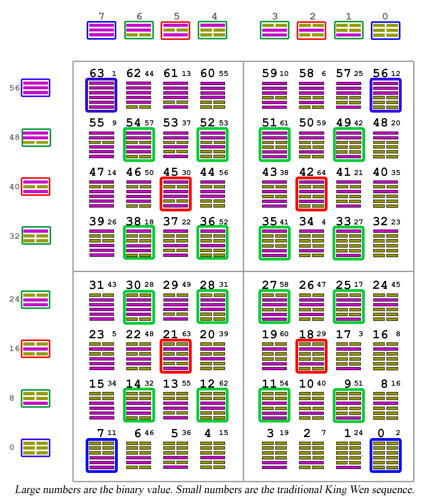


Each quadrant contains 16 hexagrams, but if we were to map these to the four sides of a tetrahedron, we would need exactly 15 hexagrams for a side.  This is because the natural progression of tholonic trigrams is 1, 2, 3, 4, 5, and that equals 15.  The hexagram 0 and 63 could easily be placed outside the side of the tetrahedron as neither of them represents something that exists, as there must be interactions between the two states for energy to move, but they could represent the primary poles within which everything comes into being.  That still leaves 2 hexagrams too many.  Another problem was; with the hexagrams laid out, whatever hexagrams occupied the three corners, they had to equal 63 so as to be able to form the 4th white dot point.  It turned out that the solution to one problem automatically solved the other problem.


At first glance this looked very promising, as the cardinal (blue-framed) hexagrams remained cardinal, the two children of b63  were naturally b7  and b56 , and they equaled a product of 63 (actually 126, which is 63 &times; 2).

However, several other validating patterns emerged that were pretty astounding, at least to me.


Notice that every value can be defined by a formula that only uses the first 4  prime numbers, or is itself a prime number!  It was also a nice surprise that the sum of all values in the central tholonic trigram was 216. 

Here, the 0-dimensional N-points are represented by 63 and 0, alternating back and forth, exactly as the self-similar thologram's N-points.  The one thing that N-points and the hexagrams b63  and b0  have in common is that both only exist as concepts and only their 'offspring' can instantiate.

An interesting observation is; as the top trigram of the 2D map is a smaller instance of the parent that created it, looking at the traditional definitions of the scope of that trigram, which are hexagrams b36  and b44 , might give us some insight as to the nature of that which created this reality, if we accept the traditional interpretation.  What we see there is, in the green-dot of Limitation, b36,  "Keeping Still", which states "The hexagram signifies the end and the beginning of all movement.", and in the red-dot of Contribution, b44,  "The Wanderer", which states, "(if one) is obliging toward others, he wins success."  Make of that what you will.  

If we were to create a sequence of the I-Ching based on the tholonic model above, it would look like the following:


Some interesting points regarding the above sequence:

- Because the 4 cardinal points define the framework, and do not make up the dynamic part of the circle, there are exactly 60 points on the circle… just like the ancient Babylonian clock which introduced the idea of the 60 second minute and the 60 minute hour.  The modern argument is that they used 360 as a basis because it represented their estimate for the number of days in a year…  but this reasoning presumes the ancient Babylonians, who were the masters in their day of navigation, architecture, agriculture, astronomy and government, never bothered to actually count the days in a year, or worse, just ignored the extra days at the end.  The reason the ancients used 60 is because 60 is one of the most fundamental numbers that drives nature, given that it is the product of the first three primes… 2^2^&times;3&times;5.   p.s. 2^2^&times;3 =12, which is why we have 24 hour days, just like the Ancient Egyptians and Chinese developed. I will save you the embarrassingly myopic modern explanation as to why and how these two cultures came up with the same system.  

- While the numbers are not sequential, each pair of opposites equal 63.

- I have added the octal (base 8) value because it is far more clear.  Base-8, if you are not familiar with it, is simply a number system that is based on the eight values 0,1,2,3,4,5,6,7.  So, when you get to 8 you have to start with the double digits, so our base-10 number 8 in octal is written as "10".
  The beauty of using octal numbers for the I-Ching is the number itself is telling you what trigrams it's made of.  For example hexagram b12 (001100) is octal o14 (we use 'o' for octal numbers, just like how 'b' is used for binary values).  Hexagram is b12 composed of two trigrams; 001 and 100.  Converting from binary to octal (or decimal, as both numbers are less that 7, so they will be the same) 001 = 1, and 100 = 4… so we simply put the two numbers next to each other to get o14. No addition is needed to arrive at the correct octal value for 001100.  Today, if we were to do this with our base-10 number system we would get meaningless results, and be chided for engaging in some silly form of numerology or superstition, however, in the past when numbers and letters were often shared, and when using with base-60 (Babylonian, Sumerian) or base-8 (Native American, Proto-Indo-European) systems, simple rearranging of numbers can produce valid mathematical solutions.  In fact, that is exactly how computers, which use base-8, do math… by simply putting numbers next to each other to perform addition.

- The four cardinal hexagrams are made of two absolute trigrams  and . It makes sense that the first and the last hexagrams,  and   , which are absolute in nature, would not be part of the circle where only dynamic interactions, or instances, exist, but why then are hexagrams b07  and b56  also separate from the rest?  The reason is that a hexagram in general is not a fundamental element.  It is more like a molecule, with the trigrams being the atoms, and the lines being the subatomic particles.  These trigrams, just like the absolute hexagrams, represent the ideal and unmanifest state of a trigram, an archetype, and unless they join with another trigram that has the ability to instantiate, they will remain as archetypes 

- The beauty of the tholographic model is that it accommodates both the binary and base-8 system of 64 states as well as the base-60 system, while also shedding light on how they work together.

- Numbers are not as intuitive as images, so here are a few charts that clearly show the self-similarity and pattern of the sequence.  I have deliberately left out the numbers as the specifics of the numbers are not what is important in these charts.

  

  


### How Creation Works

*Note: The chapter is best read after reading the entire book because it incorporates concepts that are brought up at different points in the book.*

The tholonic model is based on the ancient premise that from a singularity comes a duality.   We see this in the idea that *nothingness* has no value until *something* appears within it, at which point, *nothingness* is represented as 0, and *somethingness* is represented as 1.  Without something, nothing would ever exist, because&hellip; it's nothing. We'll avoid the unsolvable argument which came first, nothingness or somethingness, but we can say from this that the first duality was of something (1) and its opposite, nothing (0).  

So now we have 1 and 0.  What can we say about these two numbers?  We can say that they are two parts of a duality, and because we know that the sum of the parts of a whole equal the whole, we can they say that 1+0=1, which tells us the whole equals 1.  This sounds like 1^st^ grade math... but let's continue.

We can plot this a few different ways:


If this is true for 1, then it must be true for all numbers. Let's try this with the first 8 numbers, 0-7, by making every pair of numbers that equals 7; 7+0, 6+1, 5+2, and 4+3.


Now we have a problem, because, as is shown in the above tree chart, we have four 7s, which when split make all the numbers 0-7, but what then are the two parents of these 7s? If we apply the same logic, then it would be 14 and 14, making the originating parent 28, but this is not allowed as we have no numbers that are greater than 7.  Even if we just use a base-8 number system, we still have the problem that any number we use as the top number will never create two children that are the same number, so we will never arrive a 7,7,7,7.  The reason it will never create a pair of numbers is because the top number is always odd. If the top number is even, the number of possible pairs is an odd number, which breaks the symmetry, and we assume that symmetry is a requirement based on the fact that the first number to represent something, 1, creates symmetry.  Zero, which represents nothing, is technically an even number.

The problem then is that there is no number that can be used to represent the parents.  So, we have to invent some numbers.  This is done all the time in math, and they are called *imaginary numbers* and even *pure imaginary numbers*.  These are numbers like *i*, the square root of -1.  Let's invent some imaginary numbers.


We need a number that can be equal to two (or more) values at the same time but can only be expressed as one of these two values in real numbers, and whatever value is in one state, the other state has a different value, so no two states can share the same value. This is a familiar concept in quantum mechanics where we have the idea of spin and entanglement.  For an excellent and clear explanation of this subject, see Quantum Magazine's &ldquo;Entanglement Made Simple&rdquo; [^173]

We can now apply to his all the numbers, going all the way to the top, where we have the meta-value of A that is one unit from which these eight numbers emerge from. 


We start with A and its pair, which consists of A~0~ and A~1~.  On the next row, each one of those meta-values has its own pair, so A~0~ has A~01~ (sub 1 of sub 0) and A~00~, etc.  

To represent this in circular charts, we need a new chart for each row.


For the chart for row 3 I put a &ldquo;?&rdquo; in the center because I just don't know what to put there that will not make things more obtuse.  All we can say about &ldquo;?&rdquo; is that it is a meta-value that all four outer values equals when opposites are added.

At the bottom of the tree we have seven states of A, each identified by the sub-index value, representing its lineage starting from A.  If you understand binary numbers you'll notice that the sub-indexes follow the perfect sequential order of 76543210 (starting from the left).

This seems very odd when you look at the actual values assigned to the sub-indexes of A, which have a sequence of 70615243.  This seems to make no logical sense, but in fact, it is an amazing relationship.  

The sub-index values represent the path of expression from A that resulted in a number value.  This is the *order of instantiation*, while the value itself is the instantiation.  Look at how these two sets of values relate to one another.  


The *value of instantiation* (VI) axis is perpendicular to the *order of instantiation* (OI) axis.  These two axes are perfectly in sync with each other while not only being perfectly squared, but the natural process of reordering is a very efficient form of encoding (and therefore decoding).  It also shows us that the *value of instantiation* is an encoded version of the *order of instantiation*.

Technically speaking (and I need to say that because what comes next sounds quite esoteric), every instance, which is every *thing* that exists, is not only a piece of the *One Thing* that all existence came from, which tholonically speaking is a 0-dimensional dot, but also a recombination of the very path that caused it to come into existence starting from the *One Thing* at the beginning of creation. If there was only one source from which everything grew from, then every instance, every thing, has a unique *order of instantiation* value which describes the path it has taken from 0-dimensions, similar in concept to the way any address works, be it physical, Internet or otherwise.  Because every order of instantiation is unique, so to is the *value of instantiation*.

But there is one more perspective that is worth looking at.  If we arrange this tree in its most natural evolving form, we get the following:


There are many significant patterns here, but the ones I'd like to point out specifically are:

- Only the numbers 7 and 2 are the same on both axes.  This is significant because it says that the value of 7 and 2 have the same measure when it comes to *how* something came to be, and *what* something came to be.  This is not only because they are the same in the map, but they are also the same as the sum of their axis.  When we look at the combined values of the axes, we see that this is the same case for 12.  They also are the first and last prime numbers (in the set of 0-8, the two in-between being 3 and 5)

- Values A~011~ and A~100~ overlap, and of course, when combined they equal A~111~, which is supporting evidence that this model is viable, plus, the VI value, indicating how this unique double-value will instantiate itself is the number 1, and is also the first instance of an overlap that happens to be the reverse value of the original A source value. In short, the number 1 represents the instance of the source that created everything, and came into existence by the source dividing itself and then recombining itself.  Sound familiar?

- Only meta-values that reach the *observable level* have some quality that is quantifiable as a number, but as everything beyond that point can have numerical values, the implication is that there are 7 meta-values across 2 generations and 3 levels that stand between A and all instances.  What is interesting about this is that we see this same concept in religion and  mythological cosmology (Mesopotamian, Islam, Judaism, Christianity, Hinduism, Jainism), where Heaven, that place from which our material reality was conceived, has seven divisions.  In addition we have the concept of a trinity, an even more fundamental concept that has been incorporated in our models of reality going back to the most ancient beliefs.

<div style="page-break-after: always; break-after: page;"></div>  
# The End

[^1]: Gleick, J. (1998). **Making a New Science**.

[^2]: &ldquo;**The Beginning of Time**.&rdquo; Stephen Hawking, <https://www.hawking.org.uk/the-beginning-of-time.html>.

[^3]: For math nerds, here is an excellent vlog on **&ldquo;The Opposite of Infinity&rdquo;**: on <http://www.quora.com> "How do you understand the difference between something infinitely small and something inexistant Are they distinguishable in real terms?

[^4]: <https://users.isy.liu.se/jalar/kurser/QF/assignments/LeggettGarg1985.pdf>

[^5]: Boeyens JCA, Thackeray JF **Number theory and the unity of science**. S Afr J Sci. 2014;110(11/12), Art.\#a0084, 2 pages. <http://dx.doi.org/10.1590/sajs.2014/a0084>

[^6]: Brown, J. H., Gupta, V. K., Li, B., Milne, B. T., Restrepo, C., & West, G. B. (2002**). **The fractal nature of nature: Power laws, ecological complexity and biodiversity**. London: The Royal Society <http://www.fractal.org/Bewustzijns-Besturings-Model/Fractal-Nature.pdf>

[^7]: Here is the video of this experiment: <https://www.youtube.com/watch?v=UpJ-kGII074>

[^8]: Here are a couple of sites that show a harmonograph in action. They are fascinating to watch. <http://andygiger.com/science/harmonograph/index.html>, <https://www.youtube.com/watch?v=HJYvc-ISrf8>

[^9]: Yee, Jeff. (2019). **The Relation of Ohm&rsquo;s Law to Newton&rsquo;s 2nd Law**. 10.13140/RG.2.2.15576.75523. Ohm&rsquo;s law relates voltage, current and resistance in electrical systems as V=IR. Newton&rsquo;s 2nd law relates force, mass and acceleration as F=ma. Although electrical and mechanical systems are supported by different equations to describe these relationships today, it will be shown that the laws of Ohm and Newton are related and are built from the same foundation that governs the force of particles and all of matter.

[^10]: <https://en.wikipedia.org/wiki/International_System_of_Units>

[^11]: Oldershaw, R. L. (1989). **Self-Similar Cosmological model: Introduction and empirical tests**. International Journal of Theoretical Physics, 28(6), 669-694. doi:10.1007/bf00669984 <https://www.academia.edu/26520933/Self-Similar_Cosmological_model_Introduction_and_empirical_tests>

[^12]: You can find many examples of this self-similarity <http://www.bordalierinstitute.com/>

[^13]: <https://www.sciencealert.com/scientists-have-found-a-structural-similarity-between-human-cells-and-neutron-stars>

[^14]: van Leunen, Hans. (2018). **The structure of physical reality**, <https://www.researchgate.net/publication/327273285_The_structure_of_physical_reality>

[^15]: Leunen, J. J. (2018). **Structure of physical reality**. <http://vixra.org/pdf/1806.0087v3.pdf>. Here is the entire report <http://www3.amherst.edu/~rloldershaw/OBS.HTM>

[^16]: Livio, M. (n.d.). **Why Math Works**. <https://www.scientificamerican.com/article/why-math-works/>

[^17]: Britannica, T. E. (2019, April 08). **Laws of thought**. <https://www.britannica.com/topic/laws-of-thought>

[^18]: **15** **Insane Things That Correlate With Each Other**. (n.d.). <http://www.tylervigen.com/spurious-correlations>

[^19]: Abreu, N. (n.d**.). Methodology for Investigating the Hypothesis of Anomalous Remote Perceptions as Objective Phenomena.** <http://cref.tripod.com/tucsonpaper.htm> Science of Self Club, University of Florida

[^20]: <https://www.infinitemonkeylab.com/>

[^21]: Jaynes, Julian (2000) \[1976\]. **The origin of consciousness in the breakdown of the bicameral mind** (PDF). Houghton Mifflin. p.73.ISBN 978-0-618-05707-8.

[^22]: Fast-moving air is at a lower pressure than slow-moving air, so the pressure above the wing is lower than the pressure below, and this creates the lift that powers the plane upward.

[^23]: Fiegna and Velicer, 2003

[^24]: Rankin and Kokko, 2006; Muir and Howard, 1999

[^25]: Rainey, Paul B. **&ldquo;Precarious Development: The Uncertain Social Life of Cellular Slime Molds.&rdquo;** Proceedings of the National Academy of Sciences, vol. 112, no. 9, 2015, pp. 2639-2640., doi:10.1073/pnas.1500708112. <https://www.pnas.org/content/pnas/112/9/2639.full.pdf>

[^26]: De Roode et al., 2005

[^27]: Gersani et al., 2001

[^28]: Ahmed Ibrahim, **&ldquo;Invasive cancer as an empirical example of evolutionary suicide&rdquo;**, Network Biology, 06/2014, v. 4 2

[^29]: **The Simulation Hypothesis Documentary**. (2018, August 01). <https://youtu.be/pznWo8f020I>

[^30]: Klein, Christopher. &ldquo;**DNA Study Finds Aboriginal Australians World&rsquo;s Oldest Civilization.**&rdquo; History.com, A&E Television Networks, 23 Sept. 2016, <https://www.history.com/news/dna-study-finds-aboriginal-australians-worlds-oldest-civilization>

[^31]: Parvinen, Kalle, and Ulf Dieckmann. **&ldquo;Environmental Dimensionality&rdquo;**. *Journal of Theoretical Biology*, 2018, doi: 10.1016/j.jtbi.2018.03.008. <https://www.ncbi.nlm.nih.gov/pubmed/29551543>

[^32]: **List of cycles**. (2019, April 27). <https://en.wikipedia.org/wiki/List_of_cycles>

[^33]: Hossenfelder, Sabine. &ldquo;**Dear Dr B: Does the LHC Collide Protons at Twice the Speed of Light?&rdquo;** Backreaction, 1 Jan. 1970, backreaction. <https://blogspot.com/2019/04/dear-dr-b-does-lhc-collide-protons-at.html>

[^34]: Laszlo, E., & Clark, J. W. (1973). **Introduction to systems philosophy: Toward a new paradigm of contemporary thought**. New York, NY: Harper Torchbooks. ISBN: 0061317624 (ISBN13: 9780061317620)

[^35]: Dawkins, C. R. (2016). **The selfish gene**. Oxford: Oxford University Press.

[^36]: **Just for Hits - Richard Dawkins**. (2013, June 22). <https://youtu.be/GFn-ixX9edg>The first 4 minutes is an excellent overview of memes by Dawkins. The following 4 minutes is a sort of meme-ish music video which is a bit odd, but also a bit entertaining

[^37]: Velikovsky, J. T. (1970, January 01). **Flow Theory, Evolution & Creativity: Or, Fun & Games ** <https://dl.acm.org/citation.cfm?id=2677770>

[^38]: &ldquo;**Quantum Gravity Research**.&rdquo; Quantum Gravity Research, <https://www.quantumgravityresearch.org/>.

[^39]: Smith, F. D. (n.d.). **E8 Root Vectors from 8D to 3D** - Valdosta, Georgia. <http://www.valdostamuseum.com/hamsmith/E8to4Dand3D.pdf>

[^40]: What **is Reality? Emergence Theory Tries to Explain**. (2017, March 11). <http://www.deepstuff.org/what-is-reality-emergence-theory-tries-to-explain/>

[^41]: Jgmoxness. (n.d.). **Visualizing a Theory of Everything**! <http://theoryofeverything.org/theToE/tags/e8/>

[^42]: **Gottfried Wilhelm Leibniz**. (n.d.). <http://www.wikiwand.com/en/Gottfried_Wilhelm_Leibniz>**, Leibniz and the I Ching**. (n.d.). <http://www.wikiwand.com/en/Binary_number#/Leibniz_and_the_I_Ching>

[^43]: **Gottfried Leibniz**. (n.d.). Retrieved from <http://history-computer.com/Dreamers/Leibniz.html>

[^44]: Abrantes, R. (2018, November 19). **How Wolves Change Rivers** \| Ethology Institute \| Read and Watch Now. Retrieved from <https://ethology.eu/how-wolves-change-rivers/>

[^45]: Grzegorz Rozenberg and Arto Salomaa. **The mathematical theory of L systems** (Academic Press, New York, 1980). ISBN 0-12-597140-0

[^46]: Quijada, John. **A Grammar of the Ithkuil Language**. John Quijada, 2011.

[^47]: Speaks, Jeff. **&ldquo;Theories of Meaning&rdquo;**. Stanford Encyclopedia of Philosophy, Stanford University, 27 June 2019,<https://plato.stanford.edu/entries/meaning/>

[^48]: Example of a &ldquo;person&rdquo; as defined by the semantic web: <http://xmlns.com/foaf/spec/#term_Person>

[^49]: McCrae, J. P. (n.d.). **The Linked Open Data Cloud**. <https://www.lod-cloud.net/>

[^50]: Wang, Y., & Kosinski, M. (in press). **&ldquo;Deep neural networks are more accurate than humans at detecting sexual orientation from facial images&rdquo;**. Journal of Personality and Social Psychology; Newspaper article on this research: Levin, Sam. **&ldquo;New AI Can Work out Whether You&rsquo;re Gay or Straight from a Photograph.&rdquo;** The Guardian, Guardian News and Media, 7 Sept. 2017, <http://www.theguardian.com/technology/2017/sep/07/new-artificial-intelligence-can-tell-whether-youre-gay-or-straight-from-a-photograph>

[^51]: &ldquo;**Reciprocal Theory**&rdquo; RationalWiki, <https://rationalwiki.org/wiki/Reciprocal_Theory>.

[^52]: Fuller, R. Buckminster, and E. J. Applewhite. ***Synergetics. Explorations in the Geometry of Thinking***. Macmillan, 1975.The entire book can be found online at <http://synergetics.info/>

[^53]: References to the above come from <http://synergetics.info/s02/p0000.html>

[^54]: <http://hexagonalwater.com>

[^55]: Ptok, Fabian, &ldquo;**Alternative Irrigation Methods: Structured Water in the context of a Growing Global Food Crisis due to Water Shortages**&rdquo; (2014). Undergraduate Honors Theses. 182. <https://scholar.colorado.edu/honr_theses/182>

[^56]: Fonseca, Giuseppe, and Giuseppe Fonseca. &ldquo;**Dr Pollack The Fourth Phase of Water.**&rdquo; Academia.edu, <https://www.academia.edu/18516517/Dr_Pollack_The_Fourth_Phase_Of_Water>

[^57]: Chara, et al. &ldquo;**Crossover between Tetrahedral and Hexagonal Structures in Liquid Water.**&rdquo; Physics Letters A, <http://www.academia.edu/21730774>

[^58]: Seager, William, and Sean Allen-Hermanson. **&ldquo;Panpsychism.&rdquo;** Stanford Encyclopedia of Philosophy, Stanford University, 23 May 2001, <https://plato.stanford.edu/archives/win2012/entries/panpsychism/>

[^59]: Turow, J. (1991). **The Challenge of Inference in Interinstitutional Research on Mass Communication**. Communication Research,18(2),222-239. <https://doi.org/10.1177/009365091018002005>. *Note: Although this is not a reference to the official definition of the term &ldquo;interinsitutionality&rdquo;, which is too vague to be of any use here, it does provide an excellent explanation of what it is, how it works, and how it applies to mass communications.*

[^60]: Spottiswoode, C. N., K. S. Begg, and C. M. Begg. **&ldquo;Reciprocal Signaling in Honeyguide-human Mutualism&rdquo;.** Science 353, no. 6297 (2016): 387-89. doi:10.1126/science. aaf4885.

[^61]: Milius, Susan. &ldquo;**How Roaches Fight off Wasps That Turn Their Victims into Zombies.**&rdquo; Science News, 14 Nov. 2018, <https://www.sciencenews.org/article/how-roaches-fight-wasps-turn-their-victims-zombies>

[^62]: Media, T. E. (2015, June 02). Rupert Sheldrake, **Heretic**. <https://www.youtube.com/watch?v=ZSd4DA5xhHw>

[^63]: Sheldrake, Rupert. **A New Science of Life: The Hypothesis of Formative Causation**. Los Angeles: J.P. Tarcher, 1981.

[^64]: Horgan, J. (2014, July 14).**Scientific Heretic Rupert Sheldrake on Morphic Fields, Psychic Dogs and Other Mysteries.** <https://blogs.scientificamerican.com/cross-check/scientific-heretic-rupert-sheldrake-on-morphic-fields-psychic-dogs-and-other-mysteries/>

[^65]: Sheldrake, R. (n.d.).**Morphic Resonance and Morphic Fields - an Introduction**. <https://www.sheldrake.org/research/morphic-resonance/introduction>

[^66]: Sheldrake, R. (2013). **Dogs That Know When Their Owners Are Coming Home: And Other Unexplained Powers of Animals**. London: Cornerstone Digital.

[^67]: One of these experiments can be seen here: <http://www.sheldrake.org/videos/jaytee-a-dog-who-knew-when-his-owner-was-coming-home-the-orf-experiment>

[^68]: Iozzio, Corinne. &ldquo;**Scientists Prove That Telepathic Communication Is Within Reach.**&rdquo; Smithsonian.com, Smithsonian Institution, 2 Oct. 2014, <https://www.smithsonianmag.com/innovation/scientists-prove-that-telepathic-communication-is-within-reach-180952868/>

[^69]: Wilkins, & Sherman, H. M. (1971). ***Thoughts through space***. London: Muller.

[^70]: Sheldrake, R. (2013). **Science set free: 10 paths to new discovery.** New York: Deepak Chopra Books.

[^71]: Smolin, L. (2012, May 16). **Precedence and freedom in quantum physics**. <https://arxiv.org/abs/1205.3707>

[^72]: Lobach, E.; Bierman, D. (2004). &ldquo;**The Invisible Gaze: Three Attempts to Replicate Sheldrake&rsquo;s Staring Effects**&rdquo; . <https://www.parapsych.org/papers/07.pdf>

[^73]: <https://www.scientificamerican.com/article/what-causes-spooky-out-of-body-experiences/>

[^74]: <https://www.iacworld.org/evidence-for-out-of-body-experience-as-a-real-or-veridical-phenomenon/>

[^75]: The full account of his research and notes are reprinted at <http://www.aura-oasis.be/website/scientific-research-on-out-of-the-body-experiences/>

[^76]: Tressoldi, P. E., Storm, L., & Radin, D. (2010). **Extrasensory Perception and Quantum Models of Cognition, Neuro Quantology,** 8(4). doi:10.14704/nq.2010.8.4.353

[^77]: King, T. (2017, May 30). **Scientific Evidence of Telepathy - Documentary.** Retrieved from <https://www.youtube.com/watch?v=zZ4G3IRVFwU>

[^78]: **Astronaut Tells of E. S. P. Tests.** (1971, June 22). Retrieved from <https://www.nytimes.com/1971/06/22/archives/astronaut-tells-of-e-s-p-tests.html>

[^79]: **100 Scientific Papers Offering Evidence for Psi Phenomena & Effects**. (2019, April 22). <https://subtle.energy/list-100-peer-reviewed-papers-offer-scientific-evidence-psi-phenomena/>

[^80]: Luke, D. (2009, September). **Telepathine (ayahuasca) and psychic ability: Field research in South America**.  <http://www.researchgate.net/publication/278301470>, British Psychological Society, Transpersonal Psychology Section 13th Annual Conference

[^81]: Cave, K. (2015, February 24). **The rise of &ldquo;Telepathic Tech&rdquo; in 2015**. Retrieved from <https://www.idgconnect.com/idgconnect/analysis-review/1023702/rise-telepathic-tech-2015>

[^82]: Grau, C., Ginhoux, R., Riera, A., Nguyen, T. L., Chauvat, H., Berg, M., &hellip; Ruffini, G. (n.d.). **Conscious Brain-to-Brain Communication in Humans Using Non-Invasive Technologies**. <https://journals.plos.org/plosone/article?id=10.1371/journal.pone.0105225>

[^83]: Heaven, D. (n.d.). **First mind-reading implant gives rats telepathic power**. Retrieved from <https://www.newscientist.com/article/dn23221-first-mind-reading-implant-gives-rats-telepathic-power/>

[^84]: Tucker, P. (2018, September 06). **it&rsquo;s Now Possible to Telepathically Communicate with a Drone Swarm.** Retrieved from <https://www.defenseone.com/technology/2018/09/its-now-possible-telepathically-communicate-drone-swarm/151068/>

[^85]: Kosoff, M., & Kosoff, M. (2017, April 21). **Elon Musk Is Seriously Starting a &ldquo;Telepathy&rdquo; Company.** Retrieved from <https://www.vanityfair.com/news/2017/04/elon-musk-is-seriously-starting-a-telepathy-company>

[^86]: Heath, A. (2017, January 11). **Facebook has a mysterious team working on tech that sounds a lot like mind reading**. Retrieved from <https://www.businessinsider.com/facebooks-building-8-working-on-brain-computer-communication-platform-2017-1>

[^87]: Watanabe-Crockett, L. (n.d.). **Telepathic Message Sent Over Internet**. Retrieved from <https://www.wabisabilearning.com/blog/telepathic-message-sent-over-internet>

[^88]: ArXiv, E. T. (2018, October 01). **The first &ldquo;social network&rdquo; of brains lets three people transmit thoughts to each other&rsquo;s heads.** Retrieved from <https://www.technologyreview.com/s/612212/the-first-social-network-of-brains-lets-three-people-transmit-thoughts-to-each-others-heads/>

[^89]: King, T. (2017, May 30). **Scientific Evidence of Telepathy - Documentary**. <https://www.youtube.com/watch?v=zZ4G3IRVFwU>

[^90]: MetaRising. (2016, November 10). **Banned TED Talk about Psychic Abilities** \| Russell Targ \| suespeaks.org. <https://www.youtube.com/watch?v=hBl0cwyn5GY>

[^91]: Zhou, Wen, and Denise Chen. &ldquo;**Fear-Related Chemosignals Modulate Recognition of Fear in Ambiguous Facial Expressions.**&rdquo; Psychological Science 20, no. 2 (2009): 177-83. doi:10.1111/j.1467-9280.2009.02263. x.

[^92]: **&ldquo;Some Personality Traits Affect How You Smell.&rdquo;** Live Science, December 2, 2011

[^93]: Masataka, N., and M. Shibasak. &ldquo;** Premenstrual Enhancement of Snake Detection in Visual&rdquo;**" Nature. March 8, 2012. Accessed May 29, 2016.doi:10.1038/srep00307

[^94]: **&ldquo;The Humans with Super Human Vision.&rdquo;** Discover, June 18, 2009.

[^95]: Galland, L., National Center for Biotechnology Information. December 2014. Accessed June 12, 2016. <http://www.ncbi.nlm.nih.gov/pubmed/25402818/>

[^96]: Heijtz, R. D., S. Wang, F. Anuar, Y. Qian, B. Bjorkholm, A. Samuelsson, M. L. Hibberd, H. Forssberg, and S. Pettersson. &ldquo;**Normal Gut Microbiota Modulates Brain Development and Behavior.**&rdquo; Proceedings of the National Academy of Sciences 108, no. 7 (2011): 3047-052. Accessed June 26, 2016. doi:10.1073/pnas.1010529108. Note: this is the same paper used by Dr. Andrew Wakefield to help support the autism/vaccine connection, which, contrary to Dr. Brain Deer&rsquo;s accusations, is neither fraudulent or inaccurate.

[^97]: Gershon, Michael D. **The Second Brain: The Scientific Basis of Gut Instinct and a Groundbreaking New Understanding of Nervous Disorders of the Stomach and Intestine.** New York, NY: HarperCollins Publishers, 1998.

[^98]: **&ldquo;Sight Unseen: People Blinded by Brain Damage Can Respond to Emotive Expressions.&rdquo;** Scientific American, October 14, 2009.

[^99]: This is a technique taught by the Nithyananda Mission.Contact address: Nithyananda Dhyanapeetam, Nithyanandapuri, Kallugopahalli, Off Mysore Road, Bidadi, Bangalore District &ldquo; 562 109. Karnataka, INDIA

[^100]: Cerretani, Jessica. &ldquo;**Extra Sensory Perceptions.**&rdquo; HMS.Accessed May 29, 2016. <https://hms.harvard.edu/news/harvard-medicine/extra-sensory-perceptions>.

[^101]: Crick, F., & Orgel, L. (1973). **Directed panspermia.** Icarus, 19(3), 341-346. doi:10.1016/0019-1035(73)90110-3

[^102]: Sullivan, W. (1979, May 07). **Scientists Examine Tiny Viruses for Messages from Outer Space**. Retrieved from <https://www.nytimes.com/1979/05/07/archives/scientists-examine-tiny-viruses-for-messages-from-outer-space.html>

[^103]: **Collective Memory.**(n.d.). <https://www.sciencedirect.com/topics/computer-science/collective-memory>

[^104]: García-Gavilanes, Ruth, et al. **&ldquo;The Memory Remains: Understanding Collective Memory in the Digital Age.&rdquo;** Science Advances, vol. 3, no. 4, 2017, doi:10.1126/sciadv.1602368. <https://advances.sciencemag.org/content/3/4/e1602368.full>

[^105]: <https://en.wikipedia.org/wiki/Exabyte>

[^106]: Darryl Bruce (2001) **Fifty Years Since Lashley&rsquo;s In Search of the Engram**: Refutations and Conjectures, Journal of the History of the Neurosciences, 10:3, 308-318, DOI: 10.1076/jhin.10.3.308.9086<https://www.tandfonline.com/doi/abs/10.1076/jhin.10.3.308.9086>

[^107]: &ldquo;**Internet Kill Switch**.&rdquo; Wikipedia, Wikimedia Foundation, 24 Jan. 2019,<https://en.wikipedia.org/wiki/Internet_kill_switch>

[^108]: Trafton, Anne. &ldquo;**Brain Waves Encode Rules for Behavior.**&rdquo; MIT News, 21 Nov. 2012, <http://news.mit.edu/2012/brain-waves-encode-rules-for-behavior-1121>

[^109]: &ldquo;**Brain Waves Encode Information as Time Signals.**&rdquo; ScienceDaily, ScienceDaily, 16 Dec. 2013, <https://www.sciencedaily.com/releases/2013/12/131216142622.htm>

[^110]: &ldquo;**New Way of Retaining Quantum Memories Stored in Light.**&rdquo; ScienceDaily, ScienceDaily, 30 Sept. 2015, <https://www.sciencedaily.com/releases/2015/09/150930074440.htm>

[^111]: &ldquo;**What Is the Cosmic Microwave Background Radiation?&rdquo;** *Scientific American*, <https://www.scientificamerican.com/article/what-is-the-cosmic-microw/>

[^112]: Williams, Matt. &ldquo;**It Could Be Possible to Transfer Data Through Gravitational Waves.**&rdquo; Universe Today, 24 Oct. 2018, <https://www.universetoday.com/140305/it-could-be-possible-to-transfer-data-through-gravitational-waves/>

[^113]: &ldquo;**Can Quantum Dark Energy Explain Telepathy?&rdquo;** Can Quantum Dark Energy Explain Telepathy? \| Naked Science Forum, <https://www.thenakedscientists.com/forum/index.php?topic=52709.0>

[^114]: Thomas Y., Kahhak L., Aissa J. (2006) **The physical nature of the biological signal, a puzzling phenomenon: the critical contribution of Jacques Benveniste**. In: Pollack G.H., Cameron I.L., Wheatley D.N. (eds) Water and the Cell. Springer, Dordrecht, <https://link.springer.com/chapter/10.1007/1-4020-4927-7_17>

[^115]: &ldquo;**When to Publish Pseudo-Science**.&rdquo; Nature, vol. 334, no. 6181, 1988, pp. 367. doi:10.1038/334367a0. <https://www.nature.com/articles/334367a0>

[^116]: Maddox, John, et al. &ldquo;**High-Dilution&rdquo; Experiments a Delusion.**&rdquo; Nature, vol. 334, no. 6180, 1988, pp. 287-290., doi:10.1038/334287a0. <https://www.ncbi.nlm.nih.gov/pubmed/2455869>

[^117]: Pritchard, David E., et al. &ldquo;**Photon Scattering from Atoms in an Atom Interferometer: Coherence Lost and Regained.**&rdquo; Coherence and Quantum Optics VII, 1996, pp. 133-141. doi:10.1007/978-1-4757-9742-8_18. <https://journals.aps.org/prl/abstract/10.1103/PhysRevLett.75.3783> Full paper: <http://chapmanlabs.gatech.edu/papers/scattering_ifm_prl95.pdf>.

[^118]: Penrose, Roger, and Malcolm Angus Hugh. MacCallum. **Twistor Theory: An Approach to the Quantisation of Fields and Space-time**. Amsterdam: North-Holland Pub., 1973.

[^119]: Dr. Wojciech Zurek of the Los Alamos National Laboratory explains the concept of quantum Darwinism in an interview at the Institute for Quantum Computing that you can see on YouTube at <https://www.youtube.com/watch?v=27zMdaBgt6g>

[^120]: Dias, Brian & Ressler, Kerry. (2013). **Parental olfactory experience influences behavior and neural structure in subsequent generations**. Nature neuroscience. 17. 10.1038/nn.3594. www.researchgate.net/publication/259109859. See also articles: <https://www.bbc.com/news/health-25156510> and <http://www.telegraph.co.uk/news/science/science-news> article **"Phobias may be memories passed down in genes from ancestors"**

[^121]: Hagelin, John S., Rainforth, Maxwell V., Cavanaugh, Kenneth L. C., Alexander, Charles N., Shatkin, Susan F., Davies, John L., Hughes, Anne O., Ross, Emanuel, Orme-Johnson, David W., **Effects of Group Practice of the Transcendental Meditation Program on Preventing Violent Crime in Washington, D.C.: Results of the National Demonstration Project, June--July 1993,** Social Indicators Research,,8 June 01,1999 <https://doi.org/10.1023/A:1006978911496> Full report available at <http://www.istpp.org/crime_prevention/>

[^122]: &ldquo;**Reduced Violent Crime in Washington, DC.**&rdquo; Research Reduced Violent Crime in Washington DC Comments, <https://research.mum.edu/maharishi-effect/reduced-violent-crime-in-washington-dc>

[^123]: Carey, Benedict. &ldquo;**Long-Awaited Medical Study Questions the Power of Prayer.**&rdquo; The New York Times, The New York Times, 31 Mar. 2006, <https://www.nytimes.com/2006/03/31/health/31pray.html>.

[^124]: Byrd, Randolph C. &ldquo;**Positive Therapeutic Effects of Intercessory Prayer in a Coronary Care Unit Population.**&rdquo; Southern Medical Journal, vol. 81, no. 7, 1988, pp. 826-829., doi:10.1097/00007611-198807000-00005. <http://www.godandscience.org/apologetics/smj1.html>

[^125]: William S. Harris, PhD; Manohar Gowda, MD; Jerry W. Kolb, MDiv; et al, **&ldquo;A Randomized, Controlled Trial of the Effects of Remote, Intercessory Prayer on Outcomes in Patients Admitted to the Coronary Care Unit"Correction.&rdquo;** Archives of Internal Medicine, vol. 160, no. 12, 2000, p. 1878., doi:10.1001/archinte.160.12.1878. <https://jamanetwork.com/journals/jamainternalmedicine/fullarticle/485161>

[^126]: Lilly, J. M., Sykulski, A. M., Early, J. J., and Olhede, S. C.: **Fractional Brownian motion, the Matérn process, and stochastic modeling of turbulent dispersion**, Nonlin. Processes Geophys., 24, 481-514, <https://doi.org/10.5194/npg-24-481-2017>, 2017.

[^127]: Grabbed from <https://www.oddee.com/item_82923.aspx>

[^128]: **&ldquo;As above, so below&rdquo;, or how a scientific theory is born**. (2012, July 30). <https://paolomaggiuk.wordpress.com/as-above-so-below-or-how-a-scientific-theory-is-born/>

[^129]: Rifkin, L. (2014, June 10). **The Logic and Beauty of Cosmological Natural Selection**. <https://blogs.scientificamerican.com/guest-blog/the-logic-and-beauty-of-cosmological-natural-selection/>

[^131]: Talbot, Michael, and Lynne McTaggart. **The Holographic Universe: The Revolutionary Theory of Reality**. New York, NY: Harper Perennial, 2011.

[^132]: Wilber, Ken. **The Holographic Paradigm**. Shambhala;1982

[^133]: Crew, B. (n.d.).**The Case For Black Holes Being Nothing But Holograms Just Got Even Stronger.**<https://www.sciencealert.com/the-case-for-black-holes-being-nothing-but-holographic-images-just-got-stronger>

[^134]: Genesis 3:22. The entire line is &ldquo;Then the Lord God said, &lsquo;Behold, the man has become like one of Us, knowing the difference between good and evil; suppose he were to reach out his hand to also eat the fruit of the tree of life, and live forever!&rsquo;&rdquo; 

[^135]: Emoto, Masaru. **The True Power of Water: Healing and Discovering Ourselves**. Beyond Words Pub., 2005.;Emoto, Masaru. **Messages from Water and the Universe.** Hay House, 2010.; Emoto, Masaru. **Messages from Water: The First Pictures of Frozen Water Crystals.** Hado Publishing, 2004.

[^136]: The use of magnetic water in agriculture to increase harvest and save up to 25% water. Live testimonials by biggest Australian farmers. <https://www.youtube.com/watch?v=YVL6tfGhr8M>

[^137]: For example. **Heron's Fountain Plastic Water Bottle 2 minute DIY no sealant, no glue,**<https://www.youtube.com/watch?v=92rSXLPupKw>

[^138]: More on Victor&rsquo;s work can be seen in the excellent documentary on YouTube &ldquo;**The Secrets of Water, The Documentary of Viktor Schauberger / Comprehend and Copy Nature**&rdquo;, <https://www.youtube.com/watch?v=XyOGdjWDVM4>

[^139]: Martin-Fischer-Harthun, &ldquo;**Experimente mit Leitungswasser**&rdquo;, 1997. This is a difficult paper to find online. The original can be purchased at <https://www.fischer-wirbelwasser.de/shop/buecher.html>

[^140]: **&ldquo;The anthropic universe&rdquo;**. Science Show. 18 February 2006.

[^141]: Folger, Tim. **&ldquo;Eminent Physicist John Wheeler Says He Has Only Enough Time Left to Work on One Idea: That Human Consciousness Shapes Not Only the Present but the Past as Well.&rdquo;** Discover Magazine, June 1, 2002. <http://discovermagazine.com/2002/jun/featuniverse#.UvxOUrTVdnA>.

[^142]: **&ldquo;Consciousness in the Universe: A Review of the &ldquo;Orch OR&rdquo; Theory.&rdquo;** Physics of Life Reviews. Elsevier, August 20, 2013. <https://www.sciencedirect.com/science/article/pii/S1571064513001188?via=ihub>.

[^143]: This idea, and much more, is discussed at length in a 82 volume edition of great works that question the nature of existence. Glattfelder, James B. Information, **Consciousness, Reality: How a New Understanding of the Universe Can Help Answer Age-Old Questions of Existence**. Cham: Springer International Publishing, 2019. Available online at <https://link.springer.com/bookseries/5342>

[^144]: Hubisz, John L. &ldquo;**The Pleasure of Finding Things Out: The Best Short Works of Richard P. Feynman, by Carl Feynman and Michelle Feynman.**&rdquo; The Physics Teacher, vol. 38, no. 2, 2000, pp. 111. doi:10.1119/1.1558111.

[^160]:  In that it applies the syntactic features of natural languages.  This is mentioned in the book: Prusinkiewicz, Przemyslaw, et al. **The Algorithmic Beauty of Plants**. Springer, 1996.  This book is also available online.  The relevant chapter is  http://algorithmicbotany.org/papers/abop/abop-ch1.pdf.  This site in general is an excellent resource for algorithms of nature.

[^161]: Steingart, Dan. “**The Unfortunate Tetrahedron**.” Medium. the unfortunate tetrahedron, May 30, 2017. https://medium.com/the-unfortunate-tetrahedron/the-unfortunate-tetrahedron-ce1e44d0b961.

[^164]: Levin, Samuel & Scott, Thomas & Cooper, Helen & West, Stuart. (2017). **Darwin&rsquo;s aliens.** International Journal of Astrobiology. 1-9. 10.1017/S1473550417000362. 

[^165]: Amazing description of how the E8 crystal can be defined as tetrahedrals. <https://quantumgravityresearch.org/portfolio/a-deep-link-between-3d-and-8d>

[^166]: As a relevant aside, this reversing effect has a material analog called the *Janibekov effect,*(among other names). It is well established in the field of mechanics and is most easily observed in space where there is no gravity. On observing it for the first time one would think the impossible is happening, but in fact, it is a basic law of energy that we rarely get to see here on Earth because of gravity. Imagine an asymmetrical rigid body, like a wing-nut or a or handle, rotating around one of its axis, then suddenly, it flips 180&deg;, and continues to rotate around the same axis, but in a reverse position. After a few moments, it flips again, and continues flipping back and forth indefinitely. It does this because the lowest energy state, which is the state that all matter seeks,  requires the maximum amount of inertia, and the maximum amount of inertia will always be where the most mass is. Given that the object is asymmetrical, the amount of mass for each axis will change, causing the object to change position. A quick search for &ldquo;Janibekov effect&rdquo; will yield many fascinating videos on this phenomena. This phenomena is worth mentioning because it is a perfect example of how energy operates in form, and, presumably, in the archetypes of form as well, which, at least tholonically, are asymmetrical tholons.

[^167]: Levin, Samuel R., and Stuart A. West. **“The Evolution of Cooperation in Simple Molecular Replicators.”** Proceedings of the Royal Society B: Biological Sciences 284, no. 1864 (November 2017): 20171967. <https://doi.org/10.1098/rspb.2017.1967>.

[^168]: <https://en.wikipedia.org/wiki/Quantum_eraser_experimentreincar>

[^169]: **&ldquo;Exploring Geographic and Geometric Relationships Along a Line of Ancient Sites Around the World&rdquo;** <https://grahamhancock.com/geographic-geometric-relationships-alisonj/>

[^170]: SCIENCE 313:49 7/7/2006

[^171]: Barton, George A. **On the Babylonian Origin of Plato&rsquo;s Nuptial Number: on an Old Babylonian Letter Addressed "to Lushtamar."**. New Haven: American Oriental Society, 1908. <https://www.jstor.org/stable/592627?seq=2#metadata_info_tab_contentst>

[^172]: Siegel, Ethan. “**Ask Ethan: Can Free Quarks Exist Outside Of A Bound-State Particle?**” Forbes. Forbes Magazine, August 3, 2019. <https://www.forbes.com/sites/startswithabang/2019/08/03/ask-ethan-can-free-quarks-exist-outside-of-a-bound-state-particle/>

[^173]:  <https://www.quantamagazine.org/entanglement-made-simple-20160428/>

[^174]: Image credit: The pre-launch Planck Sky Model: a model of sky emission at submillimetre to centimetre wavelengths — Delabrouille, J. et al.Astron.Astrophys. 553 (2013) A96 arXiv:1207.3675 [astro-ph.CO]. 

[^175]: R. Buckminster Fuller, Jr. (1895-1983), http://mindprod.com/ethics/quote.html; Rene' Dubos, as an advisor to the United Nations Conference on the Human Environment in 1972, http://capita.wustl.edu/ME567_Informatics/concepts/global.html; A slogan attributed to Yoko Ono and popularized with the help of her husband, John Lennon. http://www.everything2.com/index.pl?node_id=680227; “A well-known international bank coined the phrase” [states Louisa T. C. Kim President of Korea TESOL]: http://www.kotesol.org/daegu/2006conf/brochure_2006.htm; Mother Theresa, http://rubelshelly.faithsite.com/content.asp?CID=19276; unattributable http://www.oursouthwest.com/news/quotes1sd.htm