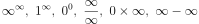
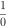

# 1: CHAOS

###### Everything begins and ends in chaos.

Oxford English Dictionary gives three definitions of the word *chaos*.  These are:

-   The formless matter supposed to have existed before the creation of the universe.
-   The formless and disordered state of matter before the creation of the cosmos.
-   A state of extreme confusion and disorder.

I am not really sure what the difference is between the first two definitions.  Regardless, we’ll skip over the obvious contradiction of “formless matter” existing before creation&hellip; for now.

There is also the Ancient Greek mythological definition of the word χάος, *Khaos*, referring to the void state preceding the creation of the universe or cosmos and personified in the Greek creation myths as the god who was “*the first created being, from which came the primeval deities Gaia, Tartarus, Erebus, and Nyx.”*

In physics, chaos is defined as “The property of a complex system whose behavior is so unpredictable as to appear random, owing to great sensitivity to small changes in conditions.”, but as science writer James Gleick points out:[^2] 

> No one [of the chaos scientists he interviewed] could quite agree on [a definition of] the word itself, and so instead gives descriptions from a number of practitioners in the field.  Those scientists that do have a definition are hardly in agreement, as Philip Holmes defined “chaotic” as, “The complicated aperiodic attracting orbits of certain, usually low-dimensional dynamical systems.” while Bai-Lin Hao describes chaos as “a kind of order without periodicity.”

Another term for *chaos* comes from cosmology, and that is the *primal void.*

Modern cosmology’s Big Bang theory is quite compatible with this idea that before there was anything, there was nothing but a primal void, a term often used by scientists themselves.  The primal void is a descriptive synonym for at least one state of chaos.

The primal void has also been called the *gap between heaven and earth*, the *abyss*, *absolute-limitless nothing*, *ex nihilo*, *primordial waters*, and a number of other terms all trying to convey the idea of a vast nothingness, a concept that may well be impossible for the mind to grasp.  This nothingness also includes (or rather, excludes) the concept of time, as there can be no time in a void of nothingness, at least according to Stephen Hawking.[^3]

Everyone from scientists to mystics seem to agree that before there was something, there was nothing, and then, presto, somethingness appeared in the nothingness.

How “big” was this nothingness? Is there a limit to nothingness? If there is, how is that defined? If there is no limit, then is nothingness infinite? There are a lot of sticky questions around the challenging concept of nothingness, which would explain why its symbolic representation in the number 0 (zero) is a fairly modern invention.

## Zero

Zero is a concept we will return to many times, so let's lay some foundation first. Zero was first recorded in Mesopotamia around 3 B.C., followed by its appearance in Mayan Mesoamerica circa 4 A.D., India in the 5^th^ century, Cambodia in the 7^th^ century, and China and the Islamic countries in the 8^th^ century.  The concept of zero didn’t reach Western Europe until the 12^th^ century, and even then, was not fully accepted as a legitimate number concept for hundreds of years.

One of the conceptual challenges of zero is that *0^0^ = 1*.  In addition, this single number represents the antithesis of all other numbers.  The other conceptual problem is that zero can also represent the sum of all numbers! See for yourself.  Just start adding all numbers together and don’t stop until you get to infinity&hellip; *(1+(-1))+(2+(-2))+(3+(-3))+...=0+0+0+...= 0)*.  I am not being hyperbolic here in any way, as this is an ongoing debate in both mathematics and philosophy, and many will claim that, in fact, *0=&infin;*.  In a way, this is an senseless statement because 0 is a number but &infin; is a concept, so they can't ever be equal.  However, 0 is both a concept *and* a number.  Of course, all numbers are concepts, but 0 is really (at least) two concepts in one; it represents the concept of a value or placeholder, as in "I have 0 dollars" or how it can transform 10 into 100 simply by existing, but 0, and only 0, also happens to be the *concept of nothing*.  This later concept is the one that took almost 2000 years to be accepted. So, when we say 0=&infin;, we are really saying that the sum of &infin; balances out to 0.  When we say 0=, mathematically what we *really* are saying is that when we reach &infin; its inverse will be 0, which we can only approach and never actually reach.  When we are speaking conceptually, it's simply stating "the opposite of everything is nothing".  

It was Newton's contemplation of that lead to his invention of calculus, and while we are taught that equations with 0 or &infin; are problematic and best to stay away from, calculus can prove that  all equal  which actually equals .  Not only can 0 = &infin;, it can equal any number.  In math, this is called an *indeterminate* answer, meaning it has no single, fixed value that can be determined.  This is why  can equal any number, hence,  = &infin; is a true statement, but not the *only* true statement (in contrast, has no possible valid value, hence, it is called *undefined*).  Additionally, using the *Riemann Rearrangement Series*, we can prove that &infin;-&infin; can equal &pi;, 123, 67.1829, or literally any number we want!  This is achieved by simply changing the order of how we add or subtract an infinite number of values.  This is important to keep in mind because we typically think 1+2 = 2+1, but when dealing with an infinite amount of numbers, *order* is what defines the answer.

One thing we can say with confidence is that the journey that begins with 0 never ends. Anything beyond that will be left to the philosophers to figure out. 

In the meantime, to deal with the finite world of everyday life we’ll try and stear clear of infinity and stick to actual things which are quite finite and often have no negative equivalents, like the number of cars in Idaho or the number of tomatoes consumed annually.

How it applies here is that we have the idea of zero or nothing, and the idea of everything not-zero or not-nothing, which is every thing.  The idea of zero being the antithesis of all numbers is equivalent to the equally challenging idea that all that ever did, does, or will exist does so because of the existence of nothingness.  These are heady and paradoxical concepts, like the oxymoronic phrase “the existence of nothingness”.

Nevertheless, we accept the story, in one form or another, that once upon a time, before time even existed, there was an infinite void of nothingness, and then, inexplicably, something appeared in this nothingness&hellip; and not just any something, but the totality of all somethingness that has, does, or ever will exist.  Just as *0^0^=1*, nothing to the power of nothing apparently equals something, and from that something, all things.

How many things other than zero are there? In theory, infinite, but in reality, nothing is actually infinite even if it appears so.  This apparent contradiction plagued philosophy and science for quite a long time[^4] until Einstein came up with a clever answer.

According to Einstein’s Field Equations, the universe is not infinite, but rather “finite and unbounded”, which is a clever way to say “infinite, but finite”. Think of the 2D surface of a ball.  It is essentially infinite in that you can travel on it forever and never get to the end, but it is bounded, or finite, in that it only occupies a finite space.  The 3D reality that is our Universe is the same, according to Einstein, but like the 3D “surface” of a 4D space.

This is mentioned only to raise the idea that the primal void in which all of existence exists may well be a big 4D ball, rather than an infinite space.  True or not, I can’t say, but at least it’s a bit easier to get one’s head around.

In either case, this understanding of a primal void, or chaos, literally or figuratively, is where there is no matter, no energy, no anything.

Some colloquial, older definitions of chaos describe it as matter before there was any energy, but as we now know that matter itself is nothing but energy, that description no longer applies.

#### **Claim 1:** Chaos is a state lacking any order, time or energy.  Total nothingness.

Chaos also has another definition that means exactly the opposite, similar to the *&infin;=0* concept (scientists do that a lot).  Take, for example, the study of chaos in the origins of the universe that was undertaken by Chicago’s Northwestern University physicist Adilson Motter, who concluded that 10^-36^ seconds after the Big Bang happened there was a state of *total chaos*.  Do you know what was happening at 10^-36^ seconds after the Big Bang? Everything, and in a temperature of over 1 trillion degrees.  Motter concluded from his study[^5]:

>  “Now we establish once and for all that [the universe] is chaotic.” 

Motter may have been referring to the other definition of *chaos* that scientists also use, which is essentially *unpredictability*.  There can be some confusion here because if something lacks any order, time or energy, it is certainly unpredictable, but there are also things that have lots of order, time and energy and are still unpredictable, like the weather.  

#### **Claim 2:** Chaos is a state of total energy and matter.  Total somethingness.

We are not claiming here that the Big Bang theory is correct, but we are asking the question; How can the concept of *chaos* describe the state of the void of total nothingness as well as the state of all matter and energy in the universe?

The definition of chaos that works for both is *“the degree that order is present in any state”*. Both of those states, of total nothingness and total somethingness, have no order.  In one case because that state is empty of anything, and in the other case because that state is full of everything in a moment that everything was happening at once.  Granted, that state of total chaos (after the Big Bang) may have only lasted 10^-36^ seconds, but that doesn’t change the fact that total chaos existed at the birth of the Universe.

Perhaps the most useful definition of chaos comes from the authors of “*Introduction to Complex Systems, Sustainability and Innovations*”[^6], which simply states:

> Chaos explores the transitions between order and disorder.  An order arises from the ever growing disorder of the Universe - chaos and order together.

#### **Claim 3:** Chaos as a measure of order.

Oddly, none of these definitions of chaos even begin to touch on its most important significance, and that is that chaos is the unknowable wild-card variable of unpredictability that exists across the entire spectrum of existence.  It is chaos that prevents the laws of creation from churning out identical copies of creation.  Chaos is what makes the future unknowable, and without chaos the difference between the past and the future would be slight.  Chaos is not the same as randomness.  Chaos is *deterministic*, meaning it adheres to rules, and has a pattern, but the effects over time makes it impossible to predict.  Randomness is *non-deterministic*, meaning it has no pattern or predictability.  Reality is born in chaos, not randomness.  At least that is the premise we start from because chaos can be explained as a product of randomness, but randomness can't be explained as a product of chaos.  There is possibly one exception to this which we will consider much later in this book.

[^2]: Gleick, J.  (1998).  **Making a New Science**.
[^3]: “**The Beginning of Time**.” Stephen Hawking, <https://www.hawking.org.uk/the-beginning-of-time.html>.
[^4]: For math nerds, here is an excellent vlog on **“The Opposite of Infinity”**: on <http://www.quora.com> “How do you understand the difference between something infinitely small and something inexistant Are they distinguishable in real terms?
[^5]: Northwestern University.  "**Big bang was followed by chaos, mathematical analysis shows**".  ScienceDaily.  ScienceDaily, 8 September 2010.  <www.sciencedaily.com/releases/2010/09/100907171642.htm>
[^6]: Thomas, Ciza, et al.  “**Introduction to Complex Systems, Sustainability and Innovation.**” *Complex Systems, Sustainability and Innovation*, 2016, doi:10.5772/66453.