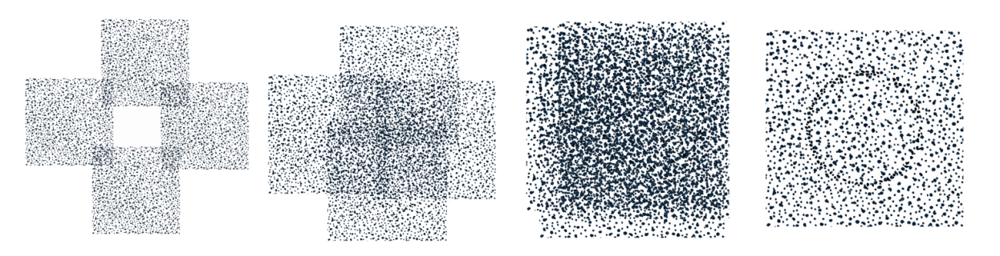

# 3: ORDER

###### On every scale of existence, order arises out of chaos and then returns to chaos.  Each cycle of existence can take millennia or nanoseconds.

Everything that exists must follow the laws of existence, for the penalty of not following those laws is non-existence.  This is why we call it the *Laws of Physics* and not the *Highly Recommended Suggestions of Physics*.

These laws of physics can change between one state or scope of matter and another, so before we look at some of the laws, let’s look at the scopes that these laws must function within.

## The Scope of Order

Some laws are *universal*, and some are *local*.  However, what we are calling *universal* may well be *local*, but in a much larger context that we cannot see beyond.

An example of a *local* law might be the *Standard Model* of particle physics that describes the relationship between three of the four fundamental forces and the elementary particles that make up the matter in our universe.  This is a set of laws and constants that apply to particle physics.  You don’t see this model replicated in larger systems because the model only makes sense when dealing with the reality of sub-atomic particles.  Likewise, Oort constants only apply to the rotational properties of the Milky Way.

Science calls the scope of our everyday Newtonian reality *Macrorealism*[^8] or *Local Realism*, and the subatomic scope is called *Quantum Mechanics*.  Understanding how different laws operate in different scopes is an area of intense research and has led to such landmark experiments like:

- **Bell’s inequalities**: The math that enables the distinction between two different views of reality, typically the relativistic view vs. the quantum view.
- **Einstein-Podolsky-Rosen paradox**: The speculation that every particle in the universe knows the state of every other particle in the universe at all time, and that no two particles in the universe have the same state.
- **Leggett-Garg inequality**: The claim that in the quantum world something can be in two states at the same time, which is impossible for the macroscopic world.

...  to name a few.

#### **Claim 8:** Local laws and constants are valid only within the context of their scope.

An example of universal laws or patterns that span many scopes might be the Fibonacci sequence (0, 1, 1, 2, 3, 5, 8, 13, 21, 34, 55, 89, 144, 233, 377&hellip;&sdot;) and its constant ratio of Phi (φ), also called the *Golden Ratio* (1:1.618).  This number is the ratio that not only pops up in galaxies and seashells but, according to some evolutionary and chemical scientists[^9], is the ratio that keeps all of existence in order and is the shape of space-time itself.

Another universal law might be simple fractal math formulas, like *f(x)= x^2^-1*, which seem to mimic nature and can be found across all forms of existence[^10], suggesting that self-similarity is a universal property.  *Power laws* explain how a relative change in one measurement can result in a proportional relative change in another measurement (e.g.  logarithmic or exponential), and we see these across all levels of existence as well.  These universal laws can be found in astronomy, physics, biology, meteorology, cosmology, mathematics, economics, and many other areas including society, wealth and work distribution, competition, media exposure, and much more.

Another universal law might be Benford’s Law, which is the pattern that describes the chances of what will be the first digit of a number that is naturally is naturally appears, such as lengths of rivers, populations, numbers printed on the first page of a newspaper.  This might sound odd, as simple logic would suggest that the chances of, say, the number 1 being the first digit would be 1 in 9, but that is not the case.  About 150 years ago it was discovered that the number 1 is the first digit 30% of the time, while the number 9 only about 5%!  In the two images below we can see this law in action when we plot the the populations of every county in the U.S. and then count the first digit of each of those populations.

The reason for this is because, while we may count in a linear fashion, 1,2,3,4… etc., nature distributes itself a logarithmic fashion.   For example, let’s say we have three naturally occurring scales; 0 to 10, 10 to 100, and 100 to 1000.  With each new scale we simply,y add a 0.  There are 10 numbers in the 1^st^ scale, 90 in the 2^nd^ scale, and 900 in the 3^rd^ scale, but as far as nature is concerned, each scale has a infinite number of divisions, so they are effectively the same from nature’s perspective.  This is how we discovered (or why we invented) logarithms; to replicate the *natural* way numbers work.  The image below shows these 2 scales.

Logarithms allow us to multiply simply by adding, for example, the log of 10 = 1, and the log of 100 = 2, so instead of multiplying 10&times;100 to get 1000, we can just add 1+2.  This gives us 3, and  because we are using the normal base 10 system, we convert these log values back to normal values with 10^3^, which is 1000. 

Once upon a time, before the invention in digital calculators, and after its invention in 1859 by a French artillery officer, every engineer had a *slide rule*, which allowed them to do this multiplication-by-adding (and more) simply by sliding some rulers back and forth.

How does this apply to 30% of all our numbers beginning with a 1?  Because the occurrence of any number as the 1^st^ digit is the log of the next number minus the log of the number.  So, the chances 1 will appear is *log(2)-log(1)=0.30*, or 30%, and the chances 9 will appear is *log(10)-log(9)=0.045*, or 4.5%.  

The point here is not to get into math, but to show that nature’s concept of scale, or scope is *invariant*, meaning, nature treats all the scopes or scales, the same.

A good visual example of the results of a universal law, perhaps the first universal law (if there was such as thing as “first”), is the distribution of energy across the known universe.  This is known as *cosmic microwave background* radiation.  This is a form of energy that fills the universe and is considered the smoking-gun evidence of the Big Bang[^11].  This chart below shows the temperature of the universe, in Kelvin (from cold -3354 &micro;K to hot 3354 &micro;K).  Typically, this chart is shown more oval in shape, but it does not have to be.  Look familiar?

Even though there are many, many more classes of laws, for this writing we are only going to use these two general scopes of laws, the *local* and the *universal*, because no matter what laws may exist, they will fall into one of these two scopes (or children of these scopes).

Local laws may be local, but they can affect everything that is built upon them.  Everything is made of atoms, and atoms are the size they are because of *Planck’s constant*, which is the relationship between the mass and the frequency of the particles that make up an atom.  If that constant were to change, the entire universe would be radically different, if it even existed at all.  If Planck’s constant was to increase by only 2.5%, the size of Earth, it's spin, gravity, and the density of the atmosphere would all increase.  If it was 2.5% less, Earth would shrink by 20%, its rotation would increase, gravity would lesson, and much of the atmosphere would disappear.  If Planck's constant changed from 6.2618&times;10^-34^ to 6.2618&times;10^-20^, the radius of an atom would go from being microscopically small to being to 100 times the distance to the nearest star!

On a more realistic level, consider a bridge made of bricks.  If the laws that bind molecules together change such that they have a lesser negative charge, then the bridge would melt on a warm day.  The (relatively) *universal* Newtonian laws did not change, only the *local* laws changed on the particle level.  

It’s logical that the laws of particle physics affect everything that exists because everything is made of particles, but that does not make the laws of particle physics *universal* in scope, rather, that which is made of particles is *dependent* on the laws that operate in the *local* particle scope, thereby making the effects of local laws farther reaching than their domain.

#### **Claim 9:** Local laws can alter everything that descends from, or depends on them.

## The State of Order

It is these laws that create order out of chaos and chaos out of order.

Order exists between the two states of relative chaos, one state tending towards zero-energy chaos and the other towards total-energy chaos, but even within the chaos we can find clues of order.

One theory that sheds light on new thinking about chaos and order is David Bohm’s *Implicate Explicate theory*.  In short, Bohm describes this theory by stating:

> In the enfolded (or implicate) order space and time are no longer the dominant factors determining the relationships of dependence or independence of different elements.  Rather, an entirely different sort of basic connection of elements is possible, from which our ordinary notions of space and time, along with those of separately existent material particles, are abstracted as forms derived from the deeper order.  These ordinary notions, in fact, appear in what is called the “explicate” or “unfolded” order, which is a special and distinguished form contained within the general totality of all the implicate orders.  **\~Bohm, “Wholeness and the Implicate Order”**

To demonstrate this concept, we can use an ink droplet analogy.  In this demonstration, we place three drops of ink into a cylinder of glycerin.  The cylinders are then turned which “mixes” the ink droplets together.  Reversing the spin of the cylinders then reconstructs the ink drops.  When the ink droplets are in their original form, at the beginning and the end of the spinning, they are *explicitly* ink droplets and have the *order* of ink drops.  When they are mixed up together, they are *implicitly* ink droplets only, and their order would be considered *chaotic* because there is no order of ink drops.  The order of the ink drops has been destroyed, but the information of that order exists as a *virtual* ink-drop, an archetype only, within the chaos of their mixed state.[^12]

In practical terms, this theory says that when something exists in the physical world it is in an *explicit*, or *unfolded* state.  To exist in this state, it must conform to a set of rules that define the archetype of the form it will take.  When it does not conform to these rules, it still exists, but only in an *implicit* or *enfolded* state, a state we cannot see or interact with (under normal circumstances).  This sounds similar to the “sea” of potential or the unmanifest wave functions.  This state has its own rules as well but they are a super-set of the *explicit* rules, making a *thing*, or physical reality as we know it, just one sub-state of a *thing*, or reality, can be in.

It is these local and universal laws that cause form to *unfold,* to *explicate* itself, self-organize, form patterns and move in accordance with these laws.  By the same token, these laws will also *enfold* or *implicate* these forms, causing them to return to an unrecognizable state.  The laws of existence are constantly moving chaos to order and order to chaos.

Here is another example that perhaps better displays the idea.  Below are four pages that started out as identical.  To each page was added some random dots, but *within* a narrow region of a circular line, however, none of those dots stood out from the page original random dots and were in no way identifiable as *special* dots. As we merge the pages, the randomness gets denser and denser until a all four pages are perfectly aligned and those extra random dots can easily been seen as a circular line.

The circle is *implicit* in the random dots of each separate page, and *explicit* when the pages line up together in the proper manner.  In this example, the *local* pattern would be the random pattern on each page, which represent the scope, and the *universal* pattern would be the parts of the circle as it exists on every page.

All of this addresses the relationship between instantiation and context, in that how something comes into existence and how it is expressed is dependent on the context and scope of where it is being expressed.  This concept is not only a technical or scientific one, but also a philosophical one that we can see in Buddhism as the principle of *Pratītyasamutpāda*, which means *dependent arising*, and which states that all phenomena (*dharma*) arise in dependence upon other phenomena (*dharmas*).  More than that, it also implies that the significance of something is defined by its environment.  An obvious example of this is; a tiger in a zoo is not the same as a tiger in the wild, as they have very different existences.  A less obvious example is: imagine a blue ball that has three object properties: it is made of wood, it is blue, it is round.  It has these same properties on a table or in the ocean *as an object*, but it interacts with its environment very differently.  This same blue ball has very different *interactive* properties depending on its environment, and these properties define the ball beyond it simply being an object, such as; it falls off the table, but it floats in the ocean, it does not move on the table, but is does move in the ocean, it will deteriorate faster and in a different manner in one case vs.  the other, and so on.

[^8]: <https://users.isy.liu.se/jalar/kurser/QF/assignments/LeggettGarg1985.pdf>
[^9]: Boeyens JCA, Thackeray JF **Number theory and the unity of science**.  S Afr J Sci.  2014;110(11/12), Art.\#a0084, 2 pages.  <http://dx.doi.org/10.1590/sajs.2014/a0084>
[^10]: Brown, J.  H., Gupta, V.  K., Li, B., Milne, B.  T., Restrepo, C., & West, G.  B.  (2002**).  **The fractal nature of nature: Power laws, ecological complexity and biodiversity**.  London: The Royal Society <http://www.fractal.org/Bewustzijns-Besturings-Model/Fractal-Nature.pdf>
[^11]: Image credit: The pre-launch Planck Sky Model: a model of sky emission at submillimetre to centimetre wavelengths — Delabrouille, J.  et al.Astron.Astrophys.  553 (2013) A96 arXiv:1207.3675 [astro-ph.CO].
[^12]: Here is the video of this experiment: <https://www.youtube.com/watch?v=UpJ-kGII074>