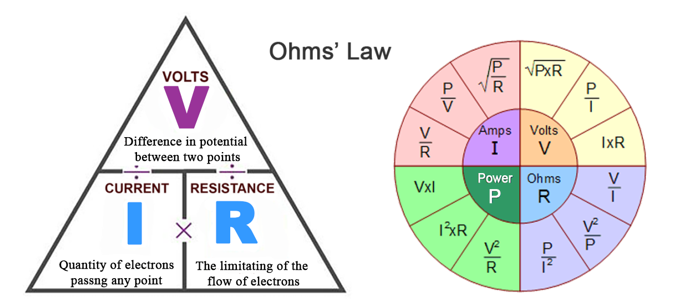
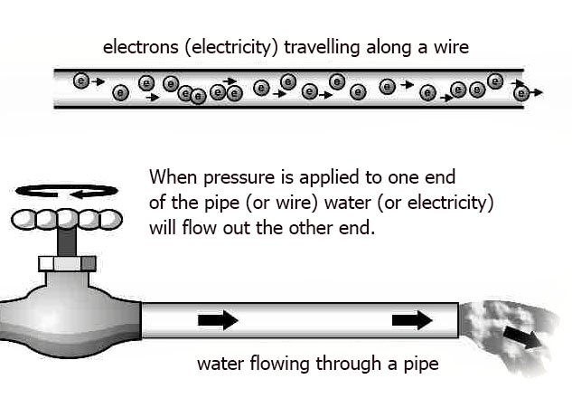
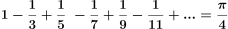
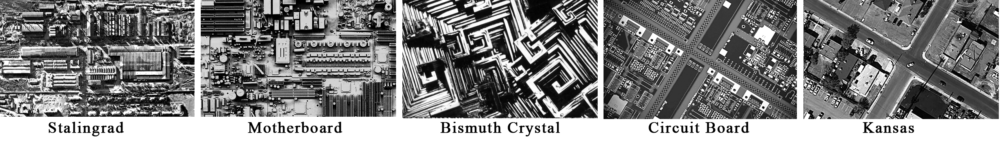
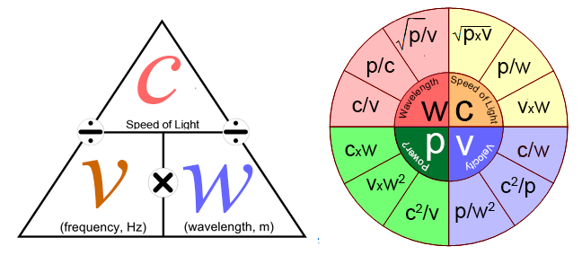

# 4: THE LAWS

###### Energy creates movement, movement follows laws, laws create order, and order directs energy.  Each level of existence expresses the Universal laws to the best of its ability according to the local laws it operates under.

## Entropy

There are many laws that describe how energy works.  From the 3^rd^ century BC starting with the Archimedes Principle to the present laws of quantum mechanics, researchers have been compiling and updating a long list of laws.

One of these universal laws is *energy will always follow the path of least resistance.* This is called *entropy* and explains why water runs downhill to form rivers, why electrons always seek a positive charge, which describes electricity, why high pressure seeks low pressure, and why stuff breaks.  This is also the essence of Newton&rsquo;s  famous *Second Law of Thermodynamics*, which can be stated as &ldquo;In an isolated system, entropy never decreases&rdquo;, which is another way to say that all systems tend to move towards their most stable or probable states because entropy will never decrease.  Entropy will only increase, which means all systems tend towards their highest entropy.  One actual formula for defining the entropy of the universe is:

where ***ΔS*** represents the change in entropy, *scope* represents a system of some sort, and *context* represents it surroundings.  This is mentioned here because we will be coming back to the concept of *context* and *scope* many times.

A simple analogy would be to compare entropy to water in lakes, rivers, and the sea.  Only the water that is above the sea level can be used to do work (e.g.  move a water wheel).  Entropy represents the water that is at, or below, sea level and therefore unusable for work.

This is also how batteries work.  A charged battery has low entropy (high usable energy), and a dead battery has high entropy (no usable energy).  A dead battery still has all the energy it had before, but it is no longer usable because the energy, in the form of electrons, has moved from the negative side of the battery to the positive side until it achieved balance and there are no more electrons left on the negative side of the battery that were compelled by the laws of balance (i.e.  entropy) to move&hellip;  but they are still in the battery, and still acting like electrons.

In the good ol&rsquo; days (1930s to 1960s) classical physics defined entropy as *disorder*, but this is not really accurate.  More accurately, entropy &ldquo;*provides insights into the notions of randomness, typicality and disorder*&rdquo; [^13].  For an excellent overview of the misconceptions of entropy, see &ldquo;*Entropy as Disorder: History of a Misconception*&rdquo;  [^14] A better way to think about entropy is that it is a measure of energy dispersion; the more entropy, the more equally energy is dispersed.  Another way to state this is to say that entropy is a measure of the *lack* of energy available for work.  This describes our dead battery, which still has all the electrons and their energy, but they are useless (from a battery&rsquo;s work perspective).  Because this dispersion is the result of energy always seeking balance, can we say that entropy is a measure of the state of balance?  As you&rsquo;ll see, the definition of entropy has been changed for every discipline that uses it.

In the water example, if we have two identical bodies of water, one 100 feet above the other, we say that the upper body of water has lower entropy than the lower body of water, and the lower body of water has higher entropy than the upper body of water, but there is no difference between these two bodies of water when compared independently.  The difference only appears when compared to each other, because one is higher than the other.  We can say that both bodies are in a (slightly) higher state of chaos when they are not connected because they have more entropy as there is no movement of energy.  Once they are connected, and the water begins to flow, there is movement of energy, and order follows.

Because we will be talking about balance throughout this entire book, let&rsquo;s make it clear what we mean when we use the word.  Depending on context, the word *balance* can refer to one of two different meanings:

- **Balance:** (noun) A stable state of being.
- **Balance:** (verb) The application of force required to achieve a stable state of being.

The word itself comes from the Latin *bi+lanx*, meaning &ldquo;two sauce pans&rdquo;, as in the classic hanging scales.  The scales show when something is *balanced* (noun) after the two sides were *balanced* (verb).  It will be up to the reader to determine which definition is more contextually appropriate.

#### **Claim 10:** Order and pattern requires energy.

One interesting takeaway from this understanding is that inter-connectivity allows for movement of energy and this movement creates order.  Therefore,  the idea that everything is connected is not simply a philosophical abstract concept, but a necessity for order.

In other areas of study, the definition of entropy carries the same idea of disorder or chaos but is used in a narrower context, so it sounds confusing unless you are familiar with that context.  For example:

-   **In probability theory**, the entropy of a random variable is the measure of uncertainty.
-   **In information theory**, the *compression entropy* of a compressed file, like a zipped file or a JPEG image, measures the amount of information loss.
-   **In sociology**, entropy is the natural decay of a society&rsquo;s structure (such as law, organization, convention, ethics, etc.).

In fact, the definition of entropy is so varied that it is not uncommon for experts in the field wonder if it has any objective meaning: 

> &ldquo;As a consequence of this diversity of uses and concepts [of entropy], we may ask whether the use of the term entropy has any meaning.  Is there really something linking this diversity, or is the use of the same term with so many meanings just misleading?&rdquo; [^15].  **\~ Annick Lesne, author and researcher at the *Institut des Hautes Etudes Scientifiques***

This is partly due to that fact there can be many conditions to consider, depending on the context (energy, volume, quantity, temperature, pressure, potential, etc.) Perhaps the best definition of entropy, as some scientists have claimed, is simply &ldquo;entropy is whenever the formula says it is&rdquo;.  OK, a bit post-modern, perhaps, but hard to argue with.  For our purposes, we will use the classical, albeit slightly inaccurate definition of entropy as a *measure of disorder*, where *disorder* is defined as the *lack of pattern in form or movement of energy*.  This definition would then include the Big Bang (lots of movement as energy balances itself, very little structure), or something like our dead battery (structure, but little movement of energy as balance has been achieved).

#### **Claim 11:** Everything is in a state of seeking and/or maintaining balance.

We seem to have a contradiction now.  If balance reduces available energy, and lack of energy increases disorder, then that says disorder must increase with balance, which sounds very incorrect.

In that first moment the universe came into being, there was total energy and nothing was balanced. This is when the balancing act of reality began. At the end of the universe, there is no longer any need for the act of balancing because everything has become balanced. The universe started with a verb, and ends with a noun.  Wherever there is energy, there is some condition of balance, and we say that things are balanced when their net difference, is whatever way we are measuring, is 0.

When we say something is *balanced*, what we really mean is that something has enough order to maintain a process of sustainability, which means there is a movement of energy, which means there is available energy, which means there is *balancing*, which means not all energy is *balanced*, for if it was, nothing would be moving.

With this in mind, we would not say that *balance* is a state of *disorder*, but we could say *chaos* is a state of *balance*.  For simplicity's sake, think of the two states of chaos as the two states of balance, where low-entropy/high-energy is a state of balance where there is more energy that is *balancing* than is *balanced*, and high-entropy/low-energy is where more energy is *balanced* than is *balancing*.

These are the three of the main concepts we will be returning to throughout this book.

- **Chaos:** Degree order is present in any state.
- **Order:** Inverse of entropy, which is a measure of disorder, which is a lack of pattern in form or movement of energy.
- **Balance:** The act of balancing and/or state of balance.

All of these have to do with energy.  Below is a conceptual graph of this idea (stress on the word *conceptual*… i.e. do not use this chart to plan your next time-travel adventure).

#### **Claim 12:** Chaos is a state of balance.

## Inertia

Another law to look at is Newton&rsquo;s First Law, the Law of Inertia, which states *an object will remain at rest or move at a constant speed in a straight line unless it is acted upon by an unbalanced force*.  This is why things don&rsquo;t fly around randomly on their own for no reason.

These are just two of the many laws that determine how our reality works, at least within the scope of the reality we tend to deal with.  On the quantum and galactic levels, or super high or low energy states, things may operate a bit differently.

These laws always ensure that everything will operate at its most efficient level.  What does &ldquo;operate&rdquo; mean in this context? It means the optimal movement of energy.  As energy only moves when there is a difference between two states, the movement of energy is meant to do only one thing, and that is to minimize that difference by creating a balance between two conditions that are not the same, whether it&rsquo;s the conditions of *somethingness* and *nothingness* or just a few degrees of temperature.  Once balance is achieved the movement stops.  A balanced battery is a battery at peace with itself&hellip; and it is also a dead battery.

The optimum condition for the movement of energy between two states is one that operates within the limitations and abilities of both of those conditions.

A beautiful example of entropy and inertia that works today as much as it did thousands of years ago can be easily demonstrated with something called the *harmonograph*.  This is a fascinating and entertaining device that creates an oscillation from an initial push (low entropy) and then draws a two-dimensional oscillating design on a blank paper as that initial energy slowly diminishes (inertia), until it stops (high entropy).[^16]

## Pattern

We recognize that patterns exist in nature, life, physics, math, etc., and it can be useful to think of patterns like rivers that have been etched into the terrain of reality from the first moments of creation and represent a path of least resistance for the movements of energy, be it electrical, physical, conceptual, emotional or otherwise.  Reality, no matter the scope or how one perceives it, is build upon layers and layers of patterns.  A recurring theme in this book is about recognizing patterns that repeat in various themes, contexts, and scopes.  Some of these meta-patterns are clear, such as the Fibonacci sequence and exponential curves, while others are more hidden and even challenges our ideas of what defines a pattern.  A nice book on this subject is &ldquo;*Patterns in nature: Why the natural world looks the way it does*&rdquo; [^17].

The position of this book is that any two phenomena that share the same pattern are, at least, two instances of one pattern.  A Ford Fairlane in Chicago and a Ford Fairlane in Argentina have no direct connection to one another, but some of what is learned about one will apply to the other.  The tricky part is knowing what information is rooted in the patterns versus the instance and its context.  For example, the Ford Fairlane in Chicago was a &ldquo;muscle car&rdquo; and a source of pride among its fans while that same car in Argentina was used by the secret police of the Dictatorship during the &ldquo;Dirty War&rdquo; and was a source of fear and intimidation, but an Argentine mechanic could work on that same car in Chicago, even it seeing it filled him with dread.  

While the subjects of this comparison can be defined by patterns of culture, economics, mechanics, and more, the erroneous associations comes from assigning properties of one pattern to another.  This is a modern day example of totem superstition.  The sciences are not immune to such confusion.  In fact, modern math was stifled for about a thousand years thanks to the Greek&rsquo;s  superstitious ideas about, and prohibition of, irrational numbers, which were forbidden to be written.  When one of Pythagoras&rsquo; students, Hippasus, discovered irrational numbers he was, depending on your source of history, drowned by the gods for such heresy, or murdered because he revealed how to construct a dodecahedron inside a sphere.  In either case, irrationality and superstition prevailed.  It wasn&rsquo;t until the early 9^th^century CE, thanks to Caliph Al-Ma’mun of the Abbasid Caliphate and his *House of Wisdom* in Baghdad (which the Mongols destroyed in the 13^th^ century), that mathematics was liberated from its fear of irrational numbers.  The same is true for the number 0, which was banned in Florence in 1299.  Later in this book you will see modern examples of similar thinking in the sciences.

> [Superstition is a form of] mutilated knowledge that, from fragments casually collected or from dark, partial, and undeveloped intuitions creates a coherent order of images according to a logic dictated by the passions that dominate from time to time.  **\~ Remo Bodei, professor, history of philosophy, UCLA.[^18]**

## Oscillation

One law, or pattern, that can be seen in every part of the universe, is that everything oscillates.

Oscillation is how energy sustains movement between two states, which supports the definition that &ldquo;chaos is a kind of order without periodicity&rdquo; for without oscillation or periodicity, there is less order and more chaos.

Everything that is sustainable (i.e.  currently exists), from the atoms to the galaxies, oscillates in some fashion and has some kind of frequency.

> &ldquo;All things have a frequency and a vibration.&rdquo;  **\~Nikola Tesla**

We typically think of light waves and sound waves as the classical example of oscillations, but the heavenly bodies are also oscillating particles on a cosmic scale.  If we look at the orbits of planets, stars and galaxies they are not simply spinning around in a rather 2D plane of orbits, but that they are spinning around while moving in a direction.

People have been fascinated with this obvious commonality across all of creation for some time.  Kepler himself was quite interested in the relationship between planetary frequencies and musical frequencies, but the study of planetary and musical relationships goes back to at least the 9th century with Eriugena, an Irish monk, theologian and Neoplatonist philosopher, most famous for his work &ldquo;The Division of Nature&rdquo;, which claims that nature&rsquo;s first primary division was the division between that which **is** (*being* or *somethingness*) and that which is **not** (*nonbeing* or *nothingness*).  His work was condemned as &ldquo;swarming with worms of heretical perversity&rdquo;&hellip; the 9^th^-century Archdiocese was a tough crowd.

#### **Claim 13:** Everything exists in a state of duality.

#### **Claim 14:** Everything sustainable oscillates.

*(Image from Grant Sanderson&rsquo;s video &ldquo;But what is a Fourier series? From heat flow to circle drawings&rdquo;*. [^305]

By the same token, everything that we can see, hear and touch can be described as a collection of oscillations.  This was proven by the famous French mathematician Joseph Fourier (1768–1830) when he was researching how heat moves.  From his work came the famous and brilliant *Fourier Series* and *Fourier Transformation*.  The Fourier Series describes the hierarchical order of frequencies, or rotations, that would be needed to produce a specific output.  For example, the image above shows a portrait of Joseph Fourier being drawn by a pen at the end of a long series of oscillating circles, shown by the rotating arrows, each subsequent oscillation originating from the tip of the previous circle&rsquo;s arrow.  The Fourier Transform is the math that can reverse engineer some collection of oscillations, such as music or a painting, and discover the recipe of its various frequencies and their quantities.  By extension, this can apply to 3 (or more) dimensions as well.

## Ohm&rsquo;s Law

Ratios like *e*, &phi; and &pi; are at the foundation of many patterns that define reality, and while any two instances of these ratios may not have a direct connection, they do share the fact that they are a product of that ratio.  We don&rsquo;t say a basketball is the same as a planet, but we do say they are both round, and anything we can say about roundness applies to both.  This may sound childishly simple, but when this is applied to the 2nd Law of Thermodynamics and, for example Ohm&rsquo;s  Law (which will be explained shortly), we see some fascinating patterns and relationships.

Dismissive physicists and engineers will say that these relationships and patterns are meaningless.  They are partially correct in the same way elephants have nothing to do with turtles, even though both evolved from the same ancestor, but understanding the biology of turtles well still help one in understanding the biology of an elephant, or any other living creature.  The 2nd Law of Thermodynamics is a pattern that works on linear systems, and Ohm&rsquo;s law is one instance of that pattern in the context of conductive materials.  We can apply that pattern to different contexts to see how such a pattern might instantiate under different conditions.  It may be that there are few or even no instances of that pattern for a context, or it may be that we have yet to see how that pattern instantiates, but this does not invalidate the comparison.  In the case of Ohm&rsquo;s  Law, its math is perfectly applicable well outside of conductive systems that are still linear, such as *gas laws* and *fluid flow*, but our exploration will take us far beyond these accepted frontiers. 

To not consider that patterns have inherent qualities that exist beyond our perceptions or knowledge, or that any pattern should not be at least be investigated before claiming it has no validity in any particular context, is a form of scientific dogma or modern superstition, as such thinking is based on a logic dictated only by the dominant narrative of the time, not by reason.

We refer to these similarities of patterns across heterogeneous contexts by the *pattern-position* of various elements.  For example, the *voltage* of electricity and the *pressure* of fluid flow occupy the same position in the formulas of Ohm&lsquo;s Law, so we say they have the same *pattern-position* (but only in the case of Ohm&rsquo;s law).  Below, we also show how *society*, *behavior* and *electrical current* could also share the same *pattern position*.

Ohm&rsquo;s Law states that *electric current is proportional to voltage and inversely proportional to resistance*.  Why are we using Ohm&rsquo;s law out of all the laws that exist? Simply because it is an elegant expression of Newton&rsquo;s  2^nd^ Law which encompasses concepts of chaos and entropy and neatly shows some fundamental properties of relationships in common, more easily understood, linear systems.

This law can be displayed as follows:

If you are not familiar with Ohm&rsquo;s Law, you can understand it using the water example.

The following concepts are the same in both examples:

- **Power** is the rate or measure of energy that is being transferred (via electrons, water, etc.).
- **Current** is the amount of water (e.g.  number of molecules), that is flowing through the pipe.
- **Voltage** would be analogous to water pressure, which determines how far the water shoots out of the pipe.
- **Resistance** is represented by the size of the pipe the water is flowing through.

Ohm&rsquo;s law is actually Newton&rsquo;s 2nd Law of Motion, t*he force of an object is equal to its mass times acceleration*, as it applies to electricity[^19], defining the *object* as *electricity*, the *force* as *current*, the *mass* as *resistance*, and the *acceleration* as *voltage*.  

*A word on patterns and Ohm&rsquo;s  Law…*

Ohm&rsquo;s Law is not really a *universal law* like its famous parent, Newton&rsquo;s  2^nd^ Law of Thermodynamics, which is more universal.  It&rsquo;s  more of a *local law* as it only applies to linear systems and conductive materials.  Ohm&rsquo;s  Law follows the simple pattern of *ab=c, bc=*d, which we can understand as *2&times;3=6, 3&times;6=18*, or *resistance&times;amps=volts, amps&times;volts=power.* Any of the reasoning being applied here regarding Ohm&rsquo;s Law could just as easily be applied to other natural linear systems.  Ohm&rsquo;s law is just a simple law that everyone can understand and relate to.  Other simple patterns could also be  &hellip; which is the *Harmonic Series* and describes music, or *1+1=2, 1+3=4, 2+3=5, 3+5=8, 5+8=13, 8+13=21&hellip;*, which is the famous *Fibonacci Sequence* (and is almost identical to Ohm&rsquo;s  Law except is uses addition instead of multiplication), or how the primes numbers can create &pi;,  .

*A word on electricity…*

We are using Ohm&rsquo;s law, the laws of electricity, as an example for another reason as well.  We are all familiar with lightening.  Watching the bolts of light shoot instantly across the sky and into (or from) the earth is awe-inspiring and exciting.  Contrary to the statement &ldquo;Lightning never strikes the same place twice&rdquo;, lighting often strikes the same place many times, and for good reason.  Ben Franklin suspected why, which gave birth to the lightning rod, saving millions of buildings from burning to the ground.

We know that energy always travels the path of least resistance, so we would say that the path of lightning exists between a starting point in the sky and the ending point at a lightning rod (or wherever), and we might even say that this path was predetermined before the electrons traveled it, but that would only be half the truth.  As the opposing charges of the earth and  the sky increases, two fields grow - the positive field of the earth is pulled towards the negative field of the sky, and visa versa.  When they touch, a path is opened and all the excess positive charge rushes towards the sky, and the excess negative charge rushes towards the earth.  Lightning happens in two directions at the same time.  By the time we see the lightning, the fields have already reached their peak.  The engine of this interaction are the fields themselves.  In this case, it is lightning that is the byproduct of the fields.  What we see when we see lightning are all the paths between those two fields that have made some degree of connection.  It is the interaction between these two fields that is the cause, and the lightning is the effect.

This pattern that is created by the flow of energy across a field of potential can be seen elsewhere, such as in plants, rivers, brain cells, and so many other examples.  Is it reasonable to apply the same logic and suggest that the path of roots and rivers are the byproduct, or effect, of two opposing fields within close enough proximity as to allow them to make connections, or open paths, between each another, and in doing so, allowing the opposite energies to balance each other out?  It seems that the main difference between lightning and rivers, brain cells, plants, etc., are the energies at play, but an energy that does not instantiate as milliseconds of lightning bolts but as other energy-balancing forms that take years or centuries.

In contrast to the above patterns, we have those created by modern man, which are more like crystalline structures.  Perhaps this represents the stage that conscious intelligence is at, the *crystallizing* stage, which for the Universe was four billion years ago.

Keep this in mind when we begin looking at how we can apply the laws of energy to other realms.

*Back to Ohm&rsquo;s Law…*

In the world of electricity we can say *voltage = resistance &times; current*.  Likewise, in the world of matter, we can refer to the 2nd law of Thermodynamics that states  *force = mass &times; acceleration.* All twelve math formulas of Ohm&rsquo;s Laws can apply to matter.

Ohm&rsquo;s law is just one of a number of contexts where Newton&rsquo;s 2^nd^ law applies, as shown below.

## Light

Let&rsquo;s look at an example of light.  If we apply Ohm&rsquo;s  Law to light, we can say the velocity (i.e.  frequency) of light is equal to the speed of light divided by the wavelength, or .  We know that the speed of light is 3&times;10^8^ meters/sec, and we know that green light has a wavelength of 555 nanometers, or 5.55x10^-7^ meters, so we can just do the simple math of (3&times;10^8^)&div;(5.55&times;10^-7^)=(5.4054054&times;10^14^) to discover that green light has a frequency of 5.405 terahertz.  All we have to do to convert Ohm&rsquo;s Law to some other (linear) domain is adjust our measurement for the context.  In this case, what was Ohms, which measures resistance, is now Hertz, which measure cycles-in-time.

All the formulas work out when:

- **Velocity** has the *PP* (*pattern position*) of **resistance**
- **Speed-of-light** has the *PP* of **volts**
- **Wavelength** has the *PP* of **current**.
- **Power** (of light), by process of elimination, must have the *PP* of **power**.

What does **power** in the context of light even mean? That is hard to say because it is not clear how the concept of power applies to light.  In electrical terms, *power* is defined as the rate of transfer of energy, and the less resistance and greater the current, the greater the power.  With light, that would be equivalent to saying the less velocity and the greater the wavelength, the greater the *power*.

For example, using these formulas we can calculate that high energy gamma rays with a frequency of 3.33 nanometers (3.33&times;10^-9^) has a *power* rating of 1, while an ultra-low frequency wave with a wavelength of 1000 kilometers has a *power* rating of 300,000,000,000,000 (3&times;10^14^)!  For perspective, the Earth&rsquo;s  natural resonant frequency, the *Schumann resonance*, is 7.83 Hz, which is a wavelength of 33,830,000 meters (3.83&times;0^7^), and a *power* value of 1.15&times;10^16^, and green light as a *power* rating of 166.5.

This initially seems odd because we know that the less the velocity and greater the wavelength, the less energy light has, but our power calculations say the exact opposite, as if the less energy the light has the more *power* it has.  This is because the energy that we say light has is referring to the energy contained in the photon itself, not the *transference* of that energy, and as we saw earlier, *electrical power* is defined as &ldquo;the rate, over time, at which energy is **transferred**&rdquo;.  When we examine electromagnetic energy we can easily see that the lower frequencies are much better and transferring energy, even though they have less energy to transfer.

For example, the entire universe is filled with a very low frequency energy of microwaves which maintains an average temperature of 2.725 Kelvin above absolute zero  (-273.15 ºC or -459 ºF).  This is a pretty good example of energy transfer.  Higher frequency energy tends to be less ubiquitous and more focused.

Higher energy waves, such as infrared, visible light, and ultraviolet, are fundamental to life exactly because of the manner in which they can transfer energy that is most efficient for the more complex instances of creation.  Beyond that, the higher energy X-rays and gamma rays do not transfer energy efficiently if we define *efficient* as that which can interact with other matter.  Perhaps *efficient* can be defined as that which is most effective for *life*, if we redefine the meaning of *life* to mean something like &ldquo;an instance of awareness&rdquo;, or something like that.  I know hard-core scientists will balk at the idea that life should be the standard by which we measure anything, but this would be the case if the Universe was itself intelligent, which we address later.  Beyond the philosophical issues, high energy waves, like gamma rays, can pass through all sorts of material without interacting with that material at all, and given its high energy, if it does happen to interact with anything alive, it will cause serious damage.  In general, higher frequency (shorter wavelength = higher energy = lower *power* rating) waves travel through objects more easily than lower frequency (longer wavelength = lower energy = higher *power* rating) waves, which interact (i.e.  transfer energy) with matter more easily that higher-frequency waves, hence, greater transfer of energy.

## E=mc^2^

There&rsquo;s one more pattern comparison to look at.  In the Ohm&rsquo;s Law formula wheel above we can see how the pattern of *Power = Resistance x Current^2^* (*P=RI^2^)* looks exactly like another popular formula: *E=mc^2^*.  Is this just a coincidence or is there a relationship such that&hellip;

-   **Power** (*P*) is analogous to **energy** (*E*)
-   **Resistance** (*R*) analogous to **mass** (*m*)
-   **Current** (*I*) analogous to the **speed of light** squared (*c*^2^)

Using these associations we can to calculate the missing value that is shared with **volts**, which we will call **zvolts**.  More on this in a moment…

All twelve formulas actually work when applied to *E=mc^2^*  but with a minor adjustment: in the Newtonian world of electricity and matter, all the variables can change in value, while in the world of relativity, *c*, the speed of light, must always remain constant.

It looks like *c,* which is Relativism&rsquo;s version of *current*, or amperage, is the *maximum current supported* rating for this universe, not unlike a 40 Amp fuse we use to ensure we do not melt our wires and burn out our devices by exceeding the maximum current supported.  Does this suggest that if we break the speed of light with would &ldquo;blow a cosmic fuse&rdquo; and &ldquo;melt&rdquo; our reality? Maybe we'll find out one day.

But where is Relativity's equivalent of voltage, the **zvolts**? In the water example, voltage is equivalent to water pressure.  In the world of electricity, voltage is described as *electric pressure* that results from the difference that exists between two states, one being the highest potential energy (like the storm cloud or mountain top), and the other being the lowest potential energy (like the lightening rod or valleys).  Can we then say that these missing cosmic volts (zvolts) represent the pressure between two opposing states, just like regular volts? What these states might be is up for grabs.  Perhaps low entropy and high entropy, or order and chaos? Who knows? Whatever zvolts are, given that they are values that measure the difference between two points that are quite fundamental to our reality, they might be very significant in understanding reality in terms of dualities.

We can calculate for these missing zvolts by applying the simple formula:

*Voltage (V) = Current (I) &times; Resistance (R)*, which equates to *zvolts (z) = Speed of Light (c) &times; Mass (m)*.

This then becomes (using the ISU standard[^20] units of measure) *zvolts = 300,000,000 m/s &times; 1g*, (or *8.98&times;10^16^ m^2^/s^2^*) which makes zvolts = 300,000,000.

So, zvolts is the same value as *c*? Yes, but only when the *mass=1*.  If we use a different mass, like 2, zvolts becomes *c&times;2*, which is then:  *zvolts = 300,000,000 m/s &times; 2g*, which makes zvolts = 600,000,000, and if mass=0, then zvolts = 0.

But what *is* this number? It can&rsquo;t be speed, because nothing can exceed the speed of light.  It can&rsquo;t be weight, because we are already using weight in the equation.  Even more odd is that the number is always proportional to mass because *c* is always the same, so whatever *zvolts* are, they are essentially the same value as the weight of the mass, but 300,000,000 times larger.  The *zvolt* is the result of speed, time and mass, so it is like a unit of *mass per distance per second*, kg/km/sec.  This also happens to be the parameters that defines the unit of measure called a Newton, which is a measure of *force*.  One Newton is defined as *the force needed to accelerate one kilogram of mass at the rate of one meter per second squared in the direction of the applied force.*  Newtons only apply to mass, so this is how we measure things like Angular momentum, the force of the planets in orbit, and also how we measure the spin of elementary particles.  For things that are not mass, we would use joules, which is the measure of energy transferred when we apply the force of 1 newton through a distance 1 meter, or the energy required to produce one watt for one second.  When there is no mass in our formula, then zvolts = 0, so is seems that zvolts is only applicable to mass, like a newton.  The *E* part of *E=mc^2^* is actually a measure of joules, which is newtons &times; distance, but this means that is we can&lsquo;t use joules to measure zvolts.  Is there a relationships between zvolts and newtons &times; time?

However, applying *E=mc^2^* to mass-less photons where *m*=0 we get a value of *E*=0.  Does this mean that things that have no mass have no energy?  Actually, yes&hellip; but we know this is not true, as in the case of light itself, photons, which have a lot of energy but no mass.  This is because *E=mc^2^* is only true for particles at rest.  The actual formula for *E=mc^2^* is *E=&gamma;m~0~c^2^*, where &gamma; is a valued determined by the velocity of the mass, and m~0~ is the rest-mass of the mass.  Photons, or any form of energy that has no mass, can never be at rest&hellip; they are *restless*, and while the mass-less particle itself has no inherent energy, it does have the energy of its movement (speed, frequency, amplitude, etc.).  Were it to stop moving, it would exist only as a concept.  So, in the case of mass-less energy, zvolts would always equal zero.  In the case of mass, however, is has a value that seems to be related to *force*&hellip; perhaps in the domain of time (newtons &times; time?) rather than space, as in joules?

There&rsquo;s one more detail about voltage that might be relevant here, and that is: the greater the voltage, the greater the electric field.  Can we then say &ldquo;the greater the zvolts the greater the *field force* or *mass force*&rdquo;?  Are they a measure of the &ldquo;pressure&rdquo; or force if the field within mass exists? This are questions beyond my ability to answer, but what can be said is that *zvolts are proportional to the speed of light and inversely proportional to mass*.  

It&rsquo;s all quite fertile ground for speculation, at least to someone like myself who has yet to learn the many reasons why such speculation might be pointless.

Getting back to these twelve formulas&hellip; we think about voltage, resistance, and current (or energy and mass) as separate things, similar to how we think about time and space as two different things.  However, space and time are two properties of one larger thing called *space-time*.  Likewise, voltage, current, and resistance are three properties of one instance of energy as electricity.  Frequency, wavelength, and velocity are three properties of another instance, such as radiation.  All areas where this law applies are themselves different properties of some expression of energy.

Here we are using Ohm&rsquo;s Law to show how one law can be expressed across many scopes, but this same reasoning applies to all natural laws in physics, or elsewhere.

## Alchemy

If we are claiming that these laws can be seen throughout our journey of discovery over the past millennia then we should be able to see them in the early forms of reasoning that evolved into such things as modern science.

Alchemy is the birthplace of modern science.  Despite the charlatans of science of olden days, just like today, many alchemists profited by promoting &ldquo;elixirs of life&rdquo; and promises of discovering the &ldquo;philosophers stone&rdquo;. The true goal of alchemy was to discover the secrets of nature, and to alchemists, this was as much a spiritual journey as it was a technical one.  Modern science has done away with the spiritual or mystical aspect of knowledge and doubled down on the technical aspects (which we will discover is an unsustainable position).

We can see early forms of these modern concepts, specifically in the concepts of the elements of earth, water, air, and fire.  These elements do not refer to the material instances but to their archetypes of which the material forms are limited instances of.  The first form of matter that came into existence, which would be the equivalent of modern science&rsquo;s atomic-sized ball of everything that exploded to fill the universe, was considered to be formed by these four archetypes.  This was an idea held by the ancient Greeks, the Islamic philosophers and scientists, and learned Asians and Europeans of their day.

As archetypes, they did not only instantiate as matter but also as qualities.  For example, the elements were used to describe health as far back as Hippocrates (400 BC), and as recently as Carl Jung&rsquo;s theory of personality, which drew heavily on Hippocrates.  In Jung&rsquo;s theory, there were four types of personalities:  feeling (fire, choleric), thinking (water, phlegmatic), intuition (air, sanguine), and sensation (earth, melancholic).  He then added other attributes such as introversion/extroversion, to come up with eight basic personality archetypes.

How this is relevant here is that the four alchemical elements are a very early version of the four qualities of matter as expressed by Newton&rsquo;s 2nd law.  It might seem odd or even ridiculous to compare perhaps the greatest laws of technical thinking to the hocus-pocus of alchemy, but Isaac Newton was himself an alchemist who not only attempted to turn lead into gold but believed he could discover the Elixir of Life.  In fact, Newton was feared by the English Crown because if he did discover the Philosophers Stone, which was a real government fear in those days, he would ruin the British economy.  Newton also feared the Government as they imposed very severe penalties on anyone trying to turn lead into gold, and for this reason (and probably the fire his dog started that destroyed 20 years of his work) none of his alchemical works were published.  Newton's alchemical work was only discovered in 1936 when his manuscripts were auctioned by Sotheby's, and it was discovered that one-third of his work was alchemical. These works were labeled "not fit to be printed" by the King after his death for fear someone would pick up where he left off. Today, we have hundreds of years of science to base our thinking on, but before Newton and his laws, there was only alchemy, and this is what Newton studied, along with occultism and hermetism. Modern science is loath to admit that Newton was as much a magician as he was a scientist, and there is no doubt his esoteric studies had an impact on his theory of forces and gravity.

What we understand as resistance, current, volts, and power today, the alchemists would describe as qualities that have the properties of earth, fire, air, and water archetypes, respectively.  This is not to suggest that just as *V=I&times;R* so too does *air=fire&times;earth*.  This is simply an example of how the same patterns and archetypes keep appearing across many contexts and scopes, such as technology, science, mysticism, social order, biology, and many, many more.  In Newton’s case, they formed his understanding of reality that was then applied to his laws.

#### **Claim 15:** Instances of laws are limited, defined and understood according to their context.

## Redundancy

The oscillation constant also gives us a glimpse into another basic, yet profound property of creation and reality, and that is its self-similar redundancy.  *Self-similar redundancy* (a term that is itself redundant) is how one property or law manifests itself across different orders of scale in the most effective manner given the context, state, and scope of that order.

One of the more obvious examples of this type of inter-scope self-similarity might be the commonality between the structure of a solar system and the structure of an atom.

Of course, universal laws such as gravity and electromagnetism apply to all systems, but at the quantum level of an atom we also have local laws such as electron energy levels, the nuclear weak force, etc., and in much larger systems, like a solar system, there are local laws of momentum, and Newtonian physics.

Many scientists will tell you there is no relationship between atoms and solar systems, and that this analogy depends on an old and outdated concept of the atom, writing it off as humanity&rsquo;s tendency to oversimplify the complex and over-relate the unrelatable.

No doubt this is true to some degree, but more importantly, there are some similarities worth investigating that would give us an idea of the laws that both systems deploy in the most efficient way they can be expressed, given their scope.  Some scientists agree, as we can see in the paper published in June, 1989, by the *International Journal of Theoretical Physics* titled &ldquo;*Self-Similar Cosmological model: Introduction and Empirical Tests*&rdquo;[^21] which examines this concept specifically.

This report concluded:

> The simplicity of [the Self-Similar Cosmological Model (SSCM)] and its ability to quantitatively relate atomic, stellar, and galactic scale phenomena suggest that a new property of nature has been identified: discrete cosmological self-similarity.  Although the SSCM is still in the early heuristic stage of development, it may be the initial step toward a truly remarkable unification of our considerable, but fragmented, physical knowledge.

A more organic example of this inter-scope self-similarity[^22] is to compare the structure of the universe to a brain cell, or the birth of a cell and the death of a star, or the human eye and a nebula, and countless other examples.

There are many matching patterns between cells and the universe, and it is a subject far too broad to get into here.  One recently published paper[^23] shows the similarity in structure of a neutron star and a human cell.  Other comparisons based on scientific and rational observations have also been noted, such as:

-   Mitochondria vs. stars.
-   Vacuoles vs. galaxies.
-   Nuclear holes vs. asteroids.
-   Vesicles vs. the earth itself.
-   Lysosomes vs. dark energy.
-   Endoplasmic Reticulum vs. wormholes.
-   Cell membrane vs. edge of the universe.
-   Ribosomes vs.  molecular clouds.
-   Smooth Endoplasmic Reticulum vs. the sun.

One could say that if you look long and hard enough you can find relationships and patterns between any two things.  That may be true, but if certain patterns keep popping up then it might be something more than just an overactive imagination.

It might even cause some incurably curious researchers to wonder if there was a bigger picture that they have been ignoring and inspire them to do some investigation that might open new doors of understanding&hellip; someone like the esteemed Stanley N. Salthe, Professor Emeritus, Brooklyn College of the City University of New York, who said:

> &ldquo;It is an interesting possibility that the &lsquo;power laws&rsquo; followed by so many different kinds of systems might be the result of downward constraints exerted by encompassing supersystems.&rdquo;  **\~ Stanley N.  Salthe, Entropy 2004, 6, 335**

Here is what Hans van Leunen, a physicist from the Eindhoven University of Technology, Dept. of Applied Physics, and founder of *The Hilbert Book Model* project, which applies mathematical test models in order to investigate the foundation of physical reality, has to say about this as well:

> &ldquo;Obviously, physical reality possesses structure, and this structure founds on one or more foundations.  These foundations are rather simple and easily comprehensible.  The major foundation evolves like a seed into more complicated levels of the structure, such that after a series of steps a structure results that appears like the structure of the physical reality that humans can partly observe[^24].  **\~ Hans van Leunen, The Structure of Physical Reality**

He then goes on to say:

> The [paper &lsquo;The Structure of Physical Reality&rsquo;] applies the name *physical reality* to comprise the universe with everything that exists and moves therein.  **It does not matter whether the aspects of this reality are observable.  It is even plausible that a large part of this reality is not in any way perceptible.** The part that is observable shows at the same time an enormous complexity, and yet it demonstrates a peculiarly large coherence.
>
> The conclusion is that physical reality clearly has a structure.  Moreover, this structure has a hierarchy.  Higher layers are becoming more complicated.  That means immediately that a dive into the deeper layers reveals an increasingly simpler structure.  Eventually, we come to the foundation, and that structure must be easily understandable.  The way back to higher structure layers delivers an interesting prospect.  The foundation must force the development of reality in a predetermined direction.  The document postulates that **the evolution of reality resembles the evolution of a seed from which only a specific type of plant can grow.  The growth process provides stringent restrictions so that only this type of plant can develop.  This similarity, therefore, means that the fundamentals of physical reality can only develop the reality that we know**.

In other words, he is saying that there are self-similar and redundant orders in the *hierarchy* and *layers* (in his words) of creation, and these orders abide by specific laws and which are limited (*predetermined*) by their component parts (*seeds*).  Likewise, the restrictions of the growth process will be similar at every level, and consequently, the laws at play will be similar.

#### **Claim 16**: Reality is a structured hierarchy of dualities which starts out very simple, each specific generation limited by the structures of the duality they emerged from.

You can read his paper[^25], but unless you know your way around multidimensional Hilbert space lattices, it going to be a tough read.

For purposes of this book, I am going to define a  *scope* or *order of creation*, (or *level*, as Hans van Leunen would say), as that creative cycle from which an apparent order emerges out of a state of the apparent disorder defined by the limits of the duality it emerged from.  I say &ldquo;apparent&rdquo; because I don&rsquo;t want to suggest that there is disorder in a seed and order in the resulting flower.  Obviously, there is order in both, but the explicit order of a flower in bloom, at the peak of its expression, when it is ready to drop its own seeds, is far more apparent than the implicit order of a seed.  The flower is *explicit* when it is in bloom, and *implicit* in the seed, while the seed is *implicit* in the flower.  This also suggests that within the scope of the life-cycle of a flower, which begins with a seed and ends with compost, the flowering stage represents the most optimum expression of energy, or the most effective form that instance can realize.

#### **Claim 17:** Self-similarity exists due to the redundant nature of the laws which express themselves in accordance with the scale and scope of their context.

[^13]: Lesne, A.  (2014).  **Shannon entropy: A rigorous notion at the crossroads between probability, information theory, dynamical systems and statistical physics**.  *Mathematical Structures in Computer Science,* *24*(3).  doi:10.1017/s0960129512000783
[^14]: Styer, D.  (2019).  **Entropy as Disorder: History of a Misconception**.  *The Physics Teacher,* *57*(7), 454-458.  doi:10.1119/1.5126822
[^15]: Lesne, Annick.  "**Shannon Entropy: A Rigorous Notion at the Crossroads between Probability, Information Theory, Dynamical Systems and Statistical Physics.**" *Mathematical Structures in Computer Science* 24, no.  3 (2014).  doi:10.1017/s0960129512000783.
[^16]: Here are a couple of sites that show a harmonograph in action.  They are fascinating to watch.  <http://andygiger.com/science/harmonograph/index.html>, <https://www.youtube.com/watch?v=HJYvc-ISrf8>
[^17]: Ball, P.  (2016).  **Patterns in nature: Why the natural world looks the way it does**.  Chicago: The University of Chicago Press.  ISBN-10: 022633242X ISBN-13: 978-0226332420
[^18]: Bodei, R., & Doebler, G.  W.  (2018).  **Geometry of the passions: Fear, hope, happiness: Philosophy and political use**.  Toronto: University of Toronto Press.
[^19]: Yee, Jeff.  (2019).  **The Relation of Ohm&rsquo;s Law to Newton&rsquo;s 2nd Law**.  10.13140/RG.2.2.15576.75523.  Ohm&rsquo;s law relates voltage, current and resistance in electrical systems as V=IR.  Newton&rsquo;s 2nd law relates force, mass and acceleration as F=ma.  Although electrical and mechanical systems are supported by different equations to describe these relationships today, it will be shown that the laws of Ohm and Newton are related and are built from the same foundation that governs the force of particles and all of matter.
[^20]: Taylor, B.  N.  (1995).  **Guide for the use of the International System of Units (SI)**.  Gaithersburg, MD: U.S.  Dept.  of Commerce, Technology Administration, National Institute of Standards and Technology.  <http://dominiodelasciencias.com/ojs/documentos/SI.pdf>
[^21]: Oldershaw, R.  L.  (1989).  **Self-Similar Cosmological model: Introduction and empirical tests**.  International Journal of Theoretical Physics, 28(6), 669-694.  doi:10.1007/bf00669984 <https://www.academia.edu/26520933/Self-Similar_Cosmological_model_Introduction_and_empirical_tests>
[^22]: You can find many examples of this self-similarity <http://www.bordalierinstitute.com>
[^23]: <https://www.sciencealert.com/scientists-have-found-a-structural-similarity-between-human-cells-and-neutron-stars>
[^24]: van Leunen, Hans.  (2018).  **The structure of physical reality**, <https://www.researchgate.net/publication/327273285_The_structure_of_physical_reality>
[^25]: Leunen, J.  J.  (2018).  **Structure of physical reality**.  <http://vixra.org/pdf/1806.0087v3.pdf>.  Here is the entire report <http://www3.amherst.edu/~rloldershaw/OBS.HTM>
[^305]: at https://www.3blue1brown.com/