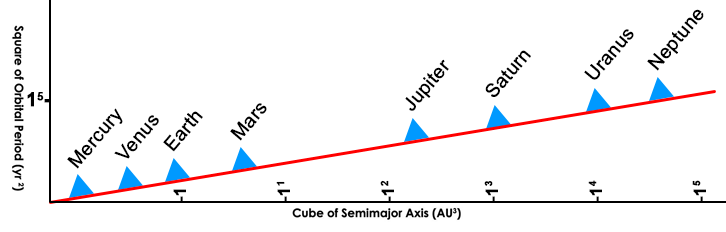
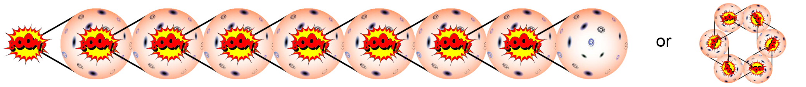
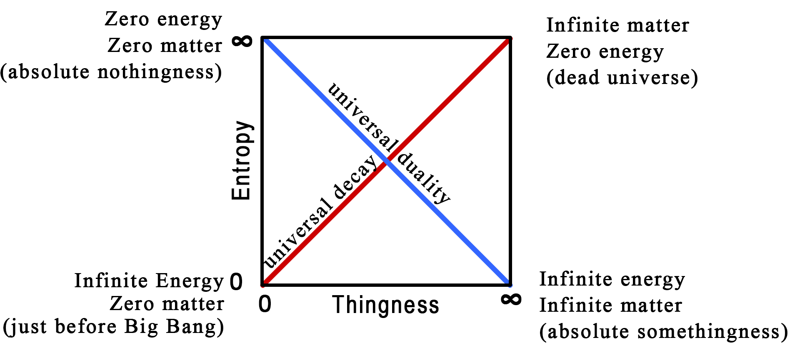
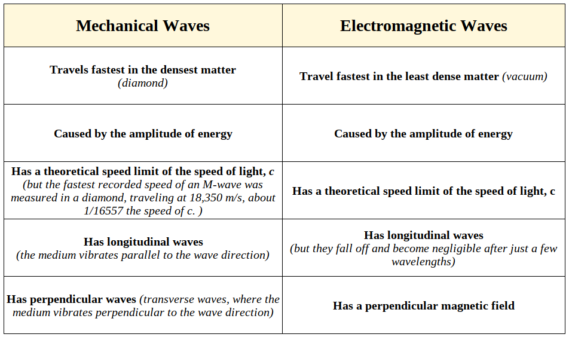
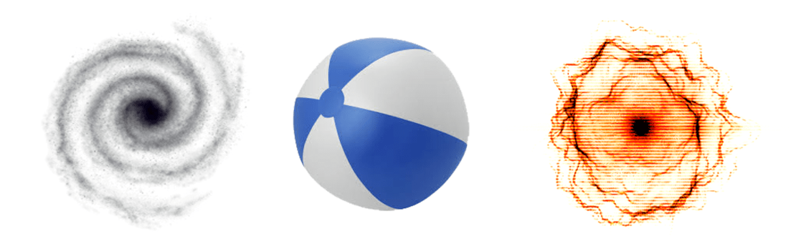
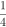
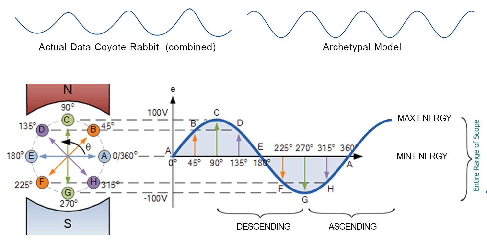

# 5: REASON

###### The ability to understand something is limited by our ability to perceive something.  As our perception changes, so does our understanding change, and with that, the reasoning we apply.

We arrived at laws through reason, and we humans are rather proud of that claim as we like to believe we invented reason, but we didn’t.  We did discover it, however, so at least we can take credit for being doggedly curious.

*Reason* is what we call our ability to recognize the natural processes that arise from the patterns of creation and is the product of intellectual survival, a skill we evolved to give us fang-less, claw-less, slow, soft and chewy humans a fighting chance in the Darwinian battlefield&hellip; at least that's one theory.

To be fair, there has been a long-standing debate over whether mathematics, and by association, reason, was invented or discovered.  One of the more solid debates is presented by leading astrophysicist Mario Livio in his article “Why Math Works”[^26]

In that article, he refers to those who believe math was discovered as Platonists, due to the fact that Platonic archetypes include math archetypes, as math is a form of an idea.  Livio gets into the idea that math is subject to the same evolutionary forces as species in that math that does not work quickly dies, never again to propagate itself into the mathematical “gene pool”.

The same is true for any idea or theory.  Ideas such as the *phlogiston* theory of fire and Descartes theory of the motion of planets are examples of conceptual offspring that were quickly dispatched by the deadly and merciless hand of proof.  It’s a bit different on the social level, where we see failed political and economic ideologies that, although their ruin is inevitable from the start, they continue to pop up, for, in the realms of ideology, proof is often eclipsed by belief, hope, power and mass hysteria.

A sounder argument that reason was discovered is that the systems we have created with our reasoning abilities, from plumbing to artificial intelligence (AI), have come to the same design conclusion as nature when faced with similar challenges, such as water distribution, blood cell design, language, etc.  In the case of AI, armed with our rules of reason, it has significantly out-designed human solutions many times by mimicking nature.  These improved solutions were derived at by observing the situation and applying the laws of reason that we instructed the AI system with, laws that we ourselves derived from observing our reality.  The fact that AI is coming up with solutions that not only exceed ours but are more in harmony with nature is pretty good evidence that the laws of reason are objectively verifiable and existed before humans arrived on the scene.

In any case, both sides can agree, for the most part, that math is the language man invented to describe the existing laws he discovered and likewise, reasoning is the process man invented to describe the unfolding order of existence that he was capable of perceiving.  This is a sufficiently satisfactory answer with regard to math and reason, but reasoning, in general, has a lot more gray area than mathematics.

## The Limits of Reason

Reason has been pretty effective in describing our reality, but it has its limits, at least in the way we use it today.

For example, the traditional Law of Thought[^27] goes something like:

- **The Law of Non-Contradiction states:**

> “Nothing can both exist and not exist at the same time and in the same respect, or no statement is both true and false.”

- **The Law of Excluded Middle states:**

> “Something either exists or does not exist, or every statement is either true or false.”

- **The Law of Identity states:**

> “Everything is the same as itself, or a statement cannot remain the same and change its truth value.”

These laws are much like math and have their own algebraic notation: ∼(p&sdot;∼p), F(x)&sup;F(x)**,** (&forall;x) (x=x), respectively.

It seems reasonable to assert that these laws existed before we came up with a way to define them, just as processes in nature existed before we understood them.  We certainly did not invent the fact that something cannot “be” and “not be” at the same time.  We discovered that this is a property of our reality, or rather, in the way we perceive our reality.  If we broaden our perceptions to include the reality that something *can be* and *cannot be* at the same time, then our reasoning must adapt.

A hardcore Aristotelian materialist might say “The law of non-contradiction specifically forbids something to be in a state of existence and non-existence.  If something exists, it cannot be otherwise”, while a Platonist might say something can exist as an archetype but not as a material instance.  A scientist might suggest that something can exist implicitly, but not explicitly, like the ink drop, or can even be in two places at the same time, as we have seen in quantum mechanics, and a Hindu guru might mess everything up by saying “The One from which all emerges is both *Sat* (existing) and *Asat* (non-existing)”.

It would appear that the laws of reason depend on the scope of one’s perspective and what one accepts as axiomatic or true, transcendental or otherwise.  How, then, can these laws be preexisting if they contradict each other? This is sort of like the fable of the blind men and the elephant, where one blind man holding the elephant’s tail describes it as a snake, and the other, holding the foot, describes it as a tree, or perhaps like the brilliant sculptures of Mathew Robert Ortis, such as “Revolution Giraffes”, which looks like a giraffe from one angle, but an elephant from another.

The blind men and the viewers of the sculpture are all perceiving a preexisting form that is undebatably “true”, but they can’t seem to agree on what it is.

Each of these fine folks can easily define and defend their worldview.  They are all able to recognize the reality they have accepted as true, supported by the reasoning of that truth.

### Labels and Names

In all cases, before one can proclaim some thing’s existence, that thing has to be named and something about it must be known, or at least presumed.  This claim is not only based in psychology, but neuroloigy as well.  We can’t say something exists if we have no idea what it is we are making that claim about.  We can see this readily in the way languages form ideas and labels which become the foundation of cultural understanding.

I can say my dog exists because I know *my* dog, I know *of* dogs, and everyone I know also knows of dogs.  But can I say *phlimquitz* exist, and when you ask me what a *phlimquitz* is, I say “I have no idea”? That would be quite unreasonable, but if I said *phlimquitz* explains the 99.97% correlation between “U.S. Spending on science, space and technology vs. Suicide by hanging, strangulation, and suffocation”, then I am claiming to understand something heretofore unknown and can go about defining and testing the *Phlimquitz Hypothesis*.

#### **Claim 18:** We name things according to our observations, and once named, they become conceptual realities.

Here is that correlation, just for fun:[^28]

This process of understanding is similar to recognizing a pattern in a series of random dots, as in the dancing-woman-in-the-dots example above (right).  In that image I can definitely see a person dancing, and I can easily prove it by connecting the dots.  I am not wrong, but neither is the person who sees an egg sandwich.

This ability to recignize patterns exuists in our neurology,  next dot will land or in determining the properties and attributes of the dots, based on the understanding of our perceptions, will most likely fail.  Through trial and error, testing, and proofs, we will finally discover that these dots represent no specific pattern.  Once we recognize the concept of randomness, we can name it, define it, and study it.

Humans began grasping this concept of randomness about 3,000 years ago, but named it things like “fate”, “chance”, and “destiny”, and, being unpredictable, was usually associated with some sort of supernatural justice or punishment.  It wasn’t until the 16^th^ century that Italian mathematicians began to formalize the concept of what we call randomness, so it’s still quite a young concept.

#### **Claim 19:** Our ability to reason is rooted in our ability to see patterns, and connecting these patterns is made possible by our ability to reason.

God(s), angels, spirits, the Djinn, magic, luck, coincidence, mystical forces, kundalini, chi, manna, out-of-body-experiences[^29], etc., are all concepts that many people have a clear understanding of, and as such, they are able to say it exists because they cannot only recognize it but can produce reams of information about it.  To be clear, this is not meant to suggest these observations are, or are not, as valid as any other.  Any system’s validity depends solely on the contextual effectiveness of the reasoning behind it and the ability of that reasoning to produce verifiably accurate statements about it.

It would be hubris to write-off alternative views of reality given every culture in the world has a concept of some sort of paranormal or metaphysical reality.  Some of these cultures have extremely demanding training and lengthy education to tap into it.  Even our western icons, such as Paracelsus, Hippocrates, Plato, Carl Jung, Erwin Schrodinger, and Albert Einstein have referred to it.

For better or worse, it seems that pretty much anything can be a Truth as long as people can recognize it and support it with whatever sort of reasoning they happen to be using, even if that reason is madness.  For our purposes, we are only concerned with reasoning that is based on the laws of nature, as they are perceived.  We need only look at history, and some places on the planet today, to see the many versions of truth that have evolved, and how dramatically they differ from each other.

### The Truth about Truth 

This raises the Big Question… What is truth?

This is a question we can never answer absolutely.  We can’t speak about what the ultimate truth is because there can never be absolute proof that any one way of looking at something is the “right” way.  All we can speak about is what is the most reasonable understanding given the context of our reality and our perceptions of it.  What, then, is the arbiter of proof as to whether something is “reasonably” true or not, given our current understanding of reality?

One arbiter is, of course, power.  When Friedrich Nietzsche said “There is no truth, only power”, he was half right.  Truth is a journey of discovery, while power is a battle for who gets to navigate that journey.

### Sustainability

Outside of that battlefield of culture and politics, we do have at least one gauge, and that is the measure of sustainability.  Sustainability may be the best test as to the validity of something because its explicit existence alone is proof it exists in accordance with the rules of reality.

Anything that exists can only sustain its existence if it exist within the constraints of its scope, typically defined by its environment and its component parts.  A functional balance must be maintained between all contributing variables in order for the energy within that instance to move in a structured manner that allows order to emerge from chaos.  Energy always seeks to achieve a balance; therefore, sustainability is the measure of the degree that order and balance can be maintained.  Unsustainability will result in chaos, and visa-versa.

This raises an interesting question: if (high-entropy) chaos is the ultimate state of the Universe, a state where everything is inert, motionless and dead, then it must also be the most sustainable state as it will never change once arrived at.  Oddly, this appears to be true, but this is also an example of the two kinds of *balance*.  The dead state is the state of *balance* (noun) that has no movement, which is the opposite of the action of *balance* (verb), which is a dynamic and interactive process of energy and movement.

All the movement of energy that exists at every level of reality is the result of energy traveling the path of least resistance as it seeks balance.  We see examples of this everywhere, but one of the more dramatric examples is when  hydrochloric acid is mixed with sodium hydroxide.  After an extremely violent readjustment phase that releases a lot of energy (heat), it settles down to very stable, lower energy-demanding products of water and table salt.

The Universe, starting with the extremely violent Big Bang and ending (according to at least one popular theory) as a bunch of inert matter, the cosmic equivalent of water and table salt, is essentially the readjustment phase of different states of imbalance coming to terms with one another.  Reality is the reaction of this adjustment, and like the chemical reaction just mentioned, will ultimately balance out and just sit there, doing nothing.

The ultimate destination of sustainability, on the cosmic scale, is death.  In our current point in existence, sustainability means keeping the various part of the “balancing machine” of nature working properly.  In both cases sustainability means balance, but with two very different results of short-term, or *temporal* balance and long-term, or *supernal* balance.  For our purposes, the sustainability we are referring to is the temporal kind, unless otherwise noted.

#### **Claim 20:** Sustainability is a gauge of existence, and therefore life itself, at every level of reality.

Pions exist for about 26 nanoseconds, while the most massive black hole known, approximately 66 billion times larger than our sun, would require 6x10^99^ years to evaporate.  Does this mean that black holes are more “valid”, more “true” than pions? No, because the pion’s existence, short as it is, is inevitable, otherwise the forces that caused it into existance it would not have done so, but the validity of a pion, essentially the truth of its explicit existence, is only valid for 26 nanoseconds while the validity of a black hole is forever (as 6x10^99^ years is actually longer than the life span of the Universe).  By this logic, we can say that both pions and black holes are equally true and valid, but one’s truth is sustainable for a bit longer.

#### **Claim 21:** Something exists because its expression of energy patterns adheres to an order that must be maintained to continue existing.

### Tree of Sustainability

Let’s take a look at a more integrated example; that of a single cell, the building block of life.  This is high-school biology, but let’s go over it again.

Each of these processes has proven itself to be a more “valid” truth by being more sustainable then any of their alternative processes.

Inside the cell are two meters of tightly wound strands of four very specific molecules, held together by sugar phosphates, which make up the DNA of that cell.  These are C~5~H~5~N~5~ ​(adenine), C~5~H~5~N~5~O (guanine), C~4~H~5~N~3~O (cytosine) and C~5~H~6~N~2~O~2~  (thymine).  They are arranged in a very specific order which describes the instructions necessary to build every protein in an organism.

- In a process known as transcription, a molecular machine first unwinds a section of the DNA helix to expose the genetic instructions needed to assemble a specific protein molecule.
- Another machine then copies these instructions to form a molecule known as messenger RNA.
- When transcription is complete, the RNA strand carries the genetic information through the nuclear pore complex, the gatekeeper for traffic in and out of the cell nucleus.
- The messenger RNA strand is directed to a two-part molecular factory called a ribosome.
- After attaching itself securely, the process of translation begins.
- Inside the ribosome, a molecular assembly line builds a specifically sequenced chain of amino acids.
- These amino acids are transported from other parts of the cell.
- They are linked into chains often hundreds of units long.  Their sequential arrangement determines the type of protein manufactured.
- When the chain is finished it is moved from the ribosome to a barrel-shaped machine.
- It is then folded into the precise shape critical to its function.
- After the train is folded into a protein it is then released and shepherded by another molecular machine to the exact location where it is needed.

These processes, and their order, are so specific, so complex, so difficult to explain with current evolutionary models, that Dean Kenyon, a Professor Emeritus of Biology at San Francisco State University who actually taught Evolutionary Theory, switched teams in 1979 and went on to be a key member in the “Intelligent Design” movement.

The important point here is that if any one thing in the list of processes listed above changes, if one atom in the C~5~H~5~N~5~ molecule was different, or the “gatekeeper” made a bad call or a thousand other possibilities, the cell would either die, mutate, or otherwise become unsustainable, making the larger organism unsustainable.  This is actually what cancer is, the malformed reproduction of cells that reduce organism’s sustainability.  Interestingly, the cancer cell itself can be quite sustainable as an independent cell and only becomes a problem as a community of cells.

For a cell to be sustainable, to continue existing, only one process, made up of numerous detailed steps, all of which must function properly, will result in successful functioning and reproduction.  More importantly, we can’t explain why any one particular option in any step, out of the countless theoretical options available at each step, is the one step that the process “knows” to select.

To put this in even clearer perspective, using twenty different amino acids to create a very small protein (of 150 amino acids), there are 10^77^ possible combinations.  In the world of biology, this exponential growth of possibilities is actually called *combinatorial inflation*.  Remember that term, as we’ll come back to it later on.  How many of these 10^77^ possibilities can produce a viable protein? Very few, and of those few only one will work, that being the one that works with the others it must integrate with.  It’s not quite as bad as the likelihood of a million monkeys banging on a million typewriters to eventually produce the entire works of Shakespeare, but considering it would take 2,737,850 million-billion-billion-billion monkey-years to produce the line from Hamlet “RUMOUR.  Open your ears”[^30], how likely is the chance that this 1:10^77^ process could happen successfully 10^40^ times, which is the number of organisms that have ever existed in the history of the planet? For life to evolve (in the Darwinian sense) as it has over the past 4.5 billion years, this 1:10^77^ process would need to happen 7x10^99^ times per second, which equates to every living thing on planet today performing this process 7x10^74^ times per second! If the vast majority of the 34 trillion cells that make up your body didn’t all hit the jackpot of creating the *same* viable life form millions, if not billions of times a second, life would have never evolved past the bio-goo stage.  Admittedly, these numbers may be inaccurate due to their speculative nature, but the general idea that evolution as a genetic crapshoot sounds far more unreasonable.

What we call a cell is a collective of components that not only all work together with miraculous precision, but which seems to have an intelligence of its own that understands the requirements of how each component must operate with each other component in order to preserve and maintain its sustainability, its existence.  Likewise, the components themselves, like the barrel-shaped machine and the transcriptors, are also made of components that have the same intentions and decision-making abilities.

Evolutionists will say that all the other options, at one time in our past, were tried, and failed, leaving only the process that worked.  Intelligent Designers will say that this was “biochemical predeterminism”, i.e.  that the process was pre-programmed, somehow.  Both of these answers are just kicking the can down the road, that “can” being the question of where and how this historical record of what worked and what didn’t work is stored along with the knowledge of a very strict set of rules and conditions that informs the process, as well as how this data is accessed.

Let’s take a look at a couple of macro examples on the social human scale and examine the serious questions it raises about the way we understand it.

### Yagé

This ritual psychoactive drink from the Amazon is also known as *ayahuasca*, *uni*, *nixi pãe*, *caapi*, *camarampi*, and many other names as well.  One of the more fascinating details about yagé is how it is made and how it was discovered in the first place.  The main active ingredient of yagé is N, N-Dimethyltryptamine (DMT).  DMT is a powerful hallucinogenic drug that exists in plants (and the human brain) yet has no effect on humans when taken orally because of the enzyme *monoamine oxidase* (MAO) in our blood that prevents it from passing the blood/brain barrier, which is a semipermeable membrane that separates the blood from the cerebrospinal fluid and which blocks many cells, particles, and large molecules, from entering the brain.  This is a very good thing, as there is a lot of stuff floating around in our blood that can really mess with the brain.

In order for the DMT to get to the brain, it has to pass through the blood/brain barrier, and for that to happen there must be something that stops the MAOs from doing their job.  That thing is called a *MAO Inhibitor* (MAOI).  MAOIs are commonly used in pharmaceuticals to help with ailments such as depression and Parkinson’s disease (which, according to Stanford University, are the same two things that tango dancing also helps).

Modern science has known about both of these drugs for a little over 100 years.  Indigenous Amazonian shamans have known about them for about 5,000 years.  Somehow, in a manner beyond the ability of modern Western man to comprehend, these shamans managed to discover that the bark of one particular vine, from over 40,000 species of plants, contained a lot of DMT.  They also, somehow, knew that an MAOI was needed, which they found in another of those 40,000 species.  On top of all this, they had to know to stop eating meat, fish, milk, fruit, bread, and anything fermented for some days before taking the MAOI lest they suffer serious injury and/or death.  Traditional anthropologists would have you believe they discovered this by trial and error, but with just a little thought, it is clear how ridiculous that theory is.

Of the 1,600,000,000 possible pairing combinations of Amazonian plants, only one produces the basis of yagé (it’s actually far more complicated to make yagé than just mixing these two plants), and even then, only when a certain part of the plants are used.  In addition, these 1,600,000,000 possibilities do not consider the variables of proportion or the specifics of preparation.  For that many trial-and-error tests, even if every man, woman, and child in all of South America partook in the finding, preparing, and experimenting, it would take over 2,000 years, which then raises the question of record-keeping as to what was already tested.  The fact that modern science expects any semi-intelligent person to believe its trial-and-error theory is laughable, but also pretty frightening that so many scientists *do* believe this.

### Curare

For other substances, such as the paralyzing poison *curare* used by South American indigenous people for hunting, the chances are astronomically greater.

Curare is a poison that paralyzes an animal, but soon after being paralyzed the poison is metabolized by the animal, rendering it harmless.  That is obviously a pretty essential requirement, as you can’t be eating the same poison you used to catch the animal.  Just imagining that the locals knew of this requirement and then set out to find such a drug somewhere in the Amazon is difficult for modern anthropologists to accept.

Beyond that, there are 172 different types of this one-in-40000 species in the jungle, and only one of them works, but the real kicker is that the fumes one is exposed to while preparing the curare are fatal! How does modern science imagine this was achieved?

> *Wanadi:* “Trumak! Mojie just died testing that new batch of curare!”
>
> *Trumak:* “Bummer.  And he was so close! Go and try that again, with the same batch… and remember to keep smelling it.  That’s how you know it’s done.”
>
> Wanadi: “OK!”

On the other hand, if one were to ask a shaman how these things were discovered, he would simply say, “The plants told us”. Other cultures who have similar stories might say their ancestors told them, or the crickets, or the bones of a sacred animal, or the cracks in the shell of a tortoise after it has been heated and then dropped into cold water and then compared to the position of the stars, as was the case with the origins of the Chinese I-Ching.

## Ancient Mysteries

This same reasoning, I believe, applies to so many of the ancient mysteries that are inexplicable within our current understanding, and not only cosmic mysteries, but technical as well[^306]. The fantastic details and specificity of the Babylonian creation story (the *Enuma Elish*), the Vedic scriptures, the Epic of Gilgamesh, and other compelling evidence from cultures around the world that speak of other intelligences at play, suggest that mankind had access to an intelligence (and/or an intelligence had access to man) beyond what we currently believe was possible.

For Western man, talking to plants, insects, bones, or aliens in this manner is usually followed by pharmaceuticals prescribed by a psychiatrist.  For just about every other indigenous culture, including the indigenous culture that Western civilization grew from, they had some way to tap into this organic database of knowledge, and perhaps more importantly, they accepted that such a thing was not only possible, but necessary.

Just as a cellular transcriptor has the intelligence necessary to manage its sustainability, which is then managed by the intelligence of a cell, and up the chain this continues all the way to a human being (which is just a stop along the journey, as we humans are part of a yet larger system), it is not unreasonable to presume there is an *uber*-intelligence that manages its components of humans.

Our ancestors called this intelligence “the voice of the gods” and about 5,000 years ago we started to create the idea of an all-in-one-version of the gods.  This was a very practical idea and worked very well given the context and scope of our ancestor’s world view.  It gave one name to all things unknown and satisfied their need for a sense of truth and order.  Once named it was left to humans to try and describe that truth and order.

## The Human Brain and Reason

The American Psychologist Julian Jaynes wrote a very popular book titled “*The Origin of Consciousness in the Breakdown of the Bicameral Mind”* (1976) wherein he explains that during a recent stage in the evolution of not only our ancestor’s brain but entire nervous system we, as humans, had the ability to hear voices in our heads instructing us on what we needed to do and needed to know, and these voices of unknown origin were attributed to the “gods”, and therefore became the voice of Truth.

>“Who then were these gods that pushed men about like robots and sang epics through their lips? They were voices whose speech and directions could be as distinctly heard by the Iliadic heroes as voices are heard by certain epileptic and schizophrenic patients, or just as Joan of Arc heard her voices.  The gods were organizations of the central nervous system and can be regarded as personae in the sense of poignant consistencies through time, amalgams of parental or admonitory images.  The god is a part of the man, and quite consistent with this conception is the fact that the gods never step outside of natural laws.”[^31]

Jaynes claims that a bit before 1000 BC (just around the time of the Tower of Babel by Sumerian accounts) the human consciousness was not yet “meta-conscious”, meaning humans were not aware of their awareness.  The bicameral part of Jaynes theory suggests that there were two parts of the brain, the one that managed mundane jobs, habits, rote tasks, etc.  (the self), and another part which, when faced with confusing and/or difficult challenges, took over (the voice of god).

> [For bicameral humans], volition came as a voice that was in the nature of a neurological command, in which the command and the action were not separated, in which to hear was to obey.

*Sidenote: What we call the “ego” today evolved out of that really boring and mundane “self” part of the brain, so it’s probably best not to use it for anything other than mundane tasks.*

According to Jaynes, the transition from bicameralism to consciousness (linguistic meta-cognition) occurred over the period from 1800 BC to 800 BC.  We know this time as the time from when Hammurabi ruled Babylonia, and when he wrote down one of the first set of laws known to humanity dealing with challenging and confusing issues such as contracts, wages, liability, inheritance, divorce, paternity, and reproductive behavior, to name a few, to the founding of Rome.  This metamorphosis of consciousness ushered in the golden age of empires and cultures that laid the foundation of Western Civilization in areas of art, literature, theater, government, philosophy, mathematics, and even sports.  (*I am singling out Western culture simply because that is the culture I best understand and which has the most information available, and not because I think other cultures have not developed along their own lines under similar conditions.)*

From the days of Rome and the ancient Greek philosophers to today, our bicameralism has further diminished, which can account for the decreasing incidents of people hearing the gods speak to them.  This may have been a good thing, but the problem that arose as a result of the gods abandoning us, forcing us to apply reason to challenging problems when our pleas for guidance were ignored, is that our newly developed tools of reason were prone to reject any ideas that we could not understand, which were many, given we were still new at the whole reasoning thing during some very desperate times.  Our fledgling ability to consciously make sense of things seemed to be working, so it naturally dominated our world view, even if we were, and are, still figuring out how it works.

Still, as Jaynes so eloquently puts it:

> The mind is still haunted with its old unconscious ways; it broods on lost authorities; and the yearning, the deep and hollowing yearning for divine volition and service is with us still.

Hence, religion.

Anything and everything that did not fit into the highly constrained and “reasonable” worldview was pushed farther and farther outside the box of mainstream thought until we arrived at where we are today.  In one way this “inquisition-by-reason”, which served to purge heretical thoughts from the dogma of the cult of reason, was, and is, quite necessary and useful, because in the reformation that has begun, those ancient ideas that can withstand the tests of our deeper understanding of reason will be resurrected in a new form with a broader and modern understanding.

The memories of the cell, the voices in our ancestor’s heads, the wisdom of the plants as heard by the shamans, and countless other instances of “divine” or “mystical” knowledge, all beg the same questions: Where does this information come from? Where is it stored? How does one access it?

Perhaps *reason* has evolved to the point where we may be able to answer these questions, reasonably.

## The Path of Reason

The rules and conditions of reality that we have discovered have followed a perfectly reasonable path long before man was able to claim them as such.  Sometimes it takes a while to find them, but eventually, we do, so far.

For thousands of years, Man looked at the path of the stars and came up with various stories about why they were where they were.  It wasn’t until Kepler discovered the pattern by plotting the paths on a logarithmic chart that the reasoning became clear.  This became Kepler’s *Third Law of Planetary Motion* that states *“the square of the planet’s orbital period is proportional to the cube of its distance from the sun”.* In the same manner, we discovered DNA is a helix because of hydrogen bonds, etc., so we can say “Here is a pattern and the rules that created it ”.

This is not to say everything that the gatekeepers of the Church of Reason consider “unreasonable”, such as myths, magic, aliens, hyper-dimensional beings, and numerous other paranormal, metaphysical concepts are, indeed, “unreasonable”. On the contrary, it’s quite unreasonable to presume they have no reasoning behind them as many of these ideas perfectly conform to natural law, albeit within a scope that extends outside our modern boundaries.  Today we see planets as law-abviding balls in space and DNA as spiriling compounds, but our ancestors saw gods that showed them the way, and spirialing serpants of powerful magic.  Who is to say which is more “true”?  

Historical examples of once unreasonable ideas include electricity, flight, wireless communications, space travel, nuclear energy and pretty much the majority of the reality of modern life.  These things were considered nothing less than magic and science fiction until we were able to recognize it and discover the rules of how they worked.  Once we discovered Bernoulli’s law[^32] works in harmony with the law of gravity, we mastered the magic art of flying.

#### **Claim 22:** Reason is the codification of the rules of a reality as we have come to know it.

### The benevolence of self-preservation

If our reasoning is based on the world we observe, then this implies that everything in nature, everything in the universe, must, therefore, be “reasonable”, at least according to the laws of existance, but sometimes the reasoning we have derived from our observations is inaccurate or lacking.

#### **Claim 23:** The rules of reason are predetermined based on the rules of our reality that we have recognized, and these rules require that any “reason” that exists must abide by them.

Take, for example, our reasoning behind the evolutionary drive for self-preservation.  We assume it is a somewhat selfish, yet necessary, biological drive passed down through our genes in order to increase the genes chances of reproducing themselves.  This makes sense if we see the world only as a bunch of individual entities competing for resources.

Another way to see self-preservation is from the perspective of the larger organism that is composed of many contributing organisms.

Take the example of a collective, such as a tribe.  If the collective is destroyed, then all its members also suffer from that loss.  The collective, then, has a strong responsibility to the members.  On the other hand, if the members were to become damaged in some way, the collective suffers as well.  So, the collective will both attempt to preserve itself for the sake of its members and preserve the members for the sake of itself.  We don’t think of a collective as an organism, but all organisms are collectives, therefore collectives *can* be organisms.  Now apply this reasoning to an animal.  The animal will attempt to preserve itself for the sake of its “members”  (organs, limbs, cells, etc.), and preserve its members for the sake of itself.  In the case of a tree, a tree will attempt to protect itself for the sake of its members which it needs to maintain sustainability.  For example, besides bark and thorns, a tree will emit chemicals that attract the enemies of the invading species, which is pretty amazing when you wonder about how it “knows” how to do that.  A leaf will attempt to protect itself with fine hairs, spines or thorns, bitter and even toxic substances.  We tend to think of a tree as a thing that has a trunk, branches and leaves, but it can also be understood as a collective organism made up of other collective organisms, such as trunk, branch and leaf, each taking care of itself and its immediate children.

From the perspective of the parent organism, such as the collective, it is worth losing a member if that means it will benefit the collective and/or the ability of the collective to preserve its members.

One example of this are the cardiac muscle cells that have the self-preservation ability to duck, dart, and dodge foreign substances, but these actions may harm the cells to the point where they can cause a fatal heart attack, all in an attempt to preserve themselves, even though they are killing their parent organism.

Some theorize that they do this because there is a greater chance of the heart surviving if the cells can avoid damage and hold out for the possibility of the heart being resuscitated.  This may be so, but I wonder just how many successful resuscitation have occurred over the past 520 million years (which is how long ago the heart evolved), at least prior to the invention of CPR in the 18^th^ century, otherwise how or why would the heart cell “think” resuscitation was even a possibility? A far more reasonable explanation is that the component elements of a person (the cells, in this case) are compelled to preserve *their* component elements (nucleus, chromatins, cytoplasm, organelles, etc.).  Killing the parent organism is not its concern, nor within the scope of its influence as preservation of the members is the concern of the parent organism, which has obviously failed to protect its components in this case.  The sacrificed parent organism of *person*, which exists within the collective (tribe, community, country, etc.) will only lose one (improperly functioning) member.  With a bit of thought, one might question whether modern medicine is doing a disservice to the larger organism we humans serve, whatever that is.  I suppose history will be the judge.

In this particular example of cardiac cells, their self-preservation can be fatal to the collective (of the *person*), but in most cases losing a few cells is not fatal to a person, but by the same token, the *uber* organism that humans are a part of (family, society, government, etc.) only forfeits one human.  This is happening in our own bodies 60 billion times a day, as that is how many of our own cells die, and are created, every day.

#### **Claim 24:** The most efficient model for a collective is individual self-preservation.

Seeing self-preservation more as a protecting-the-family-of-component-parts makes much more sense *if* we also see that every organism in the hierarchy of life, from cells to cities, is an individual entity.

Just as an entity will endanger its parent collective in an attempt to preserve its own members, a collective will sacrifice a member for the betterment of the whole.

This perspective also explains how a person is able to sacrifice itself for the sake of another, even though they have no genetic connection to the other person, ruling out genetic preference as is the case when a parent sacrifices themselves for their child.  This would also suggest that our most basic drive is not only the survival of the self, but also the survival of something more important than the self, yet still be self-serving.  We see this in cases of love, honor, country, god, etc., and other examples of a collective.

You might be thinking that this is a trait unique to humans, but this is not the case.  We see cases of this in single-cell organisms[^33], multi-cellular organisms[^34] (such as slime mold, where, when faced with scant resources, certain cells will sacrifice themselves for the sake of the greater organism.[^35]), virulent parasites[^36], plants[^37], to name a few.  Of course, in society, this is clearly exemplified in soldiers willing to die for their country or ideology, as well as countries willing to send their soldiers into war.

This self-sacrificing quality turns out to be fairly common across life in general.  Quoting the paper published in *the International Academy of Ecology and Environmental Sciences*, “Invasive cancer as an empirical example of evolutionary suicide”[^38] :

> In recent years, a large portion of the literature has focused on evolutionary suicide.  “Darwinian extinction” or evolutionary suicide is one of the most important findings in adaptive dynamics [which inevitably bring us to the conclusion] that evolutionary theory falls short of adequately explaining the phenomenon of life in its fullness and complexity.  This is due to the fact that [evolutionary suicide] is not a rare or special case and that it can occur in the most common ecological conditions.

We also see a less dramatic version of this in genomes which will, rather then commit suicide, reduce their own replication rate to help other genomes.[^39]

This perspective is reasonable and does a better job of explaining how, any why, life operates the way it does.  With ideas such as wave functions and the many-worlds theory of quantum physics, the morphic field of biology, the research into hyper-time telepathic communication (for long-distance space travel), self-determining AI, etc., it’s easy to see how what we accept as “reasonable” will dramatically change as we learn how these new processes of reality and life work.

Some may see this as an example of “Intelligent Design”. We prefer the term “Coherent Integration” to represent an integrated self-similar pattern of moving energy that extends far above and below that sliver of the reality spectrum that we are attuned to perceive.

This idea is essentially the same one that was put forth 250 years ago by the man who not only laid the foundations of modern economics but did so specifically with the idea of eliminating poverty and increasing sustainability.  His name was Adam Smith, and he referred to this power of self-preservation in his *Theory of the Invisible Hand*, described in his book *‘An Inquiry into the Nature and Causes of the Wealth of Nations’* published in 1776.

> The natural effort of every individual to better his own conditions, when suffered to exert itself with freedom and security, is so powerful a principle, that it is alone, and without assistance, not only capable of carrying on the society to wealth and prosperity, but of surmounting a hundred impertinent obstructions with which the folly of human laws too often encumber its operations.
>
> It is not from the benevolence of the butcher, the brewer, or the baker that we expect our dinner, but from their regard to their own interest.  **\~ Adam Smith, 1776**

Applying this idea to society also suggests that the most sustainable practice for the world at large can be summed up in a phrase that is attributed to international banks, John Lennon and Yoko Ono, Buckminster Fuller and more[^40] &hellip; “Think globally, act locally”.  This is easily practiced by spending your money at local businesses rather than Walmart or Amazon, or simply, to quote Mother Theresa when asked “What can we do to promote world peace?”, “Go home and love your family.”

#### **Claim 25:** There is an order to creative processes, and creations themselves are a product of order.

## Applied Reason

How have we used our reasoning skills to understand the nature of reality and our universe? One of the most fundamental concepts we have created in this regard it that of *cycles*.  Cycles are the way we describe *“any complete round or series of occurrences that repeats or is repeated”.* Cycles, as we understand and define them, are the product of applying reason to the redundancies and repeating patterns we observe around us, and even within us.

On the other end of the spectrum, we have sophisticated and complex theories as to how reality came into existence, and how the cycles of existence began in the first place.

We understand the concept of cycles easily enough, but let’s look at some of the more popular ideas that represent our best reasoning abilities regarding the cycle that started it all and how everything that exists began.

### Big Bang

This seems to be the most popular theory and it comes with various finales (Big Freeze, Big Rip, Big Crunch) and states that 14 billion years ago there was nothing and nowhere, the primal void.  Then, for reasons unknown, something the size of a subatomic particle appeared in this void of nothingness and in a fraction of a second expanded to perpetually grow and fill the entirety of what we call the Universe (which is estimated to be about 90 billion light-years wide, so far).

Can you see the relationship between the Big Bang Theory and the harmonograph as a device that takes an initial push and then takes some time to create a two-dimensional design on a blank surface as that initial energy slowly diminishes? If one could imagine a 12-dimensional harmonograph with countless variables in each dimension, one might be able to imagine how it could easily “draw” a 3-dimensional universe.

One clever twist to this theory is that Big Bangs occur *inside* black  holes, creating new universes, which have black holes, which create Big Bangs, creating an unending cycle of cascading and embedded realities: Big Bang &rarr; Universe &rarr; Black Holes &rarr; Big Bang&hellip; rinse and repeat.  This is called the BHBBT (Black Hole Big Bang Theory).

### Eternal Inflation

This is also called a “Level II Multiverse” and states a) after the Big Bang the universe never stopped inflating, b) that this has been going on for an infinite amount of time and c) it continually creates new universes (multiverses) that also exist for infinite time.  It is not clear how something can have a beginning, can be created, and yet exist for infinite time as there can be no “beginning” to infinite time, but we’re talking quantum theory stuff, so, I guess anything is possible in that world where time and space may mean something different then what we are used to, if they mean anything at all.  The paper Stephen Hawking was working on when he died claims this theory is for the birds, that there is only one universe, and this can be proven if we just get rid of the concept of time… so, even the rebuttal to this theory is inconceivable.

### Oscillating Universe

Also called the “cyclic model” and involves an endless series of Big Bangs, followed by Big Crunches, and is explained by the collisions of *membranes* in a higher-dimensional space.  This is different from the BHBBT in that it is the same universe that is expanding and crunching (like some sort of multidimensional cosmic combustion engine?).

The question this model raises, and the BHBBT model as well, is, does the “memory” of the previous “bangs” survive each crunch? We address the idea of universal memory later, so we won’t get into it here other than to ask if each new bang is a hard reset.

### Holographic simulation hypothesis 

The idea that reality is “just” a simulation has been around for a long time.  The roots of such an idea go back to the “Skeptical hypotheses” of ancient Greece and the “The Butterfly Dream” of 3rd century B.C. Chinese philosopher Zhuang Zhou.  These ideas found more form in the “Cartesian doubt” of René Descartes, finally culminating in Oxford philosopher Nick Bostrom’s “Simulation hypothesis” theory and book *“Are you living in a computer simulation?”* in 2003 (also a documentary[^41]).

This theory that we live in a simulation has moved out of the philosopher’s chair and into the science lab where bits of supporting evidence were discovered.  In this scenario, the Big Bang would be the equivalent of a cosmic hacker flipping the “on” switch to their “Reality Framework Server”.  This theory posits that reality is a simulated projection and black holes are the projectors, with the *event horizon* of a black hole (the point from which nothing escapes) acting as a diffraction grid for the energy it is projecting to form a “reality”, just like a hologram.

We think of this world as analog, but it may well be digital, albeit with a level of resolution far beyond our ability to perceive (which would make sense if one were designing a simulation).  This grid is made up of a series of 1s and 0s, each “bit” occupying a square Planck length.  To put this in perspective, the number of “bits” on the surface of *V616 Monocerotis*, our nearest black hole “projector” a mere 3,000 light-years away, is around 2.3313x10^88^.  There are only 10^82^ atoms in the universe (we think), so, that is a big number.

This is just from one of the 100 million black hole projectors in our galaxy alone, and we already know of 500 billion galaxies just within our range of observation, so we know of at least 5 x 10^19^ “reality projecting CPUs” (for lack of a better term), that are all working in perfect synchronization, theoretically.

Even more mind-bending is the possibility that the reality that is being projected is only “rendered” on-demand, i.e.  this reality simulation creates wave functions of possibilities that only “collapse” into form when they are observed.  Apparently, creating actual physical reality is a “CPU” intensive task, or perhaps this reality was developed by creators that could only get their hands on a low-end simulator.

I would also question the use of the word “simulation”, for that implies it is an artificial rendition of something that already exists.  It is more like a *bona fide* creation, albeit one that may have been designed around a specific model, or for a specific (yet unknown) purpose.

What is missing in the list of current theories are many of those ideas that are not based in science, but rather legend, creation myths and beliefs.  I skipped them not because they are not valid, but simply because there are too many of them, but modern theories are surprisingly in-line with the creation myths of the Judeo-Christian, Islam, Hindu, Zoroastrian, Taoist, Buddhist and even Aboriginal Australian, the world’s oldest civilization[^42], and cycles of creations is implicit in all of them, and explicit in many of them.  We would expect to see this similarity between radically different perspectives, such as modern science and ancient religion, if they were all attempting to understand the same thing.

The common thread of modern and ancient creation theories and stories is that they are all versions of the plot-line that begins with *nothingness*, followed by a *somethingness*, and everything that ever did or ever will exist does so between these two states of chaos.

#### **Claim 26:** All dualities stem from the first duality.

### What Goes Where? 

If we can return to chapter 1, Chaos, for a moment… for our purposes, which is meant simplify concepts, let's view the “box” of our reality as something like the following:

There are many dimensions by which we can measure the universe, but we are using these two for now.  The four corners represent four states of chaos, and all reality, as sentient beings know it, all exists in the middle-ish area.  Often the reference to zero/total entropy are used with reference to zero/total matter, because they are essentially the same in nature, but different in scope.

With  that in mind, if the two primal opposing end-points of the spectrum of our reality, such as *somethingness* and *nothingness*, that leaves a lot of space for pretty much anything to exist.

The range of possibilities between these two (or any two) states is naturally distributed and looks something like your standard Bell curve.  There is a very good reason for this: because the probabilities of what can happen between two states, regardless of the number of variables at play, will always tend toward a *normal* (in the statistical sense of the word) distribution.

If we had the ultimate Bell curve between the states of nothingness (high entropy) and somethingness (low entropy), the part of the curve that represents the most sustainable condition of these two states would be in the middle.  This will be the point where there is the least amount of disorder and the highest probability for order as each side will be represented in the most balanced, and therefore sustainable, manner.  This chart below is a general concept of this idea.

We see this sort of distribution everywhere in nature.  In fact, in the world of theoretical biology, this is called *environmental dimensionality* and describes how various biological systems coexist.[^43]  This suggests that the stuff in the middle, between two poles, represents the most effective expression of energy for whatever scope and context applies, not unlike the previous example of the blooming flower.

#### **Claim 27:** The most likely and persistence state of anything (including ideas) that exists as a result of other states will be where the most balance exists between those other states.

#### **Claim 28:** Order emerges most efficiently in a balanced state.

For example, the human eye sensitivity chart below shows that a particular shade of green (555nm) is the most dominant color because this is the middle of the range of our biological sensitivity to light.  This shows that the most efficient (most energetically ordered) function of our eyes is the perception of the color green.  This makes sense as we evolved in a world that was very green thanks to chlorophyll and its oxygen producing photosynthesis.  Other life-forms have other ranges of sensitivity depending on their context or environment.  A fascinating example of this is the Movile Caves in Romania.  These caves were sealed off 5,000,000 years ago, yet within the hostile environment, rich in hydrogen sulfide gas and sulfuric acid, at least 33 new species of life have evolved and flourished feeding off the bacteria that eats rocks and other inorganic material (*chemosynthetic bacteria*).

The oscillations between two states, be they the two states of chaos, or order and disorder, or any two points that are different yet can form an interaction, is the most basic form of energetic expression in all the orders of creation.  This is one area where metaphysics, spirituality, and science all happily converge: everything exists in a duality of some sort, or at least that is how we can describe everything.

Were this duality to no longer exist in a state of imbalance or difference, the cycles of creations would also cease.  How, then, is a stable state of imbalance always maintained? Remember the example of the two lakes, one higher than the other? Once all the water has moved to the lower lake the water just sits there, doing nothing, and that is the end of the cycle unless somehow the water gets moved back into the higher lake.  Nature does this quite effectively by using another imbalance in another system that causes water to evaporate due to heat, heat that was created by the process of clouds of hydrogen atoms joining together (fusion) to create new elements and transmitting that energy to earth via oscillating energy.  These evaporated molecules join together in the sky and eventually fall back to earth and find their way, via entropy, to rivers and lakes, thereby ensuring the cycle of energy-seeking-balance remains operating.  Difference must be maintained for energy to work, and what we call nature is the balancing of countless balancing processes that are themselves the result of balancing processes, etc., all the way down (or up) to the first process of balance/imbalance (which we’ll detail later).

## Waves

When we look at simple waves, such as light waves, radio waves, sound waves, we see an oscillation of energy.  This is the result of movement of energy over time.

On the atomic level, there are electromagnetic waves, such as light, X-rays, radio waves, etc.  On the material level, we have mechanical waves, such as sound waves.  On the organic level and beyond (planets, life, culture, politics, etc.[^44]) we don’t use the term *waves*, instead, we call them *cycles*, but they represent the same thing as waves but in a different context and scope.

If we look at a typical wave model, which is one cycle of a quantity of energy moving over a period of time, we say that the time it takes to complete one cycle is the frequency, and the distance it covers in one cycle is the wavelength.  “Frequency” and “wavelength” are typically terms we use to describe waves of radiation and vibration, such as light and sound, but we *could* say the moon has a wavelength of about 50 million km, with a frequency of 0.00599584916 Hz, or that the migration cycle of the Arctic Tern, a bird that flies back and forth between the Arctic and the Antarctic every year, has a frequency of 1/yr., with a wavelength of 70,000 km (which is how far they travel every year).  We don’t because it’s cumbersome, non-intuitive and fairly useless information in our current paradigm.

As meaningless as these terms are for such cases, it does not take away from the idea that these natural cycles are the expressions of the same law that light waves operate under in the transference of energy, but on a different level of expression, on a higher order of complexity, size and dependency where instead of photons we have birds and planets.

Another example might be the interdependent cycles of cohabiting rabbits and coyotes.  It might sound ridiculous to compare X-rays with prey-predator cycles, but both of them share the most basic function, the transference of energy in an attempt to create balance, just in two very different scopes and contexts.

### Not Just a Cycle

It may be that there is more to waves than just a simple periodic cycle, at least in the way it interacts with its environment.  For example, when we take a wavelength that is the circumference of the world and map it across the equator, we find what seems like an inordinate number of cultural artifacts that represent incredible advances for the time, stretching over 7,000 years.  More then that, there has been a lot of speculation and research[^45] into why the Great Pyramid and Macchupicchu, or the Nazca Lines and Easter Island, fall within this same line (in image below) to within less than one tenth of one degree of latitude.  Some of the other locations, such as Perseopolis, Mohenjo Daro, Petra, Ur, and the temples at Angkor Wat, fall within one degree.  It’s almost as if the inhabitants of earth unconsciously knew something, and what they knew had something to do with a wavelength the size of the planet they lived on.

The two most common classes of waves are electromagnetic (subatomic particles) and mechanical (particles, M-waves).  If we were to compare them we would see similarities that we could also identify in cycles, such as those mentioned here, but that is beyond the scope of this book as it would be a book itself.  We can at least compare the properties of the two common classes of waves.

Yes, for all you physicists and electrical/mechanical engineers that might be reading this with extreme incredulity, the differences between electromagnetic (EM) and mechanical (M) waves are many.  We would expect energy to express its movement quite differently when operating under the laws of subatomic particles than that of matter, but even so, there will be many analogous parallels between the two.

To put their contexts and scopes in perspective, consider that an electron is 100 million times smaller than an atom, and 20 trillion times smaller than a chromosome, let alone the sizes we are talking about for typical M-wave medium, like things you can hold in your hand.  Compare that to the Milky Way galaxy, which is 167,256,410 times the size of our solar system, and the earth is only 1/38000 the size of that.  The difference between an electron and a beach ball is about the same difference between a beach ball and the entire galaxy.  With that in mind, consider that the ratio of the actual universe compared to the observable universe is equivalent to an atom compared to the observable universe.  It’s easy to imagine how a fundamental law might be expressed differently at these different scales.

More important than the differences are the similarities, such as the way energy travels through a medium via waves.  All forms of energy are simply a redirection of energy from one state to another, as energy is neither created nor destroyed.  This is the very first law of thermodynamics, the conservation of energy.  We have identified many forms of energy: sound, chemical, radiant, electrical, atomic, mechanical, elastic, ionization, gravitational, dark (that’s the energy causing the universe to expand faster than we think it should), so is it unreasonable to imagine still more forms of energy? Are emotions like love or fear, desires, thoughts, or even imagination a redirection of energy? And what form does that energy take? Can we say that we know of every type of medium and every type of cycle and the laws that control them? I don’t think so, but we can begin by applying the fundamental laws of energy and cycles.

We can only recognize energy as one form or another, not as pure energy itself.  An everyday example of this is the fact that you can’t see or detect light until the light energy hits something, like a wall or a dust particle or the optical cell in your eye.  The same is true for electricity.  The real mind-bender here is that the dust particle itself is just energy (as is all mass according to *m=Ec^2^*), so we can only see one form of energy when that energy interacts with another form of energy.  As everything is energy interacting with energy, it is easy to understand why we claim that everything that exists (i.e.  has sustainable patterns of energy and interacts with other forms of energy) must oscillate in some sort of medium, and it would be hard to believe we have discovered every form of medium or expression of energy that exists.

#### **Claim 29:** We can only see the interactions of energy, and not the energy itself.

What about energy that does not oscillate, like *direct current* electricity? While it is true that the current itself has no frequency, were the electrons in a direct current not returned to the source and recycled, the current would eventually run out of electrons.  A direct current actually is a slow moving cycle of electrons.  While *alternating current* is caused by electrons staying in one place and jiggling back and forth 60 times a second (in the U.S.), passing a charge down the wire close to the speed-of-light, the force of *direct current* is always in the same directions, like a river, and while it is passing the current along at the same speed, the electrons are also being dragged down the wire at about 3 miles per hour, which is the speed that they return to the source, so the cycle is pretty slow, but it is still a cycle.  Energy itself does not oscillate or have a frequency.  It is constant and never-changing in its pure form.  The oscillation comes from its interactions, or expressions.  Direct current is the most common in nature; lightning, static electricity, bio-luminescence, solar particles, etc.

We do not have words for many things as we have yet to recognize them and therefore can’t describe them, measure them or even identify them.  It is not just reasonable to speculate that in the realm of ideas and forms there are also cycles and a medium that are completely new to us, it’s quite unreasonable not to, as they too are an expression of energy.

This begs the questions “What *is* energy? “ And the answer is… are you sitting down? Drum-roll, please&hellip; *“The ability to perform work”.* Yup, that is the culmination of thousands of years of research and investigation in search of an answer as to why and how reality exists.  Problem solved (we’ll come back to this later).

#### **Claim 30:** A high state of order delivers more “work”

## Simple Cycles

Let’s look at the simple cycle again as the archetypal pattern that describes the movement of energy through a medium, regardless of the medium.  In some contexts, this pattern is quite measurable, in others, it is analogous, such as in the migration pattern of the Arctic Tern.

When we examine the predator-prey cycles, we can see they follow the same cyclical archetype of light, or electricity, or sound.  Below we show a typical predator pray cycle (taken from a Northern Arizona University biology online-class).  On the left is the data over time, and on the right is the “Phase plan”, or the graph of the relationship between the two variables (coyotes and rabbits).  This is a naturally occurring cycle, but you'll notice that the two cycles naturally occur  a wavelength apart, which is the maximum difference any two waves can have.  We also see this in electricity, where voltage lags current by  wave, or how electric and magnetic fields in a wave are 90&deg; apart. Quite literally, the predator is acting like the *voltage* and prey are acting like *current*.  Can we find the equivalent to *resistance*, which is *V/I*, or *predator/prey* in this case, or *power*, which is *V&times;I*, or *predator&times;prey*? Certainly the concept of *power*, which is the rate at which energy is transferred, applies to coyotes eating rabbits, and *current*, which is the amount of energy moving through a system, would apply to the rabbits, at least as far as the coyotes are concerned.  *Resistance* in this case would probably be the limiting factor for the rabbits, which is the environment that supports them.  And, of course, the rabbit are to coyotes what coyotes are to wolves, and what wolves are to grizzly bears. Ultimately, everything ends up back in the ground, which feeds the grass, which the rabbits eat.  With a little imagination and creativity, this ecological cycle could be described as an oscillating circuit using concepts of electricity.

The middle graph below shows the same relationship between two waves, but for perfect sine-wave, like the kind you would see with light or energy, and beside it is the phase-plane that is a perfect circle.  This is the archetype of the predator pray cycle.  The bottom shows the same charts, but in the case of no energy, or no coyotes or rabbits, and therefore represents the highest order of archetypes, which is just a dot and a line.

If we combine the two coyote/rabbit or sine-wave frequencies, we can see the frequency of the change between the two variables.

You can easily see the relationship between the oscillations of the two poles to many classic ideas of archetypal dualities, such as masculine/feminine, yin/yang, dark/light, positive/negative, etc., as well as the dualities that make up our day-to-day lives, such as day/night, summer/winter, phases of the moon, movement of planets, the alternating current of common electricity, etc., and countless other dualities that the mind has imagined, created, or discovered since humans started observing the world around them.

In humanity’s quest to understand reality and its processes, either through religion, culture, economics, nature, alchemy or science, we keep bumping into the same universal constants and concepts.

[^26]: Livio, M.  (n.d.).  **Why Math Works**.  <https://www.scientificamerican.com/article/why-math-works>
[^27]: Britannica, T.  E.  (2019, April 08).  **Laws of thought**.  <https://www.britannica.com/topic/laws-of-thought>
[^28]: **15** **Insane Things That Correlate With Each Other**.  (n.d.).  <http://www.tylervigen.com/spurious-correlations>
[^29]: Abreu, N.  (n.d**.).  Methodology for Investigating the Hypothesis of Anomalous Remote Perceptions as Objective Phenomena.** <http://cref.tripod.com/tucsonpaper.htm> Science of Self Club, University of Florida
[^30]: This was calculated by Jordan Hurst, an independent game developer and writer from Toronto, Canada.
[^31]: Jaynes, Julian (2000) [1976].  **The origin of consciousness in the breakdown of the bicameral mind** (PDF).  Houghton Mifflin.  p.73.ISBN 978-0-618-05707-8.
[^32]: Fast-moving air is at a lower pressure than slow-moving air, so the pressure above the wing is lower than the pressure below, and this creates the lift that powers the plane upward.
[^33]: Fiegna, F., &amp; Velicer, G.  J.  (2003).  **Competitive fates of bacterial social parasites: Persistence and self–induced extinction ofMyxococcus xanthuscheaters**.  Proceedings of the Royal Society of London.  Series B: Biological Sciences, 270(1523), 1527-1534.  doi:10.1098/rspb.2003.2387; 
[^34]: Muir and Howard, 1999 - Rankin, D.  J., López-Sepulcre, A., Foster, K.  R., &amp; Kokko, H.  (2007).  **Species-level selection reduces selfishness through competitive exclusion.** Journal of Evolutionary Biology, 20(4), 1459-1468.  doi:10.1111/j.1420-9101.2007.01337.x
[^35]: Rainey, Paul B.  **"Precarious Development: The Uncertain Social Life of Cellular Slime Molds.""** Proceedings of the National Academy of Sciences, vol.  112, no.  9, 2015, pp.  2639-2640., doi:10.1073/pnas.1500708112.  <https://www.pnas.org/content/pnas/112/9/2639.full.pdf>
[^36]: Roode, J.  C., Pansini, R., Cheesman, S.  J., Helinski, M.  E., Huijben, S., Wargo, A.  R., .  .  .  Read, A.  F.  (2005).  "**Virulence and competitive ability in genetically diverse malaria infections**".  Proceedings of the National Academy of Sciences, 102(21), 7624-7628.  doi:10.1073/pnas.0500078102
[^37]: Gersani, M., Brown, J.  S., O'brien, E.  E., Maina, G.  M., &amp; Abramsky, Z.  (2001).  "**Tragedy of the commons as a result of root competition**".  Journal of Ecology, 89(4), 660-669.  doi:10.1046/j.0022-0477.2001.00609.x
[^38]: Ahmed Ibrahim, **"Invasive cancer as an empirical example of evolutionary suicide"**, Network Biology, 06/2014, v.  4 2
[^39]: Levin, Samuel R., and Stuart A.  West.  **“The Evolution of Cooperation in Simple Molecular Replicators.”** Proceedings of the Royal Society B: Biological Sciences 284, no.  1864 (November 2017): 20171967.  <https://doi.org/10.1098/rspb.2017.1967>.
[^40]: R.  Buckminster Fuller, Jr.  (1895-1983), http://mindprod.com/ethics/quote.html; Rene' Dubos, as an adviser to the United Nations Conference on the Human Environment in 1972, http://capita.wustl.edu/ME567_Informatics/concepts/global.html; A slogan attributed to Yoko Ono and popularized with the help of her husband, John Lennon.  http://www.everything2.com/index.pl?node_id=680227; “A well-known international bank coined the phrase” [states Louisa T.  C.  Kim President of Korea TESOL
[^41]: **The Simulation Hypothesis Documentary**.  (2018, August 01).  <https://youtu.be/pznWo8f020I>
[^42]: Klein, Christopher.  "**DNA Study Finds Aboriginal Australians World's Oldest Civilization.**"" History.com, A&E Television Networks, 23 Sept.  2016, <https://www.history.com/news/dna-study-finds-aboriginal-australians-worlds-oldest-civilization>
[^43]: Parvinen, Kalle, and Ulf Dieckmann.  "**Environmental Dimensionality**"".  *Journal of Theoretical Biology*, 2018, doi: 10.1016/j.jtbi.2018.03.008.  <https://www.ncbi.nlm.nih.gov/pubmed/29551543>
[^44]: **List of cycles**.  (2019, April 27).  <https://en.wikipedia.org/wiki/List_of_cycles>
[^45]: **“Exploring Geographic and Geometric Relationships Along a Line of Ancient Sites Around the World”** <https://grahamhancock.com/geographic-geometric-relationships-alisonj
[^306]: There are many examples, such as the *Baghdad battery* and other evidence of electricity, the largest stone pillars in the world  of  Göbekli Tepe which we could not replicate today, knowledge of heavenly bodies, the construction of the pyramids, and more.  One of the more obscure and fascinating mysteries is that of **Min**, the masculine god of fertility and sexuality, who depicted as a man with an erection, but in that depiction where he appears to be ejaculating, there is a very clear diagram of not only what looks a sperm cell, especially given its placement a context.  According to our understanding of that time, it would have been quite impossible for the Egyptians to have microscopes that were at least 100x in power.  This carving is from 2500 B.C.E. 

