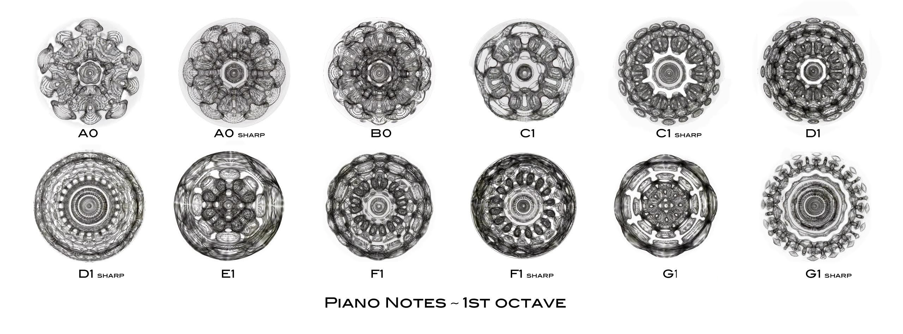
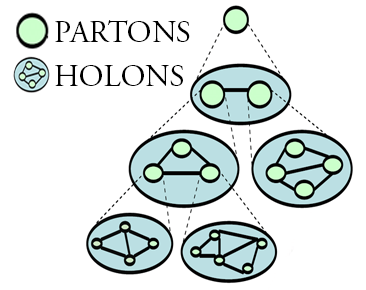
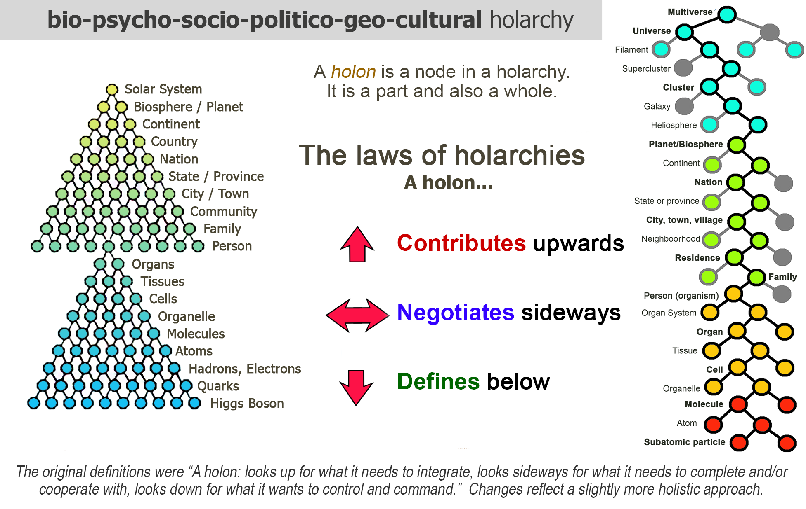
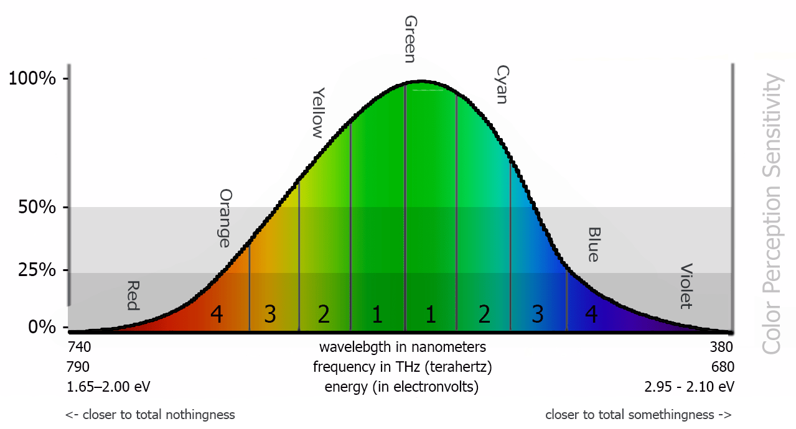

# 6: INFORMATION

###### Information follows the same rules as everything else in nature.

We see these same patterns in information as well.  How, then, do we define *information*?

### Data

Before we can address the definition of *information*, we have to address the definition of *data*.  To begin to answer that we can say there is no data in the void of nothingness.  Data can only exist within the duality where energy oscillates within finite boundaries in accordance with specific laws of existence.  So, what is the difference between data and existence itself? Data is the static byproduct of the movement of energy.

#### **Claim 31:** Data exists only in a duality.

In its most basic form, data is numbers, words, units of measure, and other conceptual abstractions we invented to describe the phenomena within the spectrum of existence we can perceive and use.

If we accept the premise that everything that exists does so within the laws of creation, then we also need to accept that nothing exists that is not in perfect harmony with these laws because if they were not in perfect harmony with the laws they would not exist.  Therefore, everything that can exist does, and everything that cannot exist does not.  If that is true, then it is also true that all data is as valid as existence, as data is only a byproduct of existence.

#### **Claim 32:** Data is the byproduct of existence that we represent with conceptual abstractions.

#### **Claim 33:** All data is valid

What, then, is information? The classic and simplest definition is &ldquo;*data that we can use to understand something*&rdquo;, which is just another way of saying &ldquo;*Information is data that has meaning.*&rdquo;

### Understanding

This raises the question *&ldquo;What is understanding?&rdquo;* Again, the traditional meaning is *&ldquo;the knowledge of why or how something happens or works.&rdquo;* This is pretty unsatisfactory, and quite arguably wrong.  At the risk of sounding Clintonesque here, debating what the definition of &ldquo;is&rdquo; is, the words *&ldquo;use&rdquo;* and *&ldquo;understand&rdquo;* are completely subjective and offer no real definition, and with the word &ldquo;work&rdquo; defined as simply *&ldquo;to function or operate according to design&rdquo;*, this entire definition is vague, as best.

Can we come up with a better definition of the words *knowledge* and *understanding*?

To know something&rsquo;s function and purpose is the fundamental goal of the science, philosophy and even religion, as these disciplines require a demonstrative understanding which we can see in their relative forms of reasoning.

Like in the dancing-woman-in-the-dots example, we can perceive something that is little more than subjective projection and has no basis in reality.  In fact, it is this human ability to &ldquo;recognize&rdquo; things in meaningless images that brought about the famous Rorschach inkblot test as it seemed to be a good way to see how a person perceived the world by seeing what patterns they projected onto the random images.

In the world of philosophy, this knowledge-as-projection is exemplified in the *cow in the field problem* first posed by American philosopher Edmund Gettier.  It goes like this:

> A farmer is concerned his prize cow has gotten lost.  A neighbor comes to the farmer and tells him he saw the cow in his field.  Just to double-check.  the farmer visits the neighbor&rsquo;s field and sees the familiar black and white shape of his cow.  Satisfied, he goes home.  The neighbor also decided to check.  The cow is in the field, but it&rsquo;s hidden behind some large bushes.  Caught in the bushes, however, is a large sheet of black and white paper.  It is clear that the farmer saw this and thought it was his cow.  The question is then: even though the cow was in the field, was the farmer correct when he said he knew it was there?

This was meant as a criticism of the popular definition of *knowledge* as *justified true belief*, meaning, if you believe something and it is both factually true and verifiable, then that is *knowledge*.  This is a terribly misguided post-modern idea of knowledge, in my humble opinion, because by this definition the dancing-woman-in-the-dots *is* knowledge, as it satisfies all three conditions.  By this definition, *understanding* is vulnerable to subjective perception, which is wildly unreliable, at best.

Simply *knowing* the details of a situation is not the same as *understanding* them.  We can see this in the countless cases of confusing or challenging situations that demand critical decisions that inevitably fall prey to our conscious or unconscious beliefs, desires, and fears.  We can see this difference even in less dramatic situations, such as the knowing all the details about camping, and actually camping, or the difference between the map and the terrain.

Therefore, a better definition of understanding might be &ldquo;the knowledge of something sufficient enough to be able to make verifiably accurate statements regarding said thing.&rdquo;

### Verification

But this too falls short depending on what *verifiable* means.  For example, four people have to solve the following puzzle:

What is the next number in this sequence? 91715

Bob says &ldquo;1&rdquo;, and Carol says &ldquo;3&rdquo;.  Bob defends his answer by showing the obvious; that 71 is 20 less than 91, therefore 51, being 20 less than 71, is the obvious pattern.  Carol, however, says it is 3 because 917153 is, in fact, a sequence of numbers in *pi* (&pi;).  Ted also says &ldquo;1&rdquo; but because 9+1=10, 7+1=8, therefore 5+*x* = 6, so *x* must be 1.  Alice says &ldquo;9&rdquo; because that would result in three prime numbers 11, 13, and 17 using the 2D lattice she made to solve the problem.

All four people have an understanding of the problem and the ways in which it can be solved, and therefore all four answers are verifiable.  It&rsquo;s not unlike when you ask a child what is 1+1, and she confidently answers &ldquo;Six.&rdquo; When asked why 1+1 = 6 she says: *&ldquo;I had one white cat and one gray cat, now I have six cats; two white cats, two gray cats, a black cat and a cat that is all colors&rdquo;* referring to her two cats and their 4 new kittens.  Not only did 1+1 equal 6, but it came in many colors.

As silly as this sounds, her answer was quite accurate given the context and the scope of a child&rsquo;s understanding and the context of *&ldquo;1 (female cat) + 1(male cat)&rdquo;*, which is not at all an irrelevant detail, especially to the cats.  We can see the &ldquo;error&rdquo; here as the child not being able to properly identify the differences between the overlapping contexts of math and animals.  We should not be quick to judge this child because we have to assume that even the greatest thinkers will make the same &ldquo;error&rdquo;, albeit with more complex contexts, because this discernment is a product of our neurology, the brain being a big pattern recognition machine.  Unless we have the ultimate brain, we can&rsquo;t recognize everything.

Understanding is contextual and only relevant to the degree that it applies to the matter in question and why the question was asked in the first place.  Even the concept of &ldquo;1&rdquo; is contextually relevant.  We may have 1 dollar or 1 day, but what does 1 mean if we say we have 1 puddle plus 1 puddle? We either have 2 puddles, or, if they are connected, we have a 1 big puddle, and now &ldquo;2&rdquo; is the not the unit count of puddles, but the relative volume of the puddle, i.e.  1 puddle that is 2 times as large.  If we drop 1 rock into a lake, we have 1 wave function.  If we drop 2 rocks in a lake we have 2 wave functions that interfere with each other. So we could say:

&ldquo;1&rdquo;= as this is the general description of a wave.

&ldquo;2&rdquo;= as this is the description of two wave interfering with each other.

The fact that whatever was needed to have taken place for there to be one of them did take place is so obvious we take it for granted.  But what happens if we take 1 particle traveling at *x* speed, and smash it headfirst into another particle traveling at *x* speed? You might think that the particles smash into each other at the speed of *2x*, but you&rsquo;d be wrong if *x* was the speed of light, because, at the speed of light *1+1 = 1* in this case, at least according to the Theory of Relativity.[^46] More specifically, the product of the two opposing speeds when multiplied together can never *appear* to exceed *c^2^*. Reality, as we know it, depending on the context of not only what is happening, but all that has happened before it, in whatever contexts the contributing events happened in. Our understating of anything can never be anything but relative to our context and is only valid within that context. 

So, let&rsquo;s modify the meaning of understanding to the following claim:

#### **Claim 34:** Understanding is &ldquo;the knowledge of something sufficient enough to be able to make verifiably accurate statements regarding said thing within the context of its current application.&rdquo;

With this definition, Bob, Carol, Ted and Alice can all make statements based on their understanding, but none of them are verifiable unless we know why the question was asked.  If the point was to see if they had reasoning abilities, they are all right, and so was the little girl, according to their relative reasoning abilities, and the specific question itself is irrelevant as any number of questions could be asked to get the same results.  If the point of the question was to try and recover the last digit of a telephone number, there&rsquo;s a 10% chance any one answer is correct, including the little girl&rsquo;s answer, and the question was still meaningless.

We can now answer the question &ldquo;How do we define *information*?&rdquo; If we accept that all data is valid and is therefore *information* that is merely undiscovered due to our limited understanding of its relevance to context, *information* now can be defined as the following claim: 

#### **Claim 35:** Information is &ldquo;relevant data that we know how, when and where to apply given our understanding of the applicable context.&rdquo;

In short, information is *relevant data*.

## Data to Information

Data, being an abstract byproduct of everything, is, by itself, meaningless, just as the existence of matter is, by itself, meaningless.  Data alone is the conceptual equivalent of chaos.  It creates nothing, has no energy, meaning, direction, form or pattern.

#### **Claim 36:** Data alone is chaos.

Information, at least one form of it, is when we can find patterns or laws in the chaos of data, or when we can apply data to an existing pattern or law.  We can go so far as to say *information* is the result of energy being applied to data.

There are many examples of this in nature, of order emerging out of chaos.  The simplest example is the *standing wave pattern*.

### Standing Wave Patterns

For those who do not know what a *standing wave pattern* (SWP) is, it is a stable pattern that results from cycles of energy, transmitted as waves, interacting with matter.

Here is a collection of SWPs that were created by placing white powder on a drum head and exposing that drum head to various stable sounds, like a single tone, or a collection of single tones.  This process is called *cymatics*.

Here are some more complex cymatic patterns from the twelve notes of the first octave of a piano.

The difference between data and information is analogous to the difference between chaos and order, that difference being exclusively energy.

We have moved from *data* to *information* to *knowledge* to *understanding* in the following manner, more or less.

- Data + *order* = information
- Information + *context* = knowledge
- Knowledge + *application* = understanding

What comes next? How do all these *understandings* we have discovered relate to one another?

Attempting to answer this question is what gave rise to the entire field of Western philosophy.  In fact, the word *philosophy*, which literally means &ldquo;love of wisdom&rdquo;, was invented 2,600 years ago by the Greek mathematician, philosopher and religious mystic, Pythagoras, as the field of study dedicated to understanding how reality is put together.  A few years later, Parmenides, perhaps the most profound and challenging thinker of the Greek philosophers, came up with the idea of categorizing all that was understood about existence.  Today this is called *ontology*, which is hierarchical in nature and comes from the Greek &ldquo;the study of that which is.&rdquo;

#### **Claim 37:** All information is hierarchical.

Needless to say, there has been a lot of discussing, researching and testing over the past thousands of years on the best way to organize &ldquo;that which is.&rdquo;

## Holarchies

In 1972 Ervin Laszlo, philosopher, theorist and two-time Nobel Prize nominee, published &ldquo;Evolutionary Systems Theory.  Introduction to Systems Philosophy: Toward a New Paradigm of Contemporary Thought.&rdquo;[^47]In that book, he incorporates *Living Systems Theory* and the hierarchical structures of Mario Bunge, a giant in the field of semantics, ontology, epistemology, philosophy of science and ethics, and recipient of twenty-one honorary doctorates and four honorary professorships by universities from the Americas (North and South) and Europe.

Laszlo&rsquo;s challenge was to provide a framework for understanding universal structures that span the scopes of subatomic physics, through biology, chemistry, organisms, and social systems to the cosmos.  Laszlo describes a hierarchical model of interconnected conceptual entities.  When one of these entities is acting as a *part* of a larger entity, it is called a *parton*, and when acting as a *whole* entity with its own parts, or *partons*, it is called a *holon*.

The *holon* represents the *wholeness of its nature*, and the *parton* represents the integrated *part* of the greater *holon*.  The hierarchical ordering of *holon/partons* is called a *holarchy*.  An example of this is the biological cell mentioned previously.  The cell itself would be a *holon*.  The transcoder and other components necessary for the cell to function would be considered *partons*.  Likewise, the transcoder is also a *holon* with its component *partons*, and the cell itself is a *parton* to, say, an organ.  This makes the holarchy somewhat fractal in nature as the structure of the entire hierarchy is self-replicated in each of the holons.

#### **Claim 38:** The structure of information is fractal (self-similar and redundant)

The holarchy is a map of all the concepts of archetypes we have collected and attempts to organize these concepts in a hierarchical fashion.  As each parton is a child of a holon it naturally inherits the scope of its parent.  It is these scopes that define the order.  Each holon has a unique scope, and this scope is what defines the spectrum of possibilities, the Bell curve of probability, for any particular holon.  For example, within the holon of *person,* you will only find *person* things and not *planet* things.

The graphs above represent a very small subsection of the Grand Holarchy of Everything.  The chart on the left shows a larger picture of how partons and holons relate to one another.  The chart on the right shows one of the many paths that connects subatomic particles to the multiverse.

With a few tweaks to the previous *Super-Duper Graph of Reality* Bell curve, making the right axis more logarithmic rather than linear, this model fits nicely on top of it.

Some readers may be thinking &ldquo;Hey, wait a minute&rdquo; those aren&rsquo;t the same axis! What kind of Gaussian goofiness in going on here?&rdquo; Well, that is partly true.  The first Super-Duper Graph of Reality chart shows the probability (x-axis) of where order (y-axis) will be more likely to emerge across the entire spectrum of existence while this one is limited to the spectrum of human perception.

*Sidenote: This Super-Duper graph is also a bit out of alignment if we consider that the general size of living things on planet earth is pretty much in the middle of the scale between an atom and the size of our sun, which supports the same idea that the most optimum form of expression will exist in the most balanced state between opposing poles if we consider the sun as a major contributing factor in defining the scope of our earthly reality.  As this graph is based on concepts rather then size, we only see a general relationship with size.  Still, given the quark has a size of about 10^-18^m, and a supercluster is around 10^+18^m, our conceptual map is not too far off from the an actual size map.*

If we assume that our perceptions of reality are fairly compatible with reality as it actually exists, then, as probability would have it, we humans happen to be in the part of the spectrum where one would most expect to find life popping up, so, congratulations to us, we&rsquo;re where we are supposed to be&hellip; probably.

Because the peak of the curve represents where the most &ldquo;work&rdquo; will be done (given the two poles that define the limits of the curve), it is also where energy will most likely be able to form sustainable patterns.  The peak of the curve also represents the most efficient expression of a holon&rsquo;s purpose and function.  If we were electrons instead of humans, our archetypal holon would have the electron in the center, because, as the electron *does* exist, it would naturally occupy that point where its existence is most likely&hellip; in the peak of the curve for the electron holon.  However, because life forms exist in the peak of the curve that spans from quark to multiverse, perhaps we can speculate that life itself is the primary function of reality and that the consciousness that comes with life being the highest form of expression of life.  This is not to say that there are no other forms of life that may excel in this regard, especially where radically different contexts may apply, but if there are other forms of life in our corner of the universe, they will most likely appear within the same range of the curve.  More then appearing in the same area of the curve, they will probably appear similar to their earthing cousins.  If the Pleiadians (or wherever UFOs come from) ever land a UFO on the White House front lawn, we will all be surprised, and a bit disappointed I suspect, when what emerges looks like… a human.  At least that is the opinion of an Oxford University&rsquo;s evolutionary biologist Sam Levin.

>[Aliens, like humans] are made-up of a hierarchy of entities, which all cooperate to produce a [lifeform].  At each level of the organism there will be mechanisms in place to eliminate conflict, maintain cooperation, and keep the organism functioning.[^48]

For consistency, here is the human eye sensitivity chart as well with the new y-axis and its shading, which represent a singular holon of *human eye* in the *bio* branch of the hierarchy.

#### **Claim 39:** Each holon has its own set of parameters, laws, and context and each holon has the ability to spawn new holons.

#### **Claim 40:** Holons, or archetypes, are interdependent on one another, as well as independent.

Another excellent example of both a holarchy and its self-similar nature is that of the neurological structure of the brain&rsquo;s  memory processes along with the structure of language that evolved out of that structure.  This also shows examples of the various scopes through which instances are expressed.

## Memes

More recently, this holarchical model was applied to Richard Dawkins concept of a *meme*[^49].  A meme is defined as:

> an element of a culture or system of behavior passed from one individual to another by imitation or other non-genetic means.

In Dawkins own words[^50] :

> &ldquo;Memes spread through the culture like genes spread through the gene pool&rdquo;

This is relevant at this point to demonstrate how the concept of a meme can be incorporated into a holarchy.  The original version of the  chart above comes from a Velikovsky paper on video games and their potential to increase intelligence.[^51] The part that is interesting is how Velikovsky puts the meme at the bottom of the cultural branch.  It is interesting because it defines a meme as a seventh-generation descendant component part, a particle, so to speak, of the *uber* concept of *culture*.  The meme here is analogous to what the electron is to the atom, or the atom to the molecule, or the molecule to the object.  He also puts *ideas* down there as well, which may be consistent with the way he is defining an idea.  In our case, we are defining *Ideas* (capital &ldquo;I&rdquo;), like forms, as the archetypal blueprint for many instances of ideas.  The idea of *&ldquo;Let&rsquo;s make a video game where people have to shoot each other&rdquo;* is an instance of the Idea *&ldquo;Individual or tribal competition and survival&rdquo;*, which also spawns such concepts as sports, war, capitalism, the idea of winning, etc.  The idea of *&ldquo;If I sin, I will burn in hell&rdquo;*, a very resilient and popular meme for thousands of years, is an instance of the Idea *&ldquo;We are judged harshly by our superiors for being self-serving&rdquo;*, which spawn such concepts as karma, judgment day, guilt, original sin, etc.

The holarchy examples shown above are portrayed as 2-dimensional bifurcating trees, but this model hides a lot of information, for if we zoomed in, we would see that within each holon is a collection of holons that share an idea, purpose, function, etc.  Each holon has its own parameters, laws, context, etc., and each holon, therefore, has its own Bell curve that shows where it is best suited to &ldquo;work&rdquo;, such as the Bell curve of the human eye sensitivity, which would be one holon of &ldquo;human eye&rdquo;.

These Bell curves of probability are not shown, or even defined, in the holarchic model.  The reason for that is because the holarchic model does not have the explicit concept of a duality, though it implies them.  As a result, the holarchy cannot show how the Bell curve of a holon is made up of the integrated aggregate of the Bell curves of its partons within the context of the holon.  It does show the parameters of the holon are defined by its parent, but the ultimate parent of the holon is the Multiverse, which is, in our view, the &ldquo;bottom&rdquo; of the hierarchy, for reality, as we know it, requires there first exists subatomic particles.  In some way, this is like arguing which is the &ldquo;correct&rdquo; way to view the earth, north at the top, or south at the top, but it does play an important role a little later.

What happens if we incorporate the idea of dualities into the holarchy?  Let&rsquo;s see, but first let&rsquo;s look at some important concepts behind *structure*.

[^46]: Hossenfelder, Sabine. &ldquo;**Dear Dr B: Does the LHC Collide Protons at Twice the Speed of Light?&rdquo;** Backreaction, 1 Jan. 1970, backreaction. <https://blogspot.com/2019/04/dear-dr-b-does-lhc-collide-protons-at.html>
[^47]: Laszlo, E., & Clark, J. W. (1973). **Introduction to systems philosophy: Toward a new paradigm of contemporary thought**. New York, NY: Harper Torchbooks. ISBN: 0061317624 (ISBN13: 9780061317620)
[^48]: Levin, Samuel & Scott, Thomas & Cooper, Helen & West, Stuart. (2017). **Darwin&rsquo;s aliens.** International Journal of Astrobiology. 1-9. 10.1017/S1473550417000362.
[^49]: Dawkins, C. R. (2016). **The selfish gene**. Oxford: Oxford University Press.
[^50]: **Just for Hits - Richard Dawkins**. (2013, June 22). <https://youtu.be/GFn-ixX9edg>The first 4 minutes is an excellent overview of memes by Dawkins. The following 4 minutes is a sort of meme-ish music video which is a bit odd, but also a bit entertaining
[^51]: Velikovsky, J. T. (1970, January 01). **Flow Theory, Evolution & Creativity: Or, Fun & Games ** <https://dl.acm.org/citation.cfm?id=2677770>