

# 7: STRUCTURE

###### Knowledge and information, like form, has a structure which follows the same rules as form.

Everything up until now was to introduce some of the main concepts that we will be returning to and depending on as we move forward an into the main ideas that lead from the ultimate simplicity of a duality to more complex structures that describe the reality we actually live in.

On a practical level, this complexity is no different than how we deal with the physical world in our every-day lives.  When you hold a brick in your hand you are holding trillions of atomic particles, with countless interactions, fields, energy levels, etc., but you don&rsquo;t need to know that to build a house of bricks.  When you drop the brick and it falls, you&rsquo;re not thinking about the nature of time, gravity, and warped space.  Likewise, to manage the &ldquo;bricks&rdquo; in the realm of Ideas, you also don&rsquo;t need to know all of the details, but it is helpful if you have an understanding of how they generally interact with each other so you don&rsquo;t try and build a &ldquo;house&rdquo; made of &ldquo;bricks&rdquo; and &ldquo;oranges&rdquo;.

That said, let&rsquo;s touch on one more concept that is fundamental to structure in general.

## How Many Dimensions Are There? 

There are two concepts of dimensions to consider, *location* and *instance*.  

The location of a thing relates a thing to its environment.  When we say something has three dimensions what we are really saying is something that exists within the same multidimensional reality that we exist in, and under the same conditions, has three relative measurements of height, width, and length that indicate the difference between two relative points.

When we say a nail is two inches long, we are referring to the difference between the position of the head of the nail, and the position of the tip of the nail, for one axis only.  We have no idea what the universally absolute coordinate system is, but we assume it is the same for everything in our reality.

An object actually has many, many dimensions, it&rsquo;s just that the only ones that matter to us are the three we use, because all the other dimensions remain the same (enough) for all things that are in the same system (planet earth, for example).

Imagine that the speed of light was 55 miles per hour.  If you were to stand on the side of a highway, all the cars would look extremely squished, like a few millimeters in length, but the car&rsquo;s mass would also be much larger.  On top of that, time *inside* those cars would be much slower.  Space-time measurements would be very strange if we had to deal with two different space-time contexts.  Because everything we deal with exists in the same space-time context, when I need a part for my car delivered tomorrow that is 1"x2"x3", when I order it I am confident it will be 1"x2"x3" and arrive within 24 hours because I assume that whoever I ordered that part from lives in the same reality and context as me and is not an alien-owned intergalactic warehouse in the 4^th^ dimension traveling close to the speed of light through a worm hole.

The classic explanation of a dimension goes something like *&ldquo;If something has only one dimension you only need one number to know its exact location&rdquo;.* In the case of 1-dimension, like in the number line below, if there was a dot on number 6, the dot has a dimension of 6.

This is true when, and only when, the position of the measurer and the thing being measured share the same context, as the value of 6 is only relative to that context.  If we wanted to give the absolute position of the dot, we would need to include the coordinates of where in the universe that dot exists, which would require the coordinates of who-knows-how-many larger contexts it was in when it was measured; where on the planet, in the solar system, in the galaxy, in the multiverse, and all of those with the dimension of time, as they are all moving, and even then it would only be relative to the Universe as we know it.  So, even a simple 1-dimensional dot can have a lot of dimensions when measured from a different context.  Consider that when you realize that in every second of your life you travel at least 627 km/s across various dimensions and scopes if you account for the movement of the earth, sun, Milky Way, etc. 

The *instance* of a thing has nothing to do with its environment and only relates to the thing itself, which we describe using 3 dimensions.  

What can we say about what all *things* have in common? Well, we can say at least the following:

-   All things have 3, and only 3 dimensions.
-   All things are made of other things (except the &ldquo;first&rdquo; thing).
-   All things are the most efficient form of that specific thing.

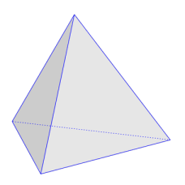

This last statement might raise a few eyebrows.  The claim here is not that any particular thing is the most efficient form of its perfect archetype, but rather the most efficient form for that particular thing under the conditions it exists in any particular moment.

If these statements are true, then this would imply that the most primitive thing that can exist, the simplest and most efficient form possible, is the tetrahedron.  It has 3 dimensions, but it is *not* made up of other things because when you remove any one point, it collapses to 2 dimensions, and no *thing* can be 2D.  Therefore, it must be the very first *thing* to come into existence, at least conceptually speaking.

As a pattern of order, it *is* one of the first to appear in nature.  In its most obvious form, we see this structure when we stack spheres on top of one another.  If we stack other shapes, the structure will be altered to the degree the shape is not a sphere, but the tendency for all things that are connected to each other will be to form a tetrahedral structure to the degree the shape of the things connected will allow.  You may be thinking &ldquo;*Well, spheres form tetrahedrons, but cubes form squares*&rdquo;, and while this is true, but because the sphere is a simpler, more efficient or primal form than a cube, the patterns it makes are also more efficient and primal, and therefore the first pattern of order that represent the path of least resistance.

If the tetrahedron is the first thing that can be created, this would suggest also that every *thing* that exists is ultimately made of tetrahedrons, and that they are the smallest *thing* that can exist (again, conceptually speaking).  This might sound like a radical departure from our current thinking, but it&rsquo;s not *that* radical a departure as this is exactly what *Emergence Theory: A Theory of Pixelated Spacetime&rdquo;*[^52] claims as well (more on that in a moment).

> In our 3D quasicrystalline reality, the tetrahedron is the smallest, indivisible unit.  A 3D pixel of reality, if you will.  Each tetrahedron is the smallest possible 3D shape that can exist in this reality: the length of each of its edges is the Planck length (the shortest possible length known in physics – over 10^35^ times smaller than a meter).  These 3D pixels combine with one another according to specific, geometric rules, to populate all of space.  **~ &ldquo;Emergence Theory Overview&rdquo;.  Quantum Gravity Research[^53]**

The tholonic model that that this book describes suggests that the rules that apply to these 3D pixels that populate all of space extent beyond space to all of reality, including the invisible worlds of ideas, archetypes, and all forms of energy.

## On the Small Side

Science has been grappling with the idea of tiny particles for some time.  First, we had the grains of sand and dust, then atoms, then electrons, protons, and neutrons, then finally, quarks, which, so far, seem to be the most fundamental layer of matter.  The problem is, quarks are &ldquo;almost&rdquo; infinitely small, which creates all sorts of problems because science has a difficult time with infinity.  To solve this, they came up with the idea that reality is made not of really tiny particles, but really tiny vibrating 11-dimensional &ldquo;superstrings&rdquo;. Unfortunately, for all the evidence they have found to support this theory they might as well have said reality is made up of angels dancing on pinheads.

The quark remains the undefeated champion of tinyness, but &ldquo;almost&rdquo; infinitely small is not the same as infinity small.  How &ldquo;almost&rdquo; is it? One 43 billion-billionths of a centimeter (0.  43 x 10^−17^ meters).  Remember that number, 10^−17^.

## On the Big Side

Jumping to the other end of the scale we have some pretty big things in the universe, the largest we know of being the *Hercules-Corona Borealis Great Wall.* This is a gravitationally bound galactic supercluster about 10 billion light-years wide.  That is pretty, pretty big.  What could be bigger than that? How about something with 4 dimensions? Would an extra dimension increase the size of something? Well, is a 2x2x2 cube bigger than a 2x2 sheet of paper, and is a 2x2x2x2 hyper-cube bigger that a 2x2x2 cube? What would a 2x2x2x2 cube look like? In the 3D world, it would look like a regular cube, because we can only see 3 of the 4 dimensions, but turn it a little (in 4D space) and the 4D cube will appear as two 3D cubes, or a hexagonal prism, or rhombic dodecahedron, or a cuboid.

Here is what a hyper-cube (4D cube) looks like when it is rotated and projected onto a 2D space, like a shadow (orthographic projection).

What about something that is 5D, or 6D or 7D? Each one would be bigger by an order of magnitude.  How about something that is 248D? That would be very, very big.  If something was bigger than the Great Wall in 248D how big would it appear in 3D? About the size of a small travel bag!! OK, you&rsquo;re probably thinking *&ldquo;248D!? That&rsquo;s ridiculous!&rdquo;*

## Crystal Power

So, there&rsquo;s this magic 248-dimensional crystal (actually, it&rsquo;s 8 dimensional with 248 not-necessarily-spatial dimensional symmetries, but as an algebraic expression it is considered to have 248 dimensions&hellip; at least that is what I am told) called the *E8 crystal*, and this reality of ours is (presumably) but a number of 3D refractions of energy created by the various facets of this crystal that are cast upon the 3D canvas of the void that is our universe from the higher dimensions of magic-crystal-land.  As modern as this sounds, this was first proposed in the late 1800s, but it has only been recently that we have the computing power to give it a test drive.

This sounds pretty compatible with the Simulation Hypothesis.  I wonder if they know about each other? It also sounds crazy, I know, but, it&rsquo;s a real thing.  Just do an Internet search for &ldquo;*emergence theory tetrahedron&rdquo;* and *&ldquo;The theory of everything quantum symmetry E8 lattice&rdquo;* and browse through the million-plus links that discuss it in painful detail, emphasis on the *painful* part, because most of the content is unintelligible to those not intimately familiar with the algebra of differentiable manifolds, quantum gravity and a bunch of other stuff I don&rsquo;t even know how to reference.  However, that is not important to know for our purposes.

It should be stated that this theory is not accepted by all, and some scientists are definitely in the &ldquo;swarming with worms of heretical perversity&rdquo; camp regarding the magic crystal of reality.  I don&rsquo;t have any opinion about the Emergence Theory (ET) other than it sounds fascinating, mainly because I am not qualified to have an opinion.  The only reason it is being mentioned is because ET supports many of the tholonic claims that are made here, which were arrived at with no knowledge of ET.

This E8 lattice (that&rsquo;s its technical name, also called a *quasicrystal*, but *magic crystal* sounds much cooler) seems to be able to describe all sorts of things: space-time (both types, Minkowski and Kaluza-Klein versions.  Yes, we have two types of space-time, because it&rsquo;s always better to have options), fermion particles, gravity, subspace, dark matter, quarks, positrons, neutrinos, Fibonacci relationships, and a bunch of other stuff, including &ldquo;ghost particles&rdquo; (which are really, really old neutrinos that were created during the Big Bang 15 billion years ago and have no charge, no mass and do not interact with any of the forces that form matter, just like regular ghosts, but really small and old).

Here is a page from a paper[^54] that describes the E8 lattice.

As you can see, the whole space-time part of the E8 lattice is just a small part of one of the 3D projections of an 8D slice of a 248D super-thing, leading one to wonder what other forms of reality it has the magic power to conjure up.  Not surprisingly, this E8 lattice can be deconstructed to (or perhaps is constructed by) a series of tetrahedrons.

A significant aspect of *Emergence Theory* (for us) is their claim that:

> &ldquo;all of reality is made of information.  What is information? Information is meaning conveyed by symbols.  Languages and codes are groups of such symbols that convey meaning.  The various possible arrangements of these symbols are governed by rules.[^55]

Here are a couple of beautiful images of the countless faces of the magic E8 crystal to ponder.[^56]

Just as a fun comparison, check out the following cymatic patterns.

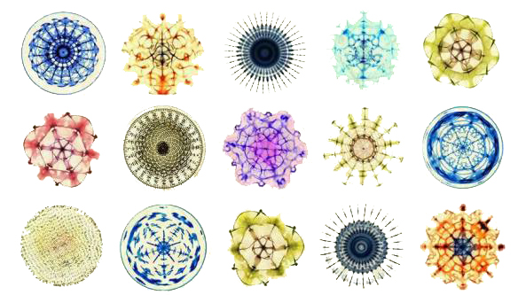

The E8 crystal of *quantum symmetry* and *emergence theory* hypothesize that all matter is a projection of countless &ldquo;pixels&rdquo; that are really, really small tetrahedrons[^57], each about 1.61 x 10^-35^ meters in size.  Remember the size of a quark, 10^-17^? This is a *lot* smaller.

It might sound like this is mixing apples and multidimensional oranges, using definitions from *emergence theory* on one side of the scale, and definitions from *quantum symmetry* on the other side, but both of these theories integrate quantum mechanics, general and special relativity, the standard model and other mainstream physics theories to form a complete, fundamental picture of a universe unfolding from implicity to explicity.  The main difference between these two models is that the *E8 Crystal* describes the mechanics of creation, while the *emergence theory* attempts to describe the syntax of its operation using the language of geometry.

#### **Claim 41:** Geometry and mathematics are the language of archetypes.

Here we have a duality that encompasses the entire spectrum of 3D reality, at least.  On one end, the *alphahedron*, which is the smallest structure theoretically possible, that being the tetrahedron, and on the other end, the *omegahedron*, the most complex physical structure in existence, which currently seems to be the 248D-ish magic crystal.

## The Structure of Knowledge

Now we can begin to integrate dualities into the holarchy.

#### **Claim 42:** Just as subatomic particles are structured energy, atoms are structured particles, and molecules are structured atoms, information is structured data, knowledge is structured information, and ideas are structured knowledge.

#### **Claim 43:** The concept of a thing and the thing itself are the same things on two different levels of order.

Both scopes of matter and ideas represent how a form of pure energy in its chaotic state is converted into order using the same laws as they apply to the relevant contexts of their scope.  In one case,  energy is ordered and expressed as matter and in the latter case as concepts.  This is how it relates to holarchies, as holarchies can map not only the naturally occurring hierarchy of the concepts of *reality* (atoms, plants, people, etc.) but also the concept of *concepts* (domains of science, religions, culture, etc.).

If we applied our ideas regarding duality to the holarchy it would look something like this graph (above): We start with a concept *XY~0~*, followed by its thesis *Y~1~* , which creates its antithesis *X~1~* .  Within this duality of *X~n~* and *Y~n~* , or thesis and antithesis, arises the synthesis that acts as the seed for a new concept *XY~1~* .  The holarchy can only accommodate the central column of concepts as it has no model of a concept being born within a duality.

This graph only shows one instance per duality, but there could be many, many instances for each duality, the occurrence of which conform to the Bell curve as defined by the *X~n~* and *Y~n~* limits of each new pair.

Some readers might recognize this graph as looking very similar to the mystical Kabbalah, or the Tree of Life, as it is also called, which has its roots in ancient Sumer.  There was no intention to arrive at such a comparison, but these similarities naturally arise whenever we are using reason to explain how reality works regardless of its understanding being scientific, mystical, or otherwise.  Any system that has order will follow a pattern, and we can see these same patterns over and over again, from the electron to the galaxy, from flowers to computer networking.  Our explanations of how realities work, whether we believe it was created by God in six days, or it&rsquo;s all a very sophisticated holographic projection, will have the same patterns of reasoning, albeit with different back-stories and interpretations of the significance of those patterns.

## Knowledge by any other name

We tend to think that ancient ideas were not based in science, at least in the way we describe that word today.  This is partly true, in that we had not yet discovered the laws of nature to the degree, or in the manner, we now have, but we can find incredibly sophisticated reasoning and logic in some ancient ideas.

Take two examples mentioned above, the Taoist I-Ching and the Kabbalah.  Both have a tremendous body of impressive intellectual reasoning, and both are descriptions of the same larger concept of a reality that exists in a duality as seen through the contextual cultural lens of understanding.  While the Kabbalah is a top-down model of creation that describes 32 archetypes made up of 10 archetypal states of existence with 22 archetypes of energy that connect these states, the I-Ching is a fractally bifurcated whole of 10 pairs of balanced states and 22 pairs of imbalanced states that describe 32 pairs of archetypal states of the Tao.

The story of the I-Ching and Gottfried Wilhelm von Leibniz, the co-inventor (along with Newton) of differential and integral calculus, is a fascinating story that exemplifies this cultural lens.  It&rsquo;s a bit of an aside, but it&rsquo;s relevant and worth the read.

### Leibniz

When the Jesuits, reputed to be the intellectuals among Christian missionaries, traveled to China, they were so fascinated by the I-Ching that they brought it back to Europe in the late 1600s.  It was here that Leibniz saw the I-Ching and claimed it to be sent to him by God.[^58]

Just prior to seeing the I-Ching, Leibniz had developed (discovered?) a number system that he considered sacred.  It was the binary system of 0s and 1s, much like the Yin/Yang of the I-Ching.  It was of no practical use to anyone at the time, but that was not why he developed it.  Leibniz, a very pious man, thought that if all values could be expressed in terms of only something and nothing, on and off, yes and no, positive and negative, etc., then truly, this would be the language of life, for, as he thought, God the Creator was represented as 1, while the void was represented as 0.

Leibniz's principal work on this topic was his ideas on *monism*, as he called it.  In short, he describes how each substance is *programmed* to act in a predetermined way and is integrated with all other substances according to a preexisting *archetypal* harmony. The most, and only essential substance was the simplest, which he described as  &ldquo;that which is one, has no parts and is therefore indivisible" and from which all other substances emerged from, i.e. God. 

At the same time he was inventing this *divine math* meant to explore the hidden secrets of reality, he was also inventing the first mechanical calculator suitable not only for addition and subtraction but for multiplication as well.  His dream was to make a logical thinking device.[^59]

Leibniz was creating tools for exoteric and esoteric understanding, both based on the same logic, but within two very different contexts.

Some years later, in the middle of the 20th century, a group of modern-day holy men from the western world (called scientists), were building the first digital computer.  To synopsize the entire digital revolution into one paragraph, imagine one of these gurus saying: &ldquo;I&rsquo;ve got an idea.  let&rsquo;s develop a component that will act as a conductor when a certain amount of voltage is passed through it, and an insulator when no voltage is passed through it.  We will call this component a &lsquo;gate&rsquo;. Because this gate can only respond to one of two states, high or low voltage, yes or no, so to speak, which represents the most basic principles of reasoning, we will call it a &lsquo;logic gate&rsquo;. Any problem that can be reduced into so many yes-or-no conditions can be calculated by these logic gates.  We can use the numbers 1 and 0 to represent these states as digits.  Because the heart of these electronic machines will be made up of these yes-or-no circuits, we will call them &ldquo;*digital circuits&rdquo;*, and the digital computer as we know it today was invented.

If Leibniz was alive today to see his sacred binary math of 1s and 0s being used as the language of his of a &lsquo;thinking machine&rsquo;, ushering in the greatest transformation of knowledge ever known to Man, he would recognize it as both a tool of practical use as well as a tool of great esoteric potential, a key to the secret knowledge he was looking for.

### The Source of Ideas

We like to think we come up with ideas, but perhaps this is no truer than a flower &ldquo;deciding&rdquo; to change colors when exposed to different light, or a river &ldquo;deciding&rdquo; to change course because the wolf population has increased.[^60]

Although currently not a mainstream theory, the understanding that Ideas are more like expressions of living intelligences that we have a symbiotic relationship with is currently alive and well, and has been around for thousands of years.  Traditionally, these forms of intelligence and intention were anthropomorphized into deities, angels, demons, spirits, etc., and it was understood that we use them for our purposes, noble and otherwise, and they use us for their purposes, noble or otherwise.  Today we have new evidenced-based hypotheses of this same concept in the forms of panpsychism, morphic fields, collective (un)consciousness, Universal mind, etc.  From this perspective, all forms of life are simply instances of various Ideas and concepts that have instantiated themselves.

One of the fundamental differences in how similar concepts evolve over time is in what and how structure is applied to the idea.  Take, for example, the idea of the biblical creation story vs.  reality-as-a-simulation hypothesis.  We can see by their similarity that they are clearly the same concept, but one filtered and defined through the belief structures of Judeo-Christian doctrine and the other through the structured reasoning of modern science.

The above was a somewhat circuitous route to get to this point of looking at knowledge as a form of structured information, and how it is not only the basis of reason but the basis of existence as well.  It was stated before that the tetrahedron is the most fundamental concept of form.  We are going a step further here and also claiming that the tetrahedron is also the structure that information takes when it forms knowledge.

How would we begin to test such an idea?  We can start in the same way we would test the idea of a tetrahedron, by deconstructing it into its even more basic component, the triangle, and if we can discover a triad of information, we can form a tetrahedron of knowledge.  We have already seen one fundamental pattern (Newton's 2^nd^ Law) that discovers a 4^th^ point from any 3 points, so perhaps we can learn something more from just a triangle.

What follows are some example of how we might identify conceptual trinities in a wide variety of systems of knowledge and/or information.

### Language

In the realm of ideas, the most important tool that man has deployed has been language.  Language transmits the reasoning behind ideas; it is how ideas evolve, how they are destroyed and how they defend themselves (which, according to Dawkins, they do, as he explains in his book &ldquo;The Selfish Gene&rdquo;).  As such, we would expect to see language embedded with the same structure as that of ideas, concepts, and forms.

Humans are sort of stuck with the language we have been using for thousands of years, and if we were to (and when we do) invent a new language it would look radically different, but it would probably function similarly because all naturally evolved languages follow a law based on mathematical statistics that also approximate the same laws of science.  This amazing pattern of language was discovered in the 19^th^ century and is called Zipf&rsquo;s  Law (which when normalized is called the Riemann Zeta Function) and is fundamental to everything from the diffraction of light to the size of craters on the moon.  This is another topic, but the point here is that language evolves according to, and limited by, the same forces that drive all evolution, growth and change.

This applies to intentionally designed languages as well.  In 1968, Aristid Lindenmayer, a Hungarian theoretical biologist and botanist at the University of Utrecht, designed a symbolic language called *L-system* that incorporated various symbols that were bound by a set of rules.  He developed this language as a way to model and describe the behavior of plants and a variety of other organisms[^61].  The philosophy and architecture of the language were based on the observed logic of growth, i.e.  life.  Not coincidentally, this language describes self-similar systems.  This is the language of the future, but sadly, only for our digital offspring, at least not until we do some major gray matter rewiring upstairs.

Granted, L-System language is mainly used as a modeling language, but has an alphabet, grammatical roots and rules, like human language[^62].  This is brought up to show that organically evolved systems that have survived the challenges of sustainability, such as human language, exhibit similar characteristics to the highly ordered, structured, and hierarchical systems that describe life itself.

Although human language is surprisingly efficient and operates with the same structure that naturally exists in ideas and concepts, its efficiency is greatly due to our brain&rsquo;s ability to apply context and instantly run through many interpretations of words and sentence structure until it finds the most applicable interpretation.

Take the following sentence:

> I can&rsquo;t untie that knot with one hand.

The meanings of words, their order, the context of who is speaking and where they are, along with many other details, come into play to turn that sentence into structured information, or knowledge, in our head.  It is our brain&rsquo;s language processing ability that converts the often messy structure of words into meaningfulness.  Were language more structured we might say this sentence as 

> Not [I [Able [[[Make [Not [Tied]]] [That knot]] [With One Hand]]]]

Although we don&rsquo;t speak this way, this is more or less how the brain re-patterns the concepts to discern meaning.

There is such a language which was developed to specifically optimize the transmissions of concepts.  It&rsquo;s called *Ithkuil*[^63].

In Ithkuil, you can say &ldquo;On the contrary, I think it may turn out that this rugged mountain range trails off at some point&rdquo;, in the following manner:

Another is *Ygyde*, for example:

which translates to &ldquo;Yesterday evening he did not see a green tree&rdquo;

I doubt we&rsquo;ll be adopting these any time soon, but they are still fascinating.  Given what we know about the parallels between language, neurology, and the nature of growth and evolution, such new languages may provide insight into the creation of patterned information systems (which includes reality).

Regardless of the language, they all depend on semantics, which is what makes any language work.

### Semantics

Semantics is the branch of linguistics and logic concerned with meaning, but there are two kinds of meaning, according to the Theory of Meaning[^64].  The first kind is the more common definition of semantics.

> The description of possible languages or grammars as abstract semantic systems whereby symbols are associated with aspects of the world.  (a more objective view)

An example of this type of objective description might be the following bifurcating graph of a simple sentence.

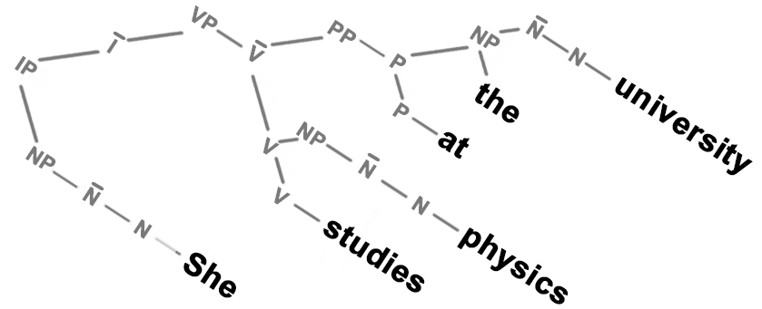

The second kind is more relevant (to us).

> The description of the psychological and sociological facts whereby a particular one of these abstract semantic systems is the one used by a person or population.  (contextual relevance)

The *semantic web* is an Internet based project that applies these concepts in an attempt to define what information &ldquo;is&rdquo; in a manner that is structured so that computers can read data and know if it is information and, more importantly, why it is information.  It does this by creating a relationship (called a predicate) between two things (called objects).

Take the example of the following sentence:

> &ldquo;Bob is interested in the Mona Lisa.&rdquo;

To a human, this is information because we know how to parse this sentence into meaning.  That is what learning to speak is all about.  To a computer, however, it is just a meaningless collection of 1s and 0s.

If we break this sentence up into three parts and define each part in a way that software can understand, then a computer can attempt to find meaning in it.  For example, we can tell the computer that we have two &ldquo;things&rdquo;, &ldquo;*Bob&rdquo;* and &ldquo;*Mona Lisa&rdquo;*, and one &ldquo;relationship&rdquo;, &ldquo;*is interested in&rdquo;*.

With these three data points, three &ldquo;atoms&rdquo; of data, we have the simplest form of information, an information &ldquo;molecule&rdquo;, so to speak.  The &ldquo;things&rdquo; are the *objects*, and the &ldquo;relationship&rdquo; is the *predicate*.  Together they are called a *triplet*.  We may have some other triplets about Bob, such as, he is a person, he is a friend of Alice, etc., and we can bind these triplets together quite naturally.

Predicates can be just about anything: &ldquo;lives in&rdquo;, &ldquo;has a&rdquo;, &ldquo;enjoys&rdquo;, etc.  Objects, however, are part of much larger, more structured hierarchies, much like the holarchies described above.  Using predicates and objects we can now *graph* our sentence (above right).

How does a computer know what &ldquo;*is interested in*&rdquo; or what a &ldquo;*person*&rdquo; is? It doesn&rsquo;t &ldquo;know&rdquo; the way you or I know, but it does know that a *person* is a type of *agent*, has a *family name*, a *first name* and that a person *knows things*.  So, as far as a computer is concerned, a person is just a data-set with a bunch of specific properties and relationships to other data-sets.[^65] These definitions and relationships are defined in a hierarchical manner.  These are (and are called) *ontologies* (if you recall, this is the &ldquo;the study of that which is&rdquo; that was originally developed by Parmenides based on the works of Pythagoras).  There are thousands of these ontologies of definitions run by corporations, governments, individuals, schools, the military, etc., that cover an incredible array of data in areas of geography, life sciences, linguistics, media, social networking, medicine, catfish, diseases, road-maps, accommodations in Tuscany, etc., and they can all talk to each other by linking *triplets* together*.*[^66]

As you can imagine, a computer can create millions of connections between triplets with little effort and in a very short time.  With all these connections, we can ask the computer typical questions like &ldquo;*How many romantic comedy Hollywood movies are directed by a person who is born in a city that has an average temperature above 15&deg;?*&rdquo; Of course, social media companies, who have their own data that they aggressively collect from their users, can ask questions like &ldquo;*Give me a list of all the boys who are eligible to vote in the next election, and who listen to Seattle grunge bands, are politically left-wing, and have friends and family that are politically progressive.*&rdquo; More worrying are the queries of the near future, such as &ldquo;*Tell me all the names of people that are likely to commit a crime in the next week.*&rdquo; That may sound like paranoia about a dystopian future, but AI systems in China have an 80% success rate in predicting who is a criminal just by looking at them.  At Stanford University they have developed AI system that has a 91% accuracy rate of determining if someone is gay or straight[^67], and that is just the beginning.

Language is based on rules of nature and can be deconstructed into triplets, and we can see these same rules applied to both the physiology required to support language, and the language itself.  In fact, Stuart Hameroff, the American doctor and professor at the University of Arizona known for his studies relating consciousness and quantum mechanics, has directly mapped the formation sentences onto the relationships of microtubules via *tubulin proteins*.

It is also quite fascinating, though not surprising, that this information encoding is the result of the bifurcated tree structure of tubulin proteins interacting with hexagonal structures called *Ca2+/calmodulin-dependent protein kinase II*, or *CaMKII*.  The significance of binary trees and hexagonal structures will become increasingly apparent as we go deeper into the mechanics of awareness.

#### **Claim 44:** Information must relate to something.

## Supply Chain

Here is another real-world example of a current project that is being developed with economists, world leaders, and investors, that attempts to model the supply chain in a holistic manner in order to show how environmentally sustainable solutions can be more profitable than unsustainable solutions over the long term, and how small details along the chain can have global consequences.

The project started out with reams of data from every sector of the economy, every mode of transport and delivery, distribution, allocations, etc.  It was little more than a random pile of data in the form of spreadsheets, various databases, government and industry reports.  The researchers sifted through this data looking for patterns, relationships, and dependencies.  What eventually emerged were sets of conceptual &ldquo;triplets&rdquo; with their corresponding instances and the relationships and rules that existed between them.  The researchers had no knowledge of holarchies, yet what they developed was quite similar.

Here are some (somewhat simplified) graphs taken from this project that describes the relationship between *resources*, *location*, and *sector* using the instances of *water*, *Argentina*, and *agriculture*.

When modeling all elements of the supply chain they ended up with the following visual representation of the model, with each color representing one of the three concepts that define each context or level.  For example, one of the sets of three circles represents *resources&harr;location&harr;sector* level, with a real-world data-set of *water&harr;Argentina&harr;agriculture*.  Within one of the inner circles, such as agriculture, is information about *product&harr;production&harr;transport*, such as *tomatoes&harr;kilos/yr&harr;import/export*.  In the end, they were able to calculate the environmental, economic, and social impact that one potato had at every stage of its journey from a spud on an Argentine farm to the garbage bin at a restaurant in Paris.

You can clearly see the triplet and holarchic design of this representation of the supply chain in the image above (left).  This would be expected if you considered a supply chain as a large-scale version of a living system.  The image on the right seems to confirm this, or at least suggest that the brain and the central nervous system is an organic living instance of a large-scale supply chain of three levels of embedded interdependency.

## Law of Laws

Earlier we used Newton&rsquo;s 2^nd^ law as an example to show how one law has many contexts, but Newton&rsquo;s 2^nd^ is only one of the three laws of *Newton&rsquo;s laws of Motion*.  These Laws are:

1.  Every object in a state of uniform motion will remain in that state of motion unless an external force acts on it.
2.  Force equals mass times acceleration.
3.  For every action there is an equal and opposite reaction.

These are not simply three isolated laws, but rather three attributes of a greater phenomenon that describes all matter.

*(Later we show why these laws should be in the order of \#3 first, followed by \#1 and then \#2).*

We can see this trinity of concepts in any structured system.  Other examples might be:

## Psychology

Again, we see this same structure remarkably represented in the classic reinforcing loop between thinking, feeling, and doing, which is the basis upon which Cognitive Behavioral Therapy is built (we&rsquo;ll refer back to this a bit later).

## Music

The relationship of music to trigrams is so profound that it deserves a book unto itself, and many have been written, so I will only share that entire theories of music are modeled on the trigram, such as the *Tonnetz* (German for *tone-network*) model, which is a conceptual lattice diagram representing tonal space first described by Swiss mathematician, physicist, astronomer, geographer, logician and engineer, and one of the greatest thinkers of modern history, Leonhard Euler, in 1739.  Modern music theorists take it a step further; that of a 2-dimensional map of trigrams mapped to a spinning torus… wow!  *Note: This model of music is also referenced in the chapter &ldquo;Predeterminism&rdquo;.*

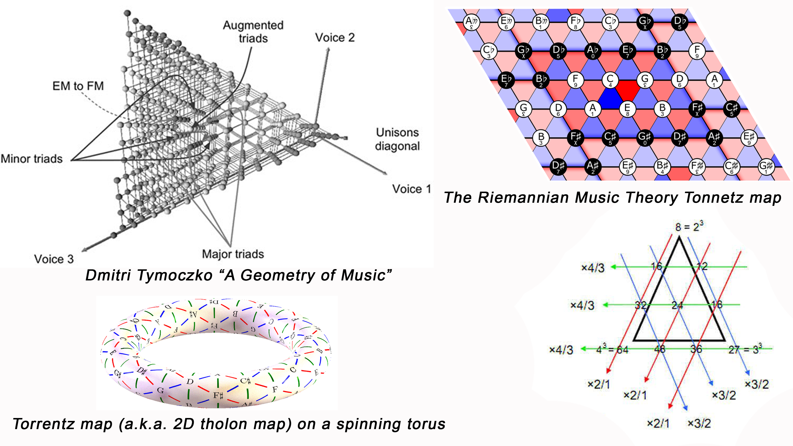

## Story

Around 335 BC, Aristotle described the dramatic structure of a story as having a beginning, a middle, and an end.  Eight hundred years later, the Roman grammarian Aelius Donatus expanded that to three-part structure of the *protasis (introduction)*, *epitasis (main action)*, and *catastrophe (resolution - which, in those days, always ended in catastrophe)*.  Finally, German playwright and novelist Gustav Freytag turned the three-part structure into a five-part structure with the *Freytag Pyramid*.

The Freytag Pyramid can easily be defined as a trigram (below right) showing the five-part structure of *incitement*, *rising actions (inflation)*, *climax*, *falling action (deflation)*, and *resolution*.  Leading up to these five parts is *exposition*, which describes the baseline of the story, the characters, set and setting, etc.  After the five parts, there is the *denouement*, or the returning to the baseline of the natural order.  It is easy to see how the Freytag Pyramid is the classic three-part structure of *incitement (beginning)*, *climax (middle)*, and *resolution (end)* with the additional dynamics of *inflation* and *deflation*.  While it is called a five-part structure, there is obviously the sixth part, that of the baseline, the condition before and after the action described by the five parts.

This, like all info-trigrams, is self-similar, with the *ascending* and *descending* elements being more &ldquo;atomic&rdquo;, and the trigrams being more &ldquo;molecular&rdquo;.  The substance of a story is typically made of many &ldquo;molecules&rdquo;. While there may be many types of Freytag contexts, most stories are one of, or a mixture of, the following 6. The image above shows this in an analysis of "Harry Potter and the Deathly Hallows", by J. K. Rowling. 

- **Ascending**: “Rags to riches” 
- **Descending**: “Riches to rags” 
- **Descending &rarr; Ascending**: “Man in a hole” 
- **Ascending &rarr; Descending**: “Icarus”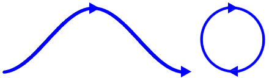
- **Ascending &rarr; Descending &rarr; Ascending**: “Cinderella”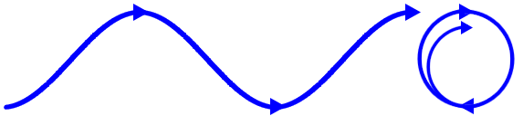
- **Descending &rarr; Ascending &rarr; Descending**: “Oedipus”

## Reduction

The overarching ideas here is that every model can be described by a self-similar set of three axis.  This is not arbitrary, as we claim that any system can be reduced to, and described by, a collection of *information primitives* (triplets or trigrams).  From these essentially 2-dimensional *information primitives* (in that they can be described with only three points) we can build *knowledge primitives* that are tetrahedral in concept.

Furthermore, we hope to demonstrated that these three axis are essentially three different perspectives of one state.  An example of this is how unmanifest energy is expressed in the context and scope of subatomic particles as three different properties of volts, ohms, and amps, forming a trigram, which are them capable of describing a 4^th^ property, which then forms a tetrahedron. We go even further and claim that the 3+1 dimensions of our reality (X,Y, Z, + time), is itself the most fundamental expression of this same model.

 We will return to some more in-depth examples after some exploration into these concepts.

## Info-atoms

If our premise is that the smallest element of knowledge must conform to the same laws as the smallest elements of form, conceptually speaking, then we need to show how these 2D models, such as the holarchy, fit into a not just a 3D model, but specifically tetrahedral structures that represent &ldquo;knowledge molecules&rdquo; with an ordered self-similar hierarchy where each holon is represented as a tetrahedron of information.

Our revised model of hierarchical tetrahedrons will surely look and act differently than a holarchy.  To avoid confusion, we&rsquo;ll refer to these *tetrahedron holons* as *tholons* (for obvious reasons), and the holarchy of tholons as the *thologram*.

#### **Claim 45:** Every tholon is an archetype.

We are working from the premise that everything that exists is a product of a stable pattern existing between different states.  The simplest concept of such a duality is that of *something* and *nothing*. Not much can be said about *nothing*, but as for *something,* we don&rsquo;t need to imagine something that represents everything at once, which is not only beyond our ability, but as everything has yet to come into existence, it is impossible.  On the contrary, we only need to imagine the simplest form of something, for example, a singular dot.  A simple dot on a blank page is a diagram of the model on which this reality, and all knowledge, is based.

This simplest of concepts can explain the holarchy, tetrahedrons, magic crystals, all the laws of physics and every form of intelligence in existence.

### Geometry I

The most effective way to describe this process of emergence from a dot to everything in existence is with the language of geometry.

> &ldquo;Philosophy [nature] is written in that great book whichever is before our eyes -- I mean the universe -- but we cannot understand it if we do not first learn the language and grasp the symbols in which it is written.  The book is written in mathematical language, and the symbols are triangles, circles, and other geometrical figures, without whose help it is impossible to comprehend a single word of it; without which one wanders in vain through a dark labyrinth.&rdquo;  **\~Galileo Galilee, 1564-1642**

> &ldquo;It is the glory of geometry that from so few principles, fetched from without, it is able to accomplish so much.&rdquo;  **\~Sir Isaac Newton**

> Tao generates the One.  The One generates the Two.  The Two generates the Three.  The Three generates all things.  **\~Lao Tzu, Dao De Ching**

We are taught that the progression from point to tetrahedron follows a very clear and simple path of *point → line → trigram → tetrahedron*.

From the tholonic perspective, this is a very incomplete description because it considers any point to be just like any other point, but they are not the same, as each point has very different attributes.  If we ignore those attributes, we are blind to what geometry can show us about so much more than shapes.

*(Unfortunately, if you are reading this on a black and white eBook reader, these color patterns are meaningless. See Appendix &ldquo;About This Book&rdquo; to test the gray scale of the primary colors on your e-reader.)*

We start with a 0-dimensional dot represented by a blue dot in the middle of nothing *(**Fig. c1**)*.  Because it is 0 dimensions and surrounded by nothing, it only exists as a concept.  It has no form, no dimensions, no properties other than that it is a *concept* of a point that exists.  But where does it exist? It can&rsquo;t be measured, seen, or interacted with in any way, so how can we say it even exists?  We can only say it exists because of the awareness of its existence.  The only difference between a void of nothingness and a void of nothingness with an imaginary point in it is the *idea* of an imaginary point in a void of nothingness.  Without the awareness of its existence, the void of nothingness would simply remain a void of nothingness.  This is our first duality, that of *nothingness* and the concept of *somethingness*, and also the first condition of imbalance.

This next step requires some philosophical conjecture because we have to ask why/how does a 2^nd^ (green), dot appear (***Fig. c2***).

If we accept the premise that everything that is created has the attributes of, and limitations of, whatever created it, then, the answer is clear and simple.  As this lone imaginary dot in the middle of infinite nothingness only exists as an awareness of the concept of a point in the middle of infinite nothingness, the one attribute this point *can* have is awareness, as that is what it was created from.  And what was this awareness?  We can only presume that it was the most fundamental form of awareness, that being the awareness of existing (which is not the same as the meta-awareness of being aware that one is aware).  Additionally, being the only awareness that exists, it is virtually *unlimited awareness*.

There is one more attribute it has as well that is far less obvious, and that is *intention*, because whatever awareness conceived of a point in nothingness had to have the intention to conceive of it.  So, our point in the middle of infinite nothingness has two attributes; awareness and intention.  The nature of that intention is addressed further on.

We see this same concept, that of creation being the result of awareness and intention, in the spiritual texts of every major belief system.  For example, in Jewish, Christian, and Islamic lore, when Moses asked God what his name was, God was quite specific about this and not only told him his name was &ldquo;I Am That I Am&rdquo;, but also informed Moses he was but a messenger of &ldquo;I AM&rdquo;, a messenger of the most fundamental form of awareness.  Interestingly, the verb &ldquo;I AM&rdquo; in biblical Hebrew can also mean &ldquo;I Will&rdquo;, as there was no *past* or *future* tense in those days, only *finished* and *unfinished* tense, so the act of being *what is* and being *what one wills to be* are one in the same as far as past and future goes, but has two states, one that is *finished*, and one that is *unfinished*, or *that which is* (awareness) and *that which will be* (intention).  Buddhists appear to have cut out the middle-man (or perhaps &ldquo;middle-god&rdquo;) as they do not have the the concept of a divine being, but they do have the concept of a primal awareness, as suggested in the Buddhist proverb: *A person asked Buddha: Are you a God? Buddha's reply was No. Are you an Angel? No. Then what are you? I am awake.* 

For the record, the tholonic position is simply &ldquo;Ergo esse&rdquo; (*Therefore, to be*). Think of it as a grammatically incorrect but debugged and upgraded version of the myopic and dangerously erroneous (with all due respect to Descartes) &ldquo;Cognito, ergo sum&rdquo; (*I think, therefore I am*).

We also see this in physics.  Take the example of energy, mass and light, as we briefly addressed earlier.  Light has no mass, and without movement, it also has no energy and only exists as the concept of a 0-dimensionless point.  Without movement there would be nothing to measure nor would it interact with anything.  This conceptual point, a result of *awareness*, only has properties when it moves (speed, frequency, amplitude), and this movement is an expression of *intention*, making light the purest expression of the awareness and intention that created, and creates, reality.

This may sound like we&rsquo;re teetering on the edge of mysticism, but this is not our goal.  We simply are following the most reasonable path that our ability to understand our reality allows.  The fact that it suggests that all of existence is a form of awareness that is ever becoming aware of itself is not mysticism, it is a hypothesis of reality.  Science is slowly beginning to consider that there might be a relationship between awareness and reality, but at some point, it will be common knowledge that awareness is not only the fabric of reality, but it is also the energy that drives all of creation and the most powerful energy in existence.

We have seen how mass is a form of energy, and how they both follow the same rules applicable to their context.  Because of this, we can speculate that mass and energy are two different instances of the same archetype of pure energy but instantiated within two different scopes or contexts.  We will take one step further and say that awareness itself is an instance of that same archetype but in an even &ldquo;finer&rdquo; context, i.e.  before there was mass there was energy, and before there was energy there was awareness.  Were this the case, it would shed light on why and how awareness is an integral part of reality, which could provide answers to the quantum mystery of how and why awareness itself is required for reality to exist.  We accept that reality is one form of energy (mass) interacting with another form of energy (electricity, light, etc., and other forms of mass-less energy), but what if reality is one form of energy (mass) interacting with another form of (mass-less) energy interacting with another form of energy (awareness)?  

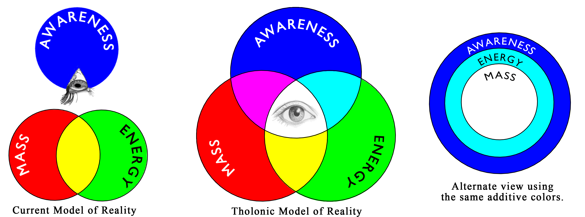

It would be very convenient if awareness was somehow map-able to *z*​ (*zvolts*, a multiple of *c* and which equals *c* when *mass=1*) because then, if we applied Ohm&rsquo;s law or Newton&rsquo;s  2nd, we would see that every one of the formulas requires awareness (in the form of *c* or *z*), suggesting that nothing exists without awareness.  If this were the case, then based on what we calculated earlier regarding *zvolts*, awareness is a *field of potential* as well as a powerful *force*.

#### **Claim 46:** Pure energy is primal awareness and intention. 

Just as there are circuits for energy, there are &ldquo;circuits&rdquo; for awareness.

So, our first dot has two attributes, awareness and intention, and the limitation of 0-dimensions.  This dot then is itself a form of awareness and being so, it will be aware of the existence of *dotness*, not *its dotness*, just *a dotness*.  Just as the awareness of a conceptual point created the first dot, the first dot&rsquo;s awareness of dotness is what creates the 2^nd^ (green) dot, and in doing so, creates the 1^st^ instance of a dimension.  Just as the first dot was created by an awareness, so to was the second dot created by the awareness of the first dot.  Perhaps this is what Nietzsche was referring to when he said (in *Beyond Good and Evil*) &ldquo;And if thou gaze long into an abyss, the abyss will also gaze into thee&rdquo;. With two dots, we now have a relationship between them as shown by a line (***Fig. c3***).

Each of these dots is aware of *its* dotness now, not just *a* dotness, because there are now two states of dotness.  With the existence of the other dot, each dot now has a center of its awareness (***Fig. c4***), with the other dot defining its opposite and the limits of its awareness (***Fig. c5***).  Where before there was only that of unlimited awareness, now there is awareness that is limited by, or defined by, awareness.  This results in two types of awareness; the *subjective*, which is the awareness of one&rsquo;s existence, and which is infinite by nature, and the *objective*, the awareness of another&rsquo;s  existence, which is finite by nature.

As both dots are aware of their own dotness and of the other&rsquo;s dotness, they are also aware of where these two opposing awareness&rsquo;, one subjective and one objective, interact.  These limits that define the interaction between these two states of awareness are the (red) 3^rd^ dot and 4^th^ dot (***Fig. c6***).

We now have the two poles of the first polar-duality that was created within the non-polar duality of nothingness and somethingness.  This polar-duality might be described as that of *unlimited awareness/limitation of awareness*, *subjective/objective,* or a number of other possible descriptions depending on what properties one sees in the green and red dots.  We will use the colors of blue, green and red to symbolize the attributes of these dots.  Here they are described and listed in their order of instantiation.

 The 1^st^ blue dot represents the initial or parent 0-dimensional dot that has no ability to create dimension and exists only as a concept of awareness.  This is the dot that defines the simplest form of existence as pure awareness. It is equivalent to the number 0 as it is the concept of nothing.

 The 2^nd^ green dot represents the first-generation dot created by the blue dot.  This dot can add 1 dimension to 0-dimensions and defines separation and division, creating the conditions of subjective and objective, and consequently the idea of self-awareness as a result of a state of awareness with respect to another state of awareness. This is equivalent to the number 1, and by extension, all real numbers.

 The 3^rd^ red dot represents where the blue dot and the green dot interact.  The 3^rd^ dot is always created as a pair, one for each of the opposite states of blue dot-green dot interactions.  This dot can add 1 dimension to an existing 1-dimensional space and defines the concept of *scope* and *area* as a result of the *union*.  This is equivalent to 2-dimensional numbers, or complex numbers, such as .

Now a perfect trigram exists, but so do three others.  It seems that from here on we can&rsquo;t make just one trigram without three additional trigrams coming into existence.  Instantly we have an infinite loop of self-similarity.  From the tholonic perspective, the instantiation of this concept of instant expansion was when an atom-sized point representing all matter in existence quickly expanded to fill the universe, at least according to the Big Bang Theory.

Our ever-expanding conceptual model, however, is imprisoned in the 2D world forever because even though it can make an infinite number of dots in the 2D plane, it cannot make a new dot that expands itself into the 3D plane.  Why can&rsquo;t the same process that was used to create 2D from 1D be used to create 3D from 2D, by just creating another dot with another dimension?

The reason is as follows: There can only be three types of dots in the 2D world because that is the minimum number of dots required to define an area.  If we added a new 4^th^ type of dot that was also constrained to the 2D world, whatever area it creates could be defined using three dots just as well, so, this 4^th^ dot adds no new or unique information and is useless.  We need a completely new type of dot that is compatible with all three types of dots.

Not surprisingly, the trigrams have already given us the answer with the following two clues.  The first clue is that the creation of one trigram implies the creation of three additional trigrams, each one connected to each side of the center trigram.  The second clue is that for each of these new trigrams another dot is created.  These three additional dots at the outer tip of the new trigrams are each of a different color.  As every trigram must be composed of three unique dots (R, G, and B), and as a new type of dot capable of creating a 3D tetrahedron from the trigram would automatically create three new trigrams, whatever dot type this new dot is, it would have to act as a red dot to the blue-green pair of the original trigram, a blue dot to the green-red pair, and a green dot to the red-blue pair.

Looking at ***Fig. c8*** we see that these are exactly the types of dots that have been created; one blue, one green and one red.  All we need to do to combine these three dots together is combine these three dots into a new composite dot, and *voilà*, we have a new dot type that can create the 3^rd^ dimension.

The RGB dot  or what we&rsquo;ll refer to as the *white dot*  represents the combination of all three primary dots.  This dot can add 1 dimension to 2-dimensions and defines volumes as a result of the union of three unique trigrams.

We now have a tetrahedron.

We can easily demonstrate this by simply folding the three outer trigrams up until their three points meet.  The folding occurs naturally because it represents the most balanced and efficient interaction between a set of four unique dots (R, G, B, W), and as energy will always travel the path of least resistance, folding would naturally occur.

*Note: This same concept is also explained in a mathematical manner in the chapter &ldquo;How Creation Works&rdquo; in Appendix F, &ldquo;Tholonia and the I-Ching&rdquo;.* 

## Holons to Tholons

Let&rsquo;s back up and apply some of the semantic concepts to the holarchy as it will shed more light on the nature of information and how a holarchy forms a network of trinities in the way these holons interact with one another.

We begin with a simple trigram.

According to the creators of the holarchy model, each holon has three functions:

-   **Contributes** (upwards relationship)
-   **Negotiates** (sideways relationship)
-   **Defines** (below relationship)

These attributes hold up quite well when compared to our real-world example of a supply chain.

-   **Production** (what it contributes)
-   **Trade** (negotiations, cooperation and/or competition, exchange of resources)
-   **Consumption** (limits, and/or definitions, of resources)

You can also easily see how the above relationships can be described semantically as two objects (the holons) that have a relationship via the predicates *define, contribute,* and *negotiate*.

We can also visually represent the relationships in the following manner, which allows us to easily map this to a trigram:

## Tholograms

### Geometry II

Let&rsquo;s take these three relationship attributes of **N**egotiates,  **D**efines, and **C**ontributes (which we&rsquo;ll shorten to just N, C, and C) and map them to the three points of a trigram.  One point to add here is that the word *negotiate* is synonymous with *achieving a balance*.  We could even replace the word *negotiate* with *balance* but *negotiate* implies a process rather than a state, plus, the word *balance* has a lot of baggage in today&rsquo;s culture that we&rsquo;d prefer not to inherit, so *negotiate* is a better word.

How do we know what attribute maps to what point? Further on we will show a more complete argument, but for now we can simply say if we have a parent, a child, and a peer, as we do in both the holarchy and thologram, the parent would be the 1^st^ point, the child the 2^nd^ point, and the peer the 3^rd^ point, as shown in the figure above.

Why are we just mapping the relationship properties, or predicates, and not the objects? Here&rsquo;s why:

In the holarchy, the *types of elements* are Parent, Peer, or Child, and the properties of **C**ontributes, **N**egotiates and **D**efines describe the relationships between these types.  Our trigram is defined by the *properties* of the holons (***Fig. t2*** below).  We could have just as easily defined a trigram of the *types of elements* alone, as shown below (***Fig. t1***).  In fact, this is typically how hierarchies are organized.  In our case, however, we are using the properties, not the types, because the movement of energy is in these property archetypes, not in the elements themselves, which are the expressions, or stable instances, of these properties.

We are using this idea of energy and movement as the foundations of reality rather that the *things* themselves.  This is not a new idea.  The *Reciprocal System theory* is built on the same premise and provides the best explanation of why we are using the movement of energy in the relationships and not the contexts of where that energy is coming from or going to.

> The thesis of the Reciprocal System, however, is that the universe is not a universe of matter, but a universe of motion, one in which the basic reality is motion, and all entities - photons, particles, atoms, fields, forces, and all forms of energy - are merely manifestations of motion.[^68]

Like every theory, it has its fans, but also its critics.  In any case, it applies perfectly here.

Newton&rsquo;s Laws of Motion are similar in this regard, as the laws of motion describe the energy that relates to mass, not any particular instance of mass.  Because of this, we can show a direct relationship between these tholonic concepts and Newton&rsquo;s laws:

**Newton&rsquo;s 1^st^ law states** *&ldquo;Every object in a state of uniform motion will remain in that state of motion unless an external force acts on it&rdquo;.* 

This law introduces the concept of an instance of mass, putting it the realm of the 2^nd^ &ldquo;green dot&rdquo;, and its limitations.  Its inability to move or change without an external forcing acting upon it puts it in the tholonic realm of **Definition.**  The concept of *inertia* is defined here, being the restrictions on mass.

**Newton&rsquo;s 2^nd^ law states** *&ldquo;Force equals mass times acceleration&rdquo;.*

**Force** is the result of time and space (acceleration and mass), so it is within the realm of the 3^rd^ &ldquo;red dot&rdquo;, scope and area, and tholonically is within the realm of **Contribution**, as it creates a new concept that describes the most fundamental property of energy, that being the *force* of movement.

**Newton&rsquo;s 3^rd^ law states** &ldquo;*For every action there is an equal and opposite reaction.*&rdquo; 

This equates to **Balance.** No mass energy is defined here, just as no dimension is defined in the 1^st^ dot.  This law only describes the result of existing energies acting against each other, associating it with the 1^st^ &ldquo;blue dot&rdquo; realm of **Negotiation**.  The concept of *balance* (which includes the concept of imbalance) is born of energies interacting with one another.

Tholonically speaking, Newton&rsquo;s Laws of Motion should probably be in the following order:

1.  *For every action there is an equal and opposite reaction (Balance, Newton&rsquo;s 3^rd^ law)*
2.  *Every object in a state of uniform motion will remain in that state of motion unless an external force acts on it.  (Inertia, Newton&rsquo;s 1^st^ law)*
3.  *Force equals mass times acceleration (Force, Newton&rsquo;s 2^nd^ law)*

The primary reason why the properties or movement and energy are the key points in a thologram rather than the instantiated elements, as in the holarchy, is because it is the properties of movement and energy that are consistent at every level of creation.  There may be millions of instances of different types of elements within the holarchy, from subatomic elements to universal elements, and everything in between, but the properties of movement and energy are always the same, even though they are expressed differently for each context.  Therefore, it is the properties of movement and energy that define the structure of the hierarchy, not the instances of elements.

These properties direct energy, energy has movement, and movement has direction.  In this example the direction is clear, however, this direction could change under different circumstances as we&rsquo;ll see later on.

To further illustrate this point, we can use the previous semantic example of &ldquo;Alice *is a friend of* Bob&rdquo;. The tholonic model looks at &ldquo;*is a friend of*&rdquo; as the energetic force that defines Alice and Bob, at least within this narrow context of *friendship*.  Without relationships Alive and Bob would not even exist, as relationships define every interaction at every level of existence.

#### **Claim 47:** Relationships define the function and purpose of any instance

Now that we have mapped the three properties of N, C, and D onto a trigram we can see and label a new class of attributes that are the result of these properties interacting with each other.  For example, what would we expect to see across a spectrum that is defined at one end as *Negotiation*, and at the opposite end, *Definition* (the line from N to D )? In the context of human interactions (just to keep it simple and clear), this pretty much describes how we agree on laws, rules, and limits.  Across the spectrum of *Definition* and *Contributions* (D-C line), we would see how these two opposing concepts, one of restriction and one of expansion, interact with one another through cooperation or conflict.  On the spectrum of *Contribution* and *Negotiation* (C-D line), we would see some sort of value returned to the society or culture, perhaps in the forms of work, dedication, or service (***Fig. t3***).

For the purposes of demonstration, we&rsquo;ll use these human-social context concepts going forward, but keep in mind these are just a few archetypal examples out of many, and only limited to one context.

-   Role or domain of *Child* as (noun form of) **Laws, rules, and limits** resulting from *Negotiation and Definition*.
-   Role or domain of *Parent* as (noun form of) **Cooperation or conflict** resulting from *Definition and Contribution*.
-   Role or domain of *Peer* as (noun form of) **Work, dedication, service** resulting from *Contribution and Negotiation*.

This trigram of relationships are present in every instance of creation and will be expressed according to the context and scope of its instantiation.  The example above uses concepts that are relevant to the human experience and which we have a functional and practical understanding of, these being *laws* (as in civil laws), *service*, and *cooperation*.  In another context, such as the atomic world, *laws* would refer to the limits that an atom must exist within.  *Cooperation/conflict* could describe how the atom&rsquo;s negative and positive forces work with, and against, each other, or perhaps how atoms fuse (unify, as in nuclear fusion) and &ldquo;fiss&rdquo; (break apart, as in nuclear fission).  In terms to social contexts, we can easily see how this could describe Adam Smith&rsquo;s  *Theory of the Invisible Hand*[^75], which is predicated on the idea of cooperation based on voluntary exchange that benefits both parties as well as the society.  *Dedication* describes the aspects of an atom that enhances the ability or properties of its parent tholon, that being the realm from which it was created, which in the tholonic view would be the realm of subatomic particles, such as electron protons and neutrons.  What would atoms be without subatomic particles?  What would molecules be without atoms? What would organelles (specialized structures within a living cell) be without molecules?… and up the chain it goes.  In another direction of this same concept, but perhaps more along the *service* idea, this might be seen in the way atoms enable electrons to move a charge very easily and very fast (the electromagnetic or Lorentz force, shown below), or how atoms act as a &ldquo;sea&rdquo; of electrons that can be called upon at any moment to accept or donate electrons, a service we use and see everyday in the form of the electrical &ldquo;ground&rdquo;, that third pin on every electrical outlet.  With a little thought, we can find many examples.

#### **Claim 48:** Static instances (stable patterns) form dynamic relationships (movement of energy).  Dynamic relationships  (movement of energy) form static instances (stable patterns).

Notice that in the first example when we used the three points of *Parent*, *Child*, and *Peer*, these elements are static (nouns), and their relationships of *Negotiation*, *Definition*, and *Contribution* are dynamic (verbs).  Now when we use *Negotiation*, *Definition*, and *Contribution* as the three points, the relations between them are once again static.  Were we to go further and use the three new static concepts as points we would again have relationships that were dynamic.  This reversing back and forth between static and dynamic with each generation is a natural consequence of the creative process, as will see in more detail a bit further down.

Hopefully, using colors as an example will add some clarity.  Above left we show the three dynamic domains of the archetypes of N, C and D, and their resulting three static domains of the archetypes Parent, Peer and Child.  On the right, we use the same colors to arrive at the three dynamic domains of N, D, C.

This trigram is the basic tholonic model that describes the movement of energy in the process of creation.  What would be the simplest instance of this trigram? The most simple would probably be an element that only contain a single positive (C) charge and a single negative (D) charge, which is exactly describes the first instance of matter, hydrogen. Hydrogen is the most abundant element in the universe and from which every other element that exists is ultimately created from.  On the biological level, this describes mitosis, the process of cell duplication, or reproduction, where one cell gives rise to two genetically identical daughter cells.  In the realm of philosophy, we have the Hegelian Dialectic of thesis, antithesis, and synthesis.  In fact, for a tholonic concept to exist as a potentially viable and sustainable expression it must satisfy a form of the Hegelian Dialectic, in that it must support a thesis (D), antithesis (C), and synthesis (N, but an N that is a product of C and D, not the parent of C and D. More on this in a moment).

Chemically it describes (among many other things) the balancing of pH, which is critical as most life (except for some hardcore microbes) requires a balanced pH around 7, which is right in the middle of the two extremes of pH 0 (battery acid) and pH 14 (drain cleaner).  This is especially applicable when we see how acids and alkalies violently interact with one another, in a way competing and cooperating on an atomic level, to find a stable balance, like our previous table salt and water example.  We can even map this trigram to a number of different processes, for example, here might be two very high-level examples out of many that could apply across many scopes and contexts.

We can speculate a number of things from this trigram, but the one detail that is important before moving on is that the initial 0-dimensional blue dot, or what we will call the N-point, is the originating point, and the only point that is able to replicate itself.  Why this is so will be explained shortly.  We will also refer to the blue-dot N-point as an N-state or an N-source, depending on how it is being viewed.

### House of Mirrors

The tholographic claim is that within the trigram there is energy, and therefore movement, and therefore patterns and oscillations from which stable states will arise that are sustainable enough to form a new N-state that is capable of transferring energy across the scope defined by C and D.  Even though one particular state will exist at one specific point on the 1-dimensional spectrum/line between C and D, all possible states will cover the entire range between C and D.  We can generally guess where along the line various states will arise by applying a Bell curve to this line.

The image on the right shows a Bell curve within the trigram to show where along the CD new stable instances will most likely occur.  Also important to remember is that the line opposite the top N-point is the field of interactions between the children of the N-point

We can now describe trigram and its properties s bit more abstractly:

-   **N** (negotiation) equates to the 1^st^ blue dot , which is the awareness of a concept in its simplest form.
-   **D** (definition) equates to the 2^nd^ green dot , which introduces limitation, division, and separation.
-   **C** (contribution) equates to the 3^rd^ red dot , which, with the previous two dots, results in unification and form.

By these descriptions, we can describe a general process that defines creation as something like:

> The successful joining of contrasting concepts (Negotiation) finding expression in form (Contribution) through limitation, division, and separation (Definition).

At the most abstract levels, this describes the Big Bang Theory, biological reproduction, the laws of physics, philosophy, and anything else that exists in any sort of duality. 

### Inner, not Outer

We have seen how the creation of a single trigram will automatically create additional trigrams as part of the same creative process.  This would imply that there is an infinitely expanding realm of trigrams, as shown in ***Fig. c9*** in the &ldquo;Geometry I&rdquo; chapter.  This pattern, when limited to 37 points, is often called the *flower of life*, as pictured above (*the added &bullet; - + symbols are there for the benefit of black and white ebook readers*).  The tholonic model sees it a little differently.  If we are claiming that the first instance of creation, that of the one dot becoming two, and the two becoming three, etc., even if we are just speaking metaphorically, then what we are also claiming is that this first trigram represents the very first polar duality created by the first non-polar duality of somethingness and nothingness.  This would then imply that every duality and trigram that follows must exist *within* the first trigram, not outside of it, because every succeeding duality can only be a subset of this first duality and certainly cannot exist outside the bounds of somethingness and/or nothingness.

If we draw our expanding trigrams such that the children are always contained within the parent we see a very different pattern.

In this example diagram ***Fig. p1*** above, the outermost N, D, C points represent the first trigram.  You&rsquo;ll see in ***Fig. p2*** on the CD line of this parent trigram a new N-state was formed.  It too naturally bifurcates and expands in the same manner as its parent until it reaches its limits of the boundaries of the parent and in doing so creates three additional trigrams.

You may also notice what looks like an inconsistency in the order of the letters.  In ***Fig. p1***, the parent trigram, the order of NDC is clockwise, but the same three points of the resulting inner trigram are counter-clockwise.  It&rsquo;s not actually a reordering, as the children trigrams represent completely new creations.  The original NDC is still there in the parent, but we are only looking at the children in ***Fig. p2***.  The reason the children have a different order is because the new generation was spawned by the new N-source between C and D, and as D is always the first to follow N, and always on the left of N (left, or *portside*, to be more accurate, is arbitrary, but we need to remain consistent).  This newly spawned D will appear on the opposite side of the parent&rsquo;s D.  The same applies to C.  Not coincidentally, the new top-most trigram has the exact same order of points as the parent.  The parent always creates a smaller replica of itself in each generation.  You&rsquo;ll also notice that each of the outer trigrams is a reversed copy of the one central trigram.

We started with one trigram, created one more, resulting in 4 trigrams.  Each generation of self-similar creation increases the number of trigrams by 4.  Here is what the generations look like.

In the 1^st^ generation of a simple trigram, we see a few fundamental rules, such as:

-   All sides are of equal length
-   Every point is connected to every other point.
-   Two points define a line, three points define a trigram.  (seems super obvious now, but wait…)
-   The area of the trigram is known.  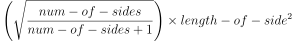  
-   The radius of the incircle is exactly half the radius of the circumcircle.
-   The end-point where any two lines meet is always the middle of the line formed by the two adjacent points.
-   The total number of degrees of the angles equals half the total degrees of a circle.  This is especially significant later.
-   The 3^rd^ red dot is a product of the 1^st^ blue dot and the 2^nd^ green dot, and the next generation N-state blue dot is a product of the 2^nd^ green dot and the 3^rd^ red dot that form the CD spectrum or line.

You&rsquo;re probably thinking &ldquo;What? Red and green don&rsquo;t make blue!&rdquo;  This is half true.  Red and green make yellow, and yellow, when blended with the parent blue, make magenta and cyan… and cyan and magenta make blue.  So, red and green parents do not make blue children, but they make blue grandchildren.  We see an instance of this in the way recessive genetic traits can be become dominant in every other generation (in the absence of an existing dominant trait), which is what we would expect tholonically as genetics are one of the better examples of an instance of tholonic fundamentals.

This is worth a demonstration.  Here is that same process described above but with simple colors from the color wheel to show how the children interact with the parents.  These are the same colors we used above to represent the domains.  This is an important point, but because the process is the same for every generation, we are going to just use red, green and blue in our later examples to keep things simpler; i.e.  going forward we will only show the dominant colors of RGB and ignore the intermediary children of CMY.

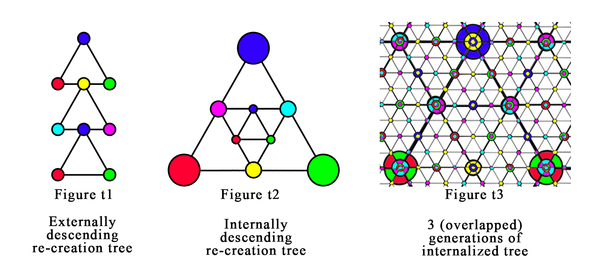

In the first case  (***Fig. t1***)&hellip;

- Blue spawns green
- Green spawns red.
- Green and red create a new yellow.
- Yellow spawns a mixture of each of its component colors (red and green) with its parent color, blue, making cyan (created by blue and green) and magenta (created by blue and red).
- Magenta and cyan create a new blue.
- *Repeat*.

In the next case of (***Fig. t2***)&hellip;

This is the same process as the first, but the children are spawned internally, not externally.  Each new generation creates a new layer that sits on top of the parent layer and is a mirror of the parent (***Fig. t3***).  Eventually we end up with a grid that looks like the image on the right, which shows the smaller overlaid children on top of the larger, and opposite colored parent.

Here is a zoomed-out image of this (crudely drawn) grid:

Compare the outward-expanding model to the inward-expanding model:

We also see a few other interesting details in ***Fig. p2***, such as, how the contribution of red divides the green (on the right side).  Can we say the same thing for how green is what divided the red, such as it appears on the left side? No, because there is an order to the points of *blue &rightarrow; green &rightarrow; red*.  Green existed *before* red, therefore the introduction of the 3^rd^ red point must divide the already existing 2^nd^ green point.  Likewise, the green&rsquo;s boundaries are defined and limited by the red (on the left side) using the same logic that the green came first and the red followed.

In the world of mathematics, this internally expanding trigram is similar to something called a *Sierpinski Triangle*, which is also a self-similar triangle.  This is significant as the Sierpinski Triangle has many real-world applications, such as broadband antennas, musical composition, mathematics, chemistry and is a foundational pattern in nature.

The difference between the thologram and the Sierpinski Triangle is in the latter there is the concept of two types of triangles, one that is capable of self-replication (the black triangles), and one that is not (the white triangles), which act like triangular *holes*, like this:

In the thologram, we consider the triangle not as an object, but as the boundaries that constrain the movement of energy.  The fact that the center trigram is a reversal of the three outer trigrams is evidence of the significance of this inner trigram.  One way to think about the thologram is the boundaries are like one-way mirrors, reflecting the light (energy) within the triangle, but allowing the light from outside to enter.  This difference between the thologram and the Sierpinski Triangle is only conceptual because the math is essentially the same, but the thologram considers the negative or empty space just as valid as the filled space, just with different attributes, which we&rsquo;ll demonstrate.

With each generation, we have more and more rules.  In just a few generations we see two dominant patterns begin to emerge from these rules.  The first one being the Fibonacci sequence, which emerges simply by the linear increase in generation count as well as the number of trigrams for each generation (1,4,16), which is always 4^gen^ (4 to the power of the generation number).

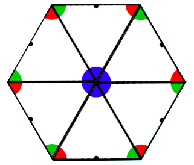Another dominant pattern is the hexagon, one of nature&rsquo;s most persistent and useful shapes, and can be seen in beehives, Saturn&rsquo;s north pole, dragonfly eyes, rocks, bubbles, snowflakes, organic chemistry, etc., but it is much more than just the most structurally sound of all shapes.  We are also shown how the N-sources converge to form the center of every hexagon.  From this, we get a much better idea as to the nature of 0-dimensional, non-existent N-sources, which are, unsurprisingly, at the center of order.  This is important because it gives us an insight into answering the question &ldquo;Where did the first N-source come from?&rdquo;  It is also the pattern that is fundamental to the *flower of life*, shown previously.

The  *flower of life* design dates back to 1300 BC, with the oldest known instance carved on the temple walls of the ancient Egyptian temple &ldquo;Osireion&rdquo;. Again, we see the same concepts and patterns appear over and over again in Man&rsquo;s search for understanding using the power of reason.  We also see that every *Define* or *Contribute* point is naturally paired with its opposite.

Another interesting observation are those little black dots in the middle of the lines.  Why are they important? Those black dots mark the center of a line that has the capability of creating new children (stable patterns), or new N-states that form new N-sources.  You&rsquo;ll notice that those lines only exist on the outer ring of the hexagon.

As we saw earlier, the N-source (blue) is the progenitor of the subsequent D (green) and C (red) dots.  We also know that the N must always precede D and C.  However, D and C, having all the attributes of the N, can create a new version of N.  N and D cannot create a new N because it does not have the attributes of C (form), nor can N and C create a new N as it does not have the attributes of D (definition).  Only Ns, or N-states, can be created because N-states have no form or dimension, a prerequisite for creating something out of nothing.  An N-state is simply an idea or concept.  Cs and Ds are no longer simply concepts as they have dimension and therefore can not be created directly out of nothing.

This is a very important detail because it means that even though archetypes can appear across the NC and ND spectrums, they cannot create children, so no N-state will ever appear across these spectrums.  However, the CD spectrum, which is the axis of *cooperation* or *conflict*, the opposing side to the point of *negotiation*, can create N-states*.* It may appear as though that would limit all the new N-states to only exist on one side of the trigrams, considering only one side of the trigram has the ability to create new N-sources.  This is not the case, because as the trigram self-replicates it naturally rotates 60&deg; with each iteration, allowing every side of the trigram to be able to generate new N-sources.  The graph above (***Fig. h1***) shows the lines connecting the N-sources and their respective N-states (the black dots).

### Everything Begins with the Trigram

Just as every element in the periodic table is formed from hydrogen, so too is every generation of the thologram formed from the trigram.

A curious observation is if you take the simplest material version of the trigram (hydrogen, atomic number = 1) and the simplest material version of the hexagon (carbon, atomic number = 6), the two most fundamental forms in the thologram, and combine them (6+1=7) you happen to get hydrocarbons, the most fundamental building blocks of life (and a bunch of plastic stuff), as all life is hydrocarbon based.  Is it more reasonable to see this most basic structure of the thologram appearing in the most basic structures of life as a recurring pattern or to call it a coincidence?

We can also apply the same associative reasoning to the thologram as a whole to show how its structure appears as a pattern of growth in nature.

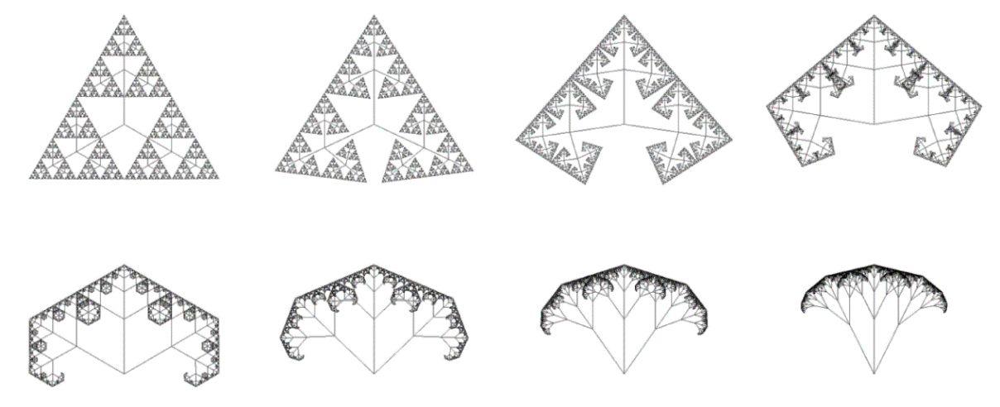

Here we are using the Sierpinski triangle which does not show the &ldquo;negative space&rdquo; of the thologram but simply a blank space.  In the thologram, this blank space accounts for 25% of the tholon and is just as full of implicit patterns as the positive space is full of explicit patterns.  This suggests that we are only seeing 75% of a tholon&rsquo;s instance, the remaining 25% also being an integral part of the instance, but simply not visible.  More on this later.

There is no question that natural processes of creation for nature follow these patterns, and with a little shift in perspective, for the natural process of creation for ideas as well when we apply this pattern to relationships rather than objects.

### 2D to 3D

So far all we have described is 2D trigrams.  Where is the 3D tetrahedron? The 2D trigrams *are* the 3D tetrahedron, only flat.  What happens when we convert this 2D model to 3D?

If we take the parent trigrams and fold it according to its four children, we get a tetrahedron.  This is the structure of a tholon.  Tholonic structures naturally occur because they are more efficient as a 3D object than a 2D map, and they are the most stable and complete state for all the properties involved.

The mathematics of a equilateral triangle are fairly straight forward, but the math of a tetrahedron is quite fascinating in the way is supports the tholonic model.  Rather than detail that relationship, here is a small table that holds the formulas for calculating the XYZ coordinates of a tetrahedron (with the tip along the Z-axis and the base facing the XY plane).  I have left in seemingly useless data, like 0+0 and 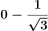 but adding them makes the patterns a little more obvious.  Some highlights worth pointing out is how the first point, which would equate to the blue dot, or N-state, references the direct value of 3 as a whole, while all of the other values reference only the inverse of the whole.  This is consistent with the idea that the N-state holds all the possibilities of the two children as well as the limits of the children.  We can also see how the 2^nd^ point, the green dot, adds value and the 3^rd^ point, the red dot, subtracts value.  This is significant later when we show how those attributes is what allows us to calculate the value of *pi* using the tholonic model.  Also notice how the only points that can generate new N-states exist between 1 and -1, but these N-states can only create children in the axis where there is a 0, and that is only on the 2D X axis.

Below is a more complete, step-by-step description of this transition from beginning to end.

Tholons model the movement of energy, and consider the existence of form as the consequence of that movement.  With that in mind, let&rsquo;s look at the tholonic explanation using the figures above.

***Fig. a.*** We start with a simple trigram.  This defines the most fundamental structure of how instantiations of archetypes come to exist, and therefore the flow of energy and their resulting forms.

***Fig a1***.  The movement of energy inside this trigram will cause a new trigram to form by the expansion of N-sources due to the flow of energy.  The most likely place for this new form is opposite the source of the energy and in the balanced center between the two limiting poles created by the source.  When it creates its two children they are naturally in reverse order.  We now have four trigrams with their points in their natural order and position.

As was shown above, the arrangement of the colored points (N, D, & C) in each outer trigram are the exact reversed image of the center trigram.  One way to think about it is the original trigram (top-most) reflects and reverses itself and by doing so creates a new trigram (center), which also reflects and reverses itself in the two new trigrams (left and right).  In this way, the center trigram acts like a reverse reflection trigram, and the two new trigrams are a reversed reflection of a reversed reflection.  This will be an important point a little bit later.

*Note: We are going to use colors (RGB) rather than types (NDC) because it is easier to explain using colors.  You can remember that N=blue, D=green, and C=red, but for the purpose of these descriptions it does not really matter.  When it does matter, we will return to NDC labels.*

***Fig. a2***.  Because energy always follows the path of least resistance and always seeks order, this complete tholon will automatically become a self-sustaining structure (tetrahedron) when all the conditions are met as it would represent the most efficient form.  These conditions appear to require 4 types of points; BBB, RGB, RGR, and GRG.  Apparently, B points only integrate with themselves and with an R and G together, while the R and G can integrate with each other.

This is the same phenomena that happens when a hydrogen atom and an oxygen atom meet; they naturally form a stable state (which also happens to form a trigram in the case of hydrogen and oxygen) that requires less energy than both of them require to maintain a separate existence.  This is another example of the reactions caused by the need to create balance.

***Fig. a3***.  Each of these child trigrams goes through the exact same process as the parent, with slightly different parameters that are determined by the limitation of their parent.  We can now see 4 trigrams of 4 trigrams in their 2D form.

***Fig. a4***.  This is a 4^th^ generation tholon map, and to get an idea how many sets of tetrahedrons it holds, the trigrams have been color-coded to make it easy to see.  The darker colors represent what will be the base of a tetrahedron, with the light shade of the same colors representing their sides.

You&rsquo;ll notice that there are six sets of trigrams that are yellow (or a lighter shade of gray).  These are identified a little differently because when they form a tetrahedron they do so by going in the opposite direction because they are a reversed reflection image.

***Fig. a5***.  If we go ahead and form the tetrahedrons we end up with a series of tetrahedrons connected at the corners, some pointing forward and some pointing away (the more faded ones).  You notice that every odd numbered row (rows 1,3,5,7) are all *forward* trigrams (trigrams with blue N-state parents), which we&rsquo;ll refer to as *real*, a term taken from the world of holography to indicate that the image is projecting in front of the film.  Likewise, all even-numbered rows (rows 2,4,6) are pointing in the opposite direction (trigrams with yellow N-state parents).  We&rsquo;ll call these *virtual* tholons, a term also taken from the world of holography, referring to an image that *virtually* exists behind the holographic plate.  For every pair of rows (1+2, 3+4, 5+6) there are an equal number of real and virtual tholons.

This may look familiar to a mineral chemist, as this is the exact same structure as silicon dioxide crystal *tridymite*, which is a form of quartz, shown below with  two types of *tridymite* molecules. Other silica-based oxides also share a similar structure, which are mentioned later in this chapter when we look at how water also shares this structure.

Below are various 3D renderings of 4 tetrahedron in this structure.  While we used the same colors for N, D, and C in the previous diagrams for the balls, here we also used them for the connecting lines as the line colors are determined by the color of the ball, or point, that it emanates from.  However, this is mainly to show the relationships with the lines and balls, and not to suggest they have the same qualities.

***Fig. b1***.  This is a side view of ***Fig. a5***, with the yellow (bottom) tholons being virtual, and the blue (top) tholons being real.  The black dots represent the peaks and are also shown in ***Fig. c1***, for clarity.  This is where we see the first instance of oscillation, with the tholons alternating in their movement away from and towards their originating plane, or between the virtual and real states.

***Fig b2***.  But what is happening in ***Fig. b2***? Why are there more tholons stacked on top and on the bottom?

If you managed to slug through this up to this point, congratulations! Here is where it (hopefully) gets interesting: Each of these new trigrams formed by the peaks of the previous children acts as the base for *larger* tholons! The process beginning with ***Fig. a1*** starts all over for not only each one of these trigrams but for every face of a tholon or trigram, including its children.

If you look at ***Fig. c1***, which is the colorized front view of ***Fig. a5***, you&rsquo;ll notice that there are alternating sets of real and virtual tholons, and the peaks of these tholons (the black dots) naturally create new trigrams.

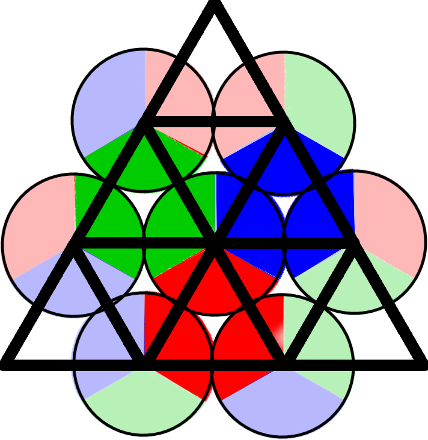In 2^nd^ generation tholons, the peaks are always the 4^th^ dot type of RGB combined , or *white dot* , so how can a new tholon appear from three white dots? Doesn&rsquo;t it need three different unique colors to satisfy the conditions for a 4^th^ white dot to exist? In fact, that condition *is* satisfied.  If we make the RGB/white dots huge for demonstration purposes you can see how the colors line up to create three separate dots of three separate colors, but these 2^nd^ generation dots are composed of three pieces of three dots that are 1/3^rd^ each color.  They are like virtual RGB dots made from *white dots*.

For clarity&rsquo;s sake, we are referring to each generation of tholon children as *generations,* while the tholons that are created from the peaks of these original tholons, and their children, we refer to as *iterations*.

The only way to create three peaks of pure R, G, and B is to first create the opposite condition of three peaks of white dots, similar to the way a blue N-source creates a yellow child N-source, which then creates a blue N-source.  With each iteration this pattern reverses itself, so the 3^rd^ iteration will be like the 1^st^, with bases of RGB (but each generation rotated 60&deg;).  All the odd number iterations have RGB peaks, and all the even number iterations have white dot peaks.  Each iteration builds on the one before it, making larger and larger tholons, as you can see in ***Figs. b2, b3, b4***, which shows the progression of real and virtual tholons.[^69]

Interestingly, the growth pattern of tholons is the inverse of a recursive Fibonacci sequence.  Inverse, because we are multiplying instead of dividing, recursive because we do that for each trigram, children of trigrams, children of children of trigrams, etc.

***Fig. c1, c2, c3,*** and ***c4***. are orthographic views of the figures immediately above them.

***Fig. d1, d2, d3***, and ***d4*** are isometric views of the figures immediately above them.

***Fig. d1*** shows the first iteration of tetrahedrons. All form that follows (***Fig. d2, d3, d4***) is built upon these initial tetrahedrons.  This would (probably) be the domain of elements and subatomic particles.

There are two details worth mentioning.  The first is, you&rsquo;ll notice that in the front view of ***Fig. c2*** you see what looks like four larger trigrams that are themselves made of smaller trigrams.  Each of those large trigrams is itself a tholon.  The center tholon is, as explained before, a virtual tholon, but within this large virtual tholon there exists smaller real tholons.  This is because just as real tholons can create virtual tholons, virtual tholons can create real tholons.  This is where it really starts to sound like a fun-house of mirrors because how can you have real tholons inside virtual tholons? The simple answer is, real tholons in a virtual tholon are real relative to that virtual tholon they are within.  These *virtual* real tholons are just as significant as the *real* real tholons because they function in the same manner as a real tholon, but virtually, which allows virtual tholons to be able to &ldquo;reflect&rdquo; back a real tholon.  But, because they are all sourced originally from a virtual tholon, they only have virtual significance.

The second detail is, to make things more complicated, in the above diagrams we have colored all the real tholons yellow (light gray in B&W) and the virtual tholons blue (darker gray), but in fact, there are yellows within the blues and blues within the yellows.  These were left out for simplicity sake as they were not critically important to demonstrate our point and can&rsquo;t be properly illustrated.  The basic principle is the same however, in that there is an oscillating between real and virtual at each iteration.

Now we can start to fold this into itself.  Each of the four sides that make up a tholon has their own domains of children as well, so this folding process happens at every generation (again, impossible to illustrate).

***Fig. d4*** shows the small portion of a thologram we have built that we will now begin to fold.

***Fig e1*** shows the beginning of the folding.

***Fig. e2*** shows the completed folding, with all the real tholons now within the parent, and all the virtual tholons outside of the parent.  It&rsquo;s interesting how it naturally happens that only the virtual tholons extend past the boundaries of the thologram.

It looks like we have broken the rules that no children can exist outside of their parent&rsquo;s limits because we have a lot of virtual tholons sticking way outside those limits.

Remember when we were looking at the Sierpinski Fractal? One of the points made was that Sierpinski treated the empty space between the tetrahedrons as empty, wherein the tholonic model it is not empty, but rather negative space that is a reflection of the immediate parent.  Now remember that that this middle trigram is a reflection trigram.  In one sense it does not exist any more than your reflection in the mirror does not represent the existence of another you opposite and equally distant from the mirror, but it does exist in that the reflection is a perfect mirror-image representation of you, and this has significant value as mirrors obviously have a measurable effect on energy (light).  It is an illusion, but an illusion that effects reality.

All the virtual tholons are tholons that were created out of this nothingness space! They are *reverse reflective* tholons only.  They do not exist, but they are very important.  The virtual tholons are like the *nothingness* complement to the real tholons within the parent through which *their* reflection creates two more real tholons.  This does not break the rules that nothing created within the parent can extend past its boundaries any more than looking at yourself in a mirror hanging on the wall does not put you on the other side of the wall, even though it appears that way.

Look at ***Fig. a5*** again.  You&rsquo;ll notice that for every real tholon there is a virtual (reflection) tholon immediately below it.  It is because of these virtual reflections that we can generate another iteration of real tholons.

***Fig. e3*** shows the ghosts of the virtual tholons, and ***Fig. e4*** shows only the real tholons folded into their parent tholon.

To get a better perspective of the dynamism of this structure, look at ***Fig. f1*** below, which shows the lines of influence of each tholon (which is that of a sphere).

If we go inside this very simple version of a thologram we see what looks like complete chaos (***Fig. f2***), but is, in fact, absolute stunningly perfect order and structure.

If we had used the simplest thologram possible in our example, using only 1^st^ generation folds, rather than the 3^rd^ generation folds above, it would look like the following:

Another fascinating pattern expressed in the thologram is the value for *pi* (&pi;, 3.14159) can be determined by alternatively adding and subtracting the inverse of the total number of N-sources for all the real and virtual tholons for each generation (which produces a series of sequential odd numbers; 1,3,5,7,etc).  This was originally discovered by Leibniz and is appropriately called the *Leibniz formula for π*, as shown below.  Notice how here we also see the reversing back and forth with each generation, which is a function of the creative process as described above.

The one last point to consider is best explained in the following thought exercise: Imagine what you would see if you were a 2D person living in a 2D world and a 3D object passed through your 2D reality.  You would see a bunch of 2D slices of that object that changed over time.

Now imagine you are a 3D person living in a 3D world (which should be pretty easy to do) and a 4D object passes through.  You will see 3D &ldquo;slices&rdquo; of this 4D object over time as it passes through your 3D world.  For example, if a 4D ball passed through a 3D world it would first appear as a very tiny 3D ball, and then grow to a large ball, then shrink to a small ball before disappearing.

In both 2D and 3D cases, you are not getting the whole picture, but in both cases what you are getting is completely true and valid for the scope of your 2D or 3D reality.

If we were to remove the first-iteration of tetrahedrons/tholons from the model and only look at the iterations that represent the Newtonian material reality we live in, the thologram would look like a perfect tetrahedron, with none of those smaller protrusions that come from these first-iteration shapes.

Like in the example of the 4D ball, a 4D thologram, being itself a tetrahedron, would first appear as a small tetrahedron.  How small?  Maybe 1.61&times;10^-35^, which is the (theoretically) smallest thing there is, and the size of those 3D quasicrystalline reality pixels?

Why is this detail important?

The 3D model of the thologram is a 3D slice of a 4 (or more) dimensional model.  What the larger multidimensional object that we see as a tetrahedron actually looks like we can&rsquo;t say, and probably can&rsquo;t know.  What would an 8D or 248D &ldquo;object&rdquo; appear as in this 3D world? It could appear as many, many different things.  Take a look at all the ways a simple self-similar 3D tetrahedral pyramid can appear in 2D orthographic projections.

Now imagine the same tetrahedral pyramid with trillions of iterations and many more dimensions! It would have the ability to define or describe every archetype of every form. If we are talking about the thologram, which is the same structure but which describes concepts rather than form, it could describe every idea that ever has, does, or will exist.  Its perspectives would effectively be infinite to us,.

## Archetypes

This is a good place to review the concept of archetypes.  The current understanding of an archetype is defined in the Oxford English Dictionary as:

> The most typical or perfect example of a particular kind of person or thing

When we speak of archetypes in the context of tholons we are using a more general, yet compatible definition that an archetype is a pattern that expressions diverge from or converge towards.  More specifically, an archetype in the tholonic view is:

> The ideal expression of a set of constraints that can be tholonically expressed.

The one last point to consider is best explained in the following thought exercise: Imagine what you would see if you were a 2D person living in a 2D world and a 3D object passed through your 2D reality.  You would see a bunch of 2D slices of that object that changed over time.

Now imagine you are a 3D person living in a 3D world (which should be pretty easy to do) and a 4D object passes through.  You will see 3D &ldquo;slices&rdquo; of this 4D object over time as it passes through your 3D world.  For example, if a 4D ball passed through a 3D world it would first appear as a very tiny 3D ball, and then grow to a large ball, then shrink to a small ball before disappearing.

In both 2D and 3D cases, you are not getting the whole picture, but in both cases what you are getting is completely true and valid for the scope of your 2D or 3D reality.

If we were to remove the first-iteration of tetrahedrons/tholons from the model and only look at the iterations that represent the Newtonian material reality we live in, the thologram would look like a perfect tetrahedron, with none of those smaller protrusions that come from these first-iteration shapes.

Like in the example of the 4D ball, a 4D thologram, being itself a tetrahedron, would first appear as a small tetrahedron, which is what we, and others, are claiming all reality is conceptually built from.

Why is this detail important?

The 3D model of the thologram is a 3D slice of a 4 (or more) dimensional model.  What the larger multidimensional object that we see as a tetrahedron actually looks like we can&rsquo;t say, and probably can&rsquo;t know.  What would an 8D or 248D &ldquo;object&rdquo; appear as in this 3D world? It could appear as many, many different things.  Take a look at all the ways a simple self-similar 3D tetrahedral pyramid can appear in 2D orthographic projections.

Now imagine the same tetrahedral pyramid with trillions of iterations and many more dimensions! It would have the ability to define or describe every archetype of everything,  every form, (every idea?) that ever has, does or will exist.  Its perspectives would effectively be infinite to us, but at its source, it is one thing.

## Archetypes

This is a good place to review the concept of archetypes.  The current understanding of an archetype is defined in the Oxford English Dictionary as:

> The most typical or perfect example of a particular kind of person or thing

When we speak of archetypes in the context of tholons we are using a more general, yet compatible definition that an archetype is a pattern that expressions diverge from or converge towards.  More specifically, an archetype in the tholonic view is:

> The ideal expression of a set of constraints that can be tholonically expressed.

The images below are a good example of a how one archetype is expressed though different contexts.  The archetype is based on the simple model previously described and shown in the diagram on the right. We begin with a 0-dimension point.  This point moves into the 1-dimensional space, which creates a line. In figures below, we show this line as the (black) horizontal diameter of a circle.  The radius is 90 units, which is equal to the number of degrees that are required to describe a 2-dimensional plane. This 1-dimensional existence then moves beyond the 1-dimensional space and into the 2D space. That movement will be expressed in both dimensions, just as the 0D&rightarrow;1D was expressed in both directions of a 1D space (left and right, or positive and negative).  This means there will be a movement along the 1D X-axis, and an equivalent movement along the 2^nd^ dimension of the Y axis.  However, in this model, any movement shall always remain centered around the originating 0D point from which it started.  

To illustrate this, we will move the horizontal diameter line 5 units to the right, and rotate it around its center point by 5&deg;. This is the first red line in ***Fig. 1***.  Now we see that this line of off-center. Where before, as a horizontal line, there were 90 on the left-of-center and 90 on the right. Now it is 85 on the left and 105 on the right.  It continues its journey into the 2^nd^ dimension by moving another 5 units to the right and another 5&deg; rotation, and it continues to do this until the line returns to its starting position of being horizontal.

In ***Fig. 1***, the outline of the progression is shown, as well as the outline of the original center points which are shown as yellow dots.

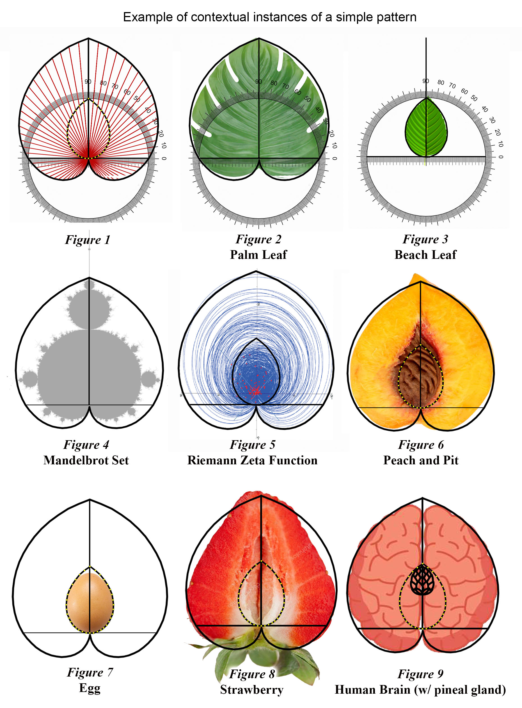

What is interesting about this shape is how it so perfectly describes the archetypal shape of many things, from leaves, fruits, and seeds to number theory, fractals and even the human brain and pineal gland.  The reason this is interesting is because we have described a very simple model that we would expect to see in nature, and because this model can make successful predictions we can say there is a valid hypothesis.  Perhaps this same reasoning is why the ancient Sumerians thought the earth was egg shaped, and not perfectly round, as the Greeks imagined (if fact, earth is an oblate spheroid).

Some details worth noting:

- Every shape begins (emerges, evolves, or grows) from a point of 0-dimensional nothingness into a 1-dimensional space, and from there into a higher dimensional space.
- Each expression in a dimensional space will utilize all available dimensions; i.e. if given the nature and scope of an instance that it will move *N* units, then in a 1-dimensional space it will move *N* units in one dimension. In a 2 dimensional space it will move *N* units in 2 dimensions, etc. In our example, our line is moved 5 units. In the 1-dimensional space that was 5 units of 1D measure, and in the 2-dimensional space, it rotates 5&deg;.
- The point of origin (0D point) remains the center point around which something instantiates, but its virtual location in the lines delineates a boundary that has significance. 

*The silphion plant is also a similar shape, similar to the strawberry, but with an interesting historical and cultural footnote as its shape  is the origin of our traditional heart symbol.   As well as being known to cure many ailments, it was a natural contraceptive, and so was associated with love and passion. Not only was the plant worth its weight in silver, the Romans kept 1,500 kilos of it in the treasury as a hedge. Coins were minted with the image of the silphion seed, which had the same shape. Sadly, that particular variety was farmed into extinction, with the last known stalk given to Emperor Nero, as the legend goes.*

Here, and throughout the entire book for the most part, we are looking at only the the five primary archetypes, which include only 1 of the 5 Platonic solids, the tetrahedron, just to give an idea of how narrow a scope we are looking at:

For the sake of completeness, here is what the the lines look like when they complete a full 360&deg;:

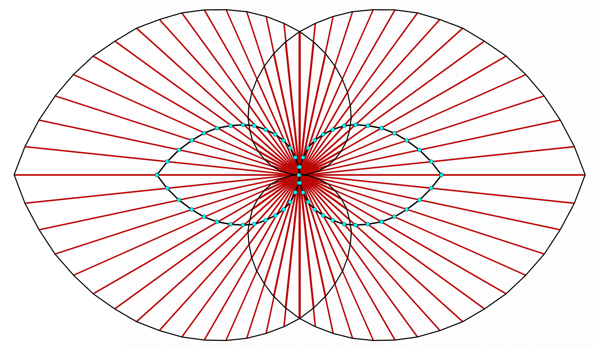

The archetype of a circle, for example, is the ideal expression of the rule &ldquo;the locus of all points are equidistant from a central point&rdquo;.  This is a Platonic archetype.  A Jungian archetype might be the personification that tends to represent what Jung called a &ldquo;primordial image&rdquo;, and it was this understanding that lead him to the ideas of a*nima/animus, the self, the shadow*, and *the persona* but also shed light on the classic archetypes such as *wise old man, the child, the mother, the maiden*, etc.  This was later expanded to *Neo-Jungian* archetypes such as *caregiver, explorer, jester, rebel, citizen, hero, lover, sage, creator, innocent, magician,* and *sovereign*.  Not surprisingly, these twelve archetypes are similar to those found in astrology.  This is because Jung recognized astrology as a system of archetypes, adopting and reforming many of its concepts into modern psychology.

Tholonic instances are easier to understand when we look at isolated archetypes.  It is easy to understand a square block is an expression of a archetypal cube, but what of a melting snowball?  At what point does it stop being an expression of a sphere?  From the tholonic perspective, never.  The snowball came into existence as a result of many tholons (weather, terrain, gravity, etc.) cooperating and competing, exerting forces and limits in such a way that a snowball could form.  The snowball changes form as these tholonic forces change due to waxing or waning circumstances that tend to reinforce some forces and diminishing others.  Each of these tholonic forces is an archetype because each tholon *is* an archetype.  As these archetypal forces change, interact, negotiate, compete, the resulting form will always be the most efficient expression of the state of those forces.  In other words, everything that exists is as perfect an expression of its archetypes that is possible, but everything that exists is made up of many, many branches of tholons or archetypes, so what we see is an amalgamation of countless archetypes that have managed to create a stable instance.  

The melted snowball is still an expression of a perfect sphere, but just a very diluted or weak expression given the strength of the other forces that have turned it into a puddle.  One way to think about this is to imagine each archetype as having field of influence (which they do, as we'll explain later) similar to the way each planet has a gravitational field, or how each electron has a electron field that stretches to the edge of the universe.  Right now you are primarily under the influence of the earth's gravitational field, but you are also under the influence of Jupiter's gravitational field, but it is too weak to have any observable effect.  If you were to move closer to Jupiter, its effect would become more apparent.  Our snowball-turned-puddle is just far away from the &ldquo;field&rdquo; of the archetype of a sphere and much closer to the &ldquo;field&rdquo; of the archetype of puddle.

Some of these amalgamations of archetypes will become archetypes and parents of archetypes themselves.  Perhaps the only pure, unamalgamated archetypes that exist are the concepts of *something* and *nothing*.

So, when you see something that looks imperfect, remember that it *is* perfect, it&rsquo;s just that you are not aware of all the archetypal forces that are making it the way it is.

#### **Claim 49:** Everything that exists *must* be perfect.

## Revisiting Dimensions

To specify the location of a tholon within the thologram we have to identify each tholon by an address based on its generation.  The is an example of the dimensional of *location*.

If we wanted to reference one specific tholon, such as the one highlighted in the image above, we&rsquo;d need to say it was located at 1,3,2,1 as it is the 1^st^ child of the 2^nd^ child of the 3^rd^ child of the 1^st^ tholon.  The areas blacked out are virtual tholons which don&rsquo;t really exist (energetically) so we can&rsquo;t navigate to them even though we can reference them.  So, in this example, we need 4 dimensions to define the location of a tholon.  Any dimension would have to record the path taken to arrive at any particular tholon.  The reason this is being mentioned is to show that each generation of tholons increases the dimensionality of the thologram by one dimension.

For example, to identify the position (P) of one tholon at the 45^th^ generation, we would need a dimension that looked something like:

But it&rsquo;s even a bit more involved because this dimension only points to one particular tholon within which is its own 3D space. In the thologram, we can&rsquo;t use a Cartesian coordinate system (i.e.  X, Y, Z) because that would require a coordinate system that extends past the boundaries of existence, and we know that there can be no metrics in nothingness.  We can only use a *quadray* coordinates (e.g.  A, B, C, D) which are based on a tetrahedron, to identify a point within the tholon.

Does this mean that our 3D reality is embedded within a parent 3D reality? According to the thologram, yes, although I have no idea how this can be tested.  An analogy we have to the idea of a 3D reality within a 3D reality is VR (virtual reality), where we can create countless 3D worlds within our own 3D reality.  Another analogy is how a hologram can create a 3D space from a 2D surface, and there can be many 3D spaces on top of one another recorded in that same 2D surface.  These analogies are quite close to the theoretical reality that the our Big Bang was actually a singularity from matter from a parent universe collapsing into a black hole, creating a new child singularity (our Big Bang) i.e. entire universes within black holes, or, embedded universes.  This is called the Black Hole Big Bang Theory (BHBBT).

### Synergetics

What some people today call *sacred geometry* our ancestors simply called geometry.  Contrary to what we learned in school, geometry is as much a study of philosophy as it is a study of form, space, and mathematics.  Plato, Pythagoras, Parmenides, and a number of other great philosophers were well-schooled in geometry, but the marriage of philosophy and geometry goes back even further in history, and across every culture.  Take the quadray coordinates system as an example. This system is based on 60&deg;, which comes from the 360&deg; (60&deg; &times; 6) model of a circle.  One could make a case that the Ancient Mesopotamian base-6/60 number system, which gave us the 360&deg; circle, was an early version of this idea.  In fact, one could make the case that the 20,000 year old Ishango Bone of the upper paleolithic era discovered in the Congo was the earliest version of a base-60 system.  This bone is considered to be the first instance of the concept of the number one.  On this bone are counting marks, 60 marks on one side, and 60 marks on the other side.  One has to wonder why a paleolithic caveman would choose 60.

*Synergetics* is a modern-day example of how geometry forms the basis of the structure of creation, life and how everything interacts with each other.  Buckminster Fuller coined the term *synergetics* in his three-volume work &ldquo;*Synergetics.  Explorations in the Geometry of Thinking,*&rdquo;[^70] wherein he explains how using a 60&deg; coordinates system can explain both physics and chemistry, but more importantly, he believed that it also explained reality.  In his words:

> Since physical Universe is entirely energetic, all dimension must be energetic.  Synergetics is energetic geometry since it identifies energy with number.  Energetic geometry employs 60&deg; coordination because that is nature&rsquo;s way to closest-pack spheres.

He explains how the points and the lines of a tetrahedron (60&deg; coordinates) describe all elementary phenomena.  Moreover, he claims that synergetics can measure our experiences geometrically, and how we can employ geometry regarding both metaphysical and physical knowledge.

The math he proposes is, according to him, based on the reality of empiricism, seeing as that all atoms are made of tetrahedrons, octahedrons, rhombic dodecahedrons, and cubes.  Using this synergetic math, we have a coordinate system that works omnirationally, energetically, arithmetically, geometrically, chemically, volumetrically, crystallographically, vectorially, topologically, and energy-quantum-wise.[^71]

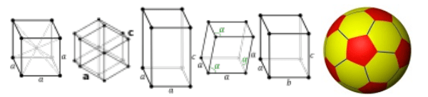All these forms, such as cubes, hexagons, tetragons, rhombohedras, orthorhombics, or truncated icosahedrons, which is commonly known as the *Bucky Ball*, or, when in atomic form, *Buckminsterfullerene* (basically, it&rsquo;s a soccer ball),  and perhaps all forms, can be defined by points in a thologram.

The thologram, which is based entirely on the tetrahedron and synergetic quadray coordinates, is a model of knowledge, thought, and ideas.  It&rsquo;s important to remember that the map is not the territory.  These models of reality are like maps that describe the terrain.  There are elevation maps, density maps, road maps, water maps, contour maps, temperature maps, population maps, economy maps, crime maps, San Francisco even has human feces maps! They all describe the same territory from different perspectives.  The thologram is just one template that is a description, so to speak; a language that defines the organization and pattern of all energy at every level.

There are many alternative ways to map the thologram.  What is shown here is just one way.  How many ways are there? I don&rsquo;t know, but the extremely simple *three square geometry problem* shown on the right (&ldquo;what is the total of the angles *α*,*β*,*γ* ?&rdquo;) has 54 possible solutions, and that is just with three simple squares (the answer is 90&deg;)!

As you can imagine, there is virtually no end to the relationships, patterns, rules, etc., that can be discovered.  What separates knowledge from *apophenic* delusions (apophenia is the tendency to perceive connections and meaning between unrelated things and is considered a sign of early-stage schizophrenia) is whether a relationship, pattern or law can be tested to achieve predictable results.  On the other hand, we don&rsquo;t want to fall victim to *randomania* either (&ldquo;randomania&rdquo; is the unofficial term for people who attribute to chance that which is clearly the result of order; the inability to see patterns where they actually exist).

> It doesn&rsquo;t matter how beautiful your theory is, it doesn&rsquo;t matter how smart you are.  If it doesn&rsquo;t agree with experiment, it&rsquo;s wrong.  **\~Richard Feynman**

We agree with Mr.  Feynman, but we also have a broader definition of &ldquo;experiment&rdquo;. Life is reasonable by default, otherwise, it would not exist, but it is not always quantifiable, and often incompatible with current science.

OK, that&rsquo;s enough geometry.  Let&rsquo;s look at some chemistry.

## Application

### Water

We mentioned above that the first instance of matter would be tetrahedral, at least conceptually, but we also stated that form, being an instantiation of the laws of form, would follow that model, meaning we should expect to see tetrahedral structures as one of the building blocks of reality.  And guess what? We do! 

The actual first instance of matter in the Newtonian sense (vs. the quantum sense) are the elements, but no element has a tetrahedral structure when it is isolated.  It is the bonds between elements that create the tetrahedral structure.  In the tholonic model, the individual elements exist at the first level of the thologram, which are the first tholons created by the folding of the 2D &ldquo;map&rdquo; and are shown as the numerous and small tetrahedrons upon which ever-larger tetrahedral structures emerge from.  That means we will not see actual tetrahedrons on this level, but we will see the same tholonic properties, such as form seeking the most stable state.  We don't see tetrahedral forms in 3D structures until the first iteration that emerges.  A single *H~2~O* molecule is not a tetrahedron in form, it is a trigram.  Water, however, is tetrahedral.

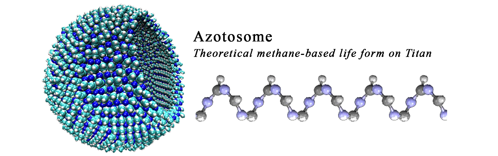 

Water is a particularly good substance for exploring tholonic structures because it is one of the first, if not *the* first, tetrahedral structure that all life depends on.  Another early structure that is tetrahedral as a molecule alone is methane, one of the first organic molecules and not just a building block of life on earth, but quite possibly the basis for an entirely different form of life, as pictured in the *Azotosome* above, and one we might discover on the Saturn moon of Titan.

We saw that in the first generation of a tholon we have 4 trigrams, 3 of which are descending, or downward-pointing trigrams, and 1 is ascending, or upward-pointing trigram (&ldquo;up&rdquo; and &ldquo;down&rdquo; have only relative meaning here as it simply refers to the way the trigrams were drawn).  If we have two tholons then we have a total of 8 trigrams made up of 6 descending and 2 ascending trigrams.

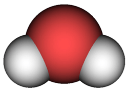H~2~O​ is composed of three atoms.  One atom is oxygen, which has an atomic number of 8 as it has 8 protons in its nucleus, which defines how much energy it holds as a &ldquo;charge&rdquo;. It also supports 8 electrons in its outermost shell, which represents its most balanced state.  The other two atoms are hydrogen, the very first instance of matter.  Hydrogen has an atomic number of 1 and has only 1 proton and 1 electron.  Although oxygen wants 8 electrons in its outer shell, it only has 6, so it naturally forms a bond with two hydrogen atoms by sharing the one electron each hydrogen has to offer.

From a tholonic perspective, oxygen follows the pattern of two 3^rd^ gen tholons from one face of a 2^nd^ gen tholon, which has 6 *real* tholons and 2 *virtual* tholons (***Fig. v1*** below, showing two 3^rd^ gen tholons).  Hydrogen follows the pattern of a complete 2^nd^ gen tholon (***Fig. v2***, showing two complete 2^nd^ gen tholons).  Combining these two together (***Fig. v3***) would represent 8 externally-facing points (from the *real* tholons) of interaction and two internally facing points (from the *virtual* tholons) of non-interaction.  When combined, the hydrogen tholons will attach to the empty or *virtual* tholons of oxygen.

We can see a few similarities between the tholonic model of *H~2~O* and its traditional chemical model.

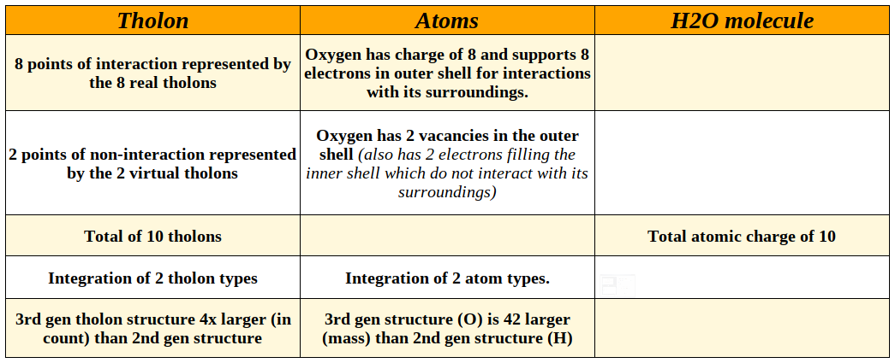

This is just a hypothetical demonstration, as there may be a much better tholonic model for elements and compounds than this one, but this one is sufficient to show how we might be able to describe elements and compounds tholonically, which may give us new insights into their nature.

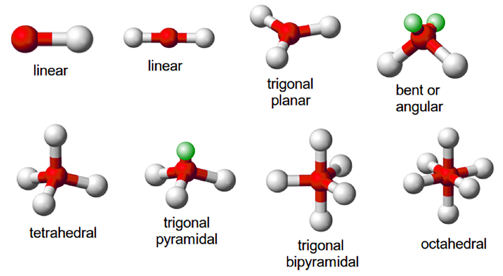

Can we see this similar relationship with other compounds? Given that the basic archetypal shapes of molecules (shown above) can be represented within the thologram, perhaps this model can be applied to all compounds.  We claim this might be possible, as there is an almost infinite number of possible configurations in the thologram.  Instances of fundamental configurations, such as those that appear in the earlier stages of iterations and generations, like the Fibonacci sequence and the hexagram, would represent extremely stable patterns, and therefore we would expect to see them play a very fundamental part in our reality (like water and methane) and could be easily discovered.

### Quarks and Atoms

Here is another example of how we might discover tholonic structures in subatomic particles.  Let&rsquo;s look at a quark (which was originally named a *parton* by Richard Feynman to describe a hypothetical particle inside the nucleus of the atom).

Currently we understand that protons have a charge of +1 and are composed of two *up* quarks, which have a charge of +2/3 and *one* down quark, which has a charge of -1/3, and neutrons have a charge of 0 and are composed of one up quark and two down quarks.

This is seen in a single tholon and its reflection tholon as shown in ***Fig. q1*** and ***Fig. q1a*** below.  The upper trigram has a parent trigram at the top which we can assign a value of -1/3, and the two children can be assigned a value of +2/3.  The center child trigram, which is always a reflection trigram, has a value of 0.  The opposite is true for the lower reflection trigram as well.  With these values, the upper tholon has a charge of 1, like a proton, and its reflection tholon has a charge of 0, like a neutron.  This also seems to indicate that a truly complete tholon requires two tholons; itself and its reflection tholon. It worth noting that the simplest and first element, hydrogen, is the only stable element that does not have a neutron (*heavy hydrogen*, or *deuterium*, has 1 neutron and is stable, and the radioactive *tritium* has 2 neutrons).

***Fig. q1a***, which is the folded 3D version of ***Fig. q1***, is also the same shape as the quartz *trans tridymite* silicon oxide molecule, with the N-states holding the same position as the  silicon atom.  For those playing along, note that the *trans tridymite* molecule has oxygen molecules that total the atomic number of 32 (i.e. 2^5^, 8&times;4) and the silicon molecules totaling 28 (i.e. 7&times;2^2^, 14&times;2), resulting in a total atomic number of 60.

***Fig. q3*** is from the previously quoted paper on the *E8 Lattice* that explains the various models within the E8 crystal and describes this shape as &ldquo;representing all 8 components of the electron&rdquo;.  This is not exactly the same as what we are saying here, but it supports the overarching idea regarding tetrahedrons and subatomic particles.

We need to very briefly address one item before continuing.  Within the first three generations of the thologram we have the underlying structure that all that follows is built upon.  It is from the third generation that patterns emerge that never change from that point on, such as the hexagram.  We can see these patterns as contiguous boundaries of the same boundary *type*, shown in the image below.  The left-most image shows the first three generations combined, with yellow lines connecting the red and green dots, magenta lines connecting the blue and red, and cyan lines connecting the blue and green.  Because there are three layers on top of each other it is difficult to show the connecting lines realistically, but if we isolate each color of connecting lines we see these patterns of boundary types.  Why are we calling them boundary types? Because as contiguous lines of the same type, they define where and how energy flows through the structure.  They are a &ldquo;grain&rdquo;, so to speak, that direct the movement of energy and its properties.  There are essentially two types; the *grid*, of which there are two, a pair of exact opposites (the magenta and the cyan), and the *matrix*, which is symmetrical, self-contained, and self-similar (the yellow).  These patterns define the relationships, and perhaps the binds, that hold the thologram, and therefor existence, together.

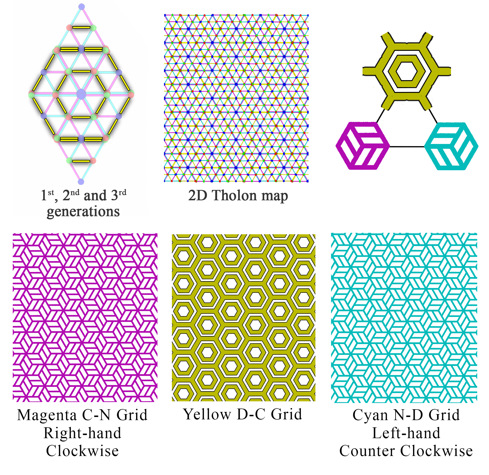

Only one of those patterns is self-similar, and that is the pattern caused by the lines that can support an N-state, which is the line that represents the spectrum between the two poles (of red C and green D) of an individual tholon, or the matrix of N-states that exists between the two opposite grids.  This will be very significant in a few paragraphs.

If we looked at the 2D thologram map which shows these complete double-tholons, we get what is shown in ***Fig. q2***.  You&rsquo;ll notice this is identical to the previous graph (***Fig. h1***) that shows the lines of succession from N-sources to N-states across all three directions.  This would suggest that if our quark model is in the ball park, then quarks are an early instance of N-states.  Given that there are 6 N-states to a complete tholon, that would suggest there might be 6 classes of quarks, as is it just so happens, there are, but they are called &ldquo;flavors&rdquo;, and they are: *up, down, strange, charm, bottom*, and *top*.

Neutrons *do* exist, which seems to go against the tholonic idea that the virtual tholons don&rsquo;t create anything, but remember, this thologram is a model of energy and relationships, not of form, so what we would expect to see is some *thing* that has zero energy&hellip; like a neutron. In fact, the neutron does have a charge even more powerful that the proton, but it is a charge made up up both positive and negative, thereby balancing it out to 0.  And what holds all these subatomic particles together? The *strong nuclear force* (mainly), which (perhaps) is the tholonic equivalent of six integrated N-sources at the center of every hexagram.

This would seem counter-intuitive as the *strong nuclear force* (SNF), which got its name because it is the strongest force in the universe (10^39^ times more powerful than gravity), would not allow similar energies to couple, but rather repel, as we know positive repels positive and negative repels negative.  However, the SNF has a &ldquo;weird&rdquo; quality such that it only repels like forces *after* they are separated.  When these forces are close to one another, the SNF pulls them together! Physicists call them weirdness *asymptotic freedom* (teenagers call it love).

This &ldquo;weirdness&rdquo; seems similar to how a magnet that breaks in two can't be put back together as the two parts repel each other when the break is perpendicular to the poles, as shown below. Anyone who has worked with rare-earth magnets has learned from painful experience that when these two opposing halves get close enough, they violently flip so as to be able to connect. The specific mechanics of magnetism and the SNF may not be identical, but they seem to have a similar effect but in different scopes. 

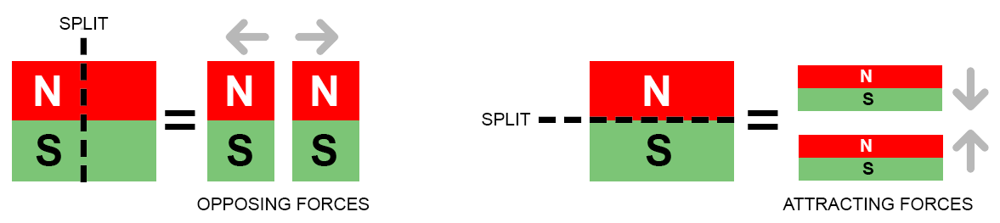

Most of what we have shown here involves how the movement of energy, in accordance to laws, brings form, and by extension, ideas, into existence, yet almost nothing is said about the nature of the energy itself, other than that energy in its purest form is ultimately an expression of awareness and intention.  Here we have six N-sources which hold the tholons together to form the center's creation.  In the quantum world, there is a similar concept of this energy that holds everything together, called *gluons*.  Gluons hold quarks together using the SNF.  Tholonically speaking, it is the laws, described as geometry in the thologram, that hold everything together.  Is it reasonable to wonder if the other forces that holds things together, which are electromagnetism, the weak nuclear force, and gravity, are also represented geometrically somewhere in this infinite maze of patterns?

Understanding the tholonic nature of these forces may well give us an insight into understanding the nature of the source of the energy, which is to say, understanding the nature of the Awareness and Intention that created this reality.

There is also an interesting relationship with the One Electron Theory.  This is a theory that theoretical physicist John Wheeler proposed (in a phone call at 2AM in 1940 with Richard Feynman) that there was just one electron in existence, and that all electrons were the same electron! This would be possible if that one electron was not subject to space-time, allowing it to be in all places simultaneously.  Wheeler also claimed that not only are all electrons the same electron, but all positrons are also the same electron moving backward in time.  As an electron it has a charge of -1, and as a positron it has a charge of +1.

The problem was, there was no space for a positron in the current model of the electron. In order to account for all the electrons in the universe, this one electron would have to move backward in time at least one time less than the number of electrons moving forward.  The thologram has a similar quality in that there is always one additional in each iteration of real tholons then there is virtual tholons.

If Wheeler&rsquo;s idea was correct, then there should be almost as many positrons in the universe as electrons, but there aren&rsquo;t.  Wheeler suggested that the missing positrons might be hidden within protons.  This idea does not work with the current theory that a proton consists of only two up quarks, each with a charge of +2/3, and one down quark with a charge of -1/3, as there is simply no place in the proton where a positron, with a charge of +1, could hide.

However, in the tholonic model, there *is* a place for the positron to hide, and that is in the virtual space of a tholon.  As was previously mentioned, there can be real tholons within virtual tholons.  As this virtual space also acts as a reflection for the other three trigrams of a tholon, it would act as the source of the positive charge of the reflection tholon&rsquo;s *child* tholon.  So, if the positron were to &ldquo;hide&rdquo; in the virtual space of the reflection tholon its charge of +1 would neutralize the -1 charge of the reflection tholon, which would presumably have sort of (testable?) effect on the real tholon.

This may sound ridiculous, but science has already proven that if you fill some small part of empty space with enough energy, electrons and positrons will magically appear out of nothing, or as it was described in a New Scientist report, &ldquo;Lasers Could Make Virtual Particles Real&rdquo;.  [^72]

But what about the electron? Where is that? tholonically speaking, the electron is a product of the imbalance of this hexagram which has a total charge of +1, and therefore it will automatically create an equal and opposite tholon (of an electron) with a charge of -1, which is also the total charge of the parent reflection tholon.  Where would this electron exist? At the opposite side of the N-sources across the scope of its children C and D, which is where N-sources manifest as stable expressions, i.e.  on the outer most edge of the hexagram.

In a complete and folded tholon, these three scopes create the three edges of the outer tholon that is opposite the reflection tholon, represented by the three black dots in ***Fig. q1a***.  As there are three different directions of these patterns, each 60&deg; apart, there is access to any active interface (which instantiates as an electron, or electron field) for every angle of the thologram.  If this were the case, we could speculate that an electron is the grand-child of all six N-sources (N-source -> black-dot children -> electron field) and/or it is the created child N-state of the parent N-source of the proton.

More importantly, those dots where the electrons would appear only exist on the boundaries of the self-similar (yellow) grid we just looked at above.  What this implies is that anything that uses electrons to exist, which is essentially everything, will naturally order itself in both a self-similar manner and in a way that can be mapped to that pattern.  Does this mean that everything that exists is somehow based on a self-similar hexagram?  This would suggest that this is the case.  However, layers of complexity could make that difficult to discover.  Perhaps a more important detail is that the thologram, or any model of reality, is only one perspective of a much greater multidimensional model, and being multidimensional, it can be perceived many different ways.  The tholonic claim is that all models, including those of our ancestors that lived in the wild and in a world dominated by spirits, plants, insects and gods, come from the same source.

Compare the crudely drawn 2D map of overlapping tholons (below right) and a diagram (below left) from an article by Ethan Siegel, Senior Science Contributor to Forbes magazine[^73], called &ldquo;*Can Free Quarks Exist Outside Of A Bound-State Particle?*&rdquo;  Notice any similarities?  For example, how there are two groups of quarks that correlate to the parent/children tholons, and how a parent color always matches with a child color, as in the blue/yellow, red/cyan, and green/violet pairings. The correlation might be even more significant if I had any clue how to determine which quarks (R, G, or B) are equivalent to the tholon&rsquo;s  N, D or C.

### Back to Basics

We can now map Newton&rsquo;s 2^nd^ law (in the form of Ohm&rsquo;s  Law) to the tholon, which fits nicely.

To apply Ohm&rsquo;s Law we have to correlate the N, D and C values to V, I and R, like so:

-   **N** (negotiation) as V (voltage - field of potential)
-   **D** (definition) with R (resistance - opposition to free flow)
-   **C** (contribution) with I (current - force of flow)

which allows us to state the following:

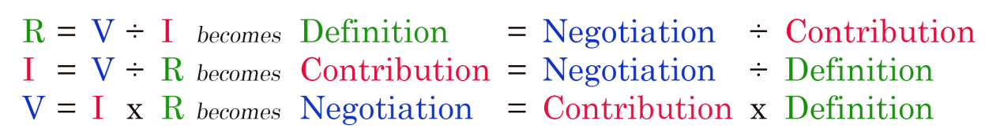

We've taken a big leap here by applying math to such abstract concepts and expecting so see something meaningful, but if we look as these definitions closer they might seem reasonable.

### The Meaning of Math

To look closer we need to make sure we&rsquo;re all on the same page regarding how the trigram can describe the math functions of Ohm&rsquo;s law, and to do that we need to clarify some really simple concepts, such as what do the math symbols mean in this context.

Addition and subtraction are easy concepts to grasp.  We take some number of things and add or remove some number of things.  But depending on the context even simple addition and subtraction requires some extra thought. A good example of this is how addition and subtraction affect colors. It is not intuitive to most people that *violet - cyan = blue*, for example, but once shown it makes sense.

What about multiplication and division then? In this context we will describe as *the definition of one value by the units of another value*.  For example, in division, such as 3=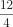 we are stating that 3 is what we get when we measure an existing value of 12 by a unit of 4.  In multiplication, such as *12=3&times;4,* we are determining a new value of 12 by combining three of these units-of-4.  The 4, as the divisor or multiplier, is the *unit of measurement* and the 3 is the *number of units*.  Every kid knows what was just stated, but when we apply those same simple rules and concept to a non-math context, they become very significant.  (For highly speculative thoughts on the meaning of squares and square roots see Appendix E &ldquo;*Meaning of Squares and Square Roots*&rdquo;)

As mentioned above, we would expect to see the same laws expressed in different ways across all the scopes that the laws apply to, so we would expect to see an example of Newton&rsquo;s 2^nd^ law in the tholonic realms of society, or planets, or organisms, and we do.  For comparison, we also show how the attributes of the tholon would appear using the same laws.  (Note: The lower case &ldquo;neg&ldquo; represents a new child N-state that results from the children of the parent &ldquo;NEG&rdquo;.)

For example, if we claim that a society is based on its ethics and we also posit that ethics are to be measured by laws, we can say *society=ethics&div;laws*, and likewise, *ethics=laws&times; society*.  If we measure the *power* of a *society* by its ability to function, and the measure of a *society* by its sustainability, then, according to these formulas, a *society* with a lot of *laws* and very little *ethics* will be functional but is less sustainable.  On the other hand, a *society* that had a lot of *ethics* and very few *laws* will have the same level of functionality but will also be very sustainable.

How can we say this? 

If we claim that individuals working together represents a *force*, then we might say that the *society* correlates with *current*.  If *ethics* represents the arena in which this *society* operates, then we could correlate *ethics* with *voltage*.  *Laws*, which define and control the *society* and its members, would then reasonably be correlated to *resistance*.  We are effectively assigning the values of *society=3*, *ethics=6*, and *laws=2*, but in this context the value of these numbers are not important. We are using the numbers just to show the relationships. The number itself is merely a concept of measure.  Power, which is the transference of energy over time, would then correlate to how much &ldquo;work&rdquo; this group could generate.  Perhaps this would in see in their social achievement, or productivity, or levels of cooperation, or whatever they decided their &ldquo;work product&rdquo; would be.

How these assignments were arrived at is not critical because they may differ depending on how one chooses to correlate, but this does not matter for the point being made.  

With these assignments, *society*=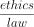follows the same reasoning as the formulas in the same PP, which is 3=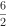 , so we can say :

- Case 1) *society = ==3*, therefore&hellip; *power = ethics &times; laws = 6 &times; 2=12*

Now, if we then double *ethics* from 6 to 12, but keep *laws* the same as 2, we get 

- Case 2) *society = = 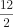=6*, therefore&hellip; *power = ethics &times; laws = 12 &times; 2=24*

But if we double the *laws* from 2 to 4, and keep *ethics* the same as 6, 

- Case 3) *society = =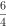=1.5*, therefore&hellip; *power = ethics &times; laws = 6 &times; 4=24*

In Case 1, which is the natural state, the *force* is **3** and the *power* is **12**.
In Case 2, where the *ethics* has doubled, so too has the *force* (**6**) and the *power* (**24**).
In Case 3, where the *laws* have doubled, the *force* is cut in half to **1.5** but the *power* remains doubled (**24**).

This would suggest that a lot of laws and little ethics leads to a society that is very unsuccessful in their goals, while a society with high ethics and fewer laws is far more successful in achieving theirs.

How these translate to the real world is only speculative right now, as it is up to the reader to decide if *laws*, *society*, *ethics*, and  *power* are the best concepts to use here and if so&hellip; 

- what *power* (the rate, over time, at which energy is transferred) represents.
- what *energy* itself generally represents in this context. 
- what the social equivalent of *squares* and *square-roots* are.

How would this look if we used concepts such as *natural rights*, *privileges* and *responsibilities*?

This can apply to any properly defined trigram.  Let&rsquo;s test it out on the cognitive behavioral trigram we mentioned previously.  For example, if we claim that a *behavior* is a product of *thoughts* (one&rsquo;s own or those one is exposed to) and we also posit that *thoughts* are to be measured by *feelings*, we can say *behavior = thoughts &div; feelings* and likewise, *thoughts = behavior &times; feelings*.  So, high *thought* with low *feeling* results in high *power* (whatever that is in this context..  intention? beliefs? desires? will?) and very low *behavior*, while low *thought* and high *feelings* results in equally high *power* but also high *behavior*.  I am not claiming that the values I have assigned for this example are accurate.  I suspect it would take quite a bit of discussion and research to find the best values.  The point of this is to suggest that with the correct values these equations would produce meaningful results.

The chart (below) is a speculative idea about how the naturally occurring relationships we see in nature, such as Newton&lsquo;s 2^nd^, might also apply across other scopes.  The formula wheel on the right is to numerically show how the four concepts (limitations, instantiation, range, power) of any instance of *knowledge* relate to, and define, one another.  (In this chart the concept of *power* is left undefined for all but *electricity* and *relativity*, as it is not clear how the would be described.&ldquo;

In any case, the twelve formulas of Newton&rsquo;s 2^nd^ show some very interesting relationships between ethics, laws, society, and &ldquo;power&rdquo;, and, in my humble opinion, a new perspective on the dynamics of culture and society that, if nothing else, raises some worthwhile questions.  As it applies here, it shows how the tholon can describe everything from atoms to culture.  Because the math involved in a tholon can be more than the reader might be interested in, some of this subject is covered more deeply in Appendix B, &ldquo;Tholonic Math&rdquo;.

Because the 3+1 reality of our Cartesian world, plus time, also maps neatly into the tetrahedron, we can actually correlate radically different contexts, such as space-time,  psychology, and electricity, to name a few.

With this in mind, let&rsquo;s reexamine the above claims:

**Definition = Negotiation &div; Contribution**

The definition of something is its boundaries, limits, abilities, attributes, properties, and resources.  All of these details are the results of the scope and context of that thing&rsquo;s instance.  It could be environmental factors, genetic attributes, planetary limitations, such as size and weight of a thing, energy levels, etc.  It is the nature of energy to expand in every way possible.  That expansion is the contribution, but it is the resistance from these factors that determines what expansions get the opportunity to be expressed and what expansions are thwarted.  That battle between the force of expansion and the force of resistance is the negotiation (*see Negotiation=Contribution &times; Definition*).  As *Definition* is *Negotiation* &div; *Contribution*, we can say that *Definition* is measured by that which is *Contributed*, or, the *Definition* of something is determined by what it can (sustainably) *Contribute*.

**Contribution = Negotiation &div; Definition**

What a thing can *Contribute* is measured by its *Definition*, but the degree to which it can contribute is determined by its environment and how it interacts with that environment.  That interaction is a result of *Negotiation*.  A thing must provide something that something in its environment needs, otherwise what it has to contribute is useless and unitegrable.

**Negotiation = Contribution &times; Definition**

A thing&rsquo;s ability to find a stable and sustainable position within its environment and scope is determined by the degree to which it can contribute with its current resources.  A thing may have a *Definition* that gives it a lot of A and a little of B, but if its environment needs a lot of B and very little A, then it is B that the thing must *Contribute* to ensure its existence in that environment, or it needs to find another environment, or change its environment so that A is in more demand.

Applying different values and concepts can result in new data.  We experiment with this a little, but given it is outside the main theme of this book, we have put that section in Appendix D, &ldquo;New data?&rdquo;

## And the point is?

The point of all this is to show one way that the tholon can be used and viewed.  There are many new ways of looking at energy in all its forms when viewed tholonically.

We showed examples of quarks and molecules, but in higher orders, such as DNA, we also see some striking similarities as well, and with a bit of investigation, we can probably find some stunning relationships.  *(DNA and how it is both tholonic and binary in nature is examined in Appendix I "The Tholonic I-Ching")*

DNA&rsquo;s relationship with tetrahedrons is particularly unique given the creation of tetrahedrally structured DNA, or TDN as it is referred to.  TDN is the cutting edge of DNA nanotechnology and has various applications such as drug delivery, inhibiting certain gene expressions, and of course, interfacing with bio-sensors.  These TDNs assemble themselves from scratch and offer greater strength and stability that the ol&rsquo; fashioned dual-strand DNA.  Given that there is little accessible information on TDNs there is not much more that can be said here, other then they look pretty awesome and will most likely be the origin of a new form of life powered by TDN-interfacing A.I. DNA-integrated quantum computers.

Our simple trigrams of relationships, such as Newton&rsquo;s  2^nd^ Law, becomes a *tetrahedron* or *tholon* of relationships.  Whereas before it was stated that every piece of knowledge can be deconstructed into a trigram, by the same token, every piece of knowledge forms a tetrahedron. With this more expanded tetrahedral model in mind, let&rsquo;s briefly jump back to the examples of deconstruction mentioned earlier.  

## Batteries

An example of how any system can be reduced to a tholon is presented in an insightful article on the effectiveness of batteries, titled &ldquo;The Unfortunate Tetrahedron&rdquo;[^74] .  This may seem fairly niche, but it turns out to be very relevant, which is not surprising considering that batteries are all about sources and movement of energy.  In this article, the author shows how the systems of a simple battery can be modeled as a tetrahedron, and how these fundamental aspects of a system relate to one another.  The author looks at the four aspects of batteries; *energy density*, *power density*, *operating cost* and *capital cost*, where:

**Energy density** (E) is how much energy a battery can store in its mass (like a dam).  **Power density** (P) is how much energy it can deliver relative to its mass (like the turbines in a dam).  **Capital cost** (C) is the cost of the battery.  **Operating cost** (O) is the cost to recharge the battery, and costs associated with keeping it safe.

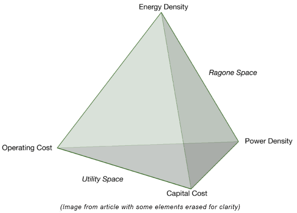

From this model we have four trigrams:

We can equate **E** with an *N-source*, **P** as a *defining* point, and **C** as a *contributing* point, which makes **O** the unifying &ldquo;white dot&rdquo; point (for brevity&rsquo;s sake I won&rsquo;t detail the reasoning behind these associations.  The reader may arrive at a different conclusion).  With this ordering, we end up with the 2D tholon map (above, showing the parent and next-gen children).

According to the article&rsquo;s own conclusions, the relationship between **E** (energy density) and **P** (power density), which is equivalent to an *N-source* and a *defining* point, is what he refers to as the *Ragone Space*.  The Ragone plot (right) measures the performance comparison of various energy-storing devices.  This chart is a perfect example of the axis of &ldquo;laws, rules and limits&rdquo; that connects an *N-space* with a *defining* point in the model of the tholon.

On the opposite side, between **C** (capital cost) and **E** (energy density), which is equivalent to a *contributing* point and an *N-source*, we have the tholonic axis of &ldquo;service&rdquo;, which I think also fits quite well if you consider giving your money to an organization or person for a product that fills a need is the definition of a &ldquo;service&rdquo;. Remember that the descriptions of &ldquo;laws&rdquo; and &ldquo;service&rdquo; were specifically meant to apply to the context of our daily lives.  In the realm of economics, production and specifically batteries in this case, that same intention might be described a bit differently.

According to the tholonic model, the only place where a new stable pattern capable of replication can occur is between *define* and *contribute*, which here is **P** (power density) and **C** (capital cost).  Across this spectrum of &ldquo;cooperation or conflict&rdquo; you will have all the various instances of batteries that can deliver power at a cost, most of the instances landing in the middle, representing the best delivery of power at the best cost.  *Power* and *cost* are the two poles, the contrasting forces, the thesis and antithesis, of this spectrum.  Here you would have instances like alkaline cell batteries (Duracell), lead-acid batteries (car batteries), nickel-cadmium batteries (rechargeable batteries), etc.  Each of these new instances (stable patterns), can then go on to create their own tholonic archetype.  As the author relates in his article, which so aptly fits into the tholonic mode as well, &ldquo;You can have it good, fast or cheap; pick two out of three&rdquo;.

## Circuits and the &ldquo;God Formula&rdquo;

There is another instance of this trigram model that holds tremendous potential, and that is electronic circuits.  One of the most common and important circuits in electrical systems is the very simple *resistor-capacitor circuit*, or *RC circuit*.  It is used to filter and control signals not only in man-made electrical circuits, but in natural electrical circuits such as neuro-transmission in the brain and throughout the entire nervous systems of any living organism.

No doubt the reader has seen such circuits as they exist in every computer system, alarm clock, microwave, and virtually all electronic devices.

Briefly, an electrical **resistor** is a component that can reduce the flow of current, adjust signal levels, divide voltages, and limit or control the current of a circuit in some way.  A **capacitor** is a device that stores electrical energy in an electric field.  In one way, a capacitor is like a battery in that is can store energy, but unlike a battery, it can not produce new electrons, it can only store existing electrons.  Air alone acts like a capacitor and is often used in radio circuits.

Let&rsquo;s  look at a simple RC circuit.

We have two basic elements of a circuit, one that limits and divides, and one that collects and stores.  These two concepts are perfectly in line with the two basic concepts of *Definition* and *Contribution* as shown in the *Alternate View* above.

How can we validate this similarity? Let&rsquo;s  look at the following:

- The N-state acts as both the source and the destination of the energy.  This would represent both ends of a battery, or a charge and a ground.

- The capacitor is returning the energy to the destination, and the resistor imposes restrictions on the source.

- Voltage originates in the N-state in this example, which is also the case when we assign electrical properties to the tholon, as we did in the section on Ohm&rsquo;s law, so there is consistency.

- The output of a RC circuit is a wave has a unique form showing an exponential growth followed by an exponential drop, 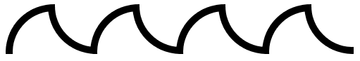. While the details of the form can change depending on the components, it always has the same characteristics of a sharp ascending and descending.  The interesting thing about this waveform is that is can be perfectly recreated by quadrants of a circle.  Of course, just because two things have the same shape doesn&rsquo;t mean they share anything else than the shape, but in this case it appears they share more. At the least, if the RC circuit *is* an instance of a tholonic trigram, then we would expect to see its output have some relationship to the thologram… and we do.

  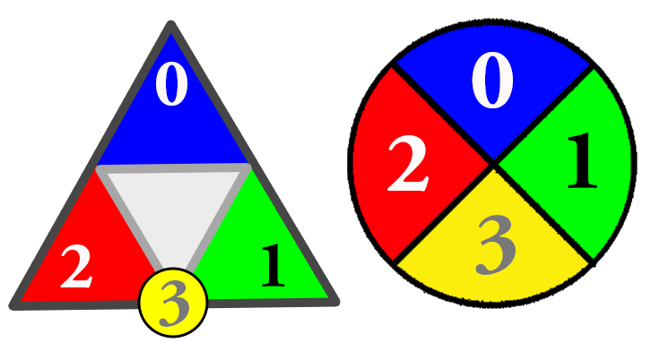The image below shows the output of an RC circuit as the result of overlapping circles.  We have divided those circles into 4 quadrants and numbered them tholonically, which means we use the *spatially* sequential values 0,1,3,2 (the *temporal* sequence is 0,1,2,3 because 3 can come into existence *after* 1 and 2,  but once 3 exists, it does so in-between 1 and 2)  of the 4 points of a tholon.  If we assign the these colors to those quadrants where 0=blue (parent N-state), 1=green (Limitation), 2=red (Contribution) and 3=yellow (child *n*-state), we find the same characteristics and patterns we see in the thologram, specifically, the 2D tholon map. For example:

  -  We see only the N-States (yellow and blue) overlap on their own color and alternate between parent&rarr;child&rarr;parent&rarr;child, etc., as we would expect.
  -  The D (green) and C (red) alternate in direction and pair up, and in doing to create a new child *n*-state (yellow).
  -  There is no square that has a piece of N (blue). It is either all N (blue), all *n* (yellow), or DC*n* (red-green-yellow).
  -  Every quadrant that is not exclusively an N-state contains all the the other attributes (red, green, yellow) which alternate only along the path of the *lineage* (parent&rarr;child).
  -  Each circle in the row is alternately flipped on both the N*n* (blue-yellow) axis of parent-child N-states and the across DC (red-green) axis. 
  -  The direction of the overlaps are the same as the path of the lineage in the tholon.
  -  The overlapping values are a product of 3 &times; 0, 1, 2, and in an order that creates a continuous oscillation 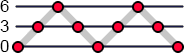. In addition, when these numbers are used as binary exponents (which we show why later) they all add up to 81: 2^3^ + 2^6^ + 2^3^ + 2^0^ = 8 + 63 + 8 + 1 = **81** = 9^2^ = 3^4^ = (3^2^)^2^ etc... We would expect to see a lot of 3-based numbers if this relates to the thologram.

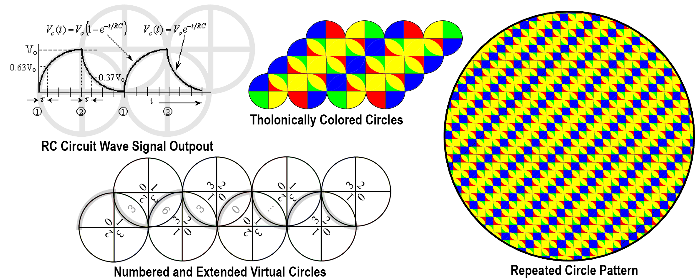

- In the tholon, the field in which the *n*-state can be created exists between D and C.  Here, that field is defined by *R* and *C*, which creates a field of *time*.  In electronics it is called the *time constant​* and is written as ***τ = RC*** (where ***τ*** s the Greek *tau* representing the *time  constant​*)  and proves that the voltage (*V*) and the current (*I*) are always inverse to one another at any moment in time and increase/decrease as a function of time.

This *time constant* is then used to calculate *V* and *I* using the formulas *V(τ)=V~B~(I-e^-τ/RC^)* and *I(τ)=I~0~(e^-τ/RC^)*.  The point here is not to explain the math, but to show not only that *V* and *I* relate to each other via  *R* and *C*, and by extension, *D* and *C*, but that they do so across a field that in the world of electronics is defined by ***e***, or 2.7182, the number of the *natural log*.  This is especially interesting when applying the properties of this RC field to that of the DC field of the tholon, because ***e*** is one of the most profound and fascinating numbers in nature! 

It is similar to *pi* in its significance, but where *pi* is the ratio between circumference and diameter shared by all circles, ***e*** is the base **rate of growth shared by all continually growing processes**.  It has also been called the **epidemy of universal growth**.  This growth can be anything; population, radioactive decay, interest calculations, even jagged or unpredictable systems that don’t grow smoothly.  Anything that has a continuous growth can be modeled with ***e***.  ***e*** is to growth what the radius is to the circle.

***e*** and the Natural Log, or *ln()*, are two sides to the same concept as ***e*** and the Natural Log are inverse, or opposite one another, so *ln(e)=1*.  ***e*** describes **growth**, and Natural Log describes **time**.  For example:

- ***e^x​^*** is the amount we have after starting at 1.0 and growing continuously for *x* units of time, so ***e^x^*** lets us **plug in time and get growth**.
- *ln(x)* (Natural Logarithm) is the time it will take to reach amount *x*, so *ln(x)* lets us **plug in growth and get the time** it would take.

Considering that the tholon is a model of growth, it seems particularly applicable that ***e*** would define the field from which new N-states spawn new tholons.

There is one more significance to ***e*** that is purely tholonic and will no doubt annoy math purists, but is added here because of symmetry.  As was just shown, the spectrum between *Definition* and *Contribution* is, in this context, defined by the value of ***e***. Referring back to how it was described that 1 point creates 2 points and 2 points creates 3 points, when we created the 2^nd^ point we had a 1D line from *Negotiation* to *Definition*.  However, we also had a center and a radius, thereby defining a circle.  In this way, the first two points implies the relationship between a radius and a circle, which is *pi*,  so were we to assign values to that 1D line , *pi* would be one of them.  If we accept the above premise that the value of *N*=0, the value of *D*=+1 (not to be confused with its position of 1), and the value of *C*= -1,  this makes the field within which new *n*-states can form along the spectrum of -1 to +1.  What value could we then assign to the line connecting points *N* and *C*?  Being that it is a value of -1 at position 2, one reasonable candidate is what ever value when multiplied by itself = -1&hellip; in other words, ***i***, the square root of -1.  This has a poetic ring to it as well if we imagine that the path that returns to nothing can&lsquo;t be a number. 

There are various rationales for why this makes sense, but the most attractive argument is because if this tholonic trigram represents the three values of ***e***, *&pi;*, and ***i***, we can construct what has been called the most elegant formula in math,  *+1=0*.  This is also tholonically elegant because just as the two children of N, -1 and +1, together equal N (0), it is the two children  of N, as  and +1, that also equal its parent N.  This formula integrates all the points and lines of the tholonic trigram into a beautiful concept.  In addition, as ***e*** represents time and *pi* represents space, we have the two dimensions of time and space, plus the mysterious, inexpressible value of ***i*** and the introduction of a *complex* dimension of numbers (complex numbers). This would also make the 4^th^ point a complex number, which I can only guess would be 0***i***, which is the same as 0 because 0 is the only point where the real and imaginary axes intersect. 

This beautiful formula is called *Euler's Identity* and is fundamental to the continuous exchange of energy that we perceive as time (where 0 equals the present moment), and a whole bunch of other basic ideas of reality.  So fundamental, in fact, that not only is it called the **God Formula**, it has been presented as empirical proof of the existence of god.  We are not that ambitious, pious, or learned, and simply call it a one archetypal instance of a tholon.

## Calculus

Calculus is another tetrahedral model that fits into the tholon nicely and could only be brought up at this point in the story.  Calculus is the study of continuous change (and therefore the study of reality) and has three main concepts that are quite compatible with the three main concepts of the tholon.

**Limits**

- **The values a function approaches.**  The *N-state* , being that it is a 0-dimensional concept, pretty much defines the lower limits an anything, but being nothing in a world of something, it also implies its inverse and opposite, infinity, the other upper limit of everything.

**Differentiation**

- **Defines the measure of things, resulting in derivatives.**  The existence of this conceptual 0-point implies the next point, *Definition*, which is the domain of 2 points and 1 dimension.  This makes *Definition* the domain of measurement, as measurement is fundamentally a 1-dimensional concept as no matter how many dimensions something has, it is measured as a series of one or more 1D measurements.  The existence of 1 now allows for the concept of all numbers (that are not 0).  However, these 1D measurements can&rsquo;t describe anything but a line.  To describe more than a line those 1D measurements need to relate to other 1D measurements.

- Derivatives are what calculus calls the results of comparing two points, and it is defined by the notation…

  

  …which means our results (the derivative of *n*) will approach its limits (exactness) as the difference in our measurements (*Δx*) approaches its limit (0).

**Integration** 

- **Uses the derivatives to calculate the area.**  The *Contribution* point of a tholon adds another dimension, so now we have 2-dimensionality (described by two 1D measurements).  In order to measure changes we need to look at a series of 2D points (which are made up of a series of 1D points, the *Derivatives*).  The less separation (*Δx*), where *x* can be time, space, some numerical variable, etc.)  between these points, the more accurate the results.  The smaller *Δx*, the more points (*n*) we have.  The sum of these points is expressed as the inverse notation of above:

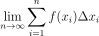

  … which means the sum of all the derivatives (*n*) starting from the first  (*n~1~*) up to the last (*n&infin;*), which will always be the inverse of the limit of the derivative, *1/0=*&infin;, but because we are dealing with infinitesimally small pieces, we use the integral function:

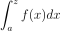

  … which says that we have an infinitesimally small difference between points (*dx*) that exist between points *a* and *z*.

The functional part of calculus exists between the **Differentiation** and **Integration** as that is the spectrum within which the fundamental theorem of calculus exists.  This is also the spectrum where child N-states can exist.

Perhaps there is a way to apply calculus to non-mathematical systems, like psychology, society, law, etc.?  This is far beyond my abilities, but I imagine it would look something like the calculus used in such things as Game Theory or the Nash Equilibrium (John Forbes Nash Jr.  was an American mathematician who created the Nash Equilibrium, for which he was awarded both the Nobel Memorial Prize in Economic Sciences and the Abel Prize.  He was the subject of the movie &ldquo;A Beautiful Mind&rdquo;).

## Stock Exchange

Economics is one of the best instances of tholonic processes. As we've mentioned, economics is as organic and natural an archetype as is any life form, and some are beginning to understand that.  To quote from the Santa Fe Institute's "Economic complexity: A different way to look at the economy." [^76]

##### Complexity economics asks how individual behaviors in a situation might *react to* the pattern they together create, and how that pattern would alter itself as a result, causing the agents to react anew.[^76]

This is a very tholonic concept, but for now, let's just look at how the thologram and the stock market overlap. 

The stock market is an aggregate of numerous values that are determined by the two constantly opposing forces of buying and selling.  While there may be many influential factors that drive those forces, the authoritative value in any one moment of time is a clear and indisputable number that has been agreed upon.  These opposing forces are illustrated in the chart below, where it shows the *depth* of each force and the ever-moving point where they cooperatively meet.  The X-axis is money, and the Y-axes is volume.

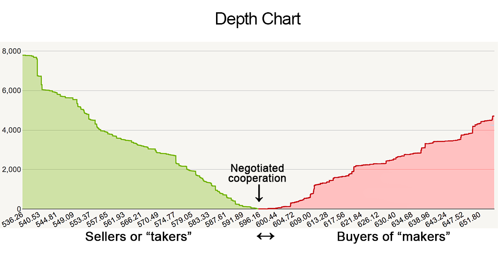

The record of these changes is what we recognize as a classic stock market chart.

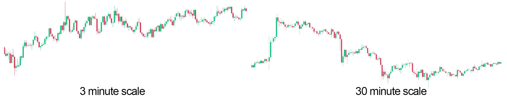

You'll notice the chart is not made up of dots, but of what are called *candlesticks*.  The candlestick is a very clever way to show information and was created by the Japanese in the 17^th^ century for the rice markets, and it is very applicable to the thologram.  The candlestick record is also called the HOCL bar because it records the  hi, open, close and low prices for a given period of time.

Why this is relevant is because each candlestick shows the two maximum opposing values valid for the time period. These would be the highest and lowest prices.  These two prices define the spectrum within which any cooperation *could* exist. The START and END prices represent the area within that spectrum where a cooperation *does* exist. As you can see by the 3 minute and 30 minute charts above, the spectrum and the agreements can vary wildly. Both of those scales are of the same asset and start at the same time. Equally significant is that what is ascending on the 3-minute scale can also be descending on a different scale. Of course, if we showed the two scales in proportion, you could see the the 3 minute scale agrees with the 30 minute scale, but that is irrelevant if the context of the trader is 3 minutes, not 30 minutes.  A trader would look at these two scales and simply think "Yeah, it went down, then it went up. So?", and he would be right, but we are not looking at the the price, or the time. We are looking at how and why different forces are at play only within a specific scope, similar to how traders look for patterns; fractal, Fibonacci, cup-with-handle, cup-without-handle, etc., regardless of time or price.

Another interesting process is how multiple candlesticks can be added together. The graph below shows two candlestick of some time period (*t*​), which when added together show show the aggregate of those two candlesticks.  That aggregate is equal to the single candlestick of *t&times;2*. So, if you want to see the aggregate of 64 1-minute period candlesticks you just need to look at the one candlestick of one 64 minute period.

What was just explained is exactly how tholons work as well, so we should be able to apply some of the laws of the tholon onto market data.  Let's use Ohm&rsquo;s Law again, as an example of applying a simple tholonic rule, to get the graph below (all data normalized to a scale of 0-1 and shows a moving average of Bitcoin/U.S. Dollar trades).  But what values would we use?  Fortunately, the choices seem obvious.

- **Volts** (blue line) is defined as the potential between the high and the lowest charge, so the **highest and lowest bids** would fit perfectly here.
- **Amps** (orange line), or current, is the volume of electrons in play and one moment, so volume of trades would seem to apply here.
- **Power** (green line) is defined as *power=volts&times;current*​, so we have to calculate the the power value here as *power=price range &times; trading volume*, even though I don&rsquo;t know what this would represent at this point.
- **Resistance** (maroon line) is also calculated from *price range &div; volume*.  However, this calculated value does not equate to the *actual* agreed upon **price**.  This calculated number is called the **Balanced Price**, as it represents the price that is perfectly matched to the volume and the price range, regardless of what the actual agreed upon price was.

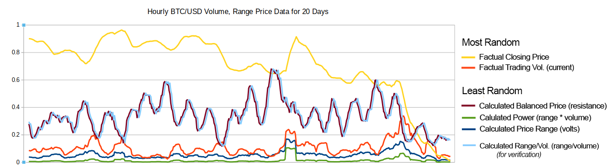

The light blue line on top of the maroon line shows two lines that represent the balanced price, but were arrived at in two different ways;   and , just to ensure they matched as expected.

Let's examine our calculated data to discover if it is more or less patterned or random than out input data.  The following chart shows the results of testing for randomness in a file made of over two years of hourly trade data using the same process.  The more *compressible* the data, the more pattern and order it has.  Also included are other random test scores, and as you can see, all indicators show that the generated data using Ohm&rsquo;s Law has more pattern that the source data.

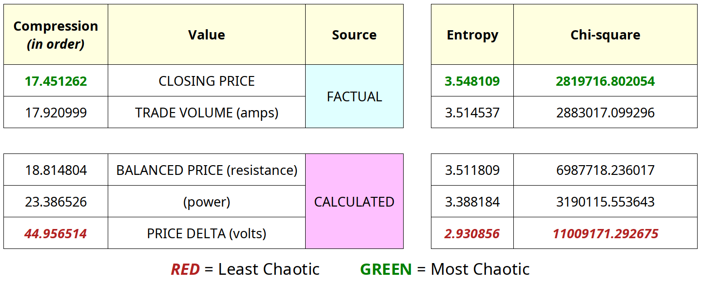

What this shows is that we can discover less random, more ordered data. What is surprising about this is that one might assume that one thing that has X amount to randomness combined with Y amount of randomness would result in something that is *more* random, but this is clearly not the case. Isn&rsquo;t that like throwing two handfuls of sand onto the grounds, and wherever they overlap there is a picture of a flower?  The implication is that neither of the two input values is actually random, and whatever pattern they are both hiding becomes clearer when they are combined.

While this may not set Wall Street on fire, for our purposes it is very interesting to see that the *balanced price*, which is derived from the market data, has a pretty clear and predictable pattern, and from data that arguably has only a loosely coupled relationship to each other i.e. the amount of assets traded and the range in which their prices were agreed upon. The yellow line is the actual price that took place (and the most random of the data), and the only obvious relationship is that *balanced price* appears to move somewhat contra to both the actual price and the trading volume.

Approaching this tholonically, we'd say that the balanced price will always represent the optimum relationship between volume and price range, both of which are always changing.  However, the actual traded price rarely reflects that relationship.  Consequently, the other variables in play will naturally adjust because (hypothetically) all three variables of price, volume, and range are actually three perspectives of one thing, one instance, one tholon.  Below, the upper chart shows the actual price (blue line) and the balanced price (orange line). Both values have been adjusted to a moving average for the day and normalized to a scale of 0-1.  Each vertical line represents one day and the 24 hourly candlesticks of that day.  The first thing you can see is how the balanced price remains within a tight and consistent range, while to actual price wanders all over the place.  The middle chart shows the same two lines, but the balanced price vales are added on top of the actual price values. We would have to assume that sometimes the force of the balanced price affects the actual price (by effecting changes in the other variables), and sometimes the actual price affects the balanced price due to the forces of the other variables effect on those variables. The bottom charts shows the two line on the same scale. Most notably, the two lines appear to counteract each other, pulling and pushing the actual price as if it was acting as a force of *resistance*.  This is especially interesting as the differences between the two lines, as we can see in the middle chart, appear very minor.

I have no doubt that serious research would yield interesting results. From the tholonic perceptive, knowing that perhaps the stock market, music, story telling, batteries, electrical circuits, and much more, all have a correlation is interesting, but suggesting they are all effects of a higher-order cause is much more interesting.

## Consciousness

The highly respected and published team of Donald David Hoffman (cognitive psychologist, author, and Professor in the Department of Cognitive Sciences at the University of California, Irvine) and Chetan Prakash (PhD Mathematical Physics, Cornell University) developed the idea of a *conscious agent*, which is a dynamic process of consciousness and argue that it is the interaction between various agents that produce measurable phenomena such as the position, momentum, and energy of objects.  They further argue that these objects have no objective, absolute or even preexisting properties and only exist in relation to consciousness via these *conscious agents.* This is a radical claim, but their arguments and evidence as laid out in it their paper &ldquo;*Objects of consciousness*&rdquo; [^77] can&rsquo;t be ignored.  What also can&rsquo;t be ignored is the striking similarity between the two models, as shown below.  (This was also especially striking for me as I learned of this long after the first draft of this book.  Of course, they do a far better job of explaining their idea technically, mathematically, and psychologically.) 

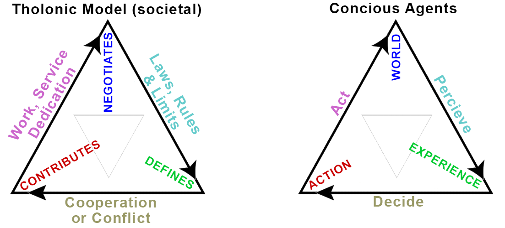

## Adding Structure

A general prediction would be if we could add structure to form, thereby increasing its ability to &ldquo;work&rdquo;, we would see testable results.

Given how water seems to be such a good tholonic medium, can we add structure to water in a way that matches and/or enhances the patterns of the thologram and see some differences in how it transmits or interacts with energy? If we do see any differences, then we have another piece of potential evidence that supports the tholonric model.

As it happens, there is such a thing as *structured water*.  *Coherent* or *Structured* water, for those who are not familiar with the term, is regular water that has been modified to give it more structure or pattern, specifically in the way that the water molecules are arranged in relation to one another, or so it is claimed.

OK, I know I probably lost some of the readers with this last sentence.  If you do an Internet search of &ldquo;structured water&rdquo; one of the first results you will get is the Wikipedia entry that begins with &ldquo;structured water is a term used in a marketing scam&rdquo; and although that is true to the extent that anything can be a scam in the hands of scammers, the entry says nothing whatsoever on the research and testing that has gone into the use of structured water.

To the dogmatically skeptical, anything that challenges the current world view is &ldquo;swarming with worms of heretical perversity&rdquo;. It doesn&rsquo;t matter if a new idea, in this case, structured water, has vast amounts of scientific research and support from highly accredited professionals and ample evidence one can find by researching the pioneers and leaders in the field, many with a lifetime of contributions and dozens of Chairs, Fellows, and Adjuncts with Accolades of their life&rsquo;s work[^78], as well as hundreds of papers and dozens of books related to and supporting the structured water phenomena.  Skepticism has its place and serves a critical purpose, but regarding the extreme skepticism of structured water, that purpose does not seem to be moving understanding forward or seeking new solutions to real-world problems, such as solving global water shortage problems and increasing crop production, as has been well documented by some of Australia&rsquo;s largest produce farms.

There is quite a lot of good research on the subject that we won&rsquo;t detail here, but if you want to learn more a good place to start is Fabian Ptok&rsquo;s Masters theses *&ldquo;Alternative Irrigation Methods: Structured Water in the context of a Growing Global Food Crisis due to Water Shortages&rdquo;*[^79], which covers the subject well from an agricultural and security perspective but also has a number of references to the researchers and work going on in this area.  One of the often cited studies showed dramatic result in decreasing blood and DNA damage in diabetic rats, but this study is also criticized as it was small[^303] . There is also a book by Professor Gerald Pollack, who has an impressive list of credentials[^304], and is available online for free[^80] (which I have not read, so this is not an endorsement or recommendation).  Another good source is the work of Marcel Vogel (more on him later) who claimed that through years of work and thousand of experiments he was able to prove that various forms of energy, including thought, could permanently change the spectrographic properties of water, [^301] and that water was an information storage system.  This last claim is especially significant considering Vogel was not only a chemical and physics researcher at IBM for 27 years, but he was an information medium specialist, holding patents of hard-drive memory technologies that are in use to this day.

Water is a particularly good test medium because the structure of molecular water is tetrahedral, and being the most basic shape of creation lends itself to many different tholonic applications.  It&rsquo;s worth noting that when it was originally suggested that water might be tetrahedral in shape back in 1938 the idea was met with disbelief.  It was not until 80 years later, in 2013, that this was finally accepted as valid.  Today &ldquo;it is widely accepted that liquid water structure is comprised of two closely interweaved components; i.e.  tetrahedral and hexagonal structures&rdquo;.[^81] In fact, water, as ice, may be the closest instance of the entire tholon&rsquo;s structure of any other substance (that is common to us).

*(Above: Left image from &ldquo;Tetrahedrality is key to the uniqueness of water&rdquo; [^82])*

The *silicate structures* of minerals are also quiet similar in that they are made up of tetrahedrons of various arrangements.  In fact, the structure of water and quartz is so close that in some conditions ice has the same (or really similar) structure as quartz! [^302] This lends some credence to the metaphysical idea that water and quartz have a special relationship.

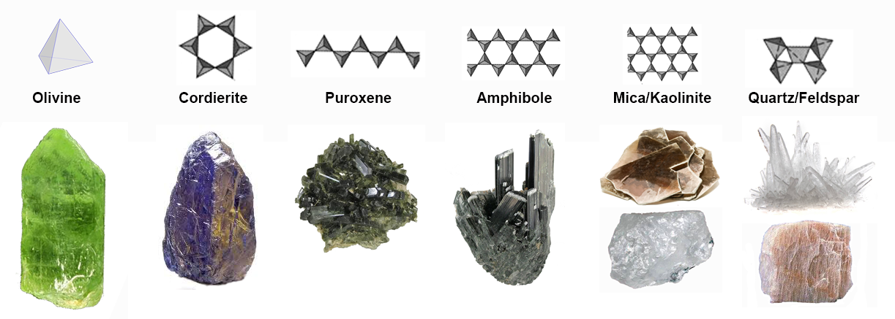

Radical ideas are often met with radical resistance.  Structured water is one of those ideas.

Simply by adding some structure to simple tap water (see examples of how to make structured water in Appendix A) we can see measurable effects.

In Ptok&rsquo;s Master&rsquo;s thesis mentioned above, the author examines various tests that grew different plants using tap water and structured water.

One of his findings was that using structured water increased alfalfa growth by 15.1%.  This may not sound like much, but in the U.S.  alone a 15% increase in alfalfa growth represents an additional 20,700,000 tons of alfalfa, which has a value of over 4 billion dollars.

Similarly, some of Australia&rsquo;s largest produce farms have reported needing 25% less water to produce a superior product than with traditional water (more details in appendix).

This is a perfect example of how the simple enhancement of order at the most fundamental level can have radical changes up the chain.  These dramatic results were achieved with only one change to one element in one application.

In the tholonic model, this example also applies to ideas, concepts, and intelligence;  small changes in one area can have radical consequences in the world of ideas, and of course, ideologies.

[^52]: &ldquo;**Quantum Gravity Research**&rdquo;. Quantum Gravity Research, <https://www.quantumgravityresearch.org>.
[^53]: "**Emergence Theory Overview.**" Quantum Gravity Research. Accessed August 07, 2020. https://quantumgravityresearch.org/lay-person-overview.
[^54]: Smith, F. D. (n.d.). **E8 Root Vectors from 8D to 3D** - Valdosta, Georgia. <http://www.valdostamuseum.com/hamsmith/E8to4Dand3D.pdf>
[^55]: What **is Reality? Emergence Theory Tries to Explain**. (2017, March 11). <http://www.deepstuff.org/what-is-reality-emergence-theory-tries-to-explain>
[^56]: Jgmoxness. (n.d.). **Visualizing a Theory of Everything**! <http://theoryofeverything.org/theToE/tags/e8>
[^57]: Amazing description of how the E8 crystal can be defined as tetrahedrals. <https://quantumgravityresearch.org/portfolio/a-deep-link-between-3d-and-8d>
[^58]: **Gottfried Wilhelm Leibniz**. (n.d.). <http://www.wikiwand.com/en/Gottfried_Wilhelm_Leibniz>**, Leibniz and the I Ching**. (n.d.). <http://www.wikiwand.com/en/Binary_number#/Leibniz_and_the_I_Ching>
[^59]: **Gottfried Leibniz**. (n.d.). Retrieved from <http://history-computer.com/Dreamers/Leibniz.html>
[^60]: Abrantes, R. (2018, November 19). **How Wolves Change Rivers** \| Ethology Institute \| Read and Watch Now. Retrieved from <https://ethology.eu/how-wolves-change-rivers>
[^61]: Grzegorz Rozenberg and Arto Salomaa. **The mathematical theory of L systems** (Academic Press, New York, 1980). ISBN 0-12-597140-0
[^62]: In that it applies the syntactic features of natural languages. This is mentioned in the book: Prusinkiewicz, Przemyslaw, et al. **The Algorithmic Beauty of Plants**. Springer, 1996. This book is also available online. The relevant chapter is http://algorithmicbotany.org/papers/abop/abop-ch1.pdf. This site in general is an excellent resource for algorithms of nature.
[^63]: Quijada, John. **A Grammar of the Ithkuil Language**. John Quijada, 2011.
[^64]: Speaks, Jeff. **&ldquo;Theories of Meaning&rdquo;**. Stanford Encyclopedia of Philosophy, Stanford University, 27 June 2019,<https://plato.stanford.edu/entries/meaning>
[^65]: Example of a &ldquo;person&rdquo; as defined by the semantic web: <http://xmlns.com/foaf/spec/#term_Person>
[^66]: McCrae, J. P. (n.d.). **The Linked Open Data Cloud**. <https://www.lod-cloud.net>
[^67]: Wang, Y., & Kosinski, M. (in press). **&ldquo;Deep neural networks are more accurate than humans at detecting sexual orientation from facial images&rdquo;**. Journal of Personality and Social Psychology; Newspaper article on this research: Levin, Sam. **&ldquo;New AI Can Work out Whether You&rsquo;re Gay or Straight from a Photograph&rdquo;.** The Guardian, Guardian News and Media, 7 Sept. 2017, <http://www.theguardian.com/technology/2017/sep/07/new-artificial-intelligence-can-tell-whether-youre-gay-or-straight-from-a-photograph>
[^68]: &ldquo;**Reciprocal Theory**&rdquo; RationalWiki, <https://rationalwiki.org/wiki/Reciprocal_Theory>.
[^69]: As a relevant aside, this reversing effect has a material analog called the *Janibekov effect,*(among other names). It is well established in the field of mechanics and is most easily observed in space where there is no gravity. On observing it for the first time one would think the impossible is happening, but in fact, it is a basic law of energy that we rarely get to see here on Earth because of gravity. Imagine an asymmetrical rigid body, like a wing-nut or a or handle, rotating around one of its axis, then suddenly, it flips 180&deg;, and continues to rotate around the same axis, but in a reverse position. After a few moments, it flips again, and continues flipping back and forth indefinitely. It does this because the lowest energy state, which is the state that all matter seeks, requires the maximum amount of inertia, and the maximum amount of inertia will always be where the most mass is. Given that the object is asymmetrical, the amount of mass for each axis will change, causing the object to change position. A quick search for &ldquo;Janibekov effect&rdquo; will yield many fascinating videos on this phenomena. This phenomena is worth mentioning because it is a perfect example of how energy operates in form, and, presumably, in the archetypes of form as well, which, at least tholonically, are asymmetrical tholons.
[^70]: Fuller, R. Buckminster, and E. J. Applewhite. ***Synergetics. Explorations in the Geometry of Thinking***. Macmillan, 1975.The entire book can be found online at <http://synergetics.info>
[^71]: References to the above come from <http://synergetics.info/s02/p0000.html>
[^72]: Shiga, David. “**Lasers Could Make Virtual Particles Real.**” *New Scientist*, 17 Aug. 2010, www.newscientist.com/article/dn19327-lasers-could-make-virtual-particles-real/. Full PDF of "Physical Review Letter" available at https://www.researchgate.net/publication/46424619_Limitations_on_the_Attainable_Intensity_of_High_Power_Lasers/link/0deec517bda95ef500000000/download.
[^73]: Siegel, Ethan. “**Ask Ethan: Can Free Quarks Exist Outside Of A Bound-State Particle?**” Forbes. Forbes Magazine, August 3, 2019. <https://www.forbes.com/sites/startswithabang/2019/08/03/ask-ethan-can-free-quarks-exist-outside-of-a-bound-state-particle>
[^74]: Steingart, Dan. “**The Unfortunate Tetrahedron**.” Medium. the unfortunate tetrahedron, May 30, 2017. https://medium.com/the-unfortunate-tetrahedron/the-unfortunate-tetrahedron-ce1e44d0b961.
[^75]: Adam Smith, "An Inquiry into the Nature and Causes of the Wealth of Nations", 1776, London
[^76]: Institute, Santa Fe. "**Economic Complexity: A Different Way to Look at the Economy.**" Medium. November 03, 2014. Accessed August 02, 2020. https://medium.com/sfi-30-foundations-frontiers/economic-complexity-a-different-way-to-look-at-the-economy-eae5fa2341cd.
[^77]: Hoffman DD, Prakash C. **Objects of consciousness.** Front Psychol. 2014;5 577. doi:10.3389/fpsyg.2014.00577. PMID: 24987382; PMCID: PMC4060643.
[^78]: <http://hexagonalwater.com>
[^79]: Ptok, Fabian, &ldquo;**Alternative Irrigation Methods: Structured Water in the context of a Growing Global Food Crisis due to Water Shortages**&rdquo; (2014). Undergraduate Honors Theses. 182. <https://scholar.colorado.edu/honr_theses/182>
[^80]: Fonseca, Giuseppe, and Giuseppe Fonseca. &ldquo;**Dr Pollack The Fourth Phase of Water.**&rdquo; Academia.edu, <https://www.academia.edu/18516517/Dr_Pollack_The_Fourth_Phase_Of_Water>
[^81]: Chara, et al. &ldquo;**Crossover between Tetrahedral and Hexagonal Structures in Liquid Water.**&rdquo; Physics Letters A, <http://www.academia.edu/21730774>
[^82]: Staff, Science X. "**Tetrahedrality Is Key to the Uniqueness of Water.**" Phys.org. March 27, 2018. Accessed July 28, 2020. https://phys.org/news/2018-03-tetrahedrality-key-uniqueness.html.
[^301]: http://marcelvogel.org/LabNotesMarcelVogel.pdf
[^302]: **Structure of hydrogen-stuffed, quartz-like form of ice revealed.** (2017, January 04). Retrieved October 10, 2020, from https://gl.carnegiescience.edu/news/structure-hydrogen-stuffed-quartz-form-ice-revealed
[^303]: Lee, H., & Kang, M. (2013). **Effect of the magnetized water supplementation on blood glucose, lymphocyte DNA damage, antioxidant status, and lipid profiles in STZ-induced rats**. *Nutrition Research and Practice,* *7*(1), 34. doi:10.4162/nrp.2013.7.1.34
[^304]: Gerald Pollack. (n.d.). Retrieved October 19, 2020, from http://wiki.naturalphilosophy.org/index.php?title=Gerald_Pollack

