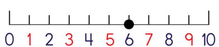
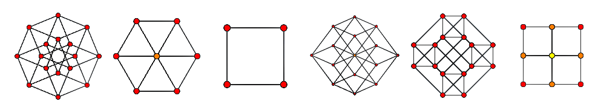
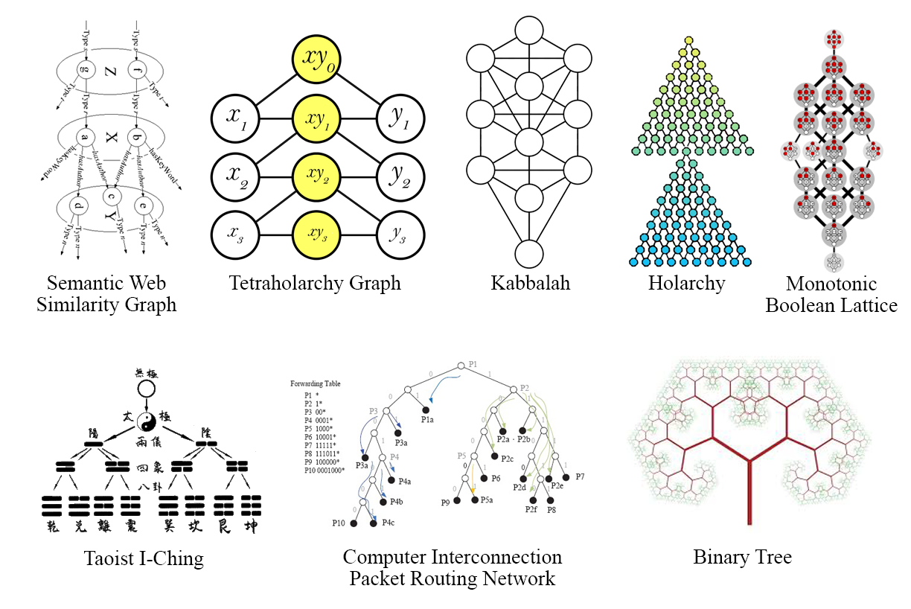
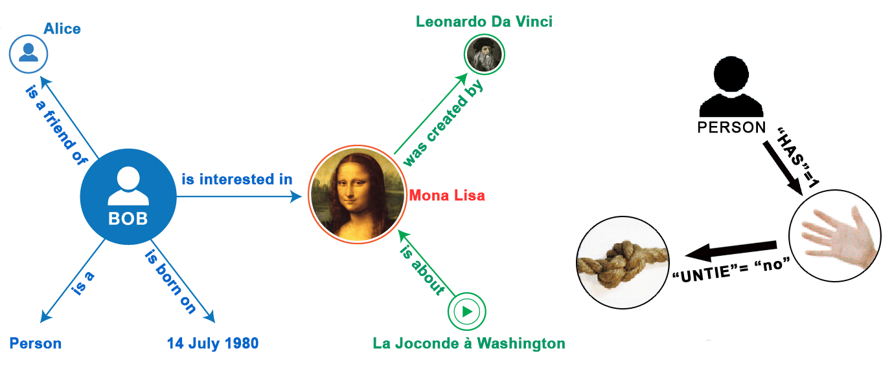
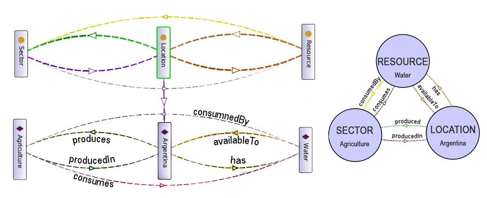
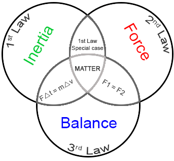
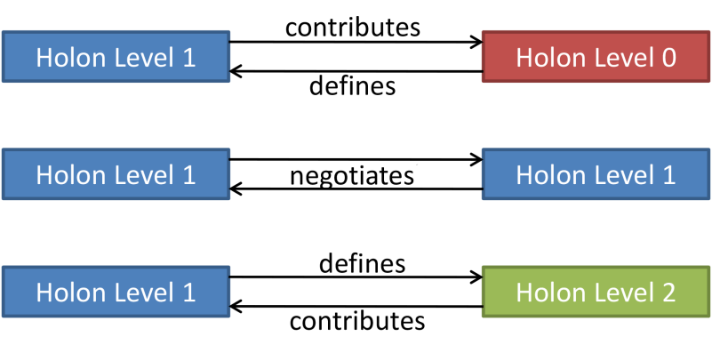
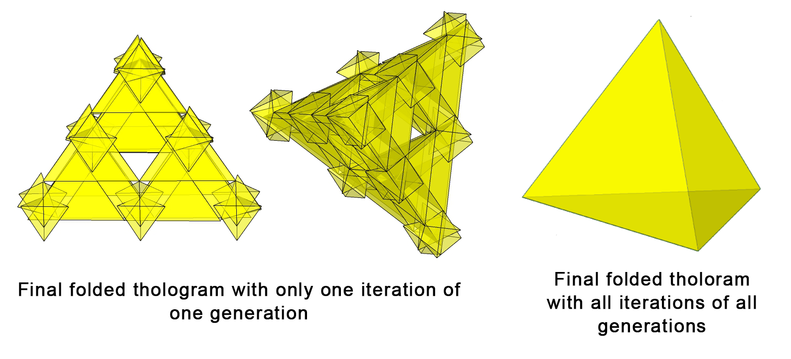

# 7: STRUCTURE

###### Knowledge and information, like form, have structures that follow the same rules as form.

Everything up until now was to introduce some of the main concepts that we will be returning to and depending on as we move forward an into the main ideas that lead from the ultimate simplicity of a duality to more complex structures that describe the reality we actually live in.

On a practical level, this complexity is no different than how we deal with the physical world in our every-day lives.  When you hold a brick in your hand you are holding trillions of atomic particles, with countless interactions, fields, energy levels, etc., but you don’t need to know that to build a house of bricks.  When you drop the brick and it falls, you’re not thinking about the nature of time, gravity, and warped space.  Likewise, to manage the “bricks” in the realm of Ideas, you also don’t need to know all of the details, but it is helpful if you have an understanding of how they generally interact with each other so you don’t try and build a “house” made of “bricks” and “oranges”.

That said, let’s touch on one more concept that is fundamental to structure in general.

## How Many Dimensions Are There? 

There are two concepts of dimension to consider, *location* and *instance*.  

The location of a thing relates a thing to its environment.  When we say something has three dimensions what we are really saying is something that exists within the same multidimensional reality that we exist in, and under the same conditions, has three relative measurements of height, width, and length that indicate the difference between two relative points.

When we say a nail is two inches long, we are referring to the difference between the position of the head of the nail, and the position of the tip of the nail, for one axis only.  We have no idea what the universally absolute coordinate system is, but we assume it is the same for everything in our reality.

An object actually has many, many dimensions, it’s just that the only ones that matter to us are the three we use, because all the other dimensions remain the same (enough) for all things that are in the same system (planet Earth, for example).

Imagine that the speed of light was 55 miles per hour.  If you were to stand on the side of a highway, all the cars would look extremely squished, like a few millimeters in length, but the car’s mass would also be much larger.  On top of that, time *inside* those cars would be much slower.  Space-time measurements would be very strange if we had to deal with two different space-time contexts.  Because everything we deal with exists in the same space-time context, if I need a part for my car delivered tomorrow that is 1"x2"x3", when I order it I am confident it will be 1"x2"x3" and arrive within 24 hours because I assume that whoever I ordered that part from lives in the same reality and context as me and is not an alien-owned intergalactic warehouse in the 4^th^ dimension traveling close to the speed of light through a worm hole.

The classic explanation of a dimension goes something like *“If something has only one dimension you only need one number to know its exact location”.* In the case of 1-dimension, like in the number line below, if there was a dot on number 6, the dot has a dimension of 6.

This is true when, and only when, the position of the measurer and the thing being measured share the same context, as the value of 6 is only relative to that context.  If we wanted to give the absolute position of the dot, we would need to include the coordinates of where in the universe that dot exists, which would require the coordinates of who-knows-how-many larger contexts it was in when it was measured; where on the planet, in the solar system, in the galaxy, in the multiverse, and all of those with the dimension of time, as they are all moving, and even then it would only be relative to the Universe as we know it.  So, even a simple 1-dimensional dot can have a lot of dimensions when measured from a different context.  Consider that when you realize that in every second of your life you travel at least 627 km/s across various dimensions and scopes if you account for the movement of the Earth, Sun, Milky Way, etc. 

The *instance* of a thing has nothing to do with its environment and only relates to the thing itself, which we describe using 3 dimensions.   

It’s as if we have *subjective* dimensions, with are the dimensions relative to the thing alone, and the *objective* dimensions, which are the dimensions of the thing relative to all other things (the Universe).

What can we say about what all *things* have in common? Well, we can say at least the following:

-   All things have 3, and only 3 dimensions.
-   All things are made of other things (except the “first” thing?).
-   All things are the most efficient form of that specific thing.

This last statement might raise a few eyebrows.  The claim here is not that any particular thing is the most efficient form of its perfect archetype, but rather the most efficient form for that particular thing under the conditions it exists in any particular moment.

If these statements are true, then this would imply that the most primitive thing that can exist, the simplest and most efficient form possible, is the tetrahedron.  It has 3 dimensions, but it is *not* made up of other things because when you remove any one point, it collapses to 2 dimensions, and no *thing* can be 2D.  Therefore, it must be the very first *thing* to come into existence, at least conceptually speaking.

As a pattern of order, it *is* one of the first to appear in nature.  In its most obvious form, we see this structure when we stack spheres on top of one another.  If we stack other shapes, the structure will be altered to the degree the shape is not a sphere, but the tendency for all things that are connected to each other will be to form a tetrahedral structure to the degree the shape of the things connected will allow.  You may be thinking “*Well, spheres form tetrahedrons, but cubes form larger cubes*”.  This is true, but because the sphere is a simpler, more efficient, or primal form than a cube, the patterns spheres make are also more efficient and primal, and therefore the first pattern of order that represent the path of least resistance.

If the tetrahedron is the first thing that can be created, this would suggest also that every *thing* that exists is ultimately made of tetrahedrons, and that they are the smallest *thing* that can exist (again, conceptually speaking).  This might sound like a radical departure from our current thinking, but it’s not *that* radical a departure as this is exactly what *Emergence Theory: A Theory of Pixelated Spacetime”*[^52] claims as well (more on that in a moment).

> In our 3D quasicrystalline reality, the tetrahedron is the smallest, indivisible unit.  A 3D pixel of reality, if you will.  Each tetrahedron is the smallest possible 3D shape that can exist in this reality: the length of each of its edges is the Planck length (the shortest possible length known in physics – over 10^35^ times smaller than a meter).  These 3D pixels combine with one another according to specific, geometric rules, to populate all of space.  **~ “Emergence Theory Overview”.  Quantum Gravity Research[^53]**

The model that this book describes suggests that the rules that apply to these 3D pixels that populate all of space extent beyond space to all of reality, including the invisible worlds of ideas, archetypes, and all forms of energy.

## On the Small Side

Science has been grappling with the idea of tiny particles for some time.  First, we had the grains of sand and dust, then atoms, then electrons, protons, and neutrons, then finally, quarks, which, so far, seem to be the most fundamental layer of matter.  The problem is, quarks are “almost” infinitely small, which creates all sorts of problems because science has a difficult time with infinity.  To solve this, they came up with the idea that reality is made not of really tiny particles, but really tiny vibrating 11-dimensional “superstrings”. Unfortunately, for all the evidence they have found to support this theory they might as well have said reality is made up of angels dancing on pinheads.

The quark remains the undefeated champion of tinyness, but “almost” infinitely small is not the same as infinity small.  How “almost” is it? One 43 billion-billionths of a centimeter (0.43 x 10^−17^ meters).  Remember that number, 10^−17^.

## On the Big Side

Jumping to the other end of the scale we have some pretty big things in the universe, the largest we know of being the *Hercules-Corona Borealis Great Wall.* This is a gravitationally bound galactic supercluster about 10 billion light-years wide.  That is pretty, pretty big.  What could be bigger than that? How about something with 4 dimensions? Would an extra dimension increase the size of something? Well, is a 2&times;2&times;2 cube bigger than a 2&times;2 sheet of paper, and is a 2&times;2&times;2&times;2 hyper-cube bigger that a 2&times;2&times;2 cube? What would a 2&times;2&times;2&times;2 cube look like? In the 3D world, it would look like a regular cube, because we can only see 3 of the 4 dimensions, but turn it a little (in 4D space) and the 4D cube will appear as two 3D cubes, or a hexagonal prism, or rhombic dodecahedron, or a cuboid.

Here is what a hyper-cube (4D cube) looks like when it is rotated and projected onto a 2D space, like a shadow (orthographic projection).

What about something that is 5D, or 6D or 7D? Each one would be bigger by an order of magnitude.  How about something that is 248D? That would be very, very big.  If something was bigger than the Great Wall in 248D how big would it appear in 3D? About the size of a small travel bag!! OK, you’re probably thinking *“248D!? That’s ridiculous!”*

## Crystal Power

So, there’s this magic 248-dimensional crystal (actually, it’s 8 dimensional with 248 not-necessarily-spatial, but not not-necessarily-spatial, dimensional symmetries, but as an algebraic expression it is considered to have 248 dimensions&hellip; at least that is what I am told) called the *E8 crystal*, and this reality of ours is (presumably) but a number of 3D refractions of energy created by the various facets of this crystal that are cast upon the 3D canvas of the void that is our universe from the higher dimensions of magic-crystal-land.  As modern as this sounds, this was first proposed in the late 1800s, but it has only been recently that we have the computing power to give it a test drive.

This sounds pretty compatible with the Simulation Hypothesis.  I wonder if they know about each other? It also sounds crazy, I know, but, it’s a real thing.  Just do an Internet search for “*emergence theory tetrahedron”* and *“The theory of everything quantum symmetry E8 lattice”* and browse through the million-plus links that discuss it in painful detail, emphasis on the *painful* part, because most of the content is unintelligible to those not intimately familiar with the algebra of differentiable manifolds, quantum gravity and a bunch of other stuff I don’t even know how to reference.  However, that is not important to know for our purposes.

It should be stated that this theory is not accepted by all, and some scientists are definitely in the “swarming with worms of heretical perversity” camp regarding the magic crystal of reality.  I don’t have any opinion about the Emergence Theory (ET) other than it sounds fascinating, mainly because I am not qualified to have an opinion.  The only reason it is being mentioned is because ET supports many of the claims that are made here, which were arrived at with no knowledge of ET.

This E8 lattice (that’s its technical name, also called a *quasicrystal*, but *magic crystal* sounds much cooler) seems to be able to describe all sorts of things: space-time (both types, Minkowski and Kaluza-Klein versions.  Yes, we have two types of space-time, because it’s always better to have options), fermion particles, gravity, subspace, dark matter, quarks, positrons, neutrinos, Fibonacci relationships, and a bunch of other stuff, including “ghost particles” (which are really, really old neutrinos that were created during the Big Bang 15 billion years ago and have no charge, no mass and do not interact with any of the forces that form matter, just like regular ghosts, but really small and old).

Here is a page from a paper[^54] that describes the E8 lattice.

As you can see, the whole space-time part of the E8 lattice is just a small part of one of the 3D projections of an 8D slice of a 248D super-thing, leading one to wonder what other forms of reality it has the magic power to conjure up.  Not surprisingly, this E8 lattice can be deconstructed to (or perhaps is constructed by) a series of tetrahedrons.

A significant aspect of *Emergence Theory* (for us) is their claim that:

> &hellip;all of reality is made of information.  What is information? Information is meaning conveyed by symbols.  Languages and codes are groups of such symbols that convey meaning.  The various possible arrangements of these symbols are governed by rules.[^55]

Here are a couple of beautiful images of the countless faces of the magic E8 crystal to ponder.[^56]

Just as a fun comparison, check out the following cymatic patterns.

The E8 crystal of *quantum symmetry* and *emergence theory* hypothesize that all matter is a projection of countless “pixels” that are really, really small tetrahedrons[^57], each about 1.61 x 10^-35^ meters in size.  Remember the size of a quark, 10^-17^? This is a *lot* smaller.

It might sound like this is mixing apples and multidimensional oranges, using definitions from *emergence theory* on one side of the scale, and definitions from *quantum symmetry* on the other side, but both of these theories integrate quantum mechanics, general and special relativity, the standard model and other mainstream physics theories to form a complete, fundamental picture of a universe unfolding from implicity to explicity.  The main difference between these two models is that the *E8 Crystal* describes the mechanics of creation, while the *emergence theory* attempts to describe the syntax of its operation using the language of geometry.

#### **Claim 41:** Geometry and mathematics are the language of archetypes.

Here we have a duality that encompasses the entire spectrum of 3D reality, at least.  On one end, the *alphahedron*, which is the smallest structure theoretically possible, that being the tetrahedron, and on the other end, the *omegahedron*, the most complex physical structure in existence, which currently seems to be the 248D-ish magic crystal.

## The Structure of Knowledge

Now we can begin to integrate dualities into the holarchy.

#### **Claim 42:** Just as subatomic particles are structured energy, atoms are structured particles, and molecules are structured atoms, information is structured data, knowledge is structured information, and ideas are structured knowledge.

#### **Claim 43:** The concept of a thing and the thing itself are the same things on two different levels of order.

Both scopes of matter and ideas represent how a form of pure energy in its chaotic state is converted into order using the same laws as they apply to the relevant contexts of their scope.  In one case,  energy is ordered and expressed as matter and in the latter case as concepts.  This is how it relates to holarchies, as holarchies can map not only the naturally occurring hierarchy of the concepts of *reality* (atoms, plants, people, etc.) but also the concept of *concepts* (domains of science, religions, culture, etc.).

If we applied our ideas regarding duality to the holarchy it would look something like this graph (above): We start with a concept *XY~0~*, followed by its thesis *Y~1~* , which creates its antithesis *X~1~* .  Within this duality of *X~n~* and *Y~n~* , or thesis and antithesis, arises the synthesis that acts as the seed for a new concept *XY~1~* .  The holarchy can only accommodate the central column of concepts as it has no model of a concept being born within a duality.

This graph only shows one instance per duality, but there could be many, many instances for each duality, the occurrence of which conform to the Bell curve as defined by the *X~n~* and *Y~n~* limits of each new pair.

Some readers might recognize this graph as looking very similar to the mystical Kabbalah, or the Tree of Life, as it is also called, which has its roots in ancient Sumer.  There was no intention to arrive at such a comparison, but these similarities naturally arise whenever we are using reason to explain how reality works regardless of its understanding being scientific, mystical, or otherwise.  Any system that has order will follow a pattern, and we can see these same patterns over and over again, from the electron to the galaxy, from flowers to computer networking.  Our explanations of how realities work, whether we believe it was created by God in six days, or it’s all a very sophisticated holographic projection, will have the same patterns of reasoning, albeit with different back-stories and interpretations of the significance of those patterns.

## Knowledge by any other name

We tend to think that ancient ideas were not based in science, at least in the way we describe that word today.  This is partly true, in that we had not yet discovered the laws of nature to the degree, or in the manner, we now have, but we can find incredibly sophisticated reasoning and logic in some ancient ideas.

Take two examples mentioned above, the Taoist I-Ching and the Kabbalah.  Both have a tremendous body of impressive intellectual reasoning, and both are descriptions of the same larger concept of a reality that exists in a duality as seen through the contextual cultural lens of understanding.  While the Kabbalah is a top-down model of creation that describes 32 archetypes made up of 10 archetypal states of existence with 22 archetypes of energy that connect these states, the I-Ching is a fractally bifurcated whole of 10 pairs of balanced states and 22 pairs of imbalanced states that describe 32 pairs of archetypal states of the Tao.

The story of the I-Ching and Gottfried Wilhelm von Leibniz, the co-inventor (along with Newton) of differential and integral calculus, is a fascinating story that exemplifies this cultural lens.  It’s a bit of an aside, but it’s relevant and worth the read.

### Leibniz

When the Jesuits, reputed to be the intellectuals among Christian missionaries, traveled to China, they were so fascinated by the I-Ching that they brought it back to Europe in the late 1600s.  It was here that Leibniz saw the I-Ching and claimed it to be sent to him by God.[^58]

Prior to seeing the I-Ching, Leibniz had been developing (discovering?) a number system since 1679 that he considered sacred and which he described in his 1703 article, *Explication de l'Arithmétique Binaire*.  It was the binary system of 0s and 1s, much like the Yin/Yang of the I-Ching.  It was of no real practical use to anyone at the time, but that was not why he developed it.  Leibniz, a very pious man, thought that if all values could be expressed in terms of only something and nothing, on and off, yes and no, positive and negative, etc., then truly, this would be the language of life, for, as he thought, God the Creator was represented as 1, while the void was represented as 0.

Leibniz's principal work on this topic was his ideas on *monism*, as he called it.  In short, he describes how each substance is *programmed* to act in a predetermined way and is integrated with all other substances according to a preexisting *archetypal* harmony. The most, and only essential substance was the simplest, which he described as  “that which is one, has no parts and is therefore indivisible" and from which all other substances emerged from, i.e. God. 

At the same time he was inventing this *divine math* meant to explore the hidden secrets of reality, he was also inventing the first mechanical calculator suitable not only for addition and subtraction but for multiplication as well.  His dream was to make a logical thinking device.[^59]

Leibniz was creating tools for exoteric and esoteric understanding, both based on the same logic, but within two very different contexts.

Liebniz’s sacred math was lost to obscurity, until it was resuscitated some 300-years later at the pre-dawn of the digital computer.  To synopsize the entire digital revolution into one paragraph, imagine one of these digital pioneers saying: “I’ve got an idea.  let’s develop a component that will act as a conductor when a certain amount of voltage is passed through it, and an insulator when no voltage is passed through it.  We will call this component a ‘gate’. Because this gate can only respond to one of two states, high or low voltage, yes or no, so to speak, which represents the most basic principles of reasoning, we will call it a ‘logic gate’. Any problem that can be reduced into so many yes-or-no conditions can be calculated by these logic gates.  We can use the numbers 1 and 0 to represent these states as digits.  Because the heart of these electronic machines will be made up of these yes-or-no circuits, we will call them ‘*digital circuits’”*, and the digital computer as we know it today was invented.

If Leibniz was alive today to see his sacred binary math of 1s and 0s being used as the language of his ‘thinking machine’, ushering in the greatest transformation of knowledge ever known to Man, he would recognize it as both a tool of practical use as well as a tool of great esoteric potential, a key to the secret knowledge he was looking for.

### The Source of Ideas

We like to think we come up with ideas, but perhaps this is no truer than a flower “deciding” to change colors when exposed to different light, or a river “deciding” to change course because the wolf population has increased.[^60]

Although currently not a mainstream theory, the understanding that Ideas are more like expressions of living intelligences that we have a symbiotic relationship with is currently alive and well, and has been around for thousands of years.  Traditionally, these forms of intelligence and intention were anthropomorphized into deities, angels, demons, spirits, etc., and it was understood that we use them for our purposes, noble and otherwise, and they use us for their purposes, noble or otherwise.  Today we have new evidenced-based hypotheses of this same concept in the forms of panpsychism, morphic fields, collective (un)consciousness, Universal mind, etc.  From this perspective, all forms of life are simply instances of various Ideas and concepts that have instantiated themselves.

One of the fundamental differences in how similar concepts evolve over time is in what and how structure is applied to the idea.  Take, for example, the idea of the biblical creation story vs.  reality-as-a-simulation hypothesis.  We can see by their similarity that they are clearly the same concept, but one filtered and defined through the belief structures of Judeo-Christian doctrine and the other through the structured reasoning of modern science.

The above was a somewhat circuitous route to get to this point of looking at knowledge as a form of structured information, and how it is not only the basis of reason but the basis of existence as well.  It was stated before that the tetrahedron is the most fundamental concept of form.  We are going a step further here and also claiming that the tetrahedron is also the structure that information takes when it forms knowledge.

How would we begin to test such an idea?  We can start in the same way we would test the idea of a tetrahedron, by deconstructing it into its even more basic component, the triangle, and if we can discover a triad of information, we can form a tetrahedron of knowledge.  We have already seen one fundamental pattern (Newton's 2^nd^ Law) that discovers a 4^th^ point from any 3 points, so perhaps we can learn something more from just a triangle.

What follows are some examples of how we might identify conceptual trinities in a wide variety of systems of knowledge and/or information.

### Language

In the realm of ideas, the most important tool that man has deployed has been language.  Language transmits the reasoning behind ideas; it is how ideas evolve, how they are destroyed and how they defend themselves (which, according to Dawkins, they do, as he explains in his book “The Selfish Gene”).  As such, we would expect to see language embedded with the same structure as that of ideas, concepts, and forms.

Humans are sort of stuck with the language we have been using for thousands of years, and if we were to (and when we do) invent a new language it would look radically different, but it would probably function similarly because all naturally evolved languages follow a law based on mathematical statistics that also approximate the same laws of science.  This amazing pattern of language was discovered in the 19^th^ century and is called Zipf’s Law (which when normalized is called the Riemann Zeta Function) and is fundamental to everything from the diffraction of light to the size of craters on the moon.  This is another topic, but the point here is that language evolves according to, and limited by, the same forces that drive all evolution, growth and change.

This applies to intentionally designed languages as well.  In 1968, Aristid Lindenmayer, a Hungarian theoretical biologist and botanist at the University of Utrecht, designed a symbolic language called *L-system* that incorporated various symbols that were bound by a set of rules.  He developed this language as a way to model and describe the behavior of plants and a variety of other organisms[^61].  The philosophy and architecture of the language were based on the observed logic of growth, i.e. life.  Not coincidentally, this language describes self-similar systems.  This is the language of the future, but sadly, only for our digital offspring, at least not until we do some major gray matter rewiring upstairs.

Granted, L-System language is mainly used as a modeling language, but has an alphabet, grammatical roots and rules, like human language[^62].  This is brought up to show that organically evolved systems that have survived the challenges of sustainability, such as human language, exhibit similar characteristics to the highly ordered, structured, and hierarchical systems that describe life itself.

Although human language is surprisingly efficient and operates with the same structure that naturally exists in ideas and concepts, its efficiency is greatly due to our brain’s ability to apply context and instantly run through many interpretations of words and sentence structure until it finds the most applicable interpretation.

Take the following sentence:

> I can’t untie that knot with one hand.

The meanings of words, their order, the context of who is speaking and where they are, along with many other details, come into play to turn that sentence into structured information, or knowledge, in our head.  It is our brain’s language processing ability that converts the often messy structure of words into meaningfulness.  Were language more structured we might say this sentence as:

> Not [I [Able [[[Make [Not [Tied]]] [That knot]] [With One Hand]]]]

Although we don’t speak this way, this is more or less how the brain re-patterns the concepts to discern meaning.

There is such a language which was developed to specifically optimize the transmissions of concepts.  It’s called *Ithkuil*[^63].

In Ithkuil, you can say “On the contrary, I think it may turn out that this rugged mountain range trails off at some point”, in the following manner:

Another is *Ygyde*, for example:

which translates to “Yesterday evening he did not see a green tree”

I doubt we’ll be adopting these any time soon, but they are still fascinating.  Given what we know about the parallels between language, neurology, and the nature of growth and evolution, such new languages may provide insight into the creation of patterned information systems (which includes reality), especially with regard to our own neurology.

Regardless of the language, they all depend on semantics, which is what makes any language work.

### Semantics

Semantics is the branch of linguistics and logic concerned with meaning, but there are two kinds of meaning, according to the *Theory of Meaning*[^64].  The first kind is the more common definition of semantics.

> The description of possible languages or grammars as abstract semantic systems whereby symbols are associated with aspects of the world.  (a more objective view)

An example of this type of objective description might be the following bifurcating graph of a simple sentence.

The second kind is more relevant (to us).

> The description of the psychological and sociological facts whereby a particular one of these abstract semantic systems is the one used by a person or population.  (contextual relevance)

The *semantic web* is the term used to apply semantic concepts to the digital information in an attempt to define what information “is” in a manner that is structured so that computers can read data and know if it is information and, more importantly, why it is information.  It does this by creating a relationship (called a predicate) between two things (called objects).

Take the example of the following sentence:

> “Bob is interested in the Mona Lisa.”

To a human, this is information because we know how to parse this sentence into meaning.  That is what learning to speak is all about.  To a computer, however, it is just a meaningless collection of 1s and 0s.

If we break this sentence up into three parts and define each part in a way that software can understand, then a computer can attempt to find meaning in it.  For example, we can tell the computer that we have two “things”, “*Bob”* and “*Mona Lisa”*, and one “relationship”, “*is interested in”*.

With these three data points, three “atoms” of data, we have the simplest form of information, an information “molecule”, so to speak.  The “things” are the *objects*, and the “relationship” is the *predicate*.  Together they are called a *triplet*.  We may have some other triplets about Bob, such as, he is a person, he is a friend of Alice, etc., and we can bind these triplets together quite naturally.

Predicates can be just about anything: “lives in”, “has a”, “enjoys”, etc.  Objects, however, are part of much larger, more structured hierarchies, much like the holarchies described above.  Using predicates and objects we can now *graph* our sentence (above right).

How does a computer know what “*is interested in*” or what a “*person*” is? It doesn’t “know” the way you or I know, but it does know that a *person* is a type of *agent*, has a *family name*, a *first name* and that a person *knows things*.  So, as far as a computer is concerned, a person is just a data-set with a bunch of specific properties and relationships to other data-sets.[^65] These definitions and relationships are defined hierarchically into *ontologies* (if you recall, this is the “the study of that which is” that was originally developed by Parmenides based on the works of Pythagoras).  

There are thousands of these ontologies of definitions run by corporations, governments, individuals, schools, the military, etc., that cover an incredible array of data in areas of geography, life sciences, linguistics, media, social networking, medicine, catfish, diseases, road-maps, accommodations in Tuscany, etc., and they can all talk to each other by linking *triplets* together*.*[^66]

As you can imagine, a computer can create millions of connections between triplets with little effort and in a very short time.  With all these connections, we can ask the computer typical questions like “*How many romantic comedy Hollywood movies are directed by a person who is born in a city that has an average temperature above 15&deg;?*” Of course, social media companies, who have their ontologies that they aggressively build from their user-base, can ask questions like “*Give me a list of all the boys who are eligible to vote in the next election, and who listen to Seattle grunge bands, are politically left-wing, and have friends and family that are politically progressive.*” More worrying are the queries of the near future, such as “*Tell me all the names of people that are likely to commit a crime in the next week.*” That may sound like paranoia about a dystopian future, but AI systems in China have an 80% success rate in predicting who is a criminal just by looking at them.  At Stanford University they have developed an AI system that has a 91% accuracy rate of determining if someone is gay or straight[^67], and that is just the beginning.

Language is based on rules of nature and can be deconstructed into triplets, and we can see these same rules applied to both the physiology required to support language, and the language itself.  In fact, Stuart Hameroff, the American doctor and professor at the University of Arizona known for his studies relating consciousness and quantum mechanics, has directly mapped the formation sentences onto the relationships of microtubules via *tubulin proteins*.

It is also quite fascinating, though not surprising, that this information encoding is the result of the bifurcated tree structure of tubulin proteins interacting with hexagonal structures called *Ca2+/calmodulin-dependent protein kinase II*, or *CaMKII*.  The significance of binary trees and hexagonal structures will become increasingly apparent as we go deeper into the mechanics of awareness.

#### **Claim 44:** Information must relate to something.

## Supply Chain

Here is another real-world example of a current project that is being developed with economists, world leaders, and investors, that attempts to model the supply chain in a holistic manner in order to show how environmentally sustainable solutions can be more profitable than unsustainable solutions over the long term, and how small details along the chain can have global consequences.

The project started out with reams of data from every sector of the economy, every mode of transport and delivery, distribution, allocations, etc.  It was little more than a random pile of data in the form of spreadsheets, various databases, government and industry reports.  The researchers sifted through this data looking for patterns, relationships, and dependencies.  What eventually emerged were sets of conceptual “triplets” with their corresponding instances and the relationships and rules that existed between them.  The researchers had no knowledge of holarchies, yet what they developed was quite similar.

Here are some (somewhat simplified) graphs taken from this project that describes the relationship between *resources*, *location*, and *sector* using the instances of *water*, *Argentina*, and *agriculture*.

When modeling all elements of the supply chain they ended up with the following visual representation of the model, with each color representing one of the three concepts that define each context or level.  For example, one of the sets of three circles represents *resources&harr;location&harr;sector* level, with a real-world data-set of *water&harr;Argentina&harr;agriculture*.  Within one of the inner circles, such as agriculture, is information about *product&harr;production&harr;transport*, such as *tomatoes&harr;kilos/yr&harr;import/export*.  In the end, they were able to calculate the environmental, economic, and social impact that one potato had at every stage of its journey from a spud on an Argentine farm to the garbage bin at a restaurant in Paris.

You can clearly see the triplet and holarchic design of this representation of the supply chain in the image above (left).  This would be expected if you considered a supply chain as a large-scale version of a living system.  The image on the right seems to confirm this, or at least suggest that the brain and the central nervous system is an organic living instance of a large-scale supply chain of three levels of embedded interdependency.

## Law of Laws

Earlier we used Newton’s 2^nd^ law as an example to show how one law has many contexts, but Newton’s 2^nd^ is only one of the three laws of *Newton’s laws of Motion*.  These Laws are:

1.  Every object in a state of uniform motion will remain in that state of motion unless an external force acts on it.
2.  Force equals mass times acceleration.
3.  For every action there is an equal and opposite reaction.

These are not simply three isolated laws, but rather three attributes of a greater phenomenon that describes all matter.

*(Later we show why these laws should be in the order of \#3 first, followed by \#1 and then \#2).*

While Newton discovered these laws os physics in 1666, the principles behind them were well established as least as far back as 1494 when the Venetian magician, mathematician and, monk, Luca Pacioli invented double entry accounting, which is still the most common form of accounting used to this day.

How are they the same principles?

Pacioli’s underlying principle to his accounting system evolved from his metaphysical and cosmological view that everything comes from nothing, and reality is simply an imbalance of that nothing, therefore, the sum of all things must equal nothing.  To apply this to accounting, wherever there is a negative entry there most also be an equal and opposite positive entry. A \$10 reduction in the ”petty cash” account due to the purchase of paperclips automatically creates a \$10 increase in the value of “office supplies” account.  Totaling the sums of all the different accounts must therefore equal 0, otherwise the accounts is not balanced.

In other words: **For every transaction there is an equal and opposite transaction.**

That works for the *balance* part of the 3 laws, but what of *inertia* and *force*? Is *inertia* equivalent to depreciation, amortization or other non-cash transactions?  Is *force* equivalent to cash flow, income or revenue?  Playing around with applying Newton’s laws to finance is complicated, given the countless ways value is used and defined, but some of the results look very interesting.

There is no doubt that Newton was quite aware of Pacioli’s work, and given both students of the mystical and arcane, they probably shared many of the same beliefs, so it it probably safe to say that Pacioli’s ideas had some effect on Newton’s theories.  How much, we can only speculate.

We can see this trinity of concepts in any structured system.  Here are some examples:

## Music

The relationship of music to trigrams is so profound that it deserves a book unto itself, and many have been written, so I will only share that entire theories of music are modeled on the trigram, such as the *Tonnetz* (German for *tone-network*) model, which is a conceptual lattice diagram representing tonal space first described by Swiss mathematician, physicist, astronomer, geographer, logician and engineer, and one of the greatest thinkers of modern history, Leonhard Euler, in 1739.  Modern music theorists take it a step further; that of a 2-dimensional map of trigrams mapped to a spinning torus… wow!  *Note: This model of music is also referenced in chapter 12, “Predeterminism”.*

## Drama

Around 335 BC, Aristotle described the dramatic structure of a story as having a beginning, a middle, and an end.  Eight hundred years later, the Roman grammarian Aelius Donatus expanded that to three-part structure of the *protasis (introduction)*, *epitasis (main action)*, and *catastrophe (resolution - which, in those days, always ended in catastrophe)*.  Finally, German playwright and novelist Gustav Freytag turned the three-part structure into a five-part structure with the *Freytag Pyramid*.

The Freytag Pyramid can easily be defined as a trigram (below right) showing the five-part structure of *incitement*, *rising actions (inflation)*, *climax*, *falling action (deflation)*, and *resolution*.  Leading up to these five parts is *exposition*, which describes the baseline of the story, the characters, set and setting, etc.  After the five parts, there is the *denouement*, or the returning to the baseline of the natural order.  It is easy to see how the Freytag Pyramid is the classic three-part structure of *incitement (beginning)*, *climax (middle)*, and *resolution (end)* with the additional dynamics of *inflation* and *deflation*.  While it is called a five-part structure, there is obviously the sixth part, that of the baseline, the condition before and after the action described by the five parts.

This, like all info-trigrams, is self-similar, with the *ascending* and *descending* elements being more “atomic”, and the trigrams being more “molecular”.  The substance of a story is typically made of many “molecules”. While there may be many types of Freytag contexts, most stories are one of, or a mixture of, the following 6. The image above shows this in an analysis of "Harry Potter and the Deathly Hallows", by J. K. Rowling. 

- **Ascending**: “Rags to riches” 
- **Descending**: “Riches to rags” 
- **Descending &rarr; Ascending**: “Man in a hole” 
- **Ascending &rarr; Descending**: “Icarus”
- **Ascending &rarr; Descending &rarr; Ascending**: “Cinderella”
- **Descending &rarr; Ascending &rarr; Descending**: “Oedipus”

## Reduction

The overarching ideas here is that every model can be described by a self-similar set of three axis.  This is not arbitrary, as we claim that any system can be reduced to, and described by, a collection of *information primitives* (triplets or trigrams).  From these essentially 2-dimensional *information primitives* (in that they can be described with only three points) we can build *knowledge primitives* that are tetrahedral in concept.

Furthermore, we hope to demonstrate that these three axis are essentially three different perspectives of one state.  An example of this is how unmanifest energy is expressed in the context and scope of subatomic particles as three different properties of volts, ohms, and amps, forming a trigram, which are them capable of describing a 4^th^ property, which then forms a tetrahedron. We go even further and claim that the 3+1 dimensions of our reality (X,Y, Z, + time), is itself the most fundamental expression of this same model.

 We will return to more in-depth examples after some exploration into these concepts.

## Info-atoms

If our premise is that the smallest element of knowledge must conform to the same laws as the smallest elements of form, conceptually speaking, then we need to show how these 2D models, such as the holarchy, fit into a not just a 3D model, but specifically tetrahedral structures that represent “knowledge molecules” with an ordered self-similar hierarchy where each holon is represented as a tetrahedron of information.

Our revised model of hierarchical tetrahedrons will surely look and act differently than a holarchy.  To avoid confusion, we’ll refer to these *tetrahedron holons* as *tholons* (for obvious reasons), and the holarchy of tholons as the *thologram*.

#### **Claim 45:** Every tholon is an archetype.

We are working from the premise that everything that exists is a product of a stable pattern existing between different states.  The simplest concept of such a duality is that of *something* and *nothing*. Not much can be said about *nothing*, but as for *something,* we don’t need to imagine something that represents everything at once, which is not only beyond our ability, but as everything has yet to come into existence, it is impossible.  On the contrary, we only need to imagine the simplest form of something, for example, a singular dot.  A simple dot on a blank page is a diagram of the model on which this reality, and all knowledge, is based.

This simplest of concepts can explain the holarchy, tetrahedrons, magic crystals, all the laws of physics and every form of intelligence in existence.

### Geometry I

The most effective way to describe this process of emergence from a dot to everything in existence is with the language of geometry.

> Philosophy [nature] is written in that great book whichever is before our eyes -- I mean the universe -- but we cannot understand it if we do not first learn the language and grasp the symbols in which it is written.  The book is written in mathematical language, and the symbols are triangles, circles, and other geometrical figures, without whose help it is impossible to comprehend a single word of it; without which one wanders in vain through a dark labyrinth.  **\~Galileo Galilee, 1564-1642**

> It is the glory of geometry that from so few principles, fetched from without, it is able to accomplish so much.  **\~Sir Isaac Newton**

> Tao generates the One.  The One generates the Two.  The Two generates the Three.  The Three generates all things.  **\~Lao Tzu, Dao De Ching**

We are taught that the progression from point to tetrahedron follows a very clear and simple path of *point → line → trigram → tetrahedron*.

From the tholonic perspective, this is a very incomplete description because it considers any point to be just like any other point, but they are not the same, as each point has very different attributes.  If we ignore those attributes, we are blind to what geometry can show us about so much more than shapes.  Here, *order* is very important, similar to how order is what defines the sum of an infinite series of numbers, as is proven by the *Riemann Rearrangement Series* mentioned in chapter 1.

*(Unfortunately, if you are reading this on a black and white eBook reader, these color patterns are meaningless. See Appendix A, “About This Book” to test the gray scale of the primary colors on your e-reader.)*

We start with a 0-dimensional dot represented by a blue dot in the middle of nothing *(**Fig. c1**)*.  Because it is 0 dimensions and surrounded by nothing, it only exists as a concept.  It has no form, no dimensions, no properties other than that it is a *concept* of a point that exists.  But where does it exist? It can’t be measured, seen, or interacted with in any way, so how can we say it even exists?  We can only say it exists because of the awareness of its existence.  The only difference between a void of nothingness and a void of nothingness with an imaginary point in it is the *idea* of an imaginary point in a void of nothingness.  Without the awareness of its existence, the void of nothingness would simply remain a void of nothingness.  This is our first duality, that of *nothingness* and the concept of *somethingness*, and also the first condition of imbalance.

This next step requires some philosophical conjecture because we have to ask why/how does a 2^nd^ (green), dot appear (***Fig. c2***).

If we accept the premise that everything that is created has the attributes of, and limitations of, whatever created it, then, the answer is clear and simple.  As this lone imaginary dot in the middle of infinite nothingness only exists as an awareness of the concept of a point in the middle of infinite nothingness, the one attribute this point *can* have is awareness, as that is what it was created from.  And what was this awareness?  We can only presume that it was the most fundamental form of awareness, that being the awareness of existing (which is not the same as the meta-awareness of being aware that one is aware).  Additionally, being the only awareness that exists, it is virtually *unlimited awareness*.

There is one more attribute it has as well that is far less obvious, and that is *intention*, because whatever awareness conceived of a point in nothingness had to have the intention to conceive of it.  So, our point in the middle of infinite nothingness has two attributes; awareness and intention.  The nature of that intention is addressed further on.

We see this same concept, that of creation being the result of awareness and intention, in the spiritual texts of every major belief system.  For example, in Jewish, Christian, and Islamic lore, when Moses asked God what his name was, God was quite specific about this and not only told him his name was “I Am That I Am”, but also informed Moses he was but a messenger of “I AM”, a messenger of the most fundamental form of awareness.  Interestingly, the verb “I AM” in biblical Hebrew can also mean “I Will”, as there was no *past* or *future* tense in those days, only *finished* and *unfinished* tense, so the act of being *what is* and being *what one wills to be* are one in the same as far as past and future goes, but has two states, one that is *finished*, and one that is *unfinished*, or *that which is* (awareness) and *that which will be* (intention).  Buddhists appear to have cut out the middle-man (or perhaps “middle-god”) as they do not have the the concept of a divine being, but they do have the concept of a primal awareness, as suggested in the Buddhist proverb: *A person asked Buddha: Are you a God? Buddha's reply was No. Are you an Angel? No. Then what are you? I am awake.* 

For the record, the tholonic position is simply “Ergo, esse” (*Therefore, to be*). Think of it as a grammatically incorrect but debugged and upgraded version of the myopic and dangerously erroneous (with all due respect to Descartes) “Cognito, ergo sum” (*I think, therefore I am*).

We also see this in physics.  Take the example of energy, mass and light, as we briefly addressed earlier.  Light has no mass, and without movement, it also has no energy and only exists as the concept of a 0-dimensionless point.  Without movement there would be nothing to measure nor would it interact with anything.  This conceptual point, a result of *awareness*, only has properties when it moves (speed, frequency, amplitude), and this movement is an expression of *intention*, making light the purest expression of the awareness and intention that created, and creates, reality.  It also suggests that awareness may be the purest form of energy, but it is intention that causes energy to move. Awareness and intention, being the only two properties of this non-existent dot, always exist as two aspects of the primal dot, and therefore always exist together, similar to electricity and magnetism. 

This may sound like we’re teetering on the edge of mysticism, but this is not our goal.  We simply are following the most reasonable path that our ability to understand our reality allows.  The fact that it suggests that all of existence is a form of awareness that is ever becoming aware of itself is not mysticism, it is a hypothesis of reality.  Science is slowly beginning to consider that there might be a relationship between awareness and reality, but at some point, it will be common knowledge that awareness is not only the fabric of reality, but it is also the energy that drives all of creation and the most powerful energy in existence.

We have seen how mass is a form of energy, and how they both follow the same rules applicable to their context.  Because of this, we can speculate that mass and energy are two different instances of the same archetype of pure energy but instantiated within two different scopes or contexts.  We will take one step further and say that awareness itself is an instance of that same archetype but in an even “finer” context, i.e.  before there was mass there was energy, and before there was energy there was awareness.  Were this the case, it would shed light on why and how awareness is an integral part of reality, which could provide answers to the quantum mystery of how and why awareness itself is required for reality to exist.  We accept that reality is one form of energy (mass) interacting with another form of energy (electricity, light, etc., and other forms of mass-less energy), but what if reality is one form of energy (mass) interacting with another form of (mass-less) energy interacting with another form of energy (awareness)?  

It would be very convenient if awareness was somehow map-able to *z*​ (*zvolts*, a multiple of *c* and which equals *c* when *mass=1*) because then, if we applied Ohm’s law or Newton’s  2nd, we would see that every one of the formulas requires awareness (in the form of *c* or *z*), suggesting that nothing exists without awareness.  If this were the case, then based on what we calculated earlier regarding *zvolts*, awareness is a *field of potential* as well as a powerful *force*.

#### **Claim 46:** Pure energy is primal awareness and intention. 

Just as there are circuits for energy, there are “circuits” for awareness.

So, our first dot has two attributes, awareness and intention, and the limitation of 0-dimensions.  This dot then is itself a form of awareness and being so, it will be aware of the existence of *dotness*, not *its dotness*, just *a dotness*.  Just as the awareness of a conceptual point created the first dot, the first dot’s awareness of dotness is what creates the 2^nd^ (green) dot, and in doing so, creates the 1^st^ instance of a dimension.  Just as the first dot was created by an awareness, so to was the second dot created by the awareness of the first dot.  Perhaps this is what Nietzsche was referring to when he said (in *Beyond Good and Evil*) “And if thou gaze long into an abyss, the abyss will also gaze into thee”. With two dots, we now have a relationship between them as shown by a line (***Fig. c3***).

Each of these dots is aware of *its* dotness now, not just *a* dotness, because there are now two states of dotness.  With the existence of the other dot, each dot now has a center of its awareness (***Fig. c4***), with the other dot defining its opposite and the limits of its awareness (***Fig. c5***).  Where before there was only that of unlimited awareness, now there is awareness that is limited by, or defined by, awareness.  This results in two types of awareness; the *subjective*, which is the awareness of one’s existence, and which is infinite by nature, and the *objective*, the awareness of another’s  existence, which is finite by nature.  

This also results in two different *intentions* that are, at least in the symbolism of geometry, diametrically opposed.  Can we say now that there is a *subjective intention* and an *objective intention*?  Perhaps, but it may be more practical to think of intention as a polarity, like a directions of awareness, similar to the way magnetism works.  So, in the case where there are only 2 opposing dots, the intentions would be like the field between 2 opposing magnets.  

As both dots are aware of their own dotness and of the other’s dotness, they are also aware of where these two opposing awareness’, one subjective and one objective, interact.  These limits that define the interaction between these two states of awareness are the (red) 3^rd^ dot and 4^th^ dot (***Fig. c6***).

We now have the two poles of the first polar-duality that was created within the non-polar duality of nothingness and somethingness.  This polar-duality might be described as that of *unlimited awareness/limitation of awareness*, *subjective/objective,* or a number of other possible descriptions depending on what properties one sees in the green and red dots.  We will use the colors of blue, green and red to symbolize the attributes of these dots.  Here they are described and listed in their order of instantiation.

 The 1^st^ blue dot represents the initial or parent 0-dimensional dot that has no ability to create dimension and exists only as a concept of awareness.  This is the dot that defines the simplest form of existence as pure awareness and intention. It is equivalent to the number 0 as it is the concept of nothing.

 The 2^nd^ green dot represents the first-generation dot created by the blue dot.  This dot can add 1 dimension to 0-dimensions and defines separation and division, creating the conditions of subjective and objective, and consequently the idea of self-awareness as a result of a state of awareness/intention with respect to another state of awareness/intention. This is equivalent to the number 1, and by extension, all real numbers.

 The 3^rd^ red dot represents where the blue dot and the green dot interact.  The 3^rd^ dot is always created as a pair, one for each of the opposite states of blue dot-green dot interactions.  This dot can add 1 dimension to an existing 1-dimensional space and defines the concept of *scope* and *area* as a result of the *union*.  This is equivalent to 2-dimensional numbers, or complex numbers, such as .

Now a perfect trigram exists, but so do three others.  It seems that from here on we can’t make just one trigram without three additional trigrams coming into existence.  Instantly, we have an infinite loop of self-similarity.  From the tholonic perspective, the instantiation of this concept of instant expansion was when an atom-sized point representing all matter in existence quickly expanded to fill the universe, at least according to the Big Bang Theory.

Our ever-expanding conceptual model, however, is imprisoned in the 2D world forever because even though it can make an infinite number of dots in the 2D plane, it cannot make a new dot that expands itself into the 3D plane.  Why can’t the same process that was used to create 2D from 1D be used to create 3D from 2D, by just creating another dot with another dimension?

The reason is as follows: There can only be three types of dots in the 2D world because that is the minimum number of dots required to define an area.  If we added a new 4^th^ type of dot that was also constrained to the 2D world, whatever area it creates could be defined using three dots just as well, so, this 4^th^ dot adds no new or unique information and is useless.  We need a completely new type of dot that is compatible with all three types of dots.

Not surprisingly, the trigrams have already given us the answer with the following two clues.  The first clue is that the creation of one trigram implies the creation of three additional trigrams, each one connected to each side of the center trigram.  The second clue is that for each of these new trigrams another dot is created.  These three additional dots at the outer tip of the new trigrams are each of a different color.  As every trigram must be composed of three unique dots (R, G, and B), and as a new type of dot capable of creating a 3D tetrahedron from the trigram would automatically create three new trigrams, whatever dot type this new dot is, it would have to act as a red dot to the blue-green pair of the original trigram, a blue dot to the green-red pair, and a green dot to the red-blue pair.

Looking at ***Fig. c8*** we see that these are exactly the types of dots that have been created; one blue, one green and one red.  All we need to do to combine these three dots together is combine these three dots into a new composite dot, and *voilà*, we have a new dot type that can create the 3^rd^ dimension.

The RGB dot  or what we’ll refer to as the *white dot* , represents the combination of all three primary dots.  This dot can add 1 dimension to 2-dimensions and defines volumes as a result of the union of three unique trigrams.

We now have a tetrahedron.

We can easily demonstrate this by simply folding the three outer trigrams up until their three points meet.  The folding occurs naturally because it represents the most balanced and efficient interaction between a set of four unique dots (R, G, B, W), and as energy will always travel the path of least resistance, folding would naturally occur.

*Note: This same concept is also explained in a mathematical manner in the chapter “How Creation Works” in Appendix G, “Tholonia and the I-Ching”.* 

## Holons to Tholons

Let’s back up and apply some of the semantic concepts to the holarchy as it will shed more light on the nature of information and how a holarchy forms a network of trinities in the way these holons interact with one another.

We begin with a simple trigram.

According to the creators of the holarchy model, each holon has three functions:

-   **Contributes** (upwards relationship)
-   **Negotiates** (sideways relationship)
-   **Defines** (below relationship)

These attributes hold up quite well when compared to our real-world example of a supply chain.

-   **Production** (what it contributes)
-   **Trade** (negotiations, cooperation and/or competition, exchange of resources)
-   **Consumption** (limits, and/or definitions, of resources)

You can also easily see how the above relationships can be described semantically as two objects (the holons) that have a relationship via the predicates *define, contribute,* and *negotiate*.

We can also visually represent the relationships in the following manner, which allows us to easily map this to a trigram:

## The Thologram

Let’s take these three relationship attributes of **N**egotiates,  **D**efines, and **C**ontributes (which we’ll shorten to just N, D, and C) and map them to the three points of a trigram.  One point to add here is that the word *negotiate* is synonymous with *achieving a balance*.  We could even replace the word *negotiate* with *balance* but *negotiate* implies a process rather than a state, plus, the word *balance* has a lot of baggage in today’s culture that we’d prefer not to inherit, so *negotiate* is a better word.

How do we know what attribute maps to what point? Further on we will show a more complete argument, but for now we can simply say if we have a parent, a child, and a peer, as we do in both the holarchy and thologram, the parent would be the 1^st^ point, the child the 2^nd^ point, and the peer the 3^rd^ point, as shown in the figure on the right.

Why are we just mapping the relationship properties, or predicates, and not the objects? Here’s why:

In the holarchy, the *types of elements* are Parent, Peer, or Child, and the properties of **C**ontributes, **N**egotiates and **D**efines describe the relationships between these types.  Our trigram is defined by the *properties* of the holons (***Fig. t2*** below).  We could have just as easily defined a trigram of the *types of elements* alone, as shown below (***Fig. t1***).  In fact, this is typically how hierarchies are organized.  In our case, however, we are using the properties, not the types, because the movement of energy is in these property archetypes, not in the elements themselves, which are the expressions, or stable instances, of these properties. 

We are using this idea of energy and movement as the foundations of reality rather that the *things* themselves.  This is not a new idea.  The *Reciprocal System theory* is built on the same premise and provides the best explanation of why we are using the movement of energy in the relationships and not the contexts of where that energy is coming from or going to.

> The thesis of the Reciprocal System, however, is that the universe is not a universe of matter, but a universe of motion, one in which the basic reality is motion, and all entities - photons, particles, atoms, fields, forces, and all forms of energy - are merely manifestations of motion.[^68]

Like every theory, it has its fans, but also its critics.  In any case, it applies perfectly here.

Newton’s Laws of Motion are similar in this regard, as the laws of motion describe the energy that relates to mass, not any particular instance of mass.  Because of this, we can show a direct relationship between these tholonic concepts and Newton’s laws:

**Newton’s 1^st^ law states** *“Every object in a state of uniform motion will remain in that state of motion unless an external force acts on it”.* 

This law introduces the concept of an instance of mass, putting it in the realm of the 2^nd^ “green dot”, and its limitations.  Its inability to move or change without an external forcing acting upon it puts it in the tholonic realm of **Definition.**  The concept of *inertia* is defined here, being the restrictions on mass.

**Newton’s 2^nd^ law states** *“Force equals mass times acceleration”.*

**Force** is the result of time and space (acceleration and mass), so it is within the realm of the 3^rd^ “red dot”, scope and area, and tholonically is within the realm of **Contribution**, as it creates a new concept that describes the most fundamental property of energy, that being the *force* of movement.

**Newton’s 3^rd^ law states** “*For every action there is an equal and opposite reaction.*” 

This equates to **Balance.** No mass or energy is defined here.  This law only describes the result of existing energies acting against each other, associating it with the 1^st^ “blue dot” realm of **Negotiation**.  The concept of *balance* (which includes the concept of imbalance) is born of energies interacting with one another.

Tholonically speaking, Newton’s Laws of Motion should probably be in the following order:

1.  *For every action there is an equal and opposite reaction (Balance, Newton’s 3^rd^ law)*
2.  *Every object in a state of uniform motion will remain in that state of motion unless an external force acts on it.  (Inertia, Newton’s 1^st^ law)*
3.  *Force equals mass times acceleration (Force, Newton’s 2^nd^ law)*

The primary reason why the properties or movement and energy are the key points in a thologram rather than the instantiated elements, as in the holarchy, is because it is the properties of movement and energy that are consistent at every level of creation.  There may be millions of instances of different types of elements within the holarchy, from subatomic elements to universal elements, and everything in between, but the properties of movement and energy are always the same, even though they are expressed differently for each context.  Therefore, it is the properties of movement and energy that define the structure of the hierarchy, not the instances of elements.

These properties direct energy, energy has movement, and movement has direction.  In this example the direction is clear, however, this direction could change under different circumstances as we’ll see later on.

To further illustrate this point, we can use the previous semantic example of “Alice *is a friend of* Bob”. The tholonic model looks at “*is a friend of*” as the energetic force that defines Alice and Bob, at least within this narrow context of *friendship*.  Without relationships Alive and Bob would not even exist, as relationships define every interaction at every level of existence.

Consider the triplet *Bob is a farmer that grows corn and eats meat*.  We can look at the relationship of the three objects (nouns) *Bob, corn, meat*, which would be relevant to Bob, or we can look at the relationship of the three predicates (verbs) *is a, grows, eats*, which applies to all autotrophs (animals that grow their own food, like attine ants, damselfish, yeti crabs, and humans).

#### **Claim 47:** Relationships define the function and purpose of any instance

Now that we have mapped the three properties of N, D, and C onto a trigram we can see and label a new class of attributes that are the result of these properties interacting with each other.  For example, what would we expect to see across a spectrum that is defined at one end as *Negotiation*, and at the opposite end, *Definition* (the line from N to D )? In the context of human interactions (just to keep it simple and clear), this pretty much describes how we agree on laws, rules, and limits.  Across the spectrum of *Definition* and *Contributions* (D-C line), we would see how these two opposing concepts, one of restriction and one of expansion, interact with one another through cooperation or conflict.  On the spectrum of *Contribution* and *Negotiation* (C-D line), we would see some sort of value returned to the society or culture, perhaps in the forms of work, dedication, or service (***Fig. t3***).

For the purposes of demonstration, we’ll use these human-social context concepts going forward, but keep in mind these are just a few archetypal examples out of many, and only limited to one context.

-   **Laws, rules, and limits** resulting from the *negotiation of definitions of laws and limits*. An example of this is how it was against the law to drive a car over 2 mph once upon a time in the U.S., or how cannibalism is not illegal if you are lost at sea, or how loosing one’s virginity before marriage was (and still is in some places)  punishable by death.  These are examples of the *negotiated definitions* of social standards, and therefore laws and rules, for different cultures and and different times.
-   **Cooperation or conflict**. A society is defined and sustained by not only the actions of its members, but the relationships between those member.  These relationships will be either cooperative or conflicting, or somewhere in-between.
-   **Work, dedication, service**.  Society as an organism in its own right has certain needs that must be met to survive, and it is the responsibility of its member to address those needs.

This trigram of relationships are present in every instance of creation and will be expressed according to the context and scope of its instantiation.  The example above uses concepts that are relevant to the human experience and which we have a functional and practical understanding of, these being *laws* (as in civil laws), *service*, and *cooperation*.  In another context, such as the atomic world, *laws* would refer to the limits that an atom must exist within.  *Cooperation/conflict* could describe how the atom’s negative and positive forces work with, and against, each other, or perhaps how atoms fuse (unify, as in nuclear fusion) and “fiss” (break apart, as in nuclear fission).  In terms of social contexts, we can easily see how this could describe Adam Smith’s  *Theory of the Invisible Hand*[^75], which is predicated on the idea of cooperation based on voluntary exchange that benefits both parties as well as the society.  *Dedication* describes the aspects of an atom that enhances the ability or properties of its parent tholon, that being the realm from which it was created, which in the tholonic view would be the realm of subatomic particles, such as electron protons and neutrons.  What would atoms be without subatomic particles?  What would molecules be without atoms? What would organelles (specialized structures within a living cell) be without molecules?… and up the chain it goes.  In another direction of this same concept, but perhaps more along the *service* idea, this might be seen in the way atoms enable electrons to move a charge very easily and very fast (the electromagnetic or Lorentz force, shown below), or how atoms act as a “sea” of electrons that can be called upon at any moment to accept or donate electrons, a service we use and see everyday in the form of the electrical “ground”, that third pin on every electrical outlet.  With a little thought, we can find many examples.

#### **Claim 48:** Static instances (stable patterns) form dynamic relationships (movement of energy).  Dynamic relationships  (movement of energy) form static instances (stable patterns).

Notice that in the first example when we used the three points of *Parent*, *Child*, and *Peer*, these elements are static (nouns), and their relationships of *Negotiation*, *Definition*, and *Contribution* are dynamic (verbs).  Now when we use *Negotiation*, *Definition*, and *Contribution* as the three points, the relations between them are once again static.  Were we to go further and use the three new static concepts as points we would again have relationships that were dynamic.  This reversing back and forth between static and dynamic with each generation is a natural consequence of the creative process, as will see in more detail a bit further down.

Hopefully, using colors as an example will add some clarity.  Above left we show the three dynamic domains of the archetypes of N, D and C, and their resulting three static domains of the archetypes Parent, Peer and Child.  On the right, we use the same colors to arrive at the three dynamic domains of N, D, C.  This trigram is the basic tholonic model that describes the movement of energy in the process of creation.  

What would be the simplest instance of this trigram? The most simple would probably be an element that only contains a single positive (C) charge and a single negative (D) charge, which exactly describes the first instance of matter, hydrogen. Hydrogen is the most abundant element in the universe and from which every other element that exists is ultimately created from.  On the biological level, this describes mitosis, the process of cell duplication, or reproduction, where one cell gives rise to two genetically identical daughter cells.  In the realm of philosophy, we have the Hegelian Dialectic of thesis, antithesis, and synthesis.  In fact, for a tholonic concept to exist as a potentially viable and sustainable expression it must satisfy a form of the Hegelian Dialectic, in that it must support a thesis (D), antithesis (C), and synthesis (N, but an N that is a product of C and D, not the parent of C and D. More on this in a moment).

Chemically, this describes (among many other things) the balancing of pH, which is critical as most life (except for some hardcore microbes) requires a balanced pH of around 7, which is right in the middle of the two extremes of pH 0 (battery acid) and pH 14 (drain cleaner).  This is especially applicable when we see how acids and alkalies violently interact with one another, in a way competing and cooperating on an atomic level, to find a stable balance, like our previous table salt and water example.  

We can speculate a number of things from this trigram, but the one detail that is important before moving on is that the initial 0-dimensional blue dot, or what we will call the N-point, is the originating point, and the only point that is able to replicate itself.  Why this is so will be explained shortly.  We will also refer to the blue-dot N-point as an N-state or an N-source, depending on how it is being viewed.

### House of Mirrors

The tholographic claim is that within the trigram there is energy, and therefore movement, and therefore patterns and oscillations from which stable states will arise that are sustainable enough to form a new N-state that is capable of transferring energy across the scope defined by C and D.  Even though one particular state will exist at one specific point on the 1-dimensional spectrum/line between C and D, all possible states will cover the entire range between C and D.  We can generally guess where along the line various states will arise by applying a Bell curve to this line.

The image on the right shows a Bell curve within the trigram to show where along the CD new stable instances will most likely occur.  Also important to remember is that the line opposite the top N-point is the field of interactions between the children of the N-point

We can now describe a tholonic trigram and its properties a bit more abstractly:

-   **N** (negotiation) equates to the 1^st^ blue dot , which is the awareness of a concept in its simplest form.
-   **D** (definition) equates to the 2^nd^ green dot , which introduces limitation, division, and separation.
-   **C** (contribution) equates to the 3^rd^ red dot , which, with the previous two dots, results in unification and form.

By these descriptions, we can describe a general process that defines creation as something like:

> The successful joining of contrasting concepts (Negotiation) finding expression in form (Contribution) through limitation, division, and separation (Definition).

At the most abstract levels, this describes the Big Bang Theory, biological reproduction, the laws of physics, philosophy, and anything else that exists in any sort of duality. 

In the earlier version of this book, at this point we drilled deeper in the geometric reasoning that describes the construction of the self-similar tetrahedron, which is the model of the thologram itself.  This section also described how tholonic properties skip a generation, similar to genetics, its similarities and differences to the Sierpinski triangle and some molecular structures, and explains virtual tholons and why they have to exist.  All of that has been moved to <B>Appendix B, “The Thologram”</B> so as to make the flow of the main part of the book a bit smoother.  However, it is worth a browse, at least, even if you are not interested in the details, as these concepts will be referred to later on.  For those who to not want go there now, here is the image of the final constructed thologram.
    

[^52]: “**Quantum Gravity Research**”. Quantum Gravity Research, <https://www.quantumgravityresearch.org>.
[^53]: "**Emergence Theory Overview.**" Quantum Gravity Research. Accessed August 07, 2020. https://quantumgravityresearch.org/lay-person-overview.
[^54]: Smith, F. D. (n.d.). **E8 Root Vectors from 8D to 3D** - Valdosta, Georgia. <http://www.valdostamuseum.com/hamsmith/E8to4Dand3D.pdf>
[^55]: What **is Reality? Emergence Theory Tries to Explain**. (2017, March 11). <http://www.deepstuff.org/what-is-reality-emergence-theory-tries-to-explain>
[^56]: Jgmoxness. (n.d.). **Visualizing a Theory of Everything**! <http://theoryofeverything.org/theToE/tags/e8>
[^57]: Amazing description of how the E8 crystal can be defined as tetrahedrals. <https://quantumgravityresearch.org/portfolio/a-deep-link-between-3d-and-8d>
[^58]: **Gottfried Wilhelm Leibniz**. (n.d.). <http://www.wikiwand.com/en/Gottfried_Wilhelm_Leibniz>**, Leibniz and the I Ching**. (n.d.). <http://www.wikiwand.com/en/Binary_number#/Leibniz_and_the_I_Ching>
[^59]: **Gottfried Leibniz**. (n.d.). Retrieved from <http://history-computer.com/Dreamers/Leibniz.html>
[^60]: Abrantes, R. (2018, November 19). **How Wolves Change Rivers** \| Ethology Institute \| Read and Watch Now. Retrieved from <https://ethology.eu/how-wolves-change-rivers>
[^61]: Grzegorz Rozenberg and Arto Salomaa. **The mathematical theory of L systems** (Academic Press, New York, 1980). ISBN 0-12-597140-0
[^62]: In that it applies the syntactic features of natural languages. This is mentioned in the book: Prusinkiewicz, Przemyslaw, et al. **The Algorithmic Beauty of Plants**. Springer, 1996. This book is also available online. The relevant chapter is http://algorithmicbotany.org/papers/abop/abop-ch1.pdf. This site in general is an excellent resource for algorithms of nature.
[^63]: Quijada, John. **A Grammar of the Ithkuil Language**. John Quijada, 2011.
[^64]: Speaks, Jeff. **“Theories of Meaning”**. Stanford Encyclopedia of Philosophy, Stanford University, 27 June 2019,<https://plato.stanford.edu/entries/meaning>
[^65]: Example of a “person” as defined by the semantic web: <http://xmlns.com/foaf/spec/#term_Person>
[^66]: McCrae, J. P. (n.d.). **The Linked Open Data Cloud**. <https://www.lod-cloud.net>
[^67]: Wang, Y., & Kosinski, M. (in press). **“Deep neural networks are more accurate than humans at detecting sexual orientation from facial images”**. Journal of Personality and Social Psychology; Newspaper article on this research: Levin, Sam. **“New AI Can Work out Whether You’re Gay or Straight from a Photograph”.** The Guardian, Guardian News and Media, 7 Sept. 2017, <http://www.theguardian.com/technology/2017/sep/07/new-artificial-intelligence-can-tell-whether-youre-gay-or-straight-from-a-photograph>
[^68]: “**Reciprocal Theory**” RationalWiki, <https://rationalwiki.org/wiki/Reciprocal_Theory>.
[^69]: As a relevant aside, this reversing effect has a material analog called the *Janibekov effect,*(among other names). It is well established in the field of mechanics and is most easily observed in space where there is no gravity. On observing it for the first time one would think the impossible is happening, but in fact, it is a basic law of energy that we rarely get to see here on Earth because of gravity. Imagine an asymmetrical rigid body, like a wing-nut or a or handle, rotating around one of its axis, then suddenly, it flips 180&deg;, and continues to rotate around the same axis, but in a reverse position. After a few moments, it flips again, and continues flipping back and forth indefinitely. It does this because the lowest energy state, which is the state that all matter seeks, requires the maximum amount of inertia, and the maximum amount of inertia will always be where the most mass is. Given that the object is asymmetrical, the amount of mass for each axis will change, causing the object to change position. A quick search for “Janibekov effect” will yield many fascinating videos on this phenomena. This phenomena is worth mentioning because it is a perfect example of how energy operates in form, and, presumably, in the archetypes of form as well, which, at least tholonically, are asymmetrical tholons.
[^75]: Adam Smith, "An Inquiry into the Nature and Causes of the Wealth of Nations", 1776, London
