

# 8: INSTANCES

###### Examples of how tholonic archetypes instantiate

### Archetypes

This is a good place to review the concept of archetypes.  To review, the current understanding of an archetype is defined in the Oxford English Dictionary as:

> The most typical or perfect example of a particular kind of person or thing.

When we speak of archetypes in the context of tholons we are using a more general, yet compatible definition that an archetype is:

> A pattern that expressions diverge from and/or converge towards.

The one last point to consider is best explained in the following thought exercise: Imagine what you would see if you were a 2D person living in a 2D world and a 3D object passed through your 2D reality.  You would see a bunch of 2D slices of that object that changed over time.

Now imagine you are a 3D person living in a 3D world (which should be pretty easy to do) and a 4D object passes through.  You will see 3D “slices” of this 4D object over time as it passes through your 3D world.  For example, if a 4D ball passed through a 3D world it would first appear as a very tiny 3D ball, and then grow to a large ball, then shrink to a small ball before disappearing.

In both 2D and 3D cases, you are not getting the whole picture, but in both cases what you are getting is completely true and valid for the scope of your 2D or 3D reality.

The complete thologram, with all its potentially infinite iterations and generations, would look like a perfect tetrahedron.  Like in the example of the 4D ball, a 4D thologram, being itself a tetrahedron, would first appear as a small tetrahedron, which is what we, and others, are claiming all reality is conceptually built from.

Why is this detail important?

The 3D model of the thologram is a 3D slice of a 4 (or more) dimensional model.  What the larger multidimensional object that we see as a tetrahedron actually looks like we can’t say, and probably can’t know.  What would an 8D or 248D “object” appear as in this 3D world? It could appear as many, many different things.  Take a look at all the ways a simple 1-generation-only self-similar 3D tetrahedral pyramid can appear in 2D orthographic projections.

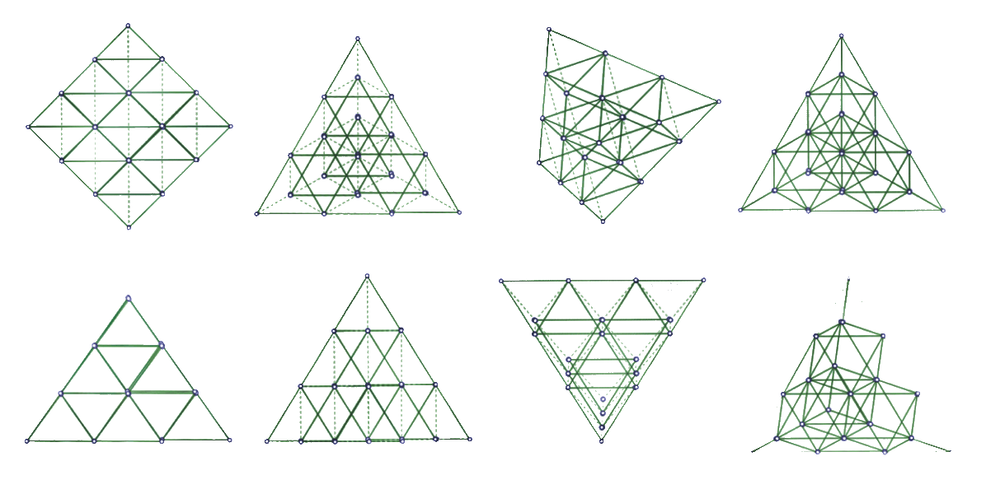

Now imagine the same tetrahedral pyramid with trillions of generations and many more dimensions! What *wouldn’t* it be able to describe? Its perspectives would effectively be infinite to us, but at its source, it is one thing.

The images below are a good example of a how one archetype is expressed though different contexts.  The archetype is based on the simple model previously described and shown in the diagram on the right. We begin with a 0-dimension point.  This point moves into the 1-dimensional space, which creates a line. In figures below, we show this line as the (black) horizontal diameter of a circle.  The radius is 90 units, which is equal to the number of degrees that are required to describe a 2-dimensional plane. This 1-dimensional existence then moves beyond the 1-dimensional space and into the 2D space. That movement will be expressed in both dimensions, just as the 0D&rightarrow;1D was expressed in both directions of a 1D space (left and right, or positive and negative).  This means there will be a movement along the 1D X-axis, and an equivalent movement along the 2^nd^ dimension of the Y axis, which is accomplished via rotation, as that is the most efficient way to create a 2D space from a 1D point.  Because we are rotating around an originating 0D point, that point will remain the center point.  

To illustrate this, we will move the horizontal diameter line 5 units to the right, and rotate it around its center point by 5&deg;. This is the first red line in ***Fig. 1***.  Now we see that this line is off-center. Where before, as a horizontal line, there were 90 on the left-of-center and 90 on the right. Now it is 85 on the left and 105 on the right.  It continues its journey into the 2^nd^ dimension by moving another 5 units to the right and another 5&deg; rotation, and it continues to do this until the line returns to its starting position of being horizontal.

In ***Fig. 1***, the outline of the progression is shown, as well as the outline of the original center points which are shown as yellow dots.

What is interesting about this shape is how it so perfectly describes the archetypal shape of many things, from leaves, fruits, and seeds to number theory, fractals and even the human brain and pineal gland.  The reason this is interesting is because we have described a very simple model that we would expect to see in nature, and because this model can make successful predictions we can say there is a valid hypothesis.  Perhaps this same reasoning is why the ancient Sumerians thought Earth was egg shaped, and not perfectly round, as the Greeks imagined (if fact, Earth is an oblate spheroid).

Some details worth noting:

- Every shape begins (emerges, evolves, or grows) from a point of 0-dimensional nothingness into a 1-dimensional space, and from there into a higher dimensional space.
- Each expression in a dimensional space will utilize all available dimensions; i.e. if given the nature and scope of an instance that it will move *N* units, then in a 1-dimensional space it will move *N* units in one dimension. In a 2 dimensional space it will move *N* units in 2 dimensions, etc. In our example, our line is moved 5 units. In the 1-dimensional space that was 5 units of 1D measure, and in the 2-dimensional space, it rotates 5&deg;.
- The point of origin (0D point) remains the center point around which something instantiates, but its virtual location in the lines delineates a boundary that has significance.

*The silphion plant is also a similar shape, similar to the strawberry, but with an interesting historical and cultural footnote as its shape is the origin of our traditional heart symbol.   As well as being known to cure many ailments, it was a natural contraceptive, and so was associated with love and passion. Not only was the plant worth its weight in silver, the Romans kept 1,500 kilos of it in the treasury as a hedge. Coins were minted with the image of the silphion seed, which had the same shape. Sadly, that particular variety was farmed into extinction, with the last known stalk given to Emperor Nero, as the legend goes.*

Here, and throughout the entire book for the most part, we are looking at only the the five primary archetypes, which include only 1 of the 5 Platonic solids, the tetrahedron, just to give an idea of how narrow a scope we are looking at:

For the sake of completeness, here is what the the lines look like when they complete a full 360&deg;:

The archetype of a circle, for example, is the ideal expression of the rule “the locus of all points are equidistant from a central point”.  This is a Platonic archetype.  A Jungian archetype might be the personification that tends to represent what Jung called a “primordial image”, and it was this understanding that lead him to the ideas of a*nima/animus, the self, the shadow*, and *the persona* but also shed light on the classic archetypes such as *wise old man, the child, the mother, the maiden*, etc.  This was later expanded to *Neo-Jungian* archetypes such as *caregiver, explorer, jester, rebel, citizen, hero, lover, sage, creator, innocent, magician,* and *sovereign*.  Not surprisingly, these twelve archetypes are similar to those found in astrology.  This is because Jung recognized astrology as a system of archetypes, adopting and reforming many of its concepts into modern psychology.

Tholonic instances are easier to understand when we look at isolated archetypes.  It is easy to understand a square block is an expression of a archetypal cube, but what of a melting snowball?  At what point does it stop being an expression of a sphere?  From the tholonic perspective, never.  The snowball came into existence as a result of many tholons (weather, terrain, gravity, etc.) cooperating and competing, exerting forces and limits in such a way that a snowball could form.  The snowball changes form as these tholonic forces change due to waxing or waning circumstances that tend to reinforce some forces and diminish others.  Each of these tholonic forces is an archetype because each tholon *is* an archetype.  As these archetypal forces change, interact, negotiate, compete, the resulting form will always be the most efficient expression of the state of those forces.  In other words, everything that exists is as perfect an expression of its archetypes that is possible, but everything that exists is made up of many, many branches of tholons or archetypes, so what we see is an amalgamation of countless archetypes that have managed to create a stable instance.  

The melted snowball is still an expression of a perfect sphere, but just a very diluted or weak expression given the strength of the other forces that have turned it into a puddle.  One way to think about this is to imagine each archetype as having a field of influence (which they do, as we'll explain later) similar to the way each planet has a gravitational field, or how each electron has a electron field that stretches to the edge of the universe.  Right now you are primarily under the influence of Earth's gravitational field, but you are also under the influence of Jupiter's gravitational field, but it is too weak to have any observable effect.  If you were to move closer to Jupiter, its effect would become more apparent.  Our snowball-turned-puddle is just far away from the “field” of the archetype of a sphere and much closer to the “field” of the archetype of puddle.

Some of these amalgamations of archetypes will become archetypes and parents of archetypes themselves.  Perhaps the only pure, unamalgamated archetypes that exist are the concepts of *something* and *nothing*.

So, when you see something that looks imperfect, remember that it *is* perfect, it’s just that you are not aware of all the archetypal forces that are making it the way it is.

#### **Claim 49:** Everything that exists *must* be perfect.

## Revisiting Dimensions

To specify the location of a tholon within the thologram we have to identify each tholon by an address based on its generation.  The is an example of the dimension of *location*.

If we wanted to reference one specific tholon, such as the one highlighted in the image above, we’d need to say it was located at 1,3,2,1 as it is the 1^st^ child of the 2^nd^ child of the 3^rd^ child of the 1^st^ tholon.  The areas blacked out are virtual tholons which don’t really exist (energetically) so we can’t navigate to them even though we can reference them.  So, in this example, we need 4 dimensions to define the location of a tholon.  Any dimension would have to record the path taken to arrive at any particular tholon.  The reason this is being mentioned is to show that each generation of tholons increases the dimensionality of the thologram by one dimension.

For example, to identify the position (P) of one tholon at the 45^th^ generation, we would need a dimension that looked something like:

But it’s even a bit more involved because this dimension only points to one particular tholon within which is its own 3D space. In the thologram, we can’t use a Cartesian coordinate system (i.e.  X, Y, Z) because that would require a coordinate system that extends past the boundaries of existence, and we know that there can be no metrics in nothingness.  We can only use a *quadray* coordinates (e.g.  A, B, C, D) which are based on a tetrahedron, to identify a point within the tholon.  This is the dimension of the *instance*.

Does this mean that our 3D reality is embedded within a parent 3D reality? According to the thologram, yes, although I have no idea how this can be tested.  An analogy we have to the idea of a 3D reality within a 3D reality is VR (virtual reality), where we can create countless 3D worlds within our own 3D reality.  Another analogy is how a hologram can create a 3D space from a 2D surface, and there can be many 3D spaces on top of one another recorded in that same 2D surface.  These analogies used to describe this tholonic concept are similar to the previously mentioned Black Hole Big Bang Theory (BHBBT), which states that Big Bang was actually a singularity from matter from a parent universe collapsing into a black hole, creating a new child singularity i.e. entire universes within black holes within universes, within black holes, etc., or, embedded self-similar universes.

### Synergetics

What some people today call *sacred geometry* our ancestors simply called geometry.  Contrary to what we learned in school, geometry is as much a study of philosophy as it is a study of form, space, and mathematics.  Plato, Pythagoras, Parmenides, and a number of other great philosophers were well-schooled in geometry, but the marriage of philosophy and geometry goes back even further in history, and across every culture.  Take the quadray coordinates system as an example. This system is based on 60&deg;, which comes from the 360&deg; (60&deg; &times; 6) model of a circle.  One could make a case that the Ancient Mesopotamian base-6/60 number system, which gave us the 360&deg; circle, was an early version of this idea.  In fact, one could make the case that the 20,000 year old * * of the upper paleolithic era discovered in the Congo was the earliest version of a base-60 system.  This bone is considered to be the first instance of the concept of the number one.  On this bone are counting marks, 60 marks on one side, and 60 marks on the other side.  One has to wonder why a paleolithic caveman would choose 60.

*Synergetics* is a modern-day example of how geometry forms the basis of the structure of creation, life and how everything interacts with each other.  Buckminster Fuller coined the term *synergetics* in his three-volume work “*Synergetics.  Explorations in the Geometry of Thinking,*”[^70] wherein he explains how using a 60&deg; coordinates system can explain both physics and chemistry, but more importantly, he believed that it also explained reality.  In his words:

> Since physical Universe is entirely energetic, all dimension must be energetic.  Synergetics is energetic geometry since it identifies energy with number.  Energetic geometry employs 60&deg; coordination because that is nature’s way to closest-pack spheres.

He explains how the points and the lines of a tetrahedron (60&deg; coordinates) describe all elementary phenomena.  Moreover, he claims that synergetics can measure our experiences geometrically, and how we can employ geometry regarding both metaphysical and physical knowledge.

The math of synergetics, according to Fuller, “*works omnirationally, energetically, arithmetically, geometrically, chemically, volumetrically, crystallographically, vectorially, topologically, and energy-quantum-wise*”[^71]. In addition, it is quit compatible with the empirical world where all atoms are made of tetrahedrons, octahedrons, rhombic dodecahedrons, and cubes.  One clever engineer from the Dublin School of Technology hypothesizes that the thermodynamic and space-time could be unified with quadray coordinates[^308].

The thologram, which is based entirely on the tetrahedron and synergetic quadray coordinates, is a model of knowledge, thought, and ideas.  It’s important to remember that the map is not the territory.  These models of reality are like maps that describe the terrain.  There are elevation maps, density maps, road maps, water maps, contour maps, temperature maps, population maps, economy maps, crime maps, San Francisco even has human feces maps! They all describe the same territory from different perspectives.  The thologram is one of these perspectives, but even this one perspective can be seen in a number of ways.  How many ways are there? I don’t know, but the extremely simple *three square geometry problem* (“what is the total of the angles *α*,*β*,*γ* ?”) has 54 possible solutions, and that is just with three simple squares (the answer is 90&deg;)!  As you can imagine, there is virtually no end to the relationships, patterns, rules, etc., that can be discovered.  

What separates knowledge from *apophenic* delusions (apophenia is the tendency to perceive connections and meaning between unrelated things and is considered a sign of early-stage schizophrenia) is whether a relationship, pattern or law can be tested to achieve predictable results.  On the other hand, we don’t want to fall victim to *randomania* either (“randomania” is the unofficial term for people who attribute to chance that which is clearly the result of order; the inability to see patterns where they actually exist.  I suspect this, too, is an early sign of some sort of currently undefined illness).

> It doesn’t matter how beautiful your theory is, it doesn’t matter how smart you are.  If it doesn’t agree with experiment, it’s wrong.  **\~Richard Feynman**

We agree with Mr.  Feynman, but we also have a broader definition of “experiment”. Life is reasonable by default, otherwise, it would not exist, but it is not always quantifiable, and often incompatible with current science.

OK, that’s enough geometry.  Let’s look at some chemistry.

### Water

We mentioned above that the first instance of matter would be tetrahedral, at least conceptually, but we also stated that form, being an instantiation of the laws of form, would follow that model, meaning we should expect to see tetrahedral structures as one of the building blocks of reality.  And guess what? We do!

The actual first instance of matter in the Newtonian sense (vs. the quantum sense) are the elements, but no element has a tetrahedral structure when it is isolated.  It is the bonds *between* elements that create the tetrahedral structure.  In the tholonic model, the individual elements exist at the first level of the thologram, which are the first tholons created by the folding of the 2D “map” and are shown as the numerous and small tetrahedrons upon which ever-larger tetrahedral structures emerge from.  That means we will not see actual tetrahedrons on this level, but we will see the same tholonic properties, such as form seeking the most stable state.  We don't see tetrahedral forms in 3D structures until the first iteration that emerges.  A single *H~2~O* molecule is not a tetrahedron in form, it is a trigram.  Water, however, is tetrahedral.

 

Water is a particularly good substance for exploring tholonic structures because it is one of the first, if not *the* first, tetrahedral structure that all life depends on.  Another early structure that is tetrahedral as a molecule alone is methane, one of the first organic molecules and not just a building block of life on Earth, but quite possibly the basis for an entirely different form of life, as pictured in the *Azotosome* above, and one we might discover on the Saturn moon of Titan.

We saw that in the first generation of a tholon we have 4 trigrams, 3 of which are descending, or downward-pointing trigrams, and 1 is ascending, or upward-pointing trigram (“up” and “down” have only relative meaning here as it simply refers to the way the trigrams were drawn).  If we have two tholons then we have a total of 8 trigrams made up of 6 descending and 2 ascending trigrams.

H~2~O​ is composed of three atoms.  One atom is oxygen, which has an atomic number of 8 as it has 8 protons in its nucleus, which defines how much energy it holds as a “charge”. It also supports 8 electrons in its outermost shell, which represents its most balanced state.  The other two atoms are hydrogen, the very first instance of matter.  Hydrogen has an atomic number of 1 and has only 1 proton and 1 electron.  Although oxygen wants 8 electrons in its outer shell, it only has 6, so it naturally forms a bond with two hydrogen atoms by sharing the one electron each hydrogen has to offer.

From a tholonic perspective, oxygen follows the pattern of two 3^rd^ gen tholons from one face of a 2^nd^ gen tholon, which has 6 *real* tholons and 2 *virtual* tholons (***Fig. v1*** below, showing two 3^rd^ gen tholons).  Hydrogen follows the pattern of a complete 2^nd^ gen tholon (***Fig. v2***, showing two complete 2^nd^ gen tholons).  Combining these two together (***Fig. v3***) would represent 8 externally-facing points (from the *real* tholons) of interaction and two internally facing points (from the *virtual* tholons) of non-interaction.  When combined, the hydrogen tholons will attach to the empty or *virtual* tholons of oxygen.

We can see a few similarities between the tholonic model of *H~2~O* and its traditional chemical model.

This is just a hypothetical demonstration, as there may be a much better tholonic model for elements and compounds than this one, but this one is sufficient to show how we might be able to describe elements and compounds tholonically, which may give us new insights into their nature.

Can we see this similar relationship with other compounds? Given that the basic archetypal shapes of molecules (shown above) can be represented within the thologram, perhaps this model can be applied to all compounds.  We claim this might be possible, as there is an almost infinite number of possible configurations in the thologram.  Instances of fundamental configurations, such as those that appear in the earlier stages of iterations and generations, like the Fibonacci sequence and the hexagram, would represent extremely stable patterns, and therefore we would expect to see them play a very fundamental part in our reality (like water and methane) and could be easily discovered.

The Fibonacci formula is especially tholonic.  For details, see “*Fibonacci Tholon*” in [Appendix C, “*Tholonic Math*”](#Appendix-C:-Tholonic-Math).

### Quarks and Atoms

Here is another example of how we might discover tholonic structures in subatomic particles.  Let’s look at a quark (which was originally named a *parton* by Richard Feynman to describe a hypothetical particle inside the nucleus of the atom).

Currently we understand that protons have a charge of +1 and are composed of two *up* quarks, which have a charge of +2/3 and *one* down quark, which has a charge of -1/3, and neutrons have a charge of 0 and are composed of one up quark and two down quarks.

This is seen in a single tholon and its reflection tholon as shown in ***Fig. q1*** and ***Fig. q1a*** below.  The upper trigram has a parent trigram at the top which we can assign a value of -1/3, and the two children can be assigned a value of +2/3.  The center child trigram, which is always a reflection trigram, has a value of 0.  The opposite is true for the lower reflection trigram as well.  With these values, the upper tholon has a charge of 1, like a proton, and its reflection tholon has a charge of 0, like a neutron.  This also seems to indicate that a truly complete tholon requires two tholons; itself and its reflection tholon. It worth noting that the simplest and first element, hydrogen, is the only stable element that does not have a neutron (*heavy hydrogen*, or *deuterium*, has 1 neutron and is stable, and the radioactive *tritium* has 2 neutrons).

***Fig. q1a***, which is the folded 3D version of ***Fig. q1***, is also the same shape as the quartz *trans tridymite* silicon oxide molecule, with the N-states holding the same position as the  silicon atom.  For those playing along, note that the *trans tridymite* molecule has oxygen molecules that total the atomic number of 32 (i.e. 2^5^, 8&times;4) and the silicon molecules totaling 28 (i.e. 7&times;2^2^, 14&times;2), resulting in a total atomic number of 60.

***Fig. q3*** is from the previously quoted paper on the *E8 Lattice* that explains the various models within the E8 crystal and describes this shape as “representing all 8 components of the electron”.  This is not exactly the same as what we are saying here, but it supports the overarching idea regarding tetrahedrons and subatomic particles.

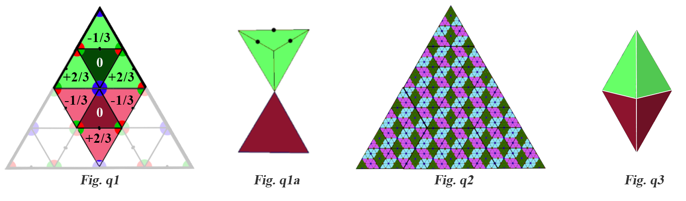

We need to very briefly address one item before continuing.  Within the first three generations of the thologram we have the underlying structure that all that follows is built upon.  It is from the third generation that patterns emerge that never change from that point on, such as the hexagram.  We can see these patterns as contiguous boundaries of the same boundary *type*, shown in the image below.  The left-most image shows the first three generations combined, with yellow lines connecting the red and green dots, magenta lines connecting the blue and red, and cyan lines connecting the blue and green.  Because there are three layers on top of each other it is difficult to show the connecting lines realistically, but if we isolate each color of connecting lines we see these patterns of boundary types.  Why are we calling them boundary types? Because as contiguous lines of the same type, they define where and how energy flows through the structure.  They are a “grain”, so to speak, that direct the movement of energy and its properties.  There are essentially two types; the *grid*, of which there are two, a pair of exact opposites (the magenta and the cyan), and the *matrix*, which is symmetrical, self-contained, and self-similar (the yellow).  These patterns define the relationships, and perhaps the binds, that hold the thologram, and therefor existence, together.

Only one of those patterns is self-similar, and that is the pattern caused by the lines that can support an N-state, which is the line that represents the spectrum between the two poles (of red C and green D) of an individual tholon, or the matrix of N-states that exists between the two opposite grids.  This will be very significant in a few paragraphs.

If we looked at the 2D thologram map which shows these complete double-tholons, we get what is shown in ***Fig. q2***.  (For those who read [Appendix B, "The Thologram"](#Appendix-B:-The-Thologram), you’ll notice this is identical to ***Fig. h1*** that shows the lines of succession from N-sources to N-states across all three directions).  This would suggest that if our quark model is in the ball park, then quarks are an early instance of N-states.  Given that there are 6 N-states to a complete tholon, that would suggest there might be 6 classes of quarks, and is it just so happens, there are, but they are called “flavors”, and they are: *up, down, strange, charm, bottom*, and *top*.

Neutrons *do* exist, which seems to go against the tholonic idea that the virtual tholons don’t create anything, but remember, this thologram is a model of energy and relationships, not of form, so what we would expect to see is some *thing* that has zero energy&hellip; like a neutron. In fact, the neutron does have a charge even more powerful that the proton, but it is a charge made up up both positive and negative, thereby balancing it out to 0.  And what holds all these subatomic particles together? The *strong nuclear force* (mainly), which (perhaps) is the tholonic equivalent of six integrated N-sources at the center of every hexagram.

This would seem counter-intuitive as the *strong nuclear force* (SNF), which got its name because it is the strongest force in the universe (10^39^ times more powerful than gravity), would not allow similar energies to couple, but rather repel, as we know positive repels positive and negative repels negative.  However, the SNF has a “weird” quality such that it only repels like forces *after* they are separated.  When these forces are close to one another, the SNF pulls them together! Physicists call them weirdness *asymptotic freedom* (and sounds eerily similar to a dynfunctional romantic relationship).

This “weirdness” seems similar to how a magnet that breaks in two can't be put back together as the two parts repel each other when the break is perpendicular to the poles, as shown below. Anyone who has worked with rare-earth magnets has learned from painful experience that when these two opposing halves get close enough, they violently flip so as to be able to connect. The specific mechanics of magnetism and the SNF may not be identical, but they seem to have a similar effect but in different scopes.

Most of what we have shown here involves how the movement of energy, in accordance to laws, brings form, and by extension, ideas, into existence, yet almost nothing is said about the nature of the energy itself, other than that energy in its purest form is ultimately an expression of awareness and intention.  Here we have six N-sources which hold the tholons together to form the center's creation.  In the quantum world, there is a similar concept of this energy that holds everything together, called *gluons*.  Gluons hold quarks together using the SNF.  Tholonically speaking, it is the laws, described as geometry in the thologram, that hold everything together.  Is it reasonable to wonder if the other forces that holds things together, which are electromagnetism, the weak nuclear force, and gravity, are also represented geometrically somewhere in this infinite maze of patterns?

Understanding the tholonic nature of these forces may well give us an insight into understanding the nature of the source of the energy, which is to say, understanding the nature of the Awareness and Intention that created this reality.

But what about the electron? Where is that? tholonically speaking, the electron is a product of the imbalance of this hexagram which has a total charge of +1, and therefore it will automatically create an equal and opposite tholon (of an electron) with a charge of -1, which is also the total charge of the parent reflection tholon.  Where would this electron exist? At the opposite side of the N-sources across the scope of its children C and D, which is where N-sources manifest as stable expressions, i.e.  on the outer most edge of the hexagram.

In a complete and folded tholon, these three scopes create the three edges of the outer tholon that is opposite the reflection tholon, represented by the three black dots in ***Fig. q1a***.  As there are three different directions of these patterns, each 60&deg; apart, there is access to any active interface (which instantiates as an electron, or electron field) for every angle of the thologram.  If this were the case, we could speculate that an electron is the grand-child of all six N-sources (N-source -> black-dot children -> electron field) and/or it is the created child N-state of the parent N-source of the proton.

More importantly, those dots where the electrons would appear only exist on the boundaries of the self-similar (yellow) grid we just looked at above.  What this implies is that anything that uses electrons to exist, which is essentially everything, will naturally order itself in both a self-similar manner and in a way that can be mapped to that pattern.  Does this mean that everything that exists is somehow based on a self-similar hexagram, conceptually at least?  This would suggest that this is the case.  

Compare the crudely drawn 2D map of overlapping tholons (below right) and a diagram (below left) from an article by Ethan Siegel, Senior Science Contributor to Forbes magazine[^73], called “*Can Free Quarks Exist Outside Of A Bound-State Particle?*”  Notice any similarities?  For example, how there are two groups of quarks that correlate to the parent/children tholons, and how a parent color always matches with a child color, as in the blue/yellow, red/cyan, and green/violet pairings. The correlation might be even more significant if there was any to correlate quarks (R, G, or B) to tholonic points N, D or C.

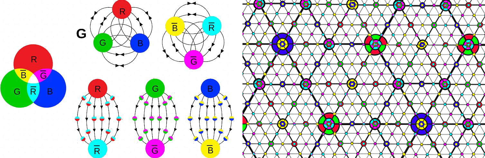

The underlying point being made here is that the thologram, or any model of reality, is only one perspective of a much greater multidimensional model, and being multidimensional, it can be perceived many different ways.  The tholonic claim is that all models, including those of our ancestors that lived in the wild and in a world dominated by spirits, plants, insects and gods, are built on the same concepts.

### Back to Basics

Let’s now map Newton’s 2^nd^ law (in the form of Ohm’s  Law) to the tholon, which fits nicely.

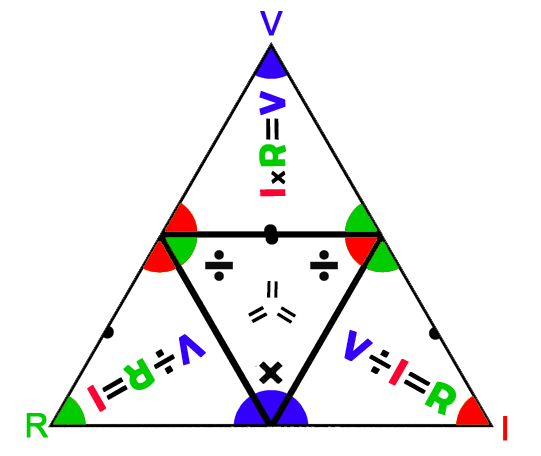

To apply Ohm’s Law we have to correlate the N, D and C values to V, I and R, like so:

-   **N** (negotiation) as V (voltage - field of potential)
-   **D** (definition) with R (resistance - opposition to free flow)
-   **C** (contribution) with I (current - force of flow)

This allows us to state the following:

We've taken a big leap here by applying math to such abstract concepts and expecting so see something meaningful, but if we look as these definitions closer they might seem reasonable.

### The Meaning of Math

To look closer we need to make sure we’re all on the same page regarding how the trigram can describe the math functions of Ohm’s law, and to do that we need to clarify some really simple concepts, such as what do the math symbols mean in this context.

Addition and subtraction are easy concepts to grasp.  We take some number of things and add or remove some number of things.  But depending on the context even simple addition and subtraction requires some extra thought. A good example of this is how addition and subtraction affect colors. It is not intuitive to most people that *violet - cyan = blue*, for example, but once shown it makes sense.

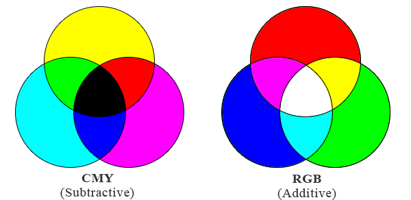

What about multiplication and division then? In this context we will describe division as *the definition of one value by the units of another value*.  For example, in division, such as 3= we are stating that 3 is what we get when we measure an existing value of 12 by a unit of 4.  In multiplication, such as *12=3&times;4,* we are determining a new value of 12 by combining 3 of these units-of-4.  The 4, as the divisor or multiplier, is the *unit of measurement* and the 3 is the *number of units*.  Every kid knows what was just stated, but when we apply those same simple rules and concept to a non-math context, they become very significant.  (For highly speculative thoughts on the meaning of squares and square roots see *Meaning of Squares and Square Roots* in [Appendix C, “Tholonic Math”](#Appendic-C:-Tholonic-Math))

As mentioned above, we would expect to see the same laws expressed in different ways across all the scopes that the laws apply to, so we would expect to see an example of Newton’s 2^nd^ law in the tholonic realms of society, or planets, or organisms, and we do.  For comparison, we also show how the attributes of the tholon would appear using the same laws.  *(Note: In the image below, the lower case “neg“ represents a new child N-state that results from the children of the parent “NEG”.)*

For example, if we claim that a **society** is based on its **ethics** and we also posit that **ethics** are to be measured by **laws**, we can say ***society=ethics&div;laws***, and likewise, ***ethics=laws&times; society***.  If we measure the **power** of a **society** by its ability to function or “**work**”, and the measure of a **society** by its **sustainability**, then, according to these formulas, a **society** with a lot of **laws** and very little **ethics** will **work** less and be less **sustainable**.  On the other hand, a **society** that has a lot of **ethics** and very few **laws** will be far more **sustainable** and produce even more **work**.

Here, we interpret “laws” as *limiting factors* with regard to its members.  The 1^st^ amendment of the U.S. Constitution guaranteeing the right to free speech is a law, but it is a limitation on a limitation, in that it prevents the State from limiting one’s free speech.  Laws as limiting factors would be laws that block or prevent members of society, and equates to degrees of freedom.  For context, as example of a society with a lot of limiting laws and very little ethics would be North Korea or Syria.  An example of a society with few limiting laws and high ethics would be Norway or Sweden.  *Note: These ranking are according to institutions that rank countries* [^309].

How can we say this?

If we claim that individuals interacting with each other represents a *force*, then we might say this interaction correlates with *current*.  If *ethics* represents the arena in which individuals operate, then we could correlate *ethics* with *voltage*.  *Laws*, which define and limit the members, would then reasonably be correlated to *resistance*.  

All together, individuals, ethics, and laws form a *society*.

We are effectively assigning the values of *interaction=3*, *ethics=6*, and *laws=2*, but in this context the quantitative value of these numbers are not important. We are using the numbers just to show the relationships. The number itself is merely a concept of measure.  Power, which is the transference of energy over time, would then correlate to how much “work” this society could generate.  Perhaps this would be seen in their social achievement, or productivity, or levels of cooperation, but could also represent a “work product” of oppression, taxation, or enslavement, if that is the goal of the society.

How these assignments were arrived at is not critical because they may differ depending on how one chooses to correlate, but this does not matter for the point being made.  

With these assignments, *society*=follows the same reasoning as the formulas in the same *PP*, which is 3= , so we can imagine different scenarios, for example:

If this premise has any validity, this would suggest that a lot of laws and little ethics leads to an inefficient society, while a society with few laws and lots of ethics leads to a productive society.

How would we calculate *sustainability* then? Here is one way, perhaps, but this it is totally outside the context of the law as we currently use it, so it will probably make no sense from an engineering perspective.  In short, we simply take the product of all the unit-counts of *society* and measure it by the product of the unit-measures of *society*:

Applied to these 3 cases, we get the following:

How these translate to the real world is only speculative, as it is up to the reader to decide if *laws*, *society*, *ethics*, and  *work* are the best concepts to use here and if so, how are the social equivalents of *power*, *ethics*, *laws*, *work*, and *sustainability* actually measured, as well as the significance of squares and square-roots.

How would this look if we used concepts such as *natural rights*, *privileges* and *responsibilities*?

This can apply to any properly defined trigram.  For example, if we applied this same excercise to the cognitive behavioral trigram we mentioned previously we might claim that *behavior* is a product of *thoughts* (one’s own or those one is exposed to) and that *thoughts* are to be measured by *feelings*, thus, *behavior = thoughts &div; feelings* and *thoughts = behavior &times; feelings*.  This would suggest that high *thought* with low *feeling* results in higher *behavior* and  higher *power* (whatever that means in this context..  intention? beliefs? desires? will?), while low *thought* and high *feelings* results in much lower *power* and even lower *behavior*.  

I am not claiming that the values I have assigned for these examples are accurate.  I suspect it would take quite a bit of discussion and research to find the best values.  The point of this is to suggest that with the correct values, these equations would produce meaningful results. Still, someone who acts out of emotions with very little thought is bound to have a less sustainable lifestyle that one who tempers their emotions with thought, so these may not be too far off.

In any case, the twelve formulas of Newton’s 2^nd^ show some potentially interesting relationships when applied to other contexts and may offer a new perspective on the dynamics of culture and society that, if nothing else, raises some worthwhile questions.  As it applies here, it shows how the tholon can describe everything from atoms to culture, as long as we know what data to apply.  Because the math involved in a tholon can be more than the reader might be interested in, more of this subject is covered in [Appendix C, “Tholonic Math”](#Appendix-C:-Tholonic-Math).

Because our 4D (3D+time) reality maps neatly into the 4D tetrahedron, especially when using the synergetic 4D quadray coordinate system based on the tetrahedron, we may be able to correlate radically different contexts, such as space-time,  psychology, and electricity, to name a few.

With this in mind, let’s reexamine the previous claims that began this thread:

**Definition = Negotiation &div; Contribution**

The definition of something is its boundaries, limits, abilities, attributes, properties, and resources.  All of these details are the results of the scope and context of that thing’s instance.  It could be environmental factors, genetic attributes, physical limitations, such as size and weight of a thing, energy levels, etc.  It is the nature of energy to expand in every way possible.  That expansion is the contribution, but it is the resistance from these factors that determines what expansions get the opportunity to be expressed and what expansions are thwarted.  That battle between the force of expansion and the force of resistance is the negotiation (*see Negotiation=Contribution &times; Definition*).  As *Definition* is *Negotiation* &div; *Contribution*, we can say that *Definition* is measured by that which is *Contributed*, or, the *Definition* of something is determined by what it can (sustainably) *Contribute*.

**Contribution = Negotiation &div; Definition**

What a thing can *Contribute* is measured by its *Definition*, but the degree to which it can contribute is determined by its environment and how it interacts with that environment.  That interaction is a result of *Negotiation*.  A thing must provide something that something in its environment needs, otherwise what it has to contribute is useless and unitegrable.

**Negotiation = Contribution &times; Definition**

A thing’s ability to find a stable and sustainable position within its environment and scope is determined by the degree to which it can contribute with its current resources.  A thing may have a *Definition* that gives it a lot of A and a little of B, but if its environment needs a lot of B and very little A, then it is B that the thing must *Contribute* to ensure its existence in that environment, or it needs to find another environment, or change its environment so that A is in more demand.

Applying different values and concepts can result in new data.  We experiment with this a little, but given it is outside the main theme of this book, we have put that section under “New data?” in [Appendix C, “Tholonic Math”](#Appendix-C:-Tholonic-math)

### And the point is?

The point of all this is to show one way that the tholon can be used and viewed.  There are many new ways of looking at energy in all its forms when viewed tholonically.

We showed examples of quarks and molecules, but in higher orders, such as DNA, we also see some striking similarities as well, and with a bit of investigation, we can probably find some stunning relationships.  *(DNA and how it is both tholonic and binary in nature is examined in [Appendix G, "The Tholonic I-Ching"](#Appendix-G:-The-Tholonic-I-Ching))*

DNA’s relationship with tetrahedrons is particularly unique given the creation of tetrahedrally structured DNA, or TDN as it is referred to.  TDN is the cutting edge of DNA nanotechnology and has various applications such as drug delivery, inhibiting certain gene expressions, and of course, interfacing with bio-sensors.  These TDNs assemble themselves from scratch and offer greater strength and stability that the ol’ fashioned dual-strand DNA.  Given that there is little accessible information on TDNs there is not much more that can be said here, other then they look pretty awesome and will most likely be the origin of a new form of life powered by TDN-interfacing A.I. DNA-integrated quantum computers.

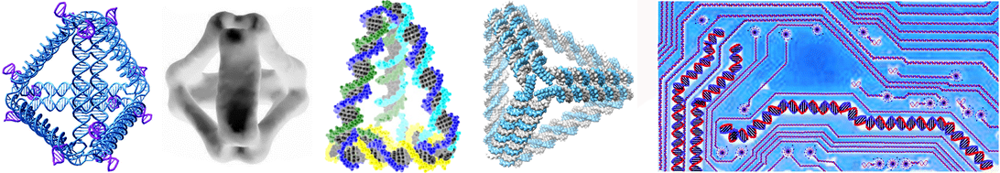

Our simple trigrams of relationships, such as Newton’s  2^nd^ Law, becomes a *tetrahedron* or *tholon* of relationships.  Whereas before it was stated that every piece of knowledge can be deconstructed into a trigram, by the same token, every piece of knowledge forms a tetrahedron. With this more expanded tetrahedral model in mind, let’s briefly jump back to the examples of deconstruction mentioned earlier.  

## Batteries

An example of how any system can be reduced to a tholon is presented in an insightful article on the effectiveness of batteries, titled “The Unfortunate Tetrahedron”[^74] .  This may seem fairly niche, but it turns out to be very relevant, which is not surprising considering that batteries are all about sources and movement, and balancing of energy of energy.  From this perspective, a simply battery is a microcosm of the Universe, from beginning to end.  In this article, the author shows how the systems of a simple battery can be modeled as a tetrahedron, and how these fundamental aspects of a system relate to one another.  The author looks at the four aspects of batteries; *energy density*, *power density*, *operating cost* and *capital cost*, where:

**Energy density** (E) is how much energy a battery can store in its mass (like a dam).  **Power density** (P) is how much energy it can deliver relative to its mass (like the turbines in a dam).  **Capital cost** (C) is the cost of the battery.  **Operating cost** (O) is the cost to recharge the battery, and costs associated with keeping it safe.

From this model we have four trigrams:

We can equate **E** with an *N-source*, **P** as a *defining* point, and **C** as a *contributing* point, which makes **O** the unifying “white dot” point (for brevity’s sake I won’t detail the reasoning behind these associations.  The reader may arrive at a different conclusion).  With this ordering, we end up with the 2D tholon map (above, showing the parent and next-gen children).

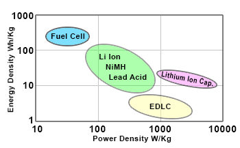According to the article’s own conclusions, the relationship between **E** (energy density) and **P** (power density), which is equivalent to an *N-source* and a *defining* point, is what he refers to as the *Ragone Space*.  The Ragone plot (right) measures the performance comparison of various energy-storing devices.  This chart is a perfect example of the axis of “laws, rules and limits” that connects an *N-space* with a *defining* point in the model of the tholon.

On the opposite side, between **C** (capital cost) and **E** (energy density), which is equivalent to a *contributing* point and an *N-source*, we have the tholonic axis of “service”, which I think also fits quite well if you consider giving your money to an organization or person for a product that fills a need is the definition of a “service”. Remember that the descriptions of “laws” and “service” were specifically meant to apply to the context of our daily lives.  In the realm of economics, production and specifically batteries in this case, that same intention might be described a bit differently.

According to the tholonic model, the only place where a new stable pattern capable of replication can occur is between *define* and *contribute*, which here is **P** (power density) and **C** (capital cost).  Across this spectrum of “cooperation or conflict” you will have all the various instances of batteries that can deliver power at a cost, most of the instances landing in the middle, representing the best delivery of power at the best cost.  *Power* and *cost* are the two poles, the contrasting forces, the thesis and antithesis, of this spectrum.  Here you would have instances like alkaline cell batteries (Duracell), lead-acid batteries (car batteries), nickel-cadmium batteries (rechargeable batteries), etc.  Each of these new instances (stable patterns), can then go on to create their own tholonic archetype.  

As the author relates in his article, which so aptly fits into the tholonic mode as well, “You can have it good, fast or cheap; pick two out of three”.

## Circuits and the “God Formula”

There is another instance of this trigram model that holds tremendous potential, and that is electronic circuits.  One of the most common and important circuits in electrical systems is the very simple *resistor-capacitor circuit*, or *RC circuit*.  It is used to filter and control signals not only in man-made electrical circuits, but in natural electrical circuits such as neuro-transmission in the brain and throughout the entire nervous systems of any living organism.

No doubt the reader has seen such circuits as they exist in every computer system, alarm clock, microwave, and virtually all electronic devices.

Briefly, an electrical **resistor** is a component that can reduce the flow of current, adjust signal levels, divide voltages, and limit or control the current of a circuit in some way.  A **capacitor** is a device that stores electrical energy in an electric field.  In one way, a capacitor is like a battery in that is can store energy, but unlike a battery, it can not produce new electrons, it can only store existing electrons.  Air alone acts like a capacitor and is often used in radio circuits.

Let’s  look at a simple RC circuit.

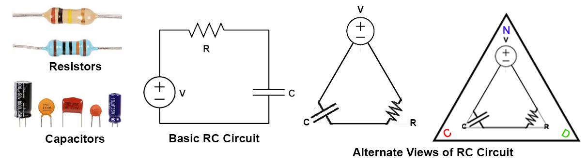

We have two basic elements of a circuit, one that limits and divides, and one that collects and stores.  These two concepts are perfectly in line with the two basic concepts of *Definition* and *Contribution* as shown in the *Alternate View* above.

How can we validate this similarity? Let’s  look at the following:

- The N-state acts as both the source and the destination of the energy.  This would represent both ends of a battery, or a charge and a ground.

- The capacitor is returning the energy to the destination, and the resistor imposes restrictions on the source.

- Voltage originates in the N-state in this example, which is also the case when we assign electrical properties to the tholon, as we did in the section on Ohm’s law, so there is consistency.

- The output of a RC circuit is a wave has a unique form showing an exponential growth followed by an exponential drop, . While the details of the form can change depending on the components, it always has the same characteristics of a sharp ascending and descending.  The interesting thing about this waveform is that is can be perfectly recreated by quadrants of a circle.  Of course, just because two things have the same shape doesn’t mean they share anything else than the shape, but in this case it appears they share more. At the least, if the RC circuit *is* an instance of a tholonic trigram, then we would expect to see its output have some relationship to the thologram… and we do.

  The image below shows the output of an RC circuit as the result of overlapping circles.  We have divided those circles into 4 quadrants and numbered them tholonically, which means we use the *spatially* sequential values 0,1,3,2 (the *temporal* sequence is 0,1,2,3 because 3 can only come into existence *after* 1 and 2,  but once 3 exists, it does so in-between 1 and 2)  of the 4 points of a tholon.  If we assign the these colors to those quadrants where 0=blue (parent N-state), 1=green (Limitation), 2=red (Contribution) and 3=yellow (child *n*-state), we find the same characteristics and patterns we see in the thologram, specifically, the 2D tholon map. For example:

  -  We see only the N-States (yellow and blue) overlap on their own color and alternate between parent&rarr;child&rarr;parent&rarr;child, etc., as we would expect.
  -  The D (green) and C (red) alternate in direction and pair up, and in doing so create a new child *n*-state (yellow).
  -  There is no square that has a piece of N (blue). It is either all N (blue), all *n* (yellow), or DC*n* (red-green-yellow).
  -  Every quadrant that is not exclusively an N-state contains all the the other attributes (red, green, yellow) which alternate only along the path of the *lineage* (parent&rarr;child).
  -  Each circle in the row is alternately flipped on both the N*n* (blue-yellow) axis of parent-child N-states and the across DC (red-green) axis.
  -  The direction of the overlaps are the same as the path of the lineage in the tholon.
  -  The overlapping values are a product of 3 &times; 0, 1, 2, and in an order that creates a continuous oscillation . In addition, when these numbers are used as binary exponents (which we show why later) they all add up to 81: 2^3^ + 2^6^ + 2^3^ + 2^0^ = 8 + 63 + 8 + 1 = **81** = 9^2^ = 3^4^ = (3^2^)^2^ etc... We would expect to see a lot of 3-based numbers if this relates to the thologram.

- In the tholon, the field in which the *n*-state can be created exists between D and C.  Here, that field is defined by *R* and *C*, which creates a field of *time*.  In electronics it is called the *time constant​* and is written as ***τ = RC*** (where ***τ*** s the Greek *tau* representing the *time constant​*)  and proves that the voltage (*V*) and the current (*I*) are always inverse to one another at any moment in time and increase/decrease as a function of time.

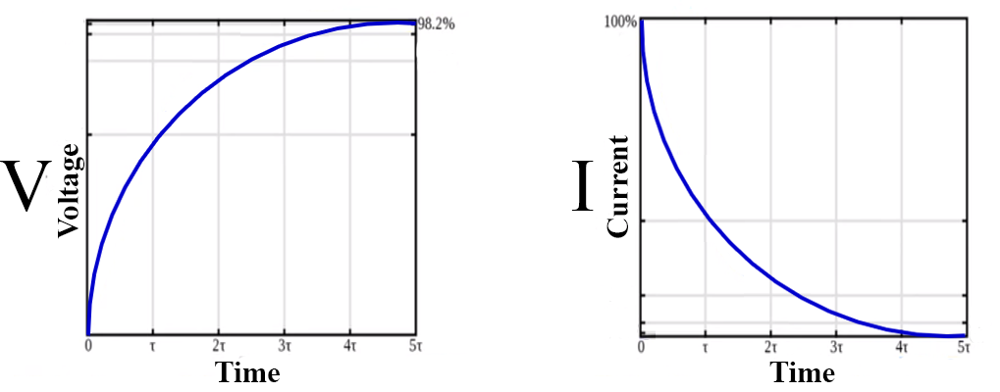

This *time constant* is then used to calculate *V* and *I* using the formulas *V(τ)=V~B~(I-e^-τ/RC^)* and *I(τ)=I~0~(e^-τ/RC^)*.  The point here is not to explain the math, but to show not only that *V* and *I* relate to each other via *R* and *C*, and by extension, *D* and *C*, but that they do so across a field that in the world of electronics is defined by ***e***, or 2.7182, the number of the *natural log*.  This is especially interesting when applying the properties of this RC field to that of the DC field of the tholon, because ***e*** is one of the most profound and fascinating numbers in nature!

*Historical note: Although the value of **e** was discovered by Bernoulli in 1618, The fist appearance of **e** as the symbol for this value was in an unpublished paper by Euler in 1728 on the explosive forces in cannons.*

It is similar to *pi* in its significance, but where *pi* is the ratio between circumference and diameter shared by all circles, ***e*** is the base **rate of growth shared by all continually growing processes**.  It has also been called the **epidemy of universal growth**.  This growth can be anything; population, radioactive decay, interest calculations, even jagged or unpredictable systems that don’t grow smoothly.  Anything that has a continuous growth can be modeled with ***e***.  ***e*** is to growth what the radius is to the circle.

***e*** and the Natural Log, or *ln()*, are two sides to the same concept as ***e*** and the Natural Log are inverse, or opposite one another, so *ln(e)=1*.  ***e*** describes **growth**, and Natural Log describes **time**.  For example:

- ***e^x​^*** is the amount we have after starting at 1.0 and growing continuously for *x* units of time, so ***e^x^*** lets us **plug in time and get growth**.
- *ln(x)* (Natural Logarithm) is the time it will take to reach amount *x*, so *ln(x)* lets us **plug in growth and get the time** it would take.

If you remember back in chapter 3, it was shown how logarithms were the natural way nature understands scale, or scope, and while *common logs* are based on 10, the *natural log*, ***e***, is so named because it is the only value where the inverse of *time* equals *growth*.

Considering that the tholon is a model of growth, it seems particularly applicable that ***e*** would define the field from which new N-states spawn new tholons.  

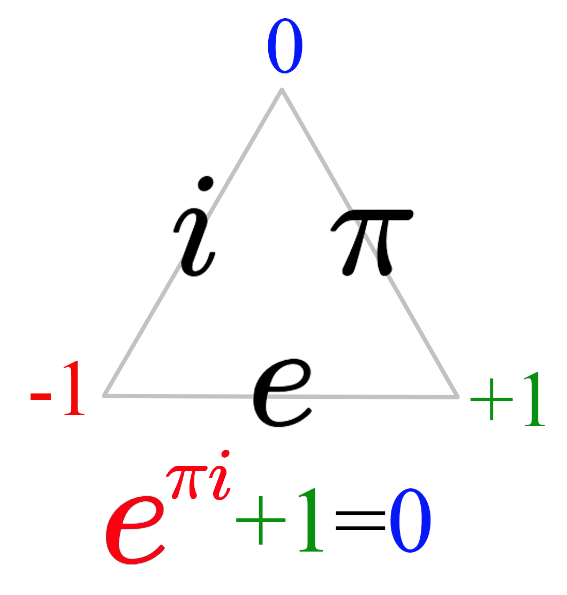There is one more significance to ***e*** that is purely tholonic and will no doubt annoy math purists, but is added here because of symmetry.  As was just shown, the spectrum between *Definition* and *Contribution* is, in this context, defined by the value of ***e***. Referring back to how it was described that 1 point creates 2 points and 2 points creates 3 points, when we created the 2^nd^ point we had a 1D line from *Negotiation* to *Definition*.  However, we also had a center and a radius, thereby defining a circle.  In this way, the first two points implies the relationship between a radius and a circle, which is *pi*,  so were we to assign values to that 1D line , *pi* would be one of them.  If we accept the above premise that the value of *N*=0, the value of *D*=+1 (not to be confused with its position of 1), and the value of *C*= -1,  this makes the field within which new *n*-states can form along the spectrum of -1 to +1.  What value could we then assign to the line connecting points *N* and *C*?  Being that it is a value of -1 at position 2, one reasonable candidate is what ever value when multiplied by itself = -1&hellip; in other words, ***i***, the square root of -1.  This has a poetic ring to it as well if we imagine that the path that returns to nothing can’t be a number.

There are various rationales for why this makes sense, but the most attractive argument is because if this tholonic trigram represents the three values of ***e***, *&pi;*, and ***i***, we can construct what has been called the most elegant formula in math,  *+1=0*.  This is also tholonically elegant because just as the two children of N, -1 and +1, together equal N (0), it is the two children  of N, as  and +1, that also equal its parent N.  This formula integrates all the points and lines of the tholonic trigram into a beautiful concept.  In addition, as ***e*** represents time and *pi* represents space, we have the two dimensions of time and space, plus the mysterious, inexpressible value of ***i*** and the introduction of a *complex* dimension of numbers (complex numbers).

This would also make the 4^th^ point a complex number, which I can only guess would be 0***i***, which is the same as 0 because 0 is the only point where the real and imaginary axes intersect.  However, there is a pattern that would suggest what this value might be in the context of ***i***, because it just so happens that the power of ***i*** will only and always, equal 1 of 4 values; 1, *i*, -1, or *-i* (which add up to 0):

This is in the context of ***i***, so we can imagine that there would be a different value for the 4th *dot* in the context of ***e*** and &pi;.  In the case of &pi;, were the length of the side equal to 1, , all equal &pi;, and in the case of ***e***^0^, ***e***^1^, ***e***^2^, ***e***^3^, the results are simply the natural logs of 0,1,2,3.  So,we have 3 different contexts and their instantiating 4th *dot*; ***i***, where the the points cycle between 4 values but always equaling equals 0,  **&pi;**, where the points and the resulting *dot* never changes, and ***e***, where the points are the logarithmic values of their position (0,1,2,3).  

This beautiful formula is called *Euler's Identity* and is fundamental to the continuous exchange of energy that we perceive as time (where 0 equals the present moment), and a whole bunch of other basic ideas of reality.  So fundamental, in fact, that not only is it called the **God Formula**, it has been presented as empirical proof of the existence of god.  We are not that ambitious, pious, or learned, and simply call it a one archetypal instance of a tholon.

The reader might remember from chapter 1 how , (as well as ) also equals .

Another interesting relationship here is how gravity, or at least how we experience gravity, is the result of warped time, and gravity is also strongly correlated with awareness, at least according to Roger Penrose and Stuart Hameroff (they use the term  *consciousness* rather than *awareness*).  This would place awareness/consciousness not only on the ***e*** axis of our tholon, but suggest that it is awareness/consciousness that represents the most (or at least a) stable pattern of energy.  Although, if = -1 then , and we apply the concepts of of ***e*** and ***ln( )***, as defined above, then **&pi;*i*** equates to time, and -1 represents the growth, suggesting that tholonic growth is in the negative space.

There is yet another supporting argument which we can see when we map the original formula for ***e*** that was discovered by Bernoulli in the 17^th^ century (right) to the tholonic trigram, which shows a remarkably compatible pattern.  We have 3 values; 1 at the N-state, the division of that N-state by *something* (***x***) that will act to *define* and *limit* the N-state (), and that *something* itself (***x***). We only need the *plus* and the *square* functions to arrive at ***e***, so what is that *minus* function doing there?  The subtraction function is added because we know that the <u>CN</u> arm of a tholonic tetrahedron can be a subtracting function, and this is elegantly supported because doing so allows the tholonic pattern to create the *oscillating harmonic series*:

 

And what do we subtract?  There are many possibilities, all of which produce very interesting results, but this is too much to get into here.  

These functions that deal with infinities are based on calculus, which itself has a very strong tholonic pattern.

## Calculus

Calculus is another tetrahedral model that fits into the tholon nicely and could only be brought up at this point in the story.  Calculus is the study of continuous change (and therefore the study of reality) and has three main concepts that are quite compatible with the three main concepts of the tholon.

**Limits**

- **The values a function approaches.**  The *N-state* , being that it is a 0-dimensional concept, pretty much defines the lower limits an anything, but being nothing in a world of something, it also implies its inverse and opposite, infinity, the other upper limit of everything.

**Differentiation**

- **Defines the measure of things, resulting in derivatives.**  The existence of this conceptual 0-point implies the next point, *Definition*, which is the domain of 2 points and 1 dimension.  This makes *Definition* the domain of measurement, as measurement is fundamentally a 1-dimensional concept as no matter how many dimensions something has, it is measured as a series of one or more 1D measurements.  The existence of 1 now allows for the concept of all numbers (that are not 0).  However, these 1D measurements can’t describe anything but a line.  To describe more than a line those 1D measurements need to relate to other 1D measurements.

- Derivatives are what calculus calls the results of comparing two points, and it is defined by the notation…

  

  …which means our results (the derivative of *n*) will approach its limits (exactness) as the difference in our measurements (*Δx*) approaches its limit (0).

**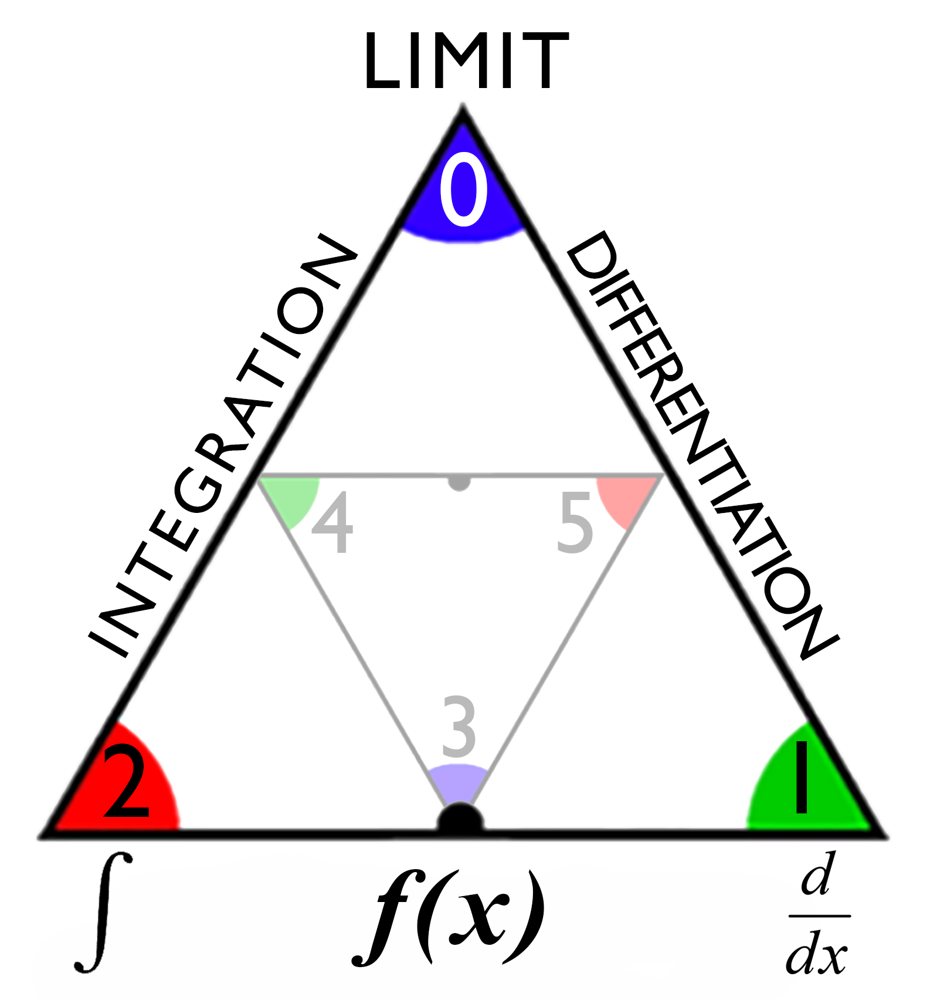Integration**

- **Uses the derivatives to calculate the area.**  The *Contribution* point of a tholon adds another dimension, so now we have 2-dimensionality (described by two 1D measurements).  In order to measure changes we need to look at a series of 2D points (which are made up of a series of 1D points, the *Derivatives*).  The less separation (*Δx*), where *x* can be time, space, some numerical variable, etc.)  between these points, the more accurate the results.  The smaller *Δx*, the more points (*n*) we have.  The sum of these points is expressed as the inverse notation of above:

  … which means the sum of all the derivatives (*n*) starting from the first  (*n~1~*) up to the last (*n&infin;*), which will always be the inverse of the limit of the derivative, *1/0=*&infin;, but because we are dealing with infinitesimally small pieces, we use the integral function:

  … which says that we have an infinitesimally small difference between points (*dx*) that exist between points *a* and *z*.

The functional part of calculus exists between the **Differentiation** and **Integration** as that is the spectrum within which the fundamental theorem of calculus exists.  This is also the spectrum where child N-states can exist.

Perhaps there is a way to apply calculus to non-mathematical systems, like psychology, society, law, etc.?  This is far beyond my abilities, but I imagine it would look something like the calculus used in such things as Game Theory or the Nash Equilibrium (John Forbes Nash Jr. was an American mathematician who created the Nash Equilibrium, for which he was awarded both the Nobel Memorial Prize in Economic Sciences and the Abel Prize.  He was the subject of the movie “A Beautiful Mind”).

## Stock Exchange

Economics is one of the best instances of tholonic processes. As we've mentioned, economics is as organic and natural an archetype as is any life form, and some are beginning to understand that.  To quote from the Santa Fe Institute's "Economic complexity: A different way to look at the economy." [^76]

> Complexity economics asks how individual behaviors in a situation might *react to* the pattern they together create, and how that pattern would alter itself as a result, causing the agents to react anew.

This is a very tholonic concept, but for now, let's just look at how the thologram and the stock market overlap.

The stock market is an aggregate of numerous values that are determined by the two constantly opposing forces of buying and selling.  While there may be many influential factors that drive those forces, the authoritative value in any one moment of time is a clear and indisputable *negotiated* number that has been agreed upon.  These opposing forces are illustrated in the chart below, where it shows the *depth* of each force and the ever-moving point where they cooperatively meet.  The X-axis is money, and the Y-axes is volume.

The record of these changes is what we recognize as a classic stock market chart.

You'll notice the chart is not made up of dots, but of what are called *candlesticks*.  The candlestick is a very clever way to show information and was created by the Japanese in the 17^th^ century for the rice markets, and it is very applicable to the thologram.  The candlestick record is also called the HOCL bar because it records the  hi, open, close and low prices for a given period of time.

Why this is relevant is because each candlestick shows the two maximum opposing values valid for the time period. These would be the highest and lowest prices.  These two prices define the spectrum within which any cooperation *could* exist. The START and END prices represent the area within that spectrum where a cooperation *does* exist. As you can see by the 3 minute and 30 minute charts above, the spectrum and the agreements can vary wildly. Both of those scales are of the same asset and start at the same time. Equally significant is that what is ascending on the 3-minute scale can also be descending on a different scale. Of course, if we showed the two scales in proportion, you could see the the 3 minute scale agrees with the 30 minute scale, but that is irrelevant if the context of the trader is 3 minutes, not 30 minutes.  A trader would look at these two scales and simply think "Yeah, it went down, then it went up. So?", and he would be right, but we are not looking at the the price, or the time. We are looking at how and why different forces are at play only within a specific scope, similar to how traders look for patterns; fractal, Fibonacci, cup-with-handle, cup-without-handle, etc., regardless of time or price.

Another interesting process is how multiple candlesticks can be added together. The graph below shows two candlestick of some time period (*t*​), which when added together show show the aggregate of those two candlesticks.  That aggregate is equal to the single candlestick of *t&times;2*. So, if you want to see the aggregate of 64 1-minute period candlesticks you just need to look at the one candlestick of one 64 minute period.

What was just explained is exactly how tholons work as well, so we should be able to apply some of the laws of the tholon onto market data.  Let's use Ohm’s Law again as an example of applying a simple tholonic rule, to get the graph below (all data normalized to a scale of 0-1 and shows a moving average of Bitcoin/U.S. Dollar trades).  But what values would we use?  Fortunately, the choices seem obvious.

- **Volts** (blue line) is defined as the potential between the high and the lowest charge, so the **highest and lowest bids** would fit perfectly here.
- **Amps** (orange line), or current, is the volume of electrons in play and one moment, so volume of trades would seem to apply here.
- **Power** (green line) is defined as *power=volts&times;current*​, so we have to calculate the the power value here as *power=price range &times; trading volume*, even though I don’t know what this would represent at this point.
- **Resistance** (maroon line) is also calculated from *price range &div; volume*.  However, this calculated value does not equate to the *actual* agreed upon **price**.  This calculated number is called the **Balanced Price**, as it represents the price that is perfectly matched to the volume and the price range, regardless of what the actual agreed upon price was.

The light blue line on top of the maroon line shows two lines that represent the balanced price, but were arrived at in two different ways;   and , just to ensure they matched as expected.

Let's examine our calculated data to discover if it is more or less patterned or random than out input data.  The following chart shows the results of testing for randomness in a file made of over two years of hourly trade data using the same process.  The more *compressible* the data, the more pattern and order it has.  Also included are other random test scores, and as you can see, all indicators show that the generated data using Ohm’s Law has more pattern than the source data.

What this shows is that we can discover less random, more ordered data. What is surprising about this is that one might assume that one thing that has X amount to randomness combined with Y amount of randomness would result in something that is *more* random, but this is clearly not the case. Isn’t that like throwing two handfuls of sand onto the grounds, and wherever they overlap there is a picture of a flower?  The implication is that neither of the two input values is actually random, and whatever pattern they are both hiding becomes clearer when they are combined.

While this may not set Wall Street on fire, for our purposes it is very interesting to see that the *balanced price*, which is derived from the market data, has a pretty clear and predictable pattern, and from data that arguably has only a loosely coupled relationship to each other i.e. the amount of assets traded and the range in which their prices were agreed upon. The yellow line is the actual price that took place (and the most random of the data), and the only obvious relationship is that *balanced price* appears to move somewhat contra to both the actual price and the trading volume.

Approaching this tholonically, we'd say that the balanced price will always represent the optimum relationship between volume and price range, both of which are always changing.  However, the actual traded price rarely reflects that relationship.  Consequently, the other variables in play will naturally adjust because (hypothetically) all three variables of price, volume, and range are actually three perspectives of one thing, one instance, one tholon.  Below, the upper chart shows the actual price (blue line) and the balanced price (orange line). Both values have been adjusted to a moving average for the day and normalized to a scale of 0-1.  Each vertical line represents one day and the 24 hourly candlesticks of that day.  The first thing you can see is how the balanced price remains within a tight and consistent range, while to actual price wanders all over the place.  The middle chart shows the same two lines, but the balanced price vales are added on top of the actual price values. We would have to assume that sometimes the force of the balanced price affects the actual price (by effecting changes in the other variables), and sometimes the actual price affects the balanced price due to the forces of the other variables effect on those variables. The bottom charts shows the two lines on the same scale. Most notably, the two lines appear to counteract each other, pulling and pushing the actual price as if it was acting as a force of *resistance*.  This is especially interesting as the differences between the two lines, as we can see in the middle chart, appear very minor.  

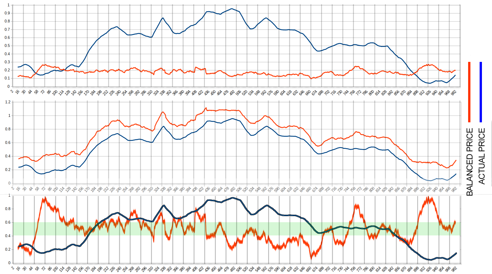

I have no doubt that serious research would yield interesting results. From the tholonic perceptive, knowing that perhaps the stock market, music, story telling, batteries, electrical circuits, and much more, all have a correlation is interesting, but suggesting they are all effects of a higher-order cause is much more interesting.

Here is what all four calculated values looks like compared to the actual historic prices.

More on this in [Appendix I, “#Appendix-I:-Market-Data”](#Appendix-I:-Market-Data).

## Faith & Belief

Previously, we used the example of Cognitive Behavioral Therapy as an example of a triplet of understanding as it might apply to psychology.  We can expand on that a bit by looking beyond psychology alone and more into not only the most fundamental way we perceive reality, but the very drivers of how our societies and culture are formed, these being *belief* and *faith*.  Typically, this is seen in the dichotomy of spirit and science, but it goes far beyond that.  Both of these concepts attempt to model the Truth, but because we can't ever know of an ultimate truth, if one even exists, the best we can attempt to achieve is an *understanding* of a contextual Truth.

We previously defined *data*, *information*, *knowledge*, and *understanding* as the following:

**Data** + *order* = ***information***
**Information** + *context* = ***knowledge***
**Knowledge** + *application* = ***understanding***

If we removed the intermediate concepts of *information* and *knowledge* and only use the one essential ingredient, *data*, we can express this as:

**Understanding** = (((*Data* + *order*) + *context*) + *application*)

And what is data? Tholonically, data is the chaos of existence (represented by the conceptual abstractions we have created).

If we were to map these 6 concepts to a trigram it would look like the image on the right.

Let's review these concepts with the case of the farmer and the cow:

**Data**: There is a farmer, a cow, a field, a bush, a large piece of paper, a neighbor.

*Order: How do these pieces of data relate to one another?*

**Information**: The cow belongs to the farmer.  The cow is not where the farmer expects it to be.  The neighbor has seen the cow in his field.  

*Context: What are the limitations and purpose of their interactions?*

**Knowledge**: The farmer believes he confirmed this information by seeing the cow in the field.  The neighbor believes the farmer did not see the cow, as it was hidden, but instead mistook the paper in the bushes as the cow.  

*Application: What actions will the farmer take based on what he believes?*

**Understanding**:  The farmer goes to retrieve the cow, but upon approaching what he believed was the cow, he discovered it was a large piece of paper stuck in the bushes. He understands his beliefs were based on a falsehood, and that his efforts to retrieve his cow were in vain.

In the above example, the farmer acted on his belief *based* only on information, as he did not yet have *knowledge* or *understanding* of the situation.  He does not have *faith* that the cow is in the field, but he does *believe* the cow is in the field because he has had some validating input, giving him reason to believe.  If he had no validating input or information, no reason to believe the cow was in his neighbor's field, but still went to the field to retrieve his cow, that would be an act of *faith*.

The concepts faith and belief are so similar to the concepts we need to define, it is more effective to slightly redefine then that to invent new words.  We won’t take too many liberties as our definition of fait, at least, is quite compatible with it definition as expressed in the Stockdale Paradox.  The Stockdale Paradox is named after its creator, U. S. Navy vice admiral James Bond Stockdale, who realized this paradox while he and his 11 men were held in a prisoner of war camp by the North Vietnamese.  For 7 years he was chained in a windowless 3’&times;9’ cement box in the sweltering jungle, broken bones, beaten and tortured.   The Stockdale Paradox was the coping mechanism that allowed him and his 10 men (one died in prison) to survive.

> You must never confuse faith that you will prevail in the end – which you cannot afford to lose – with the discipline to confront the most brutal facts of your current reality, whatever they might be.

Here, faith in an absolute, unreasonable, irrational commitment to the understanding that against all evidence, all odds, all probabilities and possibilities, you will attain your goal.  Most of us can not even imagine the level of faith one must have to survive such as ordeal, making his understanding of the word in theory and practice beyond reproach.

so with the readers indulgence, here are the definitions we will use:

**Faith**: *Subjective understanding*, i.e. an understanding that does not need any, or very weak, validating objective evidence to exist. This is how one understands their existence in relationship to all of existence, which is typically understood as God, the Universe, or some form of “Spirit”. An example of this might be "I have faith I am always where I am supposed to be", which is absolutely un-provable.

**Belief**: *Hypothetical knowledge*, i.e. knowledge that has some objective evidence, some supporting information, but has yet been tested.  In a way, *belief* is like *faith* but with some supporting evidence. This is how one understands their existence in relationship to other *instances* of existence. i.e. the world at-large.  It is almost synonymous with the phrase “educated guess”.  To say "I believe in the value of hard work" is another example of this definition of *belief*, as there is some objective evidence to support that belief.  In this sense, science is a belief systems, but one with rigorous testing and proofs.  This is how most people's belief system operates as the need for some sort of validating information is very strong.  This is a result of our tribalism, which is a string evolutionary program, and the also the source of guilt.

A key point here is the *objective evidence*, for there can be plenty of subjective evidence that the person holds as valid, if not more valid, than objective evidence.  We see this in cases of people who have had extreme and profound subjective experiences, such those who experience near death or out of body experiences.  

Subjective understanding only applies to oneself, while objective understanding applies to all.  We call the later *science*, but what do we call the former?  The study of psychology is probably the closest thing was have to a modern western formalized approach to understanding our subjective reality, but given that it is based on an objective perspective, it will never achieve understanding.  However, there are many non-western approaches to understanding one's relationship to existence, and they requite as much, if not far more, study, practice and commitment than any student of psychology.

Faith and belief can be contradictory.  For example, one might have faith they will be delivered from their hell, but when getting your legs broken while chained to the floor in a North Vietnamese prison, one could easily believe they will not survive.

The tholonic view is that the objective and subjective are inextricably bound together being as they are not only two poles of the primal awareness, but the first duality of awareness.  If one could understand that primal awareness, the duality and division of the subjective and objective would no longer exist, just as we understand how day and night, while appearing opposite, are both the result of a spinning Earth.

In its most reduced form, we really only have three concepts (also shown in image, left, below):

- **All**.  This is the domain of **faith**, as we have defined it, for faith is unlimited, free from facts, context, proof, scope, rationality, time/space, measure, or anything else.  This is Stockdale’s “*faith that you can’t afford to loose*”.
- **All that *could* be**.  The is the domain of **belief**, as is limited to the possibilities that can exist in a given scope and context.
- **All that actually is.**  This is the domain of **understanding**, and is defined by what actually exists, not theoretical, hypothetical, possible, etc., but that, and only that which actually exists, meaning that which has managed to form a stable pattern that can instantiate itself  in the context and scope of its environment. This is Stockdale’s “*facts of your current reality*”.

"I have faith I can fly" will not end well if I do not limit my faith according to the context and scope of being a human that lives on a planet with gravity.  Considering these limitations, I can say "I believe I can fly", and working within my scope and context I can imagine an airplane.  When I finish successfully building my airplane, I can say "I understand one way how humans on Earth can fly".  This progression begins with faith, is honed by belief, and results in understanding.  It also describes the entire history of Man's journey of progress, and perhaps the journey of all things that are a form of intelligence.  One of my personal favorite examples of this concept is illustrated in (slightly altered) well-known concepts (right).

While *faith* is the beginning of the path, the spectrum of creation exists between *all that is possible*, and *all that is*, or between *belief* and *understanding*.  Not surprisingly, as we can see in the image (right) above, not only is *faith* where the path begins, but where it leads to as well.  Tholonically speaking, *faith* is the only path, and all the stuff that *could be* or *is* are side effects, instances, or consequences of traveling that path, making *all that is* ultimately an instance of *faith*.   Faith in *what* is a question left for the reader to answer.

Although worthy of a chapter, or even a book, we’d like to just briefly show how similar this model is to *Schrödinger Equation*, which is the 1926 equation of  Erwin Schrödinger that laid the foundation of quantum mechanics.  This equation is the quantum version of Newton’s laws, and “simply” says *potential energy + kinetic energy = total energy*.  At this point, the reader should easily see how this fits into the tholonic model, but we are sharing this here because of the remarkable parallels of **all** to *total energy*, **all that is possible** to *potential energy*, and **all that is** to *kinetic energy*, which neatly equates **faith** to *total energy*, **belief** to *potential energy*, and **understanding** to *kinetic energy*.  It’s also interesting to see that this revolutionary formula that has changed the way we understand reality is the simplest of all patterns, 2+1=3, that even a 6-year-old can grasp, but in a different context and scope.

## Consciousness

The highly respected and published team of Donald David Hoffman (cognitive psychologist, author, and Professor in the Department of Cognitive Sciences at the University of California, Irvine) and Chetan Prakash (PhD Mathematical Physics, Cornell University) developed the idea of a *conscious agent*, which is a dynamic process of consciousness and argue that it is the interaction between various agents that produce measurable phenomena such as the position, momentum, and energy of objects.  They further argue that these objects have no objective, absolute or even preexisting properties and only exist in relation to consciousness via these *conscious agents.* This is a radical claim, but their arguments and evidence as laid out in their paper “*Objects of consciousness*” [^77] can’t be ignored.  What also can’t be ignored is the striking similarity between the two models, as shown below.  (This was also especially striking for me as I learned of this long after the first draft of this book.  Of course, they do a far better job of explaining their idea technically, mathematically, and psychologically.)

## Adding Structure

A general prediction would be if we could add structure to form, thereby increasing its ability to “work”, we would see testable results.

Given how water seems to be such a good tholonic medium, can we add structure to water in a way that matches and/or enhances the patterns of the thologram and see some differences in how it transmits or interacts with energy? If we do see any differences, then we have another piece of potential evidence that supports the tholonic model.

As it happens, there is such a thing as *structured water*.  *Coherent* or *Structured* water, for those who are not familiar with the term, is regular water that has been modified to give it more structure or pattern, specifically in the way that the water molecules are arranged in relation to one another, or so it is claimed.

OK, I know I probably lost some of the readers with this last sentence.  If you do an Internet search of “structured water” one of the first results you will get is the Wikipedia entry that begins with “structured water is a term used in a marketing scam” and although that is true to the extent that anything can be a scam in the hands of scammers, the entry says nothing whatsoever on the research and testing that has gone into the use of structured water.

To the dogmatically skeptical, anything that challenges the current world view is “swarming with worms of heretical perversity”. It doesn’t matter if a new idea, in this case, structured water, has vast amounts of scientific research and support from highly accredited professionals and ample evidence one can find by researching the pioneers and leaders in the field, many with a lifetime of contributions and dozens of Chairs, Fellows, and Adjuncts with Accolades of their life’s work[^78], as well as hundreds of papers and dozens of books related to and supporting the structured water phenomena.  Skepticism has its place and serves a critical purpose, but regarding the extreme skepticism of structured water, that purpose does not seem to be moving understanding forward or seeking new solutions to real-world problems, such as solving global water shortage problems and increasing crop production, as has been well documented by some of Australia’s largest produce farms.

There is quite a lot of good research on the subject that we won’t detail here, but if you want to learn more a good place to start is Fabian Ptok’s Masters theses *“Alternative Irrigation Methods: Structured Water in the context of a Growing Global Food Crisis due to Water Shortages”*[^79], which covers the subject well from an agricultural and security perspective but also has a number of references to the researchers and work going on in this area.  One of the often cited studies showed dramatic results in decreasing blood and DNA damage in diabetic rats, but this study is also criticized as it was small[^303] . There is also a book by Professor Gerald Pollack, who has an impressive list of credentials[^304], and is available online for free[^80] (which I have not read, so this is not an endorsement or recommendation).  Another good source is the work of Marcel Vogel (more on him later) who claimed that through years of work and thousands of experiments he was able to prove that various forms of energy, including thought, could permanently change the spectrographic properties of water, [^301] and that water was an information storage system.  This last claim is especially significant considering Vogel was not only a chemical and physics researcher at IBM for 27 years, but he was an information medium specialist, holding patents of hard-drive memory technologies that are in use to this day.

Water is a particularly good test medium because the structure of molecular water is tetrahedral, and being the most basic shape of creation lends itself to many different tholonic applications.  It’s worth noting that when it was originally suggested that water might be tetrahedral in shape back in 1938 the idea was met with disbelief.  It was not until 80 years later, in 2013, that this was finally accepted as valid.  Today “it is widely accepted that liquid water structure is comprised of two closely interweaved components; i.e.  tetrahedral and hexagonal structures”.[^81] In fact, water, as ice, may be the closest instance of the entire tholonic structure of any other substance (that is common to us).

*(Above: Left image from “Tetrahedrality is key to the uniqueness of water” [^82])*

The *silicate structures* of minerals are also quiet similar in that they are made up of tetrahedrons of various arrangements.  In fact, the structure of water and quartz is so close that in some conditions ice has the same (or really similar) structure as quartz! [^302] This lends some credence to the metaphysical idea that water and quartz have a special relationship.

Radical ideas are often met with radical resistance.  Structured water is one of those ideas.

Simply by adding some structure to simple tap water (see examples of how to make structured water in [Appendix H, “How to Make Structured Water”](#Appendix-H:-How-To-Make-Structured-Water)) we can see measurable effects.

In Ptok’s Master’s thesis mentioned above, the author examines various tests that grew different plants using tap water and structured water.

One of his findings was that using structured water increased alfalfa growth by 15.1%.  This may not sound like much, but in the U.S. alone a 15% increase in alfalfa growth represents an additional 20,700,000 tons of alfalfa, which has a value of over 4 billion dollars.

Similarly, some of Australia’s largest produce farms have reported needing 25% less water to produce a superior product than with traditional water (more details in [Appendix H,”How To Make Structured Water”](#Appendix-H:-How-To-Make-Structured-Water)).

This is a perfect example of how the simple enhancement of order at the most fundamental level can have radical changes up the chain.  These dramatic results were achieved with only one change to one element in one application.

In the tholonic model, this example also applies to ideas, concepts, and intelligence;  small changes in one area can have radical consequences in the world of ideas, and of course, ideologies.

[^70]: Fuller, R. Buckminster, and E. J. Applewhite. ***Synergetics. Explorations in the Geometry of Thinking***. Macmillan, 1975.The entire book can be found online at <http://synergetics.info>
[^71]: References to the above come from <http://synergetics.info/s02/p0000.html>
[^73]: Siegel, Ethan. “**Ask Ethan: Can Free Quarks Exist Outside Of A Bound-State Particle?**” Forbes. Forbes Magazine, August 3, 2019. <https://www.forbes.com/sites/startswithabang/2019/08/03/ask-ethan-can-free-quarks-exist-outside-of-a-bound-state-particle>
[^74]: Steingart, Dan. “**The Unfortunate Tetrahedron**.” Medium. the unfortunate tetrahedron, May 30, 2017. https://medium.com/the-unfortunate-tetrahedron/the-unfortunate-tetrahedron-ce1e44d0b961.
[^76]: Institute, Santa Fe. "**Economic Complexity: A Different Way to Look at the Economy.**" Medium. November 03, 2014. Accessed August 02, 2020. https://medium.com/sfi-30-foundations-frontiers/economic-complexity-a-different-way-to-look-at-the-economy-eae5fa2341cd.
[^77]: Hoffman DD, Prakash C. **Objects of consciousness.** Front Psychol. 2014;5 577. doi:10.3389/fpsyg.2014.00577. PMID: 24987382; PMCID: PMC4060643.
[^78]: <http://hexagonalwater.com>
[^79]: Ptok, Fabian, “**Alternative Irrigation Methods: Structured Water in the context of a Growing Global Food Crisis due to Water Shortages**” (2014). Undergraduate Honors Theses. 182. <https://scholar.colorado.edu/honr_theses/182>
[^80]: Fonseca, Giuseppe, and Giuseppe Fonseca. “**Dr Pollack The Fourth Phase of Water.**” Academia.edu, <https://www.academia.edu/18516517/Dr_Pollack_The_Fourth_Phase_Of_Water>
[^81]: Chara, et al. “**Crossover between Tetrahedral and Hexagonal Structures in Liquid Water.**” Physics Letters A, <http://www.academia.edu/21730774>
[^82]: Staff, Science X. "**Tetrahedrality Is Key to the Uniqueness of Water.**" Phys.org. March 27, 2018. Accessed July 28, 2020. https://phys.org/news/2018-03-tetrahedrality-key-uniqueness.html.
[^301]: http://marcelvogel.org/LabNotesMarcelVogel.pdf
[^302]: **Structure of hydrogen-stuffed, quartz-like form of ice revealed.** (2017, January 04). Retrieved October 10, 2020, from https://gl.carnegiescience.edu/news/structure-hydrogen-stuffed-quartz-form-ice-revealed
[^303]: Lee, H., & Kang, M. (2013). **Effect of the magnetized water supplementation on blood glucose, lymphocyte DNA damage, antioxidant status, and lipid profiles in STZ-induced rats**. *Nutrition Research and Practice,* *7*(1), 34. doi:10.4162/nrp.2013.7.1.34
=[^304]: Gerald Pollack. (n.d.). Retrieved October 19, 2020, from http://wiki.naturalphilosophy.org/index.php?title=Gerald_Pollack

[^308]: McGovern, Jim; "What Have Spacetime, Shape and Symmetry to Do with Thermodynamics? ", ECOS 2007, Proceedings of the 20th International Conference on Efficiency, Cost, Optimization, Simulation and Environmental Impact of Energy Systems, Ed. Alberto Mirandola, Ozer Arnas, Andrea Lazzaretto, pp. 349-356, June 25-28, 2007, Padova, Italy, arXiv:0710.1242, Available at: https://arxiv.org/pdf/0710.1242.pdf
[^309]: **Freedom in the World** (2018), published by Freedom House, **Democracy Index** (2017), published by The Economist Intelligence Unit, **V-Dem Annual Democracy Report** (2018), published by the V-Dem Institute
