

# 9: FIELDS

###### Fields are forces of influence; electrical, conceptual, unknown, or otherwise

If tholons are themselves forms of information, then we come back to the question, “Where is this information stored?” This is a question that has been pondered for ages. One example would be the somewhat Buddhist concept (in that it was coined by a Buddhist in 1884, but adopted by other beliefs) called the *Akashic Records* which is said to be “a compendium of all human events, thoughts, words, emotions, and intent ever to have occurred in the past, present, or future”. This might be a bit ambitious for our purposes, but the idea is essentially the same… that of a ubiquitous, timeless non-physical record of (at least) all aggregate thought forms. If our claim is that this also describes the thologram, then where and how does it store this data?

Let’s review…

Our claim that the original source of energy is primal awareness/intention, as as such, awareness/intention is a property of existence.  This is consistent with some current scientific models, especially in light of the experiments that have shown an inextricable relationship between reality and awareness.  Although there is much discussion these days about consciousness and reality, Archibald Wheeler, one of the mega-heavy-weights of quantum mechanics, a colleague of Albert Einstein and Niels Bohr, a mentor to many of today’s leading physicists, and the man who chose the name “black hole,” was perhaps the first modern scientist to prove that awareness is required to bring the universe into existence.

As Wheeler put it:  

> No phenomenon is a real phenomenon until it is an observed phenomenon.[^89] We are participants in bringing into being not only the near and here, but the far away and long ago.[^90] 

Towards the end of his life he said he had only enough time left to work on one idea: that **awareness shapes not only the present but the past as well.**

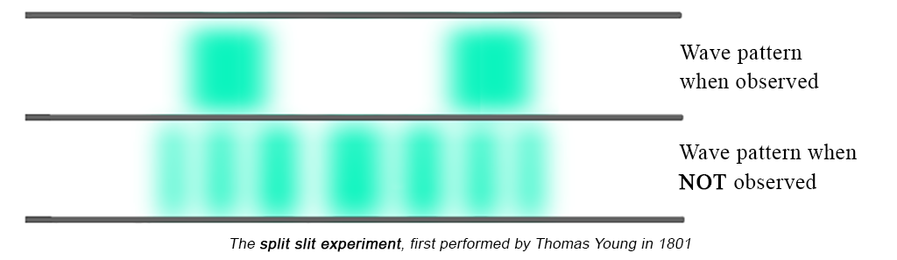

We already have the proof of awareness causing waveforms to collapse into particles, as we see in the _split-slit_ experiment.

Briefly, this split-slit experiment shows that when observed, electrons act like particles, and when not observed, they act like waves.  The act of observation forces the electron waves to be perceived as particles.  It’s not that the electrons are waves that turn into particles; it’s that the electrons are *wavicles*, both particles *and* waves at the same time, but the act of observing them, of introducingt awareness into the context, changes the context and scope of the expression, which then alters its instantiation.

We also have evidence of how awareness can (possibly) change the reality of the past as well, as demonstrated in Wheeler’s *delayed-choice experiment*[^91].  In addition, Penrose wrote an entire book on the subject of cognition and reality (*The Emperors’s  New Mind*).  He even came up with a term do describe the awareness/reality continuum: the _Orch-OR_[^92], or *orchestrated objective reduction*, which attempts to explain how consciousness and reality are intertwined.  The idea of reality being a product of awareness is not at all “fringe” and hasn’t been for some time.

Looking at this tholonically, each tholon has its own field, and that field is a parent field within which the child tholons, with their own subfields, are created.

Let’s look at a classical field for a moment.  A magnetic field is caused by the movement of subatomic particles (electrons, protons, neutrons) called “spin”.  Everything is magnetic but in most substances the direction of the spin of these particles is 50/50, half spinning in one direction, and half spinning in the opposite direction, so the magnetic fields balance each other out.  In some metals, like iron, all the particles spin in the same direction, creating an imbalanced magnetic field.  It is the attempt of this imbalanced field to balance itself that creates magnetic fields we see in magnets, planets and elsewhere.

The greater the energy (as current), that is traveling through a medium, the greater the magnetic field it creates.  This magnetic field is a form of energy, so just as the movement of electricity can form a magnetic field, so too can a magnetic field form electricity.  No energy is being created, just changed from one form to another form.  This transformation, specifically in the case of electricity and magnetism, is called induction.  As the word implies, induction is the “ability to persuade or influence (someone or something) to do something.”  Thus, every field can induce anything in its proximity to change in some way and to some degree.

Applying this to the thologram, at the “top” we have a very simple field, that which exists between the first two poles which were created by the primal dot.  Every child field is induced by its parent (and ancestors), and the parent is induced by the child (and all descendants).  The thologram is one large field of ever-embedded fields all inducing one another, all of which are expressions of the primal awareness, all of which are interacting with, and dependent on, one another.

There are many legends, stories and theories, ancient and modern, attesting to the power of awareness.  We won’t get into them here other than to say that if reality and awareness are intertwined, then it would be reasonable to expect that just as reality has an effect on awareness, awareness can have an effect on reality, especially as awareness is an integral part of reality and not simply an effect of evolutionary causes.  This is easier to accept when speaking of human awareness, but how does this associative relationship manifest in other instances, such as plants, rocks, planets and elements, all of which are some expression of the primal awareness to begin with?

## Morphic Fields

As late as the 1950s, some scientists and most people in general thought that plants and even animals were little more than biological machines and that space was just a bunch of hot and cold balls floating around according to Newtonian and Keplerian laws.  Since then we have come to discover that plants have “feelings”, monkeys can form sentences and talk about their emotions, the universe is not only a lot bigger than we thought, but there may be countless parallel versions of them.  We have seen how everything is connected in one way or another, at least on the quantum level - just to name a few of the changes to our worldview.  We are moving ahead in our thinking and understanding at an incredible rate.

Sadly, some of the old guard is a tough bunch that is doing their best to keep us from making progress, not unlike the 9^th^-century Archdiocese.  Take the long-time editor of *Nature* magazine, Jim Maddox, who stated, regarding Rupert Sheldrake’s book on morphic fields:

> “[his book] is the best candidate for burning there has been for many years.  Sheldrake’s is not a scientific theory.  Sheldrake is putting forward magic instead of science, and that can be condemned, in exactly the language that the Pope used to condemn Galileo, and for the same reasons: it is heresy.”[^93]

Yes, he actually cited Pope Paul V’s condemnation of Galileo as a defense on the grounds that *heresy* is the real crime.  This sounds eerily similar to “swarming with worms of heretical perversity.”

This alone should paint a pretty clear picture that modern science, for all its breakthroughs in understanding and progress, has become a modern-day religion in the hands of the truly dogmatic that seem to be in charge all too often.  Dr.  Richard Feynman himself noted this when he stated:

> We live in an unscientific age in which almost all the buffeting of communications and television, words, books, and so on, are unscientific.  As a result, there is a considerable amount of intellectual tyranny in the name of science.[^94]

So, why are the modern-day versions of Tomás de Torquemada (Grand Inquisitor in the Spanish Inquisition of the 15th Century) and his ilk impaling the venerable and brilliant Rupert Sheldrake on the spikes of modern mainstream scientific dogma? Well, it seems that Sheldrake, himself a Cambridge professor who studied at Harvard, was onto something with his *Morphic Field Theory*, and it rattled their cage.  Perhaps they feared that the “worms of heretical perversity” would begin to devour the carcass of a dying scientific worldview.

Sheldrake’s Morphic Field Theory, which he described in his 1981 book, *A New Science of Life*, posits the existence of organizing fields which are systems that self-organize, create structure, and have patterns.  Morphic fields are not a type of mass nor an energy but are organized *by* energy, like everything else.  Morphic fields are described in the same way as holarchies in that they are made up of parts, which are in turn parts of wholes themselves.  At each level, the morphic field supports the structure of its whole and organizes its parts.

Morphic fields described  (in 50 words):

> “located invisibly in and around organisms, and may account for such hitherto unexplainable phenomena as the regeneration of severed limbs by worms and salamanders, phantom limbs, the holographic properties of memory, telepathy, and the increasing ease with which new skills are learned as greater quantities of a population acquire them.[^95]  **\~Rupert Sheldrake**

A more complete description is:

*The following is a synopsis based on a letter Sheldrake wrote to John Horgan, a writer for Scientific American,*[^96] *wherein he explains clearly in his own words what a morphic field is.  He also has a very good explanation on his website*[^97]*.*

A morphic field (MF) is a field of energy that imposes patterns on otherwise random or indeterminate patterns of activity.  Morphic fields transmit information via morphic resonance (MR), which is the influence of previous structures of activity on subsequent similar structures of activity organized by morphic fields.  MR has the capacity to store and transmit information and therefore it can act as a memory bank for any self-organizing group, such as self-organizing systems; molecules, crystals, cells, plants, animals and animal societies.  Each member of a group can contribute and draw from this memory bank.

The idea of MFs was an epiphany that Sheldrake had in 1971 as a way to explain how living things knew how to grow when that information was not stored in its genes.

The very first known example of an MF test actually goes back to 1920, long before the ideas of MF arrived, when Harvard professor William McDougall proved that children of mice that have learned a maze can navigate the maze much faster.  After 20 generations of maze running mice, the next generation was able to run the maze 10 times faster than their pioneering ancestors.  As genetics could not account for this transference of knowledge, it must have been something else, something science didn’t know about.  To solve this problem a team in Edinburgh set out to prove McDougall’s test was pure poppycock.  Unfortunately, their 20^th^ generation mice knew how to go straight to the target on the first try.

They had no idea of morphic fields back then because if they did, they would have known that the Edinburgh mice benefited from the knowledge of the Harvard mice, even though they were thousands of miles apart, thanks to the transference of information via the MF/MR.  There have been many other examples like this over the last 100 years.

The way this MF information is transmitted is via MR, according to Sheldrake.  All members of a group that share an MF have access to the MF info because they naturally resonate with that field, not unlike how we can pick up radio waves when we have a crystal that resonates with the transmission frequency.  Dogs share information with dogs, humans with humans, etc., but a bond between a dog and a human creates another MF that they both share.  Sheldrake shows examples of this in how many dogs know when their owners are coming home and start waiting for them by a door or window.[^98]^,^ [^99]

*End of synopsis.*

Because of their ability to transmit data across time and space, MFs have been considered for communication in long-distance and interstellar travel[^100]^,^ [^101].  MFs may also be capable of creating self-organizing systems within the realm of AI.

A lot more research is needed in the area of MF and MR, but this is slow in coming given the oppressive dogma of modern science.[^102] Others have been working on similar ideas, such as theoretical physicist Lee Smolin, with his idea of the *principle of precedence*[^103], which states that the history of measuring a particular quantum event will determine (or affect) the future measurements of that same event when it is measured.  Unfortunately, unlike the world of physics, biology has become more dogmatic in the 20^th^ century.

One small detail, but hugely significant, is that morphic fields originate outside of space-time.  They exist in the realm of thought, or awareness, or consciousness (or all three).  Information, as we currently understand it, cannot travel faster than the speed of light (however, there is some evidence might suggest otherwise), but does this apply to awareness? According to the tholon model, no, it does not, because reality and the Universe *is* awarenss, and awareness is a 0D dot. There has been some research on awareness[^104], but it’s scant, and the results are far from clear-cut.

Many people believe that one’s awareness can, with practice, travel outside of the body, and outside of this physical reality.  This is typically called *Out of Body Experiences* (OOBE), or *Astral Projection*.  Mainstream science is not a fan of this idea.  *Scientific American* suggests that OOBEs are caused by inner ear problems[^105].  This view, although not surprising, is disconcerting considering that some real research on OOBEs has shown remarkable evidence.

There are many examples of such research[^106], such as Dr.  Tart’s subject being able to read the letters “P = 10^-5^” or “25132” that were written on a remote piece of paper while out-of-body[^107].  For the record, OOBEs are tholonically explained by the anchoring of the consciousness to the (or a) parent tholon of whatever tholon a person is an instance of and practitioners have reported faster-that-light, instantaneous, “travel”.  The concept of “soul” is an umbrella term to describe many of the much higher-level tholons.  Adepts at consciousness anchoring can anchor to any tholon.  This might explain how, as it says in the Majjhima Nikāya scripture, it was possible for Buddha to remember all his lives going back 90 eons, (with 1 eon being the lifespan of the solar system).

Although this sort of research does not get the attention it deserves, with a bit of effort it can be found.  Science is not well equipped to study the mechanics of awareness or any non-material phenomena.

Fields of awareness, such as morphic fields and tholonic fields, while being able to instantiate in the material world, are not limited to the restrictions of the material world.

#### **Claim 52:** Tholonic and Morphic fields have the ability to transmit and store information.

#### **Claim 53:** Tholonic fields are not limited by time and space.

## Tholonic Fields

The current idea that MFs can be formed as a result of a self-organizing system, as Sheldrake describes them, are limited to systems that exist, systems that have real-world instances, like animals, societies, crystals, etc., or anything that is an instance of a tholonic archetype. Ideas exist and are self-organizing as well, so why wouldn’t MFs apply there? Well, they would, but with a difference.  In the MF model, it is the instantiated members of  the MF that are receivers and transmitters of information, and therefore the reception and transmission of information among the living are dependent on the ability of the members of the over 200,000,000 species of life of the planet to transmit and receive.  If we applied the MF model to ideas as archetypes not limited by their instances, than what is receiving/transmitting information in this MF that *ideas* are a member of?

Sheldrake implicitly answers this question when he describes the morphic field as “organizing fields which are systems that self-organize, create structure, and have patterns”.  This description is that of a form of intelligence, and therefore the morphic fields that share a morphic resonance or morphic cloud are capable of transmitting a receiving between themselves, not only with their instances.  Tholonically speaking, this would also mean that the archetypes, the tholons, are also both transmitters and receivers of information.  The tholonic view also considers the material reality to be a contextual expression of a field in the material reality, and there is no difference between the field and the form other than context, as they are the same thing. In the MF model, humans, dogs, and ants are forms of life that resonate with fields. In the tholonic model, humans, dogs, and ants *are* those fields in a material context.

The theory of Morphic Fields attempts to explain why and how ideas simultaneously spread across a morphic group, such as humans.  Examples of this are how Leibniz and Newton both came up with the idea of calculus at the same time, or how cubic equations, considered to be one of the greatest milestones in mathematics history, was simultaneously discovered by Nicola Tartaglia and Scipione del Ferro in the 16^th^ century.  Morphic fields are also capable of inter-group communication, such as between humans and dogs, as cited in Sheldrake’s book *“Dogs That Know When Their Owners Are Coming Home*”.

In the tholonic view, this same phenomena exists between tholonic archetypes, and these tholons/archetypes can have direct communication with each other without having to go through any of their instances.  That interaction can also include negotiation via cooperation and/or conflict, or result in a redefining or contributing of both archetypes.  Tholons can battle, join together, form alliances, trade, aid, lie, extort, and even destroy other tholons.  This understanding does a better job explaining the wasp/roach or honeybee/human relationship, but also sheds light on everything from religion to economics.  

At the time of this writing (August, 2020), within the social arena, which includes economics, politics, government, culture, civil rights, and so much more, we are seeing some extraordinary movement of tholonic activity in the social realm as a result of the global pandemic and subsequent lock-down, itself a creation of a tholonic intention, which will alter all aspects of society.  As the activity increases, a wider array of tholons will be contributing to the cause and effect of the situation-at-large to the point where concepts unrelated to health, government, and economics will come into play and be changed in ways we may not be able to imagine.  Of course, what we are seeing today is itself a child of the changes that have been happening for hundreds, and even thousands of years.  It might seem obvious that events like famine, war, or disease would be very disruptive.  While that is true for us poor human instances, on the tholonic level, they are business-as-usual.  Far more disruptive (on the tholonic level) are the new classes of tholonic archetypes that never existed before and are changing reality.  Some example of these more recent archetypes and their seminal events might be:  

- The discovery of quantum phenomena (1801).
- Nuclear fission and fusion (late 1930s, early 1940s).
- The invention of digital information (1948).
- The invention of genetic engineering (1970s).
- The privatization of the Internet (1995).

These are just some of the changes that have, and will, permanently and radically altered the direction of growth for many archetypes and their instances, and consequently, the fabric if reality and our understanding and perception of it.

It is a small step from here to presume that with even a little understanding of reality, the tholonic model could easily “predict” future discoveries.  This has already happened to some degree.  In one of numerous cases of self-learning AI, the AI agent scanning only the words (which are themselves tholonic archetypes) of documents combined the concepts of  “chalcogenid”, “optoelectronic”, and “photovoltaic applications” to create a new concept of a thermometric archetype that the AI identified as *CsAgGa~2~Se~4~*[^108].  That was in 2009.  In 2012, that compound was discovered.

## Ideas

 The natural ordering as a result of the movement of energy is obvious (we hope), but for this to apply to ideas we would have to accept that ideas themselves use, transmit, or transform energy.  There are two arguments to support that they do.

- An idea cannot exist in a state of total nothingness.  If an idea exists, then it must do so somewhere on the spectrum of some duality, therefore, it must have some kind of energy passing through it.
- An idea or concept has coherence, or low entropy, and represents a product of “work” or the movement of energy, which produces fields and oscillations of that energy’s movement.

#### **Claim 54:** Tholonic Fields are the fields generated by the movement of energy through an archetypal concept that has been discovered or created.  Morphic fields are the instantiations of tholonic fields as expressed by the instantiations of that archetype.

This brings us back again to the question: how and where is all this information that is being access stored? How does a tholon know the limits of its scope? How does it access the information needed to inform its intelligence? How does it “remember” context or “learn”?

The first place to look for an answer is in the manner that tholonic instances have devised to store and transmit information, and the obvious choice of instances is *humans*.  If we look at how we humans store the information we have collected from the conceptual world we may be able to discover analogous processes that apply to the world of tholonic and morphic fields.

And how *do* we store that information? We invent an abstract symbolism, apply meaning to it, call it language, use that language to record those symbols, and then, most importantly, teach our children how to decode these symbols.  This shares some similarities with the process the honeybirds have developed, and maybe even with the dopamine injecting wasps, but the difference is they do not (appear) to have a way of recording or sharing their collective knowledge as humans do.  Perhaps this is because humans have lost touch with this information field, as suggested by Jaynes, so they had to invent their own techniques like writing, talking, the Internet, cloud storage, etc.  Perhaps we  we may not be aware of the symbolism being used by our *field intelligence* to collect, store, and transmit information, or perhaps we are aware of it but don’t know how to understand it.  Because we do not know, or have not been taught how to recognize or understand these symbolic messages, we have to assume they could exist anywhere, and everywhere.

#### **Claim 55:** We don’t know what we don’t know.

Let’s look at some of the more likely candidates of how and where we might find and access this *field intelligence.*

## Telepathy, ESP, or Something

Can we describe this field intelligence as some sort of telepathy? And if so, do we even have any evidence that telepathy exists?

The idea of telepathy has been around forever, but modern science insists it is all pseudo-science hogwash, right?

Not exactly.  Not only is there a mountain of evidence to support its existence[^109]^,^ [^110]^,^ [^111]^,^ [^112] and even a drug named after it, *telepathine*[^113], but the (technology-enhanced) telepathy business is booming!

- Many research projects developing telepathic processes and products.[^114]^,^ [^115]^,^ [^116]
- U.S. military (DARPA) developing telepathy-based weapons.[^117]
- Elon Musk, Facebook, and others all developing telepathy-based tools.[^118]^,^ [^119]^,^ [^120]^,^ [^121]

Sheldrake himself has a lot to say supporting the existence of some sort of telepathy in the documentary “*Scientific Evidence of Telepathy: Documentary.”*[^122]

Russel Targ, a former physicist at Stanford Research Institute and author of *“The Reality of ESP: A Physicist’s Proof of Psychic Abilities”*, has experimented with telepathy and ESP for some time now.  He shows[^123] that the scientific evidence for ESP is statistically stronger than the evidence that aspirin helps reduce stroke.  The aspirin test was so statistically significant that the test had to be called off because it was considered unethical to continue giving test subjects placebos in light of the overwhelming evidence they had collected before the test was even completed.  I know it’s a rhetorical question, but why are we not seeing this revolutionary telepathy/ESP research all over the news? The evidence is compelling enough to accept that telepathy, in some form, is a thing.

The umbrella “or something” category can cover quite a bit of territory, including lesser-known applications of our sensory-processing skills, such as the ability to smell personalities and emotions[^124]^,^ [^125] or, if you’re a woman ovulating, your superhero-like ability to immediately recognize otherwise hidden snakes[^126] (the elongated, legless, carnivorous reptiles, not the metaphorical type, although I suspect research would show significant results for the later as well) and gay men.  Some humans have a visual sense 100 times more sensitive than the average person.[^127] And what of the extensive intrinsic nervous system in the heart comprised of clusters of neurons sufficiently sophisticated to qualify as a *heartbrain*? Certainly, that must contain some sort of sensory processing abilities.

Perhaps the most overlooked, yet strongest sense we have is what we call our *gut sense*.  Considering that our gastrointestinal tracts contain 95% of our body’s serotonin, has its own nervous system, and is filled with trillions of microbes sending terabytes of information to the brain every millisecond, microbes that are 100 times in number than the cells in the rest of the body and 10 times the number of cells in the brain, all of which having a significant impact on the brain,[^128]^,^ [^129] one would have to consider the *gut* as a powerful organ with its own senses.[^130] Knowing this, perhaps we should start considering what microbes we are exposed to at birth that so dramatically affects our brain growth.  Those born under natural conditions are exposed to the microbes of their natural surroundings.  How do C-section births and exposure to the microbes of hospitals, urban dwellings, and processed food, alter our brain and gut development?

What about the sense that allows blind people to detect the emotions of a person in a photo[^131]? What sense is activated in Yogamata, the nine-year-old Indian girl who demonstrated at the 2015 Business Advocacy summit at Capitol Hill in Washington D.C. that she could read blindfolded using only her third eye?[^132] How do we use the six additional senses identified by researchers at Harvard Medical School?[^133]

Our model of five senses is quaint, at best, and that is being generous, especially considering it was proposed over two thousand years ago by the same philosopher, Aristotle, who held back physics for centuries with some of his completely inaccurate ideas about such things as gravity that were proven wrong sixteen hundred years later by Galileo, and atoms, which were theorized by Leucippus and Democritus one hundred years before Aristotle declared the idea as nonsense.  Why do we persist in holding on to such antiquated ideas about something so fundamental to our understanding of ourselves, society, and reality?

Perhaps what we call some forms of telepathy or ESP are simply quite natural consequences of senses we have that we don’t know or believe we have or choose to ignore.  Just look at some of the amazing senses of some insects and animals as an example of the abilities of the machinery we have access to:

- Buzzards can see small rodents from three miles away.
- Bees have a ring of iron oxide in the belly to feel magnetic fields and have eyes that see polarized light.
- A cockroach can detect movement 2,000 times the diameter of a hydrogen atom.
- Elephants have a hearing range of 1 to 20,000 hertz, and can also hear with their nose and feet.
- The shark has special eyes that can see electricity.
- When you look at the sidewalk, you see cement and dirt, but that same sidewalk tells a bloodhound of someone who has walked there eight hours ago, what the soles of their shoes were made of, and what brand of cigarettes they smoked.
- Dolphins see sound waves as 3D images.

#### **Claim 56:** Transcendental or extrasensory forms of communication exist.

Telepathy or otherwise, it’s a safe bet to say that some form of transcendental or extrasensory form of communication exists, and this might be a way to access tholonic data.  It’s the specifics of it that seem to be elusive.  Proving such a thing is similar to asking me to prove that Australia exists.  I know many people from Australia, I can find Australia on a map, I know of Australian politics and history, but all of that is anecdotal as I have never been to Australia and if you asked me to prove Australia’s existence by the strictest scientific standards, I could not do without actually going to Australia.  All I could say is I have a lot of evidence from trustworthy sources, as opposed to, say, proving that the earth is not flat even though I have never filmed earth from space. 

Dawkins suggests that memes are the non-genetic manner in which information is passed on.  He also strongly disagrees with Sheldrake’s morphic field hypothesis.  Unfortunately for Dawkins, memes cannot explain test results that morphic fields can.  To add insult to injury, morphic field theory not only has room for memes but can explain one way that memes can spread, so, Sheldrake: 1, Dawkins: 0.

What mechanism actually does the transmitting and receiving among animals, humans, perhaps even plants and rocks? After all, they too have a form of awareness and intelligence.  Their collective mind? Their energy fields? Their physical structure? We don’t need to know the specifics of *what* just yet.  Let’s consider the *how* by looking at how we humans have learned to send and receive information.

When you want to send something to somewhere, how is that done? Maybe you use a postal service or your computer network.  In either case, you are collecting the information and delivering it *not* to the final destination, but to a service or infrastructure that does the delivering.  This is the case with radio, television, electricity, and even nature if we consider how seeds, an instantiated form of information, can be transported around the world via air, water, hiking boots, animals and in the case of mushroom spores and viruses, intergalactically via meteors and space-wind.  These “seeds” are not only carriers of DNA, but possibly information or messages from off-world intelligence, according to some researchers[^134], including Dr.  Francis H. C. Crick, the co-discoverer of DNA, who, in his paper *Directed Panspermia*[^135], hypothesized that the DNA itself arrived from space.

It is easy to imagine applying the well-developed model of telecommunications that we currently use, called the *Open Systems Interconnection* model, to a model of information-sharing among various forms of intelligence.

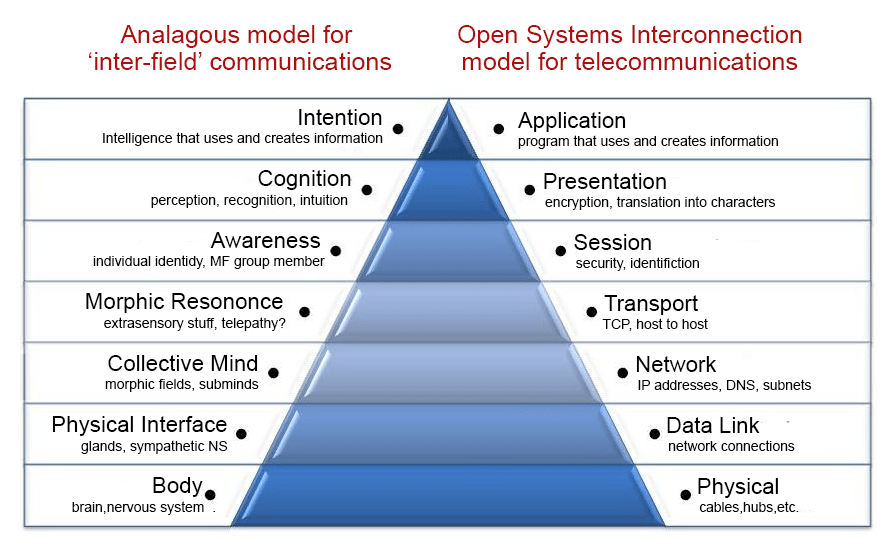

To be clear, we are not saying that this is how it works, nor are we saying this is *not* how it works.  We are suggesting that we might find new perspectives if we apply the models we have developed, which are based on natural laws, to things we do not yet understand.  In this case, for example, we see that the physical body and intelligence are at the opposite ends of the pyramid, implying that the brain/nervous system is more of a receiver/transmitter rather than a generator, as creating new information requires intention, cognition, and intelligence.  This is a radically different concept than the current mainstream and antiquated idea that the mind, consciousness, and intelligence *must* arise out of brain activity.  Other successful models that we currently use today could also be applied to things we do not yet understand, at least as a starting point of investigation.

Still, none of this addresses the specifics of where the information is stored or transmitted from.

## Collective Memory

The idea that a field intelligence is in some way an extension of the idea of the *collective mind* or *collective consciousness* was formalized to a great degree by Carl Jung’s idea of a collective subconscious and collective memory, although, it may be more accurate to describe the idea of a collective unconscious as a primitive understanding of * *.  This is still a very fertile area of research across many disciplines.[^136]

Sadly, no theories exist to explain where and how long-term collective memories are stored.  In the West, the idea of a collective memory has been around since the early 20^th^ century French sociologist Maurice Halbwachs coined the term.  His hypothesis on how collective memory was stored and transmitted is extremely unspecific but generally depends on human-to-human transmissions, similar to Dawkin’s theory on how memes are spread.  Given that Halbwachs was a student of Emile Durkheim and a devoted Marxist, one has to question his entire premise of a “collective,” especially in light of his claim that human memory can *only* function in a collective, and then goes on to give examples of his hypothesis of collective memory by comparing the “collective memory” of the bourgeoisie, religious and the working class, which may be valid, but is extremely myopic.  Still, he did coin the term, even if his premise was infected by a virulent and parasitic ideology (not unlike the Emerald Wasp).

Current thinking still revolves around cultural expression as being the primary way that collective memories are transmitted; dance, stories, monuments, etc.  These are certainly reinforcing factors, but this idea alone cannot explain Man’s collective memory of “the whole history of the human race”, as Jung claims is the source of our fear of fire, falling, and social status, to name just a few.  Some of these memories are epigenetic/genetic, such as being born with the fear of loud noises, which comes from the memory that loud noises are generally a harbinger of something that’s bound to make life more difficult, but can all our collective memories be stored in our DNA? Perhaps that is what the 75% of our junk DNA holds (recently upgraded from the previous 98% junk), or perhaps we don’t yet understand its function.  Maybe the junk DNA is more of an antenna than a transcoder? Apparently, we have no idea, but whatever it is, could it account for storing “the whole history of the human race”?  This seems very unreasonable.

It will be interesting and informative to see how Information Age will alter our collective consciousness, memory, and  tholonic archetype[^137], as its effect will be as profound as the the discovery of fire. 

## Engrams

Another candidate is how the brain creates and stores memories.  We have developed the concept of an *engram*, which is the means by which biochemical and biophysical processes store our response to external stimuli.  The engram, first described by German Zoologist Richard Serman in the early 1900s, was based on what he called the *mnemetic principle*, which states that the imprint made in the nervous system (including the brain) can, when stimulated by external stimulus, reconstruct the experience.  This is a very holographic idea, in that holograms reconstruct imagery by illuminating a previous record of that imagery.  The images below demonstrate how the “memory” of the image of a 3-dimensional cat can be stored on a 2D surface of holographic film, but looking at the film we would have no way of knowing that there is any information there, let alone the information that describes a 3D cat.

An important technical detail regarding holograms as it applies to memory is that many images can be recorded on top of each other, each with a different angle of illumination.  All those images can be reconstructed simply by changing the angle of the hologram when viewing.  This is why, and how, a holographic memory cube the size of a small closet (5m^2^) can store every word ever spoke or written by all humans.[^138]

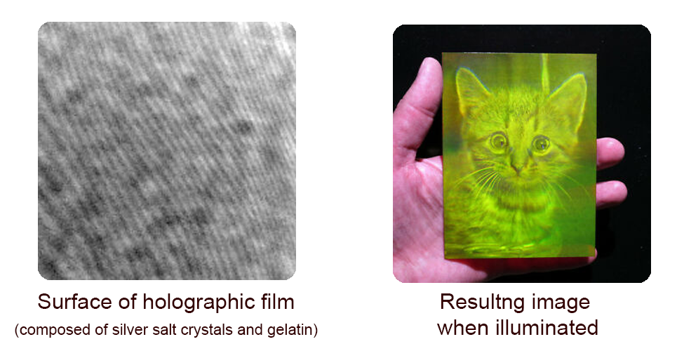

This imprint, or “mnemetic trace”, so named after the Greek muse of memory “Mneme,” is also a precursor to Dawkins “meme,” as the meme is a cultural version of an engram.

The 50 years of research following Serman’s hypothesis of the engram boils down to, for our purposes:

> (1) memories are not localized but are instead distributed within functional areas of the cortex and 
> (2) memory traces are not isolated cortical connections between inputs and outputs.[^139]

Might we see these same characteristics in our own collective memory technology otherwise known as the Internet? Perhaps.  Decentralized and distributed information networks, such as Bitcoin’s Blockchain, TOR (The Onion Router), and IPFS (Interplanetary File System) are probably early stages of such a thing.  The irony of the Internet is that when it was originally developed by DARPA, it was designed to be much more decentralized then it is today to the point where it could withstand a nuclear attack and continue operating, but today much of the decentralization has been removed as it is not in the best interests of government and business who prefer a more “consolidated” model (many totalitarian countries, and England, have actual Internet kill switches[^140]).

If we extrapolate these ideas when looking for how field memory works, we might want to start with the presumptions that *field memory* is decentralized and distributed within the medium of the field.  What and where is this medium? Anywhere there is energy, as the field *is* energy, although when referring to the context of instances as opposed to the pure archetypes, then the instances themselves would be a part of the medium as well.  Field memory is not stored as discrete quanta of information but rather an organized pattern of otherwise dis-integrated “particles” of information, which we refer to as data.  Were we to see this data alone it would appear as chaos.  When seen from a different perspective, or decoded, or “restimulated,” as in the case of engrams or holograms, or in a different context, it may appear as information.

## Modulation

Another model to look at might be the way we have learned to transmit information by modulating the amplitude or frequency of a wave, similar to how TVs, radios, and acoustic modems work.  If we accept the idea that all energy moves in cycles and waves, including the energy of ideas, then perhaps those waves are also modulated in some way with information.  As has been suggested earlier, there are waves we either don’t recognize or don’t consider as waves.  For example, is it possible that the “waves” from the “cycles” of the moon or the Arctic Tern could be “modulated” to carry information? It sounds crazy, but we know that brain waves encode information (possibly *rules of behavior*[^141]) as time codes[^142], that light can store quantum memories[^143], and that the same waves we use for communication are the same waves that have filled the entire universe since the Big Bang[^144].  Since the discovery of gravitational waves, we have been looking into how we can transmit information in that medium as well[^145].  Is it possible that these waves are modulated with information, making the waves both the carrier of information as well as the storage medium? Considering how little we know about the Universe, Reality, and Everything, these “crazy” ideas may not be *that* crazy.

Like my grandmother used to say “when you can’t find something, you need to look everywhere.”

## Dark Matter

One candidate is dark energy/dark matter.

Before I describe this idea, I want to make it very clear that I am not a cosmologist, physicist, or scientist of any kind, so this idea may be ridiculously naive and laughable to anyone who is knowledgeable on the subject.  That said, let’s give it a whirl.

Dark energy occupies 70% of the known universe, can’t be directly observed and emits no light or energy.  Dark matter occupies another 25%, and the measly remaining 5% is the matter we can see.  Dark matter can have dark electrons and dark protons and there is even dark chemistry (and maybe dark tholons, like the virtual ones?).  Dark energy also produces dark electromagnetism and dark electricity.  Dark matter does not interact with “regular” matter.  Perhaps it interacts with something else? In fact, there are (believed to be) dark galaxies, which is the galaxy of dark energy/matter superimposed on a galaxy of “regular” energy/matter.  In short, everything that exists has a “dark” clone that we can’t detect.  What better medium than dark energy is there that could collect information from every scale of reality? 

Dark matter/energy is not just some weird thing we kind of guess is there.  Evidence suggests it actually forms the structure of the entire universe, but all we really know about dark matter is it exists, it exists everywhere, and it interacts with gravity, one of the four fundamental forces of energy.  This then makes gravity the nominee for how the information is transmitted between dark energy and the “regular” energy of our reality.  Perhaps there is some entanglement involved with dark energy, allowing information to travel faster than the speed of light?  

Dark energy is quite elusive, as we can’t detect it or measure it, but we can see its effects in the expanding universe, as dark energy seems to be continually being created (like some sort of dynamic memory system that keeps expanding to accommodate the exponentially increasing storage requirements of an expanding universe?).  Perhaps there is a relationship between extrasensory phenomena and dark matter/energy in some way?

Has anyone tested this? I have scoured the Internet looking for such research and could find nothing.  However, I did run across this very interesting post from one of the senior members of Cambridge University’s Institute of Continuing Education who posted the following:

> Subject: Can quantum dark energy explain telepathy?
>
> Telepathy and quantum entanglement seem to match each other in that a communication connection exists, but no tangible connection.  Could there be a hitherto unknown dark energy particle produced by electrical impulses in the brain? Could it be that entangled particles of this dark energy are shared? If a plasmon circuit in the brain creates patterns of these dark matter particles, based on thoughts and ideas, do people with the shared particles since the same patterns of thoughts and ideas? How long-lived are these particles, how long do they maintain patterns, and what might be the mechanism for transfer? These particles may be exchanged through quantum molecular tunneling, allowing a brain to transmit them outside of the head, and a person with a corollary quantum molecular tunnel for reception to readily receive the particles.  Persons sharing close and personal spaces may be more likely to transfer these particles to each other such as twins, relatives, friends, and even enemies.  It may be that these particles are long-lasting and this may allow objects to be imbued with the dark particle patterns, allowing a sensitive to read a person through the object.  It may be that wherever a transmitter goes the location they were at is imbued with thought patterns of their experiences.  The implications of such a mechanism for telepathy imply this process may be amplified by electronics to increase the strength of transmission and reception.  It also implies that we could control electronics through the use of telepathy.[^146]

There were no replies.

OK, I know this is all a bit of a stretch, but it’s not outside the realm of curiosity.

## Gravity

Roger Penrose also suggests that quantum gravity and how it relates to *quantum state reduction*, or the collapsing of a waveform, i.e. the instantiation of a tholon, is the source of consciousness[^147].  If the tholonic idea that awareness is the source of existence, then this suggests that consciousness is not only the byproduct of awareness, which makes perfect sense, but it is also a integral part of the instantiation of tholonic patterns as consciousness serves as the expression of awareness necessary to complete the instantiation process.

Geometrically speaking, while the infinitely expanding self-similar trigram is a result of the primary three states created by awareness, as previously shown, for it to instantiate into a 3D tholon it requires the 4^th^ composite *white dot* to collapse into the tetrahedral thologram. Consciousness, ss an instance of awareness, and as such is composed of all three primary dots, e.g. subjective awareness, objective awareness, and the awareness of where they meet, or if you prefer, the awareness of *all*, *all that that is possible*, and *all that is*.  In the subatomic context, it instantiates as quantum gravity, which is the force that collapses the wave functions.  This suggests that consciousness and gravity are two instances of the same pattern or tholon within two different contexts.  

This would also suggest that in the world of subatomic particles where we have the basic trinity of electrons, protons, and neutrons, we would also expect to find a 4^th^ particle that represents gravity, a *graviton*, and in fact, science has speculated that such a particle exists, they just haven’t found it yet.  

All of this is simply to suggest that if gravity is fundamental to consciousness and existence, then so too are there fields.  But gravity itself is a field.  And what is the source of that field?  Mass.  And what is the source of mass? awareness, because the very first instantiation of awareness is the simplest form of existence, the tetrahedron.

The image below might make the relationship between gravity and consciousness clearer, at least from the tholonic perspective, and also shows how awareness/consciousness is the bridge between tholons and existence.

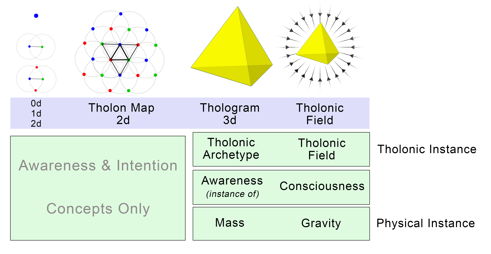

Considering gravity (and awareness) is both mass-less and infinite yet binds the entire universe together, it seems like an excellent candidate for exploring field memory.

Is there any evidence to suggest that gravity and consciousness are two instances of the same expressions in different scopes? Yes, there is.

Let’s  look at another one of Newton’s formulas that describes the gravitational force:  , where *F* is the gravitational force, *g* is the gravitational field as it applies to two different masses, and *S* is the separation between those two masses.  And yes, it also looks just like the Ohm’s Law for *resistance* , which also suggests that consciousness, gravity, and resistance are the same archetype instantiated across three different scopes. If so, then we can say the following:

- ***Gravitational force* (*F*) is equivalent to *Resistance* (*R*)**. This seems intuitively reasonable, given that much of the (albeit a different type of) resistance we experience in life is directly related to gravity.

- ***Gravitational field* (*g*) is equivalent to *Power* (*P*)** because *g* is actually defined as  G&times;M~1~&times;M~2~, where G is the universal gravitational constant, M~1~ is the mass of the observing physical system (the *observer*), and M~2~ is mass of the observed physical system (the *observed*).  This tells us that *g* is the result of the force between the *observer* and the *observed*, and wherever there are two forces interacting, there is a *transfer of energy over time*, although, considering that gravity is a function of time, we should probably say it represents a  *transfer of energy **within** time*.

  *Note: We are not using the terms “observer” and “observed” simply because they happen to fit so perfectly into the tholonic model of subjective/objective duality&hellip; these are the actual terms used by scientists when describing gravity as a conscious force.*

- 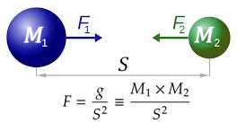***Separation* (*S*) is equivalent to *amperage* (*I*).**  *S* is the distance between the two masses.  This seems odd as we would expect the distance between two masses to be more like the difference in potential between two charges, which is *volts*, but given that current is a measure of the *flow of energy between two points*, it would make sense that distance, or space, would represent that flow while the difference between the *force* of the two masses would represent the actual field of potential, or *volts*.    

- ***gvolts (h) is equivalent to volts:*** With the above 3 values we are left with the correlation of the gravitational equivalent to *volts*. We are calling them *gvolts*, for lack of a better term.  This is determined by , or 

We can confirm these correlations by plugging in actual values for gravity calculations into all 12 formulas of Newton’s 2^nd^, and in every case the values are correct.  In our case, we calculated the force of gravitational attraction between the earth and a 70-kg person standing at sea level, which is 686 newtons (in case anyone wants to test it themselves): 

There is another correlation as well.  The limits of an electrical circuit are defined by the amount of charge, or current, that is allowed to pass through a system at any given moment.  This is controlled by a fuse.  In the *E=mc^2^* equivalency we saw previously, it is *c*, the speed of light, that defines the limits of the system we call the Universe, but unlike Amps, *c* can never change.  Here, in the gravity example, the defining limitation of the system is *S*, the distance between two fields, which is also the same *PP* as *c* (speed of light) and *I* (amperage).  

Why is this important? Because, if there is a correlation between gravity and consciousness, and we know the patterns of gravity, then what will happen if we apply them to consciousness?

For example:

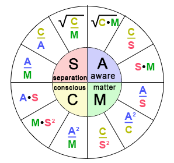**Separation (S)**: The separation in the context of consciousness is the first separation, that of subjective (observer) and objective (observed), so we will correlate the separation of the 2 masses with these two perspectives.

**Awareness (A)**:  The initial blue dot, the N-source, of the tholonic trigram is the first instance of awareness, and also correlates to *potential*, or volts, so we will correlate our *gvolts* to the N-source and the first state of awareness.

**Consciousness (C)**: As we mentioned before, what we are calling consciousness is an instance of awareness, more specifically, an instance of the awareness of a tholonic archetype.  This firmly places consciousness in the position of the child N-source, which correlates with electrical *power* (P) and the gravitational field (*g*).

**Matter (M)**: We are left to correlate electrical resistance with the force of the gravitational field.  This fits, especially when we realize that it is that force which holds us on the planet, and the planets in their place.  It is not immediately clear what this would correlate to in the context of consciousness, but I suggest it is *matter* itself, for from a tholonic perspective, matter is simply the instantiation of awareness.

These correlations would look like the image above.

What this means is that if we think there is such a thing as a data-store of the collective (un)conscious, then we will find clues to its existence in our own consciousness, in other’s consciousness, in the difference between these two, matter itself, and unity of awareness.

This attempt to quantify consciousness and awareness may seem ridiculous to some, but more and more evidence suggests that consciousness if a force of nature, and as such, has quantifiable properties.

An example of directly applicable evidence comes from an article written by theoretical physicist Swati Nigam entitled *Gravity As Conscious Force To Resolve Quantum Gravity*[^148], wherein she states:

> According to current science, there is a missing connection between general relativity and quantum mechanics concepts of physics, which is needed to unify them into one, to conceptualize a unified field theory.

The article then goes on about the nature of the problem, ultimately concluding that consciousness itself is an additional force to the four forces of the Standard Model, a fifth force, and one that solves the challenges of the unified field theory in its attempt to unify general relativity with quantum mechanics.

> Thus, we can use the term “conscious force” for gravitational force&hellip;.  *Conscious force* is gravitational force which is the unidentified fifth force.  This force is a synonym for gravitational force, works just like it on all matter entities, irrespective of their nature or position in space, both in macro or micro worlds.

If consciousness is a fundamental force, then it has a field, and that field might hold clues to *field memory*, perhaps similar to the way the memory in the brain might be a *neuronal activity-associated magnetic field* [^149]^,^ [^150]? In any case, there seems to be a strong correlation between consciousness, gravity, and dark matter.

## Limits of Consciousness?

This idea that there might be a relationship between consciousness and gravity raises another question, and that is, if observation is required to collapse a wave function, then can we define consciousness as that which has the ability to observe?

First, let’s hear what Werner Heisenberg has to say about what *observation* means 

> Of course the introduction of the observer must not be misunderstood to imply that some kind of subjective features are to be brought into the description of nature.  The observer has, rather, only the function of registering decisions, i.e., processes in space and time, and *it does not matter whether the observer is an apparatus or a human being*; but the registration, i.e., the transition from the “possible” to the “actual”, is absolutely necessary here and cannot be omitted from the interpretation of quantum theory.  **\~Werner Heisenberg, *Physics and Philosophy*, p.  137**

And by “registering decisions” he means any sort of recording of effect that is the result of interacting with the cause, as long as that recording is a time-irreversible process.  It is this recording that separates *all that is possible* from *all that is*, or the *Definition* from the *Contribution*. This would imply that if one atom was altered as a result of  interacting with the wave function, it will collapse into a particle, so even a rock could be an “observer”.  It turns out that the act of observation is more analog than digital, meaning, the more something is observed, the more effect is has.  In a recent experiment[^151] it was shown that:

> …the greater the amount of “watching”, the greater the observer’s influence on what actually takes place.

So, a rock might be able to “observe”, but perhaps its observation would be too weak have much of an effect on reality.  The experimenters built a machine with variable observation strength levels, but it would be very interesting to measure the observational strength levels of different forms of instances.  Are there stronger *observational powers* then what we humans have? This is unknown (I think), but when is known is that machines alone have enough observational power to collapse a wave[^155].

With this in mind, it might be useful to think of awareness as a wave function, a sea of “possibilities”, but consciousness as the “actual” instance of a collapsing wave of awareness.  This would support the idea that everything that exists potentially has a consciousness, but weak “observations” will produce weak wave function collapses, a weak instantiation of consciousness.

## Structured Memory

Another possibility is structure itself.  It has been claimed that the structure of water can hold memory.  Although this claim has not been sufficiently tested by any means, there is at least some evidence to suggest it might be valid.  Dr.  Emoto has been the most public in his claims that water holds memory, and presents many examples and theories, but none of his work has been thoroughly tested by scientific standards.  There is quite a lot of information available about Emoto’s work so I will not repeat any of it here.  However, Dr. Dean Radin, who has an impressive list of honors and a history of serious scientific work, did perform a “*Double-Blind Test of the Effects of Distant Intention on Water Crystal Formation*”[^307] and reported very significant results (P=0.001).  Dr. Radin has published a number of similar studies. 

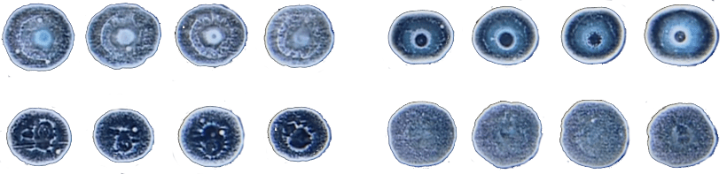

Speaking only for myself, one of the more compelling pieces of evidence I have seen comes from the experiment where four students created four drops of water, all from the same source.  The image above shows the results of that experiment where each row of drops was created by a different student.  

This experiment was performed by Dr. Brend Kröplin and his team, which makes the results all the more valid, as Dr. Kröplin not only received his PhD in the hard sciences (his thesis was on the elastoplastic stability of steel bridges), but he was also dean of the *Institute for Statics and Dynamics of Aerospace Structures* of the University of Stuttgart as well as the winner of the Körber European Science Prize, which resulted in a 1.5 million deutschmark contract to produce high altitude (20km) communication equipment.  This puts him very high on the “trusted sources” list.

Even if this is not bulletproof evidence (similar to the existence of Australia for anyone who has never been there), it is enough to raise the question.  In addition, this test was also conducted using different types of flowers, and, according to the testers, the resulting patterns in the drops of water resembled the patterns of the flower.  Tholonically, this is exactly what we would expect to see, as it is patterns of energy that create the instance of the flower.

Another source that supports the idea of water holding information is Jacques Benveniste, a French immunologist who worked at the Institute of Health and Medical Research (INSERM) in 1988, who published a paper in *Nature* concluding that the configuration of molecules in water was biologically active even in the absence of the elements that caused that configuration.  This “water memory” was immediately picked up by the homeopathic community as proof of its efficacy, even though it did not really apply to homeopathy.

While Emoto’s work can easily be brushed off by skeptics and institutional authorities due to its lack of rigorous analysis, Benveniste’s work could not.

*Nature* magazine editor, Jim Maddox (yes, the same person who promoted the burning of Sheldrake’s book on the grounds of heresy, as well as claiming the Big Bang theory is “philosophically unacceptable” and that there was “no need to panic about AIDS”), prefaced the *Nature* article with an editorial comment entitled “When to believe the unbelievable”, which admitted: “There is no objective explanation of these observations”. That sounds like a begrudging admission, but it was more like a temporary retreat in preparation for the next offensive.

*Nature* did not want to publish the paper to begin with, holding its release for two years while awaiting independent confirmation from impartial laboratories in Israel, Italy, and Canada, who reported an observable biological effect.[^152]

After the paper was published there was an explosion of meltdowns from the scientific community.  In response, *Nature* demanded that the experiment be repeated under conditions controlled by an ad-hoc selected team of its own, which included (and this should shed some light on their not-so-hidden intentions) the famous illusionist, pseudo-science enemy, and occasionally dishonest, James Randi, plus Maddox himself and a malpractice investigator.

The *Nature* team did, in fact, find the same results as Benveniste, but with one fascinating exception: the effects of the tests disappeared when the members of the laboratory did not know if the water sample had been treated or not.  One could claim the results were then biased based on this knowledge, but this would presume these hand-picked researchers were secretly fudging the data.  If they were not, then the implication is that simply the awareness of the state of the water samples was enough to affect them.  According to the tholonic model, being aware of something is sufficient to instantiate it to *some* degree, like a tholonic version of *observational powers*.  In any case, this was sufficient for *Nature* to publish a report on this methodological flaw in Benveniste’s experiments and officially called “water memory” pseudo-science[^153] and published an article calling the entire idea “delusional” (written by, of course, Maddox, Randi, and Stewart, another lover of dogma)[^154].  Case closed.

Or so they hoped, for not long after Benveniste’s paper, The United Nations Educational, Scientific and Cultural Organization (UNESCO) decided to take their own look into his work.  In their words:

> These data seem particularly important because they further enrich the immense achievements of molecular biology.  They also suggest the development of new modes of transmission of genetic messages (transmission, transduction, teleportation, etc.).

Fortunately, they did not invite Maddox or Randi to be a speaker.  Rather, they invited the Nobel Prize-winning discoverer of HIV, Luc Montagnier, who, much to the skeptic’s dismay, stunned many fellow scientists years earlier with claims that DNA emits weak electromagnetic waves that cause structural changes in water that persist even in extremely high dilutions&hellip; which is not exactly water-memory, but very close.  Montagnier has gone on to say that “More scientists are becoming convinced [of water-memory] by the data” as new evidence appears.

OK, that was a long-winded bit of history there, but it shows the resistance to new ideas as well as the real possibility that water-memory exists.

But I am not a scientist, so I don’t have to worry about what the editors at *Nature* or what dubious debunkers think, so I can hypothesize the following: If the structure of water can hold memory, does this mean that the structure of other things can also hold memory? Can the thologram itself hold memory in its mega-meta-structure? If we claim that the structure of our material world is but an instance of that structure in the thologram, then we would have to say “yes”, and that then opens the door to the ideas that all structure, in every corner of the universe, might be a memory store.  Perhaps certain structures are better suited to hold certain types of memory? More exciting is the possibility that the mechanism to access this memory, and the knowledge, is to simply become aware of it.  This last part is trickier than it sounds, as we don’t know what we don’t know, so how do we know what to become aware of?

Regardless of the theory, whatever it happens to be, the morphic or tholonic field would have to be something like an electromagnetic field in a different context, as both are caused by the movement of energy.

#### **Claim 57:** Everything that exists due to the movement of energy has a field that has its origins in awareness and intention.  This field is the foundation of consciousness and knowledge.

The redundant and self-similar expressions of energy can be seen in the ever more complex and integrated patterns that have evolved since all of creation began as an infinitesimally small singularity of infinite gravity (and therefore infinite awareness, given the relationship between gravity, time and awareness?), zero time, and total mass that was the seed of this Universe.

By the same token, the redundant and self-similar expressions of awareness can be seen in the ever more complex and integrated patterns that have evolved since all of creation began as a 0-dimensional dot whose only property was awareness and intention. 

The claim that energy itself is a fundamental form of awareness and intention implies that everything that exists is also a form of awareness and intention in the same way that everything that exists is a form of energy.  To be aware of something is to direct energy to some concept or idea, thereby moving energy through that pattern and the Bell curve of that archetype, which alters the *norm* of what and how that archetype will instantiate itself.

From the tholonic perspective, if the claim is “energy alone can’t be observed; only its interactions with other forms of energy (mass) can” is true, then it is also true that “awareness alone can’t be observed; only its interactions with other forms of awareness can”. 

> “Consciousness [ed: or awareness from the tholonic perspective] is part of our universe, so any physical theory which makes no proper place for it falls fundamentally short of providing a genuine description of the world.”[^156]  **\~Roger Penrose.  “The most important physicist to work in relativity theory except for Einstein”.**

Tholonic fields exist in the realm of thought, ideas, and concepts, so any experiments that might be run probably need to be thought-based in nature.  Is there any evidence that thoughts can directly alter our material reality? If the answer is yes, that might support the idea that altering archetypes in the realm of ideas has a measurable effect on the instance of those archetypes, i.e.  reality as we know it.  Chapter 10, “Relevant Examples”, looks at some of these experiments.

## Reality

What about the possibility that reality itself, the world around us, matter, everything we consider to be real, *is* the memory?

This idea is based on the idea of Quantum Darwinism[^157] that states that of all the probable states that can exist, the ones that survive do so because of support from their environment.  In turn, these states that survive transfer information to the environment, altering its context, shifting the curve in its favor, and thereby improving the probabilities of future similar states.

As the energy interacts with the environment around it, the range of probabilities for the many attributes of an energy particle begins to decohere, or disappear, leaving only the attributes that are most compatible with the environment, which then interacts with the environment to make the environment more compatible with the attributes.  Notice the compatibility of Quantum Darwinism with the descriptions of the social equations in the chapter “The Meaning of Math”?

Reality, as we know it, is the consequence of this processes of *decohering* the less successful possibilities of a particle’s superposition.  In the end, one set of attributes dominates, and that is what we see in the reality that surrounds us.  In other words, reality itself is the living record of what worked and works.

Applied to the tholonic model, each tholon has a set of stable properties, and given its self-similar structure, each tholon only needs to manage the properties that relate to its scope or that exist within its spectrum, leaving the parent properties to the parents, and any of the child properties to the child.  Each tholon then “knows” what works and expresses this in the instances of that tholon, which is every archetypal idea and form that has the possibility to exist.  When we look at a thing, like a rock, we are not just seeing the Darwinian results of the tholon of a rock, but also the aggregated results of all related tholons; mountain, planet, solar system, galaxy, silica, molecules, atoms, electrons, etc.

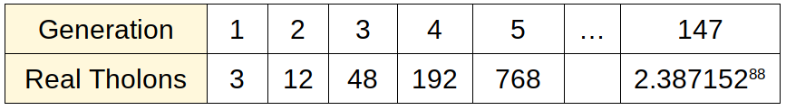

The language of reality begins with one “letter” (a tholon) of the alphabet, which becomes three in the next generations, which becomes 12, etc.  Each of these letters is a record of what “works.” 

Remember that phrase *combinatorial inflation* which describes the exponentially increasing number of possibilities in protein production? This is the big problem with current evolutionary thought, as there are simply too many combinations for nature to try.

In the tholonic model, these massively inflated possibilities are much simpler to navigate.  We start with a duality within which a stable pattern emerges.  From that stable pattern, a new duality emerges, which produces another stable pattern.  For each generation, we have three new possible tholons from which patterns can emerge.  Only stable patterns are capable of creating dualities, so unsustainable patterns never propagate.  After a mere 129 generations of this process we have produced 10^77^ possible tholonic paths or combinations, but at each generation we only needed to create one pair of parameters (we used 10^77^ as that was the possible number of protein combinations with just twenty amino acids and 150 proteins&hellip; a very, very small number when compared to the actual proteins that make up life).

It is clear that the odds are incredibly stacked against a new form of a viable protein to appear because the assumption is the entire field of 10^77^ is available.  Tholonically, the entire field available is limited to a mere three properties, but these properties are self-similarly embedded 129 times.  If a new pattern emerged somewhere around the 63^rd^ generation (10^37^ combinations), then an entire new branch of creation will emerge at a point in the tree where it will have a significant presence at the 129^th^ generation.  This would explain the Cambrian Explosion when 541 million years ago a major new class of life appeared that was the origin of all modern marine life.  It also destroys the Darwinian model of long-term evolution.  Ironically, Darwin himself, in his *Origin of Species*, said this nasty detail was the main argument against his “Theory of Descent”.

Here’s a simple mathematical example.

First, let’s look at the Bell curve again.  Let’s say you do 32-coin flips 50,000 times and plot the results.

The peak of the Bell curve is going to tell us what the most likely result will be, which is, that we will get heads 16 out of 32 flips, on average.  But we have decided we are going to run this test five times, but each subsequent time we are only going to use the coins that came up heads in the previous test.  If we do this same process five times, we end up with the following:

- Test 1 with 32 coins, 16 came up heads
- Test 2 with 16 coins, 8 came up heads
- Test 3 with 8 coins, 4 came up heads
- Test 4 with 4 coins, 2 came up heads
- Test 5 with 2 coins, 1 came up heads

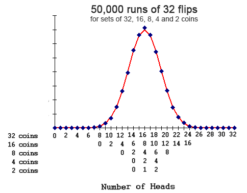

If we plotted the results, we would end up with a Bell curve that looked something like this “Number of Heads” graph.

So, when we run these five tests 50,000 times each, the chances of us ending up with 1 coin from 32 coins is obviously 100%.

Now imagine we use different coins for each test;

- Test 1, 32 quarters
- Test 2, 16 nickels
- Test 3, 8 dimes
- Test 4, 4 half-dollars
- Test 5, 2 pennies.

We start out with 62 coins  (32 quarters, 16 nickels, 8 dimes, 4 half-dollars, and 2 pennies) but end up with 31 coins (16 quarters, 8 nickels, 4 dimes, 2 half-dollars, and 1 penny).

If all someone knew was the final result of one penny, but that you started out with 62 coins, they would say there is a 2:62, or 3.2%, chance of you ending up with a penny, when, in fact, you know there is a 100% chance of you ending up with a penny.

The process the person who calculated the 3.2% chance based on his observations has a 96.8% margin of error, while you have a 0% margin of error.  The observer, in an attempt to replicate your success, but not knowing your process, will begin to run tests and keep notes as to what worked and what didn’t work.  He checks these notes every time he runs a new test to make sure he is not doing something that has been shown to fail.  Once he discovers your process, he can archive the failed notes and simply describe the process that works.  He does not need to record all the failures once he has discovered the process that works, but he does so as to pass them on to the next generation of researchers who will approach similar problems in the same bottom-up fashion.

Existence does not need to record its failures as it is the ultimate top-down approach, from the tholonic perspective.  From the very first instance of creation, nothing progressed unless the previous process worked, i.e.  new child tholons created from the stable patterns of the parent tholon.  No reverse engineering is necessary for existence as it is an exclusively forward-engineering process.  If a branch of existence fails it will only fail up to the last successful parent.  This is like saying that if all your nickels were swapped out for double-tailed nickels, then all flips after the nickels would come up as zero, killing the entire branch below nickels and preventing any opportunity for the dimes, half-dollars and pennies.  The quarters are still fine, and because you want the tests to continue to work properly, you would need to get new nickels in order to fix the problem.

In our example here, the flipping is analogous to the energy within a tholon creating stable patterns and the experimenter is analogous to the tholonic intelligence, which includes the intelligence that “fixes” the problem when he received feedback from the broken branch (i.e. bad nickels) that modified the curve (skewed results) which resulted in a new stable pattern (good nickels).  (I know this example sounds ridiculously trivial, but it’s the simplest example I could think of.)

From the tholons view, the experimenter and the experiment are a an integral part of the tholonic expression, so the analogy is not only an analogy, but also an instance of the tholonic process.

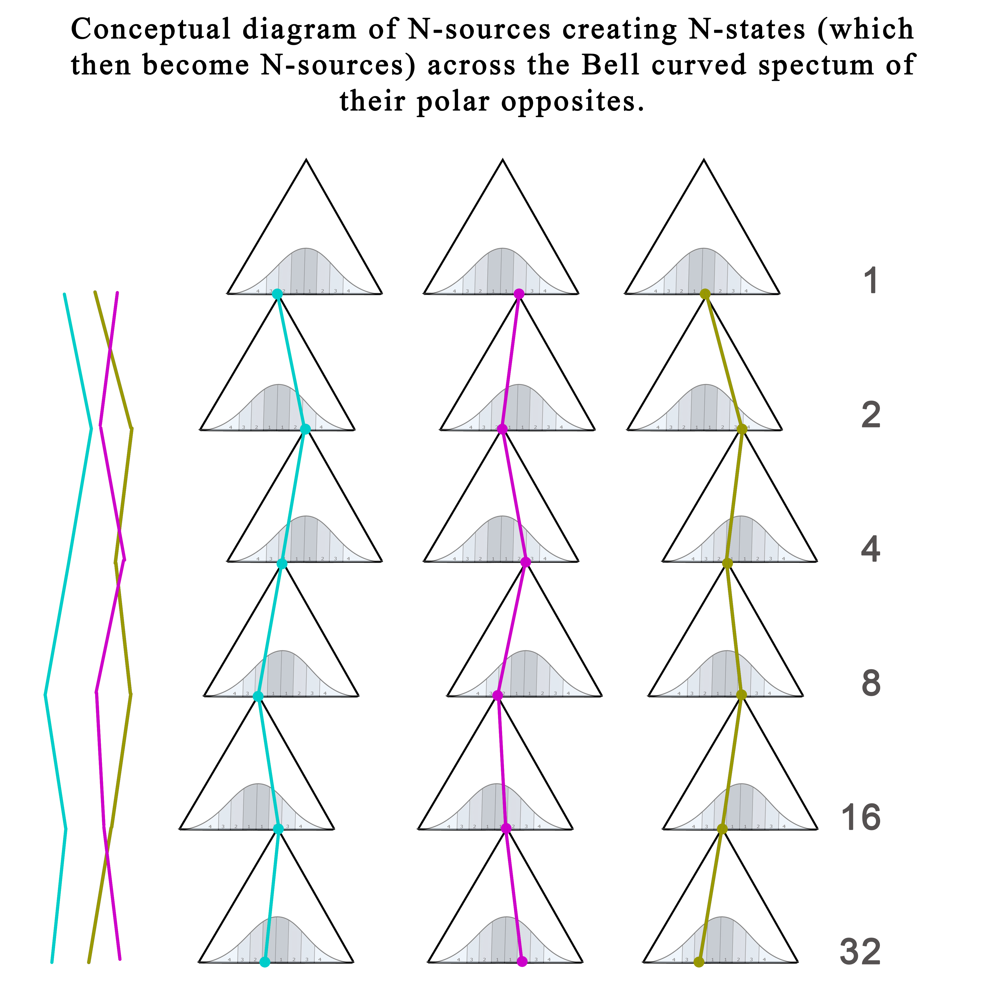

A simple example more aligned to the tholonic model would be how N-states emerge along the Bell curves from which N-sources create new trigrams.  By assigning a value for points on the spectrum, and a binary value representing the generation of the trigram, we can create a unique value for every point that identifies its place on the spectrum and its level.  If we combine each of these numbers, we can create one value for the entire lineage that has an extractable record of the chain of tholons and their spectrum’s value at every level.  This one number would then act as a memory of all the ancestors.  We can see this easily in simple binary math.  If we have five generations of numbers that double with each generation, such as 1,2,4,8,16, and we have the number 22 representing the sum of all the contributing generations, we can easily determine that only the 2^nd^, 3^rd^ and 5^th^ generations contributed, because only 2, 4, and 16 can create 22.  The tholons are similar in that each tholon has a fingerprint that is encoded in every one of its descendants.

What this means is that everything that exists is *already* a record of what works from the first moment of creation, through every generation, up to and including the thing that exists.  Life, Reality, and Everything *is* the warehouse of all knowledge.  We just haven’t yet figured out how to decode (most of) it.  Appendix G, “The Thologram and the I-Ching”, specifically addresses this and shows exactly how each tholon has a naturally existing binary signature.  It may actually be the case that the thing itself ***is*** the value.  We think of numbers as digits, but in some unfathomably complex and multidimensional reality, perhaps the cumulative value of that plant is expressed not as numbers, but as the plant itself, which we can only perceive as a simple plant over time in our 3D world.

This is similar in concept to the way a piece of music is the combination of many *atoms* of sound (yes, that’s a real thing, and it’s about 0.093 seconds[^158]), each an aggregate of many individual frequencies.  Over time, these frequencies change (unless the sound never changes). Within the information of those sounds can be more information.

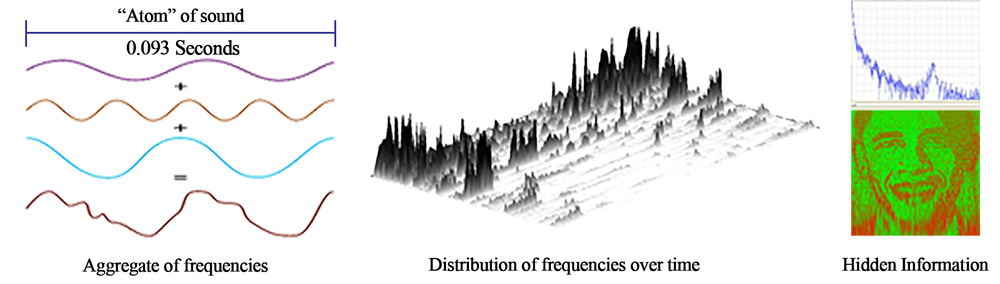

The resulting waveform contains only and every frequency that was required for it to exist. Once we learned how to read that waveform using such concepts as the Fourier Transform, we were able to discover all of its components. In the image above, “Hidden Information” is an example of an image made by the *history* of the sound and tells us much more than just the entire history of that sound and all of its ingredients.  (for more examples, see Appendix E, “*Hidden Images*”)

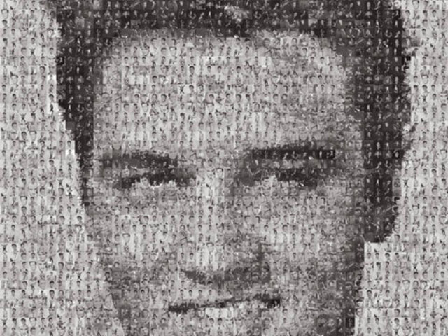Another example of this that demonstrates some very tholonic concepts is a photo-mosaic, which is an image that is made up of other images, such as this image of Elvis that is made up of many images of Elvis.  Now, imagine an image made up of many images which are made up of many images, and so on, but instead of the patterns being that of an image, imagine the patterns as that of energy and awareness, with each image having its own intelligence and intention.  While almost any collection of images can be used to create any other type of image, this is far less so the case when we are speaking of tholons, which are effectively living expressions of energy, intention, intelligence, and awareness.  There are many more dimensions and constraints, such as the law of entropy, so some tholons will be more likely to form other tholons depending on the “benefits”,  such as conserving energy or enhancing adaptation, to both the defining and contributing tholons.

Just for fun, here is the human eye made only from images used in this book, and a bull skull in Death Valley made with blooming flowers.

In these cases where the resulting pattern is less of a balance between two poles and more of a collection of patterns to form a new pattern,  it would probably be more accurate to show Bell curves as Gaussian curves that show the distribution of Brownian movement.  Below are three examples of Brownian movement and a typical distribution curve of the values that define that movement.  This is the movement of such things as the stock market, the path traveled by an amoeba, the motion of pollen grains on still water, diffusion of calcium through bones, movement of “holes” of electrical charge in semiconductors, and, as we’ll soon hypothesize, the paths of predeterminism.

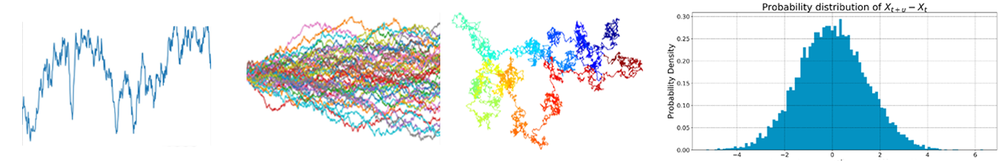

Consider these ideas in light of the relatively recent discoveries that experiences and memories can be passed on *epigenetically* to descendants.  In one of the classic test cases, the descendants of mice that were trained to not like the smell of cherry blossoms also had an aversion to the scent of cherry blossoms.[^159] Epigenetics describes how DNA can be modified by non-genetic stimuli, like fear, love, environmental preferences, even dreams, and it shows how what we inherit may go far beyond the human genome.  Tholonically, the human genome is an instance of the human tholon, but the epigenetics that affects this instance are more like the influences on the scope of that tholon, or rather, where along that scope a stable pattern will emerge.

[^89]: **“The anthropic universe”**. Science Show. 18 February 2006.
[^90]: Folger, Tim. **“Eminent Physicist John Wheeler Says He Has Only Enough Time Left to Work on One Idea: That Human Consciousness Shapes Not Only the Present but the Past as Well.”** Discover Magazine, June 1, 2002. <http://discovermagazine.com/2002/jun/featuniverse#.UvxOUrTVdnA>.
[^91]: <https://en.wikipedia.org/wiki/Quantum_eraser_experimentreincar>
[^92]: **“Consciousness in the Universe: A Review of the “Orch OR” Theory.”** Physics of Life Reviews. Elsevier, August 20, 2013. <https://www.sciencedirect.com/science/article/pii/S1571064513001188?via=ihub>.
[^93]: Media, T. E. (2015, June 02). Rupert Sheldrake, **Heretic**. <https://www.youtube.com/watch?v=ZSd4DA5xhHw>
[^94]: Hubisz, John L. “**The Pleasure of Finding Things Out: The Best Short Works of Richard P. Feynman, by Carl Feynman and Michelle Feynman.**” The Physics Teacher, vol. 38, no. 2, 2000, pp. 111. doi:10.1119/1.1558111.
[^95]: Sheldrake, Rupert. **A New Science of Life: The Hypothesis of Formative Causation**. Los Angeles: J.P. Tarcher, 1981.
[^96]: Horgan, J. (2014, July 14).**Scientific Heretic Rupert Sheldrake on Morphic Fields, Psychic Dogs and Other Mysteries.** <https://blogs.scientificamerican.com/cross-check/scientific-heretic-rupert-sheldrake-on-morphic-fields-psychic-dogs-and-other-mysteries>
[^97]: Sheldrake, R. (n.d.).**Morphic Resonance and Morphic Fields - an Introduction**. <https://www.sheldrake.org/research/morphic-resonance/introduction>
[^98]: Sheldrake, R. (2013). **Dogs That Know When Their Owners Are Coming Home: And Other Unexplained Powers of Animals**. London: Cornerstone Digital.
[^99]: One of these experiments can be seen here: <http://www.sheldrake.org/videos/jaytee-a-dog-who-knew-when-his-owner-was-coming-home-the-orf-experiment>
[^100]: Iozzio, Corinne. “**Scientists Prove That Telepathic Communication Is Within Reach.**” Smithsonian.com, Smithsonian Institution, 2 Oct. 2014, <https://www.smithsonianmag.com/innovation/scientists-prove-that-telepathic-communication-is-within-reach-180952868>
[^101]: Wilkins, & Sherman, H. M. (1971). ***Thoughts through space***. London: Muller.
[^102]: Sheldrake, R. (2013). **Science set free: 10 paths to new discovery.** New York: Deepak Chopra Books.
[^103]: Smolin, L. (2012, May 16). **Precedence and freedom in quantum physics**. <https://arxiv.org/abs/1205.3707>
[^104]: Lobach, E.; Bierman, D. (2004). “**The Invisible Gaze: Three Attempts to Replicate Sheldrake’s Staring Effects**” . <https://www.parapsych.org/papers/07.pdf>
[^105]: <https://www.scientificamerican.com/article/what-causes-spooky-out-of-body-experiences>
[^106]: <https://www.iacworld.org/evidence-for-out-of-body-experience-as-a-real-or-veridical-phenomenon>
[^107]: The full account of his research and notes are reprinted at <http://www.aura-oasis.be/website/scientific-research-on-out-of-the-body-experiences>
[^108]: Tshitoyan, Vahe, et al. “Unsupervised Word Embeddings Capture Latent Knowledge from Materials Science Literature.” *Nature*, vol. 571, no. 7763, 2019, pp. 95–98., doi:10.1038/s41586-019-1335-8.
[^109]: Tressoldi, P. E., Storm, L., & Radin, D. (2010). **Extrasensory Perception and Quantum Models of Cognition, Neuro Quantology,** 8(4). doi:10.14704/nq.2010.8.4.353
[^110]: King, T. (2017, May 30). **Scientific Evidence of Telepathy - Documentary.** Retrieved from <https://www.youtube.com/watch?v=zZ4G3IRVFwU>
[^111]: **Astronaut Tells of E. S. P. Tests.** (1971, June 22). Retrieved from <https://www.nytimes.com/1971/06/22/archives/astronaut-tells-of-e-s-p-tests.html>
[^112]: **100 Scientific Papers Offering Evidence for Psi Phenomena & Effects**. (2019, April 22). <https://subtle.energy/list-100-peer-reviewed-papers-offer-scientific-evidence-psi-phenomena>
[^113]: Luke, D. (2009, September). **Telepathine (ayahuasca) and psychic ability: Field research in South America**. <http://www.researchgate.net/publication/278301470>, British Psychological Society, Transpersonal Psychology Section 13th Annual Conference
[^114]: Cave, K. (2015, February 24). **The rise of “Telepathic Tech” in 2015**. Retrieved from <https://www.idgconnect.com/idgconnect/analysis-review/1023702/rise-telepathic-tech-2015>
[^115]: Grau, C., Ginhoux, R., Riera, A., Nguyen, T. L., Chauvat, H., Berg, M., &hellip; Ruffini, G. (n.d.). **Conscious Brain-to-Brain Communication in Humans Using Non-Invasive Technologies**. <https://journals.plos.org/plosone/article?id=10.1371/journal.pone.0105225>
[^116]: Heaven, D. (n.d.). **First mind-reading implant gives rats telepathic power**. Retrieved from <https://www.newscientist.com/article/dn23221-first-mind-reading-implant-gives-rats-telepathic-power>
[^117]: Tucker, P. (2018, September 06). **it’s Now Possible to Telepathically Communicate with a Drone Swarm.** Retrieved from <https://www.defenseone.com/technology/2018/09/its-now-possible-telepathically-communicate-drone-swarm/151068>
[^118]: Kosoff, M., & Kosoff, M. (2017, April 21). **Elon Musk Is Seriously Starting a “Telepathy” Company.** Retrieved from <https://www.vanityfair.com/news/2017/04/elon-musk-is-seriously-starting-a-telepathy-company>
[^119]: Heath, A. (2017, January 11). **Facebook has a mysterious team working on tech that sounds a lot like mind reading**. Retrieved from <https://www.businessinsider.com/facebooks-building-8-working-on-brain-computer-communication-platform-2017-1>
[^120]: Watanabe-Crockett, L. (n.d.). **Telepathic Message Sent Over Internet**. Retrieved from <https://www.wabisabilearning.com/blog/telepathic-message-sent-over-internet>
[^121]: ArXiv, E. T. (2018, October 01). **The first “social network” of brains lets three people transmit thoughts to each other’s heads.** Retrieved from <https://www.technologyreview.com/s/612212/the-first-social-network-of-brains-lets-three-people-transmit-thoughts-to-each-others-heads>
[^122]: King, T. (2017, May 30). **Scientific Evidence of Telepathy - Documentary**. <https://www.youtube.com/watch?v=zZ4G3IRVFwU>
[^123]: MetaRising. (2016, November 10). **Banned TED Talk about Psychic Abilities** \| Russell Targ \| suespeaks.org. <https://www.youtube.com/watch?v=hBl0cwyn5GY>
[^124]: Zhou, Wen, and Denise Chen. “**Fear-Related Chemosignals Modulate Recognition of Fear in Ambiguous Facial Expressions.**” Psychological Science 20, no. 2 (2009): 177-83. doi:10.1111/j.1467-9280.2009.02263. x.
[^125]: **“Some Personality Traits Affect How You Smell.”** Live Science, December 2, 2011
[^126]: Masataka, N., and M. Shibasak. “** Premenstrual Enhancement of Snake Detection in Visual”**”Nature. March 8, 2012. Accessed May 29, 2016.doi:10.1038/srep00307
[^127]: **“The Humans with Super Human Vision.”** Discover, June 18, 2009.
[^128]: Galland, L., National Center for Biotechnology Information. December 2014. Accessed June 12, 2016. <http://www.ncbi.nlm.nih.gov/pubmed/25402818>
[^129]: Heijtz, R. D., S. Wang, F. Anuar, Y. Qian, B. Bjorkholm, A. Samuelsson, M. L. Hibberd, H. Forssberg, and S. Pettersson. “**Normal Gut Microbiota Modulates Brain Development and Behavior.**” Proceedings of the National Academy of Sciences 108, no. 7 (2011): 3047-052. Accessed June 26, 2016. doi:10.1073/pnas.1010529108. Note: this is the same paper used by Dr. Andrew Wakefield to help support the autism/vaccine connection, which, contrary to Dr. Brain Deer’s accusations, is neither fraudulent or inaccurate.
[^130]: Gershon, Michael D. **The Second Brain: The Scientific Basis of Gut Instinct and a Groundbreaking New Understanding of Nervous Disorders of the Stomach and Intestine.** New York, NY: HarperCollins Publishers, 1998.
[^131]: **“Sight Unseen: People Blinded by Brain Damage Can Respond to Emotive Expressions.”** Scientific American, October 14, 2009.
[^132]: This is a technique taught by the Nithyananda Mission.Contact address: Nithyananda Dhyanapeetam, Nithyanandapuri, Kallugopahalli, Off Mysore Road, Bidadi, Bangalore District “ 562 109. Karnataka, INDIA
[^133]: Cerretani, Jessica. “**Extra Sensory Perceptions.**” HMS.Accessed May 29, 2016. <https://hms.harvard.edu/news/harvard-medicine/extra-sensory-perceptions>.
[^134]: Crick, F., & Orgel, L. (1973). **Directed panspermia.** Icarus, 19(3), 341-346. doi:10.1016/0019-1035(73)90110-3
[^135]: Sullivan, W. (1979, May 07). **Scientists Examine Tiny Viruses for Messages from Outer Space**. Retrieved from <https://www.nytimes.com/1979/05/07/archives/scientists-examine-tiny-viruses-for-messages-from-outer-space.html>
[^136]: **Collective Memory.**(n.d.). <https://www.sciencedirect.com/topics/computer-science/collective-memory>
[^137]: García-Gavilanes, Ruth, et al. **“The Memory Remains: Understanding Collective Memory in the Digital Age.”** Science Advances, vol. 3, no. 4, 2017, doi:10.1126/sciadv.1602368. <https://advances.sciencemag.org/content/3/4/e1602368.full>
[^138]: <https://en.wikipedia.org/wiki/Exabyte>
[^139]: Darryl Bruce (2001) **Fifty Years Since Lashley’s In Search of the Engram**: Refutations and Conjectures, Journal of the History of the Neurosciences, 10:3, 308-318, DOI: 10.1076/jhin.10.3.308.9086<https://www.tandfonline.com/doi/abs/10.1076/jhin.10.3.308.9086>
[^140]: “**Internet Kill Switch**.” Wikipedia, Wikimedia Foundation, 24 Jan. 2019,<https://en.wikipedia.org/wiki/Internet_kill_switch>
[^141]: Trafton, Anne. “**Brain Waves Encode Rules for Behavior.**” MIT News, 21 Nov. 2012, <http://news.mit.edu/2012/brain-waves-encode-rules-for-behavior-1121>
[^142]: “**Brain Waves Encode Information as Time Signals.**” ScienceDaily, ScienceDaily, 16 Dec. 2013, <https://www.sciencedaily.com/releases/2013/12/131216142622.htm>
[^143]: “**New Way of Retaining Quantum Memories Stored in Light.**” ScienceDaily, ScienceDaily, 30 Sept. 2015, <https://www.sciencedaily.com/releases/2015/09/150930074440.htm>
[^144]: “**What Is the Cosmic Microwave Background Radiation?”** *Scientific American*, <https://www.scientificamerican.com/article/what-is-the-cosmic-microw>
[^145]: Williams, Matt. “**It Could Be Possible to Transfer Data Through Gravitational Waves.**” Universe Today, 24 Oct. 2018, <https://www.universetoday.com/140305/it-could-be-possible-to-transfer-data-through-gravitational-waves>
[^146]: “**Can Quantum Dark Energy Explain Telepathy?”** Can Quantum Dark Energy Explain Telepathy? \| Naked Science Forum, <https://www.thenakedscientists.com/forum/index.php?topic=52709.0>
[^147]: Atmanspacher, Harald. “**Quantum Approaches to Consciousness.**” Stanford Encyclopedia of Philosophy. Stanford University, November 5, 2019. https://plato.stanford.edu/entries/qt-consciousness/#PenrHameQuanGravMicr. Section 3.5
[^148]: Swati Nigam , “**Gravity As Conscious Force To Resolve Quantum Gravity.**” Physics Foundations, July 31, 2017. DOI: https://doi.org/10.6084/m9.figshare.5234617.v1 Published in https://physicsfoundationsblog.wordpress.com/2017/07/22/gravity-as-conscious-force-to-resolve-quantum-gravity/; Downloadable PDF available at https://www.academia.edu/33993443/GRAVITY_AS_CONSCIOUS_FORCE_TO_RESOLVE_QUANTUM_GRAVITY
[^149]: Banaclocha, M.a.m. “**Are Neuronal Activity-Associated Magnetic Fields the Physical Base for Memory?**” *Medical Hypotheses*, vol. 59, no. 5, 2002, pp. 555–559., doi:10.1016/s0306-9877(02)00237-2.
[^150]: Banaclocha, M. “**Architectural Organisation of Neuronal Activity-Associated Magnetic Fields: a Hypothesis for Memory.**” *Medical Hypotheses*, 2004, doi:10.1016/s0306-9877(04)00188-4.
[^151]: Weizmann Institute Of Science. "**Quantum Theory Demonstrated: Observation Affects Reality.**" ScienceDaily. ScienceDaily, 27 February 1998. <www.sciencedaily.com/releases/1998/02/980227055013.htm>
[^152]: Thomas Y., Kahhak L., Aissa J. (2006) **The physical nature of the biological signal, a puzzling phenomenon: the critical contribution of Jacques Benveniste**. In: Pollack G.H., Cameron I.L., Wheatley D.N. (eds) Water and the Cell. Springer, Dordrecht, <https://link.springer.com/chapter/10.1007/1-4020-4927-7_17>
[^153]: “**When to Publish Pseudo-Science**.” Nature, vol. 334, no. 6181, 1988, pp. 367. doi:10.1038/334367a0. <https://www.nature.com/articles/334367a0>
[^154]: Maddox, John, et al. “**High-Dilution” Experiments a Delusion.**” Nature, vol. 334, no. 6180, 1988, pp. 287-290., doi:10.1038/334287a0. <https://www.ncbi.nlm.nih.gov/pubmed/2455869>
[^155]: Pritchard, David E., et al. “**Photon Scattering from Atoms in an Atom Interferometer: Coherence Lost and Regained.**” Coherence and Quantum Optics VII, 1996, pp. 133-141. doi:10.1007/978-1-4757-9742-8_18. <https://journals.aps.org/prl/abstract/10.1103/PhysRevLett.75.3783> Full paper: <http://chapmanlabs.gatech.edu/papers/scattering_ifm_prl95.pdf>.
[^156]: Penrose, Roger, and Malcolm Angus Hugh. MacCallum. **Twistor Theory: An Approach to the Quantisation of Fields and Space-time**. Amsterdam: North-Holland Pub., 1973.
[^157]: Dr. Wojciech Zurek of the Los Alamos National Laboratory explains the concept of quantum Darwinism in an interview at the Institute for Quantum Computing that you can see on YouTube at <https://www.youtube.com/watch?v=27zMdaBgt6g>
[^158]: “**How Large Is an Atom of Music? A Tour through Today's Spectral Music and Software at UCSD.**” *Rhizome.org*, 27 Apr. 2011, classic.rhizome.org/editorial/2011/apr/27/how-large-atom-music-tour-through-todays-spectral-/.
[^159]: Dias, Brian & Ressler, Kerry. (2013). **Parental olfactory experience influences behavior and neural structure in subsequent generations**. Nature neuroscience. 17. 10.1038/nn.3594. www.researchgate.net/publication/259109859. See also articles: <https://www.bbc.com/news/health-25156510> and <http://www.telegraph.co.uk/news/science/science-news> article **"Phobias may be memories passed down in genes from ancestors"**
[^307]: Radin, D., Hayssen, G., Emoto, M., & Kizu, T. (2006). Double-Blind Test of the Effects of Distant Intention on Water Crystal Formation. *Explore,* *2*(5), 408-411. doi:10.1016/j.explore.2006.06.004

