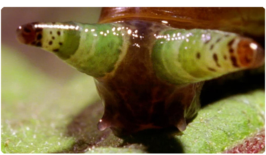
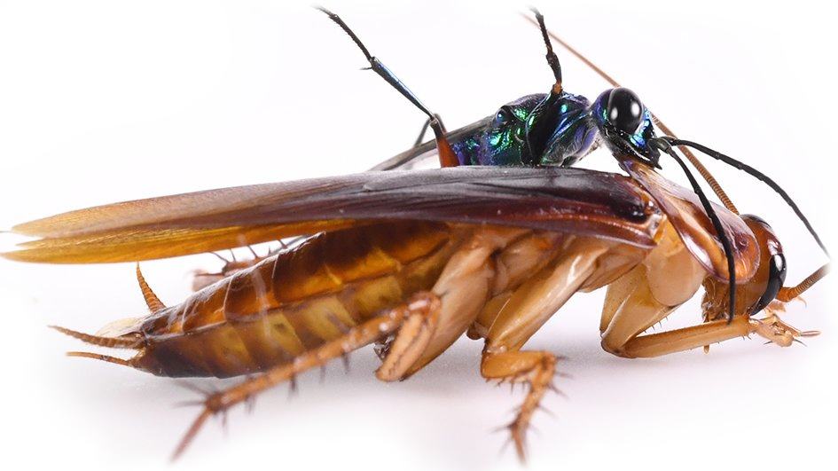

# 9: MIND

###### The machine of creation is not limited or defined by man

Although there have been many references to the idea that awareness is an inherent property of existence, let’s make this clear.

If the concept of a thing and the thing itself are two orders of the same form of expression of energy, and order is a prerequisite to intelligence, does this imply that everything with order potentially has a form of intelligence? In the tholonic model, yes, but more than that, even without order or intelligence there is awareness *and* intention.

This chart below was presented by Stuart Hameroff in his lecture “Is Quantum Physics Necessary for the Account of Consciousness?” at the  Polytech Museum of Moscow  [^83] where Hameroff discussed, among other things, consciousness from a quantum perspective.  The blue line represents the expanding universe, and the red line (which we added) represents the tholonic perspective of the (more or less inverse) growth and expansion of the instances of awareness, or consciousness.  Notice how they are inversely proportional, not unlike the relationship shown above in the section on circuits, where opposing forces change inversely over time.  Hameroff asks the question “When did consciousness arise?”, but from the tholonic perspective, consciousness occurred when the first instance of awareness came into being, which would be the Big Bang itself, for all matter is an instance of awareness, and therefore must have a consciousness, no matter how faint or undeveloped.

This is not that radical of an idea, as many great thinkers in the past have come to the same conclusion.

> There is a quality of life and intelligence to all matter.  The living universe.  **\~Giordano Bruno (1548-1600), cosmological theorist, philosopher, mathematician & poet burned at the stake for heresy.**

> Crystals are living beings at the beginning of creation.  In crystals, we have a pure evidence of the existence of a formative life principle, and although in spite of everything we cannot understand the life of crystals - it is still a living being.  **\~Nikola Tesla**

Is there a difference between consciousness and awareness?  This is a tricky subject because many languages do not even have different words for these two concepts, for example, in Spanish, both are translated to “conciencia” .  For our purposes, we define *awareness* as a property of existence, and consciousness as that same property but when expressed through an instantiation, such as a person or even a thing. It is similar to the difference between "dotness" and "a dot" or "cars" and "1968 Chevy Impala".  In the chart above, we see the rise in consciousness with the rise in instances.  Think of the whiteness of the paper upon which this chart is printed as representing *awareness*.

There is a name for the idea that consciousness is a property of existence; *panpsychism*.  You can read about its impressive history[^84] and the glowing support it has received over the last 2,000 years from some of the greats of philosophy, psychology, and science.  The minor difference between panpsychism and tholonism is that the latter claims it is awareness and intention, not consciousness, which is the property of existence and from which consciousness and intelligence arise.

Intelligence in this context does not mean “critical thinking” or “self-aware,” but it does mean creativity, learning, and problem-solving properties that nature, and the universe, demonstrates with flying colors.  We can go further and claim that the amazing relationships in simple geometry, such as the tetrahedron array with its Fibonacci numbers, ratios, and hexagonal patterns that define the laws of nature and reality are evidence of logic.  So, let’s add *logic* to the list of properties.  What about *planning*? Does nature plan anything or do we all just happen to live in a corner of the Universe that was lucky enough to win the Cosmic Mega-Lotto? We can easily see that the simple relationships between three points instantly define an infinite array for order, pattern, and symmetry on many levels.  This isn’t just *a* *plan*, it is *the* plan.

Is there creativity in the universe? Only if one considers all of creation an act of creativity.  Does the universe learn? Well, have things evolved over the past 4.5 billion years by building on an ever-growing foundational structure? If you answer yes, then we’ll add *learning* to the list.  What about problem-solving? This is a tricky one, because there is no such thing as a “problem” from the perspective of existence, because, as we have covered, if something does not follow the laws it does not exist.  If it does follow the laws, it does exist, so where’s the problem as far as the Universe is concerned? “Problems” appear to be a concept born in the meta-awareness of more developed life forms.  Still, the fact that existence is only afforded to that which follows the laws, I would say that this is damn good preemptive problem solving as it prevents “problems” from ever happening in the first place.

So far, we have:

-   Creativity
-   Learning
-   Problem-solving
-   Logic
-   Planning

We have been making the case that ideas themselves are an expression of energy, and as they clearly incorporate, and are even defined by, all the properties of intelligence listed, it’s reasonable to conclude that ideas themselves emerge from a form of intelligence, and from a tholonic perspective, even have their own intelligence.  This is fundamental in understanding how tholonic archetypes can act as autonomous agents in the self-reproducing structure of reality, the thologram.

However, this intelligence is quite different from what we would call human intelligence because of its aggregate nature.  It’s more of a recursively embedded network of countless decentralized nodes of intelligence.  It’s the intelligence of the thologram as a whole rather than the human intelligence of one tholon alone.  A more graspable metaphor that applies to intelligence is that of a large tree.  Each part of that tree is an instance of the concept of “tree”; trunk, branch, stem, leaf, seed, etc.  There can be many instances of each contributing tholon, such as a leaf, but they are all part of “tree” and can only exist within the parent “tree” tholon.  You and I, and all things.  are but “leaves” or “seeds” or “stems”, or parts thereof, on this tree of universal intelligence, and like the leaf, we can not exist without it (even if we think we can).

## Aggregates

One of the attributes of a tholon, unlike its holarchic predecessor, is that the context and scope of a tholon is not only defined by the dualities of that tholon, but also by all the tholons above and below, as the children tholons are always contributing to the parent, and the parents are always defining the children.

#### **Claim 50:** Anything that exists, that has a sustainable pattern of energy, has some form of intelligence and is a contributing element to the larger intelligence that is shared by all existence.

It is easy to see instances of this on a molecular level, such as how water is an aggregate of hydrogen and oxygen.  While the scopes and contexts of the elements are fairly well known, consider that water is a *parton* of larger tholons, such as clouds, tsunamis, wells, and rivers.

We have a similar concept in the way our social institutions work.  *Interinstitutionality*, as this has been termed, explains how the various institutions of society like financial markets, governments, family structures, educational institutions, etc., all intertwine and create amalgamations and aggregates with one another.

Interinstitutional research is defined as the investigation of the chain of complex, interrelated problems regarding tactics, sampling, data reliability, and notions of causality within the realm of each separate institution with the goal of improving aggregation and amalgamation, [^85] not unlike the supply chain model previously shown.

Take the institution of the modern North American family as an example.  It can take many forms, but several extra-familial institutions affect the complexion of “family”, such as the market, profession, educational institutions, political affiliation, etc.  Each of these institutions brings to bear its own forces and logic on the amalgamated and aggregated institution of the family.  The market shapes perceptions of standards of living in the family.  The profession shape ideas of work and service.  Educational institutions shape the ideas and direction of society.  Politics shapes our understandings of the role and participation of family members.

All institutions of society are not simply autonomous social units isolated from wider institutional dynamics, but rather several structures wrapped up and labeled according to the concept of its purpose, each structure having its own set of rules, scopes, and contexts, forming aggregate and amalgamated rules, scopes, and contexts.

This is equally true for the institution of modern science which is as much a product of interinstitutionality as any other single institution.  Far from the myth of a secular, objective and safe-guarded institution, modern science is itself an amalgamation of a whole host of non-scientific institutional factors such as the market, education, special interests, the state, politics, professions, culture, and more. 

## Tholonic Intelligence

We have a concept of a *human* collective intelligence, but we define it as something that has emerged from human intelligence, as opposed to human intelligence being an instance of an existing collective intelligence.

The tholonic view is that awareness and intention are not only attributes of existence; they are the cause of it, as explained previously.  More than that, awareness and intention are the ultimate, or purest, form of energy that is forever seeking balance in a world of duality.

#### **Claim 51:** Every archetype has an awareness, an intention, and an intelligence appropriate for its scope.

On this point, tholonic thinking has coincidentally arrived at the same conclusion recorded 3,000 years ago in the Sanskrit Vedas which states that first there was awareness, then there was consciousness, and because of this, and according to the Vedic path, consciousness or intelligence can never be the path to awareness.  On the contrary, the path to awareness starts with quieting consciousness, according to the Vedas.  Tholonically speaking, it may be accurate to say that consciousness is an instantiation of awareness, and being an instance, it is limited by the scope it is expressed in.  This all starts to lead into a philosophical realm, so we’ll just leave it at that and let the reader take it from there.

The tholonic view is that intelligence precedes consciousness.  This still complies with the traditional definition of intelligence as “The ability to learn or understand or to deal with new or trying situations.” The difference being, in the tholonic model, consciousness is not necessary to learn, understand or deal with challenges.  We are seeing this today in AI systems that certainly can learn, understand and deal with the challenges before them, but these AI systems are not conscious… yet.  Does that mean these AI systems have awareness?  Only to the degree that everything has some level of awareness given that awareness is the source of existence, but not necessarily at the tholon level, meaning, the archetype for a toaster has a nominal form of intelligence as well as access to the existing primitive intelligences of its parents (metal, electricity, etc.), but it has a minimal effect.  This is similar to the idea that the wave function for any and every single electron extends to every corner of existence.  The wave function of one electron in the ballpoint pen in your desk drawer is interfering with the gravitational field of Alpha Centauri… in theory, and on an infinitesimally small range.

However, some *neuromorphic* systems (systems that mimic neurology), such as AI systems and even some integrated chip technology, have evolved to the point where experts and lawmakers argue that they deserve the same status as people with *personhood* rights, including the right to own property.  [^86]

The tholonic definition of *intelligence* is slightly different than the traditional definition:

> The ability to maintain a sustainable pattern of energy within the scope of its existence.

As patterns come from order, which is the result of energy, and energy is awareness, then by this definition, intelligence is synonymous with “ordered or structured awareness.”

According to this definition (and the understanding that consciousness is an instance of awareness), each tholon has the potential to create its own form or expression of intelligence, its own patterns of energy (intelligence) that are contextually appropriate for its scope.  Rocks, then, and any of its hierarchical archetypes, have intelligence, as do planets, galaxies, chairs, and even what we would consider garbage.  Any concept that satisfies the tholonic requirements to exist must have an expression of intelligence.  Geometrically speaking, each tholon in the thologram represents an awareness and an intelligence for that tholon.  The spectrum of that initiating awareness and intelligence is as broad is existence itself.

Because we consider tholonic instances (*things* like trees, humans, and planets) to be the result of these laws and patterns of energy that exist within the tholonic archetype of that instance, we also consider the intelligence of those instances to be an expression of the tholonic intelligence.  In modern terms, this would be something like the collective mind of not only a species, or a community, or even a relationship, but also a belief, a fear, an idea.

These archetypal intelligences, or collective minds, interact with one another according to the three fundamental relationships as already noted: Negotiation, Definition, and Contribution.

## Cooperation

While competition and cooperation are pillars of Darwinian evolution, the tholonic view is that Darwinian evolution is more inaccurate than accurate when it comes to how instances of life learn and evolve, and at the same time, it is more accurate than inaccurate in describing how tholons interact and evolve (but Darwinian evolution as a whole only represents a small contribution to the tholonic model).

Look at the amazing relationship between humans and the honeyguide birds.  In this symbiotic relationship, the bird tells the humans where the beehives are, the humans go and then collect the honey, leaving the wax and the larva, which is what the birds want.

Think of what is involved in these interactions.  The requirement is that birds must know collectively that they have the option to enlist humans to help them.  With that knowledge, they go out in search of beehives, which they could not even attempt to gain access to without human help, which means at some point some bird had the idea to recruit humans.

When one of them finds a hive, they announce it to their friends and then go and find humans who they know they can enlist, humans who have learned how to communicate with them.  The birds hop and chatter in a specific way that humans recognize as the message that they have found a hive.  The humans collect their tools and tell the birds they are ready.  The birds then fly toward the hive, knowing to always keep their white tail feathers visible to the humans.  When they all arrive at the hive the humans smoke out the bees, chop down the tree, remove the honey and give the rest to the birds.  This is a beautiful example of cooperation between two groups that are competing with another group.

What is truly amazing about this arrangement is that the birds and humans have developed their own language[^87].  Although it is not clear how or when this arrangement began, it is speculated that it was initiated by the birds when they saw that humans had the ability to make smoke and chop down trees&hellip; so, this “birdbrained” idea is very, very old.

Are we being asked to believe that a really smart bird came up with the idea, explained it to his bird tribe, then educated and trained not only his feathered brethren, but the humans as well, in the manner of communication that this ingenious bird had developed? Likewise, how long would it take for a Bronze Age hut-dwelling human to know that a hopping, chattering bird was trying to tell him “Hey, I found a beehive I am totally incapable of getting to, so I will tell you where it is if you and your boys use your smoke and axes, which I have notice that you have and use, to get to it.  You then take the honey and give us the wax and larvae.  Deal?”

This sounds quite similar to the improbabilities described in the tall-tales of yagé and curare.

A better explanation is that the intelligences of the archetypes made this arrangement and once made, was perceived by their instances, the birds and the humans, who effectively test-drove the idea to the best of their limited abilities.  We see these same type of arrangements in ants, spiders, beetles, monkeys, and countless other lifeforms, including planets if we consider their interdependence.

## Competition

The same applies to non-cooperative arrangements.  Take the example of *cymothoa exigua*, a tiny crustacean that attaches itself to the base of the fish’s tongue and begins sucking the blood out of the fish’s tongue.  Eventually, the tongue shrivels up and falls off, at which point the parasite attaches itself to the tongue muscles and actually becomes the fish’s tongue, presumably getting first dibs of anything the fish plans to eat.

At the tholonic level, this relationship is still symbiotic as both instances ultimately depend on one another to survive.  Once a tholon has achieved stability and becomes a contributing part of the thologram its pattern becomes integrated into the entire thologram, even if the nature of that pattern is antagonistic.  Every form of existence we are familiar with is already well established in the tholon.  Only at the outer edges of the thologram, where chaos is being transformed into order, do patterns blink in and out of existence as they compete and cooperate in an attempt to find stability.  

This point is important enough to elaborate on, and an excellent example of this concept that will help demonstrate that edge between stability and chaos can be seen in fractals, such as the the classic fractal of the famous Mandelbrot Set shown below.  This image is actually a *stability map* of a very simple concept that we see all around us; iterating rules, which is the very definition of a pattern.  When a pattern’s rule is repeated over and over upon itself, eventually it will either stabilize to some state or destabilize to total chaos.  For example, x=x+1 is a very simple iterative rule that creates the numbers 1, 2, 3, 4, &hellip;, etc., but where does it ultimately end up?  At infinity, hence, it is an *unstable* rule.  By contrast,  *x=x+N/x*, where *N* is any real number, will stabilize to one value, which in this case will be the square-root of *N*. If the results of an iterative function narrow down on a number it is called *convergent*, and if the results are ever-expanding, it is called *divergent*.  But one function can be convergent sometimes and divergent at other times.  For example, *z=z^2^+c.*  If *z* starts at 0 and *c=1*, very quickly *z* approaches infinity, but if we use *c=-1*, *z* simply alternates between *-1* and 0.

This is exactly the formula used in the Mandelbrot set. The Mandelbrot “Bug” (below) is 2D because it uses complex numbers, which are also 2D.  If the formula converges to a stable number, that number is plotted as a black dot on the 2D graph. If the number diverges to infinity, it is unstable and plotted as a white dot. The more interesting and colorful image on the right shows the same thing, but the colors are used to represent the functions stability.

As you can see, all the interesting stuff exists on the narrow but infinitely deep frontier between the 2 poles of stable and unstable, converging and diverging.  How does this apply to the thologram? Think of the bulk of the thologram as the converging and stable black part, but at the “edge” of the thologram is where new tholons are formed, some reaching stability, some diverging into chaos instantly, and everything in-between.  It is this edge, between in order and chaos, that change exists.  In fact, from the tholonic view, there is only one truly stable state, and that is the 0-dimensional dot, or, Awareness and Intention.  Everything that follows exists in a reality of cooperation and conflict somewhere between chaos and order.  

The Mandelbrot fractal is the result of one very simple formula, and is a 2D snapshot of a slice of the countless and constantly changing formulas in the multi-dimensionality of reality

Removing an established tholon is not trivial given that the pattern is supported by the entire thologram.  Modifying a tholon is much more likely and achievable.  This is what we call adaptation (and the part of Darwinian evolution theory that works) The most common example of this is how animals adapt to their environments, such as how frogs can freeze their body, or have learned to build cocoons made of mucus where it can wait out a dry spell for up to 7 years, or develop skills such as biomimicry.

The functioning of a tholonic intelligence might also be a contributing factor to what biologists call “evolutionary rescue”, which is when a species can rapidly modify its DNA to deal with the new challenges of its environment.  One example of this is the Cliff Swallow, a cliff dwelling bird that within three generations changed its wingspan to be 5% smaller in order to evade cars as Cliff Swallows are fond of building homes in the “cliffs” of bridges and overpasses.

There are a number of “zombie” relationships that are good examples of this competitive/cooperative dynamic.

###  Zombie Snails

Some of these competitive relationships between species are as terrifying as they are ingenious, such as how some parasites can take over the brain of their host and make them behave in ways that boggle the mind.  When the *green-banded broodsac* (*leucochloridium paradoxum*) gets itself inside a snail, not only does it make the snails eyes bulge out to look like a caterpillar, it “drives” the snail into open territory so that birds that like to eat caterpillars will eat it, and thereby transfer the parasite into the bird where it will lay eggs that are embedded in the bird droppings all over the countryside.  This brilliant parasite appears to have a thorough knowledge of snail neurobiology and physiology, and even though it has the mobility of a 1 cm slug, it has a birds-eye knowledge of its terrain as well as the eating habits of its preferred transport vehicle.  That’s pretty good for a creature that literally has around two brain cells, similar to the snail, which also has only two brain cells… in contrast, you have 100 billion brain cells.  Could you do that to a snail?

We often think that competition is the opposite or contrary to cooperation, but from a tholonic perspective they are the same, in that competition tests the viability of a concept and/or rids it of instances that are not in the parent tholon’s best interest.

### Zombie Cockroaches

One relationship that appears to be both competitive as well as cooperative is that of the *Emerald Jewel Wasp* (*ampulex compressa*) and the cockroach, where the wasp uses only the slower, less apt cockroaches for its purposes,[^88] pruning the cockroach gene pool of the less gifted, which ultimately enhances the abilities of the cockroach collective and by extension its tholonic intelligence, of which the gene pool is an instance of.

The female wasp has quite cleverly and strategically figured out that the best place to lay her eggs is inside a cockroach, as it can provide shelter (its exoskeleton) and food (its guts).  Needless to say, the cockroach is not so keen on this idea, and being much larger than the wasp, not so easy to convince.

The wasp’s solution is to sneak up on the cockroach and using her stinger she paralyzes the front section of its body.  With the patient unable to move, she carefully makes a second injection of venom that has been created specifically for this purpose and perfectly places it into a particular area of the roach’s brain past the ganglionic sheath, which is the cockroach’s brain protector.  This magic potion blocks certain receptors of neurotransmitters that destroy the roach’s fight-or-flight responses.  She has not turned the cockroach into a zombie, per se, as some have suggested, but rather into something between a zombie and a teenager in love, for as soon as the paralyzing drug wears off, rather than run, the cockroach grooms himself! It seems as though the drug injected into his brain floods it with dopamine, so the cockroach is insanely happy at this point.  He then blissfully follows his captor back to her place (an underground burrow).  There, she lays her egg on top of the swooning cockroach, then bites off its antennae and uses it like a straw to drink the cockroach’s blood.  Refreshed, she leaves the burrow (perhaps with a smile and a look that says “I’ll be right back, darling, you just relax”) and seals it with rocks.  A few days later the egg hatches and the larvae slowly consume the insides of the roach while they form a cocoon.  The cockroach finally dies, but at least he knew what it means to love.  The adult wasp then emerges from its lovesick corpse.  

I would very much like to have someone explain to me how this process not only evolved by chance, but how the wasp knows how to make the super mixture of GABA, β-alanine, and taurine together that that can immobilize and zombify the cockroach when surgically administered to an extremely small brain, which the wasp knows exactly how to get to… twice.  How many millions of years did the wasp waste stinging the cockroach in the foot, the wings, the ass, the stomach, with who-knows-what variety of concoctions before she *finally* found the exact right spot in the brain and the exact right drug? Not only that, but the wasp larva is covered with a substance (mellein and micromolide) that stops the growth of all those really nasty and very tough-to-kill pathogens that live in the gut of a cockroach.  In fact, that stuff on the larvae is being investigated for use in medicine to kill antibiotic-resistant pathogens… that’s how good it is!  Did the wasp do research, comparing the pros and cons of cockroaches with dung beetles or snails, or was she just extremely lucky?

### Zombie Ants

An even more compelling example from nature is that of the *cordyceps*, a parasitic fungus.  This fungus gained some notoriety in the 2013 video game *The Last of Us*, wherein 60% of the population has been turned into violent zombies after being infected by this parasite.  While a human strain is unlikely to exist, it is quite real for ants, for it is via ants that this fungus spreads itself into the world in the most gruesome manner. 

A single spore has the wherewithal to know when it has landed on an ant’s cuticle, as well as knowing the species of the ant it has landed on.  It then knows to enter into the ant’s body by piercing the exoskeleton using three different types of enzymes that it knows how to produce, combined with actual mechanical pressure.  Once inside, it begins to germinate and grow a mycelium network of thousands of branches that fills all the available space it can find within the insect’s tissue, which it breaks down and devours. 

The fungus is careful to keep the vital components working because in the last moment of the ant’s life, the fungus will take over the ant’s brain, forcing it to wander off alone in search of a spot with the ideal temperature and humidity for optimal fungus growth.  Once there, the ant is compelled by the fungus to climb up some vegetation and bite down on the underside of a leaf.  The fungus is in total control and will keep the ant’s mandibles locked down until death.  During those ten days, the fungus will feast on the ant until it is dead, at which pot, it will construct a tower of spores  on its corpse which will eventually bloom into a cloud of fungal spores that drift along with the breeze.  It sounds horrifying, but if we think of the spores as sperm and the ant as the womb, it’s just your basic sex and procreation process.   As the fungus makes a point to stay near the ant colony as to increase the chances that its showering spores will infect more ants, one might think the ants will be doomed, but the ants have come up with a way to test for infected ants, and when they are detected, the healthy ants simple carry the infected ant off into the wilderness and far away, presumably with a stern warning not to return.

This is a very specific relationship between the zombifying class of fungi, *ophiocordyceps unilateralis*, which includes many species, and their very specific species of hosts, presumably because they need to know the specifics of their host’s anatomy and biology.  This very sophisticated technique is known among this class of fungi found in  Brazil, Colombia, USA, Australia, and Japan, all of which use a particular and similar class of ant as their hosts.  The techniques differ to the degree that their environment demands&hellip; as if this class of fungus all around the world share the same concept, which they then implement within its own varied environments.

It is reasonable to imagine that a fungus in Australia, which has been isolated from the rest of the world for about 30 million years, happened to “discover” the same technique used in Brazil and Florida? How exactly does a fungus discover anything, let alone piece together a step-by-step plan? Through its deductive reasoning abilities?  It would be slightly more believable that this fungus “discovered” this technique if the isolated instances used the generally similar idea but with different technical specs, such as different hosts with radically different biology, such as beetles or spiders; but to use the same class of ants as their long lost cousins from the other side of the planet? 

This fungus also seems to be very enterprising, as recently there has been as many as 15 new species within *ophiocordyceps unilateralis* that came into existence, and with his knowledge.

Ironically,  cordyceps are of great benefit to humans, so much so that humans have been catching, drying, and grinding this poor spore-fill corpse to be used as medicine.  Some of the benefits are said to be:  increased physical performance, anti-aging, heart health, anti-tumor, helps with type-2 diabetes, and fighting inflammation.  Perhaps this clever fungus has found yet another way to ensure its survival.

The tholonic view of this is that it is the tholonic intelligence of both of archetypes that are behind the amazingly sophisticated techniques, strategies, adaptation, planning, forethought, chemistry, etc.

## Findhorn

This idea of objective intelligences was also known among the founders of the miraculous Scottish community founded in 1962 called Findhorn.  The founders claim they managed to turn their arid desert-like terrain into a lush garden by communicating with the spirits (i.e.  tholonic intelligence) of the plants, and of Earth itself, who guided them on how to properly use the soil despite it being very poor quality.  Soon, they were producing 40-pound cabbages and stunning horticultural experts who came to see this miracle garden from around the world.

They also claim they managed pest control, as they use no chemicals or pesticides, by forming cooperative relationships with the collective intelligences of each species; the deer, the bugs, the rabbits, etc.  Reportedly this worked very well with all the species except one.  The rat was not interested in any “deal” and stood firm in its “it’s either you or us” position.  The last part is anecdotal, as it was told to me personally, but what is not anecdotal is Findhorn’s phenomenal success in horticulture in an area considered impossible for what they have accomplished.

There are countless examples of tholonic cooperation and competition, and some of them are even being studied.  The Canadian anthropologist Jeremy Narby does a great job of this (inadvertently) in his book *The Cosmic Serpent: DNA and the origins of knowledge*, which he wrote after living several years in the Amazon studying the shamanic knowledge of botanics.  His book explores the relationships and similarities between indigenous knowledge and our modern understanding of molecular biology, medicine, and DNA.  We won’t get into his amazing discoveries here, other than to say that their understanding demonstrates some sort of access to knowledge far beyond what could reasonably be considered to have been passed down by folklore and legend.  It is well worth the read.

## The Cambrian Explosion

*This subject is a little out of place here, but no matter where it was placed it seemed out of place.  Because we are looking at tholonic intelligence, and this is specifically related to tholonic intelligence, it seemed to be somewhat applicable.*

The Cambrian explosion is a good example of a world-changing reorganization of tholonic hierarchy and integration that took place over many millions of years 530 million years ago.  If you ask a historian what caused the Cambrian explosion, they will tell you it it was starbursts from the Milky Way, or genomic reorganization, or geochemical/environmental causes, such as photosynthesis which raised oxygen levels.  However, they will all agree that whatever the cause, there were many, many interlinked and codependent processes.  All these explanations are not really explanations, but rather descriptions; this happened, then that happened, then another thing happened causing more things to happen...  But why did it happen? In every answer to that question, the “why” is simply a description of the effects of some other cause, and when we don’t know the cause, we hypothesize a cause that could explain the effects (which become the causes).  Many of these *theories of causes* turn out to be correct, as we would expect, considering that this reality is made *only* of effects, which serves as causes for more effects.

From the tholonic perspective, there are three types of causes.

- **The originating intention**.  This is the 0-dimensional single dot that expanded itself through awareness of itself.  Science sees this as the Big Bang.
- **The cause of effects.** Effects that act as causes in a cascading chains of events.  These are actually children of the original cause or intention, but as that is beyond our comprehension, we can only understand what we perceive.
- **The intention to cause**.  This is a cause that is initiated by the willful intention of an intelligence.  The easiest example of this is when we decide to do something, like turn in a light.  Currently, we understand that willful intention is only exercised by higher forms of life, but from the tholonic understanding, tholons themselves can exert willful intention if we accept the definition of “will” as *disposition* or *inclination*, as tholons have a natural disposition and inclination.

The answer to “Why was there a Cambrian explosion?”, or any event for that matter, big or small, across all contexts, is that it was the most efficient and stable expression of energy at the time that was compatible with the intentions of all the contributing tholons.

[^83]: https://www.youtube.com/watch?v=2_sgFETJzak
[^84]: Seager, William, and Sean Allen-Hermanson. **“Panpsychism.”** Stanford Encyclopedia of Philosophy, Stanford University, 23 May 2001, <https://plato.stanford.edu/archives/win2012/entries/panpsychism>
[^85]: Turow, J. (1991). **The Challenge of Inference in Interinstitutional Research on Mass Communication**. Communication Research,18(2),222-239. <https://doi.org/10.1177/009365091018002005>. *Note: Although this is not a reference to the official definition of the term “interinsitutionality”, which is too vague to be of any use here, it does provide an excellent explanation of what it is, how it works, and how it applies to mass communications.*
[^86]: Lim, Daniel (June 1, 2014). "**Brain simulation and personhood: a concern with the Human Brain Project**". Ethics and Information Technology. 16 (2): 77–89. doi:10.1007/s10676-013-9330-5. ISSN 1572-8439.
[^87]: Spottiswoode, C. N., K. S. Begg, and C. M. Begg. **“Reciprocal Signaling in Honeyguide-human Mutualism”.** Science 353, no. 6297 (2016): 387-89. doi:10.1126/science. aaf4885.
[^88]: Milius, Susan. “**How Roaches Fight off Wasps That Turn Their Victims into Zombies.**” Science News, 14 Nov. 2018, <https://www.sciencenews.org/article/how-roaches-fight-wasps-turn-their-victims-zombies>