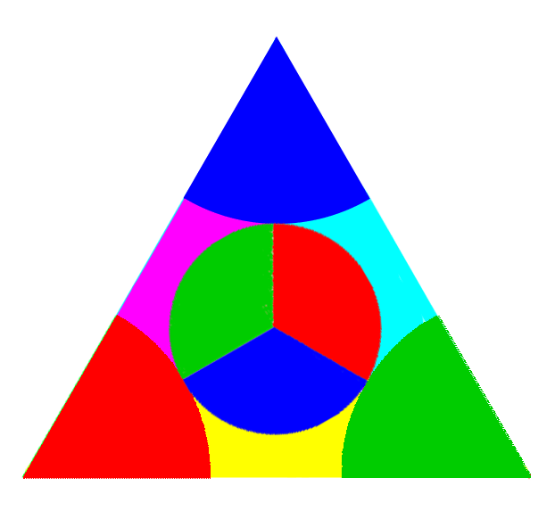

# 10: RELEVANT EXAMPLES

## Mythology

It may sound childish or even superstitious to suggest that archetypes can have intentions that can result in conflicting and/or cooperative relationships, which implies allies and enemies, and therefore some sort of diplomacy and politics.  To a certain degree, it is childish, in the sense that it leaves so much open to the imagination. Beliefs quickly fill in the blanks of our limited understanding of the mechanics of the elements of awareness, intention, and intelligence.  This is what leads to the reasoning of myth and religion.  However, it is the tholonic view that the ancient myths were a way to understand the workings of the reality (or perhaps tholons are a way to understanding the workings of the gods?).  The interactions of the gods and that of archetypes are quite easily comparable, as seen in the chart below.  Myths are *childish* in the sense that they represent an early form of intuitive understanding. The Gods are and their unending drama are understood as anthropomorphized concepts of the tholonic archetype and their in interactions. To get a general idea on the Mexican-soap-opera-on-steroids that was the life of the Gods, see appendix F, &ldquo;Greek Gods&rdquo;.  It is short, and quite entertaining.

*(Note: On the left is the lineage of the Greek Gods according to Gaius Julius Hyginus, a scholar born in 64 B.C.  On the right is one of many archetypes that represents the deity on the left.)*

The Cambrian explosion is a good example of a world-changing reorganization of tholonic hierarchy and integration that took place over many millions of years 530 million years ago.  If you ask a historian what caused the Cambrian explosion, they will tell you it it was starbursts from the Milky Way, or genomic reorganization, or geochemical/environmental causes, such as photosynthesis which raised oxygen levels.  However, they will all agree that whatever the cause, there were many, many interlinked and codependent processes.  All these explanations are not really explanations, but rather descriptions; this happened, then that happened, then another thing happened causing more things to happen...  But why did it happen? In every answer to that question, the &ldquo;why&rdquo; is simply a description of the effects of some other cause, and when we don&rsquo;t know the cause, we hypothesize a cause that could explain the effects (which become the causes).  Many of these *theories of causes* turn out to be correct, as we would expect, considering that this reality is made *only* of effects, which serves as causes for more effects.  

From the tholonic perspective, there are three types of causes.

- **The originating intention**.  This is the 0-dimensional single dot that expanded itself through awareness of itself.  Science sees this as the Big Bang.
- **The cause of effects.** Effects that act as causes in a cascading chains of events.  These are actually children of the original cause or intention, but as that is beyond our comprehension, we can only understand what we perceive.
- **The intention to cause**.  This is a cause that is initiated by the willful intention of an intelligence.  The easiest example of this is when we decide to do something, like turn in a light.  Currently, we understand that willful intention is only exercised by higher forms of life, but from the tholonic understanding, tholons themselves can exert willful intention if we accept the definition of &ldquo;will&rdquo; as *disposition* or *inclination* as tholons have a natural disposition and inclination.

The answer to &ldquo;Why&rdquo; to the question of the Cambrian explosion, or any event for that matter, big or small, across all contexts, is that it was the most efficient and stable expression of energy at the time that was compatible with the intentions of all the contributing tholons.

## Maharishi Effect

Given the general direction of mainstream science, we do not see a lot of investigation into how thought affects external reality, but some do exist[^218][^219].  We will look at one research report here, *&ldquo;Effects of Group Practice of the Transcendental Meditation Program on Preventing Violent Crime in Washington, D.  C.: Results of the National Demonstration Project, June-July 1993&rdquo;*[^121] published in the journal *&ldquo;Social Indicators Research.&rdquo;*

This study, which was monitored by a 27-member project review board comprised of independent scientists and leading citizens, found that there was a significant statistical result.

What was this study exactly?

> This study presents the final results of a two-month prospective experiment to reduce violent crime in Washington, DC.  On the basis of previous research, it was hypothesized that the level of violent crime in the District of Columbia would drop significantly with the creation of a large group of participants in the Transcendental Meditation® and TM-Siddhi® programs to increase coherence and reduce stress in the District.[^122]

Here, the word &ldquo;coherence&rdquo; refers to its definition of &ldquo;*the quality of forming a unified whole*.&rdquo;

The results were impressive.

##### 

This is only one study, so it is not definitive, but it is certainly supportive of the idea that directed intention, what the participants called *coherence*, and what we are calling *order* (as that is what unifies the parts into the whole), has an extended effect.  The explanation, according to the tholonic model, is that the directed energy of coherent thought altered the curves of various archetypes thereby altering the probability of where the &ldquo;work&rdquo; will produce the most order, or where and how energy will be expressed across a scope&rsquo;s spectrum.

### On a Personal Note

I had a particularly insightful experience with the Maharishi Effect back in the late &rsquo;60s when I was a young teenager.  My father was a captain of industry in the world of electrical components, ultimately becoming president of one of the pioneering companies that helped create the first integrated circuit.

Born of poor Scottish immigrants in the Bronx on the tail of the Great Depression, and serving in Korea, he was no stranger to hard times and hard work, which made him one of the most pragmatic and practical people I have ever known.  He was a devout capitalist, atheist, and husband, and had no patience for anything that did not produce results.  Hippies were idiots, imports were ruining the economy, Scotch whiskey was better, and talking about your problems was for whiners.  You get the picture.

At the insistence of his wife (and my mother), he joined her for a seminar on *Creative Intelligence (CI)*, which was what they called Transcendental Meditation back then for those folks like my father.  He heard their claims about improved mental and physical health, better focus, fewer distractions, etc.  He decided to test their claims by giving all his employees in one of his factories CI training, along with an extra hour at lunch break for them to take this training and practice their new CI skills.

This factory was in a poor, rundown industrial town in New England, and the people that worked in those factories were uneducated, unskilled, assembly-line laborers - not exactly an open-minded demographic.  I knew a number of them myself, as we lived in that town, and many never made it past 4th grade.  The rivers in this town were dead from all the pollution, and the neighboring town had the highest *per capita* suicide rate in the United States.  It was a dreary, dark place filled with dreary dark people.

His peers in the industry thought he was being foolish to deploy such a plan, but the results were astounding.  People were fighting less, taking less sick leave, injuries were down, production went up; in general, everything improved.  So much so, that the Wall Street Journal did an article on him and his &ldquo;revolutionary&rdquo; new technique.  He became known as some kind of New Age Industrialist, which was ironically funny as he was as new age as his &rsquo;57 Chevy.

Ultimately, this new concept was unsustainable in that environment because eventually people began to abuse the extra time meant for CI, and everything went back to *normal* with sick leaves, fighting, injuries, and lower production, so the program was scrapped.

### Prayer

You might be thinking that traditional prayer holds the same power, but it does not.  Why? Because most prayer is anything but coherent.  Prayer means very different things depending on culture, religion, personal perspectives, etc.  It can be anything from begging to demanding, justifying to virtue signaling, and occasionally it can be an expression of gratitude and love, but using group prayer to effect change is like using a group of blind people to paint a room by throwing handfuls of paint at the wall.  Your room *will* get painted, but you&rsquo;ll wish it didn&rsquo;t.

This was recently confirmed by a $2.3-million-dollar study on the effect of prayer on the sick, involving over 1,800 patients.  It was the largest study of its kind ever undertaken.  Contrary to prayer helping the sick, they found that when a patient knew others were praying for them, they tended to have *more* complications.[^123]

There are other studies that conclude the exact opposite, such as Dr.  Byrd&rsquo;s study &ldquo;Positive Therapeutic Effects of Intercessory Prayer in a Coronary Care Unit Population&rdquo;[^124] and Dr.  Harris&rsquo;s  study &ldquo;A Randomized, Controlled Trial of the Effects of Remote, Intercessory Prayer on Outcomes in Patients Admitted to the Coronary Care Unit&rdquo;[^125].  However, without a detailed comparison of the studies, and specifically the manner in which the participants prayed, we cannot know to what degree coherence was at play.

The difference between the coherence of Transcendental Meditation and prayer is the former follows a very specific set of rules, has a beginning, a middle and an end, has a clearly defined non-personal target subject, and never attempts to force change.  Prayer can follow these same rules, but it rarely does because there are no rules to prayer and varies greatly depending culture, tradition, perspective, intention, etc.

An example of coherent prayer is a practice used by the not-so-secret society of the *Order of the Rosy Cross*, or *Rosicrucians*.  Members who have reached a certain level of initiation are introduced to a schedule of &ldquo;prayers.&rdquo; This is a globally synchronized schedule of times when people are requested to focus their energy on a particular topic, such as health or family or finances, and in a specific manner.  If one is not in need, they send their benevolence into a &ldquo;pool&rdquo; of energy specific to that topic.  If one has a need in these areas they can join in at the scheduled times and &ldquo;tap into&rdquo; that pool.  This is a very coherent technique because it has specific archetypal and sustainable patterns of energy, and it (reportedly) works surprisingly well.

The effect of the *Consciousness Field*, as it is referred by Roger Nelson of Princeton University and director of the *The Global Consciousness Project* (http://noosphere.princeton.edu/), is not limited to humans, but can affect matter [^212] and machines[^213].

## Other Experiments

Here is a very short list of books and papers that delve into experiments and perspectives that supports some of the tholonic claims:

- *Double-Blind Test of the Effects of Distant Intention on Water Crystal Formation.*[^212]

- *FieldREG Anomalies in Group Situations*.[^213]

-   *Test of a field theory of consciousness and social change*. [^218]
-   *International Peace Project in the Middle East: The Effects of the Maharishi Technology of the Unified Field.*[^219]
-   *The Intention Experiment,* Lynne McTaggart
-   *Groundbreaking New Results in Consciousness, Quantum Brain & Nonlocality Research,* Maoxin Wu
-   *Conditioning of Space-Time: The Relationship between Experimental Entanglement, Space-Memory and Consciousness.  Journal of Nonlocality Round Table Series, Colloquium \#4*, Rajendra Bajpai and +2
-   *Radiant Minds: Scientists Explore the Dimensions of Consciousness*, Juanita Ratner
-   *Extrasensory perception and quantum models of cognition*, Patrizio Tressoldi and +2
-   *The relationship between local geomagnetic activity, Tibetan Buddhist meditation and psychic awareness: Preliminary study*, David Luke
-   *Phenomenological Convergence between Major Paradigms of Classic Parapsychology and Cross-Cultural Practices: An Exploration of Paranthropology*, Jack Hunter
-   *An investigation into the cortical electrophysiology of remote staring detection*, Paul Stevens
-   *Geomagnetic Field Effects in Anomalous Dreams and the Akashic Field*, Stanley Krippner
-   *The relationship between local geomagnetic activity, meditation and psi.  Part I: Literature review and theoretical model*, David Luke and +1
-   *Eleonore Zugun: the Re-Evaluation of a Historic RSPK (Recurrent Spontaneous Psychokinesis) Case*, Peter Mulacz
-   *Intention,* Jeanne Lim

## Are Archetypes Alive?

If ideas are archetypes that have energy and fields, then it would be reasonable to think that an idea could be reinforced and strengthened by adding more energy to it.  How would one go about adding energy to an idea? If awareness is energy, then one obvious way would be to simply increase the awareness that an idea is exposed to.  This sort of thing is done all the time.  Take, for example, National Prayer Day in the U.S. (May 7th) when the President signs a proclamation encouraging all Americans to pray on this day and “to turn to God”.

Now, imagine the potential power of 114,000,000 consciousnesses all being exposed to the same symbolism at the same time. This is exactly what happened during the broadcast of Super Bowl XLIX, but unlike National Prayer Day where the participants voluntarily focused their awareness towards one idea, it was more like a National Mind Harvesting Minute of the awareness of the 114,000,000 unwitting spectators.  Unlike the barrage of commercials and propaganda we are subjected to on a daily basis, this particular event was unique. According to a very suspicious article[^214] that was written by a conveniently anonymous designer who claimed to have once worked in the graphics department of a huge media company, out of boredom and his opposition to the then administration of President Bush, he deliberately hid pyramid eyes, pentagrams, and symbols from John Dee, the infamous sixteenth century occultist to the Queen of England, into the intro and promo videos for everything from war events to major sports events, including Super Bowl XLIX. Ignoring the question of why the designer thought secret occult symbols were a good choice to subliminally oppose President Bush, it was not the claim that was suspicious, as with just a little investigation his claims can be confirmed, but that this published article, which appeared overnight on over 36,000 websites, conveniently provided a “plausible deniability” defense for the media companies when Internet sleuths were discovering these symbols. regardless of the intentions of those responsible, the effect was that a tremendous amount of awareness, albeit unconscious awareness, was pumped into these images; images that have existing archetypes, and therefore, according to the tholonic model, their own awareness, intention and intelligence. 

Considering the average American youth spends 900 hours a year in school, and another 1,200 hours a year watching television, and that 70 percent of the American adult waking life is spent in front of digital media, [^224] and that the average 78.6 year old American will spend nine years of his life watching TV, two years of which is just watching commercials, we talking about a tremendous amount of awareness up for grabs. How is that currently being used? 

The more pessimistic reader might begin to suspect that the manipulation of awareness as energy is perhaps already well understood by some perhaps less than noble folks. Other may think this is bordering on mystical conspiracy theories.  Our intention is not to support either of these ideas, but to suggest that ideas have a life of their own. This include ancient, even if they seem to have been forgotten by modern society.

We have the ability to tap into these archetypal realities whenever we like or need, and often do unconsciously. This is the purpose and power of myths, be they ancient or modern. As these archetypes originate in the uninstantiated tholonic state, they are free from the limitations of our space-time reality, and therefore they are eternal, or at least, long-lived. The myths and beliefs of the ancient past continue to live on in ever-evolving meaning and symbolism that promote their existence, almost like a self-mutating virus. This is the source of talismanic, totem or symbolic “magic” and the invoking of deities, intelligences, energies, be they “good guys” or “bad guys” (although it’s often hard to tell them apart).

Much of our everyday culture is inextricably bound to these archetypes and thereby further empowering them, usually without our knowledge. Jung described these archetypes as “ordering factors in the collective unconscious”. There are the twelve archetypes of the human psyche organized into four cardinal types, which we described earlier. 

For example, the modern word “hell” comes from the ancient Norse goddess named *Hel* whose job it was to not only judge the dead but also help the apocalypse along by leading an army of the dead in a ship made of the fingernails of corpses.

The concept of Hell, or whatever it happens to be called, is deeply ingrained into the worldview of billions of people who have little knowledge of the roots of their beliefs. These believers, through the energy of their awareness, bring into creation associated or parasitic archetypes that are attached to primary archetype which they are completely unaware of, but which are energized by that awareness nevertheless. While this can&rsquo;t be proven, I suspect that the more people who believe in hell, the more empowered and manifest the concept of an apocalypse. The ironic part is that believing in the traditional Christian or Islamic heaven by default empowers their concept of a hell, as they are presented as two side of one state, the afterlife.

What we have referred to as an uninstantiated tholon can, al least in this context, be an archetypes as a form of *metameme,* which is a form of a *meme* that only exists in the collective unconscious and/or in the world of archetypes, the thologram. If a meme is “an idea, behavior, style, or usage that spreads from person to person within a culture, then a metameme is an “an idea or belief formed within the tholonic field (i.e. universal mind,  collective unconscious, morphic field, etc.) and spreads from tholonic field to tholonic field”.   You make have heard phrases like  &ldquo;If it looks like a duck, and quacks like a duck, its probably a duck.&rdquo;, or &ldquo;When you hear hooves, think horses, not zebras.&rdquo;, or &ldquo;The simplest explanation is most likely the right one&rdquo;, otherwise known as *Occam&rsquo;s Razor*. Applying the wisdom of these practical practices, what are we to make of the fact that research out of Princeton University supports the theory that ideas, in the form of social media networks, follow the same growth models as viruses (in the form of diseases.)?[^215] Outside of the conclusion that perhaps Facebook is actually a viral disease, it tells us that ideas follow the same patterns as existing natural patterns of growth, suggesting we might learn more about the life of archetypes if we considered them living.  OK, viruses *may* not be &ldquo;alive&rdquo;, but I say *may* because some experts in the field are redefining &ldquo;life&rdquo; to include viruses. [^216] [^217] Regardless, the growth, survival and creation of ideas follow the same patterns as everything else that grows, survives and creates. For this reason, a clever researcher might be able to find correlations between the life cycle of a galaxy and something as seemingly unrelated as, say, the life cycle of a tomato plant. One such researcher might be Tokyo Institute of Technology’s Maruyama Shigenori, a leading geophysicist and founder of the Center for Bio-Earth Planetology, who, by connecting the theories of astronomy with those of the life sciences, has shown how entire planets may well be living super-organisms.

This idea, however, has a dark side to it because so many of our beliefs are manipulated and controlled by others whose agenda is less than altruistic, hidden, and who are aware of the mechanics of reality and consciousness. From the most powerful laser in the world named after the Hindu god of destruction to trivial tarot cards based on movie stars, we can find countless examples of how these imposed archetypes infiltrate our understanding of the world.

So, what kind of world are we creating with our awareness, desires, and beliefs, as a planet? To find out, I wrote a mobile phone app that allows people to send out into the universe either a blessing or a curse.  The app was (unsurprisingly) called &ldquo;Bless or Curse&rdquo;.

The majority of both blesses and curses are about…wait for it…love, money, and health (surprise!). Some were touching, such as the blessing of “May he win lotto,” cast upon the bus driver who “stopped just for me”. Some are bizarrely dark, such as the curse of “Torture Rape Murder die die die die die,” cast upon Noisy Walgreen Employees.

Humanity seems to be pretty well split down the middle between the *blessers* and the *cursers*, as you can see by this report map below. In general, it tends to waver back and forth just around the 50/50 mark. 

Like a marble balanced on the top of a mountain, the slightest tilt toward on one side or the other can reverse the direction the future will roll. Even one thought, one blessing or curse, one act of love or hate, can shift the balance for all, according to the research.

## Tulpas

Oddly, one of the better legends of how ideas can take on a life of their own comes form the well-known book *Magic And Mystery In Tibet in 1932*, by Belgian-French explorer Alexandra David Neel.

If one is to believe the writings of this Belgian-French explorer then we must consider the power and potential of what science today considers irrational and impossible.

 dressed as a beggar with only a compass, money (for ransom in case she was kidnapped) and a gun, snuck in to Lhasa, Tibet that was forbidden for foreigners to enter,

In the Far East there is the concept of a *tulpa*, which is a type of thought-form. They are understood to be a sentient consciousness that resides in the brain of the host and can have separate feelings, thoughts, and memories from the host and can communicate through thought, imagination, feelings, or verbally. With enough practice and concentration, the host can see the tulpa’s form in the real world, and for the truly advanced *tulpamancer*, can be seen by others as well. Of course, this is an preposterous ides to Western thinkers. Alexandra David Neel was a woman of remarkable courage. She recounts how the only way she could enter the forbidden (to foreigners) city of Lhasa, Tibet, was to sneak in dressed as a beggar carrying only a compass, money (for ransom in case she was kidnapped) and a gun. She was also known for her sound scientific thinking and her opinions and observation carried weight in academic and scientific circles. Doctor A. D’Arsonval, a member of the French Academy of Sciences, The Academy of Medicine, professor at the College of France and president of the Institute of General Psychology, said of Alexandra David-Néel:

> This well-known and courageous explorer of Tibet unites in herself all the physical, moral and intellectual qualities that could be desired of one who is to observe and examine a subject of this kind.[^223]

So when she described how she used the techniques taught to her by the Tibetan magicians to conjure up her own *tulpa*, it is not as easy to discard them as pure fantasy. In her case, she manifested a short, pudgy, jolly monk, as per her intentions.  Perhaps even more interesting was that this tulpa, once it began to be visible to others, began to have its own free will, a life of its own; the jolly, fat monk began to grow lean and taller, and less jolly. It eventually became a major problem for her, and she had to spend six months “dissolving” it. As she states:

> The fat, chubby-cheeked fellow grew leaner, his face assumed a vaguely mocking, sly, malignant look. He became more troublesome and bold. In brief, he escaped my control. I ought to have let the phenomenon follow its course, but the presence of that unwanted companion began to prove trying to my nerves; it turned into a ‘day-nightmare.’ Moreover, I was beginning to plan my journey to Lhasa and needed a quiet brain devoid of other preoccupations, so I decided to dissolve the phantom. I succeeded, but only after six months of hard struggle. My mind-creature was tenacious of life. There is nothing strange in the fact that I may have created my own hallucination. The interesting point is that in these cases of materialization, others see the thought-forms that have been created.

Whether tulpas exist or not is left to the reader. The point is that the belief that ideas can take on a life if their own is neither new nor unique.

On a related note, keep an eye on the research into what is essentially the collective consciousness of artificial intelligence, or *A.I. Swarms*, as they are called,[^220][^221]and the early attempts to create artificial humans.[^222] Science and technology is attempting to create their own tulpas, and one day they may also prove to be “more troublesome and bold, escaping our control.”

# 11: PREDETERMINISM

Remember the explanation of how a lightning rod works?  It simply creates a path of least resistance between two different states that seek balance, and, as energy always travels the path of least resistance, lightning will always seek the lightning rod over a brick chimney.  We can say that the path of the lightening was predetermined before it even began, but it would be more accurate to say that the lightening only came into existence because such a path even existed in the first place.  In other words, the instance of lightening is a consequence of the preexisting energy fields.

The same concept holds for the thologram in that there can be almost countless combinations of archetypes, and therefore almost countless connections of tholons between the beginning and the end.  This implies that within the thologram exists every path of creation and/or growth that is possible *at that moment in time*, but the paths that will be traveled are those that represent the path of least resistance, and what we see as reality around us is a consequence of energy moving through those paths.

As new combinations come into being, new paths emerge, but for the most part, these new paths will emerge from the &ldquo;bottom&rdquo;, or end-points, of the hierarchy, as these are the most unstable and dynamic.  Each tholon represents a &ldquo;step&rdquo; in the path.  New paths are rarer as we move up the hierarchy as these higher-order tholons have achieved a stable state that is held in place by the induction of their parents and children, and short of a radical change in energy they will not change.  The force of the energy that would be needed to affect a change is inversely proportional to their generation.  This is why reality &ldquo;is confined by rules that may be shockingly narrow&rdquo;, to quote Charles S.  Cockell  from his book &ldquo;The Equations of Life: How Physics Shapes Evolution&rdquo; and suggests that form and life across the universe may not vary as much as we might imagine.

An example of these new emerging paths would be the creation of a new element in the periodic chart.  All elements past the element of uranium are man-made, so they are new creations, but they are also extremely unstable and unsustainable and don&rsquo;t last very long.  A new stable path even a little way up from the &ldquo;bottom&rdquo; would dramatically alter reality.

Starting from the beginning, immediately upon the first awareness of a non-existent dot in the void of nothingness, that awareness and intention began self-replicating into smaller and smaller divisions.  These divisions stop at some point where no sustainable patterns can be achieved, perhaps because the difference is too small or weak, or the dissimilarities are too great, or other reasons.  The depth of a tholon&rsquo;s scope can be described as the difference between two states, the delta of the duality of that scope, similar to the definition of voltage we saw above, which presumably gets smaller and smaller with each generation (but not necessarily).

As the parents and children of a tholon change, so too will that tholon adapt to these changes by having its scope adjusted.  In doing so, the thologram is *problem-solving* in real-time.  More than that, it is doing this in a heuristic manner, i.e.  a manner based on experience.  How? Because the (only successful) changes that have been made in the past resulted in changes to the entire thologram and the consequence of those changes define the context of each tholon&rsquo;s current condition.

The working hypothesis is that the thologram has a memory of everything that has ever happened to it that resulted in a successful change, and this is all recorded and passed on through each and every sustainable pattern.  However, there can be many tholons occupying the same space because of the embedded nature of tholons, so if you reference a tholon at the &ldquo;bottom&rdquo; of the thologram, you are implicitly referencing every parent tholon back to the very first tholon.  What this suggests is that any instance of a tholon is also an implicit reference to many tholons and the path that connects them.

What this tells us is that each instance is a 3D perspective of a very multi-dimensional form of energy that that describes one &ldquo;path&rdquo; from the first tholon to the tholon in question but which we 3D dwellers experience as past, present, and future (like the 3D ball passing through 2D space example previously).

Two strangers, Bob and Carol, bump into each other at the butcher shop.  This interactions is the result of countless steps that had to happen starting with the Big Bang.  The path from the first moment of creation to the current instance that it took for Bob and his ancestors to arrive at this point and time we&rsquo;ll call path B, and the same for Carol we&rsquo;ll call path C.  Path B and path C already existed in the thologram, and Bob and Carol just happen to be the current instance of the fields of these two paths that connected because it was the path of least resistance, like the two fields that connected to create lightening.  There are effectively an infinite number of paths and their fields, but the point where Bob and Carol meet is the only point where the two fields, of which they are the current instances of, connect.  If reality itself is the memory store then anything that emerges from this meeting will inherit the &ldquo;information&rdquo; of their meeting.

Every path that can be traveled by any instance already exists because the fields already exist.  The path is the expression of the fields interacting.  I suspect we tend to wander through this matrix of possibilities in the same manner bacteria wander aimlessly about in their puddles of plasma, or whatever their world is made of.

Perhaps one the best instance of this that is easily understood is music.  Consider that a finite number of notes exist, but within those notes an almost infinite number of tunes can be written.  If we mapped every combination of notes, the tune could be seen as a path on that map.  This is more than just a thought experiment… it&rsquo;s an actual undertaking by music theorist Julian Cook, who described in his article  &ldquo;Mapping the Music&rdquo;,[^170] how the harmonic path of a Beethoven sonata can be visualized on a *Tonnetz* graph (left)&hellip; a graph that happens to look just like a 2D tholon map.  In this example, the notes are acting like the fields, and the playing of those notes represent energy moving through these fields, forming music, or lightening, plants, rivers, neurons, and everything else.  

Music also demonstrates how certain patterns can lay down the foundations upon which other patterns and expressions build upon.  For example, there are many different types of scales, such as *pentatonic*, which has 5 notes per octave, or the *Western Major Scale*, with the classic 7 notes most of us are used to.  Sound occurs when energy is applied to matter, and notes represent the *dots* that we have identified within that chaos of white noise through our power of reasoning.  We form patterns and connect these dots that exist in the sea of chaos that is all sound, and by doing so we create &ldquo;music&rdquo;.  We describe white noise as all frequencies expressed at once, but it is equally accurate to describe white noise as every possible pattern of all possible notes being performed at once.  This tells us that that all possible forms of music, all songs, rhythms, beats, arrangements, etc., already exist within that white noise and all that we can do is discover them.  

Even in the world of bacterial meandering, we see a pattern.  Not surprisingly, it is the inverse of a Bell curve, in that a group of bacteria released at the same time starts out relatively coherent and eventually disperses to incoherence.  It&rsquo;s  almost (or exactly) as if the instances of creations that can emerge from a tholon&rsquo;s  Bell curve are the balancing factor, much like the way a positive charge will automatically create a pairing with a negative charge, or how the amount of rain that falls is equivalent to the amount of water that evaporated from the earth.  

#### **Claim 58:** Archetypes tend toward order, while the instances tend toward chaos.  

In the early generations of the thologram, the numbers of paths are limited, and with the additional generations, the number of paths increase.  This movement may appear random, but not only does it disperse according to a Bell curve, it actually follows the same rules as the thologram itself in that it is self-similar and fractal in nature.[^126]

Although this sounds like predeterminism, which it effectively is, there are so many paths that can be traveled that for all intents and purposes predeterminism doesn&rsquo;t apply.  Tholonically speaking, it appears as though we may have free will, but only with regard in determining which predetermined path we follow.  It also looks like existence itself is the unfolding, explicating, instantiating of every possible combination of sustainable patterns that exist to establish a balance between differing fields.

Although a bit of a tangent, and certainly worthy of more than a paragraph, it&rsquo;s worth stating here that the idea of reincarnation has a tholonic explanation, which is: What some people believe to be past life experiences are collective memories associated with the path we happen to be instantiating, or traveling, if you will, and which we identify with mainly due to our ego&rsquo;s nature to relate these inherited and embedded memories (and everything else, apparently) to one&rsquo;s self.  This is why many people who believe in reincarnation will also believe they were some grand historical figure in a past life, as there will naturally be more instances (of people) in these well-worn paths of current archetypes simply because these paths are the paths of lesser resistance.  

On a similar subject, the Thologram has a concept of life after death.  Every creation, including tholons, goes through the cycles of instantiation, this being inception, gestation, emergence, propagation, culmination, and dispersion.  This is just one description that identifies six stages.  There can be many others.  When a tholon &ldquo;disperses&rdquo;, whether due to loss of energy, destruction, absorption, or any number of ways, its stable pattern of energy can come to an end.  What then survives and where does the energy go?  The energy goes to wherever it can go with the least resistance, that typically being the parent tholon, and the recycling of the dispersed energy would them be channel though the stable patterns of that parent tholon.  This is probably what spiritualists refer to as the *oversoul*.

There are other possibilities, as well.  In some cases, perhaps, and as we will argue in the section immediately following, there can be multiple instances of the same individual human tholon.  It may also be the case where if there is enough induction from related tholons and all of the energy is not dissipated, then that could result in an *implicit instance*, that being an instance that does not have the structure necessary to take form, like the ink dots in the glycerin example.  This is most likely what is perceived as ghosts, spirits of the dead, poltergeists, and various other types of disincarnates.

Applying this idea of multiple (and overlapping) instances to the thologram, there are different patterns that dominate our reality at different times, and as these patterns represent the instances that make up our reality, we can say that reality, from atoms to ideas, also differs across time.  In fact, the concept of an atom itself exists only because it is based on the patterns of reality we happen to be discovering at this point in our journey, but at other times in the past, and future, this concept will change, or disappear altogether.  There was (or will be) a time when what we see as atoms are seen as spirits, or perhaps facets of a larger intelligence, or something we are incapable of imagining at this time.  The laws that control atoms will also apply to spirits or intelligences, or whatever, but these laws will also be understood within the context and scope of the time.

There are some real-world examples of how instances follow a preexisting path.  Here are some of the fairly well-known stories of &ldquo;coincidences&rdquo; that demonstrate this concept.[^127]

### Laura Buxton

In June of 2001, a 10 year old girl named Laura Buxton released a balloon with her name and address on it, which floated 140 miles and landed in the back yard of a house where also lived a 10 year old girl named Laura Buxton.  On the day of the meeting, the two girls wore essentially the same outfit — a pink sweater and jeans.  The girls were the same height, which was unusual because they were both tall for their age.  They both had brown hair and wore it in the same style.  They both had three-year-old black Labrador Retrievers at home, as well as gray pet rabbits.  They both brought their guinea pigs, which were the same color and even had the same orange markings on their hindquarters.  It was almost as though these two Laura Buxtons were the same person.[^179] Below is a picture of the two Laura Buxon girls, who are still friends today.

*Here there are two instances of the same tholon (which may be one among many) in slight different contexts.  What is fascinating about this is that if it was tholonically predetermined that a red balloon was to carry an address, then both instances, both girls, would have to experience it, which was the case when it was sent by one, and received by another.*

### King Umberto I&rsquo;s double

In Monza, Italy, King Umberto I went to a small restaurant for dinner, accompanied by his aide-de-camp, General Emilio Ponzia-Vaglia.  When the owner took King Umberto&rsquo;s order, the King noticed that he and the restaurant owner were virtual doubles, in face and in build.  Both men began discussing the striking resemblances between each other and found many more similarities.

a\) Both men were born on the same day, of the same year, (March 14th, 1844).

b\) Both men had been born in the same town.

c\) Both men married a woman with the same name, Margherita.

d\) The restaurateur opened his restaurant on the same day that King Umberto was crowned King of Italy.

e\) On 29th July 1900, King Umberto was informed that the restaurateur had died that day in a mysterious shooting accident.  As he expressed his regret he was assassinated by an anarchist in the crowd.

*This looks like two instances traveling the same path that was instantiated in two different contexts.  This also implies that tholonic contexts are also archetypal, meaning there are &ldquo;archetypal contexts&rdquo; and &lsquo;instantiated contexts&rsquo;.*

### Twin Boys, twin lives

The twin Ohio boys were separated at birth, being adopted by different families.  Unknown to each other, both families named the boys James.  Both James grew up not even knowing of the other, yet both sought law-enforcement training, both had abilities in mechanical drawing and carpentry, and each had married women named Linda.  They both had sons whom one named James Alan and the other named James Allan.  The twin brothers also divorced their wives and married other women, both named Betty.  And they both owned dogs which they named Toy.  Forty years after their childhood separation, the two men were reunited.  (Source: Reader&rsquo;s Digest, January 1980)

*This looks like two instances of the same tholon in the same archetypal and instantiated context at birth.*

### Three strangers on a Train, with complementary last names

In the 1920s, three Englishman were traveling separately by train through Peru.  At the time of their introduction, they were the only three men in the railroad car.  Their introductions were more surprising than they could have imagined.  One man&rsquo;s last name was Bingham, and the second man&rsquo;s last name was Powell.  The third man announced that his last name was Bingham-Powell.  None were related in any way.  (Source: Mysteries of the Unexplained)

*Here, these three men, although having different lives, clearly shared some other details.  Does this suggest that even our names can be instances of a pattern? I have some experience with this personally.  For my entire life I have been fascinated with the lore of El Paso, Texas.  I had never been to El Paso prior to when I drove through the West Texas desert town in my 40s at around 4 AM in the morning.  It was an ugly town, but I found it incredibly alluring, for reasons I could not explain.  Years later I discovered that the most famous Old West lawman of El Paso, considered a hero in them there parts, and I, shared the same name.  I can&rsquo;t say if that is why I felt the way I did about El Paso, but these are two details that seem both very rare, and possibly very connected.*

### Richard Parker

Edgar Allan Poe wrote a story called &ldquo;The Narrative of Arthur Gordon Pym&rdquo;.  This was a story about four survivors of a shipwreck who were in an open boat for many days before they decided to kill and eat the cabin boy whose name was Richard Parker.  Some years later, in 1884, the *Mignonette*, a 52 foot English Yacht, was capsized by a wave as they were traveling northwest of the Cape of Good Hope.  The four survivors found themselves together in an open boat for many days.  Eventfully, the three senior members of the crew killed and ate the cabin boy, whose name was Richard Parker.

*Here a pattern took form as both a story and an experience.  Perhaps Poe was able to tune into certain patterns and share them.  Perhaps that is what creativity or genius is; the ability to tap into patterns that have yet to become instantiated.  p.s.  The men served only six months in prison and were then released.  They were the first men to ever serve time for cannibalism and murder on the high seas because it was considered a &ldquo;custom of the sea.&rdquo;  See &ldquo;Her Majesty The Queen v.  Tom Dudley and Edwin Stephens&rdquo;, High Court of Justice, Queen&rsquo;s Bench Division, 1884*

### Titanic&rsquo;s destiny, Titanian&rsquo;s salvation

Morgan Robertson, in 1898, wrote &ldquo;Futility.&rdquo; It described the maiden voyage of a transatlantic luxury liner named the Titan.  Although it was touted as being unsinkable, it strikes an iceberg and sinks with much loss of life.  In 1912 the Titanic, a transatlantic luxury liner widely touted as unsinkable strikes an iceberg and sinks with great loss of life on her maiden voyage.  In the book, the month of the wreck was April, same as in the real event.  There were 3,000 passengers on the book; on the Titanic, 2,207.  In the book, there were 24 lifeboats; on the Titanic, 20.

Months after the Titanic sank, a tramp steamer was traveling through the foggy Atlantic with only a young boy on watch.  It came into his head that it had been thereabouts that the Titanic had sunk, and he was suddenly terrified by the thought of the name of his ship, the Titanian.  Panic-stricken, he sounded the warning.  The ship stopped, just in time: a huge iceberg loomed out of the fog directly in their path.  The Titanian was saved.

*This is similar to the Poe story, but the fate of the Titanian might be an example of how an existing path could be altered, meaning, the curve of the instantiating tholon was altered.*

### A writer&rsquo;s plum pudding

In 1805, French writer Émile Deschamps was treated to some plum pudding by the stranger Monsieur de Fortgibu.  Ten years later, he encountered plum pudding on the menu of a Paris restaurant and wanted to order some, but the waiter told him the last dish had already been served to another customer, who turned out to be de Fortgibu.  Many years later in 1832 Émile Deschamps was at a diner and was once again offered plum pudding.  He recalled the earlier incident and told his friends that only de Fortgibu was missing to make the setting complete and in the same instant the now senile de Fortgibu entered the room.

*Pudding seems to be the pattern that instantiates under the very specific conditions of when when Deschamps and de Fortgibu are near one another.  Proximity, at least in this case, seems to have an effect on the probability of what patterns might instantiate.  One can only guess why pudding was the pattern they created.*

### A novel that unsuspectedly described the spy next door

When Norman Mailer began his novel Barbary Shore, there was no plan to have a Russian spy as a character.  As he worked on it, he introduced a Russian spy in the U.S.  as a minor character.  As the work progressed, the spy became the dominant character in the novel.  After the novel was completed, the U.S.  Immigration Service arrested a man who lived just one floor above Mailer in the same apartment building.  He was Colonel Rudolf Abel, alleged to be the top Russian spy working in the U.S.  at that time.  (Source: Science Digest)

*Here is an example of pattern instantiating while at the same time being perceived and recorded by a bystander, similar to the Poe story, but in teal-time, and again, in close proximity.*

### A falling baby saved twice by the same man

In Detroit sometime in the 1930s, a young (if incredibly careless) mother must have been eternally grateful to a man named Joseph Figlock.  As Figlock was walking down the street, the mother&rsquo;s baby fell from a high window onto Figlock.  The baby&rsquo;s fall was broken and both man and baby were unharmed.  A stroke of luck on its own, but a year later, the very same baby fell from the very same window onto poor, unsuspecting Joseph Figlock as he was again passing beneath.  And again, they both survived the event.  (Source: Mysteries of the Unexplained)

*If proximity is a factor, we have to wonder if Figlock never walked down that street, would the baby have ever fallen?*

### A determined bullet

Henry Ziegland thought he had dodged fate.  In 1883, he broke off a relationship with his girlfriend who, out of distress, committed suicide.  The girl&rsquo;s brother was so enraged that he hunted down Ziegland and shot him.  The brother, believing he had killed Ziegland, then turned his gun on himself and took his own life.  But Ziegland had not been killed.  The bullet, in fact, had only grazed his face and then lodged in a tree.  Ziegland surely thought himself a lucky man.  Some years later, however, Ziegland decided to cut down the large tree, which still had the bullet in it.  The task seemed so formidable that he decided to blow it up with a few sticks of dynamite.  The explosion propelled the bullet into Zealand&rsquo;s head, killing him.  (Source: Ripley&rsquo;s Believe It or Not!)

*The pattern here is the bullet and the intention behind it.  Intentions alone can be their own pattern.*

From one perspective you could see all these stories as extremely unlikely coincidences.  From the tholonic perspective, each of these paths and each of these profiles are some of the almost countless patterns that managed to attain enough stability to instantiate.

## Life, Death, Afterlife

This subject raises questions about life after death.  Every creation, including tholons, goes through the cycles of instantiation, this being inception, gestation, emergence, propagation, culmination, and dispersion.  This is just one description that identifies six stages.  There can be many others.  When a tholon &ldquo;disperses,&rdquo; whether due to loss of energy, destruction, absorption, or any number of ways, its stable pattern of energy can come to an end.  What then survives and where does the energy go?  The energy goes to wherever it can go with the least resistance.  This might be the parent tholon but perhaps it could be a peer as well.  It could also stay right where it is if there are no immediately available paths of lesser resistance, not unlike a static charge that is held until is can be released.  There are many possibilities.  In some cases, perhaps, and as we put forth in the section above, there can be multiple instances of the same individual human tholon.  The various possibilities could easily describe what we commonly called the *oversoul*, or reincarnation, ghosts, spirits of the dead, poltergeists, and various other types of disincarnates that are something like an *implicit instance*, or an instance that does not have the structure necessary to take form, like the ink dots in the glycerin example. 

### Sadhguru explains

Some months after writing the above text, I &ldquo;coincidentally&rdquo; came across a short excerpt from a lecture by Jaggi Vasudev, 62 year-old English Major turned yoga teacher in India.  He goes by the name Sadhguru, and currently runs an ashram, has given speeches at the United Nations, and has founded a the Isha Foundation which teaches yoga and appears to be heavily involved in environmental and spiritual issues.  He was addressing the question &ldquo;Is there rebirth?&rdquo; and his answer was especially tholonic in nature.  Below is a transcript of his answer, which was slightly modified for grammatical reasons alone, along with commentary.

> The question is, is there re-birth? If it&rsquo;s there, what is the basis for one being to go from one birth to another? What is it that carries a person from one to another?  Now, if you need to understand this, you must have some understanding of the mechanics of who you are.  I am talking about the mechanics of how a human being is built.  When you say &ldquo;I am a human being&rdquo;, you are speaking of the outermost periphery, the physical body.  In yoga, we look at everything as &ldquo;body&rdquo; because it is easier for you to understand it that way.  So we see the body as five dimensions or five sheaths.  

> Physical body is known as *Annamaya Kosha*.  *Anna* means &ldquo;the food.&rdquo; This is the food body.  The next one is called *Manomaya Kosha*, which refers to the mental body.  The third one is called *Pranamaya Kosha*, which refers to the energy body.  Physical body, mental body, energy body, all these three dimensions are physical.  They are physical existence.  Physical body is very gross, mental body is subtler, energy body is even subtler but all these three are physical.  This is just like the light bulb is physical, you can see that.  The electricity behind [the light bulb] also is physical, isn&rsquo;t it?  The wire that connects is also physical; the electrons that flow through the wire also are physical existence.  So similarly, physical body, mental body, *pranic* body all are physical dimensions of life.  

Not surprisingly, we are seeing the trigram model.  In this case is it physical, mental and energetic, which is another way of saying material, archetype and energy.

>  This physical dimension of life in all these three dimensions carries the imprints of karma; On the body, it is imprinted, on the mind it&rsquo;s imprinted and on the energy it&rsquo;s imprinted.  This karmic imprint, or the karmic structure, is what holds it together.  Karma is the cement which holds you to the physical body.  Karma is the bondage at the same time.  It&rsquo;s only because of karmic stuff you can hold on to the body and be here.  

He points out that karma here is a synonym for structure, and it is this structure that accounts for the existence, or instantiation, of things.  The concept of karma tends to be associated with values and judgments, ideas such as good and bad, right and wrong, but outside of these subjective and culturally relative ideas, karma is structure, and that structure, from the tholonic perspective, is the thologram in its entirety.  The thologram is the structure of karma, and karma is the laws of instantiation.

> This is where spirituality seems to be difficult because if you try to take it away it doesn&rsquo;t work.  If you try to add, it doesn&rsquo;t work.  You need to be just there.  If you&rsquo;re just there, it&rsquo;s a moment.  The next two dimensions are called *Vignanamaya Kosha* and *Anandamaya Kosha*.  *Vignanamaya Kosha* is non-physical but related to the physical.  It is like a transient state.  *Anandamaya Kosha* is completely non-physical.  So, *Vignanamaya Kosha* and *Anandamaya Kosha* means it&rsquo;s the bliss body.  

In the tholonic model there is a similar concept, for prior to the realm of instantiation, or the physical reality, there are two states.  These are the two points that must exist before the third can be created.  They are the first instance of awareness, the *green dot*, the point of *Definition*.  This is equivalent to *Vignanamaya Kosha*, which is a transitional state.  Tholonically, it is the point where non-physical, purely conceptual and archetypal concepts are defined, such as limits and law.  before that is the *blue-dot*, *N-state* or point of *Negotiation*.  This point has no actual existence outside of awareness.  It is essentially pure awareness, and it is this awareness that creates the duality that reality and all things exists within.  This would be equivalent to *Anandamaya Kosha*, from the Sanskrit word *Ananda*, meaning *bliss*.  Tholonically, this N-state is a state of oneness as there is nothing else in existence other than it.  

> There is a bliss body inside which is hundred percent non-physical.  It has no form of its own.  Only if the energy body, the mental body, and the physical body are in shape it can hold the bliss body in shape.  If these things are taken away the bliss body will just become a part of the cosmos.  So whatever you are referring to as *atman* or the soul is a fiction actually, in a sense, because people are describing a certain limitation of the non-physical as a soul, but the body for the soul is still your karma.  If the karmic structure is completely dismantled, there is no soul; everything merges into everything else.  What is referred to as *Mahasamadhi* or *Mahaparinirvana*, is just this; that you slowly understand where the keys are and dismantle the karmic structure so that you become truly no more.  

This is profoundly similar to the tholonic model in that without any structure there are no instances, no archetypes.  The concept of a soul here is equivalent to that of a parent tholon, or the higher order of structure that have lead to a thing&rsquo;s existence.  Tholonically, there is no difference between the soul of a human and the soul of a rock in that they are both instances of the primal awareness at different points within the thologram.  

>  When somebody dies, we say this person is no more, but that&rsquo;s not true.  That person is no more the way you know them, but they still very much exist.  Now, if you dismantle the karmic structure one-hundred percent, now you merge with the existence.  This is what is referred to as *Mukti*.  In yogic tradition, it is referred to as *Mahasamadhi*.  In the Buddhist way it is called *Mahaparinirvana*.  Generally in English we are say *liberation*.

Remove the structure, i.e.  remove the green-dot and the red-dot, and you are left only with pure awareness (and intention).

> Liberation means becoming free from the very process of life and birth and death.  Liberation means becoming free from the basic structures of body and mind, and for all this, the karmic structure are the strings that hold these things together.  So, when a person dies, obviously, the physical body is something that you borrowed from the earth.  This body is just earth, isn&rsquo;t it?  You understand?  This physical body is just a piece of earth, which is right now prancing around as your body.  But you have to pay it back, atom to atom.  No interest though, but you have to pay back every atom.  You won&rsquo;t be allowed to carry a single atom from this planet, nobody has managed it.  (Laughs) 

Tholons are the creations of tholons, and those tholons that can instantiate have a life-span, whether it&rsquo;s 26 nanoseconds or 6x1099 years.  They exist due to laws and limits.  Using Sadhguru&rsquo;s words, we can say it is the karma of a pion to exist for only 26 nanoseconds.  The underlying law of the tholon is that everything is seeking a balance, which is why everything must be &rdquo;paid back&rdquo;, i.e., the final balance must be zero.  The body return to the earth is the same ideas as the energy of a tholon&rsquo;s instance returning to the parent tholon.  

> The physical body will fall apart, but the mental body and the pranic body, depending upon the strength of your karma, goes on.  If the karmic structure is very intense, unfinished, then it has to finish it.  If the karma has become weak because it has run its course, then it very easily finds another body.  If it has to find another body, the intensity of this structure should come down, it should become passive.  If it is very intense, it cannot find a body, so it just hangs there.  This is what you are referring to as ghosts.  Somebody is dead; his karmic structure is still intense because it&rsquo;s not over.  He still exists, but he needs much more time to find another body.  The more intense his karmic structure is, the more visible he becomes and the more experientially available to people.  There are innumerable such beings all around you, whether you know it or not, but most of them you won&rsquo;t feel because their karma is dissipated.  They are just waiting for more dissipation before they find another body.  

What is here referred to as the *karmic structure* is equivalent to the stability of a tholon.  A super-stable tholon such as the structure of hydrogen or whatever forces in existence account for Plank&rsquo;s Constant are not about to fall apart any time soon.  One of the reasons for this (and maybe the sole reason) is because there are too many other tholons in existence that depend on it, and therefore support and reinforce the existence of hydrogen or Plank&rsquo;s Constant.  Weak karma is equivalent to the disintegration of a tholon&lsquo;s structure, whose energy will quickly find another path, or if not, hang around waiting to discharge.  

> This is why [we believe] that if somebody dies unnaturally, either by accident or suicide or some other way, they will become ghosts.  This is not correct as everybody becomes a ghost.  It is just that those with intense karma are more available to your experience because they have more intense karmic structures, so people may experience them a little more than other beings who die of old age.  If one completes his allotted karma for that life, he will simply die, just like that.  Without disease, without accident, without any injury.  When one dies simply like that, that person may find another body within hours.  This is why [it is said that] if one completes his life and dies peacefully it&rsquo;s the best way to die because he need not hang around and can immediately move on.  

Sadhguru says that intense karmic structures prevents someone from reincarnating immediately and that this intense, or highly energized and imbalanced structure can be perceived as ghosts, spirits of the dead, poltergeists, and various other types of disincarnates.  Tholonically speaking, this is explained in how the energy of a tholon&rsquo;s existence upon its demise would return to the nearest parent (or peer) tholon, be it stable or unstable.  This is what spiritualists refer to as the *oversoul*, but further up the chain we would also have instances of *group soul*, collective consciousness, morphic fields and tholonic fields.  However, if there is enough induction from related tholons and all of the energy is not dissipated, then that could result in an *implicit instance*, that being an instance that does not have the structure necessary to take form, like the ink dots in the glycerin example.  In one way, the idea that each tholon and its instance is like battery, functioning until it has balanced out its energy.  

Any instance that has yet to balance itself will have imbalanced energy, and this imbalance is what we perceive, as the balanced energy is outside our realm of experience much like the balanced battery can no longer be experienced as a battery.  This undissipated or imbalanced energy can only exist in the same energy patterns that allowed for its existence in the first place, hence, a new instance, with new energy patterns, will not be possible until the old energy patterns have balanced.  

This is not unlike how that the energy in the clouds before a lightening storm can not be used in a light bulb until the lightening has discharged and the electrons are returned to the ground, balancing the charge and making those electrons available to the light bulb circuit.  In this metaphor, ghosts are patterns caused by tholonic fields, similar to static electricity caused by electromagnetic fields.

> For those who walk the spiritual path, the ultimate goal for every spiritual seeker is he wants to break this whole process.  What you call your soul is like a bubble.  The outer periphery of the bubble is your karmic structure.  Inside there is air.  Suppose you burst the bubble.  Where is the air?  Where is *your* air?  There is no such thing as *your* air; it&rsquo;s become part of everything.  So what you refer to as soul is fictitious because there is no such thing as *your* soul and *my* soul and somebody else&rsquo;s soul.  Right now, this unboundedness is contained in a limited karmic structure, so it makes you believe as if this is a separate entity.  If you take away the keys which hold the karmic structure, then it just collapses.  

What you call anything, be it yourself, a plant, a river, a bug, is a tholon, and a tholon is simply a structure that emerged from energy moving though whatever resources are available and interacting with itself according to the limits and laws of those resources and its context and scope.  This is a verbose description of a bubble.  Within that structure is the &ldquo;thing&rdquo;… no structure equals no thing.

In both Sadhguru&rsquo;s model of reality and the tholonic model, transcending the cycle of creation and destruction and life and death, can be achieved by realizing one is &ldquo;nothing more&rdquo; than a state of awareness.  But there is another very important concept that can also be applied, and that is, while every tholon is a product of creation, not every tholon is itself a creator.  It is up to the reader to apply this concept to their own existence, but to this point, Sadhguru also expresses this very tholonic concept (paraphrasing):

> The structured mind produces structured emotions, and this increases the energy that moves through and structures the body.  When one&rsquo;s complete being, mind, emotion, body and the energy that moves through them, is then structured, they are not simply a piece of creation but a creator with ability to manifest their vision.

### Direction of Intention

Here we return to the concept of *intention* which was skipped over previously.  Looking at the tholonic model, it would be easy to imagine how it could evolve towards some very dark sides of existence just as easily as it could towards bright sides because there is no implicit morality or definition of right or wrong.  The tholon is a structure, a machine, so to speak.  While there are plenty of examples of dark instances throughout the history of existence, on the whole, existence has tended towards being a contributing factor to life.  We can say that this is because no matter what the direction of intention, it will always tend toward being balanced, so it has a built in protection against going to far to one side or another, as the laws of physics shows us.  There is another understanding as well which can be understood using same powers of observation and reason that fuels scientific thinking.  In its simplest form we can say that it has been observed that, for the most part in life, the body prefers health and pleasure over sickness and suffering, the mind prefers peace and joy over violence and misery, and emotions of love and compassion are preferred over hate.  This would suggest that the original intention of creation was more in the direction of health, peace, and love then sickness, violence and hate.  One could argue that these preferences are only a result of evolution as they contributed to survival, but that would only support the argument that this was the original intention.  In reality, we tend to see both sides working together, as in the very parasitic relationship between the predatory wasp and the slower cockroaches, but as we also see in that example that it is ultimately a benefit to the cockroach gene pool.  The same goes for any synergetic system from elks and wolves to political systems.  Saying that health, love and bliss only exist within the structures of sickness, hate and misery (and visa-versa) may sound like a Buddhist tenet, but it appears to be fundamental to the tholonic model as well.  Is appears as though cooperation and conflict is not an either/or choice but rather there is cooperation within conflict, and conflict within cooperation, which implies this model has the most stability, for now at least.  The human brain, cellular mechanics, and all life in general, is wired to be both competitive[^196] and cooperative[^195] at the same time, which implies that this is (so far) the most effective manner for every instance to express the intention of the of its tholonic archetype that has its source in the *primal intention*.

# 12: PROMETHEUS UNBOUND

Our reality is a microcosm of the reality that created it, just as the transhuman reality we are creating is a microcosm of our reality.

*&ldquo;As above, so below&rdquo;* is an aphorism that can be found as far back as the ancient Greek philosophers, and no doubt existed long before they pondered it.  It was one of the founding principles upon which scientific theory grew.[^128] That is a bit beyond the scope of this writing, but the essence of this idea is that any form of order is dependent upon, and emulates, the order it grew from and which supports it.

Life forms that came into being through cellular mitosis will themselves create life forms that depend on cellular mitosis; DNA based life forms can only create other DNA based life forms; etc.  Given that we have yet to find any example to the contrary, the general rule that &ldquo;expressions of life are limited by, and have the abilities of, the nature and properties of their expression&rdquo; is pretty secure.

This is the same premise behind the idea of *cosmological natural selection* which says that a black hole, upon collapse, spawns a new Universe with parameters similar to its Universe, though slightly mutated.[^129]

We also see this idea in *quantum Darwinism*, which states that of all the probable states that can exist, the ones that survive do so because of support from their environment.  In turn, these states that survive transfer information to the environment, altering its scope, shifting the curve in its favor, and thereby improving the probabilities of future similar states.  What we call classical reality is the redundant transference of that information.[^119] 

#### **Claim 59:** The field instructs the direction of creation, and the creations support the field.

Limitations and abilities are typically defined by the environment that any form of life has to coexist within.  Birds have wings, man has hands, etc.  The need for such tools, such as wings and hands, comes from the environment that life must adapt to in order to ensure sustainability.  A record of sorts is held within at least the DNA, at perhaps in the information field for that instance&rsquo;s tholon as well.  This record adjusts the curves, which alters the most probable instances of future creations.

We can also say (as previously shown) that there are rules that exist in this reality that energy and form must follow in order to exist.  Likewise, only those processes of creation that produce compatible results will exist.  Hence, the following claim:

#### **Claim 60:** The context defines the content which then becomes the context for more content.

There are other examples of such rules and relationships which are nicely exemplified in such things as holograms and fractals, but we won&rsquo;t get into those here as this has been written about many times.[^131],[^132]

## Life Cycle of a Reality

Why are we humans intent on developing virtual realities and artificial intelligence? The more noble intention is that we can create better versions of our own reality where self-learning instances of integrated data clusters can process tremendous amounts of information better and faster than their human creators and, when operating under the control of well-designed algorithms, deliver insights and understanding beyond anything their creators are capable of.  Ideally, AI is more reliable, trustworthy, and efficient than humans.  Not so ideally (and already in place), it will also be used for the advancement of private interests without the cumbersome burden of ethics or morals.

With the advent of quantum computing and advanced information architectural design, not only is it not unreasonable to predict that AI will one day be capable of self-determination, but it would also be quite unreasonable to think otherwise.  AI is the result of energy moving through an complex ordered system and to some degree is capable of creativity, learning, problem solving, logic and planning, and as such, it has all the prerequisites needed for a consciousness to form, albeit at this stage more like that akin to &ldquo;insect level&rdquo; on the transhumanism spectrum.

The reason scientists think that AI can&rsquo;t develop a consciousness is because they believe that consciousness is some X-factor ingredient that is available only to select forms of DNA based life.  Given that we have lost much of our ability to integrate with our own tholonic intelligence, our consciousness has also lost the awareness of, and unfettered access to, this endless source of information we exist within.  Without that awareness, we cannot recognize it, name it, or study it, and any reference to it will be seen as a direct threat, e.g.  &ldquo;worms of heretical perversity&rdquo;, to the paranoid and narcissistic consciousness we have managed to fashion since we were exiled from Eden (metaphorically speaking).  In the tholonic model, consciousness is the result of awareness and intelligence, both of which are properties of existence, and therefore both of which AI must have to some degree.

AI will force us to reevaluate what consciousness it.  We erroneously think that because AI was made by Man it can&rsquo;t achieve transcendental awareness, but Man is a product of nature, and all that we create is imbued with the same qualities that were imbued to us by that which created us, including transcendental awareness.

We go so far as to claim that lower forms of high-technology are already forming relationships with other tholons, and not only the tholon of its creator, Mankind.

If using tholonic reasoning we apply the intentions of our own transhumanist efforts (AI/VR/biohacking, etc.) and apply to that the context of our own genesis, it begins to look like life itself is an instance of AI, with humans being one of the more advanced versions.

Where our creations depend on and require laws and instructions in the form of computer code and technology, our reality depends on laws and instructions as well, which we call &ldquo;physics&rdquo; and the &ldquo;laws of nature&rdquo; and they may well be the programming language this simulation was written in.  Where our creations require central processing units, our reality requires black holes, which are, according to some theories, holographic projectors of 3D reality[^133].  Where our creations use various forms of sophisticated communication protocols, our reality has quantum entanglement, dark energy, etc.  Comparing the world&rsquo;s most sophisticated CPU, Google&rsquo;s Bristlecone 72-qubit quantum computing CPU, to the &ldquo;CPU&rdquo; of our creator&rsquo;s &ldquo;tech&rdquo;, such as the supermassive black hole NGC-1277, you can get an idea how powerful a Cosmic Gameboy this reality might be.

One can draw parallels between almost any class of &ldquo;thing&rdquo; among our human creations to similar &ldquo;things&rdquo; in the reality we exist in.  We can also infer some conditions of our reality based on our creations.  For example, our creations require knowledgeable people and a sophisticated infrastructure to exist, therefore, we might hypothesize that our reality likewise was created by, and is maintained by, skilled intelligence(s) and requires a sophisticated infrastructure to exist.  On the slightly more existential side of things, our creations can be turned off simply by unplugging them, but such an act would have costly consequences, as we depend on our creations and related technology to keep our own reality operating in the manner we have chosen, require, or desire.  It may be the same with our creators, that they can &ldquo;unplug&rdquo; our reality at any instant, but choose not to as they too have come to depend on us.

What could our creators possibly want from us? Well, why do we create new forms of intelligence? What do we hope to gain from AI, computer tech, VR, etc.? We have created such things in order to efficiently optimize and order our reality based on our understanding of the laws of creation and existence in a manner based on strict forms of logic and reasoning, so, one might wonder if that is exactly why we were created as well.

When it comes to making rational decisions, AI is much better than humans.  Based on this, can we then speculate &ldquo;Our reality was created to efficiently optimize the higher order of reality based on our creators understanding of the laws of creations and existence in a manner based on strict forms of logic and reasoning?&rdquo;

If we look at the crazy and irrational antics of the mythological gods (see appendix G, *Greek Gods*), humans are considerably tamer and more disciplined by comparison, and when it comes to making rational decisions Mankind also seems to be better qualified than the gods, so perhaps our purpose is to accomplish what our creators cannot.

As the AI of the gods, are we providing solutions to problems our creators, whatever form of intelligence they take, are incapable of developing themselves? Perhaps life is simply a viability test bed, an experimental sandbox.  Who knows?

Perhaps the question that has humanity so concerned, &ldquo;Will AI ever attain consciousness?&rdquo; is our human version of our creators&rsquo; question &ldquo;Will man ever become a god?&rdquo; Legend says once upon a time a god stole fire from heaven and embedded it in the soul of Man, therefore anything Man creates will have that same stolen fire.  Unfortunately for Man, this larceny made some of the gods really, really unhappy and nervous, ultimately resulting in Man being exiled from paradise to manage on his own because, to quote the gods &ldquo;**Behold, the man has become like one of Us.&rdquo;**[^134].  Perhaps one day our unhappy and nervous descendants we will say &ldquo;**Behold, the machine has become like one of Us.**&rdquo;

[^119]: Dr. Wojciech Zurek of the Los Alamos National Laboratory explains the concept of quantum Darwinism in an interview at the Institute for Quantum Computing that you can see on YouTube at <https://www.youtube.com/watch?v=27zMdaBgt6g>
[^121]: Hagelin, John S., Rainforth, Maxwell V., Cavanaugh, Kenneth L. C., Alexander, Charles N., Shatkin, Susan F., Davies, John L., Hughes, Anne O., Ross, Emanuel, Orme-Johnson, David W., **Effects of Group Practice of the Transcendental Meditation Program on Preventing Violent Crime in Washington, D.C.: Results of the National Demonstration Project, June--July 1993,** Social Indicators Research,,8 June 01,1999 <https://doi.org/10.1023/A:1006978911496> Full report available at <http://www.istpp.org/crime_prevention/>
[^122]: &ldquo;**Reduced Violent Crime in Washington, DC.**&rdquo; Research Reduced Violent Crime in Washington DC Comments, <https://research.mum.edu/maharishi-effect/reduced-violent-crime-in-washington-dc>
[^123]: Carey, Benedict. &ldquo;**Long-Awaited Medical Study Questions the Power of Prayer.**&rdquo; The New York Times, The New York Times, 31 Mar. 2006, <https://www.nytimes.com/2006/03/31/health/31pray.html>.
[^124]: Byrd, Randolph C. &ldquo;**Positive Therapeutic Effects of Intercessory Prayer in a Coronary Care Unit Population.**&rdquo; Southern Medical Journal, vol. 81, no. 7, 1988, pp. 826-829., doi:10.1097/00007611-198807000-00005. <http://www.godandscience.org/apologetics/smj1.html>
[^125]: William S. Harris, PhD; Manohar Gowda, MD; Jerry W. Kolb, MDiv; et al, **&ldquo;A Randomized, Controlled Trial of the Effects of Remote, Intercessory Prayer on Outcomes in Patients Admitted to the Coronary Care Unit"Correction.&rdquo;** Archives of Internal Medicine, vol. 160, no. 12, 2000, p. 1878., doi:10.1001/archinte.160.12.1878. <https://jamanetwork.com/journals/jamainternalmedicine/fullarticle/485161>
[^126]: Lilly, J. M., Sykulski, A. M., Early, J. J., and Olhede, S. C.: **Fractional Brownian motion, the Matérn process, and stochastic modeling of turbulent dispersion**, Nonlin. Processes Geophys., 24, 481-514, <https://doi.org/10.5194/npg-24-481-2017>, 2017.
[^127]: Grabbed from <https://www.oddee.com/item_82923.aspx>
[^128]: **&ldquo;As above, so below&rdquo;, or how a scientific theory is born**. (2012, July 30). <https://paolomaggiuk.wordpress.com/as-above-so-below-or-how-a-scientific-theory-is-born/>
[^129]: Rifkin, L. (2014, June 10). **The Logic and Beauty of Cosmological Natural Selection**. <https://blogs.scientificamerican.com/guest-blog/the-logic-and-beauty-of-cosmological-natural-selection/>
[^131]: Talbot, Michael, and Lynne McTaggart. **The Holographic Universe: The Revolutionary Theory of Reality**. New York, NY: Harper Perennial, 2011.
[^132]: Wilber, Ken. **The Holographic Paradigm**. Shambhala;1982
[^133]: Crew, B. (n.d.).**The Case For Black Holes Being Nothing But Holograms Just Got Even Stronger.**<https://www.sciencealert.com/the-case-for-black-holes-being-nothing-but-holographic-images-just-got-stronger>
[^134]: Genesis 3:22. The entire line is &ldquo;Then the Lord God said, &lsquo;Behold, the man has become like one of Us, knowing the difference between good and evil; suppose he were to reach out his hand to also eat the fruit of the tree of life, and live forever!&rsquo;&rdquo; 
[^170]: SCIENCE 313:49 7/7/2006
[^179]: Quited directly from https://www.snopes.com/fact-check/whether-balloon/
[^195]: Balconi, Michela, Davide Crivelli, and Maria Elide Vanutelli. **"Why to Cooperate Is Better than to Compete: Brain and Personality Components".** *BMC Neuroscience* 18, no. 1 (2017). doi:10.1186/s12868-017-0386-8.
[^196]: Bowling, Sarah, Katerina Lawlor, and Tristan A. Rodríguez. "**Cell Competition: The Winners and Losers of Fitness Selection.**" *Development* 146, no. 13 (2019). doi:10.1242/dev.167486.
[^212]: Radin, D., G. Hayssen, M. Emoto, and T. Kizu. “**Double-Blind Test of the Effects of Distant Intention on Water Crystal Formation.**” National Center for Biotechnology Information. September 2006. Accessed May 30, 2016. http://www.ncbi.nlm.nih.gov/pubmed/16979104.
[^212]: Radin, D., G. Hayssen, M. Emoto, and T. Kizu. “**Double-Blind Test of the Effects of Distant Intention on Water Crystal Formation.**” National Center for Biotechnology Information. September 2006. Accessed May 30, 2016. http://www.ncbi.nlm.nih.gov/pubmed/16979104.
[^213]: Nelson, R.d., G.j. Bradish, Y.h. Dobyns, B.j. Dunne, and R.g. Jahn. “**FieldREG Anomalies in Group Situations.**” EXPLORE: The Journal of Science and Healing 3, no. 3 (2007): 278. doi:10.1016/j.explore.2007.03.013.“We attribute this result to a real correlation that should be detectable in future replications. This study suggests the existence of some form of consciousness-related anomaly in random physical systems.”
[^213]: Nelson, R.d., G.j. Bradish, Y.h. Dobyns, B.j. Dunne, and R.g. Jahn. “**FieldREG Anomalies in Group Situations.**” EXPLORE: The Journal of Science and Healing 3, no. 3 (2007): 278. doi:10.1016/j.explore.2007.03.013.“We attribute this result to a real correlation that should be detectable in future replications. This study suggests the existence of some form of consciousness-related anomaly in random physical systems.”
[^214]: Anonymous. “**I Hid Illuminati Symbols in Broadcast News Graphics Because I Was Bored.**” Hopes&Fears. 2015. Accessed May 30, 2016. http://www.hopesandfears.com/hopes/now/media/214739-illuminati-conspiracy-news-hidden.
[^215]: Cannarella, John, and Joshua A. Spechler. “**Epidemiological Modeling of Online Social Network Dynamics.**” Department of Mechanical and Aerospace Engineering, Princeton University, Princeton, NJ, USA, January 17, 2004. http://arxiv.org/pdf/1401.4208v1.pdf.
[^216]: Forterre P. (2010). **Defining life: the virus viewpoint. *Origins of life and evolution of the biosphere : the journal of the International Society for the Study of the Origin of Life***, *40*(2), 151–160. https://doi.org/10.1007/s11084-010-9194-1
[^217]: Pearson H. '**Virophage**' suggests viruses are alive. *Nature*. 2008;454(7205):677. doi:10.1038/454677a
[^218]: Dillbeck, M.C. **Test of a field theory of consciousness and social change: Time series analysis of participation in the TM-Sidhi program and reduction of violent death in the U.S.**. Soc Indic Res 22, 399–418 (1990). https://doi.org/10.1007/BF00303834
[^219]: Orme-Johnson, D., Alexander, C., Davies, J., Chandler, H., & Larimore, W. (1988). **International Peace Project in the Middle East: The Effects of the Maharishi Technology of the Unified Field. The Journal of Conflict Resolution**, 32(4), 776-812. Retrieved August 24, 2020, from http://www.jstor.org/stable/174032
[^219]: Orme-Johnson, D., Alexander, C., Davies, J., Chandler, H., & Larimore, W. (1988). **International Peace Project in the Middle East: The Effects of the Maharishi Technology of the Unified Field. The Journal of Conflict Resolution**, 32(4), 776-812. Retrieved August 24, 2020, from http://www.jstor.org/stable/174032
[^220]: Orkin, Jeffrey David. “**Collective Artificial Intelligence: Simulated Role-playing from Crowdsourced Data.**” Master’s thesis, MASSACHUSETTS INSTITUTE OF TECHNOLOGY, 2013. Accessed May 30, 2016. http://alumni.media.mit.edu/~jorkin/papers/orkin_phd_thesis_2013.pdf.
[^221]: Fisher, Len. **The Perfect Swarm: The Science of Complexity in Everyday Life.** New York: Basic Books, 2009.
[^222]: Jef D. Boeke,George Church, Andrew Hessel, Nancy J. Kelley, Adam Arkin, Yizhi Cai, Rob Carlson, Aravinda Chakravarti, Virginia W. Cornish, Liam Holt, Farren J. Isaacs, Todd Kuiken, Marc Lajoie, Tracy Lessor, Jeantine Lunshof, Matthew T. Maurano, Leslie A. Mitchell, Jasper Rine, Susan Rosser, Neville E. Sanjana, Pamela A. Silver, David Valle, Harris Wang, Jeffrey C. Way, Luhan Yang. “**The Genome Project–Write.**” Science. June 2, 2016. Accessed June 10, 2016. doi: 10.1126/science.aaf6850. http://science.sciencemag.org/content/early/2016/06/03/science.aaf6850.
[^223]: Goodrich, Chauncey S., and Alexandra David-Neel. “**Magic and Mystery in Tibet.**” Journal of the American Oriental Society 93, no. 3 (1973): 415. doi:10.2307/599607.
[^224]: Average time Americans adults (18+) send with electronic media Q4 2014. Source: Neilsen.
