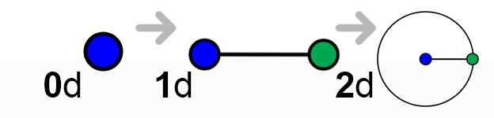
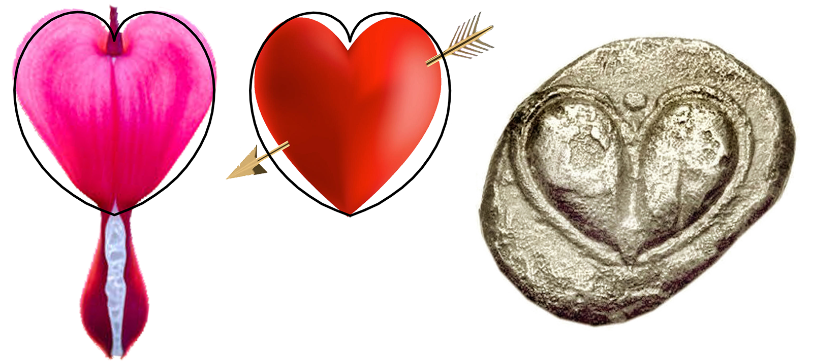

Here is a good example of a how one expression instantiates in various ways.  As usual, we will be describing the modal using geometry as a simple abstraction of the concepts, and we will follow the previously described and simple pattern shown on the right. We begin with a 0-dimension point.  This point moves into the 1-dimensional world, which creates a line. We show this line as the (black) horizontal diameter of a circle in *Figure 1*.  The radius is 90, which is equal to the number of degrees that are required to describe a 2-dimensional plane. This 1-dimensional existence now moves beyond the 1-dimensional world and into the 2D world. That movement will be expressed in both dimensions, just as the 0D to 1D was expressed in both directions of a 1D reality (left and right, or positive and negative).  This means there will be a movement along the 1D X-axis, and a movement along the 2^nd^ dimension of the Y axis.  However, any movement shall always remain centered around the originating 0D point from which it started.  

To illustrate this, we will move the diameter line 5 units to the right, and rotate it around its center point by 5&deg;. This is the first red line.  Now we see that this line of off-center. Where before, as a horizontal line, it was 90 on the left and 90 on the right, now it is 85 on the left and 105 on the right.  It continues its journey in the the 2^nd^ dimension by moving 5 units to the right and another 5&deg; rotation, and it continues to do this until makes a fill circle.

In Figure 1, the outline of the progression is shows, as well as the outline of the original center points which are shows as yellow dots.

What is interesting about this shape is how it so perfectly describes archetypal shape of many thing, from leaves, fruits and the seeds of life to number theory, fractals and even the human brain and pineal gland.  The reason this is interesting is because we have describes a very simple model that we would expect to see in nature, and because this model can make successful predictions we can say there is a valid hypothesis.  What are these salient points of the model?

- Everything begins (emerges, evolves or grows) from a point of 0-dimensional nothingness into a 1-dimensional space, and from there into a higher dimensional spaces.
- Expressions in an dimensional space will utilize all available dimensions; i.e. if given the nature and scope of an instance that is will move X, then in a 1-dimensional spave will will move X in one dimensions. In a 2 dimensional space it will move X in 2 dimensions, etc. In out example, out like moved "5". In the 1-dimensional space that was 5 units of 1D measure, and in the 2-dimensional space, it rotates 5&deg;.
- The point of origin (0D point) remains the center point around which something instantiates, but its virtual location in the lines delineates a boundary that has significance. 

*An interesting historical and cultural footnote regarding this shape is how the the once highly valued silphion plant that is a classic example of an instance of this model, is the origin of our traditional  heart symbol.   This plant was not only known to sure many ailments, it was a natural contraceptive, and so was associated with love and passion. Not only was the plant worth its weight in silver, the Roman's kept 1,500 kilos of it in the treasury as a hedge. Coins were minted with the image the the silphion seed, which had the same shape. Sadly, that particular variety was farmed into extinction, with the last know stalk given to Emperor Nero, as the legend goes.*

