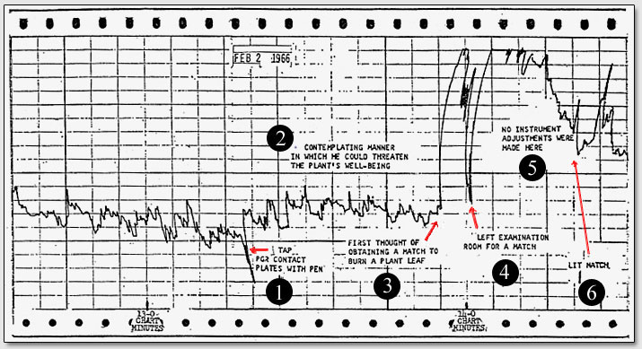
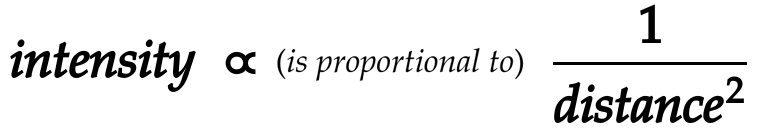

# 11: APPLICATION OF AWARENESS

###### Experiments in Awareness

## Mythology

It may seem odd that *mythology* would be placed in the chapter of how awareness is/can be applied in the real world, but beliefs of any sort are excellent examples of the application of awareness.  Beliefs are perhaps the most common way to channel awareness as they can cohere the otherwise undirected and unrestrained awareness.  In this way, beliefs act like the point of *Definition* in the tholonic trinity, putting restrictions on how that awareness is expressed.  Considering this, it is no wonder that mythologies so closely reflected the archetypes of creation.  From the tholonic view, it was/is the intelligence of these archetypes that vie for that awareness within the arena of human consciousness. Mythologies and beliefs are the earliest form of Man's *conscious will* to have a hand in the creation of his reality.

It may sound childish or even superstitious to suggest that archetypes can have intentions that can result in conflicting and/or cooperative relationships, which implies allies and enemies, and therefore some sort of diplomacy and politics.  In one sense it is childish, in that it leaves so much open to the imagination. In another sense it is childish because beliefs in general are an early form of learning how to use the power of awareness.  Beliefs are the Legos of awareness.  Beliefs are also placeholders that fill in the blanks of our limited understanding of the mechanics of awareness, intention, and intelligence, which is also why they have such a significant effect on our understanding of reality.  

The ancient myths provided a pretty effective way to understand the workings of reality, given the context and scope of our abilities when they were created.  We see these gods and their unending dramas as anthropomorphized concepts of tholonic intelligences and their interactions. As previously stated, tholonic archetypes, like the gods themselves, are autonomous agents in a self-reproducing system.  To get a general idea of the Mexican-soap-opera-of-psychopaths-on-steroids that was the life of the Gods, see Appendix D, “Greek Gods”.  It is short, and quite entertaining.

These two charts compare the hierarchy of the Greek Gods (according to Gaius Julius Hyginus, a scholar born in 64 B.C.) and the same hierarchy of one of many archetypes represented by that deity.

## Sensing Intention

The idea that plants, and presumably other life forms, are sensitive to the feelings and intentions of others within their sphere of influence is not a new idea.  There still exists debate as to  the validity of the *Backster Effect*[^300] and similar popular ideas, such as those in the book *The Secret Life of Plants*, but at the very least, this is an area worthy of more investigation.  The tholonic view is that everything that exists is part of a *Vast Active Living Intelligence System* (to borrow the title of a book by author Phillip K. Dick) that we are calling the Thologram, and consequently, everything *must* be connected to everything else in some way and form.  As our knowledge and our ability to share that knowledge expand, our understanding of reality so too will expand, and in many different directions.  Multiple theories, philosophies, practices, will not only emerge, but each will have their own body of evidence supporting that model. Some will flourish and others will wither away. This is the evolution of perspective.  

Similar to the "Can you prove Australia exists?" problem, at some point we need to choose what or who to *believe* as true or not. While the Backster Effect is soundly grounded in tholonic principles, that alone is not enough to accept it as real.  Perhaps the most convincing support comes from one of the more ingenious scientists of the 20^th^ century, Marcel Vogel.    

Marcel Vogel  (1917 - 1991) was a research scientist for IBM’s San Jose facility for 27 years and was granted a number of patents, from hard-disk magnetic coatings to egg testing.  At age six he was pronounced dead from double lobar pneumonia. He claimed that while he was “dead” he experienced a light and a sense of love and well being that was overwhelming, and this formed the underlying fabric of his life and beliefs. 

With the aid of IBM's state-of-the-art equipment, he replicated the Backster Effect.  Below is the polygraph results that he said made him a “believer”.

Vogel even lectured at IBM on the subject of "Do Plant Have Emotions?", which, in 1969, was a radical concept.  He experimented with plants for some time and discovered a number of very odd and “unscientific” facts.  For example; 

- It was observed that when he released his breath slowly there was virtually no response from the plant, but when he pulsed his breath through the nostrils, as he held a thought in mind, the plant would respond dramatically. 
- The plant's response was the same regardless of distance, as the results were the same when he was in San Jose (where his lab and the plant were), or in Prague, Czechoslovakia, suggesting that the inverse square rule of incoherent energy dispersion,, does not apply to coherent thought.  *Incoherent* energy is any energy that is diffuse, like the sun, or light bulbs, or just about any light source other than a laser, which is *coherent*.
- Plants appeared to respond more to the threat of damage than to the actual damage itself.
- Plants appeared to have many of the same properties as batteries, especially when it came to their interactions with thoughts.
- It was observed that the attitude, or mind-set, of the experimenter had a measurable effect upon the test-results.  This might shed some light on the inconsistent result of the “water memory” experiments of Jacques Benveniste, as related previously.
- He concluded from these experiments that he “learned that there is energy connected with thought. Thought can be pulsed and the energy connected with it becomes coherent and has a laser-like power.”

Because of his young near-death-experience, Marcel believed that the greatest cohering agent is love.  This may be correct.  The tholonic view is that *intention* is the basis of reality and creation, but nothing is said about what that intention is because the tholonic model suggests that *any* intention is equally valid.  However, it's reasonable to imagine that some intentions are more effective than others for a specific outcome.

Such ideas did not endear him to the scientific community, but this discovery opened many new doors of investigation for Marcel, especially in the areas of crystals and water, with some very impressive (anecdotal) results.  Needless to say, this not only set him apart from his fellow scientists, but ensured his obscurity.

## Maharishi Effect

Given the general direction of mainstream science, we do not see a lot of investigation into how thought affects external reality, but some do exist *(see items 3 and 4 in "Other Experiments" list below)*.  We will look at one research report here, *“Effects of Group Practice of the Transcendental Meditation Program on Preventing Violent Crime in Washington, D. C.: Results of the National Demonstration Project, June-July 1993”*[^160] published in the journal *“Social Indicators Research.”*

This study, which was monitored by a 27-member project review board comprised of independent scientists and leading citizens, found that there was a significant statistical result.

What was this study exactly?

> This study presents the final results of a two-month prospective experiment to reduce violent crime in Washington, DC.  On the basis of previous research, it was hypothesized that the level of violent crime in the District of Columbia would drop significantly with the creation of a large group of participants in the Transcendental Meditation® and TM-Siddhi® programs to increase coherence and reduce stress in the District.[^161]

Here, the word “coherence” refers to its definition of “*the quality of forming a unified whole*.”

The results were impressive.

##### 

This is only one study, so it is not definitive, but it is certainly supportive of the idea that directed intention, what the participants called *coherence*, and what we are calling *order* (as that is what unifies the parts into the whole), has an extended effect.  The explanation, according to the tholonic model, is that the directed energy of coherent thought altered the curves of various archetypes thereby altering the probability of where the “work” will produce the most order, or where and how energy will be expressed across a scope’s spectrum.

### On a Personal Note

I had a particularly insightful experience with the Maharishi Effect back in the late ’60s when I was a young teenager.  My father was a captain of industry in the world of electrical components, ultimately becoming president of one of the pioneering companies that helped create the first integrated circuit.

Born of poor Scottish immigrants in the Bronx on the tail of the Great Depression, and serving in Korea, he was no stranger to hard times and hard work, which made him one of the most pragmatic and practical people I have ever known.  He was a devout capitalist, atheist, and husband, and had no patience for anything that did not produce results.  Hippies were idiots, imports were ruining the economy, Scotch whiskey was better, and talking about your problems was for whiners.  You get the picture.

At the insistence of his wife (and my mother), he joined her for a seminar on *Creative Intelligence (CI)*, which was what they called Transcendental Meditation back then for those folks like my father.  He heard their claims about improved mental and physical health, better focus, fewer distractions, etc.  He decided to test their claims by giving all his employees in one of his factories CI training, along with an extra half-hour at lunch break for them to take this training and practice their new CI skills.

This factory was in a poor, rundown industrial town in New England, and the people that worked in those factories were uneducated, unskilled, assembly-line laborers - not exactly an open-minded demographic.  I knew a number of them myself, as we lived in that town, and many never made it past 4^th^ grade.  The rivers in this town were dead from all the pollution, and the neighboring town had the highest *per capita* suicide rate in the United States.  It was a dreary, dark place filled with dreary, dark people.

His peers in the industry thought he was being foolish to deploy such a plan, but the results were astounding.  People were fighting less, taking less sick leave, injuries were down, production went up; in general, everything improved.  So much so, that the Wall Street Journal did an article on him and his “revolutionary” new technique.  He became known as some kind of New Age Industrialist, which was ironically funny as he was as new age as his ’57 Chevy.

Ultimately, this new concept was unsustainable in that environment because eventually people began to abuse the extra time meant for CI, and everything went back to *normal* with sick leaves, fighting, injuries, and lower production, so the program was scrapped.

## Prayer

You might be thinking that traditional prayer holds the same power, but it does not.  Why? Because most prayer is anything but coherent.  Prayer means very different things depending on culture, religion, personal perspectives, etc.  Perhaps this is a side-effect of monotheism, which eliminated the myriad of niche gods.  In any case, prayer can be anything from begging to demanding, justifying to virtue signaling, and occasionally it can be an expression of gratitude and love, but using group prayer to effect change is like using a group of blind people to paint a room by throwing handfuls of paint at the wall.  Your room *will* get painted, but you’ll wish it didn’t.

This was recently confirmed by a &dollar;2.3-million-dollar study on the effect of prayer on the sick, involving over 1,800 patients.  It was the largest study of its kind ever undertaken.  Contrary to prayer helping the sick, they found that when a patient knew others were praying for them, they tended to have *more* complications.[^162]

There are other studies that conclude the exact opposite, such as Dr.  Byrd’s study “*Positive Therapeutic Effects of Intercessory Prayer in a Coronary Care Unit Population*”[^163] and Dr.  Harris’s  study “*A Randomized, Controlled Trial of the Effects of Remote, Intercessory Prayer on Outcomes in Patients Admitted to the Coronary Care Unit*”[^164].  However, without a detailed comparison of the studies, and specifically the manner in which the participants prayed, we cannot know to what degree coherence was at play.

The difference between the coherence of Transcendental Meditation and prayer is the former follows a very specific set of rules, has a beginning, a middle and an end, has a clearly defined non-personal target subject, and never attempts to force change.  Prayer can follow these same rules, but it rarely does because there are no rules to prayer and varies greatly depending on culture, tradition, perspective, intention, etc.

The practice of *coherent prayer* is common among metaphysical secret societies.  For example, in the not-so-secret society of the *Order of the Rosy Cross*, or *Rosicrucians*,  members who have reached a certain level of initiation are introduced to a schedule of “prayers”. This is a globally synchronized schedule of times when people are requested to focus their energy on a particular topic, such as health or family or finances, and in a specific manner.  If one is not in need, they send their benevolence into a “pool” of energy specific to that topic.  If one has a need in these areas they can join in at the scheduled times and “tap into” that pool.  This is a very coherent technique because it has specific archetypal and sustainable patterns of energy, and it (reportedly) works surprisingly well.

The effect of the *Consciousness Field*, as it is referred to by Roger Nelson of Princeton University and director of the *The Global Consciousness Project*, is not limited to humans, but can affect matter and machines *(see first two items listed below).*

## Other Experiments

Here is a very short list of books and papers that delve into experiments and perspectives that explore awareness and reality and are compatible with tholonic claims:

- *Double-Blind Test of the Effects of Distant Intention on Water Crystal Formation.*[^165]
- *FieldREG Anomalies in Group Situations*.[^166]
- *Test of a field theory of consciousness and social change*. [^167]
- *International Peace Project in the Middle East: The Effects of the Maharishi Technology of the Unified Field.*[^168]
- *The Intention Experiment,* Lynne McTaggart
- *Groundbreaking New Results in Consciousness, Quantum Brain & Nonlocality Research,* Maoxin Wu
- *Conditioning of Space-Time: The Relationship between Experimental Entanglement, Space-Memory and Consciousness.  Journal of Nonlocality Round Table Series, Colloquium \#4*, Rajendra Bajpai and +2
- *Radiant Minds: Scientists Explore the Dimensions of Consciousness*, Juanita Ratner
- *Extrasensory perception and quantum models of cognition*, Patrizio Tressoldi and +2
- *The relationship between local geomagnetic activity, Tibetan Buddhist meditation and psychic awareness: Preliminary study*, David Luke
- *Phenomenological Convergence between Major Paradigms of Classic Parapsychology and Cross-Cultural Practices: An Exploration of Paranthropology*, Jack Hunter
- *An investigation into the cortical electrophysiology of remote staring detection*, Paul Stevens
- *Geomagnetic Field Effects in Anomalous Dreams and the Akashic Field*, Stanley Krippner
- *The relationship between local geomagnetic activity, meditation and psi.  Part I: Literature review and theoretical model*, David Luke and +1
- *Eleonore Zugun: the Re-Evaluation of a Historic RSPK (Recurrent Spontaneous Psychokinesis) Case*, Peter Mulacz
- *Intention,* Jeanne Lim

## Are Archetypes Alive?

If ideas are archetypes that have energy and fields, then it would be reasonable to think that an idea could be reinforced and strengthened by adding more energy to it.  How would one go about adding energy to an idea? If awareness is energy, then one obvious way would be to simply increase the awareness that an idea is exposed to.  This sort of thing is done all the time.  Take, for example, National Prayer Day in the U.S. (May 7th) when the President signs a proclamation encouraging all Americans to pray on this day and “turn to God”.

Now, imagine the potential power of 114,000,000 consciousnesses all being exposed to the same symbolism at the same time. This is exactly what happened during the broadcast of Super Bowl XLIX (2014), but unlike National Prayer Day where the participants voluntarily focused their awareness towards one idea, it was more like a National Awareness Harvesting Minute of the awareness of the 114,000,000 unwitting participants.  Unlike the barrage of commercials and propaganda we are subjected to on a daily basis, this particular event was unique. According to a very suspicious article[^169] that was written by a conveniently anonymous designer who claimed to have once worked in the graphics department of a huge media company, out of boredom and his opposition to the then administration of President Bush, he deliberately hid pyramid eyes, pentagrams, and symbols from John Dee, the infamous sixteenth century occultist to the Queen of England, into the intro and promo videos for everything from war events to major sports events, including Super Bowl XLIX. Ignoring the question of why the designer thought secret occult symbols were a good choice to subliminally oppose President Bush, it was not the claim that was suspicious, as with just a little investigation his claims can be confirmed, but that this published article, which appeared overnight on over 36,000 websites, conveniently provided a “plausible deniability” defense for the media companies when Internet sleuths were discovering these symbols. Regardless of the intentions of those responsible, the effect was that a tremendous amount of awareness, albeit unconscious awareness, was pumped into these images; images that have existing archetypes, and therefore, according to the tholonic model, their own awareness, intention and intelligence.

Considering the average American youth spends 900 hours a year in school, and another 1,200 hours a year watching television, and that 70% of the American adult waking life is spent in front of digital media, [^170] and that the average 78.6 year old American will spend nine years of his life watching TV, two years of which is just watching commercials, we're talking about a tremendous amount of awareness up for grabs. How is that currently being used? 

The more pessimistic reader might begin to suspect that the manipulation of awareness as energy is perhaps already well understood by some less-than-noble folks. Others may think this is bordering on mystical conspiracy theories.  The reader will come to their own conclusions. Our intention is to question the effects of such awareness harvesting, especially in light of the understanding that ideas have a life of their own. This includes ancient ideas, even if they seem to have been forgotten by modern society.

We have the ability to tap into these archetypal realities whenever we like or need, and often do unconsciously. This is the purpose and power of myths, be they ancient or modern. As these archetypes originate in the uninstantiated tholonic state, they are free from the limitations of our space-time reality, and therefore they are eternal, or at least, long-lived. The myths and beliefs of the ancient past continue to live on in ever-evolving meaning and symbolism that promote their existence, almost like a self-mutating virus. This is the source of talismanic, totem or symbolic “magic” and the invoking of deities, intelligences, energies, be they “good guys” or “bad guys” (although it’s often hard to tell them apart).

Much of our everyday culture is inextricably bound to these archetypes and thereby further empowering them, usually without our knowledge. Jung described these archetypes as “ordering factors in the collective unconscious”. These are the twelve archetypes of the human psyche organized into four cardinal types, which we described earlier.

For example, the modern word “hell” comes from the ancient Norse goddess named *Hel* whose job it was to not only judge the dead but also help the apocalypse along by leading an army of the dead in a ship made of the fingernails of corpses.

The concept of Hell, or whatever it happens to be called, is deeply ingrained into the worldview of billions of people who have little knowledge of the roots of their beliefs. These believers, through the energy of their awareness, bring into creation associated or parasitic archetypes that are attached to primary archetypes which they are completely unaware of, but which are energized by that awareness nevertheless. While this can’t be proven, I suspect that the more people who believe in hell, the more empowered and manifest the concept of an apocalypse. The ironic part is that believing in the traditional Christian or Islamic heaven by default empowers their concept of a hell, as they are presented as two side of one state, the afterlife.

Looking at the non-intuitive, humorous, and bizarre ways ancient and modern concepts have formed relationships will give just a hint of how intertwined archetypes can become.  For example, we can draw a very straight line of connection from the invention of hieroglyphics and moon worship to pharmaceutical drugs and those vacuum sealed plastic bags of imported Colombian coffee you buy at the supermarket, connecting along the way with magicians, pyramids, thieves and secret societies. The super-short version goes something like this: The Egyptian moon god, Thoth, who invented hieroglyphics, was adopted by the Greeks who called him Hermes, who was among other things, the protector of thieves. He carried the Caduceus, which became the symbol of modern medicine, and was the founder of the super-secret mystical teachings of Hermetism. So protected were these teachings that the word *hermetic* became synonymous with *perfectly sealed*, hence, *hermetically sealed* bags.  Language, as a way to convey concepts, is a microcosm of how archetypes merge, evolve, and reproduce. 

What we have referred to as an uninstantiated tholon can, at least in this context, be an archetypes as a form of *metameme*, which is a form of a *meme* that only exists in the collective unconscious and/or in the world of archetypes, the thologram. If a meme is “an idea, behavior, style, or usage that spreads from person to person within a culture”, then a metameme is an “an idea or belief formed within the tholonic field (i.e. universal mind,  collective unconscious, morphic field, etc.) and spreads from tholonic field to tholonic field”.   

You make have heard phrases like  “If it looks like a duck, and quacks like a duck, its probably a duck.”, or “When you hear hooves, think horses, not zebras.”, or “The simplest explanation is most likely the right one”, otherwise known as *Occam’s Razor*. Applying the wisdom of this advice, what are we to make of the fact that research out of Princeton University supports the theory that ideas, in the form of social media networks, follow the same growth models as viruses (in the form of diseases)? [^171] Outside of the conclusion that perhaps Facebook is actually a viral disease, it tells us that ideas follow the same patterns as existing natural patterns of growth, suggesting we might learn more about the life of archetypes if we considered them living.  OK, viruses *may* not be “alive”, but I say *may* because some experts in the field are redefining “life” to include viruses. [^172]^,^ [^173] Regardless, the growth, survival and creation of ideas follow the same patterns as everything else that grows, survives and creates. For this reason, a clever researcher might be able to find correlations between the life cycle of a galaxy and something as seemingly unrelated as, say, the life cycle of a tomato plant. One such researcher might be Tokyo Institute of Technology’s Maruyama Shigenori, a leading geophysicist and founder of the Center for Bio-Earth Planetology, who, by connecting the theories of astronomy with those of the life sciences, has shown how entire planets may well be living super-organisms.

This idea that archetypes are alive, however, has a dark side to it because so many of our beliefs are manipulated and controlled by others whose agenda is less than altruistic, hidden, and who are aware of the mechanics of reality and consciousness. From the most powerful laser in the world named after the Hindu god of destruction to trivial tarot cards based on movie stars, we can find countless examples of how these imposed archetypes infiltrate our understanding of the world.

So, what kind of world are we creating with our awareness, desires, and beliefs, as a planet? To find out, I wrote a mobile phone app that allows people to send out into the universe either a blessing or a curse.  The app was (unsurprisingly) called “Bless or Curse”.

The majority of both blesses and curses are about…wait for it…love, money, and health (surprise!). Some were touching, such as the blessing of “May he win lotto,” cast upon the bus driver who “stopped just for me”. Some are bizarrely dark, such as the curse of “Torture Rape Murder die die die die die,” cast upon Noisy Walgreen Employees.

Humanity seems to be pretty well split down the middle between the *blessers* and the *cursers*, as you can see by this report map below. In general, it tended to hover over the 53% area, giving the *blessers* a slight edge over the *cursers*.

## Tulpas

One of the better legends of how ideas can take on a life of their own comes from the well-known 1932 book, *Magic And Mystery In Tibet*, by Belgian-French explorer Alexandra David-Neel.

In the Far East, there is the concept of a *tulpa*, which is a type of thought-form. They are understood to be a sentient consciousness that resides in the brain of the host and can have separate feelings, thoughts, and memories from the host and can communicate through thought, imagination, feelings, or verbally. With enough practice and concentration, the host can see the tulpa’s form in the real world, and for the truly advanced *tulpamancer*, can be seen by others as well. Of course, this is a preposterous idea to Western thinkers. 

Alexandra David-Neel was a woman of remarkable courage. She recounts how the only way she could enter the forbidden (to foreigners) city of Lhasa, Tibet, was to sneak in dressed as a beggar carrying only a compass, money (for ransom in case she was kidnapped), and a gun. She was also known for her sound scientific thinking and her opinions and observation carried weight in academic and scientific circles. Doctor A. D’Arsonval, a member of the French Academy of Sciences, The Academy of Medicine, professor at the College of France and president of the Institute of General Psychology, said of Alexandra David-Néel:

> This well-known and courageous explorer of Tibet unites in herself all the physical, moral and intellectual qualities that could be desired of one who is to observe and examine a subject of this kind.[^174]

So, when she described how she used the techniques taught to her by the Tibetan magicians to conjure up her own *tulpa*, it is not as easy to discard them as pure fantasy. In her case, she manifested a short, pudgy, jolly monk, as per her intentions.  Perhaps even more interesting was that this tulpa, once it began to be visible to others, began to have its own free will, a life of its own; the jolly, fat monk began to grow lean and taller, and less jolly. It eventually became a major problem for her, and she had to spend six months “dissolving” it. As she states:

> The fat, chubby-cheeked fellow grew leaner, his face assumed a vaguely mocking, sly, malignant look. He became more troublesome and bold. In brief, he escaped my control. I ought to have let the phenomenon follow its course, but the presence of that unwanted companion began to prove trying to my nerves; it turned into a ‘day-nightmare.’ Moreover, I was beginning to plan my journey to Lhasa and needed a quiet brain devoid of other preoccupations, so I decided to dissolve the phantom. I succeeded, but only after six months of hard struggle. My mind-creature was tenacious of life. There is nothing strange in the fact that I may have created my own hallucination. The interesting point is that in these cases of materialization, others see the thought-forms that have been created.

Whether tulpas exist or not is left to the reader. The point is that the belief that ideas can take on a life if their own is neither new nor unique.

On a related note, keep an eye on the research into what is essentially the collective consciousness of artificial intelligence, or *A.I. Swarms*, as they are called,[^175]^,^ [^176] and the early attempts to create artificial humans.[^177] Science and technology is attempting to create their own “tulpas”, and one day they may also prove to be “more troublesome and bold, escaping our control.”

[^160]: Hagelin, John S., Rainforth, Maxwell V., Cavanaugh, Kenneth L. C., Alexander, Charles N., Shatkin, Susan F., Davies, John L., Hughes, Anne O., Ross, Emanuel, Orme-Johnson, David W., **Effects of Group Practice of the Transcendental Meditation Program on Preventing Violent Crime in Washington, D.C.: Results of the National Demonstration Project, June--July 1993,** Social Indicators Research,,8 June 01,1999 <https://doi.org/10.1023/A:1006978911496> Full report available at <http://www.istpp.org/crime_prevention>
[^161]: “**Reduced Violent Crime in Washington, DC.**” Research Reduced Violent Crime in Washington DC Comments, <https://research.mum.edu/maharishi-effect/reduced-violent-crime-in-washington-dc>
[^162]: Carey, Benedict. “**Long-Awaited Medical Study Questions the Power of Prayer.**” The New York Times, The New York Times, 31 Mar. 2006, <https://www.nytimes.com/2006/03/31/health/31pray.html>.
[^163]: Byrd, Randolph C. “**Positive Therapeutic Effects of Intercessory Prayer in a Coronary Care Unit Population.**” Southern Medical Journal, vol. 81, no. 7, 1988, pp. 826-829., doi:10.1097/00007611-198807000-00005. <http://www.godandscience.org/apologetics/smj1.html>
[^164]: William S. Harris, PhD; Manohar Gowda, MD; Jerry W. Kolb, MDiv; et al, **“A Randomized, Controlled Trial of the Effects of Remote, Intercessory Prayer on Outcomes in Patients Admitted to the Coronary Care Unit"Correction.”** Archives of Internal Medicine, vol. 160, no. 12, 2000, p. 1878., doi:10.1001/archinte.160.12.1878. <https://jamanetwork.com/journals/jamainternalmedicine/fullarticle/485161>
[^165]: Radin, D., G. Hayssen, M. Emoto, and T. Kizu. “**Double-Blind Test of the Effects of Distant Intention on Water Crystal Formation.**” National Center for Biotechnology Information. September 2006. Accessed May 30, 2016. http://www.ncbi.nlm.nih.gov/pubmed/16979104.
[^166]: Nelson, R.d., G.j. Bradish, Y.h. Dobyns, B.j. Dunne, and R.g. Jahn. “**FieldREG Anomalies in Group Situations.**” EXPLORE: The Journal of Science and Healing 3, no. 3 (2007): 278. doi:10.1016/j.explore.2007.03.013.“We attribute this result to a real correlation that should be detectable in future replications. This study suggests the existence of some form of consciousness-related anomaly in random physical systems.”
[^167]: Dillbeck, M.C. **Test of a field theory of consciousness and social change: Time series analysis of participation in the TM-Sidhi program and reduction of violent death in the U.S.**. Soc Indic Res 22, 399-418 (1990). https://doi.org/10.1007/BF00303834
[^168]: Orme-Johnson, D., Alexander, C., Davies, J., Chandler, H., & Larimore, W. (1988). **International Peace Project in the Middle East: The Effects of the Maharishi Technology of the Unified Field. The Journal of Conflict Resolution**, 32(4), 776-812. Retrieved August 24, 2020, from http://www.jstor.org/stable/174032
[^169]: Anonymous. “**I Hid Illuminati Symbols in Broadcast News Graphics Because I Was Bored.**” Hopes&Fears. 2015. Accessed May 30, 2016. http://www.hopesandfears.com/hopes/now/media/214739-illuminati-conspiracy-news-hidden.
[^170]: Average time Americans adults (18+) send with electronic media Q4 2014. Source: Neilsen.
[^171]: Cannarella, John, and Joshua A. Spechler. “**Epidemiological Modeling of Online Social Network Dynamics.**” Department of Mechanical and Aerospace Engineering, Princeton University, Princeton, NJ, USA, January 17, 2004. http://arxiv.org/pdf/1401.4208v1.pdf.
[^172]: Forterre P. (2010). **Defining life: the virus viewpoint. *Origins of life and evolution of the biosphere : the journal of the International Society for the Study of the Origin of Life***, *40*(2), 151–160. https://doi.org/10.1007/s11084-010-9194-1
[^173]: Pearson H. '**Virophage**' suggests viruses are alive. *Nature*. 2008;454(7205):677. doi:10.1038/454677a
[^174]: Goodrich, Chauncey S., and Alexandra David-Neel. “**Magic and Mystery in Tibet.**” Journal of the American Oriental Society 93, no. 3 (1973): 415. doi:10.2307/599607.
[^175]: Orkin, Jeffrey David. “**Collective Artificial Intelligence: Simulated Role-playing from Crowdsourced Data.**” Master’s thesis, MASSACHUSETTS INSTITUTE OF TECHNOLOGY, 2013. Accessed May 30, 2016. http://alumni.media.mit.edu/~jorkin/papers/orkin_phd_thesis_2013.pdf.
[^176]: Fisher, Len. **The Perfect Swarm: The Science of Complexity in Everyday Life.** New York: Basic Books, 2009.
[^177]: Jef D. Boeke,George Church, Andrew Hessel, Nancy J. Kelley, Adam Arkin, Yizhi Cai, Rob Carlson, Aravinda Chakravarti, Virginia W. Cornish, Liam Holt, Farren J. Isaacs, Todd Kuiken, Marc Lajoie, Tracy Lessor, Jeantine Lunshof, Matthew T. Maurano, Leslie A. Mitchell, Jasper Rine, Susan Rosser, Neville E. Sanjana, Pamela A. Silver, David Valle, Harris Wang, Jeffrey C. Way, Luhan Yang. “**The Genome Project–Write.**” Science. June 2, 2016. Accessed June 10, 2016. doi: 10.1126/science.aaf6850. http://science.sciencemag.org/content/early/2016/06/03/science.aaf6850.
[^300]: Backster, Cleve & Karron, Db. (1968). Evidence of a Primary Perception In Plant Life. 10. 