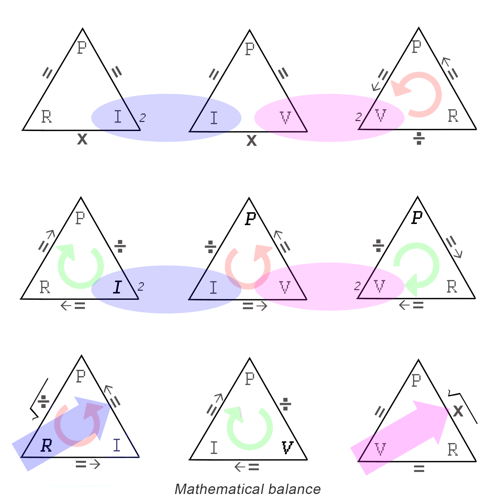
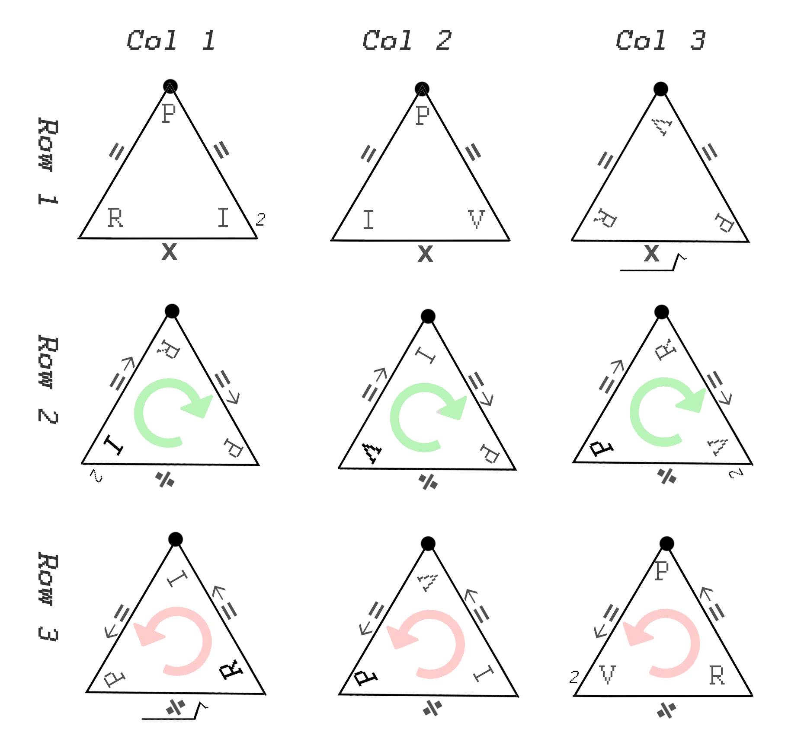

# B - Tholonic Math

###### The archetypes of Form follows function

One of the fundamental claims being made here is that a coherent and stable expression of energy, in order to be sustainable, must satisfy a number of prerequisites that will ensure its sustainability.  It&rsquo;s a bit like existential bureaucracy, in that if the proper application for existence of not filled out completely and accurately, the request is denied.

Within the tholons are numerous relationships.  The ones we have used in our examples are the twelve formulas that define one instance of Newton&rsquo;s 2^nd^ law, Ohm&lsquo;s Law.  If we map these formulas to the tholon using the reasoning described earlier, we get the following:

This shows the four trigrams that make up a tholon, however, depending on the perspective of view of the tholon, the formulas will be different.  Besides the basic twelve formulas, we also see that there is a &ldquo;direction&rdquo; to some of the formulas, counter-clockwise (*left-handed*), and clockwise (*right-handed*).  We can see in the &ldquo;Sides&rdquo; column above there are 3 left-handed, 3 neutral, and 3 right-handed.  If we include the &ldquo;Base&rdquo; there are 3 left-handed, 4 neutral, and 5 right-handed.

We can enhance this diagram by showing the relationship between values that are squared and values that are square-rooted using only the *real* trigrams (i.e.  ignoring the base, *virtual*, trigram).

Here we see that wherever two corners share the same value one of those two values is squared as long as it is not the product of a square-root.  So, in **Row 1** and **Row 2** we have *I* and *V* that are squared, but in **Row 3** then we have *I* and *V* that are the products of square-roots, and are therefore not squared, which shows that the tholon naturally balances itself.

Every trigram has one edge that is a function (multiply or divide).  If we order the (*real*) trigrams by these functions we get the following:

We see that we have 3 multiplications and 6 divides, which makes sense when you consider that multiplication works the same in both directions (3&times;2=2&times;3), but division only works in one direction (because ), so we need twice as many divisions to represent the results of multiplication.

We also see (in the image above) that in the trigrams that in the division-based rows (2 & 3), three of them have clockwise flow, three of them have counterclockwise flow, and the multiplication-based row (1) flow in either direction.

In the figure above we show the three perspectives of a 2D tholon map.  Notice that the outer boundaries of each figure show a consistent direction of flow, ***Fig.  v1*** being neutral, ***Fig.  v2*** clockwise, and ***Fig.  v3*** counterclockwise, which matches the direction of the sides, however, the base (center trigram) is always counter-clockwise or neutral.

Tholonically, we can easily map things like Ragone and utility space (as in the battery example), or *laws* and *social responsibility* (as in the example of society), to a simple trigram, but it is not yet clear, to me at least, what the equivalent social expression of *I^2^* or  would represent.  There are quite a lot of relationships, rules, and formulas in a tholon that need more understanding.  What is presented here is meant to show how the patterns of these fundamental relationships can be modeled into a tholon/tetrahedron, which can then be applied to many other contexts.

