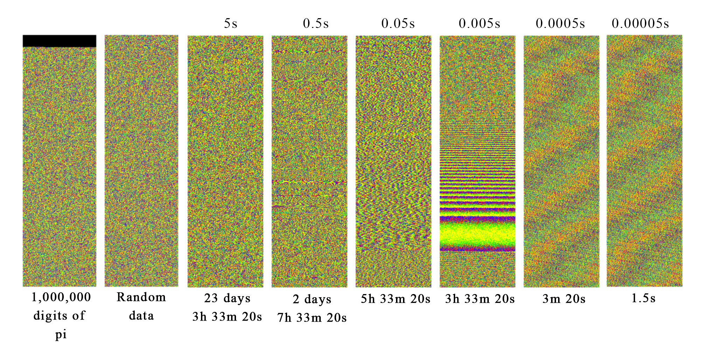
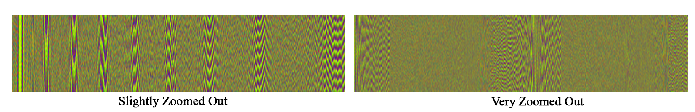
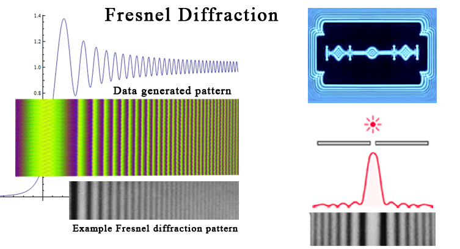
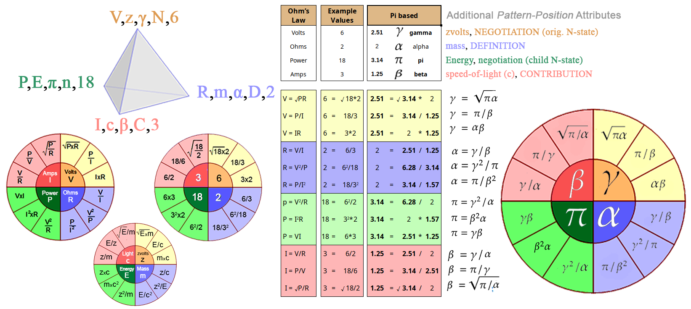
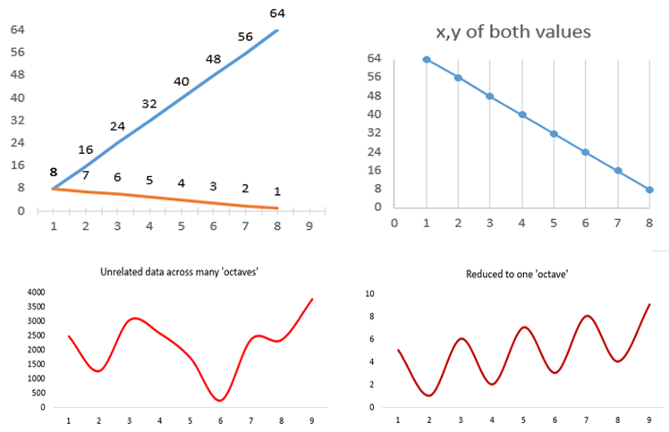
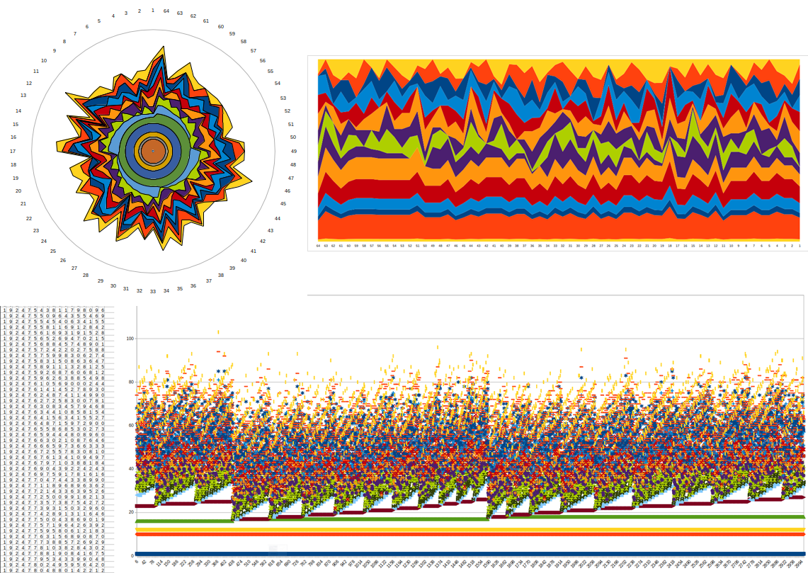
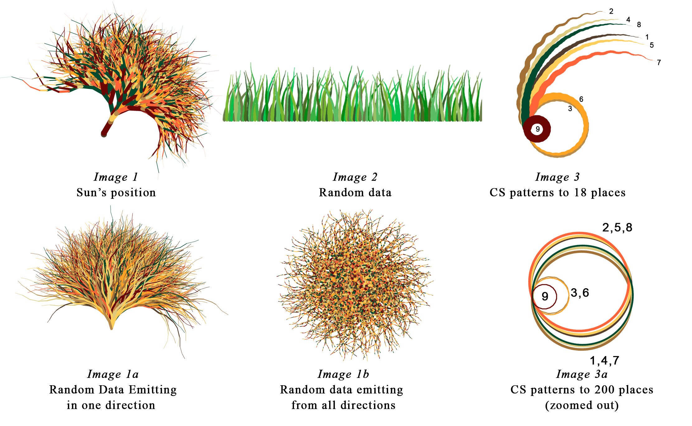

# C - An Unexpected Pattern

###### What is this pattern and why does it exist?

In the course of writing this book there was the need to generate sets of number from other sets of numbers.  In one case, the results presented a very unexpected pattern.

Numbers were generated by periodically calculating the longitudinal position of the Sun and the Moon (from Earth&rsquo;s coordinates of -34.61262S, -58.41048W, Buenos Aires, Argentina on the 24^th^ of each month at 5:31:07 PM UT) down to 10^-15^  radians.  The individual digits of these two values were then concatenated, or cross-summed.  For example, the Sun&rsquo;s longitude in radians at one moment was 4.2430033683776855, and the Moon&rsquo;s position at that same moment was 2.399298667907715.  These were then cross-summed until they are reduced to a single digit value.

- 4+2+4+3+0+0+3+3+6+8+3+7+7+6+8+5+5=**74**
- *2+3+9+9+2+9+8+6+6+7+9+0+7+7+1+5=**90***
- *74+90=**164***
- *1+6+4=**11***
- *1+1=**2***

Millions of samples were recorded and reduced to one number.  The input data of the Son and Moon positions was perfectly non-random and linear, but the single-number series of data was &ldquo;mostly random&rdquo; according to the *Chi squared* results of a randomness test[^195].  Below shows the test results of the single-number data and data from a random number generator (RNG), for comparison[^196]^,^ [^197].

Next, each single digit number was assigned a color from the spectrum and then plotted such as each dot occupied a pixel on one line, and when that lines was full, the plot advanced to the next line, just like a dot-matrix printer.  This was a extremely simple plot.  The below-left plot shows only one number being plotted at a time, and the below-right plot shows cumulative numbers.  The distribution of the numbers within the data set of 33,000,000 is shown in the bar chart.

Much to our surprise, this resulting pattern matches that of a *Fresnel diffraction*.

At the rate we were sampling, each position of each &ldquo;planet&rdquo; was only about 7x10^-8^ radians further than the previous position sampled.  This equates to about 23 kilometers of movement for the Sun and only 64 millimeters of movement of the Moon, but when measuring to 10^-15^ the numbers were radically different for each sample.

When cross-summing numbers the place of each digit is insignificant, so 123 and 321 are the same as they both cross-sum to 6.  Because all the digits in a cross-summed value have equal significance, the slightest measurable movement of the sun is equal to the movement of the two-thousand years it takes to pass through a constellation.

Before we plotted the values simply as colors, but when we use the actual valued of the cross-summed numbers (Y-axis), each number advancing one step across the X-axis (time), we get a different perspective, as seen in the top images below.  The bottom image is the same plot but only using the differences between each number.

This plot uses 300,000 cross-summed data points that covers 25 minutes of observation.

The first image is not a Fresnel pattern, however it is the cross-sectional diagram of an actual Fresnel lens!

This raises questions like:

- Where do these patterns come from?
- Do they tell us anything about the thing being measured?
- Given that these patterns describe the propagation and near-field diffraction of light (i.e.  Fresnel diffraction), can we apply any other attributes of light to whatever we are observing?

**Addition details for the curious**

Below are some of the visual results of the plot, which are added here just because they are interesting.

Plots of data captured every 0.005 and .01 seconds.  This only used prime number cross-summed results (2,3,5,7), but the results were the same when using all number 0-9.  These twelve plots represent sampled data from each month of the year at the same time.

It is interesting to see how the 0.005s and 0.01s give generally similar results.

If we change the time between samples from microseconds to days, we see another pattern.  Below are ten sets representing ten months with the same starting point as the sets above, but each pixel represents an entire day (86480 seconds), i.e., the position of the Sun and the Moon was recorded only once a day.  This means that the entire set represents 1,095 years.  Each plot looked almost identical and appeared completely random, but upon closer examination, they were not random at all.  It is clearer to see the pattern if we only show the blue dots of a small section of the image.

My first assumption was the farther &ldquo;out&rdquo; we zoom, in time, the clearer the patterns, but it seems to be the exact opposite;  the smaller the time delta, the larger the pattern.  This might make sense if we were looking at the linear difference between, say, 1.234567 and 1.2345678, as the difference would be 0.0000008, and such a small change would need a lot of samples to make itself apparent, but this does not apply here because we are cross-summing the numbers together so the place of the digit is meaningless.

Below is a comparison of the patterns at each scale.  The values beneath each image is the interval sampling time, and the values below that is the entire duration of the sample.  No obvious pattern can be seen at 5s, but a slight pattern begins to emerge at 0.5s, becomes more clear at 0.05s, and is most dominant at 0.005s.  A pattern is equally visible in 0.0005s, but it appears only as a simple oscillation or wave.  0.00005 is identical to 0.0005 because (it seems that) once we start going below 0.002 we hit the limits of resolution.  This is the point where we begin getting duplicate data because the Sun or Moon has not moved enough in the small amount of time between samples, and the smaller we go the more duplicates we get.  For example, at 0.00001 second intervals of sampling , to get the 155,520 unique data points to create the graph, we need to sample 50,000,000 times.  This simple wave pattern is the first wave pattern we can detect (given the limitation of my laptop and/or the ephemeris used to calculate planetary positions).  This simple wave pattern is what then evolves into the more complex patterns.  Presumably, the difference between samples points in the wave patterns is only the rightmost last digit being increased by 1, given that we keep sampling until er get the next or unique number.

How do we have patterns when we sample of 0.01, but nothing (significant) when we sample as .05?  I think this has to do with where we are sampling from within the entire pattern.  The two images below shows that the Fresnel pattern is slightly altered with time, but eventually returns.  At its most ordered point it looks like Fresnel diffraction, but at its least ordered pint it looks identical to pure random data (but we know it is just as ordered, only difficult to see that order).

When the data is sampled we have no idea where within the cycle of repeating patterns we are, so it is only by chance that we will end up in an ordered section.

For those not familiar with Fresnel diffraction, it is the way that light interferes with itself as it travels around the edge of an object

**Digging Deeper**

Having no idea where to look for more information I posted this to various mathematics forums, and even though the question was read my many, no one had an answer.  I then sent this question to my old friend who is an accomplished physicist, but who also considers these speculative ideas to be a waste of time, so I knew any answer he gave would include an unabashed commentary on the silliness of it all.

He did not disappoint on either front.  I&rsquo;ll forego the commentary and just focus on the relevant part of his reply, which was very short.  Essentially he told me that no matter how hard you try to create random numbers from non-random data, you will always end up with some sort of a pattern.  &ldquo;Why?&rdquo; was my naive response, to which he replied only &ldquo;Look into Zipf&rsquo;s Law&rdquo;.

Zipf&rsquo;s Law is (from Wikipedia):

>  an *empirical law*… that refers to the fact that many types of data …can be approximated with [certain types of] power law probability distributions.  Zipf distribution is related to the *zeta distribution*, but is not identical.

There are two very significant points in this definition.  The first is that it is an *empirical law.*  Something is called an *empirical law* when it can be observed but science has no clue why.  The second important detail is that *Zipf distribution* is related to *Zeta distribution*.  We&rsquo;ll get to that in a moment.

Zipf&rsquo;s Law was not discovered by physicists or even within the hard sciences.  It was a French stenographer, Jean-Baptiste Estoup (1868 - 1950) that first discovered the patterns of words which became Zipf&rsquo;s Law after it was popularized by the American linguist George Kingsley Zipf (1902 - 1050).

It seems that languages, all languages, from every corner of the world, both modern and ancient, follow Zipf&rsquo;s law in the way words are distributed in both writing and speaking (and by inference, some implicit pattern in the way we think).  We don&rsquo;t need to drill into the details, but what is significant is that this same distribution pattern is also seen in city populations, solar flare intensities, protein sequences and immune receptors, the amount of traffic websites get, earthquake magnitudes, the number of times academic papers are cited, last names, the firing patterns of neural networks, ingredients used in cookbooks, the number of phone calls people received, the diameter of Moon craters, the number of people that die in wars, the popularity of opening chess moves, even the rate at which we forget… and countless more.[^198] 

 

In short, Zipf&rsquo;s law is an example of *power laws*, and power laws touch everything in existence in one way or another.  But what does this have to to with anything?  This is where the second point applies.  The charts above are called *Zipf Distributions*, and they all have different scales of values based on the kind of data being sampled.  If we reduce all the scales to 1, we have what is called a normalized *Zipf distribution*, also known as a *Zeta distribution*.  Mathematicians use the *Riemann zeta function (RZF)* to study and test these distributions.  This function is written as  **ζ(*s*)**, where ***s*** is any complex number other than 1.

Related sidenote, using just prime numbers you can also determine &pi;, but this has nothing to do with RZF:  .

One of the useful features of the RZF is that is can turn a *divergent* series of numbers (numbers that when you add then together approach infinity) into a *convergent* series (when the sum approaches a specific value, like  or ).  It can do this does because the hypothesis uses the concept of *analytic continuation* and *complex numbers*.  You can play with this function using an online Riemann Zeta Function Calculator.  [^199]

The RZF is based on the *Riemann hypothesis*, which also states that  ζ(*s*)=0 only when *s* is a negative even integer or a complex number with real part of .  This hypothesis is really quite profound in the way it relates to the distribution of prime numbers.  That won&rsquo;t be explained here, but it is understandable when properly explained.  There are a couple of excellent videos on the subject at <https://www.youtube.com/watch?v=sD0NjbwqlYw> and <https://www.youtube.com/watch?v=d6c6uIyieoo>.

This 160 year old hypothesis has yet to be proven, however, and because it is considered by many mathematicians to the  most important unsolved problem in pure mathematics, the Clay Mathematics Institute has a reward of US &dollar;1,000,000 to anyone who could solve it.  *(Update.  September 24, 2018.  Michael Atiyah , the 89 year old mathematician emeritus at The University of Edinburgh, claims he has proved this, but many experts doubt its validity)*

Understanding how the RZF works would (probably) help explain the how and why patterns of numbers appear organically in any data-set of naturally occurring samples, such as the charts above.

What value would we get if we applied the RZF to the series of square roots of natural numbers, the same numbers that define a Fresnel diffraction?  Some really smart person did exactly this [^200], and the answer is…  voilà!

The is the inverse of .  This is interesting because now we have formulas that fit into the *pattern-position* of Ohms&rsquo;s Law.  *Pattern-positions* (*PP*) refers to functions or formulas that are the same across different contexts, similar to how the energy of nature interacts with itself across various contexts as was previously shown.

In this case, as we are only looking at Ohm&rsquo;s Law and its twelve formulas.   has the same *pattern* as   or   at *position* 11:00 (as in the 12-hour clock) on the twelve-part wheel we are using, and we can test that by plugging in the appropriate values.  The table below shows these pi-based values that seem to describe the pi-based values we are seeing with regard to Ohm&rsquo;s Law.  For the sake of clarity, I assigned some of the formulas to variables, otherwise it&rsquo;s too bothersome to read (or compose).  In the table below I show Ohm&rsquo;s Law with some previously shown examples plus the simple math examples and then the application of  and .  Those two values alone were enough to fill in all the missing values.  In the middle column of the table I show the actual numbers, and to the right, the formulas.

All of this may have nothing to do with unraveling the mystery of the Fresnel pattern hidden in the data, but it is interesting nonetheless, specifically:

- ***α*** is in the same *PP* as *resistance*, *mass*, *DEFINITION* and the first, and only even, prime number of 2.  It is the only number unrelated to &pi;.  In the RZF, the inverse of this prime number,  , is the only value that returns 0, as in ζ(2 ^-1^)=0, or ζ()=0, This marks the center of the symmetry for all numbers produced by the RZF, natural and complex.  In other words, the  point, not the 0 point, is the pivotal point that mirrors all the values on one side of the  mark and which are reflected on the equal but opposite side of .  This is relevant because the RZF seems to be very related to the creation of the Fresnel pattern.
- ***β***  is the opposite *PP* of ***α*** and the inverse of ***γ*** and occupies the *PP* of *CONTRIBUTION*,  *current*, *the speed of light*, and the next prime number, 3.
- ***γ*** is defined as  , which is also the result of RZF of the square-roots of all natural numbers greater than 1, which is the sequence of values that defines a Fresnel lens and our distance-delta plots.  That sequence of natural numbers is created by ζ(-1).  The *PP* of ***γ*** is that of *volts* (the amount of potential that exists between two opposing limits) and of *NEGOTIATION* and share the *PP* with 6.
- ***&pi;*** is in the same *PP* as *Power* (electrical),  *Energy*, and the *white-dot* of the tholon where all three points combine to create a 3D tholon.  However, it could also represent the new N-state that is created on the spectrum between ***α*** and ***β*** (or *DEFINE* and *CONTRIBUTE*), as the tetrahedron can not become 3D until the child N-state is created.
- The spectrum of ***α*** and ***β*** where all new N-states appear is also the spectrum between the only two prime numbers, 2 and 3 (6 and 18).
- ***α*** and ***β*** are in the same *PP* as the prime numbers, and the remaining two variables are products of these two numbers.  In this specific case, for the pi-based formulas to work, the value of 2 must be in the *PP* of 2.  This detail, along with the significance of  ζ(2)= and ζ(2^-1^)=0, or ζ() = 0, is important in Appendix E &ldquo;*Meaning of Squares and Square Roots.*&rdquo;
- From a tholonic perspective, 2&pi; represents a complete tholon (a *real* and *virtual* tholon together).  If we replace &pi; with 2&pi;, and ***α*** with  (which is what &zeta;(2) converges to), then  ***β***  =  which is the *neutron g-factor*, &ldquo;a dimensionless quantity that characterizes the magnetic moment and angular momentum of an atom, a particle or nucleus&rdquo; as well as the revolutions per day in one radian/hour (1 radian/hour = 3.819718634205 revolution/day).  You may have never heard of these units of measurement, but they are used in both subatomic and planetary sciences.  One full turn is 2π radians.  A Hour Angle is 1/24^th^ of a full turn, or &pi;/12 radians.  Like the neutron g-factor, the Hour Angle is a unit that measures angular velocity and rotational frequency.
- We also see that ***γ*** equals , which is the volume of a four-sided pyramid with a base length and height of &pi; (because &pi;^3^/3 = 10.3354255600999).

## The Cornu Spiral

While the manner in which the cross-summed numbers create a diffraction pattern may be a mystery (to me), how diffraction patterns are created are not.  Properly described, it would require a lot of math which we won&rsquo;t get in to there, but a quick search on &ldquo;What is the Cornu&rsquo;s spiral method for diffraction pattern?&rdquo; will reveal all to the more curious.  In short, because we know that the intensity of light at any point is always proportional to two values known as the *Fresnel integrals* , we can plot the intensity of each point along the diffraction pattern on a 2-Dimensional plot.  When we do this this, we end up with an amazing figure called the *Cornu Spiral*, shown below as "2D Cornu Spiral (Fresnel)".

Another interesting thing about the Cornu Spiral is that it also describes the path of the sun over the course of the year (from Earth&rsquo;s perspective)[^201], which is pretty poetic.  It appears as though the Cornu spiral describes not only how light and matter interact in the nanometer scale, but also on the planetary scale, at least in one sense.

Not surprisingly, the Riemann Zeta Function also creates not just one Cornu Spiral, but an entire series of spirals, as shown in &ldquo;Cornu Spiral (RZF)&rdquo;, that emerge from nothing and continue to expand from within itself.

The *x* and the *y* values are the result of a function based on a single value, as in *x(t)* and *y(t)* of the Fresnel Integrals, but there can be a third dimension based on *t*.  When this new *z(t)* dimension is proportional to the *x* and *y* dimensions, a cone is created on the z-axis, which might be related to the diminishing angles of the diffraction pattern in the &ldquo;Slightly zoomed out&rdquo; plot of the cross-summed data patterns.

So, by saying the following…

- The Cornu Spiral describes the diffraction pattern.
- The RZF describes a Cornu spiral.
- The RZF is a normalized version of the the Zipf Function.
- The light of the sun hitting earth creates a Cornu-ish spiral over the course of a year.

… we can relate our mystery pattern to quite a few other patterns, but the most dominant have to do with the nature of light.

In one way, it is like the cross-summed numbers are similar to photons in that it is the individual photons that create the diffraction pattern just like the individual numbers also create the diffraction pattern.  Both of these &ldquo;particles&rdquo; (photons and prime numbers) are presumably following some of the same rules in some fashion if we are to judge them by their resulting patterns.  Given my lack of training in this area, I can only wonder if the wave/particle properties of photons also apply (contextually) to cross-summed numbers, or number in general.  Perhaps they are somehow related or similar to *Feynman Sunshine Numbers*, which relates prime number and photons, among other things? These are numbers that include RZF values that appear in the description of sunshine as well as ancient relics of the Big Bang, and in the theory of photons, electrons and positrons.

## Cross Sum Patterns

It seems useful to say something more about cross-summed numbers.

Cross-summing two unrelated numbers like a carnival numerologist will generate seemingly meaningless data, at least with respect to the quantitative significance of that data, but it will have plenty of information about how each number relates to the others, regardless of the source of the data, as long as that source is not perfectly random.

For example, if we create a list of number that increases by 8, as in 8, 16, 24, 32, 40, 48, 56, 64, 72, etc., and then cross-sum them, as follows:

The resulting sequence is now 8, 7, 6, 5, 4, 3, 2, 1, 9​ which continually repeats itself.

Our original data was sequential because it was tracking the linear movement of planets, so that means that the progression of values will always represent progressive points on a linear path, with each value being slightly larger (in this case) that the previous value, but when we cross-sum these values, all spacial or temporal information is lost leaving only the pattern of the relationship of the numbers.  For example, 10 is larger than 9, but cross-sums to 1.  Here, 1 represents the *lower octave* (for lack of a batter term) of 10.  Cross-summing essentially lowers all the numbers to the same octave.  We see this in the number matrix below (left), as any consecutive sequence of digits will always repeat one of the nine patterns shown in the matrix.  While this removes a lot of quantitative data, it does not remove the relationship between the data.  In fact, it makes that relationship clearer, much like listening to a ten octave piano piece in only one octave.

This number matrix shows the repeating pattern of every sequence of numbers that increases by the number in the left column.  The chart on the right shows the changing progression of each of the rows in the matrix is actually only 6 stages of transformation between the straight line at the bottom (1) and the perfectly ordered line at the top (8).  The line above that (9) are the totals of each line, which also happens to be exactly the same pattern as line 8.  The graph at the botton shows these same numbers but non-stacked and smoothed, and here you can see the symmetry of the progressive changes.  This example applies to any sequence of *rational* numbers, i.e.  number that are not *irrational* and never have a repeating sequence.

In our example of the series of numbers based on multiples of 8, we have two types of numbers; the quantitative values and the cross-summed values that represent their &ldquo;position&rdquo; or relation to other numbers within the context of a base-10 number system.  In the charts below, the top-left chart below shows both of these values as two dimensions.  and also shows how as the quantitative value increases the cross-sum value can decrease.  The top-right chart shows the values of two dimensions plotted as x and y values which shows the that the difference between the diverging values is linear.

Further below, the left chart is a plot of what appears to be un-patterned data, but when we reduced it to one octave by cross-summing we see a very clear pattern. 

The point of this is to demonstrate how there can be hidden patterns in seemingly un-patterned data that has nothing to do with how it exists in time and space.

Attempts were made to replicate the patterns that appeared in the planetary data with various other inputs, such as incremental counting, the number of seconds from some moment, a number and some function of that number, such as square root, but nothing was able to get even close to the Sun/Moon patterns.  This suggests that the Fresnel pattern is not solely an inherent pattern of cross-sums, but is a result of the source data.  If that is the case, could it be possible that the Fresnel pattern is a property of the movement of the Sun and the Moon, or at least two bodies that have a similar relationship? 

The image below is more fun than informative because it fuels the imagination.  These are two charts that show 64 samples of the position of the Sun to 14 places.  the values of each place are then plotted as one set of data.  For example, if there are three samples of data of 1.23, 4.56, and 7.89, we plot the first line as 1,4,7, the 2nd line as 2,5,8 and the third line as 3,6,9.  Were this a live, real-time plot, we would see the outermost circle (or top-most line), changing thousands of time a second, and the innermost (or bottom) changing every couple of months.  If we just plotted time to 14 places, the outer (or top) would change a million times a seconds, and the inner (or bottom) would change once every eleven days.

The bottom image is simply a graph where each value is a dot over the course of 3,000 samples.

The following images were created by plotting each digit of the position of the Sun.  Each number is assigned a value.

- In ***Img. 1***, we begin with the first number at the bottom.  Each subsequent digit is plotted *3&times;number* degrees to the left or right, with even numbers to the right, odd numbers to the left.  For example, the number 9 would be plotted 27 degrees to the left, and the number 8 would be plotted 24 degrees to the right.  The width of the line is relative to the digit&rsquo;s place, so 1.0 is wider than 0.1 which is wider the 0.01, etc.  The image below, ***Img.  1a***, is the same  algorithm but based on random numbers rather than the Sun&rsquo;s position.  The purpose of this graph is to visually show the expanding scope that starts from one point.  The reason for odd=left and even=right was to see what pattern we would get if we used the traditional yin/yang and ancient Greek concept that even numbers are yin in nature and odd numbers yang in nature[^202].  If there was any validity to this then we would expect to see a pattern common in nature, which is exactly what we get.  ***Img.  1b*** is the same as ***Img.  1a***, but where the initial direction of each like the plot is random.
- ***Img. 2*** is similar to ***Img. 1***, except each number is plotted adjacent to the previous number (and the colors were changed, the deviation was lessened, and the length of the plot was slightly shortened).
- ***Img. 3*** is something quite different.  Rather than using the position of the Sun, we used the recurring cross-summed patterns of the sequence of numbers when we increase counting by 1 through 9 (as shown in the number matrix above).  The image below, ***Img.  3a***, is that same sequence but with a much larger value so as to see its larger pattern.  Interestingly, we end up with three distinct groups; 2,5,8 (cs=6), 1,4,7 (cs=3), and 3,6 (cs=9).  The number 9 is all alone by itself and is at the center.

[^195]: These tests are: monobit frequency test, block frequency test, runs test, longest run ones10000, binary matrix rank test, spectzral test, nonoverlapping template matching test, overlapping template matching test, Maurers universal statistic test, linear complexity test, serial test, approximate entropy test, cumulative sums test, random excursions test, random excursions variant test, cumulative sums test reverse. These tests are provided by the National Institute of Standards and Technology as implemented by the program *testrandom.py* by Ilja Gerhardt, https://gerhardt.ch/random.php The numbers published here are the result of the program "ent", a a pseudo-random number sequence test program by John Walker of Fourmilab Switzerland, https://en.wikipedia.org/wiki/John_Walker_(programmer)
[^196]: Data generated with the command "ent" with the following variables: Is Intel CPU; AESNI Supported in instruction set; Format=Hex model=pure size = 1000 kilobytes XOR mode off XOR range mode; off Output to file x Hardware Random Seeding on. Non deterministic mode;  Reseed c_max=511;  Using RdRand as nondeterministic source; Total Entropy = 0.000000; Per bit Entropy = 0.000000 %
[^197]: These tests are: monobit frequency test, block frequency test, runs test, longest run ones10000, binary matrix rank test, spectzral test, nonoverlapping template matching test,	overlapping template matching test, Maurers universal statistic test, linear complexity test, serial test, approximate entropy test, cumulative sums test, random excursions test, random excursions variant test, cumulative sums test reverse. These tests are provided by the National Institute of Standards and Technology as implemented by the program *testrandom.py* by Ilja Gerhardt, https://gerhardt.ch/random.php The numbers published here are the result of the program "ent", a a pseudo-random number sequence test program by John Walker of Fourmilab Switzerland, https://en.wikipedia.org/wiki/John_Walker_(programmer)
[^198]: Stevens, M. (2015, September 15). **The Zipf Mystery**. Retrieved June 30, 2020, from https://www.youtube.com/watch?v=fCn8zs912OE. The page of this video has dozens of excellent related links
[^199]: https://solvemymath.com/online_math_calculator/number_theory/riemann_function/index.php or https://keisan.casio.com/exec/system/1180573439, for example
[^200]: Snehal Shekatkar, **The sum of the r'th roots of first n natural numbers and new formula for factorial**, 2012, arXiv:1204.0877v2 [math.NT], https://arxiv.org/abs/1204.0877v2
[^201]: Saad-Cook, J., Ross, C., Holt, N., & Turrell, J. (1988). **Touching the Sky: Artworks using Natural Phenomena, Earth, Sky and Connections to Astronomy**. *Leonardo* *21*(2), 123-134. [https://www.muse.jhu.edu/article/600628](https://muse.jhu.edu/article/600628). Charles Ross, the creator, describes: "1972. I had placed this simple lens set-up on the roof so the sun would burn a path across a wooden plank as the day progressed. The idea was to collect a portrait of the weather each day. As the work progressed, I noticed that the burn&rsquo;s curvature was changing with the seasons. We took photos of the burns and placed them end to end following their curvature to see what a year&rsquo;s worth looked like. The sum of days generated a double spiral figure. At first, it did not make any sense-this primitive lens set-up was producing a complex spiral shape. A few of the astronomers I showed it to said, "Well, it must be coming from somewhere, but we have no idea what it is". Most of the scientists insisted that there had to be some anomaly in the set-up and that the shape had nothing to do with astronomy -just some weirdness in the lens. In reality, it made no difference at all if the lens faced one way or the other as long as it faced generally toward south. The elements of the spiral are in sunlight itself; it was an archetypal image falling from the sky. I finally contacted Kenneth Franklin at the Hayden Planetarium. He directed me to the Naval Observatory, where LeRoy Doggett, an astronomer with the Nautical Almanac office…". Authors note: This Sun Spiral was pieces together manually from many separate samples, and should not be seen as an accurate representation of the suns paths, but only an approximation.
[^202]: Nishiyama, Yutaka. "**A Study of Odd- and Even-Number Cultures.**" *Bulletin of Science, Technology & Society* 26, no. 6 (2006): 479-84. doi:10.1177/0270467606295408.