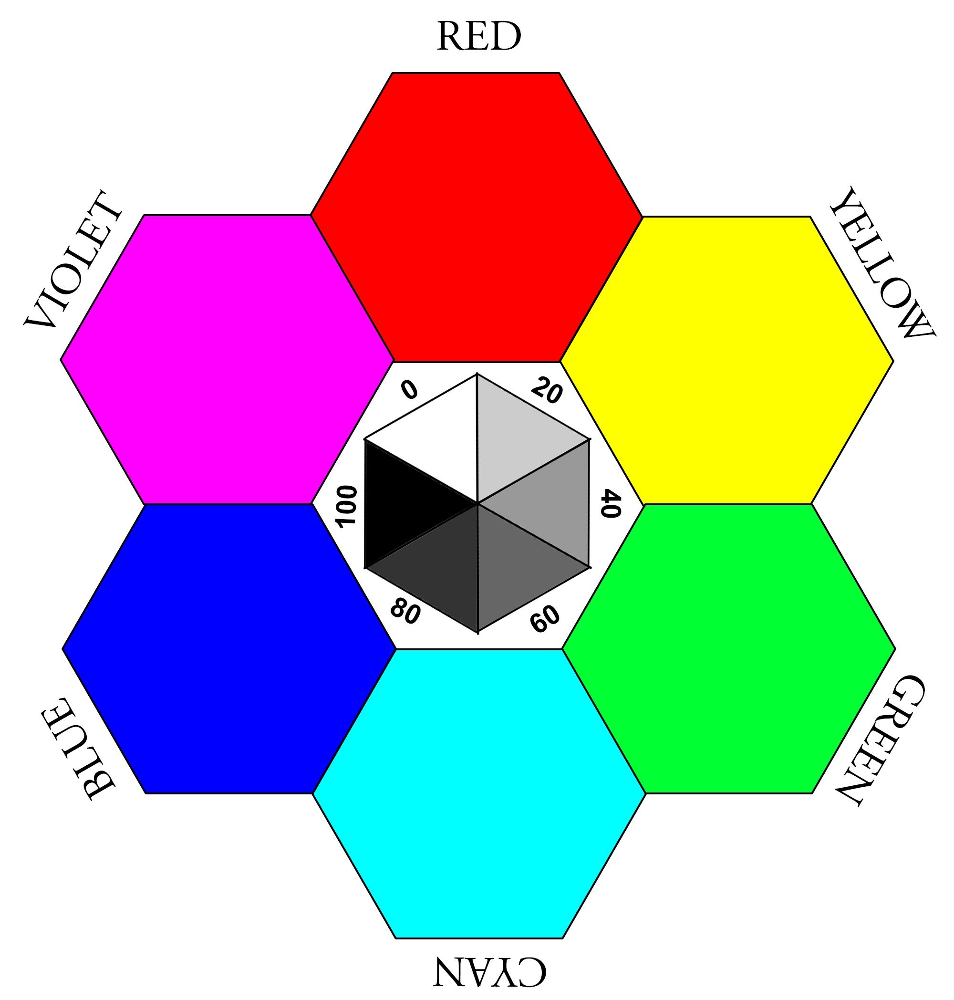

<div style='page-break-after: never; break-after: none;'></div>
# I - About This Book
###### Technical information the reader may want to know

## Writing Style

For those readers who are sticklers about writing style conventions in the U.S., I have deliberately chosen to: Place punctuation (that is not part of a quote) outside of quotes.  The convention of placing punctuation inside the quotes was adopted due to the limitations of fixed width fonts in the pre-digital age.  The British convention has punctuation outside of quotes, but that is because they use single quotes, not double quotes.  To quote William Strunk and E. B. White, &ldquo;Typographical usage dictates the comma be inside the marks, though logically it seems not to belong there&rdquo;.  I agree, and take the side of Canadian poet, typographer and author Robert Bringhurst who bravely stated that it “makes no *typographic* difference” if quotation marks “follow commas and periods or precede them”. Also, I follow periods with two spaces, not one.  The two-space rule was also in place due to fixed width fonts, but unlike the punctuation-quotes rules, it has fierce opposition. Even the American Psychological Association has gone from officially recommending one space, then recommending one *or* two spaces, then back to two spaces (in their 6th addition), then back to one space (7th edition). This does not inspire confidence in their craft. I will be using two spaces because it has been shown that using two spaces after a period increases text processing ability[^1].  In addition, while it is customary to spell out numbers in a sentence, for the most part, numbers in a sentence will be shown as numerals. This is to allow for numerical values to be easily recognizable, which, like the above point, increases text processing overhead.

## Low-Tech Issues

My apologies for the sometimes crude layout of the book in general. Once-upon-a-time I was myself a young typographer back in the days when the job often included the re-melting of lead "pigs" that were used to set the type using the Linotype machines of the day. Today, that drudgery has been replaced with endlessly tweaking semi-compatible markup languages such as Markdown, LaTex, PDF, HTML, CSS, and JavaScript (I was much better at melting lead "pigs").

One of the challenges was how to get color images to appear meaningful in B&W eBook readers.  In some cases it was not possible, especially considering various readers use various different to deal with colors.  The sad and current state of eBook readers is that most do not support anything but the most basic formatting, and if that is often spotty, especially regarding blockquotes and lists, and even more so if the reader is older.  Using color is discouraged for eBook publishers, but possible here.

To that end, here is a simple color wheel that will show you how your reader treats at least the six basic colors. The center shows the six shades of white to black.

eBook Hell

If you are reading this as an eBook, the changes that it will look especially ugly are quite high.  This is because many readers take it upon themselves to deliberately eliminate the layout that the author has developed and replaced it with their generic (and IMHO, hideous) one-size-fits-all format.  There are ways around this.  For example, on the Kobo, if you put the a file called ```kobo-extras.css``` in the root directory of the ereader itself, and then import the ebook using the software ```Calibre``` (after installing the Kobo drivers), ```Calibre``` will apply the correct style to the book.   

[^1]: Johnson RL, Bui B, Schmitt LL. **Are two spaces better than one? The effect of spacing following periods and commas during reading**. *Atten Percept Psychophys*. 2018;80(6):1504-1511. doi:10.3758/s13414-018-1527-6