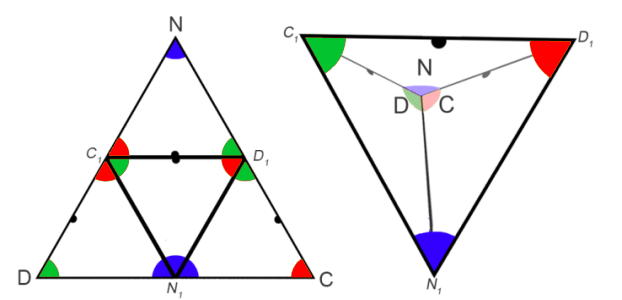
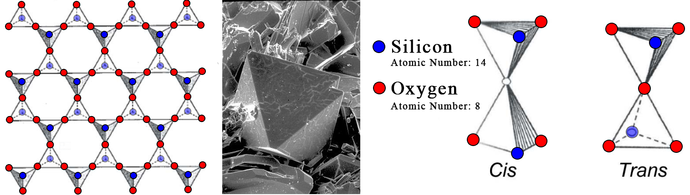
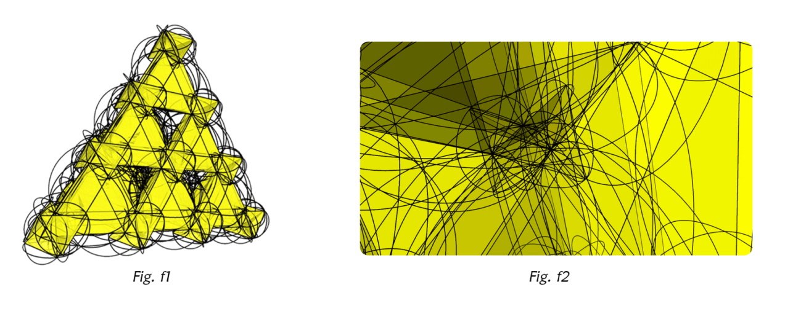

# Appendix B - Tholonic Structure

###### How the tholonic structure is defined

## Inner, not Outer

We have seen how the creation of a single trigram will automatically create additional trigrams as part of the same creative process.  This would imply that there is an infinitely expanding realm of trigrams, as shown in ***Fig. c9*** in the &ldquo;Geometry I&rdquo; chapter.  This pattern, when limited to 37 points, is often called the *flower of life*, as pictured above (*the added &bullet; - + symbols are there for the benefit of black and white ebook readers*).  The tholonic model sees it a little differently.  If we are claiming that the first instance of creation, that of the one dot becoming two, and the two becoming three, etc., even if we are just speaking metaphorically, then what we are also claiming is that this first trigram represents the very first polar duality created by the first non-polar duality of somethingness and nothingness.  This would then imply that every duality and trigram that follows must exist *within* the first trigram, not outside of it, because every succeeding duality can only be a subset of this first duality and certainly cannot exist outside the bounds of somethingness and/or nothingness.

If we draw our expanding trigrams such that the children are always contained within the parent we see a very different pattern.

In this example diagram ***Fig. p1*** above, the outermost N, D, C points represent the first trigram.  You&rsquo;ll see in ***Fig. p2*** on the CD line of this parent trigram a new N-state was formed.  It too naturally bifurcates and expands in the same manner as its parent until it reaches its limits of the boundaries of the parent and in doing so creates three additional trigrams.

You may also notice what looks like an inconsistency in the order of the letters.  In ***Fig. p1***, the parent trigram, the order of NDC is clockwise, but the same three points of the resulting inner trigram are counter-clockwise.  It&rsquo;s not actually a reordering, as the children trigrams represent completely new creations.  The original NDC is still there in the parent, but we are only looking at the children in ***Fig. p2***.  The reason the children have a different order is because the new generation was spawned by the new N-source between C and D, and as D is always the first to follow N, and always on the left of N (left, or *portside*, to be more accurate, is arbitrary, but we need to remain consistent).  This newly spawned D will appear on the opposite side of the parent&rsquo;s D.  The same applies to C.  Not coincidentally, the new top-most trigram has the exact same order of points as the parent.  The parent always creates a smaller replica of itself in each generation.  You&rsquo;ll also notice that each of the outer trigrams is a reversed copy of the one central trigram.

We started with one trigram, created one more, resulting in 4 trigrams.  Each generation of self-similar creation increases the number of trigrams by 4.  Here is what the generations look like.

In the 1^st^ generation of a simple trigram, we see a few fundamental rules, such as:

-   All sides are of equal length
-   Every point is connected to every other point.
-   Two points define a line, three points define a trigram.  (seems super obvious now, but wait…)
-   The area of the trigram is known.    
-   The radius of the incircle is exactly half the radius of the circumcircle.
-   The end-point where any two lines meet is always the middle of the line formed by the two adjacent points.
-   The total number of degrees of the angles equals half the total degrees of a circle.  This is especially significant later.
-   The 3^rd^ red dot is a product of the 1^st^ blue dot and the 2^nd^ green dot, and the next generation N-state blue dot is a product of the 2^nd^ green dot and the 3^rd^ red dot that form the CD spectrum or line.

You&rsquo;re probably thinking &ldquo;What? Red and green don&rsquo;t make blue!&rdquo;  This is half true.  Red and green make yellow, and yellow, when blended with the parent blue, make magenta and cyan… and cyan and magenta make blue.  So, red and green parents do not make blue children, but they make blue grandchildren.  We see an instance of this in the way recessive genetic traits can be become dominant in every other generation (in the absence of an existing dominant trait), which is what we would expect tholonically as genetics are one of the better examples of an instance of tholonic fundamentals.

This is worth a demonstration.  Here is that same process described above but with simple colors from the color wheel to show how the children interact with the parents.  These are the same colors we used above to represent the domains.  This is an important point, but because the process is the same for every generation, we are going to just use red, green and blue in our later examples to keep things simpler; i.e.  going forward we will only show the dominant colors of RGB and ignore the intermediary children of CMY.

In the first case  (***Fig. t1***)&hellip;

- Blue spawns green
- Green spawns red.
- Green and red create a new yellow.
- Yellow spawns a mixture of each of its component colors (red and green) with its parent color, blue, making cyan (created by blue and green) and magenta (created by blue and red).
- Magenta and cyan create a new blue.
- *Repeat*.

In the next case of (***Fig. t2***)&hellip;

This is the same process as the first, but the children are spawned internally, not externally.  Each new generation creates a new layer that sits on top of the parent layer and is a mirror of the parent (***Fig. t3***).  Eventually we end up with a grid that looks like the image on the right, which shows the smaller overlaid children on top of the larger, and opposite colored parent.

Here is a zoomed-out image of this (crudely drawn) grid:

Compare the outward-expanding model to the inward-expanding model:

We also see a few other interesting details in ***Fig. p2***, such as, how the contribution of red divides the green (on the right side).  Can we say the same thing for how green is what divided the red, such as it appears on the left side? No, because there is an order to the points of *blue &rightarrow; green &rightarrow; red*.  Green existed *before* red, therefore the introduction of the 3^rd^ red point must divide the already existing 2^nd^ green point.  Likewise, the green&rsquo;s boundaries are defined and limited by the red (on the left side) using the same logic that the green came first and the red followed.

In the world of mathematics, this internally expanding trigram is similar to something called a *Sierpinski Triangle*, which is also a self-similar triangle.  This is significant as the Sierpinski Triangle has many real-world applications, such as broadband antennas, musical composition, mathematics, chemistry and is a foundational pattern in nature.

The difference between the thologram and the Sierpinski Triangle is in the latter there is the concept of two types of triangles, one that is capable of self-replication (the black triangles), and one that is not (the white triangles), which act like triangular *holes*, like this:

In the thologram, we consider the triangle not as an object, but as the boundaries that constrain the movement of energy.  The fact that the center trigram is a reversal of the three outer trigrams is evidence of the significance of this inner trigram.  One way to think about the thologram is the boundaries are like one-way mirrors, reflecting the light (energy) within the triangle, but allowing the light from outside to enter.  This difference between the thologram and the Sierpinski Triangle is only conceptual because the math is essentially the same, but the thologram considers the negative or empty space just as valid as the filled space, just with different attributes, which we&rsquo;ll demonstrate.

With each generation, we have more and more rules.  In just a few generations we see two dominant patterns begin to emerge from these rules.  The first one being the Fibonacci sequence, which emerges simply by the linear increase in generation count as well as the number of trigrams for each generation (1,4,16), which is always 4^gen^ (4 to the power of the generation number).

Another dominant pattern is the hexagon, one of nature&rsquo;s most persistent and useful shapes, and can be seen in beehives, Saturn&rsquo;s north pole, dragonfly eyes, rocks, bubbles, snowflakes, organic chemistry, etc., but it is much more than just the most structurally sound of all shapes.  We are also shown how the N-sources converge to form the center of every hexagon.  From this, we get a much better idea as to the nature of 0-dimensional, non-existent N-sources, which are, unsurprisingly, at the center of order.  This is important because it gives us an insight into answering the question &ldquo;Where did the first N-source come from?&rdquo;  It is also the pattern that is fundamental to the *flower of life*, shown previously.

The  *flower of life* design dates back to 1300 BC, with the oldest known instance carved on the temple walls of the ancient Egyptian temple &ldquo;Osireion&rdquo;. Again, we see the same concepts and patterns appear over and over again in Man&rsquo;s search for understanding using the power of reason.  We also see that every *Define* or *Contribute* point is naturally paired with its opposite.

Another interesting observation are those little black dots in the middle of the lines.  Why are they important? Those black dots mark the center of a line that has the capability of creating new children (stable patterns), or new N-states that form new N-sources.  You&rsquo;ll notice that those lines only exist on the outer ring of the hexagon.

As we saw earlier, the N-source (blue) is the progenitor of the subsequent D (green) and C (red) dots.  We also know that the N must always precede D and C.  However, D and C, having all the attributes of the N, can create a new version of N.  N and D cannot create a new N because it does not have the attributes of C (form), nor can N and C create a new N as it does not have the attributes of D (definition).  Only Ns, or N-states, can be created because N-states have no form or dimension, a prerequisite for creating something out of nothing.  An N-state is simply an idea or concept.  Cs and Ds are no longer simply concepts as they have dimension and therefore can not be created directly out of nothing.

This is a very important detail because it means that even though archetypes can appear across the NC and ND spectrums, they cannot create children, so no N-state will ever appear across these spectrums.  However, the CD spectrum, which is the axis of *cooperation* or *conflict*, the opposing side to the point of *negotiation*, can create N-states*.* It may appear as though that would limit all the new N-states to only exist on one side of the trigrams, considering only one side of the trigram has the ability to create new N-sources.  This is not the case, because as the trigram self-replicates it naturally rotates 60&deg; with each iteration, allowing every side of the trigram to be able to generate new N-sources.  The graph above (***Fig. h1***) shows the lines connecting the N-sources and their respective N-states (the black dots).

### Everything Begins with the Trigram

Just as every element in the periodic table is formed from hydrogen, so too is every generation of the thologram formed from the trigram.

A curious observation is if you take the simplest material version of the trigram (hydrogen, atomic number = 1) and the simplest material version of the hexagon (carbon, atomic number = 6), the two most fundamental forms in the thologram, and combine them (6+1=7) you happen to get hydrocarbons, the most fundamental building blocks of life (and a bunch of plastic stuff), as all life is hydrocarbon based.  Is it more reasonable to see this most basic structure of the thologram appearing in the most basic structures of life as a recurring pattern or to call it a coincidence?

We can also apply the same associative reasoning to the thologram as a whole to show how its structure appears as a pattern of growth in nature.

Here we are using the Sierpinski triangle which does not show the &ldquo;negative space&rdquo; of the thologram but simply a blank space.  In the thologram, this blank space accounts for 25% of the tholon and is just as full of implicit patterns as the positive space is full of explicit patterns.  This suggests that we are only seeing 75% of a tholon&rsquo;s instance, the remaining 25% also being an integral part of the instance, but simply not visible.  More on this later.

There is no question that natural processes of creation for nature follow these patterns, and with a little shift in perspective, for the natural process of creation for ideas as well when we apply this pattern to relationships rather than objects.

### 2D to 3D

So far all we have described is 2D trigrams.  Where is the 3D tetrahedron? The 2D trigrams *are* the 3D tetrahedron, only flat.  What happens when we convert this 2D model to 3D?

If we take the parent trigrams and fold it according to its four children, we get a tetrahedron.  This is the structure of a tholon.  Tholonic structures naturally occur because they are more efficient as a 3D object than a 2D map, and they are the most stable and complete state for all the properties involved.

The mathematics of a equilateral triangle are fairly straight forward, but the math of a tetrahedron is quite fascinating in the way is supports the tholonic model.  Rather than detail that relationship, here is a small table that holds the formulas for calculating the XYZ coordinates of a tetrahedron (with the tip along the Z-axis and the base facing the XY plane).  I have left in seemingly useless data, like 0+0 and  but adding them makes the patterns a little more obvious.  Some highlights worth pointing out is how the first point, which would equate to the blue dot, or N-state, references the direct value of 3 as a whole, while all of the other values reference only the inverse of the whole.  This is consistent with the idea that the N-state holds all the possibilities of the two children as well as the limits of the children.  We can also see how the 2^nd^ point, the green dot, adds value and the 3^rd^ point, the red dot, subtracts value.  This is significant later when we show how those attributes is what allows us to calculate the value of *pi* using the tholonic model.  Also notice how the only points that can generate new N-states exist between 1 and -1, but these N-states can only create children in the axis where there is a 0, and that is only on the 2D X axis.

Below is a more complete, step-by-step description of this transition from beginning to end.

Tholons model the movement of energy, and consider the existence of form as the consequence of that movement.  With that in mind, let&rsquo;s look at the tholonic explanation using the figures above.

***Fig. a.*** We start with a simple trigram.  This defines the most fundamental structure of how instantiations of archetypes come to exist, and therefore the flow of energy and their resulting forms.

***Fig a1***.  The movement of energy inside this trigram will cause a new trigram to form by the expansion of N-sources due to the flow of energy.  The most likely place for this new form is opposite the source of the energy and in the balanced center between the two limiting poles created by the source.  When it creates its two children they are naturally in reverse order.  We now have four trigrams with their points in their natural order and position.

As was shown above, the arrangement of the colored points (N, D, & C) in each outer trigram are the exact reversed image of the center trigram.  One way to think about it is the original trigram (top-most) reflects and reverses itself and by doing so creates a new trigram (center), which also reflects and reverses itself in the two new trigrams (left and right).  In this way, the center trigram acts like a reverse reflection trigram, and the two new trigrams are a reversed reflection of a reversed reflection.  This will be an important point a little bit later.

*Note: We are going to use colors (RGB) rather than types (NDC) because it is easier to explain using colors.  You can remember that N=blue, D=green, and C=red, but for the purpose of these descriptions it does not really matter.  When it does matter, we will return to NDC labels.*

***Fig. a2***.  Because energy always follows the path of least resistance and always seeks order, this complete tholon will automatically become a self-sustaining structure (tetrahedron) when all the conditions are met as it would represent the most efficient form.  These conditions appear to require 4 types of points; BBB, RGB, RGR, and GRG.  Apparently, B points only integrate with themselves and with an R and G together, while the R and G can integrate with each other.

This is the same phenomena that happens when a hydrogen atom and an oxygen atom meet; they naturally form a stable state (which also happens to form a trigram in the case of hydrogen and oxygen) that requires less energy than both of them require to maintain a separate existence.  This is another example of the reactions caused by the need to create balance.

***Fig. a3***.  Each of these child trigrams goes through the exact same process as the parent, with slightly different parameters that are determined by the limitation of their parent.  We can now see 4 trigrams of 4 trigrams in their 2D form.

***Fig. a4***.  This is a 4^th^ generation tholon map, and to get an idea how many sets of tetrahedrons it holds, the trigrams have been color-coded to make it easy to see.  The darker colors represent what will be the base of a tetrahedron, with the light shade of the same colors representing their sides.

You&rsquo;ll notice that there are six sets of trigrams that are yellow (or a lighter shade of gray).  These are identified a little differently because when they form a tetrahedron they do so by going in the opposite direction because they are a reversed reflection image.

***Fig. a5***.  If we go ahead and form the tetrahedrons we end up with a series of tetrahedrons connected at the corners, some pointing forward and some pointing away (the more faded ones).  You notice that every odd numbered row (rows 1,3,5,7) are all *forward* trigrams (trigrams with blue N-state parents), which we&rsquo;ll refer to as *real*, a term taken from the world of holography to indicate that the image is projecting in front of the film.  Likewise, all even-numbered rows (rows 2,4,6) are pointing in the opposite direction (trigrams with yellow N-state parents).  We&rsquo;ll call these *virtual* tholons, a term also taken from the world of holography, referring to an image that *virtually* exists behind the holographic plate.  For every pair of rows (1+2, 3+4, 5+6) there are an equal number of real and virtual tholons.

This may look familiar to a mineral chemist, as this is the exact same structure as silicon dioxide crystal *tridymite*, which is a form of quartz, shown below with  two types of *tridymite* molecules. Other silica-based oxides also share a similar structure, which are mentioned later in this chapter when we look at how water also shares this structure.

Below are various 3D renderings of 4 tetrahedron in this structure.  While we used the same colors for N, D, and C in the previous diagrams for the balls, here we also used them for the connecting lines as the line colors are determined by the color of the ball, or point, that it emanates from.  However, this is mainly to show the relationships with the lines and balls, and not to suggest they have the same qualities.

***Fig. b1***.  This is a side view of ***Fig. a5***, with the yellow (bottom) tholons being virtual, and the blue (top) tholons being real.  The black dots represent the peaks and are also shown in ***Fig. c1***, for clarity.  This is where we see the first instance of oscillation, with the tholons alternating in their movement away from and towards their originating plane, or between the virtual and real states.

***Fig b2***.  But what is happening in ***Fig. b2***? Why are there more tholons stacked on top and on the bottom?

If you managed to slug through this up to this point, congratulations! Here is where it (hopefully) gets interesting: Each of these new trigrams formed by the peaks of the previous children acts as the base for *larger* tholons! The process beginning with ***Fig. a1*** starts all over for not only each one of these trigrams but for every face of a tholon or trigram, including its children.

If you look at ***Fig. c1***, which is the colorized front view of ***Fig. a5***, you&rsquo;ll notice that there are alternating sets of real and virtual tholons, and the peaks of these tholons (the black dots) naturally create new trigrams.

In 2^nd^ generation tholons, the peaks are always the 4^th^ dot type of RGB combined , or *white dot* , so how can a new tholon appear from three white dots? Doesn&rsquo;t it need three different unique colors to satisfy the conditions for a 4^th^ white dot to exist? In fact, that condition *is* satisfied.  If we make the RGB/white dots huge for demonstration purposes you can see how the colors line up to create three separate dots of three separate colors, but these 2^nd^ generation dots are composed of three pieces of three dots that are 1/3^rd^ each color.  They are like virtual RGB dots made from *white dots*.

For clarity&rsquo;s sake, we are referring to each generation of tholon children as *generations,* while the tholons that are created from the peaks of these original tholons, and their children, we refer to as *iterations*.

The only way to create three peaks of pure R, G, and B is to first create the opposite condition of three peaks of white dots, similar to the way a blue N-source creates a yellow child N-source, which then creates a blue N-source.  With each iteration this pattern reverses itself, so the 3^rd^ iteration will be like the 1^st^, with bases of RGB (but each generation rotated 60&deg;).  All the odd number iterations have RGB peaks, and all the even number iterations have white dot peaks.  Each iteration builds on the one before it, making larger and larger tholons, as you can see in ***Figs. b2, b3, b4***, which shows the progression of real and virtual tholons.[^69]

Interestingly, the growth pattern of tholons is the inverse of a recursive Fibonacci sequence.  Inverse, because we are multiplying instead of dividing, recursive because we do that for each trigram, children of trigrams, children of children of trigrams, etc.

***Fig. c1, c2, c3,*** and ***c4***. are orthographic views of the figures immediately above them.

***Fig. d1, d2, d3***, and ***d4*** are isometric views of the figures immediately above them.

***Fig. d1*** shows the first iteration of tetrahedrons. All form that follows (***Fig. d2, d3, d4***) is built upon these initial tetrahedrons.  This would (probably) be the domain of elements and subatomic particles.

There are two details worth mentioning.  The first is, you&rsquo;ll notice that in the front view of ***Fig. c2*** you see what looks like four larger trigrams that are themselves made of smaller trigrams.  Each of those large trigrams is itself a tholon.  The center tholon is, as explained before, a virtual tholon, but within this large virtual tholon there exists smaller real tholons.  This is because just as real tholons can create virtual tholons, virtual tholons can create real tholons.  This is where it really starts to sound like a fun-house of mirrors because how can you have real tholons inside virtual tholons? The simple answer is, real tholons in a virtual tholon are real relative to that virtual tholon they are within.  These *virtual* real tholons are just as significant as the *real* real tholons because they function in the same manner as a real tholon, but virtually, which allows virtual tholons to be able to &ldquo;reflect&rdquo; back a real tholon.  But, because they are all sourced originally from a virtual tholon, they only have virtual significance.

The second detail is, to make things more complicated, in the above diagrams we have colored all the real tholons yellow (light gray in B&W) and the virtual tholons blue (darker gray), but in fact, there are yellows within the blues and blues within the yellows.  These were left out for simplicity sake as they were not critically important to demonstrate our point and can&rsquo;t be properly illustrated.  The basic principle is the same however, in that there is an oscillating between real and virtual at each iteration.

Now we can start to fold this into itself.  Each of the four sides that make up a tholon has their own domains of children as well, so this folding process happens at every generation (again, impossible to illustrate).

***Fig. d4*** shows the small portion of a thologram we have built that we will now begin to fold.

***Fig e1*** shows the beginning of the folding.

***Fig. e2*** shows the completed folding, with all the real tholons now within the parent, and all the virtual tholons outside of the parent.  It&rsquo;s interesting how it naturally happens that only the virtual tholons extend past the boundaries of the thologram.

It looks like we have broken the rules that no children can exist outside of their parent&rsquo;s limits because we have a lot of virtual tholons sticking way outside those limits.

Remember when we were looking at the Sierpinski Fractal? One of the points made was that Sierpinski treated the empty space between the tetrahedrons as empty, wherein the tholonic model it is not empty, but rather negative space that is a reflection of the immediate parent.  Now remember that that this middle trigram is a reflection trigram.  In one sense it does not exist any more than your reflection in the mirror does not represent the existence of another you opposite and equally distant from the mirror, but it does exist in that the reflection is a perfect mirror-image representation of you, and this has significant value as mirrors obviously have a measurable effect on energy (light).  It is an illusion, but an illusion that effects reality.

All the virtual tholons are tholons that were created out of this nothingness space! They are *reverse reflective* tholons only.  They do not exist, but they are very important.  The virtual tholons are like the *nothingness* complement to the real tholons within the parent through which *their* reflection creates two more real tholons.  This does not break the rules that nothing created within the parent can extend past its boundaries any more than looking at yourself in a mirror hanging on the wall does not put you on the other side of the wall, even though it appears that way.

Look at ***Fig. a5*** again.  You&rsquo;ll notice that for every real tholon there is a virtual (reflection) tholon immediately below it.  It is because of these virtual reflections that we can generate another iteration of real tholons.

***Fig. e3*** shows the ghosts of the virtual tholons, and ***Fig. e4*** shows only the real tholons folded into their parent tholon.

To get a better perspective of the dynamism of this structure, look at ***Fig. f1*** below, which shows the lines of influence of each tholon (which is that of a sphere).

If we go inside this very simple version of a thologram we see what looks like complete chaos (***Fig. f2***), but is, in fact, absolute stunningly perfect order and structure.

If we had used the simplest thologram possible in our example, using only 1^st^ generation folds, rather than the 3^rd^ generation folds above, it would look like the following:

Another fascinating pattern expressed in the thologram is the value for *pi* (&pi;, 3.14159) can be determined by alternatively adding and subtracting the inverse of the total number of N-sources for all the real and virtual tholons for each generation (which produces a series of sequential odd numbers; 1,3,5,7,etc).  This was originally discovered by Leibniz and is appropriately called the *Leibniz formula for π*, as shown below.  Notice how here we also see the reversing back and forth with each generation, which is a function of the creative process as described above.

