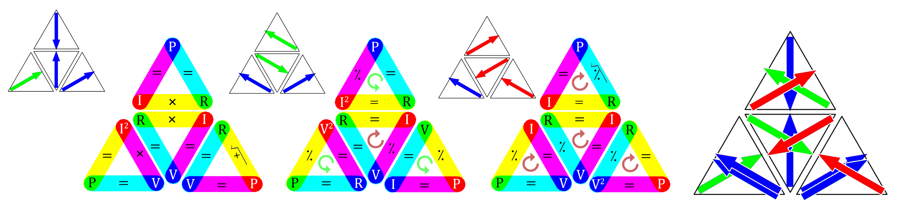
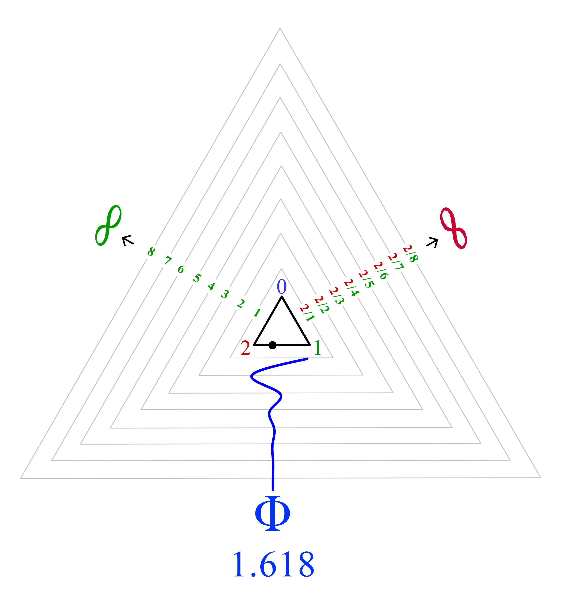

# Appendix C - Tholonic Math

###### The archetypes of Form follows function

One of the fundamental claims being made here is that a coherent and stable expression of energy, in order to be sustainable, must satisfy a number of prerequisites that will ensure its sustainability.  It’s a bit like existential bureaucracy, in that if the proper application for existence is not filled out completely and accurately, the request is denied.

Within the tholons are numerous relationships.  The ones we have used in our examples are the twelve formulas that define one instance of Newton’s 2^nd^ law, Ohm‘s Law.  If we map these formulas to the tholon using the reasoning described earlier, we get the following:

This shows the four trigrams that make up a tholon, however, depending on the perspective of view of the tholon, the formulas will be different.  There are many ways to view this mapping, but this is perhaps the simplest.  Besides the basic twelve formulas, we also see that the trigrams have two “directions”.  One direction (the inner circle) is the direction of the formula, but this only applies where division is involved because  but  .  The other direction is an arrow that starts at the initiating value, as if it were a N-source, and points to the location of the child N-source, or the spectrum across its two children, as if it were the spectrum between *Definition* and *Contribution* (which effectively it is).  

For example, using *P=I&times;R*, we can see how the mapping assigns *P* as the blue *N-source*,  *R* as the green dot of *Definition*, and *I* as the red dot *Contribution*.  This then creates a yellow (additive color of red and green) spectrum between *I* and *R*, which in the case of these formulas, is where the math functions of &times;, &div; &equals;, and √ exist.  This yellow spectrum is that of *Cooperation or Conflict*, so it makes sense that it would also be where we you find &times; and  &div;, and suggests that, in this case at least, cooperation is literally twice as efficient as division, given that the relationships in multiplication-based trigram functions in both directions. 

You will notice that only the locations that are capable of creating a new child N-source, the yellow spectrums, of the 12 that exist, 6 are &equals;, and 6 are functions, and of those 6, 3 are &times;, 3 are &div; (we include square roots as a function of &times; because a square root is defined as a *factor of a number that, when multiplied by itself, gives the number*).  If we look at the yellow spectrum of only the trigrams where *V* is the blue N-source, as this is the archetype, we see that each of the 3 sets, or each side, always has a pair of one function and a single instance of another.

  Side 1, Side of *Contribution* as multiplication  

  Side 2: side of *Definition* as division.

  Side 3: side of *Negotiation* as equalization. 

This beautifully shows how the primal attributes of *Negotiation*, *Definition*, and *Contribution* continue to reappear in every child and instance.  In this case, we can see N, D, and C attributes within each N, D, and C as **C**~NCC~, **D**~DND~, **N**~DNN~. Notice how &times; and &div; never share a side, which we would expect to see given that they can only interact via &equals;.

Looking at all the functions of a side, we see that we have 3 multiplications and 6 divides, which makes sense when you consider that multiplication works the same in both directions, so we need twice as many divisions to represent with division what multiplication can represent with 3.

If we convert these three 2D tholon maps that make up the three sides of a 3D tholon into child tholons, we get the following three 3D tholons when viewing the from the “top” (so we are not seeing the base).  In this case, rather than show the three trigrams separately, they have been joined together and the overlapping colors only show the color they both have in common, so instead of seeing two sides of magenta and cyan, there is only one side of blue as magenta is blue and red, and yellow is blue and green.

Because we have overlapped the lines (and dropped the base), we can't apply the actual formulas.  They are shown simply to highlight a pattern of functionality.  The reader can come to their own conclusions.  

As a comparison, here are two versions of a square model of the same 12 formulas, but even here you can see tholonic patterns in both images (but maybe more so on the right image).

##  New Data?

Applying Ohm’s Law to the tetrahedron shows some new relationships.  Readers who enjoy numbers will find this next (short) section interesting.

We can satisfy all twelve formulas of Ohm’s Law as they appear on a tetrahedron, but we can also find some new data now which may appear as useless, or may be meaningful if we know how to use it.  *“There is no useless data, only data we have yet to understand how to use*”  or *Claim 33: All data is valid.*

Previously (and in the left-most image above) we saw how the contribution of red divides the green on one side (right)  but constrains the green on the opposite (left) side  .  Can we apply these same concepts to other scopes, such as electricity? Does current (*I*) “divide” resistance (*R*) and is resistance (*R*) “constrained” by current (*I*)?  Yes, we can, but first we have to recognize that while “constrain” and “divide” have different meanings in their usual context, they have the same mathematical meaning.  To describe the function  as *X* being *constrained* by *Y*, because *X* is being *defined* by, or measured by *Y*, is not inaccurate, as *X* is indeed being “kept within certain limits” in as far has how it is being measured.  We can then say “resistance is defined by current” and “current is limited by resistance”, both of which are technically correct statements.

In the right-most image above we have the 2D tetrahedron map with only *V*, *I*, and *R* values mapped to each trigram, along with the functions (&div;, &times;) that apply to the values as defined by Ohm’s Law.   The gray functions are associated with the inner trigrams, and the black functions are associated with the outer trigram.  For example, Ohm’s Law states that , so in the image above, all lines that connect *V* to *R* are assigned the &div; function.  The same goes for  and *I&times;R=V*.  Note how only N-sources have the functions of &times;.

Let’s apply values to these points to make it clearer.  Above is a tholon map where *I=2*, *R=3*, *V=6* (and the implied *P=12*).  These numbers satisfy the formulas of Ohm’s law as you can see by the added gray functions (i.e.  , etc).  These are not arbitrary numbers.  They are the smallest numbers that represent the properties of each point, mathematically speaking.  Why do we not start with the number 1 then?  Because the properties of 1 are the antithesis of creation.  1 represents perfect unity and balance, whereas every number greater that 1 represents separation and imbalance.  For example, if we applied the values of 1 to *I* and *R*, then the values of *V* and *P* will also equal 1.  The number 1 is unlike every other number, and even Euclid excluded the number 1 in his *The Fundamental Theorem of Arithmetic*, which states:

> Every positive integer **greater than one** can be written uniquely as a product of primes, with the prime factors in the product written in order of nondecreasing size.  **\~ Euclid, 4th century B.C.**

The number 1 is a very lonely number as it stands in a class all by itself:

- 1 is *not* a prime number, nor is it a composite number (with respect to division).
- Any number multiplied by 1 remains that number.
- 1 is its own factorial.
- 1 is its own square and square root, its own cube and cube root, etc.
- 1 is the result of the empty product, as any number multiplied by one is itself.

In fact, from the philosophical perspective of the Neoplatonists, the number 1 is not even considered a number in the traditional sense, but rather the *source* of all numbers.

So, why not start counting with 2 rather than 6? Because we assume that the children of N, when recombined, must equal N.

For these, and other reasons, we can not start counting with the number 1, but need to start with the first number that represents a *product* of 1, or, a number that acts like a normal number in a practical sense.

There are some interesting relationships and values below.  I can’t tell you what they mean or represent, but it would be irrational to assume they have no significance without knowing anything more about them.  Everything that leads up to these new values is quite reasonable and provable.  It is just a matter of discovering where these new values and formulas apply.  To explain these new values here would border on sadistic given what the reader has had to suffer through already, and as it qualifies as a book unto itself I will spare the reader.  However, there are just a couple I would like to share.

If we look at *current* (*I*, red, 2) “dividing” *resistance* (*R*, green, 3), on the right , and apply the function of division associated with the 6-2 vector, or side, we have 3^2^&div;2, which is simply 4.5 (which we’ll call *R~i~*).  On the left we have *resistance* (*R*) *constrained* by *current* (*I*) , which is 2^2^&div;3, which is 1.33333 (which we’ll call *I~r~*).  Neither number *seems* particularly significant, but if we multiply these numbers together, which we would because they are connected via the “base” of the trigram, the 3-2 vector, which has the property of multiplication we get *R~i~&times;I~r~*=6, which is the value for *V*.  This proves that Ohm’s Law has not been broken.  Using this same reasoning we can apply this to the three 6s, but as they are on a vector of multiplication, we would say 6^3^, which yields 216 (which we’ll call *V~3~*).

In any case, we have new properties of *R~i~, I~r~, V~3~*, all of which only emerging when the the complete tholon is defined.  We can now say *R~i~&times;I~r~=V*.  This means we can also say   and , all in accordance to Ohms Law.  We can also calculate a new value for *P* as *V&times;I~r~=P*, but this gives us the value 8, which is a different value from *P*=12, so we will call this *P~1~*.  Let’s test these values by applying the other formulas and see if we get the correct results.  We can apply the formula *I~r~^2^&times;R~i~=P~1~* where we’d expect *P~1~* to equal 8, and it does. .

We have exposed at least four new values within the tholon map; *R~i~, I~r~, V~3~*, and *P~1~* (being 4.5, 1.333, 216, and 8 when *I=2*, *R=3*, *V=6*, and *P=12*).  Now all we have to do is find out what they mean and where they are applied in the real world.

Regarding *V~3~*, 216, this is a fascinating number that has a history that goes back to at least Plato, because we know (generally accepted by experts) that 216 is called *Plato’s Number* and was described to Plato by Socrates who said (when explaining how to properly breed humans):

> For the number of the human creature is the first in which root and square multiplications (comprising three dimensions and four limits) of basic numbers which make like and unlike, and which increase and decrease, produce a final result in completely commensurate terms.

*(The word “cubed” was not in use in those days, but 216 is the first (smallest) cube which is the sum of three cubes.  It also makes more sense how this might apply to human breeding when you know that back in those days, odd numbers were considered male and even numbers were considered female.  Math class back then must have been a lot more interesting.)* 

Plato elaborated on this in his “Republic”:

> Now for divine begettings there is a period comprehended by a perfect number, and for mortal by the first in which augmentations dominating and dominated when they have attained to three distances and four limits of the assimilating and the dissimilating, the waxing and the waning, render all things conversable and commensurable with one another, whereof a basal four-thirds wedded to the pempad yields two harmonies at the third augmentation, the one the product of equal factors taken one hundred times, the other of equal length one way but oblong,-one dimension of a hundred numbers determined by the rational diameters of the pempad lacking one in each case, or of the irrational lacking two; the other dimension of a hundred cubes of the triad.  And this entire geometrical number is determinative of this thing, of better and inferior births.  **\~Plato, “Republic”**

The above has been interpreted to mean 6^3^, which Plato alludes to elsewhere, as 6 (considered the number of marriage back then) is the product of female (2) and male (3), and 2^3^ &times; 3^3^ = 216.  While 216 is the most accepted answer, great thinkers spanning over 2,000 years, such as Aristotle, Proclus, Marsilio Ficino, Gerolamo Cardano, Eduard Zeller, Friedrich Schleiermacher, Paul Tannery, Friedrich Hultsch, and more, have all tried to decipher Plato’s enigmatic text.  216’s fame may even go back as far as Pythagoras, as it is the sum of cubes of the *Pythagorean triple* (3,4,5, hence 3^3^ + 4^3^ + 5^3^), or even Ancient Babylon.[^203]

Later in history, this pedigree number fell slightly into infamy when John the Apostle declared in Revelations that 666 was the number of the Beast (the beast that comes out of the sea, not the one that comes out of the abyss of the earth), but also the number of man.  216 might have escaped scot free if John had not specifically said that the number 666 was to be *calculated* (or *counted* depending on translation) to learn its true number.

> Here is a call for wisdom: Let the one who has insight calculate the number of the beast, for it is the number of a man *(ed: or “humanities number”)*, and that number is 666 .  **\~John, Revelations 13:18 (NIV)**

Because 216 = 6&times;6&times;6, it gained a dubious reputation by association with the Beast of Armageddon and started popping up in some strange places, thanks to humanities generally suspicious nature and love of doom.  Fans of the arcane ignore the most likely suggestion that John may have been telling to reader to *add* the numbers together, because in the original Greek it was penned as 600+60+6, and “Six hundred threescore and six” in the most popular King James Bible.  However, the odd coincidence that John’s number of man (666), which needed to be calculated, has a strong relationship with Socrates’ “number of the human creature” (216), which also needed to be calculated, is curious… even more curious is why these old timer’s preferred to shroud their message in incomprehensible riddles rather than just tell us the damn number! Ug… philosophers.  Regardless, 216’s clout in the religious and mystical tin-foil-hat brigades still holds up today.  Just do an Internet search for “216” to see for yourself.  Coincidentally, 216 &times; 10 happens to be the years the procession of the equinox moves through each of the 12 constellations.

The above example is based on only 1 of the 3 sides of a 1st generation tholon, and there are countless generations!

## Squares and Roots

What do they mean in the context of this book?

What is the significance of a square or square root?  We know what it means mathematically, but how would that meaning be understood in a different context, such as society or law?  The challenge with applying one relationship from one context to another is that without well-understood metrics, attributing foreign attributes to a relationship runs the risk of being very subjective, biased, and filtered through a cultural or moral lens that itself may be very biased.  This is the reasoning behind many beliefs and superstitions.  Nevertheless, we will try our best to avoid those pitfalls.

If you measure the long end of any A or B series piece of paper, such as the standard A4 size of paper, and divide that length by the short edge, you get the square root of 2.  This is not a coincidence, but rather the very clever work of the Germans in 1922.  The reason for this is so that a piece of paper of the dimensions , when folded in half (along the long edge), will remain .  So, no matter how many times you evenly fold it in two, it will always remain the same relative size.  This can only occur when the ratio is , making  a very self-similar or fractal concept.

2 is especially unique in the way it is the only number where 2^2^ = 2&times;2 = 2+2 = 4.  No other number has the same value when squared, added or multiplied (except 0).  Tholonically, 1 point is nothing but a concept that has no dimension or form, but 2 points is the first instance of a duality and dimension, making it the most fundamental number of creation, or the transition from concept to form, so we would expect to see some property of self-similarity given that self-similarity is a fundamental property of existence.  Perhaps that is why the number 2 is not only the first prime number, but the only even prime number as well.  It may also be the only number that inspired a murder (allegedly).  We already told the story of Hippasus, but what wasn't told was that along with his other mathematical crimes, he broke the sacred belief that all numbers must be expressible as fractions by proving that  was an irrational number.  His discovery was declared “Fake News” and he was promptly dumped at sea (or abandoned on a deserted island).

In chapter 4: Laws, we showed how , but if we use all numbers rather than just prime numbers, we get a very different answer that adds to the significance of the number 2:

  = 0.69314718056

In other words, the sum of 1 divided by all odd numbers (which is &infin;) minus the sum of 1 divided by all even numbers (which is &infin;) equals the natural Log of 2.

 is also the basis of the less famous ratio called the Silver Ratio, which is similar to the Golden Ratio. Both of these, and more, are members of what is called the *Metallic Ratios*; gold, silver, bronze, copper, etc.  While the Golden Ratio’s mean is between 1 and 2 (1.618), the Silver Ratio’s mean is between 2 and 3 (2.414), the Bronze Ratio between 3 and 4, and so on.  Here are the first three of the Metallic Ratios:

*(Technically, the first pattern in this series is =1, but as it is not a series, just the number 1, it is not included, but is also based on 2.)*

The Golden Ratio is often credited for Silver Ratio accomplishments, such as the spiral of the Milky Way, facial proportions, architecture (especially in Japan), bird flight patterns, and more.  Notice how the Silver Ratio is the only ratio that can be determined by only using the number 2 (plus the number 1, which isn't a “normal” number, and can also be defined as 2&div;2).

Here are some thoughts as to how squares and square roots might apply to non-math contexts.

When we square something, the units-of-measure and the unit-count are the same.  For example, 6^2^ , *or 6&times;6*, says we have 6 counts of a unit-of-measure that equals 6.  The thing we are measuring, and the units-of-measure are the same.  We are using 6 as an objective unit-of-measure to measure something that is essentially subjective.

Why is it subjective? Because when we say *a&times;b*, we are saying we are counting *b a* times.  It says nothing about what *b* is, only that whatever it is, there are *a* of them (of course, this works in reverse as well).  Without knowing what *b* is, the result is meaningless.  How do we know what *b* is? We simply assign a meaning to it.  We say *b=apples* or *b=volts*, or whatever.  The value of *a* is objective because regardless of what the units are, there are *a* of them.  The meaning of *b* is subjective in that it requires a contextual value, a personal decision, to make that assignment.  It may not be subjective in the sense that there really are 2 apples, which is objectively testable, but the assignment of those apples to the abstract concept of a unit is. *(Again, let me stress that in actual math these concepts don’t apply, or of they do, in ways yet unclear. We are simply applying the rules of logic to a non-mathematical context, which was the de rigueur of the inventors/discoverers of math and geometry once-upon-a-time.)*

This is effectively the same distinction between *quantitative* and *qualitative*:

- **Quantitative** data can be counted, measured, and expressed using numbers.
- **Qualitative** data is descriptive and conceptual.  Qualitative data can be categorized based on traits and characteristics.

This is metaphorically equivalent to something using its own properties to evaluate its own existence, not unlike the first dot that became aware of itself through the second dot, creating the two states of objective and subjective.  Remember, this is referring to the non-math contexts, so none of these claims have any mathematical relevance (probably).

This is a good place to bring the reader back to an earlier section that looked at the relationship between gravity and consciousness, and, hopefully, the reason why will be clear.  In that section we showed how the gravitational field *g* was a product of *G&times;M~1~&times;M~2~*, where (and these definitions are verbatim from the research paper.)

> G = universal gravitational constant.
> M~1~ = mass of the observing physical system (the observer).
> M~2~ = mass of the observed physical system (the observed).

Here we have the very same concept of subjective/objective, quantitative/qualitative being used to define perhaps the most fundamental force in reality; gravity.

Can we say that when something is squared, it is the objective measure of a subjective existence?  Can we see these two conditions, subjective and objective, as two dimensions of something’s existence? We know that two dimensions defines an area, and we also know that when two 1-dimensional (lines) are at their two most contrasting position (90&deg;) they automatically define a 3^rd^ dimension that is a multiple of .

Although we won’t get into it here, in the tholonic view, trigrams, or synergetics, is a model of energy archetypes, but the cube is a model of instances.  For the record, a cube can be defined by five or more tetrahedrons (one regular and four irregular).

It seems almost silly to state something as obvious as the number 2 is fundamental to the reality of *space* as we must have 2 dimensions to have the concept of space, but regardless of its obvious simplicity, the archetype of 2 is taken for granted as it is one of the most profound concepts to exist, perhaps even more than 1 where manifest reality is concerned.

From the ancient Greeks to modern philosophers, geometry and math has been fundamental in describing and understanding the world not just from a technical perspective, but even a moral, ethical, legal and social perspective.  What follows is similar in that it uses math and geometry to support a philosophical premise.  It needs to be stressed, again, that this exploration is not intended to shed new light on math or geometry, but rather, uses math and geometry as guideposts of reason.  With that said, here is another view of the extra-mathematical significance of the number 2.

Tholonically, 2 is the result when 1 recognizes itself, or reflects itself.  If  = 1.414 than that is saying that it is 1.414, not 1, that brings 2 into existence, but we also claim that 1+1 created 2.  We have two true statements that are different in means but have the same ends:

- *1+1=2*
- Something that has a *qualitative* or *subjective*  value of 1.414  that is measured by its *quantitative* or *objective* value of 1.414 is also 2.

What is the difference between these two true facts?  We can say that the *original* source of 2 is *1+1* because we can only know the square root of 2 *after* we have created 2, so *1+1=2* came first, then *1.414^2^=2* followed.  That means we add two things that are not 2 (that being 1) together to get 2 and then discover there is a 3^rd^ value created that we can use to measure itself by to get 2 (that being 1.414).  The difference between 1 and 1.414 is the difference between creating something (1+1) and the creation itself (*1.414^2^*).  And what is that difference?  It appears to be 0.414 because *1.414-1=0.414* (actually, it's *0.41421356237*, but we'll just be using *0.414*).

What does 0.414 represent then? If *1+1* created 2, and *1.414^2^* describes what was created, can we say that 0.414 is the difference between the *creator* and the *created*? Let’s go with that for now and see if it holds up.

What *is* the difference between *creator* and *created*?  Is it similar to the difference between parent and child? man and god? flower and seed?  Tholonically speaking, there are two types of tholons, that which can create new tholons, and that which cannot.  When a tholon cannot create, it is the end of the line for that form of expression.  The difference between *creator* and *created* is simply *creation*.  Creators create, creations cannot create, that is, not until they become a creator, if they can.  This suggests that measuring the number 2 by *creation* would tell us about the its ability, or perhaps potential, to *create*.

How would we define the concept of 2 by the difference between *creator* and *created*? We can measure 2 by the unit of *creation*, or put it another way, .

What is  ?  It is 4.828.  And what is 4.828?  It is *1+&times;2*. It is also the *tangent*(67.5) plus the *cotangent*(22.5), because each of those values equals *1+* or 2.414.  This should look familiar because it is the *Silver Ratio &times; 2*.  It is many other things as well, such as the area of an octagon that is defined by 2^3^ (8) sides, each having a length of 1.  Notice how the number of sides of an octagon that has an area of  also describes the volume of a cube whose sides are a length of 2, i.e. 2^3^.

So far, this falls more on the supportive side of the claim that 0.414 is the value of *creation*, or should we say the first value of *creation*, as there are probably many.  The 2nd value of creation seems to be the Silver Ratio:

What if we test this magic number of 0.414 on the number 3? Would be get something equally interesting? let’s see.

 = *7.242*, and this number also happens to be *2.414 &times; 3*, or *1+&times; 3*.  Again, the Silver Ratio appears, but this time as a multiple of 3.  So far, so good, but there’s more, because this number is also the ratio of the two sides of a right triangle when that triangle is 67.5&deg;.  67.5&deg; is 22.5&deg; short of 90&deg; and because 22.5&deg; is  of 90&deg;, it is also 

 of a circle.  

This is fantastically elegant in so many ways, and the recurring principle seems to be the Silver Ratio, which is based in 2.  

We also see the significance of 2 in the Riemann Zeta Function (which we explain and look at in Appendix F, “An Unexpected Pattern”):  ζ(2)= and ζ(2^-1^)=0, or ζ() = 0

## Fibonacci Tholon

The Fibonacci formula and its resulting sequence and ratio is especially tholonic, as we’ll show here.

The normal Fibonacci formula is *Fn=Fn-1+Fn-2*, where *Fn* is a value in the sequence of the Fibonacci sequence.  So, is we start with the first two values of *F~0~=0* and *F~1~=1*, then *F~2~=F~2-1~+F~2-2~*, or *F~2~=F~1~+F~0~*, which is *1=1+0*.  Repeating this generates the Fibonacci sequence of 0, 1, 1, 2, 3, 5, 8, 13 ,2 1, 34, 55, 89, 144, 233, etc…

If we lay out these formulas to expose the pattern of the formula, as shown in the lower left images, we see that each statement is composed of 3 numbers that not only have a very clear pattern but are easily mapped to the tholonic trigram.  Why it is a tholonic trigram? Because it begins with 0, the N-state, and the two children are opposite each other, +&phi; and -&phi;, and when added together equal the parent, 0.  We show this by performing the same math in the upper left image, but subtracting instead of adding.  More relevant is how when we start with the same 0 and 1, but alternate the subtracting and adding of the same Fibonacci sequence, as we would, given how the tholons alternate with each generation and iteration, we get the image on the right.  Here, we start with the 0, but the two children alternate between -1 and +1.  However, only the red, *Contributing* element represents an impossible function, divide by 0.  From the tholonic view, given that 0 represents not only the 0-dimensional point of awareness and intention, but the source and totality of all reality, then clearly, nothing that exists, conceptually or otherwise,  can be divided by it.  The closest we can come to this concept is something divided by infinity, which then equals 0, and therefore equals the source and totality of existence.  

This is also tholonically compatible because applying the alternating Fibonacci formula results in a trigram that allows the tholon to be equated to the *God Formula*, as explained in Chapter 7 “*Structure*”.

The Fibonacci sequence also supports another tholonic concept, that of the two types of dualities.  If you remember back in chapter 2, “Energy”, it was stated:

> there are at least two different types of duality.  The first being the duality of *somethingness* and *nothingness*, 1 and 0, and the second being two states of *somethingness*.  Typically, when the term 

Before we can begin calculating the sequence, we needs two values in order to calculate the 3^rd^.  These two values are 0 and 1, and neither of them have any parent; they are simply declared as such.  The remaining numbers of the sequence are the resulting products of these two declared values.   

The number 1 can be replaced with any number or fraction, and while it will produce a very different sequence, it will still produce the ratio of &phi;.  1 is just the simplest representation of *something*, and given that anything other than 0, or *nothing*, is *something*, we can say that &phi; represents the relationship between *nothing* and *everything* (or *any something*).

&phi; also represents the relationship between all things as well, because no matter what number we begin with, the ratio remains &phi;.

This is this is the pattern that resolves the two poles of 0 and 1, which exists within the limits of 1 and 2:

However, tholonically, the pattern *might* also look something like this:

As we are dealing with a trigram, perhaps the *tribonacci sequence* would be more appropriate.  The tribonacci sequence is just like the Fibonacci sequence, but instead of adding the previous two values, it adds the previous 3 values, so&hellip;0, 1, 2, 3, 6, 11 20, 37, 68, etc., and it arrives at the ratio of 1.83928675521416.  We won’t explore that here, but it worth noting that after the original duality of 01, the next numbers are those of the tholonic trigram, 2, 3, 6.  It also has the curious relationship with the number 2 as ***η + 1/η^3^ = 2***  (where *η* is the a number in the sequence).

This ratio is not really used for much, however, Robert A. M. Gregson, Emeritus professor in Australia, uses this sequence to test what he calls a “new sort of thermodynamics”, which he describes in chapter 6, “Tribonacci and Long Memory”, in his book “Informative Psychometric Filters”.  He begins with a description that sounds uncommonly tholonic:

> Systems that move from edge-of-chaos into a sort of saturated stability as their complexity increases are considered to be a basis for a new sort of thermodynamics where entropy is not always increasing, but the complexity of both a biological system and its connected potential environment are increasing together. 

 For the mathematically curious, using 4 values (*quadonacci*?), rather that 3, the ratio is 1.928, and using 5 (*quintonacci*?), the ratio is 1.966.

[^203]: Barton, George A. **On the Babylonian Origin of Plato’s Nuptial Number: on an Old Babylonian Letter Addressed "to Lushtamar".**. New Haven: American Oriental Society, 1908. <https://www.jstor.org/stable/592627?seq=2#metadata_info_tab_contentst>

