

# Appendix I: Market Data

###### Applying Newton’s 2^nd^ Law to the Market (very beta)

Here is a more detailed example.  

Below, in row A, we have the historical price data of the cryptocurrency of Etherium, recorded every 15 minutes from December 12, 7:45, to December 13, 17:25.  The squiggly line is the raw data, and the overlaid smoother line is the moving average of the days trades.

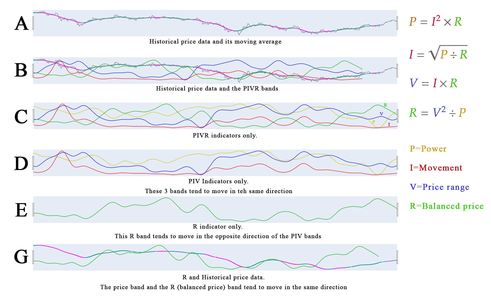

We assign the following concepts in the following manner:

**Voltage (V)**, which is the potential between the highest and lowest points of energy, is assigned to the difference between the *opening* and *closing* price for each 15 minute period, as this represents the price potential for that period.

**Current (I)** is the quantity of energy that is moving, which we assign here to the volume of trades that have taken place in that time period.

With these 2 values we can calculate the following:

**Resistance (R)** is calculated as R=V&div;I, and represents the theoretically ideal value, or price, of the asset. We refer to this value as the *Balanced Price*, but in reality, the actual agreed upon price is rarely this value, as you can see in in ***Row G*** which compares the *Balanced Price* (R) with he actual price.  What is interesting is while the *Balanced Price* is calculated, the actual price is the result of the resistance that exists between the seller wanting a higher price and the buyer wanting a lower price.

**Power (P)** is also calculated as R=V&times;I, but it is not clear what P represents, yet.

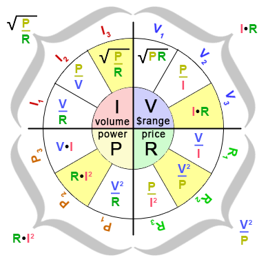In the above image on the right there is a legend that shows the formulas used to describe these values.  This requires a bit if explanation.  Each value of P, V, I, and R can be calculated using 3 different formulas with the remaining 3 values.  When we do this with electricity or matter, all 3 formulas for each value give the same result, as expected.  Here, however, they give slightly different results.  For example, calculating R~1~=V&div;I, R~2~=V^2^&div;P, and R~3~=P&div;I^2^, we’d expect all three values of R~1~, R~2~, and R~3~ to be the same, at least in the case of electricity, but here they are all slightly different.  However, when all three band values values are added together, they form the exact same pattern as that of R~3~=P&div;I^2^.  This is the same for all four formulas, and the formulas shown above are those that have the same pattern as the totals.  This is why we say the above formulas *describe* the values, and not calculate, because all 12 formulas can do the *calculations*, but only 4 formulas seem to *describe* them.

The issue here is that even though we should be using the R~3~ formula, we can’t because we do not have the values for P, as we only have the values V and I we can only use the R~1~ formula.  R~1~ and R~3~ are not the same, but they are very close (R~1~ light, R~2~ bold):

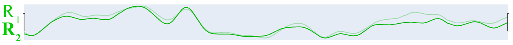

If we were to show all 3 R bands, it would look like:

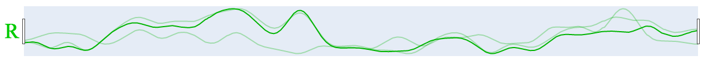

When these 3 bands are added together to form 1 new band,  we get a single band that, when normalized to the same scale as the single bands, is exactly the same as  scale that is exactly the same as the single band formed by I^2^/P.

Here are the other bands as well:

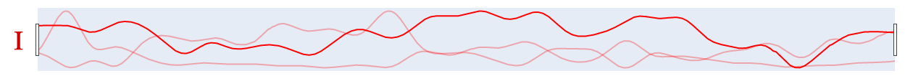

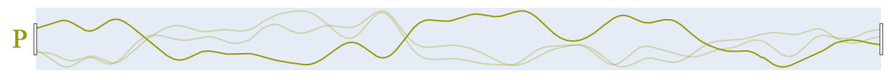

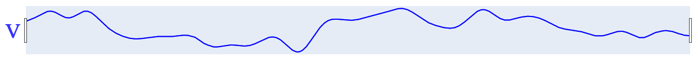

This last one is a surprise, because we are actually seeing all three bands, they just happen to be exactly the same for all the formulas!

Tholonically, this is very interesting because, if you remember, V is the N-source, and P is the result of the N-child.  If you look as P and V you will notice how similar they are:

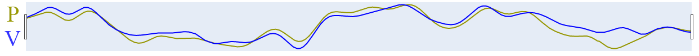

This would then suggest that I and R should be opposites, which they are:

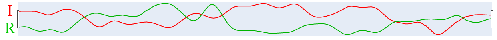

We might then expect to see the closing prices fluctuate in-between these two bands, but it seems pretty clear that the closing price follows the R line (below). 

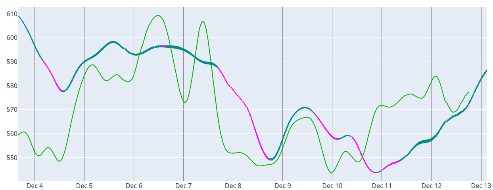

If we multiply them, we get V, as V=I&times;R, and if we look at the difference between them, we get something very close to R again:

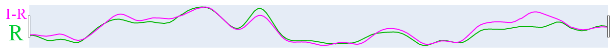

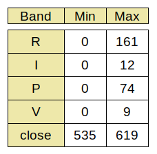In order to make these bands comparable, all the data of all the lines were normalized to the minimum and maximum of the closing prices, but the rise and fall of the values were still to extreme to properly compare.  To fix this, we took the n^th^ root of the number.  In these examples, n=8, and anything after 8 was pretty similar.  To understand the ranges for these lines, see the charts on the right.

The R band appears to be consistently predictive of the closing price, and I suspect that if we understood more about the other lines, we could build a pretty decent market indicator.

This model seems to work better for shorter windows, like 15 minutes,  that large windows, like 24 hours.